# 手机银行AI Agent 全架构文档

> 最后更新: 2026-05-24 | 基于代码commit `eec0ada`

---

## 目录

1. [系统总览](#1-系统总览)
2. [类继承体系](#2-类继承体系)
3. [数据结构](#3-数据结构)
4. [意图直达流程](#4-意图直达流程)
5. [意图接续流程](#5-意图接续流程)
6. [意图跳转流程](#6-意图跳转流程)
7. [意图恢复流程](#7-意图恢复流程)
8. [模糊识别/消歧流程](#8-模糊识别消歧流程)
9. [取消流程](#9-取消流程)
10. [状态管理与TTL](#10-状态管理与ttl)
11. [L2子Graph架构](#11-l2子graph架构)
12. [SAA Graph Resume机制缺陷与Workaround](#12-saa-graph-resume机制缺陷与workaround)
13. [Prompt模板体系](#13-prompt模板体系)
14. [Spring Bean配置](#14-spring-bean配置)
15. [已知限制与改进方向](#15-已知限制与改进方向)

---

## 1. 系统总览

### 1.1 三层架构

```
L0 (领域路由)  →  L1 (领域服务)  →  L2 (子智能体Graph)
DomainRouter      AbstractDomainService    AbstractGraphConfig
                  ├─ SingleSubAgent        ├─ TransferGraph
                  └─ MultiSubAgent         ├─ BillQueryGraph
                                          ├─ WealthConsultGraph
                                          └─ WealthInterpretGraph
```

| 层级 | 职责 | 输入 | 输出 |
|------|------|------|------|
| **L0** | 判断领域(WEALTH/TRANSFER/BILL/UNSUPPORTED/CHAT) | 用户原始输入 | 领域名 |
| **L1** | 领域内意图路由(FOLLOW_UP/SWITCH_NEW/RESUME) + 状态管理 | 用户输入 + 领域 | WorkflowOutput |
| **L2** | 参数提取 + 多轮提问 + 业务执行 | 改写后输入 + accumulatedParams | WorkflowOutput |

### 1.2 系统全图

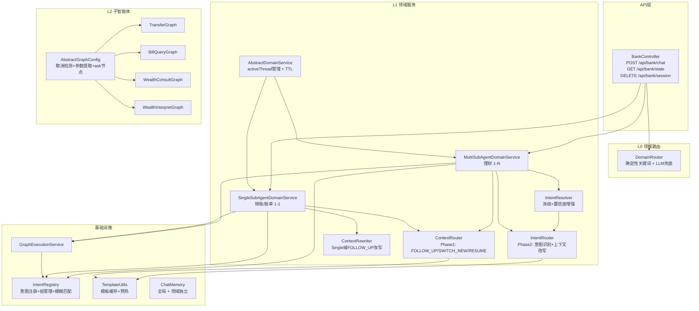

### 1.3 API端点

| 端点 | 方法 | 说明 |
|------|------|------|
| `/api/bank/chat?sessionId=xxx` | POST | 主对话入口，body: `{"message": "..."}` |
| `/api/bank/state?sessionId=xxx` | GET | 聚合各L1状态 |
| `/api/bank/session?sessionId=xxx` | DELETE | 清除所有L1状态+全局ChatMemory |

---

## 2. 类继承体系

### 2.1 L1领域服务类图

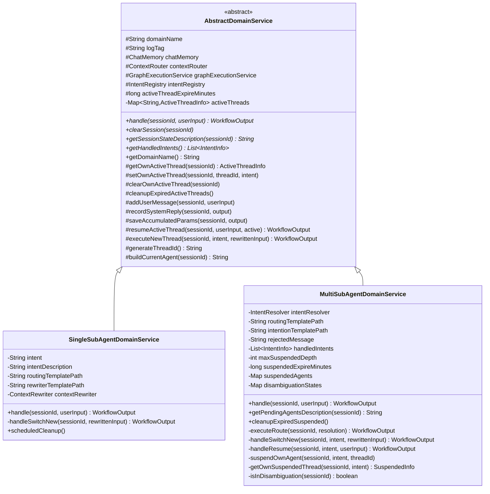

### 2.2 L2子Graph类图

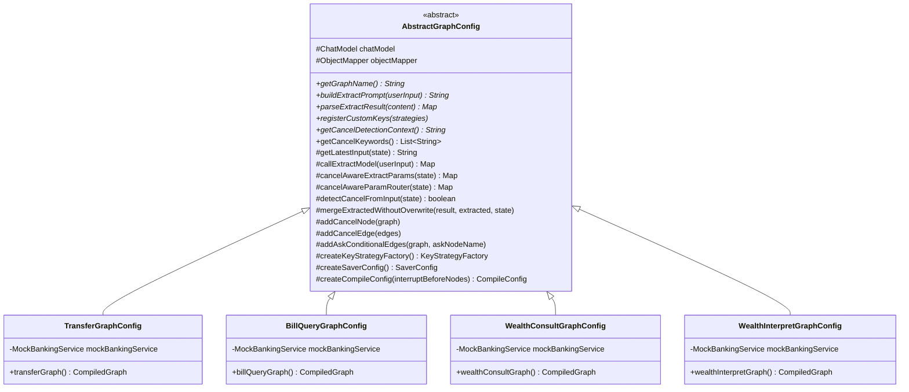

### 2.3 路由组件类图

```mermaid
classDiagram
    class DomainRouter {
        -ChatClient domainChatClient
        -ChatMemory chatMemory
        -Map~String,LastDomainEntry~ lastActiveDomains
        -long lastDomainExpireMinutes
        +route(sessionId, userInput) DomainResult
        +clearLastDomain(sessionId)
        +cleanupExpiredLastDomains()
    }

    class ContextRouter {
        -ChatClient chatClient
        -IntentRegistry intentRegistry
        +route(sessionId, userInput, currentAgent, pendingAgents, templatePath, domainName, chatMemory) RoutingResult
    }

    class IntentRouter {
        -ChatClient chatClient
        -IntentRegistry intentRegistry
        +rewriteAndIdentify(sessionId, userInput, phase1Result, currentAgent, pendingAgents, sessionState, disambigContext, templatePath, chatMemory) RoutingResult
    }

    class IntentResolver {
        -IntentRouter intentRouter
        -IntentRegistry intentRegistry
        -double disambiguationThreshold
        -double highConfidenceBypass
        +resolve(sessionId, userInput, phase1Result, chatMemory, inDisambiguation, disambiguationGroupId, hasSuspendedAgents, suspendedAgents, intentionTemplatePath) RoutingResolution
        -isCancelExpression(input) boolean
    }

    class ContextRewriter {
        -ChatClient chatClient
        +rewrite(sessionId, userInput, chatMemory, domainName, templatePath) String
    }

    class IntentRegistry {
        -Map~String,IntentConfig~ registry
        -Map~String,IntentGroup~ groups
        +init()
        +register(name, description, paramSchema, writeOp)
        +bindGraph(intentName, graph)
        +getGraph(intentName) CompiledGraph
        +fuzzyMatchIntent(intent, userInput) String
        +isGroupName(name) boolean
        +findGroupByIntent(intentName) IntentGroup
        +getIntentListDescription() String
    }

    class GraphExecutionService {
        -IntentRegistry intentRegistry
        +executeGraph(graph, intent, threadId, userInput, sessionId, accumulatedParams) WorkflowOutput
        +resumeGraph(intent, newThreadId, userInput, sessionId, accumulatedParams) WorkflowOutput
        +cancelGraph(intent, newThreadId, sessionId, accumulatedParams) WorkflowOutput
        +checkGraphResult(graph, config, intent, threadId, sessionId) WorkflowOutput
        +extractAccumulatedParams(intent, state) Map
    }
```

---

## 3. 数据结构

### 3.1 WorkflowOutput — Controller返回给前端的统一响应

```java
@Data @Builder
public class WorkflowOutput {
    WorkflowStatus status;           // COMPLETED / INTERRUPTED / DISAMBIGUATION / ERROR
    String content;                  // COMPLETED时的输出内容
    String question;                 // INTERRUPTED/DISAMBIGUATION时的提问
    String intent;                   // 当前意图
    String threadId;                 // 线程ID
    String errorMessage;             // ERROR时的错误信息
    List<String> candidateIntents;   // DISAMBIGUATION时的候选意图
    Map<String, Object> accumulatedParams; // 从Graph state提取的已收集参数
}
```

### 3.2 WorkflowStatus — 执行状态枚举

```java
public enum WorkflowStatus {
    COMPLETED("COMPLETED"),       // 操作完成
    INTERRUPTED("INTERRUPTED"),   // 需要用户补充参数
    DISAMBIGUATION("DISAMBIGUATION"), // 意图消歧
    ERROR("ERROR");               // 错误

    @JsonValue  // JSON序列化仍输出字符串，保持API兼容
    public String getValue() { return value; }
}
```

### 3.3 RoutingResult — LLM路由结果

```java
@Data @Builder
public class RoutingResult {
    String routeType;           // Phase1: FOLLOW_UP / SWITCH_NEW / RESUME
    String rewrittenInput;      // Phase2: 改写后的输入
    String intentName;          // Phase2: 识别的意图
    String refinedRouteType;    // Phase2: 细化路由类型 SWITCH_NEW/RESUME
    String resumeTarget;        // RESUME时的恢复目标
    List<String> candidateIntents; // 消歧候选
    String groupId;             // 歧义组ID
    boolean ambiguous;          // 是否歧义
    double confidence;          // 置信度 0.0~1.0
    String reasoning;           // 判断理由
}
```

### 3.4 RoutingResolution — IntentResolver返回的最终决议

```java
@Data @Builder
public class RoutingResolution {
    RoutingStatus status;       // RESOLVED / DISAMBIGUATION / REJECTED / CANCELLED
    String intentName;          // RESOLVED时
    String rewrittenInput;      // RESOLVED时
    String routeType;           // RESOLVED时: SWITCH_NEW/RESUME
    String question;            // DISAMBIGUATION时
    List<String> candidateIntents; // DISAMBIGUATION时
}
```

### 3.5 ActiveThreadInfo — 活跃线程信息

```java
@Data
public static class ActiveThreadInfo {
    String threadId;            // 当前线程ID
    String intent;              // 当前意图(TRANSFER/BILL_QUERY/WEALTH_CONSULT等)
    Instant createdAt;          // 创建时间
    Instant expiresAt;          // 过期时间(20分钟TTL)
    Map<String, Object> accumulatedParams; // 累积参数(如transfer.receiver)
}
```

### 3.6 SuspendedInfo — 挂起意图信息（仅Multi）

```java
@Data
public static class SuspendedInfo {
    String threadId;            // 挂起时的线程ID
    String intent;              // 挂起的意图名
    Instant suspendedAt;        // 挂起时间
    Instant expiresAt;          // 过期时间(20分钟TTL)
    Map<String, Object> accumulatedParams; // 从activeThread继承的参数
}
```

### 3.7 DisambiguationState — 消歧状态（仅Multi）

```java
@Data
public static class DisambiguationState {
    String groupId;   // 歧义组ID(如"WEALTH")
}
```

### 3.8 IntentRegistry数据

```java
// 已注册意图
TRANSFER:       "转账给他人"    参数: 收款人名称, 转账金额, 用途(可选)  writeOp=true
BILL_QUERY:     "查询账单明细"  参数: 时间范围, 收支类型                  writeOp=false
WEALTH_CONSULT: "理财咨询/推荐" 参数: 风险偏好(激进/稳健/保守)          writeOp=false
WEALTH_INTERPRET: "理财产品解读" 参数: 理财产品名称                     writeOp=false

// 意图组(需消歧)
WEALTH → [WEALTH_CONSULT, WEALTH_INTERPRET]
         追问: "请问您需要理财咨询还是理财产品解读？"
```

---

## 4. 意图直达流程

**场景**: 用户说"我想转账" → 从零开始进入转账流程

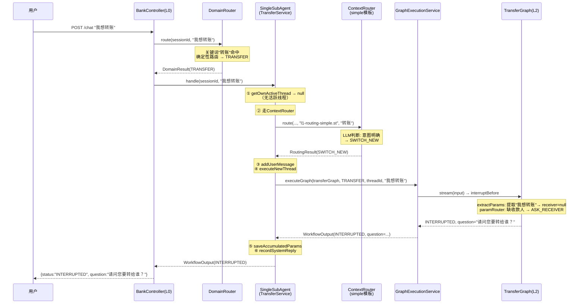

**关键代码 — SingleSubAgentDomainService.handle()**:

```java
public WorkflowOutput handle(String sessionId, String userInput) {
    // 核心逻辑: activeThread在 → 直接FOLLOW_UP，不走ContextRouter
    ActiveThreadInfo ownActive = getOwnActiveThread(sessionId);
    if (ownActive != null) {
        return resumeActiveThread(sessionId, userInput, ownActive);
    }
    // 无activeThread → 走ContextRouter判断
    RoutingResult phase1 = contextRouter.route(..., routingTemplatePath, ...);
    if (phase1.isFollowUp()) {
        // FOLLOW_UP但无activeThread → 改写后降级SWITCH_NEW
        String rewrittenInput = contextRewriter.rewrite(...);
        return handleSwitchNew(sessionId, rewrittenInput);
    }
    return handleSwitchNew(sessionId, userInput);
}
```

---

## 5. 意图接续流程

### 5.1 Single域: activeThread在 → 直接resume（跳过ContextRouter）

**场景**: 用户已进入转账流程（问过收款人），继续回答"张三"

**核心设计**: 1-1域只有1个子意图，activeThread在=用户一定在继续。跳过ContextRouter避免LLM非确定性误判。

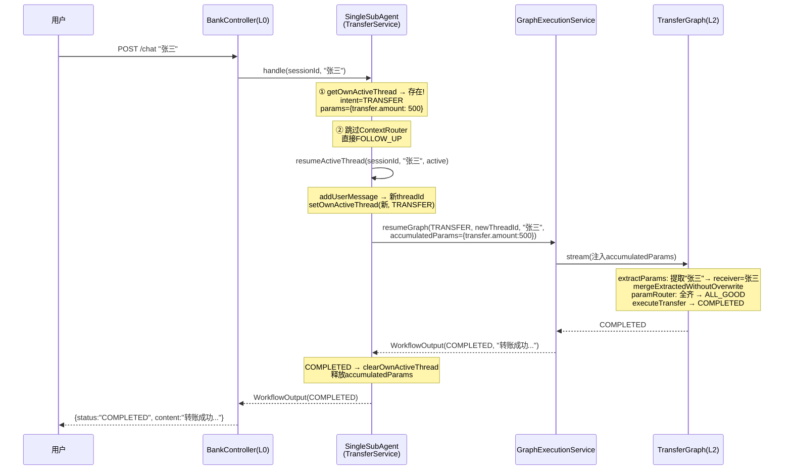

**关键代码 — resumeActiveThread()**:

```java
protected WorkflowOutput resumeActiveThread(String sessionId, String userInput, ActiveThreadInfo active) {
    addUserMessage(sessionId, userInput);
    String newThreadId = generateThreadId();
    setOwnActiveThread(sessionId, newThreadId, active.getIntent()); // TTL刷新！
    
    WorkflowOutput resumeResult = graphExecutionService.resumeGraph(
            active.getIntent(), newThreadId, userInput, sessionId,
            active.getAccumulatedParams());  // 注入已收集参数
    saveAccumulatedParams(sessionId, resumeResult);
    recordSystemReply(sessionId, resumeResult);
    
    // 完成后清空，避免下次复用旧参数
    if (WorkflowStatus.COMPLETED.equals(resumeResult.getStatus())) {
        clearOwnActiveThread(sessionId);
    }
    return resumeResult;
}
```

### 5.2 Multi域: activeThread在 + 非消歧 → ContextRouter → FOLLOW_UP → resume

**场景**: 用户在理财推荐中（问了风险偏好），回答"稳健"

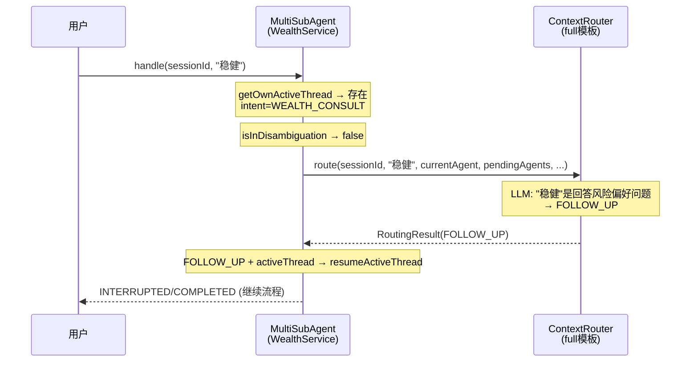

**为什么Multi不跳过ContextRouter？** 因为Multi域有多个子意图。用户可能在对话推荐时说"帮我解读一下朝朝盈"——这是同域内切换子意图，需要ContextRouter判断是FOLLOW_UP还是SWITCH_NEW。跳过会导致用户意图被错误地当作继续推荐。

---

## 6. 意图跳转流程

### 6.1 Single域: SWITCH_NEW

**场景**: 用户在转账流程中，突然说"查账单"

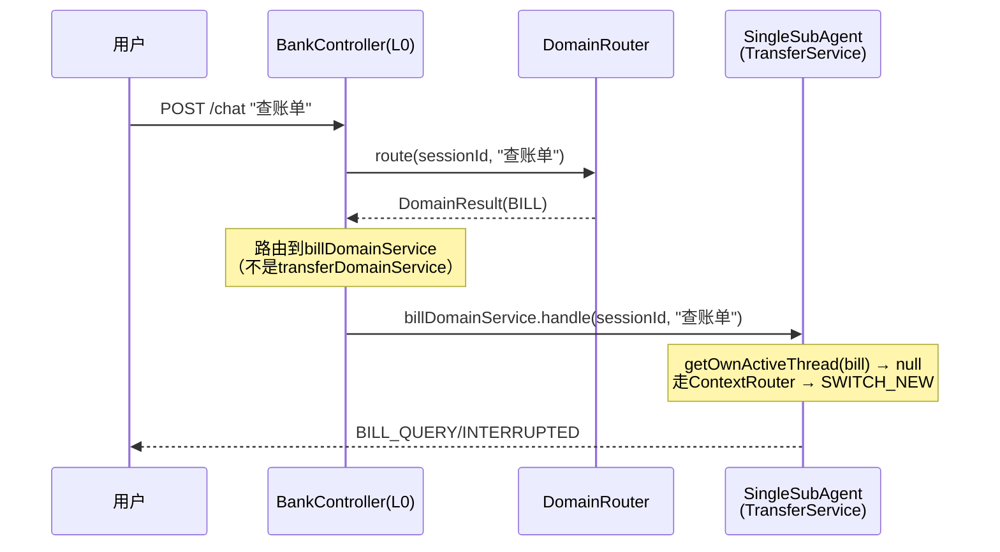

**注意**: Single域的SWITCH_NEW不需要suspend——因为L0已经路由到了不同的L1 Service。转账Service的activeThread不受影响。

### 6.2 Multi域: SWITCH_NEW（含suspend）

**场景**: 用户在理财推荐中（WEALTH_CONSULT/INTERRUPTED），说"帮我解读朝朝盈"

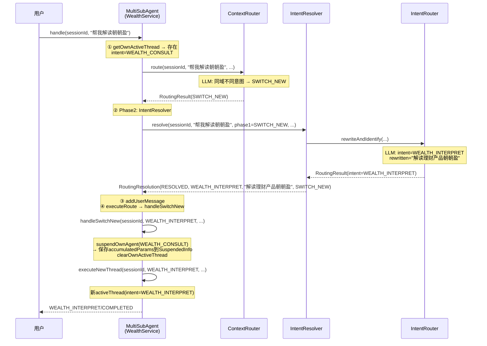

**关键代码 — suspendOwnAgent()**:

```java
private void suspendOwnAgent(String sessionId, String intent, String threadId) {
    Map<String, SuspendedInfo> sessionMap = suspendedAgents.computeIfAbsent(sessionId, k -> new ConcurrentHashMap<>());
    
    // 深度限制: 超过maxSuspendedDepth(3) → 驱逐最老的
    if (sessionMap.size() >= maxSuspendedDepth) {
        String oldestKey = sessionMap.entrySet().stream()
                .min(Comparator.comparing(e -> e.getValue().getSuspendedAt()))
                .map(Map.Entry::getKey).orElse(null);
        if (oldestKey != null) sessionMap.remove(oldestKey);
    }
    
    // 创建SuspendedInfo，继承activeThread的累积参数
    SuspendedInfo info = new SuspendedInfo(threadId, intent, Instant.now(),
            Instant.now().plusSeconds(suspendedExpireMinutes * 60));
    ActiveThreadInfo active = getOwnActiveThread(sessionId);
    if (active != null && active.getIntent().equals(intent)) {
        info.setAccumulatedParams(active.getAccumulatedParams());
    }
    sessionMap.put(intent, info);
}
```

---

## 7. 意图恢复流程

**仅Multi域**。用户说"回到刚才的推荐"恢复挂起的意图。

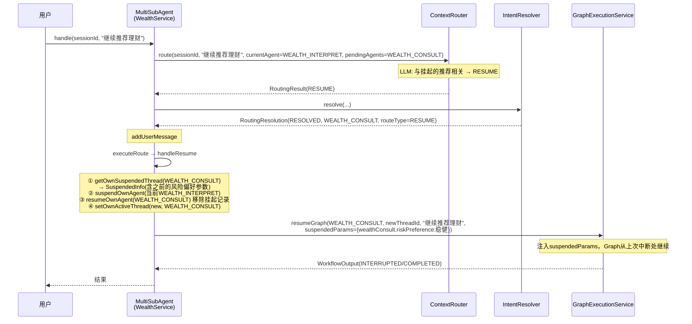

**自动升级**: 如果ContextRouter判断SWITCH_NEW，但IntentResolver识别的意图已在suspendedAgents中，自动升级为RESUME：

```java
private WorkflowOutput executeRoute(String sessionId, RoutingResolution resolution) {
    // 防御: 意图已suspended但路由判了SWITCH_NEW → 自动升级为RESUME
    if (!"RESUME".equals(resolution.getRouteType())
            && getOwnSuspendedThread(sessionId, resolution.getIntentName()) != null) {
        return handleResume(sessionId, resolution.getIntentName(), resolution.getRewrittenInput());
    }
    return switch (resolution.getRouteType()) {
        case "RESUME" -> handleResume(...);
        default -> handleSwitchNew(...);
    };
}
```

---

## 8. 模糊识别/消歧流程

### 8.1 触发条件

当用户输入匹配到**意图组**（如"理财"匹配WEALTH组）但无法区分具体意图时触发。

### 8.2 完整流程

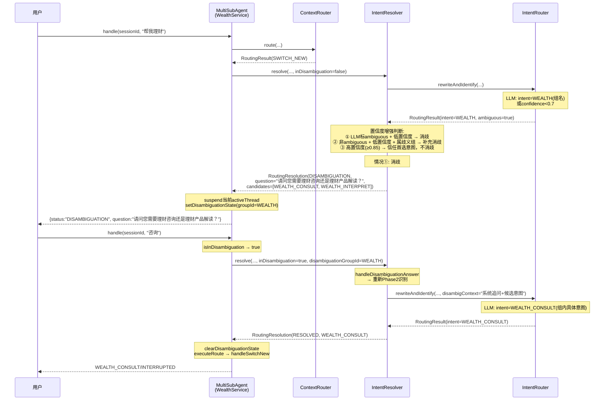

### 8.3 消歧中的取消

```java
// IntentResolver.isCancelExpression() — 消歧中取消检测
private boolean isCancelExpression(String input) {
    String trimmed = input.trim();
    return trimmed.matches("^(取消|算了|不要了|不了|放弃)[\\s，。！？、；]*$");
}
// 匹配 → RoutingResolution.CANCELLED → MultiSubAgent.handle()中clearDisambiguationState
```

### 8.4 置信度阈值配置

| 参数 | 默认值 | 说明 |
|------|--------|------|
| `disambiguationThreshold` | 0.7 | confidence低于此值且意图属于歧义组 → 补充消歧 |
| `highConfidenceBypass` | 0.85 | confidence高于此值时，即使LLM标ambiguous也信任首选意图 |

---

## 9. 取消流程

### 9.1 路径一: 子智能体执行中的取消

**场景**: 转账流程中（问过收款人），用户说"算了不转了"

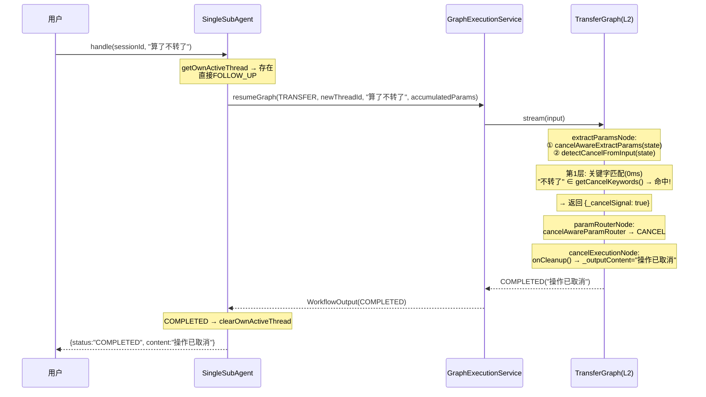

**取消检测分层策略**:

```
第1层: 关键字匹配 (0ms)
  通用: "取消", "算了", "不要了", "放弃", "不了"
  Transfer特有: "不转了", "别转了", "取消转账", "不想转了", "不用转了"
  
第2层: LLM判断 (200-500ms)  — 关键字未命中时
  prompt含: 当前场景 + 用户输入 + 判断标准
  输出: {"cancel": true/false}
  
  不是取消: "先看看账单"(先做别的事), "不是"(否定回答), "查账单"(意图切换)
```

### 9.2 路径二: 消歧中的取消

**场景**: 消歧追问时，用户说"算了"

```
用户说"算了" → IntentResolver.isCancelExpression() 命中
→ RoutingResolution.CANCELLED
→ MultiSubAgentDomainService.handle()的switch分支:
  case CANCELLED -> {
      clearDisambiguationState(sessionId);
      yield WorkflowOutput.completed(null, "好的,已取消当前操作。还有什么可以帮您的吗？");
  }
```

### 9.3 取消的完整代码路径

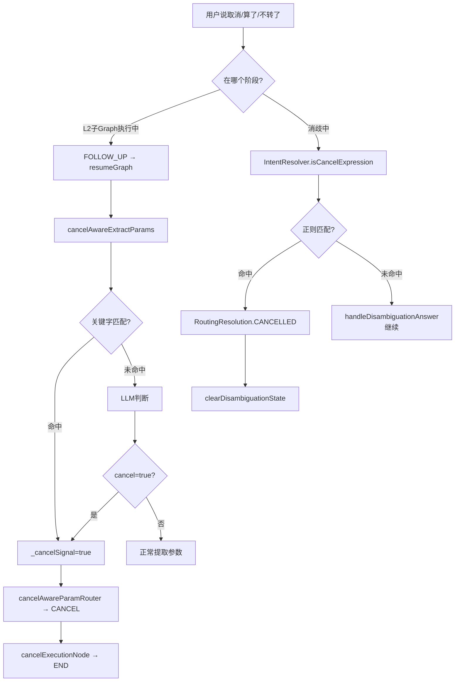

---

## 10. 状态管理与TTL

### 10.1 状态存储全景

```mermaid
graph TB
    subgraph L0["L0 (DomainRouter)"]
        LAD[lastActiveDomains<br/>Map sessionId→LastDomainEntry<br/>TTL: 5分钟]
    end
    
    subgraph L1_Single["L1 Single (TransferService)"]
        AT_T[activeThreads<br/>Map sessionId→ActiveThreadInfo<br/>TTL: 20分钟]
    end
    
    subgraph L1_Single2["L1 Single (BillService)"]
        AT_B[activeThreads<br/>Map sessionId→ActiveThreadInfo<br/>TTL: 20分钟]
    end
    
    subgraph L1_Multi["L1 Multi (WealthService)"]
        AT_W[activeThreads<br/>Map sessionId→ActiveThreadInfo<br/>TTL: 20分钟]
        SA[suspendedAgents<br/>Map sessionId→Map intent→SuspendedInfo<br/>TTL: 20分钟]
        DS[disambiguationStates<br/>Map sessionId→DisambiguationState<br/>无TTL,短生命周期]
    end
    
    subgraph Global["全局"]
        GCM[ChatMemory(全局)<br/>无TTL,clear时清除]
    end
```

### 10.2 TTL机制详解

| 状态 | 存储位置 | TTL | 过期行为 | 刷新时机 |
|------|---------|-----|---------|---------|
| **activeThread** | 各L1 Service | 20分钟 | getOwnActiveThread()返回null,视为无活跃线程 | FOLLOW_UP时setOwnActiveThread()创建新info |
| **suspendedAgent** | Multi L1 | 20分钟 | getOwnSuspendedThread()返回null,降级为SWITCH_NEW | — (不刷新,挂起就是挂起) |
| **lastActiveDomain** | DomainRouter | 5分钟 | getLastDomain()返回null | 每次路由到非CHAT/UNSUPPORTED时更新 |
| **disambiguationState** | Multi L1 | 无 | — | — (消歧1次追问后自动清除) |

### 10.3 Lazy过期检查 + 定时清理（双重保障）

**Lazy过期**: 每次读取时检查，过期立即删除并返回null

```java
// ActiveThreadInfo的lazy过期 (AbstractDomainService)
protected ActiveThreadInfo getOwnActiveThread(String sessionId) {
    ActiveThreadInfo info = activeThreads.get(sessionId);
    if (info != null && info.getExpiresAt().isBefore(Instant.now())) {
        activeThreads.remove(sessionId);
        return null;  // 过期 → 视为无活跃线程
    }
    return info;
}

// SuspendedInfo的lazy过期 (MultiSubAgentDomainService)
private SuspendedInfo getOwnSuspendedThread(String sessionId, String intent) {
    SuspendedInfo info = sessionMap.get(intent);
    if (info != null && info.getExpiresAt().isBefore(Instant.now())) {
        sessionMap.remove(intent);
        return null;  // 过期 → 视为无挂起记录
    }
    return info;
}

// lastActiveDomain的lazy过期 (DomainRouter)
private String getLastDomain(String sessionId) {
    LastDomainEntry entry = lastActiveDomains.get(sessionId);
    if (entry == null) return null;
    if (entry.setAt().plusSeconds(lastDomainExpireMinutes * 60).isBefore(Instant.now())) {
        lastActiveDomains.remove(sessionId);
        return null;
    }
    return entry.domain();
}
```

**定时清理**: `@Scheduled(fixedRate=60_000)` 每分钟扫描清除过期条目（防止泄漏）

| 组件 | 方法 | 清理对象 |
|------|------|---------|
| SingleSubAgentDomainService | `scheduledCleanup()` | activeThreads |
| MultiSubAgentDomainService | `cleanupExpiredSuspended()` | suspendedAgents + activeThreads |
| DomainRouter | `cleanupExpiredLastDomains()` | lastActiveDomains |

### 10.4 activeThread TTL刷新机制

FOLLOW_UP时，`resumeActiveThread()`调用`setOwnActiveThread()`，创建**全新的ActiveThreadInfo**，`expiresAt`从当前时间重新计算：

```java
protected void setOwnActiveThread(String sessionId, String threadId, String intent) {
    Instant now = Instant.now();
    Instant expiresAt = now.plusSeconds(activeThreadExpireMinutes * 60); // 重新计算
    activeThreads.put(sessionId, new ActiveThreadInfo(threadId, intent, now, expiresAt));
}
```

**设计理由**: 用户持续交互=活跃会话，TTL从**最后一次交互**开始算，不是从第一次创建开始算。如果用户离开超过20分钟再回来，activeThread已过期清空，用户重新开始输入（不会带着忘记的旧参数）。

---

## 11. L2子Graph架构

### 11.1 TransferGraph流程图

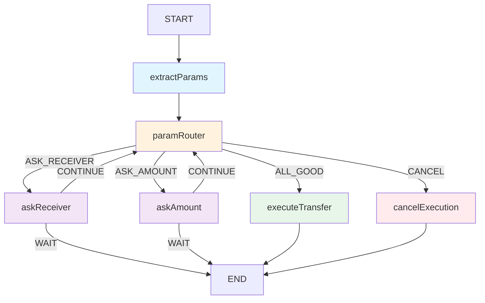

**interruptBefore机制**: `createCompileConfig("askReceiver", "askAmount")` 使graph在执行到askReceiver/askAmount前暂停，控制权返回L1。L1收到INTERRUPTED结果，将question返回给用户。下次用户输入时，L1通过`resumeActiveThread()`注入accumulatedParams重新执行graph。

### 11.2 Graph执行模式

```
executeGraph:  新线程，无accumulatedParams → 全新开始
resumeGraph:   新线程，注入accumulatedParams → 跳过已满足参数
cancelGraph:   新线程，注入_cancelSignal → 子Graph检测后取消
```

**注意**: resumeGraph不使用SAA的resume()机制，而是每次都重新执行graph。原因：interruptBefore在resume后不会重新触发，导致多轮提问失败。

### 11.3 accumulatedParams提取

GraphExecutionService按意图前缀从state中提取：

```java
public Map<String, Object> extractAccumulatedParams(String intent, OverAllState state) {
    String prefix = switch (intent) {
        case "TRANSFER"        -> "transfer.";
        case "BILL_QUERY"      -> "bill.";
        case "WEALTH_CONSULT"  -> "wealthConsult.";
        case "WEALTH_INTERPRET" -> "wealthInterpret.";
        default -> "";
    };
    // 提取所有以prefix开头的非空值
}
```

### 11.4 KeyStrategy

| Key | Strategy | 说明 |
|-----|----------|------|
| messages | AppendStrategy | 消息追加 |
| _latestUserInput | ReplaceStrategy | 最新输入覆盖 |
| _question | ReplaceStrategy | 当前问题覆盖 |
| _paramName | ReplaceStrategy | 路由参数覆盖 |
| _outputContent | ReplaceStrategy | 输出覆盖 |
| _cancelSignal | ReplaceStrategy | 取消信号覆盖 |
| transfer.* / bill.* / wealth*.* | ReplaceStrategy | 业务参数覆盖 |

### 11.5 mergeExtractedWithoutOverwrite

Resume场景下的关键保护：LLM重新提取参数时，不会用null/空值覆盖state中已有的非空参数。

```java
// 已有值 + 新值非空 → 允许更新（用户可以改参数）
// 已有值 + 新值null → 保留已有（LLM未提取不代表参数消失）
// 无已有值 + 新值非空 → 写入
// 无已有值 + 新值null → 不写
```

---

## 12. SAA Graph Resume机制缺陷与Workaround

### 12.1 问题背景

spring-ai-alibaba-graph (v1.1.2.0) 的 `CompiledGraph` 没有提供可靠的 resume 机制。当 Graph 因 `interruptBefore` 暂停后，无法从暂停点恢复执行并保留 OverAllState。

### 12.2 根因分析（基于反编译源码）

**问题1: `stream()` 始终创建全新 OverAllState**

```java
// CompiledGraph.java (SAA源码)
public Flux<NodeOutput> stream(Map<String, Object> inputs, RunnableConfig config) {
    return this.streamFromInitialNode(this.stateCreate(inputs), config);  // ← 总是新state
}

private OverAllState stateCreate(Map<String, Object> inputs) {
    // 完全忽略checkpoint，从零构建
    return OverAllStateBuilder.builder()
            .withKeyStrategies(this.getKeyStrategyMap())
            .withData(inputs)
            .build();
}
```

虽然 `getInitialState()` 方法**存在**且能从 checkpoint 恢复状态：

```java
// 这个方法存在但 stream() 不调用它!
public Map<String, Object> getInitialState(Map<String, Object> inputs, RunnableConfig config) {
    return this.compileConfig.checkpointSaver().flatMap(saver -> saver.get(config))
            .map(cp -> OverAllState.updateState(cp.getState(), inputs, this.keyStrategyMap))
            .orElseGet(() -> OverAllState.updateState(new HashMap<>(), inputs, this.keyStrategyMap));
}
```

**问题2: `interruptedNodes` 在新 RunnableConfig 中丢失**

```java
// RunnableConfig.java (SAA源码)
private RunnableConfig(Builder builder) {
    this.interruptedNodes = new ConcurrentHashMap<>();  // ← 永远是空map
}

// isInterrupted() 永远返回 false (因为是空map)
public boolean isInterrupted(String nodeId) {
    return this.interruptData(formatNodeId(nodeId))
            .map(value -> Boolean.TRUE.equals(value)).orElse(false);
}
```

中断信息只在**同一次执行**内通过 `markNodeAsInterrupted()` 写入，执行结束后 `RunnableConfig` 被丢弃，下次调用无法获知哪些节点曾被中断。

**问题3: `withResume()` 是个空壳**

```java
// RunnableConfig.java (SAA源码)
public RunnableConfig withResume() {
    // 只在metadata加了个placeholder，没有实际恢复逻辑
    return builder(this).addMetadata(HUMAN_FEEDBACK_METADATA_KEY, "placeholder").build();
}
```

**问题4: interruptBefore 的触发条件依赖 `previousNodeId`**

```java
// CompiledGraph.java (SAA源码)
private boolean shouldInterruptBefore(String nodeId, String previousNodeId) {
    if (previousNodeId == null) {
        return false;  // ← 首节点永远不中断
    }
    return this.compileConfig.interruptsBefore().contains(nodeId);
}
```

即使能恢复状态，Graph 执行总是从 START 节点开始，`previousNodeId` 一路传递。但如果因为某种跳转直接到达被中断的节点，`previousNodeId` 的值可能不符合预期。

### 12.3 影响链

```
interruptBefore暂停 → Graph执行结束 → Checkpoint已保存但stream()不读取
                                          ↓
用户FOLLOW_UP → 新stream()调用 → 全新OverAllState → 之前参数全丢
                                          ↓
                              paramRouter看不到已有参数 → 重新问所有问题
```

### 12.4 当前Workaround: 重新执行 + 注入accumulatedParams

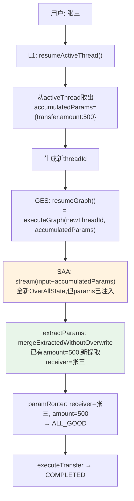

**核心思路**: 不依赖 SAA 的 checkpoint/resume，而是由 L1 自管 accumulatedParams，每次 FOLLOW_UP 都从 START 重新执行 Graph，但注入已收集的参数，让 paramRouter 跳过已满足的参数直接路由到缺失的 ask 节点。

```java
// GraphExecutionService.resumeGraph() — 实际是重新执行
public WorkflowOutput resumeGraph(String intent, String newThreadId, String userInput,
                                  String sessionId, Map<String, Object> accumulatedParams) {
    CompiledGraph graph = intentRegistry.getGraph(intent);
    // 不是SAA的resume()，而是全新的executeGraph，注入accumulatedParams
    return executeGraph(graph, intent, newThreadId, userInput, sessionId, accumulatedParams);
}

// executeGraph 将 accumulatedParams 注入到 input map
public WorkflowOutput executeGraph(CompiledGraph graph, String intent, String threadId,
                                   String userInput, String sessionId,
                                   Map<String, Object> accumulatedParams) {
    Map<String, Object> input = new HashMap<>();
    input.put("messages", userInput);
    input.put("_latestUserInput", userInput);
    if (accumulatedParams != null && !accumulatedParams.isEmpty()) {
        input.putAll(accumulatedParams);  // ← 关键: 注入已有参数
    }
    graph.stream(input, config).blockLast();
    return checkGraphResult(graph, config, intent, threadId, sessionId);
}
```

**Graph内部的保护 — mergeExtractedWithoutOverwrite()**:

```java
// AbstractGraphConfig — 防止LLM重新提取时覆盖已有参数
protected void mergeExtractedWithoutOverwrite(Map<String, Object> result,
                                               Map<String, Object> extracted,
                                               OverAllState state) {
    for (Map.Entry<String, Object> entry : extracted.entrySet()) {
        Object existingValue = state.value(entry.getKey()).orElse(null);
        boolean hasExisting = existingValue != null && !existingValue.toString().isEmpty();
        if (hasExisting) {
            // 已有值: 新值非空才覆盖(允许用户更新参数)，否则保留
            if (entry.getValue() != null && !entry.getValue().toString().isEmpty()) {
                result.put(entry.getKey(), entry.getValue());
            }
        } else {
            // 无已有值: 新值非空才写入
            if (entry.getValue() != null && !entry.getValue().toString().isEmpty()) {
                result.put(entry.getKey(), entry.getValue());
            }
        }
    }
}
```

### 12.5 Workaround的代价与局限

| 方面 | 影响 |
|------|------|
| **性能** | 每次FOLLOW_UP都从START重新执行Graph，extractParams LLM调用重复，增加200-500ms延迟 |
| **LLM成本** | 每次FOLLOW_UP多一次参数提取LLM调用（正常resume不需要） |
| **可靠性** | ✅ 不依赖SAA checkpoint，L1自管状态更可控 |
| **状态一致性** | ✅ accumulatedParams是唯一source of truth，不存在SAA state与L1 state不一致的问题 |
| **复杂Graph** | ⚠️ 如果Graph有side-effect节点(如发短信、写数据库)，重新执行会导致重复执行。当前4个子Graph的side-effect节点(executeXxx)只在ALL_GOOD时触发，但需要业务开发者注意 |

### 12.6 长期解决方案

**方案A: 修复SAA的stream()使其自动恢复checkpoint** (需要改SAA源码)

```java
// 修改 CompiledGraph.stream()
public Flux<NodeOutput> stream(Map<String, Object> inputs, RunnableConfig config) {
    Map<String, Object> initialState = this.getInitialState(inputs, config);  // ← 用checkpoint恢复
    return this.streamFromInitialNode(this.stateCreate(initialState), config);
}
```

同时需要让 `GraphRunnerContext` 从 checkpoint 恢复 `interruptedNodes` 和 `nextNode`，使 interruptBefore 在恢复后能正确工作。

**方案B: 在应用层包装resume，使用updateState + nextNode** (不改SAA)

```java
// 利用SAA已有的updateState和nextNode机制
public WorkflowOutput properResume(CompiledGraph graph, String threadId, 
                                   String userInput, Map<String, Object> newParams) {
    RunnableConfig config = RunnableConfig.builder().threadId(threadId).build();
    
    // 1. 更新state (合并新参数到checkpoint state)
    RunnableConfig updatedConfig = graph.updateState(config, newParams);
    
    // 2. 用nextNode跳过已执行的节点
    // updatedConfig.nextNode() 指向中断后的下一个节点
    // 但stream()仍从START执行...需要interruptBeforeEdge配合
    
    // 3. 问题: stream()仍忽略checkpoint
    // 结论: 此方案在当前SAA版本不可行
}
```

**方案C: 维护独立的状态层，SAA只做无状态执行** (当前方案的正式化)

```
L1 = state owner (accumulatedParams, activeThread, suspendedAgent)
SAA Graph = stateless executor (每次从START执行, L1注入参数)
Checkpoint = 只用于graph内部的interruptBefore暂停(单次执行内), 不跨执行
```

当前代码实际上已经在做方案C。建议将其正式化：
1. 明确文档约定：L2 Graph的side-effect节点只能在ALL_GOOD/最终执行路径上
2. 考虑给extractParams增加cache：如果accumulatedParams已包含所有必要参数，跳过LLM提取
3. 等SAA修复resume机制后再迁移

---

## 13. Prompt模板体系

### 12.1 模板列表

| 模板 | 使用者 | 用途 | 占位符 |
|------|--------|------|--------|
| `l0-domain.st` | DomainRouter | L0领域路由 | {message}, {chat_history}, {last_domain_context} |
| `l1-routing-simple.st` | ContextRouter(Single) | Phase1: FOLLOW_UP/SWITCH_NEW | {intent_list}, {message}, {current_agent}, {pending_agents}, {session_state}, {chat_history}, {domain_name} |
| `l1-routing.st` | ContextRouter(Multi) | Phase1: FOLLOW_UP/SWITCH_NEW/RESUME | 同上(无domain_name) |
| `l1-intention.st` | IntentRouter | Phase2: 意图识别+改写 | {intent_list}, {message}, {mode}, {intent_name}, {pending_agents}, {session_state}, {disambig_context}, {chat_history} |
| `l1-context-rewrite.st` | ContextRewriter | Single域FOLLOW_UP改写 | {domain_name}, {chat_history}, {message} |
| `planning-agent.st` | (预留) | 规划Agent | — |
| L2提取prompt | 各GraphConfig | 参数提取 | 子类自定义 |

### 12.2 模板缓存机制

```java
// TemplateUtils: 构造时warmUp，运行时零IO
TemplateUtils.warmUp(routingPath, () -> "");   // Builder.build()中调用
TemplateUtils.warmUp(intentionPath, () -> "");
// 运行时: TemplateUtils.loadTemplate(path, fallbackSupplier)
```

---

## 14. Spring Bean配置

### 13.1 Bean依赖关系

```mermaid
graph LR
    subgraph Config
        DSC[DomainServiceConfig]
        TGC[TransferGraphConfig]
        BGC[BillQueryGraphConfig]
        WCG[WealthConsultGraphConfig]
        WIG[WealthInterpretGraphConfig]
        MC[ModelConfig]
    end
    
    subgraph Controller
        BC[BankController]
    end
    
    subgraph Router
        DR[DomainRouter @Component]
        CR[ContextRouter @Service]
        IR[IntentRouter @Service]
        IRes[IntentResolver @Service]
        IReg[IntentRegistry @Component]
    end
    
    subgraph Service
        CW[ContextRewriter @Service]
        GES[GraphExecutionService @Service]
    end
    
    MC --> |ChatClient| DR & CR & IR & CW
    DSC --> |@Bean| TDS[transferDomainService]
    DSC --> |@Bean| BDS[billDomainService]
    DSC --> |@Bean| WDS[wealthDomainService]
    
    TGC --> |@Bean transferGraph| IReg
    BGC --> |@Bean billQueryGraph| IReg
    WCG --> |@Bean wealthConsultGraph| IReg
    WIG --> |@Bean wealthInterpretGraph| IReg
    
    BC --> |@Qualifier| TDS & BDS & WDS
    BC --> DR
```

### 13.2 ChatMemory隔离

| Bean名 | 使用者 | 用途 |
|--------|--------|------|
| (默认) | BankController + DomainRouter | 全局对话历史 |
| transferChatMemory | TransferService | 转账域对话历史 |
| billChatMemory | BillService | 账单域对话历史 |
| wealthChatMemory | WealthService | 理财域对话历史 |

### 13.3 ChatClient隔离

| Bean名 | 使用者 | 用途 |
|--------|--------|------|
| domainChatClient | DomainRouter | L0领域路由LLM |
| contextChatClient | ContextRouter | Phase1路由类型判断 |
| intentChatClient | IntentRouter + ContextRewriter | Phase2意图识别 + 改写 |

### 13.4 DomainServiceConfig示例

```java
@Configuration
public class DomainServiceConfig {
    @Bean("transferDomainService")
    public SingleSubAgentDomainService transferDomainService(...) {
        return SingleSubAgentDomainService.builder()
                .domainName("转账").logTag("TransferService")
                .intent("TRANSFER").intentDescription("转账操作")
                .chatMemory(transferChatMemory)
                .contextRouter(contextRouter).contextRewriter(contextRewriter)
                .graphExecutionService(graphExecutionService).intentRegistry(intentRegistry)
                .activeThreadExpireMinutes(20)
                .build();
    }
    
    @Bean("wealthDomainService")
    public MultiSubAgentDomainService wealthDomainService(...) {
        return MultiSubAgentDomainService.builder()
                .domainName("理财").logTag("WealthService")
                .chatMemory(wealthChatMemory)
                .contextRouter(contextRouter).intentResolver(intentResolver)
                .graphExecutionService(graphExecutionService).intentRegistry(intentRegistry)
                .routingTemplatePath("prompts/l1-routing.st")
                .intentionTemplatePath("prompts/l1-intention.st")
                .rejectedMessage("该理财功能暂不支持，目前仅支持理财咨询和理财产品解读")
                .handledIntents(List.of(
                    new IntentInfo("WEALTH_CONSULT", "理财咨询与推荐"),
                    new IntentInfo("WEALTH_INTERPRET", "理财产品解读")))
                .maxSuspendedDepth(3)
                .suspendedExpireMinutes(20)
                .activeThreadExpireMinutes(20)
                .build();
    }
}
```

---

## 15. 已知限制与改进方向

### 14.1 改进路线图

| 优先级 | 项目 | 状态 | 说明 |
|--------|------|------|------|
| ~~P0~~ | Multi域跳过ContextRouter | **已撤回** | Multi有多个子意图，用户可能在域内切换，跳过会导致误判 |
| P1 | L0误分类纠错(REROUTE) | 待定 | L1发现意图不匹配时返回REROUTE，L0重新路由。需防循环(排除列表+maxRerouteCount) |
| ~~P2~~ | WorkflowStatus枚举 | ✅ 已完成 | 替代硬编码字符串，@JsonValue保证API兼容 |
| P3 | 领域自注册机制 | 待定 | DomainServiceRegistry，L0自动发现L1服务，减少硬编码 |
| P4 | accumulatedParams限制 | 待定 | 白名单+大小限制，防止注入攻击 |

### 14.2 LLM非确定性问题

WEALTH_CONSULT的INTERRUPTED↔COMPLETED翻转是主要噪声源（回归测试约8/59失败率）。根因：Graph内部extractParams LLM有时会幻觉出用户未提供的参数，导致paramRouter误判ALL_GOOD。解决方向：

- 强化extractParams prompt约束"只提取用户明确提到的参数"
- paramRouter增加确定性校验（不依赖LLM的提取结果做缺失判断）
- 或将paramRouter改为纯规则路由

### 14.3 其他已知问题

- **TestRunner.java**: 仍使用硬编码字符串status值，未迁移到WorkflowStatus枚举
- **内存状态**: 所有状态(ActiveThread/SuspendedAgent/Disambiguation/lastActiveDomain)均为ConcurrentHashMap内存存储，重启丢失。Redis迁移已在规划中
- **ChatMemory截断**: `judgmentMaxPairs=5`，长对话可能导致LLM缺少关键上下文
- **Single域FOLLOW_UP改写**: 当activeThread已清但ChatMemory有上下文时，ContextRewriter改写质量依赖LLM
