# 主从AI手机银行 L0→L1→L2 架构完整文档

## 目录
1. [对外接口规范](#1-对外接口规范)
2. [全景架构图](#2-全景架构图)
3. [各层详细设计](#3-各层详细设计)
4. [场景调用流程图](#4-场景调用流程图)
5. [关键代码分析](#5-关键代码分析)
6. [接口调用样例](#6-接口调用样例)

---

## 1. 对外接口规范

### 1.1 基础信息

| 项目 | 值 |
|------|-----|
| Base URL | `http://localhost:8080/api/bank` |
| 协议 | HTTP/1.1 |
| Content-Type | `application/json` |
| 字符编码 | UTF-8 |

### 1.2 主对话接口

```
POST /api/bank/chat?sessionId={sessionId}
```

**请求参数:**

| 参数 | 位置 | 类型 | 必填 | 说明 |
|------|------|------|------|------|
| sessionId | Query | String | 是 | 会话唯一标识，同一会话内状态共享 |
| message | Body | String | 是 | 用户输入的自然语言消息 |

**请求Header:**
```http
POST /api/bank/chat?sessionId=user_001 HTTP/1.1
Content-Type: application/json

{
  "message": "我要转账500给张三"
}
```

**响应体 WorkflowOutput:**

| 字段 | 类型 | 说明 |
|------|------|------|
| status | String | 状态枚举: `COMPLETED` / `INTERRUPTED` / `DISAMBIGUATION` / `ERROR` |
| content | String | status=COMPLETED时的输出内容 |
| question | String | status=INTERRUPTED或DISAMBIGUATION时的追问内容 |
| intent | String | 当前意图名称(如TRANSFER, WEALTH_CONSULT等) |
| threadId | String | 当前线程ID(INTERRUPTED时非空) |
| errorMessage | String | status=ERROR时的错误信息 |
| candidateIntents | List\<String\> | status=DISAMBIGUATION时的候选意图列表 |

**响应状态详解:**

| status | 含义 | 前端应做 |
|--------|------|---------|
| COMPLETED | 操作完成 | 展示content内容，等待用户新输入 |
| INTERRUPTED | 子智能体需要补充参数 | 展示question作为追问，等待用户回答 |
| DISAMBIGUATION | 意图消歧，需要用户明确 | 展示question和candidateIntents供用户选择 |
| ERROR | 处理出错 | 展示errorMessage |

### 1.3 会话状态查询

```
GET /api/bank/state?sessionId={sessionId}
```

**响应:**
```json
{
  "sessionId": "user_001",
  "state": "当前活跃意图: TRANSFER (线程: a1b2c3d4...)\n挂起的意图: BILL_QUERY"
}
```

### 1.4 清除会话

```
DELETE /api/bank/session?sessionId={sessionId}
```

**响应:**
```json
{
  "status": "cleared",
  "sessionId": "user_001"
}
```

清除范围: 全局ChatMemory + 所有领域ChatMemory + AgentStateManager状态(activeThread, suspendedAgents, disambiguationState)

---

## 2. 全景架构图

### 2.1 分层组件图

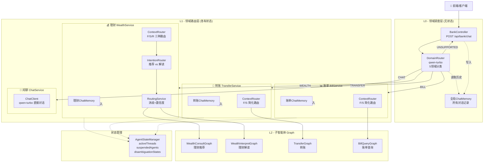

### 2.2 模型配置图

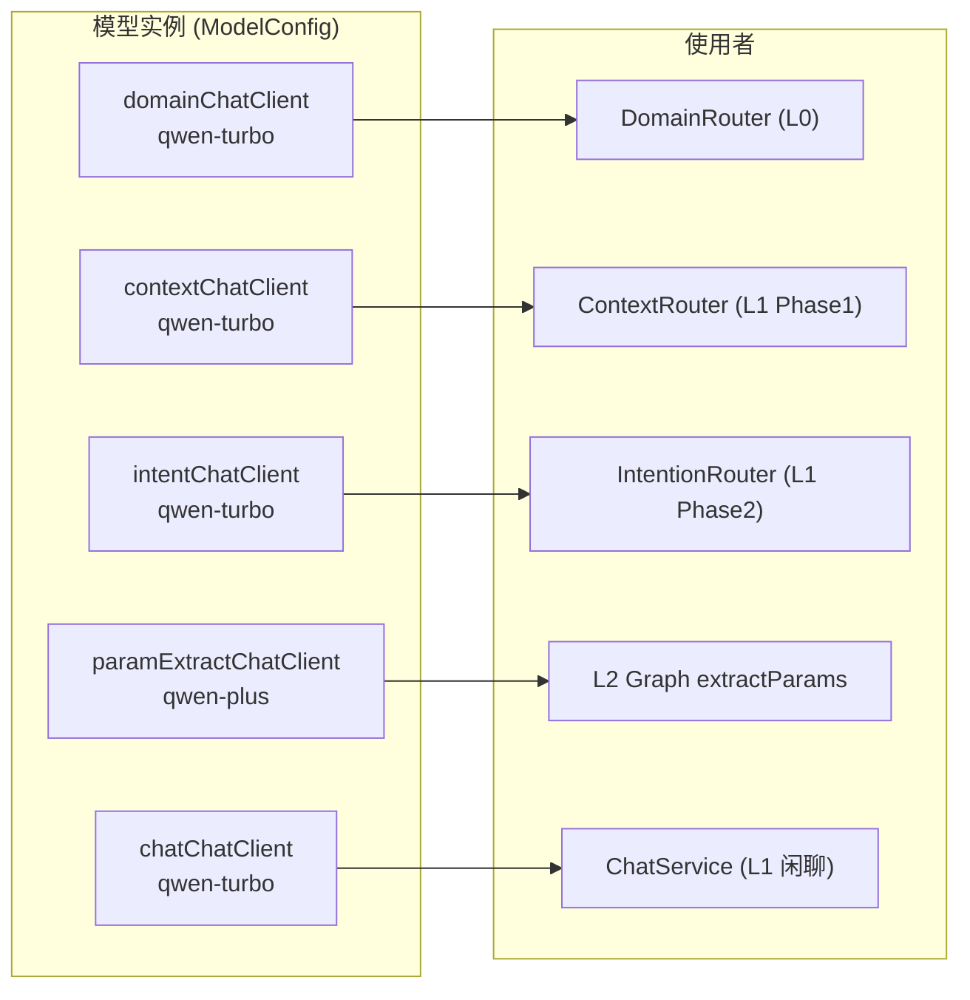

### 2.3 ChatMemory 隔离架构

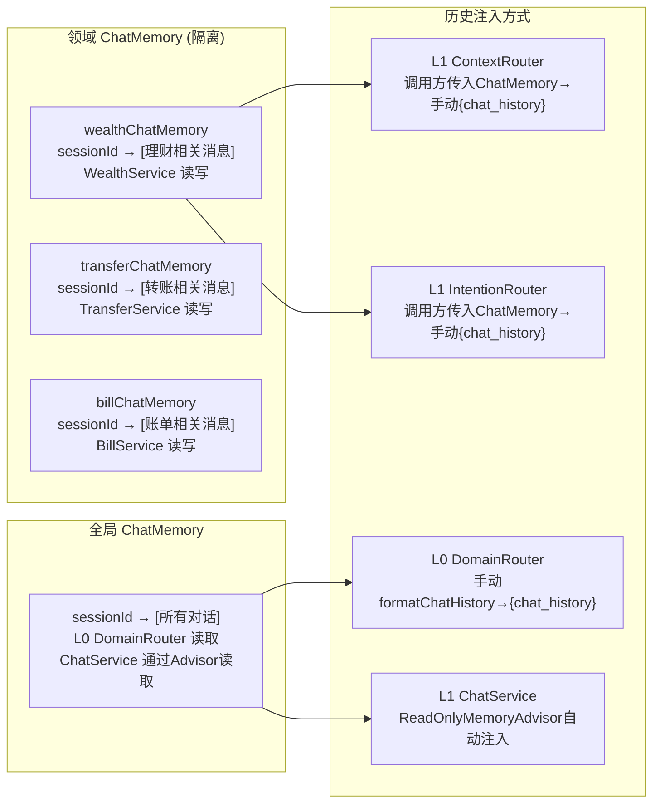

### 2.4 AgentStateManager 数据结构

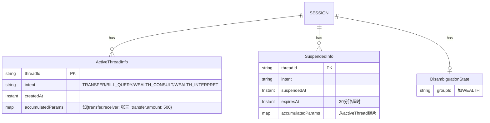

---

## 3. 各层详细设计

### 3.1 L0 — DomainRouter (无状态领域分类)

**职责**: 根据全局对话历史 + 当前消息，判断消息属于哪个领域

**模型**: qwen-turbo (轻量快速)

**输入**: 全局ChatMemory格式化历史 + 当前用户消息

**输出**: `{domain, unsupportedFeature, confidence}`

**5个领域:**

| 领域 | 子意图 | 关键词 |
|------|--------|--------|
| WEALTH | WEALTH_CONSULT(推荐), WEALTH_INTERPRET(解读) | 理财, 推荐, 咨询, 解读 |
| TRANSFER | TRANSFER | 转账, 转钱, 汇款 |
| BILL | BILL_QUERY | 账单, 消费, 支出, 收入 |
| UNSUPPORTED | 无 | 贷款, 信用卡, 挂失, 积分... |
| CHAT | 无 | 闲聊, 你好, 天气... |

**关键语义判断规则** (l0-domain.st):
- "不X了+新意图" → 路由到新意图 (无论是否有标点分隔)
- "算了"/"取消" (无新意图) → 路由到当前活跃领域
- "继续X"/"回到X" → 路由到X所属领域
- 短回答(如人名、金额) → 路由到对话历史中活跃的领域

### 3.2 L1 — 领域路由层 (4个Service)

#### 3.2.1 两种L1模式对比

| 特性 | 💰 理财L1 | 💸 转账L1 / 📊 账单L1 | 💬 闲聊L1 |
|------|-----------|---------------------|-----------|
| Service | WealthService | TransferService / BillService | ChatService |
| Phase1路由 | ContextRouter (F/S/R) | ContextRouter (F/S 简化) | 无 |
| Phase2路由 | IntentionRouter + RoutingService | 无 | 无 |
| 消歧 | ✅ WEALTH_CONSULT vs INTERPRET | ❌ | ❌ |
| suspendedAgents | ✅ (推荐↔解读切换) | ❌ | ❌ |
| Prompt模板 | l1-routing.st (完整) | l1-routing-simple.st (简化) | — |
| ChatMemory | 独立 wealthChatMemory | 独立 transfer/billChatMemory | 全局chatMemory |

#### 3.2.2 理财L1 — 双Phase路由流程

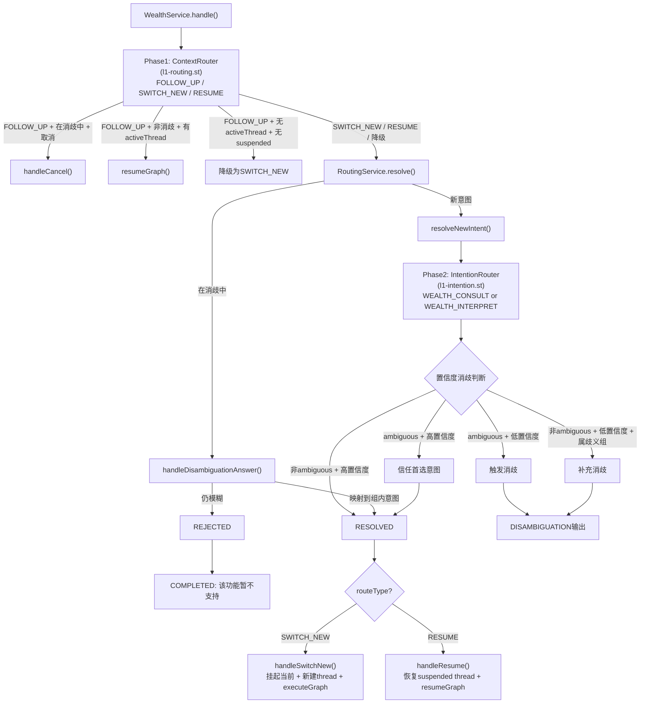

**理财L1只有两个子意图:**
- WEALTH_CONSULT: 理财咨询/推荐 → 关键词"推荐""咨询"
- WEALTH_INTERPRET: 理财产品解读 → 关键词"解读""分析"

**消歧策略 (RoutingService):**
- `highConfidenceBypass=0.85`: 高置信度即使ambiguous也信任
- `disambiguationThreshold=0.7`: 低置信度且属歧义组则补充消歧
- 消歧1次追问，回答仍模糊→REJECTED

#### 3.2.3 转账/账单L1 — 简化路由流程

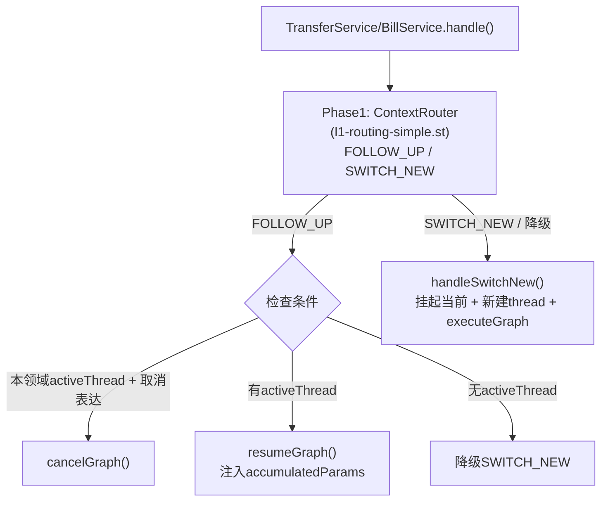

**关键差异**: 无IntentionRouter，无RoutingService，无suspendedAgents，无消歧。因为转账/账单各只有1个意图，不需要Phase2识别。

#### 3.2.4 闲聊L1 — 直接对话

无状态管理，直接调用 `chatChatClient` (qwen-turbo) + 全局ChatMemory Advisor。

### 3.3 L2 — 子智能体 Graph

#### 3.3.1 Graph 节点流程

**TransferGraph:**
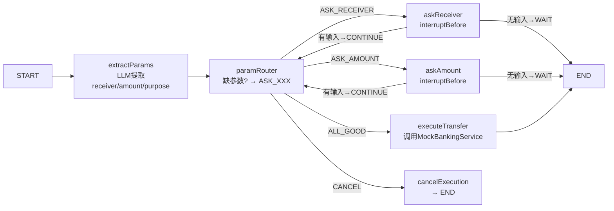

**BillQueryGraph:**
```
START → extractParams → paramRouter → askTime → paramRouter(循环)
                                    → askType  → paramRouter(循环)
                                    → executeBillQuery → END
                                    → cancelExecution → END
```

**WealthConsultGraph:**
```
START → extractParams → paramRouter → askRiskLevel → paramRouter(循环)
                                     → executeWealthConsult → END
                                     → cancelExecution → END
```

**WealthInterpretGraph:**
```
START → extractParams → paramRouter → askProductName → paramRouter(循环)
                                       → executeWealthInterpret → END
                                       → cancelExecution → END
```

#### 3.3.2 Graph参数对照表

| Graph | 需收集参数 | State Key | 追问内容 |
|-------|-----------|-----------|---------|
| TransferGraph | 收款人 | transfer.receiver | "请问您要转给谁？" |
| | 金额 | transfer.amount | "请问您要转多少金额？" |
| | 用途(可选) | transfer.purpose | — |
| BillQueryGraph | 时间范围 | bill.timePeriod | "请问您要查询哪个时间段的账单？" |
| | 收支类型 | bill.expenseType | "请问您要查询支出、收入还是收支？" |
| WealthConsultGraph | 风险偏好 | wealthConsult.riskLevel | "请问您的风险偏好是什么？(激进/稳健/保守)" |
| WealthInterpretGraph | 产品名称 | wealthInterpret.productName | "请问您要解读哪个理财产品？" |

#### 3.3.3 resumeGraph机制 (关键设计)

**不使用SAA框架的resume()**，原因是Bug#4519: interruptBefore在resume后不会重新触发。

**替代方案**: 每次resume都重新执行Graph + 注入accumulatedParams:

```
1. 从activeThread提取accumulatedParams (如{transfer.receiver: 张三})
2. 生成新threadId
3. setActiveThread(sessionId, newThreadId, intent)
4. 恢复accumulatedParams到新activeThread
5. executeGraph(graph, intent, newThreadId, userInput, sessionId, accumulatedParams)
   → extractParams节点提取新参数
   → paramRouter发现accumulatedParams中已有receiver → 跳过 → 只问缺失的参数
```

---

## 4. 场景调用流程图

### 4.1 直接完成 (一句话包含所有参数)

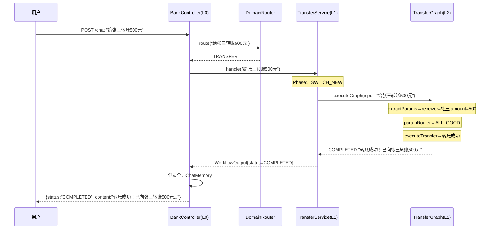

### 4.2 多轮追问 (参数不全)

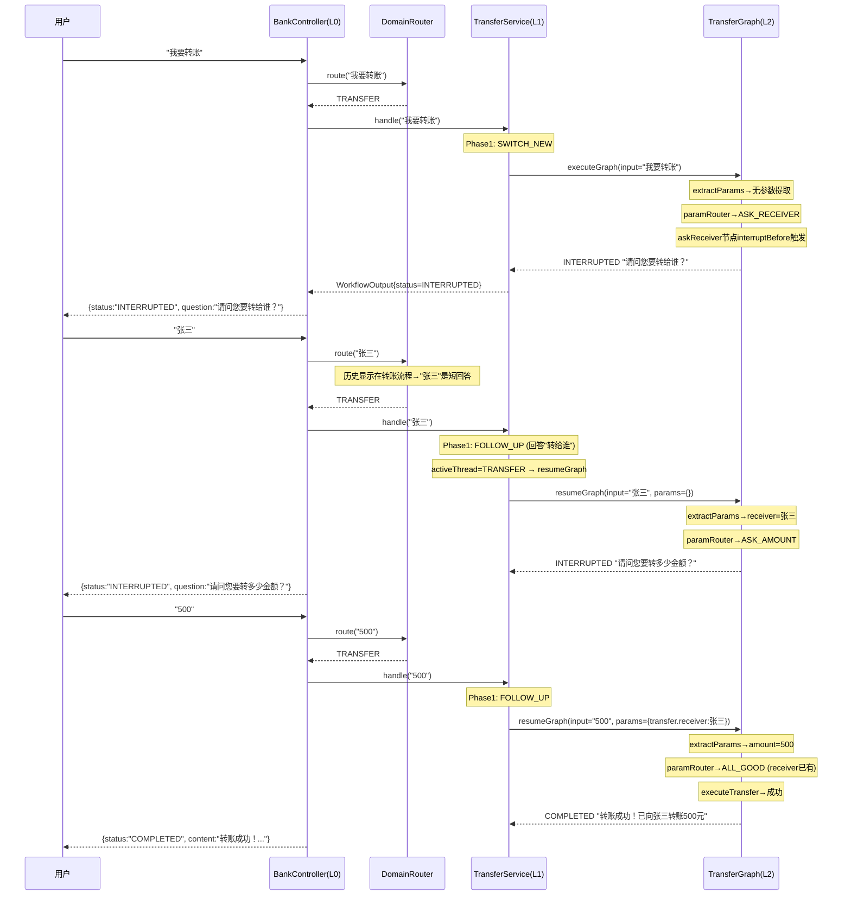

### 4.3 意图切换 + 恢复

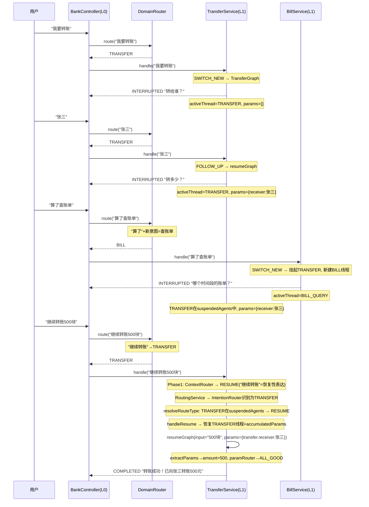

### 4.4 消歧 (理财领域)

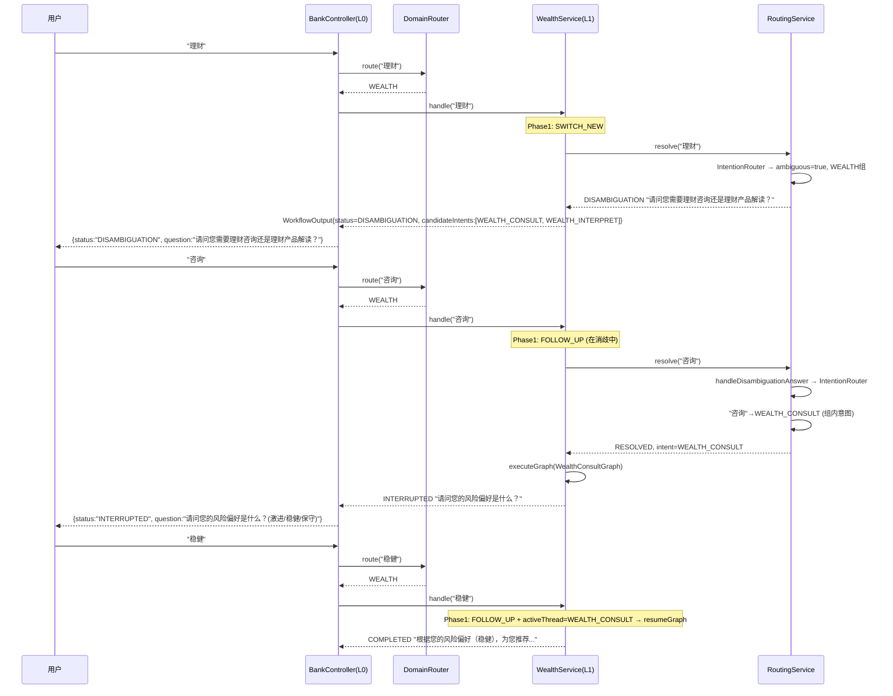

### 4.5 取消操作

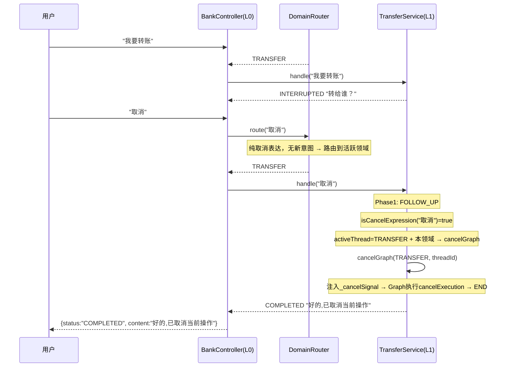

### 4.6 不支持的功能

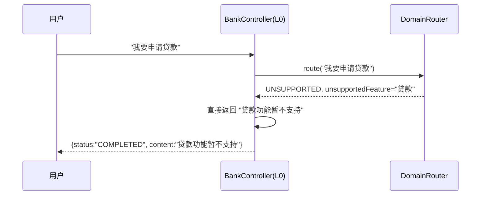

---

## 5. 关键代码分析

### 5.1 BankController — L0调度入口

```java
@PostMapping("/chat")
public WorkflowOutput chat(@RequestParam String sessionId,
                           @RequestBody Map<String, String> req) {
    String userInput = req.get("message");
    
    // L0: 领域路由 (qwen-turbo判断)
    DomainRouter.DomainResult domainResult = domainRouter.route(sessionId, userInput);
    
    // 分发到L1 Service
    if (domainResult.isUnsupported()) {
        return WorkflowOutput.completed(null, feature + "功能暂不支持");
    }
    output = switch (domainResult.domain()) {
        case "WEALTH"   -> wealthService.handle(sessionId, userInput);
        case "TRANSFER" -> transferService.handle(sessionId, userInput);
        case "BILL"     -> billService.handle(sessionId, userInput);
        default         -> chatService.handle(sessionId, userInput);
    };
    
    // 记录全局ChatMemory (L0使用)
    chatMemory.add(sessionId, new UserMessage(userInput));
    recordSystemReply(sessionId, output);
    return output;
}
```

**关键设计**:
- BankController只做L0调度，不包含L1逻辑
- 全局ChatMemory在Controller层统一写入，L0 DomainRouter手动读取
- UNSUPPORTED直接在L0层处理，不进入L1

### 5.2 DomainRouter — L0领域分类

```java
public DomainResult route(String sessionId, String userInput) {
    String chatHistory = formatChatHistory(sessionId);  // 手动读取全局ChatMemory
    String systemPrompt = buildDomainPrompt(userInput, chatHistory);
    
    String content = domainChatClient.prompt()
            .system(systemPrompt)   // 包含{chat_history}和{message}
            .user(userInput)
            .call()
            .content();
    
    return parseDomainResponse(content);  // 解析JSON: {domain, unsupported_feature, confidence}
}
```

**关键设计**:
- 完全无状态，每轮重新判断
- 不使用ReadOnlyMemoryAdvisor，手动格式化历史到prompt
- prompt中明确区分"对话历史"和"当前消息"

### 5.3 WealthService — 理财L1 (最复杂的L1)

```java
public WorkflowOutput handle(String sessionId, String userInput) {
    // Phase1: ContextRouter → FOLLOW_UP / SWITCH_NEW / RESUME
    RoutingResult phase1 = contextRouter.route(sessionId, userInput, stateManager,
            "prompts/l1-routing.st", DOMAIN_NAME, wealthChatMemory);
    
    // FOLLOW_UP + 非消歧 + 有activeThread → 直接resume (不经IntentionRouter)
    if (phase1.isFollowUp() && !stateManager.isInDisambiguation(sessionId)) {
        AgentStateManager.ActiveThreadInfo activeThread = stateManager.getActiveThread(sessionId);
        if (activeThread != null) {
            return graphExecutionService.resumeGraph(
                    activeThread.getIntent(), activeThread.getThreadId(), userInput, sessionId);
        }
    }
    
    // Phase2 + 消歧: RoutingService.resolve()
    RoutingResolution resolution = routingService.resolve(sessionId, userInput, phase1, wealthChatMemory);
    
    // 根据决议执行
    return switch (resolution.getStatus()) {
        case RESOLVED      -> executeRoute(sessionId, resolution);
        case DISAMBIGUATION -> WorkflowOutput.disambiguation(resolution.getQuestion(), ...);
        case REJECTED      -> WorkflowOutput.completed(null, "该理财功能暂不支持");
    };
}
```

**关键设计**:
- FOLLOW_UP + activeThread → 直接resumeGraph，**不经过IntentionRouter** (低延迟路径)
- SWITCH_NEW/RESUME → 经RoutingService → IntentionRouter识别具体意图(推荐 vs 解读)
- 消歧时挂起当前activeThread，防止状态丢失

### 5.4 GraphExecutionService — resumeGraph核心机制

```java
public WorkflowOutput resumeGraph(String intent, String threadId, String userInput, String sessionId) {
    // 1. 从旧activeThread提取accumulatedParams
    Map<String, Object> accumulatedParams = getAccumulatedParamsFromActive(sessionId, intent);
    
    // 2. 生成新threadId + 恢复参数到新activeThread
    String newThreadId = prepareReExecution(sessionId, intent, accumulatedParams);
    
    // 3. 重新执行Graph，注入accumulatedParams
    return executeGraph(graph, intent, newThreadId, userInput, sessionId, accumulatedParams);
}

public WorkflowOutput executeGraph(CompiledGraph graph, String intent, String threadId,
                                   String userInput, String sessionId,
                                   Map<String, Object> accumulatedParams) {
    Map<String, Object> input = new HashMap<>();
    input.put("messages", userInput);
    input.put("_latestUserInput", userInput);
    input.put("_question", null);
    
    // 注入累积参数 → paramRouter跳过已收集的参数
    if (accumulatedParams != null && !accumulatedParams.isEmpty()) {
        input.putAll(accumulatedParams);
    }
    
    graph.stream(input, config).blockLast();
    return checkGraphResult(graph, config, intent, threadId, sessionId);
}
```

**关键设计**:
- **不用SAA的resume()**: 因Bug#4519 (interruptBefore在resume后不重新触发)
- 每次resume = 新建threadId + 重新执行Graph + 注入accumulatedParams
- accumulatedParams让paramRouter跳过已满足的参数，只问缺失的

### 5.5 AgentStateManager — 跨领域状态管理

```java
// 三大数据结构
Map<String, ActiveThreadInfo> activeThreads;       // sessionId → 当前活跃线程
Map<String, Map<String, SuspendedInfo>> suspendedAgents;  // sessionId → {intent → 挂起线程}
Map<String, DisambiguationState> disambiguationStates;    // sessionId → 消歧状态

// 线程生命周期
setActiveThread(sessionId, threadId, intent);  // 设为活跃
suspendAgent(sessionId, intent, threadId);     // 挂起(含accumulatedParams)
resumeAgent(sessionId, intent);                // 从挂起恢复
completeAgent(sessionId, intent);              // 完成(清理activeThread+suspended)
```

**关键设计**:
- activeThread全局唯一(一个session同时只有一个活跃线程)
- suspendedAgents按intent索引(支持多意图挂起，如同时挂起TRANSFER和WEALTH_CONSULT)
- accumulatedParams在suspend时从activeThread继承，resume时恢复
- 最大挂起深度3，30分钟超时自动清理

### 5.6 IntentRegistry — 意图注册表 + Graph绑定

```java
@PostConstruct
public void init() {
    // 注册4个意图
    register("TRANSFER", "转账给他人", "收款人,金额,用途(可选)", true);
    register("BILL_QUERY", "查询账单明细", "时间范围,收支类型", false);
    register("WEALTH_CONSULT", "理财咨询/推荐", "风险偏好", false);
    register("WEALTH_INTERPRET", "理财产品解读", "产品名称", false);
    
    // 注册意图组(消歧用)
    registerGroup("WEALTH", "理财", 
        List.of("WEALTH_CONSULT", "WEALTH_INTERPRET"),
        "请问您需要理财咨询还是理财产品解读？");
}
```

AppInitConfig在启动时绑定Graph到IntentRegistry:
```java
intentRegistry.bindGraph("TRANSFER", transferGraph);
intentRegistry.bindGraph("BILL_QUERY", billQueryGraph);
intentRegistry.bindGraph("WEALTH_CONSULT", wealthConsultGraph);
intentRegistry.bindGraph("WEALTH_INTERPRET", wealthInterpretGraph);
```

---

## 6. 接口调用样例

### 6.1 一句话完成转账

**请求:**
```http
POST /api/bank/chat?sessionId=demo_001 HTTP/1.1
Content-Type: application/json

{"message": "给张三转账500元"}
```

**响应:**
```json
{
  "status": "COMPLETED",
  "content": "转账成功！已向张三转账500元。交易流水号：TXN675894",
  "question": null,
  "intent": "TRANSFER",
  "threadId": null,
  "errorMessage": null,
  "candidateIntents": null
}
```

### 6.2 多轮转账 (参数逐步收集)

**第1轮:**
```http
POST /api/bank/chat?sessionId=demo_002
{"message": "我要转账"}
```
```json
{
  "status": "INTERRUPTED",
  "content": null,
  "question": "请问您要转给谁？",
  "intent": "TRANSFER",
  "threadId": "a1b2c3d4e5f67890",
  "errorMessage": null,
  "candidateIntents": null
}
```

**第2轮:**
```http
POST /api/bank/chat?sessionId=demo_002
{"message": "张三"}
```
```json
{
  "status": "INTERRUPTED",
  "question": "请问您要转多少金额？",
  "intent": "TRANSFER",
  "threadId": "f0e1d2c3b4a56789",
  "content": null,
  "errorMessage": null,
  "candidateIntents": null
}
```

**第3轮:**
```http
POST /api/bank/chat?sessionId=demo_002
{"message": "500"}
```
```json
{
  "status": "COMPLETED",
  "content": "转账成功！已向张三转账500元。交易流水号：TXN690024",
  "intent": "TRANSFER",
  "question": null,
  "candidateIntents": null
}
```

### 6.3 消歧 + 理财推荐

**第1轮 (触发消歧):**
```http
POST /api/bank/chat?sessionId=demo_003
{"message": "理财"}
```
```json
{
  "status": "DISAMBIGUATION",
  "question": "请问您需要理财咨询还是理财产品解读？",
  "candidateIntents": ["WEALTH_CONSULT", "WEALTH_INTERPRET"],
  "content": null,
  "intent": null,
  "threadId": null
}
```

**第2轮 (选择咨询):**
```http
POST /api/bank/chat?sessionId=demo_003
{"message": "咨询"}
```
```json
{
  "status": "INTERRUPTED",
  "question": "请问您的风险偏好是什么？(激进/稳健/保守)",
  "intent": "WEALTH_CONSULT",
  "threadId": "c7d8e9f0a1b23456",
  "content": null,
  "candidateIntents": null
}
```

**第3轮 (回答风险偏好):**
```http
POST /api/bank/chat?sessionId=demo_003
{"message": "稳健"}
```
```json
{
  "status": "COMPLETED",
  "content": "根据您的风险偏好（稳健），为您推荐以下理财产品：\n- 稳利宝稳健版: 年化收益3.5%, 中低风险, 灵活申赎\n- 汇添富稳健债券: 年化收益3.8%, 中低风险, 锁定3个月\n- 优选理财组合A: 年化收益4.0%, 中风险, 锁定6个月\n\n温馨提示: 理财有风险,投资需谨慎。过往收益不代表未来表现。",
  "intent": "WEALTH_CONSULT",
  "question": null,
  "candidateIntents": null
}
```

### 6.4 意图切换 + 恢复

**第1-2轮: 转账流程启动**
```http
POST /api/bank/chat?sessionId=demo_004
{"message": "我要转账"}
```
→ INTERRUPTED: "转给谁？"

```http
POST /api/bank/chat?sessionId=demo_004
{"message": "张三"}
```
→ INTERRUPTED: "转多少？"

**第3轮: 切换到账单**
```http
POST /api/bank/chat?sessionId=demo_004
{"message": "算了查账单"}
```
→ INTERRUPTED: "请问您要查询哪个时间段的账单？"

**第4轮: 恢复转账**
```http
POST /api/bank/chat?sessionId=demo_004
{"message": "继续转账500块"}
```
→ COMPLETED: "转账成功！已向张三转账500元。交易流水号：TXN..."

### 6.5 取消操作

```http
POST /api/bank/chat?sessionId=demo_005
{"message": "我要转账"}
```
→ INTERRUPTED: "转给谁？"

```http
POST /api/bank/chat?sessionId=demo_005
{"message": "取消"}
```
```json
{
  "status": "COMPLETED",
  "content": "好的,已取消当前操作。还有什么可以帮您的吗？",
  "intent": null,
  "question": null
}
```

### 6.6 不支持的功能

```http
POST /api/bank/chat?sessionId=demo_006
{"message": "我要申请贷款"}
```
```json
{
  "status": "COMPLETED",
  "content": "贷款功能暂不支持",
  "intent": null,
  "question": null
}
```

### 6.7 闲聊

```http
POST /api/bank/chat?sessionId=demo_007
{"message": "你好"}
```
```json
{
  "status": "COMPLETED",
  "content": "您好！我是您的手机银行助手，可以帮您转账、查账单、推荐理财产品等。请问有什么可以帮您的？",
  "intent": "CHAT",
  "question": null
}
```

### 6.8 空消息 (错误处理)

```http
POST /api/bank/chat?sessionId=demo_008
{"message": ""}
```
```json
{
  "status": "ERROR",
  "errorMessage": "Message cannot be empty",
  "content": null,
  "question": null,
  "intent": null
}
```

### 6.9 查看会话状态

```http
GET /api/bank/state?sessionId=demo_004
```
```json
{
  "sessionId": "demo_004",
  "state": "当前活跃意图: TRANSFER (线程: a1b2c3d4...)\n挂起的意图: BILL_QUERY"
}
```

### 6.10 清除会话

```http
DELETE /api/bank/session?sessionId=demo_004
```
```json
{
  "status": "cleared",
  "sessionId": "demo_004"
}
```

---

## 附录: 完整文件清单

| 文件 | 层 | 职责 |
|------|-----|------|
| `controller/BankController.java` | L0 | 入口+调度+全局ChatMemory写入 |
| `domain/DomainRouter.java` | L0 | 领域分类(qwen-turbo) |
| `domain/WealthService.java` | L1 | 理财路由(Phase1+Phase2+消歧) |
| `domain/TransferService.java` | L1 | 转账路由(简化Phase1) |
| `domain/BillService.java` | L1 | 账单路由(简化Phase1) |
| `domain/ChatService.java` | L1 | 闲聊(直接ChatClient) |
| `service/ContextRouter.java` | L1 | Phase1: F/S/R路由判断 |
| `service/IntentionRouter.java` | L1 | Phase2: 意图识别+上下文改写 |
| `service/RoutingService.java` | L1 | 消歧+置信度增强+模糊匹配 |
| `service/GraphExecutionService.java` | L1→L2 | Graph执行/resume/cancel |
| `state/AgentStateManager.java` | 共享 | 线程状态管理(active/suspended/disambig) |
| `model/IntentRegistry.java` | 共享 | 意图注册表+Graph绑定 |
| `model/WorkflowOutput.java` | 共享 | 统一响应DTO |
| `model/RoutingResult.java` | L1 | Phase1/Phase2路由结果 |
| `model/RoutingResolution.java` | L1 | 路由决议(RESOLVED/DISAMBIGUATION/REJECTED) |
| `workflow/AbstractGraphConfig.java` | L2 | Graph基类(参数提取+取消检测+通用节点) |
| `workflow/TransferGraphConfig.java` | L2 | 转账Graph |
| `workflow/BillQueryGraphConfig.java` | L2 | 账单Graph |
| `workflow/WealthConsultGraphConfig.java` | L2 | 理财推荐Graph |
| `workflow/WealthInterpretGraphConfig.java` | L2 | 理财解读Graph |
| `config/ModelConfig.java` | 配置 | 多模型+ChatMemory Bean定义 |
| `config/AppInitConfig.java` | 配置 | Graph→IntentRegistry绑定 |
| `mock/MockBankingService.java` | Mock | 模拟银行服务(转账/账单/理财) |
| `prompts/l0-domain.st` | Prompt | L0领域分类提示词 |
| `prompts/l1-routing.st` | Prompt | L1理财Phase1(F/S/R)提示词 |
| `prompts/l1-routing-simple.st` | Prompt | L1转账/账单Phase1(F/S)提示词 |
| `prompts/l1-intention.st` | Prompt | L1理财Phase2意图识别+改写提示词 |
| `prompts/planning-agent.st` | Prompt | 规划Agent提示词 |
