# 手机银行 AI Agent L0→L1→L2 架构完整文档

## 目录
1. [全景架构图](#1-全景架构图)
2. [L0 领域调度层](#2-l0-领域调度层)
3. [L1 领域路由层](#3-l1-领域路由层)
4. [L2 子智能体 Graph 层](#4-l2-子智能体-graph-层)
5. [AgentStateManager 状态管理](#5-agentstatemanager-状态管理)
6. [场景流程图](#6-场景流程图)
7. [类图与调用关系](#7-类图与调用关系)
8. [关键代码分析](#8-关键代码分析)
9. [配置项说明](#9-配置项说明)
10. [完整文件清单](#10-完整文件清单)

---

## 1. 全景架构图

### 1.1 L0→L1→L2 分层组件图

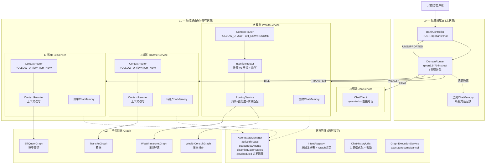
```mermaid
graph TB
    Client["📱 前端/客户端"]
    
    subgraph L0["L0 — 领域调度层 (无状态)"]
        BC["BankController<br/>POST /api/bank/chat"]
        DR["DomainRouter<br/>qwen2.5-7b-instruct<br/>5领域分类"]
        GCM["全局ChatMemory<br/>所有对话记录"]
    end
    
    subgraph L1["L1 — 领域路由层 (各有状态)"]
        direction LR
        subgraph WL1["💰 理财 WealthService"]
            WCM["理财ChatMemory"]
            WCR["ContextRouter<br/>FOLLOW_UP/SWITCH_NEW/RESUME"]
            WIR["IntentionRouter<br/>推荐 vs 解读 + 改写"]
            WRS["RoutingService<br/>消歧+置信度+模糊匹配"]
        end
        subgraph TL1["💸 转账 TransferService"]
            TCM["转账ChatMemory"]
            TCR["ContextRouter<br/>FOLLOW_UP/SWITCH_NEW"]
            TRW["ContextRewriter<br/>上下文改写"]
        end
        subgraph BL1["📊 账单 BillService"]
            BCM["账单ChatMemory"]
            BCR["ContextRouter<br/>FOLLOW_UP/SWITCH_NEW"]
            BRW["ContextRewriter<br/>上下文改写"]
        end
        subgraph CL1["💬 闲聊 ChatService"]
            CCL["ChatClient<br/>qwen-turbo 直接对话"]
        end
    end
    
    subgraph L2["L2 — 子智能体 Graph"]
        WCG["WealthConsultGraph<br/>理财推荐"]
        WIG["WealthInterpretGraph<br/>理财解读"]
        TG["TransferGraph<br/>转账"]
        BG["BillQueryGraph<br/>账单查询"]
    end
    
    subgraph STATE["状态管理 (跨层共享)"]
        ASM["AgentStateManager<br/>activeThreads<br/>suspendedAgents<br/>disambiguationStates<br/>@Scheduled 过期清理"]
        IR["IntentRegistry<br/>意图注册表 + Graph绑定"]
        CHU["ChatHistoryUtils<br/>历史格式化 + 截断"]
        GES["GraphExecutionService<br/>execute/resume/cancel"]
    end
    
    Client --> BC
    BC --> DR
    DR -.->|读取历史| GCM
    DR -->|"WEALTH"| WL1
    DR -->|"TRANSFER"| TL1
    DR -->|"BILL"| BL1
    DR -->|"CHAT"| CL1
    DR -->|"UNSUPPORTED"| BC
    
    WCR --> WIR --> WRS
    WRS --> WCG
    WRS --> WIG
    TCR --> TRW --> TG
    BCR --> BRW --> BG
    
    WL1 -.-> ASM
    TL1 -.-> ASM
    BL1 -.-> ASM
```

### 1.2 模型配置图

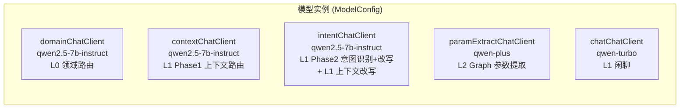
```mermaid
graph LR
    subgraph "模型实例 (ModelConfig)"
        DM["domainChatClient<br/>qwen2.5-7b-instruct<br/>L0 领域路由"]
        CM["contextChatClient<br/>qwen2.5-7b-instruct<br/>L1 Phase1 上下文路由"]
        IM["intentChatClient<br/>qwen2.5-7b-instruct<br/>L1 Phase2 意图识别+改写<br/>+ L1 上下文改写"]
        PM["paramExtractChatClient<br/>qwen-plus<br/>L2 Graph 参数提取"]
        CHM["chatChatClient<br/>qwen-turbo<br/>L1 闲聊"]
    end
```

### 1.3 ChatMemory 隔离架构

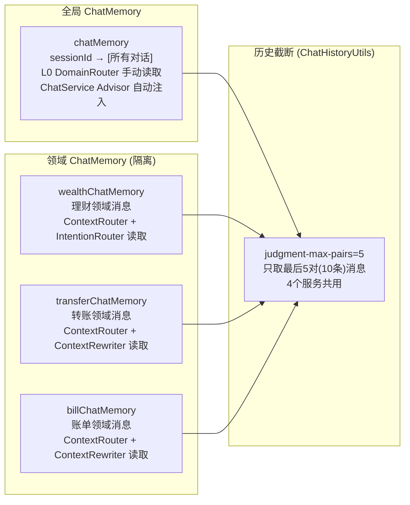
```mermaid
graph LR
    subgraph "全局 ChatMemory"
        GM["chatMemory<br/>sessionId → [所有对话]<br/>L0 DomainRouter 手动读取<br/>ChatService Advisor 自动注入"]
    end
    
    subgraph "领域 ChatMemory (隔离)"
        WM["wealthChatMemory<br/>理财领域消息<br/>ContextRouter + IntentionRouter 读取"]
        TM["transferChatMemory<br/>转账领域消息<br/>ContextRouter + ContextRewriter 读取"]
        BM["billChatMemory<br/>账单领域消息<br/>ContextRouter + ContextRewriter 读取"]
    end
    
    subgraph "历史截断 (ChatHistoryUtils)"
        H["judgment-max-pairs=5<br/>只取最后5对(10条)消息<br/>4个服务共用"]
    end
    
    GM --> H
    WM --> H
    TM --> H
    BM --> H
```

---

## 2. L0 领域调度层

### 2.1 L0 架构图

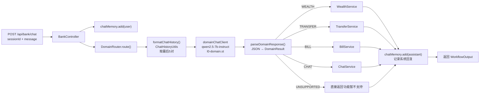
```mermaid
flowchart LR
    REQ["POST /api/bank/chat<br/>sessionId + message"] --> BC["BankController"]
    BC --> GCM1["chatMemory.add(user)"]
    BC --> DR["DomainRouter.route()"]
    
    DR --> FH["formatChatHistory()<br/>ChatHistoryUtils<br/>取最后5对"]
    FH --> LLM["domainChatClient<br/>qwen2.5-7b-instruct<br/>l0-domain.st"]
    LLM --> PARSE["parseDomainResponse()<br/>JSON → DomainResult"]
    
    PARSE -->|"WEALTH"| WS["WealthService"]
    PARSE -->|"TRANSFER"| TS["TransferService"]
    PARSE -->|"BILL"| BS["BillService"]
    PARSE -->|"CHAT"| CS["ChatService"]
    PARSE -->|"UNSUPPORTED"| UNS["直接返回'功能暂不支持'"]
    
    WS & TS & BS & CS & UNS --> REC["chatMemory.add(assistant)<br/>记录系统回复"]
    REC --> RESP["返回 WorkflowOutput"]
```

### 2.2 L0 领域分类特征

**模型**: qwen2.5-7b-instruct（指令遵循能力更强）

**5个领域**:

| 领域 | 子意图 | 关键词 | 路由说明 |
|------|--------|--------|---------|
| WEALTH | WEALTH_CONSULT, WEALTH_INTERPRET | 理财/投资/收益/推荐/咨询/解读 | 只路由到领域，子意图由L1识别 |
| TRANSFER | TRANSFER | 转账/转钱/汇款/打款/转给 | "赚钱给X""转500块"也是转账 |
| BILL | BILL_QUERY | 账单/明细/消费/支出/收入/收支 | "收入多少"是查账单不是理财 |
| UNSUPPORTED | 无 | 贷款/信用卡/积分/挂失/存款/保险 | 银行业务但不支持，返回"X功能暂不支持" |
| CHAT | 无 | 闲聊/你好/天气 | 非银行业务话题 |

**L0 判断规则** (l0-domain.st，42行精简提示词):

| 规则 | 说明 | 示例 |
|------|------|------|
| 规则1: 当前消息意图清晰 → 按当前消息路由 | 历史不影响判断 | "先看看账单"→BILL，即使之前在转账 |
| 规则2: 短回答/无领域关键词 → 结合历史 | 依赖上下文理解 | 历史问"转给谁"，"张三"→TRANSFER |
| 规则3: 纯取消词 → 路由到历史活跃领域 | 取消是对当前agent的回应 | "算了"→TRANSFER（如果之前在转账） |
| 绝对禁止 | 当前消息含领域关键词时，不能因历史在其他流程就路由到历史领域 | "查账单"必须→BILL，即使之前在转账 |

**关键设计**: L0完全无状态，每轮重新判断。手动读取全局ChatMemory格式化到`{chat_history}`，不使用MemoryAdvisor。

---

## 3. L1 领域路由层

### 3.1 L1 核心概念

L1层有三种路由类型，这是整个系统最关键的概念：

| 路由类型 | 含义 | 触发条件 | 处理方式 |
|----------|------|---------|---------|
| **FOLLOW_UP** | 用户在继续当前对话，回答系统问题或补充参数 | 短回答、补充参数、取消表达 | 有activeThread→resumeGraph；无activeThread→ContextRewriter改写后SWITCH_NEW |
| **SWITCH_NEW** | 用户开了全新话题 | 新意图、与历史无关 | 挂起当前activeThread，新建thread+executeGraph |
| **RESUME** | 用户要恢复之前被挂起的任务 | "继续X""回到X""还是X吧" | 从suspendedAgents恢复线程+accumulatedParams，resumeGraph |

**FOLLOW_UP vs RESUME 的关键区别**:
- FOLLOW_UP: 回答系统**刚问的问题**（助手问"转给谁"，用户说"张三"）
- RESUME: **主动要回到**之前被挂起的任务（挂起列表有TRANSFER，用户说"继续转账"）

### 3.2 L1 两种模式对比

| 特性 | 💰 理财L1 | 💸 转账L1 / 📊 账单L1 | 💬 闲聊L1 |
|------|-----------|---------------------|-----------|
| Service | WealthService | TransferService / BillService | ChatService |
| Phase1路由 | ContextRouter (F/S/R 三种) | ContextRouter (F/S 简化) | 无 |
| Phase2路由 | IntentionRouter + RoutingService | 无 | 无 |
| 上下文改写 | IntentionRouter (改写+识别一体) | ContextRewriter (仅改写) | 无 |
| 消歧 | ✅ WEALTH_CONSULT vs INTERPRET | ❌ | ❌ |
| suspendedAgents | ✅ (推荐↔解读切换) | ✅ (跨领域切换时挂起) | ❌ |
| Prompt模板 | l1-routing.st | l1-routing-simple.st | — |
| ChatMemory | wealthChatMemory | transfer/billChatMemory | 全局chatMemory |

### 3.3 理财L1 — 双Phase路由架构图

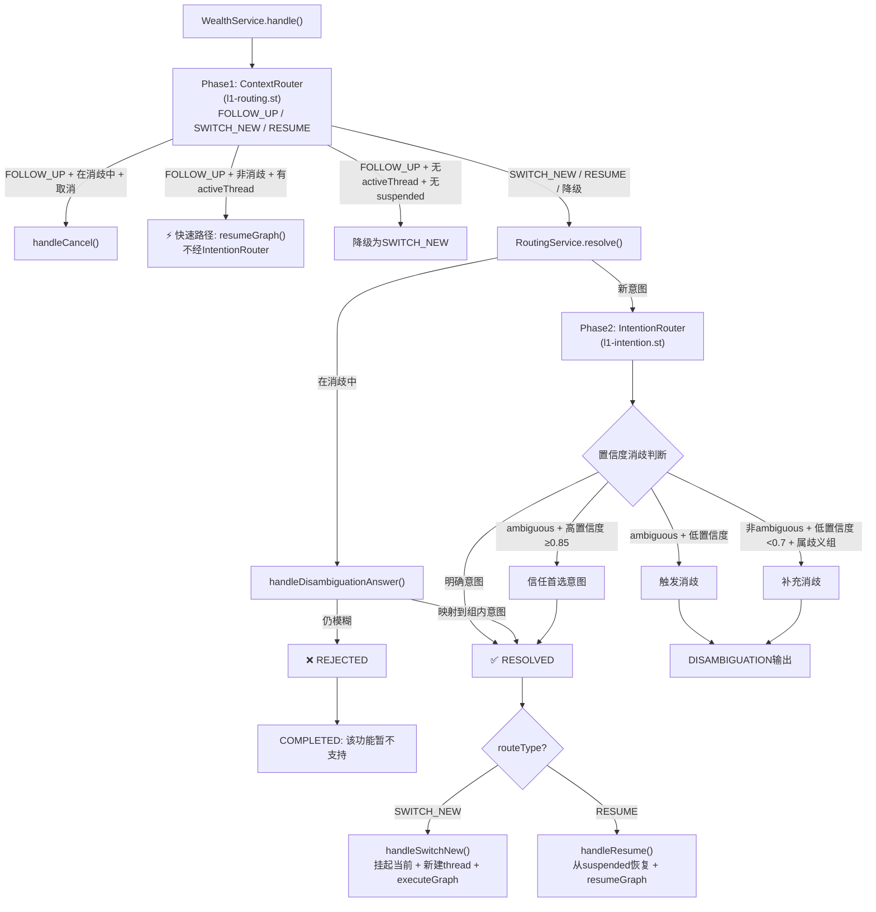
```mermaid
flowchart TD
    INPUT["WealthService.handle()"] --> P1["Phase1: ContextRouter<br/>(l1-routing.st)<br/>FOLLOW_UP / SWITCH_NEW / RESUME"]
    
    P1 -->|"FOLLOW_UP + 在消歧中 + 取消"| CANCEL["handleCancel()"]
    P1 -->|"FOLLOW_UP + 非消歧 + 有activeThread"| RESUME_FAST["⚡ 快速路径: resumeGraph()<br/>不经IntentionRouter"]
    P1 -->|"FOLLOW_UP + 无activeThread + 无suspended"| FALLBACK["降级为SWITCH_NEW"]
    P1 -->|"SWITCH_NEW / RESUME / 降级"| RS["RoutingService.resolve()"]
    
    RS -->|"在消歧中"| DISAMBIG_ANS["handleDisambiguationAnswer()"]
    RS -->|"新意图"| P2_FLOW["Phase2: IntentionRouter<br/>(l1-intention.st)"]
    
    P2_FLOW --> DISAMBIG_CHECK{"置信度消歧判断"}
    DISAMBIG_CHECK -->|"ambiguous + 低置信度"| TRIGGER_DIS["触发消歧"]
    DISAMBIG_CHECK -->|"ambiguous + 高置信度 ≥0.85"| TRUST["信任首选意图"]
    DISAMBIG_CHECK -->|"非ambiguous + 低置信度 <0.7 + 属歧义组"| SUPP_DIS["补充消歧"]
    DISAMBIG_CHECK -->|"明确意图"| RESOLVED["✅ RESOLVED"]
    
    DISAMBIG_ANS -->|"映射到组内意图"| RESOLVED
    DISAMBIG_ANS -->|"仍模糊"| REJECTED["❌ REJECTED"]
    
    TRIGGER_DIS --> DISAMBIG_OUT["DISAMBIGUATION输出"]
    SUPP_DIS --> DISAMBIG_OUT
    REJECTED --> REJECT_OUT["COMPLETED: 该功能暂不支持"]
    TRUST --> RESOLVED
    
    RESOLVED --> EXEC{"routeType?"}
    EXEC -->|"SWITCH_NEW"| SWITCH["handleSwitchNew()<br/>挂起当前 + 新建thread + executeGraph"]
    EXEC -->|"RESUME"| RESUME_S["handleResume()<br/>从suspended恢复 + resumeGraph"]
```

**理财L1的快速路径**: FOLLOW_UP + 有activeThread → 直接resumeGraph，**跳过IntentionRouter**。原因：用户正在回答子智能体的追问，意图已经明确，无需再次识别，降低延迟。

### 3.4 转账/账单L1 — 简化路由架构图

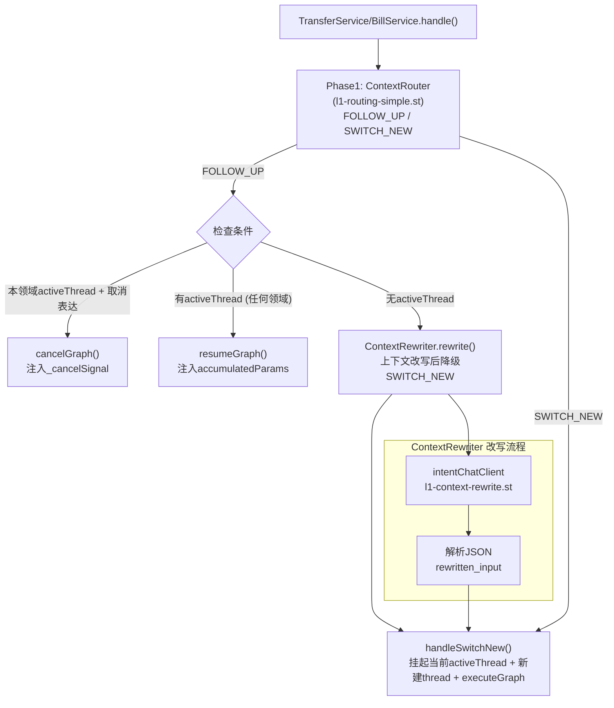
```mermaid
flowchart TD
    INPUT["TransferService/BillService.handle()"] --> P1["Phase1: ContextRouter<br/>(l1-routing-simple.st)<br/>FOLLOW_UP / SWITCH_NEW"]
    
    P1 -->|"FOLLOW_UP"| FU_CHECK{"检查条件"}
    FU_CHECK -->|"本领域activeThread + 取消表达"| CANCEL["cancelGraph()<br/>注入_cancelSignal"]
    FU_CHECK -->|"有activeThread (任何领域)"| RESUME["resumeGraph()<br/>注入accumulatedParams"]
    FU_CHECK -->|"无activeThread"| REWRITE["ContextRewriter.rewrite()<br/>上下文改写后降级SWITCH_NEW"]
    
    P1 -->|"SWITCH_NEW"| SN["handleSwitchNew()<br/>挂起当前activeThread + 新建thread + executeGraph"]
    REWRITE --> SN
    
    subgraph "ContextRewriter 改写流程"
        CR_LLM["intentChatClient<br/>l1-context-rewrite.st"] --> CR_PARSE["解析JSON<br/>rewritten_input"]
    end
    
    REWRITE --> CR_LLM
    CR_PARSE --> SN
```

**ContextRewriter 使用场景**: 用户在转账/账单领域完成操作后(activeThread已清空)，继续追问如"那上个月的呢"。此时FOLLOW_UP但无activeThread → 改写为自包含描述("查上个月的收入") → 作为新操作执行。**ChatMemory保存原始话术，Graph接收改写后的输入**。

### 3.5 L1 意图识别与改写特征

#### ContextRouter — Phase1 路由判断

| 特征 | 说明 |
|------|------|
| 模型 | qwen2.5-7b-instruct |
| 两种模板 | l1-routing.st (理财, F/S/R) / l1-routing-simple.st (转账/账单, F/S) |
| 输入 | 领域ChatMemory + 会话状态 + 当前消息 |
| 输出 | `{route_type, confidence}` |
| 简化模式 | RESUME自动降级为SWITCH_NEW，只输出F/S |
| 降级策略 | LLM调用失败 → 默认SWITCH_NEW |

#### IntentionRouter — Phase2 意图识别+改写 (仅理财)

| 特征 | 说明 |
|------|------|
| 模型 | qwen2.5-7b-instruct |
| 输入 | 理财ChatMemory + 会话状态 + 消歧上下文 + Phase1结果 |
| 输出 | `{intent_name, rewritten_input, route_type, confidence, is_ambiguous, candidate_intents}` |
| 核心约束 | 只在WEALTH_CONSULT和WEALTH_INTERPRET中选择 |
| 改写目的 | 将依赖历史的模糊表达改为自包含描述，方便子智能体提取参数 |
| 消歧上下文 | 注入追问问题和候选意图描述，帮助映射短回答 |

#### ContextRewriter — 上下文改写 (仅转账/账单)

| 特征 | 说明 |
|------|------|
| 模型 | qwen2.5-7b-instruct (复用intentChatClient) |
| 输入 | 领域ChatMemory + 当前消息 + 领域名 |
| 输出 | `{rewritten_input, need_rewrite}` |
| 与IntentionRouter区别 | 无意图识别(L0已确定)、无消歧(单意图)、只做改写 |

#### RoutingService — 消歧+置信度增强

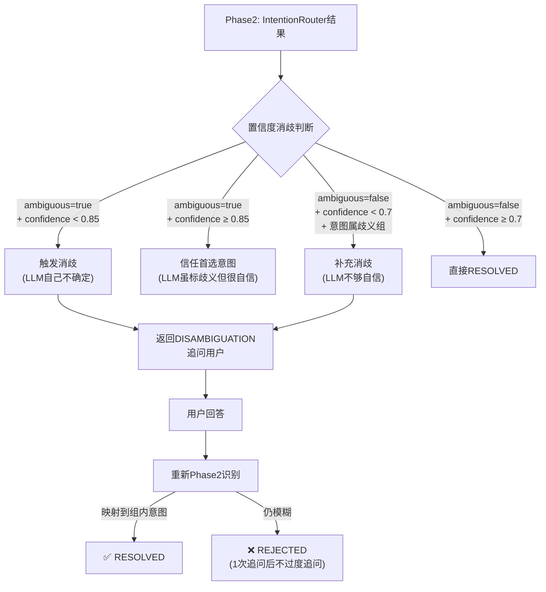
```mermaid
flowchart TD
    P2["Phase2: IntentionRouter结果"] --> CHECK{"置信度消歧判断"}
    
    CHECK -->|"ambiguous=true<br/>+ confidence < 0.85"| DIS1["触发消歧<br/>(LLM自己不确定)"]
    CHECK -->|"ambiguous=true<br/>+ confidence ≥ 0.85"| TRUST["信任首选意图<br/>(LLM虽标歧义但很自信)"]
    CHECK -->|"ambiguous=false<br/>+ confidence < 0.7<br/>+ 意图属歧义组"| DIS2["补充消歧<br/>(LLM不够自信)"]
    CHECK -->|"ambiguous=false<br/>+ confidence ≥ 0.7"| RESOLVED["直接RESOLVED"]
    
    DIS1 & DIS2 --> QUESTION["返回DISAMBIGUATION<br/>追问用户"]
    QUESTION --> ANSWER["用户回答"]
    ANSWER --> RE_ID["重新Phase2识别"]
    RE_ID -->|"映射到组内意图"| RESOLVED2["✅ RESOLVED"]
    RE_ID -->|"仍模糊"| REJECTED["❌ REJECTED<br/>(1次追问后不过度追问)"]
```

**RESUME判定优先级** (RoutingService.resolveRouteType):
1. Phase2 LLM明确判断为RESUME → RESUME
2. Phase1已经是RESUME → RESUME
3. 识别到的意图在suspendedAgents中 → RESUME (状态兜底，防止LLM漏判)
4. Phase1是FOLLOW_UP但无activeThread → SWITCH_NEW
5. 兜底: Phase1的routeType

---

## 4. L2 子智能体 Graph 层

### 4.1 Graph 通用架构

所有L2 Graph继承自`AbstractGraphConfig`，共享统一的结构：

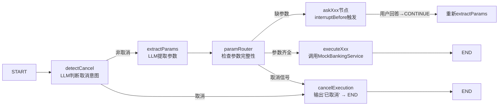
```mermaid
graph LR
    START --> DC["detectCancel<br/>LLM判断取消意图"]
    DC -->|"非取消"| EP["extractParams<br/>LLM提取参数"]
    DC -->|"取消"| CE["cancelExecution<br/>输出'已取消' → END"]
    EP --> PR["paramRouter<br/>检查参数完整性"]
    PR -->|"缺参数"| ASK["askXxx节点<br/>interruptBefore触发"]
    PR -->|"参数齐全"| EXEC["executeXxx<br/>调用MockBankingService"]
    PR -->|"取消信号"| CE
    ASK -->|"用户回答→CONTINUE"| EP2["重新extractParams"]
    EXEC --> END2["END"]
    CE --> END3["END"]
```

### 4.2 四个Graph参数对照表

| Graph | 必填参数 | 可选参数 | State Key前缀 | 追问节点 |
|-------|---------|---------|-------------|---------|
| TransferGraph | receiver, amount | purpose | `transfer.` | askReceiver, askAmount |
| BillQueryGraph | timePeriod | expenseType | `bill.` | askTime, askType |
| WealthConsultGraph | riskLevel | focusArea | `wealthConsult.` | askRiskLevel, askFocusArea |
| WealthInterpretGraph | productName | — | `wealthInterpret.` | askProductName |

### 4.3 resumeGraph 核心机制

**不使用SAA框架的resume()**，原因是Bug#4519: interruptBefore在resume后不会重新触发。

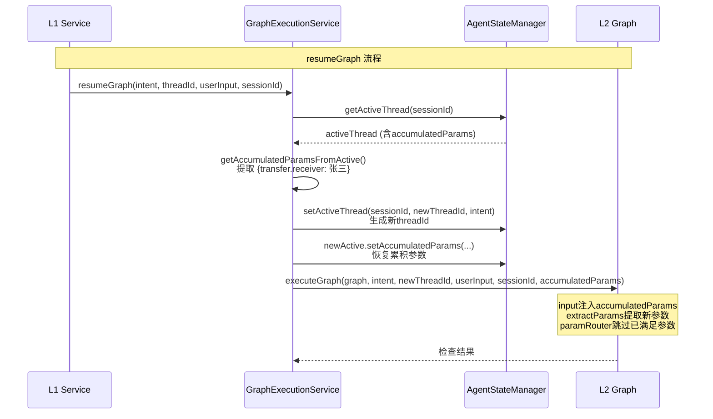
```mermaid
sequenceDiagram
    participant L1 as L1 Service
    participant GES as GraphExecutionService
    participant ASM as AgentStateManager
    participant Graph as L2 Graph
    
    Note over L1,Graph: resumeGraph 流程
    L1->>GES: resumeGraph(intent, threadId, userInput, sessionId)
    GES->>ASM: getActiveThread(sessionId)
    ASM-->>GES: activeThread (含accumulatedParams)
    GES->>GES: getAccumulatedParamsFromActive()<br/>提取 {transfer.receiver: 张三}
    GES->>ASM: setActiveThread(sessionId, newThreadId, intent)<br/>生成新threadId
    GES->>ASM: newActive.setAccumulatedParams(...)<br/>恢复累积参数
    GES->>Graph: executeGraph(graph, intent, newThreadId, userInput, sessionId, accumulatedParams)
    Note over Graph: input注入accumulatedParams<br/>extractParams提取新参数<br/>paramRouter跳过已满足参数
    Graph-->>GES: 检查结果
```

### 4.4 interruptBefore 中断检测

GraphExecutionService.checkGraphResult() 的判断逻辑：

```
1. nextNode非空且非__END__ → INTERRUPTED (interruptBefore触发)
2. nextNode为__END__ 但 _question非空 → INTERRUPTED (ask→END兜底)
3. nextNode为__END__ 且 _question为空 → COMPLETED
```

中断时：suspendAgent → setActiveThread → 保存accumulatedParams → 返回INTERRUPTED+question

---

## 5. AgentStateManager 状态管理

### 5.1 数据结构

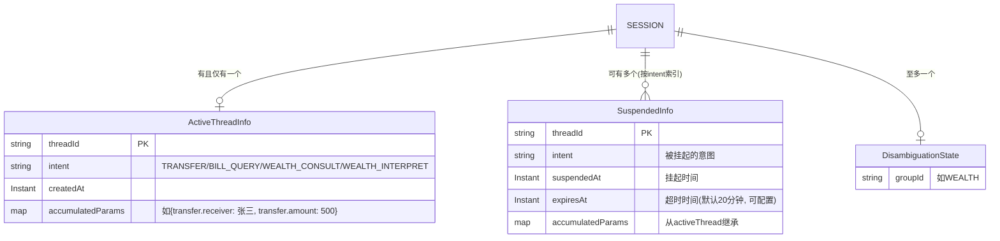
```mermaid
erDiagram
    SESSION ||--o| ActiveThreadInfo : "有且仅有一个"
    SESSION ||--o{ SuspendedInfo : "可有多个(按intent索引)"
    SESSION ||--o| DisambiguationState : "至多一个"
    
    ActiveThreadInfo {
        string threadId PK
        string intent "TRANSFER/BILL_QUERY/WEALTH_CONSULT/WEALTH_INTERPRET"
        Instant createdAt
        map accumulatedParams "如{transfer.receiver: 张三, transfer.amount: 500}"
    }
    
    SuspendedInfo {
        string threadId PK
        string intent "被挂起的意图"
        Instant suspendedAt "挂起时间"
        Instant expiresAt "超时时间(默认20分钟, 可配置)"
        map accumulatedParams "从activeThread继承"
    }
    
    DisambiguationState {
        string groupId "如WEALTH"
    }
```

### 5.2 线程生命周期

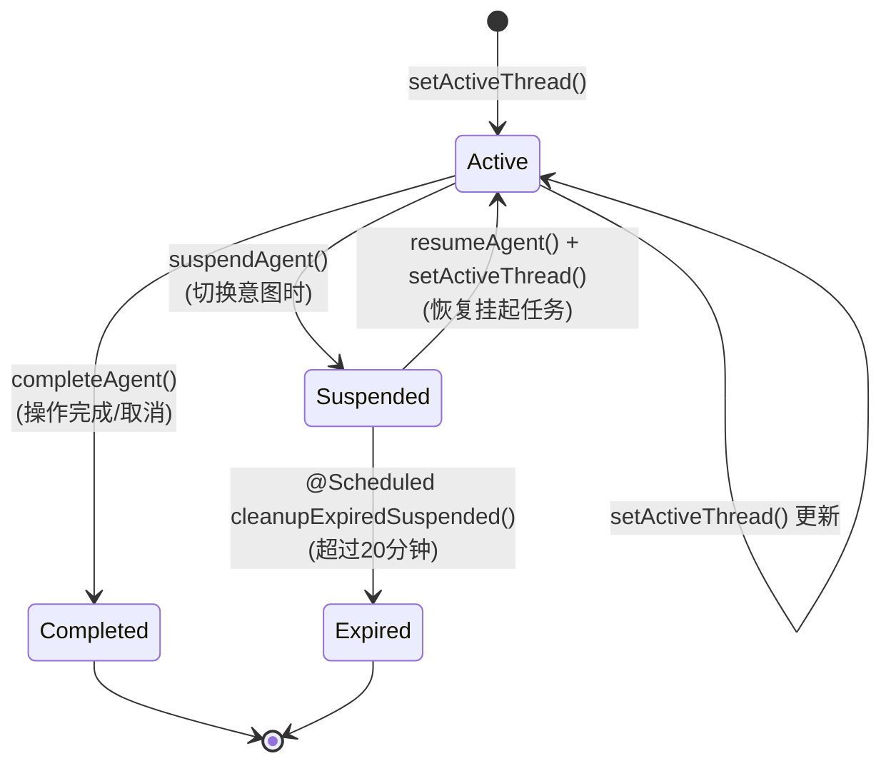
```mermaid
stateDiagram-v2
    [*] --> Active: setActiveThread()
    
    Active --> Active: setActiveThread() 更新
    Active --> Suspended: suspendAgent()<br/>(切换意图时)
    Active --> Completed: completeAgent()<br/>(操作完成/取消)
    
    Suspended --> Active: resumeAgent() + setActiveThread()<br/>(恢复挂起任务)
    Suspended --> Expired: @Scheduled cleanupExpiredSuspended()<br/>(超过20分钟)
    
    Completed --> [*]
    Expired --> [*]
```

### 5.3 关键方法

| 方法 | 作用 | 调用场景 |
|------|------|---------|
| `setActiveThread(sessionId, threadId, intent)` | 设置/清除活跃线程 | 新建意图、恢复意图 |
| `suspendAgent(sessionId, intent, threadId)` | 挂起意图线程(继承accumulatedParams) | 切换意图、消歧时 |
| `resumeAgent(sessionId, intent)` | 从suspendedAgents恢复 | RESUME路由 |
| `completeAgent(sessionId, intent)` | 完成(清空active+移除suspended) | 操作完成/取消 |
| `getSuspendedThread(sessionId, intent)` | 获取挂起线程(自动检查过期) | RESUME判定 |
| `cleanupExpiredSuspended()` | 定时清理过期挂起记录(@Scheduled每分钟) | 自动执行 |

### 5.4 配置项

| 配置 | 默认值 | 说明 |
|------|-------|------|
| `session.pending-agents.max-depth` | 3 | 最大挂起深度，超出时淘汰最早的 |
| `session.pending-agents.expire-minutes` | 20 | 挂起超时(分钟)，超时自动清理 |

### 5.5 accumulatedParams 传递链

```
Graph中断 → checkGraphResult() → extractAccumulatedParams() → active.setAccumulatedParams()
                                ↓
suspendAgent() → info.setAccumulatedParams(active.getAccumulatedParams())  // 继承
                                ↓
resumeAgent() → newActive.setAccumulatedParams(suspendedInfo.getAccumulatedParams())  // 恢复
                                ↓
resumeGraph() → executeGraph(..., accumulatedParams) → input.putAll(accumulatedParams)  // 注入Graph
```

---

## 6. 场景流程图

### 6.1 一句直达

用户一句话包含所有必要参数，L0路由→L1 SWITCH_NEW→L2直接完成。

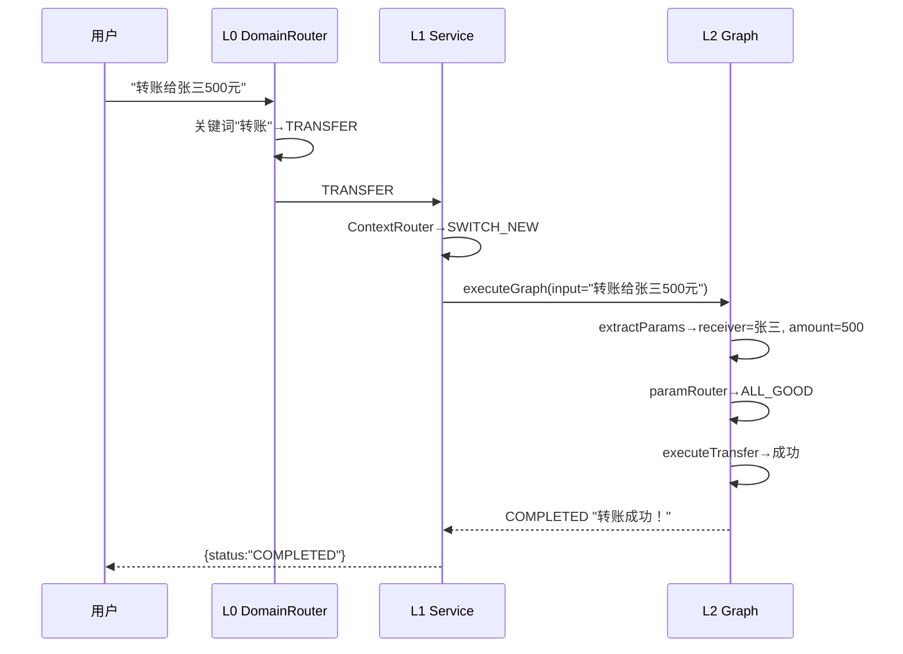
```mermaid
sequenceDiagram
    participant U as 用户
    participant L0 as L0 DomainRouter
    participant L1 as L1 Service
    participant L2 as L2 Graph
    
    U->>L0: "转账给张三500元"
    L0->>L0: 关键词"转账"→TRANSFER
    L0->>L1: TRANSFER
    L1->>L1: ContextRouter→SWITCH_NEW
    L1->>L2: executeGraph(input="转账给张三500元")
    L2->>L2: extractParams→receiver=张三, amount=500
    L2->>L2: paramRouter→ALL_GOOD
    L2->>L2: executeTransfer→成功
    L2-->>L1: COMPLETED "转账成功！"
    L1-->>U: {status:"COMPLETED"}
```

### 6.2 意图接续 (FOLLOW_UP)

用户回答子智能体的追问，参数逐步收集。

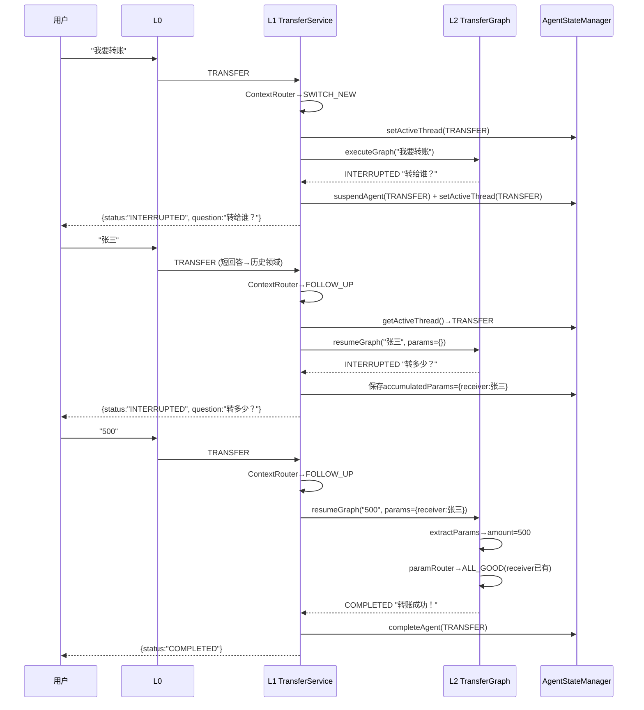
```mermaid
sequenceDiagram
    participant U as 用户
    participant L0 as L0
    participant L1 as L1 TransferService
    participant L2 as L2 TransferGraph
    participant SM as AgentStateManager
    
    U->>L0: "我要转账"
    L0->>L1: TRANSFER
    L1->>L1: ContextRouter→SWITCH_NEW
    L1->>SM: setActiveThread(TRANSFER)
    L1->>L2: executeGraph("我要转账")
    L2-->>L1: INTERRUPTED "转给谁？"
    L1->>SM: suspendAgent(TRANSFER) + setActiveThread(TRANSFER)
    L1-->>U: {status:"INTERRUPTED", question:"转给谁？"}
    
    U->>L0: "张三"
    L0->>L1: TRANSFER (短回答→历史领域)
    L1->>L1: ContextRouter→FOLLOW_UP
    L1->>SM: getActiveThread()→TRANSFER
    L1->>L2: resumeGraph("张三", params={})
    L2-->>L1: INTERRUPTED "转多少？"
    L1->>SM: 保存accumulatedParams={receiver:张三}
    L1-->>U: {status:"INTERRUPTED", question:"转多少？"}
    
    U->>L0: "500"
    L0->>L1: TRANSFER
    L1->>L1: ContextRouter→FOLLOW_UP
    L1->>L2: resumeGraph("500", params={receiver:张三})
    L2->>L2: extractParams→amount=500
    L2->>L2: paramRouter→ALL_GOOD(receiver已有)
    L2-->>L1: COMPLETED "转账成功！"
    L1->>SM: completeAgent(TRANSFER)
    L1-->>U: {status:"COMPLETED"}
```

### 6.3 中断恢复 (INTERRUPTED→resume)

子智能体因缺参数中断，用户回答后恢复执行。流程同6.2，核心是resumeGraph机制。

### 6.4 跨领域意图切换

用户在A流程中被B打断，A被挂起，可后续恢复。

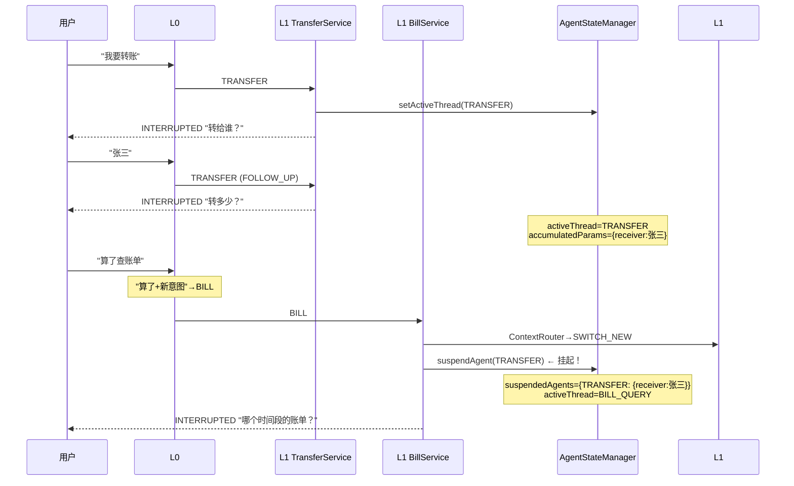
```mermaid
sequenceDiagram
    participant U as 用户
    participant L0 as L0
    participant TS as L1 TransferService
    participant BS as L1 BillService
    participant SM as AgentStateManager
    
    U->>L0: "我要转账"
    L0->>TS: TRANSFER
    TS->>SM: setActiveThread(TRANSFER)
    TS-->>U: INTERRUPTED "转给谁？"
    
    U->>L0: "张三"
    L0->>TS: TRANSFER (FOLLOW_UP)
    TS-->>U: INTERRUPTED "转多少？"
    Note over SM: activeThread=TRANSFER<br/>accumulatedParams={receiver:张三}
    
    U->>L0: "算了查账单"
    Note over L0: "算了+新意图"→BILL
    L0->>BS: BILL
    BS->>L1: ContextRouter→SWITCH_NEW
    BS->>SM: suspendAgent(TRANSFER) ← 挂起！
    Note over SM: suspendedAgents={TRANSFER: {receiver:张三}}<br/>activeThread=BILL_QUERY
    BS-->>U: INTERRUPTED "哪个时间段的账单？"
```

### 6.5 意图恢复 (RESUME)

用户从挂起列表恢复之前被中断的任务。

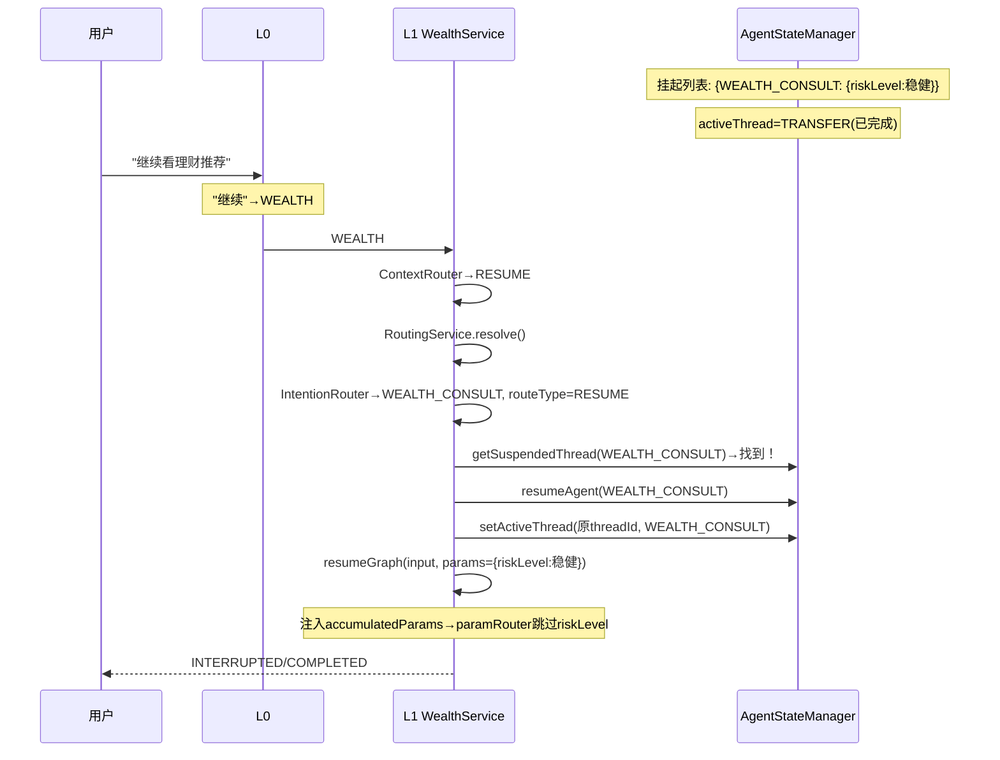
```mermaid
sequenceDiagram
    participant U as 用户
    participant L0 as L0
    participant WS as L1 WealthService
    participant SM as AgentStateManager
    
    Note over SM: 挂起列表: {WEALTH_CONSULT: {riskLevel:稳健}}
    Note over SM: activeThread=TRANSFER(已完成)
    
    U->>L0: "继续看理财推荐"
    Note over L0: "继续"→WEALTH
    L0->>WS: WEALTH
    WS->>WS: ContextRouter→RESUME
    WS->>WS: RoutingService.resolve()
    WS->>WS: IntentionRouter→WEALTH_CONSULT, routeType=RESUME
    WS->>SM: getSuspendedThread(WEALTH_CONSULT)→找到！
    WS->>SM: resumeAgent(WEALTH_CONSULT)
    WS->>SM: setActiveThread(原threadId, WEALTH_CONSULT)
    WS->>WS: resumeGraph(input, params={riskLevel:稳健})
    Note over WS: 注入accumulatedParams→paramRouter跳过riskLevel
    WS-->>U: INTERRUPTED/COMPLETED
```

### 6.6 取消操作

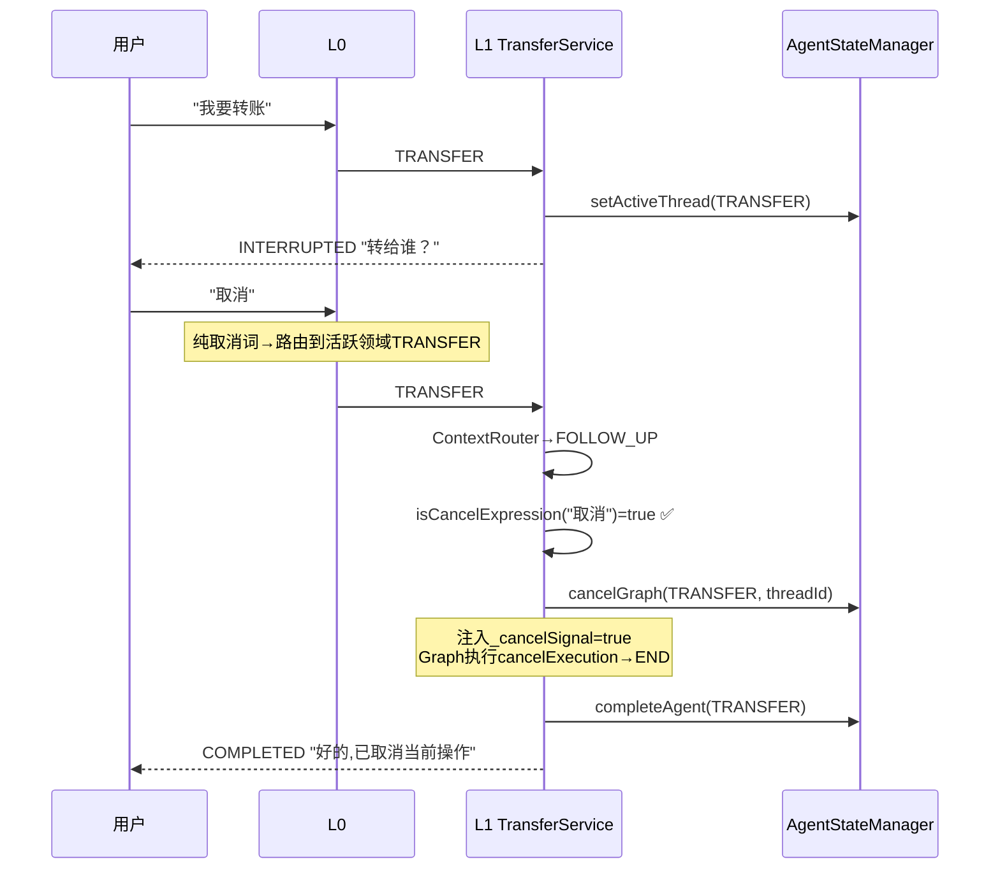
```mermaid
sequenceDiagram
    participant U as 用户
    participant L0 as L0
    participant TS as L1 TransferService
    participant SM as AgentStateManager
    
    U->>L0: "我要转账"
    L0->>TS: TRANSFER
    TS->>SM: setActiveThread(TRANSFER)
    TS-->>U: INTERRUPTED "转给谁？"
    
    U->>L0: "取消"
    Note over L0: 纯取消词→路由到活跃领域TRANSFER
    L0->>TS: TRANSFER
    TS->>TS: ContextRouter→FOLLOW_UP
    TS->>TS: isCancelExpression("取消")=true ✅
    TS->>SM: cancelGraph(TRANSFER, threadId)
    Note over TS: 注入_cancelSignal=true<br/>Graph执行cancelExecution→END
    TS->>SM: completeAgent(TRANSFER)
    TS-->>U: COMPLETED "好的,已取消当前操作"
```

### 6.7 闲聊

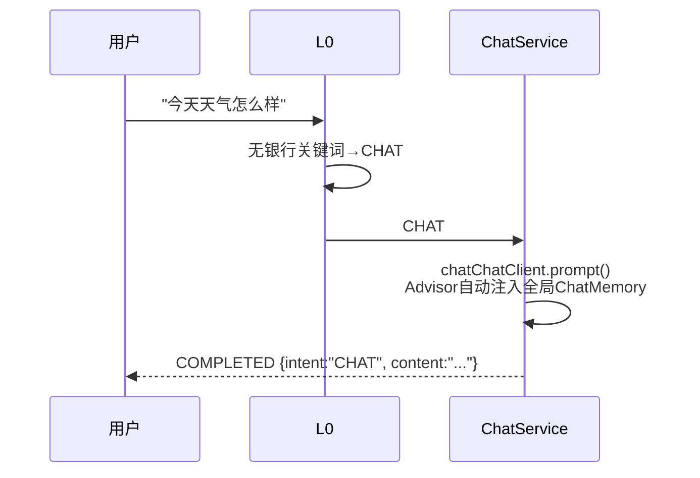
```mermaid
sequenceDiagram
    participant U as 用户
    participant L0 as L0
    participant CS as ChatService
    
    U->>L0: "今天天气怎么样"
    L0->>L0: 无银行关键词→CHAT
    L0->>CS: CHAT
    CS->>CS: chatChatClient.prompt()<br/>Advisor自动注入全局ChatMemory
    CS-->>U: COMPLETED {intent:"CHAT", content:"..."}
```

### 6.8 FOLLOW_UP无activeThread → ContextRewriter

用户完成操作后继续追问，此时activeThread已清空。

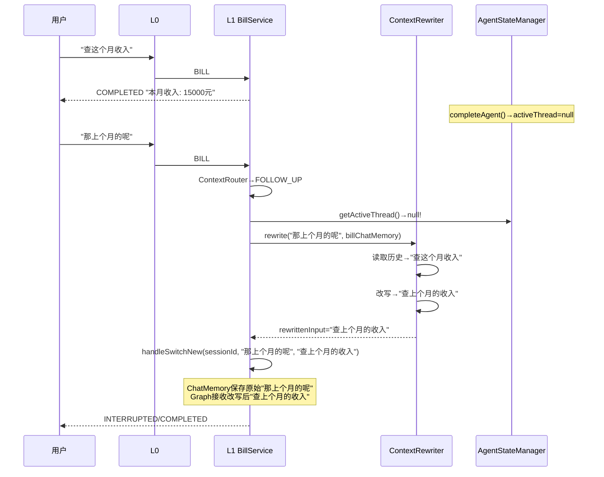
```mermaid
sequenceDiagram
    participant U as 用户
    participant L0 as L0
    participant BS as L1 BillService
    participant CR as ContextRewriter
    participant SM as AgentStateManager
    
    U->>L0: "查这个月收入"
    L0->>BS: BILL
    BS-->>U: COMPLETED "本月收入: 15000元"
    Note over SM: completeAgent()→activeThread=null
    
    U->>L0: "那上个月的呢"
    L0->>BS: BILL
    BS->>BS: ContextRouter→FOLLOW_UP
    BS->>SM: getActiveThread()→null!
    BS->>CR: rewrite("那上个月的呢", billChatMemory)
    CR->>CR: 读取历史→"查这个月收入"
    CR->>CR: 改写→"查上个月的收入"
    CR-->>BS: rewrittenInput="查上个月的收入"
    BS->>BS: handleSwitchNew(sessionId, "那上个月的呢", "查上个月的收入")
    Note over BS: ChatMemory保存原始"那上个月的呢"<br/>Graph接收改写后"查上个月的收入"
    BS-->>U: INTERRUPTED/COMPLETED
```

### 6.9 消歧 (理财领域)

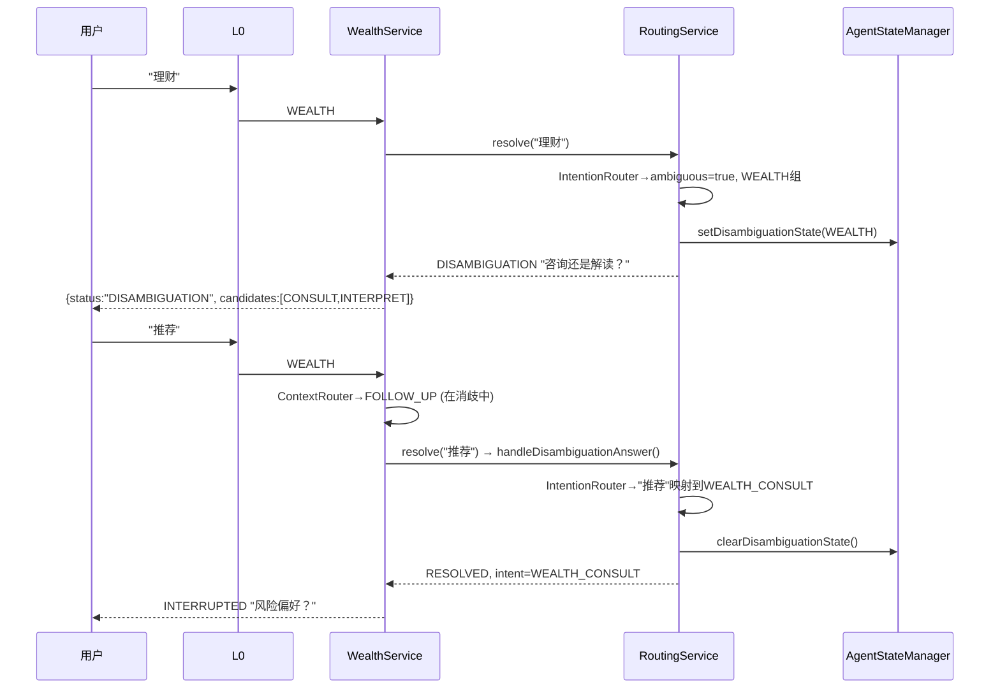
```mermaid
sequenceDiagram
    participant U as 用户
    participant L0 as L0
    participant WS as WealthService
    participant RS as RoutingService
    participant SM as AgentStateManager
    
    U->>L0: "理财"
    L0->>WS: WEALTH
    WS->>RS: resolve("理财")
    RS->>RS: IntentionRouter→ambiguous=true, WEALTH组
    RS->>SM: setDisambiguationState(WEALTH)
    RS-->>WS: DISAMBIGUATION "咨询还是解读？"
    WS-->>U: {status:"DISAMBIGUATION", candidates:[CONSULT,INTERPRET]}
    
    U->>L0: "推荐"
    L0->>WS: WEALTH
    WS->>WS: ContextRouter→FOLLOW_UP (在消歧中)
    WS->>RS: resolve("推荐") → handleDisambiguationAnswer()
    RS->>RS: IntentionRouter→"推荐"映射到WEALTH_CONSULT
    RS->>SM: clearDisambiguationState()
    RS-->>WS: RESOLVED, intent=WEALTH_CONSULT
    WS-->>U: INTERRUPTED "风险偏好？"
```

---

## 7. 类图与调用关系

### 7.1 核心类继承关系

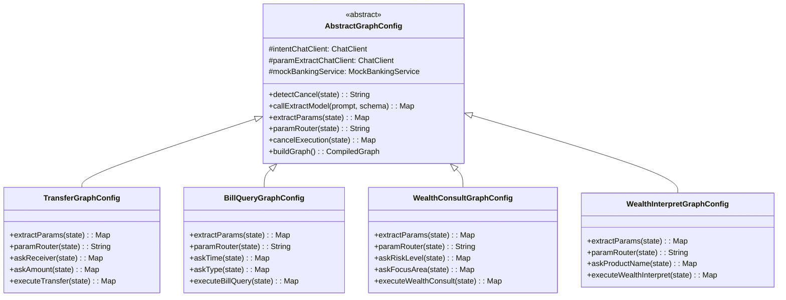
```mermaid
classDiagram
    class AbstractGraphConfig {
        <<abstract>>
        #intentChatClient: ChatClient
        #paramExtractChatClient: ChatClient
        #mockBankingService: MockBankingService
        +detectCancel(state): String
        +callExtractModel(prompt, schema): Map
        +extractParams(state): Map
        +paramRouter(state): String
        +cancelExecution(state): Map
        +buildGraph(): CompiledGraph
    }
    
    class TransferGraphConfig {
        +extractParams(state): Map
        +paramRouter(state): String
        +askReceiver(state): Map
        +askAmount(state): Map
        +executeTransfer(state): Map
    }
    
    class BillQueryGraphConfig {
        +extractParams(state): Map
        +paramRouter(state): String
        +askTime(state): Map
        +askType(state): Map
        +executeBillQuery(state): Map
    }
    
    class WealthConsultGraphConfig {
        +extractParams(state): Map
        +paramRouter(state): String
        +askRiskLevel(state): Map
        +askFocusArea(state): Map
        +executeWealthConsult(state): Map
    }
    
    class WealthInterpretGraphConfig {
        +extractParams(state): Map
        +paramRouter(state): String
        +askProductName(state): Map
        +executeWealthInterpret(state): Map
    }
    
    AbstractGraphConfig <|-- TransferGraphConfig
    AbstractGraphConfig <|-- BillQueryGraphConfig
    AbstractGraphConfig <|-- WealthConsultGraphConfig
    AbstractGraphConfig <|-- WealthInterpretGraphConfig
```

### 7.2 L1 Service 调用关系

```mermaid
classDiagram
    class BankController {
        -domainRouter: DomainRouter
        -wealthService: WealthService
        -transferService: TransferService
        -billService: BillService
        -chatService: ChatService
        -chatMemory: ChatMemory
        -stateManager: AgentStateManager
        +chat(sessionId, message): WorkflowOutput
        +getState(sessionId): Map
        +clearSession(sessionId): Map
    }
    
    class DomainRouter {
        -domainChatClient: ChatClient
        -chatMemory: ChatMemory
        -judgmentMaxPairs: int
        +route(sessionId, userInput): DomainResult
    }
    
    class WealthService {
        -contextRouter: ContextRouter
        -routingService: RoutingService
        -graphExecutionService: GraphExecutionService
        -intentRegistry: IntentRegistry
        -stateManager: AgentStateManager
        -wealthChatMemory: ChatMemory
        +handle(sessionId, userInput): WorkflowOutput
    }
    
    class TransferService {
        -contextRouter: ContextRouter
        -contextRewriter: ContextRewriter
        -graphExecutionService: GraphExecutionService
        -intentRegistry: IntentRegistry
        -stateManager: AgentStateManager
        -transferChatMemory: ChatMemory
        +handle(sessionId, userInput): WorkflowOutput
    }
    
    class BillService {
        -contextRouter: ContextRouter
        -contextRewriter: ContextRewriter
        -graphExecutionService: GraphExecutionService
        -intentRegistry: IntentRegistry
        -stateManager: AgentStateManager
        -billChatMemory: ChatMemory
        +handle(sessionId, userInput): WorkflowOutput
    }
    
    class ContextRouter {
        -chatClient: ChatClient
        -intentRegistry: IntentRegistry
        -judgmentMaxPairs: int
        +route(sessionId, userInput, stateManager, template, domain, chatMemory): RoutingResult
    }
    
    class IntentionRouter {
        -chatClient: ChatClient
        -intentRegistry: IntentRegistry
        -judgmentMaxPairs: int
        +rewriteAndIdentify(sessionId, userInput, phase1, stateManager, chatMemory): RoutingResult
    }
    
    class ContextRewriter {
        -chatClient: ChatClient
        -judgmentMaxPairs: int
        +rewrite(sessionId, userInput, chatMemory, domainName): String
    }
    
    class RoutingService {
        -intentionRouter: IntentionRouter
        -intentRegistry: IntentRegistry
        -stateManager: AgentStateManager
        -disambiguationThreshold: double
        -highConfidenceBypass: double
        +resolve(sessionId, userInput, phase1, chatMemory): RoutingResolution
    }
    
    class GraphExecutionService {
        -intentRegistry: IntentRegistry
        -stateManager: AgentStateManager
        +executeGraph(graph, intent, threadId, userInput, sessionId, params): WorkflowOutput
        +resumeGraph(intent, threadId, userInput, sessionId): WorkflowOutput
        +cancelGraph(intent, threadId, sessionId): WorkflowOutput
        +checkGraphResult(graph, config, intent, threadId, sessionId): WorkflowOutput
    }
    
    BankController --> DomainRouter
    BankController --> WealthService
    BankController --> TransferService
    BankController --> BillService
    WealthService --> ContextRouter
    WealthService --> RoutingService
    WealthService --> GraphExecutionService
    TransferService --> ContextRouter
    TransferService --> ContextRewriter
    TransferService --> GraphExecutionService
    BillService --> ContextRouter
    BillService --> ContextRewriter
    BillService --> GraphExecutionService
    RoutingService --> IntentionRouter
```

### 7.3 共享服务调用图

```mermaid
graph TD
    subgraph "L0"
        DR["DomainRouter"]
    end
    
    subgraph "L1 Service"
        WS["WealthService"]
        TS["TransferService"]
        BS["BillService"]
    end
    
    subgraph "L1 共享服务"
        CR["ContextRouter"]
        IR["IntentionRouter"]
        CW["ContextRewriter"]
        RS["RoutingService"]
        GES["GraphExecutionService"]
    end
    
    subgraph "状态层"
        ASM["AgentStateManager"]
        IRG["IntentRegistry"]
        CHU["ChatHistoryUtils"]
    end
    
    DR -->|读取全局ChatMemory| CHU
    WS --> CR
    WS --> RS
    RS --> IR
    TS --> CR
    TS --> CW
    BS --> CR
    BS --> CW
    WS & TS & BS --> GES
    
    CR -->|格式化历史| CHU
    IR -->|格式化历史| CHU
    CW -->|格式化历史| CHU
    CR --> ASM
    IR --> ASM
    RS --> ASM
    GES --> ASM
    GES --> IRG
    RS --> IRG
```

---

## 8. 关键代码分析

### 8.1 BankController — L0调度入口

```java
@PostMapping("/chat")
public WorkflowOutput chat(@RequestParam String sessionId, @RequestBody Map<String, String> req) {
    // L0: 领域路由
    DomainRouter.DomainResult domainResult = domainRouter.route(sessionId, userInput);
    
    // 分发到L1
    output = switch (domainResult.domain()) {
        case "WEALTH"   -> wealthService.handle(sessionId, userInput);
        case "TRANSFER" -> transferService.handle(sessionId, userInput);
        case "BILL"     -> billService.handle(sessionId, userInput);
        default         -> chatService.handle(sessionId, userInput);
    };
    
    // 统一记录全局ChatMemory (在Controller层，不在L1内)
    chatMemory.add(sessionId, new UserMessage(userInput));
    recordSystemReply(sessionId, output);
}
```

**关键**: 全局ChatMemory在Controller层统一写入，保证L0 DomainRouter能读到完整历史。

### 8.2 TransferService — FOLLOW_UP+无activeThread处理

```java
if (phase1.isFollowUp()) {
    // 取消检测
    if (active != null && INTENT.equals(active.getIntent()) && isCancelExpression(userInput)) {
        return graphExecutionService.cancelGraph(INTENT, active.getThreadId(), sessionId);
    }
    // 有activeThread → resume
    if (active != null) {
        return graphExecutionService.resumeGraph(active.getIntent(), active.getThreadId(), userInput, sessionId);
    }
    // 无activeThread → ContextRewriter改写后SWITCH_NEW
    String rewrittenInput = contextRewriter.rewrite(sessionId, userInput, transferChatMemory, DOMAIN_NAME);
    transferChatMemory.add(sessionId, new UserMessage(userInput));  // 保存原始话术
    return handleSwitchNew(sessionId, userInput, rewrittenInput);    // Graph用改写后输入
}
```

### 8.3 GraphExecutionService — resumeGraph核心

```java
public WorkflowOutput resumeGraph(String intent, String threadId, String userInput, String sessionId) {
    // 1. 提取累积参数 (在setActiveThread覆盖前!)
    Map<String, Object> accumulatedParams = getAccumulatedParamsFromActive(sessionId, intent);
    // 2. 生成新threadId + 恢复参数
    String newThreadId = prepareReExecution(sessionId, intent, accumulatedParams);
    // 3. 重新执行Graph，注入accumulatedParams
    return executeGraph(graph, intent, newThreadId, userInput, sessionId, accumulatedParams);
}
```

**为什么每次resume用新threadId**: 每次Graph执行都是全新的，accumulatedParams通过input注入让paramRouter跳过已收集参数。

### 8.4 ChatHistoryUtils — 统一历史截断

```java
public static String formatAndTruncate(ChatMemory chatMemory, String sessionId, int judgmentMaxPairs) {
    List<Message> messages = chatMemory.get(sessionId);
    int maxMessages = judgmentMaxPairs * 2;  // 5对=10条
    int start = Math.max(0, messages.size() - maxMessages);
    List<Message> truncated = messages.subList(start, messages.size());
    // 格式化为 "用户: xxx\n助手: yyy"
}
```

4个服务共用：DomainRouter、ContextRouter、IntentionRouter、ContextRewriter。

### 8.5 AgentStateManager — @Scheduled过期清理

```java
@Value("${session.pending-agents.expire-minutes:20}")
private long suspendedExpireMinutes;

@Scheduled(fixedRate = 60_000)
public void cleanupExpiredSuspended() {
    Instant now = Instant.now();
    suspendedAgents.forEach((sessionId, sessionMap) -> {
        sessionMap.entrySet().removeIf(e -> e.getValue().getExpiresAt().isBefore(now));
        if (sessionMap.isEmpty()) suspendedAgents.remove(sessionId);
    });
}
```

超时时间通过`session.pending-agents.expire-minutes`配置，默认20分钟。

---

## 9. 配置项说明

```yaml
# 模型配置
models:
  domain:     { model: qwen2.5-7b-instruct }  # L0 领域路由
  context:    { model: qwen2.5-7b-instruct }  # L1 Phase1 上下文路由
  intent:     { model: qwen2.5-7b-instruct }  # L1 Phase2 意图识别+改写
  param-extract: { model: qwen-plus }          # L2 参数提取
  chat:       { model: qwen-turbo }            # L1 闲聊

# 路由配置
routing:
  deterministic:
    cancel-keywords: ["算了", "不转了", "取消", "不要了", "放弃"]
    short-answer-pattern: "^\\d+(\\.\\d+)?(元|块|万)?$|^(确认|好的|是的|对|继续|可以)$"
  confidence:
    disambiguation-threshold: 0.7    # 低置信度消歧阈值
    high-confidence-bypass: 0.85     # 高置信度豁免阈值
  history:
    max-pairs: 10                    # ChatMemory存储对数
    judgment-max-pairs: 5            # LLM判断使用对数

# 会话状态
session:
  pending-agents:
    max-depth: 3                     # 最大挂起深度
    expire-minutes: 20               # 挂起超时(分钟)
    prompt-max-times: 2              # 提参最大追问次数
    prompt-timeout-seconds: 30       # 提参超时
  last-agent:
    expire-minutes: 5                # 上次agent过期
```

---

## 10. 完整文件清单

| 文件 | 层 | 职责 |
|------|-----|------|
| `controller/BankController.java` | L0 | 入口+调度+全局ChatMemory写入 |
| `router/DomainRouter.java` | L0 | 领域分类(qwen2.5-7b-instruct) |
| `router/ContextRouter.java` | L1 | Phase1: F/S/R路由判断 |
| `router/IntentRouter.java` | L1 | Phase2: 意图识别+上下文改写(理财) |
| `router/IntentResolver.java` | L1 | 意图消歧+置信度增强+模糊匹配 |
| `router/IntentRegistry.java` | 共享 | 意图注册表+Graph绑定+消歧组 |
| `rewriter/ContextRewriter.java` | L1 | 上下文改写(转账/账单) |
| `execution/GraphExecutionService.java` | L1→L2 | Graph执行/resume/cancel |
| `util/ChatHistoryUtils.java` | 共享 | 历史格式化+截断 |
| `domain/WealthService.java` | L1 | 理财路由(Phase1+Phase2+消歧) |
| `domain/TransferService.java` | L1 | 转账路由(简化Phase1+ContextRewriter) |
| `domain/BillService.java` | L1 | 账单路由(简化Phase1+ContextRewriter) |
| `domain/ChatService.java` | L1 | 闲聊(直接ChatClient) |
| `manager/AgentStateManager.java` | 共享 | 线程状态管理(active/suspended/disambig+@Scheduled清理) |
| `data/WorkflowOutput.java` | 共享 | 统一响应DTO |
| `data/RoutingResult.java` | L1 | Phase1/Phase2路由结果 |
| `data/RoutingResolution.java` | L1 | 路由决议(RESOLVED/DISAMBIGUATION/REJECTED) |
| `workflow/AbstractGraphConfig.java` | L2 | Graph基类(参数提取+取消检测) |
| `workflow/TransferGraphConfig.java` | L2 | 转账Graph |
| `workflow/BillQueryGraphConfig.java` | L2 | 账单Graph |
| `workflow/WealthConsultGraphConfig.java` | L2 | 理财推荐Graph |
| `workflow/WealthInterpretGraphConfig.java` | L2 | 理财解读Graph |
| `config/ModelConfig.java` | 配置 | 多模型+ChatMemory Bean定义 |
| `config/AppInitConfig.java` | 配置 | Graph→IntentRegistry绑定 |
| `mock/MockBankingService.java` | Mock | 模拟银行服务(转账/账单/理财) |
| `prompts/l0-domain.st` | Prompt | L0领域分类(42行) |
| `prompts/l1-routing.st` | Prompt | L1理财Phase1(F/S/R) |
| `prompts/l1-routing-simple.st` | Prompt | L1转账/账单Phase1(F/S) |
| `prompts/l1-intention.st` | Prompt | L1理财Phase2意图识别+改写 |
| `prompts/l1-context-rewrite.st` | Prompt | L1转账/账单上下文改写 |
