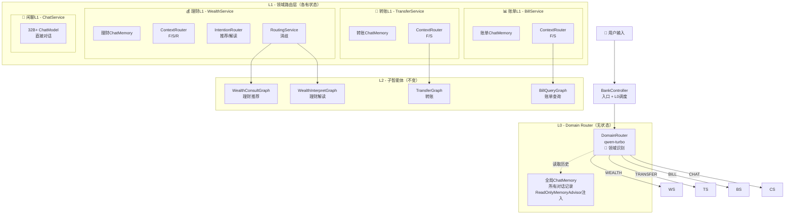
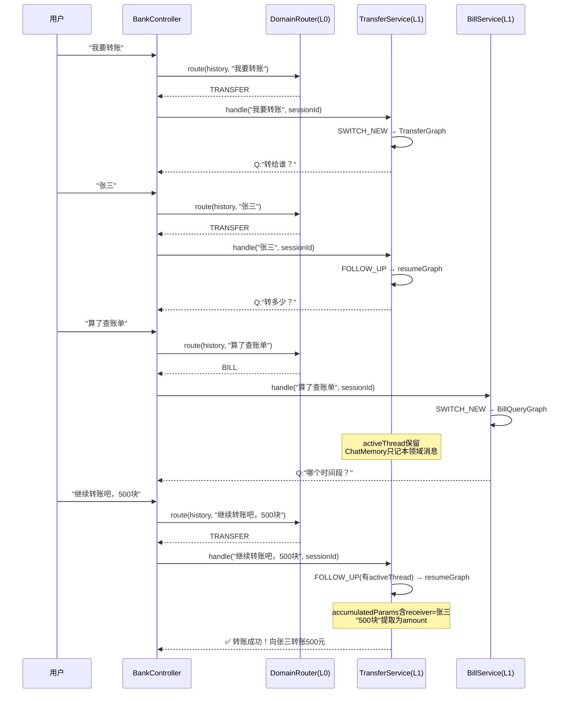
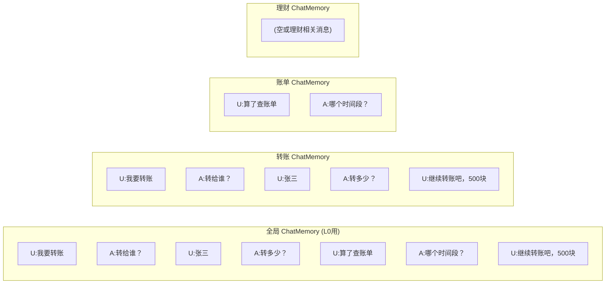
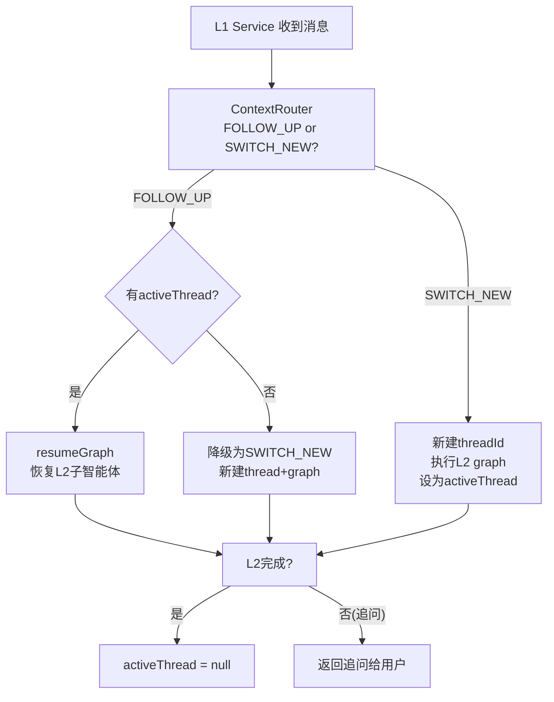
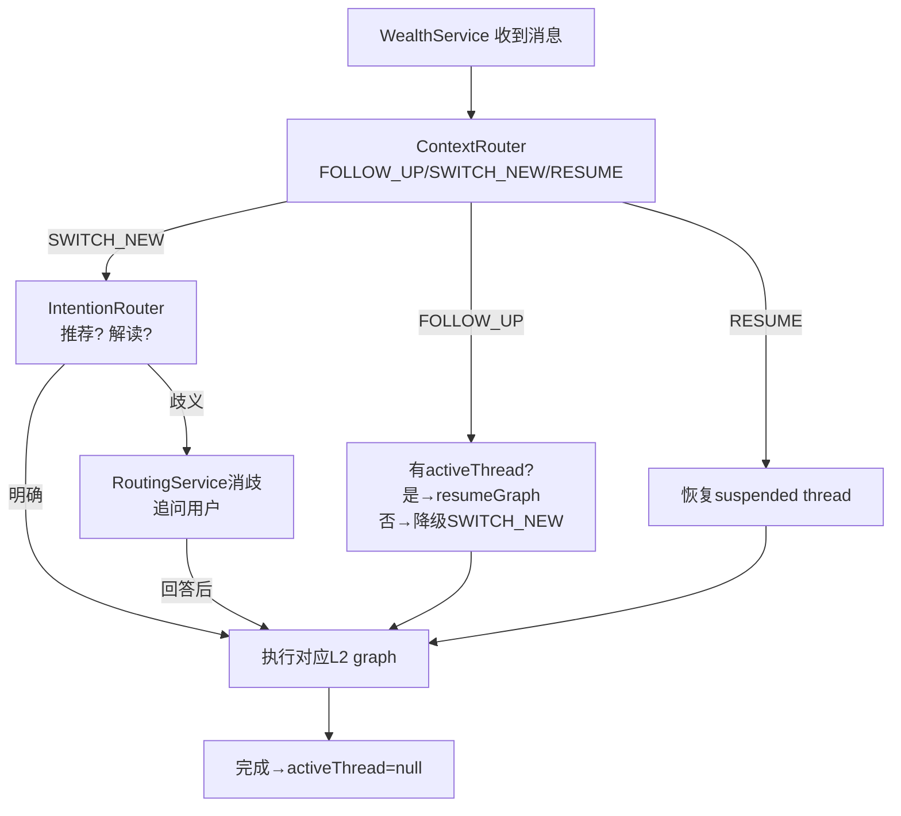

# L0→L1→L2 三层路由架构

## 1. 全景架构图



## 2. 数据流 - 跨领域恢复



## 3. ChatMemory 隔离架构



## 4. 各L1 Service对比

| 特性 | 💰 理财 L1 | 💸 转账 L1 | 📊 账单 L1 | 💬 闲聊 L1 |
|------|-----------|-----------|-----------|-----------|
| **Service** | WealthService | TransferService | BillService | ChatService |
| **ChatMemory** | 独立实例 | 独立实例 | 独立实例 | 无(用L0全局) |
| **ContextRouter** | F/S/R 三种 | F/S 两种 | F/S 两种 | 不需要 |
| **IntentionRouter** | ✅ 推荐/解读 | ❌ | ❌ | ❌ |
| **RoutingService** | ✅ 消歧 | ❌ | ❌ | ❌ |
| **activeThread** | ✅ 有 | ✅ 有 | ✅ 有 | ❌ 无 |
| **suspendedAgents** | ✅ 有(推荐↔解读) | ❌ 无 | ❌ 无 | ❌ 无 |
| **L2子智能体** | 推荐Graph + 解读Graph | TransferGraph | BillQueryGraph | 无 |
| **FOLLOW_UP时** | resumeGraph/回答追问 | resumeGraph | resumeGraph | N/A |
| **SWITCH_NEW时** | 新建thread+graph | 新建thread+graph | 新建thread+graph | N/A |
| **完成后** | activeThread=null | activeThread=null | activeThread=null | N/A |

## 5. L0 DomainRouter 设计

```
输入: 全局ChatMemory历史 + 当前用户消息
模型: qwen-turbo (轻量快速)
输出: { domain: "WEALTH" | "TRANSFER" | "BILL" | "CHAT", confidence: 0.0-1.0 }

判断要点:
- 看用户当前消息的核心意图属于哪个领域
- 结合对话历史判断上下文
- 完全无状态，不管理threadId
- 每轮都重新判断（闲聊中说"查账单"会自动路由到BILL）
```

## 6. 转账/账单 L1 的 FOLLOW_UP 判定



## 7. 理财 L1 内部路由（复用现有逻辑）



## 8. 文件变更清单

### 新增文件
| 文件 | 说明 |
|------|------|
| `domain/DomainRouter.java` | L0领域路由器 |
| `domain/WealthService.java` | 理财L1（复用现有路由逻辑） |
| `domain/TransferService.java` | 转账L1（极简F/S路由） |
| `domain/BillService.java` | 账单L1（极简F/S路由） |
| `domain/ChatService.java` | 闲聊L1（32B+模型） |
| `prompts/l0-domain.st` | L0领域路由prompt |

### 修改文件
| 文件 | 说明 |
|------|------|
| `BankController.java` | 重构: L0调度→分发L1 |
| `ModelConfig.java` | 新增domainChatClient, chatChatClient |
| `application.yml` | 新增models.domain, models.chat配置 |

### 不变文件
| 文件 | 说明 |
|------|------|
| `ContextRouter.java` | 被L1 Service复用 |
| `IntentionRouter.java` | 被WealthService复用 |
| `RoutingService.java` | 被WealthService复用 |
| `GraphExecutionService.java` | 被所有L1 Service复用 |
| `AgentStateManager.java` | 被L1 Service使用 |
| 4个L2 Graph Config | 完全不变 |
