# AI手机银行 架构设计文档

> 基于 Spring AI Alibaba 1.1.2.0 | Master-Slave 多意图对话架构

---

## 一、系统概述

### 1.1 解决的核心问题

手机银行场景下的多轮多任务对话：用户在对话过程中可能**切换意图**、**中断当前操作**、**恢复之前的任务**，系统需要正确管理这些状态转换。

```
典型对话:
  用户: "转账给张三"          → 开始转账，发现缺金额，提问
  用户: "帮我查一下上个月账单"  → 切换！挂起转账，开始查账单
  用户: "回到转账"            → 恢复！回到转账的提问点继续
  用户: "500"                → 追问！回答转账金额，完成转账
```

### 1.2 核心能力

| 能力 | 说明 |
|------|------|
| **意图切换** | 用户从A任务跳到B任务，A被挂起，B启动 |
| **意图中断** | 子智能体提问时中断当前流程，等待用户回答 |
| **意图恢复** | 用户主动回到之前挂起的任务，从断点继续 |
| **追问回答** | 用户回答子智能体的提问，继续当前流程 |

---

## 二、架构总览

### 2.1 分层架构图

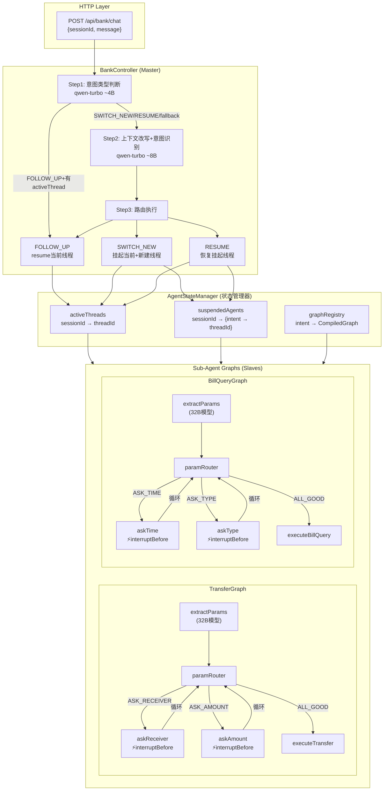

### 2.2 核心设计原则

| 原则 | 说明 |
|------|------|
| **Master-Slave 分离** | Controller 只管"哪个workflow"+"何时切换"，Graph 只管"怎么执行" |
| **通信协议极简** | Graph 输出只有两种：完成结果 或 InterruptionMetadata |
| **状态前缀隔离** | 每个 Sub-Agent 用 `transfer.*` / `bill.*` 前缀管理自己的 OverAllState key |
| **中断不抛异常** | Spring AI Alibaba 通过 `InterruptionMetadata` 在 stream 中表达中断，不是异常 |
| **Checkpoint 驱动恢复** | 每个 threadId 对应一个 checkpoint 链，resume 从 checkpoint 断点继续 |

---

## 三、核心组件详解

### 3.1 BankController（Master 编排器）

**职责**：接收用户消息 → 意图判断 → 路由分发 → 处理中断/完成

**三阶段处理流程**：

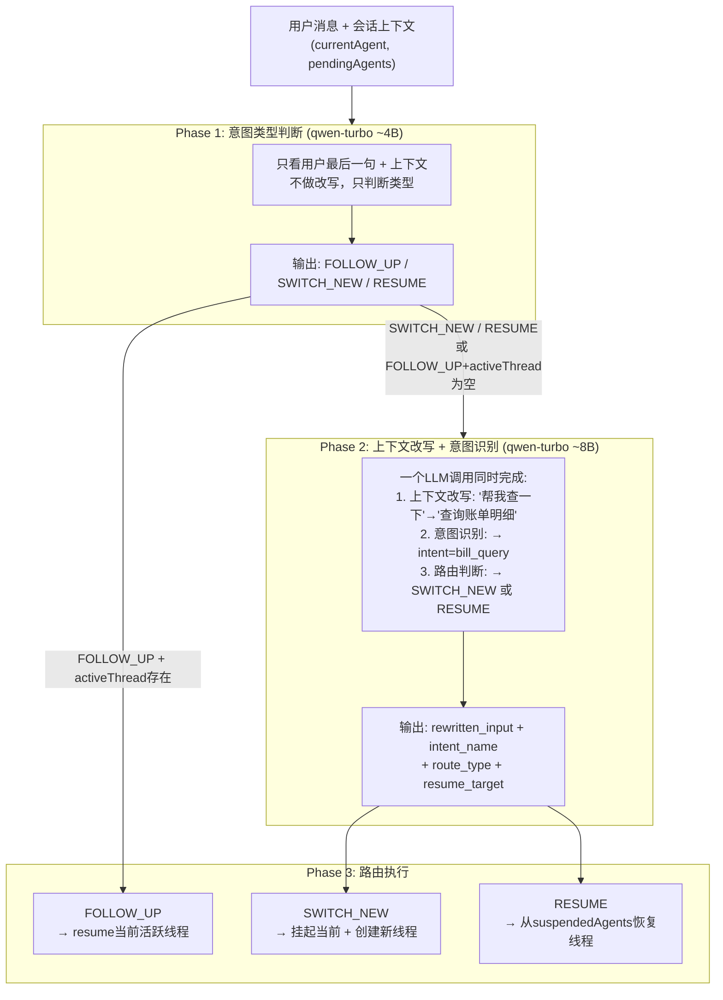

### 3.2 AgentStateManager（状态管理器）

**三张核心数据表**：

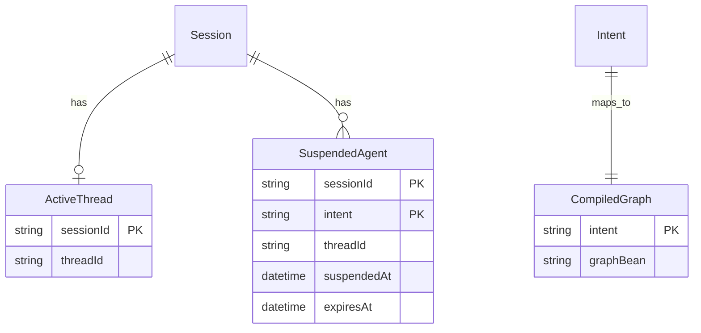

**生命周期说明**：

| 数据表 | 何时写入 | 何时读取 | 何时清除 |
|--------|----------|----------|----------|
| activeThreads | SWITCH_NEW/RESUME/中断时设置 | FOLLOW_UP时读取threadId | 任务完成时清空为null |
| suspendedAgents | 意图切换时挂起旧线程 | RESUME时按intent查找 | 恢复时移除 / 超时30min清理 |
| graphRegistry | 启动时注册 | 每次执行时按intent获取Graph | 永不清除 |

### 3.3 Sub-Agent Graph（Slave 工作流）

**TransferGraph 内部结构**：

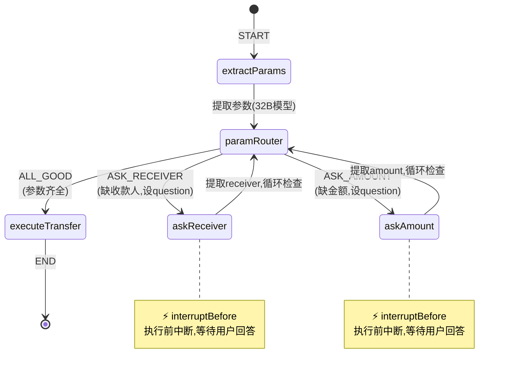

**BillQueryGraph 内部结构**：

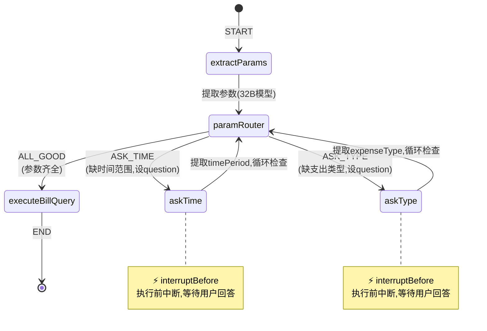

---

## 四、时序图：6种场景

### 4.1 场景1：全新意图（SWITCH_NEW，参数齐全，直接完成）

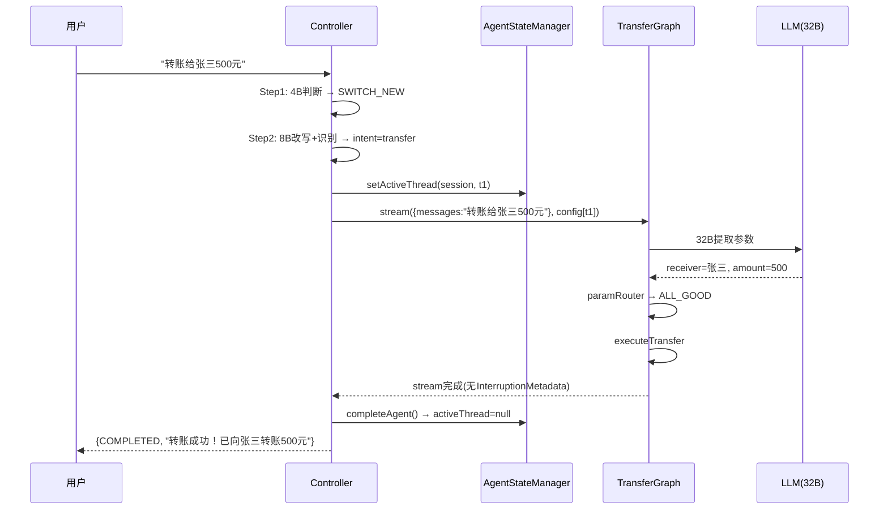

### 4.2 场景2：全新意图（SWITCH_NEW，参数不全，触发中断）

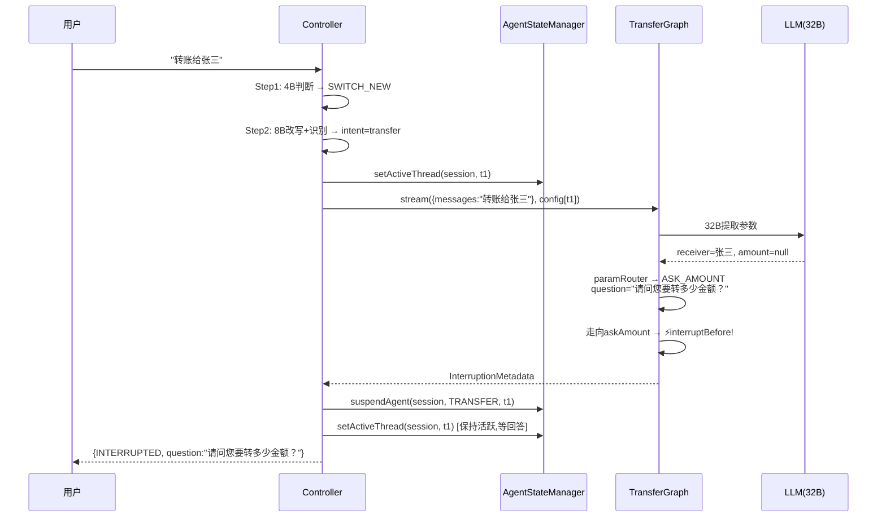

### 4.3 场景3：Follow-Up（回答子智能体提问，直接resume）

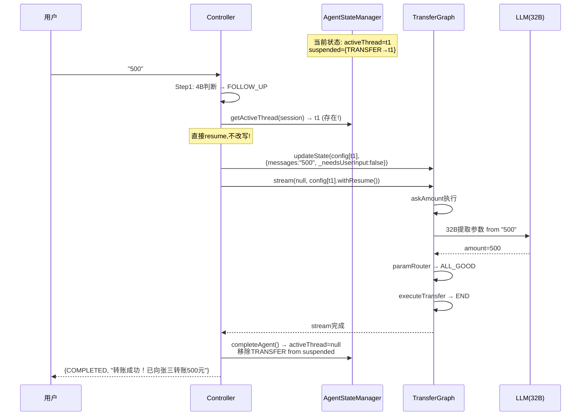

### 4.4 场景4：意图切换（挂起当前任务 + 启动新任务）

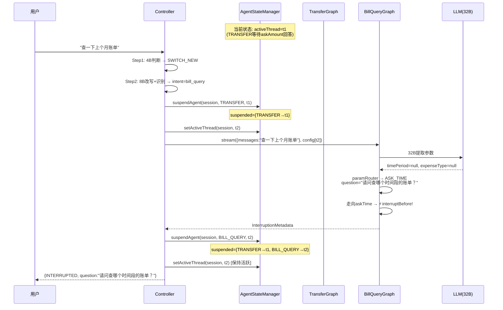

### 4.5 场景5：意图恢复（RESUME，回到挂起任务）

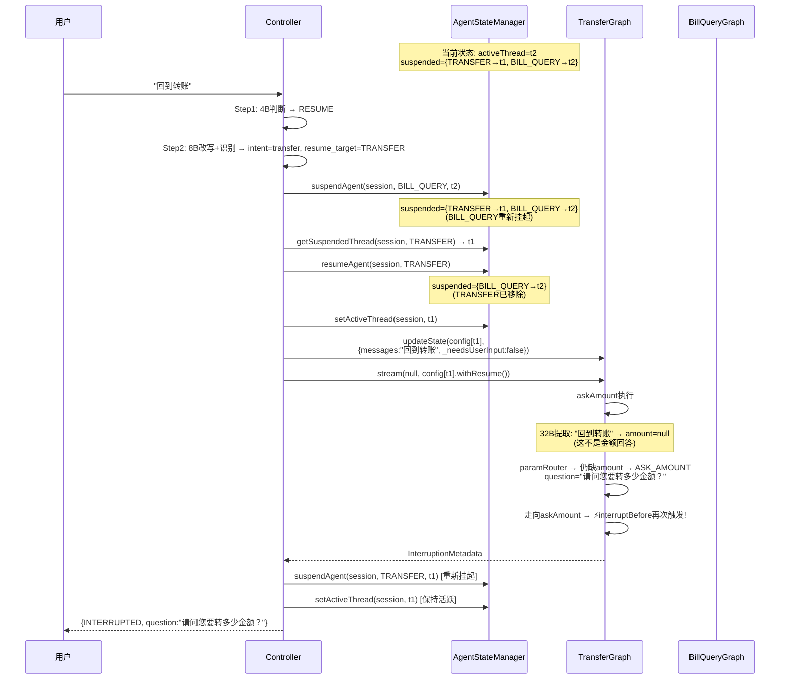

### 4.6 场景6：Follow-Up 但 activeThread 为空（Fallback 到 SWITCH_NEW）

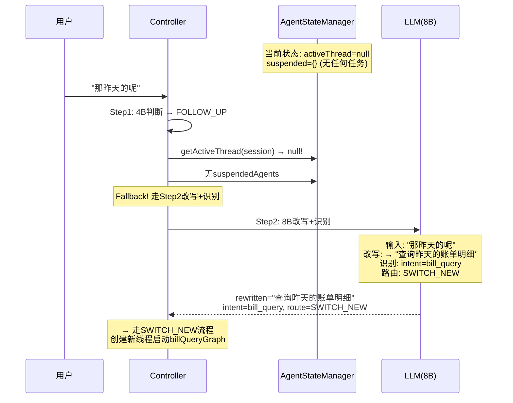

---

## 五、架构图+流程结合图

### 5.1 完整请求处理流程（架构视角）

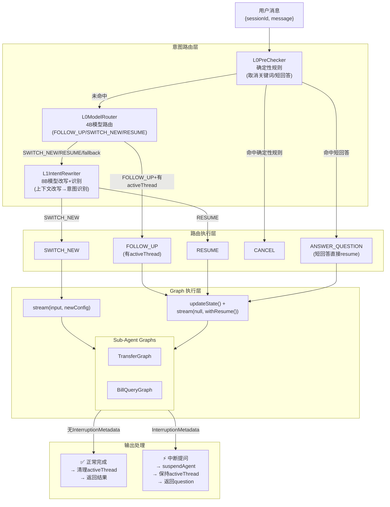

### 5.2 AgentStateManager 状态机

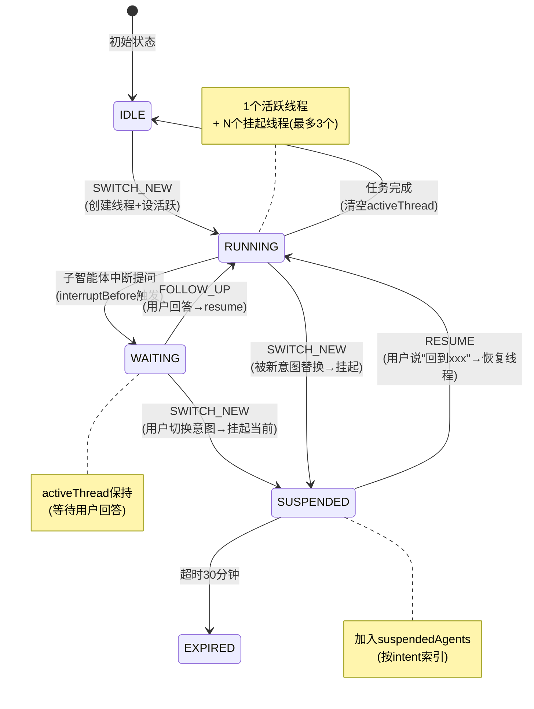

### 5.3 Graph 内部执行与中断恢复流程

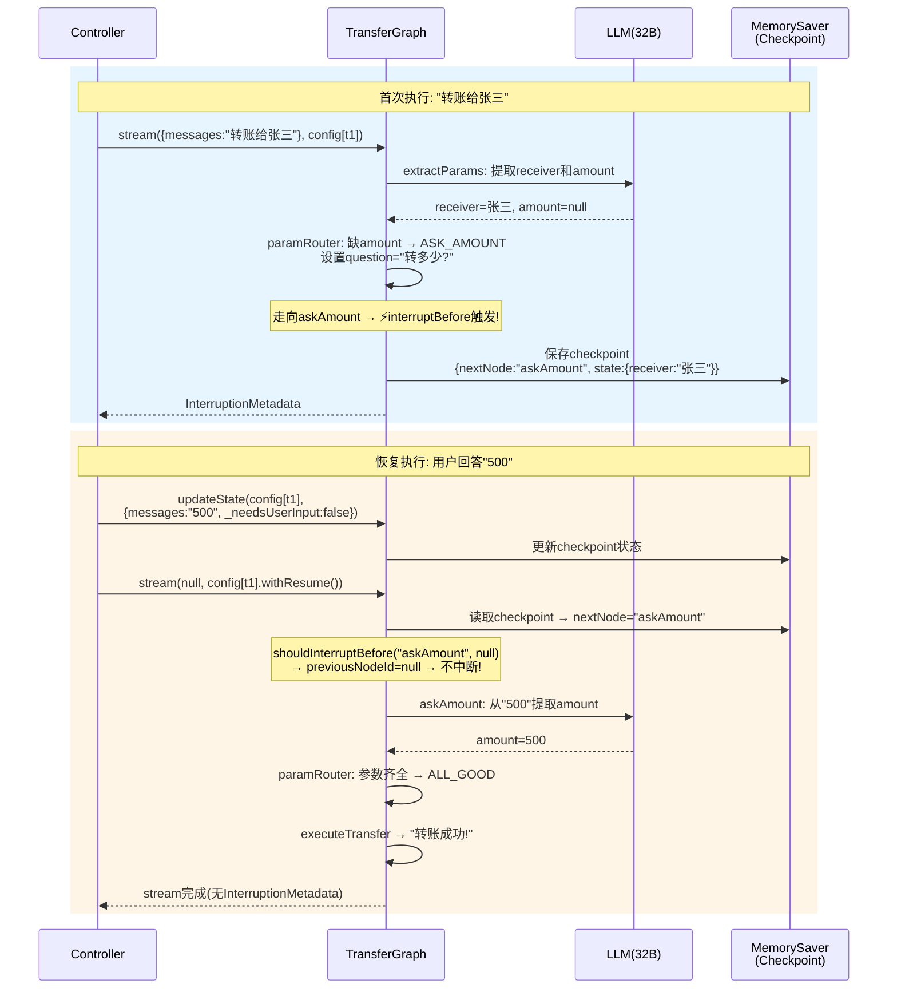

---

## 六、数据模型

### 6.1 OverAllState Key 规范

#### 公共 Key（所有 Graph 共享）

| Key | Strategy | 类型 | 说明 |
|-----|----------|------|------|
| `messages` | Append | String | 用户输入历史 |
| `_needsUserInput` | Replace | Boolean | 是否需要中断提问 |
| `_question` | Replace | String | 向用户提问的话术 |
| `_paramName` | Replace | String | 当前缺的参数名 |
| `_userAnswer` | Replace | String | 用户对提问的回答 |
| `_outputContent` | Replace | String | 输出内容 |
| `_outputType` | Replace | Enum | TEXT/CONFIRMATION/PROGRESS/ERROR |
| `_isFinal` | Replace | Boolean | 是否最终输出 |
| `_isWriteOp` | Replace | Boolean | 是否写操作 |

#### TransferGraph 专用 Key

| Key | Strategy | 类型 | 说明 |
|-----|----------|------|------|
| `transfer.receiver` | Replace | String | 收款人 |
| `transfer.amount` | Replace | BigDecimal | 转账金额 |
| `transfer.purpose` | Replace | String | 用途(可选) |

#### BillQueryGraph 专用 Key

| Key | Strategy | 类型 | 说明 |
|-----|----------|------|------|
| `bill.timePeriod` | Replace | String | 时间范围 |
| `bill.expenseType` | Replace | String | 支出类型 |

### 6.2 API 请求/响应格式

**请求**:
```json
POST /api/bank/chat?sessionId=s123
{
  "message": "转账给张三500元"
}
```

**响应 — 正常完成**:
```json
{
  "status": "COMPLETED",
  "content": "转账成功！已向张三转账500元",
  "intent": "TRANSFER"
}
```

**响应 — 中断提问**:
```json
{
  "status": "INTERRUPTED",
  "question": "请问您要转多少金额？",
  "intent": "TRANSFER",
  "threadId": "s123_a1b2c3d4"
}
```

**响应 — 错误**:
```json
{
  "status": "ERROR",
  "message": "未识别的意图",
  "intent": null
}
```

---

## 七、LLM 调用规范

### 7.1 模型分配

| 用途 | 模型 | 大小 | 配置项 |
|------|------|------|--------|
| 意图类型判断 | qwen-turbo | ~4B | `routing.model.routing-model` |
| 上下文改写+意图识别 | qwen-turbo | ~8B | `routing.model.rewrite-model` |
| 参数提取 | qwen-plus | ~32B | `routing.model.planning-model` |
| 主对话模型 | qwen-plus | 中等 | `spring.ai.dashscope.chat.options.model` |

### 7.2 Prompt 模板

**l0-routing.st** — Step1 意图类型判断:
- 输入: 用户消息 + currentAgent + pendingAgents
- 输出: `{route_type: FOLLOW_UP/SWITCH_NEW/RESUME, confidence, reasoning}`
- 注意: 需要在运行时从 IntentRegistry 填充 `{intent_list}`

**l1-rewrite.st** — Step2 上下文改写+意图识别(合并):
- 输入: 用户消息 + 上下文 + 已注册意图
- 输出: `{rewritten_input, intent_name, route_type, resume_target, confidence}`
- 一个调用完成改写和识别

**transfer-extract.st** — 转账参数提取(32B):
- 输入: 用户消息
- 输出: `{receiver, amount, purpose}`
- 只提取明确提到的参数，不猜测

**bill-extract.st** — 账单参数提取(32B):
- 输入: 用户消息
- 输出: `{timePeriod, expenseType}`
- 保留用户原始时间表述

---

## 八、Spring AI Alibaba 关键 API 用法

### 8.1 创建 Graph 并执行

```java
// 1. 定义 KeyStrategies
StateGraph graph = new StateGraph(() -> {
    Map<String, KeyStrategy> s = new HashMap<>();
    s.put("messages", new AppendStrategy());
    s.put("_needsUserInput", new ReplaceStrategy());
    s.put("transfer.receiver", new ReplaceStrategy());
    // ... 注册所有用到的key
    return s;
});

// 2. 添加节点和边
graph.addNode("extractParams", this::extractParamsNode);
graph.addNode("paramRouter", this::paramRouterNode);
graph.addNode("askReceiver", this::askReceiverNode);
// ...
graph.addEdge(StateGraph.START, "extractParams");
graph.addConditionalEdges("paramRouter", ..., Map.of("ASK_RECEIVER","askReceiver",...));
graph.addEdge("askReceiver", "paramRouter");
graph.addEdge("executeTransfer", StateGraph.END);

// 3. 编译(含interruptBefore + checkpoint)
SaverConfig saverConfig = SaverConfig.builder().register(new MemorySaver()).build();
CompiledGraph compiled = graph.compile(CompileConfig.builder()
    .saverConfig(saverConfig)
    .interruptBefore(List.of("askReceiver", "askAmount"))
    .recursionLimit(50)
    .build());

// 4. 首次执行
RunnableConfig config = RunnableConfig.builder().threadId("t1").build();
Flux<NodeOutput> flux = compiled.stream(Map.of("messages", "转账给张三"), config);

// 5. 检测中断
AtomicReference<NodeOutput> lastOutput = new AtomicReference<>();
for (NodeOutput output : flux.toIterable()) {
    lastOutput.set(output);
}
if (lastOutput.get() instanceof InterruptionMetadata) {
    // 中断! 读取question
    OverAllState state = compiled.stateOf(config)
        .map(StateSnapshot::getState).orElse(null);
    String question = (String) state.value("_question", null);
}
```

### 8.2 恢复执行

```java
// 1. 注入用户回答
RunnableConfig updatedConfig = compiled.updateState(config,
    Map.of("messages", "500", "_needsUserInput", false), null);

// 2. 带 resume 恢复
RunnableConfig resumeConfig = updatedConfig.withResume();
Flux<NodeOutput> flux = compiled.stream(null, resumeConfig);

// 3. 处理输出
for (NodeOutput output : flux.toIterable()) {
    if (output instanceof InterruptionMetadata) {
        // 再次中断(多轮提问)
    }
    // 正常处理...
}
```

---

## 九、已知限制与未来优化

| 项目 | 当前 | 未来 |
|------|------|------|
| 状态持久化 | ConcurrentHashMap(内存) | Redis/DB |
| 参数提问策略 | 每次缺一个问一个 | 可合并多参数一次问 |
| Graph 实例化 | 每次执行新建 | Bean 池复用 |
| 版本 Bug | 1.1.2.0 resume 状态丢失(需注册所有KeyStrategy规避) | 升级到含 PR#4526 修复的版本 |
| 并发安全 | 单 JVM ConcurrentHashMap | 分布式锁 |
| PlanningAgent | 未实现 | SWITCH_COMPLEX 场景支持 |
