# AI手机银行 架构设计文档 v2

> 基于 Spring AI Alibaba 1.1.2.0 | Master-Slave 多意图对话架构 | 含消歧 + 重构后

---

## 一、系统概述

### 1.1 解决的核心问题

手机银行场景下的多轮多任务对话：用户在对话过程中可能**切换意图**、**中断当前操作**、**恢复之前的任务**、**输入模糊意图触发消歧**，系统需要正确管理这些状态转换。

```
典型对话:
  用户: "转账给张三"          → 开始转账，缺金额，提问
  用户: "帮我查一下上个月账单"  → 切换！挂起转账，开始查账单
  用户: "回到转账"            → 恢复！回到转账的提问点继续
  用户: "500"                → 追问！回答转账金额，完成转账
  用户: "理财"               → 模糊！触发消歧，追问咨询还是解读
  用户: "理财咨询"            → 明确！进入理财咨询子Graph
```

### 1.2 核心能力

| 能力 | 说明 |
|------|------|
| **意图切换** | 用户从A任务跳到B任务，A被挂起，B启动 |
| **意图中断** | 子智能体提问时中断当前流程，等待用户回答 |
| **意图恢复** | 用户主动回到之前挂起的任务，从断点继续 |
| **追问回答** | 用户回答子智能体的提问，继续当前流程 |
| **意图消歧** | 用户输入模糊(如"理财")，系统追问明确到具体意图 |
| **3次追问上限** | 连续3次模糊回答后返回"不支持该功能" |
| **不支持拒答** | 完全无法识别的意图直接返回"不支持该功能" |
| **取消操作** | 用户说"算了/取消"，中断当前操作 |

---

## 二、架构总览

### 2.1 分层架构图

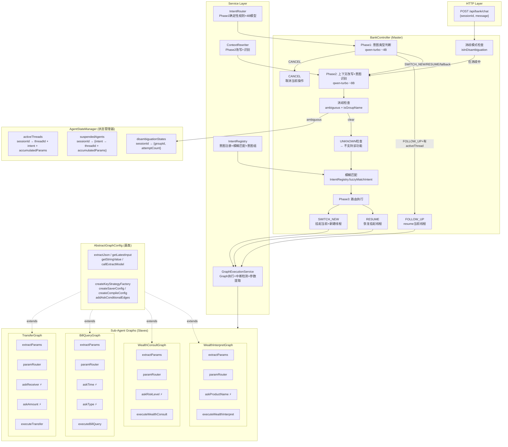

### 2.2 核心设计原则

| 原则 | 说明 |
|------|------|
| **Master-Slave 分离** | Controller 只管"哪个workflow"+"何时切换"，Graph 只管"怎么执行" |
| **Graph执行Service化** | Graph执行/中断检测/参数提取抽取为 GraphExecutionService，Controller 只做路由决策 |
| **Graph基类消除重复** | AbstractGraphConfig 提供4个子Graph共享的工具方法和构建器，子类只需实现差异化逻辑 |
| **意图注册中心化** | IntentRegistry 统一管理意图注册、模糊匹配、意图组，Controller 不再直接处理匹配逻辑 |
| **状态前缀隔离** | 每个 Sub-Agent 用 `transfer.*` / `bill.*` / `wealthConsult.*` / `wealthInterpret.*` 前缀管理自己的 OverAllState key |
| **中断不抛异常** | SAA 通过 `interruptBefore` + `getState().next()` 检测中断，不是异常 |
| **Re-execution模式** | 不依赖 SAA 的 resume（Bug#4519），每次 resume 都重新执行 Graph + 注入 accumulatedParams |

---

## 三、核心组件详解

### 3.1 BankController（Master 编排器，366行）

**职责**：接收用户消息 → 消歧检查 → 意图判断 → 路由分发 → 处理中断/完成

**处理流程**：

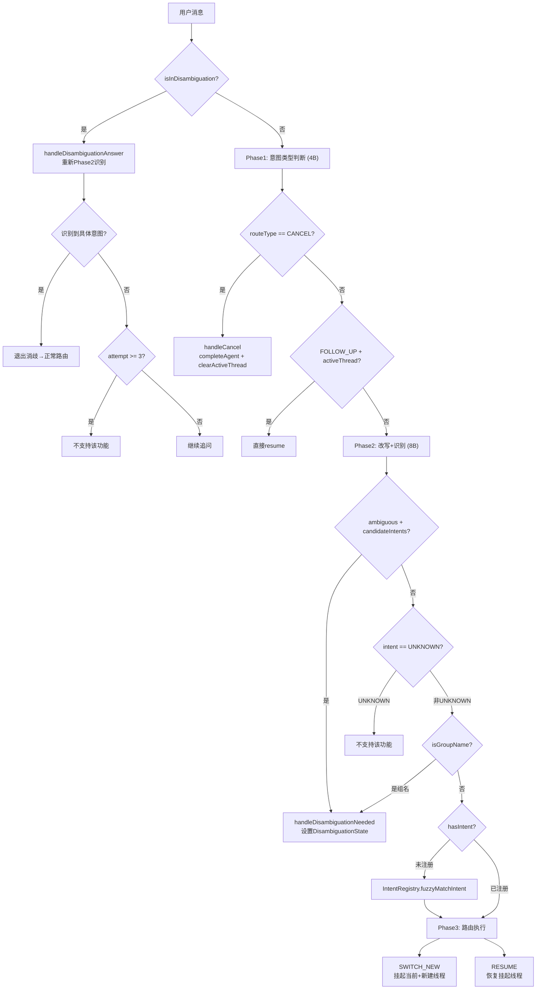

### 3.2 GraphExecutionService（Graph执行服务，209行）

**职责**：封装 Graph 的执行、中断检测、参数提取逻辑

| 方法 | 职责 |
|------|------|
| `executeGraph()` | 执行Graph + 注入accumulatedParams + 检查结果(完成/中断) |
| `resumeGraph()` | 重新执行Graph(新threadId + 注入accumulatedParams) |
| `checkGraphResult()` | 区分interruptBefore中断 / ask→END中断 / 正常完成 |
| `readGraphInterruptState()` | 读取Graph中断状态(不执行)，用于RESUME恢复上下文 |
| `extractAccumulatedParams()` | 从Graph state按intent前缀提取已收集的参数 |

**Re-execution模式**：

```
传统 resume (Bug#4519，不可用):
  updateState → stream(null, withResume) → interruptBefore不重新触发 ❌

实际使用 (re-execution):
  1. 从activeThread取出accumulatedParams
  2. 生成新threadId
  3. stream(input + accumulatedParams, newConfig) → 从头执行
  4. paramRouter看到已有参数 → 跳过已满足的参数
  5. interruptBefore正常触发 ✅
```

### 3.3 AgentStateManager（状态管理器，265行）

**三张核心数据表**：

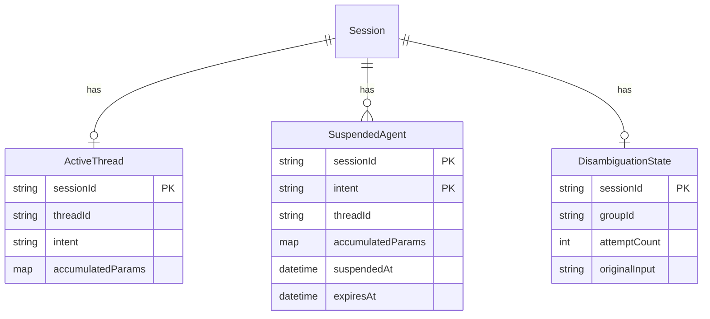

**生命周期说明**：

| 数据表 | 何时写入 | 何时读取 | 何时清除 |
|--------|----------|----------|----------|
| activeThreads | SWITCH_NEW/RESUME/中断时设置 | FOLLOW_UP时读取threadId和accumulatedParams | 任务完成/取消时清空 |
| suspendedAgents | 意图切换时挂起旧线程 | RESUME时按intent查找 | 恢复时移除 / 超时30min清理 |
| disambiguationStates | 消歧触发时设置 | 消歧模式下每轮读取 | 消歧成功/3次上限时清除 |

### 3.4 IntentRegistry（意图注册表，170行）

**职责**：意图注册 + Graph绑定 + 模糊匹配 + 意图组管理

| 方法 | 职责 |
|------|------|
| `register()` | 注册意图配置(description, paramSchema, writeOp) |
| `bindGraph()` | 绑定CompiledGraph到意图 |
| `fuzzyMatchIntent()` | 模糊匹配: LLM返回不在注册表时,尝试匹配已注册意图/组名/关键词推断 |
| `guessIntentFromInput()` | 基于关键词推断意图(转账/账单/理财等) |
| `isGroupName()` / `findGroupByIntent()` | 意图组判断和查找 |
| `getIntentListDescription()` | 生成LLM可理解的意图列表(含组信息) |

**已注册意图组**：

| 组ID | 候选意图 | 消歧问题 |
|------|---------|---------|
| WEALTH | WEALTH_CONSULT, WEALTH_INTERPRET | "请问您需要理财咨询还是理财产品解读？" |

### 3.5 AbstractGraphConfig（Graph基类，129行）

**职责**：提取4个子Graph共享的基础设施代码

**子类必须实现**：
- `getGraphName()`: Graph名称(用于日志)
- `buildExtractPrompt()`: 参数提取的prompt
- `parseExtractResult()`: 解析LLM返回的JSON → Map<String, Object>
- `registerCustomKeys()`: 注册Graph专用的state keys

**基类提供**：
- 工具方法: `extractJson`, `getLatestInput`, `getStringValue`, `callExtractModel`
- 构建方法: `createKeyStrategyFactory`, `createSaverConfig`, `createCompileConfig`
- 路由方法: `addAskConditionalEdges` (ask节点的 CONTINUE→paramRouter / WAIT→END)

### 3.6 Sub-Agent Graph（4个Slave工作流）

**统一的Graph模板**：

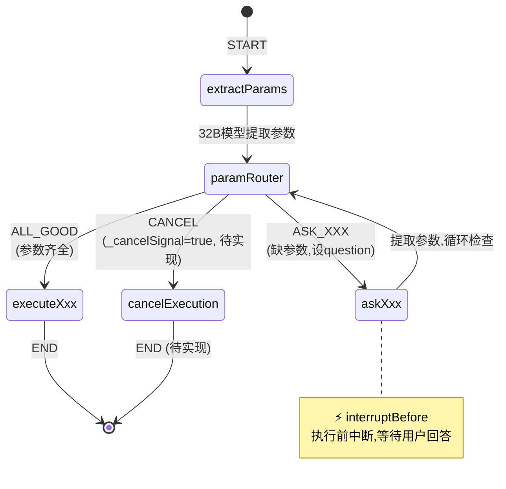

**4个子Graph对比**：

| Graph | 专用前缀 | 中断节点 | 提取参数 | 执行方法 |
|-------|---------|---------|---------|---------|
| TransferGraph | `transfer.` | askReceiver, askAmount | receiver, amount, purpose | executeTransfer |
| BillQueryGraph | `bill.` | askTime, askType | timePeriod, expenseType | executeBillQuery |
| WealthConsultGraph | `wealthConsult.` | askRiskLevel | riskLevel | executeWealthConsult |
| WealthInterpretGraph | `wealthInterpret.` | askProductName | productName | executeWealthInterpret |

---

## 四、时序图：8种场景

### 4.1 场景1：全新意图（SWITCH_NEW，参数齐全）

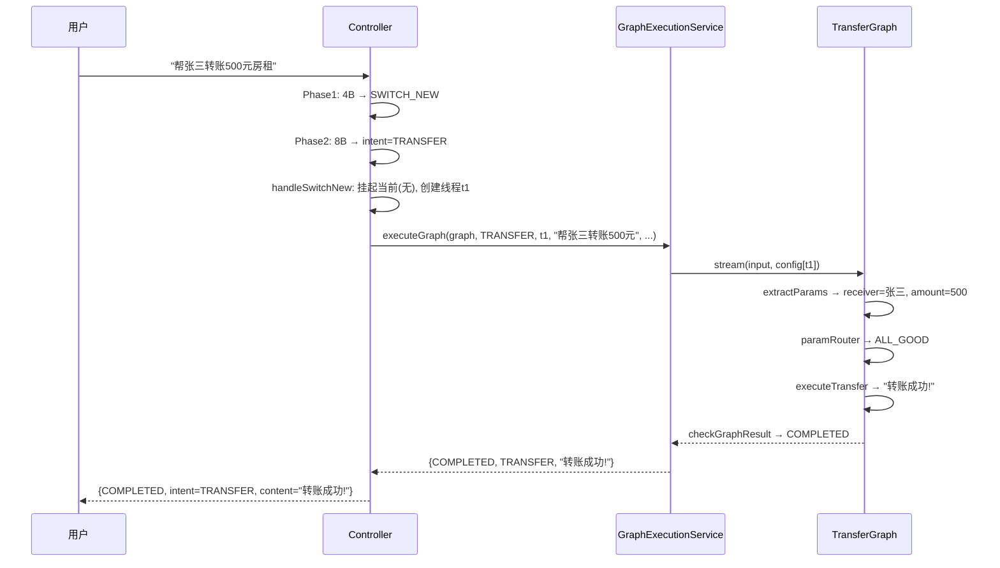

### 4.2 场景2：全新意图（SWITCH_NEW，参数不全，中断）

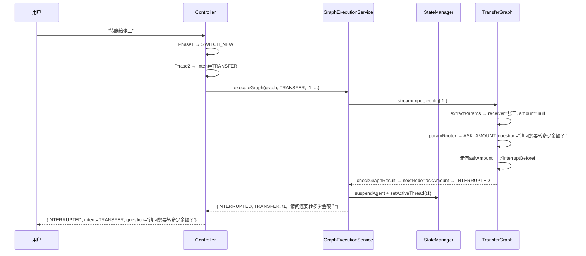

### 4.3 场景3：Follow-Up（回答提问）

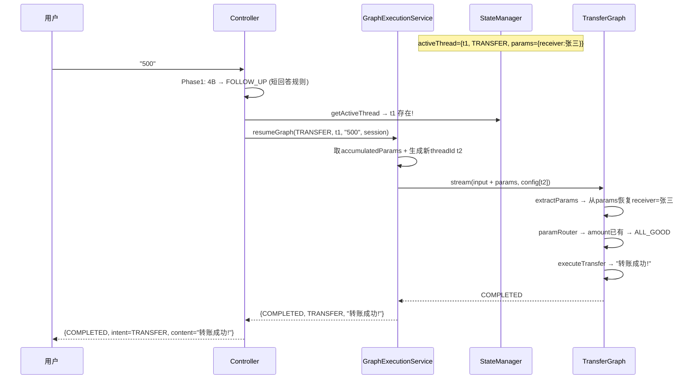

### 4.4 场景4：意图切换（SWITCH_NEW + 挂起当前）

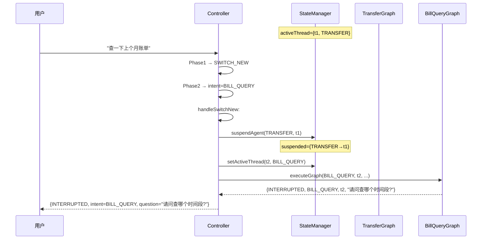

### 4.5 场景5：意图恢复（RESUME）

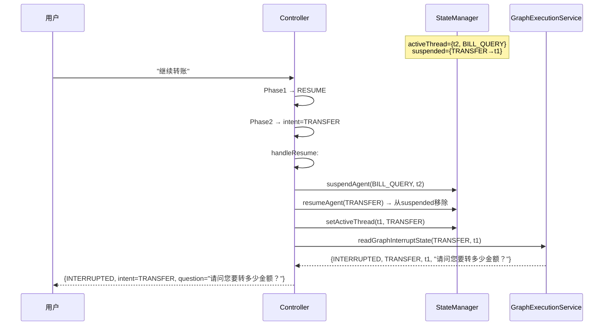

### 4.6 场景6：模糊意图消歧

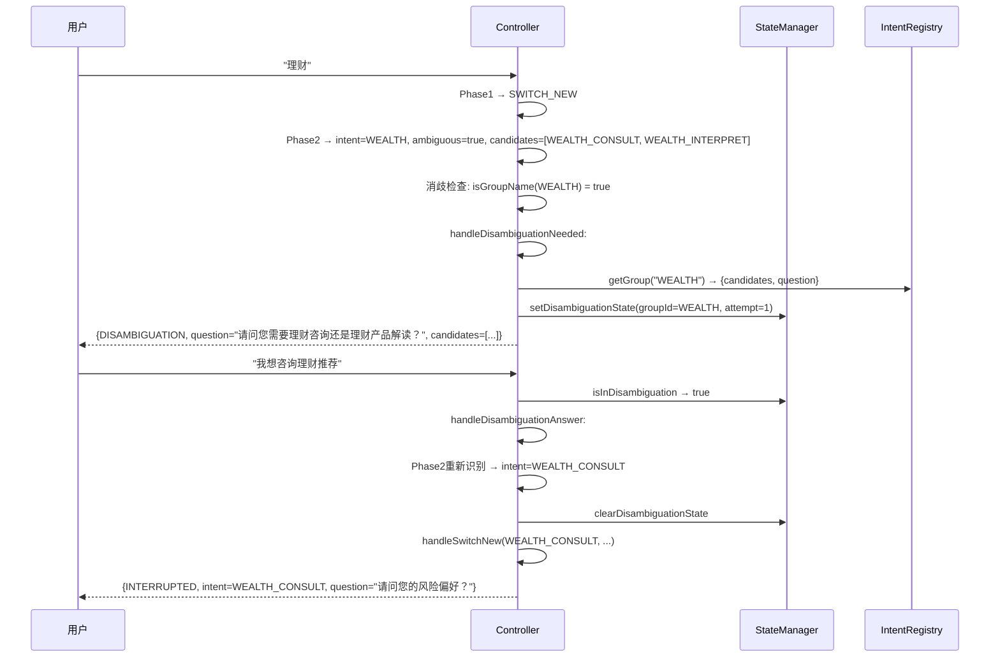

### 4.7 场景7：3次追问上限

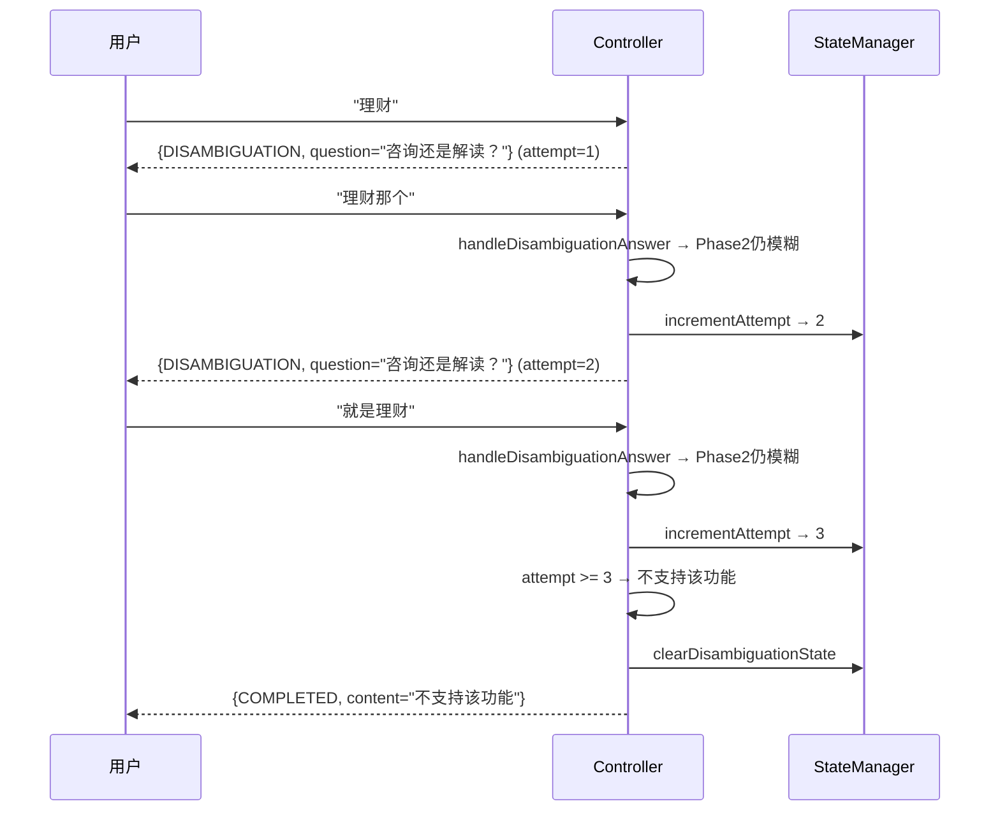

### 4.8 场景8：不支持的功能

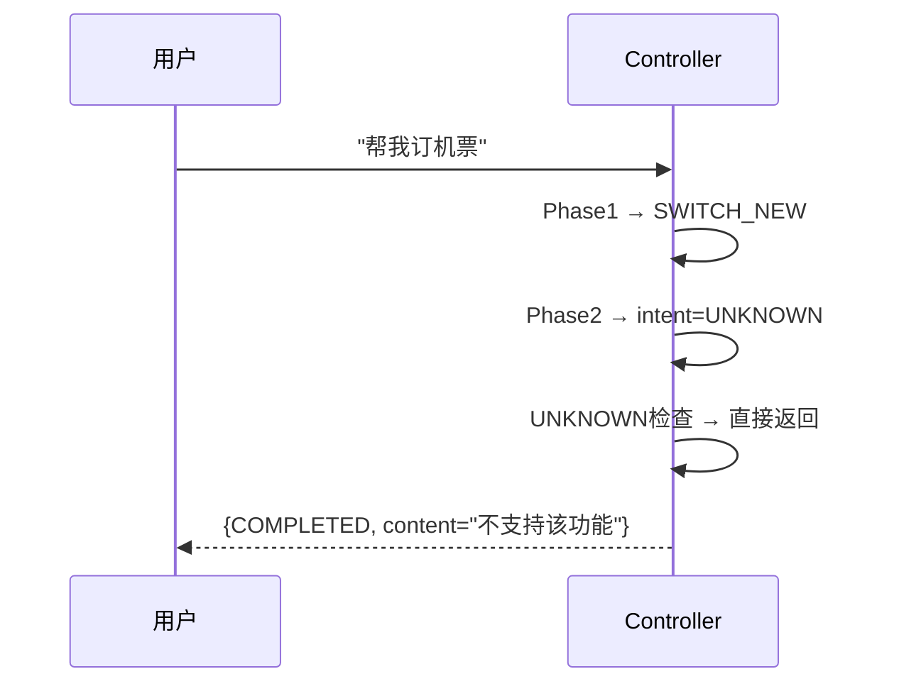

---

## 五、数据模型

### 5.1 OverAllState Key 规范

#### 公共 Key（AbstractGraphConfig 提供）

| Key | Strategy | 类型 | 说明 |
|-----|----------|------|------|
| `messages` | Append | String | 用户输入历史 |
| `_latestUserInput` | Replace | String | 最新用户输入 |
| `_question` | Replace | String | 向用户提问的话术 |
| `_paramName` | Replace | String | 当前缺的参数名 / ALL_GOOD |
| `_outputContent` | Replace | String | 输出内容 |
| `_outputType` | Replace | String | TEXT / CONFIRMATION |
| `_isFinal` | Replace | Boolean | 是否最终输出 |

#### 各 Graph 专用 Key

| Graph | Key | 类型 | 说明 |
|-------|-----|------|------|
| TransferGraph | `transfer.receiver` | String | 收款人 |
| TransferGraph | `transfer.amount` | BigDecimal | 转账金额 |
| TransferGraph | `transfer.purpose` | String | 用途(可选) |
| BillQueryGraph | `bill.timePeriod` | String | 时间范围 |
| BillQueryGraph | `bill.expenseType` | String | 支出类型 |
| WealthConsultGraph | `wealthConsult.riskLevel` | String | 风险偏好(激进/稳健/保守) |
| WealthInterpretGraph | `wealthInterpret.productName` | String | 理财产品名称 |

### 5.2 API 请求/响应格式

**请求**:
```json
POST /api/bank/chat?sessionId=s123
{ "message": "转账给张三500元" }
```

**响应 — 正常完成**:
```json
{ "status": "COMPLETED", "content": "转账成功！已向张三转账500元", "intent": "TRANSFER" }
```

**响应 — 中断提问**:
```json
{ "status": "INTERRUPTED", "question": "请问您要转多少金额？", "intent": "TRANSFER", "threadId": "a1b2c3d4" }
```

**响应 — 消歧追问**:
```json
{ "status": "DISAMBIGUATION", "question": "请问您需要理财咨询还是理财产品解读？", "candidateIntents": ["WEALTH_CONSULT", "WEALTH_INTERPRET"] }
```

**响应 — 不支持**:
```json
{ "status": "COMPLETED", "content": "不支持该功能", "intent": null }
```

**响应 — 错误**:
```json
{ "status": "ERROR", "errorMessage": "未识别的意图" }
```

---

## 六、LLM 调用规范

### 6.1 模型分配

| 用途 | 模型 | 大小 | 配置项 |
|------|------|------|--------|
| 意图类型判断 | qwen-turbo | ~4B | `routing.model.routing-model` |
| 上下文改写+意图识别+消歧检测 | qwen-turbo | ~8B | `routing.model.rewrite-model` |
| 参数提取(所有Graph共用) | qwen-plus | ~32B | `routing.model.planning-model` |

### 6.2 Prompt 模板

**l0-routing.st** — Phase1 意图类型判断:
- 输入: 用户消息 + currentAgent + pendingAgents + sessionState
- 输出: `{route_type, confidence, reasoning, intent_name, resume_target}`

**l1-rewrite.st** — Phase2 上下文改写+意图识别(含消歧):
- 输入: 用户消息 + 上下文 + 已注册意图 + 消歧上下文
- 输出: `{rewritten_input, intent_name, route_type, resume_target, confidence, is_ambiguous, candidate_intents, group_id}`

---

## 七、已知限制与待改进项

| 项目 | 当前状态 | 计划 |
|------|---------|------|
| CANCEL传递给Graph | Controller层直接清理,Graph不知道被取消 | 注入_cancelSignal让Graph干净终止 |
| 消歧中说取消 | 走handleDisambiguationAnswer而非handleCancel | CANCEL判断移到消歧检查之前 |
| 无操作时取消 | 返回"已取消当前操作"(误导) | 区分有无activeThread |
| RoutingGraph | Phase2在Controller层,消歧和路由耦合 | Step2: 将Phase2抽取为RoutingGraph |
| 状态持久化 | ConcurrentHashMap(内存) | Redis/DB |
| 参数提问策略 | 每次缺一个问一个 | 可合并多参数一次问 |
| 并发安全 | 单 JVM ConcurrentHashMap | 分布式锁 |

---

## 八、代码行数统计

| 文件 | 行数 | 说明 |
|------|------|------|
| AbstractGraphConfig.java | 129 | Graph基类 |
| TransferGraphConfig.java | 230 | 转账Graph |
| BillQueryGraphConfig.java | 198 | 账单Graph |
| WealthConsultGraphConfig.java | 168 | 理财咨询Graph |
| WealthInterpretGraphConfig.java | 157 | 理财解读Graph |
| BankController.java | 366 | Master编排器 |
| GraphExecutionService.java | 209 | Graph执行服务 |
| AgentStateManager.java | 265 | 状态管理器 |
| IntentRegistry.java | 170 | 意图注册表 |
| IntentRouter.java | 251 | Phase1路由器 |
| ContextRewriter.java | 264 | Phase2改写器 |
| MockBankingService.java | 203 | 模拟银行服务 |
| **合计** | **2610** | |
