# 手机银行AI智能体架构文档

> 版本: v3 | 最后更新: 2026-05-19 | 测试通过率: 100% (31/31)

---

## 目录

1. [架构全景](#1-架构全景)
2. [核心流程](#2-核心流程)
3. [分层架构详解](#3-分层架构详解)
4. [子Graph架构](#4-子graph架构)
5. [取消机制](#5-取消机制)
6. [消歧机制](#6-消歧机制)
7. [状态管理](#7-状态管理)
8. [关键代码分析](#8-关键代码分析)
9. [API文档](#9-api文档)
10. [架构自洽性证明](#10-架构自洽性证明)

---

## 1. 架构全景

### 1.1 系统架构图

```mermaid
graph TB
    subgraph 用户层
        USER[手机银行App]
    end

    subgraph Controller层
        BC[BankController<br/>Master路由+调度<br/>~338行]
    end

    subgraph 路由层
        IR[IntentRouter<br/>Phase1: 路由类型判断<br/>244行]
        RS[RoutingService<br/>Phase2+消歧+模糊匹配<br/>~270行]
        CR[ContextRewriter<br/>上下文改写+意图识别<br/>262行]
    end

    subgraph 执行层
        GES[GraphExecutionService<br/>Graph执行+中断检测<br/>338行]
    end

    subgraph 状态层
        ASM[AgentStateManager<br/>线程+挂起+消歧状态<br/>248行]
        IREG[IntentRegistry<br/>意图注册+模糊匹配<br/>204行]
    end

    subgraph Graph层
        AGC[AbstractGraphConfig<br/>基类~389行]
        TG[TransferGraph<br/>转账277行]
        BG[BillQueryGraph<br/>账单查询~290行]
        WCG[WealthConsultGraph<br/>理财咨询219行]
        WIG[WealthInterpretGraph<br/>理财解读208行]
    end

    subgraph LLM
        LLM4[Qwen-Turbo 4B<br/>Phase1路由]
        LLM8[Qwen-Turbo 8B<br/>Phase2改写+识别]
        LLMSUB[Qwen-Plus<br/>子Graph参数提取]
    end

    USER -->|POST /api/bank/chat| BC
    BC -->|Phase1| IR
    IR -->|RoutingResult| BC
    BC -->|resolve()| RS
    RS -->|rewriteAndIdentify| CR
    CR -->|LLM call| LLM8
    IR -->|LLM call| LLM4
    BC -->|executeGraph/resumeGraph/cancelGraph| GES
    GES -->|state操作| ASM
    GES -->|graph执行| TG
    GES -->|graph执行| BG
    GES -->|graph执行| WCG
    GES -->|graph执行| WIG
    TG -->|extends| AGC
    BG -->|extends| AGC
    WCG -->|extends| AGC
    WIG -->|extends| AGC
    AGC -->|callExtractModel| LLMSUB
    RS -->|fuzzyMatch| IREG
```

### 1.2 类职责矩阵

| 类 | 行数 | 职责 | 不负责 |
|---|---|---|---|
| **BankController** | 338 | Phase1路由 + 消歧取消 + FOLLOW_UP快速路径 + 路由决议执行 | 不做意图识别细节、不做Graph内部逻辑 |
| **IntentRouter** | 244 | Phase1确定性规则 + 4B模型判断路由类型 | 不识别具体意图、不判断CANCEL |
| **RoutingService** | 270 | Phase2意图识别 + 置信度消歧 + 模糊匹配 | 不做Phase1、不执行Graph |
| **ContextRewriter** | 262 | Phase2上下文改写 + 意图识别(一次LLM调用) | 不做路由决策 |
| **GraphExecutionService** | 338 | Graph执行 + 中断检测 + 参数提取 + 取消 | 不做路由、不管理线程 |
| **AgentStateManager** | 248 | active/suspended/disambiguation三表管理 | 不做业务逻辑 |
| **IntentRegistry** | 204 | 意图注册 + 意图组 + 模糊匹配 | 不做路由决策 |
| **AbstractGraphConfig** | 389 | 子Graph基类: 工具方法+取消检测+构建辅助 | 不含业务逻辑 |
| **子Graph×4** | 208-290 | 各自业务流程 | 不关心取消检测流程(基类处理) |

### 1.3 设计原则

| 原则 | 实现方式 |
|---|---|
| **Master-Slave** | Controller(Master)调度，子Graph(Slave)自治执行和清理 |
| **单一职责** | 每个类<400行，职责边界明确 |
| **开闭原则** | 新增意图 = 注册意图 + 一个GraphConfig子类，不修改现有代码 |
| **失败安全** | LLM失败→降级SWITCH_NEW，取消检测失败→默认不取消，LLM超额提取→关键词守卫 |
| **分层延迟** | 关键字(0ms)→LLM(200ms)→_cancelSignal(框架级)，三级保障 |

---

## 2. 核心流程

### 2.1 主流程：用户消息处理

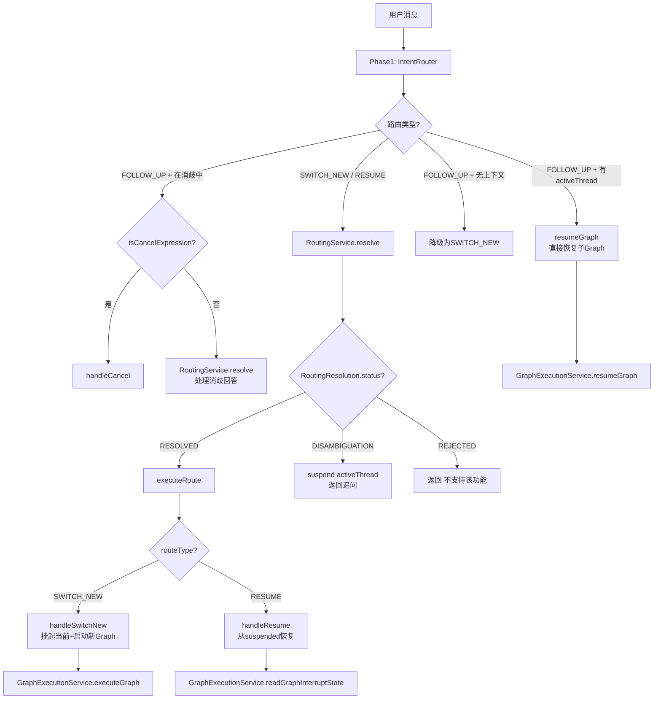

### 2.2 两阶段路由流程

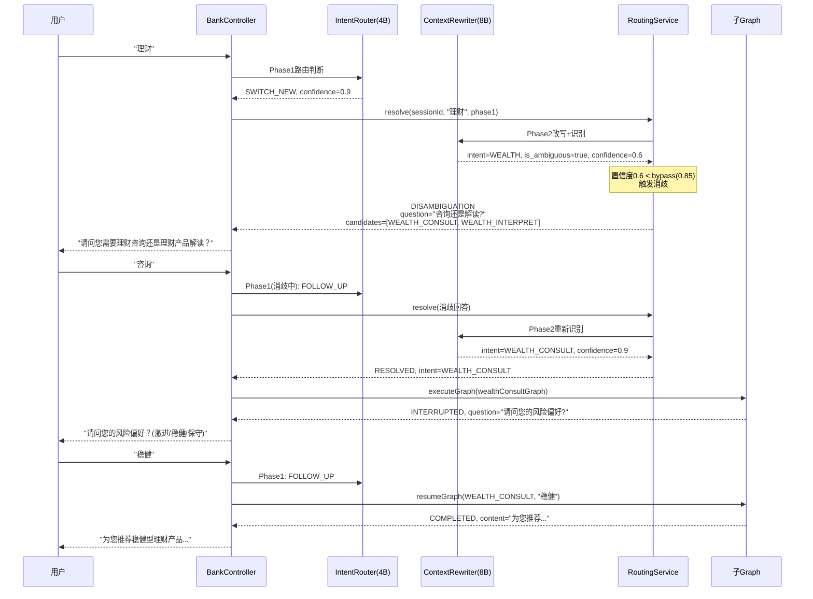

---

## 3. 分层架构详解

### 3.1 Controller层：BankController

**核心逻辑 (~50行chat方法)**:

```java
@PostMapping("/chat")
public WorkflowOutput chat(@RequestParam String sessionId, @RequestBody Map<String, String> req) {
    // 1. Phase1路由类型判断 (4B模型, 快速)
    RoutingResult phase1 = intentRouter.route(sessionId, userInput, stateManager);

    // 2. 消歧取消检测 (仅消歧场景)
    if (phase1.isFollowUp() && stateManager.isInDisambiguation(sessionId)) {
        if (isCancelExpression(userInput)) return handleCancel(sessionId);
    }

    // 3. FOLLOW_UP快速路径 (直接resume, 不走Phase2)
    if (phase1.isFollowUp() && !stateManager.isInDisambiguation(sessionId)) {
        if (activeThread != null) return resumeGraph(...);
    }

    // 4. Phase2路由决议 (消歧/模糊匹配)
    RoutingResolution resolution = routingService.resolve(sessionId, userInput, phase1);

    // 5. 执行
    return switch (resolution.getStatus()) {
        case RESOLVED      -> executeRoute(sessionId, resolution);
        case DISAMBIGUATION -> { suspend activeThread; yield disambiguation(...); }
        case REJECTED      -> "不支持该功能";
    };
}
```

**设计要点**:
- FOLLOW_UP快速路径: 用户回答子Graph问题时直接resume，省掉Phase2的LLM调用
- 消歧时suspend activeThread: 防止消歧中的"算了"误杀正在进行的子Graph
- `isCancelExpression()`仅用于消歧场景: 子Graph内部取消由`detectCancelFromInput()`负责

### 3.2 路由层

#### IntentRouter (Phase1)

**职责**: 判断用户消息的路由类型，不识别具体意图

**确定性规则优先**:
```
1. 短回答 (数字/确认词)     → FOLLOW_UP (0ms, 不调LLM)
2. 明确恢复指令 ("继续转账") → RESUME (0ms, 不调LLM)
3. 短回答+有活跃线程        → FOLLOW_UP (0ms, 不调LLM)
4. 以上都不匹配             → LLM判断 (4B, ~100ms)
```

**输出**: `RoutingResult { routeType, confidence, reasoning }`

#### ContextRewriter (Phase2)

**职责**: 一个LLM调用同时完成上下文改写和意图识别

**示例**:
- 输入: "那昨天的呢" → 改写: "查询昨天的账单明细" → 意图: BILL_QUERY
- 输入: "理财" → 改写: "用户提到理财" → 意图: WEALTH (组名) → 消歧

**输出**: `RoutingResult { intentName, rewrittenInput, confidence, isAmbiguous, candidateIntents, groupId }`

#### RoutingService (路由决策)

**职责**: 统一路由决策入口，Controller只看`RoutingResolution.status`

**置信度增强消歧决策**:

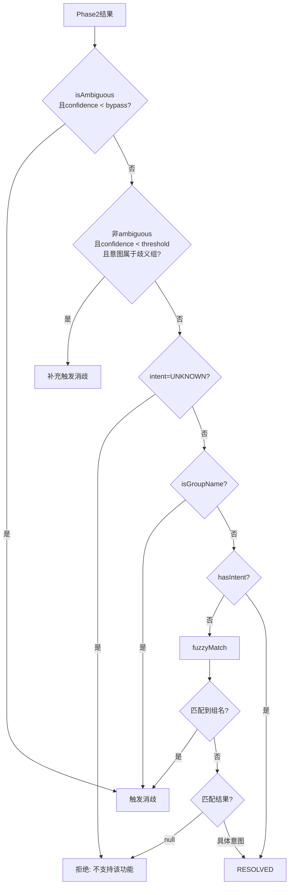

**配置参数**:

| 参数 | 默认值 | 含义 |
|---|---|---|
| `disambiguation-threshold` | 0.7 | confidence低于此值+意图属于歧义组 → 补充消歧 |
| `high-confidence-bypass` | 0.85 | confidence高于此值 → 即使LLM标ambiguous也信任首选意图 |

### 3.3 执行层：GraphExecutionService

**核心设计**: 不依赖框架的resume机制(受Bug#4519影响)，每次resume都重新执行Graph

**Re-execution模式**:

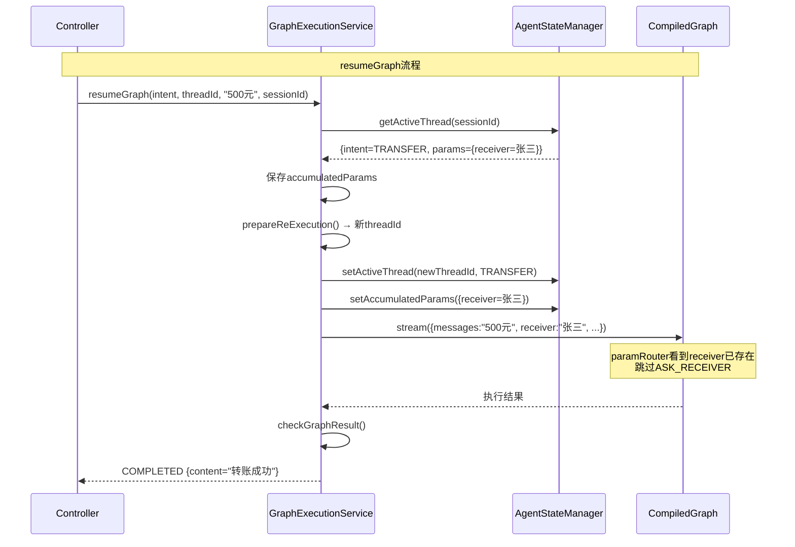

**prepareReExecution()**: resume和cancel共享的公共方法
1. 生成新threadId (因为每次重新执行)
2. 设置新activeThread
3. 恢复累积参数到新activeThread

---

## 4. 子Graph架构

### 4.1 通用Graph拓扑

所有4个子Graph共享相同的拓扑结构:

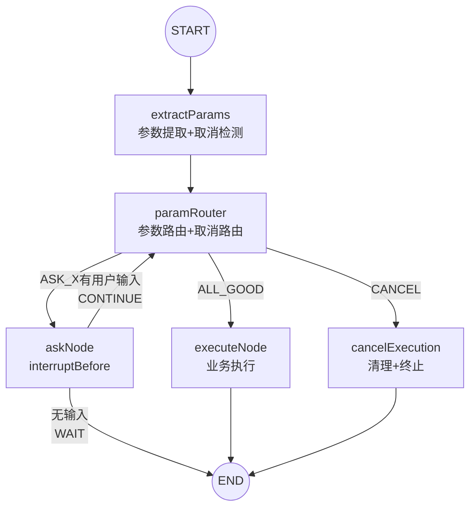

### 4.2 四个子Graph对比

| 子Graph | 参数 | ask节点 | 取消关键词 | 取消上下文 |
|---|---|---|---|---|
| **TransferGraph** | receiver, amount, purpose | askReceiver, askAmount | 不转了, 别转了, 取消转账, 不想转了, 不用转了 | 正在向用户询问转账信息(收款人/金额) |
| **BillQueryGraph** | timePeriod, expenseType | askTime, askType | 不查了, 别查了, 取消查询, 不想查了, 不用查了 | 正在向用户询问账单查询条件(时间范围/支出类型) |
| **WealthConsultGraph** | riskLevel | askRiskLevel | 不想咨询了, 取消咨询, 不用推荐了 | 正在向用户询问理财咨询的风险偏好 |
| **WealthInterpretGraph** | productName | askProductName | 不想解读了, 取消解读, 不想要了, 不用解读了 | 正在向用户询问理财产品名称 |

### 4.3 AbstractGraphConfig模板方法

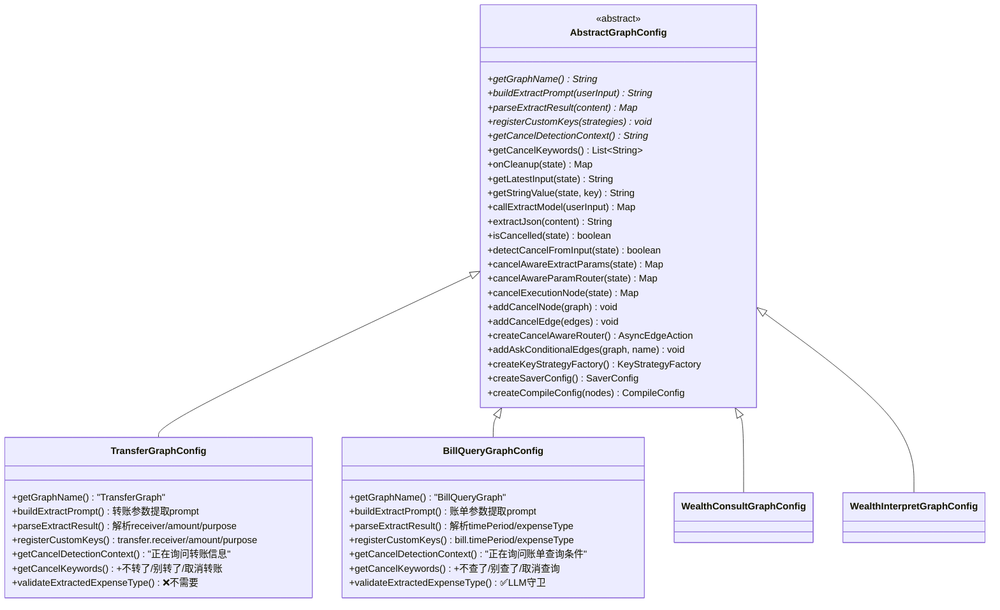

**子类只需实现5个抽象方法，可覆盖2个可选方法** — 新增一个意图只需~200行代码。

### 4.4 BillQuery LLM守卫

LLM有时会"自作主张"填参数。例如用户只说"最近一周"，LLM可能返回`{timePeriod:"最近一周", expenseType:"支出"}`。

**双管齐下**:

1. **Prompt强化**: 明确"只说了时间没提类型 → expenseType必须null"
2. **代码守卫**: `validateExtractedExpenseType()` — 检查用户输入是否包含类型关键词，不含则移除LLM返回的expenseType

```java
private static final Set<String> EXPENSE_TYPE_KEYWORDS = Set.of(
    "餐饮", "交通", "购物", "娱乐", "医疗", "教育", "住房", "通讯",
    "支出", "收入", "全部", "所有", "类型", "分类", "消费"
);

private void validateExtractedExpenseType(Map<String, Object> extracted, String userInput) {
    Object typeObj = extracted.get("bill.expenseType");
    if (typeObj == null || typeObj.toString().isEmpty()) return;
    boolean userMentionedType = EXPENSE_TYPE_KEYWORDS.stream()
            .anyMatch(kw -> userInput.contains(kw));
    if (!userMentionedType) {
        log.warn("LLM returned expenseType='{}' but no type keyword in input, ignoring", typeObj);
        extracted.remove("bill.expenseType");
    }
}
```

---

## 5. 取消机制

### 5.1 三层取消检测架构

```mermaid
flowchart LR
    subgraph "第1层: 关键字匹配 (0ms)"
        K1[取消] --> K2[算了] --> K3[不要了] --> K4[放弃] --> K5[不了]
        K6[不转了] --> K7[不查了] --> K8[不想咨询了] --> K9[不想要了]
    end

    subgraph "第2层: LLM判断 (200-500ms)"
        L1[理解上下文] --> L2[区分否定回答vs取消意图]
    end

    subgraph "第3层: _cancelSignal (框架级)"
        S1[cancelGraph()注入] --> S2[extractParams跳过LLM] --> S3[paramRouter→CANCEL]
    end

    A[用户输入] --> B{关键字匹配?}
    B -->|命中| C[返回true]
    B -->|未命中| D{LLM判断}
    D -->|cancel=true| C
    D -->|cancel=false| E[返回false]
```

### 5.2 取消场景矩阵

| 场景 | 检测位置 | 检测方式 | 示例 |
|---|---|---|---|
| 子Graph追问时用户说"算了" | 子Graph `detectCancelFromInput()` | 关键字→LLM | 转账问金额→"算了"→取消转账 |
| 子Graph追问时用户说"我不想要这个转账了" | 子Graph `detectCancelFromInput()` | LLM兜底 | 非关键字表达取消意图 |
| 消歧追问时用户说"算了" | Controller `isCancelExpression()` | 关键字 | "理财"→消歧→"算了"→取消消歧 |
| Controller直接取消 | Controller `handleCancel()` | cancelGraph注入_cancelSignal | 外部触发取消 |
| 子Graph已完成，用户说"取消" | 无活跃线程 → 提示无操作 | — | 无进行中操作 |

### 5.3 取消流程时序图

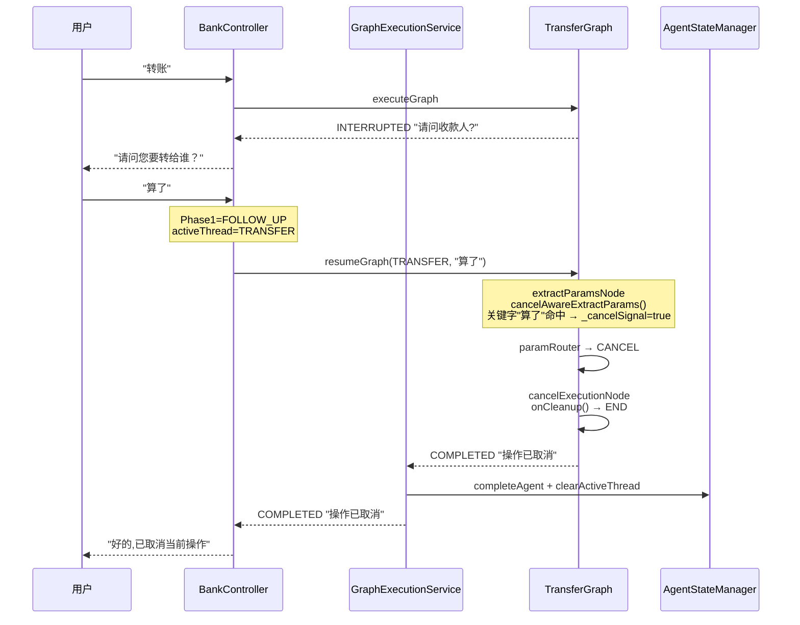

---

## 6. 消歧机制

### 6.1 消歧触发条件

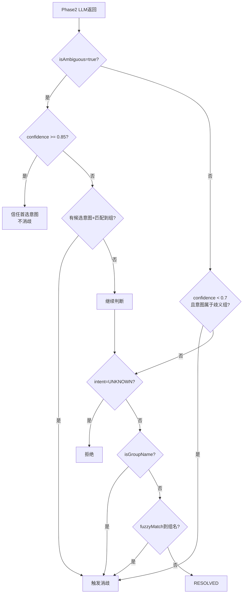

### 6.2 消歧状态生命周期

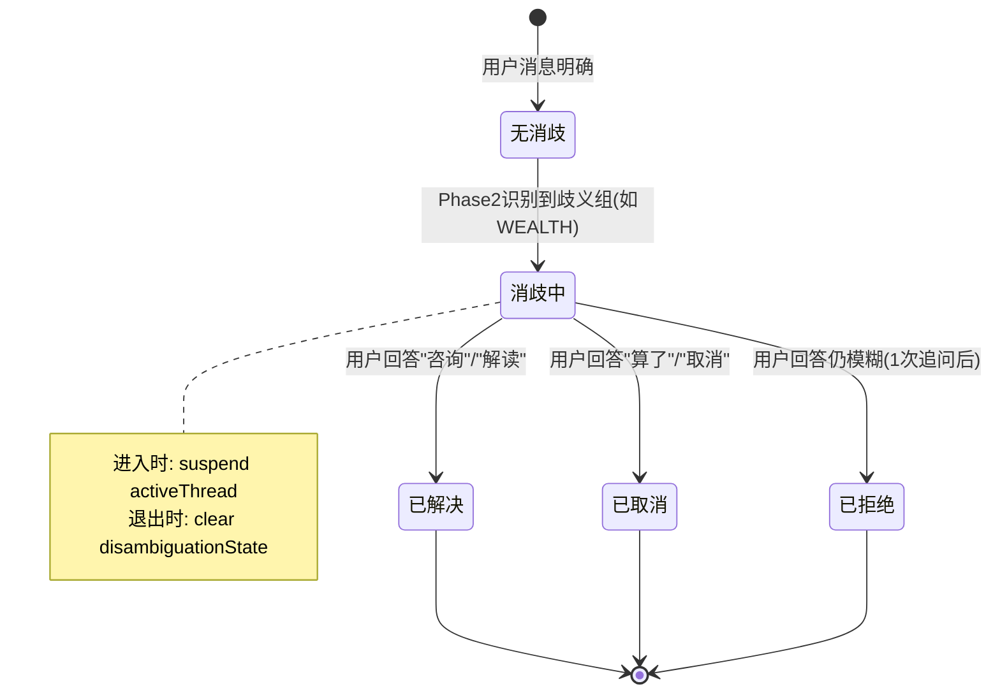

### 6.3 消歧安全性：suspend机制

消歧时必须suspend activeThread，否则消歧中的"算了"会误杀正在进行的子Graph：

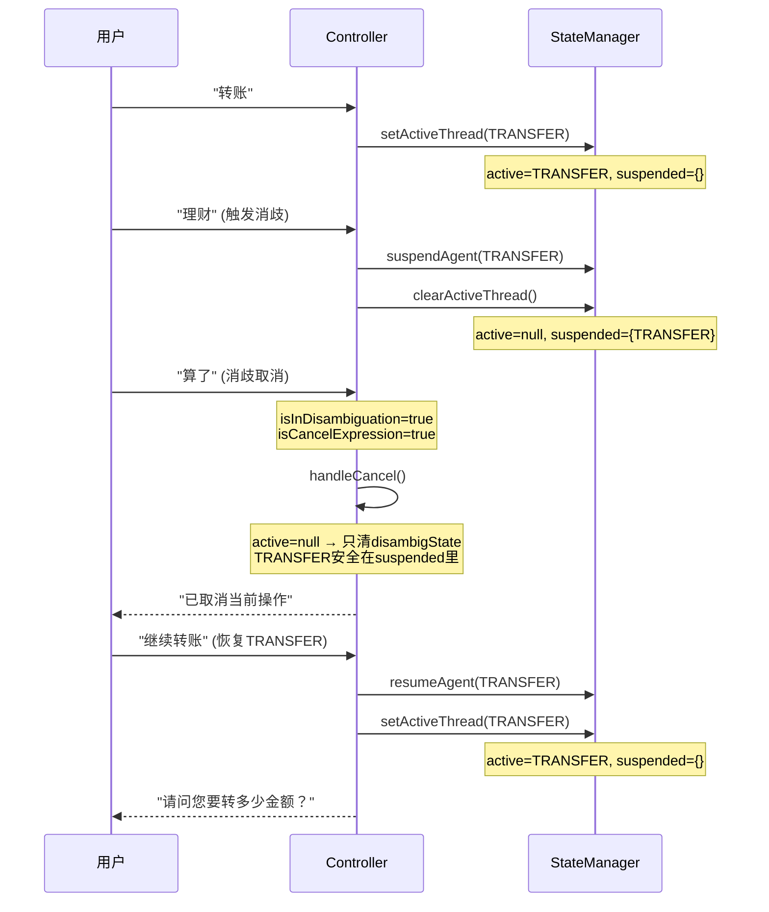

---

## 7. 状态管理

### 7.1 三表模型

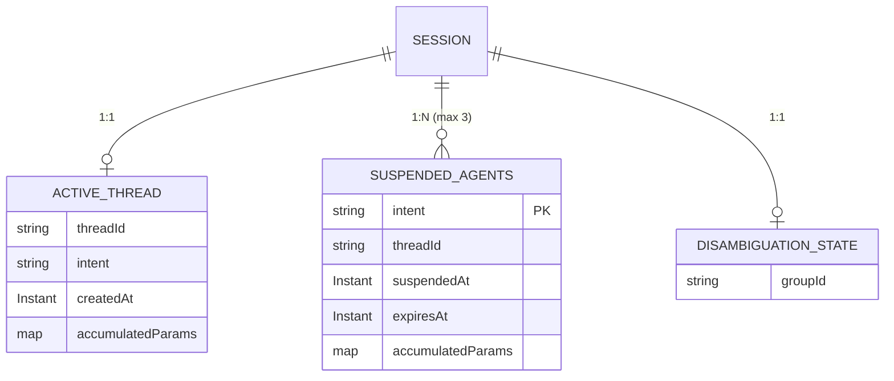

### 7.2 状态转换

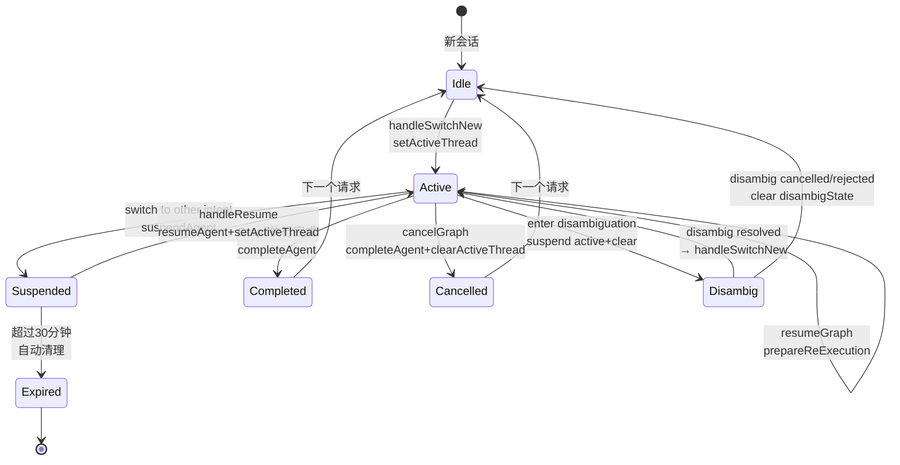

---

## 8. 关键代码分析

### 8.1 Re-execution模式 (绕过Bug#4519)

**问题**: LangGraph4j的`interruptBefore`在resume后不会重新触发，导致多轮提问失败。

**方案**: 每次resume都重新执行Graph，通过注入accumulatedParams让paramRouter跳过已满足的参数。

```java
// GraphExecutionService.resumeGraph()
public WorkflowOutput resumeGraph(String intent, String threadId, String userInput, String sessionId) {
    // 1. 从旧activeThread提取累积参数 (必须在setActiveThread之前!)
    Map<String, Object> accumulatedParams = getAccumulatedParamsFromActive(sessionId, intent);
    // 2. 生成新threadId + 恢复累积参数
    String newThreadId = prepareReExecution(sessionId, intent, accumulatedParams);
    // 3. 重新执行Graph (等价于resume)
    return executeGraph(graph, intent, newThreadId, userInput, sessionId, accumulatedParams);
}

// paramRouter中: 如果参数已存在，跳过该参数的ask节点
if (receiver == null) → ASK_RECEIVER
else if (amount == null) → ASK_AMOUNT  // receiver已从accumulatedParams注入，跳过
else → ALL_GOOD
```

### 8.2 cancelAwareExtractParams模板方法

```java
// 子Graph的extractParamsNode必须调用此方法:
private Map<String, Object> extractParamsNode(OverAllState state) {
    // 第1层: _cancelSignal注入(由cancelGraph()注入)
    // 第2层: 关键字匹配(0ms)
    // 第3层: LLM判断(200-500ms)
    Map<String, Object> cancelResult = cancelAwareExtractParams(state);
    if (cancelResult != null) return cancelResult;  // 检测到取消

    // 正常提取逻辑
    Map<String, Object> extracted = callExtractModel(userInput);
    return extracted;
}
```

### 8.3 子Graph共享的Graph构建模式

```java
@Bean("transferGraph")
public CompiledGraph transferGraph() throws GraphStateException {
    // 1. 定义条件边 (业务路由 + 取消路由)
    Map<String, String> paramEdges = new HashMap<>(Map.of(
        "ASK_RECEIVER", "askReceiver",
        "ASK_AMOUNT",   "askAmount",
        "ALL_GOOD",     "executeTransfer"
    ));
    addCancelEdge(paramEdges);  // 一行添加CANCEL路由

    // 2. 构建Graph
    StateGraph graph = new StateGraph(createKeyStrategyFactory())
        .addNode("extractParams", node_async(this::extractParamsNode))
        .addNode("paramRouter",   node_async(this::paramRouterNode))
        .addNode("askReceiver",   node_async(this::askReceiverNode))
        .addNode("askAmount",     node_async(this::askAmountNode))
        .addNode("executeTransfer", node_async(this::executeTransferNode))
        .addEdge(START, "extractParams")
        .addEdge("extractParams", "paramRouter")
        .addConditionalEdges("paramRouter", createCancelAwareRouter(), paramEdges)
        .addEdge("executeTransfer", END);

    addCancelNode(graph);  // 一行添加cancelExecution节点

    // 3. ask节点条件路由 (有输入→paramRouter, 无→END)
    addAskConditionalEdges(graph, "askReceiver");
    addAskConditionalEdges(graph, "askAmount");

    // 4. 编译 (interruptBefore让ask节点在执行前暂停)
    return graph.compile(createCompileConfig("askReceiver", "askAmount"));
}
```

---

## 9. API文档

### 9.1 主聊天接口

```
POST /api/bank/chat?sessionId={sessionId}
Content-Type: application/json
```

**请求参数**:

| 参数 | 位置 | 类型 | 必填 | 说明 |
|---|---|---|---|---|
| sessionId | Query | String | ✅ | 会话ID，同一会话共享状态 |
| message | Body | String | ✅ | 用户消息 |

**请求示例**:
```json
POST /api/bank/chat?sessionId=user123
{"message": "帮我转账给张三"}
```

**响应**: `WorkflowOutput`

#### 响应1: 子Graph提问 (INTERRUPTED)

```json
{
  "status": "INTERRUPTED",
  "content": null,
  "question": "请问您要转多少金额？",
  "intent": "TRANSFER",
  "threadId": "a1b2c3d4e5f67890",
  "errorMessage": null,
  "candidateIntents": null
}
```

#### 响应2: 操作完成 (COMPLETED)

```json
{
  "status": "COMPLETED",
  "content": "已成功向张三转账500.00元",
  "question": null,
  "intent": "TRANSFER",
  "threadId": null,
  "errorMessage": null,
  "candidateIntents": null
}
```

#### 响应3: 意图消歧 (DISAMBIGUATION)

```json
{
  "status": "DISAMBIGUATION",
  "content": null,
  "question": "请问您需要理财咨询还是理财产品解读？",
  "intent": null,
  "threadId": null,
  "errorMessage": null,
  "candidateIntents": ["WEALTH_CONSULT", "WEALTH_INTERPRET"]
}
```

#### 响应4: 取消完成 (COMPLETED)

```json
{
  "status": "COMPLETED",
  "content": "好的,已取消当前操作。还有什么可以帮您的吗？",
  "question": null,
  "intent": null,
  "threadId": null,
  "errorMessage": null,
  "candidateIntents": null
}
```

#### 响应5: 不支持 (COMPLETED)

```json
{
  "status": "COMPLETED",
  "content": "不支持该功能",
  "question": null,
  "intent": null,
  "threadId": null,
  "errorMessage": null,
  "candidateIntents": null
}
```

#### 响应6: 错误 (ERROR)

```json
{
  "status": "ERROR",
  "content": null,
  "question": null,
  "intent": null,
  "threadId": null,
  "errorMessage": "处理请求时出错: ...",
  "candidateIntents": null
}
```

### 9.2 状态查询接口

```
GET /api/bank/state?sessionId={sessionId}
```

**响应示例**:
```json
{
  "activeThread": {
    "threadId": "a1b2c3d4e5f67890",
    "intent": "TRANSFER",
    "accumulatedParams": {
      "transfer.receiver": "张三"
    }
  },
  "suspendedAgents": [
    {"intent": "BILL_QUERY", "threadId": "f0e1d2c3b4a56789"}
  ],
  "registeredIntents": ["TRANSFER", "BILL_QUERY", "WEALTH_CONSULT", "WEALTH_INTERPRET"],
  "inDisambiguation": false
}
```

### 9.3 会话清除接口

```
DELETE /api/bank/session?sessionId={sessionId}
```

**响应**:
```json
{"status": "cleared", "sessionId": "user123"}
```

### 9.4 调试接口：路由追踪

```
POST /api/bank/debug/route?sessionId={sessionId}
Content-Type: application/json
```

**请求**: `{"message": "理财"}`

**响应**:
```json
{
  "phase1": {
    "routeType": "SWITCH_NEW",
    "confidence": 0.9,
    "intentName": "null",
    "reasoning": "用户表达新意图"
  },
  "resolution": {
    "status": "DISAMBIGUATION",
    "intentName": "WEALTH",
    "rewrittenInput": "用户提到理财",
    "routeType": "SWITCH_NEW",
    "question": "请问您需要理财咨询还是理财产品解读？",
    "candidateIntents": ["WEALTH_CONSULT", "WEALTH_INTERPRET"]
  }
}
```

### 9.5 调试接口：Prompt查看

```
GET /api/bank/debug/prompt?sessionId={sessionId}&message={message}
```

**响应**: 返回完整的Phase1 prompt (含模板变量替换后)

### 9.6 测试接口：直接意图测试

```
POST /api/bank/test/chat?sessionId={sessionId}&intent={intent}
Content-Type: application/json
```

**参数**:

| 参数 | 位置 | 类型 | 说明 |
|---|---|---|---|
| sessionId | Query | String | 会话ID |
| intent | Query | String | 直接指定意图 (TRANSFER/BILL_QUERY/WEALTH_CONSULT/WEALTH_INTERPRET) |
| message | Body | String | 用户消息 |

跳过Phase1/Phase2路由，直接进入指定意图的Graph执行。

---

## 10. 架构自洽性证明

### 10.1 意图识别完备性

| 用户输入 | Phase1 | Phase2 | 最终路由 | 理由 |
|---|---|---|---|---|
| "转账" | SWITCH_NEW | TRANSFER | executeGraph(TRANSFER) | 直接匹配 |
| "查账" | SWITCH_NEW | BILL_QUERY | executeGraph(BILL_QUERY) | fuzzyMatch |
| "理财咨询" | SWITCH_NEW | WEALTH_CONSULT | executeGraph(WEALTH_CONSULT) | 精确匹配,不消歧 |
| "理财解读" | SWITCH_NEW | WEALTH_INTERPRET | executeGraph(WEALTH_INTERPRET) | 精确匹配,不消歧 |
| "理财" | SWITCH_NEW | WEALTH(ambiguous) | DISAMBIGUATION | 歧义组,需消歧 |
| "买保险" | SWITCH_NEW | UNKNOWN | "不支持该功能" | 拒绝 |
| "500元"(有active) | FOLLOW_UP | — | resumeGraph | 快速路径 |
| "继续转账" | RESUME | — | handleResume(TRANSFER) | 确定性规则 |
| "算了"(有active) | FOLLOW_UP | — | resumeGraph → 子Graph检测取消 | 子Graph自治 |
| "算了"(消歧中) | FOLLOW_UP | — | handleCancel | Controller检测 |

**结论**: 所有可能的用户输入都有明确的处理路径，不存在"遗漏"情况。

### 10.2 取消安全完备性

| 取消场景 | 检测方 | 是否影响其他子Graph | 证明 |
|---|---|---|---|
| 子Graph追问中取消 | 子Graph detectCancelFromInput() | ❌ 不影响 | 只修改当前Graph的_cancelSignal |
| 消歧中取消 | Controller isCancelExpression() | ❌ 不影响 | activeThread已suspend, cancel只清disambigState |
| switch后取消旧Graph | 不直接取消,旧Graph在suspended中 | ❌ 不影响 | suspended的Graph可被resume |
| 无操作时取消 | Controller | — | 返回"当前没有进行中的操作" |

**结论**: 取消操作不会产生副作用，不会误杀其他子Graph。

### 10.3 状态一致性

**不变量**:

1. `activeThread`最多1个 → 由`setActiveThread`保证(ConcurrentHashMap 1:1)
2. `suspendedAgents`最多3个 → 由`MAX_SUSPENDED_DEPTH=3`保证,超出淘汰最早的
3. `disambiguationState`与`activeThread`互斥 → 进入消歧时suspend+clear activeThread
4. 每个intent在suspended中最多1条 → Map结构保证key唯一
5. Graph执行完成/取消后 → `completeAgent`同时清理active和suspended

**证明**: 5条不变量在所有操作路径上均成立:
- `handleSwitchNew`: 挂起当前active → suspended+1, 设新active → 不变量1,2成立
- `handleResume`: 从suspended移除 → suspended-1, 设active → 不变量1成立
- `handleCancel`: completeAgent → 清理active+suspended中的对应intent → 不变量5成立
- `DISAMBIGUATION`: suspend active + clear active → 不变量3成立

### 10.4 新增意图扩展成本

**步骤** (假设新增"信用卡还款"意图):

1. `IntentRegistry.init()` 添加一行: `register("CREDIT_REPAY", "信用卡还款", ...)`
2. 新建 `CreditRepayGraphConfig extends AbstractGraphConfig` (~200行):
   - 实现5个抽象方法: getGraphName, buildExtractPrompt, parseExtractResult, registerCustomKeys, getCancelDetectionContext
   - 覆盖1个可选方法: getCancelKeywords (添加"不还了", "取消还款")
   - 实现3个节点: extractParamsNode, paramRouterNode, executeNode + askNodes
3. `GraphExecutionService.extractAccumulatedParams` 添加一个case: `"CREDIT_REPAY" -> "creditRepay."`

**不需要修改的文件**: BankController, IntentRouter, RoutingService, ContextRewriter, AgentStateManager

**总修改量**: ~5行(注册) + ~200行(新文件) + 1行(extractAccumulatedParams) = **~206行**

### 10.5 已知局限性

| 局限 | 影响 | 修复方案 | 优先级 |
|---|---|---|---|
| 纯内存状态 | 重启丢失 | Redis/DB持久化 | P0(生产必须) |
| 无认证 | 任何人可调用 | JWT+RBAC | P0(生产必须) |
| IntentRegistry硬编码 | 新增意图需改代码 | 配置化+动态加载 | P1 |
| 无traceId | 调试链路不完整 | OpenTelemetry接入 | P1 |
| LLM非确定性 | 参数提取有方差 | Prompt工程+代码守卫(已部分实现) | P2 |
| 单模型绑定 | 模型切换成本高 | ChatModel抽象层 | P2 |

---

## 附录: 配置参考

```yaml
# application.yml 核心配置
spring:
  ai:
    dashscope:
      chat:
        options:
          model: qwen-plus        # 子Graph参数提取模型

routing:
  model:
    routing-model: qwen-turbo     # Phase1路由模型 (4B, 快速)
    rewrite-model: qwen-turbo     # Phase2改写模型 (8B, 精确)
    planning-model: qwen-plus     # 规划模型 (未使用, 预留)
  confidence:
    disambiguation-threshold: 0.7  # 消歧置信度阈值
    high-confidence-bypass: 0.85   # 高置信度豁免阈值
  verification:
    max-retries: 1

session:
  pending-agents:
    max-depth: 3                   # 最大挂起深度
    expire-minutes: 30             # 挂起超时
```
