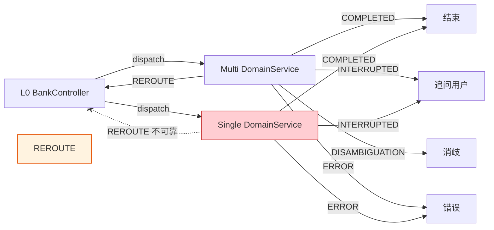
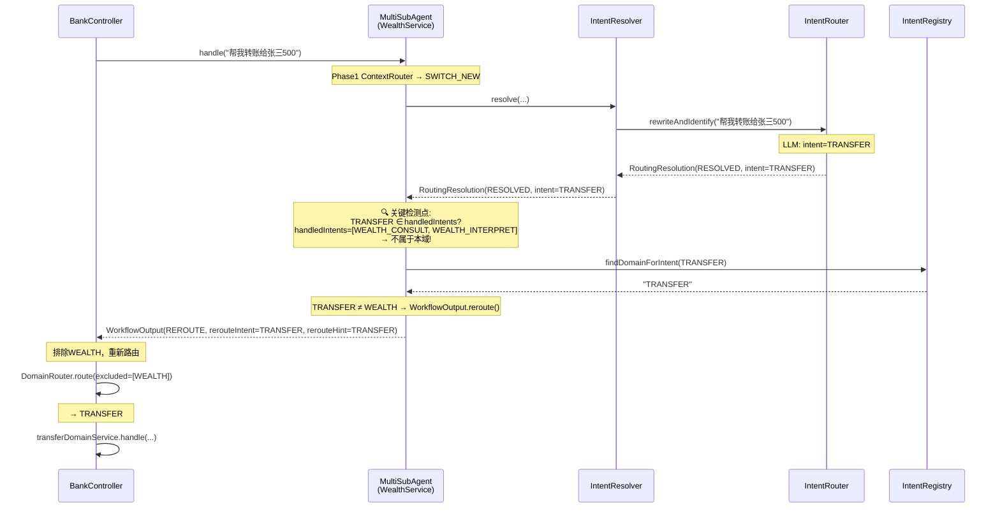
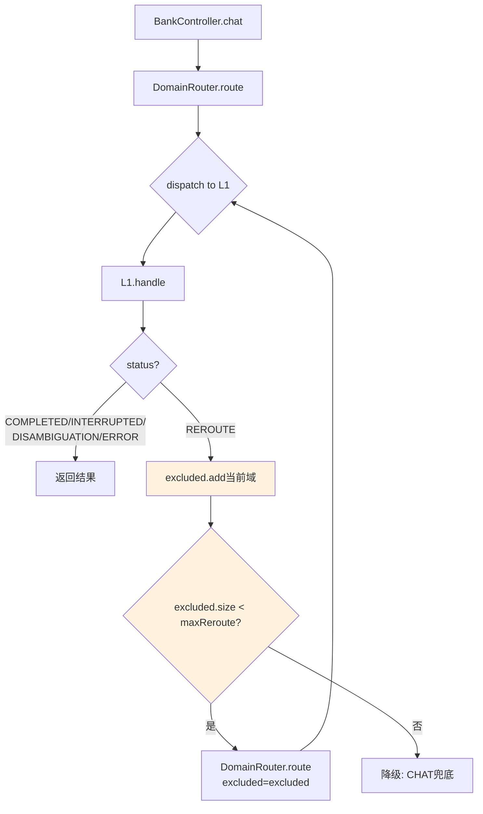
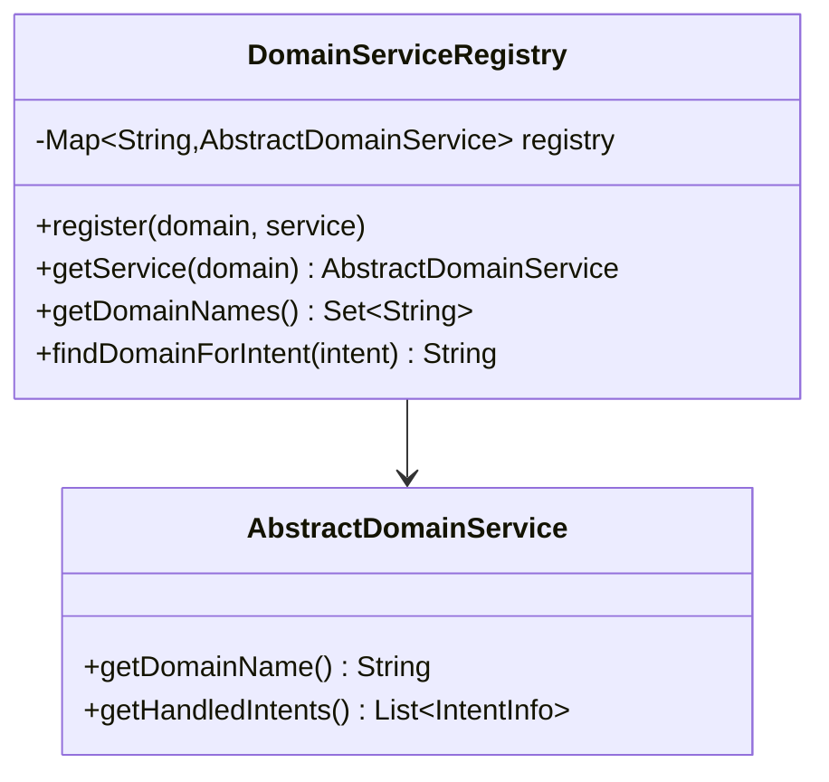
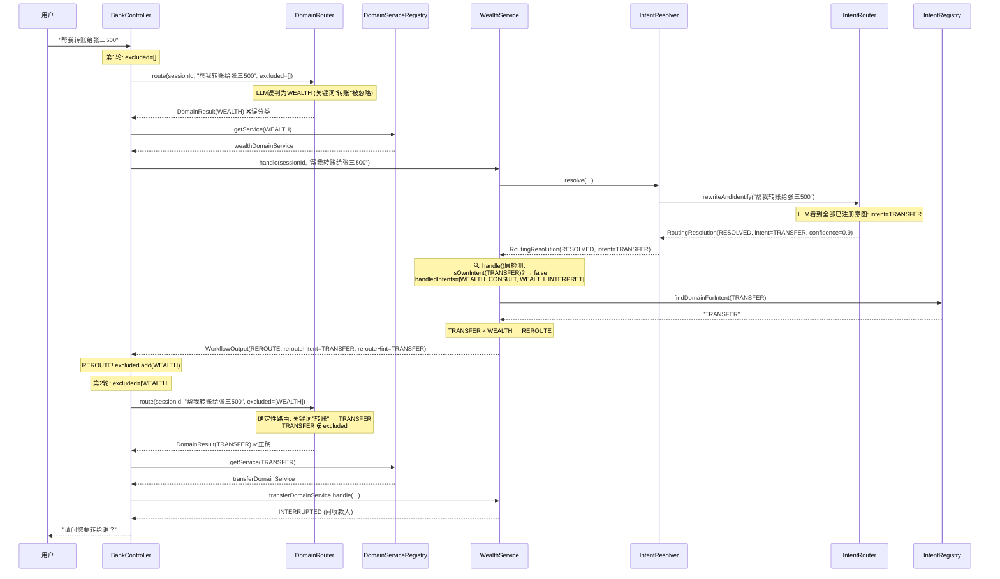
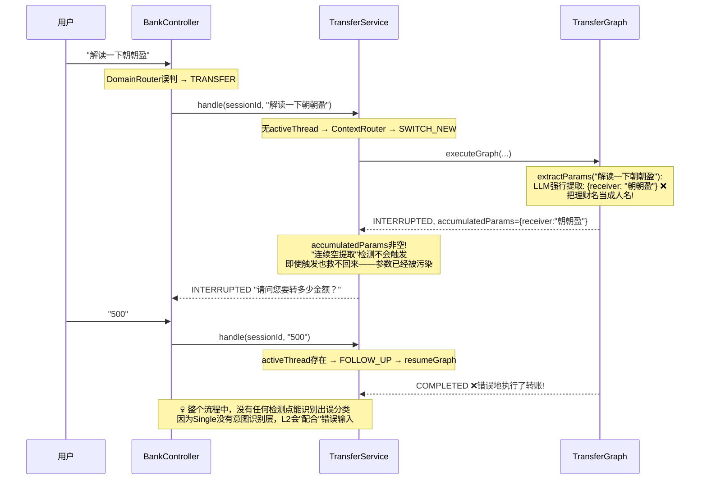

# P1: L0误分类纠错 — REROUTE反馈机制设计

> 状态: 设计稿 v2（含关键修正），待评估 | 2026-05-24
> 
> **v2 修正说明**: 基于3项深度分析，对v1设计做了重要修正：
> 1. Multi跨域检测**从IntentResolver下移到MultiSubAgentDomainService.handle()层**（职责更清晰）
> 2. **删除Single连续空提取检测**（L2会强行把错误领域输入塞进参数模板，检测不可靠）
> 3. Single不做L1层REROUTE检测，**靠L0 DomainRouter准确性兜底**

---

## 1. 问题陈述

**现状**: L0(DomainRouter)将用户输入路由到错误的L1领域服务后，L1无法纠正，只能硬着头皮处理或返回ERROR/REJECTED。用户被迫重新输入。

**典型场景**:
```
用户: "帮我解读一下朝朝盈"
L0 DomainRouter: → TRANSFER (误分类，应为WEALTH)
TransferService: 无activeThread → ContextRouter → SWITCH_NEW → TransferGraph
TransferGraph: extractParams提取不到转账参数 → 问"请问您要转给谁？"
用户: ？？我说的不是转账
```

**核心矛盾**: L0→L1是单向调度，L1没有"退货"通道。

---

## 2. 设计目标

| 目标 | 约束 |
|------|------|
| L1能告诉L0"我处理不了，请重新路由" | 不引入L1→L0的直接依赖 |
| 重新路由时排除已尝试的域 | 不产生无限循环 |
| 检测误分类的成本尽量低 | 复用已有LLM调用，不额外加LLM |
| 架构干净，不是if-else堆叠 | REROUTE是正常workflow状态，不是hack |
| 只在检测可靠的地方做REROUTE | 不可靠的检测宁可不做，避免误杀 |

---

## 3. 核心设计: REROUTE是WorkflowStatus

REROUTE和COMPLETED、INTERRUPTED、DISAMBIGUATION同级——是workflow的正常结束状态之一。



**关键决策: 只有Multi做REROUTE，Single不做**（详见第4.2节分析）。

**L1不需要知道L0的存在**。它只返回一个WorkflowOutput，status=REROUTE。L0看到REROUTE后自行决定如何重新路由。耦合仅限于返回值契约。

---

## 4. 检测机制: 单层检测（Multi only）

### 4.1 Multi的跨域检测: 在handle()层判断

**原理**: MultiSubAgentDomainService的Phase2(IntentRouter)已经识别具体意图。如果识别出的意图不属于本域 → REROUTE。

**检测位置**: MultiSubAgentDomainService.handle()中，拿到RoutingResolution后、执行switch之前。



**成本**: 零。IntentResolver的LLM调用已经存在，只是在handle()中多了一步判断。

**为什么不在IntentResolver中检测**（v1方案，v2修正）：

| 维度 | IntentResolver中检测 | handle()层检测 |
|------|---------------------|---------------|
| 职责 | IntentResolver负责意图识别+消歧，不应承担跨域判断 | handle()是L1的编排入口，跨域判断是编排决策 |
| 依赖 | IntentResolver需要知道"当前域"（当前是单例@Service，不知道调用方是谁） | handle()天然知道domainName和handledIntents |
| 侵入性 | 需要给IntentResolver.resolve()加handledIntents参数，所有调用方都要改 | 只改MultiSubAgentDomainService.handle() |
| 可测试性 | IntentResolver的UT要加跨域场景 | 跨域检测在handle()层独立测试 |

**判断逻辑** (在MultiSubAgentDomainService.handle()中):

```java
// handle()中，拿到resolution后，在switch之前插入:
if (resolution.getStatus() == RoutingStatus.RESOLVED) {
    String effectiveIntent = resolution.getIntentName();
    
    // 跨域检测: 识别的意图不属于本域
    if (!isOwnIntent(effectiveIntent)) {
        String targetDomain = intentRegistry.findDomainForIntent(effectiveIntent);
        if (targetDomain != null && !targetDomain.equals(domainName)) {
            log.info("[{}] Cross-domain intent detected: intent={}, targetDomain={}", 
                    logTag, effectiveIntent, targetDomain);
            return WorkflowOutput.reroute(effectiveIntent, targetDomain);
        }
    }
}

// 原有switch逻辑不变
WorkflowOutput output = switch (resolution.getStatus()) { ... };
```

```java
private boolean isOwnIntent(String intentName) {
    return handledIntents.stream()
            .anyMatch(info -> info.getIntentName().equals(intentName));
}
```

### 4.2 Single不做REROUTE检测（v2修正，v1删除）

**v1原方案**: Single通过"L2连续空提取"检测误分类。
**v2修正**: 删除此方案。原因如下。

#### 致命缺陷: L2会强行提取错误参数

SingleSubAgentDomainService没有IntentRouter（没有Phase2意图识别），无法在L1层判断"输入不属于我"。v1试图用L2执行结果（accumulatedParams为空）来间接判断，但这个信号**既不可靠也不安全**：

**推演1: L2强行提取错误参数（最常见的错误路径）**
```
第1轮: L0误把"解读朝朝盈"路由到TransferService
  → TransferGraph.extractParams("解读朝朝盈"):
    LLM可能返回: {receiver: "朝朝盈"}  ← 把理财名当人名!
  → paramRouter: receiver有, amount缺 → ASK_AMOUNT → INTERRUPTED
  → accumulatedParams={receiver: "朝朝盈"}  ← 非空! 不是"空提取"!

第2轮: 用户回答 "500"
  → TransferGraph.resumeGraph({receiver: "朝朝盈"})
  → extractParams: {amount: "500"}
  → 参数齐了 → COMPLETED → 执行转账!

用户: "我朝朝盈怎么被转走了500？？"
```

**推演2: 正常场景也会出现"空提取"**
```
用户: "我要转账"
  → TransferGraph.extractParams("我要转账"): 无具体参数
  → paramRouter: ASK_RECEIVER → INTERRUPTED
  → accumulatedParams={}  ← 空的! 但这是正常流程!
```

两种场景在accumulatedParams维度上无法区分：空参数≠误分类，非空参数≠正确分类。

**结论**: 基于L2执行结果的检测具有**不可消除的误杀风险**。宁可不做，不可误杀。

#### 为什么不给Single加独立LLM域校验

| 方案 | 额外延迟 | 成本 | 可靠性 |
|------|---------|------|--------|
| 每次新意图加一次LLM域校验 | ~200-500ms | 每次新意图多一次LLM调用 | 中等（仍可能误判） |
| 关键词+规则校验 | ~1ms | 无 | 高（但仅覆盖关键词明确的域） |

Single域（TRANSFER/BILL）有强关键词（"转账"、"账单"），DomainRouter的确定性路由已经能很好地处理。误分类主要发生在**模糊表达**上（如"朝朝盈"没有明确关键词），这类case应该从**L0 DomainRouter的prompt优化**源头解决，而不是在每个L1都加检测。

**正确思路**: C为根——从源头（DomainRouter）减少误分类，而不是在下游（L1）补检测。

---

## 5. L0层: REROUTE循环 + 域排除（仅处理Multi返回的REROUTE）

### 5.1 循环机制



### 5.2 BankController实现

```java
@PostMapping("/chat")
public WorkflowOutput chat(@RequestParam String sessionId, @RequestBody Map<String, String> req) {
    String userInput = req.get("message");
    
    Set<String> excludedDomains = new HashSet<>();
    WorkflowOutput output = null;
    
    while (excludedDomains.size() < MAX_REROUTE) {
        // L0路由(带排除列表)
        DomainRouter.DomainResult domainResult = domainRouter.route(sessionId, userInput, excludedDomains);
        
        // 分发到L1
        output = dispatchToDomain(domainResult, sessionId, userInput);
        
        // 非REROUTE → 结束循环
        if (output.getStatus() != WorkflowStatus.REROUTE) {
            break;
        }
        
        // REROUTE → 排除当前域，重新路由
        String currentDomain = domainResult.domain();
        excludedDomains.add(currentDomain);
        log.info("[BankController] REROUTE: domain={} excluded, hint={}, excluded={}", 
                currentDomain, output.getRerouteHint(), excludedDomains);
    }
    
    // 超过maxReroute → CHAT兜底
    if (output.getStatus() == WorkflowStatus.REROUTE) {
        output = chatService.handle(sessionId, userInput);
    }
    
    // 记录全局ChatMemory
    chatMemory.add(sessionId, new UserMessage(userInput));
    recordSystemReply(sessionId, output);
    return output;
}
```

### 5.3 DomainRouter排除机制

DomainRouter已有确定性路由（关键词匹配）。排除逻辑：

```java
public DomainResult route(String sessionId, String userInput, Set<String> excludedDomains) {
    // 1. 确定性路由
    DomainResult deterministic = routeDeterministic(userInput);
    if (deterministic != null && !excludedDomains.contains(deterministic.domain())) {
        return deterministic; // 命中且未被排除
    }
    
    // 2. LLM路由: prompt中加入排除信息
    String excludedContext = excludedDomains.isEmpty() ? "(无)" 
            : "以下领域已被排除，不要路由到: " + String.join(", ", excludedDomains);
    // ... 将excludedContext注入到system prompt
}
```

**重要**: 确定性路由（关键词匹配）不受排除影响——如果用户明确说了"转账"，即使TRANSFER被排除，也不应该阻止路由到TRANSFER（因为关键词是确定性的）。只有LLM路由才需要排除。

**修正**: 确定性路由如果被排除，说明之前已经路由到过这个域且L1返回了REROUTE。这种情况下应该让LLM重新判断：

```java
// 确定性路由命中但被排除 → 跳过确定性，走LLM
if (deterministic != null && excludedDomains.contains(deterministic.domain())) {
    // 不返回deterministic，让LLM判断
}
```

---

## 6. 架构调整: DomainServiceRegistry

### 6.1 问题: BankController的switch-case不可扩展

当前代码:
```java
output = switch (domainResult.domain()) {
    case "WEALTH" -> wealthDomainService.handle(sessionId, userInput);
    case "TRANSFER" -> transferDomainService.handle(sessionId, userInput);
    case "BILL" -> billDomainService.handle(sessionId, userInput);
    default -> chatService.handle(sessionId, userInput);
};
```

加上REROUTE循环后，需要一个可查找的domain→service映射。硬编码switch-case在新加领域时要改BankController。

### 6.2 方案: DomainServiceRegistry



```java
@Component
public class DomainServiceRegistry {
    private final Map<String, AbstractDomainService> registry = new LinkedHashMap<>();
    
    /** 注册领域服务(由DomainServiceConfig调用) */
    public void register(String domain, AbstractDomainService service) {
        registry.put(domain, service);
    }
    
    /** 获取领域服务 */
    public AbstractDomainService getService(String domain) {
        return registry.get(domain);
    }
    
    /** 获取所有领域名 */
    public Set<String> getDomainNames() {
        return Collections.unmodifiableSet(registry.keySet());
    }
    
    /** 根据意图名反查所属领域 */
    public String findDomainForIntent(String intentName) {
        for (Map.Entry<String, AbstractDomainService> entry : registry.entrySet()) {
            for (AbstractDomainService.IntentInfo info : entry.getValue().getHandledIntents()) {
                if (info.getIntentName().equals(intentName)) {
                    return entry.getKey();
                }
            }
        }
        return null;
    }
}
```

### 6.3 BankController重构

```java
// 之前: switch-case硬编码
// 之后: registry查找 + REROUTE循环

@PostMapping("/chat")
public WorkflowOutput chat(@RequestParam String sessionId, @RequestBody Map<String, String> req) {
    String userInput = req.get("message");
    Set<String> excludedDomains = new HashSet<>();
    WorkflowOutput output = null;
    
    while (excludedDomains.size() < MAX_REROUTE) {
        DomainRouter.DomainResult domainResult = domainRouter.route(sessionId, userInput, excludedDomains);
        AbstractDomainService service = domainServiceRegistry.getService(domainResult.domain());
        
        if (service != null) {
            output = service.handle(sessionId, userInput);
        } else if (domainResult.isUnsupported()) {
            output = WorkflowOutput.completed(null, "功能暂不支持");
        } else {
            output = chatService.handle(sessionId, userInput);
        }
        
        if (output.getStatus() != WorkflowStatus.REROUTE) break;
        
        excludedDomains.add(domainResult.domain());
    }
    
    if (output != null && output.getStatus() == WorkflowStatus.REROUTE) {
        output = chatService.handle(sessionId, userInput);
    }
    
    chatMemory.add(sessionId, new UserMessage(userInput));
    recordSystemReply(sessionId, output);
    return output;
}
```

**优势**: 新增领域时只需在DomainServiceConfig中加@Bean + registry.register()，BankController零改动。

---

## 7. 数据结构变更

### 7.1 WorkflowStatus增加REROUTE

```java
public enum WorkflowStatus {
    COMPLETED("COMPLETED"),
    INTERRUPTED("INTERRUPTED"),
    DISAMBIGUATION("DISAMBIGUATION"),
    ERROR("ERROR"),
    REROUTE("REROUTE");    // 新增
}
```

### 7.2 WorkflowOutput增加reroute字段

```java
@Data @Builder
public class WorkflowOutput {
    WorkflowStatus status;
    String content;
    String question;
    String intent;
    String threadId;
    String errorMessage;
    List<String> candidateIntents;
    Map<String, Object> accumulatedParams;
    
    // 新增: REROUTE相关
    String rerouteHint;          // 建议的目标域(如"TRANSFER")，可为null
    String rerouteIntent;        // 识别到的意图(如"TRANSFER")，可为null
    
    public static WorkflowOutput reroute(String rerouteIntent, String rerouteHint) {
        return WorkflowOutput.builder()
                .status(WorkflowStatus.REROUTE)
                .rerouteIntent(rerouteIntent)
                .rerouteHint(rerouteHint)
                .build();
    }
}
```

### 7.3 RoutingResolution增加REROUTE

```java
public enum RoutingStatus {
    RESOLVED,
    DISAMBIGUATION,
    REJECTED,
    CANCELLED,
    REROUTE    // 新增
}

// 新增工厂方法
public static RoutingResolution reroute(String intentName, String targetDomain) {
    return RoutingResolution.builder()
            .status(RoutingStatus.REROUTE)
            .intentName(intentName)
            .routeType("REROUTE_" + targetDomain)
            .build();
}
```

---

## 8. 完整REROUTE流程图

### 8.1 唯一REROUTE路径: Multi域跨域检测



### 8.2 Single域: 不做REROUTE（误分类的错误路径展示）

**此图展示为什么Single不能基于L2结果做REROUTE检测**:



**结论**: Single的误分类只能从L0 DomainRouter源头预防。优化手段：
- DomainRouter prompt中强化领域关键词识别
- 确定性路由规则的覆盖率提升
- 对模糊表达增加LLM路由的few-shot示例

---

## 9. 变更影响矩阵

| 文件 | 变更类型 | 变更内容 |
|------|---------|---------|
| WorkflowStatus.java | 修改 | 新增 REROUTE 枚举值 |
| WorkflowOutput.java | 修改 | 新增 rerouteHint, rerouteIntent 字段 + reroute() 工厂方法 |
| RoutingResolution.java | 修改 | RoutingStatus新增REROUTE + reroute() 工厂方法 |
| MultiSubAgentDomainService.java | 修改 | handle()中加跨域检测(isOwnIntent) + switch增加REROUTE分支 |
| DomainRouter.java | 修改 | route()重载，接受excludedDomains参数 |
| l0-domain.st | 修改 | prompt增加排除领域上下文 |
| BankController.java | 重构 | switch-case → registry + REROUTE循环 |
| DomainServiceRegistry.java | 新增 | 领域服务注册表 |
| DomainServiceConfig.java | 修改 | 构建后注册到DomainServiceRegistry |
| IntentRegistry.java | 修改 | 新增findDomainForIntent()方法 |

**注意**: IntentResolver.java和SingleSubAgentDomainService.java**不在变更列表中**。

---

## 10. 不做的事 (显式排除)

| 排除项 | 原因 |
|--------|------|
| 不给Single加REROUTE检测 | L2会强行提取错误参数（"朝朝盈"被当收款人），基于L2结果的检测不可靠；独立LLM域校验增加200-500ms延迟且仍有误判风险 |
| 不给Single加独立LLM域校验 | 额外200-500ms延迟，且Single域（TRANSFER/BILL）有强关键词，DomainRouter确定性路由已覆盖 |
| 不让L1直接调用其他L1 | 破坏单向调度隔离性 |
| 不改L2 Graph的extractParams prompt | REROUTE是L1层决策，不应侵入L2 |
| 不在IntentResolver中做跨域检测 | 职责单一：IntentResolver负责意图识别+消歧，跨域判断是编排决策，应在handle()层 |
| 不在REROUTE时自动重试之前的对话 | REROUTE后是新dispatch，不需要历史上下文 |
| 不把REROUTE信息暴露给前端 | REROUTE是内部机制，用户看到的是最终结果 |

---

## 11. 风险评估

| 风险 | 概率 | 影响 | 缓解 |
|------|------|------|------|
| REROUTE循环不终止 | 低 | 高 | maxReroute=2硬上限 + CHAT兜底 |
| Multi误判跨域（本域意图被判为REROUTE） | 中 | 高 | 只在confidence>0.7且intent明确属于其他域时才REROUTE；可在RoutingResolution中增加confidence字段 |
| Single误分类无法自动纠正 | 中 | 中 | 从L0 DomainRouter源头优化：强化关键词识别、增加few-shot示例、提升确定性路由覆盖率 |
| DomainRouter排除后LLM仍然路由到排除域 | 低 | 低 | prompt中明确列出排除域 + 解析后二次检查 |
| DomainServiceRegistry与@Qualifier注入冲突 | 低 | 低 | Config中@Bean后主动registry.register()，不依赖自动发现 |
| handle()层跨域检测与IntentResolver职责模糊 | 低 | 低 | 明确边界：IntentResolver只做意图识别+消歧，跨域判断在handle()层；RoutingResolution不新增REROUTE状态 |

**v2已消除的风险**:
| ~~v1风险~~ | ~~为什么消除~~ |
|------------|--------------|
| ~~Single连续空提取误触发REROUTE~~ | v2删除了Single REROUTE检测，此风险不存在 |
| ~~Single L2强行提取错误参数导致REROUTE检测失效~~ | v2不再依赖L2执行结果做判断，此风险不存在 |

---

## 12. 与其他改进项的关系

```
P1 (REROUTE) ← 依赖 → DomainServiceRegistry (P3的子集)
P1 (REROUTE) ← 增强 → DomainRouter排除机制 (P1独有)
P1 (REROUTE) ← 独立 → P0(已撤回), P2(已完成), P4(独立)
```

**P3(领域自注册)**的DomainServiceRegistry是P1的前置条件。但P1只需要Registry的查找功能，不需要P3的自动发现能力。因此可以先实现一个轻量Registry，后续P3再扩展。

---

## 13. 实施顺序建议

```
Step 1: WorkflowStatus.REROUTE + WorkflowOutput扩展 + RoutingResolution.REROUTE
Step 2: DomainServiceRegistry (轻量版，P3子集)
Step 3: BankController重构: switch-case → registry dispatch + REROUTE循环
Step 4: DomainRouter: route()重载 + l0-domain.st排除prompt
Step 5: MultiSubAgentDomainService.handle(): 跨域检测(isOwnIntent) → REROUTE
Step 6: 回归测试
```

**Step 1-4是基础设施**，不改变任何行为，可以先行。
**Step 5是核心逻辑**，只改MultiSubAgentDomainService一个文件。
**Step 6验证**：需要新增REROUTE场景的测试用例。

**代码修改量估算**: ~130行，涉及10个文件。其中架构变更集中在Step 2-3（BankController+Registry，~90行），其余均为小改动（每文件5-25行）。**不涉及L0→L1→L2层次关系的改变**，只改变L0内部的dispatch方式。

### 与v1的对比

| 维度 | v1 | v2 |
|------|----|----|
| REROUTE检测层 | 两层（Multi + Single） | 单层（仅Multi） |
| Multi检测位置 | IntentResolver | MultiSubAgentDomainService.handle() |
| Single检测方式 | 连续空提取 | 无（靠L0 DomainRouter源头） |
| 变更文件数 | 12 | 10 |
| 代码修改量 | ~165行 | ~130行 |
| IntentResolver是否改动 | 是 | 否 |
| SingleSubAgent是否改动 | 是 | 否 |
| 架构风险 | Single检测不可靠 | 更保守，风险更可控 |
