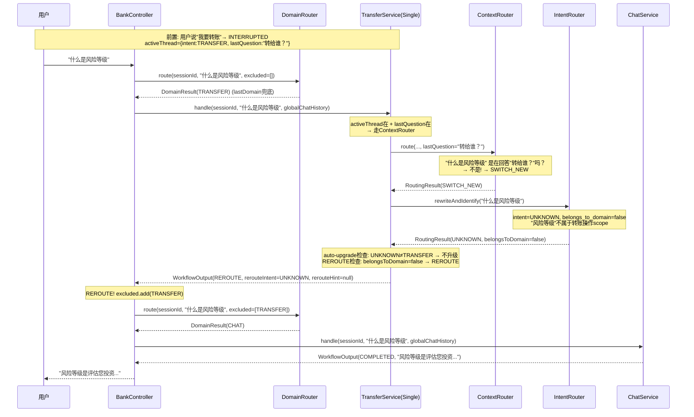
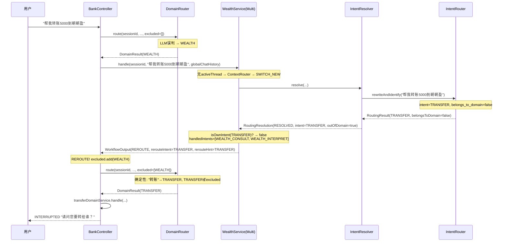
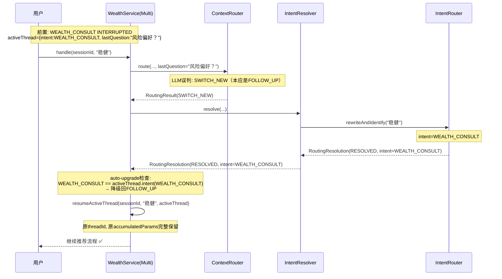

# REROUTE 机制设计文档 v3

> 状态: 设计稿 | 2026-05-25
>
> **与 DESIGN-P1-REROUTE v2 的核心差异**: 检测点从 L2 执行结果之后**前移到 ContextRouter 层**，Single 域也可以做 REROUTE；ContextRewriter 与 IntentRouter 合并。

---

## 1. 问题陈述

### 1.1 现状缺陷

L0→L1 是单向调度，L1 无法"退货"。当用户输入不属于当前域的处理范围时，L1 只能硬处理，导致两种典型问题：

**问题A: 用户没在回答子智能体的问题**
```
用户: "有什么理财推荐"
助手: "请问您的风险偏好是？"  (WEALTH_CONSULT / INTERRUPTED)
用户: "什么是风险等级"
```
- 当前行为: ContextRouter 判 FOLLOW_UP（"风险等级"跟"风险偏好"有关联）→ resumeGraph → extractParams 把"什么是风险等级"当风险偏好提取 → LLM 幻觉
- 期望行为: ContextRouter 发现"什么是风险等级"不是在回答"风险偏好？" → SWITCH_NEW → 本域无法处理 → REROUTE → CHAT 域回答

**问题B: L0 误路由到错误域**
```
用户: "帮我转账5000元到朝朝盈理财产品"
L0: → WEALTH (误判，应为 TRANSFER)
```
- 当前行为: WealthService.handle() → IntentRouter → intent=TRANSFER → 但 handledIntents=[WEALTH_CONSULT, WEALTH_INTERPRET] → 不匹配 → REJECTED → 用户看到"不支持"
- 期望行为: 识别出 TRANSFER 不属于 WEALTH → REROUTE → L0 重新路由到 TRANSFER → 正确处理

### 1.2 v2 为什么不让 Single 做 REROUTE

v2 的检测点在 **L2 执行结果之后**，而 L2 会强行提取错误参数（"朝朝盈"被当收款人），导致 accumulatedParams 非空，"空提取"检测不可靠。

**v3 的改进**: 检测点前移到 **ContextRouter 层**，在 L2 执行之前就判断"用户没有在回答问题"，不依赖 L2 执行结果。Single 也可以安全地做 REROUTE。

---

## 2. 设计目标

| 目标 | 约束 |
|------|------|
| L1 能告诉 L0 "我处理不了，请重新路由" | 不引入 L1→L0 的直接依赖 |
| 重新路由时排除已尝试的域 | 不产生无限循环（maxReroute=2） |
| 检测误分类的成本尽量低 | 复用已有 LLM 调用，不额外加 LLM |
| Single 和 Multi 都能 REROUTE | 检测不依赖 L2 执行结果 |
| ContextRewriter 与 IntentRouter 合并 | 减少组件冗余，统一 Phase2 流程 |
| CHAT 域能接住被退回的问题 | CHAT = 闲聊 + FAQ |

---

## 3. 核心设计

### 3.1 三层检测链

```
Layer 1: ContextRouter (Phase1)
  输入: lastQuestion(如有) + 用户输入
  判断: 用户是否在回答子智能体的问题？
  输出: FOLLOW_UP / SWITCH_NEW / RESUME

Layer 2: IntentRouter (Phase2, 替代 ContextRewriter)
  输入: 改写后的输入 + 本域意图列表 + scope
  判断: 用户意图是否属于本域？
  输出: intentName + rewrittenInput + belongsToDomain

Layer 3: handle() 层
  判断: identifiedIntent ∈ handledIntents？
  输出: 执行 / REROUTE / auto-upgrade
```

### 3.2 REROUTE 是 WorkflowStatus

REROUTE 与 COMPLETED、INTERRUPTED、DISAMBIGUATION 同级——是 workflow 的正常结束状态之一。L1 不需要知道 L0 的存在，只返回 `WorkflowOutput(status=REROUTE)`。

---

## 4. 变更1: ContextRouter 增强 — 注入 lastQuestion

### 4.1 问题

当前 ContextRouter 不知道子智能体问的是什么，只能基于对话历史泛泛判断 FOLLOW_UP / SWITCH_NEW。无法区分"稳健"(在回答问题)和"什么是风险等级"(不是在回答问题)。

### 4.2 方案

当 activeThread 存在且 L2 正在追问（INTERRUPTED），把子智能体的最后一个问题注入 ContextRouter 的 prompt。

### 4.3 ActiveThreadInfo 增加 lastQuestion

```java
@Data
public static class ActiveThreadInfo {
    private final String threadId;
    private final String intent;
    private final Instant createdAt;
    private final Instant expiresAt;
    private Map<String, Object> accumulatedParams = new HashMap<>();
    private String lastQuestion;  // 新增: L2子智能体最后一个提问

    public ActiveThreadInfo(String threadId, String intent, Instant createdAt, Instant expiresAt) {
        this.threadId = threadId;
        this.intent = intent;
        this.createdAt = createdAt;
        this.expiresAt = expiresAt;
    }
}
```

**生命周期**:
- 何时设置: L2 返回 INTERRUPTED 时，从 `WorkflowOutput.getQuestion()` 提取
- 何时清空: L2 返回 COMPLETED 时
- REROUTE 时不影响: activeThread 保持原状，lastQuestion 保留
- 与 accumulatedParams 同生命周期

**设置位置**: 在 `AbstractDomainService` 的 `saveAccumulatedParams()` 方法中扩展（或新增 `saveL2Result()` 方法）：

```java
protected void saveL2Result(String sessionId, WorkflowOutput output) {
    ActiveThreadInfo active = getOwnActiveThread(sessionId);
    if (active != null) {
        // 保存 accumulatedParams（原有逻辑）
        if (output.getAccumulatedParams() != null && !output.getAccumulatedParams().isEmpty()) {
            active.setAccumulatedParams(output.getAccumulatedParams());
        }
        // 保存 lastQuestion（新增）
        if (output.getStatus() == WorkflowStatus.INTERRUPTED && output.getQuestion() != null) {
            active.setLastQuestion(output.getQuestion());
        } else if (output.getStatus() == WorkflowStatus.COMPLETED) {
            active.setLastQuestion(null);
        }
    }
}
```

### 4.4 ContextRouter 签名变更

```java
// 之前
public RoutingResult route(String sessionId, String userInput,
                           String currentAgent, String pendingAgents,
                           String templatePath, String domainName, ChatMemory chatMemory)

// 之后
public RoutingResult route(String sessionId, String userInput,
                           String currentAgent, String pendingAgents,
                           String templatePath, String domainName, ChatMemory chatMemory,
                           String lastQuestion)  // 新增: 子智能体最后的提问，null表示无
```

### 4.5 ContextRouter prompt 变更

在 l1-routing.st 和 l1-routing-simple.st 中增加条件区段：

```
{{lastQuestion 区段}}
===子智能体正在等待回答的问题===
{last_question}
===问题结束===

★ 关键判断 ★
如果【子智能体的问题】非空，首要判断: 用户当前消息是否是在回答这个问题？
  - 是(语义上直接回答/补充参数) → FOLLOW_UP
    例: 问题"风险偏好？"，用户"稳健" → FOLLOW_UP
    例: 问题"转给谁？"，用户"张三" → FOLLOW_UP
    例: 问题"金额？"，用户"500" → FOLLOW_UP
  - 否(用户提出了新问题/新需求/与问题无关) → SWITCH_NEW
    例: 问题"风险偏好？"，用户"什么是风险等级" → SWITCH_NEW（不是在回答，是在反问）
    例: 问题"转给谁？"，用户"查账单" → SWITCH_NEW（完全无关）
    例: 问题"金额？"，用户"算了不转了" → FOLLOW_UP（取消=回应当前agent）
{{/lastQuestion 区段}}

{{无 lastQuestion 时}}
（保持原有的 FOLLOW_UP / SWITCH_NEW / RESUME 判断规则，不变）
{{/无 lastQuestion 时}}
```

**注意**: lastQuestion 为 null 时，prompt 与现在完全一致，零行为变化。

### 4.6 Single 域的 activeThread 存在时走 ContextRouter

**当前行为** (故意跳过 ContextRouter):
```
activeThread在 → 跳过ContextRouter → 直接FOLLOW_UP → resumeGraph
```

**变更后**:
```
activeThread在 + lastQuestion在 → 走ContextRouter(含lastQuestion) → FOLLOW_UP或SWITCH_NEW
activeThread在 + lastQuestion为空 → 直接FOLLOW_UP → resumeGraph（不变）
activeThread为空 → 走ContextRouter(无lastQuestion) → FOLLOW_UP或SWITCH_NEW（不变）
```

**何时 activeThread 存在但 lastQuestion 为空**: 理论上不出现。activeThread 存在意味着 L2 处于 INTERRUPTED，INTERRUPTED 必有 question。但防御性编程：如果 lastQuestion 为空，保持原来直接 FOLLOW_UP 的行为。

**为什么可以放心走 ContextRouter**: 有了具体的 lastQuestion 锚定，LLM 的判断精度远高于泛泛的 FOLLOW_UP/SWITCH_NEW 判断。"稳健是否在回答风险偏好"是语义明确的二分类，比"稳健是FOLLOW_UP还是SWITCH_NEW"容易得多。

**即使 ContextRouter 误判为 SWITCH_NEW**: 后续有 auto-upgrade 保护（见第 5 节），不会丢失 accumulatedParams。

---

## 5. 变更2: ContextRewriter → IntentRouter 合并

### 5.1 为什么合并

| 维度 | ContextRewriter (Single 当前) | IntentRouter (Multi 当前) |
|------|------|------|
| 输出 | `String`（改写后输入） | `RoutingResult`（意图+改写+置信度） |
| LLM 调用 | 1 次（只改写） | 1 次（改写+识别意图） |
| 是否有意图识别 | 无 | 有 |
| 是否支持 REROUTE | 不支持 | 支持（通过意图归属判断） |

REROUTE 需要 Single 也能判断"这个意图是不是我的" → 需要意图识别能力 → 需要 IntentRouter。保留两套做几乎相同事的组件没有意义。

### 5.2 合并方式

- **删除 ContextRewriter 的使用**（不删类，暂时保留做 fallback）
- **Single 改用 IntentRouter**，和 Multi 共用同一个通用模板
- IntentRouter 本身不需要改动（已经通过 templatePath 参数支持不同模板）
- 当前 `l1-intention.st` 中的理财域硬编码规则迁移到 application.yml 的 description/scope，模板重写为通用

### 5.3 通用 IntentRouter 模板 (替代领域专用模板)

**当前问题**: `l1-intention.st` 硬编码了理财域知识（"意图区分核心规则"等），不是通用的。新增领域需要写新模板。

**方案**: 用**一个通用模板**替代，由 `{intent_list}` 和 `{intent_scope_list}` 动态驱动，Single/Multi 共用。

- Single 传进来：intent_list 只有 TRANSFER 一项，不触发消歧
- Multi 传进来：intent_list 有 WEALTH_CONSULT + WEALTH_INTERPRET，自然进入消歧
- 领域特有知识从模板移到 `application.yml` 的 intent description 和 scope

```
你是{domain_name}领域的意图识别与改写器。L0已将消息路由到本领域，你只需在本领域的子意图中选择。

本领域处理以下意图:
{intent_list}

意图处理范围:
{intent_scope_list}

已注册意图列表(全局,供跨域归属判断参考):
{all_intent_list}

改写模式: {mode}

当前会话状态:
{session_state}

当前意图: {intent_name}
挂起的意图: {pending_agents}

消歧上下文: {disambig_context}

===对话历史(本领域，用于理解上下文)===
{chat_history}
===领域历史结束===

===全局对话历史(跨域指代消解)===
{global_chat_history}
===全局历史结束===

===用户当前消息===
{message}
===当前消息结束===

任务:
1. 意图识别(主要):
   - 从本领域意图列表中选择最匹配的意图
   - 如果明确匹配其他领域意图 → intent_name=该意图名, belongs_to_domain=false
   - 如果无法归入任何已注册意图 → intent_name=UNKNOWN, belongs_to_domain=false
   - 如果意图列表只有1个意图且用户输入与本领域相关 → 直接匹配该意图, belongs_to_domain=true
   - 如果意图列表有多个意图且用户输入只能匹配到意图组级别 → is_ambiguous=true

2. 上下文改写(辅助):
   - 指代消解: 将代词/省略补全为完整表达
   - 跨域指代消解: 从全局历史中查找并消解
   - 参数继承: 保留用户明确提过的参数
   - ★改写边界: 只补全用户明确说过的内容，禁止为未指定参数填默认值

3. 归属判断:
   判断用户意图是否属于本领域处理范围:
   - 参考意图的 intent_type 和 scope
   - "什么是风险等级" → 知识类FAQ，不在理财推荐/解读的scope内 → belongs_to_domain=false
   - "查账单" → BILL_QUERY，不属于转账域 → belongs_to_domain=false
   - 无法确定时 → belongs_to_domain=true (保守策略，宁可不REROUTE也不误杀)

消歧回答处理(当消歧上下文非"无"时):
- 用户正在回答消歧追问，简短回答是对候选意图的选择
- 必须将用户回答映射到本领域具体意图之一
- 用户已明确选择后，不应再标记is_ambiguous=true

严格输出JSON:
{
  "intent_name": "意图名/组名/UNKNOWN",
  "rewritten_input": "改写后的自包含描述",
  "belongs_to_domain": true/false,
  "route_type": "SWITCH_NEW | RESUME",
  "resume_target": "RESUME时填意图名,否则null",
  "confidence": 0.0-1.0,
  "is_ambiguous": false,
  "candidate_intents": [],
  "group_id": null
}
```

**迁移**: 现有 `l1-intention.st` 中的理财域硬编码规则（"推荐→CONSULT, 解读→INTERPRET"）应迁移到 `application.yml` 的 intent description 和 scope 中，模板不再包含领域特定知识。

### 5.4 IntentRouter 签名和输出变更

IntentRouter 不需要改签名，但 RoutingResult 需要增加字段：

```java
@Data @Builder
public class RoutingResult {
    // ... 现有字段 ...
    
    /** Phase2: 用户意图是否属于当前域的处理范围（REROUTE判断依据） */
    private boolean belongsToDomain;
}
```

IntentRouter 的 `parseRewriteResponse()` 增加 `belongs_to_domain` 解析：

```java
boolean belongsToDomain = !node.has("belongs_to_domain") || node.get("belongs_to_domain").asBoolean(true);
// 默认 true: 如果 LLM 没输出该字段，保守认为属于本域（不误杀）
```

### 5.5 Single 的 Phase2 调用变更

```java
// 之前 (Single 用 ContextRewriter):
String rewrittenInput = contextRewriter.rewrite(sessionId, userInput, chatMemory, domainName, 
                                                 rewriterTemplatePath, globalChatHistory);

// 之后 (Single 用 IntentRouter):
RoutingResult phase2 = intentRouter.rewriteAndIdentify(sessionId, userInput, phase1Result,
        currentAgent, pendingAgents, sessionState, disambigContext,
        intentionTemplatePath, chatMemory, globalChatHistory);
String rewrittenInput = phase2.getRewrittenInput();
```

**注意**: Single 需要注入 IntentRouter（原来注入的是 ContextRewriter）。Builder 需要调整。

### 5.6 Multi 的 Phase2 不变

Multi 仍然通过 IntentResolver 调用 IntentRouter。IntentResolver 不感知 REROUTE，REROUTE 检测在 handle() 层做。

但 l1-intention.st 模板也需要增加 `belongs_to_domain` 输出（供 Multi 的 REROUTE 判断使用）。

---

## 6. 变更3: REROUTE 判断 — handle() 层

### 6.1 Auto-upgrade 保护（关键安全网）

**场景**: ContextRouter 误判 SWITCH_NEW，但用户实际上是在回答问题。

```
子智能体问: "风险偏好？"
用户说: "稳健"
ContextRouter 误判: SWITCH_NEW（不该判 SWITCH_NEW）
IntentRouter 识别: intent=WEALTH_CONSULT
activeThread.intent = WEALTH_CONSULT
→ WEALTH_CONSULT == WEALTH_CONSULT → auto-upgrade 回 FOLLOW_UP
→ resumeActiveThread(sessionId, userInput, activeThread)
→ 原threadId, 原accumulatedParams 完整保留
```

**实现** (在 AbstractDomainService 中):

```java
/**
 * Auto-upgrade: ContextRouter 判 SWITCH_NEW 但 IntentRouter 识别的意图
 * 与 activeThread 的意图一致 → 降级回 FOLLOW_UP
 *
 * 保护场景: ContextRouter 误判导致 accumulatedParams 丢失
 */
protected WorkflowOutput tryAutoUpgradeFollowUp(ActiveThreadInfo activeThread, 
                                                 RoutingResult phase2,
                                                 String sessionId, String userInput) {
    if (activeThread != null && phase2 != null) {
        String identifiedIntent = phase2.getIntentName();
        if (identifiedIntent != null && identifiedIntent.equals(activeThread.getIntent())) {
            log.info("[{}] Auto-upgrade SWITCH_NEW→FOLLOW_UP: identifiedIntent={} matches activeThread.intent={}", 
                     logTag, identifiedIntent, activeThread.getIntent());
            return resumeActiveThread(sessionId, userInput, activeThread);
        }
    }
    return null; // 不匹配，由调用方继续正常流程
}
```

### 6.2 Single 的 REROUTE 判断

Single 的 handle() 新流程:

```java
public WorkflowOutput handle(String sessionId, String userInput, String globalChatHistory) {
    ActiveThreadInfo ownActive = getOwnActiveThread(sessionId);
    
    // ===== 1. activeThread在 + 有lastQuestion → 走ContextRouter =====
    if (ownActive != null && ownActive.getLastQuestion() != null) {
        RoutingResult phase1 = contextRouter.route(sessionId, userInput,
                ownActive.getIntent(), "无",
                routingTemplatePath, domainName, chatMemory,
                ownActive.getLastQuestion());  // 注入lastQuestion
        
        if (phase1.isFollowUp()) {
            return resumeActiveThread(sessionId, userInput, ownActive);
        }
        
        // SWITCH_NEW → Phase2 IntentRouter
        RoutingResult phase2 = intentRouter.rewriteAndIdentify(sessionId, userInput, phase1,
                ownActive.getIntent(), "无", "SWITCH_NEW (非回答当前问题)", "无",
                intentionTemplatePath, chatMemory, globalChatHistory);
        
        // Auto-upgrade 保护
        WorkflowOutput upgraded = tryAutoUpgradeFollowUp(ownActive, phase2, sessionId, userInput);
        if (upgraded != null) return upgraded;
        
        // REROUTE 判断
        if (!phase2.isBelongsToDomain()) {
            return WorkflowOutput.reroute(phase2.getIntentName(), null);
        }
        
        addUserMessage(sessionId, userInput);
        return handleSwitchNew(sessionId, phase2.getRewrittenInput());
    }
    
    // ===== 2. activeThread在 + 无lastQuestion → 直接FOLLOW_UP (不变) =====
    if (ownActive != null) {
        return resumeActiveThread(sessionId, userInput, ownActive);
    }
    
    // ===== 3. 无activeThread → 走ContextRouter + IntentRouter =====
    RoutingResult phase1 = contextRouter.route(sessionId, userInput,
            "无", "无", routingTemplatePath, domainName, chatMemory, null);
    
    RoutingResult phase2 = intentRouter.rewriteAndIdentify(sessionId, userInput, phase1,
            "无", "无", "新意图", "无",
            intentionTemplatePath, chatMemory, globalChatHistory);
    
    // REROUTE 判断
    if (!phase2.isBelongsToDomain()) {
        return WorkflowOutput.reroute(phase2.getIntentName(), null);
    }
    
    String rewrittenInput = phase2.getRewrittenInput() != null ? phase2.getRewrittenInput() : userInput;
    addUserMessage(sessionId, userInput);
    return handleSwitchNew(sessionId, rewrittenInput);
}
```

### 6.3 Multi 的 REROUTE 判断

Multi 的 handle() 在拿到 RoutingResolution 后，executeRoute 之前插入检测：

```java
// 在 handle() 中，拿到 resolution 后，switch 之前:
if (resolution.isResolved()) {
    String effectiveIntent = resolution.getIntentName();
    
    // REROUTE: 识别的意图不属于本域
    if (!isOwnIntent(effectiveIntent)) {
        String targetDomain = domainServiceRegistry.findDomainForIntent(effectiveIntent);
        if (targetDomain != null && !targetDomain.equals(domainName)) {
            log.info("[{}] Cross-domain intent detected: intent={}, targetDomain={}",
                    logTag, effectiveIntent, targetDomain);
            return WorkflowOutput.reroute(effectiveIntent, targetDomain);
        }
    }
    
    // REROUTE: IntentRouter 判断不属于本域 (UNKNOWN / scope外)
    // 需要从 IntentResolver 获取 belongsToDomain 信号
    if (resolution.isOutOfDomain()) {
        log.info("[{}] Out-of-domain intent detected: intent={}", logTag, effectiveIntent);
        return WorkflowOutput.reroute(effectiveIntent, null);
    }
}
```

### 6.4 isOwnIntent 判断

```java
private boolean isOwnIntent(String intentName) {
    if (intentName == null || "UNKNOWN".equalsIgnoreCase(intentName)) return false;
    return handledIntents.stream()
            .anyMatch(info -> info.getIntentName().equals(intentName));
}
```

---

## 7. 变更4: L2 能力注册 — IntentConfig 扩展

### 7.1 application.yml 扩展

```yaml
intents:
  - name: TRANSFER
    description: "转账给他人"
    param-schema: "收款方, 金额, 用途(可选)"
    is-write-op: true
    intent-type: OPERATION          # 新增
    scope: "资金转账操作，将钱转给他人或理财产品等"  # 新增
    
  - name: BILL_QUERY
    description: "查询账单明细"
    param-schema: "时间范围, 收支类型(可选)"
    is-write-op: false
    intent-type: QUERY              # 新增
    scope: "账单/消费/收支明细查询"   # 新增
    
  - name: WEALTH_CONSULT
    description: "理财咨询/推荐"
    param-schema: "风险偏好, 关注领域(可选)"
    is-write-op: false
    intent-type: CONSULTATION       # 新增
    scope: "理财咨询与推荐，基于风险偏好推荐理财产品"  # 新增
    
  - name: WEALTH_INTERPRET
    description: "理财产品解读"
    param-schema: "理财产品名称"
    is-write-op: false
    intent-type: CONSULTATION       # 新增
    scope: "理财产品/标的解读，分析具体理财产品的详情"  # 新增
```

### 7.2 IntentConfig 扩展

```java
@Data
public static class IntentConfig {
    private final String name;
    private final String description;
    private final String paramSchema;
    private final boolean writeOp;
    private final String intentType;   // 新增: OPERATION / QUERY / CONSULTATION
    private final String scope;        // 新增: 本意图的处理范围描述
    private CompiledGraph graph;
    
    public IntentConfig(String name, String description, String paramSchema, 
                        boolean writeOp, String intentType, String scope) {
        this.name = name;
        this.description = description;
        this.paramSchema = paramSchema;
        this.writeOp = writeOp;
        this.intentType = intentType;
        this.scope = scope;
    }
}
```

### 7.3 scope 在 prompt 中的使用

IntentRouter 的模板中注入 scope 信息，帮助 LLM 判断归属：

```
本领域意图的处理范围:
{intent_scope_list}

其中 intent_scope_list 格式:
- TRANSFER: [OPERATION] 资金转账操作，将钱转给他人或理财产品等
- BILL_QUERY: [QUERY] 账单/消费/收支明细查询
```

### 7.4 intentType + scope 的完整消费链路

```
application.yml (intent-type + scope)
    ↓
IntentRegistry.getDomainIntentScopeDescription()  →  "TRANSFER [OPERATION]: 资金转账操作..."
    ↓                                               ↓
Single/IntentResolver 调用时传入                IntentRouter.buildIntentionSystemPrompt()
    ↓                                               ↓
                                    模板 {intent_scope_list} 占位符替换
                                                ↓
                                        LLM prompt 中出现 scope
                                                ↓
                                    LLM 判断 belongs_to_domain = true/false
                                                ↓
                                    RoutingResult.belongsToDomain 字段
                                                ↓
                                    handle() 层 REROUTE 判断
```

**IntentRegistry 新增方法**:

```java
/** 生成本领域意图列表（含intentType+scope），供 IntentRouter 做 belongs_to_domain 判断 */
public String getDomainIntentScopeDescription(List<String> domainIntentNames) {
    StringBuilder sb = new StringBuilder();
    for (String intentName : domainIntentNames) {
        IntentConfig config = registry.get(intentName);
        if (config != null) {
            sb.append("- ").append(config.getName())
              .append(" [").append(config.getIntentType()).append("]")
              .append(": ").append(config.getScope())
              .append("\n");
        }
    }
    return sb.toString().trim();
}
```

**调用方传入 domainIntentScopeList**:

- **Single 调 IntentRouter 时**：Single 知道自己的 intent，从 IntentRegistry 取 scope：
  ```java
  String domainScopeList = intentRegistry.getDomainIntentScopeDescription(List.of(intent));
  ```

- **Multi 通过 IntentResolver 调 IntentRouter 时**：IntentResolver 知道 handledIntents：
  ```java
  String domainScopeList = intentRegistry.getDomainIntentScopeDescription(
      handledIntents.stream().map(IntentInfo::getIntentName).toList());
  ```

**IntentRouter.buildIntentionSystemPrompt() 变更**:

```java
// 新增参数 domainIntentScopeList
private String buildIntentionSystemPrompt(..., String domainIntentScopeList) {
    String template = loadTemplate(templatePath);
    String allIntentList = intentRegistry.getIntentListDescription();  // 全局意图
    
    return template
            .replace("{intent_list}", domainIntentScopeList)       // 本域意图+scope
            .replace("{all_intent_list}", allIntentList)           // 全局意图（供跨域判断）
            .replace("{intent_scope_list}", domainIntentScopeList) // scope（归属判断）
            ...
            .replace("{global_chat_history}", ...);
}
```

**LLM 实际推理过程**:

| 场景 | 本域 scope | 用户输入 | LLM 判断 |
|------|-----------|---------|---------|
| 转账域说"什么是风险等级" | TRANSFER [OPERATION]: 资金转账操作 | 知识FAQ | belongs_to_domain=false ✅ |
| 理财域说"什么是风险等级" | WEALTH_CONSULT [CONSULTATION]: 咨询推荐 / WEALTH_INTERPRET [CONSULTATION]: 产品解读 | 知识FAQ，不匹配任何scope | belongs_to_domain=false ✅ |
| 理财域说"推荐几款稳健的" | WEALTH_CONSULT [CONSULTATION]: 咨询推荐 | 匹配CONSULTATION | intent=WEALTH_CONSULT, belongs_to_domain=true ✅ |
| 转账域说"查账单" | TRANSFER [OPERATION]: 资金转账操作 | 不匹配 | intent=BILL_QUERY, belongs_to_domain=false ✅ |

---

## 8. 变更5: L0 REROUTE 循环

### 8.1 BankController REROUTE 循环

```java
@PostMapping("/chat")
public WorkflowOutput chat(@RequestParam String sessionId, @RequestBody Map<String, String> req) {
    String userInput = req.get("message");
    
    Set<String> excludedDomains = new HashSet<>();
    WorkflowOutput output = null;
    
    while (excludedDomains.size() < MAX_REROUTE) {  // MAX_REROUTE = 2
        // L0 路由(带排除列表)
        DomainRouter.DomainResult domainResult = domainRouter.route(sessionId, userInput, excludedDomains);
        
        // 格式化全局跨域历史
        String globalChatHistory = ChatHistoryUtils.formatAndTruncate(chatMemory, sessionId, globalContextMaxPairs);
        
        // 分发到 L1
        output = dispatchToDomain(domainResult, sessionId, userInput, globalChatHistory);
        
        // 非 REROUTE → 结束循环
        if (output.getStatus() != WorkflowStatus.REROUTE) break;
        
        // REROUTE → 排除当前域，重新路由
        excludedDomains.add(domainResult.domain());
        log.info("[BankController] REROUTE: domain={} excluded, hint={}, excluded={}", 
                domainResult.domain(), output.getRerouteHint(), excludedDomains);
    }
    
    // 超过 maxReroute → CHAT 兜底
    if (output != null && output.getStatus() == WorkflowStatus.REROUTE) {
        output = chatService.handle(sessionId, userInput);
    }
    
    // 记录全局 ChatMemory
    chatMemory.add(sessionId, new UserMessage(userInput));
    recordSystemReply(sessionId, output);
    return output;
}
```

### 8.2 DomainRouter 排除机制

```java
// route() 重载
public DomainResult route(String sessionId, String userInput, Set<String> excludedDomains) {
    // 1. 确定性路由
    DomainResult deterministic = routeDeterministic(userInput);
    if (deterministic != null && !excludedDomains.contains(deterministic.domain())) {
        return deterministic; // 命中且未被排除
    }
    // 确定性命中但被排除 → 跳过，走 LLM（之前路由到过这个域但被退回）
    
    // 2. LLM 路由: prompt 中加入排除信息
    String excludedContext = excludedDomains.isEmpty() ? "(无)" 
            : "以下领域已被排除，不要路由到: " + String.join(", ", excludedDomains);
    // ... 注入到 system prompt
}
```

**重要**: 确定性路由如果被排除，说明之前已路由到该域且 L1 返回了 REROUTE，应该让 LLM 重新判断。

### 8.3 l0-domain.st 变更

增加排除领域占位符：

```
{excluded_domains_context}

判断规则补充:
- 如果排除列表非空，不要路由到被排除的领域
- 如果所有业务领域都被排除，路由到 CHAT
```

---

## 9. 变更6: DomainServiceRegistry

### 9.1 设计

替代 BankController 中的 switch-case，支持 REROUTE 循环中的动态查找。

```java
@Component
public class DomainServiceRegistry {
    private final Map<String, AbstractDomainService> registry = new LinkedHashMap<>();
    
    public void register(String domain, AbstractDomainService service) {
        registry.put(domain, service);
    }
    
    public AbstractDomainService getService(String domain) {
        return registry.get(domain);
    }
    
    public Set<String> getDomainNames() {
        return Collections.unmodifiableSet(registry.keySet());
    }
    
    /** 根据意图名反查所属领域 */
    public String findDomainForIntent(String intentName) {
        for (Map.Entry<String, AbstractDomainService> entry : registry.entrySet()) {
            for (AbstractDomainService.IntentInfo info : entry.getValue().getHandledIntents()) {
                if (info.getIntentName().equals(intentName)) {
                    return entry.getKey();
                }
            }
        }
        return null;
    }
}
```

### 9.2 DomainServiceConfig 注册

```java
@Bean("transferDomainService")
public SingleSubAgentDomainService transferDomainService(...) {
    SingleSubAgentDomainService service = SingleSubAgentDomainService.builder()...build();
    domainServiceRegistry.register("TRANSFER", service);
    return service;
}
```

### 9.3 BankController dispatchToDomain

```java
private WorkflowOutput dispatchToDomain(DomainRouter.DomainResult domainResult, 
                                         String sessionId, String userInput,
                                         String globalChatHistory) {
    if (domainResult.isUnsupported()) {
        return WorkflowOutput.completed(null, "功能暂不支持");
    }
    
    AbstractDomainService service = domainServiceRegistry.getService(domainResult.domain());
    if (service != null) {
        return service.handle(sessionId, userInput, globalChatHistory);
    }
    
    // CHAT 或未知域
    return chatService.handle(sessionId, userInput);
}
```

---

## 10. 变更7: 数据结构变更

### 10.1 WorkflowStatus 增加 REROUTE

```java
public enum WorkflowStatus {
    COMPLETED("COMPLETED"),
    INTERRUPTED("INTERRUPTED"),
    DISAMBIGUATION("DISAMBIGUATION"),
    ERROR("ERROR"),
    REROUTE("REROUTE");    // 新增
    
    // getReplyContent() 需要补充 REROUTE 分支
}
```

### 10.2 WorkflowOutput 增加 REROUTE 字段

```java
@Data @Builder
public class WorkflowOutput {
    // ... 现有字段 ...
    
    /** REROUTE 时建议的目标意图(如"TRANSFER")，可为null */
    private String rerouteIntent;
    
    /** REROUTE 时建议的目标域(如"TRANSFER")，可为null */
    private String rerouteHint;
    
    public static WorkflowOutput reroute(String rerouteIntent, String rerouteHint) {
        return WorkflowOutput.builder()
                .status(WorkflowStatus.REROUTE)
                .rerouteIntent(rerouteIntent)
                .rerouteHint(rerouteHint)
                .build();
    }
    
    // getReplyContent() 补充:
    // case REROUTE -> null;  // REROUTE 不对用户可见
}
```

### 10.3 RoutingResolution 增加 REROUTE 和 outOfDomain

```java
public enum RoutingStatus {
    RESOLVED,
    DISAMBIGUATION,
    REJECTED,
    CANCELLED,
    REROUTE    // 新增
}

// RoutingResolution 新增字段:
/** IntentRouter 判断不属于本域 */
private boolean outOfDomain;

// 新增工厂方法:
public static RoutingResolution reroute(String intentName, String targetDomain) {
    return RoutingResolution.builder()
            .status(RoutingStatus.REROUTE)
            .intentName(intentName)
            .routeType("REROUTE_" + targetDomain)
            .build();
}

public static RoutingResolution outOfDomain(String intentName, String rewrittenInput) {
    return RoutingResolution.builder()
            .status(RoutingStatus.RESOLVED)
            .intentName(intentName)
            .rewrittenInput(rewrittenInput)
            .outOfDomain(true)
            .build();
}
```

### 10.4 RoutingResult 增加 belongsToDomain

```java
/** Phase2: IntentRouter 判断用户意图是否属于当前域 */
private boolean belongsToDomain = true;  // 默认 true，保守策略
```

### 10.5 ActiveThreadInfo 增加 lastQuestion

见第 4.3 节。

---

## 11. 变更8: ChatService 能力增强

### 11.1 当前问题

ChatService 只有一个简单的 system prompt，无法回答"什么是风险等级"这类银行知识问题。REROUTE 到 CHAT 后，如果 ChatService 接不住，用户体验更差。

### 11.2 方案

增强 ChatService 的 system prompt，使其具备银行 FAQ 能力：

```java
.system("""
    你是一个专业的手机银行助手。你的能力包括:
    1. 闲聊: 与用户自然对话
    2. 银行知识FAQ: 回答银行业务相关问题，如:
       - 解释概念: "什么是风险等级"、"什么是理财产品"、"什么是账单周期"
       - 说明流程: "怎么转账"、"如何查询账单"
       - 通用咨询: "理财有风险吗"、"活期和定期有什么区别"
    3. 引导: 当用户表达具体操作需求时，引导他们使用对应功能
    
    回答原则:
    - 简洁专业，不超过3句话
    - 涉及具体操作时，引导用户直接说出需求(如"您可以说'帮我转账'")
    - 不确定的信息不要编造，建议用户咨询客服
    """)
```

### 11.3 ChatService 增加 globalChatHistory

当前 ChatService.handle() 只接收 sessionId 和 userInput，不接收 globalChatHistory。REROUTE 场景下，ChatService 可能需要跨域上下文来理解用户的问题。

```java
// 之前
public WorkflowOutput handle(String sessionId, String userInput)

// 之后
public WorkflowOutput handle(String sessionId, String userInput, String globalChatHistory)
```

### 11.4 ChatService 注册到 DomainServiceRegistry

CHAT 域也需要注册，以便 REROUTE 循环能路由到它。但 ChatService 不是 AbstractDomainService 的子类，需要适配：

方案 A: ChatService 也继承 AbstractDomainService（较重，不推荐）
方案 B: DomainServiceRegistry 存储 Object，dispatch 时 instanceof 判断
方案 C: ChatService 实现一个轻量接口（如 DomainHandler），AbstractDomainService 也实现该接口

**推荐方案 C**:

```java
public interface DomainHandler {
    WorkflowOutput handle(String sessionId, String userInput, String globalChatHistory);
    String getDomainName();
}

// AbstractDomainService implements DomainHandler (已有 handle 方法)
// ChatService implements DomainHandler (新增)
```

DomainServiceRegistry 改为 `Map<String, DomainHandler>`。

---

## 12. 端到端流程示例

### 12.1 "什么是风险等级" — Single 域 REROUTE

假设 TRANSFER 域子智能体在问"转给谁？"，用户说"什么是风险等级"（虽然这个例子不太自然，但展示 Single 域的 REROUTE 机制）：



### 12.2 "帮我转账5000到朝朝盈" — Multi 域 REROUTE



### 12.3 "稳健" 被误判 SWITCH_NEW → auto-upgrade 救回



---

## 13. 实施步骤

### Step 1: 数据结构扩展（零行为变更）

| 文件 | 变更 |
|------|------|
| WorkflowStatus.java | 新增 REROUTE 枚举值 |
| WorkflowOutput.java | 新增 rerouteIntent, rerouteHint + reroute() 工厂方法 + getReplyContent 补充 REROUTE |
| RoutingResolution.java | RoutingStatus 新增 REROUTE + outOfDomain 字段 + 工厂方法 |
| RoutingResult.java | 新增 belongsToDomain 字段 (默认 true) |
| ActiveThreadInfo | 新增 lastQuestion 字段 |

**验证**: 编译通过，现有测试不受影响。

### Step 2: IntentConfig 扩展 + ChatService 增强

| 文件 | 变更 |
|------|------|
| IntentRegistry.java | IntentConfig 增加 intentType, scope 字段 |
| application.yml | 每个 intent 增加 intent-type 和 scope |
| ChatService.java | 增强 system prompt，增加 globalChatHistory 参数，实现 DomainHandler 接口 |
| DomainHandler.java | 新增轻量接口 |

**验证**: 编译通过，现有测试不受影响。

### Step 3: DomainServiceRegistry + BankController 重构

| 文件 | 变更 |
|------|------|
| DomainServiceRegistry.java | 新增 |
| DomainServiceConfig.java | 每个 @Bean 后注册到 registry |
| BankController.java | switch-case → registry dispatch + REROUTE 循环 |
| DomainRouter.java | route() 重载，接受 excludedDomains |
| l0-domain.st | 增加 {excluded_domains_context} 占位符 |

**验证**: 编译通过，**无 REROUTE 场景时行为不变**（L1 不会返回 REROUTE status）。

### Step 4: ContextRouter 增强

| 文件 | 变更 |
|------|------|
| ContextRouter.java | route() 增加 lastQuestion 参数，prompt 条件注入 |
| l1-routing.st | 增加 lastQuestion 区段 |
| l1-routing-simple.st | 增加 lastQuestion 区段 |
| AbstractDomainService.java | saveAccumulatedParams → saveL2Result (增加 lastQuestion 保存) |
| SingleSubAgentDomainService.java | activeThread + lastQuestion 时走 ContextRouter |
| MultiSubAgentDomainService.java | activeThread + lastQuestion 时传 lastQuestion 给 ContextRouter |

**验证**: 
- lastQuestion=null 时，行为与现在完全一致
- lastQuestion 非空时，ContextRouter 能正确区分"稳健"(FOLLOW_UP) vs "什么是风险等级"(SWITCH_NEW)

### Step 5: ContextRewriter → IntentRouter 合并

| 文件 | 变更 |
|------|------|
| l1-intention-single.st | 新增 Single 域专用模板 |
| IntentRouter.java | parseRewriteResponse 增加 belongs_to_domain 解析 |
| SingleSubAgentDomainService.java | ContextRewriter → IntentRouter; Builder 字段调整 |
| l1-intention.st | 增加 belongs_to_domain 输出 |
| IntentResolver.java | 传递 belongsToDomain 信号到 RoutingResolution |

**验证**:
- Single 域的改写质量不低于现有 ContextRewriter
- belongs_to_domain 判断准确

### Step 6: REROUTE 判断 + auto-upgrade

| 文件 | 变更 |
|------|------|
| AbstractDomainService.java | 新增 tryAutoUpgradeFollowUp() 方法 |
| SingleSubAgentDomainService.java | handle() 增加 REROUTE 判断 + auto-upgrade |
| MultiSubAgentDomainService.java | handle() 增加 REROUTE 判断 + auto-upgrade |

**验证**:
- "什么是风险等级" 场景 REROUTE 成功
- "帮我转账到朝朝盈" 路由到 WEALTH 后 REROUTE 回 TRANSFER
- "稳健" 误判 SWITCH_NEW 时 auto-upgrade 救回
- REROUTE 循环最多 2 次，超限 CHAT 兜底

### Step 7: 回归测试

- 运行现有 TestRunner 全部用例
- 新增 REROUTE 场景测试用例:
  - Single 域 SWITCH_NEW + belongsToDomain=false → REROUTE
  - Multi 域跨域意图 → REROUTE
  - REROUTE 循环 2 次后 CHAT 兜底
  - auto-upgrade 保护生效
  - lastQuestion 注入后 ContextRouter 判断精度

---

## 14. 注意事项

### 14.1 REROUTE 不应暴露给前端

REROUTE 是内部机制。用户看到的要么是最终域的执行结果，要么是 CHAT 兜底的回答。BankController 在记录全局 ChatMemory 时，应记录最终结果，不记录中间 REROUTE。

### 14.2 REROUTE 时不修改原域状态

当 L1 返回 REROUTE 时，BankController 不通知原域。原域的 activeThread 保持原状（包含 lastQuestion 和 accumulatedParams）。用户下次回到该域时，可以继续之前的流程。

### 14.3 belongsToDomain 的保守策略

当 IntentRouter 无法确定是否属于本域时，`belongsToDomain` 默认为 true。宁可漏 REROUTE（用户看到"不支持"），不可误 REROUTE（用户本该在本域处理的请求被踢走）。

### 14.4 Single 的 ContextRewriter 类暂不删除

合并后 ContextRewriter 类暂时保留（标记 @Deprecated），作为 fallback。确认 IntentRouter 在 Single 域的改写质量达标后再删除。

### 14.5 ContextRouter 的 lastQuestion 注入是性能安全的

lastQuestion 只是一个短字符串（通常 10-30 字），注入 prompt 增加的 token 可忽略。ContextRouter 本来就要调 LLM，增加 lastQuestion 不增加 LLM 调用次数。

### 14.6 IntentRouter 的 belongs_to_domain 增加 1 次判断

对于 Single 域，原来 ContextRewriter 只做改写（1 次 LLM 调用），现在 IntentRouter 做改写+归属判断（仍是 1 次 LLM 调用，prompt 稍长但 token 增加有限）。不增加额外 LLM 调用。

---

## 15. 风险评估

| 风险 | 概率 | 影响 | 缓解 |
|------|------|------|------|
| ContextRouter 误判 SWITCH_NEW 导致 accumulatedParams 丢失 | 中 | 高 | auto-upgrade 保护：IntentRouter 识别的意图与 activeThread 一致时降级回 FOLLOW_UP |
| IntentRouter belongsToDomain 误判 false | 低 | 中 | belongsToDomain 默认 true（保守策略），只在高置信度时判 false |
| REROUTE 循环不终止 | 低 | 高 | maxReroute=2 硬上限 + CHAT 兜底 |
| Single 的 IntentRouter 改写质量低于 ContextRewriter | 中 | 中 | 保留 ContextRewriter 做 fallback；测试对比改写质量 |
| DomainServiceRegistry 与 @Qualifier 注入冲突 | 低 | 低 | Config 中 @Bean 后主动 registry.register()，不依赖自动发现 |
| ChatService 接不住被退回的问题 | 中 | 中 | 增强 ChatService 的 FAQ 能力；明确 scope 描述减少误 REROUTE |

---

## 16. 不做的事

| 排除项 | 原因 |
|--------|------|
| 不让 L1 直接调用其他 L1 | 破坏单向调度隔离性 |
| 不改 L2 Graph 的 extractParams prompt | REROUTE 是 L1 层决策，不应侵入 L2 |
| 不在 REROUTE 时修改原域状态 | 原域的 activeThread 保持原状，用户可恢复 |
| 不把 REROUTE 信息暴露给前端 | REROUTE 是内部机制，用户看到的是最终结果 |
| 不给 ContextRouter 增加额外 LLM 调用 | lastQuestion 只是 prompt 增强，不增加调用次数 |
| 不在 IntentResolver 中做 REROUTE 判断 | 职责单一：IntentResolver 负责意图识别+消歧，REROUTE 是编排决策，在 handle() 层 |

---

## 17. 变更影响矩阵

| 文件 | 变更类型 | 变更内容 |
|------|---------|---------|
| WorkflowStatus.java | 修改 | 新增 REROUTE 枚举值 |
| WorkflowOutput.java | 修改 | 新增 rerouteIntent, rerouteHint + reroute() 工厂方法 |
| RoutingResolution.java | 修改 | RoutingStatus 新增 REROUTE + outOfDomain 字段 |
| RoutingResult.java | 修改 | 新增 belongsToDomain 字段 |
| AbstractDomainService.java | 修改 | ActiveThreadInfo 新增 lastQuestion + saveL2Result() + tryAutoUpgradeFollowUp() |
| SingleSubAgentDomainService.java | 修改 | activeThread+lastQuestion 走 ContextRouter; ContextRewriter→IntentRouter; REROUTE 判断 |
| MultiSubAgentDomainService.java | 修改 | lastQuestion 传给 ContextRouter; REROUTE 判断; auto-upgrade |
| ContextRouter.java | 修改 | route() 增加 lastQuestion 参数 |
| IntentRouter.java | 修改 | buildIntentionSystemPrompt 增加 domainIntentScopeList 参数; parseRewriteResponse 增加 belongs_to_domain 解析 |
| IntentResolver.java | 修改 | 传入 domainIntentScopeList; 传递 belongsToDomain 信号 |
| IntentRegistry.java | 修改 | IntentConfig 增加 intentType, scope |
| DomainRouter.java | 修改 | route() 重载，接受 excludedDomains |
| BankController.java | 重构 | switch-case → registry dispatch + REROUTE 循环 |
| ChatService.java | 修改 | 增强 system prompt, 实现 DomainHandler, 增加 globalChatHistory |
| DomainServiceRegistry.java | 新增 | 领域服务注册表 |
| DomainHandler.java | 新增 | 轻量接口 |
| DomainServiceConfig.java | 修改 | @Bean 后注册到 registry |
| l0-domain.st | 修改 | 增加 {excluded_domains_context} |
| l1-routing.st | 修改 | 增加 lastQuestion 条件区段 |
| l1-routing-simple.st | 修改 | 增加 lastQuestion 条件区段 |
| l1-intention.st | 修改 | 重写为通用模板（替代理财域硬编码），增加 belongs_to_domain 输出 |
| application.yml | 修改 | intent 增加 intent-type 和 scope |
