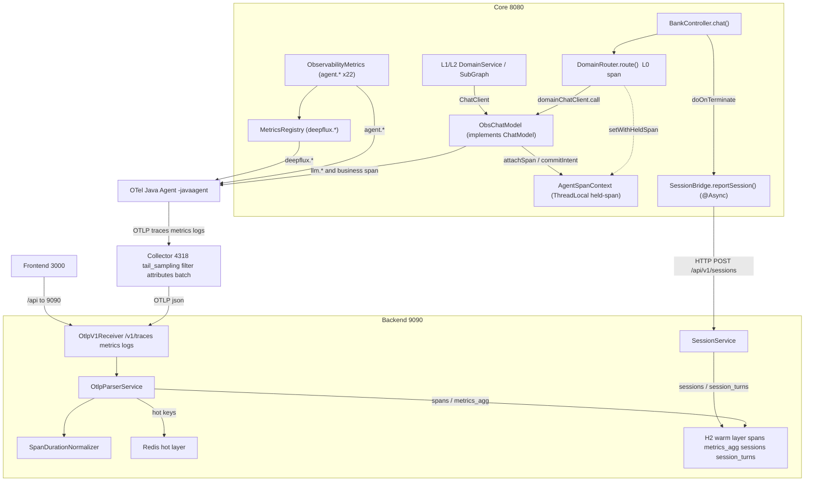

# AI 可观测代码解读

> 梳理对象：Core（`:8080`，Spring Boot + Spring AI Alibaba）、OTel Java Agent、OTel Collector（otelcol-contrib 0.156.0）、可观测后端（`:9090`，H2+Redis）。
> 目标：讲清埋点代码、ObsChatModel、Agent、Collector 的主体功能与相互引用关系；标准指标 vs 自定义指标的实现差异；以及 `gen_ai.*` / `span.*` / `llm.*` / 会话指标的数据定义。

---

## 一、整体数据流与组件关系

```
┌──────────────────────────────────────────────────────────────────────────┐
│  Core (8080)  mobile-ai-demo                                               │
│  ┌─────────────────────────────────────────────────────────────────────┐ │
│  │ BankController.chat() ──► DomainRouter.route() [L0 span]            │ │
│  │      │              └─► L1 Service ──► L2 SubGraph (ObsChatModel)   │ │
│  │      │  业务埋点: ObservabilityMetrics / MetricsRegistry (agent.*,  │ │
│  │      │           deepflux.*)                                         │ │
│  │      └─ doOnTerminate ─► SessionBridge.reportSession() ──┐          │ │
│  │   LLM 指标: ObsChatModel 装饰 ChatModel (llm.* + 业务span)│          │ │
│  │   OTel Java Agent 自动插桩: HTTP SERVER span /           │          │ │
│  │        gen_ai.client.operation.duration (Spring AI Obs)  │          │ │
│  └───────┬──────────────────────────────────┬──────────────┘          │ │
│          │ OTLP traces/metrics/logs          │ HTTP POST               │ │
│          │ (agent + Micrometer OTLP)         │ /api/v1/sessions        │ │
└──────────┼──────────────────────────────────┼──────────────────────────┘
           ▼                                  ▼
   ┌──────────────────┐              ┌────────────────────────┐
   │ Collector :4318  │              │ Backend :9090          │
   │ otelcol-contrib  │              │ SessionController      │
   │ tail_sampling +  │              │  └─ SessionService     │
   │ filter + attr +  │              │     └─ sessions/        │
   │ batch            │              │        session_turns   │
   └────────┬─────────┘              └────────────────────────┘
            │ OTLP /v1/traces|metrics|logs (json)
            ▼
   ┌────────────────────────────────────────────┐
   │ Backend OtlpV1Receiver                       │
   │   └─ OtlpParserService → Redis(热层)+H2(温层) │
   │      spans / metrics_agg / logs              │
   │   SpanDurationNormalizer 修正虚高 duration   │
   └────────────────────────────────────────────┘
```

### 两套独立数据管道（极易混淆，务必分开理解）

1. **spans 链路追踪管道**：Core 的 OTel Agent + ObsChatModel 手写 span → OTLP → Collector → Backend `spans` 表，按 `traceId` 关联（一次 HTTP 请求 = 一个 trace）。前端 Trace 列表读此。
2. **sessions 会话回放管道**：`BankController` 处理完 `/chat` 后 `@Async` 调 `SessionBridge.reportSession()` → HTTP POST `/api/v1/sessions` → `sessions` + `session_turns` 表，按 `sessionId` 关联（同会话多轮共享）。**每请求必调、与 OTel 成败无关**，故会话回放永远有数据、trace 却常空。两管道仅在 `session_turns.trace_id` 弱关联（单向引用，非依赖）。

#### 组件引用关系图（Mermaid）

下图展示各组件、关键类及其引用 / 数据流向；**实线**为调用或上报，**虚线**为 held-span 托管模式的回写：



---

## 二、各组件主体功能 / 类 / 函数 / 引用关系

### 1. Core 业务埋点层

**`ObservabilityMetrics`**（`src/main/java/com/mobileagent/app/observability/ObservabilityMetrics.java`，`@Component`）
- 注册中心，持有 `MeterRegistry` 与 `MetricsRegistry`。
- `init()`（`@PostConstruct`）注册 **22 个 `agent.*` 指标**（Counter / Timer / DistributionSummary / Gauge），例如 `agent.intent.recognized`、`agent.router.decision.outcome`(outcome=hit/llm_fallback/fail)、`agent.state.transition`(FOLLOW/SWITCH/RESUME)、`agent.workflow.execution.duration`、`agent.session.completed/abandoned/active`、`agent.business.outcome`、`agent.rewrite.accuracy`、`agent.tool.call.duration` 等。
- 三类记录 API：
  - 便捷方法：`recordRouterDecision(layer,decision,domain)`、`recordIntentAccuracy(state,...)`、`recordSessionCreated/Completed/Abandoned()`、`recordToolCallCount/Duration()`、`recordSkillOutcome()`、`recordL1Call()`、`recordReroute()`。
  - 动态通用方法：`recordCounter / recordTimer / recordSummary(name, tags...)`（按 `name+tags` 缓存，避免重复注册）。
  - **新指标入口**：`recordPendingApproval(delta,intent)` 转调 `MetricsRegistry.addUpDown(...)`（走 `deepflux.*` 前缀，隔离存量）。

**`MetricsRegistry`**（`src/main/java/com/mobileagent/app/observability/MetricsRegistry.java`，`@Component`）
- 集中式指标注册表，**所有新增指标统一 `deepflux.<domain>.<measure>` 前缀**（设计 §3.1①），与存量 `agent.* / llm.* / gen_ai.*` 隔离。
- `recordCounter / recordTimer(强制 publishPercentileHistogram(true)) / recordSummary / addUpDown`。
- `addUpDown` 用 **`AtomicLong + Gauge`** 模拟 UpDownCounter（Micrometer 无原生 UpDownCounter）；`init()` 预注册 `deepflux.workflow.pending_approval` 避免空闲期观测不到。

**`AgentSpanContext`**（`src/main/java/com/mobileagent/app/observability/AgentSpanContext.java`）
- `ThreadLocal` holder，把业务上下文（agentLayer / agentName / intent / sessionId / userId）传给 `ObsChatModel` 建 span。
- **Held-span 托管模式**（关键设计）：业务识别结果（domain / routeType / intent）在 LLM 返回后才解析，`ObsChatModel.call()` 的 `finally` 会立即 `span.end()` 导致结果来不及回填。方案：`setWithHeldSpan(...)` 标记 `holdSpan=true` → ObsChatModel 创建 span 后 `attachSpan(span)`，且 `finally` **不自动 end**；调用方解析出真实结果后 `commitIntent(realValue, extra)` 回填 `intent` 并 end。异常路径下 ObsChatModel 自行 end，`commitIntent` 检测到 `isRecording()==false` 则安全 no-op。

**`BankController`**（`src/main/java/com/mobileagent/app/controller/BankController.java`）
- 入口 `/api/bank/chat`。`buildChatPipeline()` 中 `obsMetrics.recordSessionCreated()`；`doOnTerminate` 里调 `sessionBridge.reportSession(...)`（会话管道）；`getCurrentTraceId()` 用 `Span.current().getSpanContext().getTraceId()` 取当轮 traceId 透传给会话表。

**`DomainRouter.route()`**（`src/main/java/com/mobileagent/app/router/domain/DomainRouter.java`，L0）
- 确定性命中（UNSUPPORTED）分支**显式建 L0 span**：`GlobalOpenTelemetry.getTracer("obs-chat-model").spanBuilder("L0:DomainRouter")...startSpan()`，注入 `agent.layer=L0 / routing.mode=deterministic`，立即 end（绝不 makeCurrent，防泄漏）。
- 模型路由分支：`AgentSpanContext.setWithHeldSpan("L0","DomainRouter",...)` → `domainChatClient.call()`（被 ObsChatModel 包装）→ 解析后 `ctx.commitIntent(result.domain())`。

### 2. ObsChatModel（LLM 指标装饰器）

`src/main/java/com/mobileagent/app/observability/ObsChatModel.java`，`implements ChatModel`，**装饰者模式**包装真实 `OpenAiChatModel`，业务代码零改动（`ModelConfig` 在 bean 返回处包一层）。

- **构造**：`(delegate, meterRegistry, modelName, defaultAgentLayer, defaultAgentName)`。后两者是 ThreadLocal 缺失时的兜底（流式 / 跨线程场景），保证业务 span 始终带 `agent.layer`，不退化成 `llm:` 前缀。
- **`call()`（非流式）**：`resolve()` 取上下文 → `startBusinessSpan(rc)` → `openScope(span,rc)`（合并 span + baggage 的**单一** Scope，try-finally 统一 close）→ `delegate.call()` → 记录 `llm.*` 指标。
- **`stream()`（流式，最易出错）**：⚠️ **装配线程绝不 makeCurrent()**（reactor 的 `doOnNext/Complete/Error` 在调度线程，与装配线程不同；若装配线程开 Scope 不关，线程池复用会让下一请求继承残留上下文 → traceId 跨请求泄漏）。仅持 `span` 引用：在 `doOnNext` 记首 token 时刻与 usage chunk；`doOnComplete` 写 IO 属性、end span、记指标；`doOnCancel` 兜底 end（防 SSE 客户端断开导致 span 悬挂）。
- **指标（5+项，`llm.*`）**：`llm.token.input/output`(Counter)、`llm.first_token.latency`(Histogram, TTFT)、`llm.operation.duration`(Histogram)、`llm.error.count`(Counter, tag error_type)；兜底 `llm.token.estimated`、TPOT(`llm.token.per.output.time`)。
- **业务 span 属性注入**（`startBusinessSpan`）：span 名 = `{layer}:{modelName}`，注入 `agent.name / model.name / agent.layer / intent / session_id(trim) / user_id(trim)`；构造 `Baggage`（agent.layer / intent / session_id）供子 HTTP span 继承 —— **注意 baggage 与 span 合并进同一 Scope，不单独 makeCurrent**（旧实现 baggage 不关导致泄漏）。
- **Token 兜底**：优先 `ChatResponse.getMetadata().getUsage()`（末尾 usage chunk）；拿不到则 `content.length()/1.5` 估算并标 `llm.token.estimated=true`。
- **致命细节**：`buildTimer()` 强制 `publishPercentileHistogram(true)`（而非 `publishPercentiles`），否则 Micrometer OTLP 导出为 Summary，后端 `OtlpParser` 只解析 Histogram/Sum/Gauge → **TTFT 恒 0**。

**`ModelConfig`**（`src/main/java/com/mobileagent/app/config/ModelConfig.java`）：8 个 `ChatModel` bean（domain L0/DomainRouter、context L1-LLM1/ContextRouter、intent L1-LLM2/SubGraphRouter、paramExtract L2/ParamExtract、wealthInterpret L2/WealthInterpret、chat L1/ChatService、orchPlanner ORCH、orch ORCH），均经 `wrapWithObsChatModel / wrapOrchModel` 包 `ObsChatModel`；业务模型 `enable_thinking=false`（编排除外），`streamUsage=true` 让流式末 chunk 返回 usage。

### 3. OTel Java Agent（自动插桩）

- **挂载方式**：`scripts/start-all.ps1` 用 `-javaagent:"opentelemetry-javaagent.jar"` 注入，`set OTEL_EXPORTER_OTLP_ENDPOINT=http://127.0.0.1:4318`、`OTEL_TRACES/METRICS/LOGS_EXPORTER=otlp`、`OTEL_SERVICE_NAME=mobile-bank-core`。
- **自动产出（零代码侵入）**：HTTP SERVER span（Spring WebMvc）、JDBC、以及 **Spring AI `ChatClient` 经由 Micrometer Observation 自动产生的 `gen_ai.client.operation.duration`**（详见第四部分）。trace 由 Agent 直接 OTLP 导出；metric 同时由 **Micrometer OTLP registry**（`application.yml`：`management.otlp.metrics.export.url=...:4318/v1/metrics, step 60s`）推送。
- **`OtelContextConfig`**：`static { Hooks.enableAutomaticContextPropagation(); }` —— 启用 Reactor 自动上下文传播，把 OTel `Context` 与 Reactor `Context` 桥接，根治响应式链路跨线程 / 跨请求 context 泄漏（traceId 塌缩、intent 串标的同源问题）。
- **与 ObsChatModel 关系**：**共存互补**。实测 `gen_ai.client.operation.duration`(含全链路 6135ms) + `llm.*`(原始单次 2326ms + token + TTFT) 并行不冲突；DashScope adapter 只给 `gen_ai.client.operation.duration`，缺 token Counter 与 TTFT，故 ObsChatModel 必要。

### 4. Collector（otelcol-contrib 0.156.0）

`observability/otel-collector/config.yaml`：
- **receivers**：`otlp` http `:4318`。
- **exporters**：`otlp_http/json_backend` → `http://127.0.0.1:9090`（json 编码）。
- **processors**：`memory_limiter` → `tail_sampling`（**必须在 batch 前**，先按完整 trace 决策再批量）→ `filter`（OTTL `IsMatch(name,".*[Hh]ealth.*")` 排除健康检查 / actuator 噪声 span）→ `attributes`（`env=production` / `service.version=1.0.0` upsert，**无 error_mode 字段**）→ `batch`。
- **tail_sampling 四策略**：errors(ERROR) / slow(>1000ms) / llm-failure(error_type ∈ timeout,auth_error,rate_limit) / normal-sampling(10%) —— 错误 / 慢 / LLM 失败必留样，正常仅抽样 10%。
- metrics / logs 管道**不加** tail_sampling。

### 5. Backend（可观测后端 :9090）

- **`OtlpV1Receiver`**（`/v1/traces|metrics|logs`）→ **`OtlpParserService`**：`parseTraces / parseMetrics / parseLogs` → **Redis(热层) + H2(温层)** 双写。
  - Metrics：`Histogram` → 从桶线性插值算 p50/p95/p99 写 Redis 分位 + H2；`Sum` → `incrRequestCount / Error / TokenCount` + H2；`Gauge` → `setActiveSessions` 等。
  - Traces：`buildSpanEntity`（严格按 OTLP：ns → ms，`durationMs = end - start`）→ 按 traceId 分组后 **`SpanDurationNormalizer.normalize()`** 修正上游偶发的 ~1000× 虚高（用子树 CLIENT span 真实墙钟包络重算）→ `spanRepository.save` + 推 Redis recent。
  - **单位归一**：`isSecondsUnitMetric()` —— OTel 标准时长（`.duration / .latency`，秒）×1000；自定义 `llm.*` 是毫秒，显式排除不乘（否则失真）。
- **实体**：`SpanEntity`(spans)、`Session`(sessions)、`SessionTurn`(session_turns)、`MetricsAgg`(metrics_agg)，详见第四部分。
- **`SessionBridge`**（Core 侧 `@Async`）：`reportSession(...)` 用 **Jackson**（非手工拼接，防 Unicode 控制字符致后端解析失败）序列化后 POST `/api/v1/sessions`；后端 `SessionService` 按 `sessionId` 覆盖写。

---

## 三、标准协议/组件指标 vs 业务自定义指标 —— 实现差异

| 维度 | 标准/组件指标（自动） | 业务自定义指标（手写） |
|---|---|---|
| **产生方式** | OTel Java Agent + Spring AI Micrometer Observation 插桩，**零代码侵入** | 在 `ObservabilityMetrics` / `MetricsRegistry` / `ObsChatModel` 中显式埋点 |
| **典型命名** | `gen_ai.client.operation.duration`、`http.server.request.duration`、`jvm.*`、`db.*`（OTel 官方 SemConv） | `agent.*`（22 项）、`llm.*`（ObsChatModel）、`deepflux.*`（新集中式，项目约定 OTel SemConv 风格但自定义） |
| **单位约定** | 时长类一律**秒**（OTel 标准）→ 后端 `×1000` 转毫秒 | `llm.*` Timer 用**毫秒**直接记（后端显式排除不乘）；`agent.*` 比率/计数无单位 |
| **导出路径** | trace 由 Agent 直推 OTLP；metric 由 Micrometer OTLP registry 推 `/v1/metrics` | 同样经 Micrometer OTLP registry 推 `/v1/metrics`（同一条 metric 管道） |
| **分位能力** | `gen_ai.client.operation.duration` 仅 Histogram，**无 token / TTFT Counter** | `llm.*` 时延须 `publishPercentileHistogram(true)` 才是 Histogram；否则变 Summary 不被后端解析 → TTFT 恒 0 |
| **基数控制** | Agent 自动打 host / service 等低基数标签 | 手写 obey **Tag 预算规则**：禁止 `user.id / session.id / trace.id / 原始 prompt / 原始金额` 进 tag；Counter/Timer 按 `name+tags` 缓存复用 |
| **补充语义** | 纯调用耗时，不感知业务（领域/意图/路由模式） | 携带 `agent.layer / intent / domain / routing.mode` 等业务维度，支撑路由漏斗/状态机/会话生命周期分析 |

**核心差异一句话**：标准指标回答"系统/组件跑得多快、错多少"，业务自定义指标回答"路由对不对、意图准不准、会话顺不顺、LLM 花多少 token"——后者是本项目可观测性的差异化价值，前者是通用基线。

---

## 四、指标承载数据定义（标准 / 自定义分开）

### A. 标准协议部分

**`gen_ai.client.operation.duration`**
- 类型 Histogram，单位**秒**，由 Spring AI / DashScope adapter 经 Micrometer Observation 自动产生。
- 覆盖 `ChatClient` **全链路**（含编排、工具调用、重试），是端到端 LLM 调用耗时基准。
- **局限**：只有 duration，**没有 token Counter、没有 TTFT** → 这正是 `ObsChatModel` 存在的原因。

**`span.*`（链路 span 原生属性，落 `spans` 表 = `SpanEntity`）**
- 标识：`trace_id / span_id / parent_span_id / service_name`
- 结构：`operation_name / kind`(INTERNAL\|SERVER\|CLIENT) `/ start_time / end_time / duration_ms / status_code`(OK\|ERROR)
- 业务属性（`attributes` JSON，由 ObsChatModel / Agent 注入）：`ai.io.prompt`、`ai.io.response`、`ai.token.input`、`ai.token.output`、`agent.layer`、`agent.name`、`intent`、`session_id`、`routing.mode`、`model.name`、`llm.first_token_time`、`error`、`cancelled`
- 作用：链路追踪、瀑布图、IO 回放、业务属性透出（前端 `TraceQueryService.extractBusinessAttributes()` 跨 span 抽取展示）。

**组件标准指标**：`http.server.request.duration`、`jvm.*`、`db.*`、`process.*` 等，由 Agent 自动产生，时长单位秒，用于系统级健康/时延。

### B. 自定义部分

**`llm.*`（ObsChatModel，5+项）**
- `llm.token.input` / `llm.token.output`：Counter，tag `model / agent.level / agent.name / intent`，LLM 成本与产出度量。
- `llm.first_token.latency`：Histogram(ms)，**TTFT**（流式首 token 绝对时刻 = 入口 epoch + 相对耗时）。
- `llm.operation.duration`：Histogram(ms)，**单次原始 LLM 调用耗时**（不含编排/重试，区别于 `gen_ai.*`）。
- `llm.error.count`：Counter，tag `error_type`。
- `llm.token.estimated`：兜底标记（无 usage chunk 时按长度估算）；`llm.token.per.output.time`：TPOT 估算。

**`agent.*`（ObservabilityMetrics，15~22 项）**——业务漏斗与生命周期：
- 意图/路由：`agent.intent.recognized / agent.intent.confidence / agent.intent.accuracy(四态) / agent.router.decision.outcome(outcome=hit|llm_fallback|fail，或 layer/decision/domain) / agent.reroute.count`
- 状态机：`agent.state.transition(FOLLOW|SWITCH|RESUME)`、`agent.state.suspend.depth`(Gauge)
- 子图/工具/技能：`agent.workflow.execution.duration(intent/graph)`、`agent.workflow.interrupt`、`agent.tool.call.count/duration(tool_name)`、`agent.skill.outcome`
- 会话/业务：`agent.session.completed/abandoned/active`、`agent.business.outcome(success/fail)`、`agent.slot.askback.total`、`agent.extraction.completeness`、`agent.rewrite.total/accuracy`、`agent.l1.call`

**`deepflux.*`（MetricsRegistry 集中式新指标）**
- `deepflux.workflow.pending_approval`：UpDownCounter（AtomicLong + Gauge 模拟），人工中断 +1 / 审批完成 −1，观测待审批队列深度。
- `deepflux.rag.*`：经 `RagMetrics` 门面 → 5 核心（`rag.retrieval.latency / documents / hit_rate`、`rag.rerank.latency`、`rag.topk.relevance`）+ 2 防御 Counter（`rag.retrieval.error / rag.rerank.error`）。命名隔离避免与 `llm.* / agent.*` 发散。

**会话指标数据（`sessions` / `session_turns` 表，SessionBridge 写入）**
- `Session`：sessionId、userId、channel、start/end_time、duration_seconds、turn_count、intent_flow、total_tokens、status、satisfaction_rating/reason、reroute_triggered。
- `SessionTurn`（每轮明细）：turnNumber、userMessage、aiResponse、intent、agentPath、confidence、duration_ms、tokens、status、**trace_id**（弱关联 spans）、reroute_triggered、timestamp。
- 作用：会话回放（用户原声 + AI 回复 + 路径）、满意度、与 trace 单向关联定位。

---

## 五、端到端调测实战

把前四节的理论落到「能不能真上报、能不能真查到」。所有命令均在项目根目录执行，且默认 `localhost→127.0.0.1`。

### 5.1 前置：一键拉起全链路

| 方式 | 命令 | 说明 |
|---|---|---|
| 全量一键 | `powershell -File scripts/start-all.ps1` | 起 Redis(6379) + Collector(4318) + Backend(9090) + Core(8080) + Frontend(3000) |
| 验证专用 | `./scripts/verify-E2E.sh [--skip-build\|--verify-only\|--stop-after\|--turns N]` | 清库 → 起 backend/collector/core → seed 36 轮 → 断言 L0=L1、L2≤L0、L0 层 span 已上报 |

端口约定：`6379` Redis / `9090` Backend / `4318` Collector / `8887` Collector-Prometheus / `8080` Core / `3000` Frontend。

**启动 SOP（踩坑点，务必遵守）**
- Backend 必须以 **CWD = `observability/backend/`** 启动（`H2(./data)` 才落在 `backend/data/`），否则看错库。
- Core 启动需注入 OTel 环境变量 + `-javaagent`：`OTEL_EXPORTER_OTLP_ENDPOINT=http://127.0.0.1:4318`、`OTEL_TRACES/METRICS/LOGS_EXPORTER=otlp`、`-javaagent:"opentelemetry-javaagent.jar"`。
- Windows 原生 `java` / `otelcol.exe` 路径须 `cygpath -w` 转成 `D:\...` 形式（Git Bash 的 `/d/...` 会被 MSYS 转坏、且项目路径含空格导致 "Unable to access jarfile"）。
- Collector 无 HTTP health，靠 `netstat -ano | grep 4318` 看 LISTENING 校验；`otelcol-contrib.exe validate --config config.yaml` 返回 EXIT 0 即配置合法（**配置错误每次只报第一个**，需逐条修）。

### 5.2 验证「spans 链路」是否真上报（L0/L1/L2 不变量）

```bash
# 1) 起服务 + 播种（36 轮对话）
./scripts/verify-E2E.sh --skip-build
# 脚本内部：test/seed_all.py 播种 → 等 20s 让 spans 沉淀

# 2) 查实时计数
curl -s http://127.0.0.1:9090/api/v1/metrics/realtime
#   → data.l0Calls / data.l1Calls / data.l2Calls

# 3) 查 span 分布（是否含 L0 层 span）
curl -s http://127.0.0.1:9090/api/v1/traces/debug/span-stats
#   → data.distinctOpNames 含 "L0:"（LLM 路径为 L0:<model>，确定性分支为 L0:DomainRouter）
```

**断言口径（verify-E2E.sh 自动判定，退出码 0/1/2）**
- `L0 == L1`：每请求恰好一个 L0，是「确定性路由补全 L0 span（方案A）」的核心不变量；若 `L0 < L1` 说明确定性分支仍在漏 L0。
- `L2 ≤ L0`：子图调用数不超过请求数。
- `distinctOpNames` 含 `L0:`：L0 层可观测覆盖成立。
- 注：`L0 < 36` 多为 seed 偶发 HTTP 错误（错误同时扣 L0/L1），非修复问题。

### 5.3 验证「指标」是否真注册 / 导出

> **关键纠偏**：`micrometer-registry-prometheus` 已回退，`/actuator/prometheus` 现 **404**。不要再 scrape prometheus，改为读 Core 内置 `/actuator/metrics`（JSON 点号命名）。

```bash
# 业务指标在 Core(8080)，不在 Backend(9090)！
curl -s http://127.0.0.1:8080/actuator/metrics | python -m json.tool | grep -E "deepflux|agent\.|gen_ai"
#   → 应见到 deepflux.workflow.pending_approval / agent.* / gen_ai.client.operation.duration

# 单 meter 实时采样（UpDownCounter 当前值）
curl -s "http://127.0.0.1:8080/actuator/metrics/deepflux.workflow.pending_approval?tag=intent:TRANSFER"
#   → measurements[0].value
```

注意：指标名在 `/actuator/metrics` 中是**点号**命名（`deepflux.workflow.pending_approval`），不是 prometheus 的下划线。可自动化用例见 `test/obs_v4_tests/test_metrics.py`（TC-K-001/002、TC-J-001），入口 `python run_all.py --modules metrics`。

### 5.4 验证「sessions 会话」管道

```bash
# 每 /chat 必调 SessionBridge → POST /api/v1/sessions（与 OTel 成败无关）
curl -s "http://127.0.0.1:9090/api/v1/sessions?sessionId=<SID>"
#   → session_turns 明细：userMessage / aiResponse / intent / agentPath / confidence / trace_id
```

`sessions` 表永远有值（会话回放不依赖 trace）；`session_turns.trace_id` 可回跳 Trace 列表做弱关联定位。

### 5.5 常见排错（踩坑集）

| 现象 | 根因 | 处置 |
|---|---|---|
| traceId 跨请求泄漏 / 时长虚高到几百秒 | `makeCurrent()` 的 Scope 未同线程 close，线程池复用继承残留上下文 | ObsChatModel：call() 用 `openScope`+try-finally 统一 close；stream() 装配线程**绝不 makeCurrent**，仅持 span 引用操作；并启用 `OtelContextConfig`（`Hooks.enableAutomaticContextPropagation()`）。改完用 verify-E2E 断言 36 请求 → 36 distinct traceId |
| TTFT 恒 0 | Timer 未 `publishPercentileHistogram(true)`，后端只解析 Histogram/Sum/Gauge，Sum 被当均值 | 改 `ObsChatModel.buildTimer()` 强制 `publishPercentileHistogram(true)` |
| Trace 列表空 | 旧实现按根 span 枚举，根 span 是 OTel 导出器 span 非 SERVER span | 已改为按 `trace_id` 去重枚举 + 跳过无业务 span 的 trace |
| Collector 收不到数 | 端口未监听 / config 有错 | `netstat -ano \| grep 4318` 看 LISTENING；`otelcol-contrib.exe validate --config config.yaml` 逐条修（每次只报第一个错） |
| 指标名"找不到" | 误读 prometheus 端点 / 旧 `__pycache__` 复用 | 读 Core `/actuator/metrics`（点号）；复跑 pytest 前 `find test/obs_v4_tests -name __pycache__ -exec rm -rf {} +`（早期改 `test_metrics.py` 后 Python 复用旧字节码 → 全 SKIP） |
| 直开 H2 看"空表" | 看错库：活动库在 `observability/backend/data/observability.mv.db`，且须 backend CWD=backend/ 启动 | 查实时请用 `/api/v1/traces/debug/span-stats`，勿直开文件（独占锁 + 相对路径易错） |

### 5.6 最小验证命令清单（复制即用）

```bash
# 起链路 + seed + 断言（最省力）
./scripts/verify-E2E.sh --skip-build

# 指标是否注册（Core 侧，点号命名）
curl -s http://127.0.0.1:8080/actuator/metrics | python -m json.tool | grep -E "deepflux|agent\.|gen_ai"

# 实时计数 / span 分布 / 会话明细（Backend 侧）
curl -s http://127.0.0.1:9090/api/v1/metrics/realtime
curl -s http://127.0.0.1:9090/api/v1/traces/debug/span-stats
curl -s "http://127.0.0.1:9090/api/v1/sessions?sessionId=<SID>"

# Collector 存活
netstat -ano | grep 4318
```

---

## 六、一句话总结

Core 用「Agent 自动插桩（`gen_ai.*` / `span.*`）+ 手写埋点（`agent.*` / `llm.*` / `deepflux.*`）」双轨采集，经 Collector（采样 + 过滤 + 属性注入）落到 Backend 的 `spans` 与 `sessions` 两套表；标准指标管"系统基线"，自定义指标管"业务语义"，二者在 Backend 汇聚成可观测面板。调测时记住三条铁律：**Backend 必须 CWD=backend/ 启动、业务指标查 Core `/actuator/metrics` 而非 prometheus、trace 与 session 是两套独立管道**。
