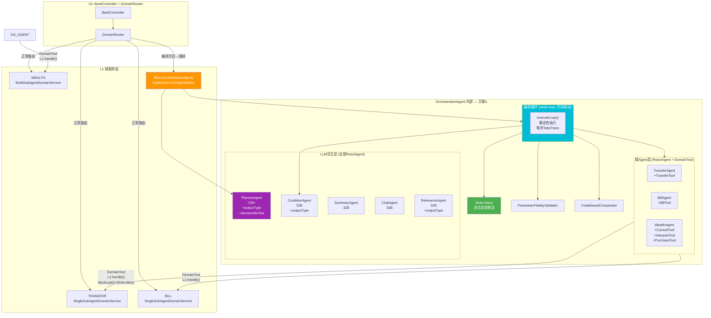
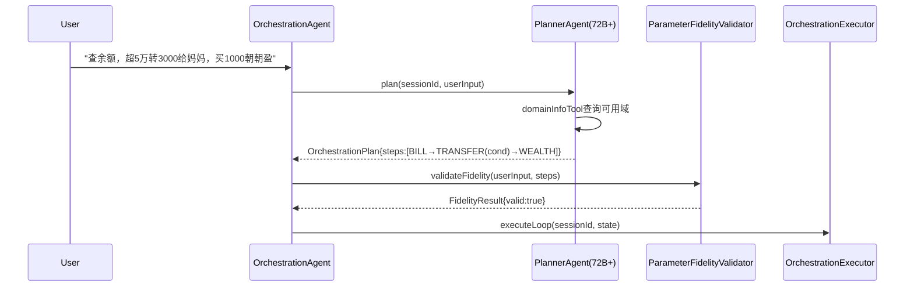
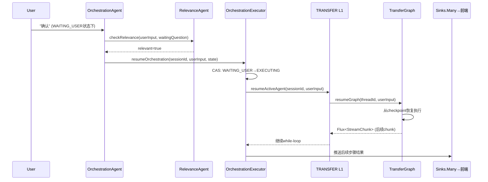
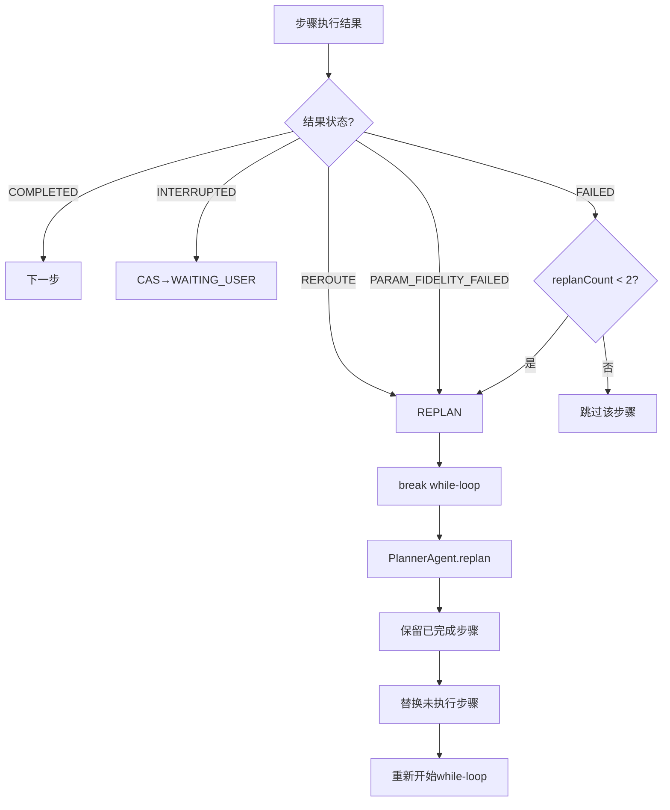
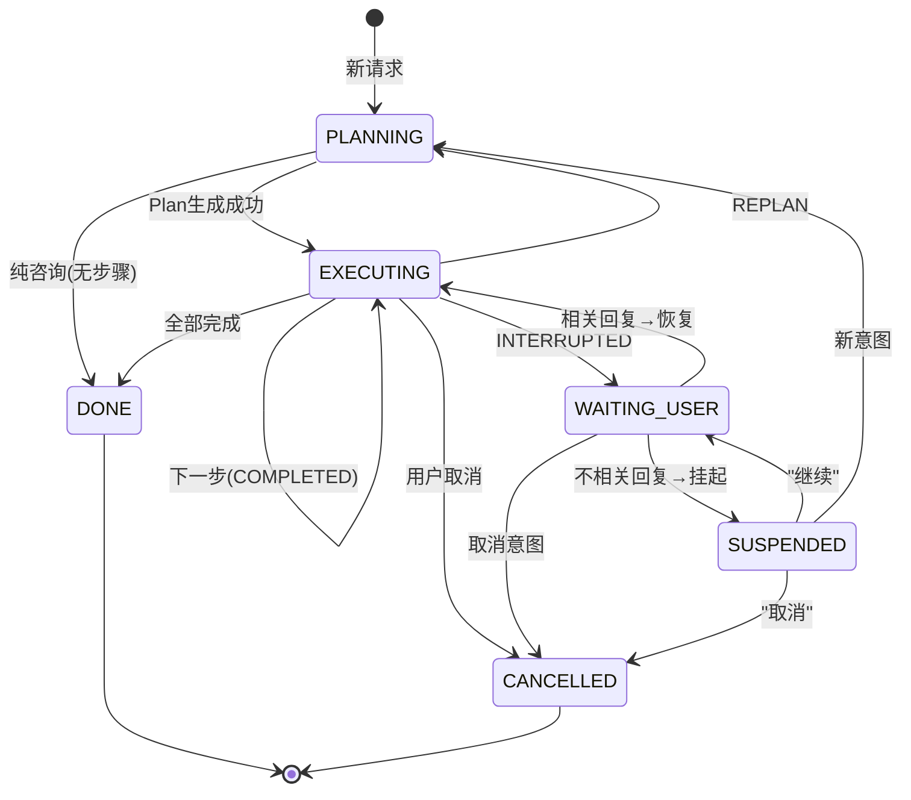
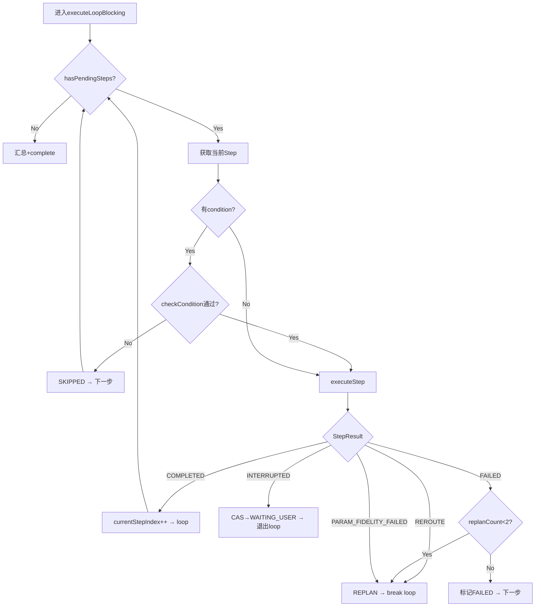
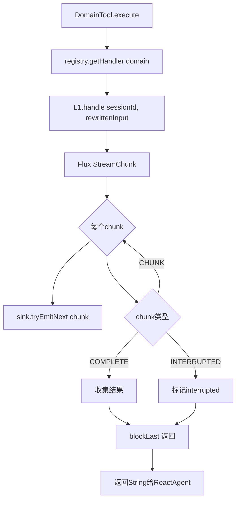
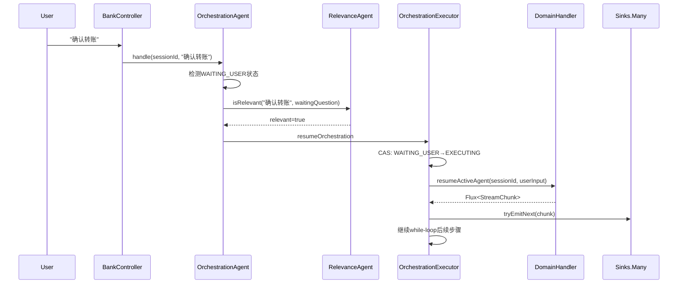
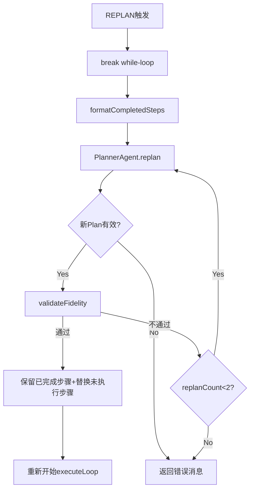

# 方案A: ReactAgent + DomainTool 架构设计文档

> **文档状态**: Draft v1.0  
> **方案标识**: Plan A — ReactAgent + DomainTool + while-loop + Sinks.Many  
> **核心概念**: "领域即Tool" — L1封装为DomainTool，ReactAgent通过tool call驱动执行  
> **基础文档**: DESIGN-ORCHESTRATION-AGENT-v5.md (~3771行)

---

## 目录

1. [战略定位](#1-战略定位orchestrationagent作为未来统一路由层)
2. [动态变更可适配性分析](#2-动态变更可适配性分析)
3. [五大意图场景深度分析](#3-五大意图场景深度分析)
4. [实现理念](#4-实现理念)
5. [实现架构](#5-实现架构)
6. [计划-编排-执行-反思全流程](#6-计划-编排-执行-反思全流程)
7. [流程图](#7-流程图mermaid)
8. [关键数据结构](#8-关键数据结构)
9. [关键代码](#9-关键代码)
10. [ADR架构决策记录](#10-adr架构决策记录)
11. [场景验证](#11-场景验证)
12. [可观测性与测试](#12-可观测性与测试)
13. [Phase规划](#13-phase规划)
14. [开放问题与决策](#14-开放问题与决策)
15. [文件清单](#15-文件清单)

---

## 1. 战略定位：OrchestrationAgent作为未来统一路由层

### 1.1 当前架构：双轨并行

```
现在：
  单意图 → L0(入口路由) → L1(含意图状态机: suspended/switch/resume/clarify/reject) → L2
           低时延路径，模型性能有限时最优
  多意图 → L0(入口路由) → OrchestrationAgent(Plan驱动) → L1(纯执行) → L2
           复杂场景，Plan显式编排
```

### 1.2 未来架构：统一收敛

```
未来（模型性能提升后）：
  一切意图 → L0(入口路由) → OrchestrationAgent(Plan驱动+意图管理) → L1(纯执行层) → L2

  L0 不变：仍是入口，负责识别+路由
  L1 简化：去掉意图状态机，退化成纯执行层（只管 handle/resume/cancel）
  OrchestrationAgent：承担原L1的意图管理能力（顺延/跳转/恢复/澄清/拒绝）
```

### 1.3 收敛的本质

**收敛的不是 L0，是 L1 的意图状态机。**

L0 始终是入口层，不收编。OrchestrationAgent 收编的是 L1 层的意图管理职责：

| 当前由L1承担的职责 | 未来由OrchestrationAgent承担 | 机制 |
|---|---|---|
| 意图切换 (switch) | Plan Step.status 变更 | Step.status→SKIPPED/CANCELLED, insert新Step |
| 意图顺延 (postpone) | Plan Step 重排序 | Step移到Plan末尾，conditional路由 |
| 意图恢复 (resume) | Plan Step 自然轮到 | 被顺延的Step到期后自动执行 |
| 意图澄清 (clarify) | CLARIFY 类型Step | PlannerAgent生成CLARIFY Step，收集用户反馈后REPLAN |
| 意图拒绝 (reject) | 不插入Plan / Step标记FAILED | 用户拒绝→CANCELLED, 系统拒绝→FAILED+REPLAN |

### 1.4 关键含义

OrchestrationAgent的意图管理能力不是"锦上添花"，而是**未来替代L1意图状态机的必备前提**。

如果OrchestrationAgent做不好意图顺延/跳转/恢复/澄清/拒绝，就无法统一收编，就会永远存在两条路径，架构分裂。

**因此，五大意图场景的实现能力是Plan A/B方案的核心评判标准。**

---

## 2. 动态变更可适配性分析

> 这是Plan A与Plan B的核心评判维度之一。动态变更可适配性决定了OrchestrationAgent能否真正替代L1的意图状态机。

### 2.1 核心问题

在多意图Plan执行过程中，用户可能随时改变需求：
- 插入新的意图步骤
- 删除或跳过未执行步骤
- 重新排序步骤优先级
- 已完成步骤的输出因后续操作而失效（级联影响）

Plan A的while-loop是**命令式执行**——"做什么"由loop顺序决定。变更需要改loop逻辑或全量REPLAN。

Plan B的StateGraph + conditional edge是**声明式路由**——"去哪"由state决定。变更只改state，路由自动适配。

### 2.2 变更适配谱

| 变更类型 | 场景举例 | Plan A 实现方式 | 适配成本 | 风险 |
|----------|---------|---------------|---------|------|
| **Insert** | 插入新步骤"查基金" | REPLAN重生成全量Plan, 或steps.add(index, newStep) | 中 | REPLAN浪费已完成步骤重新生成; 手动insert依赖链可能断裂(LLM未参与设计) |
| **Delete** | 删掉"买理财" | steps.remove() + 重新loop | 中 | 后续依赖被删步骤输出的步骤会失败 |
| **Reorder** | "先查明细再转账" | 需跳出当前loop，重排steps后重新迭代 | 高 | while-loop顺序硬绑迭代，重排需打破当前loop或全量REPLAN |
| **Dependent Cascade** | 插队改变Step2输出, Step4依赖Step2 | 全量REPLAN | 高 | Plan A无依赖图，依赖关系隐含在LLM生成的Plan中 |
| **Branch** | 一个步骤拆成并行两步 | 极高 — while-loop是串行的 | 极高 | loop结构不支持并行，需根本性重构 |
| **Merge** | 两步合并成一步 | 高 — loop逻辑需特殊处理 | 高 | 需检测连续步骤是否可合并 |
| **Rollback** | 已完成步骤要重做 | 极高 — 无回退机制 | 极高 | 需checkpoint+replay，Plan A无此基础设施 |
| **Conditional Skip** | 运行时决定跳步 | 中 — _orchFlags标记skip | 中 | 可行但需每步检查标志 |

### 2.3 Plan A变更的结构性限制

#### 限制1：DomainTool.execute() 阻塞

```java
// DomainTool内部
public String execute(String input) {
    Flux<StreamChunk> flux = l1.handle(input, context);
    flux.doOnNext(chunk -> sink.tryEmitNext(chunk))  // 转发流
        .collectList()
        .block();  // ← 阻塞！当前步骤必须执行完
    return result;
}
```

**影响**：用户在Step执行中说"等等先查余额"，当前Step必须执行完才能响应变更。无法mid-step中断。

#### 限制2：while-loop 命令式执行

```java
// while-loop核心
while (hasPendingSteps()) {
    PlanStep step = getNextPendingStep();
    String result = executeStep(step);  // ReactAgent call
    evaluateConditions();
}
```

**影响**：loop按steps[]顺序迭代。重排序需跳出loop。无并行支持。

#### 限制3：全量REPLAN vs 增量修改的困境

- **全量REPLAN**：保证一致性（LLM设计完整Plan），但浪费（重新生成已完成步骤）
- **增量修改**：高效（只改变动的steps），但不可靠（LLM未参与设计修改后的Plan，可能引入不一致）

#### 限制4：Sinks.Many 流式传输在变更时的风险

`tryEmitNext()` 在背压下可能丢失chunk。Plan变更时两个Step的输出可能交错。

#### 限制5：补丁累积风险

每个动态变更场景都需要补丁（CAS标志、步骤状态、手动依赖追踪）。补丁累积后，Plan A的"简单易调试"优势逐渐消失。

### 2.4 声明式 vs 命令式 — 可适配性的本质差异

> **Plan A 的 while-loop 是命令式执行** — "做什么"由 loop 顺序决定。变更需要改 loop 逻辑或全量 REPLAN。
>
> **Plan B 的 StateGraph + conditional edge 是声明式路由** — "去哪"由 state 决定，不硬编码。变更只改 state，路由自动适配。

这是可适配性的本质差异：
- 命令式：改数据 → 还要改控制流逻辑
- 声明式：改数据 → 行为自动适配

对于多意图场景的动态Plan修改，这意味着：
- Insert → 声明式只需add to state，conditional edge自动路由到它
- Delete → 声明式只需remove from state，conditional edge自动跳过
- Reorder → 声明式只需改变state中的顺序，conditional edge跟随新顺序
- 不需要修改执行引擎本身

---

## 3. 五大意图场景深度分析

> 这五大场景是OrchestrationAgent替代L1意图状态机的最低门槛。每个场景都必须能通过Plan变更实现，否则就无法统一收编。

### 3.1 场景1：意图顺延（Intent Postpone）

#### 场景描述
```
用户：转账给张三1000元，然后查余额，再买基金
Plan生成：[转账→查余额→买基金]
执行转账中用户说：转账先不急，先查余额吧
```

#### 当前L1做法
suspendedAgent暂存转账意图，先执行查余额。L1内部管理active/suspended状态切换。

#### Plan A实现路径

**Option A: 等当前Step完成后REPLAN**
```
1. DomainTool.execute() blockLast() → 转账Step必须执行完
2. loop检查到用户新输入（_orchFlags.NEW_INPUT）
3. 调用PlannerAgent进行全量REPLAN
4. 新Plan: [查余额→买基金→转账]  ← 转账被顺延到最后
5. 重新开始loop迭代

问题：违背用户"先不急"的意图——转账已经执行完了
```

**Option B: CAS标志跳过后续Step**
```
1. 检测到用户新输入 → 设置 _orchFlags("POSTPONE_CURRENT", true)
2. 当前Step(转账)完成后 → loop检查标志
3. 将转账Step.status→POSTPONED，移到Plan末尾
4. 将查余额Step提前
5. 继续loop迭代到查余额Step

问题：转账Step已执行完毕，结果已产生——"顺延"变味了
     用户期望的是"先不转账"，但转账已经发生了
```

**Option C: 中断当前Step（需要L1支持cancel）**
```
1. 检测到用户新输入 → 设置 _orchFlags("INTERRUPT", true)
2. DomainTool.execute() blockLast() 阻塞中... 无法响应
3. 除非L1提供cancel()接口，否则无法中断正在执行的步骤
4. 当前L1没有cancel接口

结论：Plan A无法在Step执行中响应顺延请求
```

#### 边界条件
- 转账Step已完成 → 顺延无意义，只能REPLAN调整后续步骤
- 转账Step在L2执行中(L2 interruptBefore暂停) → 可通过L1 resume(feedback="取消")间接实现
- 转账Step未开始 → 可直接reorder steps

#### 扩展性评估
新增类似顺延场景需要：CAS标志 + loop条件检查 + 可能的REPLAN。每增加一种顺延逻辑，while-loop的复杂度增加。

#### 能否替代L1 suspended机制？
**部分替代**。Step未开始时可以顺延（reorder），Step执行中无法中断（blockLast阻塞），Step已完成无法撤回。

---

### 3.2 场景2：意图跳转（Intent Switch）

#### 场景描述
```
用户：帮我转账给张三
Plan生成：[转账]
执行中用户说：算了，帮我买基金
```

#### 当前L1做法
switch：当前意图suspend，启动新意图。L1内部管理switch逻辑。

#### Plan A实现路径

```
1. 检测到用户意图完全改变（checkRelevance判断）
2. 当前转账Step.status→CANCELLED
3. 生成新的基金Step
4. 问题：如果转账L1已在执行中 → DomainTool.execute() blockLast() 阻塞
   无法中断当前Step
5. 只能等转账Step完成（或L2 interruptBefore暂停点），再执行跳转

实际行为：
  - 如果转账Step未开始 → 跳转成功，取消转账，执行买基金
  - 如果转账Step执行中 → 必须等完成或等L2中断点
  - 如果转账Step在L2中断点 → 可通过resume(feedback="取消")跳转
  - 如果转账Step已完成 → 跳转到买基金，但转账已执行（不可撤回）
```

#### 边界条件
- 跳转涉及跨域（转账→基金）：Plan A天然支持（Plan本身跨域）
- 跳转涉及同域内不同意图：需REPLAN重新生成Step
- 跳转时当前Step的L2资源需要cleanup

#### 能否替代L1 switch机制？
**有限替代**。Step未开始时可跳转，Step执行中无法主动中断。跨域跳转天然支持（Plan跨域），这是比L1的优势。

---

### 3.3 场景3：意图恢复（Intent Resume）

#### 场景描述
```
用户：帮我转账给张三，然后查余额
Plan生成：[转账→查余额]
执行转账中用户说：等等先查余额
Plan变更：[查余额→转账(resumed)]
查余额完成后，转账意图恢复
```

#### 当前L1做法
resume suspendedAgent：恢复之前挂起的意图。

#### Plan A实现路径

```
1. 转账Step.status→POSTPONED（如果未开始或可中断）
2. 插入/提前查余额Step
3. 查余额完成后 → loop继续 → 下一个PENDING Step是转账
4. 执行转账Step

关键问题：转账Step被POSTPONED后再执行，上下文还在吗？
  - 如果L1的handle()是无状态的 → 重新执行没问题，但等于"重新开始"而非"从断点继续"
  - 如果L2有checkpoint → L2可以从断点恢复，但需要L1提供resume(sessionId)接口
  - 当前SingleSubAgentDomainService的resume流程已存在 → 可以调用
```

#### 边界条件
- 转账Step从未开始 → 直接POSTPONED+恢复，等于正常执行
- 转账Step在L2中断点暂停 → 可通过L1 resume从断点恢复
- 转账Step已完成 → 不需要恢复

#### 能否替代L1 resume机制？
**大部分替代**。Plan的步骤自然轮转实现"恢复"效果。但"从断点恢复"依赖L1/L2的checkpoint机制，不是Plan A的while-loop本身提供的。

---

### 3.4 场景4：意图澄清（Intent Clarify）

#### 场景描述
```
用户：转钱
Plan生成失败：意图不明确，需要澄清
系统：您是想转账还是还信用卡？
用户：转账
```

#### 当前L1做法
clarify流程：收集更多信息后执行。L1内部有clarify状态。

#### Plan A实现路径

```
1. PlannerAgent生成Plan时检测到意图不明确
2. 生成一个CLARIFY类型的PlanStep
   Step { type: CLARIFY, question: "您是想转账还是还信用卡？", options: ["转账","还信用卡"] }
3. CLARIFY Step执行 → 不调用L1，直接发送SSE CLARIFY chunk给前端
4. 等待用户回复 → 通过BankController传入
5. 基于用户回复 → REPLAN → 生成新的正式Plan

实现方式：
  - CLARIFY是PlanStepType枚举的新值
  - executeStep()检测到CLARIFY类型 → 不调用ReactAgent → 直接发送问题+等待
  - 等待用户回复通过CAS WAITING_USER状态实现
  - 用户回复到达 → REPLAN → 生成新Plan → 继续loop

与ReactAgent的关系：
  - ReactAgent不参与CLARIFY过程
  - CLARIFY在while-loop层面处理，不需要LLM参与
  - 收到用户明确回复后才调用PlannerAgent生成Plan
```

#### 边界条件
- 澄清后用户仍不明确 → 可多轮澄清（限制最多2轮）
- 澄清超时 → 默认取消，发送TIMEOUT chunk

#### 能否替代L1 clarify机制？
**可以替代**。CLARIFY Step类型 + CAS等待机制完全可实现。且比L1的clarify更灵活（可跨域澄清）。

---

### 3.5 场景5：意图拒绝（Intent Reject）

#### 场景描述
```
用户：转账给张三1000万
系统：单笔转账限额500万，请修改金额
```

#### 当前L1做法
reject + 提示用户修改。L1内部判断可否执行。

#### Plan A实现路径

```
1. L2执行转账时触发风控拒绝 → L2的interruptBefore机制暂停
2. StreamChunk(type=INTERRUPTED, reason="风控拒绝") 传回
3. DomainTool检测到INTERRUPTED → 设置 _orchFlags.interrupted=true
4. while-loop检测到interrupted标志 → CAS到WAITING_USER
5. 区分拒绝类型：
   - 用户主动拒绝 → Step.status→CANCELLED，继续下一个PENDING Step
   - 系统风控拒绝 → Step.status→FAILED，触发REPLAN（让PlannerAgent重新规划）

实际流程（系统风控拒绝）：
  1. L2 interruptBefore → 风控节点暂停
  2. StreamChunk(INTERRUPTED, reason="风控:单笔限额500万")
  3. OrchestrationAgent收到 → 判断为系统拒绝（非用户主动取消）
  4. Step.status→FAILED
  5. REPLAN → PlannerAgent知道"转账1000万被拒，建议修改金额"
  6. 新Plan: [转账500万→转账500万] 或 [提示用户修改金额]
```

#### 边界条件
- 风控拒绝后用户坚持原金额 → 二次REPLAN可能仍失败 → replanCount限制
- 用户主动取消 vs 系统拒绝的判断 → 需要从StreamChunk的reason字段区分
- 部分执行后拒绝（如：已扣款但转账失败）→ 需要补偿机制

#### 能否替代L1 reject机制？
**可以替代**。StreamChunk的INTERRUPTED类型 + reason字段可区分拒绝原因。REPLAN可处理系统拒绝后的重新规划。

---

### 3.6 五大场景综合评估

| 意图场景 | Plan A能否实现？ | 实现平滑度 | 关键阻塞点 | 扩展性 | 能否替代L1机制？ |
|---------|---------------|-----------|-----------|-------|---------------|
| 意图顺延 | 部分实现 | 低 | DomainTool.execute() blockLast()阻塞，Step执行中无法响应顺延 | 差 | 部分——Step未开始可顺延，执行中不行 |
| 意图跳转 | 有限实现 | 低 | 当前Step无法主动中断，只能等完成或L2中断点 | 中 | 有限——跨域跳转OK，Step中断不行 |
| 意图恢复 | 大部分实现 | 中 | L1/L2是否支持暂停恢复；Plan自然轮转可实现"恢复" | 中 | 大部分——依赖L1 resume接口 |
| 意图澄清 | 完全实现 | 高 | CLARIFY Step类型设计简单直接 | 好 | 完全——且比L1更灵活（跨域） |
| 意图拒绝 | 完全实现 | 高 | StreamChunk INTERRPTED + reason区分简单明确 | 好 | 完全——REPLAN处理系统拒绝 |

**核心结论**：Plan A在意图顺延和意图跳转上受限于DomainTool.execute()的blockLast()阻塞，无法实现mid-step中断。这是Plan A最关键的结构性缺陷。

---

## 4. 实现理念

### 4.1 "领域即Tool" — L1封装为DomainTool

Plan A的核心概念是"领域即Tool"——每个L1域服务被封装为一个`DomainTool`，对ReactAgent来说就是一个可调用的工具。

```
用户视角：  "查余额，转3000给妈妈，买1000朝朝盈"
OrchestrationAgent视角：
  Plan = [Step1(查余额), Step2(转账), Step3(买理财)]
  每个Step → DomainTool.execute(rewrittenInput) → L1.handle() → Flux<StreamChunk>
```

**L1对编排完全透明**：
- L1不知道自己在编排中还是独立服务
- L1的handle()接口不变，输入输出不变
- L1内部逻辑（interruptBefore、子图切换等）对编排完全不可见

**新增L1只需注册DomainTool**：
```java
@Bean
public FunctionToolCallback<TransferToolInput, String> transferTool(DomainServiceRegistry registry) {
    return DomainToolFactory.create("TRANSFER", registry);
}
// 编排零改动，ReactAgent自动发现新Tool
```

### 4.2 while-loop 自建编排循环 — 确定性步骤执行

Plan A不使用框架的StateGraph编排，而是自建while-loop循环：

```java
while (hasPendingSteps(state)) {
    PlanStep step = getNextPendingStep(state);
    // 条件检查 → 步骤执行 → 结果处理 → 下一步
    if (step.getCondition() != null && !checkCondition(state, step)) {
        skipStep(state, step); continue;
    }
    StepResult result = executeStep(sessionId, step);
    // COMPLETED → 下一步; INTERRUPTED → 等待用户; FAILED → REPLAN
    handleStepResult(state, step, result);
}
```

**选择while-loop而非StateGraph的原因**：
- INTERRUPTED是域语义中断（"域服务需要用户输入"），不是框架语义中断（"Agent推理循环暂停"）
- L1的Flux\<StreamChunk\>直接透传——StateGraph的DomainTool必须丢弃流式chunk
- 单一状态源——`_orchState`(DomainState)，与所有L1体系一致
- 调试简单——while-loop是普通Java代码，断点/日志/AOP都直接

### 4.3 Sinks.Many 流式转发 — 保留L1流式体验

```java
Sinks.Many<StreamChunk> sink = Sinks.many().unicast().onBackpressureBuffer();

// DomainTool内部：L1返回流式chunk → 逐个转发到前端
l1.handle(rewrittenInput, context)
    .doOnNext(chunk -> sink.tryEmitNext(chunk))  // 实时转发
    .collectList()
    .block();  // 等待L1执行完成

// 编排层：步骤进度也通过sink推送
sink.tryEmitNext(StreamChunk.chunk("ORCHESTRATION", "正在执行第2步: 转账..."));
```

**风险**：`tryEmitNext()`在背压下可能丢失chunk；线程在blockLast()期间阻塞。

### 4.4 CAS 并发保护 — WAITING_USER状态的原子转换

```java
// compareAndSet 防止 TOCTOU 竞态
boolean success = stateService.casTransition(
    sessionId, state,
    OrchestrationStatus.WAITING_USER,   // expected
    OrchestrationStatus.EXECUTING       // desired
);
if (!success) {
    return Flux.just(StreamChunk.error("状态冲突，请重试"));
}
```

### 4.5 REPLAN — break while-loop + 重新规划

REPLAN时break当前while-loop，调用PlannerAgent重新生成Plan（保留已完成步骤的结果）：

```java
private void handleReplan(String sessionId, OrchestrationState state, String reason) {
    String completedSummary = formatCompletedSteps(state);
    OrchestrationPlan newPlan = planner.replan(sessionId, state.getOriginalRequest(),
                                                completedSummary, reason);
    // 保留已完成步骤，替换未执行步骤
    state.getSteps().addAll(extractPendingSteps(newPlan));
    // 重新开始loop
}
```

### 4.6 与v5.1的关系

Plan A与v5.1的设计基本一致——v5.1本身就是while-loop + ReactAgent + DomainTool架构。Plan A的差异在于：

| 维度 | v5.1 | Plan A |
|------|------|--------|
| 动态Plan变更 | 未详细设计 | §2-3 完整分析 |
| 五大意图场景 | 仅提及SUSPENDED | §3 深度分析每个场景 |
| 战略定位 | 编排作为L1 | §1 明确为未来统一路由层 |
| DomainTool.execute | block() | blockLast() + Sinks.Many（更清晰） |
| L0定位 | 未明确 | §1 明确L0始终是入口层 |

---

## 5. 实现架构

### 5.1 整体架构图



### 5.2 分层架构

```
┌──────────────────────────────────────────────────────────┐
│ L0: BankController → DomainRouter                         │
│   编排活跃时 → 强制路由到 REA                              │
│   编排不活跃 → 正常路由到 TRANSFER/BILL/WEALTH              │
└───────────────────────┬──────────────────────────────────┘
                        │
┌───────────────────────▼──────────────────────────────────┐
│ OrchestrationAgent (implements DomainHandler)             │
│   handle() → 路由分发: 新请求/恢复/挂起/咨询               │
├──────────────────────────────────────────────────────────┤
│ ┌─ OrchestrationPlanner ──────────────────────────────┐  │
│ │  PlannerAgent (72B+) + domainInfoTool               │  │
│ │  plan() → OrchestrationPlan                          │  │
│ │  validateFidelity() → 参数保真校验                    │  │
│ │  replan() → 重新规划                                  │  │
│ └─────────────────────────────────────────────────────┘  │
│ ┌─ OrchestrationExecutor ─────────────────────────────┐  │
│ │  while-loop + Sinks.Many                             │  │
│ │  executeLoop() → 编排循环                             │  │
│ │  executeStep() → ReactAgent.call() → DomainTool      │  │
│ │  resumeOrchestration() → 恢复中断                     │  │
│ └─────────────────────────────────────────────────────┘  │
│ ┌─ 域Agent层 ────────────────────────────────────────┐  │
│ │  每个域 = ReactAgent + DomainTool                     │  │
│ │  DomainTool.execute() → L1.handle() → blockLast()    │  │
│ │  L1返回Flux<StreamChunk> → Sinks.Many转发            │  │
│ └─────────────────────────────────────────────────────┘  │
│ ┌─ 辅助组件 ─────────────────────────────────────────┐  │
│ │  OrchestrationCondition (条件判断, 代码化+LLM兜底)    │  │
│ │  OrchestrationRelevance (相关性检测)                  │  │
│ │  OrchestrationSummary (结果汇总)                      │  │
│ │  OrchestrationStateService (CAS状态管理)              │  │
│ │  ParameterFidelityValidator (参数保真)                │  │
│ └─────────────────────────────────────────────────────┘  │
└───────────────────────┬──────────────────────────────────┘
                        │ DomainTool.execute()
┌───────────────────────▼──────────────────────────────────┐
│ L1: TRANSFER / BILL / WEALTH                              │
│   handle(sessionId, input) → Flux<StreamChunk>            │
│   内部: L2 Graph执行 (interruptBefore + resume)            │
│   对编排完全透明——不知道自己在编排中                         │
└──────────────────────────────────────────────────────────┘
```

### 5.3 ReactAgent内部结构

Plan A中每个域Agent是一个ReactAgent，内部是框架编译的StateGraph：

```
ReactAgent (TransferAgent)
  内部 CompiledGraph (由 initGraph() 构建):
    START → hooks → AGENT_MODEL(llmNode) → AGENT_TOOL(toolNode) → loop/END
    
  AGENT_MODEL: LLM决定调用哪个Tool (TransferTool)
  AGENT_TOOL: 执行TransferTool → DomainTool.execute()
  
  ReactAgent.call(input, config) → AssistantMessage (包含tool调用结果)
```

**关键**：ReactAgent对编排是黑盒。编排层只看到`call()`的返回结果，不知道内部是StateGraph还是普通逻辑。

### 5.4 DomainTool的FunctionToolCallback包装

```java
/**
 * DomainTool — 将L1封装为ReactAgent可调用的Tool
 * 
 * 核心流程:
 * 1. ReactAgent的LLM决定调用TransferTool
 * 2. TransferTool.execute(input) 被调用
 * 3. 内部: L1.handle(sessionId, rewrittenInput) → Flux<StreamChunk>
 * 4. 流式chunk逐个转发到Sinks.Many
 * 5. blockLast()等待L1执行完成
 * 6. 返回String结果给ReactAgent
 */
public class DomainTool implements FunctionToolCallback<DomainToolInput, String> {
    
    private final String domain;
    private final DomainServiceRegistry registry;
    private final Sinks.Many<StreamChunk> sink;  // 编排层共享sink
    
    @Override
    public String execute(DomainToolInput input) {
        DomainHandler handler = registry.getHandler(domain);
        
        // L1返回流式chunk
        Flux<StreamChunk> flux = handler.handle(input.getSessionId(), input.getParams());
        
        StringBuilder result = new StringBuilder();
        flux.doOnNext(chunk -> {
            // 实时转发到前端
            sink.tryEmitNext(chunk);
            if (chunk.getType() == StreamChunk.StreamType.COMPLETE) {
                result.append(chunk.getContent());
            }
        })
        .collectList()
        .block();  // 阻塞等待L1完成
        
        // 检查是否有中断标志
        if (result.toString().contains("INTERRUPTED")) {
            return "INTERRUPTED:" + extractQuestion(result.toString());
        }
        return result.toString();
    }
}
```

### 5.5 while-loop在ReactAgent外层的位置

```
OrchestrationAgent.handle()
  │
  ├─ 新请求 → startOrchestration()
  │    │
  │    ├─ PlannerAgent.plan() → 生成Plan
  │    │
  │    └─ executeLoop() ← while-loop在这里
  │         │
  │         ├─ while (hasPendingSteps()) {
  │         │    ├─ checkCondition() → 条件判断
  │         │    ├─ executeStep() → ReactAgent.call()
  │         │    │                   └─ DomainTool.execute()
  │         │    │                       └─ L1.handle() → Flux<StreamChunk>
  │         │    ├─ handleStepResult() → COMPLETED/INTERRUPTED/FAILED
  │         │    └─ }
  │         │
  │         └─ SummaryAgent.summarize() → 最终结果
  │
  ├─ WAITING_USER → resumeOrchestration()
  │    ├─ checkRelevance() → 相关性检测
  │    ├─ L1.resumeActiveAgent() → 恢复中断步骤
  │    └─ 继续while-loop
  │
  └─ SUSPENDED → handleSuspendedOrchestration()
       ├─ 用户想继续 → 恢复
       └─ 用户想取消 → cancelOrchestration()
```

### 5.6 Sinks.Many与BankController/SseOutputAdapter的对接

```java
// OrchestrationExecutor.executeLoop()
public Flux<StreamChunk> executeLoop(String sessionId, OrchestrationState state) {
    Sinks.Many<StreamChunk> sink = Sinks.many().unicast().onBackpressureBuffer();
    
    // 即时推送规划完成进度
    sink.tryEmitNext(StreamChunk.chunk("ORCHESTRATION",
        String.format("正在执行，共%d步", state.getSteps().size())));
    
    // 在独立线程上执行阻塞的while-loop
    Schedulers.boundedElastic().schedule(() -> {
        try {
            executeLoopBlocking(sessionId, state, sink);
            String result = summary.summarize(state);
            sink.tryEmitNext(StreamChunk.complete("ORCHESTRATION", result));
            sink.tryEmitComplete();
        } catch (Exception e) {
            sink.tryEmitNext(StreamChunk.error("编排执行异常: " + e.getMessage()));
            sink.tryEmitComplete();
        }
    });
    
    return sink.asFlux();  // ← BankController直接订阅这个Flux
}
```

### 5.7 GlobalSessionContext中的_orchState管理

```java
// 状态存储: OrchestrationState序列化到DomainState.subAgents
// 读取
OrchestrationState state = getOrchestrationState(sessionId);

// 写入 (CAS)
boolean success = casOrchestrationState(sessionId, expectedState, newState);

// 清理
stateService.clearState(sessionId);  // 编排完成/取消时

// _orchFlags共享状态（L1→编排层通信）
// L1的L2触发interruptBefore → L1设置_orchFlags.interrupted=true
// DomainTool.execute()检测到 → 返回INTERRUPTED标记
// while-loop检测到 → CAS到WAITING_USER → 等待用户回复
```

---

## 6. 计划-编排-执行-反思全流程

> 本节是开发最核心的参考。所有流程基于while-loop命令式执行模型。

### 6.1 规划阶段 (Plan)



**PlannerAgent调用**：
```java
OrchestrationPlan plan = plannerAgent.call(
    Map.of("input", userInput),
    RunnableConfig.builder().threadId("orch-plan-" + sessionId).build()
);
// outputType(OrchestrationPlan.class) 确保结构化输出
// domainInfoTool 确保不会幻觉不存在的域
```

**Plan数据结构生成**：
```java
OrchestrationPlan {
    steps: [
        OrchestrationStep{index:0, domain:"BILL", intent:"BILL_QUERY",
                          description:"查询余额", rewrittenInput:"查询账户余额",
                          condition:null, status:PENDING},
        OrchestrationStep{index:1, domain:"TRANSFER", intent:"TRANSFER",
                          description:"转账3000给妈妈", rewrittenInput:"向妈妈转账3000元",
                          condition:"步骤0的结果中余额 >= 5000", status:PENDING},
        OrchestrationStep{index:2, domain:"WEALTH", intent:"WEALTH_PURCHASE",
                          description:"买1000朝朝盈", rewrittenInput:"购买1000元朝朝盈基金",
                          condition:null, status:PENDING}
    ]
}
```

**参数保真校验**：
```java
// "转3000" → rewrite "转30000" → 校验失败
FidelityResult fidelity = ParameterFidelityValidator.validate(userInput, rewrittenInputs);
if (!fidelity.isValid()) {
    return replanForFidelity(sessionId, userInput, fidelity);
}
```

### 6.2 编排阶段 (Orchestrate) — while-loop入口

```java
public Flux<StreamChunk> executeLoop(String sessionId, OrchestrationState state) {
    Sinks.Many<StreamChunk> sink = Sinks.many().unicast().onBackpressureBuffer();
    sink.tryEmitNext(StreamChunk.chunk("ORCHESTRATION",
        String.format("正在执行，共%d步", state.getSteps().size())));
    
    Schedulers.boundedElastic().schedule(() -> {
        executeLoopBlocking(sessionId, state, sink);
        // 完成后推送汇总+complete
        String result = summary.summarize(state);
        cleanupAllL1DomainStates(sessionId, state);
        stateService.clearState(sessionId);
        sink.tryEmitNext(StreamChunk.complete("ORCHESTRATION", result));
        sink.tryEmitComplete();
    });
    
    return sink.asFlux();
}
```

**步骤选择**：`state.getCurrentStepIndex()` 顺序推进，while-loop确定性选择。

**条件检查**：在执行步骤前检查condition字段：
```java
if (step.getCondition() != null) {
    if (!condition.check(state, step)) {
        step.setStatus(StepStatus.SKIPPED);
        continue;
    }
}
```

### 6.3 执行阶段 (Execute)

```mermaid
sequenceDiagram
    participant LOOP as while-loop
    participant RA as ReactAgent(TransferAgent)
    participant DT as DomainTool
    participant L1 as TRANSFER L1
    participant L2 as TransferGraph(L2)
    participant SINK as Sinks.Many→前端

    LOOP->>RA: call(input, config)
    RA->>RA: LLM决定调用TransferTool
    RA->>DT: execute(TransferToolInput)
    DT->>L1: handle(sessionId, rewrittenInput)
    L1->>L2: executeGraph(threadId, graphInput)
    L2->>L2: extractParams→paramRouter→askReceiver
    L2-->>L1: Flux<StreamChunk> (CHUNK...CHUNK...COMPLETE)
    L1-->>DT: Flux<StreamChunk>
    DT->>SINK: sink.tryEmitNext(chunk) [每个chunk实时转发]
    DT->>DT: blockLast() [等待完成]
    DT-->>RA: String result
    RA-->>LOOP: AssistantMessage
    LOOP->>LOOP: handleStepResult()
```

**DomainTool.execute() 内部流程**：
```java
public String execute(DomainToolInput input) {
    DomainHandler handler = registry.getHandler(domain);
    Flux<StreamChunk> flux = handler.handle(input.getSessionId(), input.getParams());
    
    StringBuilder result = new StringBuilder();
    flux.doOnNext(chunk -> {
        sink.tryEmitNext(chunk);  // 实时转发到前端
        if (chunk.getType() == StreamType.COMPLETE) {
            result.append(chunk.getContent());
        }
    }).collectList().block();  // ← 阻塞！当前步骤必须完成
    
    return result.toString();
}
```

### 6.4 中断发生 — L2 interruptBefore → while-loop暂停

```mermaid
sequenceDiagram
    participant L2 as TransferGraph
    participant L1 as TRANSFER L1
    participant DT as DomainTool
    participant LOOP as while-loop
    participant SINK as Sinks.Many→前端
    participant STATE as OrchestrationState

    L2->>L2: askReceiver节点执行
    L2->>L2: interruptBefore触发 → 暂停
    L2-->>L1: StreamChunk(INTERRUPTED, question="请确认转账信息")
    L1-->>DT: Flux中包含INTERRUPTED chunk
    DT->>SINK: sink.tryEmitNext(INTERRUPTED chunk)
    DT->>DT: blockLast()返回 [L1流结束]
    DT-->>LOOP: "INTERRUPTED:请确认转账信息"
    LOOP->>STATE: casTransition(EXECUTING→WAITING_USER)
    LOOP->>STATE: setWaitingForStepIndex/Domain/Question
    LOOP->>SINK: sink.tryEmitNext(interrupted)
    LOOP->>LOOP: return [退出while-loop]
```

**关键**：中断是通过共享状态标记（_orchFlags或StreamChunk.INTERRUPTED类型）传播的，不是框架原生的InterruptionMetadata。

### 6.5 中断恢复阶段 (Resume)



**恢复路径**：
```java
public Flux<StreamChunk> resumeOrchestration(String sessionId, String userInput,
                                                OrchestrationState state) {
    // 1. 相关性检测
    if (!relevance.isRelevant(userInput, state.getWaitingQuestion())) {
        // 不相关 → 新意图 → SUSPENDED
        stateService.casTransition(sessionId, state, WAITING_USER, SUSPENDED);
        return startOrchestration(sessionId, userInput);
    }
    
    // 2. 取消意图
    if (relevance.isCancellationIntent(userInput)) {
        return cancelOrchestration(sessionId, state);
    }
    
    // 3. CAS: WAITING_USER → EXECUTING
    stateService.casTransition(sessionId, state, WAITING_USER, EXECUTING);
    
    // 4. 恢复中断步骤
    String domain = state.getWaitingForDomain();
    DomainHandler handler = registry.getHandler(domain);
    Flux<StreamChunk> flux = handler.resumeActiveAgent(sessionId, userInput);
    
    // 5. 继续while-loop
    // ... 重新启动sink + 继续执行后续步骤
}
```

### 6.6 反思阶段 (Reflect/REPLAN)



**REPLAN触发条件**：
- REROUTE：L1返回重路由信号（意图不在当前域）
- FAILED：步骤执行失败
- PARAM_FIDELITY_FAILED：参数保真校验失败

**REPLAN限制**：replanCount ≤ 2，超过则直接失败。

### 6.7 取消阶段 (Cancel)

```java
private Flux<StreamChunk> cancelOrchestration(String sessionId, OrchestrationState state) {
    // 1. 诚实告知：已执行写操作不可撤回
    String cancelMsg = summary.buildCancelMessage(state);
    
    // 2. 清理L1状态
    cleanupAllL1DomainStates(sessionId, state);
    
    // 3. 清理编排状态
    stateService.cancel(sessionId, state);
    
    return Flux.just(StreamChunk.complete("ORCHESTRATION", cancelMsg));
}
```

**cancelMsg示例**：
```
"已取消后续操作。请注意：已执行的转账(转账3000元给妈妈)无法撤回。
如需撤回，请联系客服或前往柜台办理。"
```

### 6.8 Plan A流程的关键限制（对比Plan B）

| 流程环节 | Plan A 限制 | Plan B 对应 |
|---------|-----------|-----------|
| 步骤执行 | DomainTool.execute() blockLast()阻塞，无法mid-step中断 | L1ToolAdapter InterruptableAction可在node边界中断 |
| 中断传播 | 共享状态标记（_orchFlags/StreamChunk类型），需手动检测 | 框架原生InterruptionMetadata自动从L2冒泡到parent graph |
| 中断恢复 | L1.resumeActiveAgent()，编排层不感知L2 checkpoint | 框架ResumableSubGraphAction + GraphRunnerContext.initializeFromResume() |
| REPLAN | break while-loop → 重新调用PlannerAgent → 重新开始loop | conditional edge → planNode（仍在graph内） |
| 动态变更 | 只能在步骤间（loop迭代边界）响应变更 | 可在node边界中断，InterruptionMetadata携带变更意图 |
| SSE流 | Sinks.Many tryEmitNext，背压下可能丢失chunk | Flux dispose + 新Flux，框架级隔离 |

---

## 7. 流程图 (Mermaid)

### 7.1 主流程状态机



### 7.2 while-loop内部流程



### 7.3 DomainTool内部流程



### 7.4 中断恢复时序图



### 7.5 REPLAN流程图



---

## 8. 关键数据结构

> 与v5.1共享大部分数据结构。以下标注Plan A特有修改。

### 8.1 OrchestrationStatus

```java
public enum OrchestrationStatus {
    PLANNING,       // 正在分解意图
    EXECUTING,      // 正在执行步骤
    WAITING_USER,   // INTERRUPTED，等待用户回复
    SUSPENDED,      // 编排挂起（用户打了岔）
    DONE,           // 编排完成
    CANCELLED       // 用户取消 / 超时
}
```

### 8.2 StepStatus — Plan A扩展版

```java
public enum StepStatus {
    PENDING,                    // 等待执行
    RUNNING,                    // 正在执行
    COMPLETED,                  // 执行完成
    INTERRUPTED,                // 需要用户确认
    SKIPPED,                    // 条件不满足，跳过
    FAILED,                     // 执行失败
    PARAM_FIDELITY_FAILED,      // 参数保真校验失败（触发REPLAN）
    // ↓ Plan A新增 — 动态变更场景支持
    POSTPONED,                  // 意图顺延（移到Plan末尾稍后执行）
    CANCELLED                   // 意图跳转/取消（不再执行）
}
```

### 8.3 OrchestrationStep — Plan A扩展版

```java
@Data
public class OrchestrationStep implements Serializable {
    private int index;
    private String domain;          // "TRANSFER", "BILL", "WEALTH"
    private String intent;          // "TRANSFER", "BILL_QUERY", "WEALTH_PURCHASE"
    private String description;     // "查询本月收入"
    private String rewrittenInput;  // "查询本月收入明细" — 自包含，不含指代
    private String condition;       // "步骤0的结果中余额 >= 5000" (nullable)
    private StepStatus status;      // PENDING / RUNNING / COMPLETED / POSTPONED / CANCELLED / ...
    // ↓ Plan A新增 — 动态变更+可溯源性
    private StepType type;          // EXECUTE / CLARIFY (默认EXECUTE)
    private String question;        // CLARIFY类型的提问内容
    private List<String> options;   // CLARIFY类型的选项
    private String dependsOnStepIndex; // 依赖的前置步骤index (nullable)
    private String cancelReason;    // CANCELLED时的原因
}
```

```java
public enum StepType {
    EXECUTE,    // 正常执行步骤
    CLARIFY     // 澄清步骤（等待用户明确意图）
}
```

### 8.4 StepResult

```java
@Data
public class StepResult implements Serializable {
    private StepStatus status;
    private String content;         // COMPLETED: 结果文本
    private String question;        // INTERRUPTED: 提问内容
    private String errorMessage;    // FAILED: 错误信息
    private String rerouteIntent;   // REROUTE: 重路由意图
    private String interruptReason; // Plan A新增: "L2_INTERRUPT" / "USER_CANCEL" / "RISK_CONTROL_REJECT"

    public static StepResult completed(String content) { ... }
    public static StepResult interrupted(String question) { ... }
    public static StepResult failed(String error) { ... }
    public static StepResult reroute(String intent) { ... }
    public static StepResult skipped() { ... }
}
```

### 8.5 StepTrace

```java
@Data
public class StepTrace implements Serializable {
    private int stepIndex;
    private String domain;
    private String intent;
    private String rewrittenInput;
    private StepStatus resultStatus;
    private String resultSummary;
    private long startedAtMs;
    private long durationMs;
    private String traceId;
    // Plan A新增 — 动态变更审计
    private String changeReason;     // 如果步骤被POSTPONED/CANCELLED，记录原因
    private Integer originalIndex;   // 如果步骤被reorder，记录原始index
}
```

### 8.6 OrchestrationState

```java
@Data
public class OrchestrationState implements Serializable {
    private DomainState domainState;          // 组合，兼容GlobalSessionContext API
    private OrchestrationStatus status;
    private String originalRequest;
    private List<OrchestrationStep> steps;
    private int currentStepIndex;
    private Map<Integer, StepResult> stepResults;
    private List<StepTrace> stepTraces;
    private String waitingForDomain;
    private int waitingForStepIndex;
    private String waitingQuestion;
    private long startedAt;
    private long expiresAt;
    private int replanCount;
    private volatile long casVersion;         // CAS乐观锁
    // Plan A新增 — 动态变更状态
    private String pendingIntentChange;       // 待处理的意图变更内容
    private OrchestrationPlan previousPlan;   // REPLAN前的旧Plan(审计用)
}
```

### 8.7 DomainToolInput

```java
@Data
public class DomainToolInput {
    private String params;       // rewrittenInput
    private String sessionId;    // 会话ID
}
@Data public class TransferToolInput extends DomainToolInput {}
@Data public class BillToolInput extends DomainToolInput {}
@Data public class WealthToolInput extends DomainToolInput {}
```

### 8.8 OrchestrationPlan / OrchestrationResult

```java
@Data
public class OrchestrationPlan {
    private List<OrchestrationStep> steps;
}
@Data
public class OrchestrationResult {
    private final OrchestrationPlan plan;
    private final int initialReplanCount;
}
```

---

## 9. 关键代码

### 9.1 OrchestrationAgent.handle() — 主入口

```java
@Slf4j
public class OrchestrationAgent implements DomainHandler {
    private final OrchestrationPlanner planner;
    private final OrchestrationExecutor executor;
    private final OrchestrationCondition condition;
    private final OrchestrationStateService stateService;
    private final OrchestrationRelevance relevance;
    private final OrchestrationSummary summary;
    private final ReactAgent chatAgent;

    @Override
    public Flux<StreamChunk> handle(String sessionId, String userInput) {
        OrchestrationState state = stateService.getOrCheckExpired(sessionId);

        // [G1 FIX] EXECUTING状态不再拒绝输入，而是入队供while-loop在step boundary检测
        // 原设计返回"请稍后再试"导致用户打岔信号丢失——这是5大意图场景的共同阻断缺陷
        if (state != null && state.getStatus() == OrchestrationStatus.EXECUTING) {
            stateService.enqueuePendingInput(sessionId, userInput);
            return Flux.just(StreamChunk.chunk("ORCHESTRATION",
                "收到您的消息，当前步骤完成后将处理。"));
        }
        if (state != null && state.getStatus() == OrchestrationStatus.WAITING_USER) {
            return executor.resumeOrchestration(sessionId, userInput, state);
        }
        if (state != null && state.getStatus() == OrchestrationStatus.SUSPENDED) {
            return handleSuspendedOrchestration(sessionId, userInput, state);
        }
        return startOrchestration(sessionId, userInput);
    }

    private Flux<StreamChunk> startOrchestration(String sessionId, String userInput) {
        OrchestrationPlan plan = planner.plan(sessionId, userInput);
        if (plan == null || plan.getSteps() == null || plan.getSteps().isEmpty()) {
            return directAnswer(sessionId, userInput);
        }
        FidelityResult fidelity = planner.validateFidelity(userInput, plan.getSteps());
        if (!fidelity.isValid()) {
            return planner.replanForFidelity(sessionId, userInput, fidelity);
        }
        OrchestrationState state = stateService.initialize(sessionId, userInput, plan.getSteps());
        return executor.executeLoop(sessionId, state);
    }

    private Flux<StreamChunk> handleSuspendedOrchestration(String sessionId, String userInput,
                                                             OrchestrationState state) {
        if (relevance.isResumeIntent(userInput)) {
            stateService.casTransition(sessionId, state, OrchestrationStatus.SUSPENDED,
                                        OrchestrationStatus.WAITING_USER);
            return Flux.just(StreamChunk.interrupted("ORCHESTRATION",
                summary.buildContextualQuestion(state, StepResult.interrupted(state.getWaitingQuestion()))));
        }
        if (relevance.isCancellationIntent(userInput)) {
            stateService.cancel(sessionId, state);
            return startOrchestration(sessionId, userInput);
        }
        return Flux.just(StreamChunk.complete("ORCHESTRATION",
            String.format("您有一个未完成的操作: %s\n请回复「继续」恢复操作，或「取消」放弃操作。",
                state.getSteps().get(state.getWaitingForStepIndex()).getDescription())));
    }

    private Flux<StreamChunk> directAnswer(String sessionId, String userInput) {
        AssistantMessage response = chatAgent.call(Map.of("input", userInput),
            RunnableConfig.builder().threadId("orch-chat-" + sessionId).build());
        return Flux.just(StreamChunk.complete("ORCHESTRATION", response.getText()));
    }

    @Override
    public String getDomainName() { return "编排"; }
}
```

### 9.2 executeLoop() + executeLoopBlocking() — while-loop核心

```java
@Slf4j
public class OrchestrationExecutor {
    private final Map<String, ReactAgent> domainAgents;
    private final OrchestrationCondition condition;
    private final OrchestrationStateService stateService;
    private final OrchestrationRelevance relevance;
    private final OrchestrationSummary summary;
    private final OrchestrationPlanner planner;

    public Flux<StreamChunk> executeLoop(String sessionId, OrchestrationState state) {
        // [G4 FIX] per-session sink, 不使用singleton Bean; multicast支持SSE重连; emitNext处理背压
        Sinks.Many<StreamChunk> sink = Sinks.many().multicast().onBackpressureBuffer();
        sink.tryEmitNext(StreamChunk.chunk("ORCHESTRATION",
            String.format("正在执行，共%d步", state.getSteps().size())));
        Schedulers.boundedElastic().schedule(() -> {
            try {
                executeLoopBlocking(sessionId, state, sink);
                String result = summary.summarize(state);
                cleanupAllL1DomainStates(sessionId, state);
                stateService.clearState(sessionId);
                sink.tryEmitNext(StreamChunk.complete("ORCHESTRATION", result));
                sink.tryEmitComplete();
            } catch (Exception e) {
                sink.tryEmitNext(StreamChunk.error("编排执行异常: " + e.getMessage()));
                sink.tryEmitComplete();
            }
        });
        return sink.asFlux();
    }

    private void executeLoopBlocking(String sessionId, OrchestrationState state,
                                       Sinks.Many<StreamChunk> sink) {
        while (state.getCurrentStepIndex() < state.getSteps().size()) {
            OrchestrationStep step = state.getSteps().get(state.getCurrentStepIndex());

            // [G1 FIX] 在step boundary检查是否有pending input（意图变更信号）
            String pendingInput = stateService.dequeuePendingInput(sessionId);
            if (pendingInput != null) {
                // 检测是否为意图变更（而非当前步骤的反馈）
                if (relevance.isNewIntent(pendingInput, step)) {
                    // 意图变更 → 标记当前step并触发REPLAN
                    step.setStatus(StepStatus.POSTPONED);
                    addStepTrace(state, step, StepStatus.POSTPONED, "用户意图变更: " + pendingInput);
                    sink.tryEmitNext(StreamChunk.chunk("ORCHESTRATION",
                        "检测到新的需求，正在调整计划..."));
                    handleReplanAsync(sessionId, state, "意图变更: " + pendingInput, sink);
                    return;
                }
                // 非意图变更 → 忽略（可能是重复输入或确认消息）
            }

            // 跳过已POSTPONED/CANCELLED的步骤
            if (step.getStatus() == StepStatus.POSTPONED || step.getStatus() == StepStatus.CANCELLED) {
                state.setCurrentStepIndex(state.getCurrentStepIndex() + 1);
                continue;
            }

            // 条件检查
            if (step.getCondition() != null) {
                if (!condition.check(state, step)) {
                    step.setStatus(StepStatus.SKIPPED);
                    state.getStepResults().put(step.getIndex(), StepResult.skipped());
                    addStepTrace(state, step, StepStatus.SKIPPED, "条件不满足: " + step.getCondition());
                    state.setCurrentStepIndex(state.getCurrentStepIndex() + 1);
                    continue;
                }
            }

            // 步骤进度
            sink.tryEmitNext(StreamChunk.chunk("ORCHESTRATION",
                String.format("正在执行第%d步: %s...", step.getIndex() + 1, step.getDescription())));

            // 步骤执行
            step.setStatus(StepStatus.RUNNING);
            StepResult result = executeStep(sessionId, step);

            switch (result.getStatus()) {
                case COMPLETED -> {
                    step.setStatus(StepStatus.COMPLETED);
                    state.getStepResults().put(step.getIndex(), result);
                    addStepTrace(state, step, StepStatus.COMPLETED, truncate(result.getContent(), 200));
                    state.setCurrentStepIndex(state.getCurrentStepIndex() + 1);
                    sink.tryEmitNext(StreamChunk.chunk("ORCHESTRATION",
                        step.getDescription() + ": " + truncate(result.getContent(), 100)));
                }
                case INTERRUPTED -> {
                    step.setStatus(StepStatus.INTERRUPTED);
                    stateService.casTransition(sessionId, state,
                        OrchestrationStatus.EXECUTING, OrchestrationStatus.WAITING_USER);
                    state.setWaitingForDomain(step.getDomain());
                    state.setWaitingForStepIndex(step.getIndex());
                    state.setWaitingQuestion(result.getQuestion());
                    addStepTrace(state, step, StepStatus.INTERRUPTED, truncate(result.getQuestion(), 200));
                    stateService.saveState(sessionId, state);
                    sink.tryEmitNext(StreamChunk.interrupted("ORCHESTRATION",
                        summary.buildContextualQuestion(state, result)));
                    sink.tryEmitComplete();
                    return;
                }
                case REROUTE -> handleReplanAsync(sessionId, state,
                    "REROUTE to " + result.getRerouteIntent(), sink);
                case FAILED -> {
                    step.setStatus(StepStatus.FAILED);
                    state.getStepResults().put(step.getIndex(), result);
                    addStepTrace(state, step, StepStatus.FAILED, result.getErrorMessage());
                    if (state.getReplanCount() < 2) {
                        return handleReplan(sessionId, state, "步骤失败: " + result.getErrorMessage());
                    }
                    state.setCurrentStepIndex(state.getCurrentStepIndex() + 1);
                }
                default -> state.setCurrentStepIndex(state.getCurrentStepIndex() + 1);
            }
        }
    }
}
```

### 9.3 DomainTool.execute() — L1封装

```java
public class DomainTool implements FunctionToolCallback<DomainToolInput, String> {
    private final String domain;
    private final DomainServiceRegistry registry;
    private final Sinks.Many<StreamChunk> sink; // [G4 FIX] per-session, 由executeLoop创建并传入

    private static final Duration L2_TIMEOUT = Duration.ofSeconds(30); // [Oracle FIX] L2超时保护

    @Override
    public String execute(DomainToolInput input) {
        DomainHandler handler = registry.getHandler(domain);
        Flux<StreamChunk> flux = handler.handle(input.getSessionId(), input.getParams())
            .timeout(L2_TIMEOUT, Flux.just(StreamChunk.error("L2执行超时"))); // L2超时

        StringBuilder result = new StringBuilder();
        AtomicBoolean interrupted = new AtomicBoolean(false);
        AtomicReference<String> question = new AtomicReference<>();

        flux.doOnNext(chunk -> {
            // [G4 FIX] emitNext处理背压，不忽略EmitResult
            EmitResult emitResult = sink.tryEmitNext(chunk);
            if (emitResult.isFailure()) {
                log.warn("DomainTool chunk emit failed: {}, chunk type: {}", emitResult, chunk.getType());
            }
            switch (chunk.getType()) {
                case COMPLETE -> result.append(chunk.getContent());
                case INTERRUPTED -> {
                    interrupted.set(true);
                    question.set(chunk.getContent());
                }
                default -> {}
            }
        }).collectList().block();

        if (interrupted.get()) {
            return "INTERRUPTED:" + question.get();
        }
        return result.toString();
    }
}
```

### 9.4 resumeOrchestration() — 中断恢复

```java
public Flux<StreamChunk> resumeOrchestration(String sessionId, String userInput,
                                                OrchestrationState state) {
    if (relevance.isCancellationIntent(userInput)) {
        String cancelMsg = summary.buildCancelMessage(state);
        stateService.cancel(sessionId, state);
        return Flux.just(StreamChunk.complete("ORCHESTRATION", cancelMsg));
    }
    if (!relevance.isRelevant(userInput, state.getWaitingQuestion())) {
        // 不相关 → 挂起当前编排，启动新编排
        stateService.casTransition(sessionId, state,
            OrchestrationStatus.WAITING_USER, OrchestrationStatus.SUSPENDED);
        return startOrchestration(sessionId, userInput);
    }

    boolean success = stateService.casTransition(sessionId, state,
        OrchestrationStatus.WAITING_USER, OrchestrationStatus.EXECUTING);
    if (!success) {
        return Flux.just(StreamChunk.error("状态冲突，请重试"));
    }

    // 恢复中断步骤
    String domain = state.getWaitingForDomain();
    DomainHandler handler = registry.getHandler(domain);
    Flux<StreamChunk> resumeFlux = handler.resumeActiveAgent(sessionId, userInput);

    Sinks.Many<StreamChunk> sink = Sinks.many().unicast().onBackpressureBuffer();
    // 先转发恢复结果，然后继续while-loop
    resumeFlux.doOnNext(sink::tryEmitNext)
        .doOnComplete(() -> {
            state.setWaitingForDomain(null);
            state.setWaitingQuestion(null);
            state.setCurrentStepIndex(state.getCurrentStepIndex() + 1);
            // 继续while-loop后续步骤
            Schedulers.boundedElastic().schedule(() -> {
                executeLoopBlocking(sessionId, state, sink);
                String result = summary.summarize(state);
                sink.tryEmitNext(StreamChunk.complete("ORCHESTRATION", result));
                sink.tryEmitComplete();
            });
        }).subscribe();

    return sink.asFlux();
}
```

### 9.5 cancelOrchestration() — 诚实取消

```java
private Flux<StreamChunk> cancelOrchestration(String sessionId, OrchestrationState state) {
    List<String> irreversibleSteps = state.getStepResults().entrySet().stream()
        .filter(e -> e.getValue().getStatus() == StepStatus.COMPLETED)
        .filter(e -> isWriteOperation(state.getSteps().get(e.getKey())))
        .map(e -> state.getSteps().get(e.getKey()).getDescription())
        .toList();
    String cancelMsg;
    if (irreversibleSteps.isEmpty()) {
        cancelMsg = "已取消当前操作。";
    } else {
        cancelMsg = String.format("已取消后续操作。请注意：已执行的%s无法撤回，如需撤回请联系客服。",
            String.join("、", irreversibleSteps));
    }
    cleanupAllL1DomainStates(sessionId, state);
    stateService.cancel(sessionId, state);
    return Flux.just(StreamChunk.complete("ORCHESTRATION", cancelMsg));
}
```

### 9.6 OrchAgentConfig — Spring Bean配置

```java
@Configuration
public class OrchAgentConfig {

    @Bean
    public OrchestrationAgent orchestrationAgent(
            OrchestrationPlanner planner,
            OrchestrationExecutor executor,
            OrchestrationCondition condition,
            OrchestrationStateService stateService,
            OrchestrationRelevance relevance,
            OrchestrationSummary summary,
            @Qualifier("chatAgent") ReactAgent chatAgent) {
        return new OrchestrationAgent(planner, executor, condition,
                                       stateService, relevance, summary, chatAgent);
    }

    @Bean
    public ReactAgent plannerAgent(@Qualifier("orchPlannerModel") ChatModel model) {
        return ReactAgent.builder()
            .name("PlannerAgent")
            .model(model)
            .outputType(OrchestrationPlan.class)
            .tools(List.of(domainInfoTool()))
            .instruction(PLANNER_INSTRUCTION)
            .build();
    }

    @Bean
    public Map<String, ReactAgent> domainAgents(
            @Qualifier("orchStandardModel") ChatModel model,
            DomainServiceRegistry registry) {
        // [G4 FIX] DomainTool不再注入singleton sink，而是在executeLoop时传入per-session sink
        // 原设计: orchSink Bean是singleton → 所有session共享一个sink → chunk发送到错误订阅者
        Map<String, ReactAgent> agents = new HashMap<>();
        for (String domain : List.of("TRANSFER", "BILL", "WEALTH")) {
            agents.put(domain, ReactAgent.builder()
                .name(domain + "Agent")
                .model(model)
                .tools(List.of(createDomainTool(domain, registry))) // 不传入sink
                .instruction(buildDomainInstruction(domain))
                .build());
        }
        return agents;
    }

    // [G4 FIX] 删除orchSink() singleton Bean
    // DomainTool的sink由OrchestrationExecutor.executeLoop()创建并传入
}
```

---

## 10. ADR架构决策记录

### ADR-1: 自建while-loop编排（M2方案）

**背景**: 框架提供SupervisorAgent/SequentialAgent等编排原语，但域服务INTERRUPTED语义与框架中断语义存在鸿沟。

**决策**: 采用M2方案——编排循环自建(while-loop)，LLM调用走框架ReactAgent。

**理由**:
- INTERRUPTED是域语义中断（"域服务需要用户输入"），不是框架语义中断（"Agent推理循环暂停"）
- Flux<StreamChunk>直接透传——StateGraph的DomainTool必须丢弃流式chunk
- 单一状态源——`_orchState`(DomainState)，与所有L1体系一致

**后果**: ✅ INTERRUPTED完美处理，零适配; ✅ Flux直接透传; ❌ 并行执行需自建(Phase2); ❌ 动态变更受blockLast()限制

### ADR-2: 不使用框架中断处理域服务INTERRUPTED

**背景**: 框架提供InterruptionHook(BEFORE_MODEL)和HumanInTheLoopHook(AFTER_MODEL)。

**决策**: 不使用框架中断机制处理域服务INTERRUPTED。通过共享状态标记(_orchFlags/StreamChunk类型)手动检测。

**理由**: 框架中断语义是"应该执行这个工具吗？"(approve/reject/edit)，域服务INTERRUPTED是"需要用户提供更多信息"(自然语言回复)。

### ADR-3: 子Agent上下文隔离 — 仅rewrittenInput

**决策**: 子Agent只看到PlannerAgent生成的rewrittenInput（自包含），不看到原始完整用户输入。

**理由**: 防止参数交叉污染、指令跟随混乱、INTERRUPTED回复混乱、注意力稀释。

### ADR-4: outputType适用性

| Agent | outputType? | 理由 |
|-------|-----------|------|
| PlannerAgent | ✅必须 | 嵌套数组+多字段 |
| ConditionAgent | ✅推荐 | boolean确定性判断 |
| RelevanceAgent | ✅推荐 | boolean确定性判断 |
| SummaryAgent | ❌ | 自然语言输出 |
| 域Agent | ❌ | 工具调用结果 |

### ADR-5: 独立PlannerAgent vs TodoListInterceptor

**决策**: 不使用TodoListInterceptor，使用独立PlannerAgent。TodoListInterceptor无法跨域编排、无条件步骤、无rewrittenInput。

### ADR-6: DomainState组合模式

**决策**: OrchestrationState组合DomainState字段，不继承。避免null字段污染，关注点分离。

### ADR-7: rewrittenInput参数保真校验

**决策**: 增加ParameterFidelityValidator，校验rewrittenInput中的金额/数值与原始用户输入一致。校验失败→PARAM_FIDELITY_FAILED→REPLAN。

### ADR-8: 条件判断代码化

**决策**: 代码优先+LLM兜底双模式。数值比较(>、<、>=)用Java代码，非数值条件用LLM。

### ADR-9: CAS并发保护

**决策**: 替代LOCKED状态，用compareAndSet防止TOCTOU竞态。WAITING_USER→EXECUTING等状态转换必须CAS。

### ADR-10: Skills渐进式披露

**决策**: Phase1不引入Skills。Phase2+当域数量>5时引入SkillsAgentHook。

### ADR-11: cancelOrchestration诚实告知

**决策**: cancelOrchestration只清理编排状态，不取消已提交的L1交易。向用户诚实告知已执行的写操作不可撤回。

### ADR-12: 面向对象设计 + AOP切片

**决策**: 核心职责拆分为独立Spring Bean(OrchestrationPlanner/Executor/Condition/StateService/Relevance/Summary)，关键方法是public的，可被AOP拦截。

---

## 11. 场景验证

### S1: "查收入，超9万转3000给妈妈，买1000朝朝盈"
- Plan: [BILL→TRANSFER(cond:收入>90000)→WEALTH]
- 关键: 跨域+条件+双INTERRUPTED
- Plan A流程: while-loop顺序执行 → BILL COMPLETED → checkCondition(代码化比较95000>90000=true) → TRANSFER INTERRUPTED → WAITING_USER → 用户确认 → RESUME → WEALTH INTERRUPTED → WAITING_USER → 用户确认 → RESUME → DONE

### S2: "活期5万转理财账户，用那个钱买朝朝盈"
- Plan: [TRANSFER→WEALTH]
- 关键: 顺序依赖(转账结果→买理财输入)+双INTERRUPTED
- Plan A流程: Step0 TRANSFER COMPLETED → Step1 rewrittenInput包含Step0结果 → WEALTH INTERRUPTED → RESUME → DONE

### S3: "余额够转5000，不够转2000"
- Plan: [BILL→TRANSFER(cond:余额>=5000, params:5000) + TRANSFER(cond:余额<5000, params:2000)]
- 关键: 条件影响参数
- Plan A流程: BILL COMPLETED → checkCondition(代码化比较) → 跳过不满足的Step → 执行满足的Step

### S4: "朝朝盈和余额宝哪个收益高？买高的1000"
- Plan: [WEALTH(consult)→WEALTH(consult)→WEALTH(purchase)]
- 关键: 同域多次+比较
- Plan A流程: while-loop中3个Step顺序执行，比较由ConditionAgent处理

### S5: "转5000给妈妈……算了先查余额"
- Plan: [TRANSFER] → 用户打岔
- Plan A流程: TRANSFER执行中 → 用户新输入 → **blockLast()阻塞，必须等TRANSFER完成或L2中断点** → 如果L2在interruptBefore暂停 → 可恢复时标记POSTPONED → 插入BILL Step → 继续loop

### S6: "查余额" → 系统发现超10万 → 主动建议买理财
- Plan: [BILL→WEALTH(主动建议)]
- Plan A流程: BILL COMPLETED → 结果含"余额超10万" → PlannerAgent主动建议 → REPLAN → 新Plan含WEALTH

### S7: "查收入，转3000给妈妈——算了理财不买了"
- Plan: [BILL→TRANSFER→~~WEALTH~~]
- 关键: 部分取消
- Plan A流程: 用户说"理财不买了" → WEALTH Step.status→CANCELLED → while-loop跳过CANCELLED步骤

### S8: "什么是基金定投？帮我买1000的"
- Plan: [REA(咨询)→WEALTH]
- Plan A流程: ChatAgent回答咨询 → WEALTH INTERRUPTED → 用户确认 → DONE

---

## 12. 可观测性与测试

### 12.1 编排日志格式
```
[OrchAgent] OrchestrationPlanner.plan → Plan{3 steps} (234ms)
[OrchAgent] OrchestrationExecutor.executeStep → BILL_QUERY COMPLETED (1567ms)
[OrchAgent] OrchestrationCondition.check → "余额 >= 5000" → true (code) (2ms)
[OrchAgent] OrchestrationStateService.casTransition → WAITING_USER→EXECUTING (1ms)
```

### 12.2 StepTrace审计
每步记录: stepIndex, domain, intent, rewrittenInput, resultStatus, resultSummary, durationMs, traceId, changeReason

### 12.3 测试策略
- 单元测试: 每个职责Bean独立测试
- 集成测试: while-loop端到端（mock L1）
- 场景测试: S1-S8全流程验证
- 动态变更测试: 意图顺延/跳转/恢复/澄清/拒绝

---

## 13. Phase规划

### Phase 1 (必须)
- ✅ OrchestrationAgent + DomainHandler接口
- ✅ while-loop编排循环 + Sinks.Many流式
- ✅ PlannerAgent + domainInfoTool
- ✅ DomainTool封装3个域
- ✅ INTERRUPTED检测 + WAITING_USER恢复
- ✅ CAS并发保护
- ✅ REPLAN (max 2)
- ✅ 参数保真校验
- ✅ 条件判断代码化
- ✅ ChatAgent知识问答
- ✅ 实时CHUNK进度流式推送
- ✅ SummarizationHook (框架内置)
- ✅ MemoryStore基础实现

### Phase 2 (增强)
- 并行步骤执行 (Flux.merge)
- SUSPENDED打岔恢复增强
- SkillsAgentHook
- GraphLifecycleListener审计
- 意图顺延/跳转的CAS标志优化

### Phase 3 (框架原语选择性采用)
- 评估HumanInTheLoopHook叠加使用
- 评估StateGraph替代while-loop的可行性(Plan B迁移)
- 长期记忆AOP切片
- 跨会话偏好学习

---

## 14. 开放问题与决策

| # | 问题 | 状态 | 备注 |
|---|------|------|------|
| 1 | DomainTool.execute()的blockLast()能否替换为非阻塞? | 待验证 | 替换后while-loop需要改为响应式，复杂度增加 |
| 2 | Sinks.Many背压策略是否足够? | 待验证 | 可考虑Flux.create+BackpressureStrategy |
| 3 | L1是否需要提供cancel()接口? | 待讨论 | 意图跳转时需中断正在执行的L1 |
| 4 | agent-framework模块是否已发布到Maven Central? | 待确认 | ReactAgent在此模块，需添加依赖 |
| 5 | 动态变更时如何保证Plan的依赖一致性? | 待设计 | 目前全量REPLAN保证一致，增量修改有风险 |

---

## 15. 文件清单

### 新建文件
| 文件 | 说明 |
|------|------|
| `src/main/java/com/mobileagent/app/domain/rea/OrchestrationAgent.java` | 入口，implements DomainHandler |
| `src/main/java/com/mobileagent/app/domain/rea/OrchestrationPlanner.java` | 规划职责 |
| `src/main/java/com/mobileagent/app/domain/rea/OrchestrationExecutor.java` | 执行职责(while-loop) |
| `src/main/java/com/mobileagent/app/domain/rea/OrchestrationCondition.java` | 条件判断职责 |
| `src/main/java/com/mobileagent/app/domain/rea/OrchestrationStateService.java` | 状态管理职责(CAS) |
| `src/main/java/com/mobileagent/app/domain/rea/OrchestrationRelevance.java` | 相关性检测职责 |
| `src/main/java/com/mobileagent/app/domain/rea/OrchestrationSummary.java` | 汇总职责 |
| `src/main/java/com/mobileagent/app/domain/rea/ParameterFidelityValidator.java` | 参数保真校验 |
| `src/main/java/com/mobileagent/app/domain/rea/DomainTool.java` | L1封装为ReactAgent Tool |
| `src/main/java/com/mobileagent/app/domain/rea/OrchAgentConfig.java` | Spring Bean配置 |
| `src/main/java/com/mobileagent/app/domain/rea/model/` | 数据模型包(OrchestrationState/Step/Result/Trace等) |

### 修改文件
| 文件 | 修改内容 |
|------|---------|
| `DomainServiceRegistry.java` | 注册REA域 |
| `DomainRouter.java` | 编排活跃时强制路由到REA |
| `pom.xml` | 添加spring-ai-alibaba-agent-framework依赖 |

### 不修改文件
| 文件 | 原因 |
|------|------|
| SingleSubAgentDomainService.java | L1零改动 |
| MultiSubAgentDomainService.java | L1零改动 |
| GraphExecutionEngine.java | L2零改动 |
| AbstractGraphConfig.java | L2零改动 |
| SubGraphRegistry.java | Plan A不使用 |
