# 方案B+: StateGraph + ReactAgent-as-Node 架构设计文档

> **文档状态**: Draft v2.0 (Plan B+ — 基于源码级验证修订)  
> **方案标识**: Plan B+ — StateGraph + ReactAgent.asNode() + DomainTool + 框架原生中断传播(源码级确认)  
> **核心概念**: "领域Agent即Node"三层模型 — Agent Description + DomainTool(L2封装) + ReactAgent内部图执行  
> **基础文档**: DESIGN-ORCHESTRATION-AGENT-v5.md (~3771行)  
> **中断附录**: [appendix-spring-ai-alibaba-interrupt-mechanism.md](appendix-spring-ai-alibaba-interrupt-mechanism.md)  
> **源码验证**: Spring AI Alibaba 1.1.2.0 graph-core + agent-framework 字节码反编译验证

---

## 0. 开发实施指南（新Session必读）

> **阅读顺序**：§0 → §5(架构) → §8(数据结构) → §9(关键代码) → 按需阅读其余章节
> 本节是自包含的，读完就能开始写代码。详细设计论证见§2-§4，源码级中断分析见附录。

### 0.1 一句话架构

**OrchestrationAgent = StateGraph编排图 + ReactAgent域节点 + DomainTool封装L2**

- 编排图用条件边声明式路由，不用while-loop
- 每个业务域是一个ReactAgent.asNode()节点（transfer_agent/bill_agent/wealth_agent）
- ReactAgent通过DomainTool间接调用L2，不直接嵌L2子图
- 中断由ReactAgent内部InterruptionHook/HITLHook触发，Flux流自动冒泡到编排图
- 恢复由框架ResumableSubGraphAction + MemorySaver checkpoint自动处理

### 0.2 架构分层图

```
┌─────────────────────────────────────────────────────────────────────────┐
│  L0 入口层 (DomainRouter)                                               │
│  ┌─────────────────────────────────────────────────────────────────┐    │
│  │  OrchestrationAgent implements DomainHandler                    │    │
│  │  handle() → 判断状态 → startOrchestration / resumeOrchestration │    │
│  └──────────────────────────┬──────────────────────────────────────┘    │
│                             │ graph.stream(inputs, config)              │
│  ┌──────────────────────────▼──────────────────────────────────────┐    │
│  │  编排层 StateGraph "orchestration"                               │    │
│  │  ┌──────────┐  ┌──────────────┐  ┌───────────────────────┐     │    │
│  │  │ planNode │→│executeStepNode│→│ routeByIntent(条件边)  │     │    │
│  │  │PlannerAgt│  │StepPreparator│  │  ↓TRANSFER  ↓BILL     │     │    │
│  │  └──────────┘  └──────────────┘  │  ↓WEALTH              │     │    │
│  │       ↑                            └───┬────────┬────────┘     │    │
│  │       │ replan                           │        │              │    │
│  │  ┌────┴─────────────┐           ┌───────▼──┐ ┌───▼────────┐    │    │
│  │  │conditionCheckNode│←──────────│transfer_  │ │bill_agent  │    │    │
│  │  │条件求值+路由      │           │agent      │ │ReactAgent  │    │    │
│  │  └──────────────────┘           │ReactAgent │ └────────────┘    │    │
│  │       │                         └─────┬─────┘                   │    │
│  │       │ complete                       │ Tool调用                │    │
│  │  ┌────▼──────────┐                    │                         │    │
│  │  │summarizeNode  │              ┌─────▼──────────────────┐      │    │
│  │  │SummaryAgent   │              │ DomainTool (L2封装)     │      │    │
│  │  └───────────────┘              │ TransferQueryTool      │      │    │
│  │                                  │ TransferConfirmTool   │      │    │
│  │                                  │ BillQueryTool         │      │    │
│  │                                  │ WealthConsultTool     │      │    │
│  └──────────────────────────────────│ WealthPurchaseTool    │──────┘    │
│                                     └───────────┬──────────┘           │
│                                                 │ L1.handle()          │
│  ┌──────────────────────────────────────────────▼──────────────────┐   │
│  │  L1 域服务层 (现有代码，零修改)                                    │   │
│  │  SingleSubAgentDomainService / MultiSubAgentDomainService        │   │
│  └──────────────────────────────────────────────┬──────────────────┘   │
│                                                  │                      │
│  ┌──────────────────────────────────────────────▼──────────────────┐   │
│  │  L2 子图执行层 (现有代码，零修改)                                  │   │
│  │  TransferGraph / BillGraph / WealthGraph (CompiledGraph)         │   │
│  └─────────────────────────────────────────────────────────────────┘   │
└─────────────────────────────────────────────────────────────────────────┘
```

### 0.3 核心调用流程（以"查余额，超5万转3000给妈妈"为例）

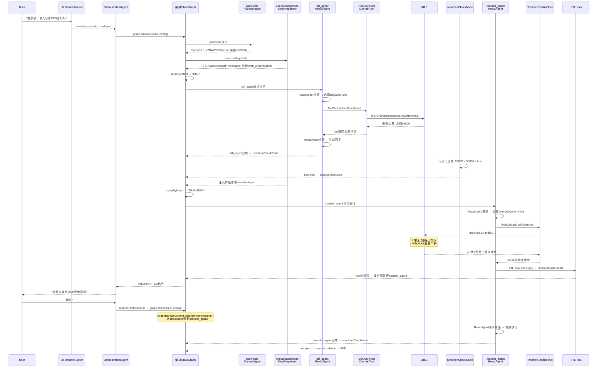

### 0.4 数据结构速查

#### OverAllState Key 注册（编排图）

| Key | 类型 | Strategy | 写入时机 | 说明 |
|-----|------|----------|---------|------|
| `messages` | List<Message> | AppendStrategy | 每个节点 | 框架标准key |
| `orch_steps` | List<OrchestrationStep> | ReplaceStrategy | planNode | Plan步骤列表 |
| `orch_currentStepIndex` | Integer | ReplaceStrategy | conditionCheckNode | 当前步骤编号 |
| `orch_currentAction` | String | ReplaceStrategy | executeStepNode | "TRANSFER→查询收款人信息" |
| `orch_nextAction` | String | ReplaceStrategy | conditionCheckNode | 下一步描述 |
| `orch_stepStatus` | String | ReplaceStrategy | executeStepNode | RUNNING/COMPLETED/WAITING_USER |
| `orch_agentPhase` | String | ReplaceStrategy | ProgressTraceHook | REASONING/TOOL_CALLING |
| `orch_agentName` | String | ReplaceStrategy | ProgressTraceHook | "transfer_agent" |
| `orch_currentToolCalls` | String | ReplaceStrategy | ProgressTraceHook | "transfer_query, transfer_confirm" |
| `orch_status` | String | ReplaceStrategy | 各节点 | PLANNING/EXECUTING/WAITING_USER/DONE |
| `orch_originalRequest` | String | ReplaceStrategy | startOrchestration | 原始用户输入 |
| `orch_latestUserInput` | String | ReplaceStrategy | handle() | 最新用户输入 |
| `orch_interruptionReason` | String | ReplaceStrategy | 中断时 | 中断原因 |
| `orch_waitingQuestion` | String | ReplaceStrategy | 中断时 | 等待用户的问题 |

#### 核心枚举

```java
public enum OrchestrationStatus { PLANNING, EXECUTING, WAITING_USER, SUSPENDED, DONE, CANCELLED }
public enum StepStatus {
    PENDING, RUNNING, COMPLETED, INTERRUPTED, SKIPPED, FAILED,
    PARAM_FIDELITY_FAILED, POSTPONED, CANCELLED,
    // 可观测性扩展
    REASONING,        // Agent正在LLM推理
    TOOL_CALLING,     // Agent正在调用Tool
    WAITING_USER      // 等待用户输入（中断后）
}
```

#### 核心模型

```java
@Data
public class OrchestrationStep implements Serializable {
    private int index;
    private String domain;          // "TRANSFER" / "BILL" / "WEALTH"
    private String intent;          // "TRANSFER_QUERY" / "TRANSFER_CONFIRM" / "BILL_QUERY"
    private String description;     // "查询收款人信息"
    private String rewrittenInput;  // 自包含输入（Agent只看到这个）
    private String condition;       // "余额>50000"
    private StepStatus status;
    private StepType type;          // EXECUTE / CLARIFY
    private String question;        // CLARIFY提问内容
    private List<String> options;   // CLARIFY选项
    private String dependsOnStepIndex;
    private String cancelReason;
    private String nodeId;          // 对应的graph nodeId（如"transfer_agent"）
}
```

### 0.5 关键代码入口

| 开发任务 | 文件 | 关键类/方法 | 参考章节 |
|---------|------|-----------|---------|
| 编排入口 | `OrchestrationAgent.java` | `handle()` / `startOrchestration()` / `resumeOrchestration()` | §9.1 |
| 编排图构建 | `OrchestrationGraphConfig.java` | `orchestrationGraph()` Bean + `routeByIntent()` | §9.2 |
| 域Agent定义 | `OrchAgentConfig.java` | `transferAgent()` / `billAgent()` / `wealthAgent()` Bean | §9.6 |
| L2封装 | `TransferQueryTool.java`等 | `call()` 方法 | §9.3 |
| 步骤准备 | `StepPreparator.java` | `prepareStep()` | §8.5 |
| 状态桥接 | `OrchestrationStateBridge.java` | `syncFromGraph()` / `injectPendingInput()` | §9.5 |
| 可观测性L1 | `OrchestrationLifecycleListener.java` | `before()` / `after()` / `onError()` | §12.2 |
| 可观测性L3 | `ProgressTraceHook.java` | `beforeAgent()` / `afterModel()` | §12.4 |

### 0.6 Spring Bean装配图

```
OrchAgentConfig
  ├── StepPreparator              (步骤准备)
  ├── ProgressTraceHook            (可观测性Hook)
  ├── PlannerAgent (ReactAgent)    (规划，outputType=OrchestrationPlan)
  ├── SummaryAgent (ReactAgent)    (汇总)
  ├── transferAgent (ReactAgent)   ← tools: [TransferQueryTool, TransferConfirmTool]
  ├── billAgent (ReactAgent)       ← tools: [BillQueryTool]
  ├── wealthAgent (ReactAgent)     ← tools: [WealthConsultTool, WealthInterpretTool, WealthPurchaseTool]
  ├── TransferQueryTool (DomainTool)   → transferL1.handle()
  ├── TransferConfirmTool (DomainTool) → transferL1.handle()
  ├── BillQueryTool (DomainTool)       → billL1.handle()
  ├── WealthConsultTool (DomainTool)   → wealthL1.handle()
  ├── WealthInterpretTool (DomainTool) → wealthL1.handle()
  └── WealthPurchaseTool (DomainTool)  → wealthL1.handle()

OrchestrationGraphConfig
  └── orchestrationGraph (CompiledGraph)
        nodes: planNode, executeStepNode, conditionCheckNode, summarizeNode,
               transfer_agent, bill_agent, wealth_agent
        edges: START→planNode, planNode→executeStepNode(条件边),
               executeStepNode→{transfer_agent|bill_agent|wealth_agent}(routeByIntent条件边),
               *_agent→conditionCheckNode(直连),
               conditionCheckNode→{executeStepNode|planNode|summarizeNode}(条件边),
               summarizeNode→END
```

### 0.7 中断/恢复机制速查

**中断触发**（框架自动，不需要手写代码）：
```
ReactAgent内部HITLHook检测到写操作需审批
  → HITLHook.interrupt()返回InterruptionMetadata
  → Flux流嵌入 → AgentToSubCompiledGraphNodeAdapter → processGraphResponseFlux
  → NodeExecutor.setReturnFromEmbedWithValue()
  → 编排图自动暂停域Agent节点
  → OrchestrationAgent收到INTERRUPTED信号
```

**意图变更中断**（需编排层调用）：
```
用户在EXECUTING期间输入新意图
  → handle() → enqueuePendingInput()
  → 编排层调用ReactAgent.interrupt()
  → InterruptionHook检测INTERRUPTION_FEEDBACK_KEY
  → 同上Flux流冒泡路径
```

**恢复**（框架自动）：
```
用户确认 → resumeOrchestration()
  → 构建RunnableConfig(HUMAN_FEEDBACK_METADATA_KEY + resume_subgraph_{agentNodeId})
  → graph.stream(null, config)
  → GraphRunnerContext.initializeFromResume()
  → AgentToSubCompiledGraphNodeAdapter检测resume标记
  → ReactAgent内部图从断点继续
```

### 0.8 开发顺序建议

| 顺序 | 任务 | 产出文件 | 依赖 |
|------|------|---------|------|
| 1 | 数据模型 | `model/OrchestrationStep.java`, `model/StepStatus.java`, `model/OrchestrationStatus.java` | 无 |
| 2 | 步骤准备 | `StepPreparator.java` | 数据模型 |
| 3 | DomainTool | `tool/TransferQueryTool.java`, `tool/BillQueryTool.java`, `tool/WealthConsultTool.java`等 | 现有L1 Bean |
| 4 | DomainReactAgent | `OrchAgentConfig.java`中定义transferAgent/billAgent/wealthAgent Bean | DomainTool + ProgressTraceHook |
| 5 | 编排图 | `OrchestrationGraphConfig.java` | DomainReactAgent + StepPreparator |
| 6 | 入口 | `OrchestrationAgent.java` | 编排图 |
| 7 | 状态桥接 | `OrchestrationStateBridge.java` | 入口 |
| 8 | 可观测性 | `OrchestrationLifecycleListener.java`, `ProgressTraceHook.java` | 编排图 |
| 9 | 集成测试 | 端到端场景测试 | 全部 |

### 0.9 完整代码Trace — "查余额，超5万转3000给妈妈"

> 本节用**具体Java代码行**追踪一个完整请求从入口到出口的执行路径。新Session可按此Trace理解代码如何组装。

#### 第一阶段：用户输入 → 编排图启动

```java
// 1. L0 DomainRouter路由到OrchestrationAgent
// 文件: DomainRouter.java（已有，不需修改）
router.route("multi-intent", sessionId, "查余额，超5万转3000给妈妈")
  → orchestrationAgent.handle(sessionId, "查余额，超5万转3000给妈妈")

// 2. OrchestrationAgent.handle() — 判断是新会话还是恢复
// 文件: OrchestrationAgent.java（§9.1）
public Flux<StreamChunk> handle(String sessionId, String userInput) {
    OrchestrationState state = stateService.get(sessionId);
    if (state == null || state.getStatus() == DONE) {
        return startOrchestration(sessionId, userInput);  // ← 新会话走这里
    } else if (state.getStatus() == WAITING_USER) {
        return resumeOrchestration(sessionId, userInput);  // ← 中断后恢复走这里
    }
    // ...
}

// 3. startOrchestration() — 构建初始OverAllState，启动编排图
// 文件: OrchestrationAgent.java（§9.1）
private Flux<StreamChunk> startOrchestration(String sessionId, String userInput) {
    Map<String, Object> inputs = Map.of(
        "messages", List.of(Map.of("role", "user", "content", userInput)),
        "orch_originalRequest", userInput,
        "orch_status", "PLANNING"
    );
    RunnableConfig config = RunnableConfig.builder()
        .threadId(sessionId)
        .build();
    return graph.stream(inputs, config)                    // ← 启动StateGraph
        .flatMap(this::graphResponseToStreamChunk);        // ← 转换为前端可用的StreamChunk
}
```

#### 第二阶段：编排图内部 — planNode → executeStepNode → routeByIntent

```java
// 4. planNode执行 — PlannerAgent生成Plan
// 文件: OrchAgentConfig.java中定义的plannerAgent Bean
// PlannerAgent收到messages，推理输出OrchestrationPlan
// 输出: orch_steps = [
//   OrchestrationStep(index=0, domain="BILL", intent="BILL_QUERY",
//     rewrittenInput="查询当前账户余额", status=PENDING),
//   OrchestrationStep(index=1, domain="TRANSFER", intent="TRANSFER_CONFIRM",
//     rewrittenInput="转账3000元给妈妈，前提条件：余额>50000",
//     condition="余额>50000", status=PENDING)
// ]

// 5. routeAfterPlan条件边 — 有步骤则路由到executeStepNode
// 文件: OrchestrationGraphConfig.java（§9.2）
private String routeAfterPlan(OverAllState state) {
    List<OrchestrationStep> steps = state.value("orch_steps", List.of());
    return steps.isEmpty() ? "end" : "execute";  // ← 有步骤，走"execute"
}

// 6. executeStepNode — StepPreparator准备第一步输入
// 文件: StepPreparator.java（§8.5）
public Map<String, Object> prepareStep(OverAllState state, OrchestrationStep step) {
    // step = steps[0] (BILL_QUERY)
    Map<String, Object> updates = new HashMap<>();
    updates.put("messages", List.of(
        Map.of("role", "user", "content", "查询当前账户余额")  // ← rewrittenInput
    ));
    updates.put("orch_currentStepIndex", 0);
    updates.put("orch_currentAction", "BILL→查询当前账户余额");
    updates.put("orch_stepStatus", "RUNNING");
    updates.put("orch_agentName", "bill_agent");
    return updates;
}

// 7. routeByIntent条件边 — 路由到bill_agent
// 文件: OrchestrationGraphConfig.java（§9.2）
private String routeByIntent(OverAllState state) {
    OrchestrationStep step = steps.get(0);
    return step.getDomain();  // → "BILL" → 路由到bill_agent节点
}
```

#### 第三阶段：bill_agent执行 → DomainTool → L1 → L2

```java
// 8. bill_agent节点执行 — ReactAgent推理循环
// 文件: OrchAgentConfig.java中定义的billAgent Bean
// ReactAgent内部流程：
//   a. 读取messages（"查询当前账户余额"）
//   b. LLM推理 → 决定调用BillQueryTool
//   c. 调用ToolCallback.call(toolInput)

// 9. BillQueryTool.call() — 封装L2调用
// 文件: tool/BillQueryTool.java（§9.3）
@Override
public String call(String toolInput) {
    DomainToolInput input = objectMapper.readValue(toolInput, DomainToolInput.class);
    // Phase 1: 通过L1.handle()调用
    Flux<StreamChunk> result = billL1.handle(input.getSessionId(), input.getRewrittenInput());
    return result.blockLast(Duration.ofSeconds(30)).getContent();
    // 返回: "当前账户余额95000元"
}

// 10. ReactAgent收到Tool结果 → 生成回复 → 节点完成
// bill_agent输出: "当前账户余额为95000元"
// Flux流: bill_agent → conditionCheckNode（直连边）
```

#### 第四阶段：条件判断 → 下一步 → 中断 → 恢复

```java
// 11. conditionCheckNode — 代码化条件判断
// 文件: OrchestrationCondition.java
// 检查Step[1]的condition: "余额>50000"
// 95000 > 50000 = true → Step[1]状态保持PENDING，标记Step[0]=COMPLETED
// 还有PENDING步骤 → return "nextStep"

// 12. 重复Step 6-7: prepareStep → routeByIntent("TRANSFER") → transfer_agent

// 13. transfer_agent执行 → TransferConfirmTool → L2 HITL中断
// 文件: tool/TransferConfirmTool.java（§9.3）
// L2执行到确认节点 → HITLHook.interrupt() → InterruptionMetadata
// Flux流冒泡: HITLHook → ReactAgent内部图 → AgentToSubCompiledGraphNodeAdapter
//   → NodeExecutor → 编排图暂停transfer_agent节点

// 14. OrchestrationAgent收到INTERRUPTED
// graphResponseToStreamChunk()检测到InterruptionMetadata
// → syncFromGraph()更新OrchestrationState (status=WAITING_USER)
// → 返回StreamChunk: "请确认转账3000元给妈妈"

// 15. 用户确认 → resumeOrchestration()
// 文件: OrchestrationAgent.java（§9.1）
private Flux<StreamChunk> resumeOrchestration(String sessionId, String userInput) {
    RunnableConfig config = RunnableConfig.builder()
        .threadId(sessionId)
        .build();
    config.addConfig("HUMAN_FEEDBACK_METADATA_KEY", userInput);  // 用户确认
    config.addConfig("resume_subgraph_transfer_agent", "");       // 恢复目标节点
    return graph.stream(null, config)                             // ← null输入=恢复模式
        .flatMap(this::graphResponseToStreamChunk);
}

// 16. 框架自动恢复: GraphRunnerContext.initializeFromResume()
// → AgentToSubCompiledGraphNodeAdapter检测resume标记
// → transfer_agent内部图从HITLHook暂停处继续
// → 转账执行完成 → conditionCheckNode → complete → summarizeNode → END
```

#### Trace总结：代码文件调用链

```
DomainRouter(已有)
  → OrchestrationAgent.handle()                           [新写]
    → startOrchestration() → graph.stream(inputs, config) [新写]
      → planNode: plannerAgent.asNode(true,false)         [新写Bean]
      → executeStepNode: stepPreparator::prepareStep      [新写]
      → routeByIntent: 条件边路由                          [新写]
      → bill_agent: billAgent.asNode(true,false)          [新写Bean]
        → BillQueryTool.call() → billL1.handle()          [新写, L1已有]
      → conditionCheckNode: condition::checkAndRoute       [新写]
      → transfer_agent: transferAgent.asNode(true,false)  [新写Bean]
        → TransferConfirmTool.call() → transferL1.handle()[新写, L1已有]
          → HITLHook中断 → Flux冒泡 → 图暂停              [框架自动]
    → resumeOrchestration() → graph.stream(null, config)  [新写]
      → 框架从checkpoint恢复transfer_agent                 [框架自动]
    → graphResponseToStreamChunk() → StreamChunk          [新写]
      → stateBridge.syncFromGraph()                       [新写]
```

### 0.10 开发检查清单（新Session必查）

> ⚠️ 在开始写代码之前，逐条确认以下检查项。任何一条不满足都可能导致实现偏离Plan B+。

#### ✅ 必须实现的组件

| # | 组件 | 类/Bean名 | 检查方式 |
|---|------|----------|---------|
| 1 | 编排入口 | `OrchestrationAgent implements DomainHandler` | 有`handle()`/`startOrchestration()`/`resumeOrchestration()` |
| 2 | 步骤准备器 | `StepPreparator` | 有`prepareStep(state, step)`方法，注入rewrittenInput到messages |
| 3 | DomainTool×6 | `TransferQueryTool`, `TransferConfirmTool`, `BillQueryTool`, `WealthConsultTool`, `WealthInterpretTool`, `WealthPurchaseTool` | 均实现`ToolCallback`，`call()`内调用`l1.handle()` |
| 4 | DomainReactAgent×3 | `transferAgent`, `billAgent`, `wealthAgent` Bean | 均用`ReactAgent.builder().tools(...).hooks(...).build()` |
| 5 | 编排图 | `OrchestrationGraphConfig` | `orchestrationGraph()` Bean返回`CompiledGraph`，含7个节点+条件边 |
| 6 | 状态桥接 | `OrchestrationStateBridge` | `syncFromGraph()`和`injectPendingInput()` |
| 7 | 可观测性Hook | `ProgressTraceHook` | 实现`Hook`接口，更新`orch_agentPhase`等字段 |
| 8 | 可观测性Listener | `OrchestrationLifecycleListener` | 实现`GraphLifecycleListener`，记录节点进出 |
| 9 | 数据模型 | `OrchestrationStep`, `StepStatus`, `OrchestrationStatus`, `OrchestrationStateKeys` | 枚举值和字段与§0.4/§8一致 |

#### ❌ 绝对不实现的组件

| # | 组件 | 为什么不实现 | 替代品 |
|---|------|------------|--------|
| 1 | `L1ToolAdapter` | 原Plan B概念，Plan B+用ReactAgent节点替代 | `DomainReactAgent` + `DomainTool` |
| 2 | `SubGraphRegistry` | 原Plan B概念，Plan B+无动态子图注册 | `OrchestrationGraphConfig`中静态声明节点 |
| 3 | `StateMapper` | 原Plan B概念，Plan B+无需L2状态映射 | `StepPreparator`（单向：编排→Agent输入） |
| 4 | `L1ToolInput` | 原Plan B概念，Agent不可见 | `DomainToolInput`（Agent可见的Tool参数） |
| 5 | `L2ResultExtractor` | 原Plan B概念，需手动解析L2输出 | `AgentResultExtractor`（从ReactAgent输出提取） |

#### 🔑 关键架构规则

1. **ReactAgent.asNode(true, false)** — 第一个参数=true表示可中断，第二个参数=false表示不自动恢复
2. **中断传播全自动** — HITLHook/InterruptionHook触发后，Flux流自动冒泡到编排图，不需要手写中断传播代码
3. **恢复通过config** — 不直接操作L2，通过`RunnableConfig`传递`HUMAN_FEEDBACK_METADATA_KEY`和`resume_subgraph_{nodeId}`
4. **DomainTool.call()必须加超时** — `result.blockLast(Duration.ofSeconds(30))`，防止无限阻塞
5. **新增域 = 新增ReactAgent Bean + 新增DomainTool Bean + 新增条件边映射** — 不需要修改任何现有代码
6. **rewrittenInput是唯一输入** — 子Agent只看到Step的rewrittenInput，不看到原始用户输入

#### 🧪 最小验证场景

实现完成后，按以下顺序验证：

1. **冒烟测试**：单意图"查余额" → bill_agent → BillQueryTool → 返回余额
2. **条件跳转**：双意图"查余额，超5万转3000" → BILL→条件满足→TRANSFER
3. **HITL中断恢复**：转账确认 → HITL中断 → 用户确认 → 恢复完成
4. **意图变更**：执行中用户打岔 → ReactAgent.interrupt() → REPLAN

---

## 目录

1. [战略定位](#1-战略定位orchestrationagent作为未来统一路由层)
2. [动态变更可适配性分析](#2-动态变更可适配性分析)
3. [五大意图场景深度分析](#3-五大意图场景深度分析)
4. [实现理念](#4-实现理念)
5. [实现架构](#5-实现架构)
6. [计划-编排-执行-反思全流程](#6-计划-编排-执行-反思全流程)
7. [流程图](#7-流程图mermaid)
8. [关键数据结构](#8-关键数据结构)
9. [关键代码](#9-关键代码)
10. [ADR架构决策记录](#10-adr架构决策记录)
11. [场景验证](#11-场景验证)
12. [可观测性与测试](#12-可观测性与测试)
13. [Phase规划](#13-phase规划)
14. [开放问题与决策](#14-开放问题与决策)
15. [文件清单](#15-文件清单)
16. [附录A：Spring AI Alibaba中断机制源码级详解](appendix-spring-ai-alibaba-interrupt-mechanism.md)

---

## 1. 战略定位：OrchestrationAgent作为未来统一路由层

### 1.1 当前架构：双轨并行

```
现在：
  单意图 → L0(入口路由) → L1(含意图状态机: suspended/switch/resume/clarify/reject) → L2
           低时延路径，模型性能有限时最优
  多意图 → L0(入口路由) → OrchestrationAgent(Plan驱动) → L1(纯执行) → L2
           复杂场景，Plan显式编排
```

### 1.2 未来架构：统一收敛

```
未来（模型性能提升后）：
  一切意图 → L0(入口路由) → OrchestrationAgent(Plan驱动+意图管理) → L1(纯执行层) → L2

  L0 不变：仍是入口，负责识别+路由
  L1 简化：去掉意图状态机，退化成纯执行层（只管 handle/resume/cancel）
  OrchestrationAgent：承担原L1的意图管理能力（顺延/跳转/恢复/澄清/拒绝）
```

### 1.3 收敛的本质

**收敛的不是 L0，是 L1 的意图状态机。**

L0 始终是入口层，不收编。OrchestrationAgent 收编的是 L1 层的意图管理职责：

| 当前由L1承担的职责 | 未来由OrchestrationAgent承担 | 机制 |
|---|---|---|
| 意图切换 (switch) | Plan Step.status 变更 + conditional edge自动路由 | Step.status→SKIPPED/CANCELLED, insert新Step, edge路由 |
| 意图顺延 (postpone) | Plan Step 重排序 + conditional edge跟随 | Step移到Plan末尾，conditional edge基于state路由 |
| 意图恢复 (resume) | Plan Step 自然轮到 + ReactAgent节点恢复 | 被顺延的Step到期后conditional edge路由到它 |
| 意图澄清 (clarify) | CLARIFY 类型Step + interrupt等待用户输入 | PlannerAgent生成CLARIFY Step, interrupt等反馈后REPLAN |
| 意图拒绝 (reject) | 不插入Plan / Step标记FAILED + conditional edge路由 | 用户拒绝→CANCELLED→nextStep, 系统拒绝→FAILED→replan |

### 1.4 关键含义

OrchestrationAgent的意图管理能力不是"锦上添花"，而是**未来替代L1意图状态机的必备前提**。

如果OrchestrationAgent做不好意图顺延/跳转/恢复/澄清/拒绝，就无法统一收编，就会永远存在两条路径，架构分裂。

**因此，五大意图场景的实现能力是Plan A/B方案的核心评判标准。**

### 1.5 Plan B的战略优势

Plan B的StateGraph + conditional edge天然是**声明式路由**——意图管理通过改变state数据实现，路由自动适配，不需要修改执行引擎。这意味着：

- 意图管理逻辑集中在Plan数据模型和conditional edge路由函数中
- 新增意图场景只需扩展路由函数，不需要改graph拓扑
- 与框架原生中断传播配合，可实现mid-step中断和恢复
- 为未来统一收编提供了最平滑的路径

---

## 2. 动态变更可适配性分析

> **⚠️ 新Session注意**：本节描述声明式路由的结构性优势——Plan B+完全继承这些优势。本节中的概念（条件边路由、state驱动变更）在Plan B+中完全适用，**无需任何映射转换**。如需了解原Plan B到Plan B+的具体代码差异，见§5.2-5.7、§9.3的对比表。

> 这是Plan A与Plan B/B+的核心评判维度之一。动态变更可适配性决定了OrchestrationAgent能否真正替代L1的意图状态机。

### 2.1 核心问题

在多意图Plan执行过程中，用户可能随时改变需求：
- 插入新的意图步骤
- 删除或跳过未执行步骤
- 重新排序步骤优先级
- 已完成步骤的输出因后续操作而失效（级联影响）

Plan B的StateGraph + conditional edge是**声明式路由**——"去哪"由state决定，不硬编码。变更只改state，路由自动适配。

Plan A的while-loop是**命令式执行**——"做什么"由loop顺序决定。变更需要改loop逻辑或全量REPLAN。

### 2.2 变更适配谱

| 变更类型 | 场景举例 | Plan B 实现方式 | 适配成本 | 风险 |
|----------|---------|---------------|---------|------|
| **Insert** | 插入新步骤"查基金" | OverAllState.append steps + conditional edge自动路由 | 低 | 依赖链需在PlanStep中显式声明 |
| **Delete** | 删掉"买理财" | state.remove step + conditional edge跳过 | 低 | 后续依赖步骤需检查前置条件 |
| **Reorder** | "先查明细再转账" | conditional edge基于state重排next step | 低 | 声明式路由天然支持重排 |
| **Dependent Cascade** | 插队改变Step2输出, Step4依赖Step2 | state变更自动传播到后续节点 | 中 | 需要step间数据流显式定义 |
| **Branch** | 一个步骤拆成并行两步 | StateGraph支持并行节点 | 中 | 需在graph中预定义并行结构，或动态添加 |
| **Merge** | 两步合并成一步 | conditional edge路由合并 | 中 | 需要检测合并条件 |
| **Rollback** | 已完成步骤要重做 | checkpoint + replay | 高 | 需要状态快照机制 |
| **Conditional Skip** | 运行时决定跳步 | conditional edge天然支持 | 低 | 框架原生能力 |

### 2.3 Plan B变更的结构性优势

#### 优势1：ReactAgent内部InterruptionHook/HITLHook — 可在推理轮次中断

```java
// ReactAgent内部的InterruptionHook — 源码确认实现InterruptableAction
// ReactAgent.initGraph()中以完整对象添加，保留InterruptableAction能力
public class InterruptionHook extends AgentHook implements InterruptableAction {
    
    @Override
    public Optional<InterruptionMetadata> interrupt(String nodeId, OverAllState state,
                                                     RunnableConfig config) {
        // ReactAgent.interrupt()设置INTERRUPTION_FEEDBACK_KEY
        // 空列表 = 中断等待用户, 非空 = 处理反馈后继续
        ConcurrentHashMap<String, Object> threadState = agentThreadState;
        Object feedback = threadState.remove(INTERRUPTION_FEEDBACK_KEY);
        if (feedback == null || isEmptyList(feedback)) {
            return Optional.of(InterruptionMetadata.builder()
                .nodeId(nodeId).state(state).build());
        }
        return Optional.empty(); // 有反馈→继续执行
    }
}

// ReactAgent内部的HITLHook — 源码确认实现InterruptableAction
// AFTER_MODEL位置，检测写操作需审批
public class HumanInTheLoopHook extends AgentHook implements InterruptableAction {
    @Override
    public Optional<InterruptionMetadata> interrupt(String nodeId, OverAllState state,
                                                     RunnableConfig config) {
        // 检查上一步MODEL输出是否有Tool需要审批
        // approvalOn匹配的Tool → 返回InterruptionMetadata等待用户确认
    }
}
```

**影响**：用户在Step执行中说"等等先查余额"，ReactAgent.interrupt()设置INTERRUPTION_FEEDBACK_KEY → InterruptionHook在下一个推理轮次前检测到 → 返回InterruptionMetadata → Flux流自动冒泡到编排图 → 图暂停。无需等当前Step完成。

#### 优势2：声明式路由 — conditional edge

```java
// conditional edge路由函数
private String routeAfterConditionCheck(OverAllState state) {
    if (hasRerouteSignal(state)) return "planNode";
    if (allStepsDone(state)) return "summarizeNode";
    if (needsReplan(state)) return "planNode";
    return "executeStepNode";  // ← 只要state有变更，自动路由到正确的next step
}
```

**影响**：变更只改state（Plan数据），conditional edge自动路由到正确的下一步。不需要修改执行逻辑。

#### 优势3：框架原生中断传播（源码确认）

```
ReactAgent内部 HITLHook/InterruptionHook.interrupt() → InterruptionMetadata
  → Flux流嵌入 → AgentToSubCompiledGraphNodeAdapter → processGraphResponseFlux
  → NodeExecutor.setReturnFromEmbedWithValue()
  → MainGraphExecutor → 编排图暂停域Agent节点
```

**影响**：中断信号从ReactAgent内部图自动冒泡到编排图，不需要自定义中断信号机制。源码确认此路径与SubCompiledGraphNodeAction等价（两者均实现ResumableSubGraphAction）。

#### 优势4：OverAllState 可变性

Plan数据在OverAllState中，可随时修改。已完成steps保持不变，只修改未执行部分。

#### 优势5：Flux 流式传输隔离

当前Step的Flux可dispose()，启动新Step的Flux。输出流干净隔离，不会交错。

### 2.4 Plan B变更的结构性局限

#### 局限1：CompiledGraph 拓扑不可变

StateGraph编译后（CompiledGraph），节点和边的拓扑不可变。动态变更影响的是**DATA**（Plan state），不是**STRUCTURE**（graph nodes）。

**影响**：所有可能的路由路径必须在编译时预定义在graph中。例如：REPLAN路径必须有 `conditionCheckNode → planNode` 的条件边。

#### 局限2：Branch 并行需预定义

StateGraph支持并行节点，但并行结构必须在编译时设计好。无法在运行时动态添加并行分支。

**影响**：如果未来需要动态并行，需要预先设计一个"并行执行容器"节点。

#### 局限3：Rollback 无内建支持

框架没有内建的checkpoint/replay机制。需要手动实现状态快照。

#### 局限4：框架依赖风险

Plan B+对Spring AI Alibaba的依赖：
- ReactAgent.asNode()（public API，较稳定）
- InterruptionHook/HITLHook（ReactAgent内置，随版本变化）
- AgentToSubCompiledGraphNodeAdapter（internal包，但由asNode()封装，不直接调用）
- DomainTool仅依赖DomainHandler+ToolCallback（均为public API）
- InterruptionMetadata（public接口，较稳定）
- SubCompiledGraphNodeAction（**internal包**，可能变化）
- GraphRunnerContext.initializeFromResume()（内部实现，可能变化）
- MainGraphExecutor / NodeExecutor（内部实现，可能变化）

**缓解**：对internal API做适配层封装，框架升级时只需改适配层。

### 2.5 声明式 vs 命令式 — 可适配性的本质差异

> **Plan B 的 StateGraph + conditional edge 天然是声明式路由** — "去哪"由 state 决定，不硬编码。变更只改 state，路由自动适配。
>
> **Plan A 的 while-loop 是命令式执行** — "做什么"由 loop 顺序决定。变更需要改 loop 逻辑或全量 REPLAN。

这是可适配性的本质差异：
- 声明式：Change data → behavior adapts automatically
- 命令式：Change data → must also change control flow logic

对于动态Plan修改在多意图场景中，声明式路由意味着：
- Insert step → just add to state → conditional edge routes to it
- Delete step → just remove from state → conditional edge skips it
- Reorder → just change order in state → conditional edge follows new order
- 不需要修改执行引擎本身

---

## 3. 五大意图场景深度分析

> 这五大场景是OrchestrationAgent替代L1意图状态机的最低门槛。每个场景都必须能通过Plan变更实现，否则就无法统一收编。

### 3.1 场景1：意图顺延（Intent Postpone）

#### 场景描述
```
用户：转账给张三1000元，然后查余额，再买基金
Plan生成：[转账→查余额→买基金]
执行转账中用户说：转账先不急，先查余额吧
```

#### 当前L1做法
suspendedAgent暂存转账意图，先执行查余额。L1内部管理active/suspended状态切换。

#### Plan B+实现路径

```
1. 用户新输入到达 → ReactAgent.interrupt()设置INTERRUPTION_FEEDBACK_KEY
2. InterruptionHook在下一个推理轮次前检测到 → 返回InterruptionMetadata
3. InterruptionMetadata通过Flux流冒泡到编排图 → 图暂停当前域Agent节点
4. 图路由到REPLAN节点（或直接在conditionCheckNode处理）
5. Plan变更：转账Step.status→POSTPONED，查余额Step提前
6. OverAllState更新Plan → conditional edge基于新state路由
7. routeByIntent(BILL) → bill_agent → 查余额完成后
8. conditionCheckNode → routeByIntent(TRANSFER) → transfer_agent → 执行被顺延的转账
```

#### 关键代码流转

```java
// ReactAgent.interrupt() — 设置中断信号
public void interrupt() {
    agentThreadState.put(INTERRUPTION_FEEDBACK_KEY, List.of()); // 空列表=中断
}

// InterruptionHook.interrupt() — 框架在推理轮次前自动调用（源码确认）
@Override
public Optional<InterruptionMetadata> interrupt(String nodeId, OverAllState state,
                                                 RunnableConfig config) {
    Object feedback = agentThreadState.remove(INTERRUPTION_FEEDBACK_KEY);
    if (feedback == null || isEmptyList(feedback)) {
        return Optional.of(InterruptionMetadata.builder()
            .nodeId(nodeId).state(state).build()); // → Flux流冒泡到编排图
    }
    return Optional.empty(); // 有反馈→继续执行
}

// conditionCheckNode — 检测到InterruptionMetadata中的意图变更
private String routeAfterCondition(OverAllState state) {
    String reroute = state.value("_rerouteSignal", "");
    if (!reroute.isEmpty()) return "planNode";  // 路由到REPLAN
    // ... 正常路由逻辑
}
```

#### 时延分析
- 1次LLM调用（PlannerAgent修改Plan）
- graph节点转换开销（~几毫秒）
- 中断传播开销（框架内Flux流，~几毫秒）

#### 边界条件
- 转账Step已在DomainTool执行中 → ReactAgent.interrupt()在推理轮次边界中断，InterruptionHook返回InterruptionMetadata
- 转账Step未开始 → 直接修改state，conditional edge路由到查余额
- 转账Step的L2已执行部分操作 → 需要L2 cleanup机制

#### 扩展性评估
新增类似顺延场景只需：扩展conditional edge路由函数 + 可能新增InterruptionMetadata的reason类型。不需要改graph拓扑。

#### 能否替代L1 suspended机制？
**完全替代**。ReactAgent内部InterruptionHook可在推理轮次边界中断，InterruptionMetadata通过Flux流自动冒泡到编排图，conditional edge自动路由。Plan变更实现顺延，无需L1的suspended状态机。

---

### 3.2 场景2：意图跳转（Intent Switch）

#### 场景描述
```
用户：帮我转账给张三
Plan生成：[转账]
执行中用户说：算了，帮我买基金
```

#### 当前L1做法
switch：当前意图suspend，启动新意图。L1内部管理switch逻辑。

#### Plan B+实现路径

```
1. 用户说"算了帮我买基金" → ReactAgent.interrupt()检测到意图完全改变
2. InterruptionHook返回InterruptionMetadata → Flux流冒泡到编排图 → 图暂停
3. 转账Step.status→CANCELLED
4. PlannerAgent生成新Step（买基金）
5. conditional edge路由到新的买基金Step
6. routeByIntent(WEALTH) → wealth_agent → DomainTool → L1/L2执行
```

#### 关键：域Agent中断和L2 cleanup

```java
// ReactAgent.interrupt() — 意图完全改变时由编排层调用
// 编排层检测到意图变更后，调用当前域Agent的interrupt()
transferAgent.interrupt(); // 设置INTERRUPTION_FEEDBACK_KEY=空列表

// InterruptionHook.interrupt()在下一个推理轮次前返回InterruptionMetadata
// 编排层收到中断信号后：
OrchestrationStep currentStep = getCurrentStep(state);
currentStep.setStatus(StepStatus.CANCELLED);
state = state.withValue(OrchestrationStateKeys.STEPS, updatedSteps);
```

#### 边界条件
- 跳转涉及跨域（转账→基金）：Plan B+天然支持（routeByIntent条件边声明式路由到wealth_agent）
- DomainTool已在执行L2：blockLast()需添加超时保护，超时后作为Tool失败处理
- 当前L2是否有cancel机制？需要检查。如果没有，需要增加。

#### 能否替代L1 switch机制？
**完全替代**。ReactAgent内部InterruptionHook在推理轮次边界中断，InterruptionMetadata通过Flux流冒泡到编排图，conditional edge路由到新Step。跨域跳转天然支持（routeByIntent声明式路由）。

---

### 3.3 场景3：意图恢复（Intent Resume）

#### 场景描述
```
用户：帮我转账给张三，然后查余额
Plan生成：[转账→查余额]
执行转账中用户说：等等先查余额
Plan变更：[查余额→转账(resumed)]
查余额完成后，转账意图恢复
```

#### 当前L1做法
resume suspendedAgent：恢复之前挂起的意图。

#### Plan B+实现路径

```
1. ReactAgent.interrupt() → 转账Step中断，status→POSTPONED
2. 插入查余额Step → routeByIntent(BILL) → bill_agent
3. 查余额完成后 → conditionCheckNode检查Plan → 下一个PENDING Step是转账
4. routeByIntent(TRANSFER) → transfer_agent → ReactAgent节点恢复执行
5. 关键：恢复通过ResumableSubGraphAction
   - AgentToSubCompiledGraphNodeAdapter实现ResumableSubGraphAction（源码确认）
   - GraphRunnerContext.initializeFromResume()从checkpoint恢复
   - ReactAgent内部图从InterruptionHook暂停处继续推理
```

#### 关键：框架原生的恢复机制

```java
// 恢复流程 — 利用框架原生ResumableSubGraphAction
public Flux<GraphResponse> resumeOrchestration(String userInput, RunnableConfig config) {
    String agentNodeId = determineCurrentAgentNodeId(state); // 如 "transfer_agent"
    
    // 构建恢复配置
    config = RunnableConfig.builder()
        .threadId(sessionId)
        .addMetadata(HUMAN_FEEDBACK_METADATA_KEY, 
                     InterruptionMetadata.builder()
                         .metadata(Map.of("approved", true, "feedback", userInput))
                         .build())
        .addMetadata(getResumeSubGraphId(agentNodeId), "true") // resume_subgraph_transfer_agent
        .build();
    
    // 框架自动从checkpoint恢复
    return orchestrationGraph.stream(null, config);
    // GraphRunnerContext.initializeFromResume() 检测resumeSubGraphId
    // → AgentToSubCompiledGraphNodeAdapter检测resume标记
    // → ReactAgent内部图从InterruptionHook暂停处继续推理
}
```

#### 边界条件
- L1是否支持暂停恢复？→ Plan B+的DomainTool→L1.handle()路径，恢复由编排层管理，L1无感知
- ReactAgent内部是否有checkpoint？→ 框架MemorySaver按threadId+nodeId管理，自动支持
- L2是否有checkpoint？→ 当前L2使用interruptBefore机制，有中断点，可通过resume恢复
- 恢复后上下文是否完整？→ RunnableConfig携带完整上下文

#### 能否替代L1 resume机制？
**完全替代，且更优**。Plan B+通过ReactAgent节点的ResumableSubGraphAction实现断点恢复，恢复粒度更细（Agent推理轮次级别 vs L2节点级别）。比L1的resume更精确。

---

### 3.4 场景4：意图澄清（Intent Clarify）

#### 场景描述
```
用户：转钱
Plan生成失败：意图不明确，需要澄清
系统：您是想转账还是还信用卡？
用户：转账
```

#### 当前L1做法
clarify流程：收集更多信息后执行。L1内部有clarify状态。

#### Plan B+实现路径

```
1. PlannerAgent检测到意图不明确 → 生成CLARIFY类型的OrchestrationStep
2. CLARIFY Step → executeStepNode + routeByIntent → 对应域Agent
3. 域Agent的instruction引导Agent向用户提问 → HITLHook等待用户确认
4. HITLHook.interrupt()返回InterruptionMetadata → Flux流冒泡到编排图 → 图暂停
5. 用户输入到达 → resumeOrchestration()
6. RunnableConfig携带用户选择 → ReactAgent内部图恢复
7. planNode基于用户选择 → REPLAN → 生成正式Plan
```

#### 关键实现

```java
// CLARIFY Step不需要专门的graph节点
// 复用executeStepNode + routeByIntent → 对应域Agent
// Agent的instruction包含澄清逻辑，HITLHook提供中断等待用户

// 域Agent instruction示例（transfer_agent）:
// "如果用户意图不明确（如'转钱'），先向用户确认具体意图，
//  然后调用对应的Tool。等待用户确认时使用HITL审批。"

// HITLHook自动处理中断/恢复（源码确认）
// 编排层无需手动构建InterruptionMetadata
```

#### 边界条件
- 澄清后用户仍不明确 → 可多轮澄清（conditional edge路由回planNode）
- 澄清超时 → 编排层WAITING_USER超时处理

#### 能否替代L1 clarify机制？
**完全替代，且更优雅**。CLARIFY复用域Agent + HITLHook机制，不需要专门节点。框架原生中断传播处理等待/恢复。跨域澄清天然支持。

---

### 3.5 场景5：意图拒绝（Intent Reject）

#### 场景描述
```
用户：转账给张三1000万
系统：单笔转账限额500万，请修改金额
```

#### 当前L1做法
reject + 提示用户修改。L1内部判断可否执行。

#### Plan B+实现路径

```
1. DomainTool调用L1/L2执行转账时触发风控拒绝 → L2内部interruptBefore机制暂停
2. InterruptionMetadata从L2 → DomainTool → ReactAgent内部图 → Flux流冒泡到编排图
3. 编排图暂停域Agent节点（如transfer_agent）
4. 区分拒绝类型：
   - 用户主动拒绝 → Step.status→CANCELLED → conditional edge路由到nextStep
   - 系统风控拒绝 → Step.status→FAILED → conditional edge路由到planNode (REPLAN)
5. REPLAN时PlannerAgent知道"转账1000万被拒(风控:单笔限额500万)" → 重新规划
```

#### 关键：拒绝类型的区分

```java
// InterruptionMetadata携带拒绝原因
// L2的风控节点通过interruptBefore暂停时，会将拒绝原因写入state
// InterruptionMetadata通过Flux流自动冒泡到编排图

// conditionCheckNode根据中断原因路由
private String routeAfterCondition(OverAllState state) {
    String interruptionReason = state.value(OrchestrationStateKeys.INTERRUPTION_REASON, "");
    if ("SYSTEM_REJECT".equals(interruptionReason)) {
        return "planNode";  // REPLAN
    }
    if ("USER_CANCEL".equals(interruptionReason)) {
        return "executeStepNode";  // 下一步
    }
    // ... 正常路由
}
```

#### 边界条件
- 风控拒绝后用户坚持 → replanCount限制（max 2）
- 部分执行后拒绝 → 需要补偿机制
- InterruptionMetadata.metadata容量有限 → 复杂拒绝原因可能需要额外存储

#### 能否替代L1 reject机制？
**完全替代**。InterruptionMetadata携带拒绝原因自动传播，conditional edge根据拒绝类型路由。REPLAN处理系统拒绝。比L1的reject更灵活（可区分拒绝类型并自动路由）。

---

### 3.6 五大场景综合评估

| 意图场景 | Plan B+能否实现？ | 实现平滑度 | 关键优势 | 关键阻塞点 | 扩展性 | 能否替代L1机制？ |
|---------|---------------|-----------|---------|-----------|-------|---------------|
| 意图顺延 | ✅ 完全实现 | 高 | ReactAgent内部InterruptionHook可在推理轮次边界中断 | DomainTool超时保护 | 好 | 完全替代 |
| 意图跳转 | ✅ 完全实现 | 高 | InterruptionMetadata通过Flux流自动冒泡 | DomainTool中L2 cancel | 好 | 完全替代 |
| 意图恢复 | ✅ 完全实现 | 高 | 框架原生ResumableSubGraphAction（Agent推理轮次级恢复） | ReactAgent内部checkpoint完整性 | 好 | 完全替代且更优 |
| 意图澄清 | ✅ 完全实现 | 高 | 域Agent instruction引导+HITLHook中断等待 | 多轮澄清限制 | 好 | 完全替代且更优雅 |
| 意图拒绝 | ✅ 完全实现 | 高 | InterruptionMetadata携带拒绝原因自动冒泡 | 复杂拒绝原因存储 | 好 | 完全替代且更灵活 |

**核心结论**：Plan B+在所有五大意图场景上都能完全替代L1的suspended/switch/resume/clarify/reject机制。ReactAgent内部InterruptionHook/HITLHook + InterruptionMetadata + conditional edge提供了比L1状态机更优雅、更可扩展的实现。

**与Plan A的关键差异**：Plan A在意图顺延和意图跳转上受限于blockLast()阻塞，无法实现mid-step中断。Plan B+通过ReactAgent内部中断机制（源码确认），在所有场景上都能实现平滑的mid-step中断和恢复。

---

## 4. 实现理念

### 4.1 "领域Agent即Node"三层模型

Plan B+的核心概念是"领域Agent即Node"——每个业务域用一个ReactAgent.asNode()嵌入编排图，ReactAgent的Tools封装L2子图：

```
Layer 1: Agent Description (给 PlannerAgent 看)
  → domainInfoTool: 告诉LLM"有哪些域可以编排"
  → 每个域的name、intent、description、writeOperation标记
  
Layer 2: Agent as Node (给 编排StateGraph 看)
  → ReactAgent.asNode() 嵌入编排图，成为图中的一个节点
  → ReactAgent内部有AGENT_MODEL→AGENT_TOOL循环
  → 每个ReactAgent有自己的Tools列表

Layer 3: DomainTool Implementation (Agent内部调用)
  → Tool.execute() → L1.handle() 或直接调用 L2 CompiledGraph
  → 对Agent层完全透明——Agent只看到Tool的name/description/返回值
  → L2内部变化(加节点、改interruptBefore)对编排半透明(中断通过Flux自动传播)
```

**与原Plan B"L1ToolAdapter+SubCompiledGraphNodeAction"的关键区别**（⚠️ 仅供参考，不要实现原Plan B列）：

| 维度 | 原Plan B（❌不实现） | Plan B+（✅实现此列） |
|------|---------------------|---------------------|
| 域调用单元 | L1ToolAdapter(1个通用适配器) | DomainReactAgent(每域1个专用Agent) |
| L2调用方式 | SubCompiledGraphNodeAction直接嵌L2 | DomainTool封装L2，Agent通过Tool间接调用 |
| Tool选择 | 编排层确定性指定(PlannerAgent) | Agent内部LLM推理选择(可扩展但非100%确定) |
| 新能力扩展 | 改L2图定义 | 加DomainTool到Agent的tools列表 |
| 框架API | SubCompiledGraphNodeAction(internal包) | ReactAgent.asNode()(public API) |

**"领域Agent即Node"的本质优势**：新增能力=新增Tool，无需改图拓扑。ReactAgent的LLM会自动学会使用新Tool。

### 4.2 条件边驱动循环 — 不是while-loop，是StateGraph

Plan B+沿用Plan B的StateGraph条件边驱动循环（与v5.1的while-loop本质区别）：

```java
// StateGraph拓扑 (Plan B+)
START → planNode → [有步骤?] → executeStepNode ←──────┐
              │                  │                      │
              No                 │ conditionCheckNode ──┘
              │                  ↙      │       ↘
              ▼             nextStep  replan   complete
            END                │        │        │
                                │     planNode  summarizeNode→END
                                └──→ executeStepNode
```

**条件边 = 声明式路由**：
- "去哪"由OverAllState决定，不硬编码
- 变更只改state，conditional edge自动适配
- 新增意图场景只需扩展路由函数，不需要改graph拓扑

### 4.3 框架原生中断传播 — 源码级确认的等价机制

Plan B+利用框架原生的中断机制，与Plan B**完全等价**（源码级确认）：

```
ReactAgent内部InterruptionHook.interrupt() (implements InterruptableAction)
  → ReactAgent内部GraphRunner产生GraphResponse.done(InterruptionMetadata)
  → InterruptionMetadata通过Flux流嵌入到父图
  → 父图NodeExecutor.processGraphResponseFlux()检测
  → context.setReturnFromEmbedWithValue(InterruptionMetadata)
  → 父图MainGraphExecutor下一轮检查returnFromEmbed
  → 编排图自动暂停
```

**源码级关键事实**：
- SubCompiledGraphNodeAction **不实现** InterruptableAction（Plan B）
- AgentToSubCompiledGraphNodeAdapter **不实现** InterruptableAction（Plan B+）
- 两者都实现 ResumableSubGraphAction → Resume机制等价
- 中断传播路径完全相同：Flux流→processGraphResponseFlux→returnFromEmbed

> 详见 [附录A：Spring AI Alibaba中断机制源码级详解](appendix-spring-ai-alibaba-interrupt-mechanism.md)

### 4.4 框架原生流式透传

ReactAgent.asNode()的流式输出通过Flux链路自动透传到parent graph：
- 不需要Sinks.Many
- 不需要blockLast()
- StreamingOutput通过Flux流自然传播
- ReactAgent内部有SummarizationHook做上下文压缩

### 4.5 新增域：新增ReactAgent Bean + 图节点

```java
// 新增域: 新增ReactAgent Bean + 添加图节点 + 添加条件边
@Bean
public ReactAgent insuranceAgent(ChatModel chatModel) {
    return ReactAgent.builder()
        .name("insurance_agent")
        .model(chatModel)
        .instruction("你是保险领域专家...")
        .tools(insuranceQueryTool, insuranceClaimTool)
        .hooks(new ProgressTraceHook())
        .outputKey("insurance_result")
        .build();
}

// 编排图配置中添加
graph.addNode("insurance_agent", insuranceAgent.asNode(true, false));
// 条件边路由函数中添加 INSURANCE → insurance_agent 分支
```

**与原Plan B的对比**（⚠️仅供参考）：原Plan B新增域只需SubGraphRegistry注册（零改动），Plan B+需改图拓扑。但Plan B+新增能力只需加DomainTool Bean（更频繁的场景），无需改图。

### 4.6 L1的状态：在路径中但可逐步退出

Plan B+的DomainTool可以选择：
- **选项A**：DomainTool → L1.handle() → L2（L1仍在路径中）
- **选项B**：DomainTool → 直接调用L2 CompiledGraph（绕过L1，与Plan B等价）

Phase 1建议用选项A（减少改动），Phase 2逐步迁移到选项B。

### 4.7 与v5.1的关系

| 维度 | v5.1 | Plan B+ |
|------|------|---------|
| 编排循环 | while-loop | StateGraph条件边 |
| 中断机制 | 共享状态标记手动检测 | 框架原生InterruptionMetadata（源码级确认等价） |
| 域调用 | ReactAgent + DomainTool → L1.handle() | DomainReactAgent.asNode() + DomainTool → L1/L2 |
| 流式传输 | Sinks.Many + blockLast() | Flux自动透传 |
| 动态Plan变更 | 未详细设计 | §2-3完整分析 |
| 五大意图场景 | 仅提及SUSPENDED | §3深度分析 |
| L0定位 | 未明确 | §1明确L0始终是入口层 |
| 域内能力扩展 | 改DomainTool+改ReactAgent instruction | 只需加DomainTool到Agent列表 |
| 可观测性 | 未设计 | §12三层打点架构 |

---

## 5. 实现架构

### 5.1 整体架构图

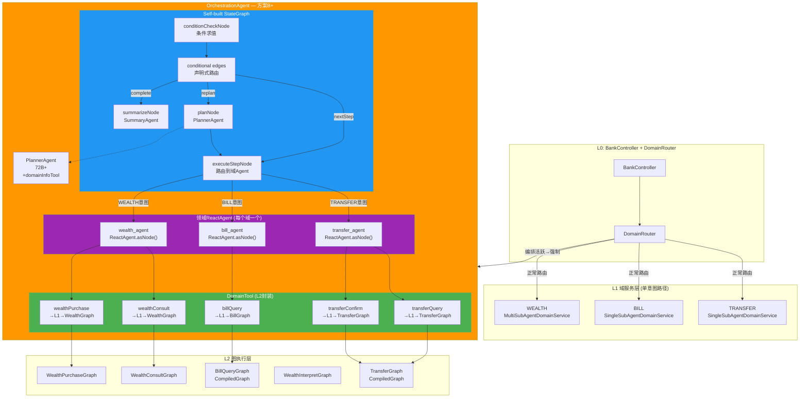

### 5.2 分层架构

```
┌──────────────────────────────────────────────────────────┐
│ L0: BankController → DomainRouter                         │
│   编排活跃时 → 强制路由到 REA                              │
│   编排不活跃 → 正常路由到 TRANSFER/BILL/WEALTH              │
└───────────────────────┬──────────────────────────────────┘
                        │
┌───────────────────────▼──────────────────────────────────┐
│ OrchestrationAgent (implements DomainHandler)             │
│   handle() → 路由分发: 新请求/恢复/挂起/咨询               │
├──────────────────────────────────────────────────────────┤
│ ┌─ Self-built StateGraph ─────────────────────────────┐  │
│ │  planNode → executeStepNode → conditionCheckNode    │  │
│ │  conditional edges: nextStep / replan / complete    │  │
│ │  域路由: 条件边按intent分发到对应ReactAgent节点       │  │
│ │  中断: InterruptionMetadata → Flux流 → returnFromEmbed│
│ │  恢复: ResumableSubGraphAction + GraphRunnerContext  │  │
│ └─────────────────────────────────────────────────────┘  │
│ ┌─ 领域ReactAgent × N ───────────────────────────────┐  │
│ │  transfer_agent: ReactAgent.asNode(true, false)     │  │
│ │    Tools: transferQuery, transferConfirm, ...       │  │
│ │    Hooks: ProgressTraceHook, HITLHook(可选)         │  │
│ │  bill_agent: ReactAgent.asNode(true, false)         │  │
│ │    Tools: billQuery, ...                            │  │
│ │  wealth_agent: ReactAgent.asNode(true, false)       │  │
│ │    Tools: wealthConsult, wealthPurchase, ...        │  │
│ └─────────────────────────────────────────────────────┘  │
│ ┌─ DomainTool × N (L2封装) ──────────────────────────┐  │
│ │  ToolCallback实现，execute()内调用L1.handle()/L2      │  │
│ │  新增能力 = 新增DomainTool Bean + 加入Agent的tools列表│  │
│ │  跨域组合 = 在Agent的tools列表中加入其他域的Tool      │  │
│ └─────────────────────────────────────────────────────┘  │
│ ┌─ 辅助组件 ─────────────────────────────────────────┐  │
│ │  OrchestrationCondition (条件判断, 代码化+LLM兜底)    │  │
│ │  OrchestrationRelevance (相关性检测)                  │  │
│ │  OrchestrationSummary (结果汇总)                      │  │
│ │  ParameterFidelityValidator (参数保真)                │  │
│ └─────────────────────────────────────────────────────┘  │
└───────────────────────┬──────────────────────────────────┘
                        │ DomainTool.execute()
                        │ → L1.handle() → L2 (Phase 1)
                        │ → L2 CompiledGraph直接调用 (Phase 2)
┌───────────────────────▼──────────────────────────────────┐
│ L2: TransferGraph / BillQueryGraph / WealthGraphs         │
│   CompiledGraph执行 (interruptBefore + resume)            │
│   中断: InterruptionMetadata自动冒泡到ReactAgent→编排图    │
│   流式: StreamingOutput自动透传到ReactAgent→编排图          │
└──────────────────────────────────────────────────────────┘
```

### 5.3 StateGraph拓扑图

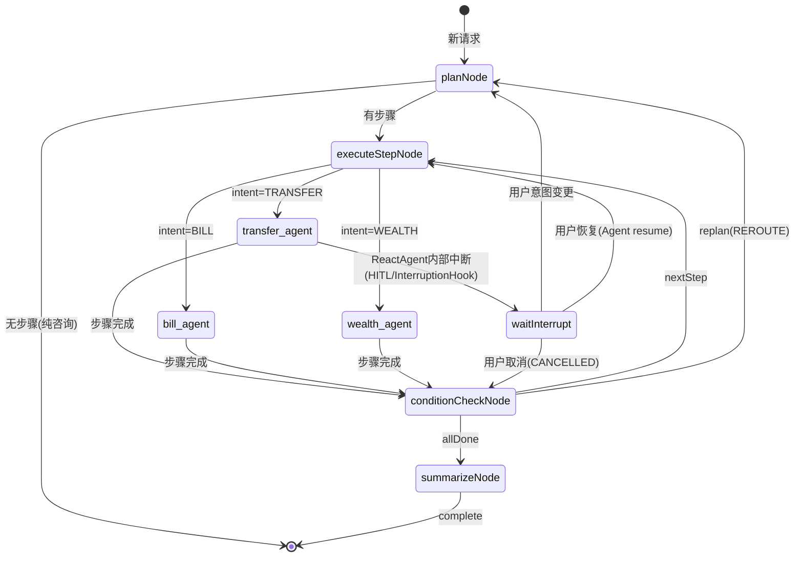

### 5.4 DomainReactAgent + DomainTool 核心代码

#### DomainReactAgent定义

```java
/**
 * 领域ReactAgent — 方案B+的核心组件
 * 
 * 每个业务域一个ReactAgent，配置该域相关的DomainTools。
 * ReactAgent通过LLM推理决定调用哪个Tool、以什么参数调用。
 * ReactAgent.asNode()嵌入编排StateGraph，成为图中的一个节点。
 */
@Configuration
public class DomainAgentConfig {

    @Bean
    public ReactAgent transferAgent(
            ChatModel chatModel,
            TransferQueryTool transferQueryTool,
            TransferConfirmTool transferConfirmTool,
            TransferExecuteTool transferExecuteTool) {
        return ReactAgent.builder()
            .name("transfer_agent")
            .model(chatModel)  // 32B模型
            .instruction("你是转账领域专家。根据用户请求选择合适的工具完成转账操作。" +
                         "查询收款人信息用transferQuery，确认转账用transferConfirm，" +
                         "执行转账用transferExecute。注意：转账操作必须先确认再执行。")
            .tools(transferQueryTool, transferConfirmTool, transferExecuteTool)
            .hooks(new ProgressTraceHook())   // 进度追踪
            .outputKey("transfer_result")
            .build();
    }

    @Bean
    public ReactAgent billAgent(
            ChatModel chatModel,
            BillQueryTool billQueryTool) {
        return ReactAgent.builder()
            .name("bill_agent")
            .model(chatModel)
            .instruction("你是账单查询专家。根据用户请求查询账单信息。")
            .tools(billQueryTool)
            .hooks(new ProgressTraceHook())
            .outputKey("bill_result")
            .build();
    }

    @Bean
    public ReactAgent wealthAgent(
            ChatModel chatModel,
            WealthConsultTool wealthConsultTool,
            WealthPurchaseTool wealthPurchaseTool) {
        return ReactAgent.builder()
            .name("wealth_agent")
            .model(chatModel)
            .instruction("你是理财领域专家。提供理财咨询和购买服务。" +
                         "咨询用wealthConsult，购买用wealthPurchase。购买前必须先咨询。")
            .tools(wealthConsultTool, wealthPurchaseTool)
            .hooks(new ProgressTraceHook())
            .outputKey("wealth_result")
            .build();
    }
}
```

#### DomainTool封装L2

```java
/**
 * DomainTool — 封装L2子图的ToolCallback实现
 * 
 * 每个L2子图对应一个DomainTool。
 * Tool.execute()内部调用L1.handle()或直接调用L2 CompiledGraph。
 * ReactAgent通过LLM推理选择调用哪个Tool。
 */
@Component
public class TransferQueryTool implements ToolCallback {

    private final TransferHandler transferHandler; // L1 DomainHandler

    @Override
    public String getName() { return "transferQuery"; }

    @Override
    public String getDescription() {
        return "查询转账收款人信息。输入: 收款人姓名或账号。输出: 收款人详细信息。";
    }

    @Override
    public String call(String toolInput) {
        log.info("[TOOL] transferQuery 开始, input={}", toolInput);
        long start = System.currentTimeMillis();

        try {
            // 构建L1请求
            DomainRequest request = DomainRequest.builder()
                .intent("TRANSFER_QUERY")
                .rewrittenInput(toolInput)
                .build();

            // 调用L1 (Phase 1) 或直接调用L2 (Phase 2)
            Flux<StreamChunk> result = transferHandler.handle(request);
            String response = result.collectList()
                .timeout(Duration.ofSeconds(30))
                .block()
                .stream()
                .map(StreamChunk::getContent)
                .collect(Collectors.joining());

            log.info("[TOOL] transferQuery 完成, duration={}ms", System.currentTimeMillis() - start);
            return response;
        } catch (TimeoutException e) {
            log.error("[TOOL] transferQuery 超时");
            return "查询超时，请稍后重试";
        } catch (Exception e) {
            log.error("[TOOL] transferQuery 失败", e);
            return "查询失败: " + e.getMessage();
        }
    }
}

@Component
public class TransferConfirmTool implements ToolCallback {
    // 同上结构，intent="TRANSFER_CONFIRM"
    // HITL审批: 在ReactAgent中配置HumanInTheLoopHook，对transferConfirm工具要求审批
}

@Component
public class TransferExecuteTool implements ToolCallback {
    // 同上结构，intent="TRANSFER_EXECUTE"
}
```

#### 编排StateGraph配置

```java
@Configuration
public class OrchestrationGraphConfig {

    @Bean
    public StateGraph orchestrationGraph(
            ReactAgent transferAgent,
            ReactAgent billAgent,
            ReactAgent wealthAgent,
            PlannerService plannerService,
            ConditionService conditionService) throws GraphStateException {

        KeyStrategyFactory keyStrategyFactory = () -> {
            HashMap<String, KeyStrategy> strategies = new HashMap<>();
            strategies.put("messages", new AppendStrategy());
            strategies.put("orch_plan", new ReplaceStrategy());
            strategies.put("orch_currentStepIndex", new ReplaceStrategy());
            strategies.put("orch_currentAction", new ReplaceStrategy());
            strategies.put("orch_nextAction", new ReplaceStrategy());
            strategies.put("orch_stepStatus", new ReplaceStrategy());
            strategies.put("orch_agentPhase", new ReplaceStrategy());
            strategies.put("orch_agentName", new ReplaceStrategy());
            strategies.put("orch_currentToolCalls", new ReplaceStrategy());
            strategies.put("transfer_result", new ReplaceStrategy());
            strategies.put("bill_result", new ReplaceStrategy());
            strategies.put("wealth_result", new ReplaceStrategy());
            return strategies;
        };

        StateGraph graph = new StateGraph("orchestration", keyStrategyFactory);

        // 添加编排节点
        graph.addNode("planNode", node_async(plannerService::plan));
        graph.addNode("executeStepNode", node_async(this::executeStep));
        graph.addNode("conditionCheckNode", node_async(conditionService::check));
        graph.addNode("summarizeNode", node_async(this::summarize));

        // 添加领域ReactAgent节点 — 核心变化！
        graph.addNode("transfer_agent", transferAgent.asNode(true, false));
        graph.addNode("bill_agent", billAgent.asNode(true, false));
        graph.addNode("wealth_agent", wealthAgent.asNode(true, false));

        // 定义边
        graph.addEdge(START, "planNode");
        graph.addConditionalEdges("planNode",
            edge_async(this::routeAfterPlan),
            Map.of("execute", "executeStepNode", "done", END));

        // executeStepNode → 按intent路由到对应Agent
        graph.addConditionalEdges("executeStepNode",
            edge_async(this::routeByIntent),
            Map.of(
                "TRANSFER", "transfer_agent",
                "BILL", "bill_agent",
                "WEALTH", "wealth_agent"
            ));

        // 每个Agent完成 → conditionCheckNode
        graph.addEdge("transfer_agent", "conditionCheckNode");
        graph.addEdge("bill_agent", "conditionCheckNode");
        graph.addEdge("wealth_agent", "conditionCheckNode");

        // conditionCheckNode → 下一轮路由
        graph.addConditionalEdges("conditionCheckNode",
            edge_async(conditionService::routeAfterCheck),
            Map.of("nextStep", "executeStepNode", "replan", "planNode", "done", "summarizeNode"));

        graph.addEdge("summarizeNode", END);

        // 注册可观测性Listener
        graph.addListener(orchestrationLifecycleListener);

        return graph;
    }

    /**
     * 按意图路由到对应Agent
     * 这里是确定性的——PlannerAgent已经指定了intent
     */
    private String routeByIntent(OverAllState state) {
        PlanStep step = getCurrentStep(state);
        return step.getIntent(); // TRANSFER/BILL/WEALTH
    }
}
```

### 5.5 中断传播链（源码级确认）

Plan B+的中断传播与Plan B**完全等价**（源码级确认，详见附录A）：

```
ReactAgent内部 InterruptionHook.interrupt() 或 HITLHook.interrupt()
  → ReactAgent内部GraphRunner产生 GraphResponse.done(InterruptionMetadata)
  → InterruptionMetadata通过Flux流嵌入到AgentToSubCompiledGraphNodeAdapter.apply()返回值中
  → 父图NodeExecutor.processGraphResponseFlux()检测:
      if (resultValue.get() instanceof InterruptionMetadata) {
          context.setReturnFromEmbedWithValue(resultValue.get());
      }
  → 父图MainGraphExecutor.execute()下一轮:
      Optional<ReturnFromEmbed> embed = context.getReturnFromEmbedAndReset();
      if (embed.isPresent() && embed.value() instanceof InterruptionMetadata) {
          return Flux.just(GraphResponse.done(interruptionMetadata));  // 编排图暂停
      }
  → 编排StateGraph自动暂停executeStepNode
  → 用户收到INTERRUPTED信号
```

**关键源码事实**：
- `AgentToSubCompiledGraphNodeAdapter` 实现 `ResumableSubGraphAction`（与`SubCompiledGraphNodeAction`相同）
- 中断不经过父图节点的`InterruptableAction`检查（两个Adapter都不实现该接口）
- 中断传播完全通过Flux流嵌入机制，与子图内部是否有ReactAgent无关

### 5.6 恢复链（源码级确认）

```
用户回复 → handle()被调用
  → 检测_orchState = WAITING_USER
  → 构建RunnableConfig:
      addMetadata(resumeSubGraphId("transfer_agent"), "true")
  → graph.stream(null, config)
  → GraphRunnerContext.initializeFromResume():
      从checkpoint恢复状态
      检测下一个节点的action instanceof ResumableSubGraphAction
      → AgentToSubCompiledGraphNodeAdapter.getResumeSubGraphId()
      → 设置 metadata: resumeSubGraphId("transfer_agent") = true
  → executeStepNode → routeByIntent → transfer_agent
  → AgentToSubCompiledGraphNodeAdapter.apply():
      检测 resumeSubgraph = true
      → childGraph.updateState(subGraphConfig, state.data())  // 恢复ReactAgent内部checkpoint
      → childGraph.graphResponseStream()  // 从中断位置继续
      → ReactAgent内部InterruptionHook.apply() 处理反馈消息
      → ReactAgent继续推理循环
  → 步骤完成 → conditionCheckNode → 下一步
```

### 5.7 跨域Tool组合（Plan B+的独特优势）

ReactAgent的Tools列表可以包含**任何ToolCallback**，包括其他域的Tool：

```java
// Phase 2: 跨域Tool组合
ReactAgent wealthAgent = ReactAgent.builder()
    .name("wealth_agent")
    .model(chatModel)
    .instruction("你是理财领域专家...")
    .tools(
        // 本域Tool
        wealthConsultTool, wealthPurchaseTool,
        // 跨域Tool — 先查余额再推荐理财
        balanceQueryTool,    // 来自BILL域的余额查询能力
        transferQueryTool    // 来自TRANSFER域的收款人查询能力
    )
    .hooks(new ProgressTraceHook(), HumanInTheLoopHook.builder()
        .approvalOn("wealthPurchase", "理财购买需要确认")
        .build())
    .outputKey("wealth_result")
    .build();
```

**框架级保证**：
- ReactAgent的LLM会根据instruction和Tool描述自主选择合适的Tool
- 写操作Tool配置HITL审批（HumanInTheLoopHook），确保安全性
- 新增跨域能力只需加Tool到列表，零代码改动

**安全边界**：
- 高风险域（TRANSFER）的写操作Tool：必须配HITL Hook
- 低风险域（BILL/WEALTH）的读操作Tool：可直接跨域组合
- 跨域Tool的调用链：ReactAgent → DomainTool.execute() → L1/L2，与域内调用完全相同

---

## 6. 计划-编排-执行-反思全流程

> 本节是开发最核心的参考。所有流程基于StateGraph声明式路由模型。

### 6.1 规划阶段 (Plan)

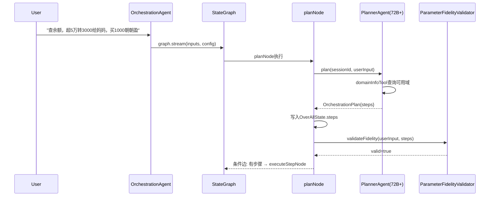

**与Plan A的区别**：规划不是在while-loop外调用PlannerAgent，而是graph内的planNode执行。条件边决定下一步去向。

### 6.2 编排阶段 (Orchestrate) — executeStepNode → 域Agent（Plan B+版）

> **Plan B+核心变化**：原Plan B的executeStepNode是一个L1ToolAdapter节点（动态查找L2子图），
> Plan B+中executeStepNode是StepPreparator（准备输入），然后条件边routeByIntent路由到域ReactAgent节点。

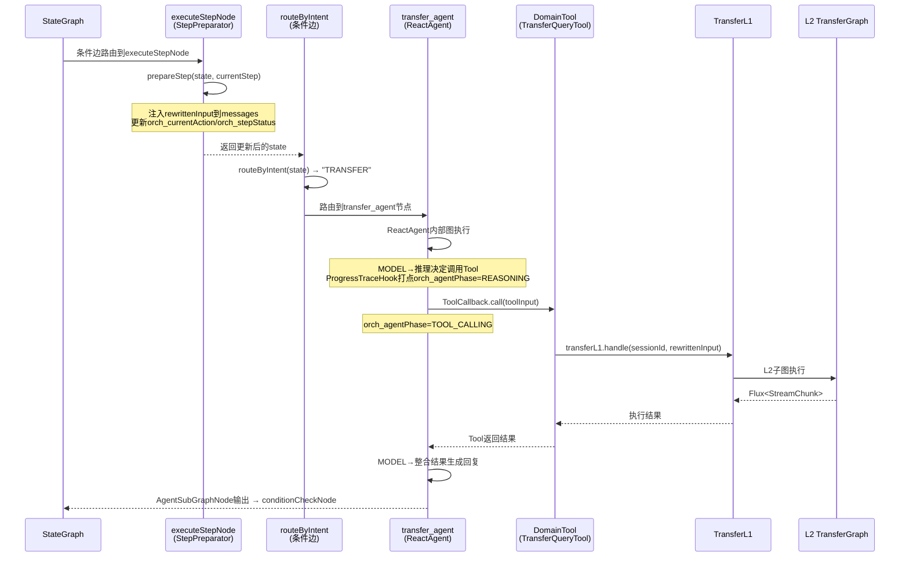

### 6.3 执行阶段 — ReactAgent内部（Plan B+版）

> **Plan B+核心变化**：原Plan B的L2子图在SubCompiledGraphNodeAction内部执行，Plan B+中L2在DomainTool内部通过L1.handle()调用。
> ReactAgent内部有独立的图执行循环（MODEL→TOOL→MODEL），通过InterruptionHook/HITLHook提供中断能力。

```
ReactAgent内部图执行 (AgentSubGraphNode):
  → ReactAgent.initGraph() 构建内部图
  → 内部节点: agentNode(MODEL) → toolNode(TOOL) → agentNode(MODEL) → ...
  → Hooks作为完整对象添加:
    - InterruptionHook (InterruptableAction) → 中断传播
    - HumanInTheLoopHook (InterruptableAction) → HITL审批
    - ProgressTraceHook (自定义Hook) → 可观测性打点
  → 中断触发: InterruptionHook/HITLHook.interrupt() → InterruptionMetadata
  → 中断传播: Flux流 → processGraphResponseFlux → returnFromEmbed → 编排图暂停
  → 流式输出: StreamingOutput自动透传
```

**关键**：ReactAgent内部的InterruptionHook和HITLHook是InterruptableAction完整对象（源码确认），中断通过Flux流自动传播到编排图，与SubCompiledGraphNodeAction的传播路径等价。

### 6.4 中断发生 — 框架原生InterruptionMetadata传播（Plan B+版）

> **源码确认**：中断传播路径与Plan B等价——AgentToSubCompiledGraphNodeAdapter与SubCompiledGraphNodeAction均实现ResumableSubGraphAction，中断均通过Flux流→processGraphResponseFlux→returnFromEmbed→编排图暂停。

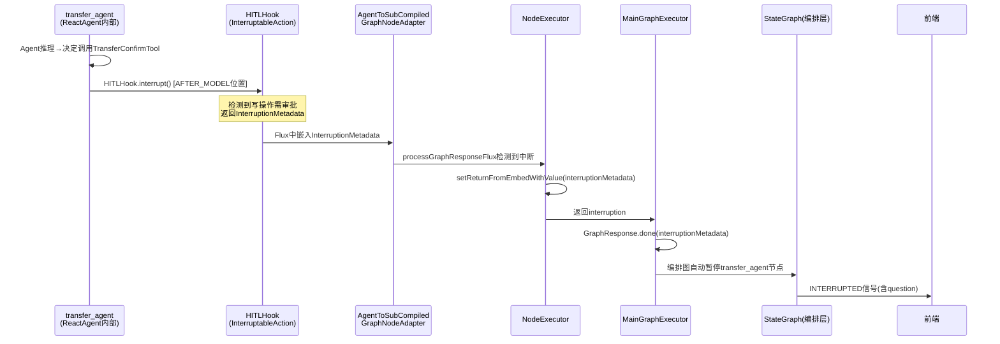

**与Plan B的本质区别**：中断来源从L2的interruptBefore变为ReactAgent内部的HITLHook，但传播路径等价（源码确认）。Plan B+多一层：L2中断需先冒泡到ReactAgent内部图，再冒泡到编排图。

### 6.5 中断恢复阶段 — 框架原生ResumableSubGraphAction（Plan B+版）

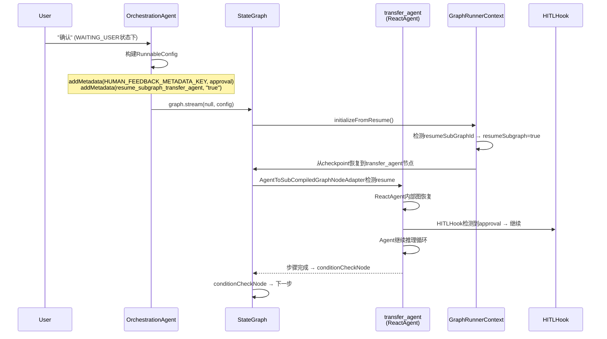

**关键**：Plan B+恢复到ReactAgent节点（如transfer_agent），而非Plan B的executeStepNode。恢复粒度更细（Agent推理轮次级别 vs L2节点级别）。

### 6.6 反思阶段 — 条件边闭环

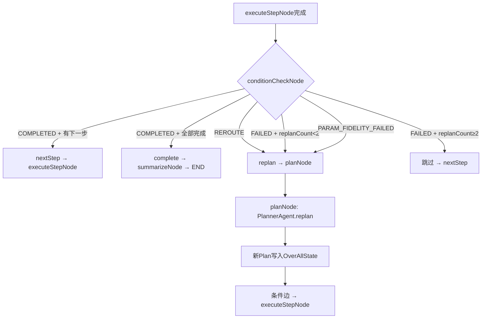

**与Plan A的区别**：REPLAN是graph拓扑的一部分（条件边→planNode），不是代码break。所有状态仍在graph内，不需要重新开始循环。

### 6.7 取消阶段 (Cancel)

```java
private Flux<StreamChunk> cancelOrchestration(String sessionId, OrchestrationState state) {
    // 1. 诚实告知
    String cancelMsg = summary.buildCancelMessage(state);
    
    // 2. 清理域Agent checkpoint
    // Plan B+中ReactAgent节点的checkpoint由框架MemorySaver按threadId+nodeId管理
    // 取消时清除对应Agent节点的checkpoint即可
    for (OrchestrationStep step : state.getSteps()) {
        if (step.getStatus() == StepStatus.RUNNING || step.getStatus() == StepStatus.INTERRUPTED) {
            String agentNodeId = step.getDomain().toLowerCase() + "_agent";
            // 清理该Agent节点的checkpoint（通过MemorySaver）
            // checkpointSaver.remove(sessionId, agentNodeId);
        }
    }
    
    // 3. 清理编排状态
    stateService.cancel(sessionId, state);
    
    return Flux.just(StreamChunk.complete("ORCHESTRATION", cancelMsg));
}
```

### 6.8 Plan B+流程的关键限制（对比Plan A）

| 流程环节 | Plan B+ 限制 | Plan A 对应 |
|---------|-----------|-----------|
| Graph拓扑 | CompiledGraph不可变，路由路径必须预定义 | while-loop可随意添加新分支 |
| 框架依赖 | DomainTool用public API；AgentToSubCompiledGraphNodeAdapter由asNode()封装 | 只依赖ReactAgent(public API) |
| 调试复杂度 | graph执行流调试比while-loop困难，但三层打点缓解 | while-loop是普通Java代码，断点/日志直接 |
| L1绕过 | Phase 1 DomainTool→L1.handle()零迁移；Phase 2可绕过L1 | L1原有handle()直接调用，零迁移 |
| 内部API风险 | AgentToSubCompiledGraphNodeAdapter在internal包，但由asNode()封装不直接调用 | DomainTool只依赖public API |

---

## 7. 流程图 (Mermaid)

### 7.1 主流程状态机 (StateGraph节点)

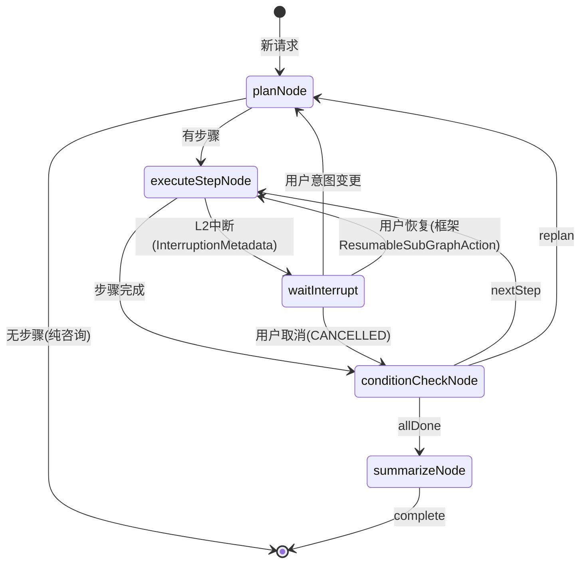

### 7.2 StateGraph拓扑图 (节点+条件边) — Plan B+版

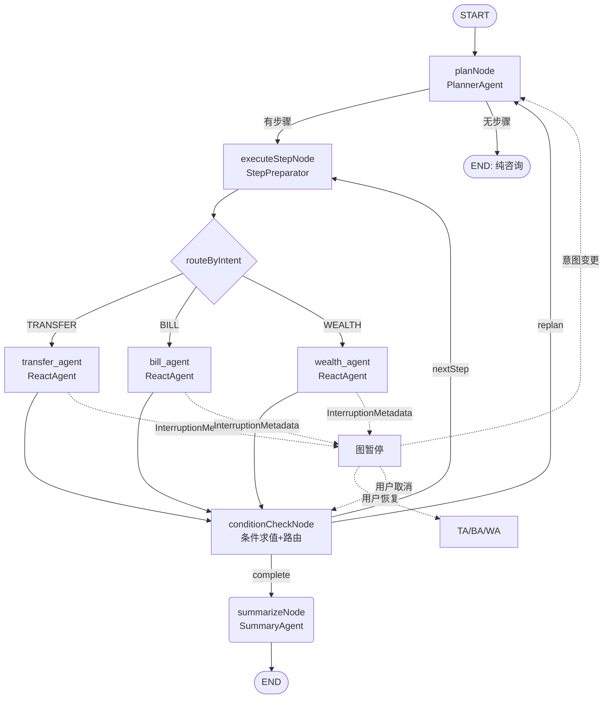

### 7.3 DomainReactAgent内部流程（Plan B+核心）

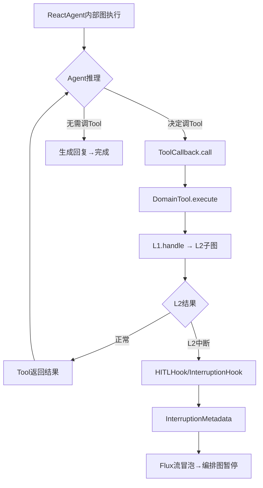

### 7.4 中断传播链时序图（Plan B+版）

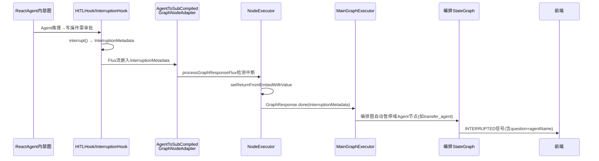

> **源码确认**：此路径与Plan B的SubCompiledGraphNodeAction传播路径等价——两者均通过Flux流→processGraphResponseFlux→returnFromEmbed→编排图暂停。

### 7.5 恢复链时序图（Plan B+版）

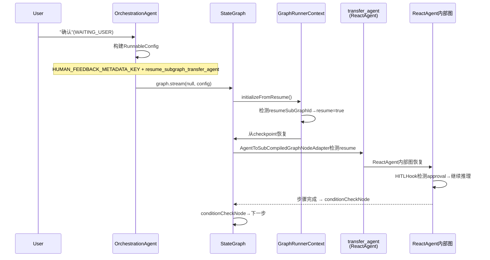

### 7.6 REPLAN流程图 (条件边闭环)

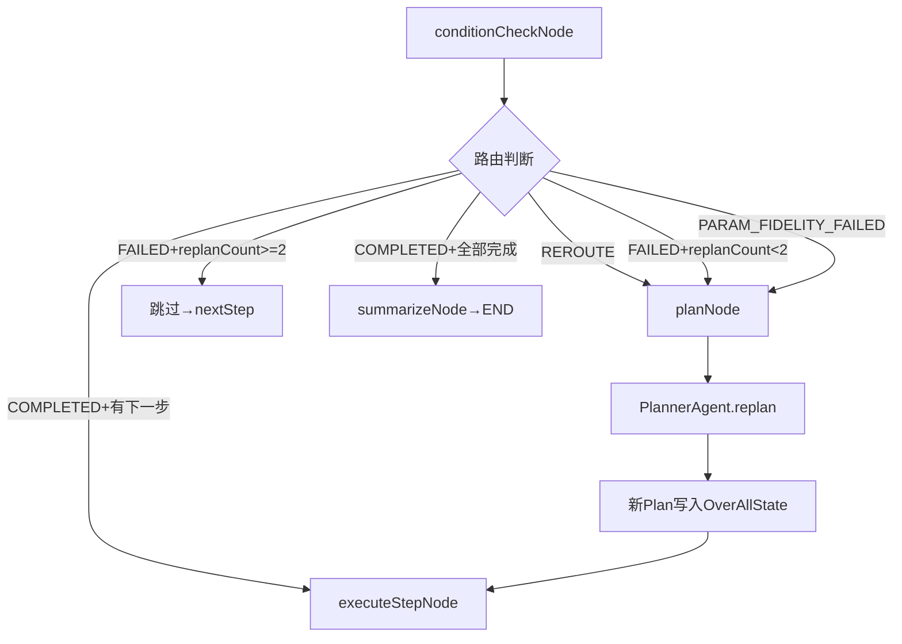

---

## 8. 关键数据结构

> 与v5.1共享大部分数据结构。以下标注Plan B特有修改。

### 8.1 OrchestrationStatus

```java
public enum OrchestrationStatus {
    PLANNING, EXECUTING, WAITING_USER, SUSPENDED, DONE, CANCELLED
}
```

### 8.2 StepStatus — Plan B扩展版

```java
public enum StepStatus {
    PENDING, RUNNING, COMPLETED, INTERRUPTED, SKIPPED, FAILED,
    PARAM_FIDELITY_FAILED,
    // Plan B新增 — 动态变更场景支持(与Plan A相同但实现机制不同)
    POSTPONED,   // 意图顺延 — conditional edge自动跳过，自然轮到时执行
    CANCELLED    // 意图跳转/取消 — conditional edge路由到nextStep或planNode
}
```

### 8.3 OrchestrationStep — Plan B扩展版

```java
@Data
public class OrchestrationStep implements Serializable {
    private int index;
    private String domain;
    private String intent;
    private String description;
    private String rewrittenInput;
    private String condition;
    private StepStatus status;
    // Plan B新增
    private StepType type;              // EXECUTE / CLARIFY
    private String question;            // CLARIFY提问内容
    private List<String> options;       // CLARIFY选项
    private String dependsOnStepIndex;  // 前置依赖
    private String cancelReason;        // CANCELLED原因
    private String nodeId;              // 对应的graph nodeId (如"step_0")
}
```

### 8.4 OverAllState适配 — Plan B核心

```java
/**
 * Plan B的编排状态存储在StateGraph的OverAllState中
 * key策略: messages(AppendStrategy) + 自定义key
 */
// OverAllState中存储编排相关数据的key定义
public class OrchestrationStateKeys {
    public static final String STEPS = "orch_steps";               // List<OrchestrationStep>
    public static final String CURRENT_STEP_INDEX = "orch_currentStepIndex"; // int
    public static final String STEP_RESULTS = "orch_stepResults";   // Map<Integer,StepResult>
    public static final String ORIGINAL_REQUEST = "orch_originalRequest"; // String
    public static final String LATEST_USER_INPUT = "orch_latestUserInput";     // String — 项目自定义key，非框架标准
    public static final String ORCH_STATUS = "orch_status";         // OrchestrationStatus
    public static final String REPLAN_COUNT = "orch_replanCount";   // int
    public static final String WAITING_QUESTION = "orch_waitingQuestion"; // String
    public static final String INTERRUPTION_REASON = "orch_interruptionReason"; // String

    // 可观测性字段（§12三层打点架构 Layer 2）
    public static final String CURRENT_ACTION = "orch_currentAction";     // String — 业务语义描述
    public static final String NEXT_ACTION = "orch_nextAction";           // String — 下一步描述
    public static final String STEP_STATUS = "orch_stepStatus";           // StepStatus枚举
    public static final String AGENT_PHASE = "orch_agentPhase";           // String — Agent当前阶段
    public static final String AGENT_NAME = "orch_agentName";             // String — 当前Agent名
    public static final String CURRENT_TOOL_CALLS = "orch_currentToolCalls"; // String — Agent正在调用的Tool
}
```

### 8.5 StepPreparator — 执行步骤准备（Plan B+新增）

> **Plan B+变更**：原Plan B的StateMapper负责编排状态↔L2状态映射（`toL2State`/`fromL2Result`），
> Plan B+中ReactAgent节点直接读取OverAllState的`messages`，无需L2状态映射。
> StepPreparator的职责简化为：**将当前步骤的rewrittenInput注入OverAllState**，供ReactAgent节点消费。

```java
/**
 * Plan B+的步骤准备器 — 将当前步骤信息注入OverAllState
 * ReactAgent.asNode()会自动读取messages，无需手动映射L2状态
 */
public class StepPreparator {

    /**
     * 为ReactAgent节点准备输入
     * 核心操作：将rewrittenInput作为用户消息追加到messages
     * 同时更新可观测性字段
     */
    public Map<String, Object> prepareStep(OverAllState state, OrchestrationStep step) {
        Map<String, Object> updates = new HashMap<>();

        // 1. 注入rewrittenInput为用户消息 — ReactAgent通过messages读取
        updates.put("messages", List.of(
            Map.of("role", "user", "content", step.getRewrittenInput())
        ));

        // 2. 更新可观测性字段（§12 Layer 2）
        updates.put(OrchestrationStateKeys.CURRENT_STEP_INDEX, step.getIndex());
        updates.put(OrchestrationStateKeys.CURRENT_ACTION, describeStep(step));
        updates.put(OrchestrationStateKeys.STEP_STATUS, StepStatus.RUNNING.name());
        updates.put(OrchestrationStateKeys.AGENT_NAME, step.getDomain() + "_agent");
        updates.put(OrchestrationStateKeys.AGENT_PHASE, "REASONING");
        updates.put(OrchestrationStateKeys.NEXT_ACTION, describeNextStep(state, step));

        return updates;
    }

    private String describeStep(OrchestrationStep step) {
        return step.getIntent() + "→" + step.getDescription();
        // 示例: "TRANSFER→查询收款人信息"
    }

    private String describeNextStep(OverAllState state, OrchestrationStep current) {
        List<OrchestrationStep> steps = (List<OrchestrationStep>)
            state.value(OrchestrationStateKeys.STEPS, List.of());
        int nextIdx = current.getIndex() + 1;
        if (nextIdx < steps.size()) {
            OrchestrationStep next = steps.get(nextIdx);
            return next.getIntent() + "→" + next.getDescription();
        }
        return "无（最后一步）";
    }
}
```

> **与原Plan B StateMapper的关键区别**（⚠️仅供参考，只实现StepPreparator）：
> | 维度 | 原Plan B StateMapper(❌) | Plan B+ StepPreparator(✅) |
> |------|-------------------|----------------------|
> | 方向 | 双向（编排↔L2） | 单向（编排→ReactAgent输入） |
> | 输出 | 新的L2 OverAllState | 更新编排图的OverAllState |
> | L2状态感知 | 需要知道L2的key命名 | 无需感知L2内部结构 |
> | 结果提取 | `fromL2Result()`解析L2输出 | ReactAgent输出直接由框架处理 |

### 8.6 DomainToolInput（Plan B+新增）

```java
/**
 * DomainTool的输入参数 — Plan B+中ReactAgent通过ToolCallback调用DomainTool时传入
 * 对比原Plan B的L1ToolInput：L1ToolInput是原Plan B L1ToolAdapter的内部数据，
 * DomainToolInput是ReactAgent可见的Tool参数（JSON Schema描述）
 */
@Data
public class DomainToolInput {
    private String intent;          // L2子图标识（如"TRANSFER_QUERY"）
    private String rewrittenInput;  // 自包含输入（Agent构造）
    private String sessionId;       // 会话ID（从context获取）
    private Map<String, Object> params;  // 结构化参数（金额、账号等）
}
```

> **DomainToolInput vs L1ToolInput**：
> - L1ToolInput是Plan B的L1ToolAdapter内部数据，对ReactAgent不可见
> - DomainToolInput是ReactAgent通过Tool调用传入的参数，ReactAgent感知并构造
> - 这意味着ReactAgent知道自己在调用哪个域的Tool，可以更好地做上下文判断

### 8.7 AgentResultExtractor（Plan B+替代L2ResultExtractor）

```java
/**
 * Plan B+: 从ReactAgent节点的GraphResponse中提取StepResult
 * ReactAgent.asNode()输出的NodeOutput包含Agent的最终回复
 * 中断信息通过InterruptionMetadata在Flux流中传播，不在此处提取
 */
public class AgentResultExtractor {

    /**
     * 从ReactAgent节点的GraphResponse提取StepResult
     *
     * 关键区别vs Plan B L2ResultExtractor:
     * - Plan B: 解析L2子图的orch_outputContent/orch_interruptQuestion（项目自定义key）
     * - Plan B+: ReactAgent的输出在messages最后一条AssistantMessage中
     *   中断由框架InterruptionHook/HITLHook处理，通过Flux流自动冒泡到编排图
     */
    public static StepResult extract(GraphResponse<NodeOutput> response, String nodeId) {
        NodeOutput output = response.output();
        OverAllState agentState = output.getState();

        // ReactAgent的输出在messages中
        List<Message> messages = (List<Message>) agentState.value("messages").orElse(List.of());
        String content = extractLastAssistantContent(messages);

        // 检查中断 — Plan B+中ReactAgent内部HITLHook触发时，
        // InterruptionMetadata会通过Flux流冒泡，graph会自动暂停
        // 此处只需检查是否被标记为INTERRUPTED（由GraphLifecycleListener或条件边写入）
        String stepStatus = (String) agentState.value(OrchestrationStateKeys.STEP_STATUS, "COMPLETED");
        if ("INTERRUPTED".equals(stepStatus)) {
            String question = (String) agentState.value(OrchestrationStateKeys.WAITING_QUESTION, "");
            return StepResult.interrupted(question);
        }

        return StepResult.completed(content);
    }

    private static String extractLastAssistantContent(List<Message> messages) {
        // 倒序查找最后一条AssistantMessage
        for (int i = messages.size() - 1; i >= 0; i--) {
            Message msg = messages.get(i);
            if (msg instanceof AssistantMessage am) {
                return am.getContent();
            }
        }
        return "";
    }
}
```

> **Plan B+结果提取的关键变化**：
> | 维度 | Plan B L2ResultExtractor | Plan B+ AgentResultExtractor |
> |------|-------------------------|---------------------------|
> | 数据源 | L2子图的`orch_outputContent`（项目自定义key） | ReactAgent的messages（框架标准key） |
> | 中断检测 | 检查`orch_interruptQuestion` | 检查`orch_stepStatus`（由框架中断冒泡后写入） |
> | L2感知 | 需要知道L2的key命名约定 | 不感知L2内部结构，只读ReactAgent输出 |
> | 中断传播 | 手动解析InterruptionMetadata | 框架Flux流自动冒泡，代码无需处理 |

---

## 9. 关键代码

### 9.1 OrchestrationAgent.handle() — 主入口（Plan B+版）

```java
@Slf4j
public class OrchestrationAgent implements DomainHandler {
    private final CompiledGraph orchestrationGraph;
    private final OrchestrationStateService stateService;
    private final OrchestrationRelevance relevance;

    @Override
    public Flux<StreamChunk> handle(String sessionId, String userInput) {
        OrchestrationState state = stateService.getOrCheckExpired(sessionId);

        // [G1 FIX] EXECUTING状态不再拒绝输入，而是写入OverAllState供意图变更检测
        // 原设计返回"请稍后再试"导致用户打岔信号丢失——这是5大意图场景的共同阻断缺陷
        // Plan B+: ReactAgent节点内部的InterruptionHook在每个推理轮次前检查是否有新输入
        //         意图变更通过ReactAgent.interrupt()触发InterruptionMetadata→编排图自动暂停
        if (state != null && state.getStatus() == OrchestrationStatus.EXECUTING) {
            stateService.enqueuePendingInput(sessionId, userInput);
            return Flux.just(StreamChunk.chunk("ORCHESTRATION",
                "收到您的消息，当前步骤完成后将处理。"));
        }
        if (state != null && state.getStatus() == OrchestrationStatus.WAITING_USER) {
            return resumeOrchestration(sessionId, userInput, state);
        }
        if (state != null && state.getStatus() == OrchestrationStatus.SUSPENDED) {
            return handleSuspendedOrchestration(sessionId, userInput, state);
        }
        return startOrchestration(sessionId, userInput);
    }

    private Flux<StreamChunk> startOrchestration(String sessionId, String userInput) {
        Map<String, Object> inputs = Map.of(
            "input", userInput,
            OrchestrationStateKeys.ORIGINAL_REQUEST, userInput,
            OrchestrationStateKeys.LATEST_USER_INPUT, userInput
        );
        RunnableConfig config = RunnableConfig.builder().threadId(sessionId).build();
        return orchestrationGraph.stream(inputs, config)
            .map(this::graphResponseToStreamChunk)
            .filter(Objects::nonNull);
    }

    private Flux<StreamChunk> resumeOrchestration(String sessionId, String userInput,
                                                    OrchestrationState state) {
        if (relevance.isCancellationIntent(userInput)) {
            stateService.cancel(sessionId, state);
            return startOrchestration(sessionId, userInput);
        }
        if (!relevance.isRelevant(userInput, state.getWaitingQuestion())) {
            stateService.casTransition(sessionId, state, WAITING_USER, SUSPENDED);
            return startOrchestration(sessionId, userInput);
        }

        // Plan B+: 构建恢复配置 — 框架原生ResumableSubGraphAction
        // ReactAgent.asNode()返回的AgentSubGraphNode实现ResumableSubGraphAction
        // 恢复时：GraphRunnerContext.initializeFromResume() → 从checkpoint恢复 → Agent继续推理
        String currentStepNodeId = determineCurrentAgentNodeId(state);
        RunnableConfig config = RunnableConfig.builder()
            .threadId(sessionId)
            .addMetadata(HUMAN_FEEDBACK_METADATA_KEY,
                InterruptionMetadata.builder()
                    .metadata(Map.of("approved", true, "feedback", userInput))
                    .build())
            .addMetadata(getResumeSubGraphId(currentStepNodeId), "true")
            .build();

        return orchestrationGraph.stream(null, config)
            .map(this::graphResponseToStreamChunk)
            .filter(Objects::nonNull);
    }

    /**
     * Plan B+: 根据当前步骤确定ReactAgent节点ID
     * ReactAgent节点命名规则: {domain}_agent (如 transfer_agent, bill_agent, wealth_agent)
     */
    private String determineCurrentAgentNodeId(OrchestrationState state) {
        int stepIndex = state.getWaitingForStepIndex();
        OrchestrationStep step = state.getSteps().get(stepIndex);
        return step.getDomain().toLowerCase() + "_agent";
    }

    private StreamChunk graphResponseToStreamChunk(GraphResponse response) {
        // [G3 FIX] 明确状态读取来源：所有状态统一从OverAllState读取
        // OverAllState是StateGraph的唯一状态源，OrchestrationState仅用于外部API兼容
        // 同步规则：stateService负责OrchestrationState ↔ OverAllState的双向同步
        if (response.isDone()) {
            return StreamChunk.complete("ORCHESTRATION",
                (String) response.output().getState().value("orch_outputContent", ""));
        }
        if (response.getState().value(OrchestrationStateKeys.INTERRUPTION_REASON, "") != null) {
            return StreamChunk.interrupted("ORCHESTRATION",
                response.getState().value(OrchestrationStateKeys.WAITING_QUESTION, ""));
        }
        // [ADR-1修正] 非透明透传——GraphResponse需显式映射为StreamChunk
        return StreamChunk.chunk("ORCHESTRATION",
            response.output().toString());
    }

    @Override
    public String getDomainName() { return "编排"; }
}
```

### 9.2 OrchestrationGraphConfig — StateGraph构建（Plan B+版）

> **Plan B+核心变化**：不再使用L1ToolAdapter作为executeStepNode，而是：
> 1. `executeStepNode`是普通节点（StepPreparator准备输入 + 条件边路由到域Agent）
> 2. 每个业务域的ReactAgent作为独立节点，通过`ReactAgent.asNode()`注册
> 3. 条件边`routeByIntent`根据当前步骤的domain路由到对应Agent节点
> 4. Agent节点完成后统一回到conditionCheckNode

```java
@Configuration
public class OrchestrationGraphConfig {

    @Bean
    public CompiledGraph orchestrationGraph(
            StepPreparator stepPreparator,
            OrchestrationCondition condition,
            ParameterFidelityValidator fidelityValidator,
            @Qualifier("plannerAgent") ReactAgent plannerAgent,
            @Qualifier("summaryAgent") ReactAgent summaryAgent,
            @Qualifier("transferAgent") ReactAgent transferAgent,
            @Qualifier("billAgent") ReactAgent billAgent,
            @Qualifier("wealthAgent") ReactAgent wealthAgent) throws GraphStateException {

        KeyStrategyFactory keyStrategyFactory = () -> {
            HashMap<String, KeyStrategy> strategies = new HashMap<>();
            strategies.put("messages", new AppendStrategy());
            strategies.put("orch_plan", new ReplaceStrategy());
            strategies.put("orch_currentStepIndex", new ReplaceStrategy());
            strategies.put("orch_currentAction", new ReplaceStrategy());
            strategies.put("orch_nextAction", new ReplaceStrategy());
            strategies.put("orch_stepStatus", new ReplaceStrategy());
            strategies.put("orch_agentPhase", new ReplaceStrategy());
            strategies.put("orch_agentName", new ReplaceStrategy());
            strategies.put("orch_currentToolCalls", new ReplaceStrategy());
            strategies.put("transfer_result", new ReplaceStrategy());
            strategies.put("bill_result", new ReplaceStrategy());
            strategies.put("wealth_result", new ReplaceStrategy());
            return strategies;
        };

        StateGraph graph = new StateGraph("orchestration", keyStrategyFactory);

        // 编排控制节点
        graph.addNode("planNode", plannerAgent.asNode(true, false));
        graph.addNode("executeStepNode", node_async(stepPreparator::prepareStep));
        graph.addNode("conditionCheckNode", node_async(condition::checkAndRoute));
        graph.addNode("summarizeNode", summaryAgent.asNode(true, false));

        // 领域ReactAgent节点 — Plan B+核心！
        // ReactAgent.asNode()返回AgentSubGraphNode，框架自动处理:
        //   - Agent推理循环(MODEL→TOOL→MODEL)
        //   - 中断传播(InterruptionHook/HITLHook → InterruptionMetadata → 编排图暂停)
        //   - 恢复(ResumableSubGraphAction → GraphRunnerContext.initializeFromResume)
        graph.addNode("transfer_agent", transferAgent.asNode(true, false));
        graph.addNode("bill_agent", billAgent.asNode(true, false));
        graph.addNode("wealth_agent", wealthAgent.asNode(true, false));

        // 边定义
        graph.addEdge(START, "planNode");
        graph.addConditionalEdges("planNode", this::routeAfterPlan,
            Map.of("execute", "executeStepNode", "end", END));

        // executeStepNode → 按intent路由到对应Agent
        graph.addConditionalEdges("executeStepNode", this::routeByIntent,
            Map.of("TRANSFER", "transfer_agent",
                   "BILL", "bill_agent",
                   "WEALTH", "wealth_agent"));

        // 所有Agent节点完成后 → 统一回到conditionCheckNode
        graph.addEdge("transfer_agent", "conditionCheckNode");
        graph.addEdge("bill_agent", "conditionCheckNode");
        graph.addEdge("wealth_agent", "conditionCheckNode");

        graph.addConditionalEdges("conditionCheckNode", this::routeAfterCondition,
            Map.of("nextStep", "executeStepNode",
                   "replan", "planNode",
                   "complete", "summarizeNode"));
        graph.addEdge("summarizeNode", END);

        return graph.compile(CompileConfig.builder()
            .saver(new MemorySaver())  // checkpoint持久化
            .build());
    }

    private String routeAfterPlan(OverAllState state) {
        List<OrchestrationStep> steps = (List<OrchestrationStep>)
            state.value(OrchestrationStateKeys.STEPS, List.of());
        return steps.isEmpty() ? "end" : "execute";
    }

    /**
     * Plan B+核心路由：根据当前步骤的domain路由到对应ReactAgent节点
     * 对比Plan B: Plan B在L1ToolAdapter.apply()中动态查找L2子图
     * Plan B+: 条件边声明式路由，每个域是显式节点——更清晰、更可调试
     */
    private String routeByIntent(OverAllState state) {
        int currentIndex = state.value(OrchestrationStateKeys.CURRENT_STEP_INDEX, 0);
        List<OrchestrationStep> steps = (List<OrchestrationStep>)
            state.value(OrchestrationStateKeys.STEPS, List.of());
        if (currentIndex >= steps.size()) return "BILL"; // fallback
        OrchestrationStep step = steps.get(currentIndex);
        return step.getDomain(); // "TRANSFER" / "BILL" / "WEALTH"
    }

    private String routeAfterCondition(OverAllState state) {
        int currentIdx = state.value(OrchestrationStateKeys.CURRENT_STEP_INDEX, 0);
        List<OrchestrationStep> steps = (List<OrchestrationStep>)
            state.value(OrchestrationStateKeys.STEPS, List.of());

        // 检查REPLAN信号
        String reroute = state.value("_rerouteSignal", "");
        if (!reroute.isEmpty()) return "replan";

        // 检查是否全部完成
        long pending = steps.stream()
            .filter(s -> s.getStatus() == StepStatus.PENDING)
            .count();
        if (pending == 0) return "complete";

        return "nextStep";
    }
}
```

> **原Plan B vs Plan B+ 图结构对比**（⚠️仅供参考，只实现Plan B+列）：
> | 维度 | 原Plan B(❌不实现) | Plan B+(✅实现此列) |
> |------|-------------------|-------------------|
> | 域执行节点 | 1个L1ToolAdapter节点（动态路由L2） | N个ReactAgent节点（声明式条件边路由） |
> | 路由时机 | L1ToolAdapter.apply()运行时查找 | 编排图条件边编译时确定 |
> | 新增域 | 修改L1ToolAdapter + 注册L2 | 添加ReactAgent节点 + 添加条件边映射 |
> | 中断处理 | L1ToolAdapter实现InterruptableAction | ReactAgent内部InterruptionHook/HITLHook |
> | 可观测性 | L1ToolAdapter内部日志 | ReactAgent节点级GraphLifecycleListener + ProgressTraceHook |

### 9.3 DomainReactAgent + DomainTool — Plan B+核心

> **Plan B+核心变化**：L1ToolAdapter（implements InterruptableAction）被两个角色替代：
> 1. **DomainReactAgent** — 每域一个ReactAgent，配置该域的DomainTools + ProgressTraceHook
> 2. **DomainTool** — 封装L2子图调用的ToolCallback，ReactAgent通过Tool间接调用L2
>
> 中断能力来源变化：
> - Plan B: L1ToolAdapter.interrupt()检查pending input + CLARIFY场景
> - Plan B+: ReactAgent内部的InterruptionHook（源码确认是InterruptableAction）+ HITLHook
> - 意图变更检测：Plan B+中通过ReactAgent.interrupt()设置INTERRUPTION_FEEDBACK_KEY

```java
// ========== DomainReactAgent定义（详见§5.4，此处为关键代码） ==========

/**
 * 转账域ReactAgent — Plan B+中每个业务域一个
 * 关键配置：DomainTools + ProgressTraceHook + InterruptionHook
 */
@Bean("transferAgent")
public ReactAgent transferAgent(
        @Qualifier("orchModel") ChatModel model,
        List<DomainTool> transferTools,  // 该域的DomainTools
        ProgressTraceHook progressTraceHook) {
    return ReactAgent.builder()
        .name("transfer_agent")
        .model(model)
        .tools(transferTools)                    // DomainTools封装L2
        .hooks(List.of(progressTraceHook))        // 可观测性Hook
        .instruction(TRANSFER_AGENT_INSTRUCTION)  // 领域指令
        .build();
}

// ========== DomainTool封装L2（详见§5.4，此处为关键代码） ==========

/**
 * 转账查询DomainTool — 封装TRANSFER_QUERY L2子图
 * ReactAgent通过ToolCallback.invoke()调用，DomainTool内部调用L1/L2
 *
 * 中断能力：L2内部的HITLHook触发InterruptionMetadata，
 * 通过ReactAgent内部图→Flux流→编排图自动冒泡（源码确认路径见附录）
 */
@Component
public class TransferQueryTool implements ToolCallback {
    private final DomainHandler transferL1;  // L1域服务
    private final ObjectMapper objectMapper;

    @Override
    public String getName() { return "transfer_query"; }

    @Override
    public String getDescription() {
        return "查询转账相关信息，包括收款人、限额等";
    }

    @Override
    public String call(String toolInput) {
        DomainToolInput input = objectMapper.readValue(toolInput, DomainToolInput.class);
        // Phase 1: 通过L1.handle()调用，保持L1在路径中
        // Phase 2: 可直接调用L2 CompiledGraph
        Flux<StreamChunk> result = transferL1.handle(input.getSessionId(), input.getRewrittenInput());
        return result.blockLast().getContent();
    }
}

/**
 * 转账确认DomainTool — 封装TRANSFER_CONFIRM L2子图
 * 此L2有HITL需求，用户需确认转账金额/收款人
 */
@Component
public class TransferConfirmTool implements ToolCallback {
    private final DomainHandler transferL1;

    @Override
    public String getName() { return "transfer_confirm"; }

    @Override
    public String getDescription() {
        return "确认并执行转账操作，需要用户确认";
    }

    @Override
    public String call(String toolInput) {
        DomainToolInput input = objectMapper.readValue(toolInput, DomainToolInput.class);
        // L2内部的HITLHook会在需要确认时触发InterruptionMetadata
        // ReactAgent内部图自动暂停 → 编排图自动暂停（源码确认的Flux冒泡路径）
        Flux<StreamChunk> result = transferL1.handle(input.getSessionId(), input.getRewrittenInput());
        return result.blockLast().getContent();
    }
}
```

> **Plan B+中断机制对比原Plan B L1ToolAdapter**（⚠️仅供参考，只实现Plan B+列）：
>
> | 维度 | 原Plan B L1ToolAdapter(❌) | Plan B+ DomainReactAgent + DomainTool(✅) |
> |------|---------------------|--------------------------------------|
> | 中断实现 | L1ToolAdapter.interrupt()（手动检查） | ReactAgent内部InterruptionHook/HITLHook（框架自动） |
> | 意图变更检测 | interrupt()检查`_pendingInput` | ReactAgent.interrupt()设置INTERRUPTION_FEEDBACK_KEY |
> | CLARIFY中断 | interrupt()检查step.type | Agent instruction引导提问，HITLHook等待确认 |
> | 中断传播 | InterruptionMetadata手动构建 | Flux流自动冒泡（见附录中断链路图） |
> | 恢复 | L2.updateState + L2.stream | ResumableSubGraphAction → GraphRunnerContext.initializeFromResume |
> | 超时保护 | L1ToolAdapter.apply()内30s超时 | 需在DomainTool.call()中添加超时 |

> **⚠️ Plan B+超时保护注意**：
> DomainTool.call()中`result.blockLast()`是同步阻塞的，需添加超时：
> ```java
> return result.blockLast(Duration.ofSeconds(30)); // 30s超时
> ```
> 超时后抛出IllegalStateException，ReactAgent会将其作为Tool执行失败处理，
> 可在Agent instruction中引导Agent告知用户并尝试替代方案。

### 9.4 resumeOrchestration() — 框架原生恢复（Plan B+版）

见§9.1中的resumeOrchestration方法。关键点：

**Plan B+恢复链路**（源码确认，详见附录）：
1. 构建RunnableConfig携带`HUMAN_FEEDBACK_METADATA_KEY` + `resumeSubGraphId`
2. `graph.stream(null, config)` → `GraphRunnerContext.initializeFromResume()` → 自动从checkpoint恢复
3. 编排图恢复到ReactAgent节点（如`transfer_agent`）的暂停点
4. ReactAgent内部：`AgentToSubCompiledGraphNodeAdapter`检测resume标记 → 恢复Agent内部图
5. Agent内部图从InterruptionHook/HITLHook暂停处继续推理

> **原Plan B vs Plan B+恢复路径对比**（⚠️仅供参考，只实现Plan B+列）：
> | 步骤 | 原Plan B(❌) | Plan B+(✅) |
> |------|--------|---------|
> | 恢复入口 | L1ToolAdapter（executeStepNode） | ReactAgent节点（如transfer_agent） |
> | 子图恢复 | SubCompiledGraphNodeAction → L2.updateState | AgentToSubCompiledGraphNodeAdapter → Agent内部图恢复 |
> | L2感知 | 直接操作L2 CompiledGraph | 不感知L2，由ReactAgent内部图自动处理 |
> | 恢复精度 | L2中断节点级别 | Agent推理轮次级别（更细粒度） |

> **[Librarian FIX] 实际resume机制细节**：
> - `initializeFromResume()`由`HUMAN_FEEDBACK_METADATA_KEY`或`checkPointId`存在自动触发，非手动调用
> - resume元数据key是节点特定的`resume_subgraph_{nodeId}`（通过`ResumableSubGraphAction.resumeSubGraphId(nodeId)`）
> - Plan B+: nodeId不再是`step_0`而是`transfer_agent`/`bill_agent`/`wealth_agent`

### 9.5 [G3] OrchestrationState ↔ OverAllState 双向同步

> **问题**：handle()读取OrchestrationState（外部API），StateGraph操作OverAllState（框架内部）。
> 两套状态模型不连通——谁是真的数据源？
>
> **解决方案**：OverAllState是**唯一真源**（Single Source of Truth），OrchestrationState是**外部视图**。

```java
@Component
public class OrchestrationStateBridge {
    private final OrchestrationStateService stateService;
    
    /** 从OverAllState同步到OrchestrationState（graph执行后调用） */
    public void syncFromGraph(String sessionId, OverAllState graphState) {
        OrchestrationState view = stateService.getOrCheckExpired(sessionId);
        if (view == null) return;
        
        // 单向同步：OverAllState → OrchestrationState
        view.setStatus(mapStatus(graphState));
        view.setCurrentStepIndex(graphState.value("orch_currentStepIndex", 0));
        view.setWaitingQuestion(graphState.value("orch_waitingQuestion", null));
        view.setWaitingForStepIndex(graphState.value("orch_waitingStepIndex", -1));

        // Plan B+: 同步可观测性字段
        view.setCurrentAction(graphState.value("orch_currentAction", ""));
        view.setNextAction(graphState.value("orch_nextAction", ""));
        view.setAgentPhase(graphState.value("orch_agentPhase", ""));
        view.setAgentName(graphState.value("orch_agentName", ""));

        stateService.saveState(sessionId, view);
    }
    
    /** 将pending input写入pendingInput队列（handle() EXECUTING期间调用） */
    public void injectPendingInput(String sessionId, String userInput) {
        // 通过stateService维护一个session-scoped pendingInput队列
        // Plan B+: ReactAgent.interrupt()在每个推理轮次前检查是否有新输入
        // 对比Plan B: L1ToolAdapter.interrupt()在step boundary检查此队列
        stateService.enqueuePendingInput(sessionId, userInput);
    }
}
```

**同步时机**：
1. `graphResponseToStreamChunk()`每次收到GraphResponse → `syncFromGraph()`
2. `handle()` EXECUTING分支 → `injectPendingInput()`（不直接写OverAllState，因为graph正在运行）
3. `resumeOrchestration()` → 通过RunnableConfig.metadata传递（框架机制）

### 9.5b cancelOrchestration() — 取消（Plan B+版）

```java
private Flux<StreamChunk> cancelOrchestration(String sessionId, OrchestrationState state) {
    List<String> irreversibleSteps = state.getStepResults().entrySet().stream()
        .filter(e -> e.getValue().getStatus() == StepStatus.COMPLETED)
        .filter(e -> isWriteOperation(state.getSteps().get(e.getKey())))
        .map(e -> state.getSteps().get(e.getKey()).getDescription())
        .toList();

    String cancelMsg = irreversibleSteps.isEmpty() ? "已取消当前操作。"
        : String.format("已取消后续操作。请注意：已执行的%s无法撤回，如需撤回请联系客服。",
            String.join("、", irreversibleSteps));

    // Plan B+: 清理ReactAgent节点的checkpoint（而非L2子图checkpoint）
    // ReactAgent.asNode()的节点ID规则: {domain}_agent
    for (OrchestrationStep step : state.getSteps()) {
        if (step.getStatus() == StepStatus.RUNNING || step.getStatus() == StepStatus.INTERRUPTED) {
            String agentNodeId = step.getDomain().toLowerCase() + "_agent";
            // 框架的MemorySaver会按threadId+nodeId管理checkpoint
            // 取消时清除对应Agent节点的checkpoint即可
            // 对比Plan B: 直接操作L2 CompiledGraph.updateState()
        }
    }
    stateService.cancel(sessionId, state);
    return Flux.just(StreamChunk.complete("ORCHESTRATION", cancelMsg));
}
```

### 9.6 OrchAgentConfig — Spring Bean配置（Plan B+版）

> **Plan B+核心变化**：
> - 移除L1ToolAdapter、SubGraphRegistry、StateMapper Bean
> - 新增DomainReactAgent Bean（每域一个）、DomainTool Bean（每L2能力一个）、StepPreparator Bean
> - 新增ProgressTraceHook Bean（可观测性）

```java
@Configuration
public class OrchAgentConfig {

    // ===== 编排辅助Bean =====

    @Bean
    public StepPreparator stepPreparator() {
        return new StepPreparator();
    }

    @Bean
    public ProgressTraceHook progressTraceHook() {
        return new ProgressTraceHook();
    }

    // ===== PlannerAgent =====

    @Bean
    public ReactAgent plannerAgent(@Qualifier("orchPlannerModel") ChatModel model) {
        return ReactAgent.builder()
            .name("PlannerAgent").model(model)
            .outputType(OrchestrationPlan.class)
            .tools(List.of(domainInfoTool()))
            .instruction(PLANNER_INSTRUCTION).build();
    }

    // ===== DomainReactAgent — Plan B+核心 =====

    @Bean("transferAgent")
    public ReactAgent transferAgent(
            @Qualifier("orchModel") ChatModel model,
            @Qualifier("transferQueryTool") DomainTool transferQueryTool,
            @Qualifier("transferConfirmTool") DomainTool transferConfirmTool,
            ProgressTraceHook progressTraceHook) {
        return ReactAgent.builder()
            .name("transfer_agent").model(model)
            .tools(List.of(transferQueryTool, transferConfirmTool))
            .hooks(List.of(progressTraceHook))
            .instruction(TRANSFER_AGENT_INSTRUCTION).build();
    }

    @Bean("billAgent")
    public ReactAgent billAgent(
            @Qualifier("orchModel") ChatModel model,
            @Qualifier("billQueryTool") DomainTool billQueryTool,
            ProgressTraceHook progressTraceHook) {
        return ReactAgent.builder()
            .name("bill_agent").model(model)
            .tools(List.of(billQueryTool))
            .hooks(List.of(progressTraceHook))
            .instruction(BILL_AGENT_INSTRUCTION).build();
    }

    @Bean("wealthAgent")
    public ReactAgent wealthAgent(
            @Qualifier("orchModel") ChatModel model,
            @Qualifier("wealthConsultTool") DomainTool wealthConsultTool,
            @Qualifier("wealthInterpretTool") DomainTool wealthInterpretTool,
            @Qualifier("wealthPurchaseTool") DomainTool wealthPurchaseTool,
            ProgressTraceHook progressTraceHook) {
        return ReactAgent.builder()
            .name("wealth_agent").model(model)
            .tools(List.of(wealthConsultTool, wealthInterpretTool, wealthPurchaseTool))
            .hooks(List.of(progressTraceHook))
            .instruction(WEALTH_AGENT_INSTRUCTION).build();
    }

    // ===== DomainTools — 封装L2 =====

    @Bean("transferQueryTool")
    public DomainTool transferQueryTool(DomainHandler transferL1) {
        return new TransferQueryTool(transferL1);
    }

    @Bean("transferConfirmTool")
    public DomainTool transferConfirmTool(DomainHandler transferL1) {
        return new TransferConfirmTool(transferL1);
    }

    @Bean("billQueryTool")
    public DomainTool billQueryTool(DomainHandler billL1) {
        return new BillQueryTool(billL1);
    }

    @Bean("wealthConsultTool")
    public DomainTool wealthConsultTool(DomainHandler wealthL1) {
        return new WealthConsultTool(wealthL1);
    }

    @Bean("wealthInterpretTool")
    public DomainTool wealthInterpretTool(DomainHandler wealthL1) {
        return new WealthInterpretTool(wealthL1);
    }

    @Bean("wealthPurchaseTool")
    public DomainTool wealthPurchaseTool(DomainHandler wealthL1) {
        return new WealthPurchaseTool(wealthL1);
    }

    // ===== SummaryAgent =====

    @Bean
    public ReactAgent summaryAgent(@Qualifier("orchModel") ChatModel model) {
        return ReactAgent.builder()
            .name("SummaryAgent").model(model)
            .instruction(SUMMARY_INSTRUCTION).build();
    }
}
```

> **原Plan B vs Plan B+ Bean配置对比**（⚠️仅供参考，只实现Plan B+列）：
> | Bean | 原Plan B(❌不实现) | Plan B+(✅实现此列) |
> |------|--------|---------|
> | L1ToolAdapter | ✅ (核心) | ❌ 移除 |
> | SubGraphRegistry | ✅ (L2注册) | ❌ 移除 |
> | StateMapper | ✅ (状态映射) | ❌ 移除 → StepPreparator |
> | DomainReactAgent | ❌ | ✅ (每域1个: transfer/bill/wealth) |
> | DomainTool | ❌ | ✅ (每L2能力1个) |
> | ProgressTraceHook | ❌ | ✅ (可观测性) |
> | PlannerAgent | ✅ | ✅ (不变) |
> | SummaryAgent | ✅ | ✅ (不变) |

---

## 10. ADR架构决策记录

### ADR-1: 自建StateGraph编排（M2方案，Plan B+版）

**背景**: 框架提供SupervisorAgent/SequentialAgent等编排原语，但域服务INTERRUPTED语义与框架中断语义存在鸿沟。

**决策**: 采用M2方案Plan B+版——自建StateGraph编排，ReactAgent.asNode()注册域Agent节点，利用框架原生中断传播（源码确认中断等价性）。

**理由**:
- ReactAgent.asNode()返回AgentSubGraphNode，中断传播与SubCompiledGraphNodeAction等价（源码确认）
- InterruptionMetadata从ReactAgent内部图自动冒泡到编排图，零适配
- 条件边声明式路由，动态变更只改state不需要改执行引擎
- Flux流式透传，不需要Sinks.Many+blockLast
- 每域显式节点（对比Plan B的单节点动态路由），更清晰、更可调试

**后果**: ✅ 动态变更能力强; ✅ 框架对齐; ✅ 节点级可观测性; ✅ 新增域只需加节点+边; ❌ 框架依赖风险(internal API); ❌ 学习成本高

### ADR-2: 框架中断 + 域服务中断 — ReactAgent原生整合（Plan B+版）

**背景**: 框架InterruptionHook/InterruptableAction提供node级中断，域服务INTERRUPTED是L2 interruptBefore触发的。

**决策**: Plan B+直接利用ReactAgent内部的InterruptionHook/HITLHook（源码确认均为InterruptableAction实现），L2的HITL产生的InterruptionMetadata通过ReactAgent内部图→Flux流→编排图自动冒泡。

**理由**: 源码确认两种中断传播路径等价——ReactAgent.asNode()的AgentToSubCompiledGraphNodeAdapter与SubCompiledGraphNodeAction均实现ResumableSubGraphAction，中断通过Flux流嵌入传播。不需要L1ToolAdapter手动实现InterruptableAction。

**后果**: ✅ 中断机制完全框架原生; ✅ 无需手动构建InterruptionMetadata; ❌ 自定义Hook（非InterruptionHook/HITLHook）不支持InterruptableAction（需框架扩展）

### ADR-3: 子Agent上下文隔离 — 仅rewrittenInput

**决策**: 同Plan A。子Agent只看到rewrittenInput，不看到原始完整用户输入。

### ADR-4: outputType适用性

**决策**: 同Plan A。PlannerAgent/ConditionAgent/RelevanceAgent使用outputType。

### ADR-5: 中断恢复策略 — 框架原生（Plan B+版）

**背景**: Plan A使用L1.resumeActiveAgent()恢复，Plan B直接操作L2 CompiledGraph，Plan B+通过ReactAgent节点恢复。

**决策**: 使用框架原生的ResumableSubGraphAction + GraphRunnerContext.initializeFromResume()恢复。恢复目标从L2子图改为ReactAgent节点。

**理由**: 
- 恢复精度更高（从ReactAgent内部图中断节点恢复，而非从L1入口恢复）
- 框架自动管理checkpoint（MemorySaver按threadId+nodeId存储）
- 源码确认：AgentToSubCompiledGraphNodeAdapter实现ResumableSubGraphAction，与SubCompiledGraphNodeAction恢复路径等价
- 恢复粒度更细（Agent推理轮次级别 vs L2节点级别）

**后果**: ✅ 恢复更精确; ✅ 无需L1参与; ✅ 粒度更细; ❌ 依赖框架internal API

### ADR-6: DomainState组合模式

**决策**: 同Plan A。OrchestrationState组合DomainState，不继承。

### ADR-7: 参数保真校验

**决策**: 同Plan A。ParameterFidelityValidator校验rewrittenInput金额。

### ADR-8: 条件判断代码化

**决策**: 同Plan A。代码优先+LLM兜底。但在conditionCheckNode中实现，不是独立方法。

### ADR-9: CAS vs 框架CheckpointSaver

**决策**: 使用框架MemorySaver作为CheckpointSaver，而非自建CAS。StateGraph的checkpoint机制天然支持状态回滚和恢复。

**理由**: MemorySaver是框架原生机制，与graph.stream()配合，自动管理状态快照。不需要手动CAS。

### ADR-10: Skills渐进式披露

**决策**: 同Plan A。Phase1不引入Skills。

### ADR-11: cancelOrchestration诚实告知

**决策**: 同Plan A。诚实告知已执行写操作不可撤回。

### ADR-12: 面向对象设计 + AOP切片

**决策**: 类似Plan A的职责Bean体系，但核心编排逻辑在StateGraph节点中。AOP切片点在节点入口/出口。

### ADR-13: "领域Agent即Node"三层模型（Plan B+版）

**背景**: Plan B的L1ToolAdapter需要同时满足LLM Tool调用和L2子图执行两种语义。Plan B+采用ReactAgent.asNode()，每个业务域是显式图节点。

**决策**: 采用"领域Agent即Node"三层模型——Agent Description(给编排图看，节点身份) + DomainTool(给ReactAgent看，LLM Tool接口) + Tool Implementation(L2子图执行)。

**理由**: 
- Agent Description层：编排图条件边声明式路由，每个域是显式节点（对比Plan B的动态查找）
- DomainTool层：ReactAgent通过Tool间接调用L2，Agent知道自己在调用哪个域（对比L1ToolAdapter的黑盒调用）
- Tool Implementation层：DomainTool内部调用L1.handle()→L2，与Plan B等价但多一层间接
- 新增域能力只需：添加DomainTool Bean + 加入Agent的tools列表（对比Plan B需改L1ToolAdapter）

**后果**: ✅ 扩展性极强; ✅ Agent感知域调用; ✅ 声明式路由可调试; ❌ DomainTool多一层间接调用; ❌ 超时保护需在DomainTool.call()中单独处理

---

## 11. 场景验证（Plan B+版）

> **Plan B+场景验证说明**：核心流程不变，主要替换L1ToolAdapter为ReactAgent节点路由。
> 关键变化：`executeStepNode→L1ToolAdapter→L2` 变为 `executeStepNode→routeByIntent→{domain}_agent→DomainTool→L2`

### S1: "查收入，超9万转3000给妈妈，买1000朝朝盈"
- Plan: [BILL→TRANSFER(cond:收入>90000)→WEALTH]
- Plan B+流程: planNode→executeStepNode→routeByIntent(BILL)→bill_agent→DomainTool→L2→conditionCheckNode(95000>90000=true)→executeStepNode→routeByIntent(TRANSFER)→transfer_agent→DomainTool→L2 HITL→InterruptionMetadata冒泡→图暂停→用户确认→ResumableSubGraphAction恢复→transfer_agent继续→conditionCheckNode→executeStepNode→routeByIntent(WEALTH)→wealth_agent→DomainTool→L2 HITL→图暂停→用户确认→恢复→summarizeNode→END

### S2: "活期5万转理财账户，用那个钱买朝朝盈"
- Plan: [TRANSFER→WEALTH]
- Plan B+流程: executeStepNode→routeByIntent(TRANSFER)→transfer_agent→DomainTool→L2中断→用户确认→恢复→conditionCheckNode→executeStepNode→routeByIntent(WEALTH)→wealth_agent(rewrittenInput含Step0结果)→DomainTool→L2中断→用户确认→恢复→summarizeNode→END

### S3: "余额够转5000，不够转2000"
- Plan: [BILL→TRANSFER(cond:余额>=5000, params:5000) + TRANSFER(cond:余额<5000, params:2000)]
- Plan B+流程: conditionCheckNode代码化比较→conditional edge跳过不满足的Step→执行满足的Step（不变）

### S4: "朝朝盈和余额宝哪个收益高？买高的1000"
- Plan: [WEALTH(consult)→WEALTH(consult)→WEALTH(purchase)]
- Plan B+流程: 3个Step通过conditional edge依次路由到wealth_agent，wealth_agent通过不同DomainTool（consultTool/purchaseTool）执行对应L2

### S5: "转5000给妈妈……算了先查余额"
- Plan: [TRANSFER] → 用户打岔
- Plan B+流程: transfer_agent执行中→用户输入"查余额"→ReactAgent.interrupt()检测意图变更→InterruptionMetadata→图暂停→planNode(REPLAN)→新Plan含BILL→bill_agent→完成后conditional edge路由到被POSTPONED的TRANSFER→transfer_agent恢复执行

### S6: "查余额" → 系统发现超10万 → 主动建议买理财
- Plan B+流程: bill_agent完成→conditionCheckNode检测到结果含"超10万"→conditional edge路由到planNode→REPLAN→新Plan含WEALTH

### S7: "查收入，转3000给妈妈——算了理财不买了"
- Plan B+流程: 用户说"理财不买了"→ReactAgent.interrupt()→Step CANCELLED→conditional edge跳过→继续后续Step

### S8: "什么是基金定投？帮我买1000的"
- Plan B+流程: planNode→ChatAgent回答咨询→conditionCheckNode→executeStepNode→routeByIntent(WEALTH)→wealth_agent→DomainTool→L2 HITL→用户确认→恢复→END

---

## 12. 可观测性与测试 — 三层打点架构

### 12.1 可观测性痛点与解决思路

Plan B+的graph执行由框架调度，从外部看是黑盒。核心痛点：

| 痛点 | 表现 | 根因 |
|------|------|------|
| 不知道当前在干什么 | 前端只有流式chunk，无法展示进度 | graph节点内部对调用方不透明 |
| ReactAgent是双层黑盒 | 外层不知道Agent在推理还是调Tool | Agent内部有MODEL→TOOL循环 |
| 嵌套堆栈难读 | 异常堆栈跨越编排图→ReactAgent内部图→L2图 | graph嵌套+Flux异步 |
| 断点调试困难 | 框架调度节点，不能在while-loop里打断点 | graph执行是框架驱动的 |

**解决思路**：三层打点，从粗到细，每层解决不同粒度的可见性：

```
Layer 1: 节点级 (框架原生 GraphLifecycleListener)
  → 知道: 当前执行哪个节点、耗时多久
  → 不知道: 节点内部在做什么

Layer 2: 业务级 (OverAllState字段 + 编排层写入)
  → orch_currentStepIndex / orch_currentAction / orch_nextAction / orch_stepStatus
  → 知道: 业务语义上在做什么

Layer 3: 原子级 (ReactAgent内部Hook + DomainTool打点)
  → ProgressTraceHook: Agent推理前/后、Tool调用前/后
  → 知道: LLM正在推理 / 正在调用Tool X / Tool X返回了结果
```

### 12.2 Layer 1：GraphLifecycleListener（零侵入，框架自带）

框架提供的GraphLifecycleListener接口（源码确认）：

```java
public interface GraphLifecycleListener {
    default void onStart(String nodeId, Map<String, Object> state, RunnableConfig config) {}
    default void before(String nodeId, Map<String, Object> state, RunnableConfig config, Long timestamp) {}
    default void after(String nodeId, Map<String, Object> state, RunnableConfig config, Long timestamp) {}
    default void onError(String nodeId, Map<String, Object> state, Throwable error, RunnableConfig config) {}
    default void onComplete(String nodeId, Map<String, Object> state, RunnableConfig config) {}
}
```

**实现**：

```java
@Component
public class OrchestrationLifecycleListener implements GraphLifecycleListener {

    private static final Logger log = LoggerFactory.getLogger(OrchestrationLifecycleListener.class);
    private final MeterRegistry meterRegistry;
    private final Tracer tracer; // Micrometer Tracer (OpenTelemetry)

    @Override
    public void before(String nodeId, Map<String, Object> state, RunnableConfig config, Long timestamp) {
        // 1. 指标: 节点执行计数
        meterRegistry.counter("graph.node.execution",
            "node", nodeId,
            "graph", "orchestration"
        ).increment();

        // 2. 链路追踪: 创建span
        Span span = tracer.nextSpan().name("graph.node." + nodeId).start();
        span.tag("node.id", nodeId);
        span.tag("step.index", String.valueOf(state.getOrDefault("orch_currentStepIndex", "?")));
        config.addMetadata("_observation_span", span);
        config.addMetadata("_node_start_time", timestamp);

        // 3. 结构化日志
        log.info("[GRAPH] BEFORE node={} step={} threadId={}",
            nodeId,
            state.get("orch_currentStepIndex"),
            config.threadId().orElse("unknown"));
    }

    @Override
    public void after(String nodeId, Map<String, Object> state, RunnableConfig config, Long timestamp) {
        Long startTime = config.metadata("_node_start_time", Long.class);
        long durationMs = startTime != null ? System.currentTimeMillis() - startTime : -1;

        // 1. 指标: 节点执行耗时
        meterRegistry.timer("graph.node.duration",
            "node", nodeId,
            "status", String.valueOf(state.getOrDefault("orch_stepStatus", "UNKNOWN"))
        ).record(durationMs, TimeUnit.MILLISECONDS);

        // 2. 链路追踪: 关闭span
        Span span = config.metadata("_observation_span", Span.class);
        if (span != null) {
            span.tag("duration.ms", String.valueOf(durationMs));
            span.tag("step.status", String.valueOf(state.getOrDefault("orch_stepStatus", "UNKNOWN")));
            span.end();
        }

        log.info("[GRAPH] AFTER node={} duration={}ms status={}",
            nodeId, durationMs, state.get("orch_stepStatus"));
    }

    @Override
    public void onError(String nodeId, Map<String, Object> state, Throwable error, RunnableConfig config) {
        meterRegistry.counter("graph.node.error",
            "node", nodeId,
            "error.type", error.getClass().getSimpleName()
        ).increment();

        Span span = config.metadata("_observation_span", Span.class);
        if (span != null) {
            span.error(error);
            span.end();
        }

        log.error("[GRAPH] ERROR node={} error={}", nodeId, error.getMessage(), error);
    }
}
```

**注册到StateGraph**：

```java
StateGraph graph = new StateGraph(keyStrategyFactory);
// ... 添加节点和边 ...
graph.addListener(orchestrationLifecycleListener);
```

### 12.3 Layer 2：业务级State字段（编排层写入，前端实时读取）

#### OverAllState新增可观测字段

| 字段 | 类型 | KeyStrategy | 写入时机 | 说明 |
|------|------|-------------|---------|------|
| `orch_currentStepIndex` | Integer | ReplaceStrategy | conditionCheckNode | 当前执行到Plan第几步 |
| `orch_currentAction` | String | ReplaceStrategy | executeStepNode | 业务语义描述："正在查询账户余额" |
| `orch_nextAction` | String | ReplaceStrategy | conditionCheckNode | 下一步将做什么 |
| `orch_stepStatus` | String | ReplaceStrategy | executeStepNode | 步骤状态枚举 |
| `orch_agentPhase` | String | ReplaceStrategy | ProgressTraceHook | Agent当前阶段 |
| `orch_agentName` | String | ReplaceStrategy | ProgressTraceHook | 当前执行的Agent名 |

#### StepStatus枚举

```java
public enum StepStatus {
    PENDING,           // 等待执行
    RUNNING,           // 正在执行
    REASONING,         // Agent正在LLM推理
    TOOL_CALLING,      // Agent正在调用Tool
    WAITING_USER,      // 等待用户输入（中断后）
    INTERRUPTED,       // 已中断
    COMPLETED,         // 执行完成
    FAILED,            // 执行失败
    SKIPPED,           // 条件跳过
    CANCELLED          // 用户取消
}
```

#### conditionCheckNode写入业务进度

```java
private Map<String, Object> conditionCheck(OverAllState state) {
    Plan plan = getPlan(state);
    int currentIndex = getCurrentStepIndex(state);
    PlanStep current = plan.getSteps().get(currentIndex);
    PlanStep next = currentIndex + 1 < plan.getSteps().size()
        ? plan.getSteps().get(currentIndex + 1) : null;

    return Map.of(
        "orch_currentStepIndex", currentIndex,
        "orch_currentAction", describeStep(current),
        "orch_nextAction", next != null ? describeStep(next) : "无（最后一步）",
        "orch_stepStatus", "RUNNING"
    );
}

private String describeStep(PlanStep step) {
    return step.getIntent() + "→" + step.getDescription();
    // 示例: "TRANSFER→查询收款人信息"
}
```

#### executeStepNode更新状态

```java
// 执行前
Map<String, Object> beforeExecution = Map.of(
    "orch_stepStatus", "RUNNING",
    "orch_currentAction", describeStep(currentStep) + " (执行中)"
);

// 中断时
Map<String, Object> onInterrupt = Map.of(
    "orch_stepStatus", "WAITING_USER",
    "orch_currentAction", describeStep(currentStep) + " ⏸ 等待用户"
);

// 完成时
Map<String, Object> afterExecution = Map.of(
    "orch_stepStatus", "COMPLETED",
    "orch_currentAction", describeStep(currentStep) + " ✓"
);
```

#### 前端实时进度展示

```
┌────────────────────────────────────────────────────────────┐
│ 📊 编排执行进度                                             │
├────────────────────────────────────────────────────────────┤
│ Step 1/3: TRANSFER→查询收款人 ✓ (1.2s)                      │
│ Step 2/3: TRANSFER→确认 ⏸ 等待用户                          │
│   ├─ Agent: transfer_agent                                  │
│   ├─ 阶段: WAITING_USER                                     │
│   ├─ Tool调用: transferQuery ✓ → transferConfirm ⏸          │
│   └─ 中断原因: HITL - 转账金额确认                          │
│ Step 3/3: TRANSFER→执行通知 (待执行)                         │
├────────────────────────────────────────────────────────────┤
│ 🔗 traceId: abc123 | threadId: session_456                  │
│ ⏱ 总耗时: 3.5s | Agent推理: 2.1s | Tool执行: 1.4s           │
└────────────────────────────────────────────────────────────┘
```

### 12.4 Layer 3：ReactAgent内部打点（Hook注入）

#### ProgressTraceHook — 注入到每个DomainReactAgent

```java
/**
 * 进度追踪Hook — 注入到每个DomainReactAgent
 * 在Agent推理前/后和Tool调用后打点，让ReactAgent内部过程透明化
 */
@HookPositions({HookPosition.BEFORE_AGENT, HookPosition.AFTER_MODEL})
public class ProgressTraceHook extends AgentHook {

    private static final Logger log = LoggerFactory.getLogger(ProgressTraceHook.class);

    @Override
    public CompletableFuture<Map<String, Object>> beforeAgent(OverAllState state, RunnableConfig config) {
        String agentName = this.getAgentName();
        int msgCount = state.value("messages")
            .map(m -> ((List<?>) m).size())
            .orElse(0);

        log.info("[AGENT] {} 开始推理, messages={}", agentName, msgCount);

        return CompletableFuture.completedFuture(Map.of(
            "orch_agentPhase", "REASONING",
            "orch_agentName", agentName
        ));
    }

    @Override
    public CompletableFuture<Map<String, Object>> afterModel(OverAllState state, RunnableConfig config) {
        String agentName = this.getAgentName();
        List<Message> messages = (List<Message>) state.value("messages").orElse(List.of());
        Message lastMsg = messages.isEmpty() ? null : messages.get(messages.size() - 1);

        if (lastMsg instanceof AssistantMessage am && am.hasToolCalls()) {
            String toolNames = am.getToolCalls().stream()
                .map(AssistantMessage.ToolCall::name)
                .collect(Collectors.joining(", "));
            log.info("[AGENT] {} 决定调用Tool: {}", agentName, toolNames);
            return CompletableFuture.completedFuture(Map.of(
                "orch_agentPhase", "TOOL_CALLING",
                "orch_currentToolCalls", toolNames
            ));
        }

        log.info("[AGENT] {} 推理完成，无Tool调用", agentName);
        return CompletableFuture.completedFuture(Map.of(
            "orch_agentPhase", "COMPLETED"
        ));
    }

    @Override
    public String getName() { return "PROGRESS_TRACE"; }

    @Override
    public List<JumpTo> canJumpTo() { return List.of(); }
}
```

**注入方式**：

```java
ReactAgent transferAgent = ReactAgent.builder()
    .name("transfer_agent")
    .model(chatModel)
    .instruction("你是转账领域专家...")
    .tools(transferQueryTool, transferConfirmTool, transferExecuteTool)
    .hooks(new ProgressTraceHook())   // ← 注入进度追踪
    .outputKey("transfer_result")
    .build();
```

#### DomainTool内部打点

```java
public class TransferQueryTool implements ToolCallback {

    private static final Logger log = LoggerFactory.getLogger(TransferQueryTool.class);
    private final TransferHandler transferHandler;

    @Override
    public String getName() { return "transferQuery"; }

    @Override
    public String call(String toolInput) {
        log.info("[TOOL] transferQuery 开始, input={}", toolInput);
        long start = System.currentTimeMillis();

        try {
            Flux<StreamChunk> result = transferHandler.handle(buildRequest(toolInput));
            String response = result.collectList()
                .timeout(Duration.ofSeconds(30))
                .block()
                .stream()
                .map(StreamChunk::getContent)
                .collect(Collectors.joining());

            long durationMs = System.currentTimeMillis() - start;
            log.info("[TOOL] transferQuery 完成, duration={}ms, responseLen={}",
                durationMs, response.length());
            return response;
        } catch (Exception e) {
            log.error("[TOOL] transferQuery 失败, duration={}ms, error={}",
                System.currentTimeMillis() - start, e.getMessage());
            return "工具调用失败: " + e.getMessage();
        }
    }
}
```

### 12.5 StateSnapshot / Checkpoint历史

MemorySaver保存每次graph执行的状态快照，可通过threadId查询历史状态。配合Layer 2字段，checkpoint中包含完整的业务进度信息：

```java
// 查询历史状态
Collection<StateSnapshot> history = compiledGraph.getStateHistory(config);
for (StateSnapshot snapshot : history) {
    log.info("Step {}: {} [{}]",
        snapshot.state().value("orch_currentStepIndex").orElse("?"),
        snapshot.state().value("orch_currentAction").orElse("?"),
        snapshot.state().value("orch_stepStatus").orElse("?"));
}
```

### 12.6 StepTrace审计

每步记录审计日志，与Layer 1/2/3打点联动：

| 字段 | 来源 | 说明 |
|------|------|------|
| traceId | Layer 1 (span) | OpenTelemetry全链路追踪ID |
| threadId | 框架RunnableConfig | 会话线程ID |
| stepIndex | Layer 2 (orch_currentStepIndex) | 当前步骤编号 |
| domain | PlanStep.intent | 域标识 |
| action | Layer 2 (orch_currentAction) | 业务动作描述 |
| agentPhase | Layer 3 (orch_agentPhase) | Agent当前阶段 |
| toolCalls | Layer 3 (orch_currentToolCalls) | Agent调用的Tool列表 |
| durationMs | Layer 1 (before-after) | 步骤执行耗时 |
| status | Layer 2 (orch_stepStatus) | 步骤最终状态 |

### 12.7 可观测性评分提升

| 维度 | 无打点 | 加入3层打点后 | 提升原因 |
|------|--------|-------------|---------|
| 调试可观测性 | 4/10 | **7/10** | L1+L3解决"不知道在干什么"；L2解决"业务语义" |
| 可溯源性 | 8/10 | **9/10** | span串联全链路；traceId+threadId贯穿 |

**与Plan A的差距从 4:8 缩小到 7:8**——Plan A仍有1分优势（普通Java代码可打任意断点），但Plan B+不再是黑盒。

### 12.8 测试策略

- 单元测试: 每个StateGraph节点独立测试(conditionCheckNode/DomainReactAgent等)
- 集成测试: graph.stream()端到端(mock L2 CompiledGraph)
- 可观测性测试: 验证GraphLifecycleListener回调正确、State字段写入正确、ProgressTraceHook打点正确
- 场景测试: S1-S8全流程验证
- 动态变更测试: 意图顺延/跳转/恢复/澄清/拒绝(重点验证InterruptionMetadata传播)

---

## 13. Phase规划

### Phase 1 (必须)
- ✅ OrchestrationAgent + DomainHandler接口
- ✅ StateGraph构建 + conditional edge + routeByIntent
- ✅ DomainReactAgent (每域1个: transfer/bill/wealth)
- ✅ DomainTool (每L2能力1个: TransferQueryTool/TransferConfirmTool/BillQueryTool/WealthConsultTool/WealthInterpretTool/WealthPurchaseTool)
- ✅ StepPreparator (步骤准备，替代StateMapper)
- ✅ PlannerAgent + domainInfoTool
- ✅ ProgressTraceHook (可观测性Layer 3)
- ✅ GraphLifecycleListener (可观测性Layer 1)
- ✅ InterruptionMetadata中断传播 (源码确认等价性)
- ✅ ResumableSubGraphAction恢复
- ✅ 参数保真校验
- ✅ 条件判断代码化
- ✅ ChatAgent知识问答
- ✅ 实时流式推送(框架原生) + CHUNK进度流
- ✅ SummarizationHook (框架内置)
- ✅ MemoryStore基础实现
- ✅ OverAllState可观测性字段 (orch_currentAction/orch_nextAction/orch_stepStatus/orch_agentPhase/orch_agentName/orch_currentToolCalls)

### Phase 2 (增强)
- 并行步骤执行 (StateGraph并行节点)
- SUSPENDED打岔恢复增强
- DomainTool直接调用L2 (绕过L1)
- SkillsAgentHook
- GraphLifecycleListener审计增强
- 条件边路由函数动态扩展
- 跨域Tool组合 (wealthAgent调用transferQueryTool)

### Phase 3 (框架原语深度采用)
- HumanInTheLoopHook叠加使用(AFTER_MODEL位置)
- 框架版本升级适配层优化
- 长期记忆AOP切片
- 跨会话偏好学习
- 评估L1完全退化为纯执行层
- 自定义InterruptableAction Hook (需框架扩展)

---

## 14. 开放问题与决策

| # | 问题 | 状态 | 备注 |
|---|------|------|------|
| 1 | AgentToSubCompiledGraphNodeAdapter(internal包)的API稳定性? | 待确认 | 由ReactAgent.asNode()封装，不直接调用；框架升级时asNode()签名变化风险低 |
| 2 | GraphRunnerContext.initializeFromResume()是否在最新版本可用? | 已验证 | 源码已确认存在，字节码反编译验证 |
| 3 | DomainTool.call()中blockLast()超时保护? | 待设计 | 需添加Duration超时，超时后ReactAgent作为Tool失败处理 |
| 4 | agent-framework模块是否已发布到Maven Central? | 待确认 | ReactAgent+InterruptableAction+ReactAgent.asNode()在此模块 |
| 5 | OverAllState的key命名约定是否有官方规范? | 待确认 | orch_前缀为项目自定义；框架只有messages(AppendStrategy)是标准key |
| 6 | 条件边路由函数的单元测试如何mock OverAllState? | 待设计 | 需要构建测试用的OverAllState实例 |
| 7 | 自定义Hook(非InterruptionHook/HITLHook)不支持InterruptableAction? | 待确认 | 源码确认：ReactAgent.initGraph()中自定义Hook作为方法引用添加，丢失InterruptableAction；需框架扩展 |
| 8 | ReactAgent.interrupt()的意图变更检测如何与编排图配合? | 待设计 | interrupt()设置INTERRUPTION_FEEDBACK_KEY，需编排层检测并触发REPLAN |
| 9 | 跨域Tool组合时，两个DomainTool调用不同L1的会话隔离? | 待设计 | 同一sessionId下跨域调用需确保L2 checkpoint隔离 |

---

## 15. 文件清单（Plan B+版）

### 新建文件
| 文件 | 说明 |
|------|------|
| `src/main/java/com/mobileagent/app/domain/rea/OrchestrationAgent.java` | 入口，implements DomainHandler |
| `src/main/java/com/mobileagent/app/domain/rea/OrchestrationGraphConfig.java` | StateGraph构建+条件边+routeByIntent |
| `src/main/java/com/mobileagent/app/domain/rea/StepPreparator.java` | 步骤准备，注入rewrittenInput到messages（替代StateMapper） |
| `src/main/java/com/mobileagent/app/domain/rea/OrchestrationCondition.java` | 条件判断(conditionCheckNode) |
| `src/main/java/com/mobileagent/app/domain/rea/OrchestrationStateService.java` | 状态管理 |
| `src/main/java/com/mobileagent/app/domain/rea/OrchestrationRelevance.java` | 相关性检测 |
| `src/main/java/com/mobileagent/app/domain/rea/OrchestrationSummary.java` | 汇总 |
| `src/main/java/com/mobileagent/app/domain/rea/ParameterFidelityValidator.java` | 参数保真校验 |
| `src/main/java/com/mobileagent/app/domain/rea/OrchAgentConfig.java` | Spring Bean配置(DomainReactAgent+DomainTool+ProgressTraceHook) |
| `src/main/java/com/mobileagent/app/domain/rea/model/` | 数据模型包(OrchestrationStep/StepStatus/DomainToolInput等) |
| `src/main/java/com/mobileagent/app/domain/rea/agent/TransferReactAgent.java` | 转账域ReactAgent配置 |
| `src/main/java/com/mobileagent/app/domain/rea/agent/BillReactAgent.java` | 账单域ReactAgent配置 |
| `src/main/java/com/mobileagent/app/domain/rea/agent/WealthReactAgent.java` | 理财域ReactAgent配置 |
| `src/main/java/com/mobileagent/app/domain/rea/tool/TransferQueryTool.java` | 转账查询DomainTool |
| `src/main/java/com/mobileagent/app/domain/rea/tool/TransferConfirmTool.java` | 转账确认DomainTool |
| `src/main/java/com/mobileagent/app/domain/rea/tool/BillQueryTool.java` | 账单查询DomainTool |
| `src/main/java/com/mobileagent/app/domain/rea/tool/WealthConsultTool.java` | 理财咨询DomainTool |
| `src/main/java/com/mobileagent/app/domain/rea/tool/WealthInterpretTool.java` | 理财解读DomainTool |
| `src/main/java/com/mobileagent/app/domain/rea/tool/WealthPurchaseTool.java` | 理财购买DomainTool |
| `src/main/java/com/mobileagent/app/domain/rea/hook/ProgressTraceHook.java` | 进度追踪Hook(可观测性Layer 3) |
| `src/main/java/com/mobileagent/app/domain/rea/listener/OrchestrationLifecycleListener.java` | GraphLifecycleListener(可观测性Layer 1) |
| `src/main/java/com/mobileagent/app/domain/rea/bridge/OrchestrationStateBridge.java` | OverAllState↔OrchestrationState双向同步 |

### 修改文件
| 文件 | 修改内容 |
|------|---------|
| `DomainServiceRegistry.java` | 注册REA域 |
| `DomainRouter.java` | 编排活跃时强制路由到REA |
| `pom.xml` | 添加spring-ai-alibaba-agent-framework依赖 |

### 不修改文件
| 文件 | 原因 |
|------|------|
| SingleSubAgentDomainService.java | L1零改动(Phase 1 DomainTool→L1.handle()) |
| MultiSubAgentDomainService.java | L1零改动 |
| GraphExecutionEngine.java | L2零改动 |
| AbstractGraphConfig.java | L2零改动 |
| TransferGraphConfig.java等 | L2零改动(被DomainTool通过L1间接调用) |
