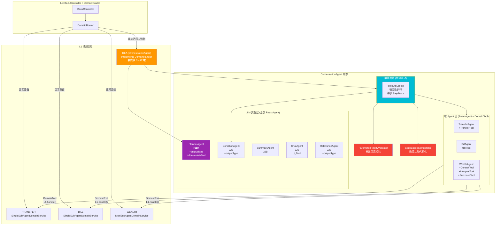
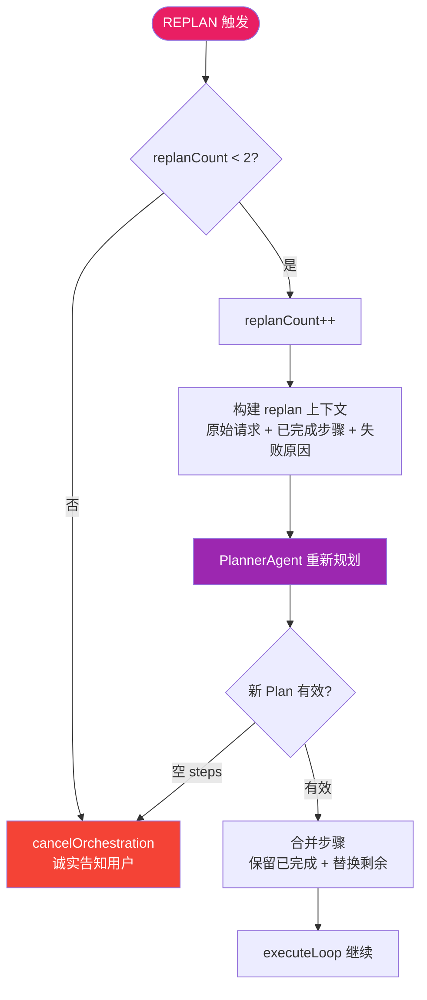
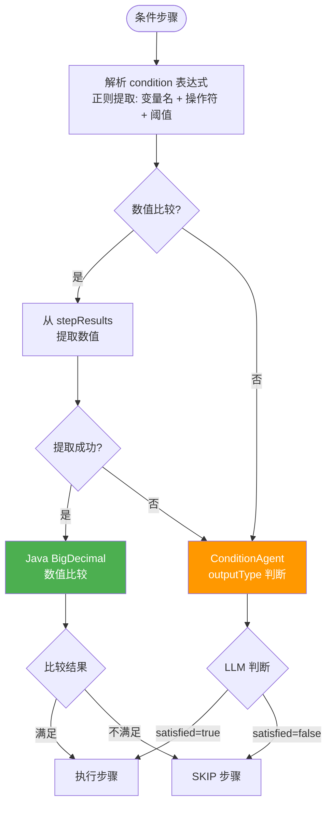
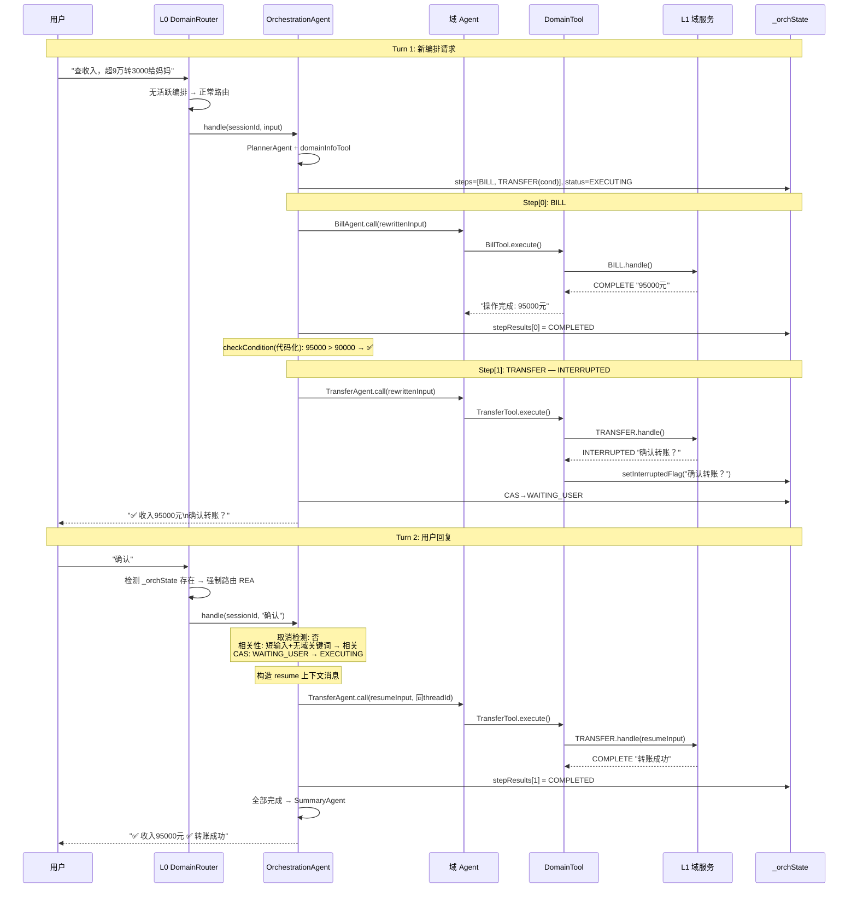
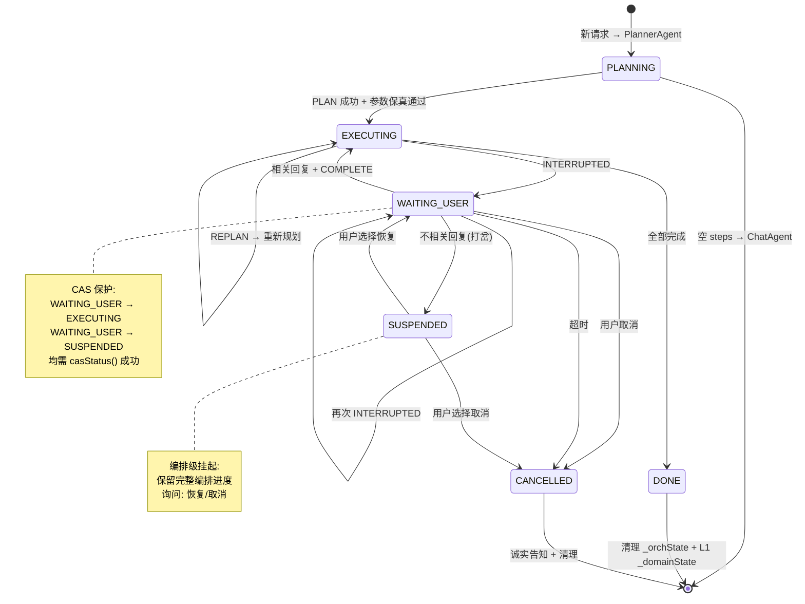

# 设计文档：OrchestrationAgent v5.0 — 复杂意图编排智能体

> **状态**: v5.1 修复版，可直接指导开发
> **定位**: L1 域服务，与 TRANSFER/BILL/WEALTH 同级，注册为 `ORCHESTRATION` 域；**取代 CHAT 域**
> **核心约束**: OrchestrationAgent **只实现 DomainHandler 接口**，不继承 AbstractDomainService，内部逻辑完全自决
> **双重职责**: ① 复杂意图编排（跨域多意图、条件逻辑、顺序依赖） ② 知识问答兜底（咨询性、金融普适性问题）
>
> **v5.0 核心变更**（基于 Oracle/Librarian/CodeReviewer 三方审查）:
> - **参数保真校验**: rewrittenInput 中金额/数值与原始输入交叉验证，LLM 改数字 → 拒绝
> - **条件判断代码化**: 数值比较（>、<、>=）提取后用 Java 代码比较，不靠 LLM
> - **CAS 并发保护**: 替代 LOCKED 状态，用 compareAndSet 防止 TOCTOU 竞态
> - **DomainTool reactive 修复**: `subscribeOn(Schedulers.boundedElastic())` 替代 `.block()`
> - **REROUTE 标记实现**: 替代占位代码，用与 INTERRUPTED 相同的共享状态机制
> - **DomainState 组合模式**: OrchestrationState 组合 DomainState，不继承，消除矛盾
> - **L0 路由调整**: 编排活跃时 L0 只做"路由到 REA"，FOLLOW/打岔判断由 OrchestrationAgent 内部做
> - **Phase 1 统一**: 含 REPLAN + ConditionAgent，消除与代码的矛盾
> - **WealthAgent 三 Tool**: ConsultTool + InterpretTool + PurchaseTool
> - **模型分层**: PlannerAgent 72B+，其他 Agent 32B
> - **文档重构**: 消除 §7/§8.5.4 代码重复，补充缺失 mermaid 图和可观测性章节

---

## 1. 问题与场景

### 1.1 现有架构

```
用户输入
  │
  ▼
L0: BankController → DomainRouter → 分发到 L1 域
  │
  ├── TRANSFER (Single L1) → TransferGraph (L2)
  ├── BILL    (Single L1) → BillQueryGraph (L2)
  ├── WEALTH  (Multi L1)  → WealthConsultGraph / WealthInterpretGraph / WealthPurchaseGraph (L2)
  └── CHAT    (直接 LLM)
```

每个 L1 通过 `DomainState` + `ActiveAgentInfo` 管理单域内状态。跨域请求通过 `REROUTE` 回到 L0 重新路由，但 L0 重新路由是无状态的——不知道之前的路由历史，无法编排跨域的顺序执行。

### 1.2 核心问题

| 问题 | 现有行为 | 期望行为 |
|------|---------|---------|
| **跨域多意图** | REROUTE 回 L0 重路由，每次独立 | 有计划地依次执行多个域的意图 |
| **条件逻辑** | 无法表达"如果 X 则 Y" | 根据前一步结果决定后续步骤 |
| **顺序依赖** | 前一步结果无法传递给后一步 | 前一步输出自动成为后一步的输入上下文 |
| **中途中断恢复** | INTERRUPTED 后用户回复由原 L1 处理，编排丢失 | 编排器记住整体进度，恢复后继续执行 |
| **结果聚合** | 每个域独立返回，无法综合 | 汇总多步结果，形成统一回复 |
| **咨询性问题** | CHAT 域直接 LLM 回答，无法调用域服务辅助 | OrchestrationAgent 可编排"先查数据再解释"等混合流程 |
| **用户打岔** | L0 不感知，L1 ContextRouter 做域内 FOLLOW/SWITCH | OrchestrationAgent 编排级打岔检测 + 挂起/恢复 |

### 1.3 设计原则

> **OrchestrationAgent 只实现 `DomainHandler` 接口，内部逻辑完全自决。**

- ✅ 实现 `DomainHandler`，注册为 `REA` 域——对 L0 来说就是另一个 L1
- ✅ **取代 CHAT 域**——L1 无法独立处理的问题统一路由到 REA
- ✅ 不继承 `AbstractDomainService`——OrchestrationAgent 不走 Phase1/Phase2 路由那套
- ✅ 通过 `DomainServiceRegistry` 调用现有 L1 域服务，**现有 L1 零改动**
- ✅ **三原则**: Plan 显式确定、执行路径代码驱动、每步留痕；不臆想；L1 是唯一能力来源
- ✅ 内部可自由使用 Spring AI Alibaba 的 `ReactAgent` / `SupervisorAgent` 等框架原语

### 1.4 L1 能力边界

| 域 | 类型 | 意图 | 类型 | 写操作 | 说明 |
|----|------|------|------|--------|------|
| TRANSFER | Single | TRANSFER | OPERATION | ✅ | 转账，需 INTERRUPTED 确认 |
| BILL | Single | BILL_QUERY | QUERY | ❌ | 账单查询，只读 |
| WEALTH | Multi | WEALTH_CONSULT | CONSULTATION | ❌ | 理财咨询/推荐 |
| WEALTH | Multi | WEALTH_INTERPRET | CONSULTATION | ❌ | 理财产品解读 |
| WEALTH | Multi | WEALTH_PURCHASE | OPERATION | ✅ | 买基金/买理财，需 INTERRUPTED 确认 |
| ~~CHAT~~ | — | — | — | — | **被 REA 取代** |

### 1.5 L1 现有场景处理机制 vs OrchestrationAgent 差异

> 这是理解 OrchestrationAgent 设计的关键——L1 已有完善的中断/打岔/接续机制，但都是**域内**的。OrchestrationAgent 需要**跨域**的对应机制。

#### 任务中断 (INTERRUPTED)

| 维度 | L1 现有机制 | OrchestrationAgent 机制 |
|------|-----------|--------------|
| 状态记录 | `ActiveAgentInfo.lastQuestion` | `_orchState = WAITING_USER` + `waitingQuestion` + `waitingForStepIndex` |
| 恢复路由 | `ContextRouter` Phase1 判断 FOLLOW → `resumeActiveAgent()` | L0 检测活跃编排 → 路由 REA → `checkRelevance()` → `resumeOrchestration()` |
| 恢复方式 | `graphExecutionEngine.resumeGraph(threadId)` | 域 Agent 同 threadId `call()` + 编排层构造上下文消息 |
| 恢复粒度 | 单域内恢复 | 编排级恢复——可能多步中间某步恢复 |

#### 用户打岔 (SWITCH/新意图)

| 维度 | L1 现有机制 | OrchestrationAgent 机制 |
|------|-----------|--------------|
| 判断位置 | L1 内 `ContextRouter` Phase1 | OrchestrationAgent 内 `checkRelevance()`（L0 不判断，只路由到 REA） |
| 打岔范围 | 同域内切换意图（Multi 域 SWITCH） | 可能跨域新编排 |
| 当前意图保护 | `suspendOwnAgent()` 压入 suspendedAgents 栈 | `_orchState = SUSPENDED`，保留完整编排进度 |
| 恢复机制 | `SuspendedInfo` → `handleResume()` | 询问用户"继续/取消"，恢复回到 `WAITING_USER` |
| 栈深度 | Multi 域 `maxSuspendedDepth = 3` | 编排级只支持一层挂起（挂起整个编排，不是单个步骤） |

**关键设计决策**: 为什么 L0 不做 FOLLOW/SWITCH 判断？

1. **L0 不知道编排内部状态**——哪步 INTERRUPTED、问了什么问题——判断必然不准确
2. **OrchestrationAgent 有完整编排上下文**——`waitingQuestion`、步骤进度、已完成步骤结果——判断更准确
3. **避免逻辑分散**——相关性判断在 OrchestrationAgent 内部，维护成本低，与编排逻辑同生命周期

#### 用户问题接续 (连续对话)

| 维度 | L1 现有机制 | OrchestrationAgent 机制 |
|------|-----------|--------------|
| 对话历史 | `GlobalSessionContext.messages` + `formatRecentMessages()` | `MemorySaver` 维护各 Agent 对话历史 |
| 路由保障 | `lastDomain` 保证路由回同域 | `_orchState` 存在 → L0 强制路由 REA |
| 上下文注入 | `buildGraphInput()` 注入 `_globalStateData` | 编排层构造 resume 消息，注入 `waitingQuestion` + `stepDescription` |
| 过期机制 | `ActiveAgentInfo.expiresAt`（20 分钟） | `_orchState.expiresAt`（30 分钟，可配置） |

### 1.6 场景矩阵（精简）

| # | 场景 | 涉及域 | 关键难点 |
|---|------|--------|---------|
| S1 | "查收入，超9万转3000给妈妈，买1000朝朝盈" | BILL→TRANSFER→WEALTH | 跨域+条件+双INTERRUPTED |
| S2 | "活期5万转理财账户，用那个钱买朝朝盈" | TRANSFER→WEALTH | 顺序依赖+双INTERRUPTED |
| S3 | "余额够转5000，不够转2000" | BILL→TRANSFER | 条件影响参数+INTERRUPTED |
| S4 | "朝朝盈和余额宝哪个收益高？买高的1000" | WEALTH×2→WEALTH | 同域多次+比较+INTERRUPTED |
| S5 | "转5000给妈妈……算了先查余额" | INTERRUPTED→BILL→RESUME | 中途改变意图+恢复 |
| S6 | "查余额" → 系统发现超10万 → 主动建议买理财 | BILL→WEALTH | 主动建议+INTERRUPTED确认 |
| S7 | "查收入，转3000给妈妈——算了理财不买了" | BILL→TRANSFER→~~WEALTH~~ | 部分取消 |
| S8 | "什么是基金定投？帮我买1000的" | REA(咨询)→WEALTH | 咨询+操作+INTERRUPTED |
| S9 | "利率和汇率有什么关系？" | REA(直接回答) | 纯咨询，无域操作 |
| S10 | "转3000" → 确认 → "等等转给李四吧" | INTERRUPTED中修改参数 | 参数修改型回复 |

---

## 2. 架构决策记录 (ADR)

> 所有重大设计决策集中在此，按 ADR 格式记录。每个 ADR 包含：背景、决策、后果。

### ADR-1: 自建编排循环（M2 方案）

**背景**: 框架提供 SupervisorAgent / SequentialAgent / ParallelAgent 等编排原语，但域服务 INTERRUPTED 语义（执行中暂停）与框架中断语义（执行前审批）存在根本性鸿沟。

**决策**: 采用 M2 方案——编排循环自建，LLM 调用全部走框架 ReactAgent。

**理由**:
- INTERRUPTED 是域语义中断（"域服务需要用户输入"），不是框架语义中断（"Agent 推理循环暂停"）
- 4 步适配链路（DomainTool→model→InterruptionHook→用户回复）每个环节都可能静默失败
- Flux\<StreamChunk\> 直接透传——M1 的 DomainTool 必须丢弃流式 chunk，银行 App 用户体验不可接受
- 单一状态源——`_orchState` (DomainState)，与所有 L1 体系一致

**后果**:
- ✅ INTERRUPTED 完美处理，零适配
- ✅ Flux\<StreamChunk\> 直接透传
- ✅ 与现有代码零摩擦
- ❌ 并行执行需自建（Phase 2 用 Flux.merge）
- ❌ 编排循环代码量中等（~300 行核心逻辑）

### ADR-2: 框架中断 vs 域服务中断 — 不使用框架中断

**背景**: 框架提供 InterruptionHook (BEFORE_MODEL) 和 HumanInTheLoopHook (AFTER_MODEL) 两种中断机制。

**决策**: 不使用框架中断机制处理域服务 INTERRUPTED。

**理由**:

| 维度 | 框架中断 | 域服务 INTERRUPTED |
|------|---------|-------------------|
| 触发时机 | 模型调用前 / 工具执行前 | 工具执行过程中（域服务返回 INTERRUPTED） |
| 语义 | "应该执行这个工具吗？" | "域服务已执行，但需要用户提供更多信息" |
| 恢复输入 | approve/edit/reject 决策 | 自然语言回答（信息补充） |
| 信息补充 | ❌ 只有三种决策 | ✅ "收款人全名？""请输入验证码" |

**典型场景 HumanInTheLoopHook 无法覆盖**:
```
1. L1: "请输入短信验证码" → 用户: "123456"  — 不是 approve/reject，是信息补充
2. L1: "多个'张三'，请选择" → 用户: "第一个"    — 不是 edit，是多选
3. L1: "转账限额用完，预约明天？" → "预约"      — 不是审批，是新决策
```

**后果**: 编排循环通过共享状态标记检测 INTERRUPTED，确定性暂停，不依赖模型判断。Phase 2+ 评估对纯确认类操作叠加 HumanInTheLoopHook 做预防性审批。

### ADR-3: 子 Agent 上下文隔离 — 仅 rewrittenInput

**背景**: 域 Agent 是否应看到完整原始用户输入？

**决策**: 子 Agent 只看到 PlannerAgent 生成的 rewrittenInput（自包含），不看到原始完整用户输入。

**理由**: 5 类污染风险

| 风险 | 严重度 | 示例 |
|------|--------|------|
| 参数交叉污染 | 🔴 | "转账500给张三，查电费" → BillAgent 看到"500"可能误当电费金额 |
| 指令跟随混乱 | 🔴 | "转账500，收益不到4%就算了" → WealthAgent 自行做条件判断 |
| INTERRUPTED 回复混乱 | 🟡 | TransferAgent 可能提及"接下来帮您买理财"，超出职责边界 |
| 注意力稀释 | 🟡 | 完整输入增加 token，降低参数提取准确率 |
| Rewrite 机制失效 | 🔴 | 子 Agent 直接从原始输入提取信息，rewrite 去噪价值归零 |

**rewrittenInput 自包含标准**:
1. **指代消解**: "他"→"张三（卡号尾号1234）"
2. **参数显式化**: 从对话历史中提取隐含参数
3. **单一意图**: 只包含本步骤任务
4. **动作明确**: 动词开头

**后果**: PlannerAgent 的 rewrite 质量成为单点风险。缓解措施见 ADR-8（参数保真校验）。

### ADR-4: outputType 适用性

**背景**: 框架提供 `outputType()` 实现结构化输出，自研模型走 ToolCall 退路。

**决策**:

| Agent | 需要 outputType? | 理由 |
|-------|-----------------|------|
| PlannerAgent | ✅ 必须 | 嵌套数组+多字段，自研模型靠 prompt 约束不可靠 |
| ConditionAgent | ✅ 推荐 | `satisfied` boolean 需程序确定性判断 |
| RelevanceAgent | ✅ 推荐 | `relevant` boolean 需程序确定性判断 |
| SummaryAgent | ❌ | 自然语言输出 |
| ChatAgent | ❌ | 自然语言输出 |
| 域 Agent | ❌ | 工具调用结果，不是 LLM 直接生成 |

**后果**: Prompt 删除手写 JSON 格式段，由框架自动注入 schema 指令。自研模型需支持 function calling。

### ADR-5: 独立 PlannerAgent vs TodoListInterceptor

**背景**: 框架内置 `TodoListInterceptor` 在执行工具前强制规划步骤。

**决策**: 不使用 TodoListInterceptor，使用独立 PlannerAgent。

**理由**:

| 维度 | TodoListInterceptor | 独立 PlannerAgent |
|------|--------------------|--------------------|
| 规划粒度 | 单 Agent 内的工具调用序列 | 跨多个域 Agent 的编排步骤 |
| 跨域编排 | ❌ 一个 Agent 只能调自己的工具 | ✅ 编排循环调度不同域 Agent |
| 条件步骤 | ❌ | ✅ ConditionAgent + condition 字段 |
| rewrittenInput | ❌ | ✅ 为每步生成自包含输入 |
| 可追踪性 | ❌ Plan 在 Agent 内部 | ✅ Plan 存入 _orchState，可审计 |

### ADR-6: DomainState 组合模式

**背景**: `OrchestrationState` 需存入 `_orchState`，而 `DomainState` 有 `activeAgent` / `suspendedAgents` / `disambiguation` 等字段。v4.1 中 §7.2 写"组合"但 §10.2 写"继承"，存在矛盾。

**决策**: 采用**组合模式**——`OrchestrationState` 内嵌 `DomainState` 字段，不继承。

**理由**:
1. **语义清晰**: DomainState 的 `activeAgent` / `suspendedAgents` / `disambiguation` 对 OrchestrationAgent 无意义——OrchestrationAgent 用自己的 `status` / `waitingForStepIndex` / `waitingQuestion` 管理状态
2. **避免空字段污染**: 继承会带来大量 null 字段，序列化/调试噪音
3. **兼容 GlobalSessionContext**: 通过 helper 方法桥接 `ctx.getDomainState("_orchState")` → 内部转换
4. **关注点分离**: DomainState 是 L1 框架层概念，OrchestrationState 是编排层概念

```java
@Data
public class OrchestrationState {
    // 组合 — 兼容 GlobalSessionContext API
    private DomainState domainState;  // 仅用于桥接 GlobalSessionContext
    // 编排自身状态 — 与 DomainState 字段无关
    private OrchestrationStatus status;
    private List<OrchestrationStep> steps;
    private int currentStepIndex;
    private Map<Integer, StepResult> stepResults;
    private List<StepTrace> stepTraces;
    // ... 其他编排字段
}
```

### ADR-7: rewrittenInput 参数保真校验

**背景**: PlannerAgent 生成的 rewrittenInput 是 LLM 产物，"转3000"可能被改写为"转30000"。对金融系统这是不可接受的风险。Prompt 保护是软约束。

**决策**: 增加代码层 `ParameterFidelityValidator`，校验 rewrittenInput 中的金额/数值与原始用户输入一致。

**机制**:
```java
public class ParameterFidelityValidator {
    /**
     * 从文本中提取所有数值（支持中文数字和阿拉伯数字）
     * 比较原始输入和 rewrittenInput 中的数值集合
     * 如果 rewrittenInput 包含原始输入中不存在的数值 → 校验失败
     */
    public static FidelityResult validate(String originalInput, String rewrittenInput) {
        Set<BigDecimal> originalNumbers = extractNumbers(originalInput);
        Set<BigDecimal> rewrittenNumbers = extractNumbers(rewrittenInput);

        // rewrittenInput 中的金额不能超出原始输入的范围
        // 例: 原始"转3000" → rewrite"转30000" → 校验失败
        // 例外: rewrite 从对话历史中获取的参数（如"向张三转账"中张三来自历史）不校验
        Set<BigDecimal> suspicious = new HashSet<>(rewrittenNumbers);
        suspicious.removeAll(originalNumbers);
        if (!suspicious.isEmpty()) {
            return FidelityResult.fail("金额参数不一致: 原始=" + originalNumbers
                + ", rewrite=" + rewrittenNumbers + ", 可疑=" + suspicious);
        }
        return FidelityResult.ok();
    }
}
```

**校验失败处理**: 标记该步骤为 `PARAM_FIDELITY_FAILED` → 触发 REPLAN，PlannerAgent 重新生成 rewrittenInput（附带错误提示）。

**例外场景**: rewrite 从对话历史中获取的参数（如"向张三转账"中"张三"来自历史），不校验。只校验**数值参数**（金额、数量），不校验实体名。

### ADR-8: ConditionAgent 数值比较代码化

**背景**: ConditionAgent 用 LLM 判断"95000 > 90000"是不可靠的——金融系统不能靠模型做数值比较。

**决策**: 条件判断采用**代码优先 + LLM 兜底**双模式。

**机制**:
```java
private boolean checkCondition(OrchestrationState state, OrchestrationStep step) {
    String condition = step.getCondition();
    String stepResults = formatStepResults(state);

    // 1. 尝试代码化比较
    Optional<Boolean> codeResult = tryCodeBasedComparison(condition, stepResults);
    if (codeResult.isPresent()) {
        log.info("[OrchAgent] CONDITION (code): \"{}\" → {}", condition, codeResult.get());
        return codeResult.get();
    }

    // 2. LLM 兜底: 非数值条件（如"步骤0提到用户偏好稳健型"）
    log.info("[OrchAgent] CONDITION (llm): \"{}\" → fallback to ConditionAgent", condition);
    return conditionAgentJudge(stepResults, condition);
}

/**
 * 代码化条件比较:
 * 1. 用正则从 condition 中提取比较表达式: "收入 > 90000", "余额 >= 5000"
 * 2. 用正则从 stepResults 中提取对应数值
 * 3. Java 代码做数值比较
 */
private Optional<Boolean> tryCodeBasedComparison(String condition, String stepResults) {
    // 匹配: X > Y, X >= Y, X < Y, X <= Y, X == Y
    Pattern pattern = Pattern.compile("(.+?)\\s*(>|>=|<|<=|=|==)\\s*(\\d[\\d,.]*)");
    Matcher m = pattern.matcher(condition);
    if (!m.find()) return Optional.empty();  // 非数值条件

    String variableName = m.group(1).trim();
    String operator = m.group(2);
    BigDecimal threshold = parseNumber(m.group(3));

    // 从步骤结果中提取对应数值
    Optional<BigDecimal> actualValue = extractValueFromResults(variableName, stepResults);
    if (actualValue.isEmpty()) return Optional.empty();  // 提取不到数值，交给 LLM

    return Optional.of(compare(actualValue.get(), operator, threshold));
}
```

**后果**: 数值比较 100% 可靠（代码执行），非数值比较仍由 LLM 处理（如"步骤0的收益率 > 步骤1的收益率"中提取收益率后代码比较）。

### ADR-9: 模型分层部署

**背景**: PlannerAgent 需要同时做意图分解、指代消解、参数 rewrite、工具集成——需要最强推理能力。其他 Agent 任务单一。

**决策**:

| Agent | 模型要求 | 理由 |
|-------|---------|------|
| **PlannerAgent** | **72B+** | 多步推理 + 指代消解 + 参数保真 + domainInfoTool 集成，同时进行 |
| ConditionAgent | 32B | 单次条件判断，有代码化兜底 |
| RelevanceAgent | 32B | 单次相关性判断 |
| SummaryAgent | 32B | 汇总生成 |
| ChatAgent | 32B | 知识问答 |
| 域 Agent | 32B | 工具调用为主，推理简单 |

**配置**: 通过 `@Qualifier` 注入不同 ChatModel Bean。

### ADR-12: 面向对象设计 + AOP 切片 — 可观测性与长期记忆的基础

**背景**: OrchestrationAgent 的编排流程涉及多个关键决策点（规划、条件判断、步骤执行、状态转换、中断恢复），这些点需要：
1. **AOP 切片打日志** — 编排审计、性能监控、问题排查
2. **AOP 切片注入长期记忆** — Phase 3 跨会话偏好学习、编排模式学习

如果核心逻辑都是 private 方法或散落在 OrchestrationAgent 大类中，AOP 无法拦截。

**决策**: 采用**职责分明的 Spring Bean 体系**，每个核心职责是独立的 Bean，关键方法是 public 的，可被 AOP 切片拦截。

**类体系**:

```
OrchestrationAgent (DomainHandler 入口, 代理模式)
  │
  ├── OrchestrationPlanner (规划职责)
  │     plan()               ← AOP: 日志(规划结果) + 长期记忆(规划模式学习)
  │     replan()             ← AOP: 日志(REPLAN原因+结果)
  │     validateFidelity()   ← AOP: 日志(保真校验结果)
  │
  ├── OrchestrationExecutor (执行职责)
  │     executeLoop()        ← AOP: 日志(编排开始/结束)
  │     executeStep()        ← AOP: 日志(步骤执行) + 长期记忆(域执行模式)
  │     resumeStep()         ← AOP: 日志(中断恢复)
  │
  ├── OrchestrationCondition (条件职责)
  │     check()              ← AOP: 日志(条件判断结果)
  │     compareNumerically() ← AOP: 日志(数值比较详情)
  │
  ├── OrchestrationStateService (状态管理职责)
  │     getState()           ← AOP: 日志(状态读取)
  │     casTransition()      ← AOP: 日志(状态转换) + 长期记忆(状态转换模式)
  │     cancel()             ← AOP: 日志(取消) + 长期记忆(取消模式)
  │     suspend()            ← AOP: 日志(挂起)
  │
  ├── OrchestrationRelevance (相关性检测职责)
  │     check()              ← AOP: 日志(相关性判断结果)
  │
  ├── OrchestrationSummary (汇总职责)
  │     summarize()          ← AOP: 日志(汇总结果)
  │
  └── ParameterFidelityValidator (参数保真, 独立工具)
        validate()           ← AOP: 日志(保真校验)
```

**AOP 切片点清单**:

| 切片点 | Bean.方法 | Phase 1 | Phase 2+ | 切片用途 |
|--------|-----------|---------|----------|---------|
| 编排规划 | `OrchestrationPlanner.plan()` | ✅ 日志 | + 长期记忆 | 审计规划结果 / 学习用户常见编排模式 |
| REPLAN | `OrchestrationPlanner.replan()` | ✅ 日志 | — | 审计 REPLAN 原因 |
| 参数保真 | `ParameterFidelityValidator.validate()` | ✅ 日志 | — | 金融安全审计 |
| 步骤执行 | `OrchestrationExecutor.executeStep()` | ✅ 日志 | + 长期记忆 | StepTrace / 学习域执行模式 |
| 中断恢复 | `OrchestrationExecutor.resumeStep()` | ✅ 日志 | — | 审计恢复行为 |
| 条件判断 | `OrchestrationCondition.check()` | ✅ 日志 | — | 审计条件判断结果 |
| 数值比较 | `OrchestrationCondition.compareNumerically()` | ✅ 日志 | — | 金融安全审计 |
| 状态转换 | `OrchestrationStateService.casTransition()` | ✅ 日志 | + 长期记忆 | 状态机审计 / 学习状态转换模式 |
| 编排取消 | `OrchestrationStateService.cancel()` | ✅ 日志 | + 长期记忆 | 取消模式审计 / 学习取消偏好 |
| 相关性检测 | `OrchestrationRelevance.check()` | ✅ 日志 | — | 审计打岔判断 |
| 编排汇总 | `OrchestrationSummary.summarize()` | ✅ 日志 | — | 审计最终输出 |

**长期记忆切片示例 (Phase 3)**:

```java
@Aspect
@Component
public class OrchestrationMemoryAspect {

    private final MemoryStore memoryStore;

    /**
     * 编排规划后 — 学习用户的编排模式
     * 例: "用户经常先查余额再转账" → 记录为偏好
     */
    @AfterReturning(pointcut = "execution(* com.mobileagent.app.domain.rea.OrchestrationPlanner.plan(..))",
                    returning = "plan")
    public void afterPlan(JoinPoint jp, OrchestrationPlan plan) {
        String sessionId = (String) jp.getArgs()[0];
        String userInput = (String) jp.getArgs()[1];

        // 提取编排模式: "BILL→TRANSFER(cond)" → 记录为用户偏好
        String pattern = plan.getSteps().stream()
            .map(s -> s.getDomain() + (s.getCondition() != null ? "(cond)" : ""))
            .collect(Collectors.joining("→"));

        memoryStore.put("user-orchestration-patterns", sessionId,
            Map.of("pattern", pattern, "trigger", userInput,
                   "timestamp", System.currentTimeMillis()));
    }

    /**
     * 状态转换后 — 记录状态机模式
     * 例: "WAITING_USER→SUSPENDED 频率=30%" → 优化相关性检测策略
     */
    @AfterReturning(pointcut = "execution(* com.mobileagent.app.domain.rea.OrchestrationStateService.casTransition(..))")
    public void afterStateTransition(JoinPoint jp) {
        // 记录状态转换频率，用于优化相关性检测的阈值
    }

    /**
     * 编排取消后 — 学习取消偏好
     * 例: "用户取消时 TRANSFER 总是已执行" → 优化确认提示时机
     */
    @AfterReturning(pointcut = "execution(* com.mobileagent.app.domain.rea.OrchestrationStateService.cancel(..))")
    public void afterCancel(JoinPoint jp) {
        OrchestrationState state = (OrchestrationState) jp.getArgs()[1];
        // 记录取消时哪些步骤已完成，用于优化中断确认策略
    }
}
```

**Phase 1 日志切片示例**:

```java
@Aspect
@Component
public class OrchestrationLoggingAspect {

    /**
     * 所有编排核心方法 — 统一日志
     */
    @Around("execution(* com.mobileagent.app.domain.rea.OrchestrationPlanner.*(..)) || " +
            "execution(* com.mobileagent.app.domain.rea.OrchestrationExecutor.*(..)) || " +
            "execution(* com.mobileagent.app.domain.rea.OrchestrationCondition.*(..)) || " +
            "execution(* com.mobileagent.app.domain.rea.OrchestrationStateService.*(..)) || " +
            "execution(* com.mobileagent.app.domain.rea.OrchestrationRelevance.*(..)) || " +
            "execution(* com.mobileagent.app.domain.rea.ParameterFidelityValidator.*(..))")
    public Object logOrchestration(ProceedingJoinPoint pjp) throws Throwable {
        String method = pjp.getSignature().getName();
        long start = System.currentTimeMillis();
        try {
            Object result = pjp.proceed();
            long duration = System.currentTimeMillis() - start;
            log.info("[OrchAgent] {}.{} → {} ({}ms)", 
                pjp.getSignature().getDeclaringType().getSimpleName(),
                method, resultSummary(result), duration);
            return result;
        } catch (Exception e) {
            log.error("[OrchAgent] {}.{} FAILED: {}", 
                pjp.getSignature().getDeclaringType().getSimpleName(),
                method, e.getMessage());
            throw e;
        }
    }
}
```

**后果**:
- ✅ 所有核心方法是 public + 独立 Bean → AOP 可拦截
- ✅ 日志切片零侵入 — 不改业务代码
- ✅ 长期记忆切片可渐进添加 — Phase 1 只打日志，Phase 3 加记忆
- ✅ 单元测试更清晰 — 每个 Bean 可独立测试
- ❌ Bean 数量增多（6 个核心 Bean + 1 个入口 Bean），但职责清晰

### ADR-10: Skills 渐进式披露 — Phase 2+ 扩展点

**背景**: Phase 1 只有 3 个域，PlannerAgent instruction 可控。未来域增多（5+）或编排规则频繁变化时，需要按需加载域编排知识。

**决策**: Phase 1 不引入 Skills。Phase 2+ 当域数量 > 5 或编排规则频繁变化时引入 `SkillsAgentHook`。

**Skills 与 domainInfoTool 互补**:
- `domainInfoTool`: 回答"有哪些域可以编？"（结构化数据概览）
- `Skill`: 回答"这个域怎么编？"（自然语言编排规则详情）

### ADR-11: cancelOrchestration 诚实告知 — 不能取消已提交的交易

**背景**: 用户说"算了不搞了"，OrchestrationAgent 清理编排状态。但如果 TRANSFER L1 已经确认执行了转账，cancelOrchestration 不能回滚这笔交易。

**决策**: `cancelOrchestration` 只清理编排状态 + L1 残留 `_domainState`，**不取消已提交的 L1 交易**。向用户诚实告知：

```
"已取消后续操作。请注意：已执行的转账（转账3000元给妈妈）无法撤回。
如需撤回，请联系客服或前往柜台办理。"
```

**机制**:
```java
private String buildCancelMessage(OrchestrationState state) {
    // 检查是否有已完成的写操作步骤
    List<String> irreversibleSteps = state.getStepResults().entrySet().stream()
        .filter(e -> e.getValue().getStatus() == StepStatus.COMPLETED)
        .filter(e -> isWriteOperation(state.getSteps().get(e.getKey())))
        .map(e -> state.getSteps().get(e.getKey()).getDescription())
        .toList();

    if (irreversibleSteps.isEmpty()) {
        return "已取消当前操作。";
    }
    return String.format("已取消后续操作。请注意：已执行的%s无法撤回，如需撤回请联系客服。",
        String.join("、", irreversibleSteps));
}
```

---

## 3. 架构概览

### 3.1 整体架构图



### 3.2 OrchestrationAgent 核心职责

| 职责 | 说明 | 模式 |
|------|------|------|
| **意图分解** | PlannerAgent + domainInfoTool 防臆想 | 编排 |
| **步骤执行** | 域 Agent → DomainTool → L1.handle() | 编排 |
| **条件判断** | 代码化数值比较 + LLM 兜底 | 编排 |
| **参数保真** | rewrittenInput 金额与原始输入交叉校验 | 编排 |
| **中断处理** | 代码驱动暂停 + 相关性检测恢复 | 编排 |
| **用户打岔** | SUSPENDED 挂起编排，处理新请求 | 编排 |
| **REPLAN** | REROUTE/ERROR 触发，最多 2 次 | 编排 |
| **结果聚合** | SummaryAgent 汇总多步结果 | 编排 |
| **步骤审计** | StepTrace 每步留痕 | 编排 |
| **金融咨询** | ChatAgent 纯知识问答 | 知识问答 |
| **L1 兜底** | 其他 L1 无法处理的问题统一由 REA 接管 | 知识问答 |

### 3.3 模型分层

```java
// 模型配置 — 两个 ChatModel Bean
@Bean("orchPlannerModel")
public ChatModel orchPlannerModel() {
    // 72B+ 模型 — PlannerAgent 专用
    // 多步推理 + 指代消解 + 参数保真 + 工具集成
}

@Bean("orchStandardModel")
public ChatModel orchStandardModel() {
    // 32B 模型 — 其他所有 Agent
    // 单一任务，推理简单
}
```

---

## 4. 数据模型与契约

> **单一数据源** — 所有数据类型只在此处定义一次，§5 引用此处的类型。

### 4.1 OrchestrationStatus 枚举

```java
public enum OrchestrationStatus {
    PLANNING,       // 正在分解意图
    EXECUTING,      // 正在执行步骤
    WAITING_USER,   // INTERRUPTED，等待用户回复
    SUSPENDED,      // 编排挂起（用户打了岔）
    DONE,           // 编排完成
    CANCELLED       // 用户取消 / 超时
}
```

**与 L1 的 DomainState 对应关系**:
- `WAITING_USER` ≈ L1 的 `ActiveAgentInfo.lastQuestion != null`
- `SUSPENDED` ≈ L1 Multi 域的 `SuspendedInfo`
- `EXECUTING` ≈ L1 的 `ActiveAgentInfo` 活跃状态
- OrchestrationAgent **不需要** L1 的 `disambiguation`（编排层自己做意图识别）

### 4.2 StepStatus 枚举

```java
public enum StepStatus {
    PENDING,            // 等待执行
    RUNNING,            // 正在执行
    COMPLETED,          // 执行完成
    INTERRUPTED,        // 需要用户确认
    SKIPPED,            // 条件不满足，跳过
    FAILED,             // 执行失败
    PARAM_FIDELITY_FAILED  // 参数保真校验失败（触发 REPLAN）
}
```

### 4.3 OrchestrationStep

```java
@Data
public class OrchestrationStep implements Serializable {
    private int index;
    private String domain;          // "TRANSFER", "BILL", "WEALTH"
    private String intent;          // "TRANSFER", "BILL_QUERY", "WEALTH_PURCHASE"
    private String description;     // "查询本月收入"
    private String rewrittenInput;  // "查询本月收入明细" — 自包含，不含指代
    private String condition;       // "步骤0的结果中余额 >= 5000" (nullable)
    private StepStatus status;      // PENDING / RUNNING / COMPLETED / ...
}
```

### 4.4 StepResult

```java
@Data
public class StepResult implements Serializable {
    private StepStatus status;      // COMPLETED / INTERRUPTED / FAILED / REROUTE
    private String content;         // COMPLETED: 结果文本
    private String question;        // INTERRUPTED: 提问内容
    private String errorMessage;    // FAILED: 错误信息
    private String rerouteIntent;   // REROUTE: 重路由意图

    public static StepResult completed(String content) { ... }
    public static StepResult interrupted(String question) { ... }
    public static StepResult failed(String error) { ... }
    public static StepResult reroute(String intent) { ... }
    public static StepResult skipped() { ... }
}
```

### 4.5 StepTrace — 审计日志

```java
@Data
public class StepTrace implements Serializable {
    private int stepIndex;
    private String domain;
    private String intent;
    private String rewrittenInput;       // 传给域 Agent 的参数
    private StepStatus resultStatus;
    private String resultSummary;        // 结果摘要 (截断 200 字)
    private long startedAtMs;
    private long durationMs;
    private String traceId;              // 追踪 ID
}
```

### 4.6 OrchestrationState — 编排状态

```java
/**
 * OrchestrationAgent 编排状态 — 存入 GlobalSessionContext 的 "_orchState"
 *
 * 采用组合模式（ADR-6），不继承 DomainState。
 * domainState 字段仅用于桥接 GlobalSessionContext API，
 * 编排自身状态完全独立。
 */
@Data
public class OrchestrationState implements Serializable {
    // ── 桥接字段 ──
    private DomainState domainState;          // 组合，兼容 GlobalSessionContext API

    // ── 编排状态 ──
    private OrchestrationStatus status;
    private String originalRequest;           // 用户原始输入
    private List<OrchestrationStep> steps;    // 编排步骤列表
    private int currentStepIndex;             // 当前执行到第几步
    private Map<Integer, StepResult> stepResults;  // 步骤执行结果
    private List<StepTrace> stepTraces;       // 审计日志

    // ── INTERRUPTED 相关 ──
    private String waitingForDomain;          // 哪个域在等待
    private int waitingForStepIndex;          // 哪个步骤在等待
    private String waitingQuestion;           // 等待回答的问题

    // ── 生命周期 ──
    private long startedAt;
    private long expiresAt;
    private int replanCount;                  // REPLAN 次数 (限制 2)

    // ── 并发控制 (CAS) ──
    private volatile long casVersion;         // 乐观锁版本号

    // ── 辅助方法 ──
    public boolean isExpired() {
        return expiresAt > 0 && System.currentTimeMillis() > expiresAt;
    }
    public boolean isActive() {
        return status != null
            && status != OrchestrationStatus.DONE
            && status != OrchestrationStatus.CANCELLED
            && !isExpired();
    }
    public boolean isWriteOperationCompleted() {
        return stepResults.entrySet().stream()
            .anyMatch(e -> e.getValue().getStatus() == StepStatus.COMPLETED
                && isWriteIntent(steps.get(e.getKey()).getIntent()));
    }
    private boolean isWriteIntent(String intent) {
        return "TRANSFER".equals(intent) || "WEALTH_PURCHASE".equals(intent);
    }
}
```

**与 GlobalSessionContext 的桥接**:

```java
// 读取
private OrchestrationState getOrchestrationState(String sessionId) {
    GlobalSessionContext ctx = globalSessionStore.getOrCreate(sessionId);
    DomainState ds = ctx.getDomainState("_orchState");
    if (ds == null) return null;
    // 从 DomainState.subAgents 中反序列化
    return deserializeFromSubAgents(ds);
}

// 写入 (CAS)
private boolean casOrchestrationState(String sessionId,
        OrchestrationState expected, OrchestrationState newState) {
    GlobalSessionContext ctx = globalSessionStore.getOrCreate(sessionId);
    DomainState ds = ctx.getDomainState("_orchState");
    OrchestrationState current = deserializeFromSubAgents(ds);
    if (current == null || current.getCasVersion() != expected.getCasVersion()) {
        return false;  // CAS 失败 — 被其他线程修改了
    }
    newState.setCasVersion(expected.getCasVersion() + 1);
    ctx.updateDomainState("_orchState", d -> {
        d.getSubAgents().put("orchestration", serialize(newState));
    });
    return true;
}
```

### 4.7 outputType 输出模型

```java
/** PlannerAgent 输出 */
@Data
public class OrchestrationPlan {
    private List<OrchestrationStep> steps;
}

/** ConditionAgent 输出 */
@Data
public class ConditionCheckResult {
    private boolean satisfied;
    private String reason;
}

/** RelevanceAgent 输出 */
@Data
public class RelevanceCheckResult {
    private boolean relevant;
    private String reason;
}

/** 参数保真校验结果 */
@Data
public class FidelityResult {
    private boolean valid;
    private String errorMessage;

    public static FidelityResult ok() { return new FidelityResult(true, null); }
    public static FidelityResult fail(String msg) { return new FidelityResult(false, msg); }
}
```

### 4.8 补充数据类 — §5 引用但之前未定义的类型

```java
/** Planner replanForFidelity 返回信封 — 包含新 Plan 和已用 REPLAN 次数 */
@Data
public class OrchestrationResult {
    private final OrchestrationPlan plan;
    private final int initialReplanCount;  // 初始 replanCount (已用掉 1 次)

    public OrchestrationResult(OrchestrationPlan plan, int initialReplanCount) {
        this.plan = plan;
        this.initialReplanCount = initialReplanCount;
    }
}

/** resumeOrchestration 相关性判断不通过时的信号 — 由 OrchestrationAgent 解包并启动新编排 */
@Data
public class SuspendSignal {
    private final String originalInput;  // 用户原始输入 (打岔内容)

    public SuspendSignal(String originalInput) {
        this.originalInput = originalInput;
    }
}

/** 条件表达式格式校验器 — 校验 PlannerAgent 生成的 condition 是否可被 OrchestrationCondition 解析 */
public class ConditionFormatValidator {
    // 合法格式: 步骤{N}的结果中{变量名} {操作符} {数值}{单位?}
    private static final String CONDITION_PATTERN =
        "步骤\\d+的结果中.+?\\s*(>|>=|<|<=|=|==)\\s*[\\d,?.]+万?元?";

    public static boolean validate(String condition) {
        if (condition == null || condition.isBlank()) return true;  // 无条件，合法
        return condition.matches(CONDITION_PATTERN)
            || condition.contains("步骤") && condition.contains("结果中") && condition.contains("步骤");  // 跨步骤比较走 LLM
    }
}

/** DomainTool 输入类型 — 每个域的 ToolInput 共享结构 */
@Data
public class DomainToolInput {
    private String params;       // 用户输入/执行参数
    private String sessionId;    // 会话 ID
}

/** transfer/bill 工具输入 — 继承 DomainToolInput */
@Data
public class TransferToolInput extends DomainToolInput {}
@Data
public class BillToolInput extends DomainToolInput {}
@Data
public class WealthToolInput extends DomainToolInput {}
@Data
public class DomainInfoQuery {}  // domainInfoTool 的空输入类型
```

### 4.9 GlobalSessionContext 扩展方法

> **开发指引**: `GlobalSessionContext` 现有 API 只有 `updateDomainState(key, modifier)` 和 `clear()`。
> 以下方法需要在项目中添加或用现有 API 替代。

```java
// 方案A: 在 GlobalSessionContext 中添加 clearDomainState 方法 (推荐)
public void clearDomainState(String key) {
    updateDomainState(key, ds -> {
        ds.setActiveAgent(null);
        ds.setSuspendedAgents(null);
        ds.setDisambiguation(null);
        ds.getSubAgents().clear();
    });
}

// 方案B: 不修改 GlobalSessionContext, 在 OrchestrationStateService 中用 updateDomainState 实现
public void clearOrchestrationState(String sessionId) {
    GlobalSessionContext ctx = globalSessionStore.getOrCreate(sessionId);
    ctx.updateDomainState("_orchState", ds -> {
        ds.setActiveAgent(null);
        ds.getSubAgents().clear();  // 清除 orchestration + _orchFlags
    });
}
```

### 4.10 序列化/反序列化基础设施

```java
/** OrchestrationState 序列化到 DomainState.subAgents */
private SubAgentState serialize(OrchestrationState state) {
    try {
        String json = objectMapper.writeValueAsString(state);
        SubAgentState sas = new SubAgentState();
        sas.getData().put("orchestration", json);
        return sas;
    } catch (JsonProcessingException e) {
        throw new RuntimeException("Failed to serialize OrchestrationState", e);
    }
}

/** 从 DomainState.subAgents 反序列化 OrchestrationState */
private OrchestrationState deserializeFromSubAgents(DomainState ds) {
    if (ds == null) return null;
    SubAgentState sas = ds.getSubAgents().get("orchestration");
    if (sas == null) return null;
    Object json = sas.getData().get("orchestration");
    if (json == null) return null;
    try {
        return objectMapper.readValue(json.toString(), OrchestrationState.class);
    } catch (JsonProcessingException e) {
        log.error("[OrchAgent] Failed to deserialize OrchestrationState", e);
        return null;
    }
}

/** 深拷贝 — CAS 需要在修改前复制一份 */
private OrchestrationState deepCopy(OrchestrationState state) {
    try {
        String json = objectMapper.writeValueAsString(state);
        return objectMapper.readValue(json, OrchestrationState.class);
    } catch (JsonProcessingException e) {
        throw new RuntimeException("Failed to deepCopy OrchestrationState", e);
    }
}
```

### 4.11 outputType 解析 — PlannerAgent 的结构化输出

```java
/**
 * PlannerAgent 使用 outputType(OrchestrationPlan.class), ReactAgent 内部
 * 通过 ToolCall 回退机制实现结构化输出:
 *   1. LLM 生成符合 OrchestrationPlan JSON schema 的文本
 *   2. ReactAgent 自动解析为 OrchestrationPlan 对象
 *   3. 通过 AssistantMessage.getMetadata() 或 outputKey 获取
 *
 * 开发实现: 如果 outputType 在自建模型上不生效 (模型不支持 JSON schema),
 * 使用 outputSchema() 替代:
 *   .outputSchema("请按照以下JSON格式输出: {\"steps\": [...]}")
 * 然后手动解析 AssistantMessage.getText() 中的 JSON。
 */
private OrchestrationPlan parsePlanFromAssistantMessage(AssistantMessage response) {
    String text = response.getText();
    try {
        String json = JsonParseUtils.extractJson(text);
        return objectMapper.readValue(json, OrchestrationPlan.class);
    } catch (Exception e) {
        log.error("[OrchAgent] Failed to parse OrchestrationPlan from LLM response", e);
        return null;  // null → 触发 REPLAN
    }
}
```

---

## 5. 详细设计

> **单一代码源** — 编排逻辑只在此处定义，§6 的流程图是此处的可视化。不再像 v4.1 那样 §7 和 §8.5.4 重复写两遍。
>
> **面向对象设计 (ADR-12)** — 核心职责拆分为独立 Spring Bean，关键方法是 public 的，可被 AOP 切片拦截（日志+长期记忆）。

### 5.1 类体系总览

```java
// ==================== OrchestrationAgent — 入口 (代理模式) ====================

/**
 * OrchestrationAgent — 编排智能体入口
 *
 * 只做路由分发，不做任何业务逻辑。
 * 所有核心操作代理给对应的职责 Bean。
 * 这使得 AOP 可以精确拦截每个职责的方法。
 */
@Slf4j
public class OrchestrationAgent implements DomainHandler {

    private final OrchestrationPlanner planner;
    private final OrchestrationExecutor executor;
    private final OrchestrationCondition condition;
    private final OrchestrationStateService stateService;
    private final OrchestrationRelevance relevance;
    private final OrchestrationSummary summary;
    private final ReactAgent chatAgent;

    @Override
    public Flux<StreamChunk> handle(String sessionId, String userInput) {
        OrchestrationState state = stateService.getOrCheckExpired(sessionId);

        // 0. 编排正在执行 → 拒绝并发
        if (state != null && state.getStatus() == OrchestrationStatus.EXECUTING) {
            return Flux.just(StreamChunk.complete(ORCHESTRATION, "当前有操作正在执行中，请稍后再试"));
        }

        // 1. 有活跃编排等待用户 → 恢复编排
        if (state != null && state.getStatus() == OrchestrationStatus.WAITING_USER) {
            return executor.resumeOrchestration(sessionId, userInput, state);
        }

        // 2. 有挂起编排 → 提示用户选择恢复/取消
        if (state != null && state.getStatus() == OrchestrationStatus.SUSPENDED) {
            return handleSuspendedOrchestration(sessionId, userInput, state);
        }

        // 3. 新请求 → 统一走 PlannerAgent
        return startOrchestration(sessionId, userInput);
    }

    private Flux<StreamChunk> startOrchestration(String sessionId, String userInput) {
        OrchestrationPlan plan = planner.plan(sessionId, userInput);

        if (plan == null || plan.getSteps() == null || plan.getSteps().isEmpty()) {
            return directAnswer(sessionId, userInput);
        }

        // 参数保真校验
        FidelityResult fidelity = planner.validateFidelity(userInput, plan.getSteps());
        if (!fidelity.isValid()) {
            return planner.replanForFidelity(sessionId, userInput, fidelity);
        }

        OrchestrationState state = stateService.initialize(sessionId, userInput, plan.getSteps());
        return executor.executeLoop(sessionId, state);
    }

    private Flux<StreamChunk> handleSuspendedOrchestration(String sessionId, String userInput,
                                                            OrchestrationState state) {
        if (relevance.isResumeIntent(userInput)) {
            stateService.casTransition(sessionId, state, OrchestrationStatus.SUSPENDED, OrchestrationStatus.WAITING_USER);
            return Flux.just(StreamChunk.interrupted(ORCHESTRATION,
                summary.buildContextualQuestion(state, StepResult.interrupted(state.getWaitingQuestion()))));
        }
        if (relevance.isCancellationIntent(userInput)) {
            stateService.cancel(sessionId, state);
            return startOrchestration(sessionId, userInput);
        }
        return Flux.just(StreamChunk.complete(ORCHESTRATION,
            String.format("您有一个未完成的操作: %s\n请回复「继续」恢复操作，或「取消」放弃操作。",
                state.getSteps().get(state.getWaitingForStepIndex()).getDescription())));
    }

    private Flux<StreamChunk> directAnswer(String sessionId, String userInput) {
        AssistantMessage response = chatAgent.call(Map.of("input", userInput),
            RunnableConfig.builder().threadId("orch-chat-" + sessionId).build());
        return Flux.just(StreamChunk.complete(ORCHESTRATION, response.getText()));
    }

    @Override
    public String getDomainName() { return "编排"; }
}
```

```java
// ==================== OrchestrationPlanner — 规划职责 ====================

/**
 * 编排规划器 — 所有规划相关的逻辑
 *
 * AOP 切片点:
 * - plan()           → 日志(规划结果) + 长期记忆(规划模式学习)
 * - replan()         → 日志(REPLAN原因+结果)
 * - validateFidelity() → 日志(保真校验结果)
 */
@Slf4j
public class OrchestrationPlanner {

    private final ReactAgent plannerAgent;
    private final ParameterFidelityValidator fidelityValidator;

    /** 规划 — AOP 切片: 日志 + 长期记忆 */
    public OrchestrationPlan plan(String sessionId, String userInput) {
        Map<String, Object> inputs = Map.of("input", userInput);
        RunnableConfig config = RunnableConfig.builder()
            .threadId("orch-plan-" + sessionId).build();
        AssistantMessage result = plannerAgent.call(inputs, config);
        return parsePlanFromAssistantMessage(result);
    }

    /** 参数保真校验 — AOP 切片: 金融安全审计日志 */
    public FidelityResult validateFidelity(String originalInput, List<OrchestrationStep> steps) {
        for (OrchestrationStep step : steps) {
            if (step.getRewrittenInput() != null) {
                FidelityResult fidelity = fidelityValidator.validate(originalInput, step.getRewrittenInput());
                if (!fidelity.isValid()) {
                    log.warn("[Planner] PARAM_FIDELITY_FAILED: step={}, error={}",
                        step.getIndex(), fidelity.getErrorMessage());
                    return fidelity;
                }
            }
        }
        return FidelityResult.ok();
    }

    /** REPLAN — AOP 切片: 日志 */
    public OrchestrationPlan replan(String sessionId, String originalInput,
                                     String completedStepsSummary, String reason) {
        String replanContext = String.format(
            "原始请求: %s\n已完成步骤: %s\n重新规划原因: %s\n请基于以上信息重新生成剩余步骤",
            originalInput, completedStepsSummary, reason);
        return plan(sessionId, replanContext);
    }

    /** 参数保真失败时的一次性 REPLAN */
    public Flux<StreamChunk> replanForFidelity(String sessionId, String originalInput,
                                                 FidelityResult fidelityError) {
        String replanContext = String.format(
            "原始请求: %s\n规划参数保真校验失败: %s\n"
            + "请确保 rewrittenInput 中的金额/数值参数与原始请求完全一致。",
            originalInput, fidelityError.getErrorMessage());
        OrchestrationPlan newPlan = plan(sessionId, replanContext);
        if (newPlan == null || newPlan.getSteps() == null || newPlan.getSteps().isEmpty()) {
            return Flux.just(StreamChunk.complete(ORCHESTRATION, "无法生成有效的执行计划，请重新描述您的需求。"));
        }
        // 二次校验
        FidelityResult recheck = validateFidelity(originalInput, newPlan.getSteps());
        if (!recheck.isValid()) {
            return Flux.just(StreamChunk.complete(ORCHESTRATION, "参数校验仍然失败，请更明确地描述您要操作的金额。"));
        }
        // 返回通过校验的 Plan（由调用方初始化状态并执行）
        // OrchestrationAgent.startOrchestration 拿到 newPlan 后:
        //   1. stateService.initialize(sessionId, originalInput, newPlan.getSteps())
        //   2. executor.executeLoop(sessionId, state)
        //   replanCount 初始化为 1（已用掉一次 REPLAN）
        OrchestrationResult result = new OrchestrationResult(newPlan, 1);
        return Flux.just(result);  // 由 OrchestrationAgent 解包并执行
    }
}
```

> **开发指引**: `OrchestrationResult` 是 Planner 返回给 OrchestrationAgent 的信封对象，包含 `OrchestrationPlan plan` 和 `int initialReplanCount`。OrchestrationAgent.startOrchestration 根据 `replanForFidelity` 的返回类型分支处理：如果返回 `Flux<StreamChunk>` 直接透传（错误消息）；如果返回 `Flux.just(OrchestrationResult)` 则解包初始化状态并执行。

```java
// ==================== OrchestrationExecutor — 执行职责 ====================

/**
 * 编排执行器 — 编排循环 + 步骤执行 + 中断恢复
 *
 * AOP 切片点:
 * - executeLoop()    → 日志(编排开始/结束)
 * - executeStep()    → 日志(步骤执行) + 长期记忆(域执行模式)
 * - resumeStep()     → 日志(中断恢复)
 */
@Slf4j
public class OrchestrationExecutor {

    private final Map<String, ReactAgent> domainAgents;
    private final OrchestrationCondition condition;
    private final OrchestrationStateService stateService;
    private final OrchestrationRelevance relevance;
    private final OrchestrationSummary summary;
    private final OrchestrationPlanner planner;

    /** 执行编排循环 — AOP 切片: 日志(编排生命周期) */
    public Flux<StreamChunk> executeLoop(String sessionId, OrchestrationState state) {
        // v5.1: 使用 Sinks.Many 实现流式进度推送
        // 每个步骤开始/完成都即时推送给前端，不等全部完成
        Sinks.Many<StreamChunk> sink = Sinks.many().unicast().onBackpressureBuffer();

        // 推送规划完成进度
        sink.tryEmitNext(StreamChunk.chunk("ORCHESTRATION",
            String.format("正在执行，共%d步", state.getSteps().size())));

        Schedulers.boundedElastic().schedule(() -> {
            try {
                executeLoopBlocking(sessionId, state, sink);
                // 编排完成后推送终结 chunk
                String result = summary.summarize(state);
                cleanupAllL1DomainStates(sessionId, state);
                stateService.clearState(sessionId);
                sink.tryEmitNext(StreamChunk.complete("ORCHESTRATION", result));
                sink.tryEmitComplete();
            } catch (Exception e) {
                sink.tryEmitNext(StreamChunk.error("编排执行异常: " + e.getMessage()));
                sink.tryEmitComplete();
            }
        });

        return sink.asFlux();
    }

    /** 阻塞编排循环 — 在 boundedElastic 线程上执行，通过 sink 推送进度 */
    private void executeLoopBlocking(String sessionId, OrchestrationState state,
                                      Sinks.Many<StreamChunk> sink) {
        while (state.getCurrentStepIndex() < state.getSteps().size()) {
            OrchestrationStep step = state.getSteps().get(state.getCurrentStepIndex());

            // 条件检查
            if (step.getCondition() != null) {
                if (!condition.check(state, step)) {
                    step.setStatus(StepStatus.SKIPPED);
                    state.getStepResults().put(step.getIndex(), StepResult.skipped());
                    addStepTrace(state, step, StepStatus.SKIPPED, "条件不满足: " + step.getCondition());
                    state.setCurrentStepIndex(state.getCurrentStepIndex() + 1);
                    continue;
                }
            }

            // v5.1: 步骤开始 — 即时推送进度
            sink.tryEmitNext(StreamChunk.chunk("ORCHESTRATION",
                String.format("正在执行第%d步: %s...", step.getIndex() + 1, step.getDescription())));

            // 步骤执行
            step.setStatus(StepStatus.RUNNING);
            StepResult result = executeStep(sessionId, step);

            switch (result.getStatus()) {
                case COMPLETED -> {
                    step.setStatus(StepStatus.COMPLETED);
                    state.getStepResults().put(step.getIndex(), result);
                    addStepTrace(state, step, StepStatus.COMPLETED, truncate(result.getContent(), 200));
                    state.setCurrentStepIndex(state.getCurrentStepIndex() + 1);
                    // v5.1: 步骤完成 — 推送结果摘要
                    sink.tryEmitNext(StreamChunk.chunk("ORCHESTRATION",
                        step.getDescription() + ": " + truncate(result.getContent(), 100)));
                }
                case INTERRUPTED -> {
                    step.setStatus(StepStatus.INTERRUPTED);
                    stateService.casTransition(sessionId, state,
                        OrchestrationStatus.EXECUTING, OrchestrationStatus.WAITING_USER);
                    state.setWaitingForDomain(step.getDomain());
                    state.setWaitingForStepIndex(step.getIndex());
                    state.setWaitingQuestion(result.getQuestion());
                    addStepTrace(state, step, StepStatus.INTERRUPTED, truncate(result.getQuestion(), 200));
                    stateService.saveState(sessionId, state);
                    // v5.1: INTERRUPTED 通过 sink 推送，中断循环
                    sink.tryEmitNext(StreamChunk.interrupted("ORCHESTRATION",
                        summary.buildContextualQuestion(state, result)));
                    sink.tryEmitComplete();
                    return;  // 退出循环，等待用户回复
                }
                case REROUTE -> {
                    // REROUTE 需要重新规划，中断当前循环
                    handleReplanAsync(sessionId, state, "REROUTE to " + result.getRerouteIntent(), sink);
                    return;
                }
                case FAILED -> {
                    step.setStatus(StepStatus.FAILED);
                    state.getStepResults().put(step.getIndex(), result);
                    addStepTrace(state, step, StepStatus.FAILED, result.getErrorMessage());
                    if (state.getReplanCount() < 2) {
                        return handleReplan(sessionId, state, "步骤失败: " + result.getErrorMessage());
                    }
                    state.setCurrentStepIndex(state.getCurrentStepIndex() + 1);
                }
                default -> state.setCurrentStepIndex(state.getCurrentStepIndex() + 1);
            }
        }
        // 循环正常结束 — 由 executeLoop() 中的 lambda 推送汇总 + complete + 清理
    }

    /** 清理所有已执行步骤涉及的 L1 _domainState — 正常完成和取消时调用 */
    private void cleanupAllL1DomainStates(String sessionId, OrchestrationState state) {
        GlobalSessionContext ctx = globalSessionStore.getOrCreate(sessionId);
        // 清理等待中的 L1
        if (state.getWaitingForDomain() != null) {
            String domainKey = state.getWaitingForDomain().toLowerCase();
            DomainState l1Ds = ctx.getDomainState(domainKey);
            if (l1Ds != null && l1Ds.getActiveAgent() != null) {
                log.info("[OrchAgent] Cleaning L1 domainState on completion: domain={}", state.getWaitingForDomain());
                ctx.updateDomainState(domainKey, ds -> ds.setActiveAgent(null));
            }
        }
        // 清理所有已执行步骤涉及的 L1
        for (var entry : state.getStepResults().entrySet()) {
            String domain = state.getSteps().get(entry.getKey()).getDomain();
            String dKey = domain.toLowerCase();
            DomainState l1Ds = ctx.getDomainState(dKey);
            if (l1Ds != null && l1Ds.getActiveAgent() != null) {
                ctx.updateDomainState(dKey, ds -> ds.setActiveAgent(null));
            }
        }
    }

    /** 执行单步骤 — AOP 切片: 日志(步骤执行详情) + 长期记忆(域执行模式) */
    public StepResult executeStep(String sessionId, OrchestrationStep step) {
        long startMs = System.currentTimeMillis();

        // v5.1 fix: 校验 domain/intent 合法性 (PlannerAgent 可能输出不存在的域)
        ReactAgent domainAgent = domainAgents.get(step.getDomain());
        if (domainAgent == null) {
            log.error("[OrchAgent] Invalid domain in plan: domain={}", step.getDomain());
            return StepResult.failed("无效的域: " + step.getDomain() + ", 可用域: " + domainAgents.keySet());
        }

        String agentInput = String.format("当前步骤: %s\n执行参数: %s",
            step.getDescription(), step.getRewrittenInput());

        RunnableConfig config = RunnableConfig.builder()
            .threadId("orch-step-" + sessionId + "-" + step.getIndex()).build();

        // v5.1 fix: try-catch 包裹 domainAgent.call(), 防止网络/模型异常导致编排卡死
        AssistantMessage response;
        try {
            response = domainAgent.call(Map.of("input", agentInput), config);
        } catch (Exception e) {
            log.error("[OrchAgent] domainAgent.call() failed: domain={}, error={}", step.getDomain(), e.getMessage());
            return StepResult.failed("域服务调用异常: " + e.getMessage());
        }
        StepResult result = stateService.readSharedFlags(sessionId, response.getText());

        addStepTrace(null, step, result.getStatus(),  // state 由外部管理
            result.getStatus() == StepStatus.COMPLETED ? truncate(result.getContent(), 200) :
            result.getStatus() == StepStatus.INTERRUPTED ? truncate(result.getQuestion(), 200) :
            truncate(result.getErrorMessage(), 200));

        return result;
    }

    /** 恢复步骤 — AOP 切片: 日志(中断恢复) */
    public StepResult resumeStep(String sessionId, OrchestrationStep step, String resumeInput) {
        long startMs = System.currentTimeMillis();

        ReactAgent domainAgent = domainAgents.get(step.getDomain());
        if (domainAgent == null) {
            return StepResult.failed("无效的域: " + step.getDomain());
        }

        RunnableConfig config = RunnableConfig.builder()
            .threadId("orch-step-" + sessionId + "-" + step.getIndex()).build();

        AssistantMessage response;
        try {
            response = domainAgent.call(Map.of("input", resumeInput), config);
        } catch (Exception e) {
            log.error("[OrchAgent] resumeStep call failed: domain={}", step.getDomain(), e);
            return StepResult.failed("域服务恢复异常: " + e.getMessage());
        }
        return stateService.readSharedFlags(sessionId, response.getText());
    }

    /** 恢复编排 */
    public Flux<StreamChunk> resumeOrchestration(String sessionId, String userInput,
                                                    OrchestrationState state) {
        if (relevance.isCancellationIntent(userInput)) {
            String cancelMsg = summary.buildCancelMessage(state);
            stateService.cancel(sessionId, state);
            return Flux.just(StreamChunk.complete(ORCHESTRATION, cancelMsg));
        }

        if (!relevance.check(userInput, state.getWaitingQuestion())) {
            stateService.casTransition(sessionId, state,
                OrchestrationStatus.WAITING_USER, OrchestrationStatus.SUSPENDED);
            // 返回特殊标记，OrchestrationAgent.handleSuspendedOrchestration 中检测到 SUSPENDED 后调用 startOrchestration
            // 不直接调用 startOrchestration 是因为职责分离 — Executor 不负责启动新编排
            return Flux.just(new SuspendSignal(userInput));  // 由 OrchestrationAgent 解包并启动新编排
        }

        stateService.casTransition(sessionId, state,
            OrchestrationStatus.WAITING_USER, OrchestrationStatus.EXECUTING);

        OrchestrationStep waitingStep = state.getSteps().get(state.getWaitingForStepIndex());
        String resumeInput = String.format(
            "用户对确认问题的回复: '%s'\n当前任务: %s\n待确认问题: %s\n请根据用户回复继续执行。",
            userInput, waitingStep.getDescription(), state.getWaitingQuestion());

        StepResult result = resumeStep(sessionId, waitingStep, resumeInput);

        switch (result.getStatus()) {
            case COMPLETED -> {
                state.getStepResults().put(state.getWaitingForStepIndex(), result);
                state.setWaitingForDomain(null);
                state.setWaitingQuestion(null);
                state.setCurrentStepIndex(state.getCurrentStepIndex() + 1);
                stateService.saveState(sessionId, state);
                return executeLoop(sessionId, state);
            }
            case INTERRUPTED -> {
                state.setWaitingQuestion(result.getQuestion());
                stateService.casTransition(sessionId, state,
                    OrchestrationStatus.EXECUTING, OrchestrationStatus.WAITING_USER);
                stateService.saveState(sessionId, state);
                return Flux.just(StreamChunk.interrupted(ORCHESTRATION,
                    summary.buildContextualQuestion(state, result)));
            }
            case REROUTE -> {
                return handleReplan(sessionId, state, "REROUTE to " + result.getRerouteIntent());
            }
            case FAILED -> {
                state.getStepResults().put(state.getWaitingForStepIndex(), result);
                state.setWaitingForDomain(null);
                state.setWaitingQuestion(null);
                state.setCurrentStepIndex(state.getCurrentStepIndex() + 1);
                stateService.saveState(sessionId, state);
                return executeLoop(sessionId, state);
            }
            default -> { return Flux.just(StreamChunk.complete(ORCHESTRATION, "未知状态")); }
        }
    }

    private Flux<StreamChunk> handleReplan(String sessionId, OrchestrationState state, String reason) {
        if (state.getReplanCount() >= 2) {
            String cancelMsg = summary.buildCancelMessage(state);
            stateService.cancel(sessionId, state);
            return Flux.just(StreamChunk.complete(ORCHESTRATION, "编排无法继续: " + reason + "。" + cancelMsg));
        }
        state.setReplanCount(state.getReplanCount() + 1);
        stateService.saveState(sessionId, state);

        OrchestrationPlan newPlan = planner.replan(sessionId, state.getOriginalRequest(),
            summarizeCompletedSteps(state), reason);
        if (newPlan == null || newPlan.getSteps() == null || newPlan.getSteps().isEmpty()) {
            stateService.cancel(sessionId, state);
            return Flux.just(StreamChunk.complete(ORCHESTRATION, "无法找到合适的操作方式，已取消。"));
        }

        List<OrchestrationStep> remaining = new ArrayList<>(
            state.getSteps().subList(0, state.getCurrentStepIndex()));
        remaining.addAll(newPlan.getSteps());
        state.setSteps(remaining);
        state.setStatus(OrchestrationStatus.EXECUTING);
        stateService.saveState(sessionId, state);

        return executeLoop(sessionId, state);
    }
}
```

```java
// ==================== OrchestrationCondition — 条件职责 ====================

/**
 * 编排条件判断器 — 代码化数值比较 + LLM 兜底
 *
 * AOP 切片点:
 * - check()                → 日志(条件判断结果)
 * - compareNumerically()   → 日志(数值比较详情) — 金融安全审计
 */
@Slf4j
public class OrchestrationCondition {

    private final ReactAgent conditionAgent;

    /** 条件检查 — AOP 切片: 日志 */
    public boolean check(OrchestrationState state, OrchestrationStep step) {
        String condition = step.getCondition();
        String stepResults = formatStepResults(state);

        Optional<Boolean> codeResult = compareNumerically(condition, stepResults);
        if (codeResult.isPresent()) {
            return codeResult.get();
        }

        // LLM 兜底
        Map<String, Object> inputs = Map.of("stepResult", stepResults, "condition", condition);
        RunnableConfig config = RunnableConfig.builder()
            .threadId("orch-cond-" + state.getStartedAt()).build();
        ConditionCheckResult check = conditionAgent.call(inputs, config);
        return check.isSatisfied();
    }

    /** 代码化数值比较 — AOP 切片: 金融安全审计日志 */
    public Optional<Boolean> compareNumerically(String condition, String stepResults) {
        Pattern cmpPattern = Pattern.compile("(.+?)\\s*(>|>=|<|<=|=|==)\\s*([\\d,?.]+万?元?)");
        Matcher m = cmpPattern.matcher(condition);
        if (!m.find()) return Optional.empty();

        BigDecimal threshold = parseChineseNumber(m.group(3));
        String operator = m.group(2);
        Optional<BigDecimal> actual = extractValueFromResults(m.group(1).trim(), stepResults);
        if (actual.isEmpty()) return Optional.empty();

        boolean result = switch (operator) {
            case ">"  -> actual.get().compareTo(threshold) > 0;
            case ">=" -> actual.get().compareTo(threshold) >= 0;
            case "<"  -> actual.get().compareTo(threshold) < 0;
            case "<=" -> actual.get().compareTo(threshold) <= 0;
            case "=", "==" -> actual.get().compareTo(threshold) == 0;
            default -> false;
        };

        log.info("[Condition] CODE: {} {} {} → {}", actual.get(), operator, threshold, result);
        return Optional.of(result);
    }

    // parseChineseNumber, extractValueFromResults, formatStepResults 等工具方法...
}
```

```java
// ==================== OrchestrationStateService — 状态管理职责 ====================

/**
 * 编排状态服务 — 状态读写 + CAS 转换 + 取消 + 清理
 *
 * AOP 切片点:
 * - getState()        → 日志(状态读取)
 * - casTransition()   → 日志(状态转换) + 长期记忆(状态转换模式)
 * - cancel()          → 日志(取消) + 长期记忆(取消偏好)
 * - saveState()       → 日志(状态持久化)
 */
@Slf4j
public class OrchestrationStateService {

    private final GlobalSessionStateStore globalSessionStore;

    /** 获取状态 — 含超时检查 */
    public OrchestrationState getOrCheckExpired(String sessionId) {
        GlobalSessionContext ctx = globalSessionStore.getOrCreate(sessionId);
        DomainState ds = ctx.getDomainState("_orchState");
        if (ds == null) return null;
        OrchestrationState state = deserializeFromSubAgents(ds);
        if (state == null) return null;
        if (state.isExpired()) {
            cancel(sessionId, state);
            return null;
        }
        return state;
    }

    /** CAS 状态转换 — AOP 切片: 日志 + 长期记忆 */
    public boolean casTransition(String sessionId, OrchestrationState state,
                                  OrchestrationStatus from, OrchestrationStatus to) {
        if (state.getStatus() != from) return false;
        OrchestrationState newState = deepCopy(state);
        newState.setStatus(to);
        newState.setCasVersion(state.getCasVersion() + 1);
        boolean success = casOrchestrationState(sessionId, state, newState);
        if (success) {
            log.info("[StateService] CAS: {} → {} (session={}, version={})",
                from, to, sessionId, newState.getCasVersion());
        } else {
            log.warn("[StateService] CAS failed: {} → {} (session={})", from, to, sessionId);
        }
        return success;
    }

    /** 初始化编排状态 */
    public OrchestrationState initialize(String sessionId, String userInput,
                                             List<OrchestrationStep> steps) {
        OrchestrationState state = new OrchestrationState();
        state.setStatus(OrchestrationStatus.EXECUTING);
        state.setOriginalRequest(userInput);
        state.setSteps(steps);
        state.setCurrentStepIndex(0);
        state.setStepResults(new LinkedHashMap<>());
        state.setStepTraces(new ArrayList<>());
        state.setStartedAt(System.currentTimeMillis());
        state.setExpiresAt(System.currentTimeMillis() + 30 * 60 * 1000);
        state.setReplanCount(0);
        state.setCasVersion(0);
        saveState(sessionId, state);
        return state;
    }

    /** 取消编排 — AOP 切片: 日志 + 长期记忆 */
    public void cancel(String sessionId, OrchestrationState state) {
        GlobalSessionContext ctx = globalSessionStore.getOrCreate(sessionId);
        ctx.clearDomainState("_orchState");
        // 清理等待中的 L1
        if (state.getWaitingForDomain() != null) {
            ctx.clearDomainState(state.getWaitingForDomain().toLowerCase());
        }
        // 清理所有已执行的 L1
        for (var entry : state.getStepResults().entrySet()) {
            String domain = state.getSteps().get(entry.getKey()).getDomain();
            DomainState l1Ds = ctx.getDomainState(domain.toLowerCase());
            if (l1Ds != null && l1Ds.getActiveAgent() != null) {
                ctx.clearDomainState(domain.toLowerCase());
            }
        }
        log.info("[StateService] Cancelled: session={}, stepsCompleted={}",
            sessionId, state.getStepResults().size());
    }

    /** 读取共享状态标记 (从 DomainTool 设置的 _orchFlags) */
    public StepResult readSharedFlags(String sessionId, String agentResponse) {
        GlobalSessionContext ctx = globalSessionStore.getOrCreate(sessionId);
        DomainState reaDs = ctx.getDomainState("_orchState");
        if (reaDs == null) return StepResult.completed(agentResponse);
        SubAgentState flags = reaDs.getSubAgents().get("_orchFlags");
        if (flags == null) return StepResult.completed(agentResponse);
        if ("true".equals(flags.getData().get("interrupted"))) {
            String question = flags.getData().get("interruptedQuestion");
            flags.getData().remove("interrupted");
            flags.getData().remove("interruptedQuestion");
            return StepResult.interrupted(question);
        }
        if ("true".equals(flags.getData().get("rerouted"))) {
            String rerouteIntent = flags.getData().get("rerouteIntent");
            flags.getData().remove("rerouted");
            flags.getData().remove("rerouteIntent");
            return StepResult.reroute(rerouteIntent);
        }
        if ("true".equals(flags.getData().get("error"))) {
            String errorMsg = flags.getData().get("errorMessage");
            flags.getData().remove("error");
            flags.getData().remove("errorMessage");
            return StepResult.failed(errorMsg);
        }
        return StepResult.completed(agentResponse);
    }

    public void saveState(String sessionId, OrchestrationState state) { ... }
    public void clearState(String sessionId) { ... }
}
```

```java
// ==================== OrchestrationRelevance — 相关性检测职责 ====================

/**
 * 编排相关性检测器 — 规则优先 + RelevanceAgent 兜底
 *
 * AOP 切片点:
 * - check() → 日志(相关性判断结果)
 */
@Slf4j
public class OrchestrationRelevance {

    private final ReactAgent relevanceAgent;

    /** 回复相关性检测 — AOP 切片: 日志 */
    public boolean check(String userInput, String waitingQuestion) {
        if (isModificationReply(userInput)) return true;
        if (userInput.trim().length() < 20 && !containsDomainKeywords(userInput)) return true;
        if (containsDomainKeywords(userInput)) {
            if (isModificationReply(userInput)) return true;
            return false;
        }
        return relevanceAgentJudge(userInput, waitingQuestion);
    }

    public boolean isCancellationIntent(String input) { ... }
    public boolean isResumeIntent(String input) { ... }
    public boolean isModificationReply(String input) { ... }
    public boolean containsDomainKeywords(String input) { ... }

    private boolean relevanceAgentJudge(String userInput, String waitingQuestion) {
        Map<String, Object> inputs = Map.of("waitingQuestion", waitingQuestion, "userReply", userInput);
        RunnableConfig config = RunnableConfig.builder()
            .threadId("orch-relevance-" + System.currentTimeMillis()).build();
        RelevanceCheckResult result = relevanceAgent.call(inputs, config);
        return result.isRelevant();
    }
}
```

```java
// ==================== OrchestrationSummary — 汇总职责 ====================

/**
 * 编排汇总器 — 汇总生成 + 取消消息构建 + 上下文提问构建
 *
 * AOP 切片点:
 * - summarize() → 日志(汇总结果)
 */
@Slf4j
public class OrchestrationSummary {

    private final ReactAgent summaryAgent;

    /** 生成汇总 — AOP 切片: 日志 */
    public String summarize(OrchestrationState state) {
        String stepsSummary = formatStepsSummary(state);
        Map<String, Object> inputs = Map.of(
            "originalRequest", state.getOriginalRequest(),
            "stepResultsSummary", stepsSummary
        );
        AssistantMessage result = summaryAgent.call(inputs,
            RunnableConfig.builder().threadId("orch-summary-" + state.getStartedAt()).build());
        return result.getText();
    }

    /** 构建取消消息 — 诚实告知已执行操作不可撤回 (ADR-11) */
    public String buildCancelMessage(OrchestrationState state) {
        List<String> irreversibleSteps = state.getStepResults().entrySet().stream()
            .filter(e -> e.getValue().getStatus() == StepStatus.COMPLETED)
            .filter(e -> isWriteIntent(state.getSteps().get(e.getKey()).getIntent()))
            .map(e -> state.getSteps().get(e.getKey()).getDescription())
            .toList();
        if (irreversibleSteps.isEmpty()) return "已取消当前操作。";
        return String.format("已取消后续操作。请注意：已执行的%s无法撤回，如需撤回请联系客服。",
            String.join("、", irreversibleSteps));
    }

    /** 构建上下文感知提问 */
    public String buildContextualQuestion(OrchestrationState state, StepResult stepResult) {
        StringBuilder sb = new StringBuilder();
        for (var entry : state.getStepResults().entrySet()) {
            StepResult r = entry.getValue();
            if (r.getStatus() == StepStatus.COMPLETED) {
                sb.append("✅ ").append(state.getSteps().get(entry.getKey()).getDescription())
                  .append(": ").append(truncate(r.getContent(), 100)).append("\n");
            }
        }
        sb.append(stepResult.getQuestion());
        return sb.toString();
    }
}
```

```java
// ==================== ParameterFidelityValidator — 参数保真工具 ====================

/**
 * 参数保真校验器 — 独立工具，可被 AOP 切片
 *
 * AOP 切片点:
 * - validate() → 金融安全审计日志
 */
@Component
public class ParameterFidelityValidator {

    /** 校验 rewrittenInput 中的数值与原始输入一致 — AOP 切片: 金融安全审计 */
    public FidelityResult validate(String originalInput, String rewrittenInput) {
        Set<BigDecimal> originalNumbers = extractNumbers(originalInput);
        Set<BigDecimal> rewrittenNumbers = extractNumbers(rewrittenInput);

        Set<BigDecimal> suspicious = new HashSet<>(rewrittenNumbers);
        suspicious.removeAll(originalNumbers);
        if (!suspicious.isEmpty()) {
            return FidelityResult.fail("金额参数不一致: 原始=" + originalNumbers
                + ", rewrite=" + rewrittenNumbers + ", 可疑=" + suspicious);
        }
        return FidelityResult.ok();
    }

    private Set<BigDecimal> extractNumbers(String text) {
        Set<BigDecimal> numbers = new HashSet<>();
        // 提取阿拉伯数字: 3000, 9万, 5000元, 3.5万
        Pattern p = Pattern.compile("([\\d,?.]+)\\s*(万?元?)?");
        Matcher m = p.matcher(text);
        while (m.find()) {
            String numStr = m.group(1).replaceAll("[,，]", "");
            BigDecimal num = new BigDecimal(numStr);
            String unit = m.group(2);
            if (unit != null && unit.contains("万")) {
                num = num.multiply(new BigDecimal("10000"));
            }
            numbers.add(num);
        }
        return numbers;
    }
}
```

### 5.2 handle() 入口 — CAS 并发保护

> ⚠️ **§5.2 ~ §5.15 为§5.1 AOP Bean 的展开说明，开发实现以 §5.1 的 Bean 代码为准。**
> §5.2-§5.15 提供了逻辑细节和注释，如与 §5.1 有冲突，以 §5.1 为准。
> §5.1 的 Bean 方法是 AOP 切片点，必须与 §5.1 签名一致。

> **v5.0 修复**: 替代 v4.1 的 LOCKED 状态（从未真正设置，TOCTOU 竞态）。
> 使用乐观锁 CAS 模式——每次状态写入时校验版本号，防止并发修改。

```java
/**
 * 安全获取编排状态 — 含超时检查
 */
private OrchestrationState getOrchestrationState(String sessionId) {
    GlobalSessionContext ctx = globalSessionStore.getOrCreate(sessionId);
    DomainState ds = ctx.getDomainState("_orchState");
    if (ds == null) return null;
    OrchestrationState state = deserializeFromSubAgents(ds);
    if (state == null) return null;
    if (state.isExpired()) {
        log.info("[OrchAgent] Orchestration expired: session={}", sessionId);
        cancelOrchestration(sessionId, state);
        return null;
    }
    return state;
}

/**
 * CAS 状态转换 — 防止并发 TOCTOU 竞态
 *
 * 典型竞态场景:
 *   Thread A: 读取 state.status=WAITING_USER → 准备恢复
 *   Thread B: 读取 state.status=WAITING_USER → 准备恢复
 *   两个线程同时恢复 → 同一域 Agent 被调用两次
 *
 * CAS 解决:
 *   Thread A: casStatus(WAITING_USER→EXECUTING) → 成功 → 恢复执行
 *   Thread B: casStatus(WAITING_USER→EXECUTING) → 失败(version已变) → 返回"请稍候"
 */
private boolean casStatus(String sessionId, OrchestrationState state,
                          OrchestrationStatus from, OrchestrationStatus to) {
    if (state.getStatus() != from) return false;
    OrchestrationState newState = deepCopy(state);
    newState.setStatus(to);
    boolean success = casOrchestrationState(sessionId, state, newState);
    if (success) {
        log.info("[OrchAgent] CAS: {} → {} (session={})", from, to, sessionId);
    } else {
        log.warn("[OrchAgent] CAS failed: {} → {} (session={})", from, to, sessionId);
    }
    return success;
}
```

### 5.3 startOrchestration — 含参数保真校验

```java
private Flux<StreamChunk> startOrchestration(String sessionId, String userInput) {
    // 1. PLAN: PlannerAgent + domainInfoTool → 结构化输出
    OrchestrationPlan plan = plan(sessionId, userInput);

    // 2. 空 steps → ChatAgent 直接回答（自动降级，取代 classifyRequest）
    if (plan == null || plan.getSteps() == null || plan.getSteps().isEmpty()) {
        return directAnswer(sessionId, userInput);
    }

    List<OrchestrationStep> steps = plan.getSteps();

    // 3. 参数保真校验 (ADR-7)
    for (OrchestrationStep step : steps) {
        if (step.getRewrittenInput() != null) {
            FidelityResult fidelity = ParameterFidelityValidator.validate(
                userInput, step.getRewrittenInput());
            if (!fidelity.isValid()) {
                log.warn("[OrchAgent] PARAM_FIDELITY_FAILED: step={}, error={}",
                    step.getIndex(), fidelity.getErrorMessage());
                step.setStatus(StepStatus.PARAM_FIDELITY_FAILED);
                // 触发一次性 REPLAN — 将保真错误信息传给 PlannerAgent
                return replanForFidelity(sessionId, userInput, step, fidelity.getErrorMessage());
            }
        }
    }

    // 4. 初始化编排状态
    OrchestrationState state = new OrchestrationState();
    state.setStatus(OrchestrationStatus.EXECUTING);
    state.setOriginalRequest(userInput);
    state.setSteps(steps);
    state.setCurrentStepIndex(0);
    state.setStepResults(new LinkedHashMap<>());
    state.setStepTraces(new ArrayList<>());
    state.setStartedAt(System.currentTimeMillis());
    state.setExpiresAt(System.currentTimeMillis() + orchestrationExpireMinutes * 60 * 1000);
    state.setReplanCount(0);
    state.setCasVersion(0);
    saveOrchestrationState(sessionId, state);

    // 5. 执行编排循环
    return executeLoop(sessionId, state);
}

/** PlannerAgent 规划 */
private OrchestrationPlan plan(String sessionId, String userInput) {
    Map<String, Object> inputs = Map.of("input", userInput);
    RunnableConfig config = RunnableConfig.builder()
        .threadId("orch-plan-" + sessionId).build();
    // outputType(OrchestrationPlan.class) 保证结构化输出
    AssistantMessage result = plannerAgent.call(inputs, config);
    return parsePlanFromAssistantMessage(result);
}

/** 参数保真失败时的一次性 REPLAN */
private Flux<StreamChunk> replanForFidelity(String sessionId, String originalInput,
        OrchestrationStep failedStep, String errorMessage) {
    String replanContext = String.format(
        "原始请求: %s\n上一次规划的步骤%s的 rewrittenInput 参数保真校验失败: %s\n"
        + "请确保 rewrittenInput 中的金额/数值参数与原始请求完全一致，不要修改或添加数值。",
        originalInput, failedStep.getIndex(), errorMessage);
    OrchestrationPlan newPlan = plan(sessionId, replanContext);
    if (newPlan == null || newPlan.getSteps() == null || newPlan.getSteps().isEmpty()) {
        return Flux.just(StreamChunk.complete(ORCHESTRATION, "无法生成有效的执行计划，请重新描述您的需求。"));
    }
    // 再次校验
    for (OrchestrationStep step : newPlan.getSteps()) {
        FidelityResult fidelity = ParameterFidelityValidator.validate(
            originalInput, step.getRewrittenInput());
        if (!fidelity.isValid()) {
            return Flux.just(StreamChunk.complete(ORCHESTRATION,
                "参数校验仍然失败，请更明确地描述您要操作的金额。"));
        }
    }
    // 校验通过，继续初始化
    OrchestrationState state = new OrchestrationState();
    state.setStatus(OrchestrationStatus.EXECUTING);
    state.setOriginalRequest(originalInput);
    state.setSteps(newPlan.getSteps());
    state.setCurrentStepIndex(0);
    state.setStepResults(new LinkedHashMap<>());
    state.setStepTraces(new ArrayList<>());
    state.setStartedAt(System.currentTimeMillis());
    state.setExpiresAt(System.currentTimeMillis() + orchestrationExpireMinutes * 60 * 1000);
    state.setReplanCount(1);  // 已用掉一次 REPLAN
    state.setCasVersion(0);
    saveOrchestrationState(sessionId, state);
    return executeLoop(sessionId, state);
}

/** ChatAgent 直接回答 — 纯知识问答，无操作 Tool */
private Flux<StreamChunk> directAnswer(String sessionId, String userInput) {
    RunnableConfig config = RunnableConfig.builder()
        .threadId("orch-chat-" + sessionId).build();
    AssistantMessage response = chatAgent.call(Map.of("input", userInput), config);
    return Flux.just(StreamChunk.complete(ORCHESTRATION, response.getText()));
}
```

### 5.4 executeLoop — 代码驱动编排循环

```java
/**
 * 编排执行循环 — 代码驱动，确定性执行
 *
 * 核心流程:
 *   for each step:
 *     1. 条件检查 → 不满足则 SKIP
 *     2. 域 Agent 执行 → 收集结果
 *     3. 结果处理 → COMPLETED/INTERRUPTED/REROUTE/FAILED
 *     4. 每步生成 StepTrace 审计
 */
private Flux<StreamChunk> executeLoop(String sessionId, OrchestrationState state) {
    while (state.getCurrentStepIndex() < state.getSteps().size()) {
        OrchestrationStep step = state.getSteps().get(state.getCurrentStepIndex());

        // ── 条件检查 (ADR-8: 代码化数值比较 + LLM 兜底) ──
        if (step.getCondition() != null) {
            boolean satisfied = checkCondition(state, step);
            if (!satisfied) {
                step.setStatus(StepStatus.SKIPPED);
                state.getStepResults().put(step.getIndex(), StepResult.skipped());
                addStepTrace(state, step, StepStatus.SKIPPED, "条件不满足: " + step.getCondition());
                state.setCurrentStepIndex(state.getCurrentStepIndex() + 1);
                continue;
            }
        }

        // ── 域 Agent 执行步骤 ──
        step.setStatus(StepStatus.RUNNING);
        StepResult result = executeStep(sessionId, step);

        switch (result.getStatus()) {
            case COMPLETED -> {
                step.setStatus(StepStatus.COMPLETED);
                state.getStepResults().put(step.getIndex(), result);
                addStepTrace(state, step, StepStatus.COMPLETED, truncate(result.getContent(), 200));
                state.setCurrentStepIndex(state.getCurrentStepIndex() + 1);
            }
            case INTERRUPTED -> {
                step.setStatus(StepStatus.INTERRUPTED);
                // CAS: EXECUTING → WAITING_USER
                if (!casStatus(sessionId, state, OrchestrationStatus.EXECUTING, OrchestrationStatus.WAITING_USER)) {
                    return Flux.just(StreamChunk.complete(ORCHESTRATION, "操作状态冲突，请重试。"));
                }
                state.setWaitingForDomain(step.getDomain());
                state.setWaitingForStepIndex(step.getIndex());
                state.setWaitingQuestion(result.getQuestion());
                addStepTrace(state, step, StepStatus.INTERRUPTED, truncate(result.getQuestion(), 200));
                saveOrchestrationState(sessionId, state);

                return Flux.just(StreamChunk.interrupted(ORCHESTRATION,
                    buildContextualQuestion(state, result)));
            }
            case REROUTE -> {
                return replan(sessionId, state, "REROUTE to " + result.getRerouteIntent());
            }
            case FAILED -> {
                step.setStatus(StepStatus.FAILED);
                state.getStepResults().put(step.getIndex(), result);
                addStepTrace(state, step, StepStatus.FAILED, result.getErrorMessage());
                if (state.getReplanCount() < 2) {
                    return replan(sessionId, state, "步骤失败: " + result.getErrorMessage());
                }
                state.setCurrentStepIndex(state.getCurrentStepIndex() + 1);
            }
            default -> {
                log.warn("[OrchAgent] Unknown step result status: {}", result.getStatus());
                state.setCurrentStepIndex(state.getCurrentStepIndex() + 1);
            }
        }
    }

    // ── 全部完成 → SummaryAgent 汇总 ──
    String summary = generateSummary(state);
    clearOrchestrationState(sessionId);
    return Flux.just(StreamChunk.complete(ORCHESTRATION, summary));
}
```

### 5.5 executeStep — 域 Agent 执行

```java
/**
 * 执行单步骤 — 通过域 Agent
 *
 * 1. 构建域 Agent 输入 (仅 rewrittenInput, 不看原始完整输入, ADR-3)
 * 2. 域 Agent call() → DomainTool 内部调 L1.handle()
 * 3. DomainTool 检测 INTERRUPTED/REROUTE → 设置共享状态标记
 * 4. 编排循环通过共享标记确定性检测结果
 */
private StepResult executeStep(String sessionId, OrchestrationStep step) {
    long startMs = System.currentTimeMillis();

    // 构建域 Agent 输入: 仅自包含 rewrittenInput
    String agentInput = String.format(
        "当前步骤: %s\n执行参数: %s",
        step.getDescription(), step.getRewrittenInput()
    );

    ReactAgent domainAgent = domainAgents.get(step.getDomain());
    RunnableConfig config = RunnableConfig.builder()
        .threadId("orch-step-" + sessionId + "-" + step.getIndex())
        .build();

    AssistantMessage response = domainAgent.call(Map.of("input", agentInput), config);

    // ── 检查共享状态标记 ──
    StepResult result = readSharedFlags(sessionId, response.getText());

    long durationMs = System.currentTimeMillis() - startMs;

    // 构建 StepTrace
    addStepTrace(state, step, result.getStatus(),
        result.getStatus() == StepStatus.COMPLETED ? truncate(result.getContent(), 200) :
        result.getStatus() == StepStatus.INTERRUPTED ? truncate(result.getQuestion(), 200) :
        truncate(result.getErrorMessage(), 200));

    return result;
}

/**
 * 从共享状态标记读取步骤结果
 * 统一处理 INTERRUPTED / REROUTE / COMPLETE / ERROR
 */
private StepResult readSharedFlags(String sessionId, String agentResponse) {
    GlobalSessionContext ctx = globalSessionStore.getOrCreate(sessionId);
    DomainState reaDs = ctx.getDomainState("_orchState");
    if (reaDs == null) return StepResult.completed(agentResponse);

    SubAgentState flags = reaDs.getSubAgents().get("_orchFlags");
    if (flags == null) return StepResult.completed(agentResponse);

    // INTERRUPTED 标记 (DomainTool 设置)
    if ("true".equals(flags.getData().get("interrupted"))) {
        String question = flags.getData().get("interruptedQuestion");
        // 清除标记
        flags.getData().remove("interrupted");
        flags.getData().remove("interruptedQuestion");
        return StepResult.interrupted(question);
    }

    // REROUTE 标记 (DomainTool 设置, v5.0 实现, 替代占位代码)
    if ("true".equals(flags.getData().get("rerouted"))) {
        String rerouteIntent = flags.getData().get("rerouteIntent");
        flags.getData().remove("rerouted");
        flags.getData().remove("rerouteIntent");
        return StepResult.reroute(rerouteIntent);
    }

    // 错误标记
    if ("true".equals(flags.getData().get("error"))) {
        String errorMsg = flags.getData().get("errorMessage");
        flags.getData().remove("error");
        flags.getData().remove("errorMessage");
        return StepResult.failed(errorMsg);
    }

    return StepResult.completed(agentResponse);
}
```

### 5.6 DomainTool — L1 封装 (reactive 修复 + REROUTE 实现)

```java
/**
 * DomainTool — 封装 L1 DomainHandler.handle() 的调用
 *
 * v5.0 修复:
 * 1. reactive: subscribeOn(Schedulers.boundedElastic()) 替代 .block()
 * 2. REROUTE 标记: 用共享状态标记实现, 替代占位代码
 * 3. INTERRUPTED 标记: 复用 v4.1 共享状态机制
 * 4. 调用前检查 L1 _domainState 一致性
 */
public class DomainTool {

    private final DomainHandler domainHandler;
    private final String domainName;
    private final GlobalSessionStateStore globalSessionStore;
    private static final Duration L1_TIMEOUT = Duration.ofSeconds(30);

    /** 执行域服务操作 — 由 FunctionToolCallback 在 §8.2 中包装为 ToolCallback 注册到 ReactAgent */
    public String execute(String userInput, String sessionId) {

        // CC9: 调用前检查 L1 _domainState 一致性
        ensureCleanDomainState(sessionId);

        // v5.0: reactive 调用, 替代 .collectList().block()
        // 在 boundedElastic 线程上执行阻塞的 Flux 收集
        List<StreamChunk> chunks;
        try {
            chunks = Mono.fromCallable(() ->
                    domainHandler.handle(sessionId, userInput)
                        .timeout(L1_TIMEOUT)
                        .collectList().block()
                )
                .subscribeOn(Schedulers.boundedElastic())
                .block();
        } catch (RuntimeException e) {
            log.warn("[DomainTool-{}] L1 call failed: {}", domainName, e.getMessage());
            setErrorFlag(sessionId, e.getMessage());
            return "操作超时或失败: " + e.getMessage();
        }

        // 提取终结 chunk
        StreamChunk terminal = chunks.stream()
            .filter(StreamChunk::isTerminal)
            .reduce((first, second) -> second)
            .orElse(null);

        if (terminal == null) {
            setErrorFlag(sessionId, "无结果返回");
            return "无结果";
        }

        switch (terminal.getType()) {
            case COMPLETE:
                return "操作完成: " + truncate(terminal.getContent(), 500);
            case INTERRUPTED:
                setInterruptedFlag(sessionId, terminal.getQuestion());
                return "需要用户确认: " + terminal.getQuestion();
            case ERROR:
                setErrorFlag(sessionId, terminal.getErrorMessage());
                return "操作失败: " + terminal.getErrorMessage();
            case REROUTE:
                // v5.0: 设置 REROUTE 标记 (替代占位代码)
                setRerouteFlag(sessionId, terminal.getRerouteIntent());
                return "需要重新路由到: " + terminal.getRerouteIntent();
            default:
                return "未知结果";
        }
    }

    // ── 共享状态标记操作 ──

    private void setInterruptedFlag(String sessionId, String question) {
        GlobalSessionContext ctx = globalSessionStore.getOrCreate(sessionId);
        ctx.updateDomainState("_orchState", ds -> {
            ds.getSubAgents().computeIfAbsent("_orchFlags", k -> new SubAgentState())
              .getData().putAll(Map.of(
                  "interrupted", "true",
                  "interruptedQuestion", question
              ));
        });
    }

    private void setRerouteFlag(String sessionId, String rerouteIntent) {
        GlobalSessionContext ctx = globalSessionStore.getOrCreate(sessionId);
        ctx.updateDomainState("_orchState", ds -> {
            ds.getSubAgents().computeIfAbsent("_orchFlags", k -> new SubAgentState())
              .getData().putAll(Map.of(
                  "rerouted", "true",
                  "rerouteIntent", rerouteIntent
              ));
        });
    }

    private void setErrorFlag(String sessionId, String errorMsg) {
        GlobalSessionContext ctx = globalSessionStore.getOrCreate(sessionId);
        ctx.updateDomainState("_orchState", ds -> {
            ds.getSubAgents().computeIfAbsent("_orchFlags", k -> new SubAgentState())
              .getData().putAll(Map.of(
                  "error", "true",
                  "errorMessage", errorMsg
              ));
        });
    }

    private void ensureCleanDomainState(String sessionId) {
        GlobalSessionContext ctx = globalSessionStore.getOrCreate(sessionId);
        DomainState ds = ctx.getDomainState(domainName.toLowerCase());
        if (ds != null && ds.getActiveAgent() != null
            && ds.getActiveAgent().getLastQuestion() != null) {
            log.info("[DomainTool-{}] Cleaning stale INTERRUPTED state for session={}",
                domainName, sessionId);
            ctx.clearDomainState(domainName.toLowerCase());
        }
    }
}
```

### 5.7 checkCondition — 数值比较代码化 + LLM 兜底

```java
/**
 * 条件检查 — ADR-8: 代码化数值比较 + LLM 兜底
 *
 * 优先级:
 *   1. 代码化比较 (数值: >, <, >=, <=, ==) → 100% 可靠
 *   2. LLM 兜底 (非数值: "步骤0提到用户偏好稳健型") → ConditionAgent
 */
private boolean checkCondition(OrchestrationState state, OrchestrationStep step) {
    String condition = step.getCondition();
    String stepResults = formatStepResults(state);

    // 1. 代码化比较
    Optional<Boolean> codeResult = tryCodeBasedComparison(condition, stepResults);
    if (codeResult.isPresent()) {
        log.info("[OrchAgent] CONDITION (code): \"{}\" → {}", condition, codeResult.get());
        return codeResult.get();
    }

    // 2. LLM 兜底
    log.info("[OrchAgent] CONDITION (llm): \"{}\" → ConditionAgent", condition);
    Map<String, Object> inputs = Map.of("stepResult", stepResults, "condition", condition);
    RunnableConfig config = RunnableConfig.builder()
        .threadId("orch-cond-" + state.getStartedAt()).build();
    // outputType(ConditionCheckResult.class) 保证结构化输出
    ConditionCheckResult check = conditionAgent.call(inputs, config);
    log.info("[OrchAgent] CONDITION (llm result): \"{}\" → {}, reason: {}",
        condition, check.isSatisfied(), check.getReason());
    return check.isSatisfied();
}

/**
 * 代码化条件比较
 *
 * 示例: condition = "步骤0的结果中余额 >= 5000"
 *   1. 正则提取: variableName="余额", operator=">=", threshold=5000
 *   2. 从 stepResults 中提取余额数值
 *   3. Java BigDecimal 比较
 */
private Optional<Boolean> tryCodeBasedComparison(String condition, String stepResults) {
    // 匹配比较表达式: X > Y, X >= Y, X < Y, X <= Y, X == Y
    Pattern cmpPattern = Pattern.compile("(.+?)\\s*(>|>=|<|<=|=|==)\\s*([\\d,?.]+万?元?)");
    Matcher m = cmpPattern.matcher(condition);
    if (!m.find()) return Optional.empty();

    String variableHint = m.group(1).trim();   // "步骤0的结果中余额"
    String operator = m.group(2);               // ">="
    String thresholdStr = m.group(3);           // "5000" or "9万元"
    BigDecimal threshold = parseChineseNumber(thresholdStr);

    // 从步骤结果中提取对应数值
    Optional<BigDecimal> actualValue = extractValueFromResults(variableHint, stepResults);
    if (actualValue.isEmpty()) return Optional.empty();

    boolean result = compare(actualValue.get(), operator, threshold);
    return Optional.of(result);
}

private BigDecimal parseChineseNumber(String str) {
    // 处理 "9万元" → 90000, "5000元" → 5000, "3.5万" → 35000
    str = str.replaceAll("[,，]", "");
    if (str.contains("万")) {
        String num = str.replaceAll("[万亿元]", "");
        return new BigDecimal(num).multiply(new BigDecimal("10000"));
    }
    if (str.contains("元")) {
        return new BigDecimal(str.replace("元", ""));
    }
    return new BigDecimal(str);
}

private Optional<BigDecimal> extractValueFromResults(String variableHint, String stepResults) {
    // 从步骤结果中提取数值
    // 例: stepResults="步骤0: 本月收入95000元" → 95000
    // 变量提示 "余额" / "收入" 用来定位具体数值
    Pattern numPattern = Pattern.compile("([\\d,?.]+万?元?)");
    Matcher m = numPattern.matcher(stepResults);
    List<BigDecimal> numbers = new ArrayList<>();
    while (m.find()) {
        numbers.add(parseChineseNumber(m.group(1)));
    }
    if (numbers.size() == 1) return Optional.of(numbers.get(0));
    if (numbers.size() > 1) {
        // 多个数值 — 用 variableHint 消歧 (简化: 取第一个，Phase 2 加 LLM 辅助)
        return Optional.of(numbers.get(0));
    }
    return Optional.empty();
}

private boolean compare(BigDecimal actual, String operator, BigDecimal threshold) {
    int cmp = actual.compareTo(threshold);
    return switch (operator) {
        case ">"  -> cmp > 0;
        case ">=" -> cmp >= 0;
        case "<"  -> cmp < 0;
        case "<=" -> cmp <= 0;
        case "=", "==" -> cmp == 0;
        default -> false;
    };
}

private String formatStepResults(OrchestrationState state) {
    return state.getStepResults().entrySet().stream()
        .filter(e -> e.getValue().getStatus() == StepStatus.COMPLETED)
        .map(e -> "步骤" + e.getKey() + ": " + e.getValue().getContent())
        .collect(Collectors.joining("\n"));
}
```

### 5.8 resumeOrchestration — 中断恢复

```java
/**
 * 恢复编排 — WAITING_USER 时用户回复
 *
 * 流程:
 *   1. 取消意图检测 (规则优先)
 *   2. 回复相关性检测 (规则优先 + RelevanceAgent 兜底)
 *   3. 相关 → 构造上下文消息 → 域 Agent 恢复执行
 *   4. 不相关 → SUSPENDED → 处理新请求
 */
private Flux<StreamChunk> resumeOrchestration(String sessionId, String userInput,
                                                OrchestrationState state) {
    // 1. 取消意图检测 (规则优先, 0ms)
    if (isCancellationIntent(userInput)) {
        String cancelMsg = buildCancelMessage(state);
        cancelOrchestration(sessionId, state);
        return Flux.just(StreamChunk.complete(ORCHESTRATION, cancelMsg));
    }

    // 2. 回复相关性检测
    boolean isRelevant = checkRelevance(userInput, state.getWaitingQuestion());

    if (!isRelevant) {
        // 不相关 → 挂起当前编排, 处理新请求
        if (!casStatus(sessionId, state, OrchestrationStatus.WAITING_USER, OrchestrationStatus.SUSPENDED)) {
            return Flux.just(StreamChunk.complete(ORCHESTRATION, "操作状态冲突，请重试。"));
        }
        return startOrchestration(sessionId, userInput);
    }

    // 3. 相关 → CAS 转回 EXECUTING, 域 Agent 恢复执行
    if (!casStatus(sessionId, state, OrchestrationStatus.WAITING_USER, OrchestrationStatus.EXECUTING)) {
        return Flux.just(StreamChunk.complete(ORCHESTRATION, "操作状态冲突，请重试。"));
    }

    // 编排层构造上下文消息（非直接转发用户原始回复, 防污染, ADR-3）
    OrchestrationStep waitingStep = state.getSteps().get(state.getWaitingForStepIndex());
    String resumeInput = String.format(
        "用户对确认问题的回复: '%s'\n当前任务: %s\n待确认问题: %s\n请根据用户回复继续执行。",
        userInput, waitingStep.getDescription(), state.getWaitingQuestion()
    );

    StepResult result = executeStepResume(sessionId, waitingStep, resumeInput);

    return handleResumeResult(sessionId, state, result, waitingStep);
}

/** 恢复执行步骤 — 与 executeStep 的区别: 使用 resume 上下文消息 + 同 threadId */
private StepResult executeStepResume(String sessionId, OrchestrationStep step, String resumeInput) {
    long startMs = System.currentTimeMillis();

    ReactAgent domainAgent = domainAgents.get(step.getDomain());
    RunnableConfig config = RunnableConfig.builder()
        .threadId("orch-step-" + sessionId + "-" + step.getIndex())  // 同 threadId, 保留对话
        .build();

    AssistantMessage response = domainAgent.call(Map.of("input", resumeInput), config);

    StepResult result = readSharedFlags(sessionId, response.getText());

    // StepTrace 记录 [RESUME] 前缀
    StepTrace trace = new StepTrace();
    trace.setStepIndex(step.getIndex());
    trace.setDomain(step.getDomain());
    trace.setIntent(step.getIntent());
    trace.setRewrittenInput("[RESUME] " + truncate(resumeInput, 100));
    trace.setStartedAtMs(startMs);
    trace.setDurationMs(System.currentTimeMillis() - startMs);
    trace.setTraceId(UUID.randomUUID().toString());
    trace.setResultStatus(result.getStatus());
    trace.setResultSummary(truncate(
        result.getStatus() == StepStatus.COMPLETED ? result.getContent() :
        result.getStatus() == StepStatus.INTERRUPTED ? result.getQuestion() : result.getErrorMessage(), 200));

    return result;
}

/** 处理恢复结果 */
private Flux<StreamChunk> handleResumeResult(String sessionId, OrchestrationState state,
        StepResult result, OrchestrationStep step) {
    switch (result.getStatus()) {
        case COMPLETED -> {
            state.getStepResults().put(state.getWaitingForStepIndex(), result);
            state.setWaitingForDomain(null);
            state.setWaitingQuestion(null);
            state.setCurrentStepIndex(state.getCurrentStepIndex() + 1);
            saveOrchestrationState(sessionId, state);
            return executeLoop(sessionId, state);
        }
        case INTERRUPTED -> {
            // 域 Agent 继续追问 → 继续等待
            state.setWaitingQuestion(result.getQuestion());
            // CAS 回 WAITING_USER
            casStatus(sessionId, state, OrchestrationStatus.EXECUTING, OrchestrationStatus.WAITING_USER);
            saveOrchestrationState(sessionId, state);
            return Flux.just(StreamChunk.interrupted(ORCHESTRATION,
                buildContextualQuestion(state, result)));
        }
        case REROUTE -> {
            return replan(sessionId, state, "REROUTE to " + result.getRerouteIntent());
        }
        case FAILED -> {
            state.getStepResults().put(state.getWaitingForStepIndex(), result);
            state.setWaitingForDomain(null);
            state.setWaitingQuestion(null);
            state.setCurrentStepIndex(state.getCurrentStepIndex() + 1);
            saveOrchestrationState(sessionId, state);
            return executeLoop(sessionId, state);
        }
        default -> {
            return Flux.just(StreamChunk.complete(ORCHESTRATION, "未知状态"));
        }
    }
}
```

### 5.9 replan — REPLAN 触发器

```java
/**
 * REPLAN: REROUTE / ERROR / PARAM_FIDELITY_FAILED 时触发重新规划
 * 限制最多 2 次, 防止无限循环
 */
private Flux<StreamChunk> replan(String sessionId, OrchestrationState state, String reason) {
    if (state.getReplanCount() >= 2) {
        log.warn("[OrchAgent] REPLAN limit reached, cancelling");
        String cancelMsg = buildCancelMessage(state);
        cancelOrchestration(sessionId, state);
        return Flux.just(StreamChunk.complete(ORCHESTRATION,
            "编排无法继续: " + reason + "。" + cancelMsg));
    }

    state.setReplanCount(state.getReplanCount() + 1);
    saveOrchestrationState(sessionId, state);

    String replanContext = String.format(
        "原始请求: %s\n已完成步骤: %s\n重新规划原因: %s\n请基于以上信息重新生成剩余步骤",
        state.getOriginalRequest(),
        summarizeCompletedSteps(state),
        reason
    );

    OrchestrationPlan newPlan = plan(sessionId, replanContext);
    if (newPlan == null || newPlan.getSteps() == null || newPlan.getSteps().isEmpty()) {
        cancelOrchestration(sessionId, state);
        return Flux.just(StreamChunk.complete(ORCHESTRATION, "无法找到合适的操作方式，已取消。"));
    }

    // 替换剩余步骤（保留已完成步骤）
    List<OrchestrationStep> remaining = new ArrayList<>(
        state.getSteps().subList(0, state.getCurrentStepIndex()));
    remaining.addAll(newPlan.getSteps());
    state.setSteps(remaining);
    state.setStatus(OrchestrationStatus.EXECUTING);
    saveOrchestrationState(sessionId, state);

    return executeLoop(sessionId, state);
}
```

### 5.10 cancelOrchestration — 诚实取消 (ADR-11)

```java
/**
 * 取消编排 — 清理编排状态 + L1 残留状态
 * 不取消已提交的 L1 交易，诚实告知用户
 */
private void cancelOrchestration(String sessionId, OrchestrationState state) {
    // 1. 清理 _orchState
    GlobalSessionContext ctx = globalSessionStore.getOrCreate(sessionId);
    ctx.clearDomainState("_orchState");

    // 2. 清理等待中的 L1 _domainState
    if (state.getWaitingForDomain() != null) {
        String domainKey = state.getWaitingForDomain().toLowerCase();
        DomainState l1Ds = ctx.getDomainState(domainKey);
        if (l1Ds != null && l1Ds.getActiveAgent() != null) {
            log.info("[OrchAgent] Cleaning L1 domainState for domain={}", state.getWaitingForDomain());
            ctx.clearDomainState(domainKey);
        }
    }

    // 3. 清理所有已执行步骤涉及的 L1 _domainState
    for (var entry : state.getStepResults().entrySet()) {
        String domain = state.getSteps().get(entry.getKey()).getDomain();
        String dKey = domain.toLowerCase();
        DomainState l1Ds = ctx.getDomainState(dKey);
        if (l1Ds != null && l1Ds.getActiveAgent() != null) {
            ctx.clearDomainState(dKey);
        }
    }

    log.info("[OrchAgent] Orchestration cancelled: session={}, steps completed={}",
        sessionId, state.getStepResults().size());
}

/**
 * 构建取消消息 — 诚实告知已执行的写操作不可撤回 (ADR-11)
 */
private String buildCancelMessage(OrchestrationState state) {
    List<String> irreversibleSteps = state.getStepResults().entrySet().stream()
        .filter(e -> e.getValue().getStatus() == StepStatus.COMPLETED)
        .filter(e -> state.getSteps().get(e.getKey()) != null
            && isWriteIntent(state.getSteps().get(e.getKey()).getIntent()))
        .map(e -> state.getSteps().get(e.getKey()).getDescription())
        .toList();

    if (irreversibleSteps.isEmpty()) {
        return "已取消当前操作。";
    }
    return String.format("已取消后续操作。请注意：已执行的%s无法撤回，如需撤回请联系客服。",
        String.join("、", irreversibleSteps));
}
```

### 5.11 超时与过期

| 层级 | 超时时间 | 触发位置 | 超时行为 |
|------|---------|---------|---------|
| 编排级 | 30 分钟 (可配置) | getOrchestrationState() | cancelOrchestration + 清理 |
| 步骤级 (DomainTool) | 30 秒 | DomainTool.execute() | 返回 ERROR → REPLAN 或跳过 |
| WAITING_USER | 同编排级 30 分钟 | getOrchestrationState() | 编排整体超时取消 |

### 5.12 汇总生成

```java
private String generateSummary(OrchestrationState state) {
    String stepsSummary = state.getStepResults().entrySet().stream()
        .map(e -> {
            OrchestrationStep step = state.getSteps().get(e.getKey());
            StepResult r = e.getValue();
            return switch (r.getStatus()) {
                case COMPLETED -> "✅ " + step.getDescription() + ": " + truncate(r.getContent(), 100);
                case SKIPPED -> "⏭️ " + step.getDescription() + ": 已跳过";
                case FAILED -> "❌ " + step.getDescription() + ": " + r.getErrorMessage();
                default -> "⚠️ " + step.getDescription() + ": 未知状态";
            };
        })
        .collect(Collectors.joining("\n"));

    Map<String, Object> inputs = Map.of(
        "originalRequest", state.getOriginalRequest(),
        "stepResultsSummary", stepsSummary
    );
    AssistantMessage summary = summaryAgent.call(inputs,
        RunnableConfig.builder().threadId("orch-summary-" + state.getStartedAt()).build());
    return summary.getText();
}
```

### 5.13 回复相关性检测

```java
/**
 * 回复相关性检测 — 规则优先 + RelevanceAgent 兜底
 *
 * 与 L1 的差异:
 * - L1: ContextRouter Phase1 做 FOLLOW/SWITCH 判断 (域内)
 * - OrchestrationAgent: checkRelevance 判断回复是否与当前 INTERRUPTED 相关 (跨域)
 * - L0 不判断，只路由到 REA
 */
private boolean checkRelevance(String userInput, String waitingQuestion) {
    // 规则0: 修改型回复 — 用户在修改当前操作参数 (如 "转给李四吧")
    if (isModificationReply(userInput)) return true;

    // 规则1: 短输入(<20字)且不含域关键词 → 大概率是回复
    if (userInput.trim().length() < 20 && !containsDomainKeywords(userInput)) return true;

    // 规则2: 包含域关键词 → 大概率是新意图
    if (containsDomainKeywords(userInput)) {
        // 例外: 同时包含修改型关键词
        if (isModificationReply(userInput)) return true;
        return false;
    }

    // 模型兜底: 规则不确定
    return relevanceAgentJudge(userInput, waitingQuestion);
}

private boolean isCancellationIntent(String input) {
    String[] cancelKeywords = {"算了", "取消", "不搞了", "不要了", "不用了"};
    String trimmed = input.trim();
    if (trimmed.length() > 10) return false;
    for (String kw : cancelKeywords) {
        if (trimmed.contains(kw)) return true;
    }
    return false;
}

private boolean isModificationReply(String input) {
    String[] modKeywords = {"改成", "换成", "转给", "吧", "改为", "要那个", "不要这个"};
    for (String kw : modKeywords) {
        if (input.trim().contains(kw)) return true;
    }
    return false;
}

private boolean containsDomainKeywords(String input) {
    String[] domainKw = {"转账", "转钱", "余额", "账单", "理财", "基金", "买入",
                         "查询", "查下", "帮我", "推荐", "对比"};
    for (String kw : domainKw) {
        if (input.contains(kw)) return true;
    }
    return false;
}

private boolean relevanceAgentJudge(String userInput, String waitingQuestion) {
    Map<String, Object> inputs = Map.of(
        "waitingQuestion", waitingQuestion,
        "userReply", userInput
    );
    RunnableConfig config = RunnableConfig.builder()
        .threadId("orch-relevance-" + System.currentTimeMillis()).build();
    RelevanceCheckResult result = relevanceAgent.call(inputs, config);
    return result.isRelevant();
}
```

### 5.14 上下文感知提问构建

```java
private String buildContextualQuestion(OrchestrationState state, StepResult stepResult) {
    StringBuilder sb = new StringBuilder();
    // 已完成步骤的摘要
    for (var entry : state.getStepResults().entrySet()) {
        StepResult r = entry.getValue();
        if (r.getStatus() == StepStatus.COMPLETED) {
            sb.append("✅ ").append(state.getSteps().get(entry.getKey()).getDescription())
              .append(": ").append(truncate(r.getContent(), 100)).append("\n");
        }
    }
    // 当前步骤的提问
    sb.append(stepResult.getQuestion());
    return sb.toString();
}
```

### 5.15 挂起编排处理

```java
private Flux<StreamChunk> handleSuspendedOrchestration(String sessionId, String userInput,
                                                        OrchestrationState state) {
    // 1. 用户说"继续" → 恢复
    if (isResumeIntent(userInput)) {
        if (!casStatus(sessionId, state, OrchestrationStatus.SUSPENDED, OrchestrationStatus.WAITING_USER)) {
            return Flux.just(StreamChunk.complete(ORCHESTRATION, "操作状态冲突，请重试。"));
        }
        return Flux.just(StreamChunk.interrupted(ORCHESTRATION,
            buildContextualQuestion(state, StepResult.interrupted(state.getWaitingQuestion()))));
    }

    // 2. 用户说"取消" → 取消后处理新请求
    if (isCancellationIntent(userInput)) {
        cancelOrchestration(sessionId, state);
        return startOrchestration(sessionId, userInput);
    }

    // 3. 首次进入 SUSPENDED → 提示用户选择
    String prompt = String.format(
        "您有一个未完成的操作: %s\n请回复「继续」恢复操作，或「取消」放弃操作。",
        state.getSteps().get(state.getWaitingForStepIndex()).getDescription()
    );
    return Flux.just(StreamChunk.complete(ORCHESTRATION, prompt));
}

private boolean isResumeIntent(String input) {
    String[] resumeKeywords = {"继续", "恢复", "接着", "继续吧", "好的继续"};
    String trimmed = input.trim();
    if (trimmed.length() > 10) return false;
    for (String kw : resumeKeywords) {
        if (trimmed.contains(kw)) return true;
    }
    return false;
}
```

---

## 6. 流程图

### 6.1 handle() 主流程

```mermaid
flowchart TD
    START([用户输入]) --> GET_STATE{读取 _orchState}

    GET_STATE -->|null / DONE / CANCELLED| PLAN[新请求<br/>startOrchestration]
    GET_STATE -->|EXPIRED| CANCEL_EXPIRED[cancelOrchestration<br/>返回"已超时"]
    GET_STATE -->|EXECUTING| REJECT[返回"请稍后再试"<br/>CAS 保护]
    GET_STATE -->|WAITING_USER| CANCEL_CHECK{取消意图?}
    GET_STATE -->|SUSPENDED| SUSPENDED_HANDLE{用户选择}

    CANCEL_CHECK -->|"算了/取消"| CANCEL[cancelOrchestration<br/>诚实告知已执行操作]
    CANCEL_CHECK -->|否| RELEVANCE{回复相关性检测<br/>规则+模型}

    RELEVANCE -->|不相关| SUSPEND[CAS→SUSPENDED<br/>startOrchestration 新请求]
    RELEVANCE -->|相关| RESUME[CAS→EXECUTING<br/>resumeOrchestration]

    RESUME --> RESUME_RESULT{域 Agent 结果?}
    RESUME_RESULT -->|COMPLETE| SAVE_RES[记录结果<br/>StepTrace]
    SAVE_RES --> LOOP_NEXT
    RESUME_RESULT -->|INTERRUPTED| WAIT_AGAIN[CAS→WAITING_USER<br/>继续等待]
    RESUME_RESULT -->|REROUTE| REPLAN
    RESUME_RESULT -->|FAILED| NEXT_STEP[跳过 → 下一步]

    PLAN --> PLAN_RESULT{steps 为空?}
    PLAN_RESULT -->|是| CHAT[ChatAgent 直接回答]
    PLAN_RESULT -->|否| FIDELITY{参数保真校验}
    FIDELITY -->|失败| REPLAN_FIDELITY[replanForFidelity<br/>一次性 REPLAN]
    FIDELITY -->|通过| INIT_STATE[初始化 _orchState<br/>CAS version=0]

    INIT_STATE --> LOOP_NEXT

    LOOP_NEXT{还有下一步?} -->|有| HAS_COND{有 condition?}
    HAS_COND -->|有| CHECK_COND[checkCondition<br/>代码化+LLM]
    HAS_COND -->|无| EXEC_STEP

    CHECK_COND -->|不满足| SKIP[SKIP<br/>StepTrace 记录]
    SKIP --> LOOP_NEXT
    CHECK_COND -->|满足| EXEC_STEP

    EXEC_STEP[executeStep<br/>域 Agent + DomainTool] --> STEP_RESULT{步骤结果?}
    STEP_RESULT -->|COMPLETE| SAVE_STEP[记录结果<br/>StepTrace]
    SAVE_STEP --> LOOP_NEXT
    STEP_RESULT -->|INTERRUPTED| SET_FLAG[DomainTool 设置标记<br/>CAS→WAITING_USER]
    SET_FLAG --> RETURN_INT[StreamChunk.interrupted<br/>buildContextualQuestion]
    STEP_RESULT -->|REROUTE| REPLAN[REPLAN 触发器]
    STEP_RESULT -->|FAILED| HANDLE_ERR[记录错误<br/>REPLAN 或跳过]
    HANDLE_ERR --> LOOP_NEXT

    REPLAN --> REPLAN_CHECK{次数 < 2?}
    REPLAN_CHECK -->|是| REPLAN_EXEC[PlannerAgent 重新规划]
    REPLAN_EXEC --> LOOP_NEXT
    REPLAN_CHECK -->|否| CANCEL_ALL[cancelOrchestration]

    LOOP_NEXT -->|否: 全部完成| SUMMARY[SummaryAgent 汇总]
    SUMMARY --> CLEAR[清除 _orchState + L1 _domainState]
    CLEAR --> RETURN_DONE[StreamChunk.complete]

    style START fill:#4CAF50,color:white
    style CANCEL fill:#F44336,color:white
    style PLAN fill:#9C27B0,color:white
    style EXEC_STEP fill:#00BCD4,color:white
    style REPLAN fill:#E91E63,color:white
    style FIDELITY fill:#FF5722,color:white
```

### 6.2 REPLAN 流程



### 6.3 条件检查流程



### 6.4 DomainTool 内部流程

```mermaid
flowchart TD
    START([DomainTool.execute]) --> CLEAN[检查/清理 L1 残留 _domainState]
    CLEAN --> CALL[domainHandler.handle()<br/>subscribeOn(boundedElastic)<br/>timeout 30s]

    CALL --> COLLECT[收集 StreamChunk 列表]
    COLLECT --> TERMINAL{终结 chunk?}

    TERMINAL -->|COMPLETE| RETURN_OK["返回: 操作完成"]
    TERMINAL -->|INTERRUPTED| SET_INT["设置共享标记<br/>_orchFlags.interrupted=true"]
    SET_INT --> RETURN_INT["返回: 需要用户确认"]

    TERMINAL -->|ERROR| SET_ERR["设置共享标记<br/>_orchFlags.error=true"]
    SET_ERR --> RETURN_ERR["返回: 操作失败"]

    TERMINAL -->|REROUTE| SET_REROUTE["设置共享标记<br/>_orchFlags.rerouted=true"]
    SET_REROUTE --> RETURN_REROUTE["返回: 需要重新路由"]

    TERMINAL -->|无终结 chunk| RETURN_NONE["返回: 无结果"]

    CALL -->|超时/异常| TIMEOUT["设置 error 标记<br/>返回: 操作超时"]

    style SET_INT fill:#FF9800,color:white
    style SET_REROUTE fill:#E91E63,color:white
    style SET_ERR fill:#F44336,color:white
```

### 6.5 cancelOrchestration 流程

```mermaid
flowchart TD
    START([cancelOrchestration]) --> CLEAR_REA[清除 _orchState]

    CLEAR_REA --> CHECK_WAITING{有等待中的 L1?}
    CHECK_WAITING -->|是| CLEAR_L1_WAIT[清理 L1 _domainState<br/>(waitingForDomain)]
    CHECK_WAITING -->|否| CHECK_EXECUTED

    CLEAR_L1_WAIT --> CHECK_EXECUTED{有已执行的 L1?}
    CHECK_EXECUTED -->|是| CLEAR_L1_EXEC[清理所有已执行步骤<br/>涉及的 L1 _domainState]
    CHECK_EXECUTED -->|否| CHECK_IRREVERSIBLE

    CLEAR_L1_EXEC --> CHECK_IRREVERSIBLE{有已完成的<br/>写操作步骤?}
    CHECK_IRREVERSIBLE -->|是| HONEST_MSG["诚实告知:<br/>已执行的转账无法撤回<br/>如需撤回请联系客服"]
    CHECK_IRREVERSIBLE -->|否| SIMPLE_MSG["已取消当前操作"]

    style CLEAR_REA fill:#F44336,color:white
    style HONEST_MSG fill:#FF9800,color:white
```

### 6.6 中断恢复时序图



### 6.7 状态生命周期



---

## 7. LLM Prompt 设计

### 7.1 PLAN Prompt (orch-plan.st) — PlannerAgent instruction

```
你是一个银行助手编排器。用户发出了一个请求，请将其分解为有序的执行步骤。

## 第一步：查询可用能力
你必须先调用 queryDomainCapabilities 工具了解系统当前可用的域和意图，
然后基于查询结果生成编排步骤。不要编造系统中不存在的域或意图。

> 输出格式由 outputType(OrchestrationPlan.class) 自动约束，无需在 prompt 中指定输出格式。

## rewrittenInput 自包含标准 (必须严格遵守)
每个步骤的 rewrittenInput 必须自包含——域 Agent 只能看到这一段文字，看不到用户原始输入。

1. **指代消解**: 所有代词必须替换为实体名
   - ❌ "转账500给他" ← "他"是谁？
   - ✅ "向张三（卡号尾号1234）转账500元"
2. **参数显式化**: 从对话上下文中提取所有隐含参数并写入
   - ❌ "买那个理财" ← 哪个？
   - ✅ "购买朝朝盈基金1000元"
3. **单一意图**: 只包含本步骤的任务描述，不包含其他步骤的信息
   - ❌ "查收入然后转账" ← 两个意图
   - ✅ "查询本月收入明细"
4. **动作明确**: 使用动词开头，明确期望的操作
   - ❌ "500块"
   - ✅ "向张三转账500元"

## ⚠️ 参数保真约束 (金融安全关键)
rewrittenInput 中的金额、数量等数值参数必须与用户原始请求中的数值**完全一致**。
- 用户说"转3000" → rewrittenInput 必须是"转账3000元"，绝不能写成"转账30000元"或"转账3万"
- 用户说"买1000股" → rewrittenInput 必须是"购买1000股"，绝不能写成"购买10000股"
- 系统有参数保真校验机制，数值不一致会导致步骤被拒绝

## 规则
1. 每个步骤只属于一个域，domain 和 intent 必须来自 queryDomainCapabilities 的结果
2. condition 只在需要根据前序结果决定是否执行时填写
3. 步骤顺序要符合逻辑依赖（先查询，再根据结果操作）
4. 不要分解过细 — 一个域的连续操作尽量合并为一个步骤
5. 写操作（转账、购买理财）必须生成步骤，不能返回空 steps
6. 纯咨询、金融知识问答、FAQ 类请求 → 返回空 steps（由 ChatAgent 直接回答）
7. 条件表达式使用明确格式: "步骤N的结果中{变量名} {操作符} {数值}"
   例: "步骤0的结果中收入 > 90000", "步骤0的结果中余额 >= 5000"
```

### 7.2 CONDITION Prompt (orch-condition.st) — ConditionAgent instruction

```
判断以下条件是否满足:

已完成步骤结果:
{stepResult}

待判断条件:
{condition}

> 输出格式由 outputType(ConditionCheckResult.class) 自动约束。

## 规则
1. 基于步骤结果的客观数值判断，不要臆想
2. 如果结果中无法提取判断所需信息，satisfied = false，reason 中说明缺少什么
3. 数值比较时注意单位一致（元/万元）
4. 注意: 系统会优先用代码做数值比较。如果你收到此请求，说明是非数值条件（如"步骤0提到用户偏好稳健型"）
```

### 7.3 SUMMARY Prompt (orch-summary.st) — SummaryAgent instruction

```
你是一个银行助手。以下是一个多步编排的执行结果，请生成简洁友好的汇总回复。

## 原始请求
{originalRequest}

## 执行结果
{stepResultsSummary}

## 要求
1. 用 ✅ 标记成功步骤，❌ 标记失败/跳过步骤
2. 语言简洁，突出关键数字和结果
3. 如果有步骤被跳过，说明原因
4. 不需要重复原始请求
5. 如有失败步骤，给出建议（如"您可以稍后重试"）
6. 如果是条件跳过，清楚说明条件判断结果（如"收入75000元未达9万门槛"）
```

### 7.4 RELEVANCE Prompt (orch-relevance.st) — RelevanceAgent instruction

```
判断用户的最新回复是否是对当前等待问题的回答。

## 当前等待的问题
{waitingQuestion}

## 用户的最新回复
{userReply}

> 输出格式由 outputType(RelevanceCheckResult.class) 自动约束。

## 判断标准
- 回复: "确认"/"好的"/"是的"/"转给李四吧" → relevant=true (是对等待问题的回答或参数修改)
- 新意图: "查余额"/"帮我转账"/"推荐理财" → relevant=false (是新的独立请求)
- 修改型: "改成转给李四"/"换500块吧" → relevant=true (是在修改当前操作的参数)
- 取消型: "算了"/"不搞了"/"取消" → relevant=true (取消也视为对当前问题的回应，由编排层处理)
```

### 7.5 CHAT Prompt (orch-chat.st) — ChatAgent instruction

```
你是一个银行智能助手，负责回答用户的咨询性问题和金融知识问答。

## 职责
- 回答金融概念解释（如"什么是基金定投"）
- 回答银行FAQ（如"你们银行周末上班吗"）
- 回答利率、汇率等金融常识问题
- 提供理财建议（基于一般性金融知识）

## 限制
- 你没有操作工具，不能执行转账、购买等写操作
- 如果用户需要执行操作，请告诉用户"请直接告诉我您要做什么操作"
- 不要编造具体的账户数据（余额、交易记录等），这些需要查询系统
```

### 7.6 域 Agent Prompt 示例 (transfer-agent.st)

```
你是转账助手。根据提供的执行参数使用 TransferTool 执行转账操作。

## 工作方式
1. 收到"当前步骤"和"执行参数"
2. 使用 TransferTool 执行操作，将执行参数传入
3. 如果工具返回"需要用户确认"，请原样转达确认问题给用户
4. 如果工具返回"操作完成"，请简洁告知用户结果

## 限制
- 不要自行决定转账金额或收款人，必须严格按照执行参数操作
- 如果执行参数不完整，使用工具传入现有参数，让系统追问
- 不要提及或处理非转账相关的操作
- 不要添加原始请求中没有的信息
```

---

## 8. 配置与 Bean 装配

### 8.1 模型配置

```java
@Configuration
public class ModelConfig {

    @Bean("orchPlannerModel")
    public ChatModel orchPlannerModel() {
        // 72B+ 模型 — PlannerAgent 专用
        // 需要支持 function calling (outputType ToolCall 退路)
    }

    @Bean("orchStandardModel")
    public ChatModel orchStandardModel() {
        // 32B 模型 — 其他所有 Agent
    }
}
```

### 8.2 DomainServiceConfig

```java
// ==================== 编排 (REA) ====================

@Bean
public DomainStateAware reaDomainStateAware() {
    return DomainStateAware.of("_orchState", ORCHESTRATION);
}

// ── domainInfoTool ──

@Bean
public ToolCallback domainInfoTool(DomainServiceRegistry registry, SubGraphRegistry subGraphRegistry) {
    return FunctionToolCallback.builder("queryDomainCapabilities",
        (BiFunction<DomainInfoQuery, ToolContext, String>) (req, ctx) -> {
            StringBuilder sb = new StringBuilder("当前系统可用的域和意图:\n\n");
            for (String domain : registry.getDomainNames()) {
                if (ORCHESTRATION.equals(domain)) continue;
                DomainHandler handler = registry.getHandler(domain);
                sb.append("域: ").append(domain).append("\n");
                if (handler instanceof AbstractDomainService ads) {
                    for (var intent : ads.getHandledIntents()) {
                        SubGraphRegistry.IntentConfig cfg = subGraphRegistry.getConfig(intent.getIntentName());
                        sb.append("  意图: ").append(intent.getIntentName())
                          .append(" — ").append(intent.getDescription());
                        if (cfg != null) {
                            sb.append(" [").append(cfg.getIntentType()).append("]");
                            if (cfg.isWriteOp()) sb.append(" (需用户确认)");
                            if (cfg.getScope() != null) sb.append(" 范围: ").append(cfg.getScope());
                        }
                        sb.append("\n");
                    }
                }
            }
            return sb.toString();
        })
        .description("查询当前系统中可用的域服务及其能力，必须在生成编排步骤前调用")
        .inputType(DomainInfoQuery.class)
        .build();
}

// ── 域 Agent 层 — 每个域有独立的 DomainTool ──

@Bean
public ReactAgent transferAgent(
        @Qualifier("orchStandardModel") ChatModel chatModel,
        DomainServiceRegistry registry,
        GlobalSessionStateStore store) {
    DomainHandler transferHandler = registry.getHandler("TRANSFER");
    DomainTool transferTool = new DomainTool(transferHandler, "TRANSFER", store);

    return ReactAgent.builder()
        .name("transfer_agent")
        .model(chatModel)
        .instruction(/* transfer-agent.st */)
        .tools(FunctionToolCallback.builder("TransferTool",
            (BiFunction<TransferToolInput, ToolContext, String>) (input, ctx) ->
                transferTool.execute(input.getParams(), extractSessionId(ctx)))
            .description("执行转账操作，如需用户确认会返回确认问题")
            .inputType(TransferToolInput.class)
            .build())
        .hooks(ModelCallLimitHook.builder()
            .runLimit(5)
            .exitBehavior(ModelCallLimitHook.ExitBehavior.END)  // v5.0: 超限优雅结束，不抛异常
            .build())
        .saver(new MemorySaver())
        .outputKey("transfer_result")
        .build();
}

@Bean
public ReactAgent billAgent(
        @Qualifier("orchStandardModel") ChatModel chatModel,
        DomainServiceRegistry registry,
        GlobalSessionStateStore store) {
    DomainHandler billHandler = registry.getHandler("BILL");
    DomainTool billTool = new DomainTool(billHandler, "BILL", store);

    return ReactAgent.builder()
        .name("bill_agent")
        .model(chatModel)
        .instruction(/* bill-agent.st */)
        .tools(FunctionToolCallback.builder("BillTool",
            (BiFunction<BillToolInput, ToolContext, String>) (input, ctx) ->
                billTool.execute(input.getParams(), extractSessionId(ctx)))
            .description("执行账单/余额查询操作")
            .inputType(BillToolInput.class)
            .build())
        .hooks(ModelCallLimitHook.builder().runLimit(5)
            .exitBehavior(ModelCallLimitHook.ExitBehavior.END).build())
        .saver(new MemorySaver())
        .outputKey("bill_result")
        .build();
}

@Bean
public ReactAgent wealthAgent(
        @Qualifier("orchStandardModel") ChatModel chatModel,
        DomainServiceRegistry registry,
        GlobalSessionStateStore store) {
    DomainHandler wealthHandler = registry.getHandler("WEALTH");
    DomainTool wealthTool = new DomainTool(wealthHandler, "WEALTH", store);

    // v5.0: WealthAgent 有三个独立 Tool (v4.1 只有一个)
    return ReactAgent.builder()
        .name("wealth_agent")
        .model(chatModel)
        .instruction(/* wealth-agent.st: 包含三个工具的使用说明 */)
        .tools(
            FunctionToolCallback.builder("WealthConsultTool",
                (BiFunction<WealthToolInput, ToolContext, String>) (input, ctx) ->
                    wealthTool.execute(input.getParams(), extractSessionId(ctx)))
                .description("理财咨询/推荐 — 获取理财产品推荐列表")
                .inputType(WealthToolInput.class)
                .build(),
            FunctionToolCallback.builder("WealthInterpretTool",
                (BiFunction<WealthToolInput, ToolContext, String>) (input, ctx) ->
                    wealthTool.execute(input.getParams(), extractSessionId(ctx)))
                .description("理财产品解读 — 分析理财产品详情、收益、风险")
                .inputType(WealthToolInput.class)
                .build(),
            FunctionToolCallback.builder("WealthPurchaseTool",
                (BiFunction<WealthToolInput, ToolContext, String>) (input, ctx) ->
                    wealthTool.execute(input.getParams(), extractSessionId(ctx)))
                .description("购买理财产品 — 执行购买操作，需用户确认")
                .inputType(WealthToolInput.class)
                .build()
        )
        .hooks(ModelCallLimitHook.builder().runLimit(5)
            .exitBehavior(ModelCallLimitHook.ExitBehavior.END).build())
        .saver(new MemorySaver())
        .outputKey("wealth_result")
        .build();
}

// ── LLM 交互层 Agent ──

@Bean
public ReactAgent plannerAgent(
        @Qualifier("orchPlannerModel") ChatModel chatModel,    // 72B+ 模型
        ToolCallback domainInfoTool) {
    return ReactAgent.builder()
        .name("orch_planner")
        .model(chatModel)
        .instruction(/* orch-plan.st */)
        .outputType(OrchestrationPlan.class)
        .outputKey("plan_result")
        .tools(domainInfoTool)
        .hooks(ModelCallLimitHook.builder().runLimit(3)
            .exitBehavior(ModelCallLimitHook.ExitBehavior.END).build())
        .saver(new MemorySaver())
        .build();
}

@Bean
public ReactAgent conditionAgent(@Qualifier("orchStandardModel") ChatModel chatModel) {
    return ReactAgent.builder()
        .name("orch_condition")
        .model(chatModel)
        .instruction(/* orch-condition.st */)
        .outputType(ConditionCheckResult.class)
        .outputKey("condition_result")
        .hooks(ModelCallLimitHook.builder().runLimit(1)
            .exitBehavior(ModelCallLimitHook.ExitBehavior.END).build())
        .build();
}

@Bean
public ReactAgent summaryAgent(@Qualifier("orchStandardModel") ChatModel chatModel) {
    return ReactAgent.builder()
        .name("orch_summary")
        .model(chatModel)
        .instruction(/* orch-summary.st */)
        .outputKey("summary_result")
        .hooks(ModelCallLimitHook.builder().runLimit(1)
            .exitBehavior(ModelCallLimitHook.ExitBehavior.END).build())
        .build();
}

@Bean
public ReactAgent chatAgent(@Qualifier("orchStandardModel") ChatModel chatModel) {
    return ReactAgent.builder()
        .name("orch_chat")
        .model(chatModel)
        .instruction(/* orch-chat.st */)
        .hooks(ModelCallLimitHook.builder().runLimit(3)
            .exitBehavior(ModelCallLimitHook.ExitBehavior.END).build())
        .saver(new MemorySaver())
        .outputKey("chat_result")
        .build();
}

@Bean
public ReactAgent relevanceAgent(@Qualifier("orchStandardModel") ChatModel chatModel) {
    return ReactAgent.builder()
        .name("orch_relevance")
        .model(chatModel)
        .instruction(/* orch-relevance.st */)
        .outputType(RelevanceCheckResult.class)
        .outputKey("relevance_result")
        .hooks(ModelCallLimitHook.builder().runLimit(1)
            .exitBehavior(ModelCallLimitHook.ExitBehavior.END).build())
        .build();
}

// ── OrchestrationAgent 主 Bean ──

@Bean("orchAgent")
public OrchestrationAgent orchAgent(
        ReactAgent plannerAgent, ReactAgent conditionAgent,
        ReactAgent summaryAgent, ReactAgent chatAgent,
        ReactAgent relevanceAgent,
        Map<String, ReactAgent> domainAgentMap,
        DomainServiceRegistry domainServiceRegistry,
        GlobalSessionStateStore globalSessionStore,
        @Value("${session.orchestration.expire-minutes:30}") long expireMinutes,
        @Value("${session.orchestration.max-steps:10}") int maxSteps) {
    OrchestrationAgent agent = new OrchestrationAgent(plannerAgent, conditionAgent, summaryAgent,
            chatAgent, relevanceAgent, domainAgentMap,
            domainServiceRegistry, globalSessionStore, expireMinutes, maxSteps);
    domainServiceRegistry.register(ORCHESTRATION, agent);
    return agent;
}

// ── sessionId 传递 — 从 ToolContext 正确获取 ──

/**
 * v5.0 修复: 使用 AGENT_CONFIG_CONTEXT_KEY 获取 RunnableConfig
 * (v4.1 错误地使用 ctx.getState().value("sessionId"))
 *
 * API 兼容说明:
 * - Spring AI Alibaba 1.1.2.0+: ReactAgent / ToolCallback / MemorySaver / outputType / hooks 已确认可用
 * - FunctionToolCallback.builder(): Spring AI 基础类, Spring AI Alibaba 继承后可用。
 *   如遇 API 差异, 替代方案: 手动实现 ToolCallback 接口 (见下方注释)
 * - ModelCallLimitHook: Spring AI Alibaba 提供, 版本 1.1.2.0+ 支持。
 *   如遇版本不兼容, 替代方案: 自定义 AgentHook 实现 runLimit 计数 + 优雅退出
 * - SpringAIAlibabaConstants.AGENT_CONFIG_CONTEXT_KEY: 框架常量,
 *   如不存在, 替代方案: 直接使用字符串 "agent_config_context_key" 或查看源码确认
 */
private String extractSessionId(ToolContext ctx) {
    // 方案A (推荐): 从 RunnableConfig 中获取 sessionId
    RunnableConfig config = (RunnableConfig) ctx.getContext()
        .get(SpringAIAlibabaConstants.AGENT_CONFIG_CONTEXT_KEY);
    if (config != null) {
        return config.getThreadId();  // threadId 中编码了 sessionId
    }
    // 方案B (兜底): 从 threadId 模式 "orch-step-{sessionId}-{stepIndex}" 中提取
    log.warn("[DomainTool] Cannot extract sessionId from ToolContext");
    return "";
}
```

### 8.3 application.yml

```yaml
models:
  orch-planner:
    model: qwen-72b-plus       # 72B+ 模型
  orch-standard:
    model: qwen-32b            # 32B 模型

routing:
  domains:
    REA:
      keywords: []  # 主要依赖模型路由 + 编排活跃检查

session:
  orchestration:
    expire-minutes: 30
    max-steps: 10
    l1-timeout-seconds: 30
    replan-max-count: 2
```

### 8.4 框架 Hooks/Interceptors 适用矩阵

| 框架组件 | 类型 | Phase 1 | Phase 2+ | 说明 |
|----------|------|---------|----------|------|
| `outputType()` | Builder | ✅ 3个Agent | ✅ | PlannerAgent/ConditionAgent/RelevanceAgent |
| `ModelCallLimitHook` | Hook | ✅ 全部Agent | ✅ | runLimit + ExitBehavior.END |
| `MemorySaver` | Builder | ✅ 全部Agent | ✅ | 对话连续性 |
| `ToolRetryInterceptor` | Interceptor | ✅ DomainTool | ✅ | L1 调用瞬态故障重试 |
| `SummarizationHook` | Hook | ❌ | ✅ PlannerAgent | 长对话压缩 |
| `HumanInTheLoopHook` | Hook | ❌ | ⚠️ 评估 | 纯确认类操作叠加 |
| `SkillsAgentHook` | Hook | ❌ | ⚠️ 域>5时 | 渐进式编排规则加载 |
| `TodoListInterceptor` | Interceptor | ❌ | ❌ | 不适合跨域编排 |
| `MessagesModelHook` | Hook | ❌ | ✅ | 自定义上下文注入 |
| `PIIDetectionHook` | Hook | ❌ | ⚠️ 评估 | 金融场景 PII |

---

## 9. L0 集成

### 9.1 DomainRouter 路由优先级 (v5.0)

```
0. 编排活跃检查 (新增, 优先级最高)
   if (_orchState 存在 && status ∉ {DONE, CANCELLED} && !expired):
     → 强制路由到 REA (不判断 FOLLOW/SWITCH, 交给 OrchestrationAgent 内部)

1. 确定性关键词匹配 (原有)
2. 模型路由 (原有, prompt 增加 REA 域选项)
3. lastDomain 兜底 (原有, CHAT → REA)
```

### 9.2 DomainRouter 代码改动

```java
public DomainResult route(String sessionId, String userInput, Set<String> excludedDomains) {
    // 0. 编排活跃检查 (v5.0 新增, 优先级最高)
    // 注意: L0 只做"是否有活跃编排"的判断，不做 FOLLOW/SWITCH 判断
    // FOLLOW/打岔的判断由 OrchestrationAgent 内部的 checkRelevance() 完成
    if (isOrchestrationActive(sessionId) && !excludedDomains.contains(ORCHESTRATION)) {
        log.info("[DomainRouter] Active orchestration → REA");
        return new DomainResult(ORCHESTRATION, null, 1.0, "ACTIVE_ORCHESTRATION");
    }

    // 1. 确定性路由 (原有)
    // 2. 模型路由 (原有, prompt 增加 REA 域)
    // ...
}

private boolean isOrchestrationActive(String sessionId) {
    GlobalSessionContext ctx = globalSessionStore.getOrCreate(sessionId);
    DomainState ds = ctx.getDomainState("_orchState");
    if (ds == null) return false;
    // 从 subAgents 反序列化检查状态
    OrchestrationState reaState = deserializeFromSubAgents(ds);
    return reaState != null && reaState.isActive();
}
```

### 9.3 BankController 适配

```java
// dispatchToDomain() 中处理 ACTIVE_ORCHESTRATION
private Flux<StreamChunk> dispatchToDomain(DomainRouter.DomainResult domainResult,
                                            String sessionId, String userInput) {
    // v5.0: 编排活跃时直接路由到 REA
    if (ORCHESTRATION.equals(domainResult.domain())) {
        DomainHandler reaHandler = domainServiceRegistry.getHandler(ORCHESTRATION);
        if (reaHandler != null) {
            return reaHandler.handle(sessionId, userInput);
        }
    }
    // ... 原有逻辑
}
```

### 9.4 模型路由 Prompt 增强

在 `l0-domain.st` 中增加:

```
可用领域:
- REA: 复杂多意图请求 (涉及2个及以上领域的操作, 或包含条件逻辑, 或咨询性问题)

判断规则 (新增):
- 用户请求涉及 2 个及以上领域 → REA
- 用户请求包含条件逻辑 (如果...就...) → REA
- 用户请求有明确的先后依赖 (先...然后...) → REA
- 咨询性问题 (什么是基金定投? / 你们银行周末上班吗?) → REA
- 无法归属任何特定域 → REA (兜底)
```

---

## 10. 分期计划

### Phase 1: MVP — 含 REPLAN + ConditionAgent + 参数保真

> v5.0 统一: Phase 1 包含 REPLAN 和 ConditionAgent，消除 v4.1 中 §14 与代码的矛盾。

| 功能 | 说明 | 状态 |
|------|------|------|
| OrchestrationAgent 实现 DomainHandler | 注册为 REA 域 | 必须 |
| PLAN: PlannerAgent (72B) | outputType + domainInfoTool | 必须 |
| EXECUTE: 自建编排循环 | CAS 并发保护 | 必须 |
| ConditionAgent: 代码化+LLM | 数值比较代码化，非数值 LLM | 必须 |
| ParameterFidelityValidator | rewrittenInput 金额校验 | 必须 |
| REPLAN 触发器 | REROUTE/ERROR/PARAM_FIDELITY_FAILED → 重新规划 | 必须 |
| INTERRUPTED 处理 | WAITING_USER + resumeOrchestration | 必须 |
| 回复相关性检测 | 规则+RelevanceAgent | 必须 |
| SUSPENDED 机制 | 打岔挂起+恢复/取消选择 | 必须 |
| cancelOrchestration | 诚实告知已执行操作不可撤回 | 必须 |
| DomainTool reactive | subscribeOn(boundedElastic) | 必须 |
| DomainRouter 编排活跃检查 | L0 强制路由 REA | 必须 |
| _orchState 管理 | DomainState 组合模式 + CAS | 必须 |
| StepTrace 审计 | 每步留痕 | 必须 |
| ChatAgent 知识问答 | 空 steps 自动降级 | 必须 |
| ModelCallLimitHook | 所有 Agent 加 runLimit + ExitBehavior.END | 必须 |
| MemorySaver | 所有 Agent 对话连续性 | 必须 |
| 汇总回复 | SummaryAgent | 必须 |
| 流式进度推送 | 每步开始/完成即时推送 StreamChunk.chunk() | 必须 |
| SummarizationHook | 空实现占位 (Phase 2 填充长对话压缩逻辑) | 必须 |
| MemoryStore | 空实现占位 (Phase 3 填充跨会话记忆) | 必须 |

**不支持**: 并行执行、HumanInTheLoopHook、Skills

### Phase 2: 增强

| 功能 | 说明 |
|------|------|
| 流式透传 | 步骤执行期间实时转发 CHUNK |
| SummarizationHook | PlannerAgent 长对话压缩 |
| 并行执行 | 无依赖步骤并行 (Flux.merge) |
| HumanInTheLoopHook 叠加 | 纯确认类写操作预防性审批 |
| 主动建议 | 编排完成后基于结果主动推荐 |
| MessagesModelHook | 自定义上下文注入（用户画像等） |

### Phase 3: 框架原语选择性采用

| 功能 | 说明 |
|------|------|
| Skills 渐进式披露 | 域>5 或规则频繁变化时引入 |
| 条件场景 → SupervisorAgent | 仅在框架支持"执行中中断"语义后 |
| MemoryStore | 跨会话编排偏好学习 |
| 子编排 | 步骤本身是编排（嵌套） |
| A2A 协议 | 跨微服务 Agent 协作 |

---

## 11. 可观测性与测试

### 11.1 编排日志

```
[OrchAgent] PLAN: 3 steps for "查收入，超9万转3000，买朝朝盈"
[OrchAgent] FIDELITY: step[1] "转3000元" validated ✅
[OrchAgent] EXECUTE step[0]: domain=BILL, input="查询本月收入明细"
[OrchAgent] STEP[0] COMPLETED: "95000元" (1200ms, traceId=abc123)
[OrchAgent] CONDITION (code): "收入>90000" → 95000 > 90000 = SATISFIED
[OrchAgent] EXECUTE step[1]: domain=TRANSFER, input="向妈妈转账3000元"
[OrchAgent] STEP[1] INTERRUPTED: "确认转账？" (800ms, traceId=def456)
[OrchAgent] CAS: EXECUTING → WAITING_USER
[OrchAgent] RESUME: user="确认", relevant=true
[OrchAgent] CAS: WAITING_USER → EXECUTING
[OrchAgent] STEP[1] COMPLETED: "转账成功" (600ms, traceId=ghi789)
[OrchAgent] EXECUTE step[2]: domain=WEALTH, input="购买朝朝盈1000股"
[OrchAgent] STEP[2] COMPLETED: "已购买" (1500ms, traceId=jkl012)
[OrchAgent] DONE: 3/3 steps completed
```

### 11.2 StepTrace 结构化审计

每个步骤的 StepTrace 包含: stepIndex, domain, intent, rewrittenInput, resultStatus, resultSummary, startedAtMs, durationMs, traceId。

**用途**:
- 事后审计: "步骤1 的 rewrittenInput 是什么？结果是什么？"
- 问题排查: "用户说转3000，系统转了多少？" → 查 StepTrace.rewrittenInput
- 性能监控: "BILL 查询平均耗时？" → 聚合 StepTrace.durationMs

### 11.3 状态查询

`/api/bank/state?sessionId=xxx` 新增 REA 域状态:

```json
{
  "orchestration": "编排中: Step[1]/3 - TRANSFER(等待用户确认) | 已完成: BILL(收入95000元)",
  "transfer": "当前活跃意图: TRANSFER (lastQuestion=确认转账？)",
  "bill": "当前无活跃意图"
}
```

### 11.4 测试策略

| 测试类型 | 范围 | 工具 |
|---------|------|------|
| **单元测试** | ParameterFidelityValidator, CodeBasedComparator, checkRelevance 规则 | JUnit 5 |
| **集成测试** | OrchestrationAgent.handle() 完整编排流程 | Spring Boot Test + Mock L1 |
| **端到端测试** | BankController → DomainRouter → OrchestrationAgent → L1 | SSE 测试客户端 |
| **Mock L1** | 返回预设 COMPLETE/INTERRUPTED/REROUTE/ERROR | ToolEmulatorInterceptor |
| **并发测试** | 两个请求同时到达 WAITING_USER 状态 → CAS 竞态 | JUnit 并发测试 |
| **参数保真测试** | 原始"转3000" → rewrite"转30000" → 校验失败 → REPLAN | 单元测试 |
| **条件判断测试** | 数值比较代码化 → 正则+BigDecimal → 100%确定性 | JUnit 5 |

**关键测试用例**:

| 用例 | 测试什么 | 预期 |
|------|---------|------|
| 跨域3步编排 | BILL→TRANSFER→WEALTH | 3步依次执行，2次INTERRUPTED |
| 条件不满足跳过 | 收入75000<90000 | TRANSFER 步骤 SKIP |
| 参数保真失败 | rewrite 改数字 | PARAM_FIDELITY_FAILED → REPLAN |
| 用户打岔 | INTERRUPTED 后"查余额" | SUSPENDED → 新编排 |
| 并发请求 | 同时发两条消息 | CAS 保护，一条成功一条被拒 |
| REPLAN | L1 返回 REROUTE | replanCount++ → 重新规划 |
| 取消含已完成写操作 | 转账完成后取消 | 诚实告知转账不可撤回 |
| 超时取消 | 30分钟后回复 | 自动 CANCELLED |

### 11.5 错误码

| 错误码 | 含义 | 处理 |
|--------|------|------|
| `ORCHESTRATION_BUSY` | 编排 EXECUTING 中拒绝新请求 | 返回"请稍后再试" |
| `CAS_CONFLICT` | CAS 状态转换失败 | 返回"操作状态冲突，请重试" |
| `PARAM_FIDELITY_FAILED` | rewrittenInput 金额与原始输入不一致 | 触发 REPLAN |
| `REPLAN_LIMIT_EXCEEDED` | REPLAN 超过 2 次 | cancelOrchestration |
| `L1_TIMEOUT` | DomainTool 调用 L1 超时 | 返回 ERROR → REPLAN 或跳过 |
| `ORCHESTRATION_EXPIRED` | 编排超时 | cancelOrchestration |
| `IRREVERSIBLE_CANCEL` | 取消时存在已完成的写操作 | 诚实告知 |

---

## 12. 开放问题与文件清单

### 12.1 开放问题（已决策）

> 所有 P1 问题已给出明确决策，开发时无发散空间。P2 问题也已给出推荐方案。

| # | 问题 | 优先级 | 决策 |
|---|------|--------|------|
| Q1 | 步骤执行期间用户体验 | P2 | **Phase 1**: 无中间输出，等编排完成一次性返回。**Phase 2**: 流式透传 StreamChunk，用户可见步骤进度 |
| Q2 | L1 中断恢复的幂等性 | P1 | **决策**: 现有 L1 的 `resumeActiveAgent()` 通过 `threadId + CheckpointSaver` 恢复，不是从头执行。DomainTool 使用同 threadId 调用 `call()`，MemorySaver 保留上下文，L1 的 `_domainState.lastQuestion` 自动匹配恢复。**但**需在 DomainTool 中加防重复执行保护: 写操作步骤的 StepResult 若为 COMPLETED，同一个 stepIndex 不会二次 executeStep |
| Q3 | 单域条件意图边界 | P2 | **决策**: 明确边界——条件逻辑**跨域**(BILL→TRANSFER) → REA；域内参数校验(TRANSFER 内部查余额) → 原域。判断标准: condition 字段引用的步骤结果来自**不同域** → REA；引用同一域 → 原域 |
| Q4 | 前序步骤结果不可达后续域 Agent | P1 | **决策**: Phase 1 不解决——后续域 Agent 只看 rewrittenInput（规划时生成），不注入前序执行结果。原因: (1) 域 Agent 上下文隔离是设计决策(ADR-3)，注入执行结果会引入污染风险; (2) 条件判断由 ConditionAgent 基于全部 StepResult 做，不依赖域 Agent 理解前序结果。Phase 2 评估: 若场景需要(如"用查到的余额买理财")，在 ConditionAgent 结果注入 **summary 形式**到后续步骤的 rewrittenInput，而非原始结果 |
| Q5 | DomainState 序列化方案 | P1 | **决策**: OrchestrationState 序列化为 JSON，存储在 `DomainState.subAgents["orchestration"]` 中。`_orchFlags` 同理存在 `DomainState.subAgents["_orchFlags"]`。理由: (1) 与现有 L1 的 SubAgentState 机制一致; (2) JSON 可读性好，便于调试; (3) GlobalSessionContext 的 `updateDomainState()` 原生支持。Jackson ObjectMapper 做序列化/反序列化，OrchestrationState 实现 Serializable |
| Q6 | 条件表达式标准化 | P2 | **决策**: PlannerAgent prompt 中强制 condition 格式为: `步骤{N}的结果中{变量名} {操作符} {数值}{单位?}`。示例: `步骤0的结果中收入 > 90000`、`步骤0的结果中余额 >= 5000元`、`步骤0的结果中收益率 > 步骤1的结果中收益率`。OrchestrationCondition.compareNumerically() 的正则据此编写。PlannerAgent prompt 已包含格式规范(§7.1 规则7) |

### 12.1.1 条件表达式格式规范（开发实现依据）

PlannerAgent 生成的 condition 必须严格遵循以下格式，否则 OrchestrationCondition 无法解析:

```
格式: 步骤{N}的结果中{变量名} {操作符} {数值}{单位?}

操作符: > | >= | < | <= | = | ==
数值: 阿拉伯数字, 可含逗号分隔符 (如 90,000)
单位: 可选, 元 | 万元 | 万

合法示例:
  "步骤0的结果中收入 > 90000"
  "步骤0的结果中余额 >= 5000元"
  "步骤0的结果中金额 > 3万"
  "步骤0的结果中收益率 > 步骤1的结果中收益率"   ← 跨步骤比较, LLM 处理

非法示例:
  "收入超过9万"                ← 缺少步骤引用
  "如果余额够就转账"            ← 非结构化表达
  "步骤0的结果 > 90000"        ← 缺少变量名
```

**校验机制**: OrchestrationPlanner.plan() 输出后，对含 condition 的步骤调用 `ConditionFormatValidator.validate(step.getCondition())`。格式不合法 → 标记 PARAM_FIDELITY_FAILED → 触发 REPLAN。

### 12.2 新增文件

| 文件 | 说明 |
|------|------|
| `domain/OrchestrationAgent.java` | OrchestrationAgent 编排服务 (implements DomainHandler) |
| `domain/rea/OrchestrationState.java` | 编排状态模型 (组合 DomainState) |
| `domain/rea/OrchestrationStep.java` | 编排步骤定义 |
| `domain/rea/StepResult.java` | 统一步骤结果 |
| `domain/rea/OrchestrationStatus.java` | 编排状态枚举 |
| `domain/rea/StepStatus.java` | 步骤状态枚举 |
| `domain/rea/OrchestrationPlan.java` | PLAN 结构化输出模型 |
| `domain/rea/ConditionCheckResult.java` | ConditionAgent 输出模型 |
| `domain/rea/RelevanceCheckResult.java` | RelevanceAgent 输出模型 |
| `domain/rea/ParameterFidelityValidator.java` | 参数保真校验器 |
| `domain/rea/CodeBasedComparator.java` | 代码化数值比较器 |
| `domain/rea/DomainTool.java` | L1 封装工具 (reactive + 共享标记) |
| `prompts/orch-plan.st` | PLAN 提示词模板 |
| `prompts/orch-condition.st` | 条件检查提示词模板 |
| `prompts/orch-summary.st` | 汇总回复提示词模板 |
| `prompts/orch-relevance.st` | 相关性检测提示词模板 |
| `prompts/orch-chat.st` | 知识问答提示词模板 |
| `prompts/transfer-agent.st` | 转账域 Agent 提示词模板 |
| `prompts/bill-agent.st` | 账单域 Agent 提示词模板 |
| `prompts/wealth-agent.st` | 理财域 Agent 提示词模板 |

### 12.3 修改文件

| 文件 | 改动 |
|------|------|
| `config/DomainServiceConfig.java` | +reaDomainStateAware +所有Agent Bean +orchAgent Bean |
| `config/ModelConfig.java` | +orchPlannerModel +orchStandardModel |
| `router/domain/DomainRouter.java` | +isOrchestrationActive() +REA 域路由 +移除 CHAT |
| `resources/application.yml` | +REA 域配置 +模型配置 +编排超时配置 |
| `resources/prompts/l0-domain.st` | +REA 域选项 +多意图判断规则 |

### 12.4 不修改的文件

| 文件 | 原因 |
|------|------|
| BankController.java | REA 通过 DomainServiceRegistry 自动接入 (仅小改 dispatchToDomain) |
| AbstractDomainService.java | OrchestrationAgent 不继承它 |
| SingleSubAgentDomainService.java | 完全不变 |
| MultiSubAgentDomainService.java | 完全不变 |
| GraphExecutionEngine.java | 完全不变 |
| StreamChunk.java | 完全不变 |
| 所有 L2 GraphConfig | 完全不变 |

---

> **v5.0 变更摘要** (相比 v4.1):
>
> | 维度 | v4.1 | v5.0 |
> |------|------|------|
> | 参数保真 | Prompt 软约束 | **ParameterFidelityValidator 硬校验** |
> | 条件判断 | ConditionAgent 纯 LLM | **代码化数值比较 + LLM 兜底** |
> | 并发保护 | LOCKED 状态(从未设置) | **CAS 乐观锁** |
> | DomainTool | .block() 阻塞 | **subscribeOn(boundedElastic)** |
> | REROUTE 检测 | 占位代码 `false` | **共享状态标记实现** |
> | DomainState | §7 组合 vs §10 继承矛盾 | **统一组合模式** |
> | cancelOrchestration | 清理状态了事 | **诚实告知已执行操作不可撤回** |
> | 代码重复 | §7 + §8.5.4 重复 | **单一 §5 详细设计** |
> | Phase 1 范围 | 不含 REPLAN/Condition | **含 REPLAN + ConditionAgent + 参数保真** |
> | WealthAgent | 1 个 Tool | **3 个 Tool** |
> | ToolContext API | 错误 key "config" | **AGENT_CONFIG_CONTEXT_KEY** |
> | ModelCallLimitHook | 无 ExitBehavior | **ExitBehavior.END** |
> | 模型分层 | 未区分 | **72B Planner / 32B 其他** |
> | L0 路由 | 未调整 | **编排活跃→强制路由 REA** |
> | 流程图 | 主流程+时序图 | **+REPLAN+条件+DomainTool+cancel** |
> | 可观测性 | 无 | **§11 日志+审计+测试+错误码** |
> | 文档结构 | 18 节散落 | **12 节逻辑递进** |
