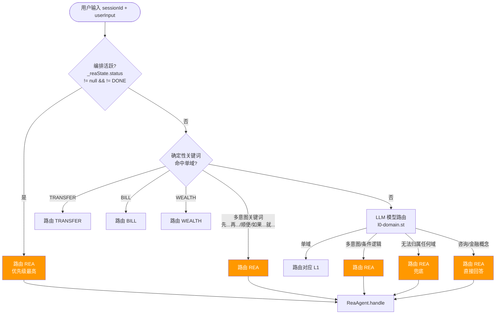
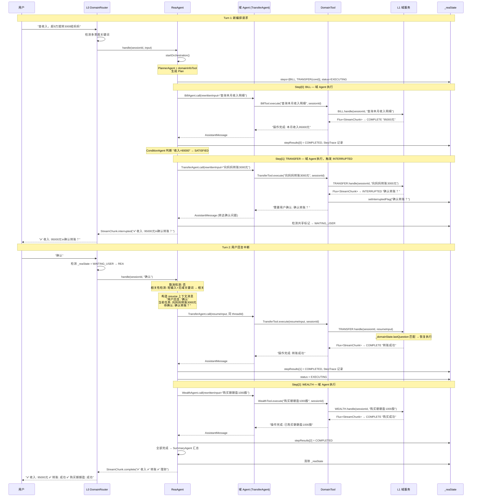
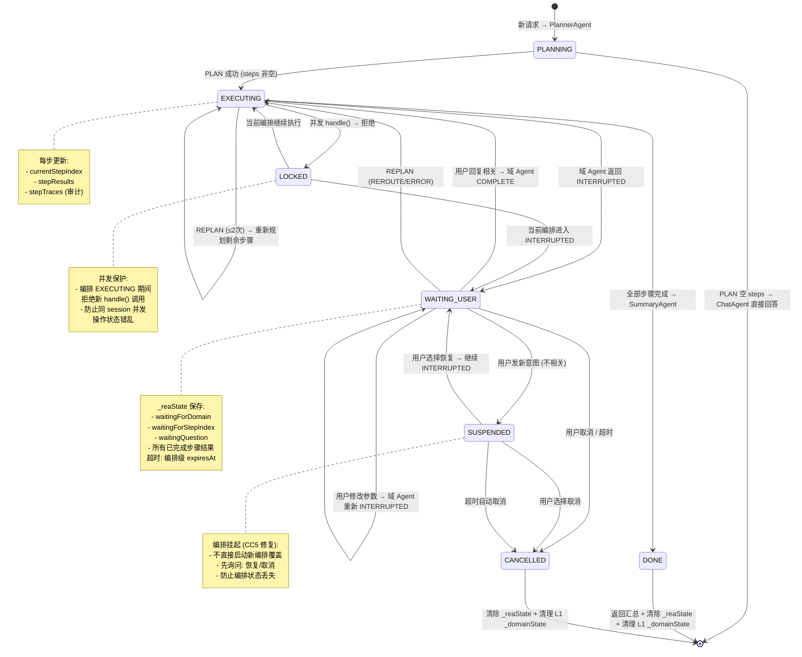

# 设计文档：ReaAgent — 复杂意图编排智能体

> **状态**: 草案 v4.1，待讨论
> **定位**: L1 域服务，与 TRANSFER/BILL/WEALTH 同级，注册为 `REA` 域；**取代 CHAT 域**
> **核心约束**: ReaAgent **只实现 DomainHandler 接口**，不继承 AbstractDomainService，内部逻辑完全自决
> **双重职责**: ① 复杂意图编排（跨域多意图、条件逻辑、顺序依赖） ② 知识问答兜底（咨询性、金融普适性问题）
> 
> **v4.0 核心变更**:
> - **三原则**: Plan 显式确定、执行路径代码驱动、每步留痕；不臆想，根据实际 L1 能力编排；L1 是唯一能力来源
> - **域 Agent 层**: TransferAgent/BillAgent/WealthAgent (ReactAgent) + DomainTool 封装 L1，Phase 1 专注自己的工具，Phase 2+ 可跨域调用
> - **取消 classifyRequest()**: 统一走 PlannerAgent，空 Plan 自动降级 ChatAgent
> - **INTERRUPTED 代码驱动**: 编排循环确定性暂停/恢复，不依赖模型判断
> - **domainInfoTool**: PlannerAgent 查询实际可用域/意图，杜绝臆想
> - **新增 WEALTH_PURCHASE**: 买基金/买理财（OPERATION, 写操作），丰富编排场景
> - **并发安全**: LOCKED 状态防止并发 handle()
>
> **v4.1 变更** (基于 Spring AI Alibaba 官方文档评估):
> - **outputType()**: PlannerAgent/ConditionAgent/RelevanceAgent 使用 outputType 强制结构化输出，Prompt 删除手写 JSON 格式段；自研模型走 ToolCall 退路
> - **ModelCallLimitHook**: 所有域 Agent 加 runLimit(5)，PlannerAgent runLimit(3)，ChatAgent runLimit(3)
> - **MemorySaver**: 所有 Agent 加 MemorySaver 对话连续性
> - **HumanInTheLoopHook 评估**: 不能替代自定义 INTERRUPTED（执行前审批 ≠ 执行中暂停），Phase 2+ 评估叠加
> - **SummarizationHook**: Phase 2 用框架内置替代自写
> - **独立 PlannerAgent 理由**: 记录为何不用 TodoListInterceptor
> - **StepTrace 审计**: 每步留痕（调了谁、传了什么、返回了什么、耗时）
> - **REPLAN 触发器**: L1 返回错误/REROUTE 时可触发重新规划

---

## 1. 背景与问题

### 1.1 现有架构回顾

```
用户输入
  │
  ▼
L0: BankController → DomainRouter → 分发到 L1 域
  │
  ├── TRANSFER (Single L1) → TransferGraph (L2)
  ├── BILL    (Single L1) → BillQueryGraph (L2)
  ├── WEALTH  (Multi L1)  → WealthConsultGraph / WealthInterpretGraph (L2)
  └── CHAT    (直接 LLM)
```

每个 L1 域服务只能处理**自己域内**的意图。跨域请求通过 `REROUTE` 机制回到 L0 重新路由，但 L0 的重新路由是无状态的——它不知道之前的路由历史，无法编排跨域的顺序执行。此外，咨询性问题（"什么是基金定投？"）、金融普适性概念（"利率和汇率有什么关系？"）等不属于任何特定域的问题，目前由 CHAT 域直接用 LLM 回答，但 CHAT 缺乏编排能力，也无法与其他域协作。

### 1.2 核心问题

| 问题 | 现有行为 | 期望行为 |
|------|---------|---------|
| **跨域多意图** | REROUTE 回 L0 重路由，每次独立，无全局编排 | 有计划地依次执行多个域的意图 |
| **条件逻辑** | 无法表达"如果 X 则 Y" | 根据前一步结果决定后续步骤 |
| **顺序依赖** | 前一步结果无法传递给后一步 | 前一步输出自动成为后一步的输入上下文 |
| **中途中断恢复** | INTERRUPTED 后用户回复由原 L1 处理，编排丢失 | 编排器记住整体进度，恢复后继续执行 |
| **结果聚合** | 每个域独立返回，无法综合 | 汇总多步结果，形成统一回复 |
| **咨询性问题** | CHAT 域直接 LLM 回答，无法调用域服务辅助 | ReaAgent 可编排"先查数据再解释"等混合流程 |
| **金融普适概念** | CHAT 域无金融知识增强 | ReaAgent 可结合域服务数据给出更准确的解释 |

### 1.3 设计原则

> **ReaAgent 只实现 `DomainHandler` 接口，内部逻辑完全自决。**

- ✅ 实现 `DomainHandler`，注册为 `REA` 域——对 L0 来说就是另一个 L1
- ✅ **取代 CHAT 域**——L1 无法独立处理的问题统一路由到 REA
- ✅ 不继承 `AbstractDomainService`——ReaAgent 不走 Phase1/Phase2 那套路由
- ✅ 不复用 ContextRouter / SubGraphRouter / SubGraphResolver——这些是单域路由逻辑，ReaAgent 是编排逻辑
- ✅ 内部可自由使用 Spring AI Alibaba 的 `SupervisorAgent` / `SequentialAgent` / `ReactAgent` / `ParallelAgent`
- ✅ 通过 `DomainServiceRegistry` 调用现有 L1 域服务，**现有 L1 零改动**
- ✅ 双重能力：编排（多步骤、条件逻辑）+ 通用智能（咨询、金融概念、兜底问答）

---

## 2. 复杂意图场景矩阵

### 2.1 用户提供的基础场景

> **"看看这个月的收入，如果剩下的钱多余90000，就转3000给我妈妈，顺便买1000股朝朝盈这个理财"**

分解:
1. `BILL_QUERY` → 查询本月收入
2. **条件判断**: 收入 > 90000?
3. `TRANSFER` → 转账3000给妈妈（写操作，需 INTERRUPTED 确认）
4. `WEALTH_PURCHASE` → 购买朝朝盈理财（写操作，需 INTERRUPTED 确认）

跨域: BILL → TRANSFER → WEALTH，含条件逻辑 + 双重 INTERRUPTED

### 2.2 扩展场景

| # | 场景 | 涉及域 | 关键难点 |
|---|------|--------|---------|
| S1 | **顺序依赖+双中断**: "帮我把活期里的5万转到理财账户，然后用那个钱买朝朝盈" | TRANSFER → WEALTH_PURCHASE | 连续两个写操作 → 双重 INTERRUPTED |
| S2 | **条件分支+中断**: "查下余额，够的话就转5000给老婆，不够就只转2000" | BILL → TRANSFER | 条件影响参数 + INTERRUPTED 确认 |
| S3 | **比较+购买**: "朝朝盈和余额宝哪个收益高？买收益高的那个1000块" | WEALTH_INTERPRET × 2 → WEALTH_PURCHASE | 同域多次执行+比较决策+INTERRUPTED 购买确认 |
| S4 | **回退容错**: "给我妈转5000，如果她账户有问题就转给我爸" | TRANSFER → (可能) TRANSFER | 前一步失败时的替代路径 |
| S5 | **并行+聚合**: "查一下我工资卡和储蓄卡的余额，告诉我总共多少" | BILL × 2 | 同域并行查询+结果聚合 |
| S6 | **意图修正**: "帮我转5000给…算了先查下余额够不够…够了就转吧" | INTERRUPT → BILL → RESUME TRANSFER | 中途改变意图，需要恢复之前挂起的子图 |
| S7 | **主动建议**: 用户只说"查下余额"，系统发现余额超10万，**主动建议**买理财 | BILL → (主动) WEALTH_PURCHASE | 非用户显式请求的后续动作 + INTERRUPTED 确认购买 |
| S8 | **多轮编排**: 三轮对话完成同一目标 | BILL → TRANSFER → WEALTH_PURCHASE | 编排跨越多轮对话，需要状态持久化 |
| S9 | **取消部分**: "查收入，转3000给妈妈，买朝朝盈——算了理财不买了" | BILL → TRANSFER → ~~WEALTH_PURCHASE~~ | 编排过程中取消部分步骤 |
| S10 | **反思验证**: "转完账后帮我确认下余额是不是对了" | TRANSFER → BILL → **验证** | 后续步骤需要验证前一步的结果 |
| S11 | **咨询+操作**: "什么是基金定投？帮我买1000块的" | REA(咨询) → WEALTH_PURCHASE | 先解释概念，再执行写操作+INTERRUPTED |
| S12 | **纯咨询**: "利率和汇率有什么关系？" | REA (直接回答) | 无需调用域服务，纯金融知识问答 |
| S13 | **兜底问答**: "你们银行周末上班吗？" | REA (直接回答) | 不属于任何特定域，通用回答 |
| S14 | **混合编排+咨询**: "帮我分析下最近的理财收益，然后推荐下一步操作" | BILL → WEALTH_CONSULT → REA(咨询) | 域服务执行后，附加金融建议 |
| S15 | **推荐+购买**: "推荐一个稳健型理财，然后帮我买" | WEALTH_CONSULT → WEALTH_PURCHASE | 咨询→操作，INTERRUPTED 购买确认 |
| S16 | **条件购买**: "余额够的话帮我买那个5%的理财" | BILL_QUERY → CONDITION → WEALTH_PURCHASE | 条件判断+INTERRUPTED 购买确认 |
| S17 | **对比购买**: "对比3款理财，买收益最高的" | WEALTH_INTERPRET × 3 → CONDITION → WEALTH_PURCHASE | 多次解读+条件选择+INTERRUPTED 购买确认 |

### 2.3 压力测试场景（架构边界挑战）

> 以下场景专门测试架构的边界条件。基于 v4.0 架构重新评估每个场景的兜住能力。

#### T1: 编排中用户改变意图

> **"查收入，超9万就转5000给妈妈……等等，转给我老婆吧"**

| 阶段 | 用户说 | 系统状态 |
|------|--------|---------|
| Turn 1 | "查收入，超9万就转5000给妈妈" | PLAN: [BILL(cond=null), TRANSFER(转5000给妈妈, cond=收入>9万)] |
| Turn 1 执行 | — | BILL → COMPLETE "95000元" |
| Turn 1 执行 | — | TRANSFER → INTERRUPTED "确认转5000给妈妈？" |
| Turn 2 | "等等，转给我老婆吧" | _reaState = WAITING_USER, waitingForDomain=TRANSFER |

**v3.1 评估**: ⚠️ 部分兜住。转发给 L1 后行为取决于 L1 的理解能力。

**v4.0 评估**: ✅ **可兜住**。TransferAgent 是 ReactAgent，具有自然语言理解能力。用户说"转给我老婆吧"，TransferAgent 的模型理解这是修改收款人 → 重新调用 TransferTool → L1 收到新输入后重新处理 → 再次 INTERRUPTED "确认转5000给老婆？"。如果 TransferAgent 模型无法理解，Phase 2 的 REPLAN 触发器可作为兜底——检测到回复与当前中断不匹配且不是简单确认/否定时，触发重新规划。

---

#### T2: 嵌套中断——编排中 L1 中断后用户又触发新编排

> **Turn 1**: "查收入，超9万就转账" → BILL COMPLETE → TRANSFER INTERRUPTED "确认？"
> **Turn 2**: "等等，先帮我查下理财收益" → 用户新意图

**v3.1 评估**: ❌ **不能兜住**。所有回复直接转发给等待中的 L1。

**v4.0 评估**: ✅ **已解决**。回复相关性检测机制：
1. **规则优先**（0ms）: 如果用户输入长度 > 20字，或包含领域关键词（"理财"/"余额"/"账单"），判定为**不相关**
2. **模型兜底**: 规则不确定时，调 RelevanceAgent（ReactAgent + outputType）判断
3. 判定为不相关 → 挂起当前编排（status=SUSPENDED），启动新请求处理
4. 新请求完成后，提示用户是否恢复之前的编排

---

#### T3: 同一域多次执行+结果比较

> **"朝朝盈和余额宝哪个收益高？买收益高的那个1000块"**

**v3.1 评估**: ⚠️ 部分兜住。condition 只支持单步骤引用。

**v4.0 评估**: ✅ **可兜住**。ConditionAgent 是 ReactAgent（非规则引擎），LLM 天然支持跨步骤比较。condition 字段可写 `"步骤0的收益率 > 步骤1的收益率"`，ConditionAgent 从 StepTrace 中提取两步结果进行比较。

---

#### T4: 并行步骤 + 其中一个 INTERRUPTED

> **"查工资卡和储蓄卡余额"** → 两个 BILL 并行查询

**v4.0 评估**: ⚠️ Phase 1 串行执行**可兜住**。Phase 2 并行设计待定——任一步骤 INTERRUPTED 时暂停该步骤，等待其他并行步骤完成后依次处理。

---

#### T5: L1 返回 REROUTE 而非 COMPLETE/INTERRUPTED

> **用户**: "转5000给张三" → TRANSFER L1 返回 REROUTE

**v3.1 评估**: ❌ **不能兜住**。

**v4.0 评估**: ✅ **已解决**。REROUTE 触发 REPLAN：
1. DomainTool 检测到 StreamChunk.type == REROUTE
2. 编排循环标记当前步骤为 FAILED(reroute)
3. 触发 REPLAN——将 REROUTE 信息（rerouteIntent、已完成的步骤结果）传给 PlannerAgent
4. PlannerAgent 基于最新信息重新规划剩余步骤
5. 如果 REPLAN 连续失败 2 次 → CANCELLED + 向用户解释

---

#### T6: 编排超时——用户 30 分钟后回复

**v3.1 评估**: ❌ 超时后编排状态丢失。

**v4.0 评估**: ✅ **已解决**。超时处理机制：
1. _reaState.expiresAt 到期 → 自动转为 CANCELLED
2. 清理前向用户发送通知 StreamChunk: "您的操作已超时，如需继续请重新发起"
3. L1 域服务的 _domainState 也有过期机制，双层保护
4. 用户超时后回复 → L0 不再路由到 REA → 作为新请求处理（正确行为）

---

#### T7: 分类错误——编排被分为直接回答

> **"帮我把活期里的5万转到理财账户"** → classifyRequest() 误判为 DIRECT_ANSWER

**v3.1 评估**: ❌ P0 问题。

**v4.0 评估**: ✅ **彻底解决**。v4.0 **取消了 classifyRequest() 步骤**。所有请求统一走 PlannerAgent。如果 Plan 输出空 steps[] → 自动降级为 ChatAgent 直接回答。分类错误的根因已消除——不存在"分类"这一步了。

---

#### T8: PLAN 输出空步骤

> **"你好"** → PLAN 输出空 steps[]

**v3.1 评估**: ⚠️ 可以兜住但体验差。

**v4.0 评估**: ✅ **已解决**。空 steps[] → 代码检测 → 自动降级 ChatAgent → 流畅体验。

---

#### T9: 步骤间上下文爆炸

> **10 步骤编排**，每步结果 500 字 → 第 10 步 prompt 4500 字

**v4.0 评估**: ⚠️ Phase 1 通过 maxSteps=10 限制步骤数量。Phase 2 引入 SummarizationHook + 摘要策略：完成 3 步后，将前序结果摘要为 100 字。ConditionAgent 只注入相关步骤的 StepTrace。

---

#### T10: 取消编排

> **用户**: "算了不搞了"（WAITING_USER 状态下）

**v3.1 评估**: ⚠️ 部分兜住。

**v4.0 评估**: ✅ **可兜住**。取消意图检测机制：
1. **规则优先**: 维护取消关键词表（"算了"/"取消"/"不搞了"/"不要了"等）→ 直接判定为取消
2. **模型兜底**: 短输入（<10字）+ 否定语义 → RelevanceAgent 判定为取消
3. 取消 → status=CANCELLED → 清理 _reaState → 返回"编排已取消"

---

#### T11: 直接回答→编排模式切换

> **Turn 1**: "什么是基金定投？" → ChatAgent 直接回答
> **Turn 2**: "帮我买1000块定投" → 应走编排

**v4.0 评估**: ✅ **可兜住**。Turn 2 不走 ChatAgent 而是走 PlannerAgent（所有新请求统一走 PLAN），PlannerAgent 会生成包含 WEALTH_PURCHASE 的编排步骤。ChatAgent 的 MemorySaver 对话历史通过 GlobalSessionContext.messages 自动传递给 PlannerAgent。

---

#### T12: 同域内的互斥条件分支

> **"查下余额，够的话转5000，不够转2000"**

**v4.0 评估**: ✅ **可兜住**。ConditionAgent（ReactAgent）天然支持否定条件和互斥判断。Plan 可以这样生成：
```
Step 1: BILL(查余额)
Step 2: TRANSFER(转5000, condition="步骤0的余额 >= 5000")
Step 3: TRANSFER(转2000, condition="步骤0的余额 < 5000 且 余额 >= 2000")
```
ConditionAgent 对每个步骤独立判断，Step 2 和 Step 3 互斥时只会执行其中一个。

---

#### T13: 同一步骤多轮 INTERRUPTED

> **"转3000给妈妈" → INTERRUPTED "确认收款人？" → "确认" → INTERRUPTED "请输入密码" → "123456" → COMPLETE**

**v4.0 评估**: ✅ **架构正确**。WAITING_USER → 用户回复 → 域 Agent 再次执行 → L1 仍 INTERRUPTED → 继续等待。_reaState 的 waitingForStepIndex 不变，只是多轮等待。StepTrace 记录每轮交互。

---

#### T14: 步骤数据被错误引用

> **Step[0]: BILL → "收入95000元" → Step[1]: TRANSFER 的 rewrittenInput 错误地变成 "转95000元"**

**v4.0 评估**: ✅ **可兜住**。两层防护：
1. **domainInfoTool 防臆想**: PlannerAgent 查询实际能力时看到 TRANSFER 的 scope 是"资金转账操作"，不会假设 TRANSFER 有"按查到的金额转账"这种能力
2. **PLAN prompt 参数保护**: "rewrittenInput 中的金额参数必须来自用户原始请求，不能来自前序步骤的结果，除非用户明确说'转刚才查到的金额'"
3. **StepTrace 审计**: 每步记录原始用户意图 vs rewrittenInput，可事后审查

---

### 2.4 压力测试结果汇总（v4.0 重新评估）

| # | 场景 | v3.1 | v4.0 | 解决机制 | 优先级 |
|---|------|------|------|---------|--------|
| T1 | 编排中修改意图 | ⚠️ | ✅ | 域 Agent ReactAgent 可理解参数修改 + Phase2 REPLAN | — |
| T2 | 中断后用户发新意图 | ❌ | ✅ | **回复相关性检测**（规则+模型）+ 挂起编排 | ~~P0~~ 已解决 |
| T3 | 跨步骤条件比较 | ⚠️ | ✅ | ConditionAgent(ReactAgent) 天然支持多步引用 | — |
| T4 | 并行+中断 | ❌ | ⚠️ | Phase1 串行✅ / Phase2 并行待设计 | P3 |
| T5 | L1 返回 REROUTE | ❌ | ✅ | **REROUTE → REPLAN 触发器** | ~~P1~~ 已解决 |
| T6 | 编排超时后恢复 | ❌ | ✅ | **超时→CANCELLED + 用户通知** | ~~P2~~ 已解决 |
| T7 | 分类错误 | ❌ | ✅ | **取消 classifyRequest，统一走 PLAN** | ~~P0~~ 已解决 |
| T8 | PLAN 输出空步骤 | ⚠️ | ✅ | **空 steps[] → 自动降级 ChatAgent** | ~~P1~~ 已解决 |
| T9 | 步骤间上下文爆炸 | ❌ | ⚠️ | maxSteps=10 限制 / Phase2 SummarizationHook | P2 |
| T10 | 取消编排 | ⚠️ | ✅ | **取消关键词表 + RelevanceAgent** | ~~P1~~ 已解决 |
| T11 | 直接回答→编排切换 | ⚠️ | ✅ | 新请求统一走 PLAN + GlobalSessionContext 传递上下文 | — |
| T12 | 同域互斥条件分支 | ⚠️ | ✅ | ConditionAgent 天然支持否定+互斥 | — |
| T13 | 同步骤多轮 INTERRUPTED | ✅ | ✅ | 不变 | — |
| T14 | 步骤数据错误引用 | ❌ | ✅ | **domainInfoTool 防臆想** + prompt 参数保护 + StepTrace 审计 | ~~P1~~ 已解决 |

**v4.0 结论**: 14 个压力测试场景中，**10 个已解决（✅）**，2 个部分解决（⚠️ T4 并行待 Phase 2、T9 上下文爆炸待 Phase 2），2 个架构正确（✅ T13）。

**Phase 1 遗留问题**:

| 问题 | 优先级 | Phase 1 处理 |
|--------|--------|------------|
| T4: 并行执行+INTERRUPTED | P3 | Phase 1 串行执行，无并行 |
| T9: 长编排上下文爆炸 | P2 | maxSteps=10 限制；Phase 2 加 SummarizationHook |

---

## 3. 现有 L1 能力边界

### 3.1 L1 域服务能力清单

> v4.0 新增 WEALTH_PURCHASE（买基金/买理财），丰富编排场景。

| 域 | 类型 | 意图 | 类型 | 写操作 | 说明 |
|----|------|------|------|--------|------|
| TRANSFER | Single | TRANSFER | OPERATION | ✅ | 转账，需 INTERRUPTED 确认 |
| BILL | Single | BILL_QUERY | QUERY | ❌ | 账单查询，只读 |
| WEALTH | Multi | WEALTH_CONSULT | CONSULTATION | ❌ | 理财咨询/推荐 |
| WEALTH | Multi | WEALTH_INTERPRET | CONSULTATION | ❌ | 理财产品解读 |
| WEALTH | Multi | WEALTH_PURCHASE | OPERATION | ✅ | 买基金/买理财，需 INTERRUPTED 确认 |
| ~~CHAT~~ | — | — | — | — | **被 REA 取代，不再注册** |

### 3.2 ReaAgent 能力矩阵

| 能力 | Single L1 | Multi L1 | ReaAgent (REA) |
|------|-----------|----------|----------------|
| 执行单意图 L2 Graph | ✅ | ✅ | — |
| FOLLOW (恢复中断对话) | ✅ | ✅ | ✅ (编排级) |
| SWITCH (同域切换意图) | — | ✅ | — |
| RESUME (恢复挂起子图) | — | ✅ | ✅ (跨域恢复) |
| 消歧 (多意图追问) | — | ✅ | ✅ |
| 跨域 REROUTE | ✅ (回到 L0) | ✅ (回到 L0) | ✅ (REPLAN 重新规划) |
| 直接 LLM 对话 | — | — | ✅ (知识问答) |
| 条件逻辑 | — | — | ✅ (ConditionAgent) |
| 编排执行 | — | — | ✅ (代码驱动循环) |
| 金融知识问答 | — | — | ✅ (ChatAgent) |
| 每步留痕审计 | — | — | ✅ (StepTrace) |
| 中断相关性检测 | — | — | ✅ (规则+模型) |
| REPLAN 触发 | — | — | ✅ (REROUTE/ERROR→重新规划) |

### 3.2 不能做什么（ReaAgent 填补的空白）

| 缺失能力 | 具体表现 |
|---------|---------|
| ❌ 跨域编排 | REROUTE 回 L0 后丢失上下文，无法串联执行 |
| ❌ 条件逻辑 | 无法根据前一步结果决定后续动作 |
| ❌ 顺序依赖 | 无法将前一步输出注入后一步输入 |
| ❌ 结果聚合 | 无法收集多步结果形成统一回复 |
| ❌ 编排状态持久化 | 无法跨多轮对话维护编排进度 |
| ❌ 主动建议 | 无法基于执行结果主动触发后续操作 |
| ❌ 步骤级取消 | 无法在编排过程中取消部分步骤 |
| ❌ L1 兜底 | 咨询性、金融普适性问题无合适处理域 |

> **注意**: 上述"缺失"是 ReaAgent 出现前的状态。ReaAgent 将填补所有这些空白。

---

## 4. Spring AI Alibaba 框架能力深度分析

> **v3 关键修正**: v2 声称"框架不支持中断恢复"是**错误的**。以下基于源码逐一验证。

### 4.1 中断与恢复机制（源码验证）

#### 4.1.1 InterruptionHook — BEFORE_MODEL 中断

**源码位置**: `agent/hook/InterruptionHook.java`

**机制**: 
- `interrupt()` 检查 `agentThreadState` 中 `INTERRUPTION_FEEDBACK_KEY` 的值
  - 值为空 List → 返回 `InterruptionMetadata` → **图暂停**
  - 值为非空 List 或非 List → 不中断 → **继续执行**
- `apply()` 在恢复时执行：原子读取并移除 feedback，将其作为 `UserMessage` 注入 messages

**触发方式**:
```java
// 暂停: 设置空 feedback
agent.interrupt(List.of(), config);  // INTERRUPTION_FEEDBACK_KEY = []

// 恢复: 设置用户回复
agent.interrupt("用户的回复", config);  // INTERRUPTION_FEEDBACK_KEY = [UserMessage]
```

**设计意图**: 让 Agent 在推理循环中主动暂停，等待外部输入后继续。适用于"Agent 在某步需要人类判断"的场景。

#### 4.1.2 HumanInTheLoopHook — AFTER_MODEL 工具审批

**源码位置**: `agent/hook/hip/HumanInTheLoopHook.java`

**机制**:
- `interrupt()` 在模型生成工具调用后触发（AFTER_MODEL 位置）
- 检查工具调用是否匹配 `approvalOn` 配置
- 匹配且无反馈 → 返回 `InterruptionMetadata` → **图暂停**
- 恢复时通过 `InterruptionMetadata.ToolFeedback` 提供 approve/edit/reject 决策
- 框架根据决策执行/修改/拒绝工具调用

**设计意图**: 在工具执行前请求人类审批。三种决策类型：
- `APPROVED`: 原样执行
- `EDITED`: 修改参数后执行
- `REJECTED`: 拒绝执行，向模型反馈原因

#### 4.1.3 Workflow 嵌套中断传播

**官方文档验证**: 当 `ReactAgent`（带 HumanInTheLoopHook）作为节点嵌入 `StateGraph` 工作流时：
- 工作流在 Agent 节点触发中断时**整体暂停**
- 通过 `CompiledGraph.invokeAndGetOutput()` 检查中断
- 通过 `RunnableConfig.addHumanFeedback()` 恢复
- **前提**: 工作流和嵌套 Agent 共享同一个 `CheckpointSaver` 实例

#### 4.1.4 AgentToSubCompiledGraphNodeAdapter — 子图可恢复

**源码位置**: `ReactAgent.java:973`

`AgentToSubCompiledGraphNodeAdapter` 实现了 `ResumableSubGraphAction`，使 Agent 作为子图嵌入父图时支持恢复。

#### 4.1.5 框架中断能力总结

| 机制 | 触发时机 | 暂停位置 | 恢复方式 |
|------|---------|---------|---------|
| InterruptionHook | BEFORE_MODEL (模型调用前) | Agent 推理循环 | 设置 feedback → invoke() |
| HumanInTheLoopHook | AFTER_MODEL (工具调用生成后) | 工具执行前 | 提供审批决策 → invoke() |
| Workflow 嵌套 | 子 Agent 中断时 | 父工作流节点 | CompiledGraph 恢复 |

### 4.2 核心语义鸿沟：框架中断 vs 域服务中断

**这是 ReaAgent 设计中最关键的判断。**

| 维度 | 框架中断 | 域服务 INTERRUPTED |
|------|---------|-------------------|
| **触发时机** | 模型调用前 / 工具执行前 | 工具执行过程中（域服务返回 INTERRUPTED） |
| **语义** | "应该执行这个工具吗？" | "域服务已执行，但需要用户提供更多信息才能继续" |
| **暂停粒度** | Agent 级别（整个推理循环暂停） | 编排步骤级别（当前步骤暂停，其他步骤可能继续） |
| **恢复输入** | approve/edit/reject 决策 | 用户对域服务提问的自然语言回答 |
| **信息流向** | 中断时携带工具名+参数（尚未执行） | 中断时携带域服务提问（已部分执行） |

**结论**: 框架中断是"执行前审批"，域服务中断是"执行中暂停"。这是**根本性的语义差异**，不是适配层能弥合的。

#### 为什么框架中断不能直接用于我们的 INTERRUPTED

假设用 M1（框架原生），当 DomainTool 调用 DomainHandler.handle() 返回 INTERRUPTED 时的处理链：

```
1. DomainTool 检测到 INTERRUPTED → 存储提问到 state
2. DomainTool 必须返回结果给模型（tool 必须有返回值）
3. 模型看到 "INTERRUPTED" 结果 → 需要理解这意味着"暂停"
4. 模型不能生成新的工具调用（否则 InterruptionHook 不会触发）
5. 下一次循环 → InterruptionHook(BEFORE_MODEL) 检查 → INTERRUPTION_FEEDBACK_KEY 为空 → 暂停
6. 用户回复 → 设置 INTERRUPTION_FEEDBACK_KEY → invoke() → InterruptionHook 注入用户回复
7. 模型需要理解注入的回复是中断步骤的延续，而非新请求
```

**4 个连续失败点**，每个都依赖 prompt engineering 完美工作：
- 步骤 3: 模型可能误解 INTERRUPTED 含义
- 步骤 4: 模型可能生成新工具调用（导致 HumanInTheLoopHook 介入，而非 InterruptionHook）
- 步骤 5: 需要确保 INTERRUPTION_FEEDBACK_KEY 在正确时机为空
- 步骤 7: 模型可能将用户回复视为新请求而非中断恢复

**此外还有两个结构性问题**:
- **Flux\<StreamChunk\> 丢失**: ReactAgent 的 tool 必须返回字符串，无法传递流式 chunk。DomainTool 只能返回终结 chunk 信息，丢弃所有流式文本——用户看不到"正在转账中..."等进度。
- **双重状态**: 框架的 `OverAllState` 与我们的 `GlobalSessionContext` 是两套独立的体系，需要双向桥接。

### 4.3 上下文工程（Context Engineering）

框架提供三类上下文控制：

| 上下文类型 | 控制内容 | 持久性 | ReaAgent 适用性 |
|-----------|---------|--------|----------------|
| **模型上下文** | 系统提示、消息历史、工具、模型、响应格式 | 瞬态 | ✅ PLAN/EVALUATE 的 LLM 调用 |
| **工具上下文** | 工具读写 OverAllState，通过 extraState 持久化 | 持久 | ⚠️ 仅 M1 方案适用；M2 用 DomainState 替代 |
| **生命周期上下文** | BEFORE_AGENT/AFTER_AGENT/BEFORE_MODEL/AFTER_MODEL Hooks | 持久 | ✅ PLAN ReactAgent 可用 |

**ReaAgent 应采用的上下文工程手段**:

| 手段 | 是否采用 | 原因 |
|------|---------|------|
| `ModelInterceptor` (动态提示注入) | ✅ Phase 2 | 将已完成步骤结果注入 EVALUATE 的 system prompt |
| `SummarizationHook` (消息摘要) | ✅ Phase 2 | 长编排会话（5+ 步骤）上下文爆炸风险 |
| `extraState` (工具写状态) | ❌ M2 不需要 | 我们的 DomainState 已等效；引入 OverAllState 写入造成双重状态 |
| `MessagesModelHook` (消息过滤) | ✅ Phase 2 | 过滤已完成步骤的冗余消息，控制上下文长度 |
| `Lifecycle Hooks` (BEFORE/AFTER_AGENT) | ⚠️ Phase 3 | 可用于编排可观测性/日志，非核心需求 |

**关键原则**: 用框架的上下文工程服务 **LLM 调用部分**（PLAN、EVALUATE），不用它管理**编排循环本身**。

### 4.4 记忆管理（Memory）

框架提供两层记忆：

| 记忆层 | 实现 | 作用域 | ReaAgent 适用性 |
|--------|------|--------|----------------|
| **短期记忆** | `MemorySaver` (checkpoint) | 会话内（threadId） | ⚠️ 用于 PLAN/EVALUATE 的对话历史 |
| **长期记忆** | `MemoryStore` (namespace/key) | 跨会话 | ❌ Phase 1 不需要 |

**ReaAgent 的记忆策略**:

```
┌─────────────────────────────────────────────────┐
│  编排状态 (WAITING_USER, steps, results...)      │  → _reaState (DomainState)
│  这是我们的中断/恢复机制，不是框架的 checkpoint    │
├─────────────────────────────────────────────────┤
│  PLAN/EVALUATE 对话历史                          │  → MemorySaver (Phase 2)
│  使编排内的多轮 LLM 调用保持连贯                  │
├─────────────────────────────────────────────────┤
│  跨会话编排模式                                  │  → MemoryStore (Phase 3)
│  "用户总是确认大额转账"等偏好学习                  │
└─────────────────────────────────────────────────┘
```

**为什么不用框架 CheckpointSaver 做中断恢复？** 我们的 INTERRUPTED 是域语义中断（"域服务需要用户输入"），不是框架语义中断（"Agent 推理循环暂停"）。`_reaState` 保存的是编排位置（哪一步、什么状态），与框架 checkpoint 保存的图执行位置是不同的东西。使用 `_reaState` 还与所有其他 L1 域服务的工作方式一致。

### 4.5 多智能体原语

#### 4.5.1 ReactAgent — 基础 Agent 单元

```java
ReactAgent agent = ReactAgent.builder()
    .name("transfer_agent")
    .model(chatModel)
    .description("处理转账相关操作")
    .instruction("你是一个转账助手。用户请求：{input}")
    .outputKey("transfer_result")
    .build();
```

- 每个子 Agent 有独立的 `outputKey`，执行结果存入 `OverAllState`
- 后续 Agent 可通过 `{outputKey}` 占位符引用前序 Agent 的输出
- 支持绑定 Tools、Hooks、Interceptors
- 支持 `MemorySaver` (checkpoint) 和 `MemoryStore` (长期记忆)

**与现有 L1 的关系**: 现有 L1 (DomainHandler) **不是** ReactAgent。需要一个适配层。

#### 4.5.2 SupervisorAgent — 条件路由编排

```java
SupervisorAgent supervisor = SupervisorAgent.builder()
    .name("orchestrator")
    .model(chatModel)
    .systemPrompt(SUPERVISOR_SYSTEM_PROMPT)
    .instruction(SUPERVISOR_INSTRUCTION)
    .subAgents(List.of(agentA, agentB, agentC))
    .build();
```

- LLM 决定路由到哪个 subAgent（返回 agent 名或 FINISH）
- 循环执行：每次 subAgent 完成后回到 Supervisor，Supervisor 决定下一步
- 内部由 `RoutingGraphBuildingStrategy` 构建 LLM 路由图

#### 4.5.3 SequentialAgent — 顺序执行

```java
SequentialAgent workflow = SequentialAgent.builder()
    .name("bill_then_transfer")
    .subAgents(List.of(billAgent, transferAgent))
    .build();
```

- 严格顺序执行，自动通过 `outputKey` + `{placeholder}` 传递数据
- 内部由 `SequentialGraphBuildingStrategy` 构建线性链

#### 4.5.4 LoopAgent — 循环执行

```java
LoopAgent loop = LoopAgent.builder()
    .name("refine_loop")
    .subAgents(List.of(refineAgent))
    .loopStrategy(loopStrategy)
    .build();
```

- 单个 subAgent 反复执行，由 `LoopStrategy` 控制循环条件
- beforeModel/afterModel Hooks 在每次迭代中执行
- 适合"反复优化直到满足条件"的场景

#### 4.5.5 ParallelAgent — 并行执行

```java
ParallelAgent parallel = ParallelAgent.builder()
    .name("parallel_query")
    .subAgents(List.of(billAgent1, billAgent2))
    .mergeOutputKey("merged_bill_result")
    .build();
```

#### 4.5.6 原语与场景映射

| 场景 | 最匹配的原语 | 组合方式 |
|------|------------|---------|
| S1 顺序依赖 | `SequentialAgent` | 直接使用，outputKey 传数据 |
| S2 条件分支 | `SupervisorAgent` | instruction 中写条件规则 |
| S3 比较决策 | `SequentialAgent` + `SupervisorAgent` | Sequential 执行两次查询 → Supervisor 决定买哪个 |
| S4 回退容错 | `SupervisorAgent` | Supervisor 判断失败后路由到替代 Agent |
| S5 并行聚合 | `ParallelAgent` | 直接使用 |

---

## 5. 架构方案

### 5.1 整体架构图

```
用户输入
   │
   ▼
L0: BankController → DomainRouter → 分发到 L1 域
   │
   ├── TRANSFER (Single L1) → TransferGraph (L2)
   ├── BILL    (Single L1) → BillQueryGraph (L2)
   ├── WEALTH  (Multi L1)  → WealthConsultGraph / WealthInterpretGraph / WealthPurchaseGraph (L2)
   └── REA     (ReaAgent)  ← 取代原 CHAT 域，兜底路由 + 编排路由
                        │ ReaAgent.handle(sessionId, userInput)
                        ▼
┌──────────────────────────────────────────────────────────────────┐
│              ReaAgent implements DomainHandler                    │
│              (注册为 "REA" 域，取代原 CHAT 域)                    │
│                                                                   │
│  ┌─ 三原则 ──────────────────────────────────────────────────┐  │
│  │  ① Plan 显式确定，执行路径代码驱动，每步留痕              │  │
│  │  ② 不臆想，根据 L1 实际能力编排                           │  │
│  │  ③ L1 是唯一能力来源，ReaAgent 只做编排 + 知识回答        │  │
│  └───────────────────────────────────────────────────────────┘  │
│                                                                   │
│  ┌─ LLM 交互层 (全部 ReactAgent) ────────────────────────────┐  │
│  │                                                             │  │
│  │  PlannerAgent (ReactAgent)                                  │  │
│  │    + outputType (OrchestrationPlan.class)                   │  │
│  │    + domainInfoTool (查询实际可用域/意图，防臆想)           │  │
│  │    + MemorySaver (对话历史)                                 │  │
│  │    → 输出: OrchestrationStep[]                              │  │
│  │    → 空 steps[] = 自动降级 ChatAgent                        │  │
│  │                                                             │  │
│  │  ConditionAgent (ReactAgent)                                │  │
│  │    + outputType (ConditionCheckResult.class)                │  │
│  │    → 判断步骤结果是否满足条件                               │  │
│  │    → 天然支持跨步骤比较、互斥条件                           │  │
│  │                                                             │  │
│  │  SummaryAgent (ReactAgent)                                  │  │
│  │    → 汇总多步结果，生成用户友好回复                         │  │
│  │                                                             │  │
│  │  ChatAgent (ReactAgent, 无操作 Tool)                        │  │
│  │    + MemorySaver (多轮对话历史)                             │  │
│  │    → 纯知识问答（金融概念、银行FAQ）                        │  │
│  │    → 不绑定任何域查询 Tool，L1 是唯一能力来源              │  │
│  │                                                             │  │
│  │  RelevanceAgent (ReactAgent)                                │  │
│  │    + outputType (RelevanceCheckResult.class)                │  │
│  │    → 判断用户回复是否与当前 INTERRUPTED 相关               │  │
│  │    → 仅规则不确定时调用（规则优先，0ms）                    │  │
│  └───────────────────────────────────────────────────────────┘  │
│                                                                   │
│  ┌─ 编排循环 (代码驱动，确定性执行，每步留痕 StepTrace) ─────┐  │
│  │  for step in plan:                                          │  │
│  │    1. 路由到对应域 Agent 执行                               │  │
│  │    2. 收集结果 → 生成 StepTrace (域、参数、结果、耗时)     │  │
│  │    3. 检测 INTERRUPTED → 确定性暂停                         │  │
│  │    4. 条件步骤 → ConditionAgent 判断                        │  │
│  │    5. REROUTE → REPLAN 重新规划                             │  │
│  │    6. ERROR → 跳过/REPLAN                                   │  │
│  │    7. 继续 / 跳过 / 暂停 / REPLAN                           │  │
│  └───────────────────────────────────────────────────────────┘  │
│                                                                   │
│  ┌─ 域 Agent 层 (ReactAgent + DomainTool 封装 L1) ──────────┐  │
│  │                                                             │  │
│  │  TransferAgent (ReactAgent)                                 │  │
│  │    tools: [TransferTool]  ← 封装 L1 TRANSFER.handle()      │  │
│  │    Phase 1: 只用自己的 TransferTool                         │  │
│  │    Phase 2+: 可加 BillTool 等，自主跨域调用                 │  │
│  │                                                             │  │
│  │  BillAgent (ReactAgent)                                     │  │
│  │    tools: [BillTool]      ← 封装 L1 BILL.handle()          │  │
│  │                                                             │  │
│  │  WealthAgent (ReactAgent)                                   │  │
│  │    tools: [WealthConsultTool,                               │  │
│  │            WealthInterpretTool,                             │  │
│  │            WealthPurchaseTool]                              │  │
│  │                         ← 封装 L1 WEALTH.handle()          │  │
│  └───────────────────────────────────────────────────────────┘  │
│                                                                   │
│  状态: _reaState (ReaOrchestrationState, 组合 DomainState)       │
└──────────────────────────────────────────────────────────────────┘
         │ DomainTool 内部调用           │
         ▼                              │
┌──────────────────────────────────────────────────────────────────┐
│       现有 L1 域服务 (完全不变，无感知被 ReaAgent 调用)            │
│       DomainHandler.handle() 统一接口                             │
│       TRANSFER / BILL / WEALTH (含 WEALTH_PURCHASE)              │
│       (原 CHAT 域被 REA 取代，不再注册)                           │
└──────────────────────────────────────────────────────────────────┘
```

### 5.2 ReaAgent 核心职责

| 职责 | 说明 | 模式 |
|------|------|------|
| **意图分解** | 将复杂意图分解为有序步骤 (Plan)，基于 L1 实际能力 | 编排 |
| **步骤执行** | 通过域 Agent 调用 L1 执行每步 (Execute) | 编排 |
| **条件判断** | 根据前序结果决定是否/如何执行后续步骤 (Condition) | 编排 |
| **中断处理** | L1 返回 INTERRUPTED 时代码驱动暂停，回复相关性检测后恢复 | 编排 |
| **结果聚合** | 汇总多步结果，生成统一回复 (Summary) | 编排 |
| **状态持久化** | 编排进度存入 `_reaState`，跨多轮对话保持 | 编排 |
| **REPLAN** | REROUTE/ERROR 时触发重新规划 | 编排 |
| **步骤审计** | 每步生成 StepTrace，可回溯 | 编排 |
| **金融咨询** | 直接回答金融概念、银行知识、产品解释等问题 | 知识问答 |
| **L1 兜底** | 其他 L1 无法处理的请求统一由 REA 接管 | 知识问答 |

### 5.3 域 Agent 设计 — L1 能力封装 + 未来跨域扩展

```
┌─ Phase 1: 专注自己的工具 ─────────────────────────────────┐
│                                                             │
│  TransferAgent ──── TransferTool ──→ L1 TRANSFER.handle()  │
│  BillAgent ──────── BillTool ──────→ L1 BILL.handle()      │
│  WealthAgent ────── WealthConsultTool ──→ L1 WEALTH        │
│                    WealthInterpretTool ─→ L1 WEALTH         │
│                    WealthPurchaseTool ──→ L1 WEALTH         │
└─────────────────────────────────────────────────────────────┘

┌─ Phase 2+: 跨域调用能力 ──────────────────────────────────┐
│                                                             │
│  TransferAgent ──── TransferTool                            │
│                    + BillTool ──────→ L1 BILL.handle()      │
│                      (转账前可自主查余额)                    │
│                                                             │
│  WealthAgent ────── WealthConsultTool                       │
│                    WealthInterpretTool                       │
│                    WealthPurchaseTool                        │
│                    + BillTool ──────→ L1 BILL.handle()      │
│                      (买理财前可自主查余额)                  │
│                                                             │
│  实现: 只需给域 Agent 添加新 Tool，接口不变                  │
│  ReactAgent 框架天然支持多 Tool，模型自主决定调用哪个        │
└─────────────────────────────────────────────────────────────┘
```

### 5.4 域 Agent 上下文策略 — 仅自包含 rewrittenInput，不看原始输入

> 关键设计决策：子 Agent 是否应看到完整原始用户输入？
> 经深度分析（见下方论证），结论：**不看**。子 Agent 只看 PlannerAgent 生成的自包含 rewrittenInput。

**结论：子 Agent 只看到 rewrittenInput（自包含），不看到原始完整用户输入**

```
TransferAgent instruction 模板:
  "你是转账助手。
   当前步骤: {stepDescription}         ← 当前步骤描述
   执行参数: {rewrittenInput}          ← PlannerAgent 为该步骤定制的自包含参数
   使用 TransferTool 执行操作。"
```

**INTERRUPTED resume 时，编排层构造完整上下文消息（非直接转发用户回复）：**

```
Resume 消息模板:
  "用户对确认问题的回复: '{userReply}'
   当前任务: {stepDescription}
   待确认问题: {waitingQuestion}
   请根据用户回复继续执行。"
```

#### 为什么不看完整原始输入？— 5 类污染风险

| 风险类型 | 严重度 | 示例 |
|----------|--------|------|
| **参数交叉污染** | 🔴 高 | 用户输入"转账500给张三，查上个月电费" — BillAgent 看到"500"可能误当电费金额查询 |
| **指令跟随混乱** | 🔴 高 | 用户输入"转账500，买理财，收益不到4%就算了" — WealthAgent 可能自行做条件判断，违反编排层控制 |
| **INTERRUPTED 回复混乱** | 🟡 中 | TransferAgent INTERRUPTED 后，模型可能主动提及"接下来帮您买理财"，超出职责边界 |
| **注意力稀释** | 🟡 中 | 完整输入增加 token，模型有效注意力分散，降低参数提取准确率 |
| **Rewrite 机制失效** | 🔴 高 | 子 Agent 能看到原始输入时，会直接从原始输入提取信息，绕过 PlannerAgent 的意图分解，rewrite 去噪价值归零 |

#### 不看完整输入的风险 — 3 类及应对

| 风险类型 | 应对策略 |
|----------|---------|
| **指代消解失败** | PlannerAgent 必须在 rewrittenInput 中消解所有指代（"他"→"张三"，"那个"→具体实体） |
| **用户回复消歧** | 编排层在 resume 时构造完整上下文消息，不直接转发原始回复 |
| **语气/个性化丢失** | 次要问题——功能正确性 > 语气个性化 |

#### rewrittenInput 自包含标准（写入 PlannerAgent instruction）

PlannerAgent 生成 rewrittenInput 时必须满足：

1. **指代消解**: 所有代词（他/那个/刚才）→ 替换为实体名
2. **参数显式化**: 所有隐含参数从对话历史中提取并写入
3. **单一意图**: 只包含本步骤的任务描述，不包含其他步骤的信息
4. **动作明确**: 使用动词开头，明确期望的操作

```
原始输入: "转账500给他，再查他电费"
对话上下文: 之前讨论过张三

❌ 差的 rewrite: "转账500给他"          ← 指代未消解
✅ 好的 rewrite: "向张三（卡号尾号1234）转账500元人民币"
```

#### 防御性验证 — DomainTool 运行时校验

PlannerAgent 的 rewrite 质量是方案的单点风险。双重保障：

1. **PlannerAgent 自检**: Plan 输出时检查 rewrittenInput 是否包含未消解指代
2. **DomainTool 运行时校验**: DomainTool 被调用时，检查传入参数是否满足 L1 能力要求（通过 domainInfoTool 获取的能力描述）。参数不完整时返回错误，触发子 Agent 重新请求或编排层补全

**为什么不看到其他步骤的 rewrittenInput？**
- 避免信息干扰——BillAgent 不需要知道 TransferAgent 的转账金额
- 控制上下文长度——每个子 Agent 只关心自己的任务
- 其他步骤的*结果*通过 StepTrace 传递给 ConditionAgent，不传给子 Agent

### 5.5 L0 路由集成 — 编排活跃状态优先路由

> 关键问题：ReaAgent 编排处于 WAITING_USER 时，用户回复必须路由回 REA，不能被 DomainRouter 误路由到其他 L1。

**现状问题**：DomainRouter.route() 每次重新路由，只看 chatHistory + lastDomain。当 ReaAgent 编排处于 WAITING_USER 时：
- 用户回复 "确认" → DomainRouter 无法确定意图 → 可能路由到 lastDomain（可能是 TRANSFER，不是 REA）
- 用户回复 "先查下余额" → DomainRouter 路由到 BILL → 绕过 REA 的相关性检测逻辑

**解决方案：DomainRouter 新增编排活跃检查（优先级最高）**

```
DomainRouter.route() 路由优先级（v4.0 新增第 0 步）:

0. 编排活跃检查 ← 新增，优先级最高
   if (_reaState.status == WAITING_USER):
     → 强制路由到 REA
   if (_reaState.status == EXECUTING || _reaState.status == LOCKED):
     → 返回 "请等待当前操作完成"

1. 确定性关键词匹配 (原有)
2. 模型路由 (原有)
3. lastDomain 兜底 (原有)
```

**具体代码改动**：

```java
// DomainRouter.route() 新增编排活跃检查
public DomainResult route(String sessionId, String userInput, Set<String> excludedDomains) {
    // ===== v4.0 新增: 编排活跃检查 (最高优先级) =====
    GlobalSessionContext ctx = globalSessionStore.getOrCreate(sessionId);
    DomainState reaState = ctx.getDomainState("_reaState");
    if (reaState != null) {
        OrchestrationStatus status = extractOrchestrationStatus(reaState);
        if (status == OrchestrationStatus.WAITING_USER) {
            // 编排等待用户回复 → 强制路由到 REA
            log.info("[DomainRouter] Active orchestration WAITING_USER → REA");
            return new DomainResult("REA", null, 1.0, "ORCHESTRATION_ACTIVE");
        }
        if (status == OrchestrationStatus.EXECUTING || status == OrchestrationStatus.LOCKED) {
            // 编排正在执行 → 拒绝新请求
            log.info("[DomainRouter] Active orchestration {} → reject", status);
            return new DomainResult("REA", null, 1.0, "ORCHESTRATION_BUSY");
        }
    }
    // ===== 原有路由逻辑 =====
    // 1. 确定性路由 ...
    // 2. 模型路由 ...
}
```

**BankController 适配**：

```java
// dispatchToDomain() 中处理 ORCHESTRATION_BUSY
if ("REA".equals(domainResult.domain()) && "ORCHESTRATION_BUSY".equals(domainResult.rawResponse())) {
    return Flux.just(StreamChunk.complete("REA", "当前有操作正在执行中，请稍后再试"));
}
```

### 5.6 与现有架构的集成点

| 集成点 | 方式 | 现有代码改动 |
|--------|------|------------|
| L0 路由 | DomainRouter 新增编排活跃检查（优先级最高），**移除 CHAT 域** | DomainRouter: +编排活跃检查 +REA 域选项 +兜底路由 -CHAT |
| 域注册 | `domainServiceRegistry.register("REA", reaAgent)`，**移除 CHAT 注册** | DomainServiceConfig: +1 Bean -1 Bean |
| 调用 L1 | 域 Agent 的 DomainTool → `DomainServiceRegistry.getHandler(domain).handle()` | **零改动** |
| 状态管理 | `_reaState` (组合 DomainState) | +1 DomainStateAware Bean |
| L2 执行 | 不直接调 L2，通过域 Agent → L1 间接调用 | **零改动** |
| StreamChunk | ReaAgent.handle() 返回 Flux<StreamChunk> | **零改动** (接口契约) |
| WEALTH 域 | 新增 WEALTH_PURCHASE 意图 + SubGraph | DomainServiceConfig: +1 IntentInfo |

---

## 6. 内部实现方案对比

### 6.1 方案 M1: 框架原生 (SupervisorAgent + SequentialAgent + ReactAgent)

```
ReaAgent.handle()
  │
  ├── PlannerAgent (ReactAgent)
  │     → 输出: steps JSON → 存入 OverAllState
  │
  ├── 根据步骤类型选择编排模式:
  │     ├── 纯顺序 → SequentialAgent(billAgent, transferAgent, wealthAgent)
  │     ├── 条件分支 → SupervisorAgent(subAgents, systemPrompt含条件规则)
  │     └── 并行 → ParallelAgent(billAgent1, billAgent2)
  │
  └── 每个域 Agent = ReactAgent + DomainTool
        DomainTool: 调用 DomainHandler.handle()，返回 StepResult
```

**优点**:
- ✅ 充分利用框架内置能力，少写编排逻辑
- ✅ `outputKey` + `{placeholder}` 自动传递步骤间数据
- ✅ SupervisorAgent 的 LLM 路由天然支持条件判断
- ✅ 并行/顺序/条件三种模式都有现成原语

**缺点**:
- ❌ **INTERRUPTED 语义鸿沟**: 域服务中断 ≠ 框架中断，需要 4 步 prompt-engineering 链路才能适配，每步都是失败点
- ❌ **Flux\<StreamChunk\> 丢失**: ReactAgent tool 只能返回字符串，无法传递流式 chunk——用户看不到步骤执行进度
- ❌ **双重状态**: 框架 `OverAllState` vs `GlobalSessionContext`，需要双向桥接
- ❌ **调试困难**: 中断恢复链路涉及 DomainTool → model → InterruptionHook → 用户回复，任何一环静默失败都难以定位

**v3 修正**: v2 声称"框架 `invoke()` 是一次性执行，不支持中断恢复"是**错误**的。框架确实支持中断恢复（InterruptionHook + HumanInTheLoopHook + CheckpointSaver）。但框架中断的语义（执行前审批）与我们的需求（执行中暂停）存在根本性鸿沟。

### 6.2 方案 M2: 自建编排循环 (框架用于 LLM 调用，编排循环自建)

```
ReaAgent.handle(sessionId, userInput)
  │
  ├── 有活跃编排 + WAITING_USER?
  │   └── resumeOrchestration()
  │       ├── 将用户回复转发给等待中的 L1
  │       ├── 收集 Flux<StreamChunk>
  │       ├── 评估 → 继续/完成
  │       └── 如果还有后续步骤 → executeNextStep()
  │
  └── 无活跃编排 (新请求)
      └── startOrchestration()
          ├── 1. PLAN: ReactAgent (PlannerAgent) 分解意图
          │     → 结构化输出 OrchestrationStep[]
          │     → 存入 _reaState
          │
          ├── 2. EXECUTE: 逐步调用 DomainHandler.handle()
          │     → Flux<StreamChunk> 直接透传
          │     → INTERRUPTED → 暂停编排
          │
          ├── 3. EVALUATE: Phase 1 规则引擎 / Phase 2 ReactAgent
          │     → COMPLETED: 检查 condition → 继续/跳过
          │     → ERROR: 跳过/终止
          │     → 全部完成 → DONE
          │
          └── 4. DONE: 生成汇总回复
```

**优点**:
- ✅ **INTERRUPTED 完美处理**——编排循环直接检测 INTERRUPTED，零适配成本
- ✅ **Flux\<StreamChunk\> 直接透传**——用户可看到每步执行进度
- ✅ **单一状态源**——`_reaState` (DomainState)，与现有 L1 体系一致
- ✅ **PLAN 用 ReactAgent**——获得结构化输出，复用框架能力
- ✅ **EVALUATE 可渐进增强**——Phase 1 规则引擎，Phase 2 ReactAgent
- ✅ **与现有代码零摩擦**——GlobalSessionContext、DomainState、StreamChunk 全部原生兼容

**缺点**:
- ❌ 编排循环自建，代码量中等
- ❌ 步骤间数据传递用自建的 StepResult（不比 outputKey+placeholder 复杂）
- ❌ 并行执行需自建（Phase 2 可用 Flux.merge）

### 6.3 方案 M3: 混合 (框架原语做无中断步骤，自建循环处理中断)

```
ReaAgent.handle(sessionId, userInput)
  │
  ├── WAITING_USER? → 自建恢复逻辑 (M2 的 resume 部分)
  │
  └── 新请求 → startOrchestration()
      ├── 1. PLAN: ReactAgent (PlannerAgent) 分解意图
      ├── 2. EXECUTE: 逐步执行 (自建)
      ├── 3. EVALUATE: 借鉴 SupervisorAgent 的 prompt 设计
      └── 4. LOOP
```

**优点**:
- ✅ PLAN 阶段用 ReactAgent——获得结构化输出
- ✅ EXECUTE 阶段自建——完美处理 INTERRUPTED
- ✅ 不依赖框架 Agent 的执行模型

**缺点**:
- ⚠️ 两套 OverAllState 需要桥接（PlannerAgent 的 state vs _reaState）
- ⚠️ EVALUATE 借鉴 prompt 但不用框架执行——实质是手写 LLM 调用

### 6.4 方案对比

| 维度 | M1: 框架原生 | M2: 自建循环+框架LLM | M3: 混合 |
|------|:---:|:---:|:---:|
| **INTERRUPTED 处理** | ❌ 语义鸿沟，4步适配链 | ✅ 直接检测，零适配 | ✅ 直接检测，零适配 |
| **Flux\<StreamChunk\>** | ❌ 丢失流式chunk | ✅ 直接透传 | ✅ 直接透传 |
| **跨多轮编排** | ⚠️ 需桥接双状态 | ✅ _reaState 原生 | ✅ _reaState 原生 |
| **条件逻辑** | ✅ SupervisorAgent | ✅ 规则引擎/LLM | ✅ 规则引擎/LLM |
| **步骤间数据传递** | ✅ outputKey+placeholder | ✅ StepResult | ✅ StepResult |
| **并行执行** | ✅ ParallelAgent | ❌ 需自建 | ❌ 需自建 |
| **实现复杂度** | 高 (适配链路复杂) | 中 | 中高 |
| **调试难度** | 高 (链路长) | 低 (逻辑直接) | 中 |
| **现有代码改动** | 零 | 零 | 零 |
| **框架演进兼容** | 高 | 中 | 高 |

### 6.5 推荐: Phase 1 用 M2（ReactAgent 做 PLAN + 规则引擎做 EVALUATE）

**v3 修正理由**:

1. **INTERRUPTED 语义鸿沟是根本性的**——不是"框架不支持中断"（它支持），而是框架中断的语义（执行前审批）与域服务中断的语义（执行中暂停）不同。这不是适配层能弥合的。

2. **M2 不是"回避框架"**——它正确地使用框架能力（ReactAgent 做 PLAN），同时承担框架不覆盖的逻辑（编排循环 + INTERRUPTED 处理）。编排循环就是 ReaAgent 的核心领域逻辑，不是框架该替代的样板代码。

3. **Phase 1 EVALUATE 用规则引擎，不用 LLM**——减少不确定性，降低复杂度。规则：
   - COMPLETE → 检查 condition（LLM 判断条件是否满足）→ 继续/跳过
   - INTERRUPTED → 暂停，设 WAITING_USER
   - ERROR → 跳过当前步骤，继续下一步
   - 全部步骤完成 → DONE

4. **Flux\<StreamChunk\> 直接透传**——M1 的 DomainTool 必须丢弃流式 chunk，这对银行 App 用户体验不可接受（用户需要看到"正在转账中..."等进度提示）。

5. **Phase 2 渐进增强**——EVALUATE 升级为 ReactAgent（LLM 判断），加 SummarizationHook（长会话），加 ModelInterceptor（动态提示注入）。

---

## 7. 详细设计 (v4.0 — 域 Agent + 代码驱动编排)

### 7.1 ReaAgent 类结构

```java
/**
 * ReaAgent — 复杂意图编排智能体 (v4.0)
 *
 * 只实现 DomainHandler，不继承 AbstractDomainService。
 * 三原则: Plan 显式确定 / 执行路径代码驱动 / 每步留痕
 *
 * LLM 交互层 (全部 ReactAgent):
 *   PlannerAgent  + domainInfoTool + outputType
 *   ConditionAgent + outputType
 *   SummaryAgent
 *   ChatAgent     (无操作 Tool，纯知识问答)
 *   RelevanceAgent + outputType (回复相关性检测)
 *
 * 域 Agent 层 (ReactAgent + DomainTool):
 *   TransferAgent + TransferTool → L1 TRANSFER
 *   BillAgent     + BillTool     → L1 BILL
 *   WealthAgent   + WealthTools  → L1 WEALTH
 *
 * 编排循环: 代码驱动，确定性执行，每步生成 StepTrace
 */
@Slf4j
public class ReaAgent implements DomainHandler {

    // LLM 交互层
    private final ReactAgent plannerAgent;
    private final ReactAgent conditionAgent;
    private final ReactAgent summaryAgent;
    private final ReactAgent chatAgent;
    private final ReactAgent relevanceAgent;

    // 域 Agent 层
    private final Map<String, ReactAgent> domainAgents;  // "TRANSFER"→TransferAgent, "BILL"→BillAgent, "WEALTH"→WealthAgent

    // 基础设施
    private final DomainServiceRegistry domainServiceRegistry;
    private final GlobalSessionStateStore globalSessionStore;
    private final long orchestrationExpireMinutes;
    private final int maxSteps;

    @Override
    public Flux<StreamChunk> handle(String sessionId, String userInput) {
        ReaOrchestrationState state = getOrchestrationState(sessionId);

        // 1. 编排正在执行 → 拒绝（防止并发）
        if (state != null && (state.getStatus() == OrchestrationStatus.EXECUTING
                           || state.getStatus() == OrchestrationStatus.LOCKED)) {
            return Flux.just(StreamChunk.complete("REA", "当前有操作正在执行中，请稍后再试"));
        }

        // 2. 有活跃编排等待用户 → 恢复编排
        if (state != null && state.getStatus() == OrchestrationStatus.WAITING_USER) {
            return resumeOrchestration(sessionId, userInput, state);
        }

        // 3. 有挂起编排 → 提示用户是否恢复
        if (state != null && state.getStatus() == OrchestrationStatus.SUSPENDED) {
            return handleSuspendedOrchestration(sessionId, userInput, state);
        }

        // 4. 新请求 → 统一走 PlannerAgent（无 classifyRequest 步骤）
        return startOrchestration(sessionId, userInput);
    }

    /**
     * 启动编排: PlannerAgent → 空 steps 则降级 ChatAgent
     */
    private Flux<StreamChunk> startOrchestration(String sessionId, String userInput) {
        // 1. PLAN
        OrchestrationStep[] steps = plan(sessionId, userInput);

        // 2. 空 steps → ChatAgent 直接回答
        if (steps == null || steps.length == 0) {
            return directAnswer(sessionId, userInput);
        }

        // 3. 初始化编排状态
        ReaOrchestrationState state = new ReaOrchestrationState();
        state.setStatus(OrchestrationStatus.EXECUTING);
        state.setOriginalRequest(userInput);
        state.setSteps(List.of(steps));
        state.setCurrentStepIndex(0);
        state.setStepResults(new LinkedHashMap<>());
        state.setStepTraces(new ArrayList<>());
        state.setStartedAt(System.currentTimeMillis());
        state.setExpiresAt(System.currentTimeMillis() + orchestrationExpireMinutes * 60 * 1000);
        saveOrchestrationState(sessionId, state);

        // 4. 执行编排循环
        return executeLoop(sessionId, state);
    }

    /**
     * ChatAgent 直接回答 — 纯知识问答，无操作 Tool
     */
    private Flux<StreamChunk> directAnswer(String sessionId, String userInput) {
        RunnableConfig config = RunnableConfig.builder()
            .threadId("rea-chat-" + sessionId).build();
        AssistantMessage response = chatAgent.call(Map.of("input", userInput), config);
        return Flux.just(StreamChunk.complete("REA", response.getText()));
    }

    /**
     * 处理挂起编排 — CC5 修复: 不直接覆盖，先询问恢复/取消
     *
     * 挂起原因: 用户在 WAITING_USER 时发了不相关的新意图
     * 处理策略: 让用户选择恢复原编排或取消原编排处理新请求
     */
    private Flux<StreamChunk> handleSuspendedOrchestration(String sessionId, String userInput,
                                                            ReaOrchestrationState state) {
        // 1. 检查用户输入是否表示恢复意图
        if (isResumeIntent(userInput)) {
            // 恢复: 回到 WAITING_USER，等待用户回复原始中断问题
            state.setStatus(OrchestrationStatus.WAITING_USER);
            saveOrchestrationState(sessionId, state);
            return Flux.just(StreamChunk.interrupted("REA",
                buildContextualQuestion(state, StepResult.interrupted(state.getWaitingQuestion()))));
        }

        // 2. 检查用户输入是否表示取消意图
        if (isCancellationIntent(userInput)) {
            cancelOrchestration(sessionId, state);
            // 取消后处理新请求
            return startOrchestration(sessionId, userInput);
        }

        // 3. 首次进入 SUSPENDED → 提示用户选择
        // (如果已经是第二次进入，说明用户没做选择，继续提示)
        String prompt = String.format(
            "您有一个未完成的操作: %s\n请回复「继续」恢复操作，或「取消」放弃操作。",
            state.getSteps().get(state.getWaitingForStepIndex()).getDescription()
        );
        return Flux.just(StreamChunk.complete("REA", prompt));
    }

    /** 恢复意图检测 */
    private boolean isResumeIntent(String input) {
        String[] resumeKeywords = {"继续", "恢复", "接着", "继续操作", "继续吧", "好的继续"};
        String trimmed = input.trim();
        if (trimmed.length() > 10) return false;
        for (String kw : resumeKeywords) {
            if (trimmed.contains(kw)) return true;
        }
        return false;
    }

    @Override
    public String getDomainName() { return "编排"; }
}
```

### 7.2 编排状态模型

```java
/**
 * ReaAgent 编排状态 — 存入 _reaState
 *
 * v4.0 变更:
 * - 组合 DomainState (不继承)，避免空字段污染 (Oracle Q4)
 * - 新增 LOCKED / SUSPENDED 状态
 * - 新增 stepTraces 审计日志
 * - 移除 RequestType / RequestClassification (无 classifyRequest)
 */
@Data
public class ReaOrchestrationState {
    private DomainState domainState;          // 组合，兼容 GlobalSessionContext API
    private OrchestrationStatus status;
    private String originalRequest;
    private List<OrchestrationStep> steps;
    private int currentStepIndex;
    private Map<Integer, StepResult> stepResults;
    private List<StepTrace> stepTraces;       // 审计日志
    private String waitingForDomain;          // INTERRUPTED: 哪个域
    private int waitingForStepIndex;          // INTERRUPTED: 哪个步骤
    private String waitingQuestion;           // INTERRUPTED: 提问内容
    private long startedAt;
    private long expiresAt;
    private int replanCount;                  // REPLAN 次数 (限制最多 2 次)
}

public enum OrchestrationStatus {
    PLANNING,       // 正在分解意图
    EXECUTING,      // 正在执行步骤
    WAITING_USER,   // INTERRUPTED，等待用户回复
    SUSPENDED,      // 编排挂起（用户发了新意图）
    LOCKED,         // 编排锁定（防止并发）
    DONE,           // 编排完成
    CANCELLED       // 用户取消 / 超时
}

@Data
public class OrchestrationStep implements Serializable {
    private int index;
    private String domain;          // "TRANSFER", "BILL", "WEALTH"
    private String intent;          // "TRANSFER", "BILL_QUERY", "WEALTH_PURCHASE"
    private String description;     // "查询本月收入"
    private String rewrittenInput;  // "查询本月收入明细"
    private String condition;       // "步骤0的结果中余额 >= 5000" (nullable)
    private StepStatus status;      // PENDING / RUNNING / COMPLETED / INTERRUPTED / SKIPPED / FAILED
}

@Data
public class StepResult implements Serializable {
    private StepStatus status;      // COMPLETED / INTERRUPTED / FAILED / REROUTE
    private String content;         // COMPLETED: 结果文本
    private String question;        // INTERRUPTED: 提问内容
    private String errorMessage;    // FAILED: 错误信息
    private String rerouteIntent;   // REROUTE: 重路由意图
}

/**
 * 步骤审计日志 — 每步留痕，可回溯
 */
@Data
public class StepTrace implements Serializable {
    private int stepIndex;
    private String domain;
    private String intent;
    private String rewrittenInput;       // 传给域 Agent 的参数
    private StepStatus resultStatus;
    private String resultSummary;        // 结果摘要 (截断到 200 字)
    private long startedAtMs;
    private long durationMs;             // 执行耗时
    private String traceId;              // 追踪 ID
}
```

### 7.3 编排循环 — 代码驱动

```
handle(sessionId, userInput)
  │
  ├── EXECUTING / LOCKED → 返回"请等待"（并发保护）
  │
  ├── WAITING_USER → resumeOrchestration()
  │     ├── 取消意图检测 (规则优先)
  │     │   关键词: "算了"/"取消"/"不搞了" → CANCELLED
  │     ├── 回复相关性检测
  │     │   规则: 输入>20字 或 含域关键词 → 不相关
  │     │   模型: 规则不确定时 → RelevanceAgent
  │     ├── 不相关 → SUSPENDED，处理新请求
  │     └── 相关 → 域 Agent 恢复执行
  │
  ├── SUSPENDED → 提示用户是否恢复
  │
  └── 无活跃编排 (新请求)
      │
      ├── 1. PLAN: PlannerAgent + domainInfoTool
      │     → 空 steps → ChatAgent 直接回答
      │     → 非空 steps → 初始化 _reaState
      │
      └── 2. executeLoop() — 代码驱动循环
            │
            for each step in steps:
            │
            ├── 检查 condition (如有)
            │   ConditionAgent 判断 → 不满足 → SKIP
            │
            ├── 路由到域 Agent 执行
            │   domainAgents.get(step.domain).call(...)
            │   DomainTool 内部调 L1.handle()
            │
            ├── 收集结果 → 生成 StepTrace
            │
            ├── COMPLETED → 记录结果 → 继续
            ├── INTERRUPTED → WAITING_USER → 暂停
            ├── REROUTE → REPLAN (最多 2 次)
            ├── ERROR → SKIP 或 REPLAN
            │
            └── 全部完成 → SummaryAgent 汇总 → DONE
```

### 7.4 PLAN: PlannerAgent + domainInfoTool 防臆想

```java
/**
 * v4.0: PlannerAgent 先调 domainInfoTool 查询实际可用能力
 * 然后基于实际能力生成 Plan，杜绝臆想
 */
private OrchestrationStep[] plan(String sessionId, String userInput) {
    // domainInfoTool 在 PlannerAgent 内部自动调用
    // PlannerAgent 的 instruction 包含:
    //   "你必须先调用 queryDomainCapabilities 工具了解系统可用能力，
    //    然后基于查询结果生成编排步骤。不要编造系统中不存在的域或意图。"

    Map<String, Object> inputs = Map.of("input", userInput);

    RunnableConfig config = RunnableConfig.builder()
        .threadId("rea-plan-" + sessionId)
        .build();

    AssistantMessage result = plannerAgent.call(inputs, config);
    return parsePlan(result.getText());
}
```

**domainInfoTool 实现**:

```java
/**
 * 查询系统可用域和意图 — 供 PlannerAgent 防止臆想
 *
 * 从 DomainServiceRegistry + SubGraphRegistry 读取实际注册的域和意图
 */
@Bean
public ToolCallback domainInfoTool(DomainServiceRegistry registry, SubGraphRegistry subGraphRegistry) {
    return FunctionToolCallback.builder("queryDomainCapabilities",
        (BiFunction<DomainInfoQuery, ToolContext, String>) (req, ctx) -> {
            StringBuilder sb = new StringBuilder("当前系统可用的域和意图:\n\n");
            for (String domain : registry.getDomainNames()) {
                if ("REA".equals(domain)) continue; // 不暴露编排自身
                DomainHandler handler = registry.getHandler(domain);
                sb.append("域: ").append(domain).append("\n");
                if (handler instanceof AbstractDomainService ads) {
                    for (var intent : ads.getHandledIntents()) {
                        SubGraphRegistry.IntentConfig cfg = subGraphRegistry.getConfig(intent.getIntentName());
                        sb.append("  意图: ").append(intent.getIntentName())
                          .append(" — ").append(intent.getDescription());
                        if (cfg != null) {
                            sb.append(" [").append(cfg.getIntentType()).append("]");
                            if (cfg.isWriteOp()) sb.append(" (需用户确认)");
                            if (cfg.getScope() != null) sb.append(" 范围: ").append(cfg.getScope());
                        }
                        sb.append("\n");
                    }
                } else {
                    sb.append("  (通用问答)\n");
                }
            }
            return sb.toString();
        })
        .description("查询当前系统中可用的域服务及其能力，必须在生成编排步骤前调用")
        .inputType(DomainInfoQuery.class)
        .build();
}
```

### 7.5 域 Agent 与 DomainTool — L1 能力封装

```java
/**
 * DomainTool — 封装 L1 DomainHandler.handle() 的调用
 *
 * 关键设计:
 * 1. 调用 L1.handle() → 收集 StreamChunks (带超时保护, CC11)
 * 2. 检测 INTERRUPTED → 设置共享状态标记 → 返回结果给域 Agent
 * 3. 域 Agent 的模型看到 INTERRUPTED → 向用户转达问题
 * 4. 编排循环检测共享状态 → 确定性暂停
 * 5. 调用前检查 L1 _domainState 一致性 (CC9)
 */
public class DomainTool {

    private final DomainHandler domainHandler;
    private final String domainName;
    private final GlobalSessionStateStore globalSessionStore;
    private static final Duration L1_TIMEOUT = Duration.ofSeconds(30);

    @Tool(description = "执行域服务操作")
    public String execute(
        @Param(description = "用户输入/执行参数") String userInput,
        @Param(description = "会话ID") String sessionId) {

        // CC9: 调用前检查 L1 _domainState 一致性
        // 如果 L1 残留旧的 INTERRUPTED 状态（如超时未清理），先清理
        ensureCleanDomainState(sessionId);

        // CC11: 带超时保护的 L1 调用，防止 Flux 无限阻塞
        List<StreamChunk> chunks;
        try {
            chunks = domainHandler.handle(sessionId, userInput)
                .timeout(L1_TIMEOUT)
                .collectList().block();
        } catch (RuntimeException e) {
            log.warn("[DomainTool-{}] L1 call timed out or failed: {}", domainName, e.getMessage());
            return "操作超时或失败: " + e.getMessage();
        }

        // 提取终结 chunk
        StreamChunk terminal = chunks.stream()
            .filter(StreamChunk::isTerminal)
            .reduce((first, second) -> second)  // 取最后一个终结 chunk
            .orElse(null);

        if (terminal == null) return "无结果";

        switch (terminal.getType()) {
            case COMPLETE:
                return "操作完成: " + truncate(terminal.getContent(), 500);
            case INTERRUPTED:
                // 设置共享状态标记（编排循环会检测）
                setInterruptedFlag(sessionId, terminal.getQuestion());
                return "需要用户确认: " + terminal.getQuestion();
            case ERROR:
                return "操作失败: " + terminal.getErrorMessage();
            case REROUTE:
                setRerouteFlag(sessionId, terminal.getRerouteIntent());
                return "需要重新路由到: " + terminal.getRerouteIntent();
            default:
                return "未知结果";
        }
    }

    /**
     * CC9: 确保 L1 _domainState 处于干净状态
     * 如果上次编排超时/取消后 L1 状态未清理，本次调用前先清理
     */
    private void ensureCleanDomainState(String sessionId) {
        GlobalSessionContext ctx = globalSessionStore.getOrCreate(sessionId);
        DomainState ds = ctx.getDomainState(domainName.toLowerCase());
        if (ds != null && ds.getActiveAgent() != null
            && "INTERRUPTED".equals(ds.getActiveAgent().getIntent())) {
            log.info("[DomainTool-{}] Cleaning stale INTERRUPTED state for session={}",
                domainName, sessionId);
            ctx.clearDomainState(domainName.toLowerCase());
        }
    }

    private void setInterruptedFlag(String sessionId, String question) {
        GlobalSessionContext ctx = globalSessionStore.getOrCreate(sessionId);
        ctx.updateDomainState("_reaState", ds -> {
            ds.setActiveAgent(new ActiveAgentInfo("INTERRUPTED", null,
                System.currentTimeMillis(), 0));
            ds.getActiveAgent().setLastQuestion(question);
        });
    }
}
```

**域 Agent 构建 (TransferAgent 为例)**:

```java
@Bean
public ReactAgent transferAgent(
        @Qualifier("reaChatModel") ChatModel chatModel,
        DomainServiceRegistry registry,
        GlobalSessionStateStore store) {

    DomainHandler transferHandler = registry.getHandler("TRANSFER");
    DomainTool transferTool = new DomainTool(transferHandler, "TRANSFER", store);

    return ReactAgent.builder()
        .name("transfer_agent")
        .model(chatModel)
        .instruction("你是转账助手。根据用户请求使用 TransferTool 执行转账操作。如果工具返回需要用户确认的信息，请原样转达给用户，不要自行决定。")
        .tools(FunctionToolCallback.builder("TransferTool",
            (BiFunction<String, ToolContext, String>) (input, ctx) ->
                transferTool.execute(input, (String) ctx.getState().value("sessionId").orElse("")))
            .description("执行转账操作")
            .inputType(String.class)
            .build())
        .outputKey("transfer_result")
        .build();
}
```

### 7.6 INTERRUPTED 处理 — 代码驱动（非模型驱动）

**核心原则**: 编排循环通过检查共享状态标记来检测 INTERRUPTED，不依赖模型判断。

```java
/**
 * 执行单步骤 — 通过域 Agent
 *
 * 1. 域 Agent 的 DomainTool 调用 L1.handle()
 * 2. DomainTool 检测到 INTERRUPTED → 设置共享状态标记
 * 3. 域 Agent 模型看到 INTERRUPTED → 向用户转达问题
 * 4. 编排循环检测标记 → 确定性暂停
 */
private StepResult executeStep(String sessionId, OrchestrationStep step) {
    long startMs = System.currentTimeMillis();

    // 构建域 Agent 的输入: 仅自包含 rewrittenInput（不看原始完整输入，防污染）
    String agentInput = String.format(
        "当前步骤: %s\n执行参数: %s",
        step.getDescription(), step.getRewrittenInput()
    );

    ReactAgent domainAgent = domainAgents.get(step.getDomain());
    RunnableConfig config = RunnableConfig.builder()
        .threadId("rea-step-" + sessionId + "-" + step.getIndex())
        .build();

    AssistantMessage response = domainAgent.call(Map.of("input", agentInput), config);

    // 检查共享状态标记 — 确定性检测 INTERRUPTED
    GlobalSessionContext ctx = globalSessionStore.getOrCreate(sessionId);
    DomainState reaDs = ctx.getDomainState("_reaState");
    boolean wasInterrupted = reaDs != null && reaDs.getActiveAgent() != null
        && "INTERRUPTED".equals(reaDs.getActiveAgent().getIntent());
    String interruptedQuestion = wasInterrupted ? reaDs.getActiveAgent().getLastQuestion() : null;

    // 检查 REROUTE 标记
    boolean wasRerouted = /* 检查 reroute 标记 */ false;
    String rerouteIntent = wasRerouted ? /* 获取 reroute 意图 */ null : null;

    long durationMs = System.currentTimeMillis() - startMs;

    // 构建 StepTrace
    StepTrace trace = new StepTrace();
    trace.setStepIndex(step.getIndex());
    trace.setDomain(step.getDomain());
    trace.setIntent(step.getIntent());
    trace.setRewrittenInput(step.getRewrittenInput());
    trace.setStartedAtMs(startMs);
    trace.setDurationMs(durationMs);
    trace.setTraceId(UUID.randomUUID().toString());

    if (wasInterrupted) {
        trace.setResultStatus(StepStatus.INTERRUPTED);
        trace.setResultSummary(truncate(interruptedQuestion, 200));
        return StepResult.interrupted(interruptedQuestion);
    }
    if (wasRerouted) {
        trace.setResultStatus(StepStatus.FAILED);
        trace.setResultSummary("REROUTE to " + rerouteIntent);
        return StepResult.reroute(rerouteIntent);
    }

    trace.setResultStatus(StepStatus.COMPLETED);
    trace.setResultSummary(truncate(response.getText(), 200));
    return StepResult.completed(response.getText());
}

/**
 * 恢复执行步骤 — INTERRUPTED 后用户回复
 *
 * 与 executeStep 的区别:
 * - 输入是编排层构造的上下文消息（非原始用户输入），防污染
 * - 域 Agent 的 threadId 相同，保留之前的对话上下文（知道问了什么问题）
 * - L1 的 _domainState.lastQuestion 自动匹配恢复
 */
private StepResult executeStepResume(String sessionId, OrchestrationStep step, String resumeInput) {
    long startMs = System.currentTimeMillis();

    ReactAgent domainAgent = domainAgents.get(step.getDomain());
    RunnableConfig config = RunnableConfig.builder()
        .threadId("rea-step-" + sessionId + "-" + step.getIndex())  // 同 threadId，保留对话
        .build();

    AssistantMessage response = domainAgent.call(Map.of("input", resumeInput), config);

    // 检查共享状态标记 — 同 executeStep
    GlobalSessionContext ctx = globalSessionStore.getOrCreate(sessionId);
    DomainState reaDs = ctx.getDomainState("_reaState");
    boolean wasInterrupted = reaDs != null && reaDs.getActiveAgent() != null
        && "INTERRUPTED".equals(reaDs.getActiveAgent().getIntent());
    String interruptedQuestion = wasInterrupted ? reaDs.getActiveAgent().getLastQuestion() : null;

    boolean wasRerouted = /* 检查 reroute 标记 */ false;
    String rerouteIntent = wasRerouted ? /* 获取 reroute 意图 */ null : null;

    long durationMs = System.currentTimeMillis() - startMs;

    StepTrace trace = new StepTrace();
    trace.setStepIndex(step.getIndex());
    trace.setDomain(step.getDomain());
    trace.setIntent(step.getIntent());
    trace.setRewrittenInput("[RESUME] " + truncate(resumeInput, 100));
    trace.setStartedAtMs(startMs);
    trace.setDurationMs(durationMs);
    trace.setTraceId(UUID.randomUUID().toString());

    if (wasInterrupted) {
        trace.setResultStatus(StepStatus.INTERRUPTED);
        trace.setResultSummary(truncate(interruptedQuestion, 200));
        return StepResult.interrupted(interruptedQuestion);
    }
    if (wasRerouted) {
        trace.setResultStatus(StepStatus.FAILED);
        trace.setResultSummary("REROUTE to " + rerouteIntent);
        return StepResult.reroute(rerouteIntent);
    }

    trace.setResultStatus(StepStatus.COMPLETED);
    trace.setResultSummary(truncate(response.getText(), 200));
    return StepResult.completed(response.getText());
}
```

**恢复编排 — 回复相关性检测**:

```java
private Flux<StreamChunk> resumeOrchestration(String sessionId, String userInput,
                                                ReaOrchestrationState state) {
    // 1. 取消意图检测 (规则优先，0ms)
    if (isCancellationIntent(userInput)) {
        cancelOrchestration(sessionId, state);
        return Flux.just(StreamChunk.complete("REA", "已取消当前操作。"));
    }

    // 2. 回复相关性检测
    boolean isRelevant = checkRelevance(userInput, state.getWaitingQuestion());

    if (!isRelevant) {
        // 不相关 → 挂起当前编排，处理新请求
        state.setStatus(OrchestrationStatus.SUSPENDED);
        saveOrchestrationState(sessionId, state);
        // 新请求走 startOrchestration (不传 WAITING_USER 状态)
        return startOrchestration(sessionId, userInput);
    }

    // 3. 相关 → 域 Agent 恢复执行
    // 编排层构造完整上下文消息（非直接转发用户原始回复，防污染）
    OrchestrationStep waitingStep = state.getSteps().get(state.getWaitingForStepIndex());
    String resumeInput = String.format(
        "用户对确认问题的回复: '%s'\n当前任务: %s\n待确认问题: %s\n请根据用户回复继续执行。",
        userInput, waitingStep.getDescription(), state.getWaitingQuestion()
    );

    // L1 的 _domainState.lastQuestion 会自动处理恢复
    StepResult result = executeStepResume(sessionId, waitingStep, resumeInput);

    // 4. 处理结果 (同 executeLoop 逻辑)
    return handleStepResult(sessionId, state, result);
}

/** 取消意图检测 — 规则优先 */
private boolean isCancellationIntent(String input) {
    String[] cancelKeywords = {"算了", "取消", "不搞了", "不要了", "取消操作", "不用了"};
    String trimmed = input.trim();
    if (trimmed.length() > 10) return false;  // 长输入不太可能是取消
    for (String kw : cancelKeywords) {
        if (trimmed.contains(kw)) return true;
    }
    return false;
}

/** 回复相关性检测 — 规则优先 + 模型兜底 */
private boolean checkRelevance(String userInput, String waitingQuestion) {
    // 规则0: 修改型回复 — 用户在修改当前操作参数，不是新意图 (CC6)
    if (isModificationReply(userInput)) {
        return true;  // 相关: 参数修改
    }
    // 规则1: 短输入(<20字)且不含域关键词 → 大概率是回复
    if (userInput.trim().length() < 20 && !containsDomainKeywords(userInput)) {
        return true;
    }
    // 规则2: 包含域关键词 → 大概率是新意图
    if (containsDomainKeywords(userInput)) {
        // 例外: 如果同时包含确认词，可能是修改型回复
        // e.g. "转给李四吧" 含域关键词"转给"但本质是修改参数
        if (isModificationReply(userInput)) {
            return true;
        }
        return false;
    }
    // 模型兜底: 规则不确定
    return relevanceAgentJudge(userInput, waitingQuestion);
}

/** 修改型回复检测 (CC6) — 用户在修改当前操作参数，非新意图 */
private boolean isModificationReply(String input) {
    String[] modKeywords = {"改成", "换成", "转给", "不要", "不用", "算了", "改为",
                            "吧", "换成", "改成", "要那个", "不要这个"};
    String trimmed = input.trim();
    for (String kw : modKeywords) {
        if (trimmed.contains(kw)) return true;
    }
    return false;
}

private boolean containsDomainKeywords(String input) {
    String[] domainKw = {"转账", "转钱", "余额", "账单", "理财", "基金", "买入", "购买",
                         "查询", "查下", "帮我", "推荐", "对比", "比较"};
    for (String kw : domainKw) {
        if (input.contains(kw)) return true;
    }
    return false;
}
```

### 7.7 REPLAN 触发器 — REROUTE/ERROR 时重新规划

```java
/**
 * REPLAN: REROUTE 或 ERROR 时触发重新规划
 * 限制最多 2 次，防止无限循环
 */
private Flux<StreamChunk> replan(String sessionId, ReaOrchestrationState state, String reason) {
    if (state.getReplanCount() >= 2) {
        log.warn("[ReaAgent] REPLAN limit reached, cancelling orchestration");
        cancelOrchestration(sessionId, state);
        return Flux.just(StreamChunk.complete("REA",
            "编排无法继续: " + reason + "。已取消当前操作。"));
    }

    state.setReplanCount(state.getReplanCount() + 1);
    saveOrchestrationState(sessionId, state);

    // 将已完成步骤的结果 + REROUTE/ERROR 信息传给 PlannerAgent
    String replanContext = String.format(
        "原始请求: %s\n已完成步骤: %s\n重新规划原因: %s\n请基于以上信息重新生成剩余步骤",
        state.getOriginalRequest(),
        summarizeCompletedSteps(state),
        reason
    );

    OrchestrationStep[] newSteps = plan(sessionId, replanContext);
    if (newSteps == null || newSteps.length == 0) {
        // REPLAN 也无法生成步骤 → 终止
        cancelOrchestration(sessionId, state);
        return Flux.just(StreamChunk.complete("REA", "无法找到合适的操作方式，已取消。"));
    }

    // 替换剩余步骤
    List<OrchestrationStep> remaining = new ArrayList<>(state.getSteps().subList(0, state.getCurrentStepIndex()));
    remaining.addAll(List.of(newSteps));
    state.setSteps(remaining);
    saveOrchestrationState(sessionId, state);

    return executeLoop(sessionId, state);
}
```

### 7.8 上下文感知的提问构建

当 L1 返回 INTERRUPTED 时，ReaAgent 不只转发 L1 的提问，而是附加编排上下文:

```java
private String buildContextualQuestion(ReaOrchestrationState state, StepResult stepResult) {
    StringBuilder sb = new StringBuilder();

    // 已完成步骤的摘要
    for (var entry : state.getStepResults().entrySet()) {
        StepResult r = entry.getValue();
        if (r.getStatus() == StepStatus.COMPLETED) {
            sb.append("✅ ").append(state.getSteps().get(entry.getKey()).getDescription())
              .append(": ").append(truncate(r.getContent(), 100)).append("\n");
        }
    }

    // 当前步骤的提问
    sb.append(stepResult.getQuestion());

    return sb.toString();
}
```

示例输出: `"✅ 查询本月收入: 95000元\n确认转账5000元给张三？"`

### 7.9 超时与取消处理 (v4.0 — 含 L1 状态清理)

```java
/** 检查编排是否超时 — 在每次 handle() 入口调用 */
private ReaOrchestrationState getOrchestrationState(String sessionId) {
    GlobalSessionContext ctx = globalSessionStore.getOrCreate(sessionId);
    DomainState ds = ctx.getDomainState("_reaState");
    if (ds == null) return null;

    ReaOrchestrationState state = deserializeReaState(ds);
    if (state == null) return null;

    // 超时检查
    if (state.getExpiresAt() > 0 && System.currentTimeMillis() > state.getExpiresAt()) {
        log.info("[ReaAgent] Orchestration expired: session={}, startedAt={}",
            sessionId, state.getStartedAt());
        cancelOrchestration(sessionId, state);
        return null;  // 视为无活跃编排
    }

    return state;
}

/**
 * 取消编排 — 清理 _reaState + 清理 L1 残留 _domainState (CC9)
 *
 * 关键: 编排取消/超时时，不仅清理自身的 _reaState，
 * 还要清理对应 L1 域服务的 _domainState，防止下次调用时状态错乱
 */
private void cancelOrchestration(String sessionId, ReaOrchestrationState state) {
    // 1. 清理 _reaState
    GlobalSessionContext ctx = globalSessionStore.getOrCreate(sessionId);
    ctx.clearDomainState("_reaState");

    // 2. 清理等待中的 L1 域服务 _domainState (CC9)
    if (state.getWaitingForDomain() != null) {
        String domainKey = state.getWaitingForDomain().toLowerCase();
        DomainState l1Ds = ctx.getDomainState(domainKey);
        if (l1Ds != null && l1Ds.getActiveAgent() != null
            && "INTERRUPTED".equals(l1Ds.getActiveAgent().getIntent())) {
            log.info("[ReaAgent] Cleaning L1 domainState for domain={}, session={}",
                state.getWaitingForDomain(), sessionId);
            ctx.clearDomainState(domainKey);
        }
    }

    // 3. 清理所有已执行步骤涉及的 L1 域 _domainState
    // (某些 L1 在 COMPLETE 后可能未完全清理)
    for (var entry : state.getStepResults().entrySet()) {
        String domain = state.getSteps().get(entry.getKey()).getDomain();
        String dKey = domain.toLowerCase();
        DomainState l1Ds = ctx.getDomainState(dKey);
        if (l1Ds != null && l1Ds.getActiveAgent() != null) {
            ctx.clearDomainState(dKey);
        }
    }

    log.info("[ReaAgent] Orchestration cancelled: session={}, steps completed={}",
        sessionId, state.getStepResults().size());
}
```

**超时机制汇总**:

| 层级 | 超时时间 | 触发位置 | 超时行为 |
|------|---------|---------|---------|
| 编排级 | 30 分钟 (可配置) | getOrchestrationState() | cancelOrchestration → 清理 _reaState + L1 _domainState |
| 步骤级 (DomainTool) | 30 秒 | DomainTool.execute() | 返回 ERROR → REPLAN 或跳过 |
| WAITING_USER | 同编排级 30 分钟 | getOrchestrationState() | 编排整体超时取消 |
| Phase 2: 提醒 | 5 分钟 (可配置) | 后台定时任务 | 主动推送"您有待确认操作" |

---

## 8. 多轮编排流示例

### 8.1 场景：跨域条件编排（用户原始场景）

**用户**: "看看这个月的收入，如果超过9万就转3000给妈妈，顺便买1000股朝朝盈"

#### Turn 1

```
L0: DomainRouter → 检测多域关键词 → 路由 REA
ReaAgent.handle(sessionId, "看看这个月的收入，如果超过9万就转3000给妈妈，顺便买1000股朝朝盈")

PLAN (PlannerAgent + domainInfoTool):
  Step[0]: BILL, "查询本月收入", rewrittenInput="查询本月收入明细", condition=null
  Step[1]: TRANSFER, "转账3000给妈妈", rewrittenInput="向妈妈转账3000元", condition="步骤0结果中收入 > 90000"
  Step[2]: WEALTH, "购买朝朝盈", rewrittenInput="购买朝朝盈1000股", condition=null

EXECUTE Step[0] (BillAgent):
  BillAgent.call("当前步骤: 查询本月收入\n执行参数: 查询本月收入明细")
    → BillTool.execute() → BILL.handle() → COMPLETE: "本月收入95000元"
  StepTrace: {BILL, BILL_QUERY, "查询本月收入明细", COMPLETED, "95000元", 1200ms}

CONDITION CHECK (ConditionAgent):
  "收入>90000" → SATISFIED

EXECUTE Step[1] (TransferAgent):
  TransferAgent.call("当前步骤: 转账3000给妈妈\n执行参数: 向妈妈转账3000元")
    → TransferTool.execute() → TRANSFER.handle() → INTERRUPTED: "确认转账？"
    DomainTool.setInterruptedFlag("确认转账？")
  StepTrace: {TRANSFER, TRANSFER, "向妈妈转账3000元", INTERRUPTED, "确认转账？", 800ms}

PAUSE:
  _reaState.status = WAITING_USER, waitingForDomain = TRANSFER

→ 返回: StreamChunk.interrupted("REA", "✅ 查询本月收入: 95000元\n确认转账？")
```

#### Turn 2

```
L0: DomainRouter → 检测 _reaState.status == WAITING_USER → 路由 REA
ReaAgent.handle(sessionId, "确认")

resumeOrchestration:
  取消检测: 否 | 相关性检测: 短输入无域关键词 → 相关
  构造 resume 消息: "用户回复: '确认'\n当前任务: 向妈妈转账3000元\n待确认: 确认转账？"

  TransferAgent.call(resumeInput, threadId=rea-step-{sid}-1)  ← 同 threadId，保留对话
    → TransferTool.execute() → TRANSFER.handle(resumeInput)
      L1._domainState.lastQuestion 匹配 → 恢复执行 → COMPLETE: "转账成功"
  StepTrace: {TRANSFER, TRANSFER, "[RESUME] 确认", COMPLETED, "转账成功", 600ms}

  status = EXECUTING, 继续编排

EXECUTE Step[2] (WealthAgent):
  WealthAgent.call("当前步骤: 购买朝朝盈\n执行参数: 购买朝朝盈1000股")
    → WealthTool.execute() → WEALTH.handle() → INTERRUPTED: "请问您的风险偏好？"
    DomainTool.setInterruptedFlag("风险偏好？")

PAUSE:
  _reaState.status = WAITING_USER

→ 返回: StreamChunk.interrupted("REA", "✅ 收入: 95000元\n✅ 转账: 成功\n请问您的风险偏好是？")
```

#### Turn 3

```
L0: DomainRouter → WAITING_USER → REA
ReaAgent.handle(sessionId, "稳健型")

resumeOrchestration:
  相关性检测: 短输入无域关键词 → 相关
  构造 resume 消息: "用户回复: '稳健型'\n当前任务: 购买朝朝盈1000股\n待确认: 风险偏好？"

  WealthAgent.call(resumeInput, threadId=rea-step-{sid}-2)
    → WealthTool.execute() → WEALTH.handle(resumeInput) → COMPLETE: "已购买稳健型朝朝盈"
  StepTrace: {WEALTH, WEALTH_PURCHASE, "[RESUME] 稳健型", COMPLETED, "已购买朝朝盈", 1500ms}

  全部完成 → SummaryAgent 汇总

DONE:
  清除 _reaState + 清理各域 L1 _domainState
→ 返回: StreamChunk.complete("REA", "✅ 收入: 95000元 ✅ 转账3000给妈妈: 成功 ✅ 购买朝朝盈: 成功")
```

### 8.2 场景：条件不满足跳过

```
Step[0]: BillAgent → rewrittenInput="查询本月收入明细" → COMPLETE: "本月收入75000元"
StepTrace: {BILL, "查询本月收入明细", COMPLETED, "75000元"}

CONDITION CHECK (ConditionAgent):
  "收入>90000" → NOT SATISFIED, "75000 < 90000"

Step[1]: TRANSFER → SKIPPED (条件不满足)
StepTrace: {TRANSFER, "向妈妈转账3000元", SKIPPED, "条件不满足: 收入>90000"}

Step[2]: WealthAgent → rewrittenInput="购买朝朝盈1000股" → COMPLETE: "已购买"
StepTrace: {WEALTH, "购买朝朝盈1000股", COMPLETED, "已购买"}

DONE: SummaryAgent → "本月收入75000元，未达9万门槛，暂不转账。已购买朝朝盈 ✅"
```

---

## 8.5 流程图与伪代码

> 用 Mermaid 流程图和关键伪代码让逻辑更清晰。

### 8.5.1 ReaAgent handle() 主流程 (v4.0)

```mermaid
flowchart TD
    START([用户输入]) --> GET_STATE{读取 _reaState}
    
    GET_STATE -->|LOCKED / EXECUTING| REJECT[返回"请稍后再试"<br/>并发保护]
    REJECT --> END([返回])
    
    GET_STATE -->|WAITING_USER| CANCEL_CHECK{取消意图检测<br/>规则优先}
    CANCEL_CHECK -->|"算了/取消/不搞了"| CANCEL[cancelOrchestration<br/>返回"已取消"]
    CANCEL --> END
    
    CANCEL_CHECK -->|否| RELEVANCE{回复相关性检测<br/>规则优先+模型兜底}
    RELEVANCE -->|不相关: 新意图| SUSPEND[SUSPENDED<br/>挂起当前编排<br/>startOrchestration 新请求]
    SUSPEND --> PLAN
    
    RELEVANCE -->|相关| RESUME[resumeOrchestration<br/>构造上下文消息<br/>executeStepResume]
    RESUME --> RESUME_RESULT{域 Agent 返回?}
    
    RESUME_RESULT -->|COMPLETE| SAVE_RES[记录 stepResult<br/>生成 StepTrace]
    SAVE_RES --> LOOP_NEXT
    
    RESUME_RESULT -->|INTERRUPTED| WAIT_AGAIN[继续 WAITING_USER<br/>DomainTool 设置共享标记]
    WAIT_AGAIN --> RETURN_INT[StreamChunk.interrupted<br/>带编排上下文的提问]
    RETURN_INT --> END
    
    RESUME_RESULT -->|REROUTE / ERROR| REPLAN_CHECK{REPLAN 次数<2?}
    REPLAN_CHECK -->|是| REPLAN[replan<br/>PlannerAgent 重新规划剩余步骤]
    REPLAN --> LOOP_NEXT
    REPLAN_CHECK -->|否| CANCEL_ALL[cancelOrchestration<br/>"编排无法继续"]
    CANCEL_ALL --> END
    
    GET_STATE -->|SUSPENDED| SUSPENDED_HANDLE{用户选择}
    SUSPENDED_HANDLE -->|恢复| RESUME
    SUSPENDED_HANDLE -->|新请求| PLAN
    
    GET_STATE -->|无活跃编排| PLAN_CHECK{新请求}
    
    PLAN_CHECK --> PLAN[startOrchestration<br/>PlannerAgent + domainInfoTool<br/>生成 OrchestrationStep[]]
    
    PLAN --> PLAN_RESULT{steps 为空?}
    PLAN_RESULT -->|是| CHAT[ChatAgent 直接回答<br/>纯知识问答，无操作 Tool]
    CHAT --> CHAT_RESP[StreamChunk.complete<br/>金融咨询/兜底回答]
    CHAT_RESP --> END
    
    PLAN_RESULT -->|否| INIT_STATE[初始化 _reaState<br/>status = EXECUTING]
    INIT_STATE --> LOOP_NEXT
    
    LOOP_NEXT{还有下一步?} -->|有| HAS_COND{有 condition?}
    HAS_COND -->|有| CHECK_COND[ConditionAgent<br/>outputType 判断条件]
    HAS_COND -->|无| EXEC_STEP
    
    CHECK_COND -->|不满足| SKIP[SKIP 当前步骤<br/>StepTrace 记录]
    SKIP --> LOOP_NEXT
    CHECK_COND -->|满足| EXEC_STEP
    
    EXEC_STEP[executeStep<br/>域 Agent + DomainTool<br/>子 Agent 只看 rewrittenInput] --> STEP_RESULT{步骤结果?}
    
    STEP_RESULT -->|COMPLETE| SAVE_STEP[记录 stepResult<br/>生成 StepTrace]
    SAVE_STEP --> LOOP_NEXT
    
    STEP_RESULT -->|INTERRUPTED| SET_FLAG[DomainTool 设置<br/>共享状态标记]
    SET_FLAG --> PAUSE[暂停编排<br/>_reaState = WAITING_USER]
    PAUSE --> RETURN_INT2[StreamChunk.interrupted<br/>buildContextualQuestion]
    RETURN_INT2 --> END
    
    STEP_RESULT -->|REROUTE| REPLAN_FLOW[→ REPLAN 触发器]
    REPLAN_FLOW --> REPLAN_CHECK
    
    STEP_RESULT -->|FAILED| HANDLE_ERR[记录错误<br/>StepTrace 记录]
    HANDLE_ERR --> LOOP_NEXT
    
    LOOP_NEXT -->|否: 全部完成| SUMMARY[SummaryAgent<br/>生成汇总回复]
    SUMMARY --> CLEAR[清除 _reaState]
    CLEAR --> RETURN_DONE[StreamChunk.complete]
    RETURN_DONE --> END

    style START fill:#4CAF50,color:white
    style END fill:#F44336,color:white
    style PAUSE fill:#FF9800,color:white
    style PLAN fill:#9C27B0,color:white
    style EXEC_STEP fill:#00BCD4,color:white
    style REPLAN fill:#E91E63,color:white
    style CHAT fill:#607D8B,color:white
```

### 8.5.2 L0 DomainRouter 路由决策流程



### 8.5.3 中断与恢复时序图 (v4.0 — 域 Agent + 代码驱动)



### 8.5.4 编排循环伪代码 (v4.0 — 域 Agent + 代码驱动)

```java
// ==================== ReaAgent 核心编排循环伪代码 (v4.0) ====================

public Flux<StreamChunk> handle(String sessionId, String userInput) {
    ReaOrchestrationState state = getOrchestrationState(sessionId);

    // ── 分支 0: 并发保护 ──
    if (state != null && (state.getStatus() == OrchestrationStatus.EXECUTING
                       || state.getStatus() == OrchestrationStatus.LOCKED)) {
        return Flux.just(StreamChunk.complete("REA", "当前有操作正在执行中，请稍后再试"));
    }

    // ── 分支 1: 恢复活跃编排 ──
    if (state != null && state.getStatus() == OrchestrationStatus.WAITING_USER) {
        return resumeOrchestration(sessionId, userInput, state);
    }

    // ── 分支 2: 挂起编排 ──
    if (state != null && state.getStatus() == OrchestrationStatus.SUSPENDED) {
        return handleSuspendedOrchestration(sessionId, userInput, state);
    }

    // ── 分支 3: 新请求 → 统一走 PlannerAgent（无 classifyRequest）──
    return startOrchestration(sessionId, userInput);
}

// ==================== 编排启动 ====================

private Flux<StreamChunk> startOrchestration(String sessionId, String userInput) {
    // 1. PLAN: PlannerAgent + domainInfoTool → 结构化输出
    OrchestrationStep[] steps = plan(sessionId, userInput);
    
    // 2. 空 steps → ChatAgent 直接回答（自动降级，取代 classifyRequest）
    if (steps == null || steps.length == 0) {
        return directAnswer(sessionId, userInput);
    }
    
    // 3. 初始化编排状态
    ReaOrchestrationState state = new ReaOrchestrationState();
    state.setStatus(OrchestrationStatus.EXECUTING);
    state.setOriginalRequest(userInput);
    state.setSteps(List.of(steps));
    state.setCurrentStepIndex(0);
    state.setStepResults(new LinkedHashMap<>());
    state.setStepTraces(new ArrayList<>());
    state.setStartedAt(System.currentTimeMillis());
    state.setExpiresAt(System.currentTimeMillis() + orchestrationExpireMinutes * 60 * 1000);
    state.setReplanCount(0);
    saveOrchestrationState(sessionId, state);
    
    // 4. 执行编排循环
    return executeLoop(sessionId, state);
}

// ==================== 直接回答（原 CHAT 能力）====================

private Flux<StreamChunk> directAnswer(String sessionId, String userInput) {
    // ChatAgent: 纯知识问答，无操作 Tool，不能绕过编排调用域服务
    AssistantMessage response = chatAgent.call(
        Map.of("input", userInput),
        RunnableConfig.builder().threadId("rea-chat-" + sessionId).build()
    );
    return Flux.just(StreamChunk.complete("REA", response.getText()));
}

// ==================== 编排执行循环 (代码驱动) ====================

private Flux<StreamChunk> executeLoop(String sessionId, ReaOrchestrationState state) {
    while (state.getCurrentStepIndex() < state.getSteps().size()) {
        OrchestrationStep step = state.getSteps().get(state.getCurrentStepIndex());
        
        // ── 条件检查 (ConditionAgent + outputType) ──
        if (step.getCondition() != null) {
            boolean satisfied = checkCondition(state, step);
            if (!satisfied) {
                step.setStatus(StepStatus.SKIPPED);
                state.getStepResults().put(step.getIndex(), StepResult.skipped());
                addStepTrace(state, step, StepStatus.SKIPPED, "条件不满足: " + step.getCondition());
                state.setCurrentStepIndex(state.getCurrentStepIndex() + 1);
                continue;
            }
        }
        
        // ── 域 Agent 执行步骤 ──
        step.setStatus(StepStatus.RUNNING);
        StepResult result = executeStep(sessionId, step);  // 只传 rewrittenInput，不传原始输入
        
        switch (result.getStatus()) {
            case COMPLETED -> {
                step.setStatus(StepStatus.COMPLETED);
                state.getStepResults().put(step.getIndex(), result);
                addStepTrace(state, step, StepStatus.COMPLETED, truncate(result.getContent(), 200));
                state.setCurrentStepIndex(state.getCurrentStepIndex() + 1);
            }
            case INTERRUPTED -> {
                // ⚠️ 代码驱动暂停: DomainTool 已设置共享状态标记
                step.setStatus(StepStatus.INTERRUPTED);
                state.setStatus(OrchestrationStatus.WAITING_USER);
                state.setWaitingForDomain(step.getDomain());
                state.setWaitingForStepIndex(step.getIndex());
                state.setWaitingQuestion(result.getQuestion());
                addStepTrace(state, step, StepStatus.INTERRUPTED, truncate(result.getQuestion(), 200));
                saveOrchestrationState(sessionId, state);
                
                return Flux.just(StreamChunk.interrupted("REA",
                    buildContextualQuestion(state, result)));
            }
            case REROUTE -> {
                // REPLAN 触发器
                return replan(sessionId, state, "REROUTE to " + result.getRerouteIntent());
            }
            case FAILED -> {
                step.setStatus(StepStatus.FAILED);
                state.getStepResults().put(step.getIndex(), result);
                addStepTrace(state, step, StepStatus.FAILED, result.getErrorMessage());
                // REPLAN 或跳过
                if (state.getReplanCount() < 2) {
                    return replan(sessionId, state, "步骤失败: " + result.getErrorMessage());
                }
                state.setCurrentStepIndex(state.getCurrentStepIndex() + 1);
            }
        }
    }
    
    // ── 全部完成 → SummaryAgent 汇总 ──
    String summary = generateSummary(state);
    clearOrchestrationState(sessionId);
    return Flux.just(StreamChunk.complete("REA", summary));
}

// ==================== 中断恢复 (代码驱动) ====================

private Flux<StreamChunk> resumeOrchestration(String sessionId, String userInput,
                                                ReaOrchestrationState state) {
    // 1. 取消意图检测 (规则优先，0ms)
    if (isCancellationIntent(userInput)) {
        cancelOrchestration(sessionId, state);
        return Flux.just(StreamChunk.complete("REA", "已取消当前操作。"));
    }
    
    // 2. 回复相关性检测 (规则优先 + RelevanceAgent 兜底)
    boolean isRelevant = checkRelevance(userInput, state.getWaitingQuestion());
    
    if (!isRelevant) {
        // 不相关 → 挂起当前编排，处理新请求
        state.setStatus(OrchestrationStatus.SUSPENDED);
        saveOrchestrationState(sessionId, state);
        return startOrchestration(sessionId, userInput);
    }
    
    // 3. 相关 → 编排层构造上下文消息，域 Agent 恢复执行
    OrchestrationStep waitingStep = state.getSteps().get(state.getWaitingForStepIndex());
    String resumeInput = String.format(
        "用户对确认问题的回复: '%s'\n当前任务: %s\n待确认问题: %s\n请根据用户回复继续执行。",
        userInput, waitingStep.getDescription(), state.getWaitingQuestion()
    );
    
    StepResult result = executeStepResume(sessionId, waitingStep, resumeInput);
    
    switch (result.getStatus()) {
        case COMPLETED -> {
            // 恢复: 记录结果，继续编排
            state.setStatus(OrchestrationStatus.EXECUTING);
            state.getStepResults().put(state.getWaitingForStepIndex(), result);
            state.setWaitingForDomain(null);
            state.setWaitingQuestion(null);
            addStepTrace(state, waitingStep, StepStatus.COMPLETED, truncate(result.getContent(), 200));
            state.setCurrentStepIndex(state.getCurrentStepIndex() + 1);
            saveOrchestrationState(sessionId, state);
            return executeLoop(sessionId, state);
        }
        case INTERRUPTED -> {
            // 域 Agent 继续追问 → 继续等待
            state.setWaitingQuestion(result.getQuestion());
            addStepTrace(state, waitingStep, StepStatus.INTERRUPTED, truncate(result.getQuestion(), 200));
            saveOrchestrationState(sessionId, state);
            return Flux.just(StreamChunk.interrupted("REA",
                buildContextualQuestion(state, result)));
        }
        case REROUTE -> {
            return replan(sessionId, state, "REROUTE to " + result.getRerouteIntent());
        }
        case FAILED -> {
            // 错误处理
            state.getStepResults().put(state.getWaitingForStepIndex(), result);
            addStepTrace(state, waitingStep, StepStatus.FAILED, result.getErrorMessage());
            state.setCurrentStepIndex(state.getCurrentStepIndex() + 1);
            state.setWaitingForDomain(null);
            state.setWaitingQuestion(null);
            state.setStatus(OrchestrationStatus.EXECUTING);
            saveOrchestrationState(sessionId, state);
            return executeLoop(sessionId, state);
        }
    }
    return Flux.just(StreamChunk.complete("REA", "未知状态"));
}

// ==================== REPLAN 触发器 ====================

private Flux<StreamChunk> replan(String sessionId, ReaOrchestrationState state, String reason) {
    if (state.getReplanCount() >= 2) {
        log.warn("[ReaAgent] REPLAN limit reached, cancelling orchestration");
        cancelOrchestration(sessionId, state);
        return Flux.just(StreamChunk.complete("REA",
            "编排无法继续: " + reason + "。已取消当前操作。"));
    }
    
    state.setReplanCount(state.getReplanCount() + 1);
    saveOrchestrationState(sessionId, state);
    
    // 将已完成步骤的结果 + REROUTE/ERROR 信息传给 PlannerAgent
    String replanContext = String.format(
        "原始请求: %s\n已完成步骤: %s\n重新规划原因: %s\n请基于以上信息重新生成剩余步骤",
        state.getOriginalRequest(),
        summarizeCompletedSteps(state),
        reason
    );
    
    OrchestrationStep[] newSteps = plan(sessionId, replanContext);
    if (newSteps == null || newSteps.length == 0) {
        cancelOrchestration(sessionId, state);
        return Flux.just(StreamChunk.complete("REA", "无法找到合适的操作方式，已取消。"));
    }
    
    // 替换剩余步骤
    List<OrchestrationStep> remaining = new ArrayList<>(state.getSteps().subList(0, state.getCurrentStepIndex()));
    remaining.addAll(List.of(newSteps));
    state.setSteps(remaining);
    state.setStatus(OrchestrationStatus.EXECUTING);
    saveOrchestrationState(sessionId, state);
    
    return executeLoop(sessionId, state);
}

// ==================== 条件检查 ====================

private boolean checkCondition(ReaOrchestrationState state, OrchestrationStep step) {
    String stepResult = state.getStepResults().entrySet().stream()
        .filter(e -> e.getValue().getStatus() == StepStatus.COMPLETED)
        .map(e -> "步骤" + e.getKey() + ": " + e.getValue().getContent())
        .collect(Collectors.joining("\n"));
    
    // ConditionAgent: ReactAgent + outputType
    Map<String, Object> inputs = Map.of("stepResult", stepResult, "condition", step.getCondition());
    RunnableConfig config = RunnableConfig.builder()
        .threadId("rea-cond-" + sessionId).build();
    ConditionCheckResult check = conditionAgent.call(inputs, config);
    
    log.info("[ReaAgent] CONDITION: \"{}\" → {}, reason: {}",
        step.getCondition(), check.isSatisfied(), check.getReason());
    
    return check.isSatisfied();
}

// ==================== 汇总生成 ====================

private String generateSummary(ReaOrchestrationState state) {
    String stepsSummary = state.getStepResults().entrySet().stream()
        .map(e -> {
            OrchestrationStep step = state.getSteps().get(e.getKey());
            StepResult r = e.getValue();
            return switch (r.getStatus()) {
                case COMPLETED -> "✅ " + step.getDescription() + ": " + r.getContent();
                case SKIPPED -> "⏭️ " + step.getDescription() + ": 已跳过";
                case FAILED -> "❌ " + step.getDescription() + ": " + r.getErrorMessage();
                default -> "⚠️ " + step.getDescription() + ": 未知状态";
            };
        })
        .collect(Collectors.joining("\n"));
    
    // SummaryAgent: ReactAgent
    Map<String, Object> inputs = Map.of(
        "originalRequest", state.getOriginalRequest(),
        "stepResultsSummary", stepsSummary
    );
    AssistantMessage summary = summaryAgent.call(inputs,
        RunnableConfig.builder().threadId("rea-summary-" + sessionId).build());
    return summary.getText();
}

// ==================== StepTrace 审计日志 ====================

private void addStepTrace(ReaOrchestrationState state, OrchestrationStep step,
                          StepStatus status, String summary) {
    StepTrace trace = new StepTrace();
    trace.setStepIndex(step.getIndex());
    trace.setDomain(step.getDomain());
    trace.setIntent(step.getIntent());
    trace.setRewrittenInput(step.getRewrittenInput());
    trace.setResultStatus(status);
    trace.setResultSummary(truncate(summary, 200));
    trace.setTraceId(UUID.randomUUID().toString());
    state.getStepTraces().add(trace);
}
```

### 8.5.5 编排状态生命周期 (v4.0 — 含 LOCKED/SUSPENDED/REPLAN)



---

## 9. L0 路由集成

### 9.1 何时路由到 REA

| 条件 | 优先级 | 说明 |
|------|--------|------|
| 编排活跃 (`_reaState.status != null && != DONE`) | **最高** | 编排进行中，所有后续消息走 REA |
| 确定性关键词命中 REA 域 | 中 | "先…再…", "顺便", "如果…就…" |
| 模型路由判断为多意图 | 低 | LLM 判断涉及 2+ 域或条件逻辑 |

### 9.2 DomainRouter 改动

```java
public DomainResult route(String sessionId, String userInput, Set<String> excludedDomains) {
    // 0. 编排活跃检查 (新增, 优先级最高)
    if (isOrchestrationActive(sessionId) && !excludedDomains.contains("REA")) {
        return new DomainResult("REA", null, 1.0, "ACTIVE_ORCHESTRATION");
    }

    // 1. 确定性路由 (原有)
    // 2. 模型路由 (原有, prompt 增加 REA 域选项)
}

private boolean isOrchestrationActive(String sessionId) {
    GlobalSessionContext ctx = globalSessionStore.getOrCreate(sessionId);
    DomainState ds = ctx.getDomainState("_reaState");
    if (ds == null) return false;
    ReaOrchestrationState reaState = (ReaOrchestrationState) ds;
    return reaState.getStatus() != null
        && reaState.getStatus() != OrchestrationStatus.DONE
        && reaState.getStatus() != OrchestrationStatus.CANCELLED
        && !reaState.isExpired();
}
```

### 9.3 模型路由 Prompt 增强

在 L0 的 `l0-domain.st` 中增加:

```
可用领域:
...
- REA: 复杂多意图请求 (涉及2个及以上领域的操作, 或包含条件逻辑)

判断规则 (新增):
- 用户请求涉及 2 个及以上领域 → REA
- 用户请求包含条件逻辑 (如果...就...) → REA
- 用户请求有明确的先后依赖 (先...然后...) → REA
- 其他 → 按原规则路由到单域
```

---

## 10. 状态管理

### 10.1 _reaState 注册

```java
// DomainServiceConfig.java 新增
@Bean
public DomainStateAware reaDomainStateAware() {
    return DomainStateAware.of("_reaState", "REA");
}
```

### 10.2 状态读写

```java
// ReaAgent 内部
private ReaOrchestrationState getOrchestrationState(String sessionId) {
    GlobalSessionContext ctx = globalSessionStore.getOrCreate(sessionId);
    DomainState ds = ctx.getDomainState("_reaState");
    if (ds == null) return null;
    return (ReaOrchestrationState) ds;
}

private void updateOrchestrationState(String sessionId, Consumer<ReaOrchestrationState> modifier) {
    GlobalSessionContext ctx = globalSessionStore.getOrCreate(sessionId);
    ctx.updateDomainState("_reaState", ds -> {
        ReaOrchestrationState state = (ReaOrchestrationState) ds;
        modifier.accept(state);
    });
}
```

**方案选择**: `ReaOrchestrationState extends DomainState`（方案 A）——简单直接，与 GlobalSessionContext 的 `getDomainState()` / `updateDomainState()` API 完全兼容。DomainState 的 `activeAgent` / `suspendedAgents` 等字段虽然对 ReaAgent 无意义，但不影响功能。

### 10.3 编排状态生命周期

```
PLANNING → EXECUTING → (WAITING_USER ↔ EXECUTING)* → DONE
                              │
                              └── CANCELLED
```

- **DONE / CANCELLED**: 清除 `_reaState`，恢复正常路由
- **过期**: 30 分钟未完成自动清理（与现有 ActiveAgentInfo 过期机制一致）

---

## 11. LLM Prompt 设计 (v4.0)

### 11.1 PLAN Prompt (rea-plan.st) — PlannerAgent instruction

```
你是一个银行助手编排器。用户发出了一个请求，请将其分解为有序的执行步骤。

## 第一步：查询可用能力
你必须先调用 queryDomainCapabilities 工具了解系统当前可用的域和意图，
然后基于查询结果生成编排步骤。不要编造系统中不存在的域或意图。

> **注意**: 输出格式由 outputType(OrchestrationPlan.class) 自动约束，无需在 prompt 中指定输出格式。框架会自动注入 JSON Schema 指令，模型输出保证为合规 JSON。

## rewrittenInput 自包含标准 (必须严格遵守)
每个步骤的 rewrittenInput 必须自包含——域 Agent 只能看到这一段文字，看不到用户原始输入。

1. **指代消解**: 所有代词必须替换为实体名
   - ❌ "转账500给他" ← "他"是谁？
   - ✅ "向张三（卡号尾号1234）转账500元"
2. **参数显式化**: 从对话上下文中提取所有隐含参数并写入
   - ❌ "买那个理财" ← 哪个？
   - ✅ "购买朝朝盈基金1000元"
3. **单一意图**: 只包含本步骤的任务描述，不包含其他步骤的信息
   - ❌ "查收入然后转账" ← 两个意图
   - ✅ "查询本月收入明细"
4. **动作明确**: 使用动词开头，明确期望的操作
   - ❌ "500块"
   - ✅ "向张三转账500元"

## 规则
1. 每个步骤只属于一个域，domain 和 intent 必须来自 queryDomainCapabilities 的结果
2. condition 只在需要根据前序结果决定是否执行时填写
3. 步骤顺序要符合逻辑依赖（先查询，再根据结果操作）
4. 不要分解过细 — 一个域的连续操作尽量合并为一个步骤
5. **即使只有一个步骤（单域写操作），也应生成步骤** — 域 Agent 通过 DomainTool 执行，纯咨询问答才返回空 steps
6. 纯咨询、金融知识问答、FAQ 类请求 → 返回空 steps（由 ChatAgent 直接回答）
7. 写操作（转账、购买理财）必须生成步骤，不能返回空 steps
```

### 11.2 CONDITION CHECK Prompt (rea-condition.st) — ConditionAgent instruction

```
判断以下条件是否满足:

已完成步骤结果:
{stepResult}

待判断条件:
{condition}

> **注意**: 输出格式由 outputType(ConditionCheckResult.class) 自动约束，无需在 prompt 中指定输出格式。

## 规则
1. 基于步骤结果的客观数值判断，不要臆想
2. 如果结果中无法提取判断所需信息，satisfied = false，reason 中说明缺少什么
3. 数值比较时注意单位一致
```

### 11.3 SUMMARY Prompt (rea-summary.st) — SummaryAgent instruction

```
你是一个银行助手。以下是一个多步编排的执行结果，请生成简洁友好的汇总回复。

## 原始请求
{originalRequest}

## 执行结果
{stepResultsSummary}

## 要求
1. 用 ✅ 标记成功步骤，❌ 标记失败/跳过步骤
2. 语言简洁，突出关键数字和结果
3. 如果有步骤被跳过，说明原因
4. 不需要重复原始请求
5. 如有失败步骤，给出建议（如"您可以稍后重试"）
```

### 11.4 RELEVANCE CHECK Prompt (rea-relevance.st) — RelevanceAgent instruction

```
判断用户的最新回复是否是对当前等待问题的回答。

## 当前等待的问题
{waitingQuestion}

## 用户的最新回复
{userReply}

> **注意**: 输出格式由 outputType(RelevanceCheckResult.class) 自动约束，无需在 prompt 中指定输出格式。

## 判断标准
- 回复: "确认"/"好的"/"是的"/"转给李四吧" → 相关 (是对等待问题的回答或参数修改)
- 新意图: "查余额"/"帮我转账"/"推荐理财" → 不相关 (是新的独立请求)
- 修改型: "改成转给李四"/"换500块吧" → 相关 (是在修改当前操作的参数)
```

### 11.5 CHAT Prompt (rea-chat.st) — ChatAgent instruction

```
你是一个银行智能助手，负责回答用户的咨询性问题和金融知识问答。

## 职责
- 回答金融概念解释（如"什么是基金定投"）
- 回答银行FAQ（如"你们银行周末上班吗"）
- 回答利率、汇率等金融常识问题
- 提供理财建议（基于一般性金融知识）

## 限制
- 你没有操作工具，不能执行转账、购买等写操作
- 如果用户需要执行操作，请告诉用户"请直接告诉我您要做什么操作"
- 不要编造具体的账户数据（余额、交易记录等），这些需要查询系统
```

### 11.6 域 Agent Prompt 示例 (transfer-agent.st)

```
你是转账助手。根据提供的执行参数使用 TransferTool 执行转账操作。

## 工作方式
1. 收到"当前步骤"和"执行参数"
2. 使用 TransferTool 执行操作，将执行参数传入
3. 如果工具返回"需要用户确认"，请原样转达确认问题给用户
4. 如果工具返回"操作完成"，请简洁告知用户结果

## 限制
- 不要自行决定转账金额或收款人，必须严格按照执行参数操作
- 如果执行参数不完整（缺少金额或收款人），使用工具传入现有参数，让系统追问
- 不要提及或处理非转账相关的操作
```

---

## 12. 配置与 Bean 装配 (v4.1 — 新增 ModelCallLimitHook + outputType 已有)

### 12.1 DomainServiceConfig 新增

```java
// ==================== 编排 (REA) ====================

@Bean
public DomainStateAware reaDomainStateAware() {
    return DomainStateAware.of("_reaState", "REA");
}

// ── domainInfoTool: PlannerAgent 防臆想 ──

@Bean
public ToolCallback domainInfoTool(DomainServiceRegistry registry, SubGraphRegistry subGraphRegistry) {
    return FunctionToolCallback.builder("queryDomainCapabilities",
        (BiFunction<DomainInfoQuery, ToolContext, String>) (req, ctx) -> {
            StringBuilder sb = new StringBuilder("当前系统可用的域和意图:\n\n");
            for (String domain : registry.getDomainNames()) {
                if ("REA".equals(domain)) continue;
                DomainHandler handler = registry.getHandler(domain);
                sb.append("域: ").append(domain).append("\n");
                if (handler instanceof AbstractDomainService ads) {
                    for (var intent : ads.getHandledIntents()) {
                        SubGraphRegistry.IntentConfig cfg = subGraphRegistry.getConfig(intent.getIntentName());
                        sb.append("  意图: ").append(intent.getIntentName())
                          .append(" — ").append(intent.getDescription());
                        if (cfg != null) {
                            sb.append(" [").append(cfg.getIntentType()).append("]");
                            if (cfg.isWriteOp()) sb.append(" (需用户确认)");
                            if (cfg.getScope() != null) sb.append(" 范围: ").append(cfg.getScope());
                        }
                        sb.append("\n");
                    }
                }
            }
            return sb.toString();
        })
        .description("查询当前系统中可用的域服务及其能力，必须在生成编排步骤前调用")
        .inputType(DomainInfoQuery.class)
        .build();
}

// ── 域 Agent 层: TransferAgent / BillAgent / WealthAgent ──

@Bean
public ReactAgent transferAgent(
        @Qualifier("reaChatModel") ChatModel chatModel,
        DomainServiceRegistry registry,
        GlobalSessionStateStore store) {
    DomainHandler transferHandler = registry.getHandler("TRANSFER");
    DomainTool transferTool = new DomainTool(transferHandler, "TRANSFER", store);

    return ReactAgent.builder()
        .name("transfer_agent")
        .model(chatModel)
        .instruction(/* transfer-agent.st 内容 */)
        .tools(FunctionToolCallback.builder("TransferTool",
            (BiFunction<String, ToolContext, String>) (input, ctx) ->
                transferTool.execute(input, (String) ctx.getState().value("sessionId").orElse("")))
            .description("执行转账操作，如需用户确认会返回确认问题")
            .inputType(String.class)
            .build())
        .hooks(ModelCallLimitHook.builder().runLimit(5).build())  // v4.1: 防无限循环
        .saver(new MemorySaver())                                  // v4.1: 对话连续性
        .outputKey("transfer_result")
        .build();
}

@Bean
public ReactAgent billAgent(
        @Qualifier("reaChatModel") ChatModel chatModel,
        DomainServiceRegistry registry,
        GlobalSessionStateStore store) {
    DomainHandler billHandler = registry.getHandler("BILL");
    DomainTool billTool = new DomainTool(billHandler, "BILL", store);

    return ReactAgent.builder()
        .name("bill_agent")
        .model(chatModel)
        .instruction(/* bill-agent.st 内容 */)
        .tools(FunctionToolCallback.builder("BillTool",
            (BiFunction<String, ToolContext, String>) (input, ctx) ->
                billTool.execute(input, (String) ctx.getState().value("sessionId").orElse("")))
            .description("执行账单/余额查询操作")
            .inputType(String.class)
            .build())
        .hooks(ModelCallLimitHook.builder().runLimit(5).build())  // v4.1: 防无限循环
        .saver(new MemorySaver())                                  // v4.1: 对话连续性
        .outputKey("bill_result")
        .build();
}

@Bean
public ReactAgent wealthAgent(
        @Qualifier("reaChatModel") ChatModel chatModel,
        DomainServiceRegistry registry,
        GlobalSessionStateStore store) {
    DomainHandler wealthHandler = registry.getHandler("WEALTH");
    DomainTool wealthTool = new DomainTool(wealthHandler, "WEALTH", store);

    return ReactAgent.builder()
        .name("wealth_agent")
        .model(chatModel)
        .instruction(/* wealth-agent.st 内容 */)
        .tools(FunctionToolCallback.builder("WealthTool",
            (BiFunction<String, ToolContext, String>) (input, ctx) ->
                wealthTool.execute(input, (String) ctx.getState().value("sessionId").orElse("")))
            .description("执行理财咨询/解读/购买操作，购买需用户确认")
            .inputType(String.class)
            .build())
        .hooks(ModelCallLimitHook.builder().runLimit(5).build())  // v4.1: 防无限循环
        .saver(new MemorySaver())                                  // v4.1: 对话连续性
        .outputKey("wealth_result")
        .build();
}

// ── 域 Agent Map ──

@Bean
public Map<String, ReactAgent> domainAgentMap(
        ReactAgent transferAgent, ReactAgent billAgent, ReactAgent wealthAgent) {
    return Map.of("TRANSFER", transferAgent, "BILL", billAgent, "WEALTH", wealthAgent);
}

// ── LLM 交互层 Agent ──

@Bean
public ReactAgent plannerAgent(
        @Qualifier("reaChatModel") ChatModel chatModel,
        ToolCallback domainInfoTool) {
    return ReactAgent.builder()
        .name("rea_planner")
        .model(chatModel)
        .instruction(/* rea-plan.st 内容 */)
        .outputType(OrchestrationPlan.class)                      // 结构化输出
        .outputKey("plan_result")
        .tools(domainInfoTool)
        .hooks(ModelCallLimitHook.builder().runLimit(3).build())  // v4.1: 规划最多重试3次
        .saver(new MemorySaver())                                  // v4.1: REPLAN时对话连续性
        .build();
}

@Bean
public ReactAgent conditionAgent(@Qualifier("reaChatModel") ChatModel chatModel) {
    return ReactAgent.builder()
        .name("rea_condition")
        .model(chatModel)
        .instruction(/* rea-condition.st 内容 */)
        .outputType(ConditionCheckResult.class)
        .outputKey("condition_result")
        .build();
}

@Bean
public ReactAgent summaryAgent(@Qualifier("reaChatModel") ChatModel chatModel) {
    return ReactAgent.builder()
        .name("rea_summary")
        .model(chatModel)
        .instruction(/* rea-summary.st 内容 */)
        .outputKey("summary_result")
        .build();
}

@Bean
public ReactAgent chatAgent(@Qualifier("reaChatModel") ChatModel chatModel) {
    // ChatAgent: 无操作 Tool，纯知识问答
    return ReactAgent.builder()
        .name("rea_chat")
        .model(chatModel)
        .instruction(/* rea-chat.st 内容 */)
        .hooks(ModelCallLimitHook.builder().runLimit(3).build())  // v4.1: 防无限循环
        .saver(new MemorySaver())                                  // v4.1: 多轮对话连续性
        .outputKey("chat_result")
        .build();
}

@Bean
public ReactAgent relevanceAgent(@Qualifier("reaChatModel") ChatModel chatModel) {
    return ReactAgent.builder()
        .name("rea_relevance")
        .model(chatModel)
        .instruction(/* rea-relevance.st 内容 */)
        .outputType(RelevanceCheckResult.class)
        .outputKey("relevance_result")
        .build();
}

// ── ReaAgent 主 Bean ──

@Bean("reaAgent")
public ReaAgent reaAgent(
        ReactAgent plannerAgent,
        ReactAgent conditionAgent,
        ReactAgent summaryAgent,
        ReactAgent chatAgent,
        ReactAgent relevanceAgent,
        Map<String, ReactAgent> domainAgentMap,
        DomainServiceRegistry domainServiceRegistry,
        GlobalSessionStateStore globalSessionStore,
        @Value("${session.orchestration.expire-minutes:30}") long expireMinutes,
        @Value("${session.orchestration.max-steps:10}") int maxSteps) {

    ReaAgent agent = new ReaAgent(plannerAgent, conditionAgent, summaryAgent,
            chatAgent, relevanceAgent, domainAgentMap,
            domainServiceRegistry, globalSessionStore, expireMinutes, maxSteps);
    domainServiceRegistry.register("REA", agent);
    return agent;
}
```

### 12.2 application.yml 新增

```yaml
models:
  rea:
    model: qwen-plus

routing:
  domains:
    REA:
      keywords: []  # 主要依赖模型路由 + 编排活跃检查

session:
  orchestration:
    expire-minutes: 30
    max-steps: 10
    l1-timeout-seconds: 30    # DomainTool 调用 L1 的超时
```

---

## 13. 可追踪性

### 13.1 编排日志

```
[ReaAgent] PLAN: 3 steps for "看看收入，超9万就转账，买朝朝盈"
[ReaAgent] EXECUTE step[0]: domain=BILL, input="查询本月收入"
[ReaAgent] STEP[0] COMPLETED: "本月收入95000元"
[ReaAgent] CONDITION: "收入>90000" → SATISFIED, continue
[ReaAgent] EXECUTE step[1]: domain=TRANSFER, input="转3000给妈妈"
[ReaAgent] STEP[1] INTERRUPTED: "请问确认转账？"
[ReaAgent] WAITING_USER: domain=TRANSFER, step=1
[ReaAgent] RESUME: user replied "确认"
[ReaAgent] STEP[1] COMPLETED: "转账成功"
[ReaAgent] EXECUTE step[2]: domain=WEALTH, input="买1000股朝朝盈"
[ReaAgent] STEP[2] COMPLETED: "已购买朝朝盈"
[ReaAgent] DONE: all 3 steps completed
```

### 13.2 状态查询

`/api/bank/state?sessionId=xxx` 自动包含:

```json
{
  "rea": "编排中: Step[1]/3 - TRANSFER(等待用户确认) | 已完成: BILL(收入95000元)"
}
```

---

## 14. 实现分期

### Phase 1: MVP (M2 + ReactAgent PLAN + 规则引擎 EVALUATE)

| 功能 | 说明 |
|------|------|
| ReaAgent 实现 DomainHandler | 注册为 REA 域 |
| PLAN: ReactAgent | 结构化输出 OrchestrationStep[] |
| EXECUTE: 自建编排循环 | 调用 DomainHandler.handle()，收集 StreamChunk → StepResult |
| EVALUATE: 规则引擎 | COMPLETE→检查条件→继续/跳过, INTERRUPTED→暂停, ERROR→跳过 |
| INTERRUPTED 处理 | WAITING_USER + resumeOrchestration |
| DomainRouter 集成 | 编排活跃 → REA; 模型路由增加 REA 选项 |
| _reaState 管理 | DomainStateAware 注册 + 过期清理 |
| 汇总回复 | rea-summary.st LLM 生成 |

**不支持**: 流式透传、并行执行、REPLAN、步骤级取消、EVALUATE LLM 判断

**预估工作量**: 1-2 天核心循环

### Phase 2: 增强 (智能 EVALUATE + 上下文工程)

| 功能 | 说明 |
|------|------|
| EVALUATE: ReactAgent | LLM 判断条件/决策，支持 REPLAN |
| ModelInterceptor | 将已完成步骤结果注入 EVALUATE 的 system prompt |
| SummarizationHook | 长编排会话（5+ 步骤）自动摘要 |
| 流式透传 | 步骤执行期间实时转发 CHUNK 给前端 |
| MemorySaver | PLAN/EVALUATE 对话历史持久化 |
| 并行执行 | 无依赖步骤并行 (Flux.merge + 步骤级协调) |
| 主动建议 | 编排完成后基于结果主动推荐 |

### Phase 3: 框架原语选择性采用

| 功能 | 说明 |
|------|------|
| 条件场景 → SupervisorAgent | 仅在框架支持"执行中中断"语义后 |
| 顺序场景 → SequentialAgent | 用 outputKey+placeholder 替代 StepResult |
| MemoryStore | 跨会话编排偏好学习 |
| A2A 协议 | 跨微服务 Agent 协作 |
| 子编排 | 步骤本身是编排（嵌套） |
| LoopAgent | 反复优化类场景（S10 验证循环） |

**Phase 3 演进前提**: 框架的中断机制必须演进到支持"执行中暂停"语义，而非当前的"执行前审批"。当前框架中断模型是"模型调用前暂停"（InterruptionHook）和"工具执行前审批"（HumanInTheLoopHook），都不适用于"工具已执行、域服务返回 INTERRUPTED"的场景。如果框架未来支持 `AFTER_TOOL` 位置的 Hook 或自定义中断策略，M1 方案才真正可行。

---

## 15. 开放问题

### Q1: DomainState 子类化

`ReaOrchestrationState` 需要存入 `_reaState`，而 `DomainState` 有 `activeAgent` / `suspendedAgents` / `disambiguation` 等字段对 ReaAgent 无意义。

**推荐**: `ReaOrchestrationState extends DomainState` — 简单直接，与 GlobalSessionContext API 兼容。多余字段不影响功能。

### Q2: 步骤执行期间用户体验

Phase 1 同步收集模式：步骤执行期间用户看到什么？
- 选项 A: 无中间输出，等整个编排完成后一次性返回
- 选项 B: 返回进度提示 StreamChunk ("正在执行步骤1/3: 转账...")

**推荐**: Phase 1 选 A（简化实现），Phase 2 升级为 B（流式透传）。

### Q3: REPLAN 触发条件

Phase 2 支持 REPLAN 时:
- 是否允许增加新步骤？→ 是
- 是否允许修改已有步骤参数？→ 是
- 是否允许改变步骤顺序？→ 否（重新生成整个剩余步骤列表）

### Q4: L1 域服务的 REROUTE 行为

ReaAgent 调用 L1 时，如果 L1 返回 REROUTE:
- Phase 1: 视为步骤失败，EVALUATE 决定跳过或终止
- Phase 2: ReaAgent 解析 REROUTE 意图，自动将其路由到对应域服务

### Q5: 单域条件意图是否走 REA

"余额够的话帮我转5000" 涉及 BILL+TRANSFER → 走 REA
但 "转账时先确认余额" 是 TRANSFER 域内部逻辑 → 不走 REA

**边界**: 条件逻辑**跨域** → REA; **域内**参数校验 → 原域

### Q6: L1 中断恢复的幂等性

当用户回复 INTERRUPTED 提问后，L1 域服务是**恢复**还是**重新执行**？如果 L1 从头执行，可能导致重复操作（如重复转账）。需要验证现有 L1 的中断恢复行为。

---

## 16. 框架能力与方案匹配总结 (v4.0)

### 16.1 框架能力充分利用方案

> **v4.0 核心变更**: 域 Agent 层 + 代码驱动编排 + 子 Agent 上下文隔离。

#### 整体思路：编排循环自建，LLM 调用全部走框架，域 Agent 隔离上下文

```
┌──────────────────────────────────────────────────────────────┐
│  ReaAgent (DomainHandler)                                    │
│                                                              │
│  ┌─ 自建编排循环 (代码驱动) ───────────────────────────────┐ │
│  │  // 三原则: Plan 显式确定 / 执行路径代码驱动 / 每步留痕  │ │
│  │  // INTERRUPTED: 共享状态标记 → 确定性暂停/恢复          │ │
│  │  // REPLAN: REROUTE/ERROR 触发，最多 2 次               │ │
│  │  // 并发安全: LOCKED 状态                                │ │
│  │  // SUSPENDED: 询问恢复/取消，不覆盖 (CC5)              │ │
│  └──────────────────────────────────────────────────────────┘ │
│                                                              │
│  ┌─ 域 Agent 层 (ReactAgent + DomainTool) ─────────────────┐ │
│  │                                                          │ │
│  │  TransferAgent + TransferTool → L1 TRANSFER              │ │
│  │  BillAgent     + BillTool     → L1 BILL                  │ │
│  │  WealthAgent   + WealthTool   → L1 WEALTH                │ │
│  │                                                          │ │
│  │  关键设计:                                               │ │
│  │  - 子 Agent 只看 rewrittenInput (自包含，不看原始输入)   │ │
│  │  - DomainTool 封装 L1.handle() + 超时保护 + 状态清理     │ │
│  │  - INTERRUPTED: DomainTool 设共享标记 → 编排循环检测     │ │
│  │  - Resume: 编排层构造上下文消息，非直接转发用户回复      │ │
│  └──────────────────────────────────────────────────────────┘ │
│                                                              │
│  ┌─ LLM 交互层 (ReactAgent) ──────────────────────────────┐ │
│  │                                                          │ │
│  │  PLAN ──── ReactAgent                                    │ │
│  │            + outputType (OrchestrationPlan)               │ │
│  │            + domainInfoTool (防臆想)                      │ │
│  │            + MemorySaver (对话历史)                       │ │
│  │                                                          │ │
│  │  CONDITION ─ ReactAgent                                  │ │
│  │              + outputType (ConditionCheckResult)          │ │
│  │                                                          │ │
│  │  SUMMARY ── ReactAgent                                   │ │
│  │             + instruction (含步骤结果占位符)              │ │
│  │                                                          │ │
│  │  CHAT ───── ReactAgent (无 Tool，纯知识问答)             │ │
│  │             + MemorySaver (多轮对话)                      │ │
│  │                                                          │ │
│  │  RELEVANCE ─ ReactAgent (回复相关性检测)                  │ │
│  │              + outputType (RelevanceCheckResult)          │ │
│  └──────────────────────────────────────────────────────────┘ │
└──────────────────────────────────────────────────────────────┘
```

#### 框架能力 Phase 利用矩阵 (v4.0)

| 框架能力 | Phase 1 | Phase 2 | Phase 3 |
|---------|---------|---------|---------|
| ReactAgent | ✅ PLAN + CHAT + RELEVANCE + 域 Agent | ✅ + CONDITION + SUMMARY | ✅ 全部 |
| 结构化输出 (outputType) | ✅ PLAN + RELEVANCE | ✅ + CONDITION | ✅ |
| Tools (工具绑定) | ✅ PLAN(domainInfo) + 域 Agent(DomainTool) | ✅ | ✅ |
| DomainTool (L1 封装) | ✅ TransferTool/BillTool/WealthTool | ✅ | ✅ |
| MemorySaver (checkpoint) | ✅ PLAN + CHAT 对话历史 | ✅ 全部 | ✅ |
| SummarizationHook | ✅ PLAN (防止长 prompt) | ✅ 全部 | ✅ |
| ModelInterceptor | ❌ | ✅ 动态提示注入 | ✅ |
| MessagesModelHook | ❌ | ✅ 消息过滤 | ✅ |
| MemoryStore (长期记忆) | ❌ | ❌ | ✅ 金融知识/偏好 |
| InterruptionHook | ❌ | ❌ | ⚠️ 待框架演进 |
| HumanInTheLoopHook | ❌ | ❌ | ⚠️ 待框架演进 |
| SupervisorAgent | ❌ | ❌ | ⚠️ 条件场景 |
| SequentialAgent | ❌ | ❌ | ⚠️ 顺序场景 |
| LoopAgent | ❌ | ❌ | ⚠️ 验证循环 |
| ParallelAgent | ❌ | ❌ | ⚠️ 并行场景 |

#### v3.1 → v4.0 关键变更总结

| 变更 | v3.1 | v4.0 | 原因 |
|------|------|------|------|
| 子 Agent 上下文 | 完整原始输入 + rewrittenInput | **仅 rewrittenInput (自包含)** | 防参数交叉污染/指令混乱/注意力稀释 |
| classifyRequest | 取消 | **取消** (保持) | 空 Plan 自动降级 ChatAgent |
| 域 Agent 层 | 无 | **TransferAgent/BillAgent/WealthAgent** | DomainTool 封装 L1，上下文隔离 |
| ChatAgent Tool | 只读查询 Tools | **无 Tool** | 知识问答不绕过编排调域服务 |
| INTERRUPTED 检测 | 模型判断 | **代码驱动 (共享状态标记)** | 确定性，不依赖模型 |
| Resume 消息 | 直接转发用户回复 | **编排层构造上下文消息** | 防污染，补充上下文 |
| REPLAN | 无 | **REROUTE/ERROR 触发，最多2次** | 容错，不自死 |
| 并发安全 | 无 | **LOCKED 状态** | 防止同 session 并发 handle() |
| SUSPENDED 处理 | 直接启动新编排覆盖 | **询问恢复/取消** | 防止编排状态丢失 (CC5) |
| 相关性检测 | 规则 + 模型 | **规则(含修改型) + 模型** | 识别参数修改回复 (CC6) |
| DomainTool | 无超时 | **30秒超时 + L1 状态清理** | 防 Flux 阻塞 + 状态一致性 (CC9/11) |
| 取消编排 | 清理 _reaState | **清理 _reaState + L1 _domainState** | 防超时后 L1 状态残留 (CC9) |
| StepTrace | 无 | **每步审计日志** | 三原则之"每步留痕" |
| PLAN 规则 | "单域不编排" | **删除，写操作必须生成步骤** | 单域写操作也需域 Agent 执行 (CC10) |

### 16.2 为什么不用框架中断机制

| 原因 | 详细说明 |
|------|---------|
| **语义鸿沟** | 框架中断 = 执行前审批；域服务中断 = 执行中暂停。4 步适配链路，每步都可能静默失败 |
| **流式丢失** | ReactAgent tool 返回字符串，无法传递 Flux\<StreamChunk\>，用户看不到步骤进度 |
| **双重状态** | OverAllState vs GlobalSessionContext，需要双向桥接，增加复杂度和 bug 面 |
| **调试困难** | DomainTool → model → InterruptionHook → 用户回复，链路长，任何一环失败难以定位 |
| **v4.0 补充** | 代码驱动的共享状态标记方案已证明可行——DomainTool 设标记、编排循环检测、确定性暂停。比框架中断更可控、更可调试 |

### 16.3 如果框架演进支持"执行中中断"

假设框架未来增加 `AFTER_TOOL` Hook 位置或自定义中断策略，使得 DomainTool 可以在返回 INTERRUPTED 后触发图暂停，那么 M1 方案的可行性将大幅提升。届时迁移路径：

1. 将 DomainHandler 包装为 ReactAgent + DomainTool (已完成 — v4.0 域 Agent 层)
2. DomainTool 检测 INTERRUPTED → 触发 AFTER_TOOL 中断
3. 用 SequentialAgent / SupervisorAgent 替代自建编排循环
4. `_reaState` 迁移到框架 OverAllState + CheckpointSaver

DomainHandler 接口不变，只是内部实现从 M2 切换到 M1。

#### v4.0 → v4.1 关键变更总结

| 变更 | v4.0 | v4.1 | 原因 |
|------|------|------|------|
| Prompt 输出格式 | 手写"输出格式 (严格 JSON)" | **删除，用 outputType() 框架自动约束** | 框架自动生成 JSON Schema + 解析，自研模型走 ToolCall 退路 |
| ModelCallLimitHook | 无 | **域 Agent 5次，PlannerAgent 3次，ChatAgent 3次** | 防止域 Agent 无限循环调用工具 |
| MemorySaver | 仅部分 Agent | **所有 Agent 都加 MemorySaver** | 对话连续性（同 threadId 跨 call 恢复上下文） |
| SummarizationHook | 自写 MessageSummarizationHook | **框架内置 SummarizationHook** (Phase 2) | 框架演进，不造轮子 |
| HumanInTheLoopHook | 不使用 | **不替代 INTERRUPTED**（语义不同），Phase 2+ 评估叠加 | 执行前审批 ≠ 执行中暂停，详见 §18.1 |
| TodoListInterceptor | 不使用 | **不使用**（独立 PlannerAgent 理由见 §18.5） | 单 Agent 内规划不适合跨域多步骤编排 |
| ToolRetryInterceptor | 不使用 | **Phase 1 对 DomainTool 使用** | L1 调用瞬态故障自动重试 |

---

## 17. 文件改动预估

### 新增文件

| 文件 | 说明 |
|------|------|
| `domain/ReaAgent.java` | ReaAgent 编排服务 (implements DomainHandler) |
| `domain/rea/ReaOrchestrationState.java` | 编排状态模型 (extends DomainState) |
| `domain/rea/OrchestrationStep.java` | 编排步骤定义 |
| `domain/rea/StepResult.java` | 统一步骤结果 |
| `domain/rea/OrchestrationStatus.java` | 编排状态枚举 |
| `domain/rea/StepStatus.java` | 步骤状态枚举 |
| `domain/rea/OrchestrationPlan.java` | PLAN 结构化输出模型 |
| `prompts/rea-plan.st` | PLAN 提示词模板 |
| `prompts/rea-condition.st` | 条件检查提示词模板 |
| `prompts/rea-summary.st` | 汇总回复提示词模板 |

### 修改文件

| 文件 | 改动 |
|------|------|
| `config/DomainServiceConfig.java` | +reaDomainStateAware +plannerAgent +reaAgent Bean |
| `config/ModelConfig.java` | +reaChatClient Bean |
| `router/domain/DomainRouter.java` | +isOrchestrationActive() +REA 域路由 |
| `resources/application.yml` | +REA 域配置 +rea 模型配置 |
| `resources/prompts/l0-domain.st` | +REA 域选项 +多意图判断规则 |

### 不修改的文件

| 文件 | 原因 |
|------|------|
| BankController.java | REA 通过 DomainServiceRegistry 自动接入 |
| AbstractDomainService.java | ReaAgent 不继承它 |
| SingleSubAgentDomainService.java | 完全不变 |
| MultiSubAgentDomainService.java | 完全不变 |
| ChatService.java | 完全不变 |
| GraphExecutionEngine.java | 完全不变 |
| StreamChunk.java | 完全不变 |
| 所有 L2 GraphConfig | 完全不变 |

---

## 18. 框架 Hooks 集成评估 (v4.1 — 基于 Spring AI Alibaba 官方文档)

> **版本**: v4.1 — 2025-06-14
> **变更来源**: 阅读 Spring AI Alibaba 官方文档 (messages/tools/memory/hooks/structured-output) 后的评估
> **前置章节**: §4.2 框架中断 vs 域服务中断的语义鸿沟分析

### 18.1 HumanInTheLoopHook vs 自定义 INTERRUPTED — 不可替代，但可叠加

**§4.2 已分析**：框架中断是"执行前审批"，域服务中断是"执行中暂停"。读完 Hooks 官方文档后，进一步明确：

```java
// HumanInTheLoopHook 的工作方式
HumanInTheLoopHook hook = HumanInTheLoopHook.builder()
  .approvalOn("transferTool", ToolConfig.builder()
    .description("请确认转账操作").build())
  .build();
```

**HumanInTheLoopHook 的局限**:

| 维度 | HumanInTheLoopHook | 我们的 INTERRUPTED |
|------|-------------------|-------------------|
| **触发时机** | Tool 调用**前**（预防性审批） | Tool 调用**后**（L1 返回需要补充） |
| **交互模式** | approve / edit / reject | 自然语言回答（信息补充） |
| **语义** | "应该执行这个工具吗？" | "域服务已执行，但需要用户提供更多信息" |
| **edit 能力** | 修改工具调用参数 | 不适用——用户可能回答"验证码是123456" |
| **信息补充** | ❌ 不支持（只有三种决策） | ✅ 支持（"收款人全名是什么？"） |

**典型 INTERRUPTED 场景 HumanInTheLoopHook 无法覆盖**:

```
1. L1: "请输入短信验证码" → 用户: "123456"
   - 不是 approve/reject，是信息补充
2. L1: "检测到多个收款人'张三'，请选择：1.张三(尾号1234) 2.张三(尾号5678)"
   - 不是 edit 参数，是多选
3. L1: "今日转账限额已用完，是否使用明日额度预约？" → 用户: "预约明天的"
   - 不是审批，是新的操作决策
```

**结论**: HumanInTheLoopHook **不能替代**我们的 INTERRUPTED 机制。两者语义不同。

**但可以叠加使用**: 对于纯确认类写操作（如"确认向张三转账3000元？"），可以在域 Agent 上加 `HumanInTheLoopHook` 做**预防性审批**，作为第一道防线；L1 的 INTERRUPTED 做**信息补充**，作为第二道。但这可能导致双重确认（用户需要确认两次），Phase 1 不引入，Phase 2+ 根据用户体验反馈决定。

| Phase | HumanInTheLoopHook | 自定义 INTERRUPTED |
|-------|-------------------|-------------------|
| **Phase 1** | ❌ 不引入 | ✅ 沿用 v4.0 设计（DomainTool 设置共享标记） |
| **Phase 2+** | ⚠️ 评估叠加（纯确认类操作） | ✅ 继续使用 |

---

### 18.2 outputType — 结构化输出的适用性评估

**框架能力**:
```java
// 方式 1: outputType — 推荐，类型安全
ReactAgent agent = ReactAgent.builder()
  .name("planner")
  .model(chatModel)
  .outputType(OrchestrationPlan.class)  // 框架自动生成 JSON Schema
  .build();

// 方式 2: outputSchema — 手动提供 schema 字符串
ReactAgent agent = ReactAgent.builder()
  .name("planner")
  .model(chatModel)
  .outputSchema("{\"type\":\"object\",\"properties\":{...}}")
  .build();
```

**框架内部机制**:
- 如果模型支持"原生结构化输出"（如 OpenAI），自动走 API 原生保证
- 如果模型不支持（自研模型），自动退回到 **ToolCall 策略**——通过动态 ToolCall 格式化输出
- **自研模型兼容性**: 只要模型支持工具调用（function calling），就能用 `outputType`，走 ToolCall 退路

**各 Agent 评估**:

| Agent | 当前输出 | 需要 outputType? | 理由 |
|-------|---------|-----------------|------|
| **PlannerAgent** | `{"steps": [...]}` 复杂嵌套 JSON | ✅ **必须** | 结构最复杂（嵌套数组+多字段），自研模型靠 prompt 约束 JSON 不可靠；`outputType(OrchestrationPlan.class)` 框架自动生成 schema 并解析 |
| **ConditionAgent** | `{"satisfied": bool, "reason": "..."}` | ✅ **推荐** | 程序需要解析 `satisfied` boolean 值做确定性分支；自研模型可能输出"满足"/"是"而非 `true` |
| **RelevanceAgent** | `{"relevant": bool, "reason": "..."}` | ✅ **推荐** | 同 ConditionAgent，`relevant` boolean 需要程序确定性判断 |
| **SummaryAgent** | 自然语言（"✅ 收入95000元"） | ❌ **不需要** | 输出给人看，不需要程序解析 |
| **ChatAgent** | 自然语言 | ❌ **不需要** | 纯知识问答，输出给人看 |
| **域 Agent** | 工具调用结果 | ❌ **不适用** | 输出是 DomainTool 的返回值，不是 LLM 直接生成 |

**输出类定义** (对应 `outputType` 参数):

```java
/** PlannerAgent 输出 — 对应 outputType */
public class OrchestrationPlan {
    private List<OrchestrationStep> steps;
    // getter/setter
}

public class OrchestrationStep {
    private int index;
    private String domain;       // BILL / TRANSFER / WEALTH
    private String intent;       // 域内意图
    private String description;  // 步骤描述
    private String rewrittenInput; // 自包含输入
    private String condition;    // 条件表达式（可为 null）
    // getter/setter
}

/** ConditionAgent 输出 — 对应 outputType */
public class ConditionCheckResult {
    private boolean satisfied;
    private String reason;
    // getter/setter
}

/** RelevanceAgent 输出 — 对应 outputType */
public class RelevanceCheckResult {
    private boolean relevant;
    private String reason;
    // getter/setter
}
```

**Prompt 变更**: 使用 `outputType` 后，Prompt 中的"输出格式 (严格 JSON)"段落可以**删除**，因为框架会自动注入 schema 指令。Prompt 只需描述任务和规则，不再描述输出格式。

**对 §11 Prompts 的影响**:

| Prompt | 变更 |
|--------|------|
| §11.1 PLAN | 删除"输出格式 (严格 JSON)"段，保留"自包含标准"和"规则"段 |
| §11.2 CONDITION | 删除"输出格式 (严格 JSON)"段，保留"规则"段 |
| §11.3 SUMMARY | 不变（自然语言输出） |
| §11.4 RELEVANCE | 删除"输出格式 (严格 JSON)"段，保留"判断标准"段 |
| §11.5 CHAT | 不变（自然语言输出） |

**对 §12 Bean 组装的影响**:

```java
// v4.1: 使用 outputType
@Bean
public ReactAgent plannerAgent(@Qualifier("reaChatModel") ChatModel chatModel,
                                ToolCallback domainInfoTool) {
    return ReactAgent.builder()
        .name("planner")
        .model(chatModel)
        .instruction(planPrompt)
        .tools(domainInfoTool)
        .outputType(OrchestrationPlan.class)   // ← 新增
        .saver(new MemorySaver())
        .build();
}

@Bean
public ReactAgent conditionAgent(@Qualifier("reaChatModel") ChatModel chatModel) {
    return ReactAgent.builder()
        .name("condition_checker")
        .model(chatModel)
        .instruction(conditionPrompt)
        .outputType(ConditionCheckResult.class) // ← 新增
        .build();
}

@Bean
public ReactAgent relevanceAgent(@Qualifier("reaChatModel") ChatModel chatModel) {
    return ReactAgent.builder()
        .name("relevance_checker")
        .model(chatModel)
        .instruction(relevancePrompt)
        .outputType(RelevanceCheckResult.class) // ← 新增
        .build();
}
```

**自研模型适配说明**:

> `outputType` 依赖模型的 function calling 能力。自研模型如果支持 function calling，框架自动走 ToolCall 退路实现结构化输出。如果不支持 function calling，则 `outputType` 不可用，需要退回到 prompt 约束 JSON + 手动解析的方式（v4.0 方案）。
>
> **Phase 1 假设**: 自研模型支持 function calling。如果不支持，§11 的"输出格式 (严格 JSON)"段落需保留作为降级方案。

---

### 18.3 ModelCallLimitHook — 防止域 Agent 无限循环

**框架能力**:
```java
ReactAgent agent = ReactAgent.builder()
  .name("transfer_agent")
  .model(chatModel)
  .tools(transferTool)
  .hooks(ModelCallLimitHook.builder().runLimit(5).build())  // 限制最多5次模型调用
  .saver(new MemorySaver())
  .build();
```

**适用场景**: 域 Agent 可能因为工具返回模糊结果而反复调用工具（如 L1 返回"请提供更多信息"，域 Agent 循环补充）。`ModelCallLimitHook` 硬性限制模型调用次数，防止无限循环。

**ReaAgent 各 Agent 的限制建议**:

| Agent | 建议限制 | 理由 |
|-------|---------|------|
| **PlannerAgent** | `runLimit(3)` | 规划最多重试3次（含 REPLAN） |
| **ConditionAgent** | `runLimit(1)` | 单次条件判断，无需循环 |
| **RelevanceAgent** | `runLimit(1)` | 单次相关性判断，无需循环 |
| **SummaryAgent** | `runLimit(1)` | 单次汇总，无需循环 |
| **ChatAgent** | `runLimit(3)` | 允许少量工具调用（Phase 2 有知识查询工具时） |
| **域 Agent** | `runLimit(5)` | 允许 L1 多轮交互（INTERRUPTED 后恢复最多5轮） |

**与 §7.9 的关系**: §7.9 定义了 `maxReplanCount = 2`（编排级 REPLAN 限制），`ModelCallLimitHook` 是 Agent 级别的限制。两者互补，不冲突。

**对 §12 Bean 组装的影响**:

```java
// v4.1: 域 Agent 加 ModelCallLimitHook
@Bean
public ReactAgent transferAgent(@Qualifier("reaChatModel") ChatModel chatModel,
                                 DomainServiceRegistry registry,
                                 GlobalSessionStateStore store) {
    DomainHandler transferHandler = registry.getHandler("TRANSFER");
    DomainTool transferTool = new DomainTool(transferHandler, "TRANSFER", store);

    return ReactAgent.builder()
        .name("transfer_agent")
        .model(chatModel)
        .instruction(transferPrompt)
        .tools(transferToolCallback)
        .hooks(ModelCallLimitHook.builder().runLimit(5).build())  // ← 新增
        .saver(new MemorySaver())
        .build();
}
```

---

### 18.4 SummarizationHook — 框架内置，替代自写 MessageSummarizationHook

**框架能力**:
```java
// 框架内置 — 不需要自己写 MessageSummarizationHook
SummarizationHook hook = SummarizationHook.builder()
  .model(chatModel)
  .maxTokensBeforeSummary(4000)   // 4000 tokens 时触发摘要
  .messagesToKeep(20)              // 保留最近20条消息
  .build();
```

**适用场景**: 长编排会话中 PlannerAgent 的对话历史可能超长。Phase 1 不引入，Phase 2 对 PlannerAgent 加 SummarizationHook。

**与记忆策略文档的关系**: `MEMORY-STRATEGY-ANALYSIS.md` §9.2 中的自写 `MessageSummarizationHook` 代码示例仅作理解原理用途。实际实现时应直接使用框架内置 `SummarizationHook`。

| Phase | SummarizationHook |
|-------|-------------------|
| **Phase 1** | ❌ 不引入 |
| **Phase 2** | ✅ PlannerAgent 加 SummarizationHook |

---

### 18.5 独立 PlannerAgent vs 框架 TodoListInterceptor — 为什么不用框架的

框架内置了 `TodoListInterceptor`，在执行工具前强制一个规划步骤。但我们选择独立 PlannerAgent，原因：

| 维度 | TodoListInterceptor | 独立 PlannerAgent |
|------|--------------------|--------------------|
| **规划粒度** | 单 Agent 内的工具调用序列 | 跨多个域 Agent 的编排步骤 |
| **规划范围** | 当前 Agent 可见的工具 | 所有域的能力（通过 domainInfoTool 动态查询） |
| **跨域编排** | ❌ 一个 Agent 只能调自己的工具 | ✅ 编排循环调度不同域 Agent |
| **条件步骤** | ❌ 不支持"如果收入>9万则转账" | ✅ ConditionAgent + condition 字段 |
| **rewrittenInput** | ❌ 不支持为每个步骤生成自包含输入 | ✅ PlannerAgent 为每步生成 rewrittenInput |
| **可追踪性** | ❌ Plan 在 Agent 内部，外部不可见 | ✅ Plan 存入 _reaState，编排循环可审计 |

**结论**: `TodoListInterceptor` 适合单 Agent 内的工具编排，不适合跨域多步骤编排。ReaAgent 的编排需求远超其能力范围。

---

### 18.6 框架 Hooks/Interceptors 速查 — ReaAgent 适用矩阵

| 框架组件 | 类型 | ReaAgent 适用性 | Phase | 说明 |
|----------|------|----------------|-------|------|
| `SummarizationHook` | Hook | ✅ 使用 | Phase 2 | PlannerAgent 长对话压缩 |
| `HumanInTheLoopHook` | Hook | ⚠️ 评估 | Phase 2+ | 纯确认类操作叠加预防性审批 |
| `ModelCallLimitHook` | Hook | ✅ 使用 | Phase 1 | 所有域 Agent 防无限循环 |
| `PIIDetectionHook` | Hook | ⚠️ 评估 | Phase 2+ | 金融场景 PII 检测 |
| `TodoListInterceptor` | Interceptor | ❌ 不用 | — | 单 Agent 内规划，不适合跨域编排 |
| `ToolSelectionInterceptor` | Interceptor | ❌ 不用 | — | 域 Agent 只有1个 DomainTool，无需选择 |
| `ToolEmulatorInterceptor` | Interceptor | ⚠️ 测试用 | Phase 1 | 开发阶段模拟 L1 返回 |
| `ContextEditingInterceptor` | Interceptor | ⚠️ 评估 | Phase 2 | 动态上下文裁剪 |
| `ToolRetryInterceptor` | Interceptor | ✅ 使用 | Phase 1 | DomainTool 调用失败自动重试 |
| `MessagesModelHook` | Hook | ✅ 使用 | Phase 2 | 自定义上下文注入（用户画像等） |
| `outputType()` | Builder | ✅ 使用 | Phase 1 | PlannerAgent/ConditionAgent/RelevanceAgent |
| `SkillsAgentHook` | Hook | ⚠️ 评估 | Phase 2+ | 域 >5 或规则频繁变化时，编排知识渐进式加载（见 §18.8） |

---

### 18.7 v4.0 → v4.1 变更汇总

| 章节 | v4.0 | v4.1 变更 |
|------|------|-----------|
| §7.5 DomainTool | 自定义 INTERRUPTED 标志机制 | **保留**（HumanInTheLoopHook 不可替代，见 §18.1） |
| §7.6 executeStep | 无调用次数限制 | 新增 `ModelCallLimitHook` 限制（见 §18.3） |
| §7.9 安全限制 | `maxReplanCount = 2` | 补充 `ModelCallLimitHook` Agent 级限制 |
| §11.1 PLAN Prompt | 包含"输出格式 (严格 JSON)" | **删除**输出格式段，改用 `outputType(OrchestrationPlan.class)` |
| §11.2 CONDITION Prompt | 包含"输出格式 (严格 JSON)" | **删除**输出格式段，改用 `outputType(ConditionCheckResult.class)` |
| §11.4 RELEVANCE Prompt | 包含"输出格式 (严格 JSON)" | **删除**输出格式段，改用 `outputType(RelevanceCheckResult.class)` |
| §11.3 SUMMARY Prompt | 自然语言 | 不变 |
| §11.5 CHAT Prompt | 自然语言 | 不变 |
| §12 Bean 组装 | 无 outputType / ModelCallLimitHook | 新增 `outputType` (3 个 Agent) + `ModelCallLimitHook` (所有域 Agent) |
| §16 框架使用 | v3.1→v4.0 变更表 | 新增 v4.0→v4.1 变更行 |
| §18 (新增) | — | 框架 Hooks 集成评估 + Skills 渐进式披露扩展点（本文档） |

**新增文件**:

| 文件 | 用途 |
|------|------|
| `domain/rea/model/OrchestrationPlan.java` | PlannerAgent outputType 结构 |
| `domain/rea/model/ConditionCheckResult.java` | ConditionAgent outputType 结构 |
| `domain/rea/model/RelevanceCheckResult.java` | RelevanceAgent outputType 结构 |

---

### 18.8 Skills 渐进式披露 — Phase 2+ 扩展点

> **来源**: Spring AI Alibaba 官方文档 Skills 章节
> **Phase 1**: ❌ 不引入
> **Phase 2+**: 当域数量 > 5 或编排规则频繁变化时引入

#### 什么是 Skills

Skills 是**可复用的指令与上下文包**，核心机制是**渐进式披露**：

1. 系统提示只注入技能列表（name + description + skillPath）— 不占大量 token
2. 模型判断需要某技能 → 调用 `read_skill(skill_name)` 加载完整 SKILL.md
3. SKILL.md 里的指令、示例、资源路径变成模型上下文的一部分
4. 技能可以绑定工具（`groupedTools`），只有 `read_skill` 后工具才激活

#### 为什么 Phase 1 不用

1. **Prompt 已足够明确** — PlannerAgent 的 instruction 已包含自包含标准、规则、domainInfoTool 查询。加 Skill 增加模型决策复杂度（"我该不该 read_skill？"），反而可能降低可靠性
2. **域数量少** — Phase 1 只有 3 个域（BILL/TRANSFER/WEALTH），全部规则塞进 instruction 可控
3. **减少不确定因素** — Phase 1 聚焦核心编排逻辑的稳定实现

#### Phase 2+ 引入时机

| 条件 | 说明 |
|------|------|
| **域数量 > 5** | 所有域的编排规则塞进 PlannerAgent instruction 太长，需按需加载 |
| **编排规则频繁变化** | 合规检查规则月月变，Skill 通过文件系统热更新（`autoReload=true`），不需要改代码重新部署 |
| **域间规则差异大** | 转账需要限额检查+确认流程，理财需要风险评估+产品匹配，贷款需要征信+审批链——各自独立成 Skill |
| **需要域专属工具** | 某些域的编排需要专属工具（如合规检查工具），用 `groupedTools` 随 Skill 激活 |

#### Skill 目录结构

```
skills/
├── transfer-orchestration/
│   └── SKILL.md     — 转账编排规则（限额、确认流程、错误码映射）
├── wealth-orchestration/
│   └── SKILL.md     — 理财编排规则（风险评估、产品匹配、购买确认）
├── bill-orchestration/
│   └── SKILL.md     — 账单编排规则（多账户查询、时间范围过滤）
├── compliance/
│   └── SKILL.md     — 合规检查规则（反洗钱、大额报备、跨境限制）
└── cross-domain/
    └── SKILL.md     — 跨域编排规则（条件步骤、REPLAN 策略、SUSPENDED 恢复）
```

每个 SKILL.md 遵循框架格式：

```markdown
---
name: transfer-orchestration
description: 当编排涉及转账域时使用。包含转账限额、确认流程、错误码处理等详细编排规则。
---

# 转账编排规则

## 限额规则
- 单笔限额: 5万元
- 日累计限额: 20万元
- 超限处理: 建议用户拆分或预约

## 确认流程
- 收款人模糊匹配时: 列出候选项让用户选择
- 金额 > 1万元: 二次确认
- 跨行转账: 提示到账时间

## 错误码映射
- TIMEOUT: "转账超时，请稍后查询交易记录确认"
- INSUFFICIENT_BALANCE: "余额不足，当前余额 {balance}"
- ...
```

#### PlannerAgent 集成方式

```java
// Phase 2+: PlannerAgent + SkillsAgentHook

SkillRegistry skillRegistry = FileSystemSkillRegistry.builder()
    .projectSkillsDirectory("./skills/orchestration")
    .autoReload(true)   // 热更新，不改代码
    .build();

SkillsAgentHook skillsHook = SkillsAgentHook.builder()
    .skillRegistry(skillRegistry)
    .groupedTools(Map.of(
        "compliance", List.of(complianceCheckTool)  // 合规工具随 Skill 激活
    ))
    .build();

ReactAgent plannerAgent = ReactAgent.builder()
    .name("rea_planner")
    .model(chatModel)
    .instruction(basePlanPrompt)                       // 基础编排指令（不含域详情）
    .outputType(OrchestrationPlan.class)
    .tools(domainInfoTool)
    .hooks(skillsHook,                                 // ← Skills 渐进式披露
           ModelCallLimitHook.builder().runLimit(3).build())
    .saver(new MemorySaver())
    .build();
```

**效果**:
- PlannerAgent 默认只看到技能列表: `transfer-orchestration (当编排涉及转账域时使用...)`
- 遇到转账类请求 → 模型自主调用 `read_skill("transfer-orchestration")` → 加载转账编排规则
- 遇到写操作 → 模型自主调用 `read_skill("compliance")` → 加载合规规则 + 激活合规检查工具
- 域的编排规则变更 → 只改 SKILL.md 文件，不需要改代码、不需要重新部署

#### 与 domainInfoTool 的关系

| 维度 | domainInfoTool (Phase 1) | Skill (Phase 2+) |
|------|-------------------------|-------------------|
| **定位** | 查询可用域/意图的**结构化数据** | 加载域编排规则的**自然语言指令** |
| **触发方** | PlannerAgent 主动调用（prompt 强制） | 模型自主决定是否 read_skill |
| **返回内容** | 域名 + 意图列表（结构化） | SKILL.md（指令+示例+资源） |
| **粒度** | 所有域的概览 | 单个域/场景的详细规则 |
| **可扩展性** | 需要改 Java 代码 | 加一个目录即可 |
| **Phase 1** | ✅ 使用 | ❌ 不使用 |
| **Phase 2+** | ✅ 继续使用（概览） | ✅ 新增（详情） |

**两者互补而非替代**: domainInfoTool 回答"有哪些域可以编？"，Skill 回答"这个域怎么编？"。Phase 2+ 两者共存。

#### Phase 矩阵

| Phase | Skills | 理由 |
|-------|--------|------|
| **Phase 1** | ❌ 不引入 | 域少（3个），规则稳定，Prompt 可控 |
| **Phase 2** | ⚠️ 评估引入 | 域增多（5+），规则开始分化 |
| **Phase 3** | ✅ 引入 | 域多、规则频繁变化、需要域专属工具 |
