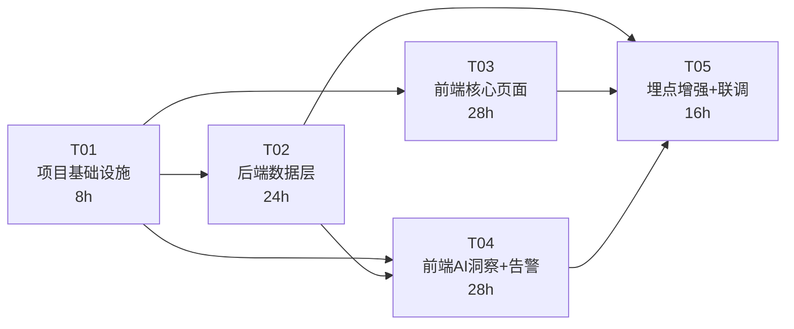

# AI可观测系统 — 项目Plan

> 版本：V1 | 日期：2025-07-10 | 项目：Mobile AI Bank 可观测系统
> 作者：Bob（架构师）| 基于《系统架构设计 V1》+《PRD V1》

---

## 目录

1. [Phase 划分](#1-phase-划分)
2. [Phase 1 任务分解（P0核心）](#2-phase-1-任务分解)
3. [风险与缓解](#3-风险与缓解)
4. [里程碑与交付物](#4-里程碑与交付物)

---

## 1. Phase 划分

### Phase 概览

| Phase | 名称 | 工期 | 范围 | 交付标准 |
|-------|------|------|------|---------|
| Phase 1 | P0核心 | 2-3周 | 数据模型扩展 + 14个新API + 前端7页面 + 埋点增强 + 集成联调 | 7页面全部可用，数据来自真实API |
| Phase 2 | P1增强 | 1-2周 | Mini Spark/链路对比/告警通知/导出/时间范围选择器/拓扑图 | 8个增强需求完成 |
| Phase 3 | P2平台化 | 2-4周 | 自定义仪表盘/Prompt版本管理/异常检测/多租户/Grafana/PostgreSQL迁移 | 6个平台化需求完成 |

### Phase 1 模块映射

Phase 1 对应 PRD 中全部 31 项 P0 需求，按功能域分为 5 个实施任务：

```
Phase 1 模块 → 5 任务映射:

┌─────────────────────────────────────────────────┐
│ M1:  数据模型扩展 (8表 + VO扩展)                  │
│ M2:  后端Session APIs                            │
│ M3:  后端Agent性能APIs    ─┐                     │
│ M4:  后端AI洞察APIs (8个)  ─┤──→ T02: 后端数据层  │
│ M5:  后端告警+设置APIs      ─┘                     │
│                                                   │
│ M6:  前端工程重构           ─┐                    │
│ M7:  前端总览大屏            │                    │
│ M8:  前端会话回放            │                    │
│ M9:  前端链路追踪            ├──→ T03+T04: 前端层  │
│ M10: 前端AI洞察              │                    │
│ M11: 前端日志查询            │                    │
│ M12: 前端告警+系统设置       ─┘                    │
│                                                   │
│ M13: OTel埋点增强 ──────────────→ T05: 埋点+集成  │
│ M14: 集成测试+联调             │                   │
└─────────────────────────────────────────────────┘

T01: 项目基础设施（后端Schema + 前端Router + 依赖）
T02: 后端数据层（数据模型 + 14新API + 现有API扩展）
T03: 前端核心页面（总览+会话+链路+日志）
T04: 前端AI洞察+告警设置（6 TAB + 2新页面 + 主题迁移）
T05: 埋点增强 + 集成联调（OTel埋点 + 端到端测试）
```

### Phase 2 范围（P1增强）

| ID | 需求 | 预估工时 |
|----|------|---------|
| P1-01 | Mini Spark实时趋势（30分钟数据） | 4h |
| P1-02 | 会话回放筛选增强（渠道/智能体/状态多选 + 时间范围） | 3h |
| P1-03 | Trace链路对比（双Trace并排） | 6h |
| P1-04 | AI洞察时间范围选择器（各TAB自定义时间） | 4h |
| P1-05 | L0→L1→L2拓扑图（力导向图） | 6h |
| P1-06 | 告警通知集成（邮件/钉钉/飞书） | 8h |
| P1-07 | 数据导出（图表PNG + 表格CSV） | 4h |
| P1-08 | 用户行为分析（UserID聚合画像） | 6h |

### Phase 3 范围（P2平台化）

| ID | 需求 | 预估工时 |
|----|------|---------|
| P2-01 | 自定义仪表盘（拖拽KPI布局） | 16h |
| P2-02 | Prompt版本管理（A/B Test） | 12h |
| P2-03 | 异常检测（基线自动异常检测） | 12h |
| P2-04 | 多租户/多应用 | 16h |
| P2-05 | Grafana数据源（Prometheus endpoint） | 8h |
| P2-06 | PostgreSQL迁移 + 分区归档 | 16h |

---

## 2. Phase 1 任务分解

### 2.1 任务总览

| Task ID | 任务名称 | 覆盖模块 | 预估工时 | 优先级 | 依赖 |
|---------|---------|---------|---------|--------|------|
| **T01** | 项目基础设施 | M1(部分) + M6(部分) | 8h | P0 | — |
| **T02** | 后端数据层 | M1+M2+M3+M4+M5 | 24h | P0 | T01 |
| **T03** | 前端核心页面 | M7+M8+M9+M11 | 28h | P0 | T01 |
| **T04** | 前端AI洞察+告警设置+主题 | M10+M12+M6(主题) | 28h | P0 | T01, T02 |
| **T05** | 埋点增强+集成联调 | M13+M14 | 16h | P0 | T02, T03, T04 |

**Phase 1 总计：104h（约 2.5-3 周，2人并行开发）**

### 2.2 T01 — 项目基础设施（8h）

**目标**：建立 Phase 1 所有工作的基础——数据库Schema就绪、前端工程结构就绪。

**源文件（创建/修改）**：

| 文件 | 操作 | 说明 |
|------|------|------|
| `observability/backend/src/main/resources/schema.sql` | 修改 | 新增8张表DDL |
| `observability/backend/src/main/resources/application.yml` | 修改 | H2初始化模式更新 |
| `observability/backend/src/main/java/.../dto/RealtimeMetricsVO.java` | 修改 | 9→20字段扩展 |
| `observability/backend/src/main/java/.../model/Session.java` | 新建 | JPA Entity |
| `observability/backend/src/main/java/.../model/SessionTurn.java` | 新建 | JPA Entity |
| `observability/backend/src/main/java/.../model/AgentPerformance.java` | 新建 | JPA Entity |
| `observability/backend/src/main/java/.../model/TokenCost.java` | 新建 | JPA Entity |
| `observability/backend/src/main/java/.../model/ToolCall.java` | 新建 | JPA Entity |
| `observability/backend/src/main/java/.../model/SkillStats.java` | 新建 | JPA Entity（P0建Entity，P1建表） |
| `observability/backend/src/main/java/.../model/AlertRule.java` | 新建 | JPA Entity |
| `observability/backend/src/main/java/.../model/AlertEvent.java` | 新建 | JPA Entity |
| `observability/frontend/src/main.jsx` | 修改 | 重构为 BrowserRouter+Routes |
| `observability/frontend/src/App.jsx` | 修改 | 废弃→改为 AppLayout |
| `observability/frontend/src/components/AppLayout.jsx` | 新建 | Layout+Sidebar+Outlet |
| `observability/frontend/src/components/Sidebar.jsx` | 修改 | 增加告警规则/系统设置导航 |
| `observability/frontend/src/theme/antdTheme.js` | 新建 | Ant Design 5 亮色主题令牌 |
| `observability/frontend/src/theme/chartTheme.js` | 新建 | ECharts 亮色主题配置 |
| `observability/frontend/src/context/AppContext.jsx` | 新建 | 全局Context（时间范围/告警计数） |
| `observability/frontend/src/hooks/useECharts.js` | 新建 | 图表统一hook |
| `observability/frontend/src/hooks/usePolling.js` | 新建 | 轮询hook |
| `observability/backend/src/main/java/.../config/WebConfig.java` | 检查 | CORS确认 |

**依赖**：无

**验收标准**：
- [ ] 8张新表DDL可正常执行，H2启动自动建表
- [ ] RealtimeMetricsVO 扩展至20字段，编译通过
- [ ] 前端 main.jsx 使用 BrowserRouter + Routes，7路由定义完整
- [ ] Sidebar 显示8个导航项（含告警规则/系统设置）
- [ ] Ant Design 5 ConfigProvider theme 亮色令牌就绪
- [ ] useECharts / usePolling hooks 就绪

---

### 2.3 T02 — 后端数据层（24h）

**目标**：实现全部14个新API + 扩展现有API + 数据聚合服务。

**源文件（创建/修改）**：

| 文件 | 操作 | 说明 |
|------|------|------|
| `observability/backend/src/main/java/.../repository/SessionRepository.java` | 新建 | JPA Repository |
| `observability/backend/src/main/java/.../repository/SessionTurnRepository.java` | 新建 | |
| `observability/backend/src/main/java/.../repository/AgentPerformanceRepository.java` | 新建 | |
| `observability/backend/src/main/java/.../repository/TokenCostRepository.java` | 新建 | |
| `observability/backend/src/main/java/.../repository/ToolCallRepository.java` | 新建 | |
| `observability/backend/src/main/java/.../repository/SkillStatsRepository.java` | 新建 | P0跳过（P1实现） |
| `observability/backend/src/main/java/.../repository/AlertRuleRepository.java` | 新建 | |
| `observability/backend/src/main/java/.../repository/AlertEventRepository.java` | 新建 | |
| `observability/backend/src/main/java/.../service/SessionService.java` | 新建 | 会话列表+详情查询 |
| `observability/backend/src/main/java/.../service/AgentPerformanceService.java` | 新建 | Agent/LLM性能聚合 |
| `observability/backend/src/main/java/.../service/TokenCostService.java` | 新建 | Token成本拆解 |
| `observability/backend/src/main/java/.../service/ToolStatsService.java` | 新建 | 工具调用统计 |
| `observability/backend/src/main/java/.../service/SkillStatsService.java` | 新建 | Skill业务效果（P0跳过，P1实现） |
| `observability/backend/src/main/java/.../service/ConversionFunnelService.java` | 新建 | 转化漏斗 |
| `observability/backend/src/main/java/.../service/SatisfactionService.java` | 新建 | 满意度查询聚合 + 反馈提交（★ 含POST） |
| `observability/backend/src/main/java/.../service/AlertService.java` | 新建 | 告警CRUD+事件 |
| `observability/backend/src/main/java/.../service/SettingsService.java` | 新建 | 配置读写 |
| `observability/backend/src/main/java/.../controller/SessionController.java` | 新建 | `/api/v1/sessions` |
| `observability/backend/src/main/java/.../controller/AgentPerformanceController.java` | 新建 | `/api/v1/ai/agent-performance` |
| `observability/backend/src/main/java/.../controller/TokenCostController.java` | 新建 | `/api/v1/ai/token-cost` |
| `observability/backend/src/main/java/.../controller/ToolStatsController.java` | 新建 | `/api/v1/ai/tool-stats` |
| `observability/backend/src/main/java/.../controller/SkillStatsController.java` | 新建 | `/api/v1/ai/skill-stats`（P0跳过，P1实现） |
| `observability/backend/src/main/java/.../controller/ConversionFunnelController.java` | 新建 | `/api/v1/ai/conversion-funnel` |
| `observability/backend/src/main/java/.../controller/SatisfactionController.java` | 新建 | `/api/v1/ai/satisfaction`（GET聚合 + POST反馈） |
| `observability/backend/src/main/java/.../controller/AlertController.java` | 新建 | `/api/v1/alerts/*` |
| `observability/backend/src/main/java/.../controller/SettingsController.java` | 新建 | `/api/v1/settings/*` |
| `observability/backend/src/main/java/.../controller/AIInsightsController.java` | 修改 | 新增 accuracy-trend, confusion-matrix 端点 |
| `observability/backend/src/main/java/.../service/AIInsightsService.java` | 修改 | 新增方法 |
| `observability/backend/src/main/java/.../service/MetricsQueryService.java` | 修改 | RealtimeMetricsVO 扩展字段填充 |
| `observability/backend/src/main/java/.../service/RedisMetricsService.java` | 修改 | 新增 Redis key 操作 |
| `observability/backend/src/main/java/.../dto/TraceListVO.java` | 修改 | 新增 ttftMs/tokenTotal/statusDot |
| `observability/backend/src/main/java/.../model/Session.java` | 修改 | ★ 新增 satisfaction_rating + satisfaction_reason 字段 |
| `observability/backend/src/main/java/.../service/TraceQueryService.java` | 修改 | 新参数 sessionId/userId/statusCode |
| `observability/backend/src/main/java/.../controller/TraceQueryController.java` | 修改 | 新参数 |
| `observability/backend/src/main/java/.../service/LogQueryService.java` | 修改 | 新参数 userId/sessionId |
| `observability/backend/src/main/java/.../controller/LogQueryController.java` | 修改 | 新参数 |

**依赖**：T01（Schema就绪 + VO扩展）

**验收标准**：
- [ ] 14个新API全部实现（含POST满意度反馈），返回格式 `{code, data, message}`
- [ ] sessions 表新增 satisfaction_rating、satisfaction_reason 字段
- [ ] 现有 `/metrics/realtime` 返回扩展后的20字段
- [ ] 现有 `/traces` 支持新筛选参数 sessionId/userId/statusCode
- [ ] 现有 `/logs` 支持新筛选参数 userId/sessionId
- [ ] 所有新Repository通过H2集成测试
- [ ] 告警规则CRUD 完整（创建/读取/更新/删除/列表）

---

### 2.4 T03 — 前端核心页面（28h）

**目标**：总览大屏重构 + 会话回放重构 + 链路追踪重构 + 日志查询增强。

**源文件（创建/修改）**：

| 文件 | 操作 | 说明 |
|------|------|------|
| `observability/frontend/src/pages/DashboardPage.jsx` | 重写 | 4区11卡 + ECharts + 亮色 |
| `observability/frontend/src/components/KpiCardGrid.jsx` | 新建 | 4区11卡KPI网格 |
| `observability/frontend/src/components/charts/MiniSpark.jsx` | 新建 | KPI卡内迷你折线 |
| `observability/frontend/src/components/charts/TrendChart.jsx` | 新建 | 请求+Token双轴图 |
| `observability/frontend/src/components/charts/PieChart.jsx` | 新建 | Agent分布环形图 |
| `observability/frontend/src/pages/SessionViewerPage.jsx` | 重写 | 筛选+列表+Modal |
| `observability/frontend/src/components/SessionFilter.jsx` | 新建 | 6个筛选器 |
| `observability/frontend/src/components/SessionTable.jsx` | 新建 | 增强列表（渠道/Token/智能体） |
| `observability/frontend/src/components/SessionDetailModal.jsx` | 新建 | 对话气泡+Turn详情+意图流 |
| `observability/frontend/src/components/ChatBubble.jsx` | 新建 | 蓝用户/绿AI对话气泡 |
| `observability/frontend/src/pages/TraceExplorerPage.jsx` | 重写 | 列表独占→Modal模式 |
| `observability/frontend/src/components/TraceTable.jsx` | 新建 | 增强列表（TTFT/Token/状态dot） |
| `observability/frontend/src/components/TraceDetailModal.jsx` | 新建 | 全屏Modal |
| `observability/frontend/src/components/IOCards.jsx` | 新建 | 输入/输出双色卡片（替代IOPanel） |
| `observability/frontend/src/components/SpanTree.jsx` | 修改 | Agent层级架构展示（L0/L1双LLM/L2） |
| `observability/frontend/src/components/charts/WaterfallChart.jsx` | 新建 | Span瀑布图 |
| `observability/frontend/src/pages/LogViewerPage.jsx` | 修改 | 新增 UserID/SessionID 筛选 + 亮色适配 |
| `observability/frontend/src/components/LogFilter.jsx` | 修改 | 增加筛选字段 |
| `observability/frontend/src/components/GlobalFilter.jsx` | 修改 | 亮色适配 |
| `observability/frontend/src/components/LiveIndicator.jsx` | 修改 | 亮色适配 |
| `observability/frontend/src/components/MetricCard.jsx` | 修改/删除 | 重构为KpiCardGrid |

**依赖**：T01（路由就绪 + 主题 + hooks）

**验收标准**：
- [ ] 总览大屏：4区11卡 + ECharts趋势图 + 环形饼图 + 3s实时刷新（亮色主题）
- [ ] 会话回放：6筛选器 + 增强列表 + 对话气泡Modal + Turn详情 + Token统计 + 意图流
- [ ] 链路追踪：列表独占 + 全屏Modal（IO双色卡片 + Agent层级树 + Span瀑布图）
- [ ] 日志查询：新增UserID/SessionID筛选 + 彩色级别Badge + 亮色适配

---

### 2.5 T04 — 前端AI洞察+告警设置+主题完成（28h）

**目标**：AI洞察6个TAB + 告警规则页 + 系统设置页 + 全站亮色主题最终统一。

**源文件（创建/修改）**：

| 文件 | 操作 | 说明 |
|------|------|------|
| `observability/frontend/src/pages/AIInsightsPage.jsx` | 重写 | 6 TAB框架 + 子页签 |
| `observability/frontend/src/components/insights/AccuracyTab.jsx` | 新建 | 5折线+改写根因TOP3+混淆矩阵 |
| `observability/frontend/src/components/insights/AgentPerfTab.jsx` | 新建 | 双维度子页签+KPI卡+箱线+散点 |
| `observability/frontend/src/components/insights/TokenCostTab.jsx` | 新建 | 堆叠柱状+饼图+明细表 |
| `observability/frontend/src/components/insights/ToolCallTab.jsx` | 新建 | 工具调用统计 + Skill效果（P0隐藏） |
| `observability/frontend/src/components/insights/FunnelTab.jsx` | 新建 | 漏斗图+放弃率环形+明细 |
| `observability/frontend/src/components/insights/SatisfactionTab.jsx` | 新建 | 满意度分布+趋势+原因+低分列表 |
| `observability/frontend/src/components/charts/FunnelChart.jsx` | 新建 | 漏斗图 |
| `observability/frontend/src/components/charts/HeatmapChart.jsx` | 新建 | 混淆矩阵热力图 |
| `observability/frontend/src/components/charts/BoxplotChart.jsx` | 新建 | 箱线图 |
| `observability/frontend/src/components/charts/ScatterChart.jsx` | 新建 | 六色散点图 |
| `observability/frontend/src/pages/AlertRulesPage.jsx` | 新建 | 告警规则双栏页 |
| `observability/frontend/src/components/AlertRuleTable.jsx` | 新建 | 规则表（名称/阈值/状态/通知方式/操作） |
| `observability/frontend/src/components/AlertTimeline.jsx` | 新建 | 闭环时间线 |
| `observability/frontend/src/pages/SystemSettingsPage.jsx` | 新建 | 系统设置双栏页 |
| `observability/frontend/src/components/CollectionConfig.jsx` | 新建 | 采集配置（状态/采样率/Tag/Prompt存储） |
| `observability/frontend/src/components/StorageConfig.jsx` | 新建 | 存储配置（数据库/Redis/保留策略） |
| `observability/frontend/src/components/SessionDetailModal.jsx` | 修改 | ★ 新增 👍/👎 满意度反馈按钮（调用 POST satisfaction） |
| `observability/frontend/src/api/client.js` | 修改 | 新增全部API函数（含 submitSatisfaction） |
| `observability/frontend/src/theme/antdTheme.js` | 修改 | 全局卡片/表格/菜单亮色组件token |
| `observability/frontend/src/components/Sidebar.jsx` | 修改 | 亮色风格暗色侧边栏最终调整 |
| `observability/frontend/src/pages/DashboardPage.jsx` | 修改 | ★ 违规率 KPI 卡片展示 "暂无" 占位 |
| `observability/frontend/src/pages/AIInsightsPage.jsx` | 修改 | ★ 转人工率区域展示 "暂无" 占位 |

**依赖**：T01（路由+主题）、T02（后端API就绪）

**验收标准**：
- [ ] AI洞察：6个TAB全部可用，数据来自后端API
  - 准确率TAB：5折线 + 改写根因TOP3 + 混淆矩阵热力图
  - Agent性能TAB：双维度子页签 + KPI卡片 + 箱线图 + 六色散点图
  - Token成本TAB：堆叠柱状图 + 饼图 + 明细表
  - 工具调用TAB：工具调用统计 + Skill效果（标注"暂无数据"）
  - 转化漏斗TAB：漏斗图 + 放弃率环形 + 明细表
  - 满意度TAB：分布 + 趋势 + 原因 + 低分列表
- [ ] 告警规则页：双栏（规则表 + 闭环时间线），CRUD可用
- [ ] 系统设置页：双栏（采集配置 + 存储配置），读取真实配置
- [ ] 全站统一亮色Ant Design 5视觉风格，Sidebar保持暗色
- [ ] 会话回放Modal底部 👍/👎 满意度反馈按钮可用，调用 POST /api/v1/ai/satisfaction
- [ ] 违规率 KPI 卡片 / 转人工率区域 / Skill 效果区域 展示 "暂无数据" 占位（Empty组件）

---

### 2.6 T05 — 埋点增强+集成联调（16h）

**目标**：手机银行主应用OTel埋点增强 + 端到端集成测试 + Bug修复。

**源文件（创建/修改）**：

| 文件 | 操作 | 说明 |
|------|------|------|
| `src/main/java/.../observability/ObservabilityMetrics.java` | 修改 | 新增 TTFT/AgentLevel/Reroute 记录方法 |
| `src/main/java/.../controller/BankController.java` | 修改 | 新增 user.id/session.id/routing 埋点 |
| `src/main/java/.../execution/GraphExecutionEngine.java` | 修改 | 新增 business.outcome 埋点 |
| `src/main/java/.../domain/AbstractDomainService.java` | 修改 | 新增 agent.level/name 埋点 |
| `src/main/java/.../observability/MeterConfig.java` | 修改 | OTLP exporter 配置确认 |
| `observability/backend/src/main/java/.../service/OtlpParserService.java` | 修改 | 解析新 attribute 并写入 session_turns |
| `observability/frontend/src/api/client.js` | 修改 | 联调错误修复 |
| `observability/frontend/src/pages/*.jsx` | 修改 | API对接数据格式适配 |
| `docs/integration-test-report.md` | 新建 | 集成测试报告 |

**依赖**：T02（后端API）、T03（前端核心）、T04（前端洞察+告警）

**验收标准**：

**A. 埋点增强验收**：
- [ ] 手机银行主应用正常启动，OTel Collector收到数据
- [ ] BankController 每次请求产生包含 user.id/session.id 的Span
- [ ] GraphExecutionEngine 业务完成时 Span 包含 business.outcome
- [ ] Reroute事件在Span中可见

**B. 15 项 MVP 核心指标验收清单**（来自架构设计 §5.4）：

以下 15 项指标（`llm.*` 5 项 + `agent.*` 10 项）必须全部通过 OTel Collector → 可观测后端 → H2 `metrics_agg` 表验证：

**llm.*（5 项，ChatClientWrapper 自动拦截）：**
- [ ] `llm.token.input`（Counter）— `ChatClientWrapper` 埋点
- [ ] `llm.token.output`（Counter）— `ChatClientWrapper` 埋点
- [ ] `llm.first_token.latency`（Histogram）— `ChatClientWrapper` doOnNext 首 chunk 埋点
- [ ] `llm.operation.duration`（Histogram）— `ChatClientWrapper` 调用完成埋点
- [ ] `llm.error.count`（Counter）— `ChatClientWrapper` onError 埋点

**agent.*（10 项，手动埋点）：**
- [ ] `agent.router.decision.outcome`（Counter）— `DomainRouter` / `ContextRouter` 埋点
- [ ] `agent.intent.accuracy`（Counter）— `AbstractDomainService` / `SubGraphRouter` 埋点
- [ ] `agent.rewrite.accuracy`（Counter）— `SubGraphRouter` 轻量信号埋点
- [ ] `agent.workflow.execution.duration`（Histogram）— `GraphExecutionEngine` 埋点
- [ ] `agent.workflow.interrupt`（Counter）— `GraphExecutionEngine.checkGraphResult()` 埋点
- [ ] `agent.slot.askback.total`（Histogram）— `AbstractGraphConfig` 追问节点埋点
- [ ] `agent.tool.call.count`（Counter）— 调用原手机银行核心系统 API 接口（如转账/账单查询等）处埋点
- [ ] `agent.tool.call.duration`（Histogram）— 调用原手机银行核心系统 API 接口（如转账/账单查询等）处埋点
- [ ] `agent.skill.outcome`（Counter）— `AbstractDomainService` L2 执行完成处埋点
- [ ] `agent.session`（Counter）— `AbstractDomainService` handle 完成 / 超时 / 异常埋点（含 completed + abandoned，按 Tag 区分）

**C. 集成联调验收**：
- [ ] 可观测前端7页面从后端API获取真实数据（非Mock）
- [ ] 总览大屏KPI 3s刷新正常
- [ ] 会话回放Modal显示真实对话数据
- [ ] 链路追踪Modal显示真实Span树
- [ ] 告警规则CRUD端到端通过
- [ ] 无console error（React严格模式）

---

## 3. 风险与缓解

| # | 风险 | 影响 | 概率 | 缓解措施 |
|---|------|------|------|---------|
| R1 | H2数据库在P0阶段性能不足（查询>100ms） | 前端响应慢 | 中 | 对sessions/traces增加分页+索引；监控H2查询耗时；必要时换文件模式 |
| R2 | 手机银行主应用LLM调用层无TTFT埋点支持 | TTFT数据无法采集 | 高 | 在Spring AI StreamingResponseSpec的回调中嵌入计时逻辑；如不可行则用Span时间差近似 |
| R3 | 8张新表 + 14个API 联调数据不匹配 | 前端显示异常 | 中 | 联调阶段优先用Postman/curl验证API响应格式；前端增加数据格式defensive处理 |
| R4 | Ant Design 5亮色主题迁移后视觉不一致 | UI还原度低 | 中 | 严格参照dashboard-v15.html的CSS变量；每个页面迁移后与目标截图对比 |
| R5 | 埋点代码改动导致手机银行主应用稳定性 | 主业务流程中断 | 低 | 所有埋点用try-catch包裹（safeRecord模式）；不阻断主流程 |
| R6 | Sidebar暗色 + 主内容亮色 布局锯齿 | 用户体验差 | 低 | Sider theme="dark"与全局亮色 token 分别配置；测试多种分辨率 |

---

## 4. 里程碑与交付物

### 里程碑

| 里程碑 | 日期（预估） | 包含任务 | 交付物 |
|--------|------------|---------|--------|
| M1 | D+3 | T01完成 | 8张表DDL通过 + 前端路由/主题就绪 |
| M2 | D+8 | T02完成 | 14个API可调通(postman验证) |
| M3 | D+12 | T03完成 | 4个核心页面可用（总览/会话/链路/日志） |
| M4 | D+15 | T04完成 | 6个TAB + 2个新页面可用 |
| M5 | D+18 | T05完成 | 端到端集成通过，可发布Demo |

### 交付物清单

| # | 交付物 | 格式 |
|---|--------|------|
| 1 | 8张新表DDL + JPA Entity Java文件 | 代码 |
| 2 | 14个新API + 3个扩展API | 代码 + Postman Collection |
| 3 | 7页面React源码（亮色主题） | 代码 |
| 4 | OTel埋点增强代码 | 代码 |
| 5 | 集成测试报告 | Markdown |
| 6 | API文档（Swagger/OpenAPI） | 自动生成 |

---

### 任务依赖图



**并行策略**：
- T02（后端）和 T03（前端核心）可并行开发（均仅依赖T01）
- T04 依赖 T01 + T02，需要后端API就绪后开始
- T05 依赖所有前序任务，最后执行

---

> **下一步**：按 T01 → T02/T03 并行 → T04 → T05 的顺序启动开发。
> 
> 具体实施时，由 Engineers（开发工程师）认领任务并按照本文档的验收标准交付。
