# AI 可观测系统 — 完整设计文档

> 项目：mobile-ai-bank-demo 可观测平台  
> 日期：2026-06-16  
> 状态：待审核

---

## 一、系统定位

面向 Spring AI 多意图银行对话系统的 **AI 深度可观测平台**，同时服务两个场景：

- **运营监控**：实时大屏展示系统健康度、AI 行为指标、成本趋势
- **开发调试**：下钻分析意图路由决策、参数提取质量、状态机流转、链路追踪

---

## 二、核心架构决策

| 决策项 | 结论 | 理由 |
|--------|------|------|
| 可观测焦点 | AI 智能体运行时深度可观测 | 区别于传统 APM，聚焦 AI 行为诊断与优化 |
| 使用场景 | 开发调试 + 运营监控兼顾 | 需要大屏也需要下钻能力 |
| 后端技术栈 | Spring Boot 3.x + Vite (React 18 + Ant Design 5) | 与主项目同栈，符合 AGENTS.md 规范 |
| 数据采集 | Micrometer + OTel Bridge + Collector 混合方案 | Spring AI 官方推荐路线，三信号统一关联 |
| 存储方案 | Redis 热层 + H2/PG 温层 | 实时快、历史有，分层存储 |
| 数据管线 | OTel Collector → 自建 Spring Boot 后端 | AI 深度观测自主可控，无需 Prometheus/Jaeger/Loki |

---

## 三、三阶段演进路线总览

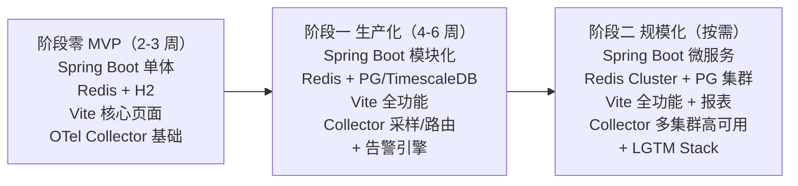

---

## 四、阶段零 — MVP 方案

### 4.1 架构图

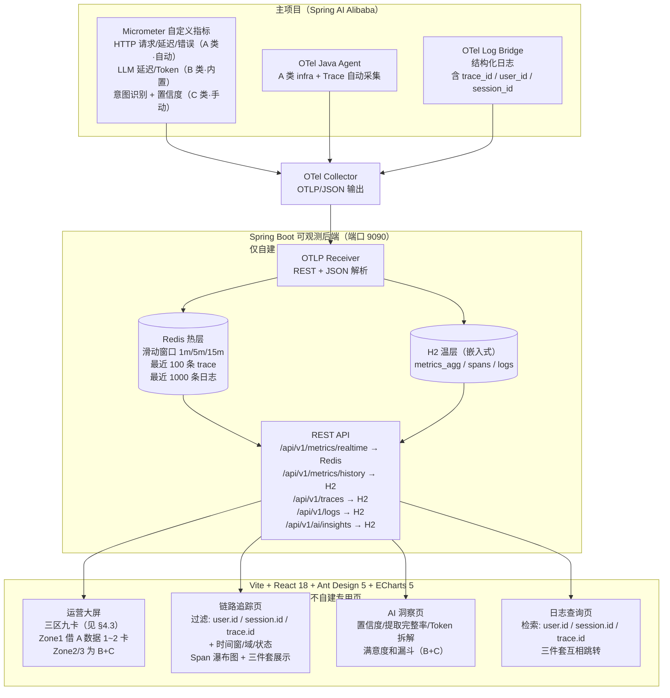

### 4.2 AI 特有观测指标（MVP 子集）

> 本节列出 MVP 阶段必埋的 AI 业务语义指标；平台**应支持**的全量指标目录见 [附录 D：全量指标目录](#附录-d全量指标目录参考清单)。指标名采用 OTel 风格 `域.子域.指标名`，便于未来对齐 OTel GenAI SemConv。

| 指标名 | 类型 | 关键 Tag | 用途 |
|--------|------|---------|------|
| `agent.intent.recognized` | Counter | `intent`, `domain` | 各意图调用量统计 |
| `agent.intent.confidence` | Histogram | `intent` | 识别稳定性分析（0~1 分桶） |
| `agent.router.decision.outcome` | Counter | `layer`, `decision`（FOLLOW_UP / SWITCH_NEW / RESUME / REROUTE） | 状态机流转分析 |
| `gen_ai.client.operation.duration` | Timer | `gen_ai.system`, `gen_ai.request.model`, `gen_ai.operation.name` | 模型性能监控（Spring AI 内置） |
| `gen_ai.client.token.usage` | Counter | `model`, `type=input\|output` | 成本监控（Spring AI 内置） |
| `agent.state.transition` | Counter | `from`, `to`, `event` | suspend / resume / switch 频率 |
| `agent.slot.askback.total` | Histogram | `graph` | 参数提取质量评估（每会话累计追问轮数） |
| `agent.session.abandoned` | Counter | `stage` | 用户流失分析（按阶段拆分） |

**MVP 必埋的 12 项 AI 业务核心指标**（在以上 6 个 `agent.*` 基础上补齐 4 项）：见附录 D §D.6 "MVP 必埋核心子集"。

> 这些指标在运营大屏首页如何呈现，见 [§4.3 运营大屏首页布局](#43-运营大屏首页布局三区九卡)；指标的分层归属见 [附录 D §D.10](#d10-指标分层模型l1l4)。

### 4.3 运营大屏首页布局（三区九卡）

> 首页只放"健康度 + 北极星"，细节下沉到专项页。指标分层模型见 [附录 D §D.10](#d10-指标分层模型l1l4)。

**三区九卡布局**：

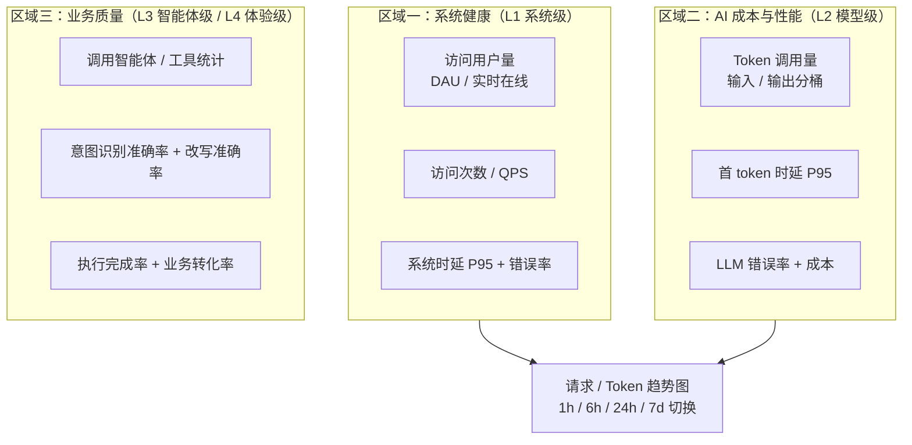

**11 项业务指标在首页 / 专项页的去向**：

| 指标 | 层级 | 首页卡片 | 下沉专项页 |
|------|:----:|:--------:|-----------|
| 访问用户量 | L1 | ✅ A1 | — |
| 访问次数 | L1 | ✅ A2 | — |
| Token 调用量 | L2 | ✅ B1 | AI 洞察页（按模型 / 意图拆解） |
| 调用智能体统计 | L3 | ✅ C1 | AI 洞察页（按智能体明细） |
| 调用工具统计 | L3 | ✅ C1 | AI 洞察页（按工具明细） |
| 改写准确率 | L3 | ✅ C2 | AI 洞察页（趋势 + 按意图） |
| 意图识别准确率 | L3 | ✅ C2 | AI 洞察页（趋势 + 混淆矩阵） |
| 智能体执行完成率 | L3 | ✅ C3 | 链路追踪页（失败 trace 下钻） |
| 用户满意度 | L4 | ❌ 不上首页 | AI 洞察页（满意度分布） |
| 时延（首 token） | L2/L4 | ✅ B2 | 链路追踪页（瀑布图看全部回复） |
| 业务转化率 | L3 | ✅ C3 | AI 洞察页（漏斗） |

**设计要点**：

- **用户满意度不上首页**：滞后指标 + 数据稀疏（需用户主动反馈），常显"无数据"反而干扰，放 AI 洞察页更合适
- **首 token 时延上首页、全部回复时延下沉**：首 token 是用户"感觉快不快"的第一信号，适合大盘；全部回复时延差异大（长回复天然慢），适合在链路瀑布图里看
- **准确率类指标首页只显示汇总值**：意图识别准确率 / 改写准确率在首页只显示总体百分比 + 环比箭头，分意图明细放 AI 洞察页
- **首页每张卡支持点击下钻**：点 Token 卡 → AI 洞察页 Token 拆解；点错误率 → 链路追踪页过滤 ERROR trace。首页是"入口"不是"终点"

**首页之外的专项页职责**：

- **链路追踪页**：系统时延 / 全部回复时延 / 执行失败的下钻主场（trace 瀑布图）
- **AI 洞察页**：Token 拆解、准确率趋势与混淆矩阵、满意度、业务转化漏斗、智能体 / 工具明细
- **日志查询页**：错误根因定位（按 `user.id` / `session.id` / `trace.id` 三件套，见附录 D §D.8）

### 4.4 API 设计

```text
GET  /api/v1/metrics/realtime              -> Redis 热数据（实时指标卡片）
GET  /api/v1/metrics/history?from=&to=&step= -> H2（趋势图）
GET  /api/v1/traces?from=&intent=&limit=    -> H2（trace 列表）
GET  /api/v1/traces/{traceId}               -> H2（trace 详情 + spans）
GET  /api/v1/logs?from=&level=&traceId=&q=  -> H2（日志查询）
GET  /api/v1/ai/insights?type=              -> H2（AI 洞察聚合）
  type=confidence  -> 置信度分布
  type=extraction  -> 参数提取完整率
  type=abandon     -> 会话放弃率
  type=timeout     -> 挂起线程超时率
  type=cost        -> Token 成本分析
```

### 4.5 埋点分批交付计划（基于 B+C 先行）

> 采集原则：A 类自动开（零代码，仅借数据不自建页）；B+C 为自建前端主战场，按风险从低到高分批；D 推迟；E 作为埋点规范贯穿全程（不单独排期）。

| 批次 | 模块 | 埋点内容 | 风险 | 预计工期 |
|------|:----:|---------|------|---------|
| 第一批 | A+B | HTTP 请求量/延迟/错误率（A·自动）+ LLM 延迟/Token/首 token（B·内置） | 零风险（自动/内置） | 0.5 天 |
| 第二批 | C | 意图识别结果 + 置信度 + 路由决策类型 + 状态机转换 | 低风险（只加 Counter/Gauge） | 1 天 |
| 第三批 | C | 追问次数 + 会话放弃率 + 智能体/工具调用统计 | 中风险（需改 Session 处理逻辑） | 1 天 |
| 第四批 | C | 参数提取完整率 + 执行完成率 + 业务转化率 | 较高风险（需改子图返回结构） | 1.5 天 |
| 第五批 | E | 埋点规范审查：确认禁用 Tag 清单（user.id/session.id/trace.id 不入 Metric Tag），三件套入 Trace/Log | 低风险（审查 + 修正） | 0.5 天 |

> 合计约 4.5 天。A 不单独排期（Actuator + OTel Agent 自动开启）；D（平台自观测）MVP 不做。

### 4.6 模块去留决策（A/D/E）

> 结论：**B+C 是自建前端主战场，A 是免费地基只借不建专用页，D 推迟到阶段二，E 是规范不是交付物。** 与业界 AI 可观测产品（LangSmith / LangFuse / Arize Phoenix / Helicone / OpenLLMetry）取舍一致——差异化全在 B+C，A 交通用 APM，D 内部工具不做，E 是约束不是功能。

| 模块 | 性质 | MVP（阶段零） | 阶段一 | 阶段二 | 理由 |
|------|------|:---:|:---:|:---:|------|
| **A 基础指标** | 采集免费（Actuator+Agent），展示才花钱 | ✅ 自动采集，首页借 1~2 卡，不自建页 | 同 | 交给 Grafana | 时延跨层归因 + 告警兜底需要 A 数据；但自建 A 大盘与 AI 可观测目标无关 |
| **B AI 模型层** | 自建展示核心 | ✅ 自建展示 | ✅ | ✅ | AI 可观测差异化主战场 |
| **C AI 业务语义** | 自建展示核心 | ✅ 自建展示（核心子集） | ✅ 全量 | ✅ | AI 可观测差异化主战场 |
| **D 平台自观测** | 真正的独立模块 | ❌ 砍 | ❌（仅存活探针） | 🆕 视共用需求 | SaaS 级可观测产品才做；内部平台 MVP 是过度工程 |
| **E 维度规范** | 不是模块，是设计约束 | ✅ 作为 B/C 埋点规范，不单独排期 | ✅ | ✅ | 跳过 E 会导致高基数 Tag 打爆存储；是 B/C 落地前提 |

**A 的正确处理**：自动采集 + 首页借 1~2 张卡（访问量、系统时延 P95）+ 告警用 `http.server.*` + 其余丢给 Actuator 端点 / 阶段二 Grafana。**自建前端不为 A 做专用页**——这是页面简化的关键。

**D 的折中**：MVP 只留一个最朴素的"后端服务健康检查"（receiver 是否存活、Redis/PG 是否连通），这本质是把 A 应用到平台自己服务上，属 A 范畴不算 D。真正的 D.1~D.6 全套留到阶段二（平台对外或多团队共用时）。

### 4.7 页面交付顺序（基于 B+C 先行）

> 自建前端只服务 B+C，A 的完整大盘不建（链接 Actuator/Grafana），D 的平台健康页不建（仅存活探针）。

| 顺序 | 页面 | 承接模块 | 核心内容 | 依赖埋点批次 |
|:----:|------|:-------:|---------|:-----------:|
| 1 | 运营大屏首页 | B+C（借 A 1~2 卡） | 三区九卡（§4.3）+ 趋势图 | 第一~三批 |
| 2 | 链路追踪页 | B+C | Trace 列表 + Span 瀑布图 + 三件套检索/跳转 | 第一~二批 |
| 3 | AI 洞察页 | B+C | Token 拆解 + 准确率 + 满意度 + 漏斗 + 智能体/工具明细 | 第三~四批 |
| 4 | 日志查询页 | B+C | 结构化日志 + 三件套检索 | 第一批（日志侧） |
| — | A 完整大盘 | A | ❌ 不自建，链接 `/actuator/metrics` 或阶段二 Grafana | — |
| — | D 平台健康页 | D | ❌ 不自建，仅后端存活探针 | — |

**交付节奏**：首页 + 链路追踪页优先（能立即看到 AI 行为）；AI 洞察页随第三~四批埋点到位后补齐；日志查询页可与首页并行。A/D 专用页全程不做。

## 五、阶段一 — 生产化方案

### 5.1 架构变更

在 MVP 基础上增加以下能力：

**变更点：**

1. H2 -> PostgreSQL + TimescaleDB
2. 新增告警引擎
3. 新增意图流转桑基图 + LLM 成本趋势
4. OTel Collector 增加采样策略
5. 后端模块化拆分

### 5.2 完整架构图

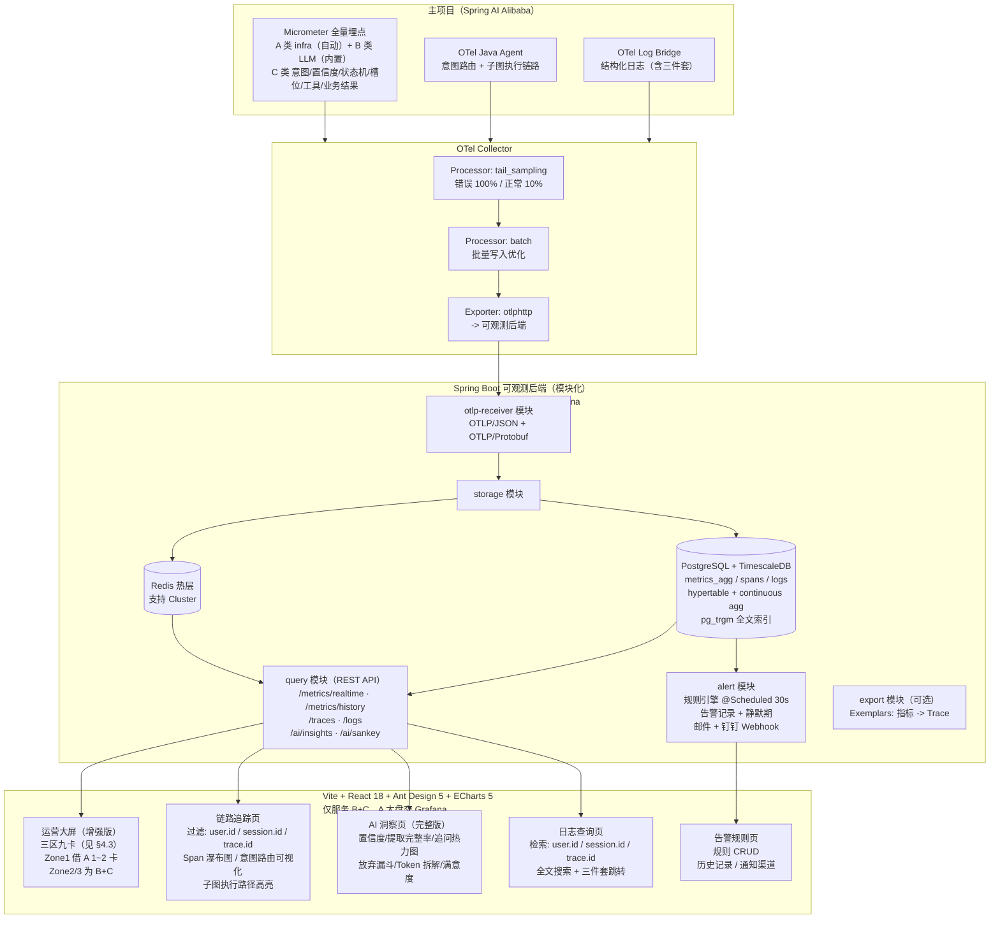

### 5.3 告警规则 (阶段一)

| 规则 | 指标 | 条件 | 级别 |
|------|------|------|------|
| 高错误率 | error_rate | > 5% 持续 2 分钟 | Critical |
| 高延迟 | avg_latency | > 3s 持续 2 分钟 | Warning |
| 低置信度占比 | low_confidence_rate | > 20% 持续 5 分钟 | Warning |
| 会话放弃率 | abandon_rate | > 15% 持续 10 分钟 | Warning |
| 挂起线程超时率 | suspend_timeout_rate | > 10% 持续 10 分钟 | Warning |
| LLM 调用失败 | llm_error_rate | > 1% 持续 1 分钟 | Critical |

### 5.4 阶段一 H2 → PG 迁移

迁移只需改数据源配置，无需改代码：

```yaml
# MVP: H2
spring:
  datasource:
    url: jdbc:h2:file:./data/observability
    driver-class-name: org.h2.Driver

# 阶段一: PostgreSQL + TimescaleDB
spring:
  datasource:
    url: jdbc:postgresql://localhost:5432/observability
    driver-class-name: org.postgresql.Driver
```

TimescaleDB 扩展通过启动 SQL 自动启用：

```sql
CREATE EXTENSION IF NOT EXISTS timescaledb;
SELECT create_hypertable('spans', 'start_time');
SELECT create_hypertable('logs', 'timestamp');
SELECT create_hypertable('metrics_agg', 'timestamp');

-- 指标预聚合
CREATE MATERIALIZED VIEW metrics_agg_1h
WITH (timescaledb.continuous) AS
SELECT metric_name, tags,
       time_bucket('1h', timestamp) AS bucket,
       avg(value), min(value), max(value), count(*)
FROM metrics_agg
GROUP BY metric_name, tags, bucket;
```

### 5.5 阶段一新增依赖

```xml
<!-- 替换 H2 -->
<dependency>
    <groupId>org.postgresql</groupId>
    <artifactId>postgresql</artifactId>
    <scope>runtime</scope>
</dependency>

<!-- 告警邮件 -->
<dependency>
    <groupId>org.springframework.boot</groupId>
    <artifactId>spring-boot-starter-mail</artifactId>
</dependency>

<!-- OTLP Protobuf 接收 (生产级) -->
<dependency>
    <groupId>io.opentelemetry.proto</groupId>
    <artifactId>opentelemetry-proto</artifactId>
    <version>1.3.2</version>
</dependency>
```

---

## 六、阶段二 — 规模化方案

### 6.1 架构变更

**变更点：**

1. 新增 LGTM Stack（Prometheus + Tempo + Loki + Grafana）并行运行
2. 可观测后端 -> 微服务拆分
3. Redis 单机 -> Redis Cluster
4. PG 单机 -> PG 主从 + TimescaleDB 分布式超表
5. Collector 高可用部署
6. 新增 Exemplars（指标 -> Trace 关联）

### 6.2 完整架构图

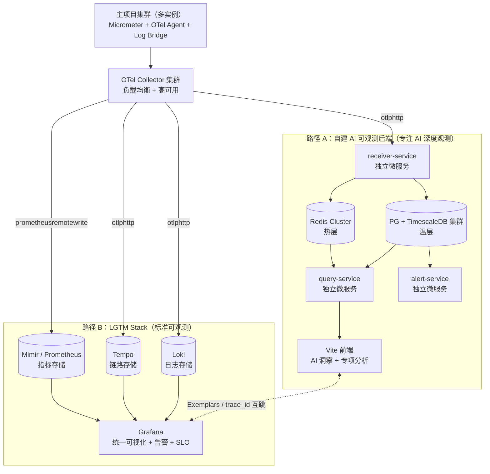

### 6.3 阶段二新增能力

| 能力 | 说明 |
|------|------|
| **Exemplars** | 指标点可直接跳转到关联 Trace，两条路径体验一体化 |
| **SLO Dashboard** | 在 Grafana 中定义 SLO (如 P99 延迟 < 3s, 成功率 > 99%) |
| **采样策略** | Collector 尾部采样：错误请求 100% 保留，正常请求 10% 采样 |
| **数据保留策略** | 热数据 7 天 (PG)，温数据 30 天 (PG 归档)，冷数据 > 30 天 (对象存储) |
| **多实例采集** | 主项目多副本部署，Collector 基于负载均衡分发 |
| **跨服务追踪** | 如果未来拆分微服务，Trace 可跨服务关联 |

### 6.4 阶段二新增组件与依赖

| 组件 | 部署方式 | 说明 |
|------|---------|------|
| Prometheus / Mimir | Docker / K8s Helm | 指标存储 |
| Tempo | Docker / K8s Helm | 链路存储 |
| Loki | Docker / K8s Helm | 日志存储 |
| Grafana | Docker / K8s Helm | 统一可视化 |

---

## 七、各组件演进路线图

### 7.1 存储演进

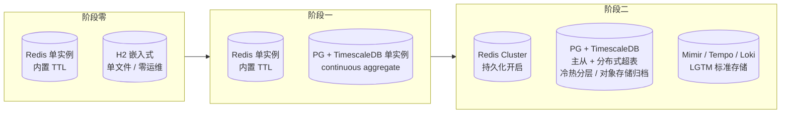

- **Redis 热层**
  - 阶段零：单实例，内置 TTL
  - 阶段一：单实例，内置 TTL
  - 阶段二：Cluster 模式，持久化开启
- **温层（关系/时序）**
  - 阶段零：H2 嵌入式，单文件，零运维，重启不丢
  - 阶段一：PG + TimescaleDB 单实例，启用 continuous aggregate
  - 阶段二：PG + TimescaleDB 主从 + 分布式超表，冷热分层 + 对象存储归档
- **LGTM 存储**
  - 阶段零 / 阶段一：无
  - 阶段二：Mimir（指标）+ Tempo（链路）+ Loki（日志）

### 7.2 后端演进

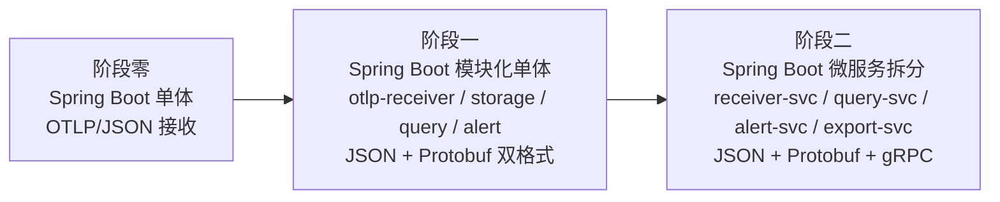

- **阶段零**：单体应用，全部代码打在一个项目里；OTLP/JSON 接收
- **阶段一**：模块化单体（同一进程，分模块）
  - `otlp-receiver` / `storage` / `query` / `alert`
  - OTLP/JSON + OTLP/Protobuf 双格式接收
- **阶段二**：微服务拆分（独立部署）
  - `receiver-svc` / `query-svc` / `alert-svc` / `export-svc`
  - JSON + Protobuf + gRPC

### 7.3 数据采集演进

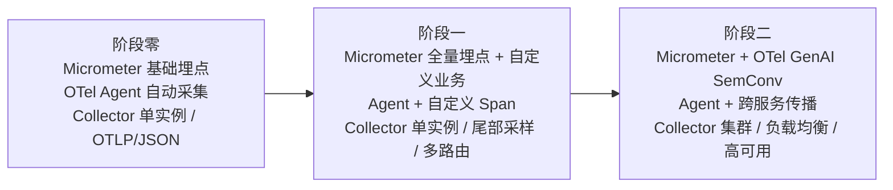

- **Micrometer 埋点**
  - 阶段零：基础埋点，3 批交付（HTTP + LLM + 意图）
  - 阶段一：全量埋点 + 自定义业务指标
  - 阶段二：全量埋点 + OTel GenAI SemConv（标准化后）
- **OTel Java Agent**
  - 阶段零：自动采集，基础配置
  - 阶段一：自动采集 + 自定义 Span
  - 阶段二：自动采集 + 跨服务传播
- **OTel Collector**
  - 阶段零：单实例，基础配置，OTLP/JSON
  - 阶段一：单实例，尾部采样，多路由
  - 阶段二：集群部署，负载均衡，高可用

### 7.4 前端演进

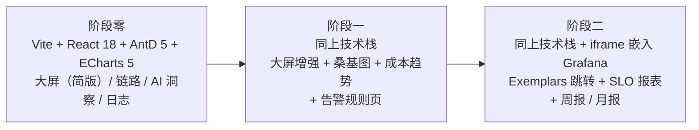

- **页面能力**
  - 阶段零：大屏（简版）/ 链路追踪 / AI 洞察 / 日志查询
  - 阶段一：大屏（增强版）+ 意图流转桑基图 + LLM 成本趋势 + 告警规则页
  - 阶段二：上述全部 + Grafana 嵌入 + Exemplars 跳转 + SLO 报表 + 周报 / 月报
- **技术栈（三阶段一致）**
  - React 18 / Ant Design 5 / ECharts 5 / react-router 6
  - 阶段二额外：iframe 嵌入 Grafana 页面

### 7.5 告警演进

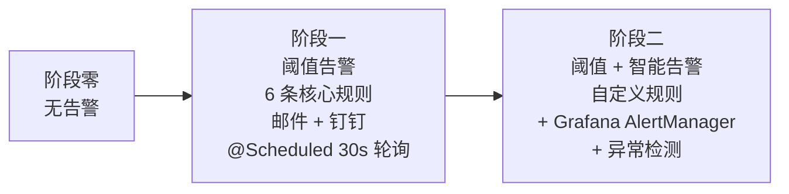

- **阶段零**：无告警
- **阶段一**：阈值告警，6 条核心规则，邮件 + 钉钉，`@Scheduled` 30s 轮询
- **阶段二**：阈值 + 智能告警，自定义规则，集成 Grafana AlertManager，引入异常检测

---

## 八、技术框架版本与选型依据

> 高亮图例：🆕 阶段间新增组件 ｜ 🔺 版本/形态升级 ｜ ⛔ 阶段间移除/替换 ｜ ➖ 不适用

| 框架/组件 | 阶段零 | 阶段一 | 阶段二 | 选型依据 |
|-----------|--------|--------|--------|---------|
| Java | 17 | 17 | 17 | LTS 版本，Spring Boot 3.x 最低要求 |
| Spring Boot | 3.5.5 | 3.5.5 | 3.5.5 | 与主项目一致，LTS 版本 |
| Spring AI Alibaba | 1.1.2.0 | 1.1.2.0 | 1.1.2.0 | 与主项目一致，内置 Micrometer 观测 |
| Micrometer | 1.13+（Boot 内置） | 1.13+ | 1.13+ | Spring 生态标准指标库 |
| micrometer-tracing-bridge-otel | 1.3+ | 1.3+ | 1.3+ | Micrometer → OTel 桥接，官方推荐 |
| OTel Java Agent | 1.32+ | 1.32+ | 1.32+ | 已有，自动 Trace 采集 |
| OTel Collector | 0.96+ 单实例 | 🔺 **0.96+ 单实例 + 尾部采样/多路由** | 🔺 **0.96+ 集群 / 高可用** | 阶段一启用采样与路由分发，阶段二集群部署 |
| React | 18.3 | 18.3 | 18.3 | AGENTS.md 指定 React 18+ |
| Ant Design | 5.21 | 5.21 | 5.21 | AGENTS.md 指定 Ant Design 5+ |
| Vite | 5.4 | 5.4 | 5.4 | AGENTS.md 推荐高性能构建工具 |
| ECharts | 5.4 | 5.4 | 5.4 | 国内最活跃的可视化库，图表类型丰富 |
| Redis | 7.x 单实例 | 7.x 单实例 | 🔺 **7.x Cluster + 持久化** | 阶段二升级集群形态 |
| H2 | 2.x（Boot 内置） | ⛔ **移除（被 PG 替换）** | ➖ | MVP 嵌入式存储，零运维；阶段一切换到 PG |
| PostgreSQL | ➖ | 🆕 **16.x 单实例** | 🔺 **16.x 主从集群** | 生产级关系型数据库，阶段一引入 |
| TimescaleDB | ➖ | 🆕 **2.x（PG 扩展）** | 🔺 **2.x 分布式超表** | 时序数据专用优化，PG 扩展即装即用 |
| Spring Boot Mail | ➖ | 🆕 **Boot 3.5.5 starter** | 同阶段一 | 阶段一新增邮件告警通道 |
| OTel Proto（Java） | ➖ | 🆕 **1.3.2** | 同阶段一 | 阶段一启用 OTLP/Protobuf 双格式接收 |
| Prometheus / Mimir | ➖ | ➖ | 🆕 **最新稳定版** | 阶段二 LGTM 标准指标存储 |
| Tempo | ➖ | ➖ | 🆕 **最新稳定版** | 阶段二 LGTM 标准链路存储 |
| Loki | ➖ | ➖ | 🆕 **最新稳定版** | 阶段二 LGTM 标准日志存储 |
| Grafana | ➖ | ➖ | 🆕 **最新稳定版** | 阶段二统一可视化 + AlertManager |

> 渲染说明：本文档默认在 GitHub / VS Code Markdown Preview / Codex 客户端中查看，emoji 与加粗会自动呈现颜色与字重对比；若导出 PDF/Word，建议在导出前再加一个"变更项底色标注"图层。

---

## 九、风险与缓解

| 风险 | 影响 | 缓解措施 |
|------|------|---------|
| OTLP 数据接收解析复杂 | 阻塞后端开发 | MVP 先用 OTLP/JSON 格式，Jackson 解析；生产化再切 Protobuf |
| 参数提取完整率埋点需改子图 | 可能影响核心流程 | 第四批交付，独立测试，灰度上线 |
| H2 并发写入性能有限 | Demo 环境偶尔写入延迟 | MVP 可接受；阶段一升级 PG |
| 前端瀑布图无现成组件 | 链路页开发延期 | 基于 ECharts 自定义封装，或参考 Jaeger UI 开源实现 |
| OTel SemConv GenAI 尚未正式发布 | 自定义属性未来可能需调整 | 使用 i. 前缀的自定义属性，与未来标准对齐时只需改属性名映射 |

---

## 十、验收标准

### 阶段零验收

- [ ] 主项目启动后，可观测后端能收到 Metrics/Traces/Logs 三种信号
- [ ] 运营大屏实时展示 8 个指标卡片 + 请求趋势图
- [ ] 链路追踪页能查看 trace 列表和 span 瀑布图
- [ ] AI 洞察页展示意图置信度分布 + 参数提取完整率
- [ ] 日志页支持按级别/时间/traceId 过滤
- [ ] Redis 热层响应时间 < 10ms，H2 查询 < 100ms

### 阶段一验收

- [ ] PG + TimescaleDB 替换 H2，数据迁移无损
- [ ] 告警引擎 6 条核心规则生效，邮件/钉钉通知可达
- [ ] 意图流转桑基图 + LLM 成本趋势图展示正常
- [ ] 追问热力图 + 会话放弃率漏斗图展示正常
- [ ] 告警静默期机制正常工作
- [ ] 查询性能: PG 聚合查询 < 200ms (100 万行数据量)

### 阶段二验收

- [ ] LGTM Stack 与自建后端并行运行，数据一致
- [ ] Exemplars 跳转: 指标 → Trace 双向关联
- [ ] Collector 采样策略生效: 错误请求 100% 保留，正常请求 10% 采样
- [ ] Grafana Dashboard 展示标准 SLO
- [ ] 数据保留策略: 热数据 7 天, 温数据 30 天, 冷数据对象存储

---

## 附录 A：数据模型（MVP）

> 原 §4.3 内容，迁移至附录以减轻正文阅读负担。

### A.1 Redis 热层 Key 设计

```text
obs:metrics:request_count:{1m|5m|15m}    -> INCR + EXPIRE    (请求计数)
obs:metrics:error_count:{1m|5m|15m}      -> INCR + EXPIRE    (错误计数)
obs:metrics:latency:{1m|5m|15m}          -> Sorted Set       (延迟分布)
obs:metrics:token_count:{1m|5m|15m}      -> INCR + EXPIRE    (Token 消耗)
obs:metrics:intent_distribution           -> Hash             (意图分布)
obs:traces:recent                         -> List + LTRIM 100 (最近 trace)
obs:logs:recent                           -> List + LTRIM 1000(最近日志)
obs:alerts:active                         -> Set              (活跃告警)
```

### A.2 H2 温层表设计

```sql
-- 指标聚合表
CREATE TABLE metrics_agg (
    id BIGINT AUTO_INCREMENT,
    metric_name VARCHAR(128) NOT NULL,
    tags VARCHAR(512),              -- JSON 格式: {"intent":"transfer","model":"qwen-32b"}
    value DOUBLE NOT NULL,
    agg_window VARCHAR(16) NOT NULL, -- 1m, 5m, 15m, 1h
    timestamp TIMESTAMP NOT NULL,
    PRIMARY KEY (id)
);
CREATE INDEX idx_metrics_name_ts ON metrics_agg(metric_name, timestamp);

-- Span 表
CREATE TABLE spans (
    id BIGINT AUTO_INCREMENT,
    trace_id VARCHAR(64) NOT NULL,
    span_id VARCHAR(64) NOT NULL,
    parent_span_id VARCHAR(64),
    service_name VARCHAR(64),
    operation_name VARCHAR(256),
    kind VARCHAR(16),               -- INTERNAL/SERVER/CLIENT
    start_time TIMESTAMP NOT NULL,
    end_time TIMESTAMP,
    duration_ms BIGINT,
    status_code VARCHAR(16),        -- OK/ERROR
    attributes VARCHAR(2048),       -- JSON 格式自定义属性
    PRIMARY KEY (id)
);
CREATE INDEX idx_spans_trace ON spans(trace_id);
CREATE INDEX idx_spans_time ON spans(start_time);

-- 日志表
CREATE TABLE logs (
    id BIGINT AUTO_INCREMENT,
    trace_id VARCHAR(64),
    span_id VARCHAR(64),
    level VARCHAR(16) NOT NULL,     -- INFO/WARN/ERROR
    service_name VARCHAR(64),
    message TEXT NOT NULL,
    timestamp TIMESTAMP NOT NULL,
    attributes VARCHAR(1024),       -- JSON 格式
    PRIMARY KEY (id)
);
CREATE INDEX idx_logs_time ON logs(timestamp);
CREATE INDEX idx_logs_trace ON logs(trace_id);
CREATE INDEX idx_logs_level ON logs(level);
```

---

## 附录 B：依赖清单（MVP）

> 原 §4.6 内容，迁移至附录以减轻正文阅读负担。

### B.1 主项目新增 Maven 依赖

```xml
<dependency>
    <groupId>io.micrometer</groupId>
    <artifactId>micrometer-registry-otlp</artifactId>
</dependency>
<dependency>
    <groupId>io.micrometer</groupId>
    <artifactId>micrometer-tracing-bridge-otel</artifactId>
</dependency>
<dependency>
    <groupId>io.opentelemetry</groupId>
    <artifactId>opentelemetry-appender-logback</artifactId>
</dependency>
```

### B.2 可观测后端 Maven 依赖

```xml
<parent>
    <groupId>org.springframework.boot</groupId>
    <artifactId>spring-boot-starter-parent</artifactId>
    <version>3.5.5</version>
</parent>

<dependencies>
    <dependency>
        <groupId>org.springframework.boot</groupId>
        <artifactId>spring-boot-starter-web</artifactId>
    </dependency>
    <dependency>
        <groupId>org.springframework.boot</groupId>
        <artifactId>spring-boot-starter-data-jpa</artifactId>
    </dependency>
    <dependency>
        <groupId>org.springframework.boot</groupId>
        <artifactId>spring-boot-starter-data-redis</artifactId>
    </dependency>
    <dependency>
        <groupId>com.h2database</groupId>
        <artifactId>h2</artifactId>
        <scope>runtime</scope>
    </dependency>
    <dependency>
        <groupId>com.fasterxml.jackson.core</groupId>
        <artifactId>jackson-databind</artifactId>
    </dependency>
</dependencies>
```

### B.3 前端依赖（package.json）

```json
{
  "dependencies": {
    "react": "^18.3.1",
    "react-dom": "^18.3.1",
    "react-router-dom": "^6.28.0",
    "antd": "^5.21.2",
    "@ant-design/icons": "^5.5.1",
    "@ant-design/pro-components": "^2.8.0",
    "echarts": "^5.4.3",
    "echarts-for-react": "^3.0.2",
    "axios": "^1.7.7",
    "dayjs": "^1.11.13"
  },
  "devDependencies": {
    "@vitejs/plugin-react": "^4.3.2",
    "vite": "^5.4.8"
  }
}
```

---

## 附录 D：全量指标目录（参考清单）

> 本节是平台**应支持**的指标全集，不代表 MVP 都要采集；具体采集范围以 §4.2 + §5 + §6 的阶段规划为准。
> 命名风格：OTel 风格 `域.子域.指标名`，能用 OTel SemConv 标准的优先用标准。

### D.1 设计原则

- **三信号统一**：每个指标都应能与 `trace_id` / 日志关联，便于下钻
- **OTel SemConv 优先**：能用标准就不自造（HTTP / DB / GenAI / Messaging…）
- **分层收敛**：基础指标默认全开（零成本自动采集），AI 业务指标按需埋点
- **维度可控**：每个指标限定 Tag 基数（cardinality budget），避免存储爆炸
- **类型规范**：Counter（累计）/ Gauge（瞬时）/ Histogram（分布）/ Timer（带耗时直方图的特殊 Histogram）

### D.2 A 类：基础指标（标配，开箱即用）

- **A.1 JVM / Runtime**
  - `jvm.memory.used / committed / max{area=heap|non_heap, id}`（Gauge）
  - `jvm.gc.pause{action, cause}`（Timer）/ `jvm.gc.live.data.size` / `jvm.gc.overhead`
  - `jvm.threads.live / daemon / peak / states{state}`（Gauge）
  - `jvm.classes.loaded / unloaded`（Counter / Gauge）
  - `jvm.buffer.count / memory.used / total.capacity{id=direct|mapped}`
- **A.2 进程 / 主机**
  - `process.cpu.usage`（Gauge，0~1） / `process.uptime`（Gauge，秒）
  - `system.cpu.usage / load.average.1m`（Gauge）
  - `disk.free / disk.total{path}`（Gauge）
  - `network.bytes.sent / received{interface}`（Counter，可选）
- **A.3 HTTP 服务端（OTel SemConv: HTTP）**
  - `http.server.request.duration{http.request.method, http.route, http.response.status_code, error.type}`（Timer，必含）
  - `http.server.active_requests`（Gauge）
  - `http.server.request.body.size / response.body.size`（Histogram，可选）
- **A.4 HTTP 客户端 / 出向调用**
  - `http.client.request.duration{server.address, http.request.method, http.response.status_code}`（Timer）
  - `http.client.connections.active{server.address}`（Gauge）
- **A.5 应用容器（Tomcat / Netty 二选一）**
  - `tomcat.threads.busy / config.max`（Gauge）
  - `tomcat.connections.current / config.max`（Gauge）
  - `tomcat.sessions.active / created / expired / rejected`（Counter / Gauge）
- **A.6 日志计数（zero-cost 异常监测）**
  - `log.events{level=error|warn|info, logger}`（Counter）
  - `log.exceptions{exception.type}`（Counter）
- **A.7 数据库连接池（HikariCP）**
  - `db.client.connections.usage{state=used|idle, pool}`（Gauge）
  - `db.client.connections.max / min / pending`（Gauge）
  - `db.client.connections.timeouts / acquire.duration`（Counter / Timer）
- **A.8 SQL 执行（OTel SemConv: DB）**
  - `db.client.operation.duration{db.system, db.operation, db.namespace, error.type}`（Timer）
  - `db.client.rows.affected / rows.returned`（Histogram，可选）
- **A.9 缓存（Redis / 本地缓存通用）**
  - `cache.gets{cache, result=hit|miss}`（Counter）
  - `cache.puts / evictions / removals{cache}`（Counter）
  - `cache.size{cache}`（Gauge）
- **A.10 消息中间件（OTel SemConv: Messaging，预留）**
  - `messaging.client.published.messages{messaging.system, destination}`（Counter）
  - `messaging.client.consumed.messages{system, destination, consumer.group}`（Counter）
  - `messaging.process.duration{...}`（Timer）

### D.3 B 类：AI 模型层（按 OTel GenAI SemConv）

- **B.1 通用 LLM 调用**
  - `gen_ai.client.operation.duration{gen_ai.system, gen_ai.request.model, gen_ai.response.model, gen_ai.operation.name, error.type}`（Timer，最核心）
  - `gen_ai.client.token.usage{type=input|output|total, model}`（Counter，必须有 input/output 双向）
  - `gen_ai.client.context.length{model}`（Histogram，输入 prompt token 长度分布）
  - `gen_ai.client.response.length{model}`（Histogram，输出 token 长度分布）
- **B.2 流式输出体验**
  - `gen_ai.client.first.token.latency{model}`（Timer，TTFT）
  - `gen_ai.client.streaming.tokens.per.second{model}`（Gauge / Histogram）
  - `gen_ai.client.streaming.duration{model}`（Timer）
  - `gen_ai.client.streaming.aborted{model, reason=client_disconnect|timeout|server_error}`（Counter）
- **B.3 错误与可靠性**
  - `gen_ai.client.errors{model, error.type=rate_limit|timeout|invalid_request|server_error|content_filter|context_overflow}`（Counter）
  - `gen_ai.client.retries{model, attempt}`（Counter）
  - `gen_ai.client.fallback.triggered{from_model, to_model, reason}`（Counter，多模型降级）
- **B.4 成本与配额**
  - `gen_ai.client.cost{model, currency=cny|usd, type=input|output}`（Counter，按 Token × 单价折算）
  - `gen_ai.client.quota.remaining{model, dimension=rpm|tpm|tpd}`（Gauge，对接厂商配额）
  - `gen_ai.client.cost.per.session{model}`（Histogram）
- **B.5 缓存命中（如启用 Prompt Cache / KV Cache）**
  - `gen_ai.client.cache.hits{model, cache_type=prompt|kv}`（Counter）
  - `gen_ai.client.cache.savings.tokens{model}`（Counter）
- **B.6 Embedding / RAG**
  - `gen_ai.embedding.duration{model}`（Timer）
  - `gen_ai.embedding.tokens{model}`（Counter）
  - `vector.store.query.duration{store, collection}`（Timer）
  - `vector.store.query.recall{store, collection, top_k}`（Histogram，0~1）
  - `vector.store.size.documents{store, collection}`（Gauge）
- **B.7 质量评估（如启用在线评测）**
  - `gen_ai.quality.score{model, metric=relevance|coherence|safety|hallucination}`（Histogram）
  - `gen_ai.quality.guardrail.triggered{rule, action=block|warn|rewrite}`（Counter）

### D.4 C 类：AI 智能体业务语义层（自定义指标）

- **C.1 路由 / 决策**
  - `agent.router.decision.duration{router.layer, router.name}`（Timer）
  - `agent.router.decision.outcome{layer, decision, reason}`（Counter）
  - `agent.router.confidence{layer, target}`（Histogram，0~1）
  - `agent.router.fallback{layer, fallback.reason}`（Counter）
  - `agent.router.misroute.detected{from, to}`（Counter，事后修正/重路由）
- **C.2 意图识别**
  - `agent.intent.recognized{intent, source}`（Counter）
  - `agent.intent.confidence{intent}`（Histogram）
  - `agent.intent.low.confidence{intent, threshold}`（Counter）
  - `agent.intent.unsupported{raw_intent}`（Counter，未识别意图分布）
- **C.3 状态机 / 多轮控制**
  - `agent.state.transition{from, to, event}`（Counter，二维转移矩阵）
  - `agent.state.duration{state}`（Timer，每个状态停留时长）
  - `agent.state.active{state}`（Gauge，当前各状态实例数）
  - `agent.state.suspend.depth`（Histogram / Gauge，挂起栈深度分布）
  - `agent.state.suspend.wait.duration`（Timer，挂起到恢复的等待时长）
  - `agent.state.suspend.expired{reason}`（Counter，挂起超时被清理）
- **C.4 子图 / 工作流执行**
  - `agent.workflow.execution.duration{graph, outcome=success|cancelled|error}`（Timer）
  - `agent.workflow.node.duration{graph, node, outcome}`（Timer）
  - `agent.workflow.node.entered{graph, node}`（Counter）
  - `agent.workflow.interrupt{graph, node, reason=user_input|approval|tool_call}`（Counter）
  - `agent.workflow.cancelled{graph, reason}`（Counter）
  - `agent.workflow.checkpoint.save.duration / size.bytes{graph}`（Timer / Histogram）
- **C.5 参数提取 / 槽位填充**
  - `agent.slot.extraction.duration{graph}`（Timer）
  - `agent.slot.extraction.completeness{graph}`（Histogram，本次填满字段比例 0~1）
  - `agent.slot.field.missing{graph, field}`（Counter）
  - `agent.slot.field.format.error{graph, field, error_type}`（Counter）
  - `agent.slot.askback.rounds{graph, field}`（Histogram，单字段追问轮数）
  - `agent.slot.askback.total{graph}`（Histogram，整次会话累计追问数）
- **C.6 工具调用 / Function Calling**
  - `agent.tool.invocation.duration{tool, outcome}`（Timer）
  - `agent.tool.invocation.errors{tool, error.type}`（Counter）
  - `agent.tool.argument.validation.failed{tool, field}`（Counter）
  - `agent.tool.parallel.calls`（Histogram，单 trace 并发工具调用数）
- **C.7 会话生命周期 / 用户行为**
  - `agent.session.created{channel, user_segment}`（Counter）
  - `agent.session.duration{outcome}`（Timer）
  - `agent.session.turns{outcome}`（Histogram，每会话轮数）
  - `agent.session.abandoned{stage}`（Counter，分阶段放弃）
  - `agent.session.completed{outcome=executed|chat_only|cancelled}`（Counter）
  - `agent.session.domain.switch.count`（Histogram，单会话跨域切换次数）
  - `agent.session.satisfaction{score, source=thumbs|rating|nps}`（Histogram，可选，需用户反馈接入）
- **C.8 业务结果**
  - `agent.business.outcome{domain, action, result=success|failed|cancelled, reason}`（Counter）
  - `agent.business.value{domain, action}`（Histogram，业务量级，如金额）
  - `agent.business.api.duration{domain, api, error.type}`（Timer，下游业务系统调用）
- **C.9 安全 / 合规 / 风控**
  - `agent.safety.input.flagged{rule, action}`（Counter，输入侧拦截）
  - `agent.safety.output.flagged{rule, action}`（Counter，输出侧拦截）
  - `agent.safety.pii.detected{type=phone|id_card|bank_card, masked}`（Counter）
  - `agent.compliance.audit.events{event_type, severity}`（Counter）
- **C.10 多模型 / 多版本对比（A/B 实验基础）**
  - `agent.experiment.assignment{experiment, variant}`（Counter，分流量）
  - `agent.experiment.exposure{experiment, variant, user_segment}`（Counter，实际曝光）
  - `agent.experiment.metric{experiment, variant, metric_name}`（Histogram / Counter，由实验目标指标承载）
  - `agent.experiment.guardrail.violation{experiment, variant, guardrail}`（Counter，护栏指标越线）
- **C.11 Prompt / 模板治理**
  - `agent.prompt.template.used{template_id, version}`（Counter）
  - `agent.prompt.template.tokens{template_id, version}`（Histogram，模板渲染后 token 长度）
  - `agent.prompt.template.error{template_id, error_type=render_failed|var_missing}`（Counter）
  - `agent.prompt.injection.detected{rule}`（Counter，prompt 注入识别）

### D.5 D 类：平台自身可观测（"自我观测"）

- **D.1 数据接收（OTLP Receiver）**
  - `obs.receiver.requests{signal=metrics|traces|logs, status}`（Counter）
  - `obs.receiver.payload.size{signal}`（Histogram，字节）
  - `obs.receiver.points.received{signal}`（Counter，按数据点 / span / log 行计）
  - `obs.receiver.parse.errors{signal, error.type}`（Counter）
  - `obs.receiver.duration{signal}`（Timer）
- **D.2 数据管线（Collector / 内部队列）**
  - `obs.pipeline.queue.size{stage}`（Gauge）
  - `obs.pipeline.queue.dropped{stage, reason=overflow|backpressure}`（Counter）
  - `obs.pipeline.batch.size{stage}`（Histogram）
  - `obs.pipeline.processing.duration{stage}`（Timer）
  - `obs.pipeline.sampling.decision{policy, decision=keep|drop}`（Counter，尾部采样统计）
- **D.3 存储写入**
  - `obs.storage.writes{store=redis|h2|pg|loki|tempo|mimir, signal, status}`（Counter）
  - `obs.storage.write.duration{store, signal}`（Timer）
  - `obs.storage.write.batch.size{store, signal}`（Histogram）
  - `obs.storage.size.bytes{store, table}`（Gauge，需周期采集）
  - `obs.storage.retention.evicted{store, table, reason}`（Counter）
- **D.4 查询 / API**
  - `obs.query.requests{api, status}`（Counter）
  - `obs.query.duration{api, store}`（Timer）
  - `obs.query.result.rows{api}`（Histogram）
  - `obs.query.cache.hits{api, cache=redis|memory}`（Counter）
- **D.5 告警引擎**
  - `obs.alert.evaluations{rule, result=fired|resolved|noop}`（Counter）
  - `obs.alert.evaluation.duration{rule}`（Timer）
  - `obs.alert.notifications.sent{channel=email|dingtalk|webhook, status}`（Counter）
  - `obs.alert.silenced{rule, reason}`（Counter）
  - `obs.alert.active{severity}`（Gauge，当前活跃告警数）
- **D.6 采集端覆盖度（自检指标）**
  - `obs.coverage.services.reporting{signal}`（Gauge，最近 N 分钟有上报的服务数）
  - `obs.coverage.lag{signal}`（Gauge，最近一条数据距今的秒数 → 看采集是否中断）

### D.6 MVP 必埋核心子集（12 项 AI 业务指标）

在 §4.2 已列的 8 项基础上，MVP 阶段建议再补齐 4 项工作流核心，共 12 项：

1. `agent.router.decision.outcome`（路由决策计数）
2. `agent.router.confidence`（路由置信度分布）
3. `agent.intent.recognized`（意图识别计数）
4. `agent.intent.confidence`（意图置信度分布）
5. `agent.state.transition`（状态机转移）
6. `agent.state.suspend.depth`（挂起栈深度）
7. `agent.workflow.execution.duration`（工作流总耗时）
8. `agent.workflow.interrupt`（工作流挂起点）
9. `agent.slot.askback.total`（参数追问总轮数）
10. `agent.session.completed`（会话完成结果）
11. `agent.session.abandoned`（会话放弃阶段）
12. `agent.business.outcome`（业务结果）

### D.7 维度（Tag）规范与基数预算

每个指标可打的 Tag 不是越多越好。Metric Tag 需要严格限基数；高基数标识应放在 Trace / Log 中（详见 D.8）。

| Tag 类别 | 示例 | 单值基数上限 | 备注 |
|----------|------|------------|------|
| 服务标识 | `service.name` / `service.version` / `deployment.environment` | < 50 | OTel Resource，全指标必带 |
| 实例 | `service.instance.id` / `host.name` / `k8s.pod.name` | < 1000 | 易爆炸，仅基础指标必带；业务指标可降到 service 级 |
| 业务域 | `agent.domain` / `agent.intent` / `agent.graph` / `agent.node` | < 200 | 受意图集合约束；新增意图需走治理评审 |
| 模型 | `gen_ai.system` / `gen_ai.request.model` / `gen_ai.response.model` | < 30 | 多模型对比关键 |
| 结果 | `outcome` / `error.type` / `decision` / `result` | < 20 | 必须是有限枚举，禁止透传原始错误信息 |

**Metric Tag 禁用列表**：`user.id` / `session.id` / `trace.id` / `request.id` / 原始 prompt / 原始金额等高基数或敏感字段。这些字段的正确归属见 D.8。

### D.8 高基数字段的正确归属：聚合维度 vs 关联标识

**核心区分**：Metric Tag 用来做聚合切片，必须低基数；`user.id` / `session.id` / `trace.id` 用来定位单次请求，应放在 Trace span attributes 与结构化日志 fields 中。这与 UI 上需要展示 / 检索三件套（`user.id` / `session.id` / `trace.id`）完全不冲突——UI 数据来自 Trace 与 Log，不来自 Metric Tag。

| 概念 | 用途 | 是否能高基数 | 存储位置 |
|------|------|:------------:|---------|
| **Metric Tag（聚合维度）** | "按维度切片求和"，如按域统计请求量 | ❌ 严格限基数 | Metric 时序库索引 |
| **Trace / Log Attribute（关联标识）** | "定位一次具体请求"，如查某用户某次出错 | ✅ 可高基数 | Trace / Log 存储 |
| **页面展示字段** | 在 UI 上让运维看见并跳转 | ✅ 任意 | 来自 Trace / Log，不来自 Metric |

**典型反例**：若把 `user.id` 加进指标 `agent.router.decision.outcome` 的 Tag，原本 `5×4×3 = 60` 条时间序列，加上 10 万活跃用户后变为 `60 × 100,000 = 6,000,000` 条 → Prometheus / TimescaleDB / Mimir 都会 OOM 或拒写。这是行业铁律。

**运维查询路径（user.id / session.id / trace.id 三件套联动）**：

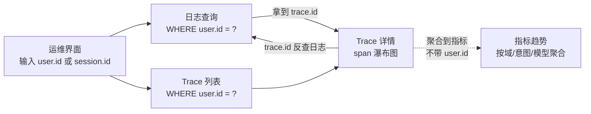

**对前端 UI 的硬性要求（落到 §4.1 / §5.2 的页面职责）**：

- **链路追踪页**：列表过滤项必须支持 `user.id` / `session.id` / 时间窗 / 域 / 状态；输出列展示 `trace.id` / `user.id` / `session.id`
- **日志查询页**：检索字段必须支持 `user.id` / `session.id` / `trace.id`；每行日志展示三者，点击可互相跳转
- **AI 洞察页**：异常会话下钻表格展示 `user.id` / `session.id`，点击跳转到该会话的完整 Trace
- **运营大屏**：仍按域 / 意图 / 模型聚合（**不下钻到人**）；"实时请求滚动列表"那栏可显示 `session.id` 简略尾号，点击跳到 Trace 详情

### D.9 三阶段交付建议（与 §3 阶段路线图对齐）

图例：✅ 默认开启 ｜ 🆕 阶段新增 ｜ ➖ 不适用

| 类别 | 阶段零 MVP | 阶段一 生产化 | 阶段二 规模化 |
|------|:---------:|:-----------:|:-----------:|
| A.1–A.6 基础（JVM / HTTP / 日志） | ✅ 全开 | ✅ | ✅ |
| A.7–A.9 DB / 缓存 | ✅ | ✅ 完整 | ✅ |
| A.10 消息中间件 | ➖ | 🆕 按需 | ✅ |
| B.1–B.4 LLM 核心 + 成本 | ✅ 全开 | ✅ | ✅ |
| B.5 Prompt Cache | ➖ | 🆕 | ✅ |
| B.6 Embedding / RAG | ➖ | 🆕 启用即开 | ✅ |
| B.7 质量评估 | ➖ | 🆕 在线评测引入后 | ✅ |
| C.1–C.5 路由 / 状态机 / 子图 / 槽位 | ✅ 核心子集（D.6 12 项） | ✅ 全量 | ✅ |
| C.6 工具调用 | 🆕 接入 Function Calling 后 | ✅ | ✅ |
| C.7 会话 / 用户行为 | ✅ 子集 | ✅ 全量 | ✅ |
| C.8 业务结果 | ✅ 子集（成功 / 失败 / 取消） | ✅ 全量 + 业务量级 | ✅ |
| C.9 安全 / 合规 | ➖ | 🆕 | ✅ |
| C.10 A/B 实验 | ➖ | 🆕 实验平台接入后 | ✅ |
| C.11 Prompt 治理 | ➖ | 🆕 | ✅ |
| D.1–D.5 平台自观测 | ✅ 子集（receiver + storage 写入计数） | ✅ 全量 | ✅ |
| D.6 采集覆盖度自检 | ➖ | 🆕 | ✅ |

### D.10 指标分层模型（L1~L4）

> 同一个"时延"在不同层含义不同，用**命名前缀**区分，而不是塞进一个指标。四层模型回答四个不同的问题。

| 层级 | 回答的问题 | 典型指标 | 数据来源 |
|:----:|----------|---------|---------|
| **L1 系统级** | "系统还活着吗？健康吗？" | 访问用户量、访问次数、QPS、错误率、系统时延（HTTP P50/P95/P99） | Actuator + OTel Agent 自动 |
| **L2 AI 模型级** | "模型跑得好吗？贵不贵？" | Token 调用量、LLM 时延、首 token 时延、模型错误率、成本 | Spring AI 内置 |
| **L3 智能体业务级** | "智能体干得对吗？" | 调用智能体统计、调用工具统计、意图识别准确率、改写准确率、执行完成率、业务转化率 | 手动埋点 |
| **L4 体验级** | "用户爽吗？" | 用户满意度、会话时延、首 token 时延（用户感知）、全部回复时延 | 埋点 + 反馈 |

**时延跨层的命名区分**（同一个"时延"在四层各有一个指标，命名前缀不同）：

| 指标名 | 层级 | 含义 |
|--------|:----:|------|
| `http.server.request.duration` | L1 | 系统时延（端到端 HTTP） |
| `gen_ai.client.operation.duration` | L2 | 模型时延（纯 LLM 调用） |
| `gen_ai.client.first.token.latency` | L2/L4 | 首 token 时延（TTFT，用户感知强相关） |
| `agent.workflow.execution.duration` | L3 | 智能体执行时延（含编排开销） |
| `agent.session.duration` | L4 | 会话时延（首条消息到最后输出） |

> 首页大盘按层取数；下钻时同一族时延能横向对比"系统耗时 vs 模型耗时 vs 智能体编排耗时"，定位瓶颈在哪一层。

**D.2~D.5 各类指标与分层模型的映射**：

| 指标类别 | 主要归属层 | 备注 |
|----------|:---------:|------|
| D.2 A 类基础指标 | L1 | JVM / HTTP / DB / 缓存均属系统健康 |
| D.3 B 类 AI 模型层 | L2 | LLM / 流式 / 成本 / RAG / 质量 |
| D.4 C 类 AI 业务语义 | L3 为主，部分 L4 | 路由 / 意图 / 状态机 / 子图 / 槽位 / 工具 / 业务结果属 L3；会话满意度属 L4 |
| D.5 D 类平台自观测 | 平台自身 | 不直接面向业务分层，独立成"平台健康"维度 |

**首页运营大屏的取数规则**（与 §4.3 三区九卡对应）：区域一取 L1，区域二取 L2，区域三取 L3/L4；平台自观测（D 类）不进首页，放独立的"平台健康"小屏或运维视图。
