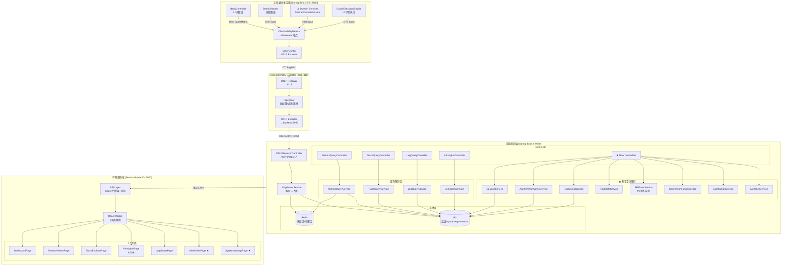
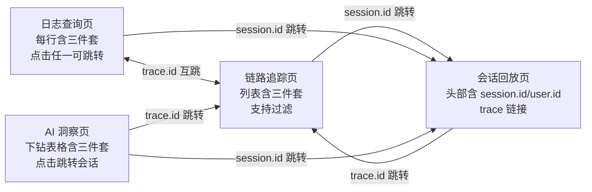

# AI可观测系统 — 系统架构设计

> 版本：V1 | 日期：2025-07-10 | 项目：Mobile AI Bank 可观测系统
> 作者：Bob（架构师）| 基于 PRD V1 + 现有代码深度分析

---

## 目录

1. [总体架构设计](#1-总体架构设计)
2. [数据模型设计](#2-数据模型设计)
3. [后端API设计](#3-后端api设计)
4. [前端架构设计](#4-前端架构设计)
5. [数据采集增强设计](#5-数据采集增强设计)
6. [部署与运维](#6-部署与运维)
7. [附录：设计决策记录](#7-附录设计决策记录)

---

## 1. 总体架构设计

### 1.1 系统全景架构



### 1.2 数据流详解

```
              ┌──────── OTLP管道（三条并行）────────┐
              │                                       │
手机银行主应用 │  Metrics → OTel Collector → 后端9090 │
  (埋点增强)  │  Traces  → OTel Collector → 后端9090 │ → 前端3000
              │  Logs    → OTel Collector → 后端9090 │
              │                                       │
              └───────────────────────────────────────┘
```

**OTLP Metrics 管线**：
1. 手机银行 `ObservabilityMetrics` (Micrometer) → `MeterConfig` (OTLP Exporter)
2. → OTel Collector `:4318` (gRPC)
3. → 可观测后端 `:9090` `/api/v1/otlp/v1/metrics` (HTTP POST)
4. → `OtlpParserService` 解析 → Redis 热层 (实时滑动窗口) + H2 `metrics_agg` (历史温层)

**OTLP Traces 管线**：
1. 手机银行 Spring AI Graph 自动 Span → OTel Java Agent → Collector
2. → 可观测后端 `:9090` `/api/v1/otlp/v1/traces`
3. → `OtlpParserService` → H2 `spans` 表
4. → `TraceQueryService` 查询 + 构建 Span 树

**OTLP Logs 管线**：
1. 手机银行 SLF4J/Logback → OTel Java Agent Log Appender → Collector
2. → 可观测后端 `:9090` `/api/v1/otlp/v1/logs`
3. → `OtlpParserService` → H2 `logs` 表

### 1.3 技术选型

| 组件 | 选择 | 版本 | 理由 |
|------|------|------|------|
| 后端框架 | Spring Boot (Java) | 3.x | 现有，与手机银行主应用一致 |
| 数据库 | H2 | latest | P0阶段够用，P2迁PostgreSQL |
| 缓存 | Redis | 7.x | 热层滑动窗口，3s轮询友好 |
| OTLP接收 | 自建HTTP端点 | - | 轻量，避免引入gRPC服务端 |
| 前端框架 | React + Vite | 18.3 / 5.x | 现有 |
| UI库 | Ant Design 5 | 5.21 | 现有，亮色主题迁移目标 |
| 图表库 | ECharts + echarts-for-react | 5.4 / 3.0 | 现有，统一封装 |
| 路由 | React Router v6 | latest | 现有依赖，P0完善路由 |
| HTTP客户端 | axios | 1.7 | 现有 |
| 状态管理 | React Context + useReducer | - | 轻量，避免引入Zustand依赖 |

**状态管理选型理由**：选择 React Context + useReducer 而非 Zustand：
- 项目规模中等（7页面），不涉及复杂跨页面状态共享
- 减少依赖引入，与现有技术栈一致
- 每个页面可以独立管理自己的数据状态（3s轮询模式）
- 全局状态仅需：当前时间范围、主题配置、告警通知计数

### 1.4 模块分类与去留决策（Q12）

基于 v2.5 设计文档 §4.6 确立的 A/B/C/D/E 五类模块分类体系，明确各模块在 MVP 阶段的去留决策及与 dashboard-v15.html 7 个页面的承载关系：

#### 五类模块定义

| 模块 | 名称 | MVP 策略 | 说明 |
|------|------|:---:|------|
| **A** | 基础指标（Infra） | 自动采集，首页借 1~2 卡，不自建专用页 | JVM / HTTP / DB / 缓存等标准指标，Actuator + OTel Agent 自动开 |
| **B** | AI 模型层（LLM 性能） | ✅ 自建主战场 | Token 用量、首 Token 时延、模型调用量等 |
| **C** | AI 业务语义层 | ✅ 自建主战场 | 意图识别准确率、路由决策、状态机流转、会话漏斗、满意度等 |
| **D** | 平台自观测 | ❌ MVP 不做 | 平台自身健康指标（Receiver/管线/存储），延后到阶段二 |
| **E** | 维度规范 | ✅ 贯穿全程的约束 | Metric Tag 基数额度、高基数字段归属规则，不单独排期 |

#### 模块 → 页面承载映射

```
A 类（基础指标）  ──→ 运营大屏 Zone A（借 1~2 卡，如访问量/系统时延 P95）
                      不自建 A 专用页，P2 交给 Grafana

B 类（AI 模型层） ──→ 运营大屏 Zone B（Token / TTFT / LLM 错误率）
                      AI 洞察页（Token 成本 TAB + Agent 性能 TAB）

C 类（AI 业务语义）──→ 运营大屏 Zone C（准确率 / Reroute / 完成率）
                      ｜→ 运营大屏 Zone D（转化率 / 违规率）
                      AI 洞察页（准确率 / 工具调用 / 漏斗 / 满意度 TAB）
                      链路追踪页（Span 瀑布图 + 决策下钻）
                      会话回放页（对话气泡 + Turn 详情）
                      日志查询页（结构体日志检索）

D 类（平台自观测） ──→ MVP 不做（仅后端存活探针 /health）

E 类（维度规范）   ──→ 约束所有埋点代码的 Tag 设计，详见 §2.4
```

#### 7 页面与模块对应关系一览

| 页面 | 导航 ID | 承载模块 | 核心受众 |
|------|---------|:-------:|---------|
| 总览大屏 | `dashboard` | A(借卡) + B(Zone B) + C(Zone C/D) | 运维 / Tech Lead |
| 会话回放 | `sessions` | C（会话生命周期 + 意图流） | 产品 / 开发 |
| 链路追踪 | `traces` | B + C（Span 瀑布图 + 决策路径） | 开发 |
| AI 洞察 | `insights` | B + C（6 TAB：准确率/性能/Token/工具调用/漏斗/满意度） | 算法 / QA / 产品 |
| 日志查询 | `logs` | B + C（结构化日志 + 三件套检索） | 开发 / 运维 |
| 告警规则 | `alerts` | —（基础设施能力） | 运维 |
| 系统设置 | `settings` | —（基础设施能力） | 运维 |

> **设计原则**：自建前端只服务 B+C，A 的完整大盘不建（冗余），D 的平台健康页不建（过度工程）。这与业界 AI 可观测产品（LangSmith / LangFuse / Arize Phoenix）取舍一致——差异化全在 B+C。

---

## 2. 数据模型设计

### 2.1 现有H2表结构（保留不动）

| 表名 | 用途 | 关键字段 |
|------|------|---------|
| `spans` | Span追踪记录 | trace_id, span_id, parent_span_id, operation_name, duration_ms, attributes(JSON) |
| `logs` | 日志记录 | trace_id, span_id, level, message, timestamp, attributes(JSON) |
| `metrics_agg` | 指标聚合 | metric_name, tags(JSON), value, agg_window, timestamp |

### 2.2 需新增的表（8张）

#### 2.2.1 sessions — 会话聚合表

```sql
CREATE TABLE sessions (
    id BIGINT AUTO_INCREMENT PRIMARY KEY,
    session_id VARCHAR(128) NOT NULL UNIQUE,
    user_id VARCHAR(64),
    channel VARCHAR(32) DEFAULT 'mobile',
    first_intent VARCHAR(64),
    final_intent VARCHAR(64),
    turn_count INT DEFAULT 0,
    agent_chain VARCHAR(256),          -- 如 "L0→L1-Wealth→L2-TransferService"
    total_duration_ms BIGINT DEFAULT 0,
    total_token_input BIGINT DEFAULT 0,
    total_token_output BIGINT DEFAULT 0,
    status VARCHAR(16) DEFAULT 'active', -- active/completed/error/abandoned
    satisfaction_score INT,            -- 1-5，NULL表示未评价（旧版）
    satisfaction_rating VARCHAR(16),   -- satisfied|neutral|unsatisfied，P0新增
    satisfaction_reason VARCHAR(512),   -- 反馈原因（可选）
    created_at TIMESTAMP NOT NULL,
    updated_at TIMESTAMP NOT NULL,
    INDEX idx_sessions_user (user_id),
    INDEX idx_sessions_status (status),
    INDEX idx_sessions_created (created_at)
);
```

#### 2.2.2 session_turns — 会话轮次明细表

```sql
CREATE TABLE session_turns (
    id BIGINT AUTO_INCREMENT PRIMARY KEY,
    session_id VARCHAR(128) NOT NULL,
    turn_number INT NOT NULL,
    trace_id VARCHAR(64),
    user_query TEXT,
    ai_response TEXT,
    intent VARCHAR(64),
    agent_level VARCHAR(8),            -- L0/L1/L2
    agent_name VARCHAR(128),
    duration_ms BIGINT,
    token_input INT DEFAULT 0,
    token_output INT DEFAULT 0,
    ttft_ms BIGINT,                    -- 首Token时延
    rewrite_original TEXT,             -- 改写前原文
    rewrite_result TEXT,               -- 改写后文本
    reroute_triggered BOOLEAN DEFAULT FALSE,
    business_outcome VARCHAR(32),      -- success/fail/pending
    created_at TIMESTAMP NOT NULL,
    FOREIGN KEY (session_id) REFERENCES sessions(session_id),
    INDEX idx_turns_session (session_id),
    INDEX idx_turns_trace (trace_id)
);
```

#### 2.2.3 agent_performance — Agent性能快照表

```sql
CREATE TABLE agent_performance (
    id BIGINT AUTO_INCREMENT PRIMARY KEY,
    agent_level VARCHAR(8) NOT NULL,    -- L0/L1/L2
    agent_name VARCHAR(128),
    llm_model VARCHAR(64),
    call_count INT DEFAULT 0,
    ttft_p50_ms DOUBLE,
    ttft_p95_ms DOUBLE,
    ttft_p99_ms DOUBLE,
    tpot_p50_ms DOUBLE,                -- 每输出Token时延
    tpot_p95_ms DOUBLE,
    duration_p50_ms DOUBLE,
    duration_p95_ms DOUBLE,
    token_avg_input INT,
    token_avg_output INT,
    error_count INT DEFAULT 0,
    window_start TIMESTAMP NOT NULL,   -- 统计窗口起始
    window_end TIMESTAMP NOT NULL,     -- 统计窗口结束
    INDEX idx_ap_level (agent_level),
    INDEX idx_ap_window (window_start)
);
```

#### 2.2.4 token_cost — Token成本明细表

```sql
CREATE TABLE token_cost (
    id BIGINT AUTO_INCREMENT PRIMARY KEY,
    model_name VARCHAR(64) NOT NULL,   -- qwen-plus/qwen-max/...
    intent VARCHAR(64),
    agent_level VARCHAR(8),
    input_tokens BIGINT DEFAULT 0,
    output_tokens BIGINT DEFAULT 0,
    cost_estimate DECIMAL(10,6),       -- 预估费用（USD）
    session_id VARCHAR(128),
    trace_id VARCHAR(64),
    recorded_at TIMESTAMP NOT NULL,
    INDEX idx_tc_model (model_name),
    INDEX idx_tc_intent (intent),
    INDEX idx_tc_time (recorded_at)
);
```

#### 2.2.5 tool_calls — 工具调用记录表

```sql
CREATE TABLE tool_calls (
    id BIGINT AUTO_INCREMENT PRIMARY KEY,
    tool_name VARCHAR(128) NOT NULL,   -- 如 "BankAccountQuery"
    tool_provider VARCHAR(64),         -- 如 "banking-api"
    session_id VARCHAR(128),
    trace_id VARCHAR(64),
    call_status VARCHAR(16) DEFAULT 'success', -- success/error/timeout
    duration_ms BIGINT,
    error_message TEXT,
    recorded_at TIMESTAMP NOT NULL,
    INDEX idx_tool_call_tool (tool_name),
    INDEX idx_tool_call_time (recorded_at)
);
```

#### 2.2.6 skill_stats — Skill业务效果统计表

> ⚠️ **P1 实现，P0 不建表**：Skill 模块在 P0 阶段暂不实现，前端 AI 洞察页 "工具调用" TAB 中 Skill 区域标注 "P0 隐藏"。P1 阶段建表并实现对应 API。

```sql
CREATE TABLE skill_stats (
    id BIGINT AUTO_INCREMENT PRIMARY KEY,
    skill_name VARCHAR(128) NOT NULL,  -- 如 "WealthConsult/TransferService/BillQuery"
    intent VARCHAR(64),
    total_calls INT DEFAULT 0,
    success_calls INT DEFAULT 0,
    completion_rate DOUBLE,            -- 业务完成率
    avg_duration_ms DOUBLE,
    avg_turns DOUBLE,                  -- 平均轮次
    drop_off_rate DOUBLE,              -- 放弃率
    window_start TIMESTAMP NOT NULL,
    window_end TIMESTAMP NOT NULL,
    INDEX idx_ss_skill (skill_name),
    INDEX idx_ss_window (window_start)
);
```

#### 2.2.7 alert_rules — 告警规则定义表

```sql
CREATE TABLE alert_rules (
    id BIGINT AUTO_INCREMENT PRIMARY KEY,
    name VARCHAR(128) NOT NULL,
    description VARCHAR(512),
    metric_name VARCHAR(128) NOT NULL, -- 监控指标: error_rate/p95_latency/qps/...
    condition_operator VARCHAR(8),     -- GT/GTE/LT/LTE
    threshold DOUBLE NOT NULL,
    duration_minutes INT DEFAULT 5,    -- 持续超过N分钟才触发
    severity VARCHAR(16) DEFAULT 'WARNING', -- CRITICAL/WARNING/INFO
    enabled BOOLEAN DEFAULT TRUE,
    notify_channels VARCHAR(256),      -- JSON: ["email","dingtalk","feishu"]
    created_at TIMESTAMP NOT NULL,
    updated_at TIMESTAMP NOT NULL
);
```

#### 2.2.8 alert_events — 告警事件记录表

```sql
CREATE TABLE alert_events (
    id BIGINT AUTO_INCREMENT PRIMARY KEY,
    rule_id BIGINT NOT NULL,
    rule_name VARCHAR(128),
    severity VARCHAR(16),
    metric_name VARCHAR(128),
    current_value DOUBLE,
    threshold DOUBLE,
    status VARCHAR(16) DEFAULT 'FIRING', -- FIRING/ACKNOWLEDGED/RESOLVED
    acknowledged_by VARCHAR(64),
    acknowledged_at TIMESTAMP,
    resolved_at TIMESTAMP,
    detail_json TEXT,                   -- 触发详情JSON
    fired_at TIMESTAMP NOT NULL,
    FOREIGN KEY (rule_id) REFERENCES alert_rules(id),
    INDEX idx_ae_rule (rule_id),
    INDEX idx_ae_status (status),
    INDEX idx_ae_fired (fired_at)
);
```

### 2.3 RealtimeMetricsVO 扩展（9字段→20字段）

```java
// 文件: observability/backend/.../dto/RealtimeMetricsVO.java
// 说明: 扩展已有类，新增11个字段

public class RealtimeMetricsVO {
    // ── 保留字段（9个）──
    private long requestCount;
    private long errorCount;
    private double avgLatency;
    private long tokenInput;
    private long tokenOutput;
    private Map<String, Long> intentDistribution;
    private long activeSessions;
    private double p50Latency;
    private double p95Latency;

    // ── Zone A 系统健康（新增5个）──
    private long dau;                    // 日活跃用户量
    private long realtimeOnline;         // 实时在线用户数
    private double qps;                  // 每秒请求数 (requestCount/60)
    private Map<String, Long> agentDistribution; // L0/L1/L2调用分布
    private long totalVisits;            // 访问次数累计

    // ── Zone B AI性能（新增2个）──
    private long tokenTotal;             // tokenInput + tokenOutput 总量
    private double ttftP50;              // 首Token时延 P50 (ms)
    private double ttftP95;              // 首Token时延 P95 (ms)
    private double ttftP99;              // 首Token时延 P99 (ms)

    // ── Zone C 语义质量（新增4个）──
    private double intentAccuracyRate;   // 意图识别准确率
    private double rewriteAccuracyRate;  // 改写准确率
    private double rerouteRate;          // Reroute率
    private double businessCompletionRate; // 业务完成率

    // ── Zone D 业务效果（新增2个）──
    private double conversionRate;       // 业务转化率
    private double violationRate;        // 违规率
}
```

**Redis Key 扩展方案**（新增 Redis key 用于存储扩展字段）：

```
obs:metrics:dau                   → String (SET, 24h TTL)
obs:metrics:online_users          → String (SET, 30s TTL)
obs:metrics:agent_distribution    → HASH (L0/L1/L2 计数)
obs:metrics:ttft:{window}         → ZSET (TTFT值分布)
obs:metrics:accuracy:intent       → String (滑动平均值)
obs:metrics:accuracy:rewrite      → String (滑动平均值)
obs:metrics:reroute_count:{window} → String (INCR)
obs:metrics:business_completion   → String (滑动平均值)
obs:metrics:conversion            → String (滑动平均值)
obs:metrics:violation             → String (滑动平均值)
obs:metrics:total_visits          → String (INCR, 24h TTL)
```

### 2.4 维度规范与基数预算（Q14）

> 本节是 E 类模块（维度规范）的落地约束，贯穿所有埋点代码的 Tag 设计。

#### 核心原则

**Metric Tag 用来做聚合切片，必须低基数；高基数标识应放在 Trace span attributes 和结构化 Log fields 中。**

| 概念 | 用途 | 是否能高基数 | 存储位置 |
|------|------|:---:|---------|
| **Metric Tag（聚合维度）** | "按维度切片求和"，如按域统计请求量 | ❌ 严格限基数 | Metric 时序库索引 |
| **Trace / Log Attribute（关联标识）** | "定位一次具体请求"，如查某用户某次出错 | ✅ 可高基数 | Trace / Log 存储 |
| **页面展示字段** | 在 UI 上让运维看见并跳转 | ✅ 任意 | 来自 Trace / Log，不来自 Metric |

#### 允许做 Metric Tag 的字段（基数 < 200）

| Tag 名称 | 用途 | 单值基数上限 | 备注 |
|----------|------|:---:|------|
| `service.name` | 服务标识 | < 50 | OTel Resource，全指标必带 |
| `service.version` | 服务版本 | < 50 | 同上 |
| `deployment.environment` | 部署环境 | < 10 | 同上 |
| `agent.domain` | 业务域 | < 200 | 受意图集合约束 |
| `agent.intent` | 意图类别 | < 200 | 新增意图需走治理评审 |
| `agent.graph` | 子图名称 | < 50 | |
| `agent.node` | 子图节点 | < 100 | |
| `gen_ai.system` | AI 系统 | < 10 | 如 `qwen` |
| `gen_ai.request.model` | 请求模型 | < 30 | 多模型对比关键 |
| `gen_ai.response.model` | 响应模型 | < 30 | 同上 |
| `outcome` | 结果 | < 10 | `success` / `fail` / `pending` / `cancelled` |
| `error.type` | 错误类型 | < 20 | 必须是有限枚举 |
| `decision` | 路由决策类型 | < 15 | `FOLLOW_UP` / `SWITCH_NEW` / `RESUME` / `REROUTE` |
| `channel` | 渠道 | < 10 | `mobile` / `web` / `miniprogram` |
| `agent.level` | Agent 层级 | < 5 | `L0` / `L1` / `L2` |

#### 禁止作为 Metric Tag 的字段清单

| 字段 | 原因 | 正确归属 |
|------|------|---------|
| `user.id` | 高基数（10 万+活跃用户） | Trace span attribute + Log field |
| `session.id` | 高基数（每会话唯一） | Trace span attribute + Log field |
| `trace.id` | 每请求唯一（百万级/d） | Trace 原生标识 + Log field |
| `原始 prompt` | 无限基数 + 敏感数据 | Trace span attribute |
| `原始金额` | 无限基数 + 敏感数据 | Trace span attribute |
| `request.id` | 高基数 | Trace span attribute |
| `span.id` | 高基数 | Span 原生标识 |

> **典型反例警示**：若把 `user.id` 加进指标 `agent.router.decision.outcome` 的 Tag，原本 `5层 × 4决策 × 3结果 = 60` 条时间序列，加上 10 万活跃用户后变为 `60 × 100,000 = 6,000,000` 条 → 任何时序数据库都会 OOM 或拒写。

#### 对前端 UI 的硬性要求

- **链路追踪页**：列表过滤项必须支持 `user.id` / `session.id`；输出列展示 `trace.id` / `user.id` / `session.id`
- **日志查询页**：检索字段必须支持 `user.id` / `session.id` / `trace.id` 三件套检索；每行日志展示三者
- **AI 洞察页**：异常会话下钻表格展示 `user.id` / `session.id`，点击跳转到该会话的完整 Trace
- **运营大屏**：仍按域 / 意图 / 模型聚合（**不下钻到人**）

> 这与 §4.7 三件套互跳体系不冲突——三件套在 Trace/Log 中展示和检索（高基数 OK），但不作为 Metric Tag 聚合维度。

---

## 3. 后端API设计

### 3.1 API 概览

| 分组 | 数量 | API路径前缀 | 优先级 |
|------|------|-----------|--------|
| 会话API | 2 | `/api/v1/sessions` | P0 |
| Agent性能API | 1 | `/api/v1/ai/agent-performance` | P0 |
| Token成本API | 1 | `/api/v1/ai/token-cost` | P0 |
| 工具调用API | 1 | `/api/v1/ai/tool-stats` | P0 |
| Skill业务API | 1 | `/api/v1/ai/skill-stats` | P1（P0不实现） |
| 转化漏斗API | 1 | `/api/v1/ai/conversion-funnel` | P0 |
| 满意度API | 2 | `/api/v1/ai/satisfaction` | P0（GET查询 + POST反馈） |
| 准确率趋势API | 1 | `/api/v1/ai/intent-accuracy-trend` | P0 |
| 混淆矩阵API | 1 | `/api/v1/ai/confusion-matrix` | P0 |
| 告警API | 2 | `/api/v1/alerts` | P0 |
| 设置API | 2 | `/api/v1/settings` | P0 |

### 3.2 会话API

#### GET /api/v1/sessions — 会话列表

```
请求参数:
  sessionId  String  可选  会话ID模糊搜索
  userId     String  可选  用户ID筛选
  channel    String  可选  渠道筛选 (mobile/web/miniprogram)
  intent     String  可选  意图筛选
  agentLevel String  可选  Agent层级 (L0/L1/L2)
  status     String  可选  状态: active/completed/error/abandoned
  from       Instant 可选  开始时间
  to         Instant 可选  结束时间
  page       int     可选  页码(默认0)
  size       int     可选  每页条数(默认20)

响应:
{
  "code": 0,
  "data": {
    "content": [
      {
        "sessionId": "sess_a1b2c3d4",
        "userId": "user_zhang",
        "channel": "mobile",
        "firstIntent": "TRANSFER",
        "finalIntent": "TRANSFER",
        "turnCount": 3,
        "agentChain": "L0→L1-Transfer→L2-TransferService",
        "totalDurationMs": 4520,
        "totalTokenInput": 1250,
        "totalTokenOutput": 890,
        "status": "completed",
        "statusLabel": "正常",
        "createdAt": "2025-07-10T10:30:00Z",
        "updatedAt": "2025-07-10T10:31:00Z"
      }
    ],
    "totalElements": 156,
    "totalPages": 8,
    "number": 0
  }
}
```

#### GET /api/v1/sessions/{sessionId} — 会话详情

```
响应:
{
  "code": 0,
  "data": {
    "sessionId": "sess_a1b2c3d4",
    "userId": "user_zhang",
    "channel": "mobile",
    "firstIntent": "TRANSFER",
    "finalIntent": "TRANSFER",
    "turnCount": 3,
    "agentChain": "L0→L1-Transfer→L2-TransferService",
    "totalDurationMs": 4520,
    "totalTokenInput": 1250,
    "totalTokenOutput": 890,
    "status": "completed",
    "satisfactionScore": 4,
    "satisfactionRating": "satisfied",   // ★ P0新增
    "satisfactionReason": null,          // ★ P0新增
    "turns": [
      {
        "turnNumber": 1,
        "traceId": "a1b2c3d4e5f6...",
        "userQuery": "我想转账5000元",
        "aiResponse": "请确认收款人信息",
        "intent": "TRANSFER",
        "agentLevel": "L0",
        "agentName": "DomainRouter",
        "durationMs": 1450,
        "tokenInput": 120,
        "tokenOutput": 80,
        "ttftMs": 380,
        "rerouteTriggered": false,
        "businessOutcome": "pending"
      },
      {
        "turnNumber": 2,
        "traceId": "b2c3d4e5f6a7...",
        "userQuery": "张三",
        "aiResponse": "请确认转账金额",
        "intent": "FOLLOW_UP",
        "agentLevel": "L1",
        "agentName": "TransferService",
        "durationMs": 1200,
        "tokenInput": 200,
        "tokenOutput": 100,
        "ttftMs": 220,
        "rewriteOriginal": "转账给张三",
        "rewriteResult": "向张三转账5000元",
        "rerouteTriggered": false,
        "businessOutcome": "pending"
      },
      {
        "turnNumber": 3,
        "traceId": "c3d4e5f6a7b8...",
        "userQuery": "5000",
        "aiResponse": "转账成功，已向张三转账5000元",
        "intent": "TRANSFER",
        "agentLevel": "L2",
        "agentName": "TransferService",
        "durationMs": 1870,
        "tokenInput": 180,
        "tokenOutput": 120,
        "ttftMs": 510,
        "rerouteTriggered": false,
        "businessOutcome": "success"
      }
    ]
  }
}
```

### 3.3 Agent性能API

#### GET /api/v1/ai/agent-performance

```
请求参数:
  dimension  String  可选  agent/llm (默认agent)
  from       Instant 可选  默认24h前
  to         Instant 可选  默认现在

响应 (dimension=agent):
{
  "code": 0,
  "data": {
    "dimension": "agent",
    "summary": {
      "totalCalls": 156,
      "avgTTFT_ms": 342.5,
      "p95TTFT_ms": 850.0,
      "avgTPOT_ms": 45.2,
      "p95TPOT_ms": 120.5
    },
    "byAgent": [
      {
        "agentLevel": "L0",
        "agentName": "DomainRouter",
        "callCount": 89,
        "ttftP50_ms": 380.0,
        "ttftP95_ms": 850.0,
        "ttftP99_ms": 1200.0,
        "tpotP50_ms": 35.0,
        "tpotP95_ms": 95.0,
        "durationP50_ms": 890.0,
        "durationP95_ms": 2100.0,
        "tokenAvgInput": 150,
        "tokenAvgOutput": 80,
        "errorCount": 2,
        "completionRate": 98.9
      },
      {
        "agentLevel": "L1",
        "agentName": "TransferService",
        "callCount": 42,
        ...
      }
    ],
    "ttftDistribution": {  // 供箱线图/散点图
      "L0": [380, 420, 350, 850, 1200, ...],
      "L1": [220, 280, 310, 520, 890, ...],
      "L2": [510, 620, 480, 1200, 1800, ...]
    }
  }
}

响应 (dimension=llm):
{
  "code": 0,
  "data": {
    "dimension": "llm",
    "byModel": [
      {
        "llmModel": "qwen-plus",
        "callCount": 120,
        "ttftP50_ms": 320.0,
        "ttftP95_ms": 780.0,
        "tpotP50_ms": 40.0,
        "tpotP95_ms": 110.0,
        "tokenAvgInput": 180,
        "tokenAvgOutput": 95,
        "errorCount": 3
      },
      {
        "llmModel": "qwen-max",
        "callCount": 36,
        ...
      }
    ],
    "ttftDistribution": {
      "qwen-plus": [320, 350, 280, 780, ...],
      "qwen-max": [450, 520, 380, 950, ...]
    }
  }
}
```

### 3.4 AI洞察系列API

#### GET /api/v1/ai/token-cost

```
请求参数:
  groupBy    String  可选  model/intent/agent (默认model)
  from       Instant 可选
  to         Instant 可选

响应:
{
  "code": 0,
  "data": {
    "totalInput": 1250000,
    "totalOutput": 890000,
    "totalCost": 12.35,
    "breakdown": [
      {
        "key": "qwen-plus",
        "inputTokens": 980000,
        "outputTokens": 720000,
        "costEstimate": 9.85
      },
      {
        "key": "qwen-max",
        "inputTokens": 270000,
        "outputTokens": 170000,
        "costEstimate": 2.50
      }
    ]
  }
}
```

#### GET /api/v1/ai/tool-stats

```
响应:
{
  "code": 0,
  "data": {
    "tools": [
      {
        "toolName": "BankAccountQuery",
        "toolProvider": "banking-api",
        "totalCalls": 230,
        "successCalls": 225,
        "errorCalls": 5,
        "avgDurationMs": 120.5,
        "successRate": 97.8
      }
    ]
  }
}
```

#### GET /api/v1/ai/skill-stats

> ⚠️ **P1 实现，P0 不实现**：P0 阶段前端 "工具调用" TAB 中 Skill 区域展示 "暂无数据" 占位。

```
响应 (与转化漏斗互补: 漏斗是横向流程，Skill是纵向领域):
{
  "code": 0,
  "data": {
    "skills": [
      {
        "skillName": "TransferService",
        "intent": "TRANSFER",
        "totalCalls": 85,
        "successCalls": 78,
        "completionRate": 91.8,
        "avgDurationMs": 3420,
        "avgTurns": 2.8,
        "dropOffRate": 8.2
      }
    ]
  }
}
```

#### GET /api/v1/ai/conversion-funnel

```
响应:
{
  "code": 0,
  "data": {
    "stages": [
      {"stage": "进入会话", "count": 1000, "rate": 100.0},
      {"stage": "意图识别", "count": 950, "rate": 95.0},
      {"stage": "L1路由", "count": 820, "rate": 82.0},
      {"stage": "L2执行", "count": 650, "rate": 65.0},
      {"stage": "业务完成", "count": 520, "rate": 52.0}
    ],
    "dropOffs": [
      {"stage": "L2执行→业务完成", "count": 130, "rate": 20.0}
    ]
  }
}
```

#### GET /api/v1/ai/satisfaction — 满意度查询聚合

```
请求参数:
  from       Instant 可选
  to         Instant 可选

响应:
{
  "code": 0,
  "data": {
    "distribution": {
      "satisfied": 320, "neutral": 80, "unsatisfied": 45
    },
    "satisfiedRate": 71.9,
    "trend": [  // 7天趋势
      {"date": "2025-07-04", "satisfiedRate": 70.1},
      {"date": "2025-07-10", "satisfiedRate": 71.9}
    ],
    "unsatisfiedReasons": [
      {"reason": "超时/慢", "count": 18, "percentage": 40.0},
      {"reason": "意图识别错误", "count": 12, "percentage": 26.7},
      {"reason": "回答不准确", "count": 10, "percentage": 22.2}
    ],
    "lowScoreSessions": [
      {"sessionId": "sess_xxx", "rating": "unsatisfied", "query": "帮我转账", "reason": "超时"}
    ]
  }
}
```

#### POST /api/v1/ai/satisfaction — 用户满意度反馈提交 ★ 新增

```
Request:
{
  "sessionId": "sess_a1b2c3d4",
  "rating": "satisfied|neutral|unsatisfied",
  "reason": "可选，反馈原因"
}

Response:
{ "code": 200 }
```

> **说明**：前端在会话回放 Modal 底部展示 👍/👎 反馈按钮，点击后调用此 API。数据存入 `sessions` 表的 `satisfaction_rating` 字段。


#### GET /api/v1/ai/intent-accuracy-trend

```
响应:
{
  "code": 0,
  "data": {
    "series": [
      {
        "name": "总体准确率",
        "data": [{"time": "2025-07-04", "value": 0.92}, ...]
      },
      {
        "name": "TRANSFER准确率",
        "data": [{"time": "2025-07-04", "value": 0.95}, ...]
      },
      {
        "name": "BILL_QUERY准确率",
        "data": [{"time": "2025-07-04", "value": 0.88}, ...]
      },
      {
        "name": "WEALTH_CONSULT准确率",
        "data": [{"time": "2025-07-04", "value": 0.90}, ...]
      },
      {
        "name": "CHAT准确率",
        "data": [{"time": "2025-07-04", "value": 0.85}, ...]
      }
    ]
  }
}
```

#### GET /api/v1/ai/confusion-matrix

```
响应:
{
  "code": 0,
  "data": {
    "labels": ["TRANSFER", "BILL_QUERY", "WEALTH_CONSULT", "CHAT"],
    "matrix": [
      [85, 5, 3, 7],    // TRANSFER 真实 → 各预测
      [8, 75, 5, 12],   // BILL_QUERY
      [4, 3, 88, 5],    // WEALTH_CONSULT
      [10, 8, 6, 76]    // CHAT
    ],
    "totalSamples": 400
  }
}
```

### 3.5 告警API

#### GET/POST /api/v1/alerts/rules — 告警规则CRUD

```
GET   /api/v1/alerts/rules         — 规则列表
POST  /api/v1/alerts/rules         — 创建规则
PUT   /api/v1/alerts/rules/{id}    — 更新规则
DELETE /api/v1/alerts/rules/{id}   — 删除规则

请求体 (POST/PUT):
{
  "name": "P95时延过高",
  "description": "P95延迟超过3秒告警",
  "metricName": "p95_latency",
  "conditionOperator": "GT",
  "threshold": 3000.0,
  "durationMinutes": 5,
  "severity": "WARNING",
  "enabled": true,
  "notifyChannels": ["email","dingtalk"]
}
```

#### GET /api/v1/alerts/events — 告警事件时间线

```
请求参数:
  ruleId   Long    可选  按规则筛选
  status   String  可选  FIRING/ACKNOWLEDGED/RESOLVED
  from     Instant 可选
  to       Instant 可选

响应:
{
  "code": 0,
  "data": [
    {
      "id": 1,
      "ruleId": 2,
      "ruleName": "P95时延过高",
      "severity": "WARNING",
      "currentValue": 3520.0,
      "threshold": 3000.0,
      "status": "RESOLVED",
      "firedAt": "2025-07-10T08:05:00Z",
      "resolvedAt": "2025-07-10T08:12:00Z"
    }
  ]
}
```

### 3.6 设置API

#### GET/PUT /api/v1/settings/collection — 采集配置

```
GET响应:
{
  "code": 0,
  "data": {
    "collectorStatus": "running",
    "collectorEndpoint": "http://localhost:4318",
    "samplingRate": 100,
    "tagStrategy": "full",
    "promptStorageEnabled": true,
    "retentionDays": 30
  }
}
```

#### GET/PUT /api/v1/settings/storage — 存储配置

```
GET响应:
{
  "code": 0,
  "data": {
    "databaseType": "H2",
    "redisHost": "localhost:6379",
    "redisStatus": "connected",
    "metricsRetentionHours": 24,
    "traceRetentionDays": 7,
    "logRetentionDays": 30
  }
}
```

### 3.7 现有API扩展

#### GET /api/v1/traces — 增加参数

```
新增请求参数:
  sessionId  String  → TraceQueryService.listTraces() 过滤
  userId     String  → SpanEntity attributes 中 user_id 过滤
  statusCode String  → OK/ERROR 过滤

新增响应字段（TraceListVO）:
  ttftMs     Long    → TTFT值（来自 attributes llm.first_token_time）
  tokenTotal Long    → 总Token (ai.token.system + ai.token.context + ai.token.output)
  statusDot  String  → 🟢正常/🔴异常，替代现有 OK/ERR 文本
```

#### GET /api/v1/logs — 增加参数

```
新增请求参数:
  userId     String  → LogEntity attributes 中 user_id 过滤
  sessionId  String  → LogEntity attributes 中 session_id 过滤
```

---

## 4. 前端架构设计

### 4.1 React Router 路由设计

```
路由表:
  /                    → Redirect → /dashboard
  /dashboard           → DashboardPage      (总览大屏)
  /sessions            → SessionViewerPage  (会话回放)
  /sessions/:sessionId → SessionDetailModal (会话详情Modal)
  /traces              → TraceExplorerPage  (链路追踪)
  /traces/:traceId     → TraceDetailModal   (Trace详情Modal，替代内联面板)
  /insights            → AIInsightsPage     (AI洞察，含6个子TAB)
  /insights/:tab       → AIInsightsPage     (直接定位TAB)
  /logs                → LogViewerPage      (日志查询)
  /alerts              → AlertRulesPage ★   (告警规则)
  /settings            → SystemSettingsPage ★ (系统设置)
```

**路由实现关键变更**：

```jsx
// main.jsx 重构方案：
import { BrowserRouter, Routes, Route, Navigate } from 'react-router-dom';
import AppLayout from './components/AppLayout';
import DashboardPage from './pages/DashboardPage';
import SessionViewerPage from './pages/SessionViewerPage';
import TraceExplorerPage from './pages/TraceExplorerPage';
import AIInsightsPage from './pages/AIInsightsPage';
import LogViewerPage from './pages/LogViewerPage';
import AlertRulesPage from './pages/AlertRulesPage';
import SystemSettingsPage from './pages/SystemSettingsPage';

ReactDOM.createRoot(document.getElementById('root')).render(
  <React.StrictMode>
    <BrowserRouter>
      <AppLayout>
        <Routes>
          <Route path="/" element={<Navigate to="/dashboard" replace />} />
          <Route path="/dashboard" element={<DashboardPage />} />
          <Route path="/sessions" element={<SessionViewerPage />} />
          <Route path="/traces" element={<TraceExplorerPage />} />
          <Route path="/traces/:traceId" element={<TraceExplorerPage />} />
          <Route path="/insights" element={<AIInsightsPage />} />
          <Route path="/insights/:tab" element={<AIInsightsPage />} />
          <Route path="/logs" element={<LogViewerPage />} />
          <Route path="/alerts" element={<AlertRulesPage />} />
          <Route path="/settings" element={<SystemSettingsPage />} />
        </Routes>
      </AppLayout>
    </BrowserRouter>
  </React.StrictMode>
);
```

### 4.2 组件树设计

```mermaid
graph TD
    AppLayout["AppLayout<br/>(Layout + Sidebar)"]
    Sidebar["Sidebar<br/>7项导航 + LIVE指示器"]
    
    DP["DashboardPage<br/>总览大屏"]
    DPKPI["KpiCardGrid<br/>4区11卡"]
    DPTrend["TrendChart<br/>ECharts双轴图"]
    DPPie["AgentPieChart<br/>环形饼图"]
    
    SVP["SessionViewerPage<br/>会话回放"]
    SVFilter["SessionFilter<br/>6筛选器"]
    SVTable["SessionTable<br/>列表"]
    SVModal["SessionDetailModal<br/>对话气泡+Timeline"]
    
    TEP["TraceExplorerPage<br/>链路追踪"]
    TETable["TraceTable<br/>列表"]
    TEModal["TraceDetailModal<br/>全屏Modal"]
    TEIO["IOCards<br/>输入/输出双色卡片"]
    TESpanTree["SpanTree<br/>Agent层级树"]
    TEWaterfall["SpanWaterfall<br/>瀑布图"]
    
    AIP["AIInsightsPage<br/>AI洞察"]
    AITabs["InsightTabs<br/>6 TAB导航"]
    AITab1["AccuracyTab<br/>准确率分析"]
    AITab2["AgentPerfTab<br/>Agent性能"]
    AITab3["TokenCostTab<br/>Token成本"]
    AITab4["ToolCallTab<br/>工具调用"]
    AITab5["FunnelTab<br/>转化漏斗"]
    AITab6["SatisfactionTab<br/>满意度"]
    
    LVP["LogViewerPage<br/>日志查询"]
    LVFilter["LogFilter<br/>多条件筛选"]
    LVTable["LogTable<br/>日志表格"]
    
    ARP["AlertRulesPage ★<br/>告警规则"]
    ARTable["AlertRuleTable<br/>规则表"]
    ARTimeline["AlertTimeline<br/>闭环时间线"]
    
    SSP["SystemSettingsPage ★<br/>系统设置"]
    SSCollection["CollectionConfig<br/>采集配置"]
    SSStorage["StorageConfig<br/>存储配置"]
    
    AppLayout --> Sidebar
    AppLayout --> DP
    AppLayout --> SVP
    AppLayout --> TEP
    AppLayout --> AIP
    AppLayout --> LVP
    AppLayout --> ARP
    AppLayout --> SSP
    
    DP --> DPKPI
    DP --> DPTrend
    DP --> DPPie
    
    SVP --> SVFilter
    SVP --> SVTable
    SVP --> SVModal
    
    TEP --> TETable
    TEP --> TEModal
    TEModal --> TEIO
    TEModal --> TESpanTree
    TEModal --> TEWaterfall
    
    AIP --> AITabs
    AITabs --> AITab1
    AITabs --> AITab2
    AITabs --> AITab3
    AITabs --> AITab4
    AITabs --> AITab5
    AITabs --> AITab6
    
    LVP --> LVFilter
    LVP --> LVTable
    
    ARP --> ARTable
    ARP --> ARTimeline
    
    SSP --> SSCollection
    SSP --> SSStorage
```



### 4.3 状态管理方案

**选择：React Context + useReducer（轻量级方案）**

```jsx
// src/context/AppContext.jsx
// 全局状态仅覆盖：时间范围、主题、告警通知计数

const initialState = {
  timeRange: { from: null, to: null },  // 全局时间范围（可选覆盖）
  theme: 'light',                        // 固定亮色
  alertCount: 0,                         // 未处理告警数
};

// 各页面独立管理自身状态（本地 useState + useCallback）
// DashboardPage: 本地 metrics + 3s轮询
// SessionViewerPage: 本地 sessions + 筛选条件
// TraceExplorerPage: 本地 traces + traceDetail
// AIInsightsPage: 本地6个TAB各自独立数据
```

**不做全局状态的原因**：
- 7个页面数据独立，无跨页面共享数据需求
- 每页3s轮询模式适合局部状态
- 减少不必要的全局重渲染

### 4.4 图表统一方案

**方案：`echarts-for-react` + 自定义 `useECharts` hook + 共享 `chartTheme`**

```
src/
  hooks/
    useECharts.js          ← 统一图表hook（响应式resize + 主题）
    usePolling.js           ← 轮询hook（3s间隔 + 错误重试）
  theme/
    chartTheme.js           ← ECharts亮色主题配置
    antdTheme.js            ← Ant Design 5 ConfigProvider 亮色主题
  components/
    charts/
      MiniSpark.jsx         ← KPI卡片内32px迷你折线
      TrendChart.jsx        ← 双轴图（柱状+折线）
      PieChart.jsx          ← 环形/饼图
      FunnelChart.jsx       ← 漏斗图
      HeatmapChart.jsx      ← 混淆矩阵热力图
      BoxplotChart.jsx      ← 箱线图
      ScatterChart.jsx      ← 六色散点图
      WaterfallChart.jsx    ← Span瀑布图
```

**useECharts hook**：

```jsx
// src/hooks/useECharts.js
import { useRef, useEffect, useCallback } from 'react';

export function useECharts(options, deps = []) {
  const chartRef = useRef(null);

  const onChartReady = useCallback((echarts) => {
    chartRef.current = echarts;
  }, []);

  useEffect(() => {
    const handleResize = () => chartRef.current?.resize();
    window.addEventListener('resize', handleResize);
    return () => window.removeEventListener('resize', handleResize);
  }, []);

  // 返回标准 echarts-for-react 绑定props
  return {
    onChartReady,
    option: options,
    style: { height: '100%', width: '100%' },
    opts: { renderer: 'canvas' },
  };
}
```

### 4.5 API层设计

**扩展现有 `src/api/client.js`**：

```jsx
// 新增API函数（追加到现有 client.js）

// ── Session API ──
export function fetchSessions(params) {
  return client.get('/sessions', { params });
}
export function fetchSessionDetail(sessionId) {
  return client.get(`/sessions/${sessionId}`);
}

// ── AI Performance API ──
export function fetchAgentPerformance(dimension, from, to) {
  return client.get('/ai/agent-performance', { params: { dimension, from, to } });
}

// ── Token Cost API ──
export function fetchTokenCost(groupBy, from, to) {
  return client.get('/ai/token-cost', { params: { groupBy, from, to } });
}

// ── 工具调用 API ──
export function fetchToolStats(from, to) {
  return client.get('/ai/tool-stats', { params: { from, to } });
}

// ── Skill Stats API（P0 暂不实现）──
export function fetchSkillStats(from, to) {
  return client.get('/ai/skill-stats', { params: { from, to } });
}

// ── Conversion Funnel API ──
export function fetchConversionFunnel(from, to) {
  return client.get('/ai/conversion-funnel', { params: { from, to } });
}

// ── Satisfaction API ──
export function fetchSatisfaction(from, to) {
  return client.get('/ai/satisfaction', { params: { from, to } });
}
export function submitSatisfaction(data) {
  return client.post('/ai/satisfaction', data);  // ★ 新增：用户反馈提交
}

// ── Intent Accuracy Trend API ──
export function fetchIntentAccuracyTrend(from, to) {
  return client.get('/ai/intent-accuracy-trend', { params: { from, to } });
}

// ── Confusion Matrix API ──
export function fetchConfusionMatrix(from, to) {
  return client.get('/ai/confusion-matrix', { params: { from, to } });
}

// ── Alert API ──
export function fetchAlertRules() {
  return client.get('/alerts/rules');
}
export function createAlertRule(data) {
  return client.post('/alerts/rules', data);
}
export function updateAlertRule(id, data) {
  return client.put(`/alerts/rules/${id}`, data);
}
export function deleteAlertRule(id) {
  return client.delete(`/alerts/rules/${id}`);
}
export function fetchAlertEvents(params) {
  return client.get('/alerts/events', { params });
}

// ── Settings API ──
export function fetchCollectionSettings() {
  return client.get('/settings/collection');
}
export function updateCollectionSettings(data) {
  return client.put('/settings/collection', data);
}
export function fetchStorageSettings() {
  return client.get('/settings/storage');
}
export function updateStorageSettings(data) {
  return client.put('/settings/storage', data);
}
```

**现有 axios 拦截器已满足需求**：
- 响应拦截器自动解包 `{code, data, message}`
- 错误统一 `Promise.reject`
- timeout 10s 合理

### 4.6 亮色主题迁移方案

**从 dashboard-v15.html CSS变量 → Ant Design 5 ConfigProvider theme**

```jsx
// src/theme/antdTheme.js
// 基于 dashboard-v15.html 的亮色设计令牌转换为 Ant Design 5 theme token

export const lightTheme = {
  token: {
    // 基础
    colorPrimary: '#3b6cf6',
    colorSuccess: '#10b981',
    colorWarning: '#f59e0b',
    colorError: '#ef4444',
    colorInfo: '#06b6d4',

    // 背景
    colorBgBase: '#ffffff',
    colorBgContainer: '#ffffff',
    colorBgLayout: '#f0f2f5',
    colorBgElevated: '#ffffff',

    // 文字
    colorTextBase: '#1e293b',
    colorTextSecondary: '#64748b',
    colorTextTertiary: '#94a3b8',

    // 边框
    colorBorder: '#e2e8f0',
    colorBorderSecondary: '#f1f5f9',

    // 圆角
    borderRadius: 6,

    // 字体
    fontFamily: `'Inter', 'DM Sans', -apple-system, sans-serif`,
    fontFamilyCode: `'JetBrains Mono', 'Fira Code', monospace`,
  },
  components: {
    Layout: {
      headerBg: '#ffffff',
      siderBg: '#0f172a',        // Sidebar保留深色
      bodyBg: '#f0f2f5',
    },
    Menu: {
      darkItemBg: '#0f172a',
      darkItemSelectedBg: 'rgba(59,108,246,0.15)',
    },
    Card: {
      colorBgContainer: '#ffffff',
      borderRadiusLG: 10,
    },
    Table: {
      headerBg: '#f8fafc',
    },
  },
};
```

**main.jsx 应用主题**：

```jsx
import { ConfigProvider } from 'antd';
import { lightTheme } from './theme/antdTheme';

ReactDOM.createRoot(document.getElementById('root')).render(
  <React.StrictMode>
    <ConfigProvider theme={lightTheme}>
      <BrowserRouter>
        <AppLayout>
          <Routes>...</Routes>
        </AppLayout>
      </BrowserRouter>
    </ConfigProvider>
  </React.StrictMode>
);
```

**Sidebar 暗色保留策略**：
- Ant Design 5 的 Sider 组件支持 theme="dark"
- Sidebar 背景色保持 `#0f141e`（或升级为 `#0f172a`），与整体亮色形成对比
- 导航文字调整为亮色配色

### 4.7 三件套互跳体系（Q16）

> 本节定义 `user.id` ↔ `session.id` ↔ `trace.id` 三件套在 7 个页面间的互跳规则。三件套在 Trace/Log 中展示和检索（高基数 OK），但不作为 Metric Tag（见 §2.4）。

#### 互跳路径图



#### 7 页面三件套字段清单

##### 链路追踪页 (`/traces`)

| 元素 | 包含字段 | 交互 |
|------|---------|------|
| 列表列 | `trace.id` / `user.id` / `session.id` | 默认展示 |
| 列表过滤 | `user.id` / `session.id` 输入框 | 直接输入过滤 |
| 详情 Modal | 头部元信息三件套 | 点击 `session.id` → 跳转会話回放 |

##### 日志查询页 (`/logs`)

| 元素 | 包含字段 | 交互 |
|------|---------|------|
| 检索字段 | `user.id` / `session.id` / `trace.id` | 三输入框 + 全文搜索 |
| 每行日志 | 三件套 Badge | 点击 `trace.id` → Trace 详情 Modal；点击 `session.id` → 会话回放 |

##### 会话回放页 (`/sessions`)

| 元素 | 包含字段 | 交互 |
|------|---------|------|
| 列表列 | `session.id` / `user.id` | 默认展示 |
| 回放 Modal 头部 | `session.id` / `user.id` + 各 Turn 的 `trace.id` 链接 | 点击 `trace.id` → Trace 详情 Modal |

##### AI 洞察页 (`/insights`)

| 元素 | 包含字段 | 交互 |
|------|---------|------|
| 满意度 TAB 低分列表 | `session.id` / `user.id` | 点击 → 会话回放 |
| 漏斗 TAB 明细表 | `session.id` / `user.id` / `trace.id` | 点击 `trace.id` → Trace 详情 |
| 准确率 TAB 下钻 | `session.id` / `trace.id` | 点击 → Trace 详情 |

##### 运营大屏 (`/dashboard`)

| 元素 | 包含字段 | 交互 |
|------|---------|------|
| 实时请求滚动列表 | `session.id` 简略尾号 | 点击 → Trace 详情 |
| KPI 卡片 | 无（按域/意图/模型聚合） | **不下钻到人** |

> **与 Q14 的关系**：Q14 规定三件套不作为 Metric Tag 聚合维度（避免高基数爆炸），Q16 规定三件套在 Trace/Log/Session 中的展示与互跳路径。两者互补不冲突——Q14 管"不能把 `user.id` 放进指标 Tag"，Q16 管"在哪让用户看到和跳转 `user.id`"。

##### 告警规则页 + 系统设置页

不直接展示三件套字段。告警事件中包含 `session.id` 时可作为跳转锚点。

---

### 4.8 满意度反馈入口设计 ★ 新增

**会话回放 Modal 底部反馈按钮**：

```jsx
// SessionDetailModal.jsx 底部区域
<div className="session-feedback-bar">
  <span>本次会话体验如何？</span>
  <Button 
    icon={<LikeOutlined />} 
    onClick={() => handleFeedback('satisfied')}
    type={feedback === 'satisfied' ? 'primary' : 'default'}
  />
  <Button 
    icon={<DislikeOutlined />} 
    onClick={() => handleFeedback('unsatisfied')}
    type={feedback === 'unsatisfied' ? 'primary' : 'default'}
  />
</div>
```

- 调用 `submitSatisfaction({ sessionId, rating, reason? })` → `POST /api/v1/ai/satisfaction`
- 点击 👍 直接提交 `satisfied`
- 点击 👎 弹出一个可选原因输入框（超时/意图错误/回答不准/其他）
- 反馈提交后按钮置灰，防止重复提交
- 数据存入 `sessions.satisfaction_rating` 字段

### 4.9 P0 占位状态说明 ★ 新增

以下区域在 P0 阶段数据标注"暂无"：

| 页面 | 区域 | P0 状态 | 说明 |
|------|------|:---:|------|
| 运营大屏 → Zone D | 违规率 KPI 卡片 | 🔸 暂无 | P1 阶段接入违规检测数据源后展示真实数据 |
| AI 洞察页 → 工具调用 TAB | Skill 业务效果区域 | 🔸 P0 隐藏 | P1 阶段建表 `skill_stats` 并实现 API 后展示 |
| AI 洞察页 | 转人工率 | 🔸 暂无 | 暂无转人工事件数据源，P1 阶段接入 |

> **前端实现**：以上占位区域展示"暂无数据"的 Empty 状态组件（Ant Design `<Empty />`），而非隐藏卡片。

## 5. 数据采集增强设计

### 5.1 埋点增强总览

| 埋点项 | 类型 | 位置 | OTel属性名 |
|--------|------|------|-----------|
| TTFT (首Token时延) | Span Attribute | LLM调用层 | `llm.first_token_time` |
| Reroute事件 | Span Event | BankController | `reroute.triggered` |
| 业务完成状态 | Span Attribute | GraphExecutionEngine | `business.outcome` |
| Agent层级标识 | Span Attribute | 各层入口 | `agent.level`, `agent.name` |
| 用户/会话标识 | Span Attribute | BankController | `user.id`, `session.id` |

### 5.2 具体埋点位置

#### 5.2.1 TTFT埋点 — ObservabilityMetrics

```java
// 文件: src/main/java/com/mobileagent/app/observability/ObservabilityMetrics.java
// 在现有 llmCallDuration Timer 基础上，新增 TTFT 记录能力

private final AtomicReference<Long> firstTokenTime = new AtomicReference<>();

/**
 * 记录LLM首Token到达时间
 * 调用位置：Spring AI ChatClient 的 StreamingResponseSpec 中 onNext 第一次触发时
 */
public void recordFirstTokenTime(long ttftMs) {
    // 通过 Micrometer 的 DistributionSummary 上报 TTFT
    // 或者作为 Span attribute 挂载到当前 OTel Span
    safeRecord(() -> {
        io.opentelemetry.api.trace.Span.current()
            .setAttribute("llm.first_token_time", ttftMs);
    });
}
```

#### 5.2.2 Reroute事件埋点 — BankController

```java
// 文件: src/main/java/com/mobileagent/app/controller/BankController.java
// 位置: dispatchWithReroute() 方法中 REROUTE chunk 检测处

// 在 resultFlux.flatMap() 中检测到 REROUTE 时:
io.opentelemetry.api.trace.Span.current()
    .addEvent("reroute.triggered", 
        Attributes.of(
            AttributeKey.stringKey("from_domain"), currentDomain,
            AttributeKey.stringKey("reroute_intent"), chunk.getRerouteIntent(),
            AttributeKey.longKey("reroute_count"), rerouteCount.get()
        ));
```

#### 5.2.3 业务完成状态埋点 — GraphExecutionEngine

```java
// 文件: src/main/java/com/mobileagent/app/execution/GraphExecutionEngine.java
// 位置: checkGraphResult() 方法中设置 business.outcome

// WORKFLOW_COMPLETED 时:
io.opentelemetry.api.trace.Span.current()
    .setAttribute("business.outcome", "success");

// WORKFLOW_INTERRUPTED 时:
io.opentelemetry.api.trace.Span.current()
    .setAttribute("business.outcome", "pending");

// 异常时:
io.opentelemetry.api.trace.Span.current()
    .setAttribute("business.outcome", "fail");
```

#### 5.2.4 Agent层级标识埋点

```java
// BankController.java - L0入口处:
Span.current().setAttribute("agent.level", "L0");
Span.current().setAttribute("agent.name", "DomainRouter");

// AbstractDomainService.java - L1入口处:
Span.current().setAttribute("agent.level", "L1");
Span.current().setAttribute("agent.name", intent + "Service");

// GraphExecutionEngine.java - L2入口处:
Span.current().setAttribute("agent.level", "L2");
Span.current().setAttribute("agent.name", intent + "SubGraph");
```

#### 5.2.5 用户/会话标识埋点 — BankController

```java
// BankController.buildChatPipeline() 入口:
Span.current().setAttribute("user.id", extractUserId(sessionId));
Span.current().setAttribute("session.id", sessionId);
```

### 5.3 采集增强对后端的影响

埋点数据通过OTel自动流转到后端 `spans` 表的 `attributes` JSON字段，无需修改表结构。查询时通过 `OtlpParserService` / `TraceQueryService` 解析即可提取。

### 5.4 MVP 核心指标清单（Q15）

> 以 dashboard-v15.html / UI-DESIGN-V3.md 为基准（v2.5 仅作参考）。共 15 项 MVP 核心指标，分双前缀：`llm.*`（5 项，由 ChatClientWrapper 自动拦截） + `agent.*`（10 项，手动埋点）。是 Phase 1 MVP 埋点交付的硬性验收标准，所有指标遵循 OTel 风格命名并通过 Micrometer → OTel Bridge 上报。

#### llm.* — ChatClientWrapper 自动拦截（5 项）

| # | 指标名 | 类型 | 关键 Tag | 埋点位置（Java 类） | 说明 |
|---|--------|------|----------|-------------------|------|
| 1 | `llm.token.input` | Counter | `model` | `ChatClientWrapper` | 每次 LLM 调用的输入 Token 计数 |
| 2 | `llm.token.output` | Counter | `model` | `ChatClientWrapper` | 每次 LLM 调用的输出 Token 计数 |
| 3 | `llm.first_token.latency` | Histogram | `model` | `ChatClientWrapper`（doOnNext 首 chunk） | 首 Token 时延（TTFT），bucket: `[100,200,500,1000,2000,5000,10000]`ms |
| 4 | `llm.operation.duration` | Histogram | `model` | `ChatClientWrapper`（调用完成） | LLM 调用总耗时，bucket: `[500,1000,3000,5000,10000,30000,60000]`ms |
| 5 | `llm.error.count` | Counter | `model`, `error_type` | `ChatClientWrapper`（onError） | LLM 调用失败计数，按错误类型分组 |

#### agent.* — 手动埋点（10 项）

| # | 指标名 | 类型 | 关键 Tag | 埋点位置（Java 类） | 说明 |
|---|--------|------|----------|-------------------|------|
| 6 | `agent.router.decision.outcome` | Counter | `layer`, `decision`, `domain` | `DomainRouter` / `ContextRouter` | 路由决策结果计数，用于统计 L0/L1/L2 分布及决策类型 |
| 7 | `agent.intent.accuracy` | Counter | `intent_predicted`, `intent_actual`, `state` | `AbstractDomainService` / `SubGraphRouter` | 意图识别准确率，记录预测与实际意图对照 |
| 8 | `agent.rewrite.accuracy` | Counter | `rule_check`, `domain` | `SubGraphRouter`（轻量信号：实体守恒+金额归一） | 改写准确率计数，后端离线跑完整规则判定 |
| 9 | `agent.workflow.execution.duration` | Histogram | `intent`, `graph` | `GraphExecutionEngine` | 子图执行总耗时，bucket: `[100,500,1000,3000,10000,30000]`ms |
| 10 | `agent.workflow.interrupt` | Counter | `intent`, `interrupt_node` | `GraphExecutionEngine`（checkGraphResult） | 工作流挂起点计数，用于定位频繁打断节点 |
| 11 | `agent.slot.askback.total` | Histogram | `intent`, `graph` | `AbstractGraphConfig`（追问节点） | 整次会话累计追问轮数，bucket: `[1,2,3,5,8]` |
| 12 | `agent.tool.call.count` | Counter | `tool_name` | 调用原手机银行核心系统 API 接口（如转账/账单查询等）处 | 工具调用次数 |
| 13 | `agent.tool.call.duration` | Histogram | `tool_name` | 调用原手机银行核心系统 API 接口（如转账/账单查询等）处 | 工具调用耗时，bucket: `[10,50,100,500,1000,3000]`ms |
| 14 | `agent.skill.outcome` | Counter | `skill_name`, `result` | `AbstractDomainService`（L2 执行完成处） | Skill 业务结果计数（含业务完成判定） |
| 15 | `agent.session` | Counter | `intent`, `result`, `stage` | `AbstractDomainService`（handle 完成 / 超时 / 异常） | 会话生命周期计数：completed（正常完成）+ abandoned（超时/异常流失），按 Tag 区分 |

> **说明**：
> - Agent 调用 L0/L1/L2 分布 → 从 `agent.router.decision.outcome` 按 `layer` Tag 聚合
> - 改写准确率判断 → `agent.rewrite.accuracy` 由 SubGraphRouter 写入轻量信号（实体守恒 + 金额归一），完整规则判定在后端离线运行
> - 删减项 → `agent.state.transition`、`agent.state.suspend.depth`（数据可从 decision.outcome 推算，AI 洞察不直接展示）
> - 工具调用与 Skill → 新增 3 项（#12 `agent.tool.call.count`、#13 `agent.tool.call.duration`、#14 `agent.skill.outcome`），对齐 AI 洞察页 TAB 需求

#### 埋点实现原则

1. **不阻断主流程**：所有埋点代码用 try-catch 包裹（safeRecord 模式），埋点失败不影响业务
2. **OTel Span 挂载优先**：Counter/Histogram 通过 Micrometer 上报 Metric；关联标识通过 `Span.current().setAttribute()` 写入 span attributes
3. **Tag 值必须是有限枚举**：禁止将 `user.id` / `session.id` / 原始 prompt / 原始金额 作为 Metric Tag（见 §2.4）
4. **Histogram bucket 预定义**：所有 Histogram 指标的 bucket 边界已在表中标注，确保分位数计算精度

#### 指标与运营大屏的对应关系

| 大屏区域 | 相关指标 |
|---------|---------|
| Zone A 系统健康 | 不直接由这 15 项贡献（A 类自动采集） |
| Zone B AI 性能 | #1 #2 #3 #4 Token + TTFT + LLM 时延 + 错误（`llm.*` 全组）；#9 workflow 执行时延辅助 |
| Zone C 语义质量 | #6 路由决策；#7 意图准确率；#8 改写准确率；#10 #11 工作流健康与追问深度 |
| Zone D 业务效果 | #12 #13 工具调用；#14 Skill 结果；#15 会话完成/放弃 |

---

#### §5.5 ChatModel 包装方案（llm.* 指标采集）

##### 包装点：ObsChatModel 装饰 ChatModel

Spring AI 中 `ChatClient` 是 fluent API 门面，真正的 `call(Prompt)` / `stream(Prompt)` 在 `ChatModel`。
因此 Wrapper 实现为 `ObsChatModel implements ChatModel`，装饰 `OpenAiChatModel`。

在 `ModelConfig.buildChatModel()` 返回处包一层：

```java
return new ObsChatModel(OpenAiChatModel.builder()...build(), tracer, meterRegistry);
```

6 个 `ChatClient` Bean 注入的被包装 `ChatModel`，业务代码零改动。

##### 拦截逻辑

**非流式 `call(Prompt)`**：
- `call()` 前：`startTimer`，创建 Span
- `call()` 返回：从 `ChatResponse.getMetadata().getUsage()` 提取 token，记录 TTFT = 总耗时，结束 Span

**流式 `stream(Prompt)`**：
- `stream()` 前：`startTimer`，创建 Span
- `doOnNext` 首次触发：记录 TTFT = `System.nanoTime() - start`
- 末尾 chunk 检测：从 usage chunk（`ChatResponse.getMetadata().getUsage()` 非空）记录精确 token
- `doOnComplete` 兜底：若仍未拿到 usage → 字符数 / 1.5 估算 token，标记 `token.estimated=true`
- `doOnComplete`：写入 Span + Metric

**TPOT** = (总耗时 - TTFT) / output_tokens，在 Wrapper 内计算。

**配置**：`OpenAiChatOptions` 开启 `streamUsage(true)` 以接收末尾 usage chunk。

##### 覆盖的 5 项 llm.* 指标

| 指标 | 数据来源 | 说明 |
|------|---------|------|
| `llm.token.input` | `Usage.getPromptTokens()` | Counter，含 `model` tag |
| `llm.token.output` | `Usage.getCompletionTokens()` | Counter，含 `model` tag |
| `llm.first_token.latency` | 流式首 chunk / 非流式 `call()` 返回 | Histogram，含 `model` tag |
| `llm.operation.duration` | 总耗时 | Histogram，含 `model` tag |
| `llm.error.count` | `onError` 时触发 | Counter，含 `model` + `error_type` tag |

> 以上 5 项完全由 `ObsChatModel` 自动采集，无需在业务代码中手动埋点。

---

#### §5.6 业务埋点分散清单（agent.* 指标）

每个 `agent.*` 指标的埋点位置（具体Java类+方法）：

| 指标 | 埋点位置 | 采集信号 |
|------|---------|---------|
| `agent.router.decision.outcome` | `DomainRouter.route()` / `ContextRouter` | 每次路由决策后写入 Span attribute + Counter |
| `agent.intent.accuracy` | `AbstractDomainService.handle()` L2 执行完成处 | 比较 L1-LLM2 intent vs L2 intent → 四态标签写入 Span |
| `agent.rewrite.accuracy` | `SubGraphRouter`（轻量信号） | 实体守恒 + 金额归一检测 → `rule_check` tag 写入 Span；完整规则后端离线评估 |
| `agent.workflow.execution.duration` | `GraphExecutionEngine.executeGraph()` / `resumeGraph()` | 开始/结束时记录 Histogram |
| `agent.workflow.interrupt` | `GraphExecutionEngine.checkGraphResult()` | `interruptBefore` 或 ask→END 时 Counter+1，含 `interrupt_node` tag |
| `agent.slot.askback.total` | `AbstractGraphConfig`（追问节点） | 每次追问时递增，会话结束时写入 Histogram |
| `agent.tool.call.count` | 调用原手机银行核心系统 API 接口（如转账/账单查询等）处 | 调用前 Counter+1 |
| `agent.tool.call.duration` | 调用原手机银行核心系统 API 接口（如转账/账单查询等）处 | 调用前 startTimer，返回后记录 Histogram |
| `agent.skill.outcome` | `AbstractDomainService.handle()` L2 完成处 | 含 `skill_name` + `result` tag，合并 `business.outcome` |
| `agent.session` | `AbstractDomainService`（完成/超时/异常） | `completed` 正常结束 / `abandoned` 超时或用户取消 |

##### 混合采集原则（Q1）

同一位置同时做两件事：

- **Span** → 写入 `trace_id` / `user_id` / `session_id` / `intent` 等（高基数 OK，用于单次追踪）
- **Metric** → Counter / Histogram 写入指标名 + 低基数 Tag（`layer` / `decision` / `domain` / `intent` / `model`）

Metric Tag 严格遵守 §2.4 基数预算规则——禁止将 `user.id` / `session.id` / 原始 prompt / 原始金额 作为 Metric Tag。

---

#### §5.7 AI 洞察数据源判定规则（Q3）

##### 意图准确率：四态标签

Span attribute `intent.accuracy` ∈ `{correct, fuzzy, error, disambiguated}`

| 状态 | 判定逻辑 | 说明 |
|------|---------|------|
| `correct` | L1-LLM2 intent = L2 intent | 预测与实际一致 |
| `fuzzy` | intent ≠ 实际执行，但未触发 REROUTE 且 L2 执行成功 | 主要成因：消歧（用户回答后重识别）、RESUME 自动升级 |
| `error` | intent ≠ 实际执行，且触发了 REROUTE | 识别错误需要纠正 |
| `disambiguated` | L1-LLM2 输出意图组（WEALTH），经用户回答后重识别 | 单独分类，不混入 `fuzzy` |

##### 混淆矩阵维度

6×6 矩阵：行 = L1-LLM2 预测 intent，列 = L2 实际执行 intent

值：`TRANSFER` / `BILL_QUERY` / `WEALTH_CONSULT` / `WEALTH_INTERPRET` / `CHAT` / `UNSUPPORTED`

字段口径：统一用 Span 的 `intent` 属性（非 `operation_name`）。

##### 改写准确率判定

`SubGraphRouter` 只写轻量信号（实体守恒 + 金额归一检测），后端可观测侧离线跑完整规则：

| 优先级 | 规则 | 说明 |
|:---:|------|------|
| P0 必检查 | 原始实体（人名/金额/时间）在改写后必须出现 | 实体守恒硬规则 |
| P0 暂不检查 | 改写后新增实体能否追溯到历史 | 标 `review`，人工确认 |
| P1 已知盲区 | 指代消解消错（语义错误，规则查不出） | P1 人工抽检 |
| — | 金额规则覆盖「万」+「千」 | 复用 `parseDirectAmount` |

##### 改写失败根因 TOP3

关键字匹配 + 实体检测器复用：

| # | 根因 | 检测方式 |
|---|------|---------|
| 1 | 代词指代不明 | 改写后仍含"他/她/它/这个/那个/刚才" |
| 2 | 金额格式未标准化 | original 含非标准金额且 rewritten 未归一 |
| 3 | 上下文关联断裂 | 实体检验失败（原始实体丢失） |
| 4 | 「其他」兜底桶 | 未命中三类归入，占比高时扩规则 |

---

## 6. 部署与运维

### 6.1 端口规划

| 服务 | 端口 | 协议 | 说明 |
|------|------|------|------|
| 手机银行AI助手 | 8080 | HTTP | Spring Boot 主应用 |
| OTel Collector | 4318 | HTTP/gRPC | OpenTelemetry 采集器 |
| 可观测后端 | 9090 | HTTP | Spring Boot REST API |
| 可观测前端 | 3000 | HTTP | Vite Dev Server |
| Redis | 6379 | TCP | 缓存热层 |

### 6.2 启动依赖顺序

```
1. Redis             (缓存热层)
2. OTel Collector    (采集管道)
3. 可观测后端 :9090   (API + OTLP接收)
4. 手机银行 :8080     (主应用 + 埋点上报)
5. 可观测前端 :3000   (Vite dev → proxy :9090)
```

### 6.3 Vite 代理配置

```js
// observability/frontend/vite.config.js
export default defineConfig({
  plugins: [react()],
  server: {
    port: 3000,
    proxy: {
      '/api': {
        target: 'http://127.0.0.1:9090',
        changeOrigin: true,
      },
      '/health': {
        target: 'http://127.0.0.1:9090',
        changeOrigin: true,
      },
    },
  },
});
```

---

## 7. 附录：设计决策记录

| # | 决策 | 原因 |
|---|------|------|
| D1 | 状态管理用 Context + useReducer（非Zustand） | 项目7页面，无跨页共享状态，减少依赖 |
| D2 | Trace详情用Modal实现 | 符合PRD决策D5，解决内联overflow冲突 |
| D3 | P0就重构React Router | 7页面独立渲染必须BrowserRouter+Routes（PRD Q9） |
| D4 | 图表统一用echarts-for-react + useECharts hook | 已安装echarts-for-react，减少学习成本（PRD Q10） |
| D5 | H2数据库P0阶段保留 | P2再迁移PostgreSQL（PRD Q6） |
| D6 | P0告警仅配置管理+事件记录 | 实际通知放P1（PRD Q7） |
| D7 | P0系统设置只读展示配置 | 在线修改放P1（PRD Q8） |
| D8 | Sidebar保留暗色 | 与dashboard-v15.html风格一致，亮色主内容 + 暗色Sidebar |
| D9 | Span attributes使用JSON存储 | 无需改表结构，兼容现有OTel规范 |
| D10 | 新Controller独立文件 | 避免修改现有Controller引入风险 |

---

> **下一步**：由开发团队按《AI可观测-项目Plan-WorkBuddy-V1.md》的Phase 1任务分解进行实施。
