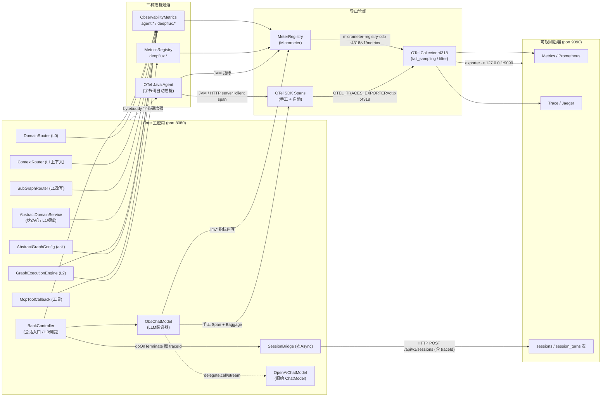
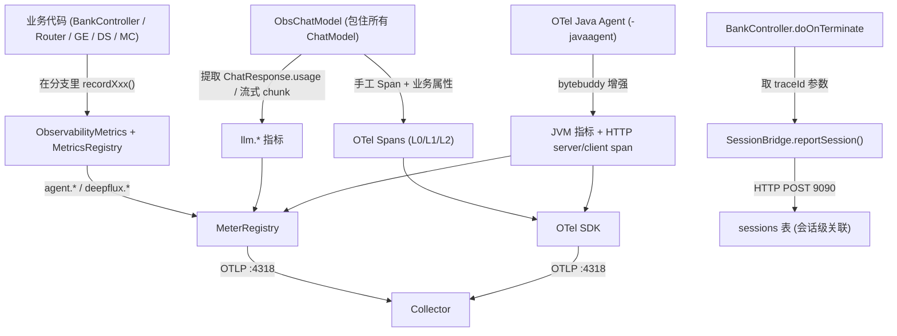

# 三种插桩 + SessionBridge 数据流向图

> 配套分析见 `instrumentation-analysis.md`。本文用 Mermaid 画出信号从各业务类产生、经不同插桩通道、最终汇入可观测后端的完整路径。

## 一、总体数据流向（Mermaid Flow）

## 二、三类信号对比（一句话流向）

## 三、关键差异速查

| 维度 | OTel Java Agent | ObsChatModel | ObservabilityMetrics | SessionBridge |
|------|----------------|--------------|----------------------|---------------|
| 类型 | 自动字节码插桩 | 装饰器(半自动) | 手动埋点门面 | 数据桥(非插桩) |
| 触发方式 | 类加载期织入 | 包住 ChatModel 调用 | 业务分支主动 record | chat 结束 @Async POST |
| 捕获内容 | JVM / HTTP / 线程池 | `llm.*` + 业务 Span | `agent.*` / `deepflux.*` | 会话快照(含 traceId) |
| 是否写 MeterRegistry | JVM 指标→是 | 是(直写) | 是 | 否 |
| 是否建 Span | 是(自动) | 是(手工) | 否 | 否 |
| 传播 trace context | 是(自动) | 是(Baggage) | 否 | 否(仅携带 traceId 字段) |
| 业务语义 | 无 | LLM 层 | 领域层 | 会话层 |
| 能否替代其他 | 拿不到业务语义 | 拿不到路由/状态机 | 手写成本高、易踩线程坑 | 不产指标/span |

## 四、一句话总结

> 一次请求里：**自动 agent** 兜 JVM/HTTP 基础设施信号，**ObsChatModel** 在 LLM 调用处抽出 `llm.*` 指标并打上业务属性的 Span，**ObservabilityMetrics** 在路由/状态机/子图/工具分支里补 `agent.*/deepflux.*` 业务指标，三者都经 OTLP 汇到 Collector；而 **SessionBridge** 走另一条 HTTP 把"会话快照+traceId"送后端，让前端能把一条会话和它的 trace/指标串起来看。
