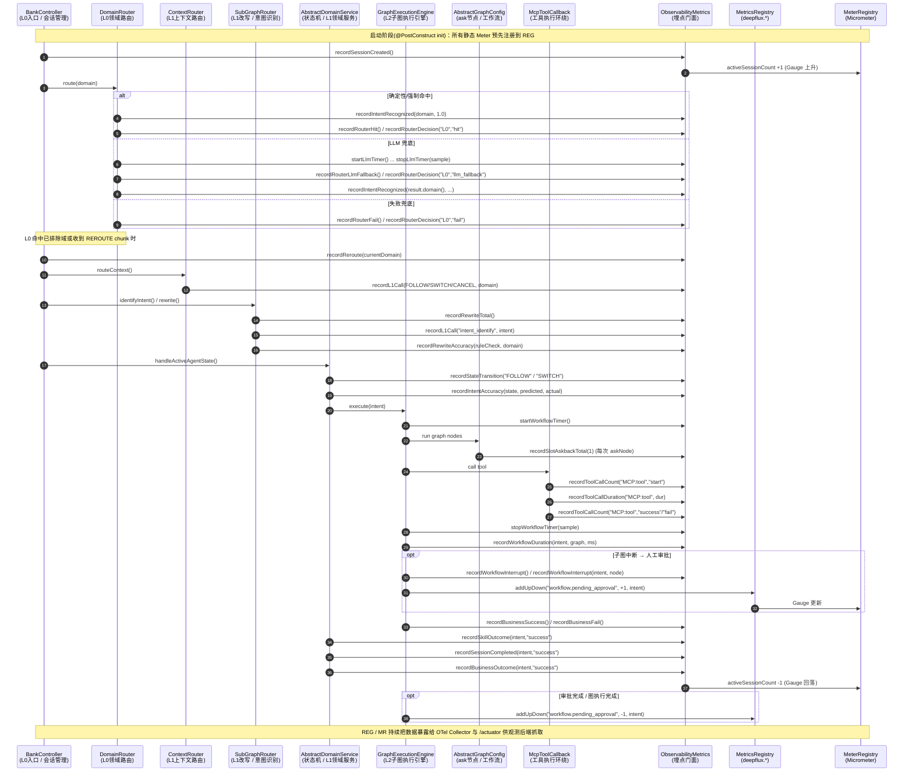
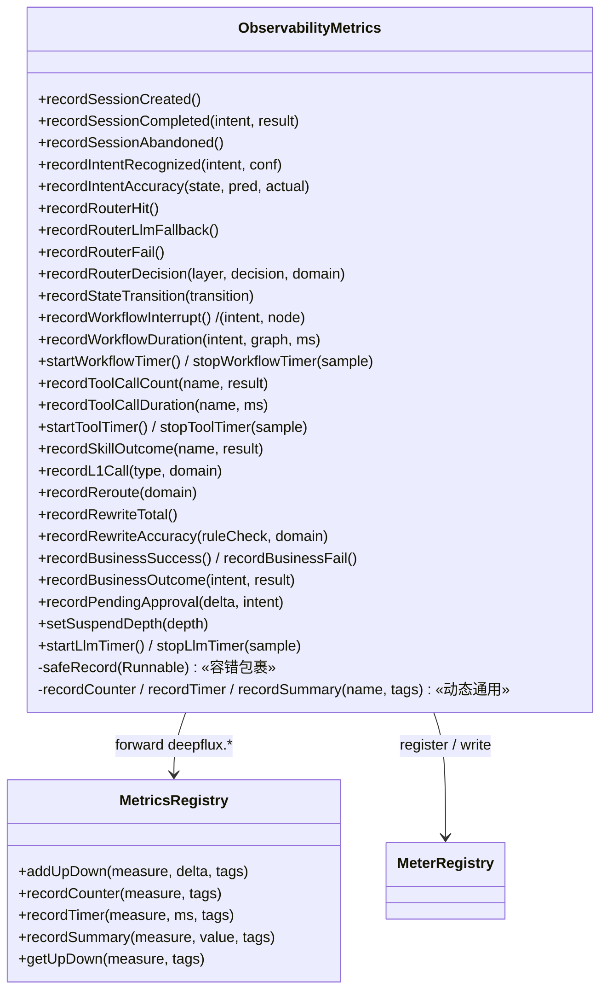

# ObservabilityMetrics 解读与调用关系分析

> 配套源码：
> - `src/main/java/com/mobileagent/app/observability/ObservabilityMetrics.java`（埋点门面）
> - `src/main/java/com/mobileagent/app/observability/MetricsRegistry.java`（集中式 `deepflux.*` 注册表）
>
> 本文在「文件解读」基础上，补充了**跨文件调用时序图**与**主方法/调用关系图**，并汇总了所有调用方。

---

## 一、这个文件是什么

它是项目里 **AI 可观测性指标（Metrics）的"埋点门面（Facade）"**，基于 Micrometer 的 `MeterRegistry` 实现。Spring 把它声明为 `@Component`（单例 Bean），业务代码（路由、状态机、子图、工具调用等）通过它把运行数据以 **Counter / Timer / DistributionSummary / Gauge / UpDownCounter** 几种 Meter 形式暴露出去，最终由 OTel Collector / `/actuator/prometheus` 抓取。

指标分两族（文件头注释 18–46 行）：
- `llm.*`：5 项，由 `ObsChatModel` 自动采集（token、首 token 延迟、耗时、错误）。
- `agent.*`：10 项，由业务代码手动埋点（路由决策、意图准确率、子图耗时、工具调用、技能结果、会话生命周期等）。

关键约束（44–46 行）：**禁止 `user.id / session.id / trace.id / 原始 prompt / 原始金额` 进入 Tag**，以控制 Tag 基数。

---

## 二、类内部结构

```java
@Slf4j
@Component
public class ObservabilityMetrics {
    private final MeterRegistry meterRegistry;          // Micrometer 注册中心
    private final MetricsRegistry metricsRegistry;       // 集中式 deepflux.* 注册表
    // Atomic 状态（供 Gauge 使用）
    private final AtomicLong suspendDepth = new AtomicLong(0);
    private final AtomicLong activeSessionCount = new AtomicLong(0);
    // 动态 Counter/Timer/Summary 缓存（支持任意 tag 组合）
    private final Map<String, Counter> counterCache = new ConcurrentHashMap<>();
    private final Map<String, Timer> timerCache = new ConcurrentHashMap<>();
    private final Map<String, DistributionSummary> summaryCache = new ConcurrentHashMap<>();
    // ... 一堆预先声明的 Meter 字段（intentRecognized、routerDecisionHit...）
}
```

构造器通过 Spring 依赖注入拿到两个注册表：

```java
public ObservabilityMetrics(MeterRegistry meterRegistry, MetricsRegistry metricsRegistry) {
    this.meterRegistry = meterRegistry;
    this.metricsRegistry = metricsRegistry;
}
```

---

## 三、运行过程（生命周期 / 启动顺序）

### 1. 启动时：构造 + 注册（一次性）

由于是 `@Component`，Spring 在容器启动时：
1. 执行构造器注入 `MeterRegistry` 和 `MetricsRegistry`；
2. 调用 `@PostConstruct init()`（93–215 行），**把所有静态、带固定 tag 的 Meter 预先 register 到 `meterRegistry`**。

`init()` 内部按"批次"注册（注释里叫 Batch 1~4）：
- L0 意图识别：`agent.intent.recognized`(Counter) + `agent.intent.confidence`(Summary, 带分位)
- 路由决策三态：`agent.router.decision.outcome` 分别带 `outcome=hit / llm_fallback / fail`
- 状态机转换：`agent.state.transition` 带 `transition=FOLLOW/SWITCH/RESUME`
- 追问槽位、子图耗时（Timer+分位）、子图中断
- **两个 Gauge**：`agent.state.suspend.depth`、`agent.session.active`（Gauge 不调 increment，而是绑定 `AtomicLong::get` 实时读）
- Session 生命周期、业务结果两态、参数提取完整率、改写准确率、LLM 调用计时（名为 `gen_ai.client.operation.duration`）、工具调用耗时

```java
Gauge.builder("agent.state.suspend.depth", suspendDepth, AtomicLong::get)
        .description("Current suspended agent queue depth")
        .register(meterRegistry);
```

> 注意：`MetricsRegistry` 自己也有一个 `@PostConstruct init()`，会在启动时就注册 `deepflux.workflow.pending_approval` 这个 Gauge，避免空闲期观测不到 P7 指标。

### 2. 运行时：业务埋点（高频、分散调用）

启动完成后，业务代码在各自执行路径里调用 `recordXxx(...)` 方法。所有写入都被 `safeRecord(...)` 包裹（636–643 行），**任何异常只 warn 不影响主业务流程**——这是埋点门面最重要的健壮性设计。

### 两种调用风格（设计要点）

1. **固定的便捷方法**（如 `recordRouterHit()`）：Meter 已在 `init()` 里建好，直接 `increment()`，零查找开销。
2. **动态 tag 通用方法**（`recordCounter / recordTimer / recordSummary`，226–273 行）：通过 `buildCacheKey(name, tags)` 生成 key，用 `ConcurrentHashMap.computeIfAbsent` 懒注册并缓存，支持任意 tag 组合而**不会重复创建同名 Meter**。

```java
public void recordCounter(String name, String... tags) {
    safeRecord(() -> {
        String cacheKey = buildCacheKey(name, tags);
        Counter counter = counterCache.computeIfAbsent(cacheKey, k ->
                Counter.builder(name)
                        .tags(tags)
                        .register(meterRegistry));
        counter.increment();
    });
}
```

### 与 MetricsRegistry 的分工

- `agent.* / llm.* / gen_ai.*`：保留在 `ObservabilityMetrics`（向后兼容，存量 22 处调用不动）。
- `deepflux.*`（新增指标，如 `recordPendingApproval`）：**转发给 `MetricsRegistry`**（`MetricsRegistry.java` 里的 UpDownCounter 用 `AtomicLong + Gauge` 模拟，因为 Micrometer 无原生 UpDownCounter，且 Timer 强制 `publishPercentileHistogram(true)` 适配 OTLP 后端）。

```java
public void recordPendingApproval(long delta, String intent) {
    metricsRegistry.addUpDown("workflow.pending_approval", delta,
            "intent", (intent != null && !intent.isBlank()) ? intent : "UNKNOWN");
}
```

---

## 四、跨文件调用时序图（Mermaid Sequence）

下图按**一次用户请求在 Agent 中的完整生命周期**，展示各业务类如何跨文件调用 `ObservabilityMetrics` / `MetricsRegistry`。



---

## 五、主要方法与调用关系图（Mermaid Class / Flow）

### 5.1 调用关系（谁调用了什么）

```mermaid
flowchart TD
    subgraph L0["L0 层"]
        BC["BankController<br/>(会话入口 / L0调度)"]
        DR["DomainRouter<br/>(领域路由)"]
    end
    subgraph L1["L1 层"]
        CR["ContextRouter<br/>(上下文路由)"]
        SR["SubGraphRouter<br/>(改写 / 意图识别)"]
        DS["AbstractDomainService<br/>(状态机/领域服务)"]
        MDS["Multi/SingleSubAgentDomainService"]
    end
    subgraph L2["L2 层"]
        GE["GraphExecutionEngine<br/>(子图执行)"]
        AG["AbstractGraphConfig + 5×GraphConfig<br/>(ask节点)"]
        MC["McpToolCallback<br/>(工具环绕)"]
    end
    subgraph FACADE["埋点门面"]
        OM["ObservabilityMetrics"]
        MR["MetricsRegistry<br/>(deepflux.*)"]
    end

    BC -->|recordSessionCreated / recordReroute| OM
    DR -->|recordIntentRecognized / recordRouterHit / recordRouterLlmFallback / recordRouterFail / recordRouterDecision / start-stopLlmTimer| OM
    CR -->|recordL1Call| OM
    SR -->|recordRewriteTotal / recordL1Call / recordRewriteAccuracy| OM
    DS -->|recordStateTransition / recordIntentAccuracy / recordSkillOutcome / recordSessionCompleted / recordBusinessOutcome / incrementAskbackSlot| OM
    MDS -->|recordIntentAccuracy| OM
    GE -->|start-stopWorkflowTimer / recordWorkflowDuration / recordWorkflowInterrupt / recordBusinessSuccess-Fail| OM
    GE -->|addUpDown workflow.pending_approval| MR
    AG -->|recordSlotAskbackTotal (askNode)| OM
    MC -->|recordToolCallCount / recordToolCallDuration| OM
    OM -->|forward deepflux.*| MR
    OM --> REG["MeterRegistry (Micrometer)"]
    MR --> REG
```

### 5.2 关键方法归类（门面对外 API）



---

## 六、调用方角色归类表

| 角色 | 类（相对路径） | 主要埋点方法 |
|------|----|---------|
| **Chat Model（LLM 指标采集）** | `observability/ObsChatModel.java` | 不经过 `ObservabilityMetrics`，直接写 `llm.*` |
| **L0 路由器** | `router/domain/DomainRouter.java` | `recordIntentRecognized` / `recordRouterHit` / `recordRouterLlmFallback` / `recordRouterFail` / `recordRouterDecision` / `startLlmTimer+stopLlmTimer` |
| **L1 上下文路由器（Phase1）** | `router/subgraph/ContextRouter.java` | `recordL1Call`（FOLLOW/SWITCH/CANCEL） |
| **L1 改写 / 意图识别（Phase2）** | `router/subgraph/SubGraphRouter.java` | `recordRewriteTotal` / `recordL1Call("intent_identify")` / `recordRewriteAccuracy` |
| **状态机 / L1 领域服务** | `domain/AbstractDomainService.java` + `MultiSubAgentDomainService.java` + `SingleSubAgentDomainService.java` | `recordStateTransition(FOLLOW/SWITCH)` / `recordIntentAccuracy` / `recordSkillOutcome` / `recordSessionCompleted` / `recordBusinessOutcome` / `incrementAskbackSlot` |
| **子图/工作流执行器（L2 引擎）** | `execution/GraphExecutionEngine.java` | `startWorkflowTimer/stopWorkflowTimer` / `recordWorkflowDuration` / `recordWorkflowInterrupt` / `recordBusinessSuccess/Fail`；并经 `MetricsRegistry.addUpDown` 维护 `deepflux.workflow.pending_approval` |
| **L2 子图配置（ask 节点）** | `workflow/AbstractGraphConfig.java` + 5×`*GraphConfig.java` | `recordSlotAskbackTotal`（经 `askNode` 间接） |
| **工具执行器（MCP）** | `observability/McpToolCallback.java` | `recordToolCallCount` / `recordToolCallDuration`（带 `category=mcp`） |
| **会话管理器（L0 调度入口）** | `controller/BankController.java` | `recordSessionCreated` / `recordReroute` |
| **集中式指标注册表（deepflux.*）** | `observability/MetricsRegistry.java` | `addUpDown` / `recordCounter` / `recordTimer` / `recordSummary`；被 `GraphExecutionEngine`（待审批）、`rag/RagMetrics.java`（间接由 `ObsDocumentRetriever` / `ObsReRanker` 使用）调用 |

> 注：`OrchestrationAgent` / `L2GraphTool` / `StepPreparator` / `ChatService` / `SubGraphResolver` / `SessionBridge` 等均**不直接**调用 `ObservabilityMetrics`，其 L2 子图执行经由 `GraphExecutionEngine` 间接产生工作流指标。

---

## 七、一句话总结运行过程与调用顺序

> **Spring 启动** → 构造器注入两个 Registry → `@PostConstruct init()` 一次性注册所有静态 Meter（含 Gauge 绑定 AtomicLong）→ 运行期由各业务模块（L0 路由 / L1 路由改写 / 状态机 / L2 子图 / 工具 / 技能 / Session）在对应执行节点调用 `recordXxx()` 方法 → 全部经 `safeRecord` 容错写入 → `MeterRegistry` / `MetricsRegistry` 把数据暴露给 OTel Collector 与 `/actuator` 供观测后端抓取。
