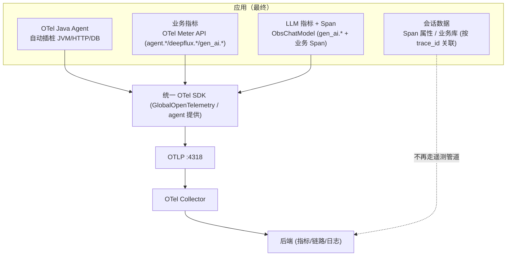

# 从 4 种插桩收敛到统一 OTel 的改造步骤

> 配套：`instrumentation-analysis.md`、`instrumentation-dataflow.md`、`otel-unified-observability.md`
>
> **前置结论（先读）**：经核对 `pom.xml` 与接线，本项目的**传输层已经统一到 OTLP**：
> - `ObsChatModel` 把 `llm.*` 写进 Micrometer `MeterRegistry`，而 `micrometer-registry-otlp`（pom 100–103 行）已把这些指标导出到 OTLP `:4318`；
> - OTel Java Agent（pom 133 行 `-javaagent`）→ OTLP；`ObsChatModel` 的 Span 用 `GlobalOpenTelemetry`（agent 安装的 SDK）→ OTLP；日志经 `opentelemetry-logback-appender` → OTLP。
> - **唯一真正脱离 OTLP 的管道是 `SessionBridge`**（直连后端 9090 的 HTTP）。
>
> 因此改造目标不是"推翻重来"，而是：**① 语义/命名对齐 OTel 约定；② 收敛源码 API 风格（可选）；③ 把 SessionBridge 从遥测管道剥离。** 风险可控，分阶段进行。

---

## 阶段 0：现状盘点与基线确认

| 信号来源 | 当前出口 | 是否已在 OTLP |
|---------|---------|--------------|
| OTel Java Agent（JVM/HTTP/DB） | OTLP `:4318` | ✅ |
| `ObservabilityMetrics`（`agent.*`） | Micrometer → `micrometer-registry-otlp` → OTLP | ✅ |
| `MetricsRegistry`（`deepflux.*`） | Micrometer → OTLP | ✅ |
| `ObsChatModel`（`llm.*` 指标） | Micrometer `MeterRegistry` → OTLP | ✅ |
| `ObsChatModel`（业务 Span） | `GlobalOpenTelemetry`(agent SDK) → OTLP | ✅ |
| Spring AI 内置 custom 指标 | Micrometer → OTLP | ✅ |
| **`SessionBridge`（会话快照）** | **直连后端 9090 HTTP** | ❌ 独立管道 |

**结论**：只需处理 SessionBridge 这一条独立管道 + 命名/API 风格收敛。

---

## 阶段 1（必做，低风险）：剥离 SessionBridge，退出遥测管道

`SessionBridge` 是业务/域数据，不是遥测。两种落地方式，二选一：

**方案 A（推荐，改动最小）：会话数据挂到当前 trace 上**
1. `BankController.doOnTerminate` 处已能拿到 `traceId`（现有 `getCurrentTraceId()`）。把原 `sessionBridge.reportSession(...)` 改为：取当前 span（`GlobalOpenTelemetry.getTracer(...).spanBuilder` 或 `Span.current()`），用 `setAttribute` 写入 `session.user_input` / `session.ai_response` / `session.intent` / `session.agent_path` / `session.duration_ms` / `session.re_routed` 等属性；若内容大，写成 **Span Event** 或一条结构化 **Log**（经现有 logback appender → OTLP）。
2. 删除 `SessionBridge.reportSession` 的 HTTP POST；后端 `sessions` 表查询改为按 `trace_id` 关联 trace/span 展示。
3. 删除/停用 `SessionBridge` `@Service` 与 `observability.backend.url` 配置。

**方案 B（若需独立会话库）：存业务库**
- 会话快照直接写业务库（Redis / H2），查询时按 `trace_id` JOIN。同样删除独立 HTTP 桥。

**验证**：去掉 `SessionBridge` 后，`start-all.ps1` 启动，确认后端不再收到 `/api/v1/sessions` 请求，会话信息可在 trace 详情页看到。

---

## 阶段 2（推荐，中风险）：LLM 指标对齐 OTel GenAI 语义

现状 `ObsChatModel` 直写 Micrometer `llm.*`。它**已用 OTel SDK 建 Span（达标）**，只需把指标命名迁到标准 `gen_ai.*` 语义（也可保留 `llm.*` 作为自定义命名空间，但建议对齐）：

1. 在 `ObsChatModel` 中，把 `MeterRegistry`（`micrometer`）依赖换成 OTel `Meter`：
   ```java
   private final Meter meter = GlobalOpenTelemetry.getMeter("obs-chat-model");
   // 原: Counter.builder("llm.token.input").tag(...).register(meterRegistry).increment(n);
   // 新:
   LongCounter inTok = meter.counterBuilder("gen_ai.usage.input_tokens")
       .setUnit("token").build();
   inTok.add(n, Attributes.of(stringKey("gen_ai.request.model"), modelName,
                              stringKey("agent.level"), agentLevel, ...));
   ```
2. 命名映射：
   - `llm.token.input` → `gen_ai.usage.input_tokens`（attr `gen_ai.token.type=input`）
   - `llm.token.output` → `gen_ai.usage.output_tokens`（`gen_ai.token.type=output`）
   - `llm.first_token.latency` → `gen_ai.time_to_first_token`（Histogram，单位 ms）
   - `llm.operation.duration` → `gen_ai.operation.duration`
   - `llm.error.count` → 用 Span `status=ERROR` + `events` 表达，或保留 Counter `gen_ai.client.operation.errors`
3. **保留** `ObsChatModel` 现有的 Reactor 跨线程/traceId 泄漏处理（192–197、485–515 行）与 `safeRecord` 容错——这些是正确且必要的，不要动。
4. 流式 `doOnNext/doOnComplete/doOnError/doOnCancel` 的指标记录同样迁到 OTel Meter。

**长线（可选）**：评估用现成 GenAI instrumentation（OpenLLMetry / Spring AI 自带 OTel 信号）替换手写装饰器，进一步降低自维护成本。

---

## 阶段 3（可选，依团队偏好）：业务指标源码层收敛到 OTel Metrics API

如果希望只保留 **一套 API 风格（OTel）**，把 `ObservabilityMetrics` / `MetricsRegistry` 从 Micrometer 迁到 OTel Meter。若接受"保留 Micrometer + micrometer-registry-otlp 桥"的折中，则**阶段 3 可跳过**（传输已统一，仅代码风格不同）。

**若执行：**
1. `ObservabilityMetrics` 构造函数去掉 `MeterRegistry`，改为注入/获取 `OpenTelemetry`（生产由 agent 的 `GlobalOpenTelemetry` 提供，无需新增 SDK 依赖）。
2. 类型映射：
   - `Counter` → `meter.counterBuilder(...).build()` + `add(1, attributes)`
   - `Timer`(耗时分布) → `meter.histogramBuilder(...).ofUnit(Unit.MILLISECONDS).build()` + `record(ms, attrs)`
   - `DistributionSummary`(置信度/改写率) → `Histogram`
   - `Gauge`+`AtomicLong`(suspendDepth/activeSession) → `meter.gaugeBuilder(...).ofLongs().build()` 或 `UpDownCounter`
   - `UpDownCounter`(pending_approval) → 原生 `meter.upDownCounterBuilder(...).build()`（**不再需要用 `AtomicLong+Gauge` 模拟**）
3. 保留 `ConcurrentHashMap` 缓存 Instrument 对象（OTel Instrument 也应复用，不要每次 `build()`），保留 `safeRecord` 容错。
4. `MetricsRegistry` 的 `deepflux.*` 同样迁移；其 `@PostConstruct init()` 预注册 Gauge 改为 OTel `ObservableLongGauge` 或删除（OTel 无需预注册）。
5. 调用方（`BankController`/`GraphExecutionEngine`/`AbstractDomainService`/`McpToolCallback`/`RagMetrics`）的方法签名不变，仅底层实现切换，业务代码零改动。

**折中方案（最低风险，推荐先做）**：不动业务代码，仅确认 `application.yml` 中 `management.otlp.metrics.export.url` 指向 Collector `:4318`，且所有 Micrometer 指标都经 `micrometer-registry-otlp` 导出（已满足）。此时架构上已是"OTel agent 自动 + Micrometer 经 OTLP + 手工 OTel Span/Metrics"三者汇到同一 Collector——概念上已是统一管线，只是源码有两套 API 风格。

---

## 阶段 4：统一语义约定与命名空间治理

1. 自定义命名空间治理：`agent.*`（路由/意图/子图/工具/会话）保留为自定义业务命名空间；`deepflux.*` 保留（或统一为 `agent.*` 前缀，减少命名空间数量）；`llm.*` → `gen_ai.*`（阶段 2）。
2. 所有 attr 用 OTel 标准键名（如 `gen_ai.request.model`、`error.type`、`session.id` 等），避免自建键名导致后端无法解析。
3. 沿用现有约束（禁止 `user.id/session.id/trace.id/原始 prompt/原始金额` 进高基数 Tag），在 OTel attribute 上同样遵守（注意：`ObsChatModel` 已把 `session_id/user_id` 写入 Span attribute，需确认后端对这些属性做脱敏/低基数处理）。

---

## 阶段 5：验证

1. 启动：`scripts/start-all.ps1`（或 `verify-E2E.sh`），确认 Collector `:4318` 同时收到 metrics/traces/logs。
2. 后端同屏验证：`gen_ai.*` / `agent.*` / `deepflux.*` 与 JVM/HTTP 信号可关联展示。
3. 跑 `qa-smoke.mjs` / `verify-E2E.sh` 回归；复用 `ObsChatModel` 已有的 traceId 泄漏回归测试，确认多请求下 traceId 不串、intent 不标错。
4. 确认 SessionBridge 改造后：后端不再收到 `/api/v1/sessions` 独立请求，会话信息改由 trace 关联或业务库提供。

---

## 改造后目标架构（收敛结果）



**复杂度对比**：
- 改造前：OTel agent + Micrometer facade + ObsChatModel(Micrometer) + SessionBridge(独立HTTP) = 4 套概念。
- 改造后：1 个 OTel 框架（SDK）+ 2 个数据入口（agent 自动 shim / 业务代码手动 API）；会话数据归位业务层。概念上即"一套框架、两种用法（auto/manual）"。

---

## FAQ：Agent 和 SDK 不是"两个实现"吗？

**不是。Agent 里就包含着 SDK，"1 SDK + 1 agent"是重复计数。**

### 正确的分层关系

```
┌─ OTel Java Agent (一个 jar) ───────────────┐
│  • 内嵌一个 OpenTelemetrySdk 实例            │
│  • 自动配置 OTLP 导出（读 OTEL_* 环境变量）  │
│  • 加载一批自动插桩 shims（JDBC/HTTP/JVM…）  │
│        ↓ 这些 shim 内部也是调用 SDK API      │
└─────────────────────────────────────────────┘
        ↑ 你的手动代码 GlobalOpenTelemetry.getMeter()
          拿到的就是 agent 装好的【同一个 SDK 实例】
```

- 自动插桩的 shims 和手动 `getMeter()` / `getTracer()` **共用同一个 SDK、同一个 MeterProvider、同一个 OTLP exporter、同一条管道**。
- "自动"和"手动"是**同一个 SDK 的两个数据入口**，不是两个系统。
- 类比 logging 框架：`log.info()` 是你手动调，框架自带的 appender 是"自动"，但都走同一个 logback，不是两个日志系统。

### 什么情况下才会真变成"两个"？

只有一种**错误配置**：在业务代码里又自己 `OpenTelemetrySdk.builder()...` 建了一个 SDK，同时跑着 agent → 两个 SDK、两路导出、配置打架。

因此本方案（阶段 3 第 1 条）特意要求：**生产靠 agent 的 `GlobalOpenTelemetry`，不要再引 `opentelemetry-sdk` 主依赖**——确保全应用只有 agent 提供的那一个 SDK。

### 回到"能否只用 1 种"的最终答案

- **框架/SDK/协议/后端**：改造后只有 **1 套**（OpenTelemetry + OTLP + Collector），这是真正的简化。
- **数据入口**：任何系统都必然 ≥2 类——基础设施必须**自动**（不可能手写 JVM GC 监控），业务语义必须**手动**（没有任何工具懂路由/意图/子图）。这是"数据源"的二分，不是"系统"的冗余，OTel 标准架构下也如此。

> 准确表述：**1 个 OTel 框架（SDK）+ 2 个数据入口（agent 自动 shim / 业务代码手动 API）**，而非"SDK 和 Agent 两套实现"。从原来的 4 套并行系统收敛到"1 个框架、2 个入口"，已是业界标准的终点——不可能再压成字面"1 种"，因为自动+手动的数据源二分是观测的本质需求。
