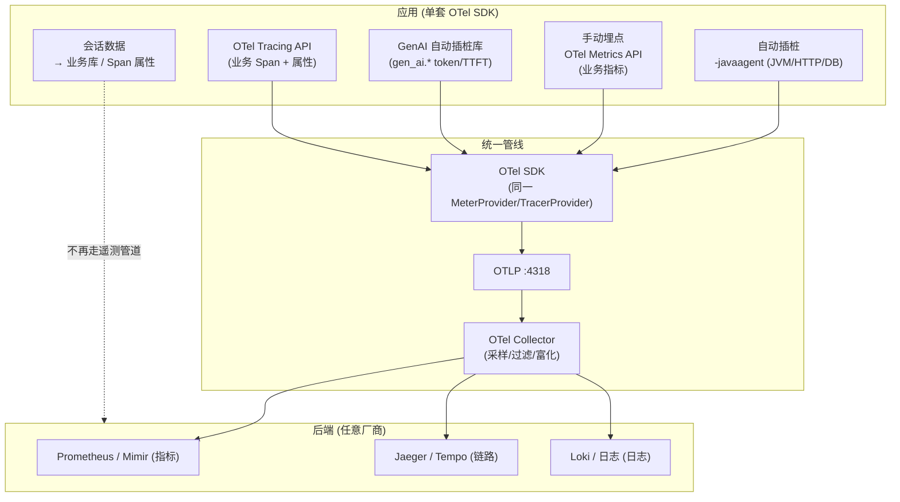

# 业界可观测性统一方案调研总结

> 跳出本项目代码，从行业视角回答一个问题：**标准指标 + 业务自定义指标的埋点/采集/处理，是否有统一方案？是否还需要像本项目这样分 4 种方式？**
>
> 结论先行：**业界有统一标准——OpenTelemetry（OTel）。** 标准指标与自定义业务指标完全可以用**同一套 API/SDK + 同一协议（OTLP）+ 同一个 Collector** 搞定，物理上不需要 4 套并行系统。本项目"4 种"是历史叠加产物，不是标准推荐架构。

---

## 一、行业统一标准：OpenTelemetry

OpenTelemetry 是 **CNCF 毕业级（2024）** 的厂商中立开源可观测框架，已成为事实上行业标准，Datadog / Grafana / Honeycomb / New Relic / 阿里云 ARMS 等全部支持其协议。

它的统一模型：

- **统一 API/SDK**：一套代码同时产出 Metrics、Traces、Logs 三大信号（"三支柱"），共享 Context 传播。
- **统一语义约定（Semantic Conventions）**：指标名、属性（attribute）跨语言跨厂商一致，例如 `http.request.method`、`gen_ai.usage.input_tokens`。
- **统一传输协议 OTLP**：所有信号走同一个 `:4318`（HTTP）/ `:4317`（gRPC）端点。
- **统一 Collector**：做采集、采样（tail_sampling）、过滤、富化、路由到任意后端（Prometheus / Jaeger / Tempo / Mimir / 自建…）。

> 关键点：**自动插桩（auto-instrumentation）和手动埋点（manual instrumentation）是同一个 OTel SDK 的两种用法**，共用同一个 `MeterProvider` / `TracerProvider` / OTLP 导出器，最终汇到同一个 Collector。它们不是"两套系统"，而是"一套系统两种接入方式"。

---

## 二、标准指标（基础设施/框架层）：自动插桩就够了

业界对 JVM / HTTP / DB / 消息队列 / 线程池等通用信号，标准做法是 **zero-code 自动插桩**——Java 用 `-javaagent:opentelemetry-javaagent.jar` 在类加载期字节码增强，零业务代码。

- 覆盖：JVM 指标、Servlet/WebFlux server span、HttpClient/WebClient client span、JDBC、Kafka 等。
- 这正是本项目 `OTel Java Agent` 那一类 —— **它是对的做法，应保留**。

---

## 三、自定义业务指标：用同一套 OTel Metrics API 手动埋点

业务语义（路由命中、意图准确率、子图中断、工具调用、会话生命周期…）任何自动工具都不可能理解，必须由业务代码在分支里主动埋——**这一点无法"全自动"，必须手写**。但手写也应该走 OTel，而不是另起一套 Micrometer facade。

OTel Metrics 提供的原子类型与本项目手埋的指标一一对应：

| 业务需求 | OTel Metrics 原子类型 | 本项目对应 |
|---------|----------------------|-----------|
| 计数（路由命中/工具次数） | `Counter` | `Counter` |
| 耗时/延迟分布（TTFT/子图耗时） | `Histogram` | `Timer`+`publishPercentileHistogram` |
| 分布（置信度/改写准确率） | `Histogram` | `DistributionSummary` |
| 瞬时值（挂起深度/活跃会话数） | `ObservableGauge` / `Gauge` | `Gauge`+`AtomicLong` |
| 可增减（待审批队列） | `UpDownCounter` | `AtomicLong`+`Gauge` 模拟 |

手动埋点示例（Java）：
```java
Meter meter = GlobalOpenTelemetry.getMeter("my-app");
LongCounter routerHit = meter.counterBuilder("agent.router.hit").build();
routerHit.add(1, Attributes.of(stringKey("outcome"), "hit"));
```

**Spring Boot 现有 Micrometer 指标如何统一**：Spring Boot 默认用 Micrometer（Actuator/Prometheus）。统一到 OTel 有两条现成路径：
1. 业务代码直接改用 **OTel Metrics API**（最彻底）；
2. 保留 Micrometer，用官方桥 `opentelemetry-micrometer1-bridge` 或 `micrometer-registry-otlp` 把 Micrometer 指标**也汇入 OTLP**——本项目 `pom.xml` 已引入 `micrometer-registry-otlp`，本就可统一导出，无需第二套管线。

> 所以本项目的 `ObservabilityMetrics`（Micrometer）可整体收敛到 OTel 体系，不必作为一个独立"插桩方式"存在。

---

## 四、LLM / GenAI 指标（ObsChatModel 这类）：已有标准语义与自动插桩

`ObsChatModel` 解决的问题（token 数、TTFT、TPOT、耗时）业界已标准化：

- **OTel GenAI Semantic Conventions**（规范库 `semantic-conventions-genai`，持续演进）定义了 `gen_ai.*` 语义：`gen_ai.usage.input_tokens` / `output_tokens`、`gen_ai.time_to_first_token`、`gen_ai.operation.duration`、`gen_ai.token.type` 等，覆盖 LLM / Agent / MCP / 内容质量评估。
- **自动插桩库正在成熟**：OpenLLMetry（Traceloop）、LangChain4j OTel 集成、Spring AI 也在逐步暴露 OTel 信号。理想情况下 LLM 的 token/TTFT 由 instrumentation 库自动采集，**业务方不必手写装饰器**。
- 现实：因底层 SDK（Spring AI OpenAI）未原生暴露，许多团队仍自写。但**方向是用 GenAI 语义约定 + 现成 instrumentation，而不是自己造一套 `llm.*` 命名**。即便自写，也应走 OTel Metrics API 并命名遵循 `gen_ai.*`，而非自建命名空间。

---

## 五、SessionBridge：它根本不是"第 4 种插桩"

SessionBridge（Core→Backend 的会话快照 HTTP 桥）**不属于可观测三支柱**，它是**业务/域数据同步**（session record），不是指标、不是链路、不是日志。

业界标准做法：**不该单独搞一条遥测管道**。
- 方案 A：把会话级信息作为 **Span 的 attribute / Event / Log** 落到同一条 trace 上，前端按 `trace_id` 天然关联，无需独立 HTTP 桥。
- 方案 B：会话本就是业务数据，直接存自己业务库（session 表），需要时按 `trace_id` 关联查询。

把会话数据塞进遥测管道，是架构耦合的产物——这正是"4 种"里最该剥离的那一个。

---

## 六、为什么本项目会有 4 种（非标准，是路径依赖）

| 成因 | 说明 |
|------|------|
| Micrometer 是 Spring Boot 传统默认 | 业务指标先用 Micrometer 写了 `ObservabilityMetrics` |
| LLM 特殊性 | 底层 SDK 未暴露 token/usage，另写 `ObsChatModel` 直写 `MeterRegistry` |
| OTel agent 后加 | 为补基础设施，引入 javaagent，与本就是两套管线并存 |
| 会话数据误当遥测 | `SessionBridge` 把业务数据当信号传，混入遥测 |

这是典型的"各自按需叠加"，不是标准推荐架构。

---

## 七、推荐的业界标准统一架构（收敛路径）



**收敛原则**：
1. 所有信号（metrics/traces/logs）经 **OTel SDK → OTLP → Collector → 后端**，一套到底。
2. 标准指标：保留 **javaagent 自动插桩**。
3. 业务指标：改用 **OTel Metrics API** 手动埋点（或至少用 micrometer-otlp 桥把 Micrometer 指标并入 OTLP）。
4. LLM 指标：优先用 **GenAI instrumentation 库 + `gen_ai.*` 语义**；若自写也走 OTel API、命名遵循规范。
5. 会话数据：从遥测管道**剥离**，存业务库或作为 trace 的 span 属性，用 `trace_id` 关联。

---

## 八、直接回答"能不能用一种插桩方法搞定"

- **字面意义的"一种"不可能**：业务语义（路由/意图/子图/工具）本质必须手写代码，没有任何自动工具能理解你的领域——所以"auto + manual"必然共存。
- **架构层面的"一种"完全可行且是业界标准**：在 **OpenTelemetry 这一套统一框架**内完成全部信号（自动插桩 + 手动埋点 + GenAI 语义 + trace 关联），共用一个 SDK、一个协议、一个 Collector。
- 本项目"4 种"应收敛为：**1 个 OTel SDK + 1 个 javaagent（自动）+ 1 类手动埋点（业务指标）**，SessionBridge 退出遥测管道。复杂度从"4 套并行系统"降为"1 套框架两种用法"。
