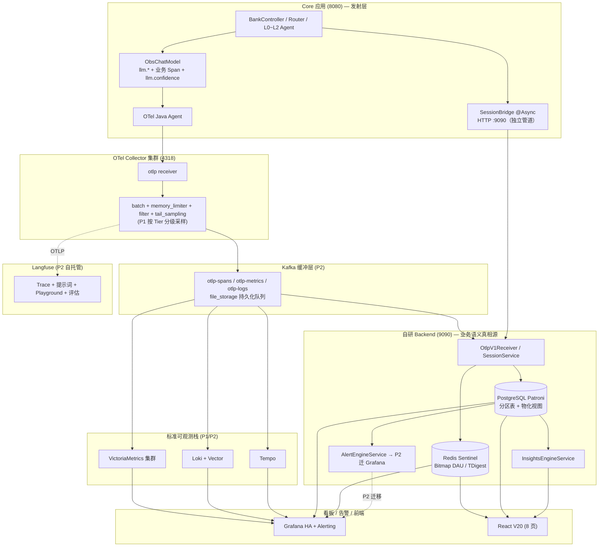

# 遥测架构最终方案（V6 整合版）

> 本文整合三份先行文档，给出**生产上线**的端到端方案：
> - **甲**：`otel-unified-observability.md` + `otel-migration-steps.md`（OTel 框架统一、Agent 即 SDK 的概念澄清）
> - **乙**：`telemetry-architecture-analysis.md`（分层合理、SessionBridge 保留、命名对标 `gen_ai.client.*`）
> - **丙**：`可观测优化总结-WorkBuddy-V6-生产上线版-0718.md`（生产级完整架构：Collector 集群 + Kafka 缓冲 + 标准栈 + Langfuse 叠加 + 合规采样 + 存储分层）
>
> 三方关系：**丙 > 乙 > 甲**——丙是最新生产决策（0718），乙和甲是此前的过程稿，本整合以丙的生产架构为准，并把乙/甲中仍成立的部分纳入。

---

## 0. 速读结论

| 项 | 决策 | 来源 |
|---|---|---|
| 指标命名 | **保留 `llm.*` 为主命名**；未来需要时**追加** `gen_ai.*` 属性（不替换） | 丙 D10 + §16.2 |
| SessionBridge | **保留为独立 Sessions 管道**（不依赖 trace 导出成败） | 丙 §2.3 + 乙 #3 |
| LLM 双重测量 | **保留装饰器内的 `llm.operation.duration`**；删除 DomainRouter 外层 `startLlmTimer/stopLlmTimer` 调用 + ObservabilityMetrics 对应方法（先删调用方再删方法） | 乙 #4 |
| OpenLLMetry | **不引入**（Java/Spring AI 栈无官方探针，自研 ObsChatModel 控制力更强） | 丙 §16.2 |
| Langfuse | **生产 P2 必装**，作为 OTel OTLP **第二消费者**叠加（非替换） | 丙 §16.3 |
| Kafka 缓冲层 | **P2 引入**，位置在 Collector 之后、各存储/Backend/Langfuse 之前 | 丙 §11.3 / §2.1 |
| Collector 持久化队列 | **P2** `batch` processor 改 `file_storage`（防重启丢数据） | 丙 §11.3 |
| 分级采样 | **P1 启用**：Tier1 交易 100% / Tier2 查询 5% / Tier3 问答 1% + 错误/慢/LLM 失败 100% | 丙 §11.2 |
| 命名空间 | `llm.*` / `agent.*` / `deepflux.*` 三套并行保留 | 丙 §5.3 |
| Micrometer 风格 | **不迁 OTel Meter API**（传输已统一 OTLP，迁 API 零收益） | 乙 #5 |
| TDigest 分位 / Bitmap DAU | **P0 生产替换** ZSet / HyperLogLog（精度/性能） | 丙 §8.4 / D9 |
| PG → H2 | **P0 必迁**（银行量级 H2 不可行） | 丙 D1 |

---

## 一、三方分歧的最终裁决

### 1.1 分歧点：指标命名策略

| | 甲 | 乙 | 丙 | 最终裁决 |
|---|---|---|---|---|
| LLM 指标主命名 | `gen_ai.usage.input_tokens` | `gen_ai.client.token.usage` | **`llm.*`** | **丙对** |
| TTFT | `gen_ai.time_to_first_token` | `gen_ai.client.operation.time_to_first_chunk` | 自定义 `llm.first_token.latency` | **丙对** |
| 是否迁移到 OTel 标准 | 主张全迁 | 主张全迁 | 主张**不迁，作为可选属性追加** | **丙对** |

**裁决理由**：
- **甲和乙的事实错误**：`gen_ai.usage.input_tokens` 是 Span 属性名（不是指标名），用错形态；`gen_ai.client.operation.time_to_first_chunk` 不在 OTel 规范中（规范只有 `gen_ai.server.time_to_first_token`，客户端 TTFT 无稳定名）。
- **丙的决策更务实**：评估了 OpenLLMetry 后确认 Java/Spring AI 栈无官方探针，自研 `ObsChatModel` 控制力更强（业务专属属性 `intent.L0/L1/L2`、`routing.mode`、`llm.confidence` 远超通用 `gen_ai.*` 覆盖）。强行对齐 `gen_ai.*` 反而失去领域语义。
- **兼容路径已留**：丙 §16.2 明说"未来若需跨工具标准语义兼容，在现有 span 上**追加** `gen_ai.*` 属性即可，不替换埋点链路"——保留了未来灵活性，零迁移成本。

**与此前我的"最终方案"的勘误**：`telemetry-final-plan.md` P1 主张全面重命名为 `gen_ai.client.*`，**作废**。改采丙的策略——保留 `llm.*`，按需追加 `gen_ai.*`。

### 1.2 分歧点：是否引入 Langfuse

甲乙均未提及；丙明确生产 P2 必装。

**裁决：采纳丙**。Langfuse（MIT 开源、基于 OTel OTLP、消费同一份遥测、无需改业务代码）补齐了自研 Backend 不具备的能力：提示词版本化 / Playground / A-B 测试 / LLM-as-Judge 评估 / Agent graph 可视化。叠加而非替换——**业务真相源仍在 PG**，Langfuse 是消费者之一。

**Collector 配置**（丙 §11.1 已给出）：
```yaml
exporters:
  otlphttp/langfuse: { endpoint: http://langfuse:4318/v1/otlp, compression: gzip }
service:
  pipelines:
    traces: { ..., exporters: [otlphttp/json_backend, kafka, otlphttp/langfuse] }
```

### 1.3 分歧点：采集架构规模

| | 甲 | 乙 | 丙 |
|---|---|---|---|
| Collector | 单点 | 未细化 | **集群（3+Nginx）+ Kafka 缓冲** |
| 存储 | Backend 单体 | 未细化 | PG(Patroni) + Redis(Sentinel) + Tempo + VM(集群) + Loki |
| 告警 | 未涉及 | 未涉及 | P0 自研闭环 → P2 迁 Grafana |
| 合规 | 未涉及 | 未涉及 | P10 PII 三道防线 + RBAC + TLS + 银保监 3 年归档 |

**裁决：采丙**。银行量级（日均 2000-6000 万 Span、6 个月 9-27 亿行 Session）下，甲的"单点 Collector + 直连 Backend"在 P1 即会触达 SPOF 与背压瓶颈，乙未细化此层。丙的架构（Kafka 削峰 + 多消费者 + 信号外溢）是此量级的标准解。

### 1.4 一致点（无须裁决）

| 项 | 甲乙丙共识 |
|---|---|
| SessionBridge 保留 | 三方一致（丙明确为"两条独立管道"） |
| Micrometer 不迁 OTel Meter API | 三方一致（传输已统一） |
| 分层模型：自动 + 装饰器 + 手动业务 + Sessions 独立 | 乙和丙一致，甲最终也收敛到"分层不动" |

---

## 二、最终目标架构（生产 P2 完成态）



**信号/数据流向**（关键路径）：
- **遥测三信号**：Core OTLP → Collector → Kafka → ① Tempo/VM/Loki ② Backend PG ③ Langfuse
- **会话数据**：Core SessionBridge HTTP POST → Backend（**不经过 Kafka、不依赖 trace 导出成败**——监管与业务快照必须独立）
- **告警**：Backend AlertEngine → 钉钉（P0 自研）→ P2 迁 Grafana

---

## 三、生产 P0–P2 执行计划（整合）

### P0（修复断链 + 告警闭环 + 存储升级）

| # | 任务 | 来源 | 范围 |
|---|---|---|---|
| 0.1 | LLM 双重测量消重：删 `DomainRouter.startLlmTimer/stopLlmTimer` 调用，再删 ObservabilityMetrics 对应方法；保留 ObsChatModel 内的 `llm.operation.duration` | 乙 #4 | 代码级 |
| 0.2 | H2 → PostgreSQL（Patroni + 分区表 + PgBouncer + 读写分离） | 丙 D1 | 存储 |
| 0.3 | Collector 集群化（3 实例 + Nginx 负载） | 丙 D2 | 部署 |
| 0.4 | Redis Sentinel + DAU Bitmap + TDigest（替换 ZSet / HyperLogLog） | 丙 §8 / D9 | 存储 |
| 0.5 | 语义比率 PG 读时算（不存 Redis key） | 丙 §5.3 | 代码 |
| 0.6 | 自研 AlertEngineService（收敛窗口 + 静默期）+ 默认规则集 | 丙 §10 | 代码 |
| 0.7 | PII 脱敏在 Core 端完成（卡号/身份证/手机号） | 丙 §13.1 | 代码 |
| 0.8 | 增表 `insight_reports` + 给 sessions/alert_* 加增强字段 | 丙 §7.3 | DDL |

### P1（标准栈 + 洞察生产级 + 合规）

| # | 任务 | 来源 | 范围 |
|---|---|---|---|
| 1.1 | Collector processors 增强：`batch + memory_limiter + filter + tail_sampling`（**按 Tier 分级采样**——P22） | 丙 §11 | 配置 |
| 1.2 | 标准栈接入：Tempo + VictoriaMetrics(集群) + Loki + Grafana HA | 丙 §1 | 部署 |
| 1.3 | InsightsEngineService + 物化视图（`mv_agent_call_hourly` 等） | 丙 §9.3 | 代码 |
| 1.4 | TLS 全链路 + RBAC 五角色 + SLO 框架（P5/P11） | 丙 §13 / §4.3 | 安全 |
| 1.5 | Langfuse DEMO 阶段（docker compose 验证 trace 入 Langfuse） | 丙 §16.3 | 验证 |

### P2（Kafka 缓冲 + HA + Langfuse 生产 + Grafana 告警）

| # | 任务 | 来源 | 范围 |
|---|---|---|---|
| 2.1 | Kafka 缓冲层（`otlp-spans/metrics/logs`）+ Collector `sending_queue.storage: file_storage` | 丙 §11.3 | 部署 |
| 2.2 | PG Patroni / Backend 双活 / 前端 Nginx+CDN | 丙 §14.1 | 部署 |
| 2.3 | **Langfuse 自托管生产化** + 提示词 P20 迁入 + 评估体系 | 丙 §16.3 | 集成 |
| 2.4 | 告警迁 Grafana（保留 Backend AlertEngine 作为记录/收敛层） | 丙 D5 | 集成 |
| 2.5 | 前端 V20 全 API 闭环 + WebSocket 实时推送 | 丙 §12 | 前端 |
| 2.6 | 命名兼容层：在 ObsChatModel span 上**追加** `gen_ai.*` 属性（不替换 `llm.*` 指标名） | 丙 §16.2 | 代码 |

### P3（银保监合规审计轨迹 + LLM 专项）

| # | 任务 | 来源 |
|---|---|---|
| 3.1 | 热 7d PG → 温 90d 压缩分区 → 冷归档 S3/MinIO（3 年） | 丙 §7.4 |
| 3.2 | 动态基线替代静态阈值（告警降噪）+ SLO burn rate | 丙 §10 注 |
| 3.3 | Pyroscope 持续剖析 + Faro 前端错误 + Beyla 自动插桩 | 丙 §1 / §3 |

---

## 四、对此前文档的勘误

| 文档 | 勘误条目 |
|---|---|
| `telemetry-final-plan.md` | **§1.1 指标命名裁决作废**：原裁决要求 P1 全量重命名为 `gen_ai.client.*`，与丙 §16.2 决策冲突。改为：保留 `llm.*`，P2 阶段追加 `gen_ai.*` 属性作为命名兼容层。**§三 P0 顺序正确**：先删 DomainRouter 调用方再删方法，保留。**§1.4 双重测量处置正确**：保留采纳 |
| `otel-migration-steps.md` | **阶段 2 "LLM 指标对齐 OTel GenAI 语义"作废**：与丙 §16.2 决策冲突。改采丙的策略。**阶段 1 "剥离 SessionBridge"作废**：与丙 §2.3 决策冲突，SessionBridge 是合规与业务快照的独立管道，必须保留。**FAQ "Agent 即 SDK"仍成立**，采纳 |
| `otel-unified-observability.md` | §四的"4 种→1 框架收敛"结论整体成立（Agent 自动 + 装饰器 + 手动业务 + Sessions 独立）。**但"SessionBridge 退出遥测管道"建议作废**，改按丙"两条独立管道"保留 |
| `instrumentation-analysis.md` | §二"SessionBridge 不是插桩"的定性**正确保留**；§四"4 类 Signal 全景对比"框架**正确保留**；§五"用一种方式统一"**降级为"在每类内对标业界标准、跨类保留分层"** |
| `instrumentation-dataflow.md` | 数据流图需追加 Kafka / Langfuse / Tempo+VM+Loki 三块，按本文 §二目标架构重画 |

---

## 五、关键风险与防御

1. **生产 batch 丢数据风险**：纯 `batch` processor 重启即丢内存队列——P2 必改 `file_storage` 持久化发送队列（丙 §11.3）。
2. **K8s SPOF 风险**：Collector / Redis / PG / Kafka / Backend 全部 ≥2 实例 + Nginx/Patroni/Sentinel（丙 §14）。
3. **PII 泄露合规风险**：三道防线缺一不可——Core 端脱敏 + 网关级 BLOCK（LiteLLM + Presidio）+ Trace/Log 检测（Collector redaction）（丙 §13.4）。
4. **SessionBridge 误删风险**：SessionBridge 是**监管与业务快照**的独立来源，**不可与 trace 共命运**——即使 trace 导出失败，session 表也必须有数据（丙 §2.3）。
5. **指标命名漂移风险**：所有 Meter/Counter/Timer/Gauge/UpDownCounter 集中在 `ObservabilityMetrics` 管理（丙 §5.3 强制约定），禁止散落 `meterRegistry.counter("xxx")`，未来追加 `gen_ai.*` 属性也走同一入口。
6. **TDigest / Bitmap 精度依赖**：生产 P0 即换 TDigest（替代 ZSet 分位，误差 <0.5%）+ Bitmap（精度 100%，替代 HyperLogLog 0.81% 误差），银行报表不可接受近似值（丙 §8.4 / D9）。

---

## 附录：本整合的优先级逻辑

**为什么丙 > 乙 > 甲**：
1. **丙是最新生产决策**（0718 定稿），且经 22 条外部观点严格筛选至 8 条，每条都有落地位置与工作量。
2. **丙明确"保留自研 ObsChatModel + 不引入 OpenLLMetry"是基于 Java 栈事实评估**（§16.2），不是观点之争。
3. **丙覆盖了生产量级的全部关键风险**（Kafka 削峰、Collector 集群、K8s HA、合规采样、存储分层、银保监审计轨迹），这些是甲乙完全未触及的层。
4. **乙的架构判断（分层合理、SessionBridge 保留、命名对标）正确但范围局限**于"代码级收敛"，与丙的生产架构互补不冲突；甲的概念澄清（Agent 即 SDK、传输已统一 OTLP）仍然成立，作为本文档的基础事实。

---

## 附录 B：信号 × 存储/消费者矩阵（SRE 排障速查）

> 按"信号 × 端点"列出**双写 / 只写 / 只读**关系。**双写** = 两个端点都收到同一份数据；**只写** = 仅此处写入；**只读** = 仅此处消费查询。
>
> 用途：故障定位时，先看"现象在哪个端点查不到"→ 反查矩阵 → 定位漏数据环节。

### B.1 全局矩阵

| 信号 / 端点 | Core | Collector | Kafka | Tempo | VictoriaMetrics | Loki | Langfuse | Backend PG | Redis | 前端 |
|---|---|---|---|---|---|---|---|---|---|---|
| **Metrics（指标）** | 写 | 收/批/过 | 转发 | — | **只读**（PromQL 查询） | — | — | **双写**（OtlpParserService 写 metrics_agg） | 写（热层） | **只读**（MetricsQueryService 优先 Redis，空则 PG） |
| **Traces（链路）** | 写 | 收/批/过/采样 | 转发 | **只读**（Grafana 查询） | — | — | **只读**（OTel OTLP 消费，Trace 详情） | **双写**（spans 表，含 llm.confidence/intent.*） | 写（obs:traces:recent LTRIM 滑动窗口） | **只读**（TraceQueryService） |
| **Logs（日志）** | 写（logback appender） | 收/批/过 | 转发 | — | — | **只读**（Grafana/Loki 查询） | — | **双写**（logs 表） | 写（obs:logs:recent） | **只读** |
| **Sessions（会话快照）** | 写（SessionBridge @Async HTTP POST） | — | — | — | — | — | — | **只写**（sessions + session_turns，不经过 Collector/Kafka） | — | **只读**（SessionService） |
| **Redis 内部指标**（DAU/在线/QPS/分位） | 写 | — | — | — | — | — | — | **只写**（RedisH2SyncService 30s 同步） | **双写**（唯一写入方） | **只读** |
| **告警事件** | — | — | — | — | — | — | — | **只写**（alert_events） | 写（obs:alerts:active ZSet） | **只读** |
| **洞察报告** | — | — | — | — | — | — | — | **只写**（insight_reports） | 写（obs:insights:cache JSON 300s） | **只读** |

**矩阵速记**：
- 4 类遥测信号（Metrics/Traces/Logs/Sessions）× 9 个端点 → 真矩阵约 36 格，本文给出关键路径。
- **唯一"不经过 Collector/Kafka"的路径只有 Sessions**——监管与业务快照独立（丙 §2.3 原则）。
- **唯一"双写源"是 PG**：4 类遥测都同时进 PG + 对应专用存储（VM/Loki/Tempo），PG 是真相源。

### B.2 各信号的完整路径（按写入→转发→落地→消费顺序）

#### B.2.1 Metrics（指标）

```
Core
  ├─ OTel Java Agent   → JVM/HTTP/DB 标准指标（gen_ai.* / http.server.* / db.*）
  ├─ ObsChatModel       → llm.token.input/output, llm.first_token.latency,
  │                       llm.operation.duration, llm.error.count, llm.confidence
  ├─ ObservabilityMetrics → agent.* / deepflux.*（业务语义 22+ 项）
  └─ Spring AI 内置     → 自定义 Micrometer 指标
                          ↓ OTLP :4318
                       OTel Collector（batch + memory_limiter + filter + tail_sampling）
                          ↓ OTLP
                       Kafka [otlp-metrics]  (P2)
                          ├─→ Backend OtlpParserService → PG metrics_agg
                          │     ↓ RedisH2SyncService 30s
                          │   Redis 热层（DAU Bitmap / TDigest / ZSet）
                          └─→ VictoriaMetrics 集群（P1 信号外溢，Grafana PromQL 查）
                                                              ↓
                                                          Grafana HA（看板+告警 P2 迁）
                          ↓
                       前端 MetricsQueryService（Redis 优先，空则 PG）
```

**SRE 排障要点**：
- 某指标在 Grafana 查不到但 PG 能查 → VM 集群写入或反查链路问题（Collector→Kafka→VM consumer）
- 某指标 PG 和 Redis 都查不到 → Core 端埋点未发 / Collector 接收失败
- 某指标仅 Redis 查不到 → RedisH2SyncService 异常（30s 同步）

#### B.2.2 Traces（链路）

```
Core
  ├─ OTel Java Agent   → HTTP Server/Client Span, DB Span, Reactor 传播
  ├─ ObsChatModel       → 业务 Span "<layer>:<model>"（L0:qwen-plus / L1-LLM2:qwen-plus / L2:qwen-plus）
  │                       attributes: agent.name / model.name / agent.layer / intent /
  │                                    session_id / user_id / ai.io.prompt / ai.io.response /
  │                                    ai.token.input/output / llm.confidence /
  │                                    intent.L0/L1/L2.predicted/actual
  └─ DomainRouter       → 方案A 确定性 L0 Span（routing.mode=deterministic）
                          ↓ OTLP :4318
                       OTel Collector（按 P22 分级采样：Tier1 100% / Tier2 5% / Tier3 1%）
                          ↓ OTLP
                       Kafka [otlp-spans]  (P2)
                          ├─→ Backend OtlpParserService → PG spans 表
                          │     ↓
                          │   Redis obs:traces:recent（LTRIM 滑动窗口）
                          ├─→ Tempo（P1 信号外溢，Grafana Trace 查询）
                          └─→ Langfuse（P2 OTLP 第二消费者，Agent graph 可视化）
                                                              ↓
                                                          Grafana HA / 前端 TraceQueryService
                          ↓
                       前端 TraceQueryService（PG + Redis 合并，按 trace_id 去重）
```

**SRE 排障要点**：
- 某会话 trace 在 Tempo 查不到但 PG 能查 → tail_sampling 丢样（按 P22 采样比例）/ Kafka→Tempo consumer 延迟
- 某会话 trace 在 Langfuse 查不到但 PG 能查 → Collector `otlphttp/langfuse` exporter 未启用 / 网络 ACL
- L0 Span 缺失 → 检查方案A 实施：确定性分支是否显式创建 `L0:DomainRouter` span（`routing.mode=deterministic`）

#### B.2.3 Logs（日志）

```
Core
  └─ SLF4J → Logback
       ├─ Stdout appender（开发）
       └─ opentelemetry-logback-appender（P1 OTLP appender）
                          ↓ OTLP :4318
                       OTel Collector（batch + memory_limiter + attributes）
                          ↓ OTLP
                       Kafka [otlp-logs]  (P2)
                          ├─→ Backend OtlpParserService → PG logs 表
                          │     ↓
                          │   Redis obs:logs:recent（LTRIM 滑动窗口）
                          └─→ Loki + Vector（P1 信号外溢，标签索引 + 对象存储）
                                                              ↓
                                                          Grafana HA（LogQL）
                          ↓
                       前端（按 session_id / trace_id 关联查询）
```

**SRE 排障要点**：
- 某错误日志 Grafana 查不到 → Collector `logs` pipeline 未启用 / Loki 写入失败
- PG 能查日志但前端不显示 → 后端查询 API 或前端 LTRIM 截断（注意 `obs:logs:recent` 仅保留窗口内）

#### B.2.4 Sessions（会话快照，**唯一不经 Collector/Kafka**）

```
Core
  └─ SessionBridge.reportSession(...)
       @Async → HTTP POST /api/v1/sessions  →  后端 :9090
                          ↓
                       Backend SessionService
                          ├─→ PG sessions（l0/l1/l2_intent + reroute_triggered）
                          └─→ PG session_turns（含 traceId 关联键）
                                                              ↓
                                                          前端 V20 会话回放页
```

**SRE 排障要点**：
- 某会话在 trace/span 链路都有，但 SessionBridge 表无记录 → SessionBridge HTTP POST 失败（fire-and-forget 丢数据），**P3 需加本地缓冲或重试**
- SessionBridge 表有但前端不显示 → 后端 SessionService 查询或前端 V20 API 问题
- **此管道独立于 OTel**：即使 Collector/Kafka 全挂，SessionBridge 数据仍能写入 PG（**符合 §2.3 原则**）

### B.3 故障定位决策树（按现象反查）

```
现象：在某端点查不到数据
  │
  ├─ 现象 = "Grafana 看板无数据"
  │   ├─ 信号 = Metrics → 检查：Core→Collector→Kafka→VM 链路
  │   ├─ 信号 = Traces  → 检查：tail_sampling 是否丢样 + Collector→Kafka→Tempo 链路
  │   ├─ 信号 = Logs    → 检查：logback appender + Collector logs pipeline + Loki
  │   └─ 都不是 → 检查 Grafana→数据源连接
  │
  ├─ 现象 = "前端页面无数据"
  │   ├─ API 报错 → 后端服务存活 + DB 连接（PG / Redis）
  │   ├─ API 返空 → Redis 热层过期 → 查 PG 兜底（MetricsQueryService 已实现）
  │   └─ API 超时 → Redis/PG 慢查询 + 网络
  │
  ├─ 现象 = "会话回放页空白"
  │   ├─ SessionBridge 表有记录 → SessionService + 前端渲染
  │   └─ SessionBridge 表无记录 → Core 端 SessionBridge HTTP POST 失败
  │       （**即使 trace 完美**，session 也可能丢——SessionBridge 独立管道特征）
  │
  └─ 现象 = "Langfuse 无 trace 但 PG/Tempo 有"
      → Collector otlphttp/langfuse exporter 配置 + 网络 ACL
```

### B.4 写入端点唯一性约束（**防双写不一致**）

| 数据 | 唯一写入方 | 其他端点角色 |
|---|---|---|
| `obs:metrics:*` 比率/计数 | Redis（INCR/EXPIRE） | PG 只读（RedisH2SyncService 同步）；VM 独立 OTLP 写入 |
| `obs:dau:YYYY-MM-DD` | Redis（Bitmap SETBIT） | PG 只读同步；**DAU 报表必须 PG 读**（银行不可接受 0.81% 误差） |
| `obs:online:users:{shard}` | Redis（ZSet 分片） | PG 只读同步 |
| `obs:ttft:*` / `obs:latency:*` | Redis（TDigest） | PG 只读同步；**生产前必须 TDigest**（ZSet 替代方案精度不达标） |
| `obs:traces:recent` / `obs:logs:recent` | Backend OtlpParserService | LTRIM 滑动窗口，前端直读 |
| `obs:alerts:active` | Backend AlertEngineService | ZSet，前端查活跃告警 |
| `obs:insights:cache` | Backend InsightsEngineService | JSON，300s TTL |

**冲突风险**：
- **绝不允许两处写入同一 Redis key**——断链/计数漂移。
- 语义比率（intentAccuracy/rerouteRate/completionRate）**不进 Redis key**，PG 读时算（丙 §5.3 强制约定，避免比率公式与原始计数脱节）。

### B.5 数据保留与生命周期（合规）

| 层级 | 存储 | 保留期 | 清理机制 | 信号 |
|---|---|---|---|---|
| 热层 | PostgreSQL SSD | **7 天** | 分区表 `DROP PARTITION`（按天） | spans / logs / metrics_agg / sessions / session_turns |
| 温层 | PG 压缩分区 | **90 天** | `DROP PARTITION` | 同上（压缩存储） |
| 冷层 | 对象存储（S3/MinIO） | **3 年** | 生命周期策略 | 同上（Parquet 格式） |

**银保监合规要求**：3 年可回溯审计轨迹（P3 实施）。

---

> 文档版本：0718+ · V6 整合 + 信号矩阵附录 · WorkBuddy 生产上线版

> 文档版本：0718+ · WorkBuddy V6 生产上线版（整合 V4/V6/telemetry-final-plan/otel-migration-steps）
> 前置阅读：V6 生产版原文 + telemetry-final-plan + otel-migration-steps FAQ