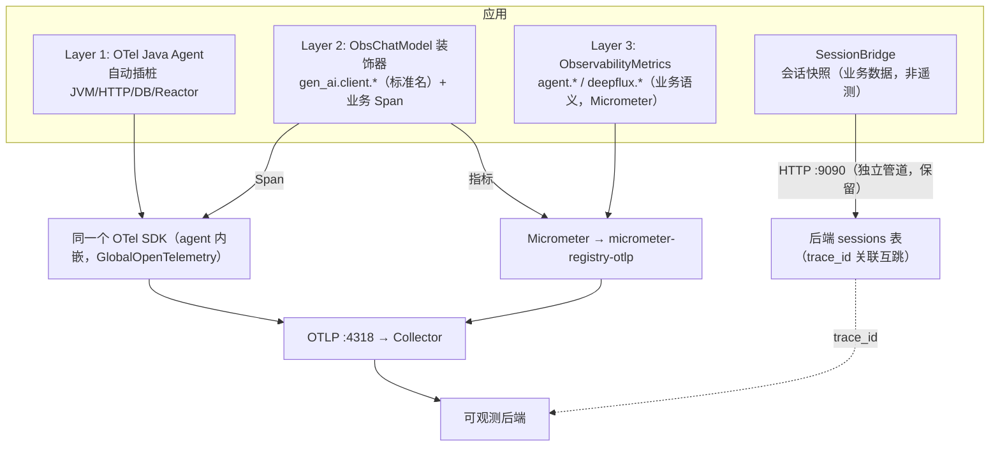

# 遥测架构最终方案（整合版）

> 本文整合并裁决两份先行分析的分歧，给出唯一执行方案：
> - 甲方案：`otel-unified-observability.md` + `otel-migration-steps.md`（主张收敛到 OTel、剥离 SessionBridge）
> - 乙方案：`telemetry-architecture-analysis.md`（主张分层合理、SessionBridge 独立管道保留、按 P0-P3 消重对标）
>
> 所有分歧点均经代码与 OTel 规范核实后裁决，非观点折中。

---

## 一、分歧点裁决表

| # | 分歧点 | 甲方案主张 | 乙方案主张 | 裁决 | 依据 |
|---|--------|-----------|-----------|------|------|
| 1 | GenAI 指标标准名 | `gen_ai.usage.input_tokens`、`gen_ai.time_to_first_token` | `gen_ai.client.token.usage`（attr `gen_ai.token.type`）、`gen_ai.client.operation.duration` | **乙对** | OTel GenAI Metrics 规范：指标名是 `gen_ai.client.token.usage` / `gen_ai.client.operation.duration`；甲写的 `gen_ai.usage.input_tokens` 是 **Span 属性名**，不是指标名 |
| 2 | TTFT 标准名 | `gen_ai.time_to_first_token` | `gen_ai.client.operation.time_to_first_chunk` | **双方都错** | 规范只定义了服务端 `gen_ai.server.time_to_first_token`；客户端 TTFT 无稳定标准名。裁决：暂用自定义名 `gen_ai.client.time_to_first_token` 并注释"规范演进后对齐" |
| 3 | SessionBridge 去留 | 剥离：会话数据改写为 Span 属性/Event/Log，删除独立 HTTP 管道 | 保留：独立 Sessions 管道合理（= Langfuse Sessions / Datadog Session Replay），加强 trace_id 关联 | **乙对** | 完整对话文本体积大、含 PII，写入 Span attribute 会被后端截断且违反本项目"低基数 Tag"约束；业界会话回放本就是独立数据类别。甲的"它不是遥测"定性正确，但"塞进 trace"的处置错误 |
| 4 | `gen_ai.client.operation.duration`（ObservabilityMetrics 内）是否死代码 | 未提及 | "已注册从未 record，`startLlmTimer/stopLlmTimer` 调用方不存在，P0 直接删" | **乙的结论方向对、事实错** | 经核实 `DomainRouter.java:136/151` **实际调用了** `startLlmTimer()/stopLlmTimer()`——不是死代码，而是与 `ObsChatModel.llm.operation.duration` 对同一次 LLM 调用的**双重活测量**。处置：消重（删外层，留装饰器），而非"删死代码" |
| 5 | Micrometer → OTel Meter API 迁移 | 可选阶段 3，折中可跳过 | 未要求，保留 Micrometer | **一致：不迁** | `micrometer-registry-otlp` 已把全部指标送进 OTLP，传输已统一；迁 API 只改代码风格、零收益高风险 |
| 6 | Agent 与 SDK 是否两套实现 | 明确澄清：Agent 内嵌 SDK，自动/手动是同一 SDK 的两个数据入口 | 未涉及 | **甲对，采纳** | 见 `otel-migration-steps.md` FAQ |
| 7 | 分层模型评价 | 4 种是历史叠加，需收敛 | 4 种对应业界 Auto+Manual 分层，分层本身不是问题 | **乙的框架更准** | Layer1 agent 自动 / Layer2 装饰器 / Layer3 业务手动 / Sessions 独立数据类别——问题只在"同层重复 + 命名不对标"，不在"层数多" |

**总评**：乙方案的架构定性（分层合理、SessionBridge 保留、对标 `gen_ai.client.*`）更准确；甲方案的传输层盘点（已统一 OTLP）和概念澄清（Agent 即 SDK）正确且必要。乙方案的 P0 依据（"死代码"）是事实错误，直接执行虽不报错，但会让人误解代码现状。

---

## 二、核实过的代码事实（裁决依据）

### 事实 1：双重测量，不是死代码

```java
// ObservabilityMetrics.java:200 — 注册（标准名，但测量点在外层）
llmCallDuration = Timer.builder("gen_ai.client.operation.duration")...

// DomainRouter.java:136-151 — 真实调用方（乙方案说"不存在"，错误）
var llmSample = obsMetrics.startLlmTimer();
content = domainChatClient.prompt()...call().content();  // ← 内部经 ObsChatModel
obsMetrics.stopLlmTimer(llmSample);

// ObsChatModel.java:421 — 同一次调用的第二次测量（自定义名，但测量点更准）
Timer.builder("llm.operation.duration").tag("model", modelName)...record(...)
```

讽刺之处：**标准名的那个测量位置不佳（外层含 prompt 组装误差、只覆盖 L0），自定义名的那个测量位置正确（装饰器内、覆盖所有层）**。所以消重方向是：删外层计时，把装饰器的指标改成标准名。

### 事实 2：传输层已统一（甲方案盘点，仍成立）

Micrometer 指标经 `micrometer-registry-otlp`、Span 经 agent 的 `GlobalOpenTelemetry`、日志经 logback appender——三者均到 Collector `:4318`。唯一独立管道是 SessionBridge（HTTP → 9090），且按裁决 #3 这条管道**应保留**。

---

## 三、最终执行计划

### P0（立即，消除双重测量）

1. 删除 `DomainRouter.java:136/151` 的 `startLlmTimer()/stopLlmTimer()` 调用（该次 LLM 调用已由 ObsChatModel 测量）。
2. 随后删除 `ObservabilityMetrics` 中的 `llmCallDuration` Timer 注册（约 200-204 行）与 `startLlmTimer/stopLlmTimer` 方法（约 504-510 行）——**此时才真正无调用方**。
3. 注意顺序：先删调用方再删方法，避免编译错误。

### P1（本迭代，命名对标 OTel GenAI 规范）

`ObsChatModel` 指标重命名（保持 Micrometer API 不变，仅改名字/tag）：

| 现名 | 标准名 | 说明 |
|------|--------|------|
| `llm.token.input` | `gen_ai.client.token.usage` + tag `gen_ai.token.type=input` | Histogram（规范要求），Micrometer 用 DistributionSummary |
| `llm.token.output` | `gen_ai.client.token.usage` + tag `gen_ai.token.type=output` | 同上 |
| `llm.operation.duration` | `gen_ai.client.operation.duration` | 承接 P0 消重后的唯一测量点 |
| `llm.first_token.latency` | `gen_ai.client.time_to_first_token`（自定义扩展名） | 规范只有 `gen_ai.server.*`，客户端无稳定名；加注释，规范落定后再对齐 |
| `llm.error.count` | 保留 Counter，tag 补 `error.type` 标准键 | 也可由 Span status 表达，但保留 Counter 便于告警 |

配套：
- tag 键名对标：`model` → `gen_ai.request.model`，补 `gen_ai.operation.name=chat`。
- 后端 `OtlpParser` / 前端面板同步更新指标名解析。
- **不动** ObsChatModel 的 Reactor 跨线程 / traceId 泄漏处理与 `safeRecord` 容错（甲方案强调，正确）。

### P2（下迭代，注册入口治理）

1. `ObservabilityMetrics` 静态 Counter 三兄弟（`routerDecisionHit/Llm/Fail` 等）迁到动态 `recordCounter()` 模式，减少样板代码。
2. `ObservabilityMetrics` 与 `MetricsRegistry` 职责定界（二选一）：
   - 合并为一个类；或
   - 明确分工：`MetricsRegistry` 管注册与缓存，`ObservabilityMetrics` 只做业务语义便捷方法（薄封装）。
3. 命名空间维持三套并行：`gen_ai.client.*`（LLM 标准）/ `agent.*`（业务自定义）/ `deepflux.*`（RAG）。`agent.*` 是合法自定义命名空间，不强行改。

### P3（架构增强）

1. **SessionBridge 保留并加强关联**（采纳乙）：
   - 保持 `@Async` HTTP 独立管道；
   - 后端支持 `GET /api/v1/sessions?traceId=xxx`，前端 Session ↔ Trace 互跳；
   - 补充：管道加失败重试或本地缓冲（当前 fire-and-forget 丢数据无感知）。
2. ObsChatModel token 采集加去重开关：若未来 Spring AI DashScope adapter 自动上报 `gen_ai.client.token.usage`，配置项关闭自采。
3. 不做 Micrometer → OTel Meter API 迁移（裁决 #5）；不引入独立 `opentelemetry-sdk` 依赖，手动 Span 继续用 agent 提供的 `GlobalOpenTelemetry`（甲方案 FAQ：Agent 即 SDK）。

### 验证

1. `scripts/start-all.ps1` 启动，Collector `:4318` 确认收到改名后的 `gen_ai.client.*` 指标。
2. 跑 `qa-smoke.mjs` / `verify-E2E.sh` 回归；复用 ObsChatModel traceId 泄漏回归测试。
3. 确认 L0 路由 LLM 耗时仍可观测（现由 ObsChatModel 的 `gen_ai.client.operation.duration` + tag 区分层级承担，P0 删除外层计时后不留盲区）。

---

## 四、最终目标架构



**一句话结论**：架构分层不动（Auto + 装饰器 + 手动 + 独立会话管道，均为业界标准形态）；要动的只有三件事——**消掉一处双重测量（P0）、LLM 指标名对标 `gen_ai.client.*`（P1）、两个注册入口定界（P2）**。SessionBridge 保留，Micrometer 保留，不做 API 大迁移。

---

## 附：对两份先行文档的勘误

| 文档 | 勘误 |
|------|------|
| `otel-migration-steps.md`（甲） | 阶段 1"剥离 SessionBridge 改写 Span 属性"**作废**，以本文 P3-1 为准；阶段 2 的目标指标名有误（`gen_ai.usage.input_tokens` 是 Span 属性名非指标名），以本文 P1 为准 |
| `telemetry-architecture-analysis.md`（乙） | §4.1/§七 P0 的"死代码/调用方不存在"**事实错误**：`DomainRouter.java:136/151` 是真实调用方，正确定性为"双重活测量"，删除顺序见本文 P0；§3.3 的 `gen_ai.client.operation.time_to_first_chunk` 不在规范中，TTFT 处置见本文 P1 |
