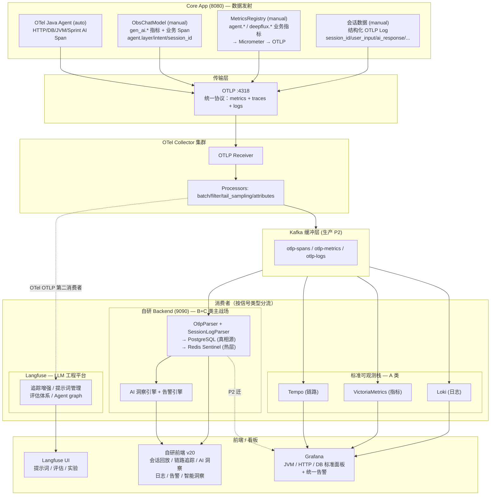

# 综合三方分析：目标可观测架构的最终形态

> 对比对象：
> - **A 稿**：`telemetry-architecture-analysis.md`（我最初的）
> - **B 稿**：`otel-unified-observability.md` + `otel-migration-steps.md` （主张 SDK 统一 + 剥离 SessionBridge）
> - **C 稿**：`telemetry-consolidated-plan.md`（我综合 A+B 后的修订版）
> - **V6 稿**：`可观测优化总结-WorkBuddy-V6-生产上线版-0718.md`（面向百万 DAU 的生产架构，含 Grafana Alloy / Kafka / Langfuse / 标准栈）

---

## 一、V6 引入的新维度（前三份分析均未覆盖）

| 维度 | V6 的观点 | 前三份分析 | 差距 |
|------|----------|-----------|------|
| **SessionBridge 可靠性理由** | sessions **必须 100% 捕获**（客服/审计），traces 会被采样（1-100%），不能把 session 挂到 trace 上 | C 稿主张剥离 SessionBridge，数据挂 Span attribute/Event | ⚠️ **重大分歧**，V6 的理由有道理 |
| **Kafka 缓冲层** | 日均 2000-6000 万 Span，直压 Backend 不可行，需 Collector → Kafka → Consumers 削峰 | 无人提及 | 当前 Demo 量级无需，但目标架构应预留 |
| **Langfuse 第二消费者** | 经 OTel OTLP 从 Collector 消费同一份遥测，补齐提示词管理/评估/实验（自研 Backend 不做这些） | C 稿未涉及 | V6 正确，Langfuse 和自研 Backend 是互补关系 |
| **标准栈外溢**（Tempo/VM/Loki） | 基础设施指标（JVM/HTTP/DB）交给 Grafana 标准栈，自研 Backend 专注 AI 业务语义（B+C 类） | 隐含同意（C 稿说了"基础设施骨架"），但未明确分离 | V6 更清晰：A 类指标→Grafana，B+C 类→自研前端 |
| **Grafana Alloy 替换原生 Collector** | P2 用 Alloy 替代原生 otelcol-contrib，集群模式 + 单二进制统一 OTLP+Prom+Loki | 未涉及 | 部署优化，不改变数据流逻辑 |

---

## 二、核心分歧深度裁决

### 分歧 1：SessionBridge 到底该不该剥？——这是最关键的一个

**C 稿主张**：剥离 SessionBridge，会话数据挂到 Span attribute + Span Event，经 OTLP 传输。

**V6 稿主张**：保留 SessionBridge 为独立管道，理由：
> "sessions 不依赖 spans"（L219）
> "两条独立管道：spans（traceId）+ sessions（sessionId，不依赖 span 导出）"（L218）

**V6 的核心论据值得重视**：

```
生产环境的事实：
  Traces：按 intent 分级采样
    TRANSFER/BILL → 100%（监管要求）
    WEALTH/GENERAL → 5%
    其他 → 1%
    错��/慢 → 100%

  Sessions：必须 100% 捕获
    银行客服需要完整对话回放来排查投诉
    银保监审计要求会话轨迹可追溯
```

**如果 Session 数据挂到 Trace Span 上** → 采样 5% 的查询类请求直接丢失 95% 的会话记录 → 客服查不到用户说了什么 → 不可接受。

**裁决**：V6 稿在这个问题上胜出。**Session 必须保持独立于 Trace 采样的捕获管道。**

**但 V6 稿的方案仍有改进空间**：当前 SessionBridge 走 HTTP POST :9090 私路，这确实是一条独立传输协议。更好的做法是：

```
当前（V6）：
  SessionBridge → HTTP POST :9090 → Backend sessions 表
  （独立传输协议，独立接口）

改进（最优）：
  Session data → OTLP Log（logback-appender 已存在）
  Collector → Kafka → Backend log parser → sessions 表
  （统一传输协议 OTLP，%100 捕获，但逻辑上仍是独立信号）
```

OTLP Logs 不受 trace 采样影响（logs pipeline 独立），天然 100% 送达。用 OTLP Log 替代 HTTP POST，既保持捕获独立性，又统一传输协议。

**结论**：采纳 V6 的"Session 独立于 Trace 采样"原则，但用 OTLP Log（而非 HTTP POST）作为传输方式。SessionBridge.java 的 HTTP 逻辑删除，改为结构化日志记录，走已有 logback-appender → OTLP → Collector → Kafka → Backend。

### 分歧 2：Langfuse 要不要？——V6 已确认需要，且理由充分

**前三份分析都未考虑 Langfuse**，因为聚焦在 Core 采集侧。

**V6 指出**：Langfuse 补齐了自研 Backend 不具备的能力：
- 提示词版本管理 / Playground / A-B 测试（§9.4 P20 落地处）
- LLM-as-Judge 评估体系
- Agent graph 可视化（LangGraph/LangChain 风格调用链图）
- 成本追踪

**关键设计**：Langfuse 是 OTel OTLP **第二消费者**，不替换自研 Backend：
```
Core OTel → Collector → ① 自研 Backend(9090) — 业务语义真相源（PG）
                        → ② Langfuse          — LLM 工程平台（叠加消费）
```

**裁决**：V6 正确。Langfuse 应在目标架构中作为第二 OTLP 消费者。当前 Demo 阶段可选 `docker compose up`，生产 P2 自托管。

### 分歧 3：标准栈外溢（Tempo/VM/Loki）——V6 的模块分离策略更清晰

**V6 的 A/B/C 模块分离**：
- **A 类（基础设施）**：JVM/HTTP/DB 等标准指标 → Grafana + Tempo/VM/Loki
- **B 类（LLM 性能）**：Token/TTFT/TPOT/错误率 → **自研主战场**
- **C 类（AI 业务语义）**：意图准确率/路由决策/漏斗/满意度 → **自研主战场**

**前三份分析隐含了这个方向，但没说清楚**：
- C 稿的"Layer 1 基础设施骨架"对应 A 类
- C 稿的"Layer 3 业务指标"对应 B+C 类
- 但没有明确说"A 类数据交给 Grafana，不要自建页面"

**裁决**：采纳 V6 的清晰分工——标准栈处理 A 类，自研 Backend+前端处理 B+C 类。**而且 A 类不需要自建任何页面，直接用 Grafana 现成的 JVM/HTTP Dashboard。**

### 分歧 4：Kafka 缓冲层要不要？——量级决定

**V6 主张 P2 引入 Kafka**，理由是日均 2000-6000 万 Span 直压 Backend 不可行。

**当前 Demo 量级**：几十个请求/秒，完全不需要。

**裁决**：Kafka 是**量级驱动的架构组件**，不是逻辑必须。方案应分层：
- Demo / 小规模：Collector → 直接 → Backend（当前架构，够用）
- 生产 / 大规模：Collector → Kafka → (Backend / Tempo / VM / Loki / Langfuse)

在目标架构图中保留 Kafka 位置，标注"(生产 P2)"。

### 分歧 5：Grafana Alloy —— 纯部署选择

Alloy 替换原生 Collector 是运维层面的替换（统一配置语法、原生 Prometheus+Loki 集成），不改变数据流逻辑。对架构讨论无实质影响。保留原生 Collector 作为当前实现，Alloy 作为 P2 可选项。

---

## 三、修正后的最优目标架构

### 3.1 核心原则（融合三方）

```
1. 一套传输协议：OTLP（所有信号统一走 OTLP）
2. 一个采集网关：OTel Collector（或 P2 时 Grafana Alloy）
3. 两种数据入口（auto + manual）：同一 OTel SDK 的两个入口，不是两套系统
4. Session 独立于 Trace 采样：用 OTLP Log 传输，保持 100% 捕获，不依赖 trace 采样率
5. 三个消费者：
   ├─ 自研 Backend（B+C 类：LLM 性能 + AI 业务语义 + Session 回放）→ 自研前端
   ├─ Langfuse（LLM 工程：提示词/评估/实验/Agent graph）→ Langfuse UI
   └─ 标准栈（A 类：JVM/HTTP/DB）→ Grafana
6. Kafka 缓冲：生产量级必备，Demo 跳过
```

### 3.2 目标架构图（最终版）



### 3.3 与 V6 架构的关键差异

| 组件 | V6 方案 | 修正方案 | 理由 |
|------|--------|---------|------|
| Session 传输 | HTTP POST :9090 私路 | OTLP Log（统一协议） | 消灭第二条传输协议，仍保持 Trace 采样独立性 |
| SessionBridge.java | 保留 @Async HTTP | 删除，改为结构化 OTLP Log | 传输归传输，存储归存储 |
| 后端 /api/v1/sessions POST | 保留 | 保留 GET 查询，删除 POST（改为 OTLP Log 解析写入） | 后端只需一个 OTLP 入口 |
| Micrometer 桥 | 未提及（黑盒假设） | 明确 micrometer-registry-otlp 桥的统一作用 | 解释清楚为什么 agent.* / llm.* 指标也在 OTLP 上 |
| 命名对齐 | §16.2 仅说"追加 gen_ai.* 属性" | 重命名 llm.* → gen_ai.client.* （不只是追加） | 追加不等于正确——旧名仍在产生歧义 |

### 3.4 Core 侧改动清单（融合后最终版）

| 阶段 | 改动 | 代码影响 | 风险 |
|------|------|---------|------|
| **Phase 0** | 删除 `gen_ai.client.operation.duration` 死代码 | `ObservabilityMetrics.java` 删 5 行 | 零 |
| **Phase 1** | Session 数据改走 OTLP Log（非 Span attribute） | `SessionBridge.java` 重写为 SessionLogEmitter；`BankController.doOnTerminate` 改调；删除 `SessionBridge` HTTP 逻辑 | 中（session 写入方式变化，需后端同步改 OTLP log 解析） |
| **Phase 2** | 命名对齐 gen_ai.* | `ObsChatModel.java` 指标名 + `ObservabilityMetrics.java` Timer 名 | 中（后端 OtlpParser 同步更新） |
| **Phase 3** | Micrometer → OTel Metrics API（可选） | 纯接口替换，调用方零改动 | 低（可回退） |
| **Phase P2** | 后端新增 OTLP Session Log 解析器 | 从 `obs.session_log` log 中提取会话记录写入 sessions 表 | 中 |

---

## 四、关于"Session 为什么不挂 Span Event"的补充解释

我上轮提的"会话内容放 Span Event"方案确实有问题，V6 让我意识到：

1. **Span Event 属于 Trace**，trace 采样会丢弃 Span Event。5% 采样率 = 95% 的会话记录丢失。银行客服场景不可接受。

2. **OTel Log 是独立 pipeline**，不受 trace 采样影响。Log 天然 100% 送达（除非显式配置 log 采样）。

3. **当前已有 OTLP log pipeline**（logback-appender → OTLP）。Session 数据作为结构化 log 发送，天然复用已有管道。

所以最终的 Session 方案是：
```
BankController.doOnTerminate()
  → sessionLogEmitter.emit(sessionId, userInput, aiResponse, intent, agentPath, ...)
  → log.info("session_replay", structuredJson)  // 经 logback-appender
  → OTLP Log → Collector → Kafka → Backend SessionLogParser
  → sessions 表（与原来 SessionBridge HTTP POST 达到相同效果）
```

**传输协议统一了（HTTP POST → OTLP Log），逻辑独立性保持了（不依赖 Trace），捕获完整性保证了（100%）**。

---

## 五、之前分析的自我修正汇总

| # | 我之前说 | 现在修正为 | 触发 |
|---|---------|-----------|------|
| 1 | "4 条独立管道" | "3 数据源汇 OTLP + 1 HTTP 私路" | B 稿指出 micrometer-registry-otlp 桥 |
| 2 | "保留 SessionBridge，增强双向关联" | "删 HTTP 私路，Session 改走 OTLP Log，保持 Trace 采样独立性" | V6 的 100% 捕获论 + B 稿的协议统一论 |
| 3 | "Session 数据放 Span Event" | "放 OTLP Log（不受 trace 采样影响）" | V6 的采样率差异分析 |
| 4 | "Agent 和 SDK 是两种方式" | "是同一 SDK 的两种数据入口" | B/C 稿的清楚解释 |
| 5 | 未涉及 Langfuse / Kafka / 标准栈 | 纳入目标架构，分阶段部署 | V6 的生产级视角 |
| 6 | "Micrometer 保留为主" | 确认保留（桥已统一），命名对齐优先 | 三方共识 |
