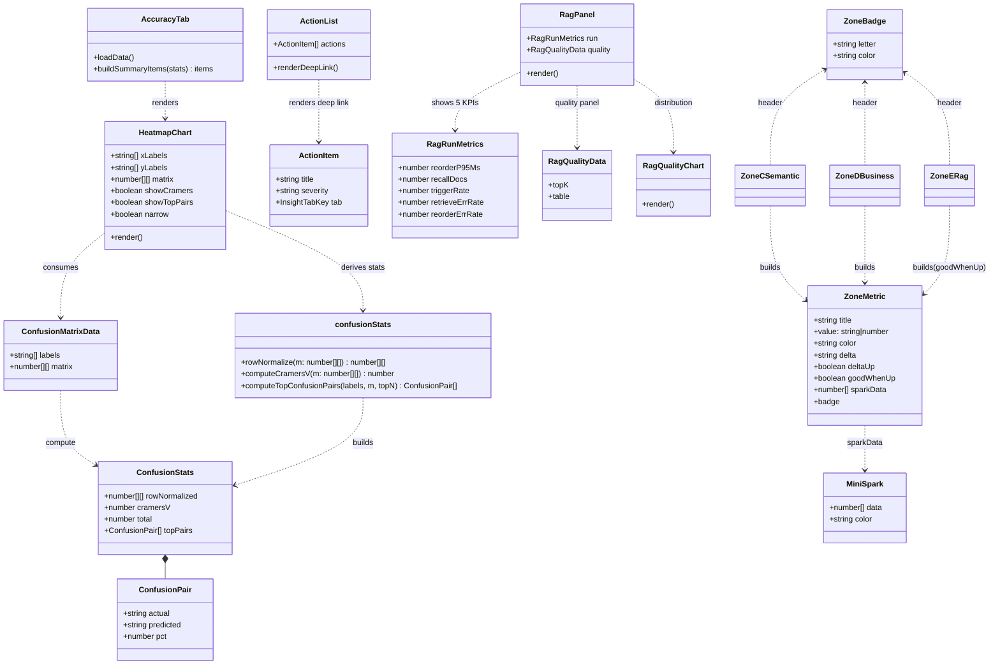
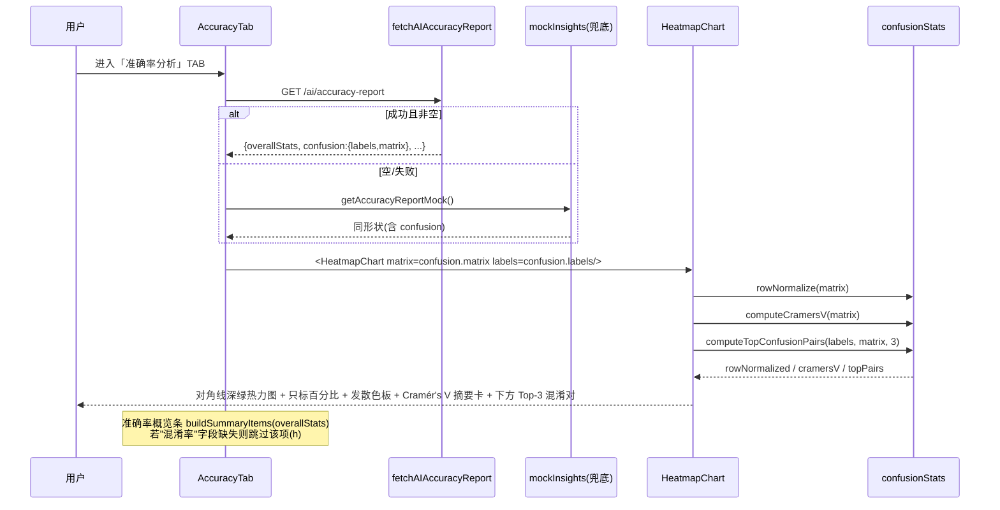
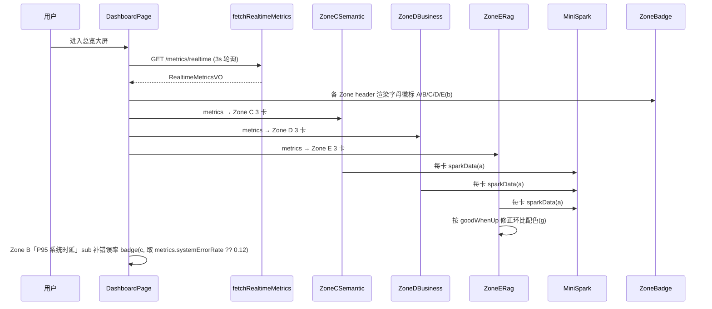
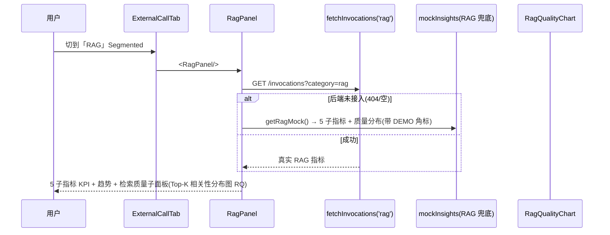
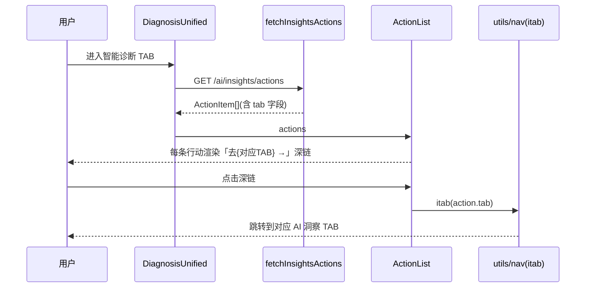
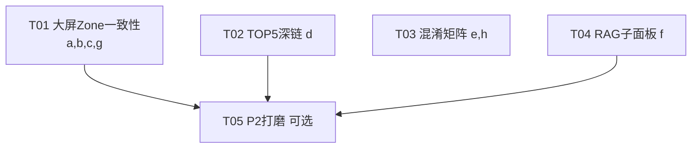

# 可观测平台 V24 — 二次对齐 · 系统设计 + 任务分解

> 架构师：高见远（software-architect）｜日期：2026-07-25
> 定位：**增量开发 · 最小变更**，把前端「大屏(总览)」与「AI 洞察」对齐到 DEMO v24，并把混淆矩阵重构为调研推荐方案。
> 输入：`可观测V24-对齐差距分析-2026-07-25.md`（PM 调研）+ `可观测DEMO-v24-WorkBuddy.html`（基线参考）。
> 技术栈：**React 18 + antd 5 + echarts + vite**（沿用，无新依赖）。

---

# Part A 系统设计

## 1 实现方案与框架选型

### 1.1 核心难点与对策

| 难点 | 对策 |
|------|------|
| 混淆矩阵「乱」：单色蓝、双数字、对角线不突出、口径不清 | 采用 PM 推荐方案：行归一化 + 对角线深绿铺底 + 单元格只标百分比 + 发散色板(白→橙→红) + 右上角 Cramér's V 摘要卡 + 矩阵下方 Top-3 混淆对 + 轴标签显式写口径 |
| Cramér's V / Top-3 混淆对 / 行归一化矩阵由谁计算 | **纯前端计算**，新增 `services/confusionStats.js`，不新增任何后端字段；DEMO HTML 内联同一算法，保证前后端口径一致 |
| Zone C/D/E 缺 sparkline（仅 A/B 有） | 复用既有 `components/charts/MiniSpark.jsx`（echarts 迷你折线），为 C/D/E 每卡补 `sparkData` 静态 7 点序列 |
| Zone 字母徽标 A/B/C/D/E 未渲染 | `sectionHeaderStyle(color, tag)` 当前忽略 `tag`；新增共享 `ZoneBadge` 组件，4 处 Zone 文件统一渲染 |
| Zone E 环比配色语义相反（↑ 应为绿） | 每卡增加 `goodWhenUp` 语义字段，颜色 = `deltaUp===null ? 灰 : (deltaUp===goodWhenUp ? 绿 : 红)` |
| RAG 缺检索质量子面板 + 5 子指标 | `RagPanel` 重构：补 5 子指标 KPI + 检索质量子面板（Top-K 相关性分布图），后端未接入时用 dev 链路真值 mock 兜底（带 DEMO 角标） |
| 智能诊断 TOP5 缺「去对应 TAB」深链 | `ActionList` 增加 `tab` 字段渲染，点击经 `itab(tab)` 跳转对应 AI 洞察 TAB |

### 1.2 框架与库选型

- **UI**：antd 5（`Card / Tag / Segmented / Table` 等均已在使用，零新增）。
- **图表**：echarts（通过 `echarts-for-react` + `useECharts` hook），复用 `MiniSpark`、`HeatmapChart` 既有封装。
- **状态/路由**：react-router `useNavigate` + 项目自有 `utils/nav`（`itab` / `emit`）做 TAB 切换与深链。
- **无新 npm 包**（详见 §6）。

---

## 2 文件列表（标注 新增 / 修改）

> 相对路径均基于 `observability/frontend/src/`，DEMO 为单文件 HTML。

| # | 文件 | 状态 | 职责 |
|---|------|------|------|
| 1 | `pages/DashboardPage.jsx` | **修改** | `sectionHeaderStyle` 渲染 Zone 字母徽标（b）；Zone B「P95 系统时延」card sub 增补错误率 badge（c） |
| 2 | `components/dashboard/ZoneCSemantic.jsx` | **修改** | 渲染 Zone 字母徽标（b）；补 `MiniSpark`（a）；`sectionHeaderStyle` 接 `ZoneBadge` |
| 3 | `components/dashboard/ZoneDBusiness.jsx` | **修改** | 同上（b / a）；补 `MiniSpark` |
| 4 | `components/dashboard/ZoneERag.jsx` | **修改** | 同上（b / a）；**环比配色语义修正（g）**——每卡 `goodWhenUp` |
| 5 | `components/dashboard/ZoneBadge.jsx` | **新增** | 共享 Zone 字母徽标组件（A/B/C/D/E 圆角徽标，zone 色） |
| 6 | `components/charts/MiniSpark.jsx` | **复用** | 既有迷你折线，C/D/E 直接引用，不改动 |
| 7 | `components/MetricCard.jsx` | **复用** | 既有带 sparkline 卡片（Zone A/B 已用），不改动 |
| 8 | `components/DiagnosisCockpit.jsx` | **修改** | `ActionList` 增加「去对应 TAB」深链（d），消费 `action.tab` |
| 9 | `services/mockInsights.js` | **修改** | ① `topActions` 补 `tab`（d）；② 新增 RAG 5 子指标 + 检索质量分布 mock（f） |
| 10 | `components/charts/HeatmapChart.jsx` | **修改** | 混淆矩阵重构（e）：对角线绿底、只标百分比、发散色板、Cramér's V 卡、Top-3 混淆对、窄屏降级 |
| 11 | `services/confusionStats.js` | **新增** | 纯函数：`rowNormalize` / `computeCramersV` / `computeTopConfusionPairs` |
| 12 | `pages/AccuracyTab.jsx` | **修改** | 调用重构后的 `HeatmapChart`（e）；`buildSummaryItems` 对「混淆率」缺失做容错（h） |
| 13 | `components/RagPanel.jsx` | **修改** | 重构为 RAG 运行指标 5 子指标 + 检索质量子面板（f） |
| 14 | `pages/ExternalCallTab.jsx` | **修改** | RAG 段承载检索质量子面板（f），mock 兜底 |
| 15 | `components/charts/RagQualityChart.jsx` | **新增** | Top-K 相关性分布折线图（f），复用 echarts |
| 16 | `docs/specs/可观测DEMO-v24-WorkBuddy.html` | **修改** | 仅改「意图混淆矩阵」区块（L697 + L1067-1074 及相邻卡片）：同步 e 方案（对角线绿、只标百分比、发散色、Cramér's V 卡、Top-3 混淆对）。**不动 v23 基线、不动其它页面、不动总览/Zone 区块** |

---

## 3 数据结构与接口（TS 类型 + 类图）

### 3.1 关键 TS 类型契约

```typescript
/* ── 混淆矩阵核心数据契约（权威：services/mockInsights.js confusion）── */
interface ConfusionMatrixData {
  labels: string[];        // 5 类意图，行=实际 / 列=预测 共用同一标签序
  matrix: number[][];      // 原始计数 matrix[actual][predicted]，5×5
}

/* 由 matrix 派生（前端 confusionStats 计算，DEMO 内联同算法） */
interface ConfusionStats {
  rowNormalized: number[][];          // 行归一化百分比 0–100，rowNorm[i][j] = matrix[i][j]/rowSum(i)*100
  cramersV: number;                   // Cramér's V ∈ [0,1]，越大越混淆
  total: number;                      // 样本总量 = ΣΣ matrix
  topPairs: ConfusionPair[];          // 非对角混淆对按 pct 降序，取前 3
}
interface ConfusionPair {
  actual: string;                     // 实际意图（行标签）
  predicted: string;                  // 预测意图（列标签）
  pct: number;                       // 占该实际意图行的比例（%），1 位小数
}

/* HeatmapChart 重构后 Props 契约 */
interface HeatmapChartProps {
  xLabels?: string[];                 // 预测意图（列）
  yLabels?: string[];                 // 实际意图（行）
  matrix?: number[][];                // 原始计数
  height?: number;                    // 默认 280
  showCramers?: boolean;              // 是否挂 Cramér's V 摘要卡，默认 true
  showTopPairs?: boolean;             // 是否渲染 Top-3 混淆对，默认 true
  narrow?: boolean;                   // 窄屏：隐藏完整矩阵，仅渲染 Top-N 混淆对列表
}

/* Zone C/D/E 卡片数据（统一形状，便于补 MiniSpark + 配色语义） */
interface ZoneMetric {
  title: string;
  value: string | number;
  unit?: string;
  sub?: string;
  color: string;                      // zone 主题色
  delta?: string;                     // 环比文本，如 '↑ 3.1%'
  deltaUp?: boolean | null;           // true=上升 / false=下降 / null=持平
  goodWhenUp?: boolean;               // g：该指标"上升是否为好"，默认 true
  sparkData?: number[];               // a：7 点趋势序列，复用 MiniSpark
  badge?: { text: string; tone: 'success' | 'warning' | 'error' }; // 可选角标（如错误率）
}

/* 智能诊断 TOP5 行动（d：新增 tab 字段做深链） */
interface ActionItem {
  id?: string;
  title: string;
  description?: string;
  severity?: 'HIGH' | 'MED' | 'LOW';
  boundary?: 'L1' | 'L2';
  tab?: InsightTabKey;                // 新增：点击深链跳转的 AI 洞察 TAB
}
type InsightTabKey = 'diagnosis' | 'accuracy' | 'rag' | 'funnel' | 'satisfaction' | 'agent' | 'perf';

/* RAG 运行指标 5 子指标（f） */
interface RagRunMetrics {
  reorderP95Ms: number;               // 重排时延 P95
  recallDocs: number;                 // 平均召回文档数
  triggerRate: number;                // RAG 触发率 %
  retrieveErrRate: number;            // 检索错误率 %
  reorderErrRate: number;             // 重排错误率 %
  trend?: { categories: string[]; series: { name: string; data: number[]; color: string }[] };
}
/* RAG 检索质量子面板数据（f） */
interface RagQualityData {
  topK: { categories: string[]; top1: number[]; top3: number[]; top5: number[] }; // 相关性/命中率分布 %
  table: { dim: string; current: string; target: string; verdict: 'good' | 'warn' }[];
}

/* 实时指标扩展（c：错误率字段，待后端确认） */
interface RealtimeMetricsVO /* 现有 + 可选 */ {
  // ...既有字段...
  systemErrorRate?: number;           // 系统时延错误率 %（H2 span 真值），未接入时 undefined
}
```

### 3.2 类图（mermaid classDiagram）



---

## 4 程序调用流程（时序图 mermaid）

### 4.1 混淆矩阵数据来源 → 组件消费 → 渲染（e / h）



### 4.2 大屏(总览)数据取数（a / b / c / g）



### 4.3 RAG 检索质量子面板 + 5 子指标（f）



### 4.4 智能诊断 TOP5 深链（d）



---

## 5 任务列表（有序 + 依赖 + 优先级，覆盖 P1 a–h）

> 5 个实现任务（T01–T05）覆盖 PM 全部 P1 项 a–h；T05 为 P2 可选打磨。各任务内文件已分组，最小变更。

| 任务 | 名称 | 覆盖 P1 | 源文件（新增/修改） | 依赖 | 优先级 |
|------|------|---------|---------------------|------|--------|
| **T01** | 大屏 Zone 一致性（字母徽标 + 错误率 badge + sparkline + 配色语义） | **a, b, c, g** | DashboardPage.jsx(改)、ZoneCSemantic.jsx(改)、ZoneDBusiness.jsx(改)、ZoneERag.jsx(改)、ZoneBadge.jsx(**新**)；复用 MiniSpark.jsx | 无 | P0 |
| **T02** | 智能诊断 TOP5「去对应 TAB」深链 | **d** | DiagnosisCockpit.jsx(改 `ActionList`)、services/mockInsights.js(改 `topActions` 补 `tab`)、DiagnosisUnified.jsx(透传) | 无 | P1 |
| **T03** | 混淆矩阵重构美化 + 准确率混淆率兜底 | **e, h** | HeatmapChart.jsx(改)、services/confusionStats.js(**新**)、AccuracyTab.jsx(改)、可观测DEMO-v24-WorkBuddy.html(改 混淆矩阵区块) | 无 | P1 |
| **T04** | RAG 检索质量子面板 + 5 子指标 | **f** | RagPanel.jsx(改)、ExternalCallTab.jsx(改)、services/mockInsights.js(改 补 RAG mock)、RagQualityChart.jsx(**新**) | 无 | P1 |
| **T05** | P2 标注 / 文案打磨（可选） | P2 | DashboardPage / ZoneC/D/E / DiagnosisUnified / AccuracyTab 等 sub 文案、接入状态徽标、诊断页 4 卡去重 | T01, T02, T04 | P2 |

### 5.1 各任务细化

**T01 — 大屏 Zone 一致性（a, b, c, g）**
- 新增 `ZoneBadge.jsx`：`<ZoneBadge letter color />`，圆角胶囊 + 白字 + zone 色底。
- 4 处 `sectionHeaderStyle(color, tag)` 改为渲染 `<ZoneBadge letter={tag} color={color} />`（DashboardPage / ZoneC / ZoneD / ZoneE）。
- Zone C/D/E 每卡补 `sparkData: number[]`（7 点，末点≈当前值）并渲染 `<MiniSpark data={sparkData} color={zoneColor} />`。
- Zone B「P95 系统时延」card：`sub` 内在 P50/P99 后追加 `<Tag color="success">错误率 {err}%</Tag>`；`err = metrics.systemErrorRate ?? 0.12`（0.12 为 DEMO 真值占位，见 §8）。
- Zone E 每卡增加 `goodWhenUp`：命中率/相关性 `goodWhenUp=true`（↑绿），检索时延 `goodWhenUp=false`（↓绿）；颜色逻辑 `deltaUp===null ? 灰 : (deltaUp===goodWhenUp ? 绿 : 红)`。

**T02 — 智能诊断 TOP5 深链（d）**
- `mockInsights.topActions` 每条补 `tab`（映射 DEMO：性能→`perf`/准确率→`accuracy`/转化→`funnel` 等，用既有 `InsightTabKey`）。
- `ActionList` 渲染末尾「去{标签} →」链接，点击 `itab(action.tab)`；标签映射表 `TAB_LABEL = {accuracy:'准确率',rag:'RAG',funnel:'漏斗',diagnosis:'智能诊断',...}`。
- 真实数据 `fetchInsightsActions` 若不含 `tab`，前端按 `severity`/`boundary` 启发式兜底到 `diagnosis`。

**T03 — 混淆矩阵重构（e）+ 混淆率兜底（h）**
- 新增 `confusionStats.js`：`rowNormalize` / `computeCramersV`（χ²/(n·(k-1))，k=min(行,列)）/ `computeTopConfusionPairs`。
- `HeatmapChart` 重构：
  - 对角线单元格深绿铺底（`#237804`/`#52c41a` 渐层），只显示百分比；非对角只显示百分比，count 移入 tooltip。
  - 发散色板：`confuseColor(pct)` —— `<1%:#fff` / `1–5%:#fff1e6` / `5–10%:#ffbb96` / `10–15%:#ff7a45` / `≥15%:#ff4d4f`。
  - 轴标签：`xAxis.name='预测意图(列)'`、`yAxis.name='实际意图(行)'`；caption 写明「单元格数值 = 占该行(实际意图)比例，行已归一化 0–100%」。
  - 右上角 Cramér's V 摘要卡（健康灯：`<0.15`绿 / `0.15–0.30`黄 / `>0.30`红）。
  - 矩阵下方 Top-3 混淆对（`⚠ 理财咨询↔理财解读 13.6%` 形式）。
  - `narrow` 模式：屏宽 <480 时隐藏完整矩阵，仅渲染 Top-3 列表（移动端降级）。
- `AccuracyTab`：`buildSummaryItems` 对 label 含「混淆」且 value 为空时跳过该项（h 兜底）。
- DEMO HTML：仅改「意图混淆矩阵」区块（L697 note + L1067-1074 chart-confusion 函数），内联同算法实现对角线绿 / 只标百分比 / 发散色 / Cramér's V 卡 / Top-3 混淆对。**其余区块不动**。

**T04 — RAG 检索质量子面板 + 5 子指标（f）**
- `mockInsights` 新增 `getRagMock()`：5 子指标（重排时延P95=45 / 召回文档数=8.2 / 触发率=64 / 检索错误率=0.4 / 重排错误率=0.1）+ 趋势 + 质量分布（Top-1/3/5 相关性）+ 质量表（命中率/相关性/空召回/NDCG@5）。
- `RagPanel` 重构：顶部 5 子指标 KPI 卡 + 趋势图 + 检索质量子面板（左 `RagQualityChart`「Top-K 相关性分布」，右质量判定表），沿用 teal 主题；真实 `fetchInvocations('rag')` 失败时回退 `getRagMock()` 并打 DEMO 角标。
- 新增 `RagQualityChart.jsx`（echarts 折线：Top-1/Top-3/Top-5）。
- `ExternalCallTab` 的 `rag` 段承载上述子面板（已 `import RagPanel`，逻辑不变）。

**T05 — P2 标注/文案打磨（可选，标注即可）**
- 各 Zone 接入状态徽标（A/B「已接通」、C/D「部分待接入」、E「待 Core RAG 链路接入」）补全。
- Zone A DAU「待接入」徽标、Zone D 两个埋点卡「待埋点接入」标注。
- 诊断页内 `DiagnosisSummary4Cards` 是否去重（DEMO 仅总览有）— 需与 PM 确认。
- 各卡 `sub` 文案统一（如 Reroute「待 Core 度量」标注）。

### 5.2 任务依赖图（mermaid graph）



> T01–T04 彼此独立（改动文件基本不重叠），可并行；T05 在三者结构稳定后收尾。

---

## 6 依赖包列表

**无新增 npm 包。**

沿用既有依赖：`react@18`、`react-dom@18`、`antd@5`、`@ant-design/icons`、`echarts` + `echarts-for-react`、`axios`、`react-router-dom`。新增能力（混淆统计、MiniSpark 复用、ZoneBadge、RagQualityChart）均为项目内自写模块，不引入第三方库。

---

## 7 共享知识（跨文件约定）

1. **`sparkData` 语义**：`number[]`，长度 7，表示「最近 7 个时间桶」趋势；末点应≈卡片当前值；颜色 = 所属 Zone 主题色。Zone A/B 已用，C/D/E 补齐时遵循同一约定，避免「假波动」。
2. **Zone 配色 token（统一，避免各文件硬编码漂移）**：
   | Zone | 字母 | 主题色 | 深字色 |
   |------|------|--------|--------|
   | A 系统健康 | A | `#1677ff` | — |
   | B AI 性能 | B | `#722ed1` | — |
   | C 语义质量 | C | `#52c41a` | — |
   | D 业务效果 | D | `#d48806` | — |
   | E 知识检索 | E | `#08979c` | `#006d75` |
   `ZoneBadge` 统一消费这些色；新增 Zone 时同步此表。
3. **混淆矩阵归一化口径常量（前后端/DEMO 一致）**：
   - `NORMALIZE_AXIS = 'row'`（按行：占「实际意图」比例），**严禁**改成列归一或原始计数展示。
   - 单元格文本 = 行归一化百分比（1 位小数）；原始 `count` 仅在 tooltip。
   - 轴标签必须写清「实际意图(行) / 预测意图(列)」与「占该行比例」。
   - `Cramér's V` 公式：`V = sqrt(χ² / (n·(k−1)))`，`k = min(行数, 列数)`，`n = ΣΣmatrix`；健康灯阈值 `<0.15 绿 / 0.15–0.30 黄 / >0.30 红`。
   - 发散色板档位（非对角）：`<1% 白 / 1–5% 浅橙 / 5–10% 橙 / 10–15% 橙红 / ≥15% 红`。
4. **环比配色语义约定**：任何 KPI 卡不得再写死「↑红/↓绿」。统一 `goodWhenUp` 字段：颜色 = `deltaUp===null ? 灰 : (deltaUp===goodWhenUp ? 绿(#52c41a) : 红(#ff4d4f))`。Zone E（RAG）指标普遍「上升=好」，须显式 `goodWhenUp=true`。
5. **DEMO 角标约定**：mock/兜底数据渲染处统一挂 `DemoBadge`（既有组件），与真实数据区分，不喧宾夺主。
6. **深链约定**：所有「跳转 AI 洞察 TAB」统一走 `utils/nav.itab(tabKey)`，禁止散写 `window.location` / `navigate` 直跳。

---

## 8 待明确事项（需主理人拍板，每条附建议兜底）

| # | 事项 | 影响任务 | 建议兜底 |
|---|------|----------|----------|
| Q1 | **Zone B「错误率」字段来源**：`metrics.systemErrorRate` 后端是否发射（H2 span 真值 0.12%）？当前 `fetchRealtimeMetrics` 未消费该字段。 | T01(c) | 若后端未接入：前端取 `metrics.systemErrorRate ?? 0.12`，在 badge 旁加微妙「(待接入)」标注，待 Core 发射后自动替换，不硬编码假数据。 |
| Q2 | **(h) 准确率概览「混淆率」字段**：后端 `overallStats` 是否提供「混淆率」？mock 已有（3.8%），但语义不明（非简单误分率）。 | T03(h) | 后端提供则直接用；若缺，前端 `buildSummaryItems` 跳过该项（隐藏），不自行从 matrix 反算（口径可能不一致），并在控制台 warn 提示补字段。 |
| Q3 | **Cramér's V 计算口径**：是否需后端支持？分母 `k` 取 `min(行,列)` 还是类别数？健康灯阈值是否认可 `<0.15/0.15–0.30/>0.30`？ | T03(e) | **前端计算**（已设计 `confusionStats.js`），`k=min(行,列)`；阈值取建议值。无需后端改动；若主理人认为应后端下发 V 值，再于 `ConfusionMatrixData` 增 `cramersV?` 可选字段、前端优先用后端值。 |
| Q4 | **智能诊断 TOP5 `tab` 取值域**：`itab` 接受的 AI 洞察 TAB key 真实有哪些（perf/diagnosis/accuracy/rag/funnel/satisfaction/agent）？DEMO 深链文案为「去性能/漏斗/准确率 TAB」。 | T02(d) | 前端按 `InsightTabKey` 枚举渲染；真实数据缺 `tab` 时启发式兜底到 `diagnosis`。需主理人确认 App 内 TAB key 列表，避免深链跳空。 |
| Q5 | **窄屏降级策略**：混淆矩阵 `narrow` 触发断点（建议 `<480px`），以及降级后是「仅 Top-3 列表」还是「可横向滚动矩阵」？ | T03(e) | 默认 `width<480` 隐藏完整矩阵、仅渲染 Top-3 混淆对列表（PM 调研 A.3 方案 5 结论）；大屏/桌面始终完整矩阵。 |
| Q6 | **P2 诊断页 4 卡去重**：`DiagnosisUnified` 内重复渲染 `DiagnosisSummary4Cards`（DEMO 仅总览有），是否移除？ | T05(P2) | 默认保留（前端刷新按钮更完善，且产品未明确去重），列为 P2 标注项，等 PM 拍板。 |
| Q7 | **RAG 5 子指标真实数据**：`fetchInvocations('rag')` 当前无 5 子指标结构，后端是否规划提供？ | T04(f) | 先用 `getRagMock()` dev 链路真值兜底 + DEMO 角标；后端就绪后由 `api/client.js` 适配层映射到 `RagRunMetrics`，`RagPanel` 零改。 |

---

## 9 Anything UNCLEAR（技术歧义与假设）

- **DEMO 总览/Zone 区块已与 v24 一致**，本次只改其「混淆矩阵」区块（任务 e 双侧落地），不动 v23 基线、不动其它页面（遵循 brief 约束）。
- **混淆率 ≠ 误分率**：3.8% 与矩阵误分率（≈14.6%）量级不符，故 (h) 不做前端反算，仅消费/隐藏。
- **Cramér's V 在 5×5 对称矩阵的对称性**：行/列归一下 `n` 与 `k` 取标准定义，PM 调研已确认公式，前端单点实现保证前后端一致。
- **Zone C/D/E sparkline 数据源**：后端历史接口（`fetchMetricsHistory`）未确认已按 Zone 指标分桶，故先用静态 7 点序列对齐 DEMO 形态；后续若接入真实趋势，仅替换 `sparkData` 来源，组件零改。
- **假设前端构建/单测/冒烟现状健康**（PM 调研 B.3 确认 P0=0），本设计为纯体验对齐，无破坏性改动。
