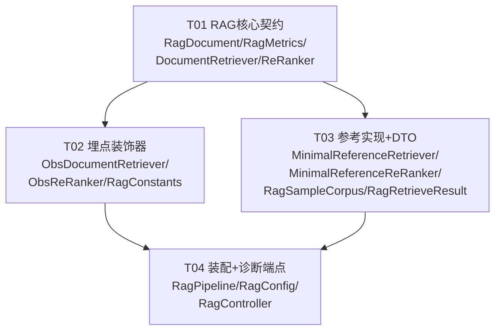

# RAG 可观测埋点层 — 系统设计文档

> 团队：`software-rag-metrics`
> 角色：架构师（Bob）
> 目标：在既有 **OTLP + MetricsRegistry** 体系上，新建 RAG 埋点层，覆盖
> **检索延迟 / 文档数 / 命中率 / 重排延迟 / Top-K 相关性** 五项指标，
> 并提供一个**最小参考检索器**以便端到端可测；整体**沿用 `ObsChatModel` 装饰器模式**。

---

## Part A：系统设计

### 1. 实现方案（Implementation Approach）

#### 1.1 难点分析

1. **主工程当前没有 RAG 检索代码**：对 `src/` 全量检索 `VectorStore / retrieve / rerank / Embedding / TopK` 均无业务实现，仅有文档与设计稿提及。因此本任务是一个**全新但自包含的埋点层**，不依赖既有检索器。
2. **"最小参考检索器"约束**：`pom.xml` 中**没有引入任何 Spring AI VectorStore / Embedding 依赖**（仅有 `spring-ai-openai` 与 `spring-ai-alibaba-graph-core`）。若依赖真实向量库需新增依赖与运行环境，违背"最小/端到端可测"初衷。因此参考检索器采用**内存确定性实现**（词面重叠打分），零外部依赖、可单测、可 Spring Boot 集成测试。
3. **与既有埋点体系对齐**：既存 `ObsChatModel` 是"装饰器 + Micrometer MeterRegistry + OTel Span + `AgentSpanContext`(ThreadLocal)"的成功范式；新指标须走集中式 `MetricsRegistry` 的 `deepflux.<domain>.<measure>` 前缀（与 `agent.* / llm.* / gen_ai.*` 隔离）。
4. **OTLP 直方图导出陷阱**：`ObsChatModel` 注释明确——Timer 必须用 `publishPercentileHistogram(true)`，否则 Micrometer OTLP 导出为 Summary，观测后端 `OtlpParser` 只解析 Histogram，导致延迟永远为 0。`MetricsRegistry.recordTimer` 已强制该选项，直接复用即可。

#### 1.2 技术选型

| 关注点 | 选型 | 理由 |
|--------|------|------|
| 埋点模式 | **装饰器（Decorator）** | 严格沿用 `ObsChatModel`：包一层 `DocumentRetriever`/`ReRanker`，业务代码零改动 |
| 指标管线 | `MetricsRegistry`（已存在，`deepflux.*` 前缀） | 统一命名、缓存、Histogram 强制；新增 `RagMetrics` 门面仅做语义封装 |
| 指标类型 | Timer（延迟）/ DistributionSummary（计数、比率、相关性） | 延迟用 Timer+直方图；文档数/命中率/相关性为分布量，用 Summary 取均值 |
| Trace | `io.opentelemetry.api.GlobalOpenTelemetry` | 与 `ObsChatModel` 同款，创建 `RAG:retrieve` / `RAG:rerank` Span |
| 业务上下文 | `AgentSpanContext`（ThreadLocal） | 复用既有解析逻辑（layer/name/intent/sessionId），缺失时回退到 retriever/reranker 名 |
| 参考检索器 | 内存 `MinimalReferenceRetriever` + `MinimalReferenceReRanker` | 零依赖、确定性、可测；`DocumentRetriever` 接口为将来接真实 VectorStore 留扩展点 |
| 端到端验证 | `RagController`（诊断端点，双重守卫）+ QA Python `test_rag.py`（读 Core `/actuator/metrics` 断言 `deepflux.rag.*`） | 不侵入既有 Agent，独立验证 5 项指标真实导出（见 §7.1） |

#### 1.3 架构风格

- **分层装饰**：`MinimalReferenceRetriever`(实现) → `ObsDocumentRetriever`(装饰) → `RagPipeline`(编排) → `RagController`(暴露)。
- 与 `ObsChatModel` 的差异点（刻意简化）：检索/重排是**同步**操作，不需要 `ObsChatModel` 的"托管 span / held-span / 流式 TTFT"复杂度，因此装饰器采用更简单的"创建 span → 执行 → finally 中 end span + record metrics"结构，但**同样的指标/Trace/上下文三件套思想**保持一致。

---

### 2. 文件清单（File List）

所有新增类置于包 `com.mobileagent.app.observability.rag`；测试置于 `src/test/java/com/mobileagent`。

```
src/main/java/com/mobileagent/app/observability/rag/
├── RagDocument.java              # 数据模型：检索文档（含相关性 score 0..1）
├── RagRetrieveResult.java        # 端到端结果 DTO（供 Pipeline/Controller 使用）
├── RagConstants.java             # 指标名 + Tag Key 常量（共享知识）
├── RagMetrics.java               # 指标门面：封装 MetricsRegistry，统一 deepflux.rag.* 命名
├── DocumentRetriever.java        # 契约接口（映射 ChatModel 的角色）
├── ReRanker.java                 # 契约接口
├── MinimalReferenceRetriever.java   # 最小参考检索器（内存，词面重叠打分）
├── MinimalReferenceReRanker.java    # 最小参考重排器（内存，score+metadata 加权）
├── ObsDocumentRetriever.java     # 埋点装饰器：检索延迟/文档数/命中率 + Span（沿用 ObsChatModel）
├── ObsReRanker.java              # 埋点装饰器：重排延迟/Top-K相关性 + Span
├── RagSampleCorpus.java          # 种子语料（注入参考检索器，供测试/E2E）
├── RagPipeline.java              # 编排：retrieve → rerank，返回 RagRetrieveResult
├── RagConfig.java                # Spring 装配：构造上述 Bean 并套装饰器
└── RagController.java            # 诊断 REST 端点 /api/v1/rag/retrieve（E2E 用，双重守卫：@Profile("dev") + observability.rag.reference.enabled 默认 false）

src/test/java/com/mobileagent/
└── (无工程师侧 Java 测试；端到端验证由 QA 以 Python 完成，见 §7.1)
```

---

### 3. 数据结构与接口（Data Structures and Interfaces）

> 完整类图见 `docs/class-diagram.mermaid`，以下给出关键契约的语义说明。

**指标定义（5 项核心 + 2 项防御性 error 计数）**

| 指标（最终名 = `deepflux.` + 下表） | 类型 | 标签（低基数，符合 §2.4 预算） | 语义 |
|------|------|------|------|
| `rag.retrieval.latency` | Timer（Histogram） | `collection`, `retriever` | 检索耗时（ms） |
| `rag.retrieval.documents` | DistributionSummary | `collection`, `retriever` | 每次检索返回的文档数（取均值=平均召回文档数） |
| `rag.retrieval.hit_rate` | DistributionSummary | `collection`, `retriever` | 命中率：最佳返回分 ≥ 相关性阈值记 1.0，否则 0.0；下游均值即命中率 |
| `rag.rerank.latency` | Timer（Histogram） | `collection`, `reranker` | 重排耗时（ms） |
| `rag.topk.relevance` | DistributionSummary | `collection`, `reranker` | Top-K 文档平均相关性（0..1） |
| `rag.retrieval.error` | Counter | `retriever`, `error_type` | 检索异常计数（防御，镜像 `llm.error.count`） |
| `rag.rerank.error` | Counter | `reranker`, `error_type` | 重排异常计数（防御） |

> 说明：**命中率** 因参考检索器无人工标注，采用"是否至少召回一篇相关性达标文档"的二值定义；接真实检索器时，`score` 可由向量相似度/重排模型给出，定义不变。

**关键接口（伪代码）**

```java
public interface DocumentRetriever {
    List<RagDocument> retrieve(String query, int topK);
}

public interface ReRanker {
    List<RagDocument> rerank(String query, List<RagDocument> candidates, int topK);
}

public class RagDocument {
    private String id;
    private String content;
    private Map<String, Object> metadata;   // 如 source/title/priority
    private double score;                    // 相关性 0..1
}

@Component
public class RagMetrics {
    private final MetricsRegistry metricsRegistry;   // 走 deepflux.* 前缀
    public void recordRetrieval(long latencyMs, int docCount, double hitRate, String... tags);
    public void recordRerank(long latencyMs, double topKRelevance, String... tags);
    public void recordRetrievalError(String retriever, String errorType);
    public void recordRerankError(String reranker, String errorType);
}
```

---

### 4. 程序调用流（Program Call Flow）

> 完整时序图见 `docs/sequence-diagram.mermaid`。

**端到端 happy-path（`RagController → RagPipeline → ObsDocumentRetriever → MinimalReferenceRetriever → ObsReRanker → MinimalReferenceReRanker`）**

1. `RagController.retrieve(query, topK)` 调用 `RagPipeline.retrieveAndRerank`。
2. `RagPipeline` 调 `ObsDocumentRetriever.retrieve`：
   - 解析 `AgentSpanContext`（缺失回退 `defaultAgentLayer="RAG"`, `defaultAgentName=retrieverName`）；
   - 建 `RAG:retrieve` Span；
   - `delegate.retrieve`（即 `MinimalReferenceRetriever`）词面重叠打分返回 `List<RagDocument>`；
   - `rag.retrieval.latency`、`rag.retrieval.documents`、`rag.retrieval.hit_rate` 经 `RagMetrics` 落 `MetricsRegistry`；
   - `span.end()`。
3. `RagPipeline` 调 `ObsReRanker.rerank`：
   - 建 `RAG:rerank` Span；
   - `delegate.rerank`（`MinimalReferenceReRanker`）按 `score + metadata 加权` 重排取 topK；
   - `rag.rerank.latency`、`rag.topk.relevance` 落库；
   - `span.end()`。
4. `RagPipeline` 组装 `RagRetrieveResult` 返回。

**异常路径**：装饰器 `try/catch` 包裹，`recordRetrievalError/recordRerankError` + `span.setStatus(ERROR)` + `span.recordException` + `span.end()`，再原样抛出（不影响主业务，与 `ObsChatModel` 一致）。

> **诊断端点守卫**：`RagController` 仅在 `@Profile("dev")` 且 `observability.rag.reference.enabled=true` 时装配/可用；生产环境该端点不暴露（404/禁用）。验证由 QA 以 Python 触发（见 §7.1）。

---

### 5. 不明确点 / 假设（Anything UNCLEAR）

> **状态（2026-07-19 主理人拍板）**：U1–U5 全部确认，采用下方「最小 / 不侵入」默认方案。
> - U1：仅交付内存参考实现，不接真实 VectorStore（接口留扩展点）。
> - U2：指标前缀用 `deepflux.rag.*`（走 `MetricsRegistry`，与 `deepflux.workflow.*` 一致）。
> - U3：埋点层独立，经诊断端点验证，不侵入 ChatService/L1 路由。
> - U4：hit_rate 二值 0/1（下游取均值）。
> - U5：诊断端点**双重守卫**（`@Profile("dev")` + `observability.rag.reference.enabled` 默认 false）。
> - **验证口径调整**：不做 Java `@SpringBootTest`，改由 QA 新建 `test/obs_v4_tests/test_rag.py`（TC-RAG-001/002/003）读 Core `/actuator/metrics` 断言 `deepflux.rag.*`，并注册进 `run_all.py` 的 `rag` 模块（见 §7.1）。

| # | 点 | 假设 / 待确认 |
|---|----|--------------|
| U1 | **是否接真实 VectorStore** | 本次仅交付"最小参考检索器"（内存）。`DocumentRetriever` 接口即扩展点，后续接 `PgVector`/`Redis` VectorStore 时仅需新增一个实现并在 `RagConfig` 替换 Bean。**需团队确认是否本期就要接真实库**（若需要，将新增 `spring-ai-...-store` + Embedding 依赖，并影响 T03）。 |
| U2 | **指标前缀** | 采用既有 `MetricsRegistry` 约定的 `deepflux.rag.*`（与 `agent.*/llm.*` 隔离）。如需与 `ObsChatModel` 的裸 `llm.*` 风格一致改为裸 `rag.*`，请告知。 |
| U3 | **是否侵入既有 Agent 调用链** | 埋点层保持独立（经 `RagController` 诊断端点 + QA Python 验证），**不**强制接到 `ChatService`/L1 路由。如需在真实 RAG 问答链路中自动埋点，请确认接入点（建议在 `ChatService` 或 L1 改写前插入 `RagPipeline` 调用 + `AgentSpanContext.set`）。 |
| U4 | **命中率定义** | 采用"是否召回相关性达标文档"的二值法（参考检索器无标注）。接真实检索器后可换为"Top-K 中相关文档占比"。 |
| U5 | **诊断端点是否保留到生产** | **双重守卫**：① `@Profile("dev")` 仅 dev 装配；② `@Value("${observability.rag.reference.enabled:false}")` 配置开关默认 false，关闭时端点返回 404/禁用。生产默认不暴露。 |

---

## Part B：任务分解（Task Decomposition）

### 6. 依赖包（Required Packages）

复用既有依赖，**无需新增**第三方包：

```
- org.springframework.boot:spring-boot-starter-actuator   # 已存在：MeterRegistry / OTLP 导出
- io.micrometer:micrometer-registry-otlp                  # 已存在：OTLP 指标导出
- io.opentelemetry:opentelemetry-api:1.43.0               # 已存在：GlobalOpenTelemetry / Span
- org.springframework.ai:spring-ai-openai                # 已存在：Spring AI 基础（接口风格参考）
- org.projectlombok:lombok                               # 已存在：@Slf4j / 简化 POJO
- org.springframework.boot:spring-boot-starter-test      # 已存在（备用；本期 RAG 端到端验证改由 QA Python 完成，不新增 Java 测试）
```

> 若 U1 决定接真实 VectorStore，将新增如 `spring-ai-{pgvector|redis}` 与 embedding starter（不在本期任务内）。

### 7. 任务清单（按依赖排序，≤5 个，每组 ≥3 文件）

> 约定：所有类包名 `com.mobileagent.app.observability.rag`（测试 `com.mobileagent`）。

#### T01 — RAG 指标埋点核心契约（P0，无依赖）
- **源文件**：`RagDocument.java`, `RagMetrics.java`, `DocumentRetriever.java`, `ReRanker.java`
- **依赖**：无
- **说明**：数据模型 + 指标门面（封装 `MetricsRegistry`） + 两个契约接口。是整个埋点层的基础。

#### T02 — RAG 检索/重排埋点装饰器（P0，依赖 T01）
- **源文件**：`ObsDocumentRetriever.java`, `ObsReRanker.java`, `RagConstants.java`
- **依赖**：T01
- **说明**：两个装饰器（镜像 `ObsChatModel`：解析 `AgentSpanContext` → 建 Span → 调 delegate → 记录 5 项指标 → span.end + 异常防御）；`RagConstants` 固化指标名与 Tag Key。

#### T03 — 最小参考检索器 / 重排器 + 结果 DTO（P1，依赖 T01）
- **源文件**：`MinimalReferenceRetriever.java`, `MinimalReferenceReRanker.java`, `RagSampleCorpus.java`, `RagRetrieveResult.java`
- **依赖**：T01
- **说明**：内存确定性参考实现（零外部依赖，端到端可测），种子语料 Bean，结果 DTO。**与 T02 可并行开发**（都只依赖 T01）。

#### T04 — Spring 装配 + 端到端验证（P1，依赖 T02、T03）
- **源文件**：`RagPipeline.java`, `RagConfig.java`, `RagController.java`
- **依赖**：T02, T03
- **说明**：`RagConfig` 把参考实现套上装饰器并组装 `RagPipeline`；`RagController` 暴露诊断端点
  `/api/v1/rag/retrieve`（**双重守卫**：`@Profile("dev")` + `observability.rag.reference.enabled` 默认 false）。
  **端到端验证不由工程师做 Java 测试**，改由 QA 新建 `test/obs_v4_tests/test_rag.py`
  （TC-RAG-001/002/003，见 §7.1），触发一次参考检索后断言 Core `/actuator/metrics` 出现 `deepflux.rag.*`，
  并注册进 `run_all.py` 的 `rag` 模块。

### 7.1 端到端验证口径（QA / Python，非工程师任务）

遵循项目定型口径（ADR-2026-07-19 D-5 / T-K / T-J）：**不**做 Java `@SpringBootTest`，
改由 QA 以 Python 读 **Core `/actuator/metrics`**（点号命名）断言埋点生效。

**前置**：Core 以 dev 环境 + `observability.rag.reference.enabled=true` 启动
（否则诊断端点 404，用例 **SKIP 不假通过**，与 `test_metrics.py` 口径一致）。

**交付（QA 负责）**：
- 新建 `test/obs_v4_tests/test_rag.py`，复用 `common.py` 的 `ApiClient(CORE_URL)`、`TestRunner`；
- 在 `run_all.py` 的 `MODULES` 列表追加 `"test_rag"`。

**用例（TC-RAG-001/002/003）**：

| 用例 | 动作 | 断言 |
|------|------|------|
| TC-RAG-001 | GET `CORE_URL/api/v1/rag/retrieve?query=转账&topK=3` | 200 且返回非空 `documents`；端点不可用（404/禁用）则 SKIP 并给人工核查口径 |
| TC-RAG-002 | 触发后等待 ~2s，GET `CORE_URL/actuator/metrics` | `names` 含 `deepflux.rag.retrieval.latency`、`deepflux.rag.retrieval.documents`、`deepflux.rag.retrieval.hit_rate`（可进一步 GET 单 meter 确认 `measurements` 非空） |
| TC-RAG-003 | 同上 | `names` 含 `deepflux.rag.rerank.latency`、`deepflux.rag.topk.relevance`（重排延迟 + Top-K 相关性） |

> 注意：指标名在 actuator 中为**点号**（`deepflux.rag.retrieval.latency`），非 prometheus 下划线；
> 业务指标在 **Core(8080)** 而非 backend(9090)，探测指向 `CORE_URL`。

### 8. 共享知识（Shared Knowledge）

```
- 指标全部走 MetricsRegistry 的 deepflux.* 前缀：代码中只写 "rag.retrieval.latency" 等，
  最终名 = "deepflux.rag.retrieval.latency"。
- Timer 类指标（retrieval.latency / rerank.latency）由 MetricsRegistry.recordTimer 强制
  publishPercentileHistogram(true)，可被观测后端 OtlpParser 解析为 Histogram（否则延迟=0）。
- Tag 基数预算（沿用 §2.4）：禁止 user.id / session.id / trace.id / 原始 query / 原始金额 进入
  Metric Tag。RAG 指标仅用 collection / retriever / reranker / error_type（低基数）。
- query 写入 Span 属性前必须截断 ≤2000 字符（与 ObsChatModel.setSpanAttribute 一致）。
- 相关性 score 归一化到 0..1；hit_rate 为二值（1.0/0.0），下游取均值即得命中率。
- 装饰器内部 try/catch 包裹指标记录，异常原样抛出，不吞业务异常（与 ObsChatModel.safeRecord 一致）。
- 业务上下文解析：优先 AgentSpanContext(ThreadLocal)，缺失时回退 defaultAgentLayer="RAG" /
  defaultAgentName=<retriever|reranker 名>，确保 Span 始终带 agent.layer，不退化。
```

### 9. 任务依赖图（Task Dependency Graph）



> `T02` 与 `T03` 互不依赖，可并行；`T04` 在两者就绪后装配并验证。共 4 个任务、15 个文件，符合"≤5 任务、每组 ≥3 文件"。
