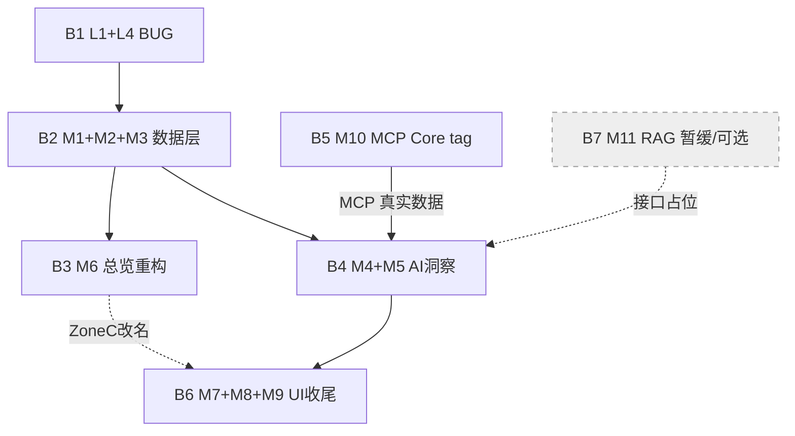

# 可观测 V4 — V23 实现增量任务分解（0723）

> 作者：高见远（Architect）｜日期：2026-07-23
> 文档定位：**施工图纸**——供工程师寇豆码直接落码使用。本文件不重复设计评审，仅把《可观测V4-V23-实现增量PRD-0723.md》+《可观测V4-详细设计-0719.md》§8/§8.5/§9 +《可观测V4-交付排期-0719.md》§⑥/§⑦ 拆成「按 Batch 分批、含真实文件路径 / 接口签名 / DDL / 验收点」的可执行任务。
> 适用范围：Core(8080) → OTel Collector(4318) → Backend(9090/H2) → React 前端大屏 v23。

---

## 0. 关键事实速查（直接采用，勿重复设计评审）

- **真·新增仅 2 前端埋点**：`mbank_card_click`（业务引导办理）、`mbank_human_click`（转人工）→ 新建 `business_events` 表 + `POST /api/v1/business-events` + `BusinessEventQueryService`（前端埋点 + 入库 + 聚合）。
- **MCP per-tool**：Core `recordToolCallCount(toolName, "success", Map.of("category","mcp"))` 轻量 tag（复用 `ToolStatsService` 管线，零新增后端摄入）。
- **4 项"待接入"实为已连线**（重路由比率 / 业务完成率 / 意图识别综合正确率 L0-L1 / 意图改写正确率 L1）：本期仅 UI 显式分层 / 改名 / 统一口径，**不新增后端管线**。
- **W3 遗留本期做**：L1（B-A，方案A，前端 0.3）、L4（`start-all.ps1` 编译段，DevOps 0.2）。B-B/B-C 已闭环不做。
- **M11 RAG 本期暂缓**（依赖最多、生产链路未接），本分解给出接口占位但**不排进必做 Batch**（P2 可选）。
- **主理人已替用户拍板的 3 个待确认问题默认决策**（见 §8，最终仍请用户确认）：
  1. M11 本期不做，排最后可选；任务分解给出接口占位但不排必做 Batch。
  2. 埋点 schema：`business_events` DDL **补 `source` 维度**（可 groupBy）。
  3. MCP P95 口径：**优先让 Core 补 `MCP:<tool>` span，由 `spans` 表计算 P95；seed 注入作为兜底**。

---

## 1. 批次总览与依赖

| Batch | 任务 | 性质 | 人日 | 依赖前置 Batch |
|---|---|---|---|---|
| **B1（热身）** | L1 + L4 | BUG 修复（小/独立/不阻塞） | 0.5 | 无 |
| **B2（数据层）** | M1 + M2 + M3 | 新指标全链条 + 已连线显式化 | 1.5 | 无 |
| **B3（总览）** | M6 | 总览重构（吃 B2 数据） | 2.0 | B2 |
| **B4（AI 洞察）** | M4 + M5 | 智能诊断 TAB + 外部调用 TAB | 3.0 | B2（M5 另依赖 B5 的 MCP 数据，可 seed 占位） |
| **B5（MCP）** | M10 | MCP per-tool（Core 主体，B4 初即并行启动） | 2.0 | 无（Core `category=mcp` tag）；B4 阻塞其 MCP 子视图 |
| **B6（UI 收尾·并行）** | M7 + M8 + M9 | trace 跳转 / V16 弹窗 / 性能漏斗视觉 | 2.5 | 可全程并行（B3 起） |
| **B7（RAG·暂缓）** | M11 | RAG Zone E + Core 生产接入 | 1.0 | 依赖最多，本期可选（P2） |

**人日汇总**：
- 必做合计（B1–B6）= **11.5 人日**（前端 8.0 / 后端 1.5 / Core 1.0 / DevOps 0.2 + 前端并行余量）。
- 可选（+B7 M11）= **+1.0 人日**，合计 **12.5 人日**，与 PRD《增量PRD-0723》§3 口径一致（M 系列 12.0 + W3 遗留 0.5）。
- 与排期 §⑥.2 角色口径 ≈14 人日的差额为前端并行余量（envelope），不影响任务粒度。

**依赖箭头（关键路径）**：
```
L1/L4 ──▶ M1/M2/M3 ──▶ M6 ──▶ (M4 + M5)
                                │
            M10(Core category=mcp) ──▶ M5(MCP 子视图)
M7/M8/M9（全程可并行，纯前端、不新增后端管线）
M11（P2 可选，接口占位，不进必做关键路径）
```

---

## 2. 逐 Batch 任务分解

### B1（热身·BUG 修复）— L1 + L4 ｜ 0.5 人日

**目标**：先收口 W3 遗留 BUG，零外部依赖，不阻塞任何 M 系列。

#### 涉及文件
| 操作 | 相对路径 | 说明 |
|---|---|---|
| 修改 | `observability/frontend/src/components/trace/SpanTree.jsx` | `:495` 标题按真实子列表动态推导 + 修正 `isFollowUp` 心智模型（L1，0.3） |
| 修改 | `start-all.ps1` | `:317` 编译段 `-DskipTests` → `-Dmaven.test.skip=true`（L4，0.2，DevOps） |

#### 关键改动点
- **SpanTree.jsx:495（方案A）**：
  - 原硬编码"含 2 个 LLM"标题 → 改为遍历当前 span 的真实子 span 列表 `children` 动态推导标题（如"含 N 个 LLM 调用 / N 个工具调用"）。
  - 修正 `isFollowUp` 假设：后端在"无活跃 agent"时短路 `return SWITCH`（跳过 L1-LLM1，非 L1-LLM2），前端 `isFollowUp` 判定方向需与后端一致（可跳过的是 L1-LLM1）。
  - 验收前提：无活跃 agent 时前端标题与子 span 列表一致、无错位。
- **start-all.ps1:317**：`-DskipTests` 改为 `-Dmaven.test.skip=true`，避免构造器签名变更导致测试编译失败时 BUILD FAILURE 进清理。

#### 依赖前置 Batch
无。

#### 验收点（对应 PRD L1/L4）
- L1① `SpanTree.jsx:495` 标题按真实子列表动态推导，不再硬编码"含 2 个 LLM"。
- L1② `isFollowUp` 心智模型与后端短路方向相反问题已修正，无活跃 agent 时标题与子 span 列表一致、无错位。
- L4① `start-all.ps1:317` 编译段为 `-Dmaven.test.skip=true`。
- L4② 构造器签名变更导致测试编译失败时不再 BUILD FAILURE 进清理。

---

### B2（数据层·新指标全链条）— M1 + M2 + M3 ｜ 1.5 人日

**目标**：打通 2 个真实业务埋点（前端埋点 + `business_events` 表 + ingestion 端点 + 聚合 Service），并把 4 项"已连线"指标在后端/前端显式分层/改名/统一口径。

#### 涉及文件
| 操作 | 相对路径 | 说明 |
|---|---|---|
| 新建 | `observability/backend/src/main/java/com/observability/model/BusinessEvent.java` | JPA 实体，映射 `business_events` |
| 新建 | `observability/backend/src/main/java/com/observability/repository/BusinessEventRepository.java` | `JpaRepository<BusinessEvent, Long>` + 聚合查询方法 |
| 新建 | `observability/backend/src/main/java/com/observability/service/BusinessEventService.java` | `ingest(BusinessEventIngestRequest)` 入库 |
| 新建 | `observability/backend/src/main/java/com/observability/service/BusinessEventQueryService.java` | `getEventCount` / `aggregate` |
| 新建 | `observability/backend/src/main/java/com/observability/controller/BusinessEventController.java` | `POST /api/v1/business-events` + `GET /api/v1/business-events/agg` |
| 修改 | `observability/backend/src/main/resources/schema.sql` | 追加 `business_events` DDL + seed（1,284 / 96） |
| 修改 | `observability/backend/src/main/java/com/observability/service/AIInsightsService.java` | `computeIntentAccuracy` 分层 VO + `analyzePerformance` 返回 L0/L1 结构（M3 后端部分，0.5 内） |
| 修改 | `observability/frontend/src/services/businessEvents.js` | 新建：前端埋点 `track` 封装 + 查询 client（M1/M2 前端，1.0 内） |
| 修改 | `observability/frontend/src/pages/DashboardPage.jsx` | Zone C/D 新卡读 `BusinessEventQueryService` + 真实数据（M1/M2/M3 前端注入点，详细在 B3） |

> 注：M1/M2 的"前端卡片展示"在 B3（M6 总览）落地；B2 负责埋点 SDK、入库、聚合、DDL、seed 与后端分层 VO。M3 的"UI 改名/分层"也在 B3，但后端 `agent.intent.accuracy(layer)` 等已闭环，B2 仅需确认 VO 透出 L0/L1（§8.5.4）。

#### 关键接口 / 类 / 方法签名

**BusinessEventController（新建）**
```java
@RestController
@RequestMapping("/api/v1/business-events")
public class BusinessEventController {
    // M1/M2：前端埋点入库
    @PostMapping
    public ApiResponse<Void> ingest(@RequestBody @Valid BusinessEventIngestRequest req);

    // 聚合（按维度 groupBy）
    @GetMapping("/agg")
    public ApiResponse<List<BusinessEventAggRow>> agg(
            @RequestParam String event,
            @RequestParam(required = false) String groupBy,
            @RequestParam(required = false) String from,
            @RequestParam(required = false) String to);
}
```

**POST /api/v1/business-events — request JSON schema**
```json
{
  "session_id": "s-20260723-001",
  "trace_id":   "t-8f3a...",
  "user_id":    "u-10086",
  "agent":      "bankAssistant",
  "event_type": "mbank_card_click | mbank_human_click",
  "card_type":  "credit_card | debit_card | loan | wealth | null",
  "source":     "chat_bar | card_menu | timeout | null",
  "channel":    "app | miniprogram | null",
  "ts":         "2026-07-23T10:00:00+08:00"
}
```
- `mbank_card_click`：必传 `card_type`，`source` 可空。
- `mbank_human_click`：必传 `source`（chat_bar=对话栏转人工 / card_menu=卡片菜单 / timeout=超时自动），`card_type` 可空。
- **response**：`{ "code": 0, "message": "ok", "data": null }`（统一 `ApiResponse` 契约，见 §7）。

**BusinessEventService（新建）**
```java
@Service
public class BusinessEventService {
    public void ingest(BusinessEventIngestRequest req); // 映射实体 → repository.save
}
```

**BusinessEventQueryService（新建）**
```java
@Service
public class BusinessEventQueryService {
    // M1/M2 验收核心方法
    long getEventCount(String eventType, Instant from, Instant to);
    // 按 groupBy 维度聚合（event/session_id/trace_id/agent/card_type/source 均可）
    List<BusinessEventAggRow> aggregate(String eventType, String groupBy, Instant from, Instant to);
}
// BusinessEventAggRow { String groupKey; long count; }
```

**M3 后端部分（AIInsightsService，§8.5.4）**
```java
// 既有方法已存在，仅扩展返回结构为分层
Map<String,Object> computeIntentAccuracy(String layer); // layer=null→overall; "L0"/"L1"→分层
// analyzePerformance() 内改为：
// { overall:{correct,total,rate}, L0:{...}, L1:{...} }
```

#### 数据 DDL（`business_events` 建表 SQL，H2 语法，含 `source` 维度）
```sql
CREATE TABLE business_events (
    id          BIGINT AUTO_INCREMENT PRIMARY KEY,
    session_id  VARCHAR(64),
    trace_id    VARCHAR(64),
    user_id     VARCHAR(64),
    agent       VARCHAR(64),
    event_type  VARCHAR(32) NOT NULL,   -- mbank_card_click / mbank_human_click
    card_type   VARCHAR(32),            -- 仅 mbank_card_click：卡片业务类型
    source      VARCHAR(32),            -- 仅 mbank_human_click：chat_bar|card_menu|timeout（可 groupBy）
    channel     VARCHAR(32),
    created_at  TIMESTAMP
);
CREATE INDEX idx_be_type_time ON business_events(event_type, created_at);
CREATE INDEX idx_be_sid       ON business_events(session_id);
CREATE INDEX idx_be_src       ON business_events(event_type, source);  -- 按 source 聚合索引

-- seed（演示真值，北京时间）：mbank_card_click=1,284 / mbank_human_click=96
-- INSERT INTO business_events(...) VALUES (...);  -- 由 SchemaInitializer 启动执行（idempotent）
```

#### 依赖前置 Batch
无（独立新建）。

#### 验收点（对应 PRD M1/M2/M3）
- M1① `business_events` 表按 §8.1.9（已补 `source`）DDL 落库。
- M1② 前端 `track('mbank_card_click', {session_id, trace_id, agent, card_type, ts})` 在卡片/办理按钮点击触发。
- M1③ `POST /api/v1/business-events` 成功写入。
- M1④ `BusinessEventQueryService.getEventCount('mbank_card_click', from, to)` 返回与入库一致计数。
- M1⑤ Zone D 业务效果卡②显示（seed 1,284 通过）——展示在 B3。
- M2 同 M1，但 `event_type=mbank_human_click`；Zone D 卡③显示（seed 96 通过）。
- M3① 准确率 TAB / Zone C 显式展示「综合正确率 + L0(98.2%) / L1(94.2%)」分层 sub。
- M3② 意图改写正确率(L1) 显式展示 91.5%。
- M3③ 重路由比率 14.2% 接入 >20% 告警规则（后端已闭环，前端显式启用）。
- M3④ 全文「Reroute 率」统一改名「重路由比率」。

---

### B3（总览重构）— M6 ｜ 2.0 人日

**目标**：重构总览大屏为「诊断摘要 4 卡 + Zone A-E」，吃 B2 数据（Zone C/D 新卡），删除 5 项冗余。纯前端（不新增后端管线）。

#### 涉及文件
| 操作 | 相对路径 | 说明 |
|---|---|---|
| 修改 | `observability/frontend/src/pages/DashboardPage.jsx` | 诊断摘要 4 卡替换 + Zone C/D 新卡 + 删 5 项 |
| 修改 | `observability/frontend/src/components/dashboard/DiagnosisSummary4Cards.jsx` | 新建或改：4 卡组件（综合正确率含L0/L1 / 改写正确率L1 / 重路由比率 / 业务完成率），`itab('diagnosis')` 下钻 |
| 修改 | `observability/frontend/src/components/dashboard/ZoneCSemantic.jsx` | 新建：语义质量 3 卡（读 `getRealtime`） |
| 修改 | `observability/frontend/src/components/dashboard/ZoneDBusiness.jsx` | 新建：业务效果 3 卡（读 `BusinessEventQueryService` + `getRealtime`） |
| 修改 | `observability/frontend/src/services/insights.js` | 确认 `getRealtime` 已暴露 businessCompletionRate / rerouteRate / intent L0/L1 |

#### 关键接口（前端取数）
- `MetricsQueryService.getRealtime()`（后端已有）：`businessCompletionRate` / `rerouteRate` / 意图 L0/L1 准确率。
- `BusinessEventQueryService.getEventCount('mbank_card_click'|'mbank_human_click', from, to)`（B2 新建）。
- TAB 下钻：`itab('diagnosis')` → 跳 AI 洞察「智能诊断」TAB（见 §7 导航函数复用清单）。

#### 诊断摘要 4 卡 / Zone 改动清单（来自 PRD §4.1 / 详细设计 §8.3.1）
- **诊断摘要 4 卡**：意图识别综合正确率(含 L0/L1) / 意图改写正确率(L1) / 重路由比率 / 业务完成率；点击下钻 `itab('diagnosis')`。
- **Zone C 语义质量 3 卡（新增）**：意图识别综合正确率 / 意图改写正确率(L1) / 重路由比率；读 `getRealtime`。
- **Zone D 业务效果 3 卡（新增）**：业务完成率 / 业务引导办理次数(`mbank_card_click`) / 转人工次数(`mbank_human_click`)；读 `BusinessEventQueryService`。
- **删除 5 项**：数据健康 78% + 顶部 health-pill、请求 Token 趋势、Agent 分布、性能瓶颈详情、底部慢调用 TopN（移入智能诊断 TAB 条件触发区，见 B4）。
- **Zone A/B/E 保留**，仅小调整。

#### 依赖前置 Batch
B2（M1/M2 Zone D 新卡数据；M3 Zone C 分层）。

#### 验收点（对应 PRD M6）
- M6① 诊断摘要 4 卡替换原 AI 健康概览，可下钻 `itab()`。
- M6② 删除 5 项（数据健康 + health-pill、Token 趋势、Agent 分布、性能瓶颈详情、慢调用 TopN）。
- M6③ Zone C 语义质量 3 卡 + Zone D 业务效果 3 卡 新增并读真实数据。
- M6④ Zone A/B/E 保留。

---

### B4（AI 洞察核心）— M4 + M5 ｜ 3.0 人日

**目标**：AI 洞察页新增首 TAB「智能诊断」（合并诊断驾驶舱 + 条件触发区），并把「智能体/工具」TAB 重构为「外部调用」Segmented（统一 InvocationRecord 抽象）。**M10 在 B4 初即并行启动**（B5），M5 MCP 子视图先用 seed 占位、B5 合入后接真实数据。

#### 涉及文件
| 操作 | 相对路径 | 说明 |
|---|---|---|
| 新建 | `observability/frontend/src/components/insights/DiagnosisTab.jsx` | 智能诊断 TAB（调 insights 6 端点），M4 前端 0.5 |
| 修改 | `observability/frontend/src/pages/AIInsightsPage.jsx` | TAB 列表 6→7（新增「智能诊断」首 + 「外部调用」重命名），M4/M5 前端 |
| 修改 | `observability/backend/src/main/java/com/observability/service/InsightsEngineService.java` | 条件触发区扩展（slowSessionSummaries / clusterUnsatisfied / computeReport + 新 VO），M4 后端 1.0 |
| 新建 | `observability/backend/src/main/java/com/observability/model/vo/SlowSessionBlock.java` | `triggered; p90Seconds; List<SlowSessionRow>` |
| 新建 | `observability/backend/src/main/java/com/observability/model/vo/UnsatisfiedBlock.java` | `triggered; rate; total; unsatisfied; List<UnsatisfiedCluster>` |
| 新建 | `observability/backend/src/main/java/com/observability/service/InvocationRecordService.java` | 外部调用统一抽象（**不扩展** ToolStatsService），M5 后端 0（复用既有数据） |
| 新建 | `observability/backend/src/main/java/com/observability/controller/InvocationRecordController.java` | `GET /api/v1/invocations?category=*` |
| 新建 | `observability/frontend/src/components/insights/ExternalCallTab.jsx` | Segmented 全部/RAG/工具/SKILL/MCP + 统一调用记录 |
| 修改 | `observability/frontend/src/components/insights/ToolCallTab.jsx` | 重构为外部调用 TAB 的「工具函数」子视图；删「智能体调用统计（按子图）」chart |
| 修改 | `observability/frontend/src/components/insights/RagPanel.jsx` | RAG 子面板背景改正常卡片 |

#### 关键接口 / 类 / 方法签名

**M4 — InsightsEngineService 条件触发区（§8.5.3，L1 确定性聚合，符合 readonly 门禁）**
```java
// 改造 slowSessionSummaries(from, to) → 返回 SlowSessionBlock
public SlowSessionBlock slowSessionSummaries(Instant from, Instant to) {
    double p90 = computeP90(durationSeconds in [from,to]); // 会话 durationSeconds 的 P90
    if (p90 > 3.0) { /* 填充 top-N 慢会话 + 根因；triggered=true */ }
    else { rows=[]; triggered=false; }
}
// 改造 clusterUnsatisfied(from, to) → 返回 UnsatisfiedBlock
public UnsatisfiedBlock clusterUnsatisfied(Instant from, Instant to) {
    long total = sessionTotal; long unsat = unsatisfiedCount;
    double rate = (double)unsat/total;
    if (rate > 0.10) { /* 填充共性聚类；triggered=true */ }
    else { clusters=[]; triggered=false; }
}
// computeReport() 包裹对象暴露触发标志
report.put("slowSessions", rows);            put("slowSessionsTriggered", trig); put("slowSessionsP90", p90);
report.put("unsatisfied", clusters);         put("unsatisfiedTriggered", trig); put("unsatisfiedRate", rate);
```
- 既有 6 端点保持不变：`/ai/insights-report` `/ai/insights/actions` `/ai/insights/bottlenecks` `/ai/insights/root-cause/{id}` `/ai/insights/unsatisfied`（已含）；新增触发标志仅扩展 report VO。
- 前端 `DiagnosisTab` 读 `*Triggered`：`false` 隐藏卡片（或中性占位），`true` 渲染。

**M5 — InvocationRecordService（§8.5.1，新建，不扩展 ToolStatsService）**
```java
@Service
public class InvocationRecordService {
    List<InvocationRecord> list(String category, String provider, Range range);
    InvocationRecordSummary summary(String category, Range range);
    // 四源映射（内部）
    // tool  ← ToolCall 实体(tool_calls 表) 或 metrics_agg agent.tool.call.* 按 tool_name
    // rag   ← metrics_agg deepflux.rag.call.{count,duration,error} 按 rag_stage
    // skill ← metrics_agg agent.skill.outcome(result) + agent.skill.duration 按 skill_name
    // mcp   ← metrics_agg agent.tool.call.* 且 tags.category=="mcp" 按 tool_name（B5 供给）
    Double computeMcpP95(String toolName, Range range); // 见 B5 口径
}
// InvocationRecord VO（归一）
// { provider; category(rag|tool|skill|mcp); name; callCount; successCount; failCount;
//   successRate(查询期算); avgDurationMs; p95DurationMs(Double→NaN 时前端显 "—"); lastError; aggWindow; ts }
```
**REST**：`GET /api/v1/invocations?category={all|rag|tool|skill|mcp}`（单端点供给 4 段 Segmented）。
- `category=all` → 四类合并；`mcp` → 仅 `category=mcp` 子集（B5 数据就绪后真实，否则 seed 占位）。

#### 依赖前置 Batch
B2（M3 Zone C 数据、业务完成率等）；M5 另依赖 **B5（M10）** 提供 MCP 真实数据，B4 阶段 MCP 子视图用 seed 占位。

#### 验收点（对应 PRD M4/M5）
- M4① `AIInsightsPage` 新增首 TAB「智能诊断」，调 insights 6 端点。
- M4② 诊断摘要条 + TOP5 + 三列诊断卡（性能/准确率/转化）+ 瓶颈可视化渲染。
- M4③ 条件触发区：慢会话根因（P90>3s）与不满意共性（>10%）按 `*Triggered` 显隐。
- M4④ TOP5 紧凑化。
- M5① 新增 `InvocationRecordService`（不扩展 `ToolStatsService`）。
- M5② 外部调用 TAB Segmented 全部/RAG/工具函数/SKILL/MCP，统一 InvocationRecord 表。
- M5③ `GET /api/v1/invocations?category={all|rag|tool|skill|mcp}` 单端点供给 4 段。
- M5④ 删除「智能体调用统计（按子图）」chart。
- M5⑤ RAG 子面板背景改正常卡片。

---

### B5（MCP per-tool）— M10 ｜ 2.0 人日

**目标**：Core MCP 客户端包装层为调用补 `category=mcp` tag（复用 `ToolStatsService` 管线，零新增后端摄入），后端 `InvocationRecordService` 按 `category` 切分聚合 MCP，前端外部调用 TAB 的 MCP Segmented 子页接真实数据（dev/seed）。**B4 初即启动，与 B4 并行。**

#### 涉及文件
| 操作 | 相对路径 | 说明 |
|---|---|---|
| 修改 | `mobile-ai-bank-demo/src/main/java/com/mobileagent/app/observability/ObservabilityMetrics.java` | 扩展 `recordToolCallCount` / `recordToolCallDuration` 支持 `extraTags` |
| 修改 | `mobile-ai-bank-demo/src/main/java/com/mobileagent/app/observability/mcp/McpToolCallback.java`（或 `ObsMcpClient.java`） | MCP 调用埋点环绕，补 `category=mcp` |
| 修改 | `mobile-ai-bank-demo/src/main/java/com/mobileagent/app/observability/ObservabilityMetrics.java`（或 `SpanEmitter`） | **补 `MCP:<tool>` span**（供 P95 由 `spans` 表计算，见口径③） |
| 修改 | `observability/backend/src/main/java/com/observability/service/InvocationRecordService.java` | 按 `category` 切分：空→tool，`mcp`→按 tool_name 聚合（B4 已建，此处补 MCP 分支） |
| 修改 | `observability/frontend/src/components/insights/ToolCallTab.jsx` | MCP Segmented 子页真实数据（dev/seed：crm.getCustomer/risk.evaluate/ots.sendCode/doc.generateReceipt） |

#### 关键接口 / 类 / 方法签名

**Core — ObservabilityMetrics 扩展（§8.5.2）**
```java
// 既有无 extraTags 重载保留 → 普通工具 category 缺失归为 tool
public void recordToolCallCount(String toolName, String result);
public void recordToolCallCount(String toolName, String result, Map<String,String> extraTags); // 新增
public void recordToolCallDuration(String toolName, long ms);
public void recordToolCallDuration(String toolName, long ms, Map<String,String> extraTags);    // 新增

// MCP 客户端包装层环绕（try/catch/finally 同既有 recordReroute/recordIntentAccuracy 模式）
metrics.recordToolCallCount(toolName, "success", Map.of("category", "mcp"));
metrics.recordToolCallDuration(toolName, ms,      Map.of("category", "mcp"));
```

**后端聚合（InvocationRecordService，B4 已建）**
- 按 `category` 切分：空 → `tool`，`mcp` → 按 `tool_name` 聚合 MCP 行（MCP 不单独建表，走 `metrics_agg`）。
- 端点：`GET /api/v1/invocations?category=mcp` 返回 4 tool 表单（crm.getCustomer / risk.evaluate / ots.sendCode / doc.generateReceipt）。

**MCP P95 口径（主理人决策③）**
```java
// InvocationRecordService.computeMcpP95(toolName, range)
// 优先：Core 已补 MCP:<tool> span → 查询 spans 表 name='MCP:<tool>' 计算 P95(duration)
// 兜底：spans 无数据 → 返回 null，前端显 seed 演示值（"—" 或 seed 注入值）
Double computeMcpP95(String toolName, Range range);
```
> 当前 `ToolStatsService` 对 tool 维度 p95 返回 `"—"`（H2 无直方图分位）。本期优先落 `MCP:<tool>` span 由 `spans` 算真实 P95；若 Core span 未合入或 dev 无数据，沿用 seed 演示值（不阻断验收）。

#### 依赖前置 Batch
无（Core `category=mcp` tag 独立；后端 `InvocationRecordService` 在 B4 已建，此处补 MCP 分支；下游 → B4 的 M5 MCP 子视图）。

#### 验收点（对应 PRD M10）
- M10① Core MCP 客户端包装层为调用补 `category=mcp` tag（扩展 `recordToolCallCount/Duration` 支持 `extraTags`）。
- M10② 后端 `InvocationRecordService` 按 `category` 切分聚合 MCP。
- M10③ `GET /api/v1/invocations?category=mcp` 返回 4 tool 表单（crm.getCustomer/risk.evaluate/ots.sendCode/doc.generateReceipt）。
- M10④ 外部调用 TAB MCP Segmented 子页真实数据（dev/seed）。

---

### B6（UI 收尾·并行）— M7 + M8 + M9 ｜ 2.5 人日

**目标**：会话回放 trace 跳转关联、链路详情弹窗恢复 V16、性能 TAB 差异化 + 漏斗视觉优化 + TOP5 紧凑 + Zone C 改名。纯前端，不新增后端管线，可全程并行（B3 起）。

#### 涉及文件
| 操作 | 相对路径 | 说明 |
|---|---|---|
| 修改 | `observability/frontend/src/components/session/SessionReplay.jsx` | 6 处 trace 超链 → `onclick=openTraceDetail('traceID')`（M7，0.5） |
| 修改 | `observability/frontend/src/components/trace/TraceDetailModal.jsx` | 恢复 V16：原始输入/最终输出双栏 + L0→L1→L2 改写对比 + Span 瀑布图 + 代码高亮（M8，1.0） |
| 修改 | `observability/frontend/src/components/insights/AgentPerfTab.jsx` | Agent/LLM 维度差异化表格（M9，1.0 内） |
| 修改 | `observability/frontend/src/components/insights/FunnelTab.jsx` | 分阶段放弃率阈值着色 + 高亮最大 + 流失画像 3 表美化 + 气泡上移（M9） |
| 修改 | `observability/frontend/src/components/insights/Top5Actions.jsx` | TOP5 紧凑化（水平排版）（M9） |
| 修改 | `observability/frontend/src/components/dashboard/ZoneCSemantic.jsx` | Zone C 改名统一（重路由比率 Reroute 等）（M9，依赖 B3 已建组件） |

#### 关键接口
- 全部复用既有端点：`session_turns.trace_id` 已落库（M7 无需后端）；`/ai/insights/root-cause/{id}`、`/ai/trace/*`（M8 弹窗数据）；`/ai/agent-performance`、`/ai/conversion-funnel`（M9）。
- 跳转函数：`openTraceDetail('traceID')`（见 §7）。

#### 依赖前置 Batch
可全程并行；B3 起（Zone C 改名依赖 B3 组件）。M8 依赖 M7 的 `openTraceDetail` 入口。

#### 验收点（对应 PRD M7/M8/M9）
- M7① 会话回放 6 处 trace 超链改为 `onclick=openTraceDetail('traceID')`。
- M7② 点击打开链路详情弹窗（M8）。
- M7③ `session_turns.trace_id` 已落库，无后端改动。
- M8① `TraceDetailModal` 恢复 V16：原始输入/最终输出双栏 + L0→L1→L2 改写对比 + Span 瀑布图 + 代码高亮。
- M8② 与 M7 跳转联动。
- M9① 性能 TAB Agent/LLM 维度差异化表格（Agent 含错误率/取消率/慢调用占比/瓶颈；LLM 含 TTFT/TPOT/失败率/场景）。
- M9② 漏斗分阶段放弃率阈值着色 + 高亮最大 + 流失画像 3 表美化 + 气泡上移。
- M9③ TOP5 紧凑化（水平排版）。
- M9④ Zone C 改名统一（重路由比率 Reroute 等）。

---

### B7（RAG·暂缓/可选）— M11 ｜ 1.0 人日（P2 可选，接口占位，不进必做关键路径）

**目标**：Zone E 知识检索 RAG 3 卡前端展示 + Core RAG 生产接入。**本期暂缓**（依赖最多：Core RAG 生产链路 + B-C 关系型嵌套 span 规则 + 新增 `deepflux.rag.trigger.count` 埋点），给出接口占位，待用户拍板是否升 P0。

#### 涉及文件（占位 / 可选）
| 操作 | 相对路径 | 说明 |
|---|---|---|
| 修改 | `mobile-ai-bank-demo/src/main/java/com/mobileagent/app/observability/rag/RagPipeline.java` | Core RAG 生产 chat 链路接入，触发 `deepflux.rag.*`（含新增 `deepflux.rag.trigger.count`） |
| 修改 | `observability/frontend/src/components/dashboard/ZoneERag.jsx` | Zone E 知识检索 RAG 3 卡（P95 时延 / Top-K 命中率 / Top-K 相关性）前端展示真实值 |

#### 关键接口 / 类（占位）
- Core 埋点：`deepflux.rag.trigger.count`（Zone E 触发率）、`deepflux.rag.call.{count,duration,error}`（按 `rag_stage`）、`deepflux.rag.topk.{hit,relevance}`（dev 链路真值）。
- 前端取数：复用 `InvocationRecordService.list("rag", ...)`（B4 已建，rag 分支已规划）或 `MetricsQueryService.getRealtime()` 扩展 RAG 3 卡。
- 嵌套 span 规则：采纳 B-C 关系型规则（Agent L0/L1/L2 平级为 band，RAG/MCP/SKILL 作为调用方子 span 嵌套）。

#### 依赖前置 Batch
Core RAG 生产接入 + `deepflux.rag.*` 已埋（dev 真值）；依赖最多，本期可选（P2）。

#### 验收点（对应 PRD M11，仅当用户升 P0 时执行）
- M11① Core RAG 生产 chat 链路接入 RagPipeline 触发 `deepflux.rag.*`。
- M11② 新增 `deepflux.rag.trigger.count` 埋点供 Zone E 触发率。
- M11③ Zone E 知识检索 RAG 3 卡（P95 时延 / Top-K 命中率 / Top-K 相关性）前端展示真实值。

---

## 7. 共享约定（跨文件，工程师务必复用）

### 7.1 前端埋点 track 事件名 / 属性 schema
- 复用手机银行 AI 助手埋点 SDK `track(eventName, props)`。
- **V23 新增 2 事件**：
  ```js
  track('mbank_card_click',  { session_id, trace_id, agent, card_type, ts });           // card_type 必传
  track('mbank_human_click', { session_id, trace_id, agent, card_type, source, ts });  // source 必传
  ```
  - `source` 取值：`chat_bar`（对话栏转人工）/ `card_menu`（卡片菜单）/ `timeout`（超时自动）。
  - 维度列（`business_events`）：`event, session_id, trace_id, agent, card_type, source, ts` 均可作 `groupBy`。
- 前端埋点封装统一放 `observability/frontend/src/services/businessEvents.js`，禁止在各组件内散写 `fetch`。

### 7.2 时间统一北京时间（UTC+8）
- 所有 `created_at` / `ts` 入库为 `TIMESTAMP`；展示层统一按 `Asia/Shanghai` 格式化。
- seed 数据时间均为北京时间；W3 已收口"时区统一北京（9 处）"，本期沿用，不回退。

### 7.3 返回值契约 / 错误码
- 后端 REST 统一 `ApiResponse<T> { code, message, data }`，`code===0` 为成功。
- 前端 `observability/frontend/src/api/client.js` 拦截器按 `code===0` 自动解包 `data`，非 0 抛错 toast。
- 业务错误码示例：`40001`=无效 `event_type`；`40002`=缺必传维度（`mbank_card_click` 缺 `card_type` / `mbank_human_click` 缺 `source`）。

### 7.4 前端 SPA 导航函数复用清单
统一放 `observability/frontend/src/utils/nav.js`，禁止各组件内散写 `window.location` / `react-router` 直跳：
| 函数 | 作用 | 使用场景 |
|---|---|---|
| `itab(tabKey)` | 切换 AI 洞察 TAB（如 `'diagnosis'`） | 诊断摘要 4 卡下钻、条件触发区 `link(TAB)` |
| `sw(target)` | SPA 路由切换（如 `'dashboard'` / `'insights'`） | 跨页跳转 |
| `openTraceDetail(traceId)` | 打开链路详情弹窗（`TraceDetailModal`） | 会话回放 6 处 trace 超链（M7）、瓶颈可视化下钻 |
| `openSessionReplay(sessionId)` | 打开会话回放 | 流失画像"查看回放"、低满意度会话表 |

### 7.5 命名与文件组织
- 新增后端 Service 一律放 `service/`，与 `AIInsightsService` / `ToolStatsService` 平级；VO 放 `model/vo/`。
- 指标命名：存量 `agent.*` / `llm.*` 强耦合不重命名；新指标走 `deepflux.<domain>.<measure>`。
- API 路径：业务资源 `/api/v1/<resource>`；洞察类 `/api/v1/ai/*`；外部调用 `/api/v1/invocations`。

---

## 8. 风险与待主理人确认（3 个待确认问题最终建议）

> 以下为主理人已替用户拍板的**默认决策**，最终仍请用户确认。

| # | 待确认问题 | 主理人默认决策 | 落到本分解的方案 | 若用户改判的影响 |
|---|---|---|---|---|
| 1 | **M11（RAG Zone E + Core 生产接入）是否纳入本期？** | 本期不做，排最后可选（P2） | B7 仅给接口占位，不进必做 Batch；演示稿 RAG 值沿用 dev 真值 | 若用户要求完整演示 Zone E → 升 P0，前置 Core RAG 生产接入（≈+1.0 人日 + Core 工作量） |
| 2 | **2 新埋点字段最终 schema？** | 给 `business_events` 补 `source` 列 | DDL 已含 `source VARCHAR(32)` + `idx_be_src` 索引；`mbank_human_click` 必传 `source` 可 groupBy | 若不补 `source`，则仅前端传参、后端不落库、`source` 不可聚合（不推荐） |
| 3 | **MCP per-tool P95 计算口径？** | 优先 Core 补 `MCP:<tool>` span → `spans` 表算 P95；seed 兜底 | `InvocationRecordService.computeMcpP95` 查 `spans` 表 `name='MCP:<tool>'`；无数据 → null / seed 演示值 | 若仅 seed 注入（不补 span）→ P95 列长期为演示值，非真实 |

**其他风险（供主理人知悉）**：
- **R1**：M5 外部调用 TAB 的 MCP 子视图依赖 B5（M10）Core `category=mcp` tag；若 Core 未合入，B4 阶段 MCP 子视图仅 seed 占位，不阻断 M5 验收（验收点 M10④ 明确"dev/seed"）。
- **R2**：`InvocationRecordService` 与 `ToolStatsService` 在「工具函数」视图口径须一致（同一 `metrics_agg` 源），避免两处数值不一致。
- **R3**：演示值（业务完成率 87.6% / 综合 98.2% / L1 94.2% / 改写 91.5% / 重路由 14.2% / 引导办理 1,284 / 转人工 96）均为 seed 注入，非生产真实。
- **R4**：B-C 关系型嵌套 span 规则（Agent L0/L1/L2 平级为 band，RAG/MCP/SKILL 作调用方子 span 嵌套）已设计态确认；M11 若升 P0 须按此规则封装 RAG/MCP/SKILL 嵌套 span。
- **R5**：L1 Bug（B-A）采用方案A（纯前端推导 + `isFollowUp` 修正），**不放松后端短路**，避免每轮多一次 LLM；若后续发现需后端改动，属新需求。

---

## 9. 附：依赖关系图（Mermaid）



---

> 文档版本：可观测V4-V23-任务分解-0723（Architect：高见远）
> 关联输入：《可观测V4-V23-实现增量PRD-0723.md》/《可观测V4-详细设计-0719.md》§8/§8.5/§9 /《可观测V4-交付排期-0719.md》§⑥/§⑦
> 落盘：UTF-8
