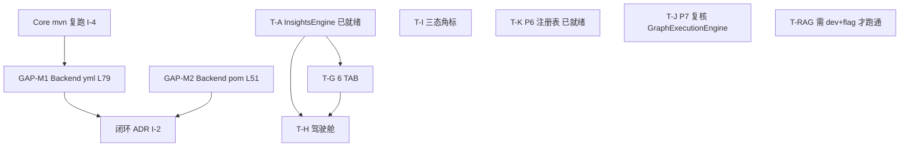

# 可观测 V4 — W2 启动确认 + 缺口清单备忘录

> 评审人：高见远（Gao，架构师）｜日期：2026-07-19
> 输入基线：`docs/specs/遥测架构决策-ADR-2026-07-19.md`（ADR）、`docs/specs/可观测V4-详细设计-0719.md`（详细设计）、`docs/specs/可观测V4-RAG指标设计-2026-07-19.md`（RAG 设计）、`docs/specs/可观测V4-交付排期-0719.md`（排期）、`deliverables/software-company/可观测V4-delivery-2026-07-19.md`（交付报告）
> 评审范围：ADR I-1~I-4 合规复核 + 设计详细度评估 + 实现-设计对齐抽查（不改动任何代码）

---

## ① 结论速览

| 项 | 结论 |
|---|---|
| **设计是否足够详细（W2 可落地）** | ✅ **足够详细，无需再制作更详细的设计文档**。详细设计已含 file:line 证据、DDL、类签名、任务分解 T-A~T-N；RAG 另有独立设计文档。 |
| **ADR 唯一未闭环项** | ⚠️ **I-2 在 Backend 端未闭环**：`observability/backend/src/main/resources/application.yml` **L79** `management.endpoints.web.exposure.include: health,info,metrics,prometheus` 仍含 `prometheus`。Core 端与测试口径均已合规。 |
| **新增发现（同属 prometheus 回退）** | ⚠️ **Backend `pom.xml` L51** 仍含 `micrometer-registry-prometheus` 依赖（ADR I-1 仅点名根 pom，未覆盖 Backend 模块；该依赖正是 L79 端点暴露的使能器）。建议与 L79 一并回退。 |
| **其余 ADR 项 / 命名 / 注释** | ✅ I-1（根 pom）已闭环；I-3（`MetricsRegistry` @PostConstruct 保留 pending_approval Gauge + L25 注释已改为 "OTLP Histogram"）已闭环；I-4 待重建验证；C-3 命名映射已在详细设计 §3.1② 记录；TC-RAG 用例已在 `test_rag.py` 落地。 |
| **W2 就绪判定** | ✅ **可启动**。唯一真正阻塞项为 Backend 端点回退（1 处配置行 + 建议 1 处依赖），属分钟级改动；前端 6 TAB / 驾驶舱 / 三态角标 / P6 / P7 / RAG 均有代码级规格与实现支撑。 |

---

## ② 设计详细度评估

**结论：详细设计 `可观测V4-详细设计-0719.md`（585 行）已达到「代码级、可落地」标准，W2 无需再出更细的设计文档。**

判断依据（已通读全文）：

1. **file:line 级证据**：§2「当前代码状态核对」对每个核对项都给出现存 `.java`/`.yaml`/`.jsx` 的精确 file:line（如 `InsightsEngineService.java` ❌、`AlertEvent.java:40-41`、`SessionService.java:59-137`、`BankController.java:122,134,150`、`config.yaml:18-24` 等），且区分 ✅/🟡/❌。
2. **DDL 级规格**：§3.2③（`alert_rules`/`alert_events` ALTER TABLE）、§3.3②（`ai_action_audit` CREATE TABLE）、§3.4①（`prompt_versions` CREATE TABLE + 索引）均给完整 SQL。
3. **类签名 / 方法级规格**：§3.1①（`MetricsRegistry` 完整类骨架）、§3.2①（`AlertEngineService` + `@Scheduled` + 状态机）、§3.4②（`PromptVersionService` 方法签名）、§3.5（待定项 B 四个改动点的字段/方法级 diff 指令）。
4. **任务分解 T-A~T-N**：§5 给出 14 个任务的「归属模块 / 任务 / 依赖 / 涉及文件（相对路径）/ 预计改动量 / 验收点 / 档位」六维拆解，并附 mermaid 依赖图。W2 涉及的 T-G/T-H/T-I（前端 6 TAB+驾驶舱+三态角标）、T-J/T-K（P7/P6）、T-RAG（RAG）均有对应规格与验收点。
5. **RAG 独立设计**：`可观测V4-RAG指标设计-2026-07-19.md` 及其 mermaid 文件已存在，覆盖 5 项 `deepflux.rag.*` 指标定义、双重守卫、诊断端点契约——与实现 `src/main/java/com/mobileagent/app/observability/rag/`（14 个文件）及 `test_rag.py` 一一对应。

> 故 W2 工程师可直接以本详细设计 §3/§4/§5 为实施依据，无需补充更细设计。

---

## ③ ADR 合规复核（I-1 ~ I-4 逐项）

| 项 | ADR 要求 | 复核结果 | 证据（file:line） |
|---|---|---|---|
| **I-1** | 根 `pom.xml` 删除 `micrometer-registry-prometheus` | ✅ **已闭环** | 根 `pom.xml` 全文 grep `prometheus` → **No matches**；`micrometer-registry-otlp` 依 ADR 保留（`pom.xml:102`）。 |
| **I-2** | 关闭 prometheus 端点暴露（Core + Backend `application.yml`） | 🟡 **Core 已合规，Backend 未闭环** | **Core** `src/main/resources/application.yml:37-38` `include: health,info,metrics`；`:42-43` `prometheus: enabled: false` ✅。 **Backend** `observability/backend/src/main/resources/application.yml:79` `include: health,info,metrics,prometheus` ❌ 仍含 `prometheus`（且无 `prometheus.enabled:false` 兜底行）。 |
| **I-3** | `MetricsRegistry` @PostConstruct 保留 pending_approval Gauge，导出走 OTLP；修正 L25 注释"Prometheus 直方图"→"OTLP Histogram" | ✅ **已闭环（含注释修正）** | `MetricsRegistry.java:53` `@PostConstruct init()` 注册 `deepflux.workflow.pending_approval` Gauge ✅；`:25` 注释已为「OTLP Histogram（后端只解析 Histogram）」✅（ADR 建议的注释修正**已实现**）。 |
| **I-4** | 重建 Core，确认无 prometheus 端点、业务 meter 经 OTLP 推送至 Backend | ⏳ **待重建验证** | 代码层面 I-1/I-3 已就绪，但交付报告声称 BUILD SUCCESS 未独立复跑；建议 W2 启动前 `mvn clean package` 复跑一次 Core 以坐实（非阻塞，分钟级）。 |
| **C-3** | 命名一致性：`agent.pending_approval`（设计 §5.3 P7）vs `deepflux.workflow.pending_approval`（实现） | 🟡 **已在详细设计内缓解** | 详细设计 §3.1② 映射表 L229 已显式记录 `agent.pending_approval → deepflux.workflow.pending_approval`（"是（走注册表）"）。主文档 `0718 §5.3` 若仍写旧名，可补一句等价说明（见 §⑤ GAP-D3）。 |

---

## ④ 实现-设计对齐抽查（spot-check，非全量）

随机抽查 3 个已实现类 + 测试套件完整性，结论：**实现与设计高度一致**。

### 4.1 InsightsEngineService.java（对应设计 §3.3 / §4.1，T-A/T-L）
- **只读构造器白名单** ✅：`InsightsEngineService.java:56-68` 仅注入 `MetricsAggRepository / SpanRepository / SessionRepository / SessionTurnRepository / AIInsightsService / RedisMetricsService`，**无**任何可写组件（与设计 §3.3② 一致）。
- **`insights.readonly` 闸门** ✅：`:48-49` `@Value("${insights.readonly:true}")` + `:368-373` `assertReadOnly()` 抛 `UnsupportedOperationException`，与 `application.yml:64-65` 及设计 §3.3② 一致。
- **6 个 REST API 全部落地** ✅：`generateReport()`(`:73`)、`refresh()`(`:86`)、`analyzePerformance()`(`:110`)、`analyzeSlowSession()`(`:147`)、`clusterUnsatisfied()`(`:186`)、`analyzeConversion()`(`:213`)、`suggestActions()`(`:235`) —— 与设计 §4.1 端点表逐一对应。
- **boundary 字段** ✅：`:354-361` `boundaryCard()` 输出 `boundary/confidence/requiresApproval/autoExecutable`，与设计 §3.3③ 一致；L1/L2 着色语义正确。
- **缓存 TTL 300s** ✅：`:54` `CACHE_TTL_MS = 300_000`，与设计 §4.1 一致。

### 4.2 AlertEngineService.java（对应设计 §3.2 / §4.2，T-B/T-F）
- **@Scheduled 30s 求值** ✅：`:55-75` `evaluateRules()` `fixedRate=30_000`，与设计 §3.2① / §4.2 一致。
- **状态机 + 抑制** ✅：`FIRING`(`:103`)、`SUPPRESSED`(`:86`)+`suppressionCount+1`(`:91`)、`RESOLVED`(`:119` handleRecovery)；`SUPPRESS_TTL_SECONDS=300`(`:41`) 与设计 §3.2②「5 分钟抑制窗」一致；`obs:alerts:suppress:{ruleId}`(`:79`) 键名一致。
- **LogNotifier 不真实外发** ✅：`:107` `notifyService.notify()` 注入默认 `LogNotifier`，遵守主理人决策 3。
- **指标采集映射** ✅：`:132-152` `collectMetricValue` 的 `request_count/error_rate/latency_p95/ttft_p95` 映射与设计 §4.2 QA 契约对齐。
- **轻微命名漂移（非阻塞）** 🟡：设计 §3.2② 写状态枚举 `ACKNOWLEDGED`，代码统一用 `ACKED`（`:25` 注释、`:116` 判断）。代码内部自洽，仅文档命名变体，见 GAP-D5。

### 4.3 RagController.java + RagMetrics.java（对应 RAG 设计，T-RAG）
- **双重守卫** ✅：`RagController.java:34` `@Profile("dev")` + `:39-40` `observability.rag.reference.enabled`(默认 false) + `:49-55` 未开启返回 503；与 `application.yml:287-290` 及 RAG 设计一致（生产不暴露）。
- **端点契约** ✅：`GET /api/v1/rag/retrieve?query=&topK=`(`:46`)，返回 `documents(id/score)`。
- **5 项指标命名一致** ✅：`RagMetrics.java:16-20` 定义 `rag.retrieval.latency/documents/hit_rate`、`rag.rerank.latency`、`rag.topk.relevance`，与 `test_rag.py:43-51` 断言的 5 个 `deepflux.rag.*` 名完全吻合；Timer 强制 `publishPercentileHistogram`(`:25-27`) 与 OTLP 主线一致。

### 4.4 测试套件完整性 ✅
- **10 个 `test_*.py` 齐全**：`test_collector / test_sessions / test_dead_keys / test_insights / test_alert / test_frontend / test_metrics / test_prompt_version / test_reroute / test_rag` 全部存在（目录 `test/obs_v4_tests/`）。
- **全部接入统一入口** ✅：`run_all.py:31-42` `MODULES` 含上述 10 个，含 `test_rag`（注明需 Core dev + flag）。
- **TC-RAG 用例已落地** ✅：`test_rag.py:4` 声明 `TC-RAG-001/002/003`；`:22-29` 用例说明；`:43-51` 断言 5 项指标。验证口径遵循 D-5（读 Core `/actuator/metrics`，不 scrape prometheus）。
- **test_metrics.py 遵循 D-5** ✅：`:9-12,58-59,86-87` 明确改读 `/actuator/metrics`（JSON 点号命名），不再 scrape `/actuator/prometheus`。

---

## ⑤ 缺口清单（按"必须修 / 文档补一句即可"分档）

> 总体：真正需工程改动的项仅 2 个（均属 prometheus 回退），其余为文档补一句或已闭环。

### 🔴 必须修（Must Fix）

**GAP-M1 — Backend `application.yml` L79：移除 `prometheus` 端点暴露（ADR I-2 唯一未闭环项）**
- 文件：`observability/backend/src/main/resources/application.yml`
- 当前：`management.endpoints.web.exposure.include: health,info,metrics,prometheus`（L79）
- 改为：`health,info,metrics`（与 Core `src/main/resources/application.yml:38` 对齐）
- 建议追加兜底行（可选）：在 `management.endpoint:` 下加 `prometheus: enabled: false`（对应 Core `:42-43`）。
- 验收：`curl localhost:9090/actuator/prometheus` → 404；`/actuator` 不包含 prometheus。

**GAP-M2 — Backend `pom.xml` L51：移除 `micrometer-registry-prometheus` 依赖（prometheus 回退的使能器，建议与 M1 一并处理）**
- 文件：`observability/backend/pom.xml`
- 当前：L49-53 `<dependency><groupId>io.micrometer</groupId><artifactId>micrometer-registry-prometheus</artifactId><scope>runtime</scope></dependency>`
- 说明：ADR I-1 仅点名**根** `pom.xml`（已删除 ✅），未覆盖 Backend 模块；但 Backend 此依赖正是 L79 端点可被暴露的根因。为完整回退 prometheus scrape 路径（ADR D-2），应与 M1 一并移除。
- 风险：Backend 设计 §1.1 明确"Micrometer OTLP 接收"，无 scrape prometheus 需求，移除安全；移除后若 `mvn` 报未解析引用，仅清理对应 import 即可（当前代码未见使用 prometheus registry 的 Java 引用）。
- 验收：`mvn dependency:tree | grep prometheus` 在 Backend 模块无输出。

### 🟡 文档补一句即可（Doc-Only）

**GAP-D3 — 主文档 0718 §5.3 P7 命名等价说明（C-3 收尾）**
- 现状：设计 §5.3 P7 写 `agent.pending_approval`；实现为 `deepflux.workflow.pending_approval`。
- 已在详细设计 §3.1② L229 记录映射（"是，走注册表"），故影响已局部消除。
- 动作：（可选）在 `可观测优化总结-WorkBuddy-V4-Demo上线版-0718.md` §5.3 P7 补一句"实际注册名为 `deepflux.workflow.pending_approval`（集中式注册表 `deepflux.` 前缀），与 `agent.pending_approval` 等价"。不阻塞 W2。

**GAP-D4 — ADR §8 指针建议落地（非阻塞）**
- ADR §8 建议在主设计文档 §14 增加 ADR 指针句。当前已通过本备忘录 + ADR 文件本身可追溯，**不强制**。若主理人希望主文档可单点溯源，粘贴 ADR §8 建议句即可。

**GAP-D5 — `ACKED` vs `ACKNOWLEDGED` 命名一致性（极轻微）**
- 现状：设计 §3.2② 状态枚举写 `ACKNOWLEDGED`；`AlertEngineService` 代码统一用 `ACKED`（注释 `:25`、判断 `:116`、状态机文档）。代码内部自洽，仅文档命名变体。
- 动作：在详细设计 §3.2② 把 `ACKNOWLEDGED` 改为 `ACKED`（或反之统一）即可，纯文档修正，不影响运行。

### ✅ 已闭环（无需处理，仅记录复核结论）
- **I-1 根 pom**：已无 prometheus，otlp 桥接保留（L102）。✅
- **I-3 注释修正**：`MetricsRegistry.java:25` 已为 "OTLP Histogram"（ADR 建议的注释修正**已实现**）。✅
- **MetricsRegistry @PostConstruct**：`:53` 保留 `deepflux.workflow.pending_approval` Gauge。✅
- **test_metrics / test_rag 验证口径**：均遵循 D-5（读 `/actuator/metrics`，不 scrape prometheus）。✅
- **TC-RAG 用例**：已在 `test_rag.py` 落地。✅

---

## ⑥ 给工程师的 W2 实施建议（按依赖顺序）

> 原则：先闭合 ADR 回退（分钟级、零业务风险），再推进前端大块（W2 主体），最后做验证与可选项收尾。

**步骤 1 — 闭合 ADR prometheus 回退（建议 W2 第 1 个 PR，可并行）**
1. 改 `observability/backend/src/main/resources/application.yml:79`，`include` 去掉 `prometheus`；建议追加 `management.endpoint.prometheus.enabled: false` 兜底。
2. 删 `observability/backend/pom.xml:49-53` `micrometer-registry-prometheus` 依赖；`mvn` 编译确认无未解析引用（预期无 Java 引用，干净）。
3. 起 Backend，`curl 9090/actuator/prometheus` 断言 404。→ 闭环 I-2 + GAP-M1/M2。

**步骤 2 — 复跑 Core 构建坐实 I-4（与步骤 1 并行）**
4. `mvn clean package`（Core 8080），确认启动无 prometheus 端点、业务 meter 经 OTLP 推送；可选跑 `test_metrics.py` 断言 `deepflux.workflow.pending_approval` 在 `/actuator/metrics` 可见（空闲期 value=0.0）。

**步骤 3 — 前端主体（W2 核心，依赖 T-A 已就绪）**
5. **T-G（6 TAB 真实数据）**：依详细设计 §4.6，核对 `client.js` 8 个 `/ai/*` 端点与 `AgentPerfTab/TokenCostTab/ToolCallTab/FunnelTab/SatisfactionTab` 字段；T-A 的 6 API（§4.1）已返回真实数据，直接对接。验收：6 TAB 非占位真实数据。
6. **T-H（诊断驾驶舱）**：`AIInsightsPage.jsx` 顶部新增 cockpit 5 子块（TOP5 建议卡 / 三类瓶颈卡 / 慢会话根因表 / 不满意共性表 / P95-vs-错误率散点），数据取自 §4.1 六端点；每卡按 `boundary` 着色（L1 蓝/L2 橙/L3 红）。强依赖步骤 5。
7. **T-I（三态角标）**：`DashboardPage.jsx` Zone A 新增 `HealthBadge` 组件，对 Core 发射 / Collector / H2 / Redis / 前端 计算 `HEALTHY(绿)/PARTIAL(黄)/DOWN(红)`（依据：最近 N 分钟有无数据点 / 接口 200）。验收：模拟某源断流角标变黄/红。

**步骤 4 — P6 / P7 / RAG 验证与收尾（可选项，依赖少）**
8. **T-K（P6 注册表）**：`MetricsRegistry` 已实现，新指标走 `deepflux.*`；确认无新增散落 `Counter.builder`。
9. **T-J（P7 UpDownCounter）**：确认 `GraphExecutionEngine` 中断路径(+1, 设计 §4.5 L128/L171) 与 resume 完成路径(-1, L69/144/215) 已调用 `addUpDown("workflow.pending_approval", ±1)`（交付报告称 T-J 已完成，建议 grep 复核一次）。
10. **T-RAG（RAG 端到端）**：`test_rag.py` 在**默认 CI 下会 SKIP**（需 Core 以 `dev` + `observability.rag.reference.enabled=true` 启动）。W2 验收环境若需真正跑通 TC-RAG-001/002/003，请在 E2E 环境加该启动参数；否则保留 SKIP 口径（已在测试内文档化，不假通过）。

**依赖顺序小结（mermaid）**

> 阻塞评估：W2 无硬阻塞。步骤 1 是唯一真正的代码改动，且为零业务风险配置/依赖清理；前端 T-G/T-H/T-I 有完整代码级规格与已就绪后端数据层支撑，可立即开工。

---

*—— 备忘录由架构师高见远（Gao）于 2026-07-19 出具；仅评估与文档产出，未修改任何代码。关联：ADR-2026-07-19 / 可观测V4-详细设计-0719 / 可观测V4-RAG指标设计-2026-07-19。*
