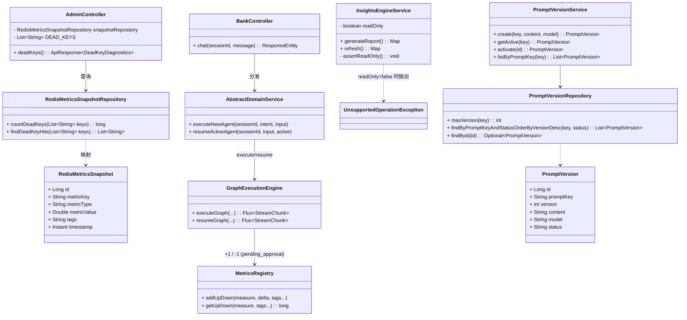
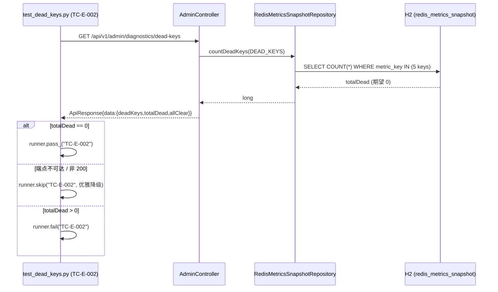
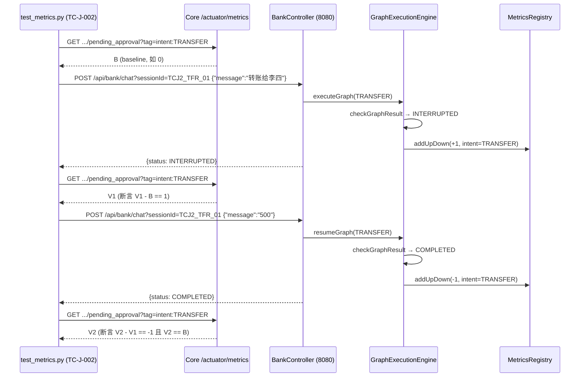
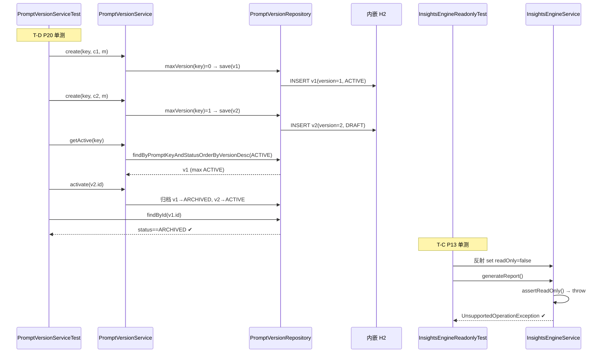
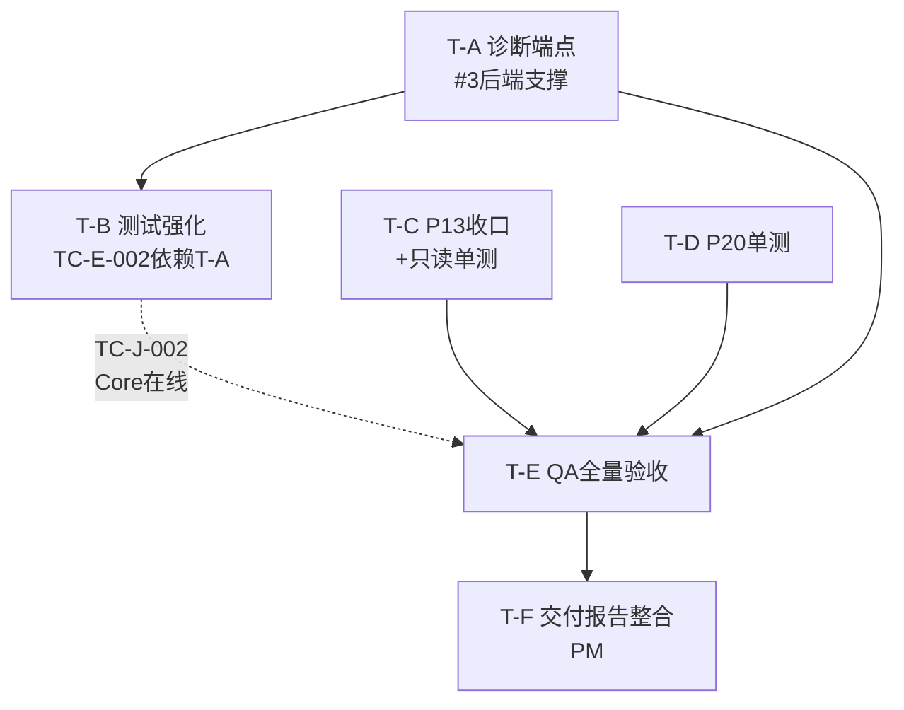

# 可观测 V4 · W3 增量任务分解设计（架构师决议 + 有序文件级任务列表 + 依赖图）— 0720

> 架构师：高见远（Bob）｜日期：2026-07-20
> 输入：可观测V4-W3-增量PRD-0720.md（PM：许清楚）｜可观测V4-详细设计-0719.md｜可观测V4-测试用例-0719.md
> 代码核实基线：`observability/backend/...`、`src/main/java/com/mobileagent/app/...`、`test/obs_v4_tests/...`
> 本文件为 **W3 增量设计**，仅描述相对 W1/W2 的「收口 + 补齐自动化测试」变更，不重述已落地代码（引用为主）。

---

## 1. TL;DR

**W3 增量范围一句话**：在 P13/P20 已实锤实现、仅需收口确认的基础上，把 M3 遗留的 2 个 SKIP 用例（TC-E-002 死 key 自动核查、TC-J-002 待审批 ±1 语义）升级为自动断言，补齐 P20 的 1 个 JUnit 单测，跑通全量验收守住 0 FAIL 不变量，并整合最终交付报告。

**关键结论（已逐文件代码核实）**：

- **P13 三层边界治理（T-L）在 W1/W2 已真实实现并通过验收**，W3 不是净新开发：
  - `InsightsEngineService.java:48` `@Value("${insights.readonly:true}")` + `:367-373` `assertReadOnly()` 在 `generateReport()/refresh()` 入口拦截写操作并抛 `UnsupportedOperationException`；
  - `boundaryCard(...)`（`:354-361`）统一输出 `boundary/confidence/requiresApproval/autoExecutable`；
  - 构造器（`:56-68`）只注入只读 Repo/Service，无 `GraphExecutionEngine`/`DomainService` 等可写组件；
  - `ai_action_audit` 表已建（`schema.sql:245`），`boundary VARCHAR(8) DEFAULT 'L3'`；本轮无 L3 写动作 → 表为空。
- **P20 提示词版本化（T-M）在 W1/W2 已真实实现并通过验收（T-M 7/7 PASS）**：
  - `PromptVersion.java` / `PromptVersionRepository` / `PromptVersionService.java` / `PromptVersionController.java` 齐全；
  - 版本单调性 `next=maxVersion+1`（`:42`）；首版自动 `ACTIVE`、其余 `DRAFT`（`:43-44`）；`getActive` 取最大 `ACTIVE`（`:72-76`）；`activate` 归档旧 `ACTIVE→ARCHIVED`（`:81-101`）；
  - `prompt_versions` 表 + 索引已建（`schema.sql:230/242`）。
- **推论**：W3 净新开发仅 **#3（测试强化）**。其余为「收口确认 + 补 1 个 JUnit 单测」。
- **Q1 决议**：采用方案 **(a) 新增只读诊断端点**（不改 H2 连接模式，无文件锁冲突）。具体：`AdminController` 新增 `GET /api/v1/admin/diagnostics/dead-keys`，复用已注入的 `RedisMetricsSnapshotRepository` 直查 `redis_metrics_snapshot`。
- **Q2 决议**：TC-J-002 集成测试契约已确认——**无独立审批端点**，审批 = 向同一 `sessionId` 再发一条 chat（触发 `resumeBlocking` → `COMPLETED` → `addUpDown(-1)`）；Gauge 经 Core `GET /actuator/metrics/deepflux.workflow.pending_approval?tag=intent:TRANSFER` 实时观测。

---

## 2. 技术方案决议

### 2.1 Q1 — TC-E-002 H2 死 key 自动核查机制（决议：方案 a）

**背景核对**：
- `application.yml:9` 的 H2 URL 为 `jdbc:h2:file:./data/observability;MODE=MySQL;DATABASE_TO_LOWER=TRUE`，**file 模式、无 `AUTO_SERVER`**。后端运行时独占文件锁，Python 并行直连会被 `database already in use` 挡住。
- `common.py` 仅用 HTTP `requests`，无 JDBC 驱动/helper。
- `AdminController`（`/api/v1/admin`）**已注入 `RedisMetricsSnapshotRepository`**，是最自然的落点。

**最终方案（a）**：后端新增一个**只读诊断端点**，复用现有 `DataSource` 直查 `redis_metrics_snapshot`，返回 5 死 key 行数；Python 侧 HTTP 调用断言 `totalDead == 0`。

**放弃方案（b）的理由**：改 `application.yml` 加 `;AUTO_SERVER=TRUE` + Python 侧 `jaydebeapi`/`pyh2` 直连，需新增测试 JDBC 依赖、改动 DB 连接模式（影响后端稳定性与现有 `SchemaInitializer` 文件锁语义），且引入混合模式下的并发风险。**收益远小于风险，故不采用。**

**涉及文件与改动点**：

| 文件（相对仓库根） | 动作 | 改动点 |
|---|---|---|
| `observability/backend/src/main/java/com/observability/repository/RedisMetricsSnapshotRepository.java` | 修改 | 新增 `countDeadKeys(List<String> keys): long` 与 `findDeadKeyHits(List<String> keys): List<String>` 两个 `@Query` 方法 |
| `observability/backend/src/main/java/com/observability/controller/AdminController.java` | 修改 | 新增 `GET /api/v1/admin/diagnostics/dead-keys`，定义死 key 常量 `DEAD_KEYS`，组装 DTO 返回每 key 计数与 `totalDead` |
| `test/obs_v4_tests/test_dead_keys.py` | 修改 | TC-E-002 由 `runner.skip` 升级为 HTTP 调用断言 `data.totalDead == 0`（端点不可达时优雅 SKIP，保 0 FAIL） |
| `observability/backend/src/main/resources/application.yml` | **不动** | 不引入 `AUTO_SERVER`，维持 file 模式 |

**端点契约（DTO）**：
```
GET /api/v1/admin/diagnostics/dead-keys
→ 200 ApiResponse{
    code: 0,
    message: "dead-keys diagnostics",
    data: {
      deadKeys: [
        { metricKey: "accuracy:intent",      count: 0 },
        { metricKey: "accuracy:rewrite",     count: 0 },
        { metricKey: "reroute_rate",          count: 0 },
        { metricKey: "business_completion",   count: 0 },
        { metricKey: "conversion",            count: 0 }
      ],
      totalDead: 0,
      allClear: true
    }
  }
```
- `totalDead == 0` ⇔ `allClear == true` ⇔ 5 死 key 无快照行（T30 删除 `addDoubleGauge` 后重启同步已生效）。
- 只读、无副作用，不暴露业务数据，可直接纳入 `run_all.py` 的 T-E 模块。

### 2.2 Q2 — TC-J-002 `pending_approval` ±1 语义集成测试端点契约（决议：复用现有端点 + Core actuator 观测）

**代码事实（已读 `GraphExecutionEngine.java` / `AbstractDomainService.java` / `MetricsRegistry.java`）**：

- **触发「人工中断」**：`POST /api/bank/chat?sessionId={sid}`（body `{"message":"..."}`）→ `BankController.chat` → `AbstractDomainService.executeNewAgent` → `GraphExecutionEngine.executeBlocking`。当图命中 `interruptBefore` 挂起，`checkGraphResult` 返回 `INTERRUPTED`，触发 `metricsRegistry.addUpDown("workflow.pending_approval", +1L, "intent", intent)`（L134）。
- **「审批完成」= 向同一 sessionId 再发 chat（无独立审批端点）**：第二次消息进入 `FOLLOW` → `AbstractDomainService.resumeActiveAgent` → `GraphExecutionEngine.resumeGraph` → `resumeBlocking`。图执行完成（`COMPLETED`）时触发 `addUpDown("workflow.pending_approval", -1L, "intent", intent)`（L182）。若 resume 仍 `INTERRUPTED` 则再 `+1`（L179，连续追问场景）。
- **id 来源**：`threadId` 由 `AbstractDomainService.generateThreadId` 内部生成（`sessionId-intent-hex`），存于 `ActiveAgentInfo`。测试**无需感知 threadId**，只要对「同一 sessionId」连续发两条消息即可完成「中断→审批完成」。
- **Gauge 观测**：`MetricsRegistry` 在 `@PostConstruct init()`（L53-56）即注册 `deepflux.workflow.pending_approval` Gauge（初值 0），并以 `intent` 为 tag 维护各意图独立 `AtomicLong`。观测点 = **Core 8080 的 `/actuator/metrics`**（Core `application.yml:35-38` 已暴露 `health,info,metrics`）。
  - 实时取值：`GET http://127.0.0.1:8080/actuator/metrics/deepflux.workflow.pending_approval?tag=intent:TRANSFER`，读 `measurements[0].value`。

**确定性触发剧本（经 `seed_and_test.py` 验证可复现）**：
- 选 **2 消息转账流**（对应 `seed_and_test.py` 用例 t-mix2）：
  1. `POST /api/bank/chat?sessionId=TCJ2_TFR_01` body `{"message":"转账给李四"}` → 期望 `status ∈ {INTERRUPTED, NEEDS_CONFIRMATION}`（首中断，+1）。
  2. `POST /api/bank/chat?sessionId=TCJ2_TFR_01` body `{"message":"500"}` → 期望 `status == COMPLETED`（审批完成，-1）。
- 该剧本**恰好一次 INTERRUPTED + 一次 COMPLETED**，语义净变化为 0、中间态为 +1，是验证 `±1` 的最干净路径（避开多轮追问导致的多次 +1 抵消问题）。

**待确认子项答复**：
- **Q2(a) 审批完成端点**：无独立端点，审批 = 同一 `sessionId` 的第二次 chat（resume→COMPLETED）。
- **Q2(b) LLM 依赖**：TRANSFER/BILL 子图的 `interruptBefore` 前置节点需 L2 参数提取 LLM（`param-extract` 模型，`application.yml`）。故**确定性进入 INTERRUPTED 需要 LLM 可用**（SenseNova key）。W3 无「零 LLM 确定性中断路径」。缓解：集成测试在 LLM 可用的 Core 上跑；若 LLM 不可用，用例**优雅 SKIP**（不 FAIL），保 0 FAIL 不变量。
- **Q2(c) Gauge 隔离**：Gauge 按 `intent` 标签隔离。测试用专用 `sessionId`、采样前先抓基线 `B`、断言 `V1-B == +1` 与 `V2-V1 == -1`。建议在**无并发转账流量**的 Core 上串行执行；若须与其他流量共存，delta 断言仍成立的前提是采样间隔内无其他 transfer 中断/审批交错。

**TC-J-002 集成测试步骤（落地到 `test_metrics.py`）**：
```
1. 前置：Core:8080 + Backend:9090 在线；LLM 可用。
2. 确认 /actuator/metrics 暴露；取基线 B = GET .../deepflux.workflow.pending_approval?tag=intent:TRANSFER
   （404/未注册 → 视为 0）。
3. POST /api/bank/chat?sessionId=TCJ2_TFR_01 {"message":"转账给李四"} → 期望 INTERRUPTED。
4. 采样 V1 = GET ...?tag=intent:TRANSFER → 断言 V1 - B == 1（strict）。
5. POST /api/bank/chat?sessionId=TCJ2_TFR_01 {"message":"500"} → 期望 COMPLETED。
6. 采样 V2 = GET ...?tag=intent:TRANSFER → 断言 V2 - V1 == -1 且 V2 == B。
7. 任一前置不满足（Core 未起 / actuator 404 / LLM 不可用导致非 INTERRUPTED）→ SKIP 并留人工核查口径，不 FAIL。
```

---

## 3. 实现方案 + 框架选型

- **沿用现有栈，零破坏性**：
  - 后端：Spring Boot 3.5.5 + JPA(H2 file 模式) + Redis + Micrometer（`spring-boot-starter-actuator` 已引）+ `spring-boot-starter-test`（pom.xml:56-58，JUnit 5 可用）。
  - 测试：Python `pytest`/`requests` 测后端 API；Core 侧经 HTTP + actuator 观测 Gauge。
  - 前端：W3 不涉及前端改动。
- **新增/改动点对现有栈无破坏**：
  - Q1 端点为纯只读查询，复用 `RedisMetricsSnapshotRepository`，不新增表/列、不改 H2 URL。
  - Q2 不新增任何后端代码（仅 Python 集成测试 + 复用 Core 既有埋点/actuator）。
  - P13/P20 不新增运行时代码，仅补 JUnit 单测（测试 Scope，不影响生产构建）。
- **无新增第三方依赖**（详见 §8）。

---

## 4. 文件列表及相对路径

> 标注：**新增** / **修改** / **不动**。

### 4.1 后端 Java（observability/backend/...）

| 相对路径 | 动作 | 说明 |
|---|---|---|
| `src/main/java/com/observability/repository/RedisMetricsSnapshotRepository.java` | 修改 | + `countDeadKeys(List<String>)`、`findDeadKeyHits(List<String>)` 两个 `@Query` |
| `src/main/java/com/observability/controller/AdminController.java` | 修改 | + `GET /api/v1/admin/diagnostics/dead-keys`（死 key 常量 + DTO 组装） |
| `src/main/java/com/observability/service/InsightsEngineService.java` | 不动 | 只读闸门/边界已落地（T-C 仅补 JUnit 单测验证） |
| `src/main/java/com/observability/service/PromptVersionService.java` | 不动 | 版本单调性/激活已落地（T-D 仅补 JUnit 单测） |
| `src/main/java/com/observability/controller/PromptVersionController.java` | 不动 | REST 路径已落地 |
| `src/main/java/com/observability/model/PromptVersion.java` | 不动 | 实体已落地 |
| `src/main/java/com/observability/repository/PromptVersionRepository.java` | 不动 | `maxVersion`/`findByPromptKeyAndStatusOrderByVersionDesc` 已落地 |
| `src/test/java/com/observability/service/PromptVersionServiceTest.java` | 新增 | T-D：JUnit（`@DataJpaTest` + `@Import`）覆盖版本单调 + `getActive` + `activate` 归档 |
| `src/test/java/com/observability/service/InsightsEngineReadonlyTest.java` | 新增 | T-C（可选）：JUnit 反射置 `readOnly=false` 断言 `generateReport()/refresh()` 抛 `UnsupportedOperationException` |

### 4.2 后端资源

| 相对路径 | 动作 | 说明 |
|---|---|---|
| `src/main/resources/application.yml` | 不动 | 不引入 `AUTO_SERVER`，维持 file 模式 |
| `src/main/resources/schema.sql` | 不动 | `prompt_versions`(L230)/`ai_action_audit`(L245) 已建 |

### 4.3 Python 测试（test/obs_v4_tests/...）

| 相对路径 | 动作 | 说明 |
|---|---|---|
| `test_dead_keys.py` | 修改 | TC-E-002 由 `runner.skip` 升级为调 `/api/v1/admin/diagnostics/dead-keys` 断言 `totalDead==0` |
| `test_metrics.py` | 修改 | TC-J-002 由 SKIP 升级为 §2.2 集成测试（Core 在线则断言 ±1；否则 SKIP） |
| `common.py` | 不动 | 复用 `ApiClient`；如需可加 `get_json_for_core` 辅助（可选，不强制） |

### 4.4 文档（本交付物）

| 相对路径 | 动作 | 说明 |
|---|---|---|
| `docs/specs/可观测V4-W3-增量设计-0720.md` | 新增 | 本文 |
| `docs/specs/class-diagram.mermaid` | 新增 | §5 类图提取 |
| `docs/specs/sequence-diagram.mermaid` | 新增 | §6 时序图提取 |

---

## 5. 数据结构与接口（类图 / 契约）

### 5.1 类图（Mermaid classDiagram）



### 5.2 Q1 诊断端点契约（新增）

- **请求**：`GET /api/v1/admin/diagnostics/dead-keys`（无 body）
- **响应**：`ApiResponse<DeadKeyDiagnostics>`
  - `DeadKeyDiagnostics = { deadKeys: List<{metricKey, count}>, totalDead: int, allClear: boolean }`
  - `totalDead = Σ count`；`allClear = (totalDead == 0)`
- **数据来源**：`RedisMetricsSnapshotRepository.countDeadKeys(DEAD_KEYS)`（`@Query("SELECT COUNT(s) FROM RedisMetricsSnapshot s WHERE s.metricKey IN :keys")`）。
- **死 key 5 元组常量**（与 `test_dead_keys.py:27` 一致）：
  `accuracy:intent` / `accuracy:rewrite` / `reroute_rate` / `business_completion` / `conversion`。

### 5.3 Q2 中断 / 审批端点契约（已存在，仅测试）

| 动作 | 方法 + 路径 | 请求体 | 期望响应 status | 对 Gauge 影响 |
|---|---|---|---|---|
| 触发中断 | `POST /api/bank/chat?sessionId=TCJ2_TFR_01` | `{"message":"转账给李四"}` | `INTERRUPTED` / `NEEDS_CONFIRMATION` | `deepflux.workflow.pending_approval{intent=TRANSFER} +1` |
| 审批完成 | `POST /api/bank/chat?sessionId=TCJ2_TFR_01` | `{"message":"500"}` | `COMPLETED` | `...{intent=TRANSFER} -1` |
| 观测 | `GET /actuator/metrics/deepflux.workflow.pending_approval?tag=intent:TRANSFER`（Core 8080） | — | 200，读 `measurements[0].value` | 实时值 |

### 5.4 P13 只读闸门单测点（T-C，新增 JUnit）

- 类：`InsightsEngineReadonlyTest`（置于 `src/test/java/com/observability/service/`）。
- 做法：用反射将 `InsightsEngineService.readOnly` 置为 `false`，调用 `generateReport()` / `refresh()`，断言抛 `UnsupportedOperationException`（因 `assertReadOnly()` 在 `readOnly=false` 时抛）。
- 断言口径（二选一，取「抛异常」更贴近治理语义）：
  - `assertThrows(UnsupportedOperationException.class, () -> svc.generateReport())`
  - `assertThrows(UnsupportedOperationException.class, () -> svc.refresh())`
- 反向（可选）：`readOnly=true`（默认）时不抛，正常返回（需 mock 只读 repo 提供最小数据）。

### 5.5 P20 `PromptVersionServiceTest` 测试点（T-D，新增 JUnit）

- 类：`PromptVersionServiceTest`（`@DataJpaTest` + `@Import(PromptVersionService.class)`，使用内嵌 H2 + 真实 Repository）。
- 覆盖（R3.2）：
  1. **版本单调性**：`create("insights.root_cause", c1, m)` → `version==1` 且 `status==ACTIVE`；`create(同一 key, c2, m)` → `version==2` 且 `status==DRAFT`。
  2. **getActive**：`getActive("insights.root_cause").getVersion() == 2`（最大版本）且 `status==ACTIVE`。
  3. **activate 归档**：`activate(v2.id)` 后 `getActive().getId()==v2.id` 且 `status==ACTIVE`；`v1` 经 `findById(v1.id)` 状态变为 `ARCHIVED`。

---

## 6. 程序调用流程（时序图）

### 6.1 TC-E-002 死 key 自动核查调用链（W3 新增）



### 6.2 TC-J-002 `pending_approval` ±1 语义集成测试步骤链（W3 新增）



### 6.3 P13 / P20 单测链（W3 新增 JUnit）



---

## 7. 任务列表（有序、含依赖、按实现顺序排列）

> 实现顺序原则：T-A 先落地后端支撑（Q1 端点），T-B 依赖 T-A 的 TC-E-002 部分；T-C/T-D 与 T-A 无强依赖可并行；T-E 全量验收依赖 R1-R3 全部就绪；T-F 整合报告依赖 T-E。

| 任务ID | 任务名 | 源文件（相对路径） | 依赖 | 优先级 | 一句话 |
|---|---|---|---|---|---|
| **T-A** | #3 后端支撑（Q1 诊断端点） | `RedisMetricsSnapshotRepository.java`(修改)、`AdminController.java`(修改) | 无 | P1 | 新增只读 `GET /api/v1/admin/diagnostics/dead-keys`，复用 `RedisMetricsSnapshotRepository` 直查 5 死 key 计数 |
| **T-B** | #3 测试强化（升级 SKIP→自动断言） | `test_dead_keys.py`(修改)、`test_metrics.py`(修改) | T-A（仅 TC-E-002 部分）；TC-J-002 依赖 Q2 契约（已确认）+ Core 在线 | P1 | TC-E-002 调端点断言 `totalDead==0`；TC-J-002 升级为「中断+1/审批-1」集成测试（Core 不可用则 SKIP） |
| **T-C** | P13 收口（确认 + 可选补单测） | `InsightsEngineReadonlyTest.java`(新增)；`InsightsEngineService.java`(不动) | 无（沿用 W2 结果） | P2 | TC-L-001/002/003 不退化确认；新增 1 个 JUnit 断言 `readOnly=false` 时 `generateReport()/refresh()` 抛 `UnsupportedOperationException` |
| **T-D** | P20 补 JUnit 单测 | `PromptVersionServiceTest.java`(新增)；`PromptVersionService.java`/`PromptVersionController.java`(不动) | 无 | P2 | 新增 `PromptVersionServiceTest`：版本单调 + `getActive` + `activate` 归档，构建测试 PASS |
| **T-E** | QA 全量验收（0 FAIL 不变量） | 运行 `run_all.py`（入口，PM 已确认 `verify-E2E.sh` 不存在） | T-A、T-B、T-C、T-D | P0 | 全量回归 FAIL=0、断言≥127、SKIP≤7；告警 20/20/0；守 0 FAIL |
| **T-F** | 交付报告整合（PM 负责） | 最终交付报告文档（PM 产出） | T-E | P0 | 整合开发+验收报告为最终交付物，含「已实现/已收口/已排除」三态清单 + 0 FAIL 证据 + 排期下修 |

### 7.1 依赖图（Mermaid graph）



> 说明：T-B 的 TC-J-002 子项不依赖 T-A（它依赖 Q2 已确认契约 + Core 在线），故仅 TC-E-002 部分需要 T-A 先行；T-C/T-D 可与 T-A 并行开发。

---

## 8. 依赖包列表

- **Q1（方案 a）**：**无新增依赖**。仅用后端既有 `spring-boot-starter-data-jpa` / `spring-boot-starter-actuator`；Python 侧复用既有 `requests`。
- **Q2**：**无新增依赖**。复用 Core 既有 Micrometer + Actuator；Python 侧复用 `requests` 读 `/actuator/metrics`。
- **JUnit 单测（T-C/T-D）**：后端 `pom.xml` 已含 `spring-boot-starter-test`（test scope，JUnit 5 + `@DataJpaTest`），**无需新增**。
- **结论**：W3 全量 **无新增第三方依赖**。

---

## 9. 共享知识（跨文件约定）

1. **死 key 5 元组常量**（Python `test_dead_keys.py:27` 与后端 `AdminController.DEAD_KEYS` 必须一致）：
   `accuracy:intent` / `accuracy:rewrite` / `reroute_rate` / `business_completion` / `conversion`。
2. **Gauge 命名**：`deepflux.workflow.pending_approval`（点号，非 prometheus 下划线）；tag `intent=<INTENT>`；观测经 **Core 8080** `/actuator/metrics`，不在 backend 9090。
3. **只读闸门约定**：`insights.readonly=true`（默认）→ `InsightsEngineService` 任何写入口经 `assertReadOnly()` 抛 `UnsupportedOperationException`；构造器白名单仅注入只读 Repo/Service。
4. **PromptVersion 状态机**：`DRAFT → ACTIVE`；同 key 仅一个 `ACTIVE`；`activate(id)` 把其余 `ACTIVE` 归档为 `ARCHIVED`。
5. **单测自播种约定**：P20 JUnit 经 `create()/activate()` 自播种，无需 `DataInitializer`（`prompt_versions`/`ai_action_audit` 无 seed 脚本，符合 Q3 推论）。
6. **0 FAIL 不变量**：任何新增/改动用例若前置不满足（端点不可达、Core 未起、LLM 不可用），一律 `SKIP` 而非 `FAIL`，守住全量 0 FAIL。
7. **验收入口**：实际为 `python test/obs_v4_tests/run_all.py`（`--modules alert` 跑告警），`verify-E2E.sh` 不存在（Q4 已确认）。

---

## 10. 待明确事项

> 以下为无法仅凭代码/文档推断、需主理人或工程师/QA 进一步确认的点；其余 Q1/Q2/Q3/Q4/Q5 均已给出可落地结论。

1. **TC-J-002 的 Core 启动前提**：集成测试需 Core(8080) + LLM 可用。请 QA 在验收时确认 W3 环境 Core 与 SenseNova key 在线；若仅做「代码+日志核查」可接受，本设计已让用例在 Core 不可用时 SKIP（不 FAIL）。**需主理人确认：W3 验收是否强制要求 Core 在线跑 TC-J-002 真实 ±1，还是允许 SKIP 留痕。**
2. **死 key 端点权限**：`/api/v1/admin/*` 当前为本地运维接口、无鉴权（与 `purge` 同口径）。若 W3 交付物要求生产鉴权，需主理人裁定是否加一层（本设计默认沿用现有无鉴权口径，与 `purge` 一致）。
3. **P13 单测（T-C）是否必做**：R2.2 标注「可选补强」。本设计给出可落地 JUnit 方案，但 T-C 优先级为 P2；若排期紧张可仅做「TC-L 不退化确认」而不写单测。**需主理人确认 T-C 单测是否纳入 W3 必交付。**
4. **断言数基线 127 的口径**：PRD 称 W2 基线 127/118/0/9。W3 将 TC-E-002、TC-J-002 由 SKIP 转 PASS 后，断言数预计 +2（或更多子断言），SKIP 由 9 降 ≤7。**需 QA 在 T-E 实际跑批后回填真实数字**，设计层仅承诺 FAIL=0、SKIP≤7。

---

> 文档版本：可观测V4-W3-增量设计-0720（架构师：高见远 / Bob）
> 关联：可观测V4-W3-增量PRD-0720.md / 可观测V4-详细设计-0719.md / 可观测V4-测试用例-0719.md
