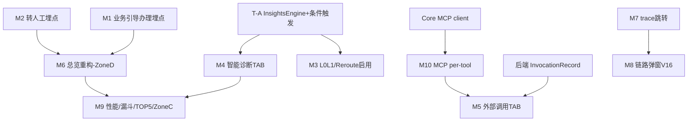

# 可观测 V4 Demo 上线 — 交付排期与上线范围（0719）

> 制定人：许清楚（Product Manager）｜日期：2026-07-19
> 输入基线：《可观测优化总结-WorkBuddy-V4-Demo上线版-0718.md》（以下简称「0718 主文档」）+《代码审阅整改总结-2026-07-18.md》+《指标GAP分析-v2.md》§8.1–§8.18 结论
> 适用范围：移动 AI 银行 Demo（Core 8080 → OTel Collector 4318 → 自研 Backend 9090 / H2+Redis → React 前端大屏 v20）

---

## ① 文档结论摘要（TL;DR）

1. **设计详细度结论**：§15.2 待启动 Backlog 中，**约一半项设计已可直接开发**，另一半（全部集中在 web 合入项）仍是「想法级」描述，**需 Architect 补详细设计后才能动手**。
   - ✅ **可直接开发/验证**：告警验收、T29（listSessions 分页）、T30（清理 Redis 死 key）、前端诊断驾驶舱真实数据对接（依赖 InsightsEngine API 已就绪）。
   - ⚠️ **需 Architect 补详细设计**：P6 集中式注册表、P13 三层边界治理、P20 提示词版本化（这三项只有概念/表格，**无量级到代码的可落地规格**）。
   - 🟡 **部分可开发、少量补设计**：P7 UpDownCounter（需确认「人工中断/审批完成」埋点代码位置）。
   - ⏸️ **暂缓/不适用**：P8 GenAI 钉注（与 §14.6「Java 栈保留自研 ObsChatModel、OpenLLMetry 不适用」结论冲突，无需实施）。

2. **排期要点**：本轮（V4 Demo 上线）建议 **3 周 ≈ 15 人日**（必做 ~9.5 人日 + 可选 ~5.5 人日）。依赖顺序严格遵循「**先后端数据层 → 再告警 → 再前端 → 最后可选项**」。P0 已闭环验证通过（清库+seed 36，L0==L1、L2≤L0），本轮不重复。

3. **本轮上线范围（scope）**：
   - **必做**：收口 P1 剩余（InsightsEngineService 交叉分析/根因/建议+6 API、Collector filter/sampling/attributes、告警抑制+状态机）、告警验收、T29、T30、前端 6 TAB + 诊断驾驶舱真实数据对接。
   - **可选/轻量**：P7 UpDownCounter、P6 注册表、P13 三层边界、P20 提示词版本化、Langfuse（DEMO 可选，需 Docker）、前端三态角标（若确认尚未完成）。
   - **暂缓（后续迭代）**：P2 标准栈（Tempo/VM/Loki/Grafana + PostgreSQL，需 Docker）、P8（不适用）、P3 LLM 专项、D2 violationRate（需安全围栏）、I5 L2 意图识别（需 L2 链路数据）、待定项 B（reRoute 原报文范围，待主理人拍板）。
   - **V23 设计评审增量（0719 后新增，见 §⑥）**：在以上范围外，新增「AI 洞察 7 TAB（智能诊断合并）+ 总览重构（Zone A-E）+ 2 个新埋点（业务引导办理/转人工）+ MCP per-tool + Reroute 启用 + 会话/链路交互修复」等，对应 §⑥ **M 系列 ≈14 人日**，建议顺延 W4–W5 或并行增援前端。

---

## ② 设计详细度评估结论

评估口径：针对 §15.2 每一项，判断「是否已有足够具体的 DDL / 代码片段 / 明确改动量 / 可落地的接口契约」可直接进入开发。结论分四档：**可直接开发 / 需 Architect 补设计 / 部分可开发 / 暂缓**。

| # | 项 | 来源 | 现有设计文档中的依据 | 充分度 | 结论 | 需 Architect 补什么 |
|---|---|---|---|---|---|---|
| 1 | 告警验收（AlertEngine+钉钉） | DEMO / §4.6+§10.1+§11 | `alert_rules`/`alert_events` 增强 DDL 完整；`AlertEngineService` 代码骨架 + 状态机 `TRIGGERED→ACKED→RESOLVED`；默认规则表 5 条含阈值/严重度/渠道 | 🟢 高（P0 已闭环，仅做端到端验证） | **可直接验证** | 无需补设计，属验证活动 |
| 2 | T29 listSessions 全量拉内存→DB 分页 | 外部审阅 P1 / 整改 T29 | 接口已有 `page/size`（返回含 `totalElements/totalPages`）；实现全量拉内存切片；明确改 `PageRequest + Specification` 或 `findAll` 返回 `Page`，约 15 行 | 🟢 高（改动点/方案明确） | **可直接开发** | 无需补设计 |
| 3 | T30 清理 Redis 死 key | 外部审阅 P1 / 整改 T30 | `accuracy:intent` 的 `setIntentAccuracy` 无调用方；`RedisH2SyncService` 同步的 gauge 恒为 null；主指标已改 H2 读时算不受影响；明确删除 dead gauge 同步逻辑 | 🟢 高（根因+删除点明确） | **可直接开发** | 无需补设计 |
| 4 | 前端对齐 — 诊断驾驶舱真实数据 | DEMO / §12.2+§9.6 | 驾驶舱 5 区块定义清晰；数据来自 InsightsEngine 6 个 API（`/insights-report` 等，§9.6 已列端点）；后端 P1「6 TAB 实时聚合已重写」 | 🟢 中高（需 InsightsEngine API 先就绪 + 契约确认） | **可直接开发**（依赖后端 API） | 需 Backend 先交付 API 契约（字段级） |
| 5 | 前端对齐 — 数据健康三态角标真实化 | DEMO / §13.1 | §3 P0 状态标 ✅已闭环(0718)，但 §15.2 又列待启动 → **存在状态矛盾**（见 §⑤-2） | 🟡 待确认 | **待确认后定档** | 需先澄清是否真已完成 |
| 6 | P6 集中式指标注册表 | web 合入 / §5.3 | 仅概念：「定义 Metrics 结构体集中管理所有 Meter/Counter/Timer，命名 `deepflux.<domain>.<measure>`，提供 RecordXxx 助手方法」 | 🔴 低（想法级，无结构/签名/迁移映射） | **需 Architect 补设计** | ① 注册表结构体与 `RecordXxx` 方法签名；② 现有 `ObservabilityMetrics` 散落 `otel.Meter("xxx")` 调用清单与改名映射；③ 命名规范落地示例 |
| 7 | P7 UpDownCounter（agent.pending_approval） | web 合入 / §5.1#7+§5.3 | 「新增 UpDownCounter，人工中断+1、审批完成-1」语义清晰 | 🟡 中（缺埋点代码位置） | **部分可开发**（少量补设计） | 需定位 Core 中「人工中断」与「审批完成」两处代码切入点 |
| 8 | P8 GenAI 钉注（OpenLLMetry 版本钉注） | web 合入 / §5.3+§14.6 | §14.6 已结论：Java 栈保留自研 ObsChatModel，OpenLLMetry 无官方 Java 探针、不适用 | ⏸️ — | **暂缓/不适用** | 无需实施（与 §14.6 冲突，留 V6 备查） |
| 9 | P13 三层边界治理（确定性→代码/模糊→AI/写→审计） | web 合入 / §9.1 | 仅 L1/L2/L3 概念表（示例+原则），无代码归属 | 🔴 低（想法级） | **需 Architect 补设计** | ① 现有 `InsightsEngine.compute*` 方法归属 L1 的逐方法清单；② L3「禁止 AI 直接写操作」的代码强制手段（如白名单/审计日志表结构）；③ 边界如何在输出卡上显式标注 |
| 10 | P20 提示词即 Runbook（版本化） | web 合入 / §9.8 | 仅原则：prompt 存配置表+版本号+PR review+测试；未定表/机制/测试桩 | 🔴 低（想法级） | **需 Architect 补设计** | ① prompt 版本表 schema（表名/字段/索引）；② 版本号生成与「当前生效版本」读取机制；③ 已知场景预期输出测试桩设计 |
| 11 | Langfuse（DEMO 可选启动） | 0718 确认 / §14.7 | 步骤明确：`docker compose up`；Collector 加 `otlphttp/langfuse` exporter；作为同一 OTLP 第二消费者，不改业务代码；~0.5 人日 | 🟢 高（how-to 清晰） | **可直接开发（需 Docker）** | 无需补设计，但依赖 Docker 环境 |

> **整体判断**：0718 主文档对**「修复类/验证类」项（告警、T29、T30、前端对接）设计已足够细**，可直接进入开发；对**「治理/规范类」web 合入项（P6/P13/P20）停留在理念层**，必须由 Architect 产出代码级详细设计后才能排期开发。这是本轮最大的设计缺口，需在 W1 即启动 Architect 设计（见排期表）。

---

## ③ 交付排期表

- 粒度：人日；周期：3 周（W1–W3）。假设团队：1 Backend、1 Frontend、1 Architect（部分投入）、1 QA、PM 统筹。
- 依赖主线：**后端数据层（InsightsEngine/T29/T30）→ 告警（抑制+验收）→ 前端（TAB+驾驶舱）→ 可选项（P6/P7/P13/P20/Langfuse）**。
- 标注：[必] 本轮必做｜[选] 可选/轻量｜[缓] 暂缓（不在本轮）。

### 3.1 阶段总览

| 阶段 | 目标 | 核心任务 | 人日 | 依赖 |
|---|---|---|---|---|
| **W1 后端数据层 + 告警** | 收口 P1 后端、打通告警闭环 | InsightsEngineService、Collector 增强、告警抑制、T29、T30、告警验收、Architect 设计 | 后端 4.5 + Architect 1.5 + QA 0.5 ≈ 6.5 | P0 已闭环 |
| **W2 前端对接 + 可选落地** | 前端真实数据化 | 6 TAB+驾驶舱真实数据、三态角标、P7、P6、QA 用例 | 前端 2.5 + 后端 1.5 + QA 1 ≈ 5 | 依赖 W1 后端 API |
| **W3 收尾 + 验收 + 交付** | 可选项收口、验收、报告、遗留项收口 | P13、P20、Langfuse、QA 验收、交付报告；**测试质量优化 #3（遗留，见 §3.2）；#4 已裁定不补（归 W3 考虑，不占工时）** | 后端 2.5 + QA 1.5 + PM 0.5 ≈ 4.5（遗留 #3 ≈1.0 另计，#4 已裁定不补不占工时，见 §3.2） | 依赖 W2 设计/实现 |

### 3.2 任务明细

| 周 | 任务 | 范围 | 工作量(人日) | 依赖 | 负责人角色 |
|---|---|---|---|---|---|
| W1-D1~2 | InsightsEngineService（交叉分析+根因+建议+6 API） | [必] P1 收口 | 2.0 | P0 已闭环(H2 真值) | Backend |
| W1-D1 | Collector 加 filter(健康检查)/tail_sampling/attributes（§11.1，T24 已完成 batch+memory_limiter） | [必] P1 收口 | 0.5 | — | Backend/SRE |
| W1-D2 | 告警抑制 + 状态机完善（§10.1 抑制中间态 SUPPRESSED） | [必] P1 收口 | 0.5 | — | Backend |
| W1-D2~3 | T29 listSessions DB 分页 | [必] §15.2 | 0.5 | — | Backend |
| W1-D3 | T30 清理 Redis 死 key（删 dead gauge 同步） | [必] §15.2 | 0.5 | — | Backend |
| W1-D3~4 | 告警验收（AlertEngine+钉钉 Webhook 端到端） | [必] §15.2 | 0.5 | 依赖告警抑制完成 + 钉钉 webhook 配置 | QA + Backend |
| W1（并行） | P6/P13/P20 详细设计（产出代码级规格，供 W2/W3 实现） | [选] 设计前置 | 1.5 | — | Architect |
| W2-D1~3 | 前端 6 TAB + 诊断驾驶舱真实数据对接 InsightsEngine API | [必] §15.2 | 2.0 | 依赖 W1 InsightsEngine API | Frontend |
| W2-D3 | 前端数据健康三态角标真实化（若确认未闭环） | [必/待定] §15.2 | 0.5 | 依赖 §⑤-2 澄清 | Frontend |
| W2-D3~4 | P7 UpDownCounter（agent.pending_approval） | [选] §15.2 | 0.5 | 依赖 Architect 定位埋点 | Backend |
| W2-D4~5 | P6 集中式注册表（按 Architect 设计落地） | [选] §15.2 | 1.0 | 依赖 W1 Architect 设计 | Backend |
| W2（并行） | QA 测试用例准备（告警/分页/死 key/前端契约） | [必] 验收前置 | 1.0 | — | QA |
| W3-D1~2 | P13 三层边界治理代码化（按 Architect 设计） | [选] §15.2 | 1.0 | 依赖 W1 Architect 设计 | Backend |
| W3-D2~3 | P20 提示词版本化（按 Architect 设计） | [选] §15.2 | 1.0 | 依赖 W1 Architect 设计 | Backend |
| W3-D3 | Langfuse DEMO 可选启动（docker compose + exporter） | [选] §14.7 | 0.5 | 依赖 Docker 环境 | Backend/DevOps |
| W3-D3~4 | QA 验收测试（verify-E2E.sh + 告警验收 + 前端对齐） | [必] 验收 | 1.5 | 依赖 W2 实现 | QA |
| W3-D4~5 | 交付报告（开发+验收报告整合） | [必] 收尾 | 0.5 | 依赖验收通过 | PM + 全员 |
| W3（遗留） | 测试质量优化#3：TC-E-002 H2 死 key 自动核查（JDBC/直连替代人工 SQL）+ TC-J-002 `pending_approval` ±1 语义集成测试（聚焦集成测试替代人工/日志） | [选] 测试强化 | 1.0 | 依赖 JDBC/集成测试环境 | QA + Backend |
| W3（遗留） | 测试质量优化#4：A 类可选字段（generatedAt/resolvedAt/ARCHIVED/redisStatus）**决策：不补**（PM建议，用户裁定）——保持 SKIP 并标注"已知未实现"，不排 M3 构建，归 W3 考虑 | [选] 产品判定 | 0 | — | PM |

> **M3 遗留**：测试质量优化 #3（TC-E-002 死 key 自动核查 + TC-J-002 `pending_approval` ±1 语义集成测试）已作为遗留任务纳入本 W3（=M3）跟踪，工作量另计 ≈1.0 人日；#4（A 类可选字段）**已裁定不补**（PM建议，用户裁定），归 W3 考虑、不占构建工时，不计入原 §3.3 本轮 15 人日合计。

### 3.3 人日汇总（W3 实际下修后）

| 分类 | 后端 | 前端 | Architect | QA | PM | 小计 |
|---|---|---|---|---|---|---|
| 必做 | 4.5 | 2.5* | 0 | 2.5 | 0.5 | **9.5–10.0** |
| 可选/轻量 | 2.5 | 0 | 1.5 | 0.5 | 0 | **4.5** |
| **本轮合计** | **7.0** | **2.5** | **1.5** | **3.0** | **0.5** | **≈14.5 人日** |

> *前端必做含三态角标 0.5（若确认未闭环）；否则 2.0。
> 暂缓项（P2 标准栈 / P8 / P3 / D2 / I5 / 待定项 B）不计入本轮，见 §④。
>
> **W3 实际工时下修依据**：P13/P20 在 W1/W2 已实现并通过 W2 验收（代码核对实锤），W3 仅做收口确认 + 各补 1 个 JUnit 单测；Langfuse（0.5 人日）被主理人决策 4 裁定排除；#3 测试强化（1.0 人日，原"另计"）已执行并纳入可选合计。后端可选从 4.0 → 2.5（−1.5），QA 可选从 0 → 0.5（+#3 QA 部分），本轮合计从 ≈15.0 → ≈14.5。详见可观测V4-W3-增量PRD-0720.md §4（R2/R3 现状核查）与可观测V4-W3-交付报告-2026-07-20.md §三。

---

## ④ 本轮 scope 清单

范围划分原则：**高优先级 + 低外部依赖 + 可本地验证 = 必做**；**轻量 + 设计待补 = 可选**；**需 Docker/外部基建/外部依赖 = 暂缓**。

### 4.1 本轮必做（高优先级、低外部依赖、可本地验证）

| 项 | 来源 | 改动量 | 优先级 | 需 Architect 补设计 | 需 Docker/外部依赖 |
|---|---|---|---|---|---|
| InsightsEngineService（交叉分析+根因+建议+6 API） | §3 P1 / §9.3–§9.6 | 2 人日 | 高（P1 收口关键路径） | 否（§9 已有接口与架构） | 否 |
| Collector filter/sampling/attributes 增强 | §3 P1 / §11.1 | 0.5 人日（配置） | 中 | 否（config 已给出） | 否 |
| 告警抑制 + 状态机完善 | §3 P1 / §10.1 | 0.5 人日 | 高（告警验收前置） | 否 | 否 |
| 告警验收（端到端验证） | §15.2 | 配置/验证 0.5 人日 | 🔴 高 | 否 | 仅需钉钉 Webhook 配置（非 Docker） |
| T29 listSessions DB 分页 | §15.2 / 整改 T29 | ~15 行 / 0.5 人日 | 🟡 | 否 | 否 |
| T30 清理 Redis 死 key | §15.2 / 整改 T30 | 小 / 0.5 人日 | 🟡 | 否 | 否 |
| 前端 6 TAB + 诊断驾驶舱真实数据 | §15.2 / §12.2 | 2 人日 | 🟡（按排期） | 否（需后端 API 契约） | 否 |
| 前端三态角标真实化（若确认未闭环） | §15.2 / §13.1 | 0.5 人日 | 待定 | 否 | 否 |

### 4.2 本轮可选 / 轻量

| 项 | 来源 | 改动量 | 优先级 | 需 Architect 补设计 | 需 Docker/外部依赖 |
|---|---|---|---|---|---|
| P7 UpDownCounter（agent.pending_approval） | §15.2 / §5.1#7 | 0.5 人日 | 🟢 轻量 | 部分（定位埋点） | 否 |
| P6 集中式指标注册表 | §15.2 / §5.3 | 1 人日 | 🟢 轻量 | **是（代码级规格）** | 否 |
| P13 三层边界治理 | §15.2 / §9.1 | 文档+轻代码 1 人日 | 🟢 轻量 | **是（代码级规格）** | 否 |
| P20 提示词版本化 | §15.2 / §9.8 | 文档+轻代码 1 人日 | 🟢 轻量 | **是（表 schema+机制）** | 否 |
| Langfuse DEMO 可选启动 | §14.7 / 0718 确认 | ~0.5 人日 | 🟢 建议 | 否 | **是（Docker）** |

### 4.3 暂缓（后续迭代，需外部基建 / 外部依赖）

| 项 | 来源 | 暂缓原因 | 计划归属 |
|---|---|---|---|
| P2 标准栈（Tempo + VictoriaMetrics + Loki + Grafana + PostgreSQL 迁移） | §3 P2 / §13.3 | 需 Docker / docker-compose，生产级部署 | 后续迭代（V6 生产版） |
| P8 GenAI 钉注（OpenLLMetry 版本钉注） | §5.3 / §14.6 | Java 栈保留自研 ObsChatModel，OpenLLMetry 不适用 | 不适用 / 留 V6 备查 |
| P3 LLM 专项（Langfuse 生产必装 / Pyroscope / Faro / Beyla） | §3 P3 | 待决策 + 需 Docker/外部基建 | 后续迭代 |
| D2 violationRate（违规率） | §6.1 / §15.3 | 需安全围栏对接（外部依赖） | 后续迭代 |
| I5 L2 意图识别 | §6.3 / §15.3 | 需 L2 链路真实数据（待 LLM 跑通） | 后续迭代 |
| 待定项 B（reRoute 原报文范围） | §14.3 | 范围与「原报文」字段定义未定 | **待主理人拍板**（见 §⑤-1） |

---

## ⑤ 待确认问题

1. **【阻塞·待主理人拍板】待定项 B（reRoute 是否携带原报文）**：§14.3 仍标记待定——需先明确 reRoute 范围与「原报文」字段定义。影响 `BankController.dispatchWithReroute` 与 `SessionBridge` 的字段契约，**建议在 W1 前敲定**，否则相关埋点无法定稿。

2. **【文档状态矛盾】前端「数据健康三态角标真实化」是否已完成**：§3 P0 状态标 ✅已闭环(0718)，但 §15.2 又将其列入待启动 Backlog。请澄清：若已闭环，本轮仅做验证；若未闭环，则归入 §④.1 必做并计 0.5 人日。

3. **【环境依赖】告警验收的钉钉 Webhook 是否已配置**：告警验收（§15.2 🔴高）依赖钉钉 Webhook 可用性。若 DEMO 环境无 Webhook，需确认替代通知渠道或降级为「日志/本地验证」。

4. **【环境依赖】Langfuse / P2 标准栈的 Docker 可用性**：Langfuse（可选）与 P2（暂缓）均依赖 Docker。请确认 DEMO 机器是否具备 Docker；若不具备，Langfuse 本轮直接划为「暂缓」，不占用排期。

5. **【设计前置】P6/P13/P20 是否纳入本轮**：三项均为「需 Architect 补详细设计」的轻量项。若主理人希望本轮一并交付，需 W1 立即启动 Architect 设计（已排 1.5 人日）；若优先保 Demo 上线稳定性，可整体顺延至下一迭代。

---

## ⑥ V23 设计评审后待开工增量（0719 后）

> 依据：《可观测DEMO-v23-智能诊断-WorkBuddy.html》设计评审 + 许清楚《V23↔V20 对比报告 / 新指标需求清单》（2026-07-19 后）。本节在 ①②③④⑤ 既有排期基础上，叠加 V23 设计评审暴露的「需叠加到现有代码」增量。原 W1–W3 任务（T-A~T-N，见《可观测V4-详细设计-0719.md》§5）保持有效，本节为其**补充 V23 专属任务（M 系列）**并给出估算、依赖与顺序。功能优化点编号 F1–F8 见《可观测优化总结-WorkBuddy-V4-Demo上线版-0718.md》§17.3。

### 6.1 新增/调整任务项（M 系列）

| 周 | 任务ID | 任务 | 范围 | 工作量(人日) | 依赖 | 角色 | 档位 |
|---|---|---|---|---|---|---|---|
| W1 | M1 | 新埋点：业务引导办理次数（mbank_card_click） | [必] F1 | 0.5 | — | 前端+后端 | 必做 |
| W1 | M2 | 新埋点：转人工次数（mbank_human_click） | [必] F2 | 0.5 | — | 前端+后端 | 必做 |
| W1 | M3 | 意图识别综合正确率 L0/L1 分层展示 + 重路由比率启用 | [必] F4/F5 | 0.5 | T-A(聚合) | 前端+后端 | 必做 |
| W2 | M4 | AI 洞察新增「智能诊断」TAB（合并智能洞察 cockpit） | [必] T-H 扩展 | 1.5 | T-A(6 API) | 前端 | 必做 |
| W2 | M5 | 外部调用 TAB（Segmented 全部/RAG/工具/SKILL/MCP + 统一 InvocationRecord + 删除子图 chart） | [必] F7 | 1.5 | 后端 InvocationRecord | 前端+后端 | 必做 |
| W2 | M6 | 总览大屏重构（诊断摘要 4 卡 + Zone A-E + Zone D 3 卡 + 删 5 项） | [必] 变更点9/13 | 2.0 | M1/M2(Zone D 新卡) | 前端 | 必做 |
| W2 | M7 | 会话回放 trace 跳转关联（6 处 openTraceDetail） | [必] F6 | 0.5 | — | 前端 | 必做 |
| W3 | M8 | 链路详情弹窗恢复 V16（原始输入/最终输出 + L0→L1→L2 + 瀑布 + 高亮） | [必] 变更点12 | 1.0 | — | 前端 | 必做 |
| W3 | M9 | 性能 TAB Agent/LLM 维度差异化 + 漏斗视觉优化（阈值着色/高亮/气泡） + TOP5 紧凑化 + Zone C 改名统一 | [必] 变更点6/2/10/14 | 1.0 | — | 前端 | 必做 |
| W3 | M10 | MCP 调用明细 per-tool（Core 接入 MCP client + 后端聚合 + 前端 MCP 子页真实数据） | [必] F3 | 2.0 | Core MCP client | Core+后端+前端 | 必做（后端主体） |
| W3 | M11 | RAG 检索质量 Zone E 前端展示 + Core RAG 生产接入 | [必] F8 | 1.0 | deepflux.rag.* 已埋 | 前端+Core | 必做（依赖 RAG 链路） |

> 注：M 系列与既有 T 系列衔接——M4 扩展 T-H（驾驶舱）、M5 复用 T-G（6 TAB 真实数据）与外部调用 TAB、M6 复用总览数据（Zone A/B/C 已接通指标）、M10 复用 ToolStatsService（T 系列已有的工具统计）。T-A（InsightsEngineService）需补「条件触发区」逻辑供 M4 使用。

### 6.2 工作量估算汇总（M 系列增量）

| 分类 | 前端 | 后端 | Core | 小计 |
|---|---|---|---|---|
| 必做（M 系列） | 8.0 | 3.0 | 3.0 | **≈14.0 人日** |

> 叠加原 §③ W1–W3 ≈14.5 人日，**V23 评审后总盘子 ≈28.5 人日**（前端 10.5 / 后端 10.0 / Core 3.0 / Architect 1.5 / QA 3.0 / PM 0.5）。M 系列可在原 W1–W3 内穿插，建议排期顺延至 W4–W5（或并行增援前端）。

### 6.3 依赖关系与实现顺序

**实现顺序建议**：
1. **先数据后展示**：M1/M2（埋点）→ M3（聚合启用）→ M6（总览 Zone D 新卡）/ M4（智能诊断）/ M5（外部调用）。
2. **Core 重活前置**：M10（MCP client）工作量最大且阻塞 M5 的 MCP 子页，建议 W3 初即启动。
3. **UI 收尾**：M7/M8/M9 为前端视觉/行为收尾，可在 W3 并行。

### 6.4 与既有 scope（§④）的关系

- M1/M2/M3/M10 对应 §④.1 未覆盖的「**新指标全链条**」，原 scope 仅含 业务完成率（已接通）；V23 新增的 2 埋点 + MCP + Reroute 启用均为**新增必做**。
- M4/M5/M6/M7/M8/M9 对应「**AI 洞察业务逻辑落地 + UI 更新**」，原 §④.1 的「前端 6 TAB + 诊断驾驶舱真实数据」需扩展为「7 TAB + 总览重构 + 会话/链路交互」。
- 暂不纳入：Langfuse / P2 标准栈（决策 4 暂缓）、违规率 D2（安全围栏待对接）、I5 L2 意图（待 L2 链路）。

---

## ⑦ W2/W3 遗留 BUG 补录与排期（0722）

> 来源：2026-07-20~23 工作日志 + 代码核对。与 §⑥ M 系列的关系：M 系列已含"功能缺口类"规划（SKILL/MCP/RAG，详见《详细设计》§9.2），本节仅补录 **BUG 类净新增**（未计入 M 系列，不重复计数）。

### 7.1 遗留 BUG 任务表（净新增，≈1.3 人日）

| 周 | 任务ID | 任务 | 范围 | 工作量(人日) | 依赖 | 角色 | 状态 |
|---|---|---|---|---|---|---|---|
| W4 | L1 | Bug A：Trace L1-LLM1 缺失 + 前端标题错位修复（SpanTree.jsx:495，方案A 前端推导） | [必] 缺陷 | 0.3 | 无（方案已定） | 前端 | **已选方案A·优先排期** |
| W4 | L2 | ~~Bug B：Trace L2 多余 L2-LLM span~~（**非BUG·已闭环**：:373 为 extractParams 取消拦截必需，不可注释；detectCancelFromInput 仍被调用非死代码；cancelCheck span 属设计预期） | [—] — | 0 | — | — | **已闭环（删人日）** |
| W4 | L3 | ~~Bug C：手写 span makeCurrent()~~（**已闭环**：上游根因 WebFlux 上下文传播未启用，W3 附录 A.4 commit `130a62c` 修复；残留=关系型嵌套规则 + RAG/MCP/SKILL 嵌套 span 随 M11） | [—] — | 0 | — | — | **已闭环（并入 M11）** |
| W4 | L4 | start-all.ps1 编译段 `-Dmaven.test.skip=true` 防回归阻断 | [选] 脚本 | 0.2 | — | DevOps | 待办 |

> 净新增合计 ≈ **0.5 人日**（前端 0.3 [L1/B-A] + DevOps 0.2 [L4/B-D]）。B-B/B-C 经 0722 复核重新定性为「非BUG/已闭环」，后端 0.8 人日移除。叠加 §⑥ M 系列 ≈14.0 人日后，**V23 评审 + W2/W3 遗留总盘子 ≈ 29.0 人日**（前端 10.8 / 后端 10.0 / Core 3.0 / Architect 1.5 / QA 3.0 / PM 0.5 / DevOps 0.2）。

### 7.2 与 M 系列的衔接
- SKILL 查询服务缺失 / MCP 未实现 / RAG 未接生产链路 / RAG 触发率埋点 → **已在 §⑥ M5/M10/M11 规划并计人日**，本节不重复计数，仅作追溯（详见《详细设计》§9.2）。
- 建议开工顺序（含遗留 BUG）：先 L1/L4 收口 BUG（小、独立、不阻塞 M 系列）→ 再按 §⑥.3 顺序推进 M1→M11（B-C 残留的 RAG/MCP/SKILL 嵌套 span 随 M11）。

### 7.3 W3 增量（0720）收口交叉引用（用户 0722 确认：此后不再单独查阅 2 份 W3 文档）

> W3 为**已完成收口**冲刺，规划/设计/验收/交付四件套见《可观测V4-W3-增量PRD-0720.md》《可观测V4-W3-增量设计-0720.md》《可观测V4-W3验收记录-0720.md》《可观测V4-W3-交付报告-2026-07-20.md》。主文档此处总锚点：

- **完成态**：R1 #3 测试强化（TC-E-002/TC-J-002 SKIP→PASS）、R2 P13 三层边界（已收口+JUnit4/4）、R3 P20 提示词版本化（已收口+JUnit1/1）、R4 QA 全量验收（**121/111/0/10，0 FAIL**）、R5 交付报告已整合；EX-1 Langfuse / EX-2 #4 A类字段 均**已排除**。
- **关键技术决策（已落地）**：Q1 死 key 诊断端点 `GET /api/v1/admin/diagnostics/dead-keys`（方案 a）；Q2 `pending_approval` ±1 复用「同 sessionId 二次 chat resume」契约（无独立审批端点）。
- **人日下修**：W3 5.5 → **4.0 人日**，已同步 §3.3。
- **W3 收尾 5 项 BugFix**（W3 交付报告附录 A，属「W3 之后」）：时区统一北京（9 处，待提交）/ trace耗时+TTFT（commit `cac889b`）/ LLM路径去写死（commit `fe55228`）/ **WebFlux 上下文传播（commit `130a62c`，即 B-C 上游根因）** / start-all ECJ 硬化（commit `51612d0`）。

---

> 文档版本：可观测V4-交付排期-0719（PM：许清楚）｜**V23 增量 + W2/W3 遗留（0719 后）见 §⑥ §⑦**
> 关联文档：可观测优化总结-WorkBuddy-V4-Demo上线版-0718.md（含 §17 V23 变更 / §18 遗留）/ 代码审阅整改总结-2026-07-18.md / 指标GAP分析-v2.md / 可观测V4-详细设计-0719.md（含 §9 遗留 BUG 补录）
