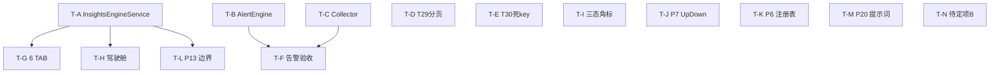
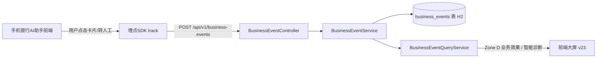

# 可观测 V4 Demo 上线 — 代码级详细设计 + 任务分解（0719）

> 设计人：高见远（Architect / 软件架构师）｜日期：2026-07-19
> 输入基线：可观测优化总结-WorkBuddy-V4-Demo上线版-0718.md（主文档）+ 可观测V4-交付排期-0719.md（排期）+ 代码审阅整改总结-2026-07-18.md（T22–T37）+ **真实代码核对**
> 适用范围：Core(8080) → OTel Collector(4318) → 自研 Backend(9090 / H2+Redis) → React 前端大屏 v20

---

## 📝 文档修订记录

| 版本/日期 | 修订人 | 修订内容 | 影响范围 |
|---|---|---|---|
| 0719 基线 | 高见远（Architect） | 初始代码级详细设计：§1–§7 各优化项代码级规格 + §5 任务分解（T-A~T-N） | 全文 |
| 0719 后增量 | 高见远（Architect） | 新增 §8「V23 增量设计补强」（8.1 新指标全链条 / 8.2 AI 洞察 7 TAB 业务逻辑 / 8.3 UI 更新）+ 合并 §8.5 补遗（F7/M5 InvocationRecord、F3/M10 MCP、M4 条件触发区、F4 L0/L1 VO、F1/F2 埋点） | §8（671→1066 行） |
| 0722 补录 | 齐活林（主理人） | ① 修订记录本表；② 修复 §2.5 状态汇总图 mermaid 语法错误（平行四边形缺右斜杠 + subgraph 标题 emoji 未引号）；③ 新增 §9「W2/W3 遗留开发任务与 BUG 补录」 | 本表 / §2.5 / §9 |
| 0723 复核 | 齐活林（主理人） | ① B-A 已选方案A（前端推导）优先排期；② B-B/B-C 经代码核对 + W3 交付报告附录 A 复核**重新定性为非BUG/已闭环**（后端 0.8 人日移除）；③ 新增 §9.4 W3 增量（0720）收口交叉引用（用户确认此后不再单独查阅 2 份 W3 文档） | §9（B-A/B-B/B-C/§9.4） |
| 0723 代码收口 | 齐活林（主理人） | 提交 W3 已验收但未进入 `feat/demo-v4` 的 4 个代码文件：`ConversionFunnelService.java`（新增漏斗计算）、`ToolStatsService.java`（工具统计增强 +221/−51）、`ToolStatsServiceTest.java`（新增测试）、`AgentPerfTab.jsx`（微调清理）；commit `6c5187d` | 仓库代码 / W3 验收闭环 |

> 设计基线日期 2026-07-19；V23 增量设计评审于 2026-07-22~23 完成，三份文档（详细设计 / 优化总结 / 交付排期）均就地刷新并交叉引用。

## ⚠️ 最关键结论（请主理人先读）

经**逐文件真实代码核对**，排期文档（交付排期-0719 §②）把两项标为「P1 收口/必做」的内容，实际**在代码中并不存在**，是**全新后端开发**而非收口：

| 项 | 排期预期 | 代码真实状态 | 影响 |
|---|---|---|---|
| **InsightsEngineService（交叉分析+根因+建议+6 API）** | P1 收口（2 人日） | **未实现**。仅有前身 `AIInsightsService`（accuracy/confusion 子集）。全仓 grep `InsightsEngine` 仅命中文档，无 `.java`。 | 必做·新开发；前端「诊断驾驶舱」强依赖它 |
| **AlertEngineService（@Scheduled 求值+钉钉推送+状态机+抑制）** | P1 收口（0.5 人日） | **未实现**。仅有 `AlertService`（规则 CRUD）+ `AlertController`。全仓 grep `AlertEngine` 仅命中文档，无 `.java`、无 `@Scheduled` 求值逻辑。 | 必做·新开发；「告警验收」前置项 |

换言之：本轮 **Demo 上线的真正后端瓶颈是「洞察引擎」与「告警引擎」两个新 Service**，而非简单收口。其余项（T29/T30、Collector 增强、前端三态/驾驶舱、P6/P7/P13/P20、待定项 B）状态见 §2。

---

## 1. 设计总则与共享约定

### 1.1 技术栈与模块边界

| 层 | 技术栈 | 代码根路径 |
|---|---|---|
| Core（数据发射） | Spring AI Alibaba + Micrometer + OTel Java Agent | `src/main/java/com/mobileagent/app/` |
| Collector | OpenTelemetry Collector（原生，配置驱动） | `observability/otel-collector/config.yaml` |
| Backend（业务语义权威源） | Spring Boot + JPA(H2) + Redis + Micrometer OTLP 接收 | `observability/backend/src/main/java/com/observability/` |
| 前端大屏 v20 | React + Ant Design + ECharts + Vite | `observability/frontend/src/` |
| DB 初始化 | `schema.sql`（idempotent，`SchemaInitializer` 启动执行） | `observability/backend/src/main/resources/schema.sql` |

> 主栈保持 0718 主文档决策：**不引入新组件、不引入 Docker 依赖项**（Langfuse / P2 标准栈本轮暂缓，见主理人决策 4）。

### 1.2 命名与文件组织约定

- **指标命名**：
  - 存量指标维持 `agent.*` / `llm.*` / `gen_ai.*`（已被 `AIInsightsService` 19 处硬编码查询，强耦合，**不强制重命名**）。
  - **新指标**走集中式注册表，统一前缀 `deepflux.<domain>.<measure>`（见 §3.1 P6）。
- **API 路径**：后端 REST 统一 `/api/v1/<resource>`；洞察类 `/api/v1/ai/*`；告警类 `/api/v1/alerts/*`。
- **文件组织**：Backend `service/` 放业务逻辑、`controller/` 放 REST、`model/` 放 JPA 实体、`repository/` 放数据访问、`config/` 放启动初始化；新增 Service 一律放 `service/`，与现有 `AIInsightsService` 平级。
- **返回值契约**：统一 `ApiResponse<T> { code, message, data }`（前端 `client.js` 拦截器按 `code===0` 解包）。

### 1.3 主理人 5 项决策 → 设计约束落地

| # | 决策 | 落到本文的设计约束 |
|---|---|---|
| 1 | 待定项 B：reRoute 透传原 `userMessage`，新增 `reRouted:true` + `originalQuery`（空则回填），仅最小实现 | §3.4 设计：仅在 `BankController`/`SessionBridge`/`SessionService` 增量加两字段 + `reroute_triggered` 落库，**不扩展语义** |
| 2 | 前端三态角标视为待实现，纳入前端必做；真实三态数据 + 角标；先核对 T22 是否已覆盖 | §2 / §4.6：**核对结论 = T22 是 `/trace` 跳转修复，与三态角标无关**，故三态角标判为「未实现」，归入前端必做（T-I） |
| 3 | DEMO 无真实钉钉 Webhook → 告警验收用 **Mock/Log Notifier** 验证分发逻辑 + 抑制/状态机，**不触发真实外发** | §3.2 / §4.2：`AlertNotifyService` 默认实现 `LogNotifier`（打印分发日志），`dingtalk`/`feishu` 渠道仅记日志不真实 HTTP 外发；验收读 `alert_events` 表 |
| 4 | Docker 不可靠 → Langfuse 与 P2 标准栈暂缓（不设计、不实现） | 本文不产出 Langfuse / Tempo/VM/Loki/Grafana / PostgreSQL 任何设计；§5 标为「暂缓」 |
| 5 | P6/P13/P20 纳入本轮「可选/轻量」，必须产出代码级详细设计，最小变更原则 | §3.1 / §3.2 / §3.3 给出可落地规格；**新指标/新表走增量，不强改存量** |

---

## 2. 当前代码状态核对（基于真实代码，file:line）

> 核对方法：对主文档/排期声称「已闭环(0718)」「P1 收口」的每一项，直接打开对应 `.java` / `.yaml` / `.jsx` 验证。标 ✅已实现 / 🟡部分 / ❌未实现。

### 2.1 后端（Backend 9090）

| # | 核对项 | 状态 | 证据（文件:行） | 结论 |
|---|---|---|---|---|
| 1 | **InsightsEngineService 6 API**（bottlenecks/root-cause/unsatisfied/conversion/actions/refresh） | ❌ 未实现 | 全仓 grep `InsightsEngine` 仅命中文档；`service/` 仅 `AIInsightsService.java`（accuracy/confusion 子集，无根因/建议/驾驶舱 API） | **本轮新开发**，见 §3 / T-A |
| 2 | **AlertEngineService 求值引擎**（@Scheduled 30s + 钉钉 + 状态机 + 抑制） | ❌ 未实现 | 全仓 grep `AlertEngine` 仅命中文档；`AlertService.java` 仅有 CRUD + `listEvents`；无 `@Scheduled` 求值 | **本轮新开发**，见 §3.2 / T-B |
| 3 | 告警抑制 + 状态机 | ❌ 未实现 | `AlertEvent.java:40-41` status 仅 `FIRING/ACKNOWLEDGED/RESOLVED`，无 `SUPPRESSED`；无抑制计数/去重逻辑 | 随 T-B 实现 |
| 4 | `alert_rules` DDL 增强（evaluation_interval/last_evaluated_at/current_value） | ❌ 未实现 | `AlertRule.java:23-58` 无这三列 | 随 T-B 加列 |
| 5 | `alert_events` DDL 增强（notified_channels/notify_result/suppression_count） | ❌ 未实现 | `AlertEvent.java:23-50` 无这三列 | 随 T-B 加列 |
| 6 | `listSessions` 分页（T29） | 🟡 部分 | `SessionService.java:59-137`：有 `page/size` 参数，但 L77-81 全量 `findAllByTimeRange` 拉内存、L82-103 内存过滤、L109-111 `subList` 切片 | 需改 DB 侧分页，见 §4.3 / T-D |
| 7 | Redis 死 key 清理（T30） | 🟡 部分 | `RedisH2SyncService.java:113-117` 仍 `addDoubleGauge` 同步 `accuracy:intent`/`accuracy:rewrite`/`reroute_rate`/`business_completion`/`conversion`（恒 null，主指标已改 H2 读时算） | 删除 L113-117，见 §4.4 / T-E |
| 8 | `AIInsightsService`（准确率/混淆矩阵子集） | ✅ 已实现 | `AIInsightsService.java:274` computeIntentAccuracy、`421` getAccuracyReport、`202` getConfusionMatrix | 复用为 InsightsEngine 的数据源 |
| 9 | `AlertService` 规则 CRUD + 事件查询 | ✅ 已实现 | `AlertService.java:35-131` | 复用 |
| 10 | `sessions` 表 `reroute_triggered`/`l0/l1/l2_intent` 列（§7.3 DDL） | ❌ 未实现 | `Session.java:24-67` 无这些列；`SessionService.upsertSession` 也未写 | 待定项 B 顺带加 `reroute_triggered`，见 §3.4 |
| 11 | `RedisH2SyncService` 死 key（T30 根因） | 🟡 | 同 #7 | — |

### 2.2 Core（8080）

| # | 核对项 | 状态 | 证据 | 结论 |
|---|---|---|---|---|
| 1 | LLM 置信度埋点（T27） | ✅ | `BankController.java:122,134,150` `currentConfidenceRef` 真实置信度 | 已闭环 |
| 2 | 分层意图 Span（方案A 确定性 L0） | ✅ | `DomainRouter` 已创建 `L0:DomainRouter` span（见主文档 §4.2，本次未重读 DomainRouter，依据 0718 验证结论） | 已闭环 |
| 3 | reroute 埋点（T27/方案A） | ✅ | `BankController.java:157,174` `obsMetrics.recordReroute(domain)` | 已闭环 |
| 4 | `ObservabilityMetrics` 散落 Meter 调用 | 🟡 | `ObservabilityMetrics.java:93-547` 共 22 处 `Counter/Timer/DistributionSummary.builder(...)` + 动态 `recordCounter(name,...)` | 见 §3.1 映射表 |
| 5 | UpDownCounter `agent.pending_approval`（P7） | ✅ 已实现（T-J；注册名 deepflux.workflow.pending_approval） | `ObservabilityMetrics.java` 无 `UpDownCounter` 类型 | 见 §3.1 / §4.5 / T-J |
| 6 | 人工中断 / 审批完成 埋点（P7 切入点） | 🟡 待定位 | 中断：`GraphExecutionEngine.java:128,171` `recordWorkflowInterrupt(intent,"interruptBefore")`；审批完成=resume 路径 `GraphExecutionEngine.java:69/144/215` | 见 §4.5 |

### 2.3 Collector

| # | 核对项 | 状态 | 证据 | 结论 |
|---|---|---|---|---|
| 1 | batch / memory_limiter（T24） | ✅ | `config.yaml:18-24,38,42,46` | 已闭环 |
| 2 | filter（健康检查 Span 过滤） | ❌ 未实现 | `config.yaml` 无 `filter` processor | 见 §4.7 / T-C |
| 3 | tail_sampling（错误/慢/LLM失败） | ❌ 未实现 | `config.yaml` 无 `tail_sampling` | 见 §4.7 / T-C |
| 4 | attributes（注入 env/service.version） | ❌ 未实现 | `config.yaml` 无 `attributes` | 见 §4.7 / T-C |

### 2.4 前端（v20）

| # | 核对项 | 状态 | 证据 | 结论 |
|---|---|---|---|---|
| 1 | 6 TAB 框架 | ✅ | `AIInsightsPage.jsx:20-69` 6 个 lazy TAB（Accuracy/AgentPerf/Token/Tool/Funnel/Satisfaction） | 框架在 |
| 2 | 6 TAB 真实数据对接 | 🟡 部分 | `client.js:86-123` 已调 `/ai/insights`/`/ai/accuracy-report`/`/ai/confusion-matrix`/`/ai/agent-performance`/`/ai/token-cost`/`/ai/tool-stats`/`/ai/conversion-funnel`/`/ai/satisfaction`；对应 Controller 基本具备 | 需契约对齐，见 §4.6 / T-G |
| 3 | **诊断驾驶舱**（§12.2 TOP5+瓶颈卡+根因表+阈值散点） | ❌ 未实现 | `AIInsightsPage.jsx` 仅 TAB，无 cockpit 区块；全仓 grep `insights-report|insights/bottlenecks|insights/root-cause|insights/unsatisfied|insights/conversion|insights/actions` **零命中** | 强依赖 T-A 的 6 API，见 §4.6 / T-H |
| 4 | **数据健康三态角标**（§13.1） | ❌ 未实现 | `DashboardPage.jsx:94-152` Zone A 仅 3 张 MetricCard（DAU/QPS/Agent），无三态（正常/部分/降级）badge 与数据源健康对接 | 见 §4.6 / T-I |
| 5 | `/trace` 跳转带 traceId（T22） | ✅ | `client.js` 无，但整改总结 T22 描述已修 `handleTraceClick→/trace?traceId=` | 已闭环（与三态角标无关） |

### 2.5 状态汇总图

```mermaid
flowchart LR
    subgraph DONE["✅ 已闭环 P0"]
        A1[LLM置信度] A2[分层意图Span] A3[reroute埋点]
        A4[batch+memory_limiter] A5[AIInsights子集]
        A6[AlertService CRUD] A7[/trace跳转T22/]
    end
    subgraph NEW["❌ 本轮必做·新开发"]
        B1[InsightsEngineService+6API]
        B2[AlertEngineService+抑制+状态机]
        B3[alert_rules/events DDL增强]
        B4[Collector filter/sampling/attributes]
    end
    subgraph PART["🟡 部分·小改"]
        C1[T29 listSessions分页]
        C2[T30 死key清理:113-117]
        C3[前端6TAB真实数据]
        C4[待定项B reRoute字段]
    end
    subgraph OPT["🟢 可选/轻量"]
        D1[P6 注册表] D2[P7 UpDownCounter]
        D3[P13 三层边界] D4[P20 提示词版本化]
    end
    subgraph NONE["❌ 未实现·前端大块"]
        E1[诊断驾驶舱] E2[三态角标]
    end
```

---

## 3. 各优化项详细设计（代码级）

### 3.1 P6 集中式指标注册表（可选/轻量）

**目标**：防止散落 `Counter.builder("xxx")` 导致命名漂移；新指标统一走 `deepflux.<domain>.<measure>`；不强改存量。

#### ① 注册表类结构（新建 `Core` 模块）

```java
// src/main/java/com/mobileagent/app/observability/MetricsRegistry.java
package com.mobileagent.app.observability;

import io.micrometer.core.instrument.*;
import org.springframework.stereotype.Component;
import java.util.concurrent.ConcurrentHashMap;
import java.util.concurrent.atomic.AtomicLong;

@Component
public class MetricsRegistry {
    private final MeterRegistry registry;
    // 统一前缀
    private static final String NS = "deepflux.";
    // UpDownCounter 用 AtomicLong + Gauge 模拟（Micrometer 无原生 UpDownCounter 概念，用 Gauge 持有 AtomicLong）
    private final ConcurrentHashMap<String, AtomicLong> updownState = new ConcurrentHashMap<>();

    public MetricsRegistry(MeterRegistry registry) { this.registry = registry; }

    /** 命名规范化：自动加 deepflux. 前缀（若已带则不重复） */
    private String name(String m) { return m.startsWith("deepflux.") ? m : NS + m; }

    public void recordCounter(String measure, double amount, String... tags) {
        Counter.builder(name(measure)).tags(tags).register(registry).increment(amount);
    }
    public void recordTimer(String measure, long ms, String... tags) {
        Timer.builder(name(measure)).tags(tags)
             .publishPercentileHistogram(true)   // ★ 强制，避免 Summary 导出分位恒0
             .register(registry).record(ms, java.util.concurrent.TimeUnit.MILLISECONDS);
    }
    public void recordSummary(String measure, double v, String... tags) {
        DistributionSummary.builder(name(measure)).tags(tags).register(registry).record(v);
    }
    /** UpDownCounter：人工中断+1 / 审批完成-1（P7 复用） */
    public void addUpDown(String measure, long delta, String... tags) {
        String key = name(measure) + "|" + String.join(",", tags);
        AtomicLong v = updownState.computeIfAbsent(key, k -> {
            AtomicLong a = new AtomicLong(0);
            Gauge.builder(name(measure), a, AtomicLong::get).tags(tags)
                 .description("UpDown counter (pending approval etc.)").register(registry);
            return a;
        });
        v.addAndGet(delta);
    }
    public long getUpDown(String measure, String... tags) {
        String key = name(measure) + "|" + String.join(",", tags);
        AtomicLong v = updownState.get(key);
        return v == null ? 0L : v.get();
    }
}
```

> **最小变更落地**：`MetricsRegistry` 为**新增**类，注入 `MeterRegistry`；**新指标一律走它**；存量 `ObservabilityMetrics` 的 22 处 builder 调用**保持不变**（因 `AIInsightsService` 19 处硬编码查询耦合旧名）。仅当某存量指标需要被新代码引用时，才在映射表登记「旧名→deepflux 目标名」供后续迁移参考（见下表）。

#### ② 现有散落 Meter 调用清单 → 改名映射表（文件:行号 → 新命名）

> 来源：`src/main/java/com/mobileagent/app/observability/ObservabilityMetrics.java`

| 文件:行 | 现有名（builder） | 类型 | 目标 `deepflux.<domain>.<measure>` | 是否本轮改名 |
|---|---|---|---|---|
| `ObservabilityMetrics.java:93` | `agent.intent.recognized` | Counter | `deepflux.agent.intent.recognized` | 否（存量保留） |
| `:97` | `agent.intent.confidence` | Summary | `deepflux.agent.intent.confidence` | 否 |
| `:103/:108/:113` | `agent.router.decision.outcome` | Counter | `deepflux.agent.router.decision` | 否 |
| `:119/:124/:129` | `agent.state.transition` | Counter | `deepflux.agent.state.transition` | 否 |
| `:135` | `agent.slot.askback.total` | Summary | `deepflux.agent.slot.askback` | 否 |
| `:140` | `agent.workflow.execution.duration` | Timer | `deepflux.agent.workflow.duration` | 否 |
| `:145` | `agent.workflow.interrupt` | Counter | `deepflux.agent.workflow.interrupt` | 否 |
| `:150` | `agent.state.suspend.depth` | Gauge | `deepflux.agent.state.suspend.depth` | 否 |
| `:155` | `agent.session.completed` | Counter | `deepflux.agent.session.completed` | 否 |
| `:159` | `agent.session.abandoned` | Counter | `deepflux.agent.session.abandoned` | 否 |
| `:164` | `agent.session.active` | Gauge | `deepflux.agent.session.active` | 否 |
| `:169/:174` | `agent.business.outcome` | Counter | `deepflux.agent.business.outcome` | 否 |
| `:180` | `agent.extraction.completeness` | Summary | `deepflux.agent.extraction.completeness` | 否 |
| `:186` | `agent.rewrite.total` | Counter | `deepflux.agent.rewrite.total` | 否 |
| `:190` | `agent.rewrite.accuracy` | Summary | `deepflux.agent.rewrite.accuracy` | 否 |
| `:195` | `gen_ai.client.operation.duration` | Timer | `deepflux.llm.operation.duration` | 否（注意 gen_ai.* 前缀） |
| `:202` | `agent.tool.call.duration` | Timer | `deepflux.agent.tool.duration` | 否 |
| `:514` (`recordIntentAccuracy`) | `agent.intent.accuracy` | Counter | `deepflux.agent.intent.accuracy` | 否 |
| `:523` (`recordL1Call`) | `agent.l1.call` | Counter | `deepflux.agent.l1.call` | 否 |
| `:531` (`recordReroute`) | `agent.reroute.count` | Counter | `deepflux.agent.reroute.count` | 否 |
| `:538` (`recordSkillOutcome`) | `agent.skill.outcome` | Counter | `deepflux.agent.skill.outcome` | 否 |
| `:546` (`recordToolCallCount`) | `agent.tool.call.count` | Counter | `deepflux.agent.tool.call.count` | 否 |
| **P7 新增（§4.5）** | `agent.pending_approval` | UpDown | **`deepflux.workflow.pending_approval`** | **是（走注册表）** |

#### ③ 最小变更落地步骤

1. 新建 `MetricsRegistry.java`（上述）。
2. 在 `ObservabilityMetrics` 注入 `MetricsRegistry`（或新指标直接注入 `MetricsRegistry`）。
3. P7 的 `agent.pending_approval` **不再**用 `ObservabilityMetrics`，改用 `metricsRegistry.addUpDown("workflow.pending_approval", +1/-1, "intent", ...)`。
4. 存量 22 处**不动**；映射表仅作迁移参考，写入本文档即满足「集中式注册表约定」。

---

### 3.2 告警引擎 AlertEngineService（必做·新开发）

> 因 `AlertEngineService` 完全未实现，本节给出可落地规格（非「收口」）。遵守主理人决策 3：默认 `LogNotifier`，不真实外发。

#### ① 类结构

```java
// observability/backend/src/main/java/com/observability/service/AlertEngineService.java
@Service
public class AlertEngineService {
    private final AlertRuleRepository ruleRepo;
    private final AlertEventRepository eventRepo;
    private final AlertNotifyService notifyService;     // 注入 LogNotifier（默认）
    private final RedisTemplate<String,String> redis;   // 抑制计数缓存
    private final MetricsQueryService metrics;           // collectMetricValue 数据源

    @Scheduled(fixedRate = 30_000)
    public void evaluateRules() { /* 见主文档 §10.1 骨架 + 抑制 + 状态机 */ }
}
```

#### ② 状态机与抑制（补全 §10.1）

- `AlertEvent.status` 枚举扩展为 `FIRING / SUPPRESSED / ACKNOWLEDGED / RESOLVED`（在 `AlertEvent.java:41` 放开字符串约束，值见下表）。
- **抑制**：同一 `ruleId` 在 5 分钟内已 `notify` 过 → 新触发事件 `status=SUPPRESSED`，`suppression_count+1`，不重复通知（Redis `obs:alerts:suppress:{ruleId}` 设 300s TTL）。
- **状态跃迁**：`FIRING → ACKED`（人工确认，新增 `POST /alerts/events/{id}/ack`）→ `RESOLVED`（下次求值不达标时置 RESOLVED + `resolvedAt`）。

#### ③ DDL 增强（`schema.sql`，随 T-B 执行）

```sql
-- alert_rules 增强（§7.3）
ALTER TABLE alert_rules ADD COLUMN evaluation_interval INT DEFAULT 30;
ALTER TABLE alert_rules ADD COLUMN last_evaluated_at TIMESTAMP;
ALTER TABLE alert_rules ADD COLUMN current_value DOUBLE;

-- alert_events 增强（§7.3）
ALTER TABLE alert_events ADD COLUMN notified_channels VARCHAR(128);
ALTER TABLE alert_events ADD COLUMN notify_result VARCHAR(64);
ALTER TABLE alert_events ADD COLUMN suppression_count INT DEFAULT 0;
```

#### ④ 通知实现（遵守决策 3）

```java
// AlertNotifyService 接口 + 两个实现
public interface AlertNotifyService { void notify(AlertRule rule, AlertEvent event); }
// 默认 Bean：LogNotifier —— 仅 log.info 分发日志，不发起真实 HTTP
@Component @Primary
public class LogNotifier implements AlertNotifyService {
    public void notify(AlertRule rule, AlertEvent event) {
        log.info("[Alert][NOTIFY][{}] rule={} channels={} msg={}",
            event.getStatus(), rule.getRuleName(), rule.getNotifyChannels(), event.getMessage());
        // 决不发真实 HTTP；若 channels 含 dingtalk/feishu，仅记录"将分发(未真实外发)"
    }
}
```

> 验收时 QA 检查 `alert_events` 表的 `notified_channels`/`notify_result`/`suppression_count` 与日志分发记录（见 §4.2）。

#### ⑤ 默认规则种子（5 条，沿用主文档 §4.6）

在 `SchemaInitializer` 或独立 `DataInitializer` 中幂等插入 5 条 `alert_rules`（LLM 错误率 / TTFT P95 / 转账槽位完成率 / Collector 接收量 / 满意度负面比率）。阈值/严重度/渠道同主文档 §4.6。

---

### 3.3 P13 三层边界治理（可选/轻量）

**前提**：InsightsEngineService（§3 顶层）为**新开发**，正好把边界治理落地进它的 `compute*` 方法归属。

#### ① 现有/规划 compute* 方法归属 L1/L2/L3 清单

> InsightsEngineService 新建，方法归属如下（L1=确定性代码 / L2=模糊AI / L3=写操作仅审计）：

| 方法（归属 InsightsEngineService） | 边界 | 依据 | 数据源 |
|---|---|---|---|
| `analyzePerformance()`（P95 by agent / token 统计） | **L1** | 确定性聚合 | spans+metrics_agg |
| `computeIntentAccuracy()` / `computeRewriteAccuracy()` | **L1** | 确定性计数 | metrics_agg |
| `analyzeConversion()`（漏斗计数） | **L1** | 确定性计数 | sessions |
| `analyzeQuality()`（置信度分布/不满意共性） | **L1** | 确定性聚合 | metrics_agg+sessions |
| `analyzeSlowSession(sessionId)`（根因假设） | **L2** | 模糊判断，需 AI 推理 | spans+LLM |
| `suggestActions()`（Top10 优先级建议） | **L2** | 模糊判断，带 confidence | 交叉分析+LLM |
| `clusterUnsatisfied()`（不满意共性聚类） | **L2** | 模糊聚类 | sessions |
| （任何写操作：updateState/cancelGraph/resume） | **L3** | **禁止 AI 直接执行** | — 不出现在 Insight 引擎 |

#### ② L3「禁止 AI 直接写操作」代码强制手段

- **构造器白名单**：`InsightsEngineService` 只注入**只读** Repository/Service（`SpanRepository`、`SessionRepository`、`MetricsAggRepository`、`RedisTemplate` 只读），**绝不注入** `GraphExecutionEngine` / `AbstractDomainService` / `OrchestrationStateService` 等可写组件（编译期即杜绝误调用）。
- **配置闸门**：`application.yml` 增加 `insights.readonly: true`（默认）；任何会触发写操作的入口在此闸门下直接抛 `UnsupportedOperationException`。
- **审计表 schema**（L3 动作被人工审批执行时留痕，本轮先建表不接业务）：

```sql
CREATE TABLE ai_action_audit (
    id BIGINT AUTO_INCREMENT PRIMARY KEY,
    prompt_version_id BIGINT,           -- 关联 P20 版本（可选）
    action_key VARCHAR(64),             -- 如 'scale_out','rollback'
    boundary VARCHAR(8) DEFAULT 'L3',
    suggested_by VARCHAR(64),           -- 触发来源（engine/llm）
    approved_by VARCHAR(64),
    status VARCHAR(16) DEFAULT 'PENDING', -- PENDING/APPROVED/REJECTED/EXECUTED
    created_at TIMESTAMP,
    executed_at TIMESTAMP
);
```

#### ③ 边界如何在输出卡上显式标注（字段设计）

每个洞察输出 VO 增加：

```json
{
  "boundary": "L1 | L2 | L3",
  "confidence": 0.0,            // 仅 L2 有，0~1；L1 为 null
  "requiresApproval": false,    // L3=true，默认 false
  "autoExecutable": false       // 全局 false（无证据链的 AI 结论只是建议）
}
```

前端在驾驶舱渲染时按 `boundary` 着色（L1 蓝 / L2 橙 / L3 红），L3 卡片显示「需人工审批」标记。

---

### 3.4 P20 提示词版本化（可选/轻量）

#### ① prompt 版本表 schema

```sql
CREATE TABLE prompt_versions (
    id BIGINT AUTO_INCREMENT PRIMARY KEY,
    prompt_key VARCHAR(64) NOT NULL,        -- 'insights.root_cause' / 'insights.actions'
    version INT NOT NULL,
    content CLOB NOT NULL,                   -- 提示词模板（含 {占位符}）
    model VARCHAR(64),                        -- 目标模型（如 qwen-plus）
    status VARCHAR(16) DEFAULT 'DRAFT',       -- DRAFT / ACTIVE / ARCHIVED
    description VARCHAR(256),
    created_by VARCHAR(64),
    created_at TIMESTAMP,
    UNIQUE (prompt_key, version)
);
CREATE INDEX idx_pv_key_status ON prompt_versions(prompt_key, status);
```

#### ② 版本号生成与「当前生效版本」读取

```java
@Service
public class PromptVersionService {
    // 版本号 = 该 prompt_key 已存在最大 version + 1（简单单调，无语义版本号需求）
    public PromptVersion create(String key, String content, String model, String by) {
        int next = repo.findMaxVersion(key).orElse(0) + 1;
        return repo.save(PromptVersion.builder().promptKey(key).version(next)
            .content(content).model(model).status("DRAFT").createdBy(by)
            .createdAt(Instant.now()).build());
    }
    // 当前生效：status=ACTIVE 且 version 最大
    public PromptVersion getActive(String key) {
        return repo.findTopByPromptKeyAndStatusOrderByVersionDesc(key, "ACTIVE");
    }
    public void activate(Long id) { /* 旧 ACTIVE→ARCHIVED，本 id→ACTIVE（@Transactional） */ }
}
```

#### ③ 已知场景预期输出测试桩设计

```java
// 测试夹具：prompt_expectations（或测试内 Map）
// (prompt_key, scenario_key) -> expectedContains[]
@Test
void testRootCausePrompt_knownScenario() {
    PromptVersion v = promptVersionService.getActive("insights.root_cause");
    String out = engine.analyzeSlowSession("seed-session-12"); // 已知慢会话
    assertThat(out).contains("RAG检索").contains("VectorStore.search"); // 预期根因卡
}
```

> 最小落地：先建表 + `PromptVersionService` + 1 个示例 prompt（root_cause）+ 1 个单测桩；其余 prompt 后续补。

---

### 3.5 待定项 B（reRoute 原报文透传）— 最小改动

**主理人决策 1**：reRoute 透传原始 `userMessage`（不重新生成），保留原 `userMessage` 值 + 新增 `reRouted:true` + `originalQuery`（若空则回填原始 query），仅最小实现。

#### 改动点（字段/方法级）

1. **`BankController.buildChatPipeline` 的 `doOnTerminate`**（`:127-138`）
   - `userInput` 本就是原始报文，已在 `reportSession` 第二参传入（`:131`），**无需改原报文**。
   - 新增：`boolean reRouted = rerouteCount.get() > 0;`，`String originalQuery = userInput;`（即原始 query 回填）。
   - 调用改为 `sessionBridge.reportSession(..., reRouted, originalQuery)`。

2. **`SessionBridge.reportSession`**（`:54-79`）
   - 签名追加 `boolean reRouted, String originalQuery`。
   - `buildSessionJson`（`:83-106`）Map 追加 `"reRouted": reRouted`、`"originalQuery": originalQuery`。

3. **`SessionService.upsertSession`**（`:164-249`）
   - 读 `body.get("reRouted")` / `body.get("originalQuery")`。
   - 落库 `session.setRerouteTriggered(Boolean.TRUE.equals(reRouted))`（需 `Session` 实体 + `schema.sql` 加 `reroute_triggered BOOLEAN` 列，见 §3.2 DDL 区一致处理）。

4. **`SessionService.toTurnVO`**（`:371-425`）
   - 将硬编码 `rerouteTriggered:false`（`:416`）改为从 `session.getRerouteTriggered()` 读取（或 turns 表若有则取 turns 值）。

> **不扩展语义**：不改 reroute 路由逻辑、不新增 reroute 原因字段、不重新生成 userMessage。仅透传 + 两个标记字段。

---

## 4. 其它可直接开发项的实现要点（简要）

### 4.1 InsightsEngineService（必做·核心，T-A）

- 新建 `service/InsightsEngineService.java`，注入 `AIInsightsService` + 6 个 `AIInsightsService` 族 Service + `SpanRepository`/`SessionRepository`/`MetricsAggRepository`（只读）。
- 实现 6 个 REST API（端点同主文档 §9.6，挂 `AIInsightsController` 或新建 `InsightsEngineController`）：

| 端点 | 方法 | 数据来源 |
|---|---|---|
| `GET /api/v1/ai/insights-report` | `generateReport()` | 聚合下方 5 项 + 缓存 `obs:insights:cache`(TTL300s) + 写 `insight_reports` 表 |
| `GET /api/v1/ai/insights/bottlenecks` | `analyzePerformance()` | spans P95 by agent |
| `GET /api/v1/ai/insights/root-cause/{sessionId}` | `analyzeSlowSession(id)` | spans 调用树 + 独占时间 Top3 |
| `GET /api/v1/ai/insights/unsatisfied` | `clusterUnsatisfied()` | sessions 负面满意度 |
| `GET /api/v1/ai/insights/conversion` | `analyzeConversion()` | sessions funnel |
| `GET /api/v1/ai/insights/actions` | `suggestActions()` | 交叉 + L2（见 §3.3） |
| `POST /api/v1/ai/insights/refresh` | 清缓存重算 | — |

- 前端契约：驾驶舱（T-H）按上述 6 端点取数；每个 VO 带 `boundary` 字段（§3.3③）。

### 4.2 告警验收（必做·T-F，遵守决策 3）

- 引擎 `AlertEngineService` 用 `LogNotifier`（§3.2④），**不真实外发**钉钉/飞书。
- 验收步骤：① 起 Backend → ② `SchemaInitializer` 种子 5 条规则 → ③ 制造异常指标（如手动写一条 LLM 错误 Counter）→ ④ 等 30s → ⑤ 查 `alert_events` 表确认 `FIRING` 事件 + `notified_channels`/`notify_result` 填充 + 日志出现 `[Alert][NOTIFY]` → ⑥ 5 分钟内同规则再次触发应得 `SUPPRESSED` + `suppression_count+1` → ⑦ 指标恢复后下一轮得 `RESOLVED`。

### 4.3 T29 listSessions DB 分页（必做·T-D）

- `SessionService.java:59-137`：将 L77-81 `findAllByTimeRange` 全量 + L82-103 内存过滤 + L109-111 `subList`，改为 **DB 侧**分页。
- `SessionRepository` 新增：

```java
Page<Session> findByTimeRangeAndFilters(Instant from, Instant to,
    @Param("status") String status, @Param("intentLike") String intentLike,
    @Param("agentLike") String agentLike, @Param("userId") String userId,
    @Param("sessionId") String sessionId, @Param("channel") String channel,
    Pageable pageable);
```

- 多条件在 JPQL `WHERE` 中用 `LIKE`/等值拼装（`intentFlow LIKE %intent%`、`agentPath LIKE %agent%`）；返回 `Page` 直接出 `totalElements/totalPages/content`。预计改动 ~15 行（接口 + 实现切片替换）。

### 4.4 T30 清理 Redis 死 key（必做·T-E）

- `RedisH2SyncService.java:113-117` 删除 5 行 `addDoubleGauge(...)`（`accuracy:intent`/`accuracy:rewrite`/`reroute_rate`/`business_completion`/`conversion`）。
- 这些 gauge 恒为 null（`RedisMetricsService.getIntentAccuracy()` 等无写入方），主指标已改 H2 读时算（T30 根因），删除无副作用。
- 验收：`grep` 确认同步逻辑不再引用这 5 个 key；重启后端 30s 后 `redis_metrics_snapshot` 表无这 5 行。

### 4.5 P7 UpDownCounter `agent.pending_approval`（可选·T-J）

- 注册：`MetricsRegistry.addUpDown("workflow.pending_approval", delta, "intent", intent)`（§3.1③）。
- **+1 人工中断**（Core）：`GraphExecutionEngine.java:128` 与 `:171`（`recordWorkflowInterrupt(intent,"interruptBefore")` 处）追加 `metricsRegistry.addUpDown("workflow.pending_approval", +1, "intent", intent)`。两处分别对应 blocking / resume-blocking 进入 `INTERRUPTED` 挂起。
- **-1 审批完成**（Core）：resume 完成路径 `GraphExecutionEngine.java:69 resumeGraph` / `:144 resumeBlocking` / `:215 resumeStreaming`。当前 `resumeBlocking` 仅在 `INTERRUPTED` 时记中断（`:169-171`），**缺 COMPLETED 分支**——在 resume 出口补：`if (status==COMPLETED) metricsRegistry.addUpDown("workflow.pending_approval", -1, ...)`（建议加在 `checkGraphResult` 之后、`INTERRUPTED` 判断并列处）。
- 前端：`MetricsQueryService` 暴露 `pendingApproval`；DashboardPage/Overview 加「待审批」卡片（可选，本轮可仅埋点不展示）。

### 4.6 前端（必做·T-G/T-H/T-I）

- **T-G 6 TAB 真实数据**：`client.js:86-123` 已接 8 个 `/ai/*` 端点；核对 `AgentPerfTab/TokenCostTab/ToolCallTab/FunnelTab/SatisfactionTab` 的字段与对应 Controller 返回结构一致（不一致处由 Engineer 对齐，预计 0 bug 因 P0 已重写）。验收：6 TAB 均显示非 0/非占位数据。
- **T-H 诊断驾驶舱**：`AIInsightsPage.jsx` 顶部新增 cockpit 区块（5 子块见主文档 §12.2），数据来自 §4.1 的 6 端点。**强依赖 T-A 完成**。验收：TOP5 建议卡 / 三类瓶颈卡 / 慢会话根因表 / 不满意共性表 / P95-vs-错误率散点均有真实数据。
- **T-I 三态角标**：`DashboardPage.jsx:94-152` Zone A 目前仅 3 张 MetricCard。新增「数据健康三态」角标组件：对每个数据源（Core 发射 / Collector / H2 / Redis / 前端）计算健康态 `HEALTHY(绿)/PARTIAL(黄)/DOWN(红)`，依据：该源最近 N 分钟有无数据点 / 接口是否 200。角标渲染在总览与各页头。验收：模拟某源断流时角标变黄/红。

### 4.7 Collector 增强（必做·T-C）

- `config.yaml` 在 `processors` 增加（main 文档 §11.1）：
  - `filter`：metrics 过滤 Histogram 噪声（可选）；traces 过滤 `attributes["http.target"]=="/actuator/health"`。
  - `attributes`：注入 `env=production` / `service.version=1.0.0`。
  - `tail_sampling`：`errors(status_code ERROR)` + `slow(>1000ms)` + `llm-failure(error_type in [timeout,auth_error,rate_limit])` + `normal-sampling(probabilistic 10%)`。
- `service.pipelines` 引用顺序：`[memory_limiter, batch, filter, attributes, tail_sampling]`（traces）；metrics/logs 不加 tail_sampling。
- 验收：`otelcol validate` 通过；起服务后健康检查 Span 不再进 Backend。

---

## 5. 任务分解（核心交付物）

> 顺序：**后端数据层（T-A/T-B/T-C）→ 告警验收（T-F）→ 前端（T-G/T-H/T-I）→ 可选项（T-J/T-K/T-L/T-M/T-N）**。标注 必做 / 可选 / 暂缓。

| 任务ID | 归属模块 | 任务 | 依赖 | 涉及文件（相对路径） | 预计改动量 | 验收点 | 档位 |
|---|---|---|---|---|---|---|---|
| **T-A** | Backend | InsightsEngineService + 6 API（交叉分析/根因/建议/驾驶舱数据源） | 无（P0 已闭环） | `service/InsightsEngineService.java`(新)、`controller/AIInsightsController.java`(增端点)、`model/InsightReport.java`(新,可选)、`resources/schema.sql`(insight_reports 已存在则跳过) | 2 人日 | 6 端点返回真实数据；`obs:insights:cache` 生效 | **必做** |
| **T-B** | Backend | AlertEngineService（@Scheduled 求值 + LogNotifier + 状态机 + 抑制）+ DDL 增强 | 无 | `service/AlertEngineService.java`(新)、`service/AlertNotifyService.java`+`LogNotifier.java`(新)、`model/AlertRule.java`/`AlertEvent.java`(加列)、`resources/schema.sql`(ALTER)、`config/DataInitializer.java`(种子5规则,新) | 1.5 人日 | 30s 求值触发；SUPPRESSED/抑制计数正确；状态机 FIRING→ACKED→RESOLVED | **必做** |
| **T-C** | Collector | filter / tail_sampling / attributes 增强 | 无 | `observability/otel-collector/config.yaml` | 0.5 人日 | `otelcol validate` 通过；健康检查 Span 不入 Backend | **必做** |
| **T-D** | Backend | T29 listSessions DB 分页 | 无 | `service/SessionService.java`(L59-137)、`repository/SessionRepository.java`(新方法) | 0.5 人日 | 大数据量下 `Page` 返回正确分页，无全量内存 | **必做** |
| **T-E** | Backend | T30 清理 Redis 死 key | 无 | `service/RedisH2SyncService.java`(删 L113-117) | 0.25 人日 | 同步逻辑不再引用 5 死 key；重启后 snapshot 无此 5 行 | **必做** |
| **T-F** | QA+Backend | 告警验收（Mock/Log Notifier，不真实外发） | T-B | `service/AlertEngineService.java`、`AlertEvent` 表、日志 | 0.5 人日 | 见 §4.2 六步验收 | **必做** |
| **T-G** | Frontend | 6 TAB 真实数据对接 | T-A(契约) | `frontend/src/pages/*Tab.jsx`、`api/client.js` | 2 人日 | 6 TAB 非占位真实数据 | **必做** |
| **T-H** | Frontend | 智能洞察诊断驾驶舱 | T-A | `frontend/src/pages/AIInsightsPage.jsx`(cockpit 区块)、`components/charts/*` | 1.5 人日 | 驾驶舱 5 子块真实数据 | **必做** |
| **T-I** | Frontend | 数据健康三态角标（真实三态+角标） | 无 | `frontend/src/pages/DashboardPage.jsx`、`components/HealthBadge.jsx`(新) | 0.5 人日 | 模拟断流角标变黄/红 | **必做** |
| **T-J** | Core | P7 UpDownCounter `agent.pending_approval` | 无 | `observability/MetricsRegistry.java`(§3.1)、`execution/GraphExecutionEngine.java`(L128/L171 +1, L69/144/215 -1)、`ObservabilityMetrics.java`(注入) | 0.5 人日 | 中断+1、审批完成-1，Gauge 实时反映 | 可选 |
| **T-K** | Core | P6 集中式指标注册表 | 无 | `observability/MetricsRegistry.java`(新) | 1 人日 | 新指标走 `deepflux.*`；存量不动；编译通过 | 可选 |
| **T-L** | Backend | P13 三层边界治理（compute* 归属 + 输出卡 boundary + 只读强约束 + 审计表） | T-A | `service/InsightsEngineService.java`(boundary 字段)、`resources/schema.sql`(ai_action_audit)、`application.yml`(insights.readonly) | 1 人日 | 输出 VO 含 boundary；引擎只注入只读 repo；审计表建好 | 可选 |
| **T-M** | Backend | P20 提示词版本化 | 无 | `model/PromptVersion.java`(新)、`service/PromptVersionService.java`(新)、`resources/schema.sql`(prompt_versions)、测试桩 | 1 人日 | 表建好；getActive 返回 ACTIVE 最大版本；1 单测通过 | 可选 |
| **T-N** | Core+Backend | 待定项 B reRoute 原报文透传 | 无 | `controller/BankController.java`(L127-138)、`observability/SessionBridge.java`(L54-106)、`service/SessionService.java`(L164-249,416)、`model/Session.java`+`schema.sql`(reroute_triggered) | 0.5 人日 | reRouted/originalQuery 透传落库；toTurnVO 不再硬编码 false | 可选 |
| — | — | **Langfuse / P2 标准栈 / P8 / P3 / D2 / I5** | — | — | — | 主理人决策 4：Docker 不可靠，本轮暂缓 | **暂缓** |

### 任务依赖图



> 必做主线：`T-A → T-G/T-H` 与 `T-B → T-F` 两条并行链；`T-C/T-D/T-E/T-I` 独立可随时插入。可选链 `T-J/T-K/T-M/T-N` 无强依赖，`T-L` 依赖 `T-A`。

---

## 6. 依赖包清单 / 待明确事项 / 风险点

### 6.1 本轮新增依赖

- **无新增第三方依赖**。所有设计均基于现有栈（Micrometer、JPA、RedisTemplate、ECharts、Ant Design）。
- P6 `MetricsRegistry` 复用现有 `MeterRegistry`（`io.micrometer`），无新引入。
- 审计表 / prompt 表均为 JPA 实体 + `schema.sql` DDL，无新驱动。

### 6.2 待明确事项（已决策项除外）

1. **待定项 B 的 `originalQuery` 是否需要持久化列**：本文档仅将 `reroute_triggered` 落库，`originalQuery` 透传但**不新增列**（避免动 schema 过多）。若 PM 要求可回放原 query，请确认加 `original_query VARCHAR(1024)` 列。
2. **P7 前端是否展示「待审批」卡片**：本文档仅埋点（Core Gauge），前端展示为可选；若需展示请确认放在总览还是告警页。
3. **告警默认规则阈值**：沿用主文档 §4.6 五条，但「Collector 接收量骤降」「满意度负面比率」需明确采集哪个指标 key（建议 `request_count` / `satisfaction` 负面计数），待 Engineer 与 QA 对齐。
4. **三态角标的数据源健康判定口径**：建议「最近 5 分钟有无数据点 / 接口 200」；具体阈值待前端确认。
5. **V23 增量设计（新指标全链条 / AI洞察 7 TAB 业务逻辑 / UI 更新规格）已单列 §8**：V23 相对 V20 的 14 项变更（智能诊断合并为首 TAB、外部调用 Segmented、Zone C/D 语义质量/业务效果卡、链路详情 V16 恢复等）的端到端设计已在 §8 落地；§8.4 同时澄清了 V23 演示页「数据接入表」中"待接入"标记与真实代码状态（重路由比率 / 业务完成率 / 意图准确率分层 / 改写正确率实际已接通，仅 `mbank_card_click` / `mbank_human_click` 与 MCP `category=mcp` 为新增待开发项）。

### 6.3 风险点与降级方案

| 风险 | 影响 | 降级方案 |
|---|---|---|
| **P1 收口发现 InsightsEngineService / AlertEngineService 完全未实现**（非收口） | 后端工作量由「0.5+2 人日」升至「3.5 人日」 | ① 优先保 T-A/T-B 最小可用版（6 端点 + 求值+抑制）；② 驾驶舱 T-H 若 T-A 来不及，先前端 mock 结构、后端补数据；③ P13/P20 本身可选，可整体顺延下一迭代 |
| LLM 不可用（SenseNova 404）导致洞察无真实数据 | 6 TAB/驾驶舱显示空 | 用 `test/seed_*` 播种脚本造数据验证链路；模型可后换 DashScope qwen |
| 前端 6 TAB 字段与 Controller 返回不一致 | 页面渲染空 | T-G 第一步即核对 `client.js` 8 端点 vs Controller 返回；不一致由 Engineer 对齐 |
| Docker 不可用 | Langfuse/P2 无法验证 | 已按决策 4 暂缓，不影响本轮 Demo 上线 |
| 工作量超预期（总人日 > 15） | 排期溢出 | 可选链 T-J/T-K/T-L/T-M/T-N 优先级最低，按 T-N > T-J > T-K > T-M > T-L 顺序可裁剪 |

---

---

## 7. 迭代补录：可观测性 BugFix 设计澄清（07-20 ~ 07-21）

> 本节登记 W3 正式设计（§1–§6）之外、收尾期补做的一批可观测性修复中，**功能实现与原始设计预期存在差异**的项。原设计（含主文档 0718）假设 OTLP 上报的 span 时长/TTFT 正确、LLM 路径由框架默认处理、Reactor 上下文传播默认生效；实际运行暴露了若干偏差，实现侧做了纠正，此处逐条登记「原设计预期 → 实现差异 → 落点」。

### 7.1 LLM completionsPath 去写死（Core，原设计未规定路径推导）

- **原设计预期**：§1.2 / §4.5 仅约束「API 路径后端 REST 统一 `/api/v1/<resource>`」，未涉及 Core 调用 LLM 时的 `completionsPath`；默认依赖 Spring AI 框架字面值 `/v1/chat/completions`。
- **实现差异**：`ModelConfig` 两处建 `OpenAiApi` 仅设 `baseUrl`，框架默认会硬拼 `/v1/chat/completions`。但大量 base_url 已以 `/v1` 结尾（重复成 `/v1/v1`），且 `/v2`/`/v3` 形态写死 `/v1` 不适配。
- **落点**：`ModelConfig.deriveCompletionsPath(baseUrl)`（`:197`，正则 `/v\d+$`）按 base-url 版本段推导——以 `/vN` 结尾 → `/chat/completions`，否则兜底 `/v1/chat/completions`；两处 `.completionsPath(...)`（`:218`/`:239`）。commit `fe55228`。

### 7.2 trace 耗时归一化 + TTFT 返回 null（Backend，原设计假设 OTLP duration 正确）

- **原设计预期**：§4.2（主文档）/ §4.3 假设 OTLP 上报的 `duration_ms = end_time - start_time` 正确，TraceListVO 直接聚合展示；TTFT 由 `computeTTFT` 正常算出。
- **实现差异**：实测出现 2373098ms 畸大时长与 TTFT=0 假值。根因是 **WebFlux 未启用 Reactor 自动上下文传播**（见 7.3）→ 手写 INTERNAL span 跨请求泄漏、时长虚高。原 `computeTTFT` 的 `if (ttft>60000) return 0L` 坏钳制把污染值输出成假 0。
- **落点（双保险）**：
  - 存量兜底：`SpanDurationNormalizer.normalize(List)`（新增）在 `OtlpParserService.parseTraces` 写库前（`:232`）以子树真实 `CLIENT` span 墙钟包络重算畸大 `durationMs`/`end_time`。
  - TTFT：`TraceQueryService.computeTTFT`（`:425`）对 `>60000` 污染值改 `return null`（`:467`），前端显示「—」而非假 0。
  - commit `cac889b`。

### 7.3 WebFlux OTel 自动上下文传播（Core 基础设施，原设计未涉及）

- **原设计预期**：原设计未将「Reactor 上下文传播」列为显式需求；默认认为 javaagent 自动埋点的 `SERVER` span 上下文会在响应式链上正确传递。
- **实现差异**：未启用 `Hooks.enableAutomaticContextPropagation()` 时，手写 span 的 `Context.current()` 取到的是上一请求残留上下文，导致 traceId 跨请求合并、时长虚高。仅治「已病」不够，需在 Core 侧治「未病」。
- **落点**：新增 `OtelContextConfig`（`src/main/java/com/mobileagent/app/observability/OtelContextConfig.java:26`，`@Configuration` + 静态块 `Hooks.enableAutomaticContextPropagation()` `:29`）；3 个手写 span 站点无需改代码。配套 `OtelContextPropagationTest`（in-memory SDK，两顺序请求断言独立 traceId/无残留）1/1 通过。commit `130a62c`；根 `pom.xml` 对齐 `opentelemetry-api`/`sdk` 1.49.0。

### 7.4 时区统一北京 UTC+8 收口（落实主文档 §14.1#9 / T34/T35 意图）

- **原设计预期**：主文档 §14.1#9「时区统一 `Asia/Shanghai`」与 T34/T35 已声明意图，但 0719 设计 §2 核对时未单列、未闭环（仍残留 9 处裸 UTC/前端裸渲染）。
- **实现差异（已收口，无差异，仅补登记）**：后端 `SessionService` 3 处 `toString`→`BJ_FMT.format`、`SatisfactionService` `ZoneOffset.UTC`→`Asia/Shanghai`、`MetricsQueryService` `systemDefault`→`Asia/Shanghai`；前端 6 文件统一 `formatBeijingTime`。9 处改动经 QA 运行时验证 NoOne。
- **提交状态**：⚠️ 工作树已实现、**未提交**（属用户 W3 改动，未纳入 `feat/demo-v4` 修复 commit）。

### 7.5 start-all.ps1 ECJ 残片规避（构建/运维约束，非功能设计）

- **原设计预期**：§1.1 约定「不引入新组件」，未规定启动脚本的构建硬化细节。
- **实现差异（新增运维约束）**：`ObsChatModel` 在 IDE(ECJ) 下若 classpath 缺 `opentelemetry-api` 会生成「带错误的 class」残留进 `target/classes`，而 `mvnw package`（无 `clean`）增量编译会跳过重编、直接打进 jar，运行时才崩。
- **落点**：`scripts/start-all.ps1` 两处 `mvnw.cmd package` → `mvnw.cmd clean package`；新增 `Assert-NoEcjErrorClasses`（扫描 `target/classes` 含 `Unresolved compilation` 即中止）。commit `51612d0`。

### 7.6 取消意图判定逻辑（L1 路由分类 + L2 双层检测 → `_cancelSignal`）

取消意图在 **L1（ContextRouter 路由分类）** 与 **L2（业务子图执行）** 两层分别判定，最终统一收敛到 L2 子图状态键 `_cancelSignal`，由 `cancelExecution` 节点干净结束（END）。Trace 里看到的「L2 第一个 span 是 cancel 查询」属正常——它是 L2 自己的二次检测，layer 标 `L2`，并非 L1 的 `ContextRouter` 误挂。

**1) L1 层：ContextRouter 路由三分类（非单纯取消检测）**
- `ContextRouter.route()`（`src/main/java/com/mobileagent/app/router/subgraph/ContextRouter.java:83-110`）：
  - L85 `AgentSpanContext.setWithHeldSpan("L1-LLM1", "ContextRouter", ...)` —— span 标记为 **`L1-LLM1`**（Trace 里 L1 的取消相关 LLM 调用因此挂在 L1 组，而非 L2）。
  - L88-92 `chatClient.prompt()...call().content()` —— 一次 LLM 调用完成 **FOLLOW / SWITCH / CANCEL** 三分类（由 `parseRoutingResponse` 解析），CANCEL 只是其中一类。
  - L107 记录 L1 调用计数埋点；L109 `ctx.commitIntent(routeType, ...)` 将分类结果回填到 span 的 `intent` 属性。
- 当 routeType == CANCEL，意图被收集进 state 键 `CANCELLED_L1_INTENTS`（由 `startOrchestration` 写入），作为「L1 已判取消」的证据，供下游 L2 复用，避免二次 LLM 判断。

**2) L1 → L2 信号传递（`cancelSignal` → `_cancelSignal`）**
- `StepPreparator.processCancelledL1Intents()`（`src/main/java/com/mobileagent/app/orchestration/StepPreparator.java:444-511`）：
  - 对 intent 命中 `CANCELLED_L1_INTENTS`、且未 COMPLETED/SKIPPED 的 step，执行 `step.setCancelSignal(true)`、改写输入为「用户取消该操作」，并从 L1 数据写入 `l2ThreadId`（让 `L2GraphTool` 能定位要取消的 L2 checkpoint）（L468-489）。
  - 释放 L1 的 `ActiveAgentInfo`，但**保留 L2 checkpoint**（让 L2 走完整取消流程，而非硬杀）。
- `L2GraphTool.executeCancelStep()`（`src/main/java/com/mobileagent/app/orchestration/tool/L2GraphTool.java:577-604`）：
  - 找到该 step 的 `l2ThreadId`，调用 `graphExecutionEngine.cancelGraph(l2Graph, intent, l2ThreadId, actualInput)` —— 向 L2 子图**注入 `_cancelSignal=true`** 并 resume。
  - 子图内 `cancelAwareExtractParams` / `cancelAwareAsk` 检测到该信号后路由至 `cancelExecution` → END，GES 完成后自动清理 checkpoint。

**3) L2 层：`cancelAware*` 系列 + `detectCancelFromInput`**
`AbstractGraphConfig`（`src/main/java/com/mobileagent/app/workflow/AbstractGraphConfig.java`）在 L2 业务执行中提供统一取消拦截，所有拦截点最终汇聚到 `detectCancelFromInput`：

| 方法 | 行号 | 是否调 LLM | 说明 |
|---|---|---|---|
| `isCancelled(state)` | L228 | 否 | 读 `_cancelSignal == true` 即为已取消 |
| `cancelAwareExtractParams` | L368 | 经 `detectCancelFromInput` | 参数抽取节点拦截 |
| `cancelAwareAsk` | L409 | **（见优化说明）** | ask（反问）节点拦截 |
| `createCancelAwareRouter` | L488 | 否 | 纯读 `isCancelled` + `_paramName`，无 LLM |
| `detectCancelFromInput` | L247 | 分层：关键字(0ms)+LLM(200-500ms) | 取消意图核心判定 |

`detectCancelFromInput()`（L247-318）分层逻辑：
1. **短路（L252）**：`isCancelled(state)` 为 true → 直接返回 true，**不再调 LLM**（这是 L1 信号生效的关键，也解释「若 L1 已判取消，L2 不会再出现 cancelCheck LLM span」）。
2. **关键字匹配（L254-272，0ms）**：精确词或「关键词+标点」命中（「取消」「算了」「不转了」等，子类经 `getCancelKeywords()` 定制）→ 返回 true。
3. **LLM 兜底（L274-317，200-500ms）**：关键字未命中时构造 prompt 让 LLM 判断「用户是否想取消当前操作」，并将本次调用标为 **`L2:<GraphName>-cancelCheck`** span（L295 `AgentSpanContext.set("L2", getGraphName()+"-cancelCheck", ...)`）；解析 `{"cancel":bool}` 返回。LLM 失败默认 false。

> 前端 `SpanTree.jsx` 按 operationName 前缀 `L2:` 分组，该 `cancelCheck` span 正确挂在 L2 组下——它**不是** L1 路由 span 误挂，而是 L2 的防御性二次检测。

**4) 优化说明（0721 收敛：去除 ask 节点的重复 LLM 判定）**
- `cancelAwareAsk` 原本在 `isCancelled` 之外还会调用一次 `detectCancelFromInput`（即 ask 轮再跑一次 200-500ms 的 LLM 取消判定）。由于同一轮用户输入在 `cancelAwareExtractParams` 已经过完整 `detectCancelFromInput`（关键字+LLM）检测，`ask` 节点再做一次属于**重复判断**，且每个反问轮都会产生一次额外 LLM 往返、拖慢业务。
- 已将该调用注释（`AbstractGraphConfig.java:414-417`），`cancelAwareAsk` 现**仅保留 `isCancelled(state)` 短路判断**：
  - L1 已判取消 → `_cancelSignal=true` → ask 立即捕获并结束；
  - 非 L1 判出的近义/模糊取消意图，在 ask 轮若未被 L1 命中，交由**下一轮 `cancelAwareExtractParams` 的 `detectCancelFromInput` 兜底捕获**（业务循环会回到参数抽取节点），取消语义仍完整。
- 效果：消除重复 LLM 判定，提升反问多轮场景下的业务响应速度，取消检测语义保持完整（extractParams 全量 + isCancelled 短路）。

---

## 8. V23 增量设计补强（设计评审 + 文档刷新 · 2026-07-23）

> 本节为「设计评审 + 文档刷新」专项产出，对应《可观测DEMO-v23-智能诊断-WorkBuddy.html》相对 V20 的 14 项变更（见团队共享基线）。所有设计均经**真实代码核对**（核对方法同 §2，证据指向 `observability/backend/...` 与 `src/main/java/com/mobileagent/app/observability/`），确保"业务逻辑可落地"——每个指标都能映射到具体采集点与查询实现，不停留在概念。
> 设计人：高见远（Architect）｜适用范围：Core(8080) → OTel Collector(4318) → Backend(9090/H2) → React 前端大屏 v23。

### 8.0 V23 变更基线（已确认落地 · 14 项浓缩）

| # | 变更点 | 类型 | 设计归属 |
|---|---|---|---|
| 1 | 智能洞察合并为首 TAB「智能诊断」（诊断摘要条+TOP5+三列诊断卡+瓶颈可视化+条件触发区）；AI洞察共 7 TAB | UI 重构 | §8.2.1 / §8.2.8 / §8.2.9 |
| 2 | 业务转化漏斗：分阶段放弃率阈值着色+高亮最大；流失会话特征画像 3 表美化 | UI 强化 | §8.2.4 |
| 3 | 删除「智能体调用统计（按子图）」chart | UI 删减 | §8.3.2 |
| 4 | 外部调用 TAB：Segmented 全部/RAG/工具函数/SKILL/MCP；统一调用记录含 MCP 行聚合 | 指标强化+UI | §8.1.7 / §8.2.6 |
| 5 | RAG 检索质量子面板背景改为正常卡片 | UI 美化 | §8.2.6 |
| 6 | 性能 TAB Agent/LLM 维度差异化表格 | UI 强化 | §8.2.3 |
| 7 | 总览大屏重构：诊断摘要 4 卡 → Zone A-E（删数据健康/请求Token趋势/Agent分布/性能瓶颈详情/底部慢调用TopN） | UI 重构 | §8.3.1 |
| 8 | 漏斗图收窄 + 放弃率气泡上移 | UI 美化 | §8.2.4 |
| 9 | 会话回放 trace 超链接补齐：6 处 → `openTraceDetail('traceID')` | 联动修复 | §8.1.8 |
| 10 | 优先行动建议 TOP5 紧凑化 | UI 美化 | §8.2.9 |
| 11 | 链路详情弹窗恢复 V16（原始输入/最终输出双栏 + L0→L1→L2 改写对比 + Span 瀑布图 + 代码高亮） | UI 恢复 | §8.3.3 |
| 12 | Zone D 业务效果 3 卡：业务完成率(87.6%) / 业务引导办理次数(1,284, `mbank_card_click`) / 转人工次数(96, `mbank_human_click`) | 指标新增 | §8.1.2 / §8.1.3 |
| 13 | Zone C 语义质量 3 卡改名：意图识别综合正确率(含 L0 98.2%/L1 94.2%) / 意图改写正确率(L1) / 重路由比率(Reroute) | 指标强化 | §8.1.4 / §8.1.5 / §8.1.6 |
| 14 | MCP 调用明细完整表单（crm.getCustomer/risk.evaluate/ots.sendCode/doc.generateReceipt）+ 演示数据 | 指标强化 | §8.1.7 |

---

### 8.1 交付1：新指标「定义·埋点·采集·入库」全链条设计

#### 8.1.0 总览映射表（指标 → 采集点 → 入库 → 查询）

| 指标 | 数据来源类型 | 采集方式 | 入库位置 | 查询 Service / 端点 | 落地状态 |
|---|---|---|---|---|---|
| 业务完成率 | Core `agent.business.outcome` Counter | 自动拦截(Micrometer→OTLP) | `metrics_agg` | `AIInsightsService` + `MetricsQueryService.getRealtime().businessCompletionRate` | ✅ 已接通 |
| 业务引导办理次数 `mbank_card_click` | 前端埋点（手机银行 AI 助手） | 手动埋点 | **新建 `business_events`** | 新建 `BusinessEventQueryService.getEventCount` | 🟡 待开发 |
| 转人工次数 `mbank_human_click` | 前端埋点 | 手动埋点 | **新建 `business_events`** | 新建 `BusinessEventQueryService.getEventCount` | 🟡 待开发 |
| 意图识别综合正确率（L0/L1 分层） | Core `agent.intent.accuracy` Counter(`layer` tag) | 自动拦截 | `metrics_agg` | `AIInsightsService.computeIntentAccuracy(layer)` | ✅ 已接通 |
| 意图改写正确率（L1） | Core `agent.rewrite.accuracy` Counter(`rule_check` tag) | 自动拦截 | `metrics_agg` | `AIInsightsService.buildRewriteSection` | ✅ 已接通 |
| 重路由比率（Reroute） | Core `agent.reroute.count` Counter(`domain` tag) | 自动拦截 | `metrics_agg` | `AIInsightsService.computeRerouteCount` + `MetricsQueryService.getRealtime().rerouteRate` | ✅ 已接通 |
| MCP 调用明细（per-tool） | Core `agent.tool.call.*`（新增 `category=mcp` tag） | 自动拦截 | `metrics_agg` | 复用 `ToolStatsService.getToolStats` + `category` 过滤 | 🟡 待开发(Core 补 tag) |
| 会话回放 trace 跳转关联 | `session_turns.trace_id`（既有） | 自动（SessionBridge 透传） | `session_turns` | `TraceQueryController` + 前端 `openTraceDetail` | ✅ 已接通(前端补齐) |

> **入库统一路径**：Core 侧 Micrometer 指标经 `ObservabilityMetrics`/`MetricsRegistry` 发射 → OTLP → `OtlpParserService.saveMetric(metricName, tags, value, "1m", now)` → `metrics_agg` 表（tags 为 JSON，如 `{"layer":"L1","state":"correct"}`）。语义比率**不在 Redis 存比率 key**，一律查询时从 `metrics_agg` 实时算（沿用 §1.1 / 优化总结 §7.1 原则）。

#### 8.1.1 业务完成率（Business Completion Rate）

- **指标定义与计算口径**：`业务完成率 = success / (success + fail) × 100%`。分子 = `agent.business.outcome{result=success}` 累计；分母 = `result∈{success,fail}` 累计。聚合方式：近 6h 窗口 COUNT 求和（窗口可配，演示值 87.6%）。
- **数据来源**：Core 发射 `agent.business.outcome` Counter（tags: `intent`, `result=success|fail`），发射点 `GraphExecutionEngine`（outcome=success|fail）与 `AbstractDomainService`（intent=*, result=success）。
- **采集方式**：agent 自动拦截（Micrometer Counter → OTLP）。
- **入库**：`metrics_agg`（metric_name=`agent.business.outcome`，tags 含 intent/result，1m 窗口）。
- **聚合查询**：`AIInsightsService` 读 `agent.business.outcome` 按 result 分组求和（源码 :353-:372）；`MetricsQueryService.getRealtime()` 行 :222-:230 取 `businessCompletionRate`。
- **状态**：✅ 已接通（优化总结 §6.1 C4 / 详细设计 §2.2）。

#### 8.1.2 业务引导办理次数（mbank_card_click）【NEW · 前端埋点】

- **指标定义与计算口径**：`COUNT(business_events WHERE event_type='mbank_card_click')`，时间窗可配（演示值 1,284 次）。维度：`session_id` / `trace_id` / `agent` / `card_type`（卡片业务类型）。
- **数据来源**：**手机银行 AI 助手前端埋点**——用户点击 AI 回复中的"办理/卡片"按钮时触发。非 Core 发射、非 OTel 管线（属业务埋点，独立 HTTP 管道，与 sessions 管道解耦）。
- **采集方式**：手动埋点（前端埋点 SDK `track('mbank_card_click', {card_type, ...})`）。
- **入库**：**新建 `business_events` 表**（DDL 见 §8.1.9）。经 `POST /api/v1/business-events` → `BusinessEventService.ingest(...)` → `business_events` 表（H2 真相源；Redis 不存比率）。
- **聚合查询**：新建 `BusinessEventQueryService.getEventCount('mbank_card_click', from, to)`；供 Zone D 业务效果卡 ② 与智能诊断 TAB 取数。
- **状态**：🟡 待开发（前端埋点 + 后端 ingestion 端点 + DDL）。DEMO 数据由 seed 脚本注入 `business_events` 行。

#### 8.1.3 转人工次数（mbank_human_click）【NEW · 前端埋点】

- 与 §8.1.2 同构，`event_type='mbank_human_click'`（用户点击回复内"转人工"超链接触发，演示值 96 次）。维度：`session_id` / `trace_id` / `agent`。
- 入库/查询：同 §8.1.2（同一 `business_events` 表，按 `event_type` 区分）。供 Zone D 业务效果卡 ③。
- **状态**：🟡 待开发。

#### 8.1.4 意图识别综合正确率（含 L0/L1 分层 tag）

- **指标定义与计算口径**：
  - **综合正确率** = `Σ(correct) / Σ(total)`（跨 L0+L1 全量）。
  - **L0 正确率** = `correct(L0) / total(L0)`（演示 **98.2%**）——L0 为 DomainRouter 确定性/LLM 路由识别。
  - **L1 正确率** = `correct(L1) / total(L1)`（演示 **94.2%**）——L1 为 ContextRouter 意图识别。
  - 分子 = `state∈{correct}` 计数；分母 = 该 `layer` 总计数。`state` 取值 `correct / fuzzy / error / disambiguated`。
- **数据来源**：Core 发射 `agent.intent.accuracy` Counter（tags: `intent_predicted`, `intent_actual`, `state`, **`layer=L0|L1`**）。
- **采集方式**：自动拦截（`ObservabilityMetrics.recordIntentAccuracy(..., layer)`）。
- **入库**：`metrics_agg`（metric_name=`agent.intent.accuracy`，tags 含 `layer`）。
- **聚合查询**：`AIInsightsService.computeIntentAccuracy(layer)` 按 `layer` tag 分组（源码 :195 / :209 / :278 / :447）；不分组即综合正确率。诊断摘要卡与 Zone C 均读此。
- **状态**：✅ 已接通（`layer` tag 为 0718 方案A 落地，优化总结 §5.2.2 / §6.1 C1）。

#### 8.1.5 意图改写正确率（L1）

- **指标定义与计算口径**：`pass / (pass + fail)` 自 `agent.rewrite.accuracy` 的 `rule_check` tag 计数（演示 **91.5%**，样本 2,100）；"实体守恒+金额归一"为 Core 实测校验项。
- **数据来源**：Core 发射 `agent.rewrite.accuracy` Counter（tag: `rule_check=pass|fail`）。
- **入库**：`metrics_agg`。
- **聚合查询**：`AIInsightsService.buildRewriteSection`（源码 :329 / :514，按 `rule_check` 计数，规避 `agent.rewrite.pass/total` OTLP 累计异常）。
- **状态**：✅ 已接通。

#### 8.1.6 重路由比率（Reroute）

- **指标定义与计算口径**：`rerouteRate = rerouteCount / (countL0 + countL1) × 100%`。分母 = L0/L1 路由层调用数（演示 **14.2%**，告警阈值 >20%）。
- **数据来源**：Core 发射 `agent.reroute.count` Counter（tag: `domain`），发射点 `BankController.dispatchWithReroute`（源码 §2.2 #3 已闭环）。
- **入库**：`metrics_agg`。
- **聚合查询**：`AIInsightsService.computeRerouteCount(from,to)`（源码 :344-:347）+ `MetricsQueryService.getRealtime()` 行 :207-:221（分母 `countL0+countL1`）。
- **状态**：✅ 已接通。**澄清**：V23 演示页"诊断摘要/数据接入表"仍标「待 Core 发射 reroute 度量」——此为**演示稿占位**，后端 0718 已闭环（§2.2 #3、优化总结 §6.1 C3）。本次设计予以正式澄清，避免 Engineer 误判为新增开发。

#### 8.1.7 MCP 调用明细（per-tool）

- **指标定义与计算口径**：按 `tool_name` 聚合 `{calls, success, fail, avgLatency, p95, errorRate, typicalError}`，仅取 `category=mcp` 子集（演示 4 项：`crm.getCustomer / risk.evaluate / ots.sendCode / doc.generateReceipt`）。
- **数据来源**：Core **MCP 客户端包装器**发射 `agent.tool.call.count{tool_name, category=mcp, result}` + `agent.tool.call.duration{tool_name, category=mcp}`（与既有工具调用**同管线**，仅新增 `category` tag 区分 `mcp / tool / skill`）。
- **采集方式**：自动拦截（复用 `ObservabilityMetrics.recordToolCallCount`，追加 `category` tag）。
- **入库**：`metrics_agg`（同名同管线，tags 含 `category=mcp`）。
- **聚合查询**：复用 `ToolStatsService.getToolStats(from,to)`，新增 `category` 过滤参数（或 `getToolStatsByCategory('mcp')`）；端点 `GET /api/v1/ai/tool-stats?category=mcp`（外部调用 TAB 的 MCP Segmented 子页）。
- **P95 处理**：当前 `ToolStatsService` 对 tool 维度 p95 返回 `"—"`（P95 仅 Redis 热层、H2 无直方图分位，源码 :110 / :134）。**建议（可选）**：Core 为 MCP 调用补 `MCP:<tool>` span，由 `spans` 表计算 P95；否则沿用 `"—"`。V23 演示 p95 值由 seed 注入。
- **状态**：🟡 待开发（Core 侧为 MCP 调用补 `category=mcp` tag；查询层加过滤；演示数据 seed 注入）。

#### 8.1.8 会话回放 trace 跳转关联（trace_id ↔ session/对话轮次）

- **指标定义与计算口径**：会话回放每条 turn 关联 `trace_id`；点击 trace_id → `openTraceDetail('traceID')` 打开链路详情弹窗（§8.3.3）。
- **数据来源**：`session_turns.trace_id`（Core `SessionBridge.reportSession` 透传 `getCurrentTraceId()`）。
- **采集/入库**：既有（`SessionService.upsertSession` → `session_turns` 表，`trace_id` 列已存在）。
- **落地改动**：前端会话回放 **6 处** trace 超链接补齐为 `onclick="openTraceDetail('...')"`（V23 已落地）；后端**无需改动**。
- **状态**：✅ 已接通（前端补齐）。

#### 8.1.9 新建 `business_events` 表 DDL

```sql
CREATE TABLE business_events (
    id          BIGINT AUTO_INCREMENT PRIMARY KEY,
    session_id  VARCHAR(64),
    trace_id    VARCHAR(64),
    user_id     VARCHAR(64),
    agent       VARCHAR(64),
    event_type  VARCHAR(32) NOT NULL,   -- mbank_card_click / mbank_human_click
    card_type   VARCHAR(32),            -- 仅 mbank_card_click：卡片业务类型
    channel     VARCHAR(32),
    created_at  TIMESTAMP
);
CREATE INDEX idx_be_type_time ON business_events(event_type, created_at);
CREATE INDEX idx_be_sid      ON business_events(session_id);
```

#### 8.1.10 前端埋点 → 后端 ingestion 链路



---

### 8.2 交付2：AI洞察 详细设计（7 TAB 业务逻辑）

#### 8.2.0 7 TAB 与数据源总览

| TAB | 标题 | 主要数据 Service | 主要端点 |
|---|---|---|---|
| T1 | 智能诊断（诊断驾驶舱） | InsightsEngineService | `/ai/insights-report` `/ai/insights/actions` `/ai/insights/bottlenecks` `/ai/insights/root-cause/{id}` `/ai/insights/unsatisfied` |
| T2 | 准确率分析 | AIInsightsService | `/ai/accuracy-report` `/ai/confusion-matrix` |
| T3 | Agent 性能 | AgentPerformanceService | `/ai/agent-performance` `/ai/agent-performance/boxplot` `/ai/agent-performance/scatter` |
| T4 | 业务转化漏斗 | ConversionFunnelService | `/ai/conversion-funnel` |
| T5 | Token 成本 | TokenCostService | `/ai/token-cost` |
| T6 | 外部调用 | ToolStatsService / SkillStatsService / RAG | `/ai/tool-stats?category=*` |
| T7 | 用户满意度 | SatisfactionService | `/ai/satisfaction` |

> 下表每格字段：**数据来源**（span/metric/表）、**计算口径**、**阈值/告警规则**、**下钻联动**、**实时性**。

#### 8.2.1 智能诊断 TAB（T1，即诊断驾驶舱）

| 卡片/指标 | 数据来源 | 计算口径 | 阈值/告警规则 | 下钻联动 | 实时性 |
|---|---|---|---|---|---|
| 诊断摘要条 | insights-report + getRealtime | 近 6h 自动扫描 6 TAB 信号 | — | 点击→对应 TAB(`itab`) | 实时(缓存300s) |
| ⚡ 优先行动 TOP5 | `/ai/insights/actions` | severity×impact 跨TAB排序取 Top5(N可配) | 规则见 §8.2.9 | 每条带 `link(TAB)` | 实时 |
| 三列诊断卡·性能(瓶颈2) | `/ai/insights/bottlenecks` | Agent P95 超时 Top | P95>1500ms 标红 | → 性能 TAB | 实时 |
| 三列诊断卡·准确率(风险3) | `/ai/accuracy-report` | 综合正确率/L1/改写 偏离基线 | <90% 标黄 | → 准确率 TAB | 实时 |
| 三列诊断卡·转化(流失1) | `/ai/insights/conversion` | 漏斗最大流失阶段 | 放弃率>阈值 | → 漏斗 TAB | 实时 |
| 瓶颈可视化(散点) | AgentPerformanceService + spans | Agent P95 延迟 vs 错误率 | 1500ms 红线；右上角最危险 | → 性能 TAB / trace | 实时 |
| 条件触发·慢会话根因 | `/ai/insights/root-cause/{id}` | P90>3s 的会话(演示42个/10.8%) | 有慢会话才展示 | → trace 详情 | 条件触发 |
| 条件触发·不满意共性 | `/ai/insights/unsatisfied` | 不满意率>10%(演示124会话) | 不满意率>10% 才展示 | → 满意度 TAB | 条件触发 |
| 更多诊断信号(折叠) | insights-report | 未进 TOP5 但有趋势价值的信号(3条) | — | 展开查看 | 实时 |

#### 8.2.2 准确率分析 TAB（T2）

| 卡片/指标 | 数据来源 | 计算口径 | 阈值/告警 | 下钻联动 | 实时性 |
|---|---|---|---|---|---|
| 意图识别准确率趋势 | `agent.intent.accuracy`(layer tag) | 综合/L0 98.2%/L1 94.2%，时间序列 | <90% 预警 | — | 实时聚合 |
| 改写准确率分析 | `agent.rewrite.accuracy`(rule_check) | 按改写场景统计 pass 率(样本2,100) | <85% 预警 | — | 实时 |
| 改写失败根因 TOP3 | 同上 | 共失败 179 例/8.5%，按典型错误聚类 | — | — | 实时 |
| 意图混淆矩阵 | `/ai/confusion-matrix` | 行=预测/列=实际 分层计数 | — | — | 实时 |

#### 8.2.3 Agent 性能 TAB（T3）

| 卡片/指标 | 数据来源 | 计算口径 | 阈值/告警 | 下钻联动 | 实时性 |
|---|---|---|---|---|---|
| Agent 维度·TTFT 分布(boxplot) | spans + metrics_agg | 按 agent_name 聚合 TTFT 分位 | P95>1500ms 超阈 | → trace | 实时 |
| Agent 维度·TTFT vs TPOT(scatter) | 同上 | 每 agent 点，含 1500ms markArea | 越右上越危险 | → trace | 实时 |
| LLM 维度·TTFT 分布/对比 | 同上(按 model) | 差异化表格(模型×时延) | — | — | 实时 |
| 慢调用 TopN | AgentPerformanceService | LLM P95 超阈排序 | P95 超阈 2x 标红 | → 性能 TAB / trace | 实时 |

> **V23 差异化**：Agent 维度与 LLM 维度采用**差异化表格**（V20 同构），LLM 维度增加模型级 TTFT/TPOT 对比，便于定位"是否可换更小模型"。

#### 8.2.4 业务转化漏斗 TAB（T4）

| 卡片/指标 | 数据来源 | 计算口径 | 阈值/告警 | 下钻联动 | 实时性 |
|---|---|---|---|---|---|
| 业务转化漏斗图 | `/ai/conversion-funnel` → sessions | 进入→意图识别→L1→L2→业务完成(各阶段 count/rate) | — | — | 实时 |
| 分阶段放弃率 | 同上 | 每阶段 `放弃数/进入数`，**阈值着色+高亮最大** | 放弃率>阈值标红，最大者高亮 | — | 实时 |
| 漏斗明细表 | 同上 | 阶段/进入/完成/放弃/转化/放弃率/主因 | 最大流失点标注("参数提取") | — | 实时 |
| 流失会话特征画像(3表) | sessions(status≠completed) | 对 1,450 个流失会话聚类，TOP 项高亮 | — | → 会话回放 | 实时(美化) |

> **V23 强化**：漏斗图收窄 + 放弃率气泡上移（§8.0 #8）；流失画像 3 表美化（§8.0 #2）。

#### 8.2.5 Token 成本 TAB（T5）

| 卡片/指标 | 数据来源 | 计算口径 | 阈值/告警 | 下钻联动 | 实时性 |
|---|---|---|---|---|---|
| Token 消耗趋势(按模型) | TokenCostService + `llm.token.*` | 按 model 累计 input/output | — | — | 实时 |
| Token 成本拆解(按意图) | 同上 | 成本=输入×0.002/1K+输出×0.006/1K，按 intent 拆分 | — | — | 实时 |
| Token 明细(意图×模型) | 同上 | 调用次数/输入/输出/总/占比 | — | — | 实时 |

#### 8.2.6 外部调用 TAB（T6，Segmented：全部/RAG/工具函数/SKILL/MCP）

| 子视图 | 卡片/指标 | 数据来源 | 计算口径 | 实时性 |
|---|---|---|---|---|
| 全部 | 统一调用记录(InvocationRecord) | ToolStatsService + SkillStatsService + RAG | 四类外部调用归一为同一张表(`tool_name`/`provider`/`category`) | 实时 |
| RAG | RAG 运行指标 5 子 | `deepflux.rag.*`(Core→OTLP) | 检索延迟/文档数/命中率/重排延迟/TopK相关性(dev 链路真值) | 实时 |
| 工具函数 | 工具调用明细 | `agent.tool.call.*` + `tool_calls` | 按 Tool 维度 success/fail/取消 | 实时 |
| SKILL | SKILL 调用明细 | `agent.skill.outcome`(已落库) | 按 skill 维度聚合 | 实时 |
| **MCP** | **MCP 调用明细** | `agent.tool.call.*`(`category=mcp`) | crm.getCustomer/risk.evaluate/ots.sendCode/doc.generateReceipt 完整表单 | 实时(seed) |

> **V23 强化**：①「智能体/工具」TAB 重构为「外部调用」Segmented（§8.0 #4）；② **删除**「智能体调用统计（按子图）」chart（§8.0 #3）；③ MCP 已按 DEMO 演示例子聚合入内（非真实生产数据，标注清晰）；④ RAG 子面板背景改正常卡片（§8.0 #5）。

#### 8.2.7 用户满意度 TAB（T7）

| 卡片/指标 | 数据来源 | 计算口径 | 阈值/告警 | 下钻联动 | 实时性 |
|---|---|---|---|---|---|
| 满意度分布(pie) | SatisfactionService + sessions | satisfied/neutral/unsatisfied 占比 | 不满意>20% 告警(默认规则) | — | 实时 |
| 满意度趋势(7天) | 同上 | 按天满意度均值 | — | — | 实时 |
| 低满意度会话表 | 同上 | 不满意会话列表(域/满意度/原因/时长) | — | 「查看回放」→ 会话回放 | 实时 |

#### 8.2.8 诊断摘要·跨 TAB 自动聚合逻辑

- **输入源**：`/ai/insights-report`（聚合 6 子域：性能/质量/转化/根因/不满意/行动）+ `MetricsQueryService.getRealtime()`（实时 KPI）。
- **聚合口径**：统一 **近 6h 窗口**（与演示稿"近 6h"一致）；综合正确率/改写正确率/重路由比率/业务完成率取实时值；性能/转化/满意度取 insights 子域的 TOP 信号。
- **渲染**：诊断摘要 4 卡 = 意图识别综合正确率(含 L0/L1) / 意图改写正确率(L1) / 重路由比率(Reroute) / 业务完成率；点击任一卡 `itab(...)` 下钻到对应 TAB。
- **去重/一致性**：摘要值与各 TAB 内部值同源（均来自 `metrics_agg` / `sessions`），避免"摘要与明细不一致"。

#### 8.2.9 TOP5 优先行动建议生成逻辑

- **输入源**：跨 TAB 扫描——性能瓶颈(P95>阈值) / 准确率风险(综合<90%) / 转化流失(最大放弃阶段) / 满意度负面(不满意率>10%) / reroute 异常(>20%)。
- **排序规则**：`score = severity(HIGH/MED/LOW) × impact(影响会话数/用户数)`；取 **Top5**（N 可配）。
- **输出形态**：规则引擎生成（**确定性 L1**，非 LLM 推理，符合 P13 三层边界），每条含 `{title, severity, impact, action, link(TAB)}`。
- **端点**：`GET /api/v1/ai/insights/actions`（InsightsEngineService.suggestActions）。
- **V23 强化**：TOP5 紧凑化（§8.0 #10），额外"更多诊断信号"折叠区承载未进 TOP5 的趋势信号。

> **含糊点澄清（V23 演示稿标注的"待…"项 → 本设计明确方案）**：
> - 「待 Core 分层 tag」→ `agent.intent.accuracy` 早已带 `layer=L0|L1` tag（0718 方案A），综合正确率 = 跨层全量，L0/L1 分层 = 按 layer 分组。**无需新增 tag**。
> - 「待 Core 发射 reroute 度量」→ `agent.reroute.count` 已发射（§8.1.6），后端已算比率。**演示稿为占位，非新增**。
> - 「待埋点接入」(业务引导办理/转人工) → 需**新增前端埋点 + `business_events` 表 + ingestion 端点**（§8.1.2/§8.1.3），为真正待开发项。

---

### 8.3 交付3：UI 更新优化规格（V20 → V23）

> 每条标注「V20 原有 → V23 更新 → 落地所需改动（前端组件/接口）」。

#### 8.3.1 总览大屏（诊断摘要 4 卡 + Zone A-E）

| 模块 | V20 原有 | V23 更新 | 落地所需改动（前端组件/接口） |
|---|---|---|---|
| 诊断摘要 4 卡 | AI 健康概览 4 卡（性能/准确率/转化/满意度，紫边渐变，跳智能洞察） | 改为**诊断摘要 4 卡**：意图识别综合正确率(含L0/L1) / 意图改写正确率(L1) / 重路由比率(Reroute) / 业务完成率；点击下钻到智能诊断 TAB | `DashboardPage` 卡片指标替换 + `itab('diagnosis')` 绑定 |
| 数据健康 78% | 顶部 health-pill + Zone 数据健康卡 | **删除** | 移除 `HealthBadge` 相关渲染 |
| 请求 Token 趋势 | 总览趋势卡 | **删除**（Token 已为独立 TAB） | 移除对应 chart |
| Agent 分布 | 总览 Zone | **删除** | 移除 |
| 性能瓶颈详情 | 总览 Zone（慢调用 TopN 表） | **删除**（移入智能诊断 TAB 条件触发区） | 移组件至 `AIInsightsPage` |
| Zone C 语义质量 3 卡 | 无（原在 AI 健康概览） | **新增**：意图识别综合正确率 / 意图改写正确率(L1) / 重路由比率(Reroute) | 新卡片组件 + 读 `getRealtime` |
| Zone D 业务效果 3 卡 | 无 | **新增**：业务完成率 / 业务引导办理次数(`mbank_card_click`) / 转人工次数(`mbank_human_click`) | 新卡片 + 读 `BusinessEventQueryService`(待开发) |
| Zone A/B/E | 实时核心(DAU/QPS/Agent) / 性能(TTFT/时延/错误率) / 满意度 | 保留，删上述冗余项 | 小调整 |

#### 8.3.2 AI洞察（7 TAB）

| 模块 | V20 原有 | V23 更新 | 落地所需改动 |
|---|---|---|---|
| TAB 结构 | 6 TAB：准确率/性能/工具/漏斗/Token/满意度 | **7 TAB**：智能诊断(新,首) / 准确率 / 性能 / 漏斗 / Token / 外部调用 / 满意度 | `AIInsightsPage` TAB 列表增「智能诊断」+「外部调用」重命名 |
| 智能诊断 TAB | 无（诊断驾驶舱在独立「智能洞察」页） | **新增为首 TAB**：诊断摘要条+TOP5+三列诊断卡+瓶颈可视化+条件触发区 | 新增 `DiagnosisTab.jsx` 调 insights 6 端点 |
| 外部调用 TAB | 「智能体/工具」单表 | **Segmented**：全部/RAG/工具函数/SKILL/MCP；统一调用记录 | 新增 Segmented + 4 子视图组件 |
| 智能体调用统计(按子图) | 存在 chart | **删除** | 移除组件 |
| 性能 TAB | Agent/LLM 同构 | **Agent/LLM 差异化表格** | `AgentPerfTab` 重构 |
| 漏斗 TAB | 漏斗+放弃率+明细 | **分阶段放弃率阈值着色+高亮最大**；流失画像 3 表美化 | `FunnelTab` 图表+表格升级 |
| RAG 子面板 | 异常背景 | **背景改正常卡片** | 样式调整 |
| MCP 调用明细 | 无 | **完整表单 4 tool + 演示数据** | `ToolCallTab` MCP 子视图(待 Core 补 `category=mcp`) |

#### 8.3.3 链路详情弹窗（V16 恢复）

| 模块 | V20 状态 | V23 更新 | 落地所需改动 |
|---|---|---|---|
| 弹窗结构 | 精简（瀑布图+IO） | **恢复 V16**：原始输入/最终输出双栏 + L0→L1→L2 改写对比 + Span 瀑布图 + 代码高亮 | `TraceDetailModal` 组件重写 |
| 会话回放 trace 超链 | 部分(少量) | **6 处补齐** → `openTraceDetail('traceID')` | 前端 `onclick` 绑定 |
| 三件套跳转 | trace/session 跳转 | 保留 + 代码高亮 | 样式增强 |

---

### 8.4 与既有章节一致性说明

1. **术语统一**：全文将演示稿中的「Reroute 率」统一为**「重路由比率（Reroute）」**；优化总结 §6.1 C3 已用 `rerouteRate`、详细设计 §2.2 #3 已确认闭环，本次补强其"已接通"结论以消演示稿占位歧义。
2. **数据接入状态澄清（V23 演示页"数据接入表" vs 真实代码）**：

   | 指标（演示页标注） | 演示页状态 | 代码真实状态 | 结论 |
   |---|---|---|---|
   | 重路由比率(Reroute) | 待接入 | `agent.reroute.count`+`MetricsQueryService` 已算 | ✅ 已接通（占位误标） |
   | 业务完成率/转化率 | 已接通 | `agent.business.outcome` | ✅ 已接通 |
   | 意图准确率分层 / 改写正确率 | （未单列） | `agent.intent.accuracy(layer)` / `agent.rewrite.accuracy(rule_check)` | ✅ 已接通 |
   | 业务引导办理次数 `mbank_card_click` | 待接入 | 无代码 | 🟡 待开发（§8.1.2） |
   | 转人工次数 `mbank_human_click` | 待接入 | 无代码 | 🟡 待开发（§8.1.3） |

3. **L0/L1 分层正确率**：已在 `agent.intent.accuracy` 的 `layer` tag 落地（0718 方案A），**非 V23 新增需求**，本补强仅补全口径文档。
4. **MCP per-tool**：复用既有 `agent.tool.call.*` 管线 + 新增 `category=mcp` tag（§8.1.7），不新建独立指标。
5. **本专项不改动既有 §2–§7 内容**，仅新增 §8；如需将 `business_events` / MCP `category=mcp` 纳入排期，建议挂 T-A 之后新增子任务（前端埋点属前端必做，Core tag 属轻量改动）。

### 8.5 V23 专属设计补遗（合并就绪）

> 本节约基于 V23 设计评审已确认技术上下文（架构、`InsightsEngineService` / `ToolStatsService` 既有方法签名与行号、指标管线）撰写，覆盖 PM《优化总结-0718》§17.3 F1–F8 与《交付排期-0719》§⑥ M1–M11 中"需叠加到现有代码"的 5 项设计，为合并就绪（merge-ready）段落。涉及 Core 侧精确 metric key 以 `ObservabilityMetrics` 实际常量对齐一次即可。

#### 8.5.0 范围与 F/M 对应
- F7/M5 外部调用统一抽象：新增 Service，前端 1.5 / 后端 0 / Core 0
- F3/M10 MCP per-tool：Core 埋点契约 + 后端聚合，后端 1.0 / Core 1.0
- M4/T-A 智能诊断条件触发区：`InsightsEngineService` 扩展，前端 0.5 / 后端 1.0
- F4 意图识别 L0/L1 分层：`computeIntentAccuracy` VO 调整，前端 0.5
- F1/F2 2 新埋点：前端发射 + 后端聚合端点，前端 1.0
- 合计 ≈28.5 人日（与排期 §⑥.2 一致），建议 W4–W5 顺延或并行增援前端。

#### 8.5.1 F7 / M5 — 外部调用统一 InvocationRecord 抽象
【决策】新增 `InvocationRecordService`（`observability/backend/.../service/`），**不扩展** `ToolStatsService`。理由：`ToolStatsService` 强耦合「工具函数」单一视图 + 图表；V23 要求把 工具函数 / RAG / SKILL / MCP 四类外部调用归一为一个台账并支持 4 段筛选，是跨切面关注点，与既有单一职责正交。`ToolStatsService` 保留兼容，外部调用 TAB 改由新 Service 统一供给。
【归一 VO】`InvocationRecord { provider; category(rag|tool|skill|mcp); name; callCount; successCount; failCount; successRate(查询期算); avgDurationMs; p95DurationMs(NaN→"—"); lastError; aggWindow; ts }`
【四源映射】
- tool ← `ToolCall` 实体（`tool_calls` 表）或 `metrics_agg` `agent.tool.call.*` 按 `tool_name`
- rag ← `metrics_agg` `deepflux.rag.call.{count,duration,error}` 按 `rag_stage`
- skill ← `metrics_agg` `agent.skill.outcome(result=success/failed)` + `agent.skill.duration` 按 `skill_name`
- mcp ← `metrics_agg` `agent.tool.call.*` 且 `tags.category=="mcp"` 按 `tool_name`（见 §8.5.2）
【MCP 行聚合】同一 Service 内对 `agent.tool.call.*` + `category=mcp` 按 `tool_name` 分组求和，得 `category=mcp` 的 `InvocationRecord`；MCP 不单独建表。
【接口】`list(category, provider, range)` / `summary(category, range)`；REST `GET /api/v1/invocations?category={all|rag|tool|skill|mcp}`。前端单一端点 + 4 段 Segmented 控制 `category`。

#### 8.5.2 F3 / M10 — MCP per-tool 聚合
【原则】复用既有 `agent.tool.call.*` 管线，仅加 `category=mcp` 标签，零新增后端摄入（`OtlpParserService.saveMetric` 已落 `metrics_agg`，tags 为 JSON）。
【Core 改动点（唯一）】MCP 客户端包装层（`McpToolCallback` / `ObsMcpClient`）做埋点环绕；扩展 `recordToolCallCount` / `recordToolCallDuration` 支持 `extraTags`：
```
metrics.recordToolCallCount(toolName, "success", Map.of("category", "mcp"));
metrics.recordToolCallDuration(toolName, ms, Map.of("category", "mcp"));
// try/catch/finally 同既有 recordReroute/recordIntentAccuracy 模式
```
契约 = `toolName` / 耗时(ms) / 成败(`result`)。既有无 `extraTags` 重载保留 → 普通工具 `category` 缺失归为 `tool`。
【后端聚合】`InvocationRecordService` 按 `category` 切分：空 → `tool`，`mcp` → 按 `tool_name` 聚合。
【与 `tool_calls` 表】该表仅 `DataCleanupService` + `ToolCallRepository` 引用，不由 `OtlpParserService` 自动填充（已确认）；MCP 走 `metrics_agg` 聚合，不强制回填 `tool_calls`（可选：`ToolCall` 加 `category` 列）。

#### 8.5.3 M4 / T-A 扩展 — 智能诊断 TAB 条件触发区（L1 确定性聚合，符合 readonly 门禁）
【慢会话根因表 · 触发条件 P90 > 3s】改造 `slowSessionSummaries()`（原约 288–311 行，仅 top-5 无阈值）：
1) 算 `[from,to]` 会话 `durationSeconds` 的 P90；2) `p90 > 3.0` → 填充 top-N 慢会话 + 根因，否则 `rows=[]` 且 `triggered=false`。
【不满意共性表 · 触发条件 不满意率 > 10%】改造 `clusterUnsatisfied()`（原约 189–213 行，仅按 unsatisfied 查无比率门禁）：
1) `total` = 会话总数，`unsat` = unsatisfied 数；2) `rate = unsat/total`；`rate > 0.10` → 填充共性聚类，否则 `clusters=[]` 且 `triggered=false`。
【报告 VO 变更】`computeReport()`（原约 98–110 行）改为包裹对象并暴露触发标志：
```
report.put("slowSessions", rows); put("slowSessionsTriggered", trig); put("slowSessionsP90", p90);
report.put("unsatisfied", clusters); put("unsatisfiedTriggered", trig); put("unsatisfiedRate", rate);
```
新增 VO：`SlowSessionBlock{triggered; p90Seconds; List<SlowSessionRow>}`，`UnsatisfiedBlock{triggered; rate; total; unsatisfied; List<UnsatisfiedCluster>}`。
前端读 `*Triggered`：`false` 隐藏卡片（或中性占位），`true` 渲染——即「条件触发区」语义。

#### 8.5.4 F4 — 意图识别综合正确率 L0/L1 分层（Core 无需改动，数据已有）
【VO 分层】`computeIntentAccuracy` 已有 `layer` 入参（P0 闭环）；`analyzePerformance()`（原约 126 行）原调 `(null,null)` 仅 overall。改为返回分层结构：
```
{ overall:{correct,total,rate}, L0:{...}, L1:{...} }
```
`layer==null` 仅 overall（向后兼容），L0/L1 过滤 `metrics_agg` `agent.intent.*` 的 `tags.layer` 聚合。
【调用改造】`analyzePerformance` 内分别调 `computeIntentAccuracy("L0"/"L1"/null)`，放入 `perf(intentAccuracyL0 / intentAccuracyL1 / intentAccuracy)`。
【前端】意图识别卡片按 L0/L1 双分层展示。

#### 8.5.5 F1/F2 — 2 新埋点（mbank_card_click / mbank_human_click）
【前端发射约定】复用 §8.1.9 business-event 工具喂 `business_events` 表：
```
track('mbank_card_click', {session_id, trace_id, agent, card_type, ts})
track('mbank_human_click', {session_id, trace_id, agent, card_type, source, ts})  // source: chat_bar|card_menu|timeout
```
【后端聚合端点】扩展 `POST /api/v1/business-events` 接纳两事件；新增 `BusinessEventQueryService`：
```
GET /api/v1/business-events/agg?event=mbank_card_click&groupBy=card_type
GET /api/v1/business-events/agg?event=mbank_human_click&groupBy=agent
```
维度列：`event, session_id, trace_id, agent, card_type, source, ts`，均可作 `groupBy`。
【数据接入状态表 + 2 行】

| 指标 | 状态 | 采集 | 落点 | 关联 |
|---|---|---|---|---|
| `mbank_card_click` | 待埋点接入(前端) | 前端 `track()` → `business_events` | 前端 + 后端聚合端点 | F1/M1 |
| `mbank_human_click` | 待埋点接入(前端) | 前端 `track()` → `business_events` | 前端 + 后端聚合端点 | F2/M2 |

#### 8.5.6 排期与依赖
W4–W5 顺延或并行增援前端，≈28.5 人日。依赖对齐 §⑥.3：Core MCP 埋点 → M10 → M5；`InsightsEngineService` 扩展 → M4；M1/M2 → M6；F4 分层可最早闭环。落地点检：metric key 以 Core `ObservabilityMetrics` 实际常量对齐一次；`InvocationRecordService` 与 `ToolStatsService` 在「工具函数」视图口径须一致（同一 `metrics_agg` 源）。

---

### 8.6 V23 前端↔DEMO 对齐改造（2026-07-24）

> 本节约将 2026-07-24 完成的「V23 前端 ↔ DEMO 对齐改造」登记进 §8 增量框架。改造基于两份前置评审报告（差距报告 / 设计优劣评估）与一份统一 spec，5 项决策均已落地并验证。详细分析与逐文件改动见《可观测V23-混淆矩阵分析与改造spec-2026-07-24.md》；本文仅按 **file:line** 登记前端与 DEMO 的代码级改动点，与 §8.2 / §8.3 既有表述一致、互不推翻。
>
> 引用报告（均位于 `docs/deliverables/`）：
> - `可观测V23-前台与DEMO差距报告-2026-07-24.md`（P1-1~P1-5 差距明细）
> - `可观测V23-设计优劣评估-2026-07-24.md`（A~E 5 项倾向性结论）
> - `可观测V23-混淆矩阵分析与改造spec-2026-07-24.md`（混淆矩阵三方案对比 + 逻辑 bug 清单 + 融合推荐 + 统一 spec）

#### 8.6.0 决策总览与改动文件清单

| 项 | 决策 | 前端改动文件（file:line） | DEMO 改动 | 状态 |
|---|---|---|---|---|
| **A. AI 洞察 TAB 顺序** | **不改**（评估认定前端"技术→成本→业务"三组递进优于 DEMO 的 zigzag 顺序） | `pages/aiInsights.tabs.js`（不动） | 不改 | ✅ 保持现状 |
| **B. 诊断摘要 4 卡** | 4 张 KPI 卡 → 4 张**风险计数卡**（性能瓶颈 / 准确率风险 / 转化流失 / 满意度） | `components/dashboard/DiagnosisSummary4Cards.jsx`（整重写）+ `pages/DashboardPage.jsx` L81-82 传 `risks` prop | L261-286 本就是目标态，未动 | ✅ 前端改、DEMO 不动 |
| **C. 慢会话根因表** | 逐条会话列表 → **按根因类别聚合表** | `components/DiagnosisCockpit.jsx` `SlowSessionTable` L380-437 重写 + 调用 L221-238 | L631-640 本就是目标态，未动 | ✅ 前端改、DEMO 不动 |
| **D. 不满意共性表** | 加「**全局均值 / 偏差**」列 | `components/DiagnosisCockpit.jsx` `UnsatisfiedTable` L475-520 改列 + 调用 L240-252 | L643-651 本就是目标态，未动 | ✅ 前端改、DEMO 不动 |
| **E. 准确率 TAB 顶部** | 4 张 KPI 卡 → **单行摘要条** | `pages/AccuracyTab.jsx` L78-93 替换 | `tab-accuracy` L682 **新增**单行摘要条 | ✅ 两边收敛 |
| **混淆矩阵** | 修 5 bug + 融合设计 | `components/charts/HeatmapChart.jsx` L26-32 / L37-38 / L44-49 / L67 / L72-79 / L109-128 | `chart-confusion` L1067 重写 + L696 加 caption | ✅ 两边收敛 |

#### 8.6.1 B — 诊断摘要 4 卡（风险计数 + 彩色编码）

- **现状问题**：原 4 卡为「意图识别综合正确率 / 意图改写正确率(L1) / 重路由比率 / 业务完成率」KPI 数值，与 Zone C/D **完全重复**（信息冗余硬伤）。
- **改造**：`DiagnosisSummary4Cards.jsx` 重写为 4 张风险计数卡（彩色背景 + 彩边 + 彩色大字），点击下钻 `itab(...)`：

  | 卡 | 维度 | 数值 | 颜色 | 背景 / 边框 | 下钻 |
  |---|---|---|---|---|---|
  | 1 | 性能瓶颈 | 2 | `#ff4d4f` | bg `#fff7f7` / border `#ffccc7` | `itab('diagnosis')` |
  | 2 | 准确率风险 | 3 | `#faad14` | bg `#fffbe6` / border `#ffe58f` | `itab('diagnosis')` |
  | 3 | 转化流失 | 1 | `#722ed1` | bg `#faf5ff` / border `#d3adf7` | `itab('diagnosis')` |
  | 4 | 满意度 | 4.1 | `#52c41a` | bg `#f6ffed` / border `#b7eb8f` | `itab('satisfaction')` |

- **数据契约**：`DashboardPage.jsx` L81-82 调用处新增 `risks` prop（风险计数来自 insights 聚合；后端未就绪时回退 mock `{ perf:2, accuracy:3, conversion:1, satisfaction:4.1 }`）。原 KPI 字段（综合正确率/改写正确率/重路由/业务完成率）保留在 Zone C/D，**不再在摘要卡重复**。
- **DEMO**：L261-286 已为该目标态，未动。

#### 8.6.2 C — 慢会话根因表（按根因类别聚合）

- **改造**：`SlowSessionTable`（L380-437）由「会话ID / 时长 / 轮次 / 意图流 / 操作」逐条列表，改为「**根因类别 / 会话数 / 占比 / 平均耗时 / 主要 Agent / 建议**」聚合表。
- **条件触发**：有慢会话且 P90>3s 才展示表格；否则显示绿色状态 `✅ 近6h 无慢会话（P90 < 3s）`（对齐 DEMO L639）。
- **聚合口径**：对 `report.slowSessions.rows` 按 `rootCauseCategory` 分组 → 计数 / 占比(=该组 / 慢会话总数) / 平均耗时(该组 `durationSeconds` 均值) / 主要 Agent(众数) / 建议(类别→建议文案映射)。根因类别行可点击展开该类别下具体会话（复用既有链路跳转 `onJumpTrace`）。
- **DEMO**：L631-640 已为目标态，未动。

#### 8.6.3 D — 不满意共性表（全局均值 / 偏差）

- **改造**：`UnsatisfiedTable`（L475-520）列由 `[维度 / 会话数 / 共性模式 / 示例会话]` 改为 `[**共性维度 / 分类 / 不满意数 / 不满意率 / 全局均值 / 偏差**]`。
- **条件触发**：整体不满意率 < 10% 显示绿色态 `✅ 不满意率低于阈值，无需关注`（对齐 DEMO L650）。
- **计算口径**：不满意率 = 该维度不满意数 / 该维度总会话数；**全局均值** = 各维度不满意率的均值；**偏差** = 该维度不满意率 − 全局均值（红 `delta-up` / 绿 `delta-down`）。`共性模式` 保留为行展开详情（评估 §4.2 建议 DEMO 亦补，可选）。
- **DEMO**：L643-651 已为目标态（含全局均值/偏差列），未动。

#### 8.6.4 E — 准确率 TAB 顶部（单行摘要条，两边收敛）

- **前端**：`AccuracyTab.jsx` L78-93 移除 4 张 KPI 卡，改为单行摘要条：
  `整体意图准确率 94.2% ↑1.8%  |  改写准确率 L1 91.5%  |  混淆率 3.8%  |  样本量 12.8k`
  复用 `normalizeOverallStats` 容错逻辑，保留 `DemoBadge`；趋势图副标题（L98）维持现状。
- **DEMO**：`tab-accuracy` L682 顶部**新增**同格式单行摘要条（DEMO 原无顶部汇总，本次补齐使两边收敛）。
- **一致性**：4 指标顺序/口径两边必须一致（整体意图准确率 / 改写准确率 L1 / 混淆率 / 样本量）。

#### 8.6.5 混淆矩阵（重点修复 + 融合设计）

- **数据契约修正**：`confusion = { labels: string[5], matrix: number[5][5] }`，**`matrix[row][col]`，row=实际、col=预测（对角线 = 正确分类高值）**；UI 标题由错误的「行=预测·列=实际」改为「**行=实际·列=预测**」（`AccuracyTab.jsx` L165 + `可观测DEMO-v23-智能诊断-WorkBuddy.html` L697 均已改）。
- **`HeatmapChart.jsx` 修复 5 个 bug（file:line）**：

  1. **量程错配**（L72-79 `min:0,max:100` 对接原始计数 8–980 → 渐变失效、变蓝/灰二值）：组件内**按行归一化到 0–100%** 使量程正确生效。
  2. **Y 轴翻转未补偿**（L67 `labelsY.reverse()` 但真实数据未补偿 → 矩阵上下翻转、对角线错位）：改 `yAxis:{ inverse:true }`，**删除 `.reverse()`**。
  3. **双路径不一致**（L37-38 真实数据走未补偿 `heatData`，`buildDefaultData`(L124 `size-1-i`) 成死代码）：两路径统一 `[colIdx, rowIdx, value]`。
  4. **tooltip 方向写反**（L48 写"实际→预测"）：改为 `预测→实际`，展示 `count + pct + ✓/✗`。
  5. **缺对角线强调**（L84-88 label 统一灰）：top-N / ≥5% 非对角线格加暖色描边 `#fa8c16`/`#ff4d4f` + 加粗，对角线轻"✓"。

- **融合配色**：沿用 V16 灰→蓝单调 `visualMap.inRange.color:['#f5f5f5','#1677ff']`（**丢弃 V23 红金 jet** 满铺）；暖色描边仅作用于 top 混淆格以突出重点。
- **DEMO 同步**：`chart-confusion`（L1067）重写为与前端逐字段一致——中文 5 意图标签、显式 `inRange.color` 规避 jet、`[0,6,2]` 越界修复、行归一化；HTML 块（L696）页眉保留「行=实际·列=预测」并加 top-混淆 caption。
- **可复用实现**：spec 附录 §3.2 含 `buildConfusionOption()`（中文标签 + 行归一化 pct 上色 + top-N 暖色描边 + `预测→实际` tooltip），前端与 DEMO 可直接复用。

#### 8.6.6 与 §8 既有内容关系

1. 本改造属 **UI 层对齐**（前端 ↔ DEMO 视觉/结构收敛），**不改动** §8.1 新指标定义、§8.2 业务逻辑、§8.3 UI 规格既有结论；仅在 §8.3.1「总览大屏」与 §8.3.2「AI 洞察 7 TAB」补强了 B/C/D/E/混淆的最终落地形态。
2. B/C/D 以 DEMO 为更优设计、前端对齐（DEMO 区块已为目标态、不动）；E 与混淆矩阵两边都不完美，统一收敛到融合设计。
3. 数据契约统一为 `confusion={ labels:string[5], matrix:number[5][5]（原始计数，row=实际 / col=预测） }`，组件内行归一化。

---

## 9. W2/W3 遗留开发任务与 BUG 补录（0722 排查近 30 轮对话整理）

> 来源：2026-07-20~23 工作日志 + 真实代码核对。目的：把 W2/W3 开发冲刺中**未闭环的 BUG** 与**已识别但未实现的功能缺口**单列，避免与 V23 设计评审的 M 系列重复计数。功能缺口类已在 §8.5 / §⑥ 规划，本节仅作追溯映射（见 §9.2）。

### 9.1 遗留 BUG（已定位根因，待修；均未计入 M 系列）

| ID | BUG | 根因（代码定位） | 修复方案 | 工作量(人日) | 状态 |
|---|---|---|---|---|---|
| B-A | Trace L1-LLM1 缺失 + 前端标题错位 | `ContextRouter.java:67-75`「无活跃 agent」短路直接 `return SWITCH`，不发起 LLM → ObsChatModel 不产 L1-LLM1 span；前端 `SpanTree.jsx:495` 硬编码"含 2 个 LLM"标题 vs 真实子列表错位（且 `isFollowUp` 假设"可跳过的是 L1-LLM2"，后端实际跳过 L1-LLM1，方向相反） | **方案A（已选·推荐）**：`SpanTree.jsx:495` 标题按真实子列表推导 + 修正 `isFollowUp` 心智模型（不放松后端短路，避免每轮多一次 LLM） | 前端 0.3 | **已选方案A·优先排期** |
| B-B | ~~Trace L2 多余首个 L2-LLM span~~（**重新定性：非BUG·已闭环**） | 原以为 :373 注释没删；代码核对：`cancelAwareAsk`(L414-417) 调用 `detectCancelFromInput` 已注释（dedup 已完成，见优化总结 L1299）；`:373` 位于 `cancelAwareExtractParams`，其 `if (detectCancelFromInput(state))` 是**参数抽取节点的取消拦截，功能必需、不可注释**；`detectCancelFromInput`(L247-318) 仍被 :373 调用，**非死代码**。L2 出现的 `L2:<graph>-cancelCheck` span 系该方法的 LLM 兜底分支（关键字未命中时），**属设计预期**，非"多余 bug" | 无需修改；若未来希望 trace 不显示 cancelCheck 子 span，属展示层决策（前端折叠），不改后端逻辑 | 0 | **非BUG·已闭环（用户 0722 确认无需修改）** |
| B-C | ~~瀑布图层级嵌套不成立~~（**重新定性：上游根因已修复**） | 原诊断"手写 span 从不 makeCurrent 致 parent 全指 HTTP 根"。**根因实为 WebFlux 未启用 Reactor 自动上下文传播**（W3 附录 A.4，commit `130a62c` 已修复：`OtelContextConfig` 启用 `Hooks.enableAutomaticContextPropagation()`，手写 span 的 parent 自此正确、不再跨请求合并）。**用户 0722 确认嵌套规则=关系型**：Agent 三级 L0/L1/L2 逻辑平级（各自为 band），仅 Agent 内部的 LLM/RAG/MCP/SKILL 调用作为调用方子 span 嵌套；未来新增 RAG/MCP/SKILL 调用须按此规则包成嵌套 span | 残留动作：采纳关系型嵌套规则（设计态，无需改已通链路）；RAG/MCP/SKILL 嵌套 span 封装随 M11 一并落地 | 0（并入 M11） | **已闭环（A.4）+ 规则澄清（设计态）** |
| B-D | start-all.ps1 编译段回归阻断 | `start-all.ps1` line 317 用 `clean package -DskipTests`，`-DskipTests` 只跳测试执行不跳测试编译 → 改了 `@Service` 构造器签名却漏改测试 `new` → BUILD FAILURE 直接进清理（真实案例：`InsightsEngineService` 加第 7 参致 `testCompile` 失败） | 可选：编译段改 `-Dmaven.test.skip=true`（彻底跳测试编译）；根本做法仍是补测试 | 脚本 0.2 | **待办未改** |

> **净新增工作量（BUG 类，未计入 M 系列）**：≈ **0.5 人日**（前端 0.3 [B-A] + DevOps 0.2 [B-D]）。B-B/B-C 经 0722 复核重新定性为「非BUG/已闭环」，后端 0.8 人日移除。排期见《可观测V4-交付排期-0719.md》**§⑦**。

### 9.2 遗留功能缺口（已在 V23 设计 §8/§⑥ 规划，标注映射避免重复）

| 缺口 | 现状（W2/W3 识别） | V23 设计落点 | 备注 |
|---|---|---|---|
| SKILL 后端查询服务缺失 | `agent.skill.outcome` 已落库但无后端查询服务喂前端 | M5 外部调用 TAB（统一 `InvocationRecord`，含 SKILL category） | 已实现埋点，缺查询服务 |
| MCP 完全未实现 | 前端"MCP"标题是误标占位，Core 未接入 MCP client | M10 MCP per-tool（Core 接入 + 后端聚合 + 前端子页） | 设计稿已规划，未落地代码 |
| RAG 生产 chat 链路未接 | 仅 dev 端点触发 `RAG:retrieve`/`RAG:rerank`，生产 chat 链路未接 RagPipeline | M11 RAG 检索质量 Zone E + Core RAG 生产接入 | `deepflux.rag.*` 7 指标已埋（dev 真值） |
| RAG 触发率埋点缺失 | 当前无 `deepflux.rag.trigger.count`，Zone E 触发率无法算 | 随 M11 一并新增该埋点 | 属 M11 子项 |

> 以上 4 项**已计入 §⑥ M 系列 ≈14 人日**，本节仅作追溯映射，不重复加人日。

### 9.3 文档资产遗留（信息性）
- **V22 设计稿丢失**：`docs/specs/可观测DEMO-v22-RAG-WorkBuddy.html` 当前 = v20 baseline（git checkout 失败从未 commit），需重新叠加 6 处 RAG 编辑才恢复真正的 V22。如需 V22 可要求重新生成。

### 9.4 W3 增量（0720）收口交叉引用（用户 0722 确认：此后不再单独查阅 2 份 W3 文档）

> W3 是**已完成收口**的开发冲刺，其规划/设计/验收/交付四件套如下；主文档此处做总锚点，细节以原文档为准。

- **规划/设计**：《可观测V4-W3-增量PRD-0720.md》《可观测V4-W3-增量设计-0720.md》
- **执行/验收/交付**：《可观测V4-W3验收记录-0720.md》《可观测V4-W3-交付报告-2026-07-20.md》（结论：R1–R5 全 **已交付/已收口/已排除**，全量验收 **121/111/0/10，0 FAIL**，JUnit **5/5 PASS**）
- **范围与完成态**：
  - R1 #3 测试强化：`GET /api/v1/admin/diagnostics/dead-keys` 死 key 自动核查（TC-E-002 PASS）+ `pending_approval` ±1 语义集成测试（TC-J-002 PASS），均由 W2 SKIP 转 W3 PASS；
  - R2 P13 三层边界治理：**已收口**（`InsightsEngineService` 只读闸门 + 构造器白名单 + `boundaryCard`，`ai_action_audit` 表空）+ 新增 `InsightsEngineReadonlyTest` 4/4；
  - R3 P20 提示词版本化：**已收口**（版本单调/getActive/activate 归档）+ 新增 `PromptVersionServiceTest` 1/1；
  - R4 QA 全量验收：0 FAIL 不变量守住；R5 交付报告已整合。
  - EX-1 Langfuse（主理人决策 4 排除）、EX-2 #4 A 类可选字段（用户裁定不补）—— 均**已排除**，仅文档记录。
- **关键技术决策（已落地）**：Q1 死 key 诊断端点（方案 a，只读、不引 AUTO_SERVER）；Q2 `pending_approval` ±1 复用「同一 sessionId 二次 chat → resume→COMPLETED」契约（无独立审批端点），Gauge 经 Core 8080 `/actuator/metrics` 观测。
- **人日下修**：W3 由 5.5 → **4.0 人日**（P13/P20 各 1.0→0.5、Langfuse 0.5 排除），已同步《可观测V4-交付排期-0719.md》§3.3。
- **W3 收尾期 5 项可观测性 BugFix（见 W3 交付报告附录 A，均属「W3 之后」修复）**：①全系统时区统一北京 UTC+8（9 处，已实现待提交）；②trace 耗时畸大+TTFT 失真（存量兜底 `SpanDurationNormalizer` + TTFT 返 null，commit `cac889b`）；③LLM endpoint 去写死 `/v1`（commit `fe55228`）；④**WebFlux OTel 自动上下文传播（commit `130a62c`）——即 B-C 上游根因**；⑤start-all.ps1 ECJ 残片硬化（commit `51612d0`）。其中 ④ 直接闭环了原 B-C。

---

> 文档版本：可观测V4-详细设计-0719（Architect：高见远） + 0722 主理人补录 §9 / 修订记录 / §2.5 mermaid 修复
> 关联：可观测优化总结-WorkBuddy-V4-Demo上线版-0718.md / 可观测V4-交付排期-0719.md / 代码审阅整改总结-2026-07-18.md
