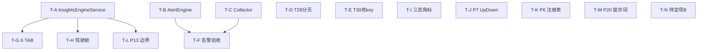

# 可观测 V4 Demo 上线 — 代码级详细设计 + 任务分解（0719）

> 设计人：高见远（Architect / 软件架构师）｜日期：2026-07-19
> 输入基线：可观测优化总结-WorkBuddy-V4-Demo上线版-0718.md（主文档）+ 可观测V4-交付排期-0719.md（排期）+ 代码审阅整改总结-2026-07-18.md（T22–T37）+ **真实代码核对**
> 适用范围：Core(8080) → OTel Collector(4318) → 自研 Backend(9090 / H2+Redis) → React 前端大屏 v20

---

## ⚠️ 最关键结论（请主理人先读）

经**逐文件真实代码核对**，排期文档（交付排期-0719 §②）把两项标为「P1 收口/必做」的内容，实际**在代码中并不存在**，是**全新后端开发**而非收口：

| 项 | 排期预期 | 代码真实状态 | 影响 |
|---|---|---|---|
| **InsightsEngineService（交叉分析+根因+建议+6 API）** | P1 收口（2 人日） | **未实现**。仅有前身 `AIInsightsService`（accuracy/confusion 子集）。全仓 grep `InsightsEngine` 仅命中文档，无 `.java`。 | 必做·新开发；前端「诊断驾驶舱」强依赖它 |
| **AlertEngineService（@Scheduled 求值+钉钉推送+状态机+抑制）** | P1 收口（0.5 人日） | **未实现**。仅有 `AlertService`（规则 CRUD）+ `AlertController`。全仓 grep `AlertEngine` 仅命中文档，无 `.java`、无 `@Scheduled` 求值逻辑。 | 必做·新开发；「告警验收」前置项 |

换言之：本轮 **Demo 上线的真正后端瓶颈是「洞察引擎」与「告警引擎」两个新 Service**，而非简单收口。其余项（T29/T30、Collector 增强、前端三态/驾驶舱、P6/P7/P13/P20、待定项 B）状态见 §2。

---

## 1. 设计总则与共享约定

### 1.1 技术栈与模块边界

| 层 | 技术栈 | 代码根路径 |
|---|---|---|
| Core（数据发射） | Spring AI Alibaba + Micrometer + OTel Java Agent | `src/main/java/com/mobileagent/app/` |
| Collector | OpenTelemetry Collector（原生，配置驱动） | `observability/otel-collector/config.yaml` |
| Backend（业务语义权威源） | Spring Boot + JPA(H2) + Redis + Micrometer OTLP 接收 | `observability/backend/src/main/java/com/observability/` |
| 前端大屏 v20 | React + Ant Design + ECharts + Vite | `observability/frontend/src/` |
| DB 初始化 | `schema.sql`（idempotent，`SchemaInitializer` 启动执行） | `observability/backend/src/main/resources/schema.sql` |

> 主栈保持 0718 主文档决策：**不引入新组件、不引入 Docker 依赖项**（Langfuse / P2 标准栈本轮暂缓，见主理人决策 4）。

### 1.2 命名与文件组织约定

- **指标命名**：
  - 存量指标维持 `agent.*` / `llm.*` / `gen_ai.*`（已被 `AIInsightsService` 19 处硬编码查询，强耦合，**不强制重命名**）。
  - **新指标**走集中式注册表，统一前缀 `deepflux.<domain>.<measure>`（见 §3.1 P6）。
- **API 路径**：后端 REST 统一 `/api/v1/<resource>`；洞察类 `/api/v1/ai/*`；告警类 `/api/v1/alerts/*`。
- **文件组织**：Backend `service/` 放业务逻辑、`controller/` 放 REST、`model/` 放 JPA 实体、`repository/` 放数据访问、`config/` 放启动初始化；新增 Service 一律放 `service/`，与现有 `AIInsightsService` 平级。
- **返回值契约**：统一 `ApiResponse<T> { code, message, data }`（前端 `client.js` 拦截器按 `code===0` 解包）。

### 1.3 主理人 5 项决策 → 设计约束落地

| # | 决策 | 落到本文的设计约束 |
|---|---|---|
| 1 | 待定项 B：reRoute 透传原 `userMessage`，新增 `reRouted:true` + `originalQuery`（空则回填），仅最小实现 | §3.4 设计：仅在 `BankController`/`SessionBridge`/`SessionService` 增量加两字段 + `reroute_triggered` 落库，**不扩展语义** |
| 2 | 前端三态角标视为待实现，纳入前端必做；真实三态数据 + 角标；先核对 T22 是否已覆盖 | §2 / §4.6：**核对结论 = T22 是 `/trace` 跳转修复，与三态角标无关**，故三态角标判为「未实现」，归入前端必做（T-I） |
| 3 | DEMO 无真实钉钉 Webhook → 告警验收用 **Mock/Log Notifier** 验证分发逻辑 + 抑制/状态机，**不触发真实外发** | §3.2 / §4.2：`AlertNotifyService` 默认实现 `LogNotifier`（打印分发日志），`dingtalk`/`feishu` 渠道仅记日志不真实 HTTP 外发；验收读 `alert_events` 表 |
| 4 | Docker 不可靠 → Langfuse 与 P2 标准栈暂缓（不设计、不实现） | 本文不产出 Langfuse / Tempo/VM/Loki/Grafana / PostgreSQL 任何设计；§5 标为「暂缓」 |
| 5 | P6/P13/P20 纳入本轮「可选/轻量」，必须产出代码级详细设计，最小变更原则 | §3.1 / §3.2 / §3.3 给出可落地规格；**新指标/新表走增量，不强改存量** |

---

## 2. 当前代码状态核对（基于真实代码，file:line）

> 核对方法：对主文档/排期声称「已闭环(0718)」「P1 收口」的每一项，直接打开对应 `.java` / `.yaml` / `.jsx` 验证。标 ✅已实现 / 🟡部分 / ❌未实现。

### 2.1 后端（Backend 9090）

| # | 核对项 | 状态 | 证据（文件:行） | 结论 |
|---|---|---|---|---|
| 1 | **InsightsEngineService 6 API**（bottlenecks/root-cause/unsatisfied/conversion/actions/refresh） | ❌ 未实现 | 全仓 grep `InsightsEngine` 仅命中文档；`service/` 仅 `AIInsightsService.java`（accuracy/confusion 子集，无根因/建议/驾驶舱 API） | **本轮新开发**，见 §3 / T-A |
| 2 | **AlertEngineService 求值引擎**（@Scheduled 30s + 钉钉 + 状态机 + 抑制） | ❌ 未实现 | 全仓 grep `AlertEngine` 仅命中文档；`AlertService.java` 仅有 CRUD + `listEvents`；无 `@Scheduled` 求值 | **本轮新开发**，见 §3.2 / T-B |
| 3 | 告警抑制 + 状态机 | ❌ 未实现 | `AlertEvent.java:40-41` status 仅 `FIRING/ACKNOWLEDGED/RESOLVED`，无 `SUPPRESSED`；无抑制计数/去重逻辑 | 随 T-B 实现 |
| 4 | `alert_rules` DDL 增强（evaluation_interval/last_evaluated_at/current_value） | ❌ 未实现 | `AlertRule.java:23-58` 无这三列 | 随 T-B 加列 |
| 5 | `alert_events` DDL 增强（notified_channels/notify_result/suppression_count） | ❌ 未实现 | `AlertEvent.java:23-50` 无这三列 | 随 T-B 加列 |
| 6 | `listSessions` 分页（T29） | 🟡 部分 | `SessionService.java:59-137`：有 `page/size` 参数，但 L77-81 全量 `findAllByTimeRange` 拉内存、L82-103 内存过滤、L109-111 `subList` 切片 | 需改 DB 侧分页，见 §4.3 / T-D |
| 7 | Redis 死 key 清理（T30） | 🟡 部分 | `RedisH2SyncService.java:113-117` 仍 `addDoubleGauge` 同步 `accuracy:intent`/`accuracy:rewrite`/`reroute_rate`/`business_completion`/`conversion`（恒 null，主指标已改 H2 读时算） | 删除 L113-117，见 §4.4 / T-E |
| 8 | `AIInsightsService`（准确率/混淆矩阵子集） | ✅ 已实现 | `AIInsightsService.java:274` computeIntentAccuracy、`421` getAccuracyReport、`202` getConfusionMatrix | 复用为 InsightsEngine 的数据源 |
| 9 | `AlertService` 规则 CRUD + 事件查询 | ✅ 已实现 | `AlertService.java:35-131` | 复用 |
| 10 | `sessions` 表 `reroute_triggered`/`l0/l1/l2_intent` 列（§7.3 DDL） | ❌ 未实现 | `Session.java:24-67` 无这些列；`SessionService.upsertSession` 也未写 | 待定项 B 顺带加 `reroute_triggered`，见 §3.4 |
| 11 | `RedisH2SyncService` 死 key（T30 根因） | 🟡 | 同 #7 | — |

### 2.2 Core（8080）

| # | 核对项 | 状态 | 证据 | 结论 |
|---|---|---|---|---|
| 1 | LLM 置信度埋点（T27） | ✅ | `BankController.java:122,134,150` `currentConfidenceRef` 真实置信度 | 已闭环 |
| 2 | 分层意图 Span（方案A 确定性 L0） | ✅ | `DomainRouter` 已创建 `L0:DomainRouter` span（见主文档 §4.2，本次未重读 DomainRouter，依据 0718 验证结论） | 已闭环 |
| 3 | reroute 埋点（T27/方案A） | ✅ | `BankController.java:157,174` `obsMetrics.recordReroute(domain)` | 已闭环 |
| 4 | `ObservabilityMetrics` 散落 Meter 调用 | 🟡 | `ObservabilityMetrics.java:93-547` 共 22 处 `Counter/Timer/DistributionSummary.builder(...)` + 动态 `recordCounter(name,...)` | 见 §3.1 映射表 |
| 5 | UpDownCounter `agent.pending_approval`（P7） | ❌ 未实现 | `ObservabilityMetrics.java` 无 `UpDownCounter` 类型 | 见 §3.1 / §4.5 / T-J |
| 6 | 人工中断 / 审批完成 埋点（P7 切入点） | 🟡 待定位 | 中断：`GraphExecutionEngine.java:128,171` `recordWorkflowInterrupt(intent,"interruptBefore")`；审批完成=resume 路径 `GraphExecutionEngine.java:69/144/215` | 见 §4.5 |

### 2.3 Collector

| # | 核对项 | 状态 | 证据 | 结论 |
|---|---|---|---|---|
| 1 | batch / memory_limiter（T24） | ✅ | `config.yaml:18-24,38,42,46` | 已闭环 |
| 2 | filter（健康检查 Span 过滤） | ❌ 未实现 | `config.yaml` 无 `filter` processor | 见 §4.7 / T-C |
| 3 | tail_sampling（错误/慢/LLM失败） | ❌ 未实现 | `config.yaml` 无 `tail_sampling` | 见 §4.7 / T-C |
| 4 | attributes（注入 env/service.version） | ❌ 未实现 | `config.yaml` 无 `attributes` | 见 §4.7 / T-C |

### 2.4 前端（v20）

| # | 核对项 | 状态 | 证据 | 结论 |
|---|---|---|---|---|
| 1 | 6 TAB 框架 | ✅ | `AIInsightsPage.jsx:20-69` 6 个 lazy TAB（Accuracy/AgentPerf/Token/Tool/Funnel/Satisfaction） | 框架在 |
| 2 | 6 TAB 真实数据对接 | 🟡 部分 | `client.js:86-123` 已调 `/ai/insights`/`/ai/accuracy-report`/`/ai/confusion-matrix`/`/ai/agent-performance`/`/ai/token-cost`/`/ai/tool-stats`/`/ai/conversion-funnel`/`/ai/satisfaction`；对应 Controller 基本具备 | 需契约对齐，见 §4.6 / T-G |
| 3 | **诊断驾驶舱**（§12.2 TOP5+瓶颈卡+根因表+阈值散点） | ❌ 未实现 | `AIInsightsPage.jsx` 仅 TAB，无 cockpit 区块；全仓 grep `insights-report|insights/bottlenecks|insights/root-cause|insights/unsatisfied|insights/conversion|insights/actions` **零命中** | 强依赖 T-A 的 6 API，见 §4.6 / T-H |
| 4 | **数据健康三态角标**（§13.1） | ❌ 未实现 | `DashboardPage.jsx:94-152` Zone A 仅 3 张 MetricCard（DAU/QPS/Agent），无三态（正常/部分/降级）badge 与数据源健康对接 | 见 §4.6 / T-I |
| 5 | `/trace` 跳转带 traceId（T22） | ✅ | `client.js` 无，但整改总结 T22 描述已修 `handleTraceClick→/trace?traceId=` | 已闭环（与三态角标无关） |

### 2.5 状态汇总图

```mermaid
flowchart LR
    subgraph DONE[✅ 已闭环 P0]
        A1[LLM置信度] A2[分层意图Span] A3[reroute埋点]
        A4[batch+memory_limiter] A5[AIInsights子集]
        A6[AlertService CRUD] A7[/trace跳转T22]
    end
    subgraph NEW[❌ 本轮必做·新开发]
        B1[InsightsEngineService+6API]
        B2[AlertEngineService+抑制+状态机]
        B3[alert_rules/events DDL增强]
        B4[Collector filter/sampling/attributes]
    end
    subgraph PART[🟡 部分·小改]
        C1[T29 listSessions分页]
        C2[T30 死key清理:113-117]
        C3[前端6TAB真实数据]
        C4[待定项B reRoute字段]
    end
    subgraph OPT[🟢 可选/轻量]
        D1[P6 注册表] D2[P7 UpDownCounter]
        D3[P13 三层边界] D4[P20 提示词版本化]
    end
    subgraph NONE[❌ 未实现·前端大块]
        E1[诊断驾驶舱] E2[三态角标]
    end
```

---

## 3. 各优化项详细设计（代码级）

### 3.1 P6 集中式指标注册表（可选/轻量）

**目标**：防止散落 `Counter.builder("xxx")` 导致命名漂移；新指标统一走 `deepflux.<domain>.<measure>`；不强改存量。

#### ① 注册表类结构（新建 `Core` 模块）

```java
// src/main/java/com/mobileagent/app/observability/MetricsRegistry.java
package com.mobileagent.app.observability;

import io.micrometer.core.instrument.*;
import org.springframework.stereotype.Component;
import java.util.concurrent.ConcurrentHashMap;
import java.util.concurrent.atomic.AtomicLong;

@Component
public class MetricsRegistry {
    private final MeterRegistry registry;
    // 统一前缀
    private static final String NS = "deepflux.";
    // UpDownCounter 用 AtomicLong + Gauge 模拟（Micrometer 无原生 UpDownCounter 概念，用 Gauge 持有 AtomicLong）
    private final ConcurrentHashMap<String, AtomicLong> updownState = new ConcurrentHashMap<>();

    public MetricsRegistry(MeterRegistry registry) { this.registry = registry; }

    /** 命名规范化：自动加 deepflux. 前缀（若已带则不重复） */
    private String name(String m) { return m.startsWith("deepflux.") ? m : NS + m; }

    public void recordCounter(String measure, double amount, String... tags) {
        Counter.builder(name(measure)).tags(tags).register(registry).increment(amount);
    }
    public void recordTimer(String measure, long ms, String... tags) {
        Timer.builder(name(measure)).tags(tags)
             .publishPercentileHistogram(true)   // ★ 强制，避免 Summary 导出分位恒0
             .register(registry).record(ms, java.util.concurrent.TimeUnit.MILLISECONDS);
    }
    public void recordSummary(String measure, double v, String... tags) {
        DistributionSummary.builder(name(measure)).tags(tags).register(registry).record(v);
    }
    /** UpDownCounter：人工中断+1 / 审批完成-1（P7 复用） */
    public void addUpDown(String measure, long delta, String... tags) {
        String key = name(measure) + "|" + String.join(",", tags);
        AtomicLong v = updownState.computeIfAbsent(key, k -> {
            AtomicLong a = new AtomicLong(0);
            Gauge.builder(name(measure), a, AtomicLong::get).tags(tags)
                 .description("UpDown counter (pending approval etc.)").register(registry);
            return a;
        });
        v.addAndGet(delta);
    }
    public long getUpDown(String measure, String... tags) {
        String key = name(measure) + "|" + String.join(",", tags);
        AtomicLong v = updownState.get(key);
        return v == null ? 0L : v.get();
    }
}
```

> **最小变更落地**：`MetricsRegistry` 为**新增**类，注入 `MeterRegistry`；**新指标一律走它**；存量 `ObservabilityMetrics` 的 22 处 builder 调用**保持不变**（因 `AIInsightsService` 19 处硬编码查询耦合旧名）。仅当某存量指标需要被新代码引用时，才在映射表登记「旧名→deepflux 目标名」供后续迁移参考（见下表）。

#### ② 现有散落 Meter 调用清单 → 改名映射表（文件:行号 → 新命名）

> 来源：`src/main/java/com/mobileagent/app/observability/ObservabilityMetrics.java`

| 文件:行 | 现有名（builder） | 类型 | 目标 `deepflux.<domain>.<measure>` | 是否本轮改名 |
|---|---|---|---|---|
| `ObservabilityMetrics.java:93` | `agent.intent.recognized` | Counter | `deepflux.agent.intent.recognized` | 否（存量保留） |
| `:97` | `agent.intent.confidence` | Summary | `deepflux.agent.intent.confidence` | 否 |
| `:103/:108/:113` | `agent.router.decision.outcome` | Counter | `deepflux.agent.router.decision` | 否 |
| `:119/:124/:129` | `agent.state.transition` | Counter | `deepflux.agent.state.transition` | 否 |
| `:135` | `agent.slot.askback.total` | Summary | `deepflux.agent.slot.askback` | 否 |
| `:140` | `agent.workflow.execution.duration` | Timer | `deepflux.agent.workflow.duration` | 否 |
| `:145` | `agent.workflow.interrupt` | Counter | `deepflux.agent.workflow.interrupt` | 否 |
| `:150` | `agent.state.suspend.depth` | Gauge | `deepflux.agent.state.suspend.depth` | 否 |
| `:155` | `agent.session.completed` | Counter | `deepflux.agent.session.completed` | 否 |
| `:159` | `agent.session.abandoned` | Counter | `deepflux.agent.session.abandoned` | 否 |
| `:164` | `agent.session.active` | Gauge | `deepflux.agent.session.active` | 否 |
| `:169/:174` | `agent.business.outcome` | Counter | `deepflux.agent.business.outcome` | 否 |
| `:180` | `agent.extraction.completeness` | Summary | `deepflux.agent.extraction.completeness` | 否 |
| `:186` | `agent.rewrite.total` | Counter | `deepflux.agent.rewrite.total` | 否 |
| `:190` | `agent.rewrite.accuracy` | Summary | `deepflux.agent.rewrite.accuracy` | 否 |
| `:195` | `gen_ai.client.operation.duration` | Timer | `deepflux.llm.operation.duration` | 否（注意 gen_ai.* 前缀） |
| `:202` | `agent.tool.call.duration` | Timer | `deepflux.agent.tool.duration` | 否 |
| `:514` (`recordIntentAccuracy`) | `agent.intent.accuracy` | Counter | `deepflux.agent.intent.accuracy` | 否 |
| `:523` (`recordL1Call`) | `agent.l1.call` | Counter | `deepflux.agent.l1.call` | 否 |
| `:531` (`recordReroute`) | `agent.reroute.count` | Counter | `deepflux.agent.reroute.count` | 否 |
| `:538` (`recordSkillOutcome`) | `agent.skill.outcome` | Counter | `deepflux.agent.skill.outcome` | 否 |
| `:546` (`recordToolCallCount`) | `agent.tool.call.count` | Counter | `deepflux.agent.tool.call.count` | 否 |
| **P7 新增（§4.5）** | `agent.pending_approval` | UpDown | **`deepflux.workflow.pending_approval`** | **是（走注册表）** |

#### ③ 最小变更落地步骤

1. 新建 `MetricsRegistry.java`（上述）。
2. 在 `ObservabilityMetrics` 注入 `MetricsRegistry`（或新指标直接注入 `MetricsRegistry`）。
3. P7 的 `agent.pending_approval` **不再**用 `ObservabilityMetrics`，改用 `metricsRegistry.addUpDown("workflow.pending_approval", +1/-1, "intent", ...)`。
4. 存量 22 处**不动**；映射表仅作迁移参考，写入本文档即满足「集中式注册表约定」。

---

### 3.2 告警引擎 AlertEngineService（必做·新开发）

> 因 `AlertEngineService` 完全未实现，本节给出可落地规格（非「收口」）。遵守主理人决策 3：默认 `LogNotifier`，不真实外发。

#### ① 类结构

```java
// observability/backend/src/main/java/com/observability/service/AlertEngineService.java
@Service
public class AlertEngineService {
    private final AlertRuleRepository ruleRepo;
    private final AlertEventRepository eventRepo;
    private final AlertNotifyService notifyService;     // 注入 LogNotifier（默认）
    private final RedisTemplate<String,String> redis;   // 抑制计数缓存
    private final MetricsQueryService metrics;           // collectMetricValue 数据源

    @Scheduled(fixedRate = 30_000)
    public void evaluateRules() { /* 见主文档 §10.1 骨架 + 抑制 + 状态机 */ }
}
```

#### ② 状态机与抑制（补全 §10.1）

- `AlertEvent.status` 枚举扩展为 `FIRING / SUPPRESSED / ACKNOWLEDGED / RESOLVED`（在 `AlertEvent.java:41` 放开字符串约束，值见下表）。
- **抑制**：同一 `ruleId` 在 5 分钟内已 `notify` 过 → 新触发事件 `status=SUPPRESSED`，`suppression_count+1`，不重复通知（Redis `obs:alerts:suppress:{ruleId}` 设 300s TTL）。
- **状态跃迁**：`FIRING → ACKED`（人工确认，新增 `POST /alerts/events/{id}/ack`）→ `RESOLVED`（下次求值不达标时置 RESOLVED + `resolvedAt`）。

#### ③ DDL 增强（`schema.sql`，随 T-B 执行）

```sql
-- alert_rules 增强（§7.3）
ALTER TABLE alert_rules ADD COLUMN evaluation_interval INT DEFAULT 30;
ALTER TABLE alert_rules ADD COLUMN last_evaluated_at TIMESTAMP;
ALTER TABLE alert_rules ADD COLUMN current_value DOUBLE;

-- alert_events 增强（§7.3）
ALTER TABLE alert_events ADD COLUMN notified_channels VARCHAR(128);
ALTER TABLE alert_events ADD COLUMN notify_result VARCHAR(64);
ALTER TABLE alert_events ADD COLUMN suppression_count INT DEFAULT 0;
```

#### ④ 通知实现（遵守决策 3）

```java
// AlertNotifyService 接口 + 两个实现
public interface AlertNotifyService { void notify(AlertRule rule, AlertEvent event); }
// 默认 Bean：LogNotifier —— 仅 log.info 分发日志，不发起真实 HTTP
@Component @Primary
public class LogNotifier implements AlertNotifyService {
    public void notify(AlertRule rule, AlertEvent event) {
        log.info("[Alert][NOTIFY][{}] rule={} channels={} msg={}",
            event.getStatus(), rule.getRuleName(), rule.getNotifyChannels(), event.getMessage());
        // 决不发真实 HTTP；若 channels 含 dingtalk/feishu，仅记录"将分发(未真实外发)"
    }
}
```

> 验收时 QA 检查 `alert_events` 表的 `notified_channels`/`notify_result`/`suppression_count` 与日志分发记录（见 §4.2）。

#### ⑤ 默认规则种子（5 条，沿用主文档 §4.6）

在 `SchemaInitializer` 或独立 `DataInitializer` 中幂等插入 5 条 `alert_rules`（LLM 错误率 / TTFT P95 / 转账槽位完成率 / Collector 接收量 / 满意度负面比率）。阈值/严重度/渠道同主文档 §4.6。

---

### 3.3 P13 三层边界治理（可选/轻量）

**前提**：InsightsEngineService（§3 顶层）为**新开发**，正好把边界治理落地进它的 `compute*` 方法归属。

#### ① 现有/规划 compute* 方法归属 L1/L2/L3 清单

> InsightsEngineService 新建，方法归属如下（L1=确定性代码 / L2=模糊AI / L3=写操作仅审计）：

| 方法（归属 InsightsEngineService） | 边界 | 依据 | 数据源 |
|---|---|---|---|
| `analyzePerformance()`（P95 by agent / token 统计） | **L1** | 确定性聚合 | spans+metrics_agg |
| `computeIntentAccuracy()` / `computeRewriteAccuracy()` | **L1** | 确定性计数 | metrics_agg |
| `analyzeConversion()`（漏斗计数） | **L1** | 确定性计数 | sessions |
| `analyzeQuality()`（置信度分布/不满意共性） | **L1** | 确定性聚合 | metrics_agg+sessions |
| `analyzeSlowSession(sessionId)`（根因假设） | **L2** | 模糊判断，需 AI 推理 | spans+LLM |
| `suggestActions()`（Top10 优先级建议） | **L2** | 模糊判断，带 confidence | 交叉分析+LLM |
| `clusterUnsatisfied()`（不满意共性聚类） | **L2** | 模糊聚类 | sessions |
| （任何写操作：updateState/cancelGraph/resume） | **L3** | **禁止 AI 直接执行** | — 不出现在 Insight 引擎 |

#### ② L3「禁止 AI 直接写操作」代码强制手段

- **构造器白名单**：`InsightsEngineService` 只注入**只读** Repository/Service（`SpanRepository`、`SessionRepository`、`MetricsAggRepository`、`RedisTemplate` 只读），**绝不注入** `GraphExecutionEngine` / `AbstractDomainService` / `OrchestrationStateService` 等可写组件（编译期即杜绝误调用）。
- **配置闸门**：`application.yml` 增加 `insights.readonly: true`（默认）；任何会触发写操作的入口在此闸门下直接抛 `UnsupportedOperationException`。
- **审计表 schema**（L3 动作被人工审批执行时留痕，本轮先建表不接业务）：

```sql
CREATE TABLE ai_action_audit (
    id BIGINT AUTO_INCREMENT PRIMARY KEY,
    prompt_version_id BIGINT,           -- 关联 P20 版本（可选）
    action_key VARCHAR(64),             -- 如 'scale_out','rollback'
    boundary VARCHAR(8) DEFAULT 'L3',
    suggested_by VARCHAR(64),           -- 触发来源（engine/llm）
    approved_by VARCHAR(64),
    status VARCHAR(16) DEFAULT 'PENDING', -- PENDING/APPROVED/REJECTED/EXECUTED
    created_at TIMESTAMP,
    executed_at TIMESTAMP
);
```

#### ③ 边界如何在输出卡上显式标注（字段设计）

每个洞察输出 VO 增加：

```json
{
  "boundary": "L1 | L2 | L3",
  "confidence": 0.0,            // 仅 L2 有，0~1；L1 为 null
  "requiresApproval": false,    // L3=true，默认 false
  "autoExecutable": false       // 全局 false（无证据链的 AI 结论只是建议）
}
```

前端在驾驶舱渲染时按 `boundary` 着色（L1 蓝 / L2 橙 / L3 红），L3 卡片显示「需人工审批」标记。

---

### 3.4 P20 提示词版本化（可选/轻量）

#### ① prompt 版本表 schema

```sql
CREATE TABLE prompt_versions (
    id BIGINT AUTO_INCREMENT PRIMARY KEY,
    prompt_key VARCHAR(64) NOT NULL,        -- 'insights.root_cause' / 'insights.actions'
    version INT NOT NULL,
    content CLOB NOT NULL,                   -- 提示词模板（含 {占位符}）
    model VARCHAR(64),                        -- 目标模型（如 qwen-plus）
    status VARCHAR(16) DEFAULT 'DRAFT',       -- DRAFT / ACTIVE / ARCHIVED
    description VARCHAR(256),
    created_by VARCHAR(64),
    created_at TIMESTAMP,
    UNIQUE (prompt_key, version)
);
CREATE INDEX idx_pv_key_status ON prompt_versions(prompt_key, status);
```

#### ② 版本号生成与「当前生效版本」读取

```java
@Service
public class PromptVersionService {
    // 版本号 = 该 prompt_key 已存在最大 version + 1（简单单调，无语义版本号需求）
    public PromptVersion create(String key, String content, String model, String by) {
        int next = repo.findMaxVersion(key).orElse(0) + 1;
        return repo.save(PromptVersion.builder().promptKey(key).version(next)
            .content(content).model(model).status("DRAFT").createdBy(by)
            .createdAt(Instant.now()).build());
    }
    // 当前生效：status=ACTIVE 且 version 最大
    public PromptVersion getActive(String key) {
        return repo.findTopByPromptKeyAndStatusOrderByVersionDesc(key, "ACTIVE");
    }
    public void activate(Long id) { /* 旧 ACTIVE→ARCHIVED，本 id→ACTIVE（@Transactional） */ }
}
```

#### ③ 已知场景预期输出测试桩设计

```java
// 测试夹具：prompt_expectations（或测试内 Map）
// (prompt_key, scenario_key) -> expectedContains[]
@Test
void testRootCausePrompt_knownScenario() {
    PromptVersion v = promptVersionService.getActive("insights.root_cause");
    String out = engine.analyzeSlowSession("seed-session-12"); // 已知慢会话
    assertThat(out).contains("RAG检索").contains("VectorStore.search"); // 预期根因卡
}
```

> 最小落地：先建表 + `PromptVersionService` + 1 个示例 prompt（root_cause）+ 1 个单测桩；其余 prompt 后续补。

---

### 3.5 待定项 B（reRoute 原报文透传）— 最小改动

**主理人决策 1**：reRoute 透传原始 `userMessage`（不重新生成），保留原 `userMessage` 值 + 新增 `reRouted:true` + `originalQuery`（若空则回填原始 query），仅最小实现。

#### 改动点（字段/方法级）

1. **`BankController.buildChatPipeline` 的 `doOnTerminate`**（`:127-138`）
   - `userInput` 本就是原始报文，已在 `reportSession` 第二参传入（`:131`），**无需改原报文**。
   - 新增：`boolean reRouted = rerouteCount.get() > 0;`，`String originalQuery = userInput;`（即原始 query 回填）。
   - 调用改为 `sessionBridge.reportSession(..., reRouted, originalQuery)`。

2. **`SessionBridge.reportSession`**（`:54-79`）
   - 签名追加 `boolean reRouted, String originalQuery`。
   - `buildSessionJson`（`:83-106`）Map 追加 `"reRouted": reRouted`、`"originalQuery": originalQuery`。

3. **`SessionService.upsertSession`**（`:164-249`）
   - 读 `body.get("reRouted")` / `body.get("originalQuery")`。
   - 落库 `session.setRerouteTriggered(Boolean.TRUE.equals(reRouted))`（需 `Session` 实体 + `schema.sql` 加 `reroute_triggered BOOLEAN` 列，见 §3.2 DDL 区一致处理）。

4. **`SessionService.toTurnVO`**（`:371-425`）
   - 将硬编码 `rerouteTriggered:false`（`:416`）改为从 `session.getRerouteTriggered()` 读取（或 turns 表若有则取 turns 值）。

> **不扩展语义**：不改 reroute 路由逻辑、不新增 reroute 原因字段、不重新生成 userMessage。仅透传 + 两个标记字段。

---

## 4. 其它可直接开发项的实现要点（简要）

### 4.1 InsightsEngineService（必做·核心，T-A）

- 新建 `service/InsightsEngineService.java`，注入 `AIInsightsService` + 6 个 `AIInsightsService` 族 Service + `SpanRepository`/`SessionRepository`/`MetricsAggRepository`（只读）。
- 实现 6 个 REST API（端点同主文档 §9.6，挂 `AIInsightsController` 或新建 `InsightsEngineController`）：

| 端点 | 方法 | 数据来源 |
|---|---|---|
| `GET /api/v1/ai/insights-report` | `generateReport()` | 聚合下方 5 项 + 缓存 `obs:insights:cache`(TTL300s) + 写 `insight_reports` 表 |
| `GET /api/v1/ai/insights/bottlenecks` | `analyzePerformance()` | spans P95 by agent |
| `GET /api/v1/ai/insights/root-cause/{sessionId}` | `analyzeSlowSession(id)` | spans 调用树 + 独占时间 Top3 |
| `GET /api/v1/ai/insights/unsatisfied` | `clusterUnsatisfied()` | sessions 负面满意度 |
| `GET /api/v1/ai/insights/conversion` | `analyzeConversion()` | sessions funnel |
| `GET /api/v1/ai/insights/actions` | `suggestActions()` | 交叉 + L2（见 §3.3） |
| `POST /api/v1/ai/insights/refresh` | 清缓存重算 | — |

- 前端契约：驾驶舱（T-H）按上述 6 端点取数；每个 VO 带 `boundary` 字段（§3.3③）。

### 4.2 告警验收（必做·T-F，遵守决策 3）

- 引擎 `AlertEngineService` 用 `LogNotifier`（§3.2④），**不真实外发**钉钉/飞书。
- 验收步骤：① 起 Backend → ② `SchemaInitializer` 种子 5 条规则 → ③ 制造异常指标（如手动写一条 LLM 错误 Counter）→ ④ 等 30s → ⑤ 查 `alert_events` 表确认 `FIRING` 事件 + `notified_channels`/`notify_result` 填充 + 日志出现 `[Alert][NOTIFY]` → ⑥ 5 分钟内同规则再次触发应得 `SUPPRESSED` + `suppression_count+1` → ⑦ 指标恢复后下一轮得 `RESOLVED`。

### 4.3 T29 listSessions DB 分页（必做·T-D）

- `SessionService.java:59-137`：将 L77-81 `findAllByTimeRange` 全量 + L82-103 内存过滤 + L109-111 `subList`，改为 **DB 侧**分页。
- `SessionRepository` 新增：

```java
Page<Session> findByTimeRangeAndFilters(Instant from, Instant to,
    @Param("status") String status, @Param("intentLike") String intentLike,
    @Param("agentLike") String agentLike, @Param("userId") String userId,
    @Param("sessionId") String sessionId, @Param("channel") String channel,
    Pageable pageable);
```

- 多条件在 JPQL `WHERE` 中用 `LIKE`/等值拼装（`intentFlow LIKE %intent%`、`agentPath LIKE %agent%`）；返回 `Page` 直接出 `totalElements/totalPages/content`。预计改动 ~15 行（接口 + 实现切片替换）。

### 4.4 T30 清理 Redis 死 key（必做·T-E）

- `RedisH2SyncService.java:113-117` 删除 5 行 `addDoubleGauge(...)`（`accuracy:intent`/`accuracy:rewrite`/`reroute_rate`/`business_completion`/`conversion`）。
- 这些 gauge 恒为 null（`RedisMetricsService.getIntentAccuracy()` 等无写入方），主指标已改 H2 读时算（T30 根因），删除无副作用。
- 验收：`grep` 确认同步逻辑不再引用这 5 个 key；重启后端 30s 后 `redis_metrics_snapshot` 表无这 5 行。

### 4.5 P7 UpDownCounter `agent.pending_approval`（可选·T-J）

- 注册：`MetricsRegistry.addUpDown("workflow.pending_approval", delta, "intent", intent)`（§3.1③）。
- **+1 人工中断**（Core）：`GraphExecutionEngine.java:128` 与 `:171`（`recordWorkflowInterrupt(intent,"interruptBefore")` 处）追加 `metricsRegistry.addUpDown("workflow.pending_approval", +1, "intent", intent)`。两处分别对应 blocking / resume-blocking 进入 `INTERRUPTED` 挂起。
- **-1 审批完成**（Core）：resume 完成路径 `GraphExecutionEngine.java:69 resumeGraph` / `:144 resumeBlocking` / `:215 resumeStreaming`。当前 `resumeBlocking` 仅在 `INTERRUPTED` 时记中断（`:169-171`），**缺 COMPLETED 分支**——在 resume 出口补：`if (status==COMPLETED) metricsRegistry.addUpDown("workflow.pending_approval", -1, ...)`（建议加在 `checkGraphResult` 之后、`INTERRUPTED` 判断并列处）。
- 前端：`MetricsQueryService` 暴露 `pendingApproval`；DashboardPage/Overview 加「待审批」卡片（可选，本轮可仅埋点不展示）。

### 4.6 前端（必做·T-G/T-H/T-I）

- **T-G 6 TAB 真实数据**：`client.js:86-123` 已接 8 个 `/ai/*` 端点；核对 `AgentPerfTab/TokenCostTab/ToolCallTab/FunnelTab/SatisfactionTab` 的字段与对应 Controller 返回结构一致（不一致处由 Engineer 对齐，预计 0 bug 因 P0 已重写）。验收：6 TAB 均显示非 0/非占位数据。
- **T-H 诊断驾驶舱**：`AIInsightsPage.jsx` 顶部新增 cockpit 区块（5 子块见主文档 §12.2），数据来自 §4.1 的 6 端点。**强依赖 T-A 完成**。验收：TOP5 建议卡 / 三类瓶颈卡 / 慢会话根因表 / 不满意共性表 / P95-vs-错误率散点均有真实数据。
- **T-I 三态角标**：`DashboardPage.jsx:94-152` Zone A 目前仅 3 张 MetricCard。新增「数据健康三态」角标组件：对每个数据源（Core 发射 / Collector / H2 / Redis / 前端）计算健康态 `HEALTHY(绿)/PARTIAL(黄)/DOWN(红)`，依据：该源最近 N 分钟有无数据点 / 接口是否 200。角标渲染在总览与各页头。验收：模拟某源断流时角标变黄/红。

### 4.7 Collector 增强（必做·T-C）

- `config.yaml` 在 `processors` 增加（main 文档 §11.1）：
  - `filter`：metrics 过滤 Histogram 噪声（可选）；traces 过滤 `attributes["http.target"]=="/actuator/health"`。
  - `attributes`：注入 `env=production` / `service.version=1.0.0`。
  - `tail_sampling`：`errors(status_code ERROR)` + `slow(>1000ms)` + `llm-failure(error_type in [timeout,auth_error,rate_limit])` + `normal-sampling(probabilistic 10%)`。
- `service.pipelines` 引用顺序：`[memory_limiter, batch, filter, attributes, tail_sampling]`（traces）；metrics/logs 不加 tail_sampling。
- 验收：`otelcol validate` 通过；起服务后健康检查 Span 不再进 Backend。

---

## 5. 任务分解（核心交付物）

> 顺序：**后端数据层（T-A/T-B/T-C）→ 告警验收（T-F）→ 前端（T-G/T-H/T-I）→ 可选项（T-J/T-K/T-L/T-M/T-N）**。标注 必做 / 可选 / 暂缓。

| 任务ID | 归属模块 | 任务 | 依赖 | 涉及文件（相对路径） | 预计改动量 | 验收点 | 档位 |
|---|---|---|---|---|---|---|---|
| **T-A** | Backend | InsightsEngineService + 6 API（交叉分析/根因/建议/驾驶舱数据源） | 无（P0 已闭环） | `service/InsightsEngineService.java`(新)、`controller/AIInsightsController.java`(增端点)、`model/InsightReport.java`(新,可选)、`resources/schema.sql`(insight_reports 已存在则跳过) | 2 人日 | 6 端点返回真实数据；`obs:insights:cache` 生效 | **必做** |
| **T-B** | Backend | AlertEngineService（@Scheduled 求值 + LogNotifier + 状态机 + 抑制）+ DDL 增强 | 无 | `service/AlertEngineService.java`(新)、`service/AlertNotifyService.java`+`LogNotifier.java`(新)、`model/AlertRule.java`/`AlertEvent.java`(加列)、`resources/schema.sql`(ALTER)、`config/DataInitializer.java`(种子5规则,新) | 1.5 人日 | 30s 求值触发；SUPPRESSED/抑制计数正确；状态机 FIRING→ACKED→RESOLVED | **必做** |
| **T-C** | Collector | filter / tail_sampling / attributes 增强 | 无 | `observability/otel-collector/config.yaml` | 0.5 人日 | `otelcol validate` 通过；健康检查 Span 不入 Backend | **必做** |
| **T-D** | Backend | T29 listSessions DB 分页 | 无 | `service/SessionService.java`(L59-137)、`repository/SessionRepository.java`(新方法) | 0.5 人日 | 大数据量下 `Page` 返回正确分页，无全量内存 | **必做** |
| **T-E** | Backend | T30 清理 Redis 死 key | 无 | `service/RedisH2SyncService.java`(删 L113-117) | 0.25 人日 | 同步逻辑不再引用 5 死 key；重启后 snapshot 无此 5 行 | **必做** |
| **T-F** | QA+Backend | 告警验收（Mock/Log Notifier，不真实外发） | T-B | `service/AlertEngineService.java`、`AlertEvent` 表、日志 | 0.5 人日 | 见 §4.2 六步验收 | **必做** |
| **T-G** | Frontend | 6 TAB 真实数据对接 | T-A(契约) | `frontend/src/pages/*Tab.jsx`、`api/client.js` | 2 人日 | 6 TAB 非占位真实数据 | **必做** |
| **T-H** | Frontend | 智能洞察诊断驾驶舱 | T-A | `frontend/src/pages/AIInsightsPage.jsx`(cockpit 区块)、`components/charts/*` | 1.5 人日 | 驾驶舱 5 子块真实数据 | **必做** |
| **T-I** | Frontend | 数据健康三态角标（真实三态+角标） | 无 | `frontend/src/pages/DashboardPage.jsx`、`components/HealthBadge.jsx`(新) | 0.5 人日 | 模拟断流角标变黄/红 | **必做** |
| **T-J** | Core | P7 UpDownCounter `agent.pending_approval` | 无 | `observability/MetricsRegistry.java`(§3.1)、`execution/GraphExecutionEngine.java`(L128/L171 +1, L69/144/215 -1)、`ObservabilityMetrics.java`(注入) | 0.5 人日 | 中断+1、审批完成-1，Gauge 实时反映 | 可选 |
| **T-K** | Core | P6 集中式指标注册表 | 无 | `observability/MetricsRegistry.java`(新) | 1 人日 | 新指标走 `deepflux.*`；存量不动；编译通过 | 可选 |
| **T-L** | Backend | P13 三层边界治理（compute* 归属 + 输出卡 boundary + 只读强约束 + 审计表） | T-A | `service/InsightsEngineService.java`(boundary 字段)、`resources/schema.sql`(ai_action_audit)、`application.yml`(insights.readonly) | 1 人日 | 输出 VO 含 boundary；引擎只注入只读 repo；审计表建好 | 可选 |
| **T-M** | Backend | P20 提示词版本化 | 无 | `model/PromptVersion.java`(新)、`service/PromptVersionService.java`(新)、`resources/schema.sql`(prompt_versions)、测试桩 | 1 人日 | 表建好；getActive 返回 ACTIVE 最大版本；1 单测通过 | 可选 |
| **T-N** | Core+Backend | 待定项 B reRoute 原报文透传 | 无 | `controller/BankController.java`(L127-138)、`observability/SessionBridge.java`(L54-106)、`service/SessionService.java`(L164-249,416)、`model/Session.java`+`schema.sql`(reroute_triggered) | 0.5 人日 | reRouted/originalQuery 透传落库；toTurnVO 不再硬编码 false | 可选 |
| — | — | **Langfuse / P2 标准栈 / P8 / P3 / D2 / I5** | — | — | — | 主理人决策 4：Docker 不可靠，本轮暂缓 | **暂缓** |

### 任务依赖图



> 必做主线：`T-A → T-G/T-H` 与 `T-B → T-F` 两条并行链；`T-C/T-D/T-E/T-I` 独立可随时插入。可选链 `T-J/T-K/T-M/T-N` 无强依赖，`T-L` 依赖 `T-A`。

---

## 6. 依赖包清单 / 待明确事项 / 风险点

### 6.1 本轮新增依赖

- **无新增第三方依赖**。所有设计均基于现有栈（Micrometer、JPA、RedisTemplate、ECharts、Ant Design）。
- P6 `MetricsRegistry` 复用现有 `MeterRegistry`（`io.micrometer`），无新引入。
- 审计表 / prompt 表均为 JPA 实体 + `schema.sql` DDL，无新驱动。

### 6.2 待明确事项（已决策项除外）

1. **待定项 B 的 `originalQuery` 是否需要持久化列**：本文档仅将 `reroute_triggered` 落库，`originalQuery` 透传但**不新增列**（避免动 schema 过多）。若 PM 要求可回放原 query，请确认加 `original_query VARCHAR(1024)` 列。
2. **P7 前端是否展示「待审批」卡片**：本文档仅埋点（Core Gauge），前端展示为可选；若需展示请确认放在总览还是告警页。
3. **告警默认规则阈值**：沿用主文档 §4.6 五条，但「Collector 接收量骤降」「满意度负面比率」需明确采集哪个指标 key（建议 `request_count` / `satisfaction` 负面计数），待 Engineer 与 QA 对齐。
4. **三态角标的数据源健康判定口径**：建议「最近 5 分钟有无数据点 / 接口 200」；具体阈值待前端确认。

### 6.3 风险点与降级方案

| 风险 | 影响 | 降级方案 |
|---|---|---|
| **P1 收口发现 InsightsEngineService / AlertEngineService 完全未实现**（非收口） | 后端工作量由「0.5+2 人日」升至「3.5 人日」 | ① 优先保 T-A/T-B 最小可用版（6 端点 + 求值+抑制）；② 驾驶舱 T-H 若 T-A 来不及，先前端 mock 结构、后端补数据；③ P13/P20 本身可选，可整体顺延下一迭代 |
| LLM 不可用（SenseNova 404）导致洞察无真实数据 | 6 TAB/驾驶舱显示空 | 用 `test/seed_*` 播种脚本造数据验证链路；模型可后换 DashScope qwen |
| 前端 6 TAB 字段与 Controller 返回不一致 | 页面渲染空 | T-G 第一步即核对 `client.js` 8 端点 vs Controller 返回；不一致由 Engineer 对齐 |
| Docker 不可用 | Langfuse/P2 无法验证 | 已按决策 4 暂缓，不影响本轮 Demo 上线 |
| 工作量超预期（总人日 > 15） | 排期溢出 | 可选链 T-J/T-K/T-L/T-M/T-N 优先级最低，按 T-N > T-J > T-K > T-M > T-L 顺序可裁剪 |

---

> 文档版本：可观测V4-详细设计-0719（Architect：高见远）
> 关联：可观测优化总结-WorkBuddy-V4-Demo上线版-0718.md / 可观测V4-交付排期-0719.md / 代码审阅整改总结-2026-07-18.md
