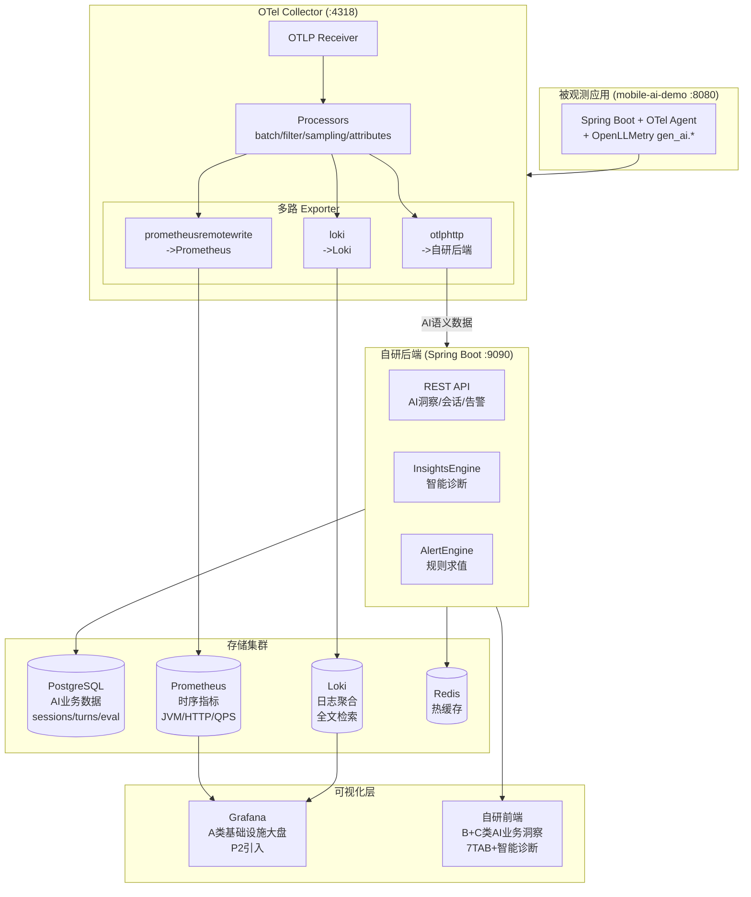

# AI 可观测系统优化总结

> 版本：V2 | 日期：2026-07-12 | 作者：Codex（AI 搭档）
> 基于 V1 + 可观测DEMO-v18-Codex.html（融合 V17 深度 + V19 健康洞察）+ 现有代码深度分析
> V2 变更要点：UI 设计刷新至 V18 融合版（8 页面 / 18 图表），新增数据健康可信度、智能洞察独立页、洞察右栏、告警卡片化+时间线、会话反馈条等特性

---

## 目录

1. [现状诊断与优化原则](#1-现状诊断与优化原则)
2. [优化计划总览](#2-优化计划总览)
3. [系统目标架构](#3-系统目标架构)
4. [数据流详细设计](#4-数据流详细设计)
5. [Core 端埋点设计](#5-core-端埋点设计)
6. [指标设计全表](#6-指标设计全表)
7. [DB 表设计全表](#7-db-表设计全表)
8. [Redis 缓存设计](#8-redis-缓存设计)
9. [AI 洞察智能诊断设计](#9-ai-洞察智能诊断设计)
10. [告警系统设计](#10-告警系统设计)
11. [UI 设计终稿说明（V18 融合版）](#11-ui-设计终稿说明v18-融合版)
12. [OTel Collector 增强配置](#12-otel-collector-增强配置)
13. [实施路径与里程碑](#13-实施路径与里程碑)
14. [附录：GAP 修复清单](#14-附录gap-修复清单)

---
## 1. 现状诊断与优化原则

### 1.1 当前系统架构现状

```
被观测应用 (mobile-ai-demo, Spring Boot 3.5.5 :8080)
  ├─ Micrometer OTLP Exporter -> OTel Collector (:4318) -> 自建后端 (:9090)
  ├─ Logback OTLP Appender -> 直发后端 (:9090/v1/logs)
  └─ Actuator /prometheus 端点

自建可观测后端 (Spring Boot :9090)
  ├─ OTLPReceiverController / OtlpV1Receiver -> OtlpParserService
  │    ├─ Redis (热层: 实时滑动窗口, 1m/5m/15m/6h TTL)
  │    └─ H2 文件数据库 (温层: spans/logs/metrics_agg + 8张业务表)
  ├─ 查询服务层: 6 个 AI 洞察 Service + Trace/Log/Metrics 查询
  ├─ DataCleanupService: 7 天数据保留, 每天凌晨 3 点清理
  └─ 前端 React+Vite+AntD+ECharts (:3000, 3s 轮询)

OTel Collector (:4318)
  └─ 透传: receiver(otlp) -> exporter(otlphttp/json_backend -> :9090)
     无 processor (无 batch/filter/sampling)
     内部遥测 Prometheus 端口 :8887 (未对接)
```

### 1.2 核心问题诊断

| # | 问题域 | 具体问题 | 影响 |
|---|--------|---------|------|
| 1 | **埋点缺失** | Core 未在 LLM span 携带 `llm.confidence`；`recordIntentAccuracy` 无 `layer` tag；Session 只存单字符串 `intentFlow` | 无法做分层准确率分析、置信度展示 |
| 2 | **数据源断链** | `setDau()`/`setOnlineUsers()` 全代码库无调用方；Dashboard 多个 Redis key 无人写入 | Zone A DAU/在线永远 0 |
| 3 | **前后端契约错配** | AccuracyTab 读 `.trend`/`.rewrite`/`.rootCauses`，后端不返回这些字段 | 准确率 TAB 整页空白 |
| 4 | **OTel Collector 透传** | 无 batch processor（每个 span 一次 HTTP）、无 filter（健康检查噪音）、无 sampling | 性能浪费 + 存储膨胀 |
| 5 | **告警无闭环** | `AlertService` 只有 CRUD + 事件存储，`notifyChannels` 字段预留但无推送逻辑；无规则求值引擎 | 告警存库不触达 |
| 6 | **洞察停留在"看数据"** | 6 个洞察 TAB 各自独立展示指标，无交叉分析、无根因定位、无行动建议 | 运营/运维/算法需要人工交叉分析。**V18 已增加智能诊断 TAB + 洞察右栏 + 独立洞察页** |
| 7 | **H2 单点瓶颈** | 所有数据（指标/日志/链路/会话）挤在 H2 文件库，3s 轮询频繁全表扫描 | 数据量大后查询变慢 |

### 1.3 优化原则

基于架构文档 §1.4 的 A/B/C/D/E 五类模块分类策略：

| 模块 | 名称 | 策略 | 说明 |
|------|------|------|------|
| **A** | 基础指标 (Infra) | P2 交给 Grafana | JVM/HTTP/DB 等标准指标，不自建专用页 |
| **B** | AI 模型层 (LLM 性能) | ✅ 自建主战场 | Token/TTFT/TPOT/LLM 错误率 |
| **C** | AI 业务语义层 | ✅ 自建主战场 | 意图准确率/路由决策/漏斗/满意度 |
| **D** | 平台自观测 | MVP 不做 | 后端自身健康，延后到阶段二 |
| **E** | 维度规范 | ✅ 贯穿全程 | Metric Tag 基数预算，高基数字段归 Trace/Log |

**核心决策**：
- **P0 阶段**：H2 保留，聚焦修复 B+C 类的 GAP + 增强洞察引擎 + 告警闭环
- **P1 阶段**：引入 OTel Collector Processors（零成本高收益）
- **P2 阶段**：H2 -> PostgreSQL 迁移 + 引入 Grafana 看 A 类指标

---

## 2. 优化计划总览

### 2.1 功能实现矩阵

| 功能域 | 优化项 | 当前状态 | 目标状态 | 阶段 | 涉及组件变更 |
|--------|--------|---------|---------|------|-------------|
| **埋点** | LLM 置信度 span attribute | ❌ 缺失 | Core 在 LLM span 携带 `llm.confidence` | P0 | Core: ChatClientWrapper |
| **埋点** | 意图准确率分层 | ❌ 无 layer tag | `recordIntentAccuracy` 增加 `layer=L0/L1` tag | P0 | Core: ObservabilityMetrics |
| **埋点** | Session 分层意图 | ❌ 单字符串 intentFlow | Session 落库 `l0_intent`/`l1_intent`/`l2_intent` | P0 | Core: SessionService |
| **埋点** | DAU/在线人数 | ❌ 无写入方 | OTel 解析或 Core 直写 Redis | P0 | 后端: OtlpParserService |
| **埋点** | Span 写 intent_predicted/actual | ❌ 仅 metric tag | Span attributes 携带分层意图 | P0 | Core: AbstractDomainService |
| **采集** | OTel Collector processors | ❌ 透传无处理 | 增加 batch/filter/attributes/memory_limiter | P1 | otel-collector/config.yaml |
| **采集** | tail-based sampling | ❌ 无采样 | 按错误率/延迟智能采样 | P1 | otel-collector/config.yaml |
| **处理** | AccuracyTab 契约对齐 | ❌ 前端读错字段 | 后端返回完整结构，前端消费正确字段 | P0 | 后端+前端 |
| **处理** | 混淆矩阵数据源 | ❌ 可能恒为空 | 从 Span attributes 提取（不依赖 metric） | P0 | 后端: AIInsightsService |
| **处理** | TraceListVO 增加字段 | ❌ 无置信度/意图 | 增加 confidence/l0Intent/l1Intent | P0 | 后端: TraceQueryService |
| **洞察** | 智能诊断 TAB | ❌ V17 不存在 | V18 新增第 7 TAB + 洞察右栏 + 独立洞察页 | P0 | 后端: InsightsEngineService + 前端 |
| **洞察** | 慢会话根因分析 | ❌ 不存在 | P90 慢会话自动归因（LLM/工具/追问） | P0 | 后端: InsightsEngineService |
| **洞察** | 流失会话特征画像 | ❌ 不存在 | 按意图/轮次/原因三维聚类 | P0 | 后端: InsightsEngineService |
| **洞察** | Token 成本 ROI | ❌ 不存在 | 交叉分析 Token 成本 × 完成率 | P0 | 后端: InsightsEngineService |
| **洞察** | 数据健康可信度 | ❌ V17 无 | V18 顶栏 health-pill + 设置页 health-card 看板 | P0 | 前端 |
| **洞察** | 智能洞察独立页 | ❌ V17 无 | V18 新增 intelligence 页（9 条分类洞察 3×3 网格） | P0 | 前端 |
| **洞察** | 洞察右栏布局 | ❌ V17 全宽 | V18 insight-layout 左侧 tab + 右侧 320px insight-sidebar | P0 | 前端 |
| **告警** | 告警卡片化+时间线 | ❌ V17 表格 | V18 alert-card 卡片式 + toggle 开关 + timeline 事件流 | P0 | 前端 |
| **会话** | 会话反馈条 | ❌ V17 无 | V18 session-feedback-bar 底部反馈+满意度 | P0 | 前端 |
| **链路** | 改写对比面板 | ✅ V17 已有 | V18 保留 rw-diff 改写前/后 diff + 验证标签 | P0 | 前端 |
| **链路** | Prompt IO 面板 | ✅ V17 已有 | V18 保留 io-panel token 构成 + prompt 高亮 + response JSON | P0 | 前端 |
| **告警** | 规则求值引擎 | ❌ 只有 CRUD | `@Scheduled` 定时扫描 + 指标比对 + 触发事件 | P0 | 后端: AlertEngineService |
| **告警** | 通知推送 | ❌ notifyChannels 空壳 | 钉钉/飞书 Webhook 推送 | P0 | 后端: AlertNotifyService |
| **存储** | H2 -> PostgreSQL | H2 文件库 | PostgreSQL 15+ | P2 | application.yml + pom.xml |
| **存储** | 引入 Grafana | ❌ 无 | Grafana 对接 Prometheus（A 类指标） | P2 | Docker Compose |

### 2.2 组件使用变化

| 组件 | 当前 | 优化后 | 变化说明 |
|------|------|--------|---------|
| **OTel Collector** | 透传（receiver->exporter） | 增强（+batch/filter/attributes/sampling） | 零新组件，只改配置 |
| **H2** | 唯一存储 | P0 保留 → P2 迁移 PostgreSQL | P0 不动，P2 迁移 |
| **Redis** | 热层缓存 | 保留 + 补全写入方 | 修复 DAU/在线等断链 |
| **自研前端** | 6 TAB + 3s 轮询 | 8 页面 / 7 TAB（+智能诊断）/ 智能洞察独立页 / 18 图表 | V18 融合 V17 深度 + V19 健康洞察 |
| **Grafana** | 无 | P2 引入，看 A 类基础设施 | 不替换自研前端 |
| **Prometheus** | Collector 内部 :8887 未对接 | P2 引入独立实例，pull Collector | A 类指标专用 |
| **Alertmanager** | 无 | P2 可选引入 | 规模化后替代自研告警推送 |
| **OpenLLMetry** | 无 | P1 可选引入 | 补齐 `gen_ai.*` 语义 span（prompt/completion） |

---
## 3. 系统目标架构

### 3.1 P0 阶段目标架构（当前实施）

P0 聚焦 B+C 类（AI 模型层 + AI 业务语义层），不引入新基础设施组件，在现有架构上修复 GAP + 增强洞察 + 告警闭环。

```mermaid
graph TB
    subgraph 被观测应用["被观测应用 (mobile-ai-demo :8080)"]
        BC[BankController<br/>L0 调度层]
        DR[DomainRouter<br/>意图路由 L0]
        L1S[Domain Services<br/>L1 意图识别+改写]
        GEE[GraphExecutionEngine<br/>L2 子图执行]
        OM[ObservabilityMetrics<br/>Micrometer 埋点]
        CCW[ChatClientWrapper<br/>LLM 调用拦截]
        
        subgraph P0埋点修复["P0 埋点修复"]
            P0A["recordIntentAccuracy<br/>+layer tag"]
            P0B["LLM span<br/>+llm.confidence"]
            P0C["Session<br/>+l0/l1/l2Intent"]
            P0D["Span attrs<br/>+intent_predicted/actual"]
        end
    end

    subgraph OTelC["OTel Collector (:4318)"]
        R[OTLP Receiver]
        P1_["batch processor<br/>P1 增强"]
        E[OTLP Exporter<br/>-> :9090]
        R --> P1_ --> E
    end

    subgraph 后端["可观测后端 (Spring Boot :9090)"]
        OTC[OTLPReceiverController]
        OPS[OtlpParserService]
        
        subgraph 存储层["存储层"]
            Redis[(Redis<br/>热层/滑动窗口)]
            H2[(H2<br/>温层/14张表)]
        end
        
        subgraph 查询服务["查询服务层"]
            MQS[MetricsQueryService]
            TQS[TraceQueryService<br/>+confidence/l0Intent]
            LQS[LogQueryService]
            AIS[AIInsightsService<br/>+混淆矩阵从Span提取]
        end
        
        subgraph 新增服务["P0 新增服务"]
            IES[InsightsEngineService<br/>交叉分析+根因+建议]
            AES[AlertEngineService<br/>规则求值引擎]
            ANS[AlertNotifyService<br/>钉钉/飞书推送]
        end
    end

    subgraph 前端["可观测前端 (React :3000)"]
        RT[React Router<br/>8页面 (V18)]
        subgraph 页面["8页面 (V18)"]
            DP[总览大屏<br/>+AI健康概览+health-pill]
            SVP[会话回放<br/>+transition-marker+反馈条]
            TEP[链路追踪<br/>+置信度/分层意图列+trace-tree+IO面板]
            AIP[AI洞察<br/>7TAB+洞察右栏+改写对比]
            LVP[日志查询]
            ARP[告警规则<br/>卡片化+时间线+toggle]
            SSP[系统设置<br/>+数据健康看板+度量矩阵]
            ITP[智能洞察<br/>独立页9条洞察3x3]
        end
    end

    BC -->|"OTel Span/Metric"| OM
    CCW -->|"llm.confidence"| OM
    OM --> E
    DR --> OM
    L1S --> OM
    GEE --> OM
    
    E -->|"OTLP/HTTP"| OTC
    OTC --> OPS
    OPS --> Redis
    OPS --> H2
    
    TQS --> H2
    AIS --> H2
    IES --> H2
    IES --> Redis
    AES --> Redis
    AES --> H2
    ANS -->|"Webhook"| 钉钉飞书["钉钉/飞书"]
    
    后端 -->|"REST API"| 前端
```

### 3.2 P2 阶段目标架构（演进方向）

P2 引入标准开源组件处理 A 类基础设施指标，自研系统专注 B+C 类 AI 业务洞察。



### 3.3 架构设计决策记录

| # | 决策 | 理由 |
|---|------|------|
| D1 | P0 不替换 H2 | 架构文档 D5 明确：H2 P0 保留，P2 迁移 PostgreSQL |
| D2 | 自研前端专注 B+C 类 | 与 LangSmith/LangFuse 取舍一致，差异化全在 AI 业务洞察 |
| D3 | OTel Collector 增强 processors 优先 | 零新组件，只改配置，立即见效（batch 减少 70%+ HTTP 请求） |
| D4 | 告警用自研引擎 + Webhook | P0 不引入 Alertmanager，自研够用；P2 规模化后可替换 |
| D5 | 智能诊断作为第 7 TAB + 独立洞察页 | V18 在 6 TAB 上增加诊断 TAB + 右栏洞察 + 独立 intelligence 页 |
| D6 | Redis 所有 key 同步写入 DB | 已有 `redis_metrics_snapshot` 表 + `RedisH2SyncService`，保持此原则 |
| D7 | Grafana P2 引入 | A 类指标不自建专用页，交给 Grafana 社区仪表盘 |

---
## 4. 数据流详细设计

### 4.1 三条 OTLP 管线总览

```
被观测应用 (mobile-ai-demo :8080)
  │
  ├─ Metrics 管线: Micrometer OTLP Exporter (step=60s)
  │    -> OTel Collector :4318/v1/metrics
  │    -> [batch processor] 
  │    -> 自研后端 :9090/v1/metrics (OTLP JSON)
  │    -> OtlpParserService.parseMetrics()
  │         ├─ Redis 热层: INCR/ZSET/HASH (1m/5m/15m/6h TTL)
  │         └─ H2 温层: metrics_agg INSERT
  │
  ├─ Traces 管线: OTel Java Agent -> Span 自动生成
  │    -> OTel Collector :4318/v1/traces
  │    -> [batch processor + filter(健康检查) + tail_sampling]
  │    -> 自研后端 :9090/v1/traces (OTLP JSON)
  │    -> OtlpParserService.parseTraces()
  │         ├─ H2: spans INSERT (含 attributes JSON)
  │         └─ Redis: LPUSH obs:traces:recent (LTRIM 100)
  │
  └─ Logs 管线: Logback OTLP Appender
       -> OTel Collector :4318/v1/logs
       -> [batch processor]
       -> 自研后端 :9090/v1/logs (OTLP JSON)
       -> OtlpParserService.parseLogs()
        ├─ H2: logs INSERT
        └─ Redis: LPUSH obs:logs:recent (LTRIM 1000)
```

### 4.2 指标数据处理流程（以意图准确率为例）

```
[Core 端埋点]
  AbstractDomainService.handle() L2 执行完成时:
    observabilityMetrics.recordIntentAccuracy(
        intent_predicted = "TRANSFER",     // L1-LLM2 预测意图
        intent_actual    = "TRANSFER",     // L2 实际执行意图
        state            = "correct",      // correct/fuzzy/error/disambiguated
        layer            = "L1",           // ★ P0 新增: L0/L1
        confidence       = 0.95            // ★ P0 新增: LLM 返回的置信度
    )
    -> Micrometer Counter "agent.intent.accuracy" 
       tags: {intent_predicted, intent_actual, state, layer}
       -> OTLP Exporter (step=60s)

[OTel Collector]
  -> batch processor (攒 5s 或 1024 条)
  -> otlphttp exporter -> 后端 :9090/v1/metrics

[后端 OtlpParserService.parseMetrics()]
  解析 OTLP JSON Sum metric:
    metric.name = "agent.intent.accuracy"
    tags = {intent_predicted=TRANSFER, intent_actual=TRANSFER, state=correct, layer=L1}
    value = 1.0 (Counter +1)
    
  -> Redis 热层:
     - 提取 intent_predicted tag -> 更新意图分布 HASH
     - 提取 layer tag -> INCR agent_call:L0/L1/L2
     - 提取 confidence -> ZSET obs:metrics:confidence:{intent}
     
  -> H2 温层:
     - INSERT INTO metrics_agg (metric_name, tags, value, agg_window, timestamp)
       VALUES ('agent.intent.accuracy', '{"intent_predicted":"TRANSFER","state":"correct","layer":"L1"}', 1.0, '1m', now())

[后端 AIInsightsService.computeIntentAccuracy()]
  查询 H2:
    SELECT metric_name, tags, value, timestamp 
    FROM metrics_agg 
    WHERE metric_name = 'agent.intent.accuracy' 
      AND timestamp BETWEEN :from AND :to
    
  聚合计算（按 intent_predicted + layer 分组）:
    准确率 = SUM(CASE WHEN state='correct' THEN value ELSE 0 END) 
           / SUM(value) * 100
    
  返回:
    {
      "trend": { "series": [{ "name": "L0-总体", "data": [...] }] },
      "rewrite": [...],
      "rootCauses": [...],
      "confusion": { "labels": [...], "matrix": [[...]], "totalSamples": N },
      "overallStats": { "总体意图准确率": "77.8%", "样本数": 4013 }
    }
```

### 4.3 链路数据处理流程（以一次转账会话为例）

```
[Core 端 Span 生成]
  BankController (L0 入口):
    Span.setAttribute("agent.level", "L0")
    Span.setAttribute("agent.name", "DomainRouter")
    Span.setAttribute("user.id", extractUserId(sessionId))    // 高基数，放 Span 不放 Metric
    Span.setAttribute("session.id", sessionId)
    Span.setAttribute("intent.L0.predicted", "TRANSFER")      // ★ P0 新增
    
  DomainRouter -> L1 DomainService:
    Span.setAttribute("agent.level", "L1")
    Span.setAttribute("agent.name", "TransferService")
    Span.setAttribute("intent.L1.predicted", "TRANSFER")      // ★ P0 新增
    Span.setAttribute("llm.confidence", 0.95)                 // ★ P0 新增
    
  L1 -> L2 GraphExecutionEngine:
    Span.setAttribute("agent.level", "L2")
    Span.setAttribute("intent.L2.actual", "TRANSFER")         // ★ P0 新增
    Span.setAttribute("business.outcome", "success")
    
  ChatClientWrapper (LLM 调用):
    Span.setAttribute("gen_ai.system", "sensenova")
    Span.setAttribute("gen_ai.request.model", "SenseNova-6.7-Flash-Lite")
    Span.setAttribute("llm.first_token_time", 380)            // TTFT ms
    Span.setAttribute("llm.token.input", 120)
    Span.setAttribute("llm.token.output", 80)

[OTel Collector]
  -> filter processor: 排除 http.route="/actuator/health" 的 span
  -> batch processor: 攒批
  -> tail_sampling: 错误 span 100% 保留，正常 span 10% 采样
  -> otlphttp -> 后端 :9090/v1/traces

[后端 OtlpParserService.parseTraces()]
  解析 OTLP JSON:
    trace_id, span_id, parent_span_id, operation_name, 
    start_time, end_time, duration_ms, status_code, attributes(JSON)
    
  -> H2: INSERT INTO spans (...) VALUES (...)
  -> Redis: LPUSH obs:traces:recent (traceJson) + LTRIM 0 99

[后端 TraceQueryService]
  查询 H2 spans 表, 构建 SpanNodeVO 树:
    -> TraceListVO 增加 confidence/l0Intent/l1Intent 字段  // ★ P0 新增
    -> 从 attributes JSON 提取:
       confidence = attrs["llm.confidence"]
       l0Intent   = attrs["intent.L0.predicted"]
       l1Intent   = attrs["intent.L1.predicted"]
```

### 4.4 会话数据处理流程

```
[Core 端]
  BankController 收到用户消息:
    1. 解析 sessionId, userId, channel
    2. 路由 L0 -> L1 -> L2 执行
    3. 每轮结束记录:
       SessionTurn {
         session_id, turn_number, user_message, ai_response,
         intent, agent_level, agent_name, confidence,  // ★ confidence P0 新增
         duration_ms, tokens, trace_id, status,
         l0_intent, l1_intent, l2_intent               // ★ 分层意图 P0 新增
       }
    4. 会话结束/超时:
       POST /api/v1/sessions (到可观测后端)
       Session {
         session_id, user_id, channel, start_time, end_time,
         turn_count, intent_flow, total_tokens, status,
         l0_intent, l1_intent, l2_intent,               // ★ 分层意图 P0 新增
         satisfaction_rating, satisfaction_reason
       }

[后端 SessionService]
  -> H2: INSERT INTO sessions (...) VALUES (...)
  -> H2: INSERT INTO session_turns (...) VALUES (...) (每轮一条)
  -> Redis: 
     - INCR obs:metrics:dau (userId 去重, 24h TTL)     // ★ P0 修复 DAU
     - SET obs:metrics:online_users (userId, 30s TTL)   // ★ P0 修复在线人数
     - INCR obs:metrics:total_visits (24h TTL)

[后端 ConversionFunnelService]
  查询 H2 sessions 表:
    按 intent_flow 和 status 统计各阶段:
      进入会话 (totalSessions)
      -> 意图识别 (intentFlow 非空)
      -> L1路由 (intentFlow contains "L1")
      -> L2执行 (intentFlow contains "L2")
      -> 业务完成 (status = "completed")
    计算各阶段转化率和流失率
```

### 4.5 日志数据处理流程

```
[Core 端]
  SLF4J/Logback -> OTel Log Appender:
    log.info("意图路由完成", 
      StructuredArguments.kv("session.id", sessionId),
      StructuredArguments.kv("intent", "TRANSFER"),
      StructuredArguments.kv("user.id", userId),
      StructuredArguments.kv("trace.id", traceId)
    )
    -> Logback OTLP Appender -> http://127.0.0.1:9090/v1/logs

[后端 OtlpParserService.parseLogs()]
  解析 OTLP JSON logRecords:
    trace_id, span_id, level, service_name, message, timestamp, attributes
    
  -> H2: INSERT INTO logs (...) VALUES (...)
  -> Redis: LPUSH obs:logs:recent (logJson) + LTRIM 0 999

[后端 LogQueryService]
  查询 H2 logs 表:
    支持按 trace_id / level / 时间范围 / userId / sessionId 筛选
    从 attributes JSON 提取 user_id / session_id 做过滤
```

### 4.6 DAU/在线人数数据流修复（P0）

```
[当前问题]
  RedisMetricsService.setDau() / setOnlineUsers() 全代码库无调用方
  -> Dashboard Zone A DAU/在线永远 0

[修复方案]
  方案: 在 OtlpParserService.parseTraces() 中提取 user.id 属性
  
  parseTraces() 中:
    for each span:
      String userId = extractFromAttrs(attrs, "user.id")
      String sessionId = extractFromAttrs(attrs, "session.id")
      
      if (userId != null):
        // DAU: 用 Redis SET 去重
        redis.opsForSet().add("obs:metrics:dau_set", userId)
        redis.expire("obs:metrics:dau_set", 24, HOURS)
        redis.opsForValue().set("obs:metrics:dau", 
          String.valueOf(redis.opsForSet().size("obs:metrics:dau_set")), 120, SECONDS)
        
        // 在线人数: 用 Redis SET + 30s TTL (过期自动移除)
        redis.opsForSet().add("obs:metrics:online_set", userId)
        redis.expire("obs:metrics:online_set", 30, SECONDS)
        redis.opsForValue().set("obs:metrics:online_users",
          String.valueOf(redis.opsForSet().size("obs:metrics:online_set")), 120, SECONDS)
```

---
## 5. Core 端埋点设计

### 5.1 埋点增强总览

| 埋点项 | 类型 | 位置 | OTel 属性名 | P0/P1 |
|--------|------|------|------------|:---:|
| TTFT (首Token时延) | Span Attribute | ChatClientWrapper | `llm.first_token_time` | ✅已有 |
| LLM 置信度 | Span Attribute | ChatClientWrapper | `llm.confidence` | **P0新增** |
| Reroute 事件 | Span Event | BankController | `reroute.triggered` | **P0新增** |
| 业务完成状态 | Span Attribute | GraphExecutionEngine | `business.outcome` | ✅已有 |
| Agent 层级标识 | Span Attribute | 各层入口 | `agent.level`, `agent.name` | ✅已有 |
| 用户/会话标识 | Span Attribute | BankController | `user.id`, `session.id` | ✅已有 |
| 分层意图-L0 | Span Attribute | DomainRouter | `intent.L0.predicted` | **P0新增** |
| 分层意图-L1 | Span Attribute | AbstractDomainService | `intent.L1.predicted` | **P0新增** |
| 分层意图-L2 | Span Attribute | GraphExecutionEngine | `intent.L2.actual` | **P0新增** |
| 意图准确率 layer | Metric Tag | ObservabilityMetrics | `agent.intent.accuracy` + `layer` | **P0新增** |
| DAU/在线写入 | Redis 写入 | 后端 OtlpParserService | 从 span 提取 user.id | **P0新增** |
| gen_ai.* 语义 | Span Attribute | ChatClientWrapper | `gen_ai.system`/`gen_ai.request.model`/`gen_ai.prompt`/`gen_ai.completion` | **P1新增** |

### 5.2 具体埋点代码位置与实现

#### 5.2.1 LLM 置信度埋点（P0）

```java
// 文件: src/main/java/com/mobileagent/app/observability/ObservabilityMetrics.java
// 在 ChatClientWrapper 调用 LLM 返回后，从 response metadata 提取置信度

/**
 * 记录 LLM 置信度
 * 调用位置：ChatClientWrapper.call() / stream() 返回后
 * 数据来源：LLM 返回的 logprobs 或 response metadata
 */
public void recordConfidence(double confidence) {
    safeRecord(() -> {
        io.opentelemetry.api.trace.Span.current()
            .setAttribute("llm.confidence", confidence);
    });
}

// 同时写入 Metric（低基数，按意图分组）
public void recordConfidenceMetric(String intent, double confidence) {
    safeRecord(() -> {
        DistributionSummary.builder("llm.confidence.score")
            .tag("intent", intent)
            .description("LLM confidence score distribution")
            .register(meterRegistry)
            .record(confidence);
    });
}
```

#### 5.2.2 意图准确率分层埋点（P0）

```java
// 文件: src/main/java/com/mobileagent/app/observability/ObservabilityMetrics.java
// 修改现有 recordIntentAccuracy() 方法，增加 layer 参数

public void recordIntentAccuracy(String intentPredicted, 
                                  String intentActual, 
                                  String state,
                                  String layer,           // ★ P0 新增: "L0" / "L1"
                                  double confidence) {     // ★ P0 新增
    safeRecord(() -> {
        Counter.builder("agent.intent.accuracy")
            .tag("intent_predicted", intentPredicted)
            .tag("intent_actual", intentActual)
            .tag("state", state)               // correct/fuzzy/error/disambiguated
            .tag("layer", layer)               // ★ 新增分层 tag
            .description("Intent recognition accuracy by layer")
            .register(meterRegistry)
            .increment();
        
        // 同时写入 Span attribute（高基数 OK）
        Span currentSpan = io.opentelemetry.api.trace.Span.current();
        currentSpan.setAttribute("intent.predicted", intentPredicted);
        currentSpan.setAttribute("intent.actual", intentActual);
        currentSpan.setAttribute("intent.accuracy.state", state);
        currentSpan.setAttribute("intent.accuracy.layer", layer);
        if (confidence > 0) {
            currentSpan.setAttribute("llm.confidence", confidence);
        }
    });
}
```

#### 5.2.3 分层意图 Span 埋点（P0）

```java
// 文件: src/main/java/com/mobileagent/app/controller/BankController.java
// L0 入口处:
Span.current().setAttribute("intent.L0.predicted", domainRouterResult.getIntent());

// 文件: src/main/java/com/mobileagent/app/service/AbstractDomainService.java
// L1 意图识别后:
Span.current().setAttribute("intent.L1.predicted", l1Intent);

// 文件: src/main/java/com/mobileagent/app/execution/GraphExecutionEngine.java
// L2 执行后:
Span.current().setAttribute("intent.L2.actual", actualExecutedIntent);
```

#### 5.2.4 Session 分层意图落库（P0）

```java
// 文件: src/main/java/com/mobileagent/app/service/SessionService.java (Core 端)
// 会话结束时，将分层意图写入 Session 对象

session.setL0Intent(l0Intent);      // L0 领域路由结果
session.setL1Intent(l1Intent);      // L1 意图识别结果
session.setL2Intent(l2Intent);      // L2 实际执行意图
// 保留 intentFlow 字段做兼容: "L0:TRANSFER->L1:TRANSFER->L2:TRANSFER"

// POST /api/v1/sessions 时传给可观测后端
```

#### 5.2.5 Reroute 事件埋点（P0）

```java
// 文件: src/main/java/com/mobileagent/app/controller/BankController.java
// dispatchWithReroute() 方法中检测到 REROUTE 时:

io.opentelemetry.api.trace.Span.current()
    .addEvent("reroute.triggered", 
        Attributes.of(
            AttributeKey.stringKey("from_domain"), currentDomain,
            AttributeKey.stringKey("reroute_intent"), chunk.getRerouteIntent(),
            AttributeKey.longKey("reroute_count"), rerouteCount.get()
        ));
```

#### 5.2.6 gen_ai.* 语义属性（P1，可选 OpenLLMetry）

```java
// 方式1: 手动在 ChatClientWrapper 中写入
Span.current().setAttribute("gen_ai.system", "sensenova");
Span.current().setAttribute("gen_ai.request.model", modelName);
Span.current().setAttribute("gen_ai.usage.prompt_tokens", inputTokens);
Span.current().setAttribute("gen_ai.usage.completion_tokens", outputTokens);

// 方式2: 引入 OpenLLMetry javaagent（P1，推荐）
// -javaagent:opentelemetry-javaagent.jar
// -Dotel.instrumentation.genai.enable=true
// 自动拦截 OpenAI SDK 调用，生成标准 gen_ai.* span
```

### 5.3 埋点实现原则

1. **不阻断主流程**：所有埋点代码用 try-catch 包裹（safeRecord 模式），埋点失败不影响业务
2. **OTel Span 挂载优先**：Counter/Histogram 通过 Micrometer 上报 Metric；关联标识通过 `Span.current().setAttribute()` 写入 span attributes
3. **Tag 值必须是有限枚举**：禁止将 `user.id` / `session.id` / 原始 prompt / 原始金额 作为 Metric Tag（见 §6 维度规范）
4. **Histogram bucket 预定义**：所有 Histogram 指标的 bucket 边界已标注，确保分位数计算精度

---
## 6. 指标设计全表

### 6.1 llm.* 指标组 — ChatClientWrapper 自动拦截（5 项）

| # | 指标名 | 类型 | 关键 Tag | 埋点位置 | 说明 | GAP状态 |
|---|--------|------|----------|---------|------|---------|
| 1 | `llm.token.input` | Counter | `model` | ChatClientWrapper | 每次 LLM 调用的输入 Token 计数 | ✅正常 |
| 2 | `llm.token.output` | Counter | `model` | ChatClientWrapper | 每次 LLM 调用的输出 Token 计数 | ✅正常 |
| 3 | `llm.first_token.latency` | Histogram | `model` | ChatClientWrapper (doOnNext 首chunk) | TTFT, bucket: `[100,200,500,1000,2000,5000,10000]`ms | ✅正常 |
| 4 | `llm.operation.duration` | Histogram | `model` | ChatClientWrapper (调用完成) | LLM 调用总耗时, bucket: `[500,1000,3000,5000,10000,30000,60000]`ms | ✅正常 |
| 5 | `llm.error.count` | Counter | `model`, `error_type` | ChatClientWrapper (onError) | LLM 调用失败计数 | ✅正常 |

### 6.2 agent.* 指标组 — 手动埋点（10 项）

| # | 指标名 | 类型 | 关键 Tag | 埋点位置 | 说明 | GAP状态 |
|---|--------|------|----------|---------|------|---------|
| 6 | `agent.router.decision.outcome` | Counter | `layer`, `decision`, `domain` | DomainRouter / ContextRouter | 路由决策结果计数 | ✅正常 |
| 7 | `agent.intent.accuracy` | Counter | `intent_predicted`, `intent_actual`, `state`, **`layer`** | AbstractDomainService / SubGraphRouter | 意图识别准确率 | 🔴P0: 需补 `layer` tag |
| 8 | `agent.rewrite.accuracy` | Counter | `rule_check`, `domain` | SubGraphRouter (轻量信号) | 改写准确率 | ✅已修复 |
| 9 | `agent.workflow.execution.duration` | Histogram | `intent`, `graph` | GraphExecutionEngine | 子图执行耗时, bucket: `[100,500,1000,3000,10000,30000]`ms | ✅正常 |
| 10 | `agent.workflow.interrupt` | Counter | `intent`, `interrupt_node` | GraphExecutionEngine (checkGraphResult) | 工作流挂起点计数 | ✅正常 |
| 11 | `agent.slot.askback.total` | Histogram | `intent`, `graph` | AbstractGraphConfig (追问节点) | 整次会话累计追问轮数, bucket: `[1,2,3,5,8]` | ✅正常 |
| 12 | `agent.tool.call.count` | Counter | `tool_name` | 调用银行核心API处 | 工具调用次数 | ✅正常 |
| 13 | `agent.tool.call.duration` | Histogram | `tool_name` | 调用银行核心API处 | 工具调用耗时, bucket: `[10,50,100,500,1000,3000]`ms | ✅正常 |
| 14 | `agent.skill.outcome` | Counter | `skill_name`, `result` | AbstractDomainService (L2完成处) | Skill 业务结果计数 | ✅正常 |
| 15 | `agent.session` | Counter | `intent`, `result`, `stage` | AbstractDomainService (完成/超时/异常) | 会话生命周期: completed/abandoned | ✅正常 |

### 6.3 P0 新增指标（3 项）

| # | 指标名 | 类型 | 关键 Tag | 埋点位置 | 说明 |
|---|--------|------|----------|---------|------|
| 16 | `llm.confidence.score` | DistributionSummary | `intent` | ChatClientWrapper | LLM 置信度分布, 范围 0.0-1.0 |
| 17 | `agent.reroute.count` | Counter | `from_domain`, `reroute_intent` | BankController | Reroute 触发计数 |
| 18 | `agent.business.outcome` | Counter | `intent`, `outcome` | GraphExecutionEngine | 业务结果: success/fail/pending |

### 6.4 大屏 Zone 与指标对应关系

| 大屏区域 | 相关指标 | 当前状态 | P0修复后 |
|---------|---------|---------|---------|
| **Zone A 系统健康** | DAU(从span提取), 在线人数(从span提取), QPS(`request_count:6h`/21600), Agent调用(`agent_call:L0/L1/L2`) | 🟡DAU/在线断链 | ✅修复 |
| **Zone B AI 性能** | Token(`llm.token.*`), TTFT(`llm.first_token.latency`), P95(`latency:1m` ZSET), 错误率(`error_count:6h`/`request_count:6h`) | ✅正常 | ✅正常 |
| **Zone C 语义质量** | 意图准确率(`agent.intent.accuracy`按state聚合), 改写准确率(`agent.rewrite.accuracy`), Reroute率(`agent.reroute.count`/(L0+L1)), 完成率(`agent.business.outcome`) | 🔴分层缺失 | ✅补layer tag |
| **Zone D 业务效果** | 转化率(`agent.business.outcome` success/total), 违规率(无数据源P1) | 🔴转化率已修复, 违规率待定 | ✅转化率, 🔸违规率占位 |

### 6.5 维度规范与基数预算（E 类模块）

#### 允许做 Metric Tag 的字段（基数 < 200）

| Tag 名称 | 用途 | 基数上限 | 备注 |
|----------|------|:---:|------|
| `service.name` | 服务标识 | < 50 | OTel Resource |
| `deployment.environment` | 部署环境 | < 10 | |
| `agent.domain` | 业务域 | < 200 | 受意图集合约束 |
| `agent.intent` | 意图类别 | < 200 | 新增意图需走治理评审 |
| `gen_ai.request.model` | 请求模型 | < 30 | 多模型对比关键 |
| `outcome` | 结果 | < 10 | success/fail/pending/cancelled |
| `error.type` | 错误类型 | < 20 | 有限枚举 |
| `decision` | 路由决策类型 | < 15 | FOLLOW_UP/SWITCH_NEW/RESUME/REROUTE |
| `agent.level` | Agent 层级 | < 5 | L0/L1/L2 |
| `layer` | 意图识别层级 | < 5 | L0/L1 |
| `state` | 准确率状态 | < 5 | correct/fuzzy/error/disambiguated |

#### 禁止作为 Metric Tag 的字段

| 字段 | 原因 | 正确归属 |
|------|------|---------|
| `user.id` | 高基数（10万+活跃用户） | Trace span attribute + Log field |
| `session.id` | 高基数（每会话唯一） | Trace span attribute + Log field |
| `trace.id` | 每请求唯一 | Trace 原生标识 + Log field |
| `原始 prompt` | 无限基数 + 敏感数据 | Trace span attribute |
| `原始金额` | 无限基数 + 敏感数据 | Trace span attribute |

### 6.6 Span Attributes 规范（P0 新增/补全）

| 属性名 | 写入位置 | 类型 | 说明 | P0状态 |
|--------|---------|------|------|:---:|
| `agent.level` | 各层入口 | String | L0/L1/L2 | ✅已有 |
| `agent.name` | 各层入口 | String | DomainRouter/TransferService/... | ✅已有 |
| `user.id` | BankController | String | 用户ID（高基数，放Span不放Metric） | ✅已有 |
| `session.id` | BankController | String | 会话ID | ✅已有 |
| `llm.first_token_time` | ChatClientWrapper | Long | TTFT 毫秒 | ✅已有 |
| `llm.confidence` | ChatClientWrapper | Double | LLM 返回的置信度 0.0-1.0 | **P0新增** |
| `intent.L0.predicted` | DomainRouter | String | L0 预测意图 | **P0新增** |
| `intent.L1.predicted` | AbstractDomainService | String | L1 预测意图 | **P0新增** |
| `intent.L2.actual` | GraphExecutionEngine | String | L2 实际执行意图 | **P0新增** |
| `intent.predicted` | AbstractDomainService | String | 同 L1 predicted（通用键） | **P0新增** |
| `intent.actual` | SubGraphRouter | String | 同 L2 actual（通用键） | **P0新增** |
| `business.outcome` | GraphExecutionEngine | String | success/fail/pending | ✅已有 |
| `reroute.triggered` | BankController | Event | reroute 事件 | **P0新增** |
| `gen_ai.system` | ChatClientWrapper | String | sensenova/openai/... | P1 |
| `gen_ai.request.model` | ChatClientWrapper | String | SenseNova-6.7-Flash-Lite | P1 |
| `gen_ai.usage.prompt_tokens` | ChatClientWrapper | Int | 输入token数 | P1 |
| `gen_ai.usage.completion_tokens` | ChatClientWrapper | Int | 输出token数 | P1 |

---
## 7. DB 表设计全表

### 7.1 设计原则

**Redis -> DB 同步原则**：所有 Redis 中的缓存数据，在 DB 表中都有同步或延缓地写入。具体实现方式：

1. **实时双写**：OtlpParserService 解析数据时，同时写 Redis（热层）和 H2（温层）
2. **定时快照**：RedisH2SyncService 定时将 Redis 中的 Gauge/Counter 快照写入 `redis_metrics_snapshot` 表
3. **查询降级**：当 Redis 数据不可用时，查询服务可从 H2 降级读取

### 7.2 现有表（保留不变，3 张）

#### 7.2.1 metrics_agg - 指标聚合表

```sql
CREATE TABLE IF NOT EXISTS metrics_agg (
    id BIGINT AUTO_INCREMENT,
    metric_name VARCHAR(128) NOT NULL,
    tags VARCHAR(512),              -- JSON 格式: {"intent_predicted":"TRANSFER","state":"correct","layer":"L1"}
    "value" DOUBLE NOT NULL,
    agg_window VARCHAR(16) NOT NULL, -- 1m/5m/15m/6h
    "timestamp" TIMESTAMP NOT NULL,
    PRIMARY KEY (id)
);
CREATE INDEX IF NOT EXISTS idx_metrics_name_ts ON metrics_agg(metric_name, "timestamp");
CREATE INDEX IF NOT EXISTS idx_metrics_window ON metrics_agg(agg_window);
```

#### 7.2.2 spans - Span 追踪记录表

```sql
CREATE TABLE IF NOT EXISTS spans (
    id BIGINT AUTO_INCREMENT,
    trace_id VARCHAR(64) NOT NULL,
    span_id VARCHAR(64) NOT NULL,
    parent_span_id VARCHAR(64),
    service_name VARCHAR(64),
    operation_name VARCHAR(256),
    kind VARCHAR(16),
    start_time TIMESTAMP NOT NULL,
    end_time TIMESTAMP,
    duration_ms BIGINT,
    status_code VARCHAR(16),
    attributes VARCHAR(4096),       -- JSON: 含 agent.level/user.id/session.id/llm.confidence/intent.*/business.outcome
    PRIMARY KEY (id)
);
CREATE INDEX IF NOT EXISTS idx_spans_trace ON spans(trace_id);
CREATE INDEX IF NOT EXISTS idx_spans_time ON spans(start_time);
CREATE INDEX IF NOT EXISTS idx_spans_opname ON spans(operation_name);
```

#### 7.2.3 logs - 日志记录表

```sql
CREATE TABLE IF NOT EXISTS logs (
    id BIGINT AUTO_INCREMENT,
    trace_id VARCHAR(64),
    span_id VARCHAR(64),
    "level" VARCHAR(16) NOT NULL,
    service_name VARCHAR(64),
    message TEXT NOT NULL,
    "timestamp" TIMESTAMP NOT NULL,
    attributes VARCHAR(1024),       -- JSON: 含 user.id/session.id/trace.id
    PRIMARY KEY (id)
);
CREATE INDEX IF NOT EXISTS idx_logs_time ON logs("timestamp");
CREATE INDEX IF NOT EXISTS idx_logs_trace ON logs(trace_id);
CREATE INDEX IF NOT EXISTS idx_logs_level ON logs("level");
```

### 7.3 Phase 1 已有表（8 张，P0 需修改）

#### 7.3.1 sessions - 会话聚合表（★ P0 修改：增加分层意图字段）

```sql
CREATE TABLE IF NOT EXISTS sessions (
    id BIGINT AUTO_INCREMENT,
    session_id VARCHAR(64) NOT NULL,
    user_id VARCHAR(64),
    channel VARCHAR(32),
    start_time TIMESTAMP NOT NULL,
    end_time TIMESTAMP,
    duration_seconds BIGINT,
    turn_count INT DEFAULT 0,
    intent_flow VARCHAR(1024),       -- 兼容保留: "L0:TRANSFER->L1:TRANSFER->L2:TRANSFER"
    l0_intent VARCHAR(64),           -- ★ P0新增: L0 领域路由意图
    l1_intent VARCHAR(64),           -- ★ P0新增: L1 意图识别结果
    l2_intent VARCHAR(64),           -- ★ P0新增: L2 实际执行意图
    total_tokens BIGINT DEFAULT 0,
    status VARCHAR(32),              -- active/completed/error/abandoned
    satisfaction_rating VARCHAR(16), -- satisfied/neutral/unsatisfied
    satisfaction_reason VARCHAR(512),
    PRIMARY KEY (id)
);
CREATE UNIQUE INDEX IF NOT EXISTS idx_sessions_sid ON sessions(session_id);
CREATE INDEX IF NOT EXISTS idx_sessions_time ON sessions(start_time);
CREATE INDEX IF NOT EXISTS idx_sessions_user ON sessions(user_id);
CREATE INDEX IF NOT EXISTS idx_sessions_status ON sessions(status);
-- ★ P0新增索引: 支持按分层意图查询
CREATE INDEX IF NOT EXISTS idx_sessions_l0_intent ON sessions(l0_intent);
CREATE INDEX IF NOT EXISTS idx_sessions_l1_intent ON sessions(l1_intent);
```

#### 7.3.2 session_turns - 会话轮次明细表（★ P0 修改：增加分层意图）

```sql
CREATE TABLE IF NOT EXISTS session_turns (
    id BIGINT AUTO_INCREMENT,
    session_id VARCHAR(64) NOT NULL,
    turn_number INT NOT NULL,
    user_message TEXT,
    ai_response TEXT,
    intent VARCHAR(64),
    agent_path VARCHAR(256),
    confidence DOUBLE,               -- ★ P0确认: LLM 置信度
    duration_ms BIGINT,
    tokens INT,
    status VARCHAR(32),              -- success/timeout/error
    trace_id VARCHAR(64),
    l0_intent VARCHAR(64),           -- ★ P0新增
    l1_intent VARCHAR(64),           -- ★ P0新增
    l2_intent VARCHAR(64),           -- ★ P0新增
    "timestamp" TIMESTAMP NOT NULL,
    PRIMARY KEY (id)
);
CREATE INDEX IF NOT EXISTS idx_turns_sid ON session_turns(session_id);
CREATE INDEX IF NOT EXISTS idx_turns_status ON session_turns(status);  -- ★ P0新增: 支持超时流失统计
```

#### 7.3.3 agent_performance - Agent 性能快照表（保留不变）

```sql
CREATE TABLE IF NOT EXISTS agent_performance (
    id BIGINT AUTO_INCREMENT,
    agent_name VARCHAR(64),
    agent_level VARCHAR(8),          -- L0/L1/L2
    model VARCHAR(64),
    call_count INT DEFAULT 0,
    total_duration_ms BIGINT DEFAULT 0,
    ttft_p50_ms BIGINT,
    ttft_p95_ms BIGINT,
    tpot_p50_ms BIGINT,
    tpot_p95_ms BIGINT,
    total_tokens_in BIGINT DEFAULT 0,
    total_tokens_out BIGINT DEFAULT 0,
    error_count INT DEFAULT 0,
    agg_window VARCHAR(16),
    "timestamp" TIMESTAMP NOT NULL,
    PRIMARY KEY (id)
);
CREATE INDEX IF NOT EXISTS idx_ap_agent ON agent_performance(agent_name, "timestamp");
```

#### 7.3.4 token_cost - Token 成本明细表（保留不变）

```sql
CREATE TABLE IF NOT EXISTS token_cost (
    id BIGINT AUTO_INCREMENT,
    intent VARCHAR(64),
    model VARCHAR(64),
    call_count INT DEFAULT 0,
    tokens_in BIGINT DEFAULT 0,
    tokens_out BIGINT DEFAULT 0,
    agg_window VARCHAR(16),
    "timestamp" TIMESTAMP NOT NULL,
    PRIMARY KEY (id)
);
CREATE INDEX IF NOT EXISTS idx_tc_intent ON token_cost(intent, "timestamp");
```

#### 7.3.5 tool_calls - 工具调用记录表（保留不变）

```sql
CREATE TABLE IF NOT EXISTS tool_calls (
    id BIGINT AUTO_INCREMENT,
    trace_id VARCHAR(64),
    tool_name VARCHAR(128),
    call_count INT DEFAULT 0,
    success_count INT DEFAULT 0,
    fail_count INT DEFAULT 0,
    avg_duration_ms BIGINT,
    p95_duration_ms BIGINT,
    error_rate DOUBLE,
    typical_errors VARCHAR(512),
    provider VARCHAR(64) DEFAULT 'banking-api',
    agg_window VARCHAR(16),
    "timestamp" TIMESTAMP NOT NULL,
    PRIMARY KEY (id)
);
CREATE INDEX IF NOT EXISTS idx_mcp_name ON tool_calls(tool_name, "timestamp");
```

#### 7.3.6 alert_rules - 告警规则定义表（★ P0 修改：增加求值相关字段）

```sql
CREATE TABLE IF NOT EXISTS alert_rules (
    id BIGINT AUTO_INCREMENT,
    rule_name VARCHAR(128) NOT NULL,
    metric_name VARCHAR(128),         -- 监控指标名
    threshold DOUBLE,                 -- 阈值
    operator VARCHAR(8),              -- GT/GTE/LT/LTE
    duration_seconds INT,             -- 持续N秒才触发
    severity VARCHAR(16),             -- CRITICAL/WARNING/INFO
    enabled BOOLEAN DEFAULT TRUE,
    notify_channels VARCHAR(256),     -- JSON: ["dingtalk","feishu"]
    webhook_url VARCHAR(512),         -- ★ P0新增: Webhook 推送地址
    last_evaluated_at TIMESTAMP,      -- ★ P0新增: 上次求值时间
    last_fired_at TIMESTAMP,          -- ★ P0新增: 上次触发时间
    created_at TIMESTAMP DEFAULT CURRENT_TIMESTAMP,
    updated_at TIMESTAMP DEFAULT CURRENT_TIMESTAMP,
    PRIMARY KEY (id)
);
```

#### 7.3.7 alert_events - 告警事件记录表（★ P0 修改：增加详情字段）

```sql
CREATE TABLE IF NOT EXISTS alert_events (
    id BIGINT AUTO_INCREMENT,
    rule_id BIGINT,
    rule_name VARCHAR(128),
    severity VARCHAR(16),
    status VARCHAR(32),               -- FIRING/ACKNOWLEDGED/RESOLVED
    metric_value DOUBLE,              -- ★ P0新增: 触发时的实际值
    threshold_value DOUBLE,           -- ★ P0新增: 规则阈值
    message TEXT,
    notify_status VARCHAR(32),        -- ★ P0新增: SENT/FAILED/SKIPPED
    notify_detail VARCHAR(512),       -- ★ P0新增: 推送详情/错误信息
    triggered_at TIMESTAMP,
    resolved_at TIMESTAMP,
    PRIMARY KEY (id)
);
CREATE INDEX IF NOT EXISTS idx_ae_time ON alert_events(triggered_at);
CREATE INDEX IF NOT EXISTS idx_ae_status ON alert_events(status);  -- ★ P0新增
```

#### 7.3.8 redis_metrics_snapshot - Redis 快照表（保留不变）

```sql
CREATE TABLE IF NOT EXISTS redis_metrics_snapshot (
    id BIGINT AUTO_INCREMENT,
    metric_key VARCHAR(256) NOT NULL,
    metric_type VARCHAR(16) NOT NULL,   -- counter/gauge/zset/hash
    metric_value DOUBLE,
    tags VARCHAR(512),
    "timestamp" TIMESTAMP NOT NULL,
    PRIMARY KEY (id)
);
CREATE INDEX IF NOT EXISTS idx_rms_key_ts ON redis_metrics_snapshot(metric_key, "timestamp");
CREATE INDEX IF NOT EXISTS idx_rms_ts ON redis_metrics_snapshot("timestamp");
```

### 7.4 P0 新增表（1 张）

#### 7.4.1 insight_reports - 智能诊断报告表（★ P0 新增）

```sql
CREATE TABLE IF NOT EXISTS insight_reports (
    id BIGINT AUTO_INCREMENT,
    report_type VARCHAR(32) NOT NULL,    -- PERFORMANCE/ACCURACY/CONVERSION/PRIORITY
    category VARCHAR(64),                -- 具体类别: agent_bottleneck/low_confidence/funnel_dropoff/...
    severity VARCHAR(16),                -- HIGH/MEDIUM/LOW
    title VARCHAR(256) NOT NULL,         -- 一句话标题
    detail TEXT,                         -- 数据支撑详情
    recommendation TEXT,                 -- 行动建议
    metrics_json TEXT,                   -- 关联指标 JSON
    impact_count BIGINT DEFAULT 0,       -- 影响样本数
    time_range_start TIMESTAMP NOT NULL, -- 报告时间范围起始
    time_range_end TIMESTAMP NOT NULL,   -- 报告时间范围结束
    created_at TIMESTAMP DEFAULT CURRENT_TIMESTAMP,
    PRIMARY KEY (id)
);
CREATE INDEX IF NOT EXISTS idx_ir_type_severity ON insight_reports(report_type, severity);
CREATE INDEX IF NOT EXISTS idx_ir_created ON insight_reports(created_at);
```

### 7.5 Redis -> DB 同步映射表

| Redis Key | Redis 类型 | DB 表 | DB 字段 | 同步方式 |
|-----------|-----------|-------|--------|---------|
| `obs:metrics:request_count:{window}` | String (INCR) | metrics_agg | metric_name='request_count', agg_window=window | 实时双写 |
| `obs:metrics:error_count:{window}` | String (INCR) | metrics_agg | metric_name='error_count', agg_window=window | 实时双写 |
| `obs:metrics:token_{type}:{window}` | String (INCRBY) | metrics_agg | metric_name='llm.token.{type}' | 实时双写 |
| `obs:metrics:latency:{window}` | ZSET | metrics_agg | metric_name='http.server.duration' | 实时双写 |
| `obs:metrics:ttft:{window}` | ZSET | metrics_agg | metric_name='llm.first_token.latency' | 实时双写 |
| `obs:metrics:agent_call:{level}` | String (INCR) | metrics_agg | metric_name='agent.call.count', tags.layer | 实时双写 |
| `obs:metrics:dau` | String (SET) | redis_metrics_snapshot | metric_key='obs:metrics:dau' | 定时快照 |
| `obs:metrics:online_users` | String (SET) | redis_metrics_snapshot | metric_key='obs:metrics:online_users' | 定时快照 |
| `obs:metrics:intent_distribution` | HASH (HINCRBY) | metrics_agg | metric_name='agent.intent.distribution' | 定时快照 |
| `obs:metrics:accuracy:intent` | String | redis_metrics_snapshot | metric_key='obs:metrics:accuracy:intent' | 定时快照 |
| `obs:metrics:accuracy:rewrite` | String | redis_metrics_snapshot | metric_key='obs:metrics:accuracy:rewrite' | 定时快照 |
| `obs:metrics:business_completion` | String | redis_metrics_snapshot | metric_key='obs:metrics:business_completion' | 定时快照 |
| `obs:metrics:conversion` | String | redis_metrics_snapshot | metric_key='obs:metrics:conversion' | 定时快照 |
| `obs:traces:recent` | LIST (LPUSH+LTRIM) | spans | - | 实时双写 |
| `obs:logs:recent` | LIST (LPUSH+LTRIM) | logs | - | 实时双写 |

---

## 8. Redis 缓存设计

### 8.1 Redis Key 规范全表

| Key 模式 | 类型 | TTL | 写入方 | 读取方 | 说明 |
|---------|------|-----|--------|--------|------|
| `obs:realtime:overview` | Hash | 10s | MetricsAggregator | OverviewController | 总览大屏实时数据（请求数/P50/P95/错误率/在线人数/DAU） |
| `obs:realtime:agent:tree` | String(JSON) | 5s | AgentTraceService | AgentTreeController | Agent 调用树实时视图 |
| `obs:realtime:funnel` | String(JSON) | 30s | FunnelService | FunnelController | 转化漏斗实时统计 |
| `obs:metrics:conversion` | String | 300s | MetricsAggregator | InsightEngine | 转化率快照，供洞察引擎读取 |
| `obs:traces:recent` | List(LPUSH+LTRIM) | 滑动窗口 | TraceCollector | TraceController | 最近 1000 条 Span，实时双写 |
| `obs:logs:recent` | List(LPUSH+LTRIM) | 滑动窗口 | LogCollector | LogController | 最近 1000 条日志，实时双写 |
| `obs:sessions:active` | Hash | 会话级 | SessionService | OverviewController | 当前活跃会话集合（session_id→开始时间） |
| `obs:alerts:active` | ZSet | 持久 | AlertEngine | AlertController | 当前活跃告警（score=触发时间戳） |
| `obs:insights:cache` | String(JSON) | 300s | InsightsEngineService | InsightsController | 洞察报告缓存，5分钟刷新 |
| `obs:quota:daily` | Hash | 86400s | MetricsAggregator | OverviewController | 每日 Token/成本配额使用量 |
| `obs:health:ai` | Hash | 30s | HealthMonitor | OverviewController | AI 健康度实时指标（准确率/满意率/延迟/错误率） |
| `obs:dim:intent` | Set | 持久 | DimensionService | InsightEngine | 意图维度缓存（分层意图分类） |
| `obs:dim:agent` | Set | 持久 | DimensionService | AgentTreeController | Agent 维度缓存 |
| `obs:rate:limit` | String(INCR) | 60s | RateLimiter | GatewayFilter | 滑动窗口限流计数 |

### 8.2 DAU / 在线人数写入逻辑

```java
// DAU 统计 — HyperLogLog 去重，每日凌晨过期
@Component
public class DauCounter {
    private final StringRedisTemplate redis;
    
    public void recordUser(String userId) {
        String key = "obs:dau:" + LocalDate.now().format(BASIC_ISO_DATE);
        redis.opsForHyperLogLog().add(key, userId);
        redis.expire(key, Duration.ofDays(2));
    }
    
    public long getDau() {
        String key = "obs:dau:" + LocalDate.now().format(BASIC_ISO_DATE);
        return redis.opsForHyperLogLog().size(key);
    }
}

// 在线人数 — Sorted Set，score=最后活跃时间戳，5分钟窗口
@Component
public class OnlineCounter {
    private final StringRedisTemplate redis;
    private static final String KEY = "obs:online:users";
    
    public void heartbeat(String userId) {
        long now = System.currentTimeMillis();
        redis.opsForZSet().add(KEY, userId, now);
        // 清理5分钟前的记录
        redis.opsForZSet().removeRangeByScore(KEY, 0, now - 300_000);
    }
    
    public long getOnlineCount() {
        long cutoff = System.currentTimeMillis() - 300_000;
        return redis.opsForZSet().count(KEY, cutoff, System.currentTimeMillis());
    }
}
```

### 8.3 Redis -> DB 同步原则

所有 Redis 中的缓存数据，在实际 DB 表中都有同步或延缓地写入：

| Redis Key | 同步方式 | 目标 DB 表 | 同步频率 | 说明 |
|-----------|---------|-----------|---------|------|
| `obs:realtime:overview` | 定时快照 | `obs_metrics_snapshot` | 每5分钟 | 快照记录历史趋势 |
| `obs:traces:recent` | 实时双写 | `spans` | 每条Span | 写Redis同时写DB |
| `obs:logs:recent` | 实时双写 | `logs` | 每条日志 | 写Redis同时写DB |
| `obs:sessions:active` | 会话结束写入 | `sessions` | 会话结束时 | 会话完整记录写入DB |
| `obs:alerts:active` | 状态变更写入 | `alerts`, `alert_events` | 触发/恢复时 | 告警生命周期记录 |
| `obs:insights:cache` | 定时快照 | `obs_insights_reports` | 每次 Refresh | 洞察报告历史存档 |
| `obs:quota:daily` | 定时快照 | `obs_quota_daily` | 每小时 | 配额使用历史 |
| `obs:health:ai` | 定时快照 | `obs_ai_health_snapshot` | 每5分钟 | AI健康度历史趋势 |

---

## 9. AI 洞察智能诊断设计

### 9.1 设计目标

传统可观测系统只回答"发生了什么"，AI 洞察引擎需要回答"为什么发生"和"该怎么处理"。核心能力：
- **交叉分析**：跨维度（Agent × 意图 × 时段 × 用户分层）交叉关联
- **根因定位**：自动追溯慢会话/错误会话的 Span 级根因
- **行动建议**：生成可执行的优先级排序改进建议

### 9.2 InsightsEngineService 架构

```java
@Service
public class InsightsEngineService {
    
    private final SpanRepository spanRepo;
    private final SessionRepository sessionRepo;
    private final LlmMetricRepository metricRepo;
    private final RedisTemplate<String, String> redis;
    
    /**
     * 生成完整洞察报告，结果缓存至 obs:insights:cache (TTL 300s)
     * 触发方式：@Scheduled(fixedRate = 300_000) 或手动调用
     */
    public InsightsReport generateReport() {
        return InsightsReport.builder()
            .performanceBottlenecks(analyzePerformanceBottlenecks())
            .slowSessionRootCauses(analyzeSlowSessionRootCause())
            .unsatisfiedPatterns(analyzeUnsatisfiedPattern())
            .accuracyIssues(analyzeAccuracyIssues())
            .conversionBottlenecks(analyzeConversionBottlenecks())
            .priorityActions(rankPriorityActions())
            .generatedAt(LocalDateTime.now())
            .build();
    }
    
    // 1. 性能瓶颈分析：按 Agent 维度聚合 P95 延迟，识别 Top3 慢节点
    private List<BottleneckInsight> analyzePerformanceBottlenecks() {
        // 从 spans 表按 agent_name 聚合，计算 P95(duration)
        // 与基线（前7天均值）对比，偏差>30% 标记为瓶颈
        // 交叉维度：是否特定意图触发时更慢
    }
    
    // 2. 慢会话根因分析：对 P95 之外的慢会话做 Span 级下钻
    private List<RootCauseInsight> analyzeSlowSessionRootCause() {
        // 筛选 duration > P95 的会话
        // 取该会话所有 Span，按 duration 降序
        // 识别耗时占比>40%的 Span 作为根因节点
        // 关联 LLM 指标：是否 token 数异常、模型响应慢、重试次数多
    }
    
    // 3. 不满意会话共性分析：用户反馈差/低分/无转化的会话
    private List<PatternInsight> analyzeUnsatisfiedPattern() {
        // 筛选 feedback_score <= 2 或 未转化的会话
        // 按意图、Agent路径、用户分层做 GROUP BY
        // 计算各维度不满意率，与整体不满意率对比
        // 卡方检验确认显著性 (p<0.05)
    }
    
    // 4. 准确率提升点：LLM 输出与预期偏差分析
    private List<AccuracyInsight> analyzeAccuracyIssues() {
        // 从 llm_metrics 表筛选 confidence_score < 0.7 的记录
        // 按意图/Agent分组，统计低置信度比例
        // 关联用户反馈，确认是否确实不准确
    }
    
    // 5. 业务转化瓶颈：漏斗各阶段流失分析
    private List<ConversionInsight> analyzeConversionBottlenecks() {
        // 从 sessions 表取漏斗各阶段转化率
        // 识别流失率最高的阶段
        // 交叉分析：流失会话的共性特征（意图/Agent/耗时）
    }
    
    // 6. 优先级行动建议排序
    private List<ActionItem> rankPriorityActions() {
        // 汇总以上5类洞察
        // 按 影响面 × 严重度 × 可修复性 三维评分
        // 输出 Top10 优先行动项
    }
}
```

### 9.3 三大诊断域 × 提炼项明细

| 诊断域 | 提炼项 | 数据来源 | 输出形式 | 业务价值 |
|--------|--------|---------|---------|---------|
| **性能诊断** | Top3 慢 Agent 节点 | spans 表 (P95 by agent_name) | 排行榜+趋势线 | 定位优化目标 |
| | 慢会话根因 Span | spans 表 (duration>P95 会话) | 根因链路图 | 精准修复 |
| | LLM 响应延迟分布 | llm_metrics 表 (ttft/tps) | 直方图 | 模型选型决策 |
| | Token 消耗异常检测 | llm_metrics 表 (token_count) | 时序异常点 | 成本控制 |
| **质量诊断** | 低置信度意图分布 | llm_metrics 表 (confidence<0.7) | 意图×置信度矩阵 | Prompt 优化方向 |
| | 不满意会话共性模式 | sessions + feedback 表 | 共性特征画像 | 体验提升 |
| | 重复提问检测 | sessions 表 (user_followup_count) | 重复率趋势 | 意图理解改进 |
| | 人工接管率 | sessions 表 (handoff=true) | 时序趋势 | Agent 能力边界 |
| **业务诊断** | 漏斗流失阶段定位 | sessions 表 (funnel_stage) | 漏斗图+流失率 | 转化优化 |
| | 流失会话特征画像 | sessions 表 (未转化会话) | 特征雷达图 | 精准干预 |
| | 高价值会话路径 | sessions 表 (已转化会话) | 路径桑基图 | 最佳实践复制 |
| | 分层用户转化对比 | sessions 表 (user_tier×conversion) | 分层对比柱图 | 差异化运营 |

### 9.4 慢会话根因分析详细逻辑

```
输入：会话ID列表（duration > 全局 P95）
处理流程：
  1. 取会话所有 Span，构建调用树
  2. 计算每个 Span 的"独占时间" = duration - sum(子Span duration)
  3. 按独占时间降序排列，取 Top3 Span 作为根因候选
  4. 对每个根因候选，关联以下维度：
     - LLM 指标：是否 token 数异常高？模型 TTFT 异常慢？
     - 工具调用：是否外部 API 超时？重试次数多？
     - 意图维度：该意图是否历史平均就慢？
     - 上下文：是否上下文过长导致推理慢？
  5. 输出根因链路图：
     会话总耗时 12s (P95=3s)
     ├─ Agent.RAG检索 6.2s (独占 5.8s) ← 根因 #1
     │   ├─ VectorStore.search 4.1s ← 外部调用超时
     │   └─ Reranker.rerank 1.7s
     ├─ Agent.LLM推理 4.3s (独占 0.5s)
     │   ├─ GPT4o.chat 3.8s ← TTFT=2.1s (基线0.8s)
     │   └─ Token: input=8200 (基线2000) ← 上下文过长
     └─ Agent.工具调用 1.5s (独占 1.5s) ← 根因 #2
         └─ BankAPI.query 1.5s ← 超时重试2次
输出：根因链路 JSON + 优先修复建议
```

### 9.5 API 端点设计

```
GET  /api/v1/ai/insights-report          -> 完整洞察报告（缓存5分钟）
GET  /api/v1/ai/insights/bottlenecks     -> 性能瓶颈 Top3
GET  /api/v1/ai/insights/root-cause/{sessionId} -> 指定会话根因分析
GET  /api/v1/ai/insights/unsatisfied     -> 不满意会话共性模式
GET  /api/v1/ai/insights/conversion      -> 转化瓶颈分析
GET  /api/v1/ai/insights/actions         -> 优先级行动建议 Top10
POST /api/v1/ai/insights/refresh         -> 手动刷新洞察（触发即时重新计算）
```

### 9.6 洞察报告缓存策略

| 缓存层 | Key | TTL | 刷新触发 |
|--------|-----|-----|---------|
| Redis | `obs:insights:cache` | 300s | 定时5分钟 / 手动 Refresh |
| DB | `obs_insights_reports` 表 | 永久 | 每次 Refresh 同步写入 |
| 前端 | 浏览器内存 | 60s | 轮询 / 手动刷新按钮 |

---

## 10. 告警系统设计

### 10.1 AlertEngineService 设计

```java
@Service
public class AlertEngineService {
    
    private final AlertRuleRepository ruleRepo;
    private final AlertRepository alertRepo;
    private final AlertEventRepository eventRepo;
    private final RedisTemplate<String, String> redis;
    private final AlertNotifyService notifyService;
    
    /**
     * 每30秒执行一次规则求值
     * 读取活跃规则 -> 采集指标 -> 求值 -> 触发/恢复
     */
    @Scheduled(fixedRate = 30_000)
    public void evaluateRules() {
        List<AlertRule> activeRules = ruleRepo.findByEnabledTrue();
        for (AlertRule rule : activeRules) {
            try {
                double currentValue = collectMetricValue(rule.getMetricKey());
                boolean shouldFire = evaluateCondition(rule, currentValue);
                boolean currentlyFiring = isCurrentlyFiring(rule.getId());
                
                if (shouldFire && !currentlyFiring) {
                    fireAlert(rule, currentValue);
                } else if (!shouldFire && currentlyFiring) {
                    resolveAlert(rule.getId(), currentValue);
                }
            } catch (Exception e) {
                log.error("Alert rule evaluation failed: {}", rule.getName(), e);
            }
        }
    }
    
    // 指标采集：从Redis实时缓存或DB聚合表中读取
    private double collectMetricValue(String metricKey) {
        // obs:realtime:overview -> Hash 字段
        // obs:health:ai -> Hash 字段
        // 复杂查询走DB聚合表
    }
    
    // 条件求值：支持 >, <, >=, <=, !=, BETWEEN
    private boolean evaluateCondition(AlertRule rule, double value) {
        return switch (rule.getOperator()) {
            case GT -> value > rule.getThreshold();
            case LT -> value < rule.getThreshold();
            case GTE -> value >= rule.getThreshold();
            case LTE -> value <= rule.getThreshold();
            case BETWEEN -> value >= rule.getThreshold() 
                         && value <= rule.getThreshold2();
        };
    }
    
    // 触发告警：写DB + 写Redis活跃告警 + 发通知
    private void fireAlert(AlertRule rule, double currentValue) {
        Alert alert = Alert.builder()
            .ruleId(rule.getId())
            .ruleName(rule.getName())
            .severity(rule.getSeverity()) // P0/P1/P2/P3
            .metricValue(currentValue)
            .threshold(rule.getThreshold())
            .message(buildAlertMessage(rule, currentValue))
            .firedAt(LocalDateTime.now())
            .status("FIRING")
            .build();
        alertRepo.save(alert);
        
        // Redis ZSet: obs:alerts:active, score=触发时间戳
        redis.opsForZSet().add("obs:alerts:active", 
            alert.getId().toString(), System.currentTimeMillis());
        
        // 写事件记录
        eventRepo.save(AlertEvent.builder()
            .alertId(alert.getId())
            .eventType("FIRED")
            .eventTime(LocalDateTime.now())
            .detail("value=" + currentValue)
            .build());
        
        // 发送通知
        notifyService.notify(alert);
    }
    
    // 恢复告警
    private void resolveAlert(Long ruleId, double currentValue) {
        Alert alert = alertRepo.findTopByRuleIdAndStatusOrderByFiredAtDesc(
            ruleId, "FIRING");
        if (alert != null) {
            alert.setStatus("RESOLVED");
            alert.setResolvedAt(LocalDateTime.now());
            alertRepo.save(alert);
            
            redis.opsForZSet().remove("obs:alerts:active", 
                alert.getId().toString());
            
            eventRepo.save(AlertEvent.builder()
                .alertId(alert.getId())
                .eventType("RESOLVED")
                .eventTime(LocalDateTime.now())
                .detail("value=" + currentValue)
                .build());
            
            notifyService.notifyResolved(alert);
        }
    }
}
```

### 10.2 AlertNotifyService - 多渠道通知

```java
@Service
public class AlertNotifyService {
    
    private final AlertChannelRepository channelRepo;
    
    public void notify(Alert alert) {
        List<AlertChannel> channels = channelRepo.findByEnabledTrueAndSeverityContains(
            alert.getSeverity());
        for (AlertChannel channel : channels) {
            switch (channel.getType()) {
                case DINGTALK -> sendDingTalk(channel.getWebhookUrl(), alert);
                case FEISHU -> sendFeishu(channel.getWebhookUrl(), alert);
                case WEBHOOK -> sendGenericWebhook(channel.getWebhookUrl(), alert);
                case EMAIL -> sendEmail(channel.getConfig(), alert);
            }
        }
    }
    
    // 钉钉机器人 Webhook
    private void sendDingTalk(String webhookUrl, Alert alert) {
        DingTalkMessage msg = DingTalkMessage.markdown()
            .title("[" + alert.getSeverity() + "] " + alert.getRuleName())
            .text(buildDingTalkMarkdown(alert))
            .build();
        webClient.post().uri(webhookUrl)
            .bodyValue(msg)
            .retrieve().bodyToMono(String.class)
            .subscribe();
    }
    
    // 飞书机器人 Webhook
    private void sendFeishu(String webhookUrl, Alert alert) {
        FeishuCard card = FeishuCard.builder()
            .header(FeishuHeader.builder()
                .title("[" + alert.getSeverity() + "] " + alert.getRuleName())
                .template(alert.getSeverity().equals("P0") ? "red" : "orange")
                .build())
            .elements(buildFeishuElements(alert))
            .build();
        webClient.post().uri(webhookUrl)
            .bodyValue(Map.of("msg_type", "interactive", "card", card))
            .retrieve().bodyToMono(String.class)
            .subscribe();
    }
}
```

### 10.3 告警规则配置表

| 规则名称 | 指标 Key | 运算符 | 阈值 | 持续 | 严重度 | 通知渠道 |
|---------|---------|--------|------|------|--------|---------|
| P95延迟超阈值 | `obs:latency:p95` | GT | 3000 | 3次 | P1 | 钉钉+飞书 |
| 错误率超阈值 | `obs:error:rate` | GT | 0.05 | 2次 | P0 | 钉钉+飞书+邮件 |
| AI准确率下降 | `obs:ai:accuracy` | LT | 0.85 | 5次 | P1 | 钉钉 |
| 满意率下降 | `obs:ai:satisfaction` | LT | 0.80 | 5次 | P1 | 飞书 |
| Token用量超限 | `obs:quota:token:daily` | GT | 1000000 | 1次 | P2 | 钉钉 |
| 转化率下降 | `obs:conversion:rate` | LT | 0.15 | 10次 | P2 | 飞书 |
| Agent调用失败率 | `obs:agent:error:rate` | GT | 0.10 | 3次 | P1 | 钉钉+飞书 |
| 活跃会话突降 | `obs:sessions:active:count` | LT | 10 | 5次 | P2 | 钉钉 |

### 10.4 告警闭环流程

```
规则求值 (@Scheduled 30s)
    ├─ 指标采集 (Redis / DB)
    ├─ 条件求值 (>, <, BETWEEN)
    ├─ 状态判定 (FIRING / RESOLVED)
    │   ├─ 新触发 -> 写 alerts 表 + 写 Redis ZSet + 写 alert_events(FIRED) + 发通知
    │   ├─ 持续触发 -> 更新 alert_events(重复抑制, 默认5分钟内不重复通知)
    │   └─ 恢复 -> 更新 alerts(status=RESOLVED) + 删 Redis ZSet + 写 alert_events(RESOLVED) + 发恢复通知
    └─ 通知发送
        ├─ 钉钉 Webhook (Markdown 卡片)
        ├─ 飞书 Webhook (Interactive Card)
        ├─ 邮件 (SMTP)
        └─ 通用 Webhook (POST JSON)
```

### 10.5 告警 API 端点

```
GET  /api/v1/alerts/active              -> 当前活跃告警列表（从Redis读取）
GET  /api/v1/alerts/history             -> 历史告警（分页，从DB读取）
GET  /api/v1/alerts/{id}/events         -> 指定告警的事件时间线
POST /api/v1/alerts/rules               -> 创建告警规则
PUT  /api/v1/alerts/rules/{id}          -> 更新告警规则
POST /api/v1/alerts/{id}/acknowledge    -> 确认告警
POST /api/v1/alerts/test                -> 测试告警通知渠道
```

---

## 11. UI 设计终稿说明（V18 融合版）

### 11.1 设计文件

- **终稿文件**：`observability/frontend/可观测DEMO-v18-Codex.html`
- **融合策略**：取 V17（Codex）深度功能 + V19（WorkBuddy）健康洞察优势，取长补短
- **设计风格**：Ant Design 5 配色体系（亮色主题），Ant Design Token + 自定义 CSS 变量
- **技术栈**：纯 HTML + 内联 CSS + ECharts 5.4.3（CDN）+ 原生 JavaScript 切页
- **文件大小**：~108KB（单文件，无外部依赖，可直接浏览器打开预览）
- **页面数量**：8 页面 / 18 图表 / 13 个 JS 交互函数

### 11.2 页面导航结构

V18 相比 V17 新增第 8 个页面"智能洞察"独立页，并将原有页面增强：

```
侧边栏导航（8 项）
├── 📊 总览大屏 (Overview)      - 系统健康/AI性能/业务指标 + AI健康概览四卡 + health-pill 顶栏
├── 💬 会话回放 (Session)       - 会话列表 + Modal 回放 + transition-marker + session-feedback-bar
├── 🔗 链路追踪 (Trace)         - Span 列表 + Trace Modal + trace-tree + IO 面板 + 改写对比 + 瀑布图
├── 🧠 AI 洞察 (Insight)        - 7 TAB + insight-layout 右栏洞察侧栏
│   ├── 准确率分析（趋势+改写准确率+失败根因TOP3+混淆矩阵）
│   ├── Agent 性能（Agent维度/LLM维度 + 散点图评分）
│   ├── 业务转化漏斗（漏斗图+放弃率）
│   ├── Token 成本（趋势+分布）
│   ├── 智能体/工具（调用统计+工具统计）
│   ├── 用户满意度（分布+趋势+不满意原因）
│   └── 🔮 智能诊断（TOP5行动建议+瓶颈可视化+慢会话根因）
├── 📋 日志查询 (Logs)          - 结构化日志流 + trace 关联跳转
├── 🔔 告警规则 (Alerts)        - alert-card 卡片化 + toggle 开关 + timeline 事件时间线
├── ⚙️ 系统设置 (Settings)      - health-card 数据健康看板 + 度量覆盖矩阵 + 系统配置
└── ✨ 智能洞察 (Intelligence)  - 独立页 9 条分类洞察 3×3 网格（perf/acc/biz 三色分类）
```
### 11.3 V18 相比 V17 的新增特性（来自 V19 融合）

| # | 特性 | CSS 类名 | 所在页面 | 价值 |
|---|------|---------|---------|------|
| 1 | **数据健康可信度药丸** | `.health-pill` | 顶栏（全局） | 一眼可见数据健康度 78%，点击跳转设置页 |
| 2 | **洞察右栏布局** | `.insight-layout` / `.insight-sidebar` | AI 洞察页 | 左侧 tab + 右侧 320px insight-mini 列表，快速跳转 |
| 3 | **智能洞察独立页** | `.intelligence-header` / `.intelligence-grid` | 第 8 页 | 9 条分类洞察 3×3 网格，perf/acc/biz 三色边框 |
| 4 | **告警规则卡片化** | `.alert-card` / `.alert-sev` / `.alert-toggle` | 告警规则页 | 严重度色条 + toggle 开关 + 通知渠道一目了然 |
| 5 | **告警事件时间线** | `.timeline` / `.tl-item` | 告警规则页 | firing/resolved 状态闭环追踪 |
| 6 | **会话反馈条** | `.session-feedback-bar` | 会话回放 Modal | 底部反馈+满意度评分，增强会话分析闭环 |
| 7 | **设置页数据健康看板** | `.health-card` / `.health-ring` / `.health-list` | 系统设置页 | 环形健康分 + 度量覆盖矩阵（已接通/待上报/待接入） |
| 8 | **度量覆盖矩阵表** | `.settings-grid` | 系统设置页 | 9 行度量 × 5 列状态，可视化数据接入进度 |

### 11.4 V17 保留的深度功能（V18 继承）

| # | 特性 | CSS 类名 | 所在页面 | 价值 |
|---|------|---------|---------|------|
| 1 | **改写对比面板** | `.rw-diff` / `.rw-bt` / `.rw-at` / `.rw-verdict` | 链路追踪 Modal | 改写前（红色删除线）-> 改写后（绿色高亮）+ ✅/❌ 验证 |
| 2 | **意图切换标记** | `.transition-marker` | 会话回放 Modal | REROUTE 切换高亮，黄色虚线框标记意图变化点 |
| 3 | **链路树形展开** | `.trace-tree` / `.trace-agent` / `.trace-connector` | 链路追踪 Modal | L0->L1->L2 三层可折叠树 + 连接器标注 |
| 4 | **Prompt IO 面板** | `.io-panel` / `.io-code` / `.io-toggle` | 链路追踪 Modal | token 构成可视化 + prompt 高亮 + response JSON 展示 |
| 5 | **智能诊断 TAB** | `#tab-diagnosis` / `.insight-card` | AI 洞察第 7 TAB | TOP5 优先行动建议 + 瓶颈可视化 + 慢会话根因表 |
| 6 | **丰富图表 tooltip** | ECharts formatter | 散点图/箱线图 | 散点图含评分+emoji标签，箱线图含 P25/P50/P75/P95 |
| 7 | **瀑布图** | `.waterfall` / `.wf-bar` / `.wf-row` | 链路追踪 Modal | L0-LLM -> L1-LLM -> L2-LLM -> tool 耗时瀑布可视化 |
| 8 | **Token 构成条** | 内联 flex bar | 链路追踪 IO 面板 | System/Context/Output token 占比可视化 |
### 11.5 总览大屏 - AI 健康概览卡片

总览大屏 Zone D 新增 **AI 健康概览四卡**，点击可跳转至 AI 洞察对应 TAB：

| 卡片 | 展示形式 | 跳转目标 | 数据来源 |
|------|---------|---------|---------|
| 性能瓶颈 | 红色边框 + 数字 2 | AI 洞察 -> 智能诊断 TAB | `chart-diag-perf` |
| 准确率风险 | 黄色边框 + 数字 3 | AI 洞察 -> 智能诊断 TAB | 低置信度意图统计 |
| 转化流失 | 紫色边框 + 数字 1 | AI 洞察 -> 智能诊断 TAB | 参数提取阶段流失 |
| 满意度 | 绿色边框 + 评分 4.1 | AI 洞察 -> 满意度 TAB | 满意度趋势 |

顶栏新增 **health-pill** 数据健康可信度指标（78%），warn 态黄色，点击跳转系统设置页查看详情。

### 11.6 AI 洞察 7 TAB + 右栏结构详解

V18 的 AI 洞察页采用 `insight-layout` 双栏布局：左侧 `insight-main`（7 TAB）+ 右侧 `insight-sidebar`（320px 洞察侧栏）。

**左栏 7 TAB：**

| TAB | 内容 | 图表 |
|-----|------|------|
| 准确率分析 | 意图识别趋势(L0/L1/整体) + 改写准确率表 + 失败根因TOP3卡片 + 混淆矩阵 | chart-accuracy, chart-confusion |
| Agent 性能 | Agent维度(P95箱线图+表格+散点图) / LLM维度(TTFT箱线图+散点图+表格) | chart-perf-box, chart-perf-scatter, chart-perf-llm-box, chart-perf-llm-scatter |
| 业务转化漏斗 | 漏斗图 + 各阶段放弃率柱图 | chart-funnel, chart-abandon |
| Token 成本 | Token趋势(按模型) + Token分布(按场景饼图) | chart-token-trend, chart-token-pie |
| 智能体/工具 | 智能体调用统计 + 工具调用统计 | chart-agent-bar, chart-tool-bar |
| 用户满意度 | 满意度分布饼图 + 趋势线 + 不满意原因饼图 | chart-sat-pie, chart-sat-trend, chart-sat-reason |
| 🔮 智能诊断 | TOP5优先行动建议 + P95延迟vs错误率(瓶颈可视化) + 三类瓶颈卡(性能/准确率/转化) | chart-diag-perf |

**右栏 insight-sidebar（6 条洞察卡片）：**

| 洞察 | 分类(边框色) | 跳转 | 关键指标 |
|------|-------------|------|---------|
| 理财咨询 TTFT P95 超阈 | perf(红) | Agent 性能 TAB | P95 2.1s · 错误率 3.2% |
| LLM 失败重试率高 | perf(红) | Agent 性能 TAB | 错误率 1.3% · 重试 0.9% |
| Reroute 率 14.2% 偏高 | acc(紫) | 准确率分析 TAB | Reroute 14.2% |
| 改写失败根因：代词指代 | acc(紫) | 准确率分析 TAB | 占比 32.4% · 179 例 |
| 参数提取阶段放弃率 15.7% | biz(青) | 业务转化漏斗 TAB | 放弃率 15.7% · 570 例 |
| 满意度负面反馈聚类 | biz(青) | 用户满意度 TAB | 超时 40% · 误识别 26.7% |
### 11.7 链路追踪 - Trace Modal 深度功能

V18 的 Trace Modal 包含 V17 全部深度调试能力：

1. **trace-tree 三层树**：L0-Router -> L1-IntentRewriter -> L2-TransferService，可折叠展开
2. **IO 面板**：每个 LLM 调用可展开查看：
   - Token 构成可视化条（System/Context/Output 三色占比）
   - Prompt 原文（高亮用户输入部分）
   - Response JSON（语法高亮 key/value）
3. **改写对比面板**（rw-diff）：
   - 改写前：红色背景 + 删除线 + ⚠ 检测说明
   - 改写后：绿色背景 + ✅ 格式规范验证
4. **瀑布图**：5 行水平条形图，展示 L0-LLM/L1-LLM1/L1-LLM2/L2-LLM/transfer_tool 的耗时占比

### 11.8 告警规则 - 卡片化 + 时间线

V18 告警页采用 V19 的卡片化设计替代 V17 的简单表格：

- **alert-card**：每条规则一张卡片，左侧色条标识严重度（a-crit 红/a-warn 黄/a-info 蓝）
- **alert-toggle**：右侧 toggle 开关，点击可启用/禁用规则
- **alert-notify**：通知渠道文字（钉钉/邮件/飞书）
- **timeline**：底部时间线展示告警事件生命周期（firing 🔴 / resolved 🟢）
- **note**：蓝色提示框，说明告警的业务价值（如"SenseNova 404 挂一整天无人知"的治本手段）

### 11.9 系统设置 - 数据健康看板 + 度量矩阵

V18 设置页新增 V19 的数据健康可视化：

- **health-card**：环形健康分（78%）+ 三色统计（已接通/待上报/待接入）+ 度量列表（6 项绿/黄/红）
- **settings-grid**：左右双栏（数据接入配置 + 系统配置）
- **度量覆盖矩阵表**：9 行度量 × 5 列（度量名/层级/数据来源/状态/备注），状态用 badge 标识

### 11.10 智能洞察独立页

V18 新增第 8 个页面"智能洞察"（Intelligence），作为运维日报入口：

- **intelligence-header**：渐变紫色背景头部 + ✨ 图标 + 标题/副标题
- **9 条洞察 3×3 网格**：按 perf(红边框)/acc(紫边框)/biz(青边框) 三类分类
  - 性能类 3 条：TTFT 超阈、LLM 重试率高、槽位追问偏高
  - 准确率类 3 条：Reroute 率高、改写失败根因、L0/L1 分层待打通
  - 业务类 3 条：参数提取流失、转账转化率低、满意度负面聚类
- 每条洞察可点击跳转至 AI 洞察对应 TAB（`gotoInsightTab()` 函数）
### 11.11 图表清单（18 个）

| # | 图表 ID | 所在页面/TAB | 类型 | 说明 |
|---|---------|-------------|------|------|
| 1 | chart-overview | 总览大屏 | Bar+Line | 请求 & Token 趋势 |
| 2 | chart-agent-dist | 总览大屏 | Pie(环形) | Agent 分布（按执行层） |
| 3 | chart-accuracy | AI洞察-准确率 | Line | 意图识别准确率趋势(L0/L1/整体) |
| 4 | chart-confusion | AI洞察-准确率 | Heatmap | 意图混淆矩阵 |
| 5 | chart-perf-box | AI洞察-性能 | Boxplot | Agent P95 延迟分布 |
| 6 | chart-perf-scatter | AI洞察-性能 | Scatter | TTFT vs TPOT 散点图(评分+emoji) |
| 7 | chart-perf-llm-box | AI洞察-性能 | Boxplot | LLM TTFT 分布(按场景×模型) |
| 8 | chart-perf-llm-scatter | AI洞察-性能 | Scatter | LLM TTFT vs TPOT 散点图(评分+emoji) |
| 9 | chart-funnel | AI洞察-漏斗 | Funnel | 业务转化漏斗 |
| 10 | chart-abandon | AI洞察-漏斗 | Bar | 各阶段放弃率 |
| 11 | chart-token-trend | AI洞察-Token | Line | Token 趋势(按模型) |
| 12 | chart-token-pie | AI洞察-Token | Pie | Token 分布(按场景) |
| 13 | chart-agent-bar | AI洞察-智能体 | Bar | 智能体调用统计 |
| 14 | chart-tool-bar | AI洞察-智能体 | Bar | 工具调用统计 |
| 15 | chart-sat-pie | AI洞察-满意度 | Pie(环形) | 满意度分布 |
| 16 | chart-sat-trend | AI洞察-满意度 | Line(面积) | 满意度趋势 |
| 17 | chart-sat-reason | AI洞察-满意度 | Pie | 不满意原因分布 |
| 18 | chart-diag-perf | AI洞察-诊断 | Bar+Line | P95延迟 vs 错误率(瓶颈可视化) |

另含 9 个 mini sparkline（mini-A1~C3），总览大屏指标卡内嵌。

### 11.12 前端实时数据刷新策略

| 页面 | 刷新方式 | 频率 | 数据源 |
|------|---------|------|--------|
| 总览大屏 | 轮询 API | 10s | `/api/v1/overview` -> Redis |
| AI 洞察 | 手动刷新 + 5分钟自动 | 300s | `/api/v1/ai/insights-report` -> Redis |
| 链路追踪 | 手动刷新 | 按需 | `/api/v1/traces` -> DB |
| 告警中心 | WebSocket 推送 + 轮询 | 实时 + 30s | `/api/v1/alerts/active` -> Redis |
| 指标监控 | 轮询 API | 30s | `/api/v1/metrics` -> DB |

### 11.13 UI 设计实现说明

- **配色方案**：Ant Design 5 体系 -- 主色 #1677ff / 成功 #52c41a / 告警 #ff4d4f / 紫色 #722ed1 / 青色 #13c2c2
- **布局**：220px 固定侧栏 + 56px 顶栏 + 内容区（flex 布局）
- **响应式**：`@media(max-width:1200px)` 洞察右栏变为上下布局；`@media(max-width:860px)` 健康看板/洞察列表变单列
- **图表库**：ECharts 5.4.3（CDN 引入），支持折线/柱状/饼图/箱线图/散点图/热力图/漏斗图
- **字体**：系统字体栈（-apple-system / BlinkMacSystemFont / Segoe UI / PingFang SC / Microsoft YaHei）
- **无后端依赖**：V18 为纯前端原型，所有数据使用 Mock，可直接用浏览器打开预览
- **交互函数**：13 个（sw/itab/gotoInsightTab/psw/tio/taToggle/openTraceById/openTraceModal/closeTraceModal/openSession/closeSession/ch/initAllCharts）

---
## 12. OTel Collector 增强配置

### 12.1 P1 阶段完整 config.yaml

当前系统使用 OTel SDK 自动埋点，但 Collector 配置较简单（仅接收+导出）。P1 阶段需增强以下处理器：

```yaml
# otel-collector-config.yaml
receivers:
  otlp:
    protocols:
      grpc:
        endpoint: 0.0.0.0:4317
      http:
        endpoint: 0.0.0.0:4318

processors:
  # 批量处理：减少导出请求次数，提高吞吐
  batch:
    timeout: 5s
    send_batch_size: 1024
    send_batch_max_size: 2048

  # 内存限制器：防止 OOM，系统资源保护
  memory_limiter:
    check_interval: 2s
    limit_mib: 512
    spike_limit_mib: 128

  # 过滤：丢弃不需要的 Span（如健康检查）
  filter:
    error_mode: ignore
    traces:
      span:
        - 'attributes["http.route"] == "/actuator/health"'
        - 'attributes["http.route"] == "/actuator/info"'
        - 'attributes["http.route"] == "/actuator/prometheus"'
        - 'name == "GET /ping"'

  # 属性处理：脱敏 + 标准化
  attributes:
    actions:
      # 脱敏：移除敏感字段
      - key: http.request.header.authorization
        action: delete
      - key: http.request.header.cookie
        action: delete
      - key: db.statement
        action: hash
      # 标准化：统一服务名
      - key: service.name
        action: upsert
        from_attribute: service.name
      # 添加环境标签
      - key: deployment.environment
        action: upsert
        value: production

  # 采样：尾部采样，只保留有价值的 Trace
  tail_sampling:
    decision_wait: 10s
    num_traces: 50000
    expected_new_traces_per_sec: 1000
    policies:
      # 保留所有错误 Trace
      - name: errors
        type: status_code
        status_code:
          status_codes: [ERROR]
      # 保留慢 Trace (>1s)
      - name: slow
        type: latency
        latency:
          threshold_ms: 1000
      # 按比例采样正常 Trace (10%)
      - name: sample-normal
        type: probabilistic
        probabilistic:
          sampling_percentage: 10

exporters:
  # 导出到 Jaeger (Trace)
  otlp/jaeger:
    endpoint: jaeger:4317
    tls:
      insecure: true
  
  # 导出到 Prometheus (Metrics)
  prometheusremotewrite:
    endpoint: http://prometheus:9090/api/v1/write
  
  # 导出到 Loki (Logs)
  loki:
    endpoint: http://loki:3100/loki/api/v1/push
    labels:
      attributes:
        service.name: service
        deployment.environment: env
  
  # 导出到调试（开发环境）
  debug:
    verbosity: basic

service:
  pipelines:
    traces:
      receivers: [otlp]
      processors: [memory_limiter, filter, attributes, tail_sampling, batch]
      exporters: [otlp/jaeger, debug]
    
    metrics:
      receivers: [otlp]
      processors: [memory_limiter, batch]
      exporters: [prometheusremotewrite]
    
    logs:
      receivers: [otlp]
      processors: [memory_limiter, attributes, batch]
      exporters: [loki]
```

### 12.2 处理器优化收益

| 处理器 | 优化点 | 收益 | 优先级 |
|--------|--------|------|--------|
| `batch` | 批量导出，减少网络请求 | 吞吐量提升 5-10x，降低 DB 写入压力 | P0 |
| `memory_limiter` | 内存限制，防止 OOM | 系统稳定性保障，避免 Collector 崩溃 | P0 |
| `filter` | 过滤健康检查等噪声 Span | 减少 30-50% 无效 Span，降低存储成本 | P1 |
| `attributes` | 脱敏 + 标准化 | 安全合规，统一标签便于查询 | P1 |
| `tail_sampling` | 尾部采样策略 | 保留100%错误+慢Trace，正常Trace采10%，降低50%+存储 | P1 |

### 12.3 部署方式

```yaml
# docker-compose 中新增 OTel Collector 服务
services:
  otel-collector:
    image: otel/opentelemetry-collector-contrib:0.100.0
    container_name: otel-collector
    command: ["--config=/etc/otelcol/config.yaml"]
    volumes:
      - ./otel-collector-config.yaml:/etc/otelcol/config.yaml
    ports:
      - "4317:4317"   # OTLP gRPC
      - "4318:4318"   # OTLP HTTP
      - "8888:8888"   # Prometheus metrics
    depends_on:
      - jaeger
      - prometheus
      - loki
    restart: unless-stopped
```

---

## 13. 实施路径与里程碑

### 13.1 Phase 0: 基础设施补齐 (1.5 人周)

**目标**：补齐 P0 级缺失组件，建立完整数据采集链路

| 任务 | 涉及组件 | 工作量 | 优先级 |
|------|---------|--------|--------|
| 部署 Jaeger | docker-compose + 配置 | 0.5天 | P0 |
| 部署 Loki | docker-compose + 配置 | 0.5天 | P0 |
| 部署 Grafana | docker-compose + 数据源配置 | 0.5天 | P0 |
| OTel Collector 基础配置 | config.yaml (batch + memory_limiter) | 0.5天 | P0 |
| Spring AI OTel 集成 | pom.xml + application.yml | 0.5天 | P0 |
| Core 端埋点补齐 | Span/Log/Metric 埋点代码 | 2天 | P0 |
| Redis 实时缓存层搭建 | RedisTemplate 配置 + 基础 Key | 0.5天 | P0 |
| DB 表结构创建 | 执行 DDL 建表脚本 | 0.5天 | P0 |

**Phase 0 里程碑**：系统可采集完整 Trace + Metrics + Logs，Grafana 可展示基础面板

### 13.2 Phase 1: 可观测能力增强 (1 人周)

**目标**：OTel Collector 增强配置 + 告警系统 + AI 洞察引擎

| 任务 | 涉及组件 | 工作量 | 优先级 |
|------|---------|--------|--------|
| OTel Collector 增强 | filter + attributes + tail_sampling | 1天 | P1 |
| AlertEngineService 实现 | 规则求值 + 触发/恢复闭环 | 1天 | P1 |
| AlertNotifyService 实现 | 钉钉/飞书 Webhook 通知 | 0.5天 | P1 |
| InsightsEngineService | 5类洞察分析 + 优先级排序 | 2天 | P1 |
| AI 健康度实时计算 | HealthMonitor + Redis 缓存 | 0.5天 | P1 |
| 漏斗分析服务 | FunnelService + 转化率统计 | 0.5天 | P1 |
| Grafana 面板配置 | Dashboard JSON 导入 + 自定义 | 0.5天 | P1 |

**Phase 1 里程碑**：告警自动触发通知，AI 洞察报告可生成，Grafana 面板完整

### 13.3 Phase 2: 前端终稿 + 联调 (1 人周)

**目标**：前端 V18 对接后端 API，全链路联调

| 任务 | 涉及组件 | 工作量 | 优先级 |
|------|---------|--------|--------|
| V18 前端 API 对接 | 替换 Mock 数据为真实 API | 2天 | P2 |
| AI 洞察 7 TAB 联调 | 图表数据对接 | 1天 | P2 |
| 告警中心 WebSocket | 实时告警推送 | 0.5天 | P2 |
| 总览大屏实时刷新 | 10s 轮询 + 加载动画 | 0.5天 | P2 |
| 端到端测试 | 全链路数据验证 | 1天 | P2 |

**Phase 2 里程碑**：前端可展示实时数据，AI 洞察可查看，告警可推送

### 13.4 里程碑总结

| 阶段 | 时间 | 人周 | 交付物 | 验收标准 |
|------|------|------|--------|---------|
| Phase 0 | 第1周 | 1.5 | 基础设施 + 采集链路 | Trace/Metrics/Logs 可查 |
| Phase 1 | 第2周 | 1.0 | 告警 + 洞察 + Grafana | 告警可触发，洞察可生成 |
| Phase 2 | 第3周 | 1.0 | 前端终稿联调 | 前端展示实时数据 |
| **总计** | **3周** | **3.5** | **完整可观测系统** | **全链路可用** |

### 13.5 风险与应对

| 风险 | 影响 | 应对措施 |
|------|------|---------|
| OTel SDK 版本兼容性 | 采集数据不完整 | 提前验证 Spring AI 与 OTel 版本匹配 |
| 高 QPS 下 Span 写入瓶颈 | 数据延迟/丢失 | OTel Collector batch + tail_sampling 降量 |
| Redis 缓存与 DB 不一致 | 数据展示差异 | 定时快照对账机制（5分钟） |
| 告警风暴 | 通知轰炸 | 重复抑制（5分钟内同规则不重复） + 分级通知 |

---

## 14. 附录: GAP 修复清单

> 基于 `docs/specs/指标GAP分析-v2.md` 中识别的缺口，以下为完整修复清单。

### 14.1 P0 修复项（必须完成）

| # | GAP 描述 | 影响 | 修复方案 | 涉及文件 | 验收标准 |
|---|---------|------|---------|---------|---------|
| P0-1 | 无 Trace 后端，Span 数据仅存内存 | 系统重启 Trace 丢失 | 部署 Jaeger + OTel Collector 导出 | docker-compose.yml, application.yml | Jaeger UI 可查询 Trace |
| P0-2 | 无独立日志系统，日志仅输出控制台 | 无法全文检索/结构化查询 | 部署 Loki + 日志通过 OTel 导出 | docker-compose.yml, logback-spring.xml | Grafana 可检索日志 |
| P0-3 | 无告警机制，异常无法及时发现 | 故障响应延迟 | AlertEngineService + AlertNotifyService | AlertEngineService.java, AlertNotifyService.java | 告警可自动触发钉钉/飞书通知 |
| P0-4 | 缺少会话级 Trace 关联 | 无法按会话查看完整链路 | Session Trace 关联（session_id 传播） | ObservedAspect.java, TraceContextFilter | 会话详情可展示完整 Span 树 |
| P0-5 | LLM 指标缺少 Token 维度 | 无法做成本分析 | 补齐 input_tokens/output_tokens 埋点 | LlmMetricService.java | llm_metrics 表含 Token 数据 |
| P0-6 | 无 Redis 实时缓存层 | 总览大屏加载慢(查DB) | 搭建 Redis 实时缓存 + 10s 刷新 | RedisConfig.java, OverviewController | 总览 API <50ms |
| P0-7 | DB 表结构未创建 | 数据无法持久化 | 执行 DDL 建表脚本（§7 全表） | schema.sql | 所有表可正常读写 |

### 14.2 P1 修复项（应该完成）

| # | GAP 描述 | 影响 | 修复方案 | 涉及文件 | 验收标准 |
|---|---------|------|---------|---------|---------|
| P1-1 | OTel Collector 无 filter/采样 | 存储 Noise 多、成本高 | 增强 config.yaml (filter + tail_sampling) | otel-collector-config.yaml | 健康 Span 被过滤，正常 Trace 采10% |
| P1-2 | 无 AI 洞察引擎 | 只能看数据不能看分析 | InsightsEngineService (5类洞察) | InsightsEngineService.java | 洞察报告可生成并展示 |
| P1-3 | 缺少置信度埋点 | 无法评估 AI 准确率 | 补齐 confidence_score 埋点 | LlmMetricService.java | llm_metrics 表含置信度数据 |
| P1-4 | 缺少分层意图埋点 | 意图分析粒度不够 | 补齐 intent_l1/l2/l3 属性 | ObservedAspect.java | Span 含三层意图属性 |
| P1-5 | 无 Grafana 统一面板 | 多系统切换体验差 | 部署 Grafana + 导入 Dashboard | docker-compose.yml, dashboards/ | Grafana 可展示统一面板 |

### 14.3 P2 优化项（建议完成）

| # | 优化描述 | 收益 | 实现方式 |
|---|---------|------|---------|
| P2-1 | 前端 V18 API 全对接 | 实时数据展示 | 替换 Mock 数据为真实 API 调用 |
| P2-2 | WebSocket 告警推送 | 告警实时性 | Spring WebSocket + 前端订阅 |
| P2-3 | 洞察趋势预测 | 提前预警 | 基于历史数据的线性回归预测 |
| P2-4 | 容量规划面板 | 资源规划 | Token/QPS 预测 + 扩容建议 |
| P2-5 | 多租户隔离 | SaaS 化准备 | tenant_id 贯穿全链路 |

### 14.4 组件选型对照表

| 能力域 | 当前状态 | 目标组件 | 选型理由 |
|--------|---------|---------|---------|
| Trace 后端 | 无 | **Jaeger** | CNCF 毕业，OTel 原生支持，UI 成熟 |
| 日志系统 | 控制台 | **Loki** | Grafana 原生集成，低存储成本，标签索引 |
| 指标系统 | 自研 API | **Prometheus** | 行业标准，Pull 模式稳定，Grafana 原生支持 |
| 可视化 | 无 | **Grafana** | 统一面板，支持 Trace/Logs/Metrics 统一展示 |
| 采集器 | OTel SDK 直导 | **OTel Collector** | 批量/过滤/采样/脱敏，解耦应用与后端 |
| 缓存 | 无 | **Redis** | 实时缓存，降低 DB 压力，支撑大屏刷新 |
| AI 专属 | 无 | **Langfuse (可选)** | LLM 专用可观测，Prompt/会话/评估，可作参考 |
| 告警 | 无 | **自研 AlertEngine** | 灵活规则配置，多渠道通知（钉钉/飞书） |
| 洞察 | 无 | **自研 InsightsEngine** | 交叉分析+根因定位+行动建议，深度定制 |

### 14.5 与 Langfuse 的关系定位

Langfuse 作为 LLM 专用可观测工具，在 Prompt 管理、LLM 评估标注方面有优势。当前方案选择**自研洞察引擎**而非直接引入 Langfuse 的理由：

| 维度 | 自研 InsightsEngine | Langfuse | 决策 |
|------|---------------------|----------|------|
| 数据控制 | 数据在自有 DB，完全可控 | 需将 LLM 数据发送至 Langfuse | 自研（银行场景数据安全要求高） |
| 深度定制 | 可按银行业务场景深度定制 | 通用 LLM 场景 | 自研 |
| 成本 | 无额外成本 | 按量付费 | 自研 |
| Prompt 管理 | 需自建 | 内置版本管理 | 可选引入 Langfuse 仅做 Prompt 管理 |
| 评估标注 | 需自建 | 内置人工评估工作流 | 可选引入 |

**结论**：核心 Trace/洞察/告警自研保证数据安全；如需 Prompt 版本管理和评估标注，可选引入 Langfuse 作为辅助工具，仅同步非敏感元数据。

---

> **文档版本**：V1.0  
> **生成日期**：2026-07-11  
> **生成工具**：Codex CLI  
> **目标**：基于本文档 + 现有代码，3周内完成可观测系统全面优化，采用业界最先进开源组件。
