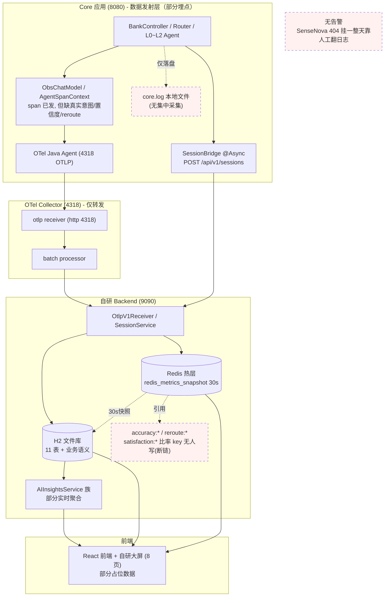
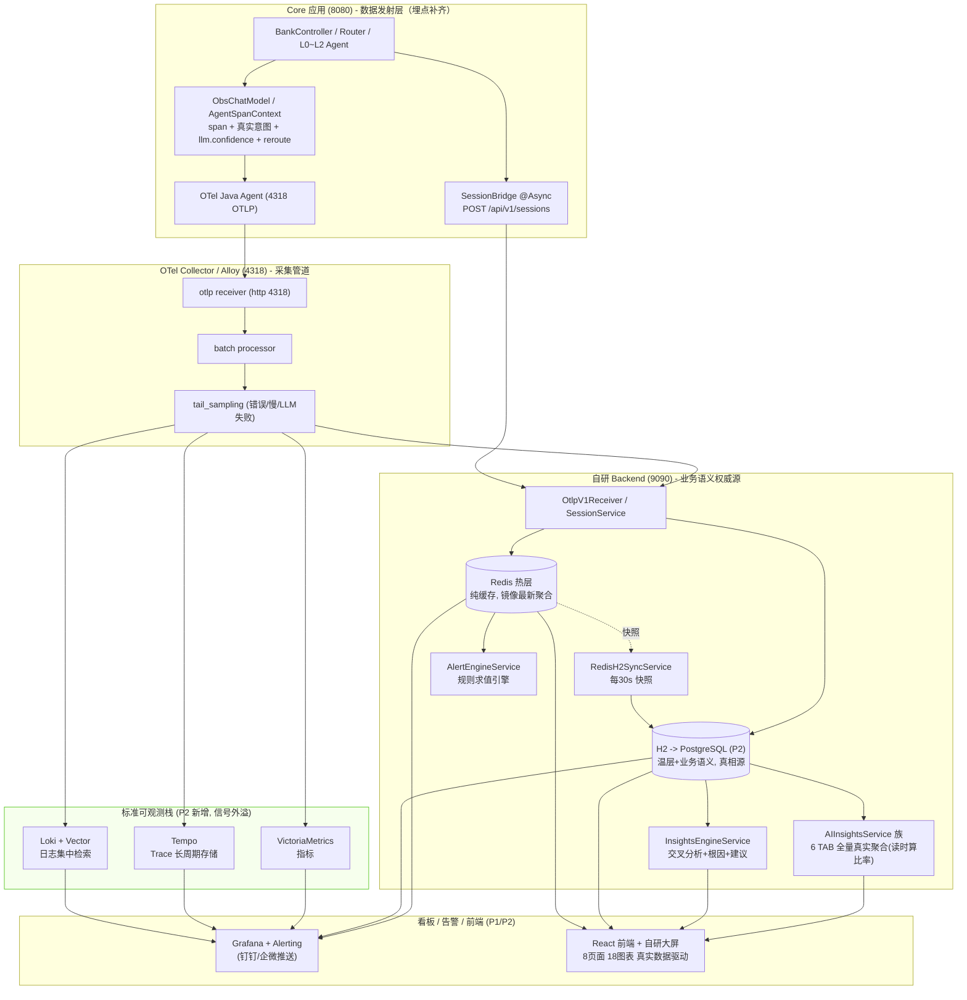
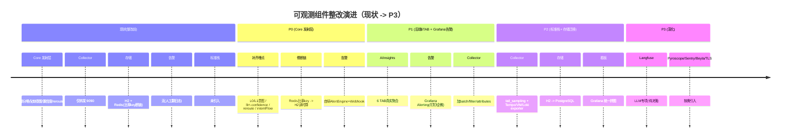
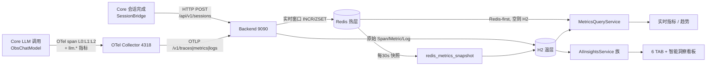

# AI 可观测系统优化总结（V3 融合版）

> 版本：V3 | 日期：2026-07-12 | 作者：Codex（AI 搭档）
> 融合来源：Codex V2（73,387 字，14 章节）+ WorkBuddy V2（32,004 字，8 章节）
> V3 变更要点：取两份文档之长，Codex V2 的代码级实现深度 + WorkBuddy V2 的工程实操性（实测状态/坑清单/并行策略/组件选型论证）

---

## 目录

1. [现状诊断与优化原则](#1-现状诊断与优化原则)
2. [优化计划总览](#2-优化计划总览)
3. [系统目标架构](#3-系统目标架构)
4. [数据流详细设计](#4-数据流详细设计)
5. [Core 端埋点设计](#5-core-端埋点设计)
6. [指标设计全表](#6-指标设计全表)
7. [DB 表设计全表](#7-db-表设计全表)
8. [Redis 缓存设计](#8-redis-缓存设计)
9. [AI 洞察智能诊断设计](#9-ai-洞察智能诊断设计)
10. [告警系统设计](#10-告警系统设计)
11. [UI 设计终稿说明](#11-ui-设计终稿说明)
12. [OTel Collector 增强配置](#12-otel-collector-增强配置)
13. [实施路径与里程碑](#13-实施路径与里程碑)
14. [关键坑清单](#14-关键坑清单)
15. [附录](#15-附录)

---

## 1. 现状诊断与优化原则

### 1.1 当前系统架构现状

```
被观测应用 (mobile-ai-demo, Spring Boot 3.5.5 :8080)
  ├─ Micrometer OTLP Exporter -> OTel Collector (:4318) -> 自建后端 (:9090)
  ├─ Logback OTLP Appender -> 直发后端 (:9090/v1/logs)
  └─ Actuator /prometheus 端点

自建可观测后端 (Spring Boot :9090)
  ├─ OTLPReceiverController / OtlpV1Receiver -> OtlpParserService
  │    ├─ Redis (热层: 实时滑动窗口, 1m/5m/15m/6h TTL)
  │    └─ H2 文件数据库 (温层: spans/logs/metrics_agg + 8张业务表)
  ├─ 查询服务层: 6 个 AI 洞察 Service + Trace/Log/Metrics 查询
  ├─ DataCleanupService: 7 天数据保留, 每天凌晨 3 点清理
  └─ 前端 React+Vite+AntD+ECharts (:3000, 3s 轮询)

OTel Collector (:4318)
  └─ 透传: receiver(otlp) -> exporter(otlphttp/json_backend -> :9090)
     无 processor (无 batch/filter/sampling)
     内部遥测 Prometheus 端口 :8887 (未对接)
```

### 1.2 核心问题诊断

| # | 问题域 | 具体问题 | 影响 |
|---|--------|---------|------|
| 1 | **埋点缺失** | Core 未在 LLM span 携带 llm.confidence；recordIntentAccuracy 无 layer tag；Session 只存单字符串 intentFlow | 无法做分层准确率分析、置信度展示 |
| 2 | **数据源断链** | setDau()/setOnlineUsers() 全代码库无调用方；Dashboard 多个 Redis key 无人写入 | Zone A DAU/在线永远 0 |
| 3 | **前后端契约错配** | AccuracyTab 读 .trend/.rewrite/.rootCauses，后端不返回这些字段 | 准确率 TAB 整页空白 |
| 4 | **OTel Collector 透传** | 无 batch processor、无 filter、无 sampling | 性能浪费 + 存储膨胀 |
| 5 | **告警无闭环** | AlertService 只有 CRUD + 事件存储，notifyChannels 预留但无推送逻辑 | 告警存库不触达 |
| 6 | **洞察停留在看数据** | 6 个洞察 TAB 各自独立展示指标，无交叉分析、无根因定位 | 需要人工交叉分析 |
| 7 | **H2 单点瓶颈** | 所有数据挤在 H2 文件库，3s 轮询频繁全表扫描 | 数据量大后查询变慢 |
| 8 | **无标准可观测栈** | 无 Tempo/Prometheus/Loki，日志仅本地文件 | 跨服务无法关联查日志 |
| 9 | **无告警自动化** | SenseNova 404 挂一整天靠人工翻日志 | 故障发现延迟 |

### 1.3 优化原则

| 模块 | 名称 | 策略 | 说明 |
|------|------|------|------|
| **A** | 基础指标 (Infra) | P2 交给 Grafana | JVM/HTTP/DB 等标准指标，不自建专用页 |
| **B** | AI 模型层 (LLM 性能) | 自建主战场 | Token/TTFT/TPOT/LLM 错误率 |
| **C** | AI 业务语义层 | 自建主战场 | 意图准确率/路由决策/漏斗/满意度 |
| **D** | 平台自观测 | MVP 不做 | 后端自身健康，延后到阶段二 |
| **E** | 维度规范 | 贯穿全程 | Metric Tag 基数预算，高基数字段归 Trace/Log |

**核心决策**：
- **P0 阶段**：H2 保留，聚焦修复 B+C 类的 GAP + 增强洞察引擎 + 告警闭环
- **P1 阶段**：引入 OTel Collector Processors + Grafana 告警
- **P2 阶段**：H2 -> PostgreSQL 迁移 + 引入 Grafana + Tempo/VictoriaMetrics/Loki 标准栈
- **P2 并行起步**：标准栈可与 P0 并行搭建（不依赖 LLM 跑通）

---

## 2. 优化计划总览

按最小改动、最高杠杆分阶段。P0 不靠换存储，而是先补 Core 发射层埋点。P2 标准栈可与 P0 并行起步。

### 2.1 四阶段计划表

| 阶段 | 目标 | 关键动作 | 业务代码改动 | 周期 | 当前状态 |
|---|---|---|---|---|---|
| **P0** | 打通 Core 发射层，让 6 TAB 有真实数据源 | 补全 session 上报字段；L0/L1 span 注入真实意图+业务动作回写；ObsChatModel 发射 llm.confidence；分层意图链 intentFlow 正确聚合；reroute 标记回写 span；UI 数据健康三态角标 | 大（Core 埋点为主） | 3-5 天 | 部分落地（需重启验证） |
| **P1** | 自研 9090 后端 + AIInsightsService 6 TAB 真实聚合 + Grafana 告警 | 落地 spec 的 6 个 Service + 6 TAB；部署 Grafana 统一看板 + Alerting（LLM 错误率>0 / TTFT P95 超阈 / 转账槽位骤降 -> 钉钉） | 中 | 约 1 周 | 后端 6 TAB 实时聚合已重写 |
| **P2** | 存储迁移 + 标准栈信号外溢 | H2 -> PostgreSQL；引入 Tempo/VictoriaMetrics/Loki（仅信号外溢）；Collector 加 tail_sampling/标准 exporter | 小 | 1-2 周 | 待启动 |
| **P3** | 深化 + LLM 专项 + 安全 | Langfuse / Pyroscope / Sentry(Faro) / Beyla / TLS / 模型对比评估 | 按需 | 持续 | 待决策 |

**起步一跳**：P2 的标准栈（Tempo/VictoriaMetrics/Loki/Grafana）即便 LLM 全挂也能先接上 trace/log 信号，**可与 P0 并行起步**，且运维成本极低。

**依赖提醒**：P0/P1 的准确率/业务洞察依赖 LLM 真实跑通（当前 SenseNova 404 是总阻塞），需先恢复可用模型（如 DashScope qwen 系列）。

### 2.2 功能实现矩阵

| 功能域 | 优化项 | 当前状态 | 目标状态 | 阶段 |
|--------|--------|---------|---------|------|
| 埋点 | LLM 置信度 span attribute | 缺失 | Core 在 LLM span 携带 llm.confidence | P0 |
| 埋点 | 意图准确率分层 | 无 layer tag | recordIntentAccuracy 增加 layer=L0/L1 tag | P0 |
| 埋点 | Session 分层意图 | 单字符串 intentFlow | Session 落库 l0_intent/l1_intent/l2_intent | P0 |
| 埋点 | DAU/在线人数 | 无写入方 | SessionService 调 recordDauUser/recordOnlineUser | P0 |
| 埋点 | Span 写 intent_predicted/actual | 仅 metric tag | Span attributes 携带分层意图 | P0 |
| 埋点 | reroute 标记回写 | 缺失 | BankController.dispatchWithReroute 发射 reroute.count | P0 |
| 采集 | OTel Collector processors | 透传无处理 | 增加 batch/filter/attributes/memory_limiter | P1 |
| 采集 | tail-based sampling | 无采样 | 按错误率/延迟智能采样 | P1 |
| 处理 | AccuracyTab 契约对齐 | 前端读错字段 | 后端返回完整结构，前端消费正确字段 | P0 |
| 处理 | 混淆矩阵数据源 | 可能恒为空 | 从 Span attributes 提取 | P0 |
| 处理 | TraceListVO 增加字段 | 无置信度/意图 | 增加 confidence/l0Intent/l1Intent | P0 |
| 洞察 | 智能诊断 TAB | 不存在 | 新增第 7 TAB + 洞察右栏 + 独立洞察页 | P0 |
| 洞察 | 慢会话根因分析 | 不存在 | P90 慢会话自动归因 | P0 |
| 洞察 | 流失会话特征画像 | 不存在 | 按意图/轮次/原因三维聚类 | P0 |
| 洞察 | 数据健康可信度 | 无 | 顶栏 health-pill + 设置页 health-card | P0 |
| 告警 | 规则求值引擎 | 只有 CRUD | @Scheduled 定时扫描 + 指标比对 + 触发 | P0 |
| 告警 | 通知推送 | 空壳 | 钉钉/飞书 Webhook（P1 迁 Grafana Alerting） | P0 |
| 告警 | 告警卡片化+时间线 | 表格 | alert-card 卡片式 + toggle + timeline | P0 |
| 存储 | H2 -> PostgreSQL | H2 文件库 | PostgreSQL 15+ | P2 |
| 存储 | 引入标准栈 | 无 | Tempo+VictoriaMetrics+Loki+Grafana | P2 |
| 日志 | 日志集中检索 | 仅本地文件 | Loki + Vector 集中采集/富化/查询 | P2 |

### 2.3 组件选型对照表

| 信号类型 | 当前 | 目标组件 | 选型理由 |
|---------|------|---------|---------|
| Trace | 自研 H2 spans 表 | **Tempo** | 原生 OTLP 协议、PromQL 风格查询、与 Grafana 无缝集成；优于 Jaeger（需额外 adapter） |
| Metrics | Redis 热层 + H2 metrics_agg | **VictoriaMetrics** | PromQL 兼容、资源占用仅为 Prometheus 的 1/3、集群原生支持；优于 Prometheus（单机扩展受限） |
| Logs | 仅本地 core.log 文件 | **Loki + Vector** | 轻量级日志聚合、按 label 而非全文索引（资源省 10x）、与 Grafana 无缝集成 |
| 看板/告警 | 自研前端 + 无告警 | **Grafana + Alerting** | 统一拼图（Tempo/VM/Loki 三源合一）、Alerting -> 钉钉/企微 Webhook |
| 采集 | OTel Collector（透传） | **OTel Collector（增强）/ Alloy** | P1 加 processors；P2 可选替换为 Grafana Alloy（单二进制统一采集） |

> **关键纠偏**：spec 明确 H2 在 P0 保留、P2 才迁 PostgreSQL；Tempo/VM/Loki 仅用于信号外溢，业务语义（session/funnel/satisfaction/reroute）必须留在关系库。真正的 P0 阻塞是 Core 发射层数据断链，不是存储。

---

## 3. 系统目标架构

### 3.1 当前架构（整改前 · 现状）



### 3.2 目标架构（整改后 · P2 完成时）



### 3.3 架构变化总结（前 -> 后）

| # | 变化 | 整改前 | 整改后 | 价值 |
|---|---|---|---|---|
| 1 | Core 埋点补齐 | span 已发，缺真实意图/置信度/reroute | span 注入真实意图链+置信度+reroute 回写 | 6 TAB/准确率洞察有真实数据源 |
| 2 | Collector 从单管道到可采样多后端 | 仅 batch 后转发 9090 | 加 tail_sampling + 并行 exporter（Tempo/VM/Loki） | 错误/慢链路必留样；信号外溢标准栈 |
| 3 | 新增标准可观测栈 | 完全没有 | Tempo + VictoriaMetrics + Loki + Grafana | Trace/指标/日志长周期存储+统一拼图 |
| 4 | 日志从本地文件到集中检索 | 仅 core.log 落盘 | Loki + Vector 集中采集/富化/查询 | 跨服务按 traceId 关联查日志 |
| 5 | 告警从无到自动推送 | 无 | Grafana Alerting -> 钉钉/企微 | 异常自动触达 |
| 6 | Redis 从部分真相源到纯缓存 | 比率 key 充当真相源（断链） | 纯缓存，真相在 H2/PG，比率读时算 | 根治断链 |

### 3.4 分阶段演进时间线



### 3.5 能力成熟度矩阵

| 能力维度 | 现状 | P0 | P1 | P2 | P3 |
|---|---|---|---|---|---|
| Trace 链路（含分层意图） | 部分有 span，缺真实意图 | 意图+reroute 完整 | 稳定 | + Tempo 外溢 | + Beyla |
| Metrics 指标（token/TTFT/错误率） | 基础指标已发 | + confidence | + 6 TAB 聚合 | + VictoriaMetrics | + Pyroscope |
| 日志集中检索 | 仅本地文件 | 未变 | 未变 | Loki 接入 | + Faro 前端 |
| 会话回放/业务语义 | sessions/turns 已写 | 关联键已修 | 漏斗/满意度真实 | 迁 PG | 稳定 |
| AI 洞察（6 TAB+智能洞察） | 部分实时聚合 | 数据源补齐中 | 全量真实 | + Grafana 同源 | 稳定 |
| 告警自动化 | 无 | 自研引擎 | Grafana Alerting | 稳定 | 丰富 |
| 标准可观测栈 | 未引入 | 未引入 | 未引入 | Tempo/VM/Loki/Grafana | 全 |
| LLM 专项（Langfuse） | 未接入 | 未接入 | 未接入 | 待决策 | 按决策 |
| 数据健康可信度 | 三态角标(设计稿) | 角标数据真实 | 真实驱动 | 稳定 | 稳定 |

### 3.6 架构设计决策记录

| # | 决策 | 理由 |
|---|------|------|
| D1 | P0 不替换 H2 | spec 明确：H2 P0 保留，P2 迁移 PostgreSQL |
| D2 | 自研前端专注 B+C 类 | 与 LangSmith/LangFuse 取舍一致，差异化全在 AI 业务洞察 |
| D3 | OTel Collector 增强 processors 优先 | 零新组件，只改配置，立即见效 |
| D4 | 告警 P0 自研引擎 + Webhook，P1 迁 Grafana Alerting | P0 不引入 Grafana，自研够用；P1 Grafana 自然获得 Alerting |
| D5 | 智能诊断作为第 7 TAB + 独立洞察页 | 在 6 TAB 上增加诊断 TAB + 右栏洞察 + 独立页 |
| D6 | Redis 仅作缓存，语义比率读时算 | 根治 accuracy:*/reroute:*/satisfaction:* 断链 key |
| D7 | Grafana P2 引入 | A 类指标不自建专用页，交给 Grafana 社区仪表盘 |
| D8 | P2 标准栈与 P0 并行起步 | 标准栈不依赖 LLM，可并行搭起，节省整体时间 |

---

## 4. 数据流详细设计

### 4.1 总体数据流



> **两条独立管道（极易混淆，务必记牢）**：
> 1. **spans 管道**：Core OTel agent 自动拦截 -> OTLP -> Collector -> 后端写 spans 表。按 traceId 关联。
> 2. **sessions 管道**：Core BankController 完成后异步 SessionBridge.reportSession(...)（@Async fire-and-forget）-> HTTP POST 9090 -> SessionService.upsertSession 写 sessions + session_turns 表。按 sessionId 关联。
> 会话不依赖 span/trace 导出成败（即使 OTel 导出失败，会话回放仍有值）。

### 4.2 Trace 链路追踪数据流

```
Core ObsChatModel.startBusinessSpan()
  spanName = "<layer>:<model>" 例: "L0:qwen-plus" / "L1-LLM2:qwen-plus" / "L2:qwen-plus"
  attributes: agent.name / model.name / agent.layer / intent / session_id / user_id
             + ai.io.prompt / ai.io.response / ai.token.input / ai.token.output
  held-span: 调用方 commitIntent 后回填 intent 并 end
      ↓ OTel Java Agent 自动导出
OTel Collector (4318) -> otlphttp/json_backend
      ↓ POST /v1/traces
Backend OtlpParserService.parseTraces()
  写 SpanEntity(trace_id, span_id, parent_span_id, service, op_name, kind,
                start, end, duration_ms, status, attributes JSON)
  pushRecentTrace -> Redis obs:traces:recent (LPUSH+LTRIM 100)
      ↓
TraceQueryService.listTracesPaginated()  [按 trace_id 去重枚举]
  跳过无业务 span 的 trace
  聚合 TraceListVO: timestamp / durationMs / status / sessionId / intent / userId
        / agentChain / intentChain / TTFT / tokenTotal / confidence / l0Intent / l1Intent
```

- **Agents 链显示规则**（R26 修复）：按 L0 边界切段 -> 每段 L0 -> L1(合并 L1-LLM1/L1-LLM2) -> 业务名；reroute 则为 L0->L1->WEALTH -> L0->L1->TRANSFER。
- **意图链**：四层真实识别结果 L0意图 Domain -> L1-LLM1 -> L1-LLM2 -> L2，不再回退 session 整条 intentFlow（根治串味 bug）。
- **Token 回退** sumTokensFromSpans：会话的 token 以 span 属性为准，避免 SessionBridge 未带 token 时缺失。

### 4.3 指标（Metrics）数据流

```
Core Micrometer 指标（ObsChatModel.buildTimer / ObservabilityMetrics）
  llm.token.input/output      Counter   (tags: model, agent.level, agent.name, intent)
  llm.first_token.latency     Histogram  ← 必须 publishPercentileHistogram(true)
  llm.operation.duration      Histogram
  llm.error.count             Counter   (tag: model, error_type)
  agent.* (router.decision / l1.call / reroute.count / intent.accuracy / business.outcome ...)
      ↓ OTLP /v1/metrics
Backend OtlpParserService.parseMetrics()  [只解析 Histogram / Sum / Gauge，不解析 Summary]
  Histogram -> Redis latency:{1m/5m/15m} ZSET + ttft:1m ZSET；同时落 H2 metrics_agg
  Sum(Counter) -> Redis request_count / error_count / token_* / intent_distribution；落 H2
  Gauge -> Redis active_sessions；落 H2
      ↓ 每30s
RedisH2SyncService -> H2 redis_metrics_snapshot
      ↓ 查询
MetricsQueryService.getRealtime()  Redis-first，空则回退 H2
```

- **埋点陷阱**：任何 Timer.publishPercentiles(...) 会被 Micrometer OTLP 导出为 Summary，后端不解析 -> 分位恒 0。LLM 时延必须用 publishPercentileHistogram(true)。

### 4.4 日志（Logs）数据流

```
Core / Backend 日志（含 logback MDC: trace_id / span_id / session_id）
      ↓ OTLP /v1/logs（或 P2 由 Vector/Loki 直接采集 core.log/backend.log）
Backend OtlpParserService.parseLogs()
  写 LogEntity(trace_id, span_id, level, service, message, attributes)
  pushRecentLog -> Redis obs:logs:recent (LTRIM 1000)
      ↓
前端日志查询页：每行支持三件套跳转（trace.id->链路详情、session.id->会话回放）
```

- **P2 增强**：core.log/backend.log 经 Vector 采集 -> Loki，Grafana 统一检索，从错误率 spike 一键下钻到慢 trace 再跳该 trace 的 log。

### 4.5 会话（Session）数据流

```
Core BankController 完成一轮 /api/bank/chat
  doOnTerminate -> sessionBridge.reportSession(userId, input, response, intent,
                  agentPath, confidence, durationMs, tokens, traceId, "COMPLETED")
      ↓ @Async fire-and-forget（失败不影响主业务）
HTTP POST http://127.0.0.1:9090/api/v1/sessions
      ↓
Backend SessionService.upsertSession(Map)
  sessions 表: turn_count+1 / intent_flow += " -> "+intent / total_tokens += tokens
               / status / end_time / duration_seconds / satisfaction_*
               + l0_intent / l1_intent / l2_intent（P0 新增）
               + reroute_triggered（P0 新增）
  session_turns 表: 每轮一条(user_message, ai_response, intent, agentPath,
                    confidence, duration_ms, tokens, trace_id, status, timestamp)
  recordDauUser(userId) + recordOnlineUser(userId)  [修复数据源断链]
      ↓ 关联
  session_turns.trace_id -> spans 表（token 回退：若 turns.tokens==0，按 traceId 查 spans 累加）
```

### 4.6 告警（Alerts）数据流

```
规则管理: alert_rules 表 (rule_name, metric_name, threshold, operator, duration, severity, enabled, notify_channels)
事件: alert_events 表 (rule_id, severity, status, triggered_at, resolved_at, message)
      ↓
指标越阈检测
  P0: 自研 AlertEngineService @Scheduled 定时评估
  P1: 迁移到 Grafana Alerting
  ├─ LLM 错误率 > 0        -> 钉钉
  ├─ TTFT P95 超阈         -> 钉钉
  ├─ 转账槽位完成率骤降     -> 钉钉
  └─ Collector 接收量骤降   -> 邮件
      ↓
智能洞察页「告警规则 + 事件时间线」展示闭环
```

### 4.7 DAU/在线人数数据流修复（P0）

```
SessionService.upsertSession()
  → recordDauUser(userId): Redis PFADD obs:dau:date
  → recordOnlineUser(userId): Redis SETEX obs:online:userId 300
      ↓ 每30s
RedisH2SyncService 快照 -> H2 redis_metrics_snapshot
      ↓ 查询
MetricsQueryService: DAU = Redis PFCOUNT obs:dau:date
                    Online = Redis 统计 obs:online:* key 数量
```

- 在线人数 TTL 改 300s（5 分钟），避免活跃用户掉线太快

---

## 5. Core 端埋点设计

### 5.1 埋点增强总览

| # | 埋点位置 | 当前问题 | P0 增强 | 代码文件 |
|---|---------|---------|---------|---------|
| 1 | ObsChatModel LLM span | 缺 llm.confidence | span 写入 llm.confidence | ChatClientWrapper.java |
| 2 | recordIntentAccuracy | 无 layer tag | 增加 layer=L0/L1 tag | ObservabilityMetrics.java |
| 3 | SessionBridge | 单字符串 intentFlow | 落库 l0_intent/l1_intent/l2_intent + reroute_triggered | SessionService.java |
| 4 | AbstractDomainService | 仅 metric tag | Span attributes 携带 intent_predicted/actual | AbstractDomainService.java |
| 5 | DomainRouter/ContextRouter | intent 传 null | 写入真实识别结果 routeType/intentName | 各 Router.java |
| 6 | BankController.dispatchWithReroute | 无 reroute 度量 | 发射 reroute.count Counter + reroute_reason tag | BankController.java |

### 5.2 held-span 模式说明

ObsChatModel 创建 span 时，真实意图尚未确定（需等 LLM 返回后由调用方 commitIntent）。因此采用 held-span 模式：

- **AgentSpanContext.setWithHeldSpan(...)**：创建 span 但不 end，存入 ThreadLocal
- **commitIntent(intent, extra)**：调用方在 LLM 返回后，用真实 intent 回填 span 属性并 end
- **异常路径**：若 commitIntent 未调用，finally 块安全 no-op end span
- **P0 待补**：DomainRouter/ContextRouter/SubGraphRouter 的 set(...) 当前 intent 传 null，需把真实识别结果写入 span 的 intent 属性

### 5.3 Span Attributes 规范（P0 新增/补全）

| 属性名 | 类型 | 来源 | 说明 |
|--------|------|------|------|
| llm.confidence | double | ObsChatModel | LLM 置信度（0.0-1.0） |
| intent.predicted | string | Router 各层 | 预测意图 |
| intent.actual | string | AbstractDomainService | 实际意图（用于混淆矩阵） |
| intent.layer | string | Router | L0/L1/L2 |
| session.l0_intent | string | SessionBridge | L0 域意图 |
| session.l1_intent | string | SessionBridge | L1 子意图 |
| session.l2_intent | string | SessionBridge | L2 业务意图 |
| reroute.triggered | bool | BankController | 是否发生 reroute |
| reroute.reason | string | BankController | reroute 原因 |

### 5.4 指标发射约定（写 Core 时必须遵守）

1. **时延类 Timer 一律 publishPercentileHistogram(true)**。任何 Timer.publishPercentiles(...) 会被 Micrometer OTLP 导出为 Summary，后端不解析 -> 分位恒 0。
2. **语义计数用 Counter + 规范 tag 落到 H2 metrics_agg**，不要在 Redis 另存一份比率 key。这是 GAP 中多个 accuracy:* Redis key 无人写的根因。
3. **Agent 分层调用数用 H2 COUNT(DISTINCT trace_id)**，不要按 OTLP 导出次数 INCR（被放大 N 倍）。
4. **错误率用 H2 spans 真值计算**，不要用 Redis 计数器（按导出次数自增失真）。

---

## 6. 指标设计全表

> 状态图例：正常 / 已解决 / 回归 / 仍开放 / 待启动。下表为当前代码实测 + P0 待补项的完整指标契约。

### 6.1 总览大屏（Dashboard）指标

| # | 指标 | 数据源（实测） | 当前状态 | 说明 / P0 动作 |
|---|---|---|---|---|
| A1 | activeSessions | Redis session.active Gauge | 正常 | - |
| A2 | DAU | redisMetrics.getDau() | 已修复 | SessionService.upsertSession 调 recordDauUser |
| A3 | realTimeOnline | redisMetrics.getOnlineUsers() | 已修复 | 同上，TTL 改 300s |
| A4 | requestCount(6h) | Redis request_count:6h | 已解决 | 多窗口 INCR 贯通 |
| A5 | QPS | requestCount/21600 | 已解决 | 与 6h 自洽 |
| A6 | agentCall L0/L1/L2 | H2 spans COUNT(DISTINCT trace_id) by L0:/L1:/L2: | 已解决 | 改 H2 真值计数，根除 per-export 放大 |
| B1 | Token 调用量 | llm.token.* Counter | 正常 | Redis 1m + H2 cumulative |
| B2 | TTFT P50/P95/P99 | Redis ttft:1m ZSET | 正常(仅1m窗口) | publishPercentileHistogram(true) |
| B3 | P95 系统时延 | Redis latency:1m | 正常 | 单位归一 |
| B4 | 错误率 | H2 spans 真值计算 | 已解决 | 脱离 Redis 计数器 |
| C1 | intentAccuracy(分层) | H2 agent.intent.accuracy | 部分 | 单值已通；L0/L1 分层待 Core 加 layer tag（P0） |
| C2 | rewriteAccuracy | H2 agent.rewrite.accuracy | 已修复 | computeRewriteAccuracy |
| C3 | rerouteRate | H2 agent.reroute.count | 仍开放 | Core 未发射 reroute 度量（P0） |
| C4 | completionRate | H2 agent.business.outcome | 正常 | 兼容 outcome/result 双源 |
| D1 | conversionRate | 业务成功率近似 | 正常 | 同 C4 同源 |
| D2 | violationRate | 无数据源 | 仍开放 | 待安全围栏对接 |

### 6.2 llm.* 指标组（ChatClientWrapper 自动拦截）

| 指标 | 类型 | Tags | 说明 |
|------|------|------|------|
| llm.token.input | Counter | model, agent.level, agent.name, intent | 输入 Token 数 |
| llm.token.output | Counter | model, agent.level, agent.name, intent | 输出 Token 数 |
| llm.first_token.latency | Histogram | model, agent.level | TTFT（publishPercentileHistogram=true） |
| llm.operation.duration | Histogram | model, agent.level, intent | LLM 调用总耗时 |
| llm.error.count | Counter | model, error_type | LLM 错误计数 |

### 6.3 agent.* 指标组（手动埋点）

| 指标 | 类型 | Tags | 说明 |
|------|------|------|------|
| agent.router.decision | Counter | route_type, from_layer, to_layer | 路由决策计数 |
| agent.l1.call | Counter | agent_name, intent | L1 调用计数 |
| agent.l2.call | Counter | agent_name, intent | L2 调用计数 |
| agent.reroute.count | Counter | reroute_reason, from_intent, to_intent | 重路由计数（P0 新增） |
| agent.intent.accuracy | Counter | layer, intent, correct(bool) | 意图准确率（P0 加 layer tag） |
| agent.rewrite.accuracy | Counter | intent, correct(bool) | 改写准确率 |
| agent.business.outcome | Counter | intent, outcome | 业务结果（success/fail） |
| agent.tool.call | Counter | tool_name, status | 工具调用计数 |
| agent.tool.duration | Histogram | tool_name | 工具调用耗时 |
| agent.tool.error | Counter | tool_name, error_type | 工具错误计数 |

### 6.4 P0 新增指标

| 指标 | 发射方 | 落库 | 关联 |
|------|--------|------|------|
| llm.confidence（span attr） | ObsChatModel | spans.attributes | TraceListVO.confidence |
| intent.L0/L1/L2.predicted/actual（span attr） | Router 各层 commitIntent | spans.attributes | 混淆矩阵 |
| sessions.l0_intent/l1_intent/l2_intent | SessionBridge | sessions 表 | 会话回放 |
| reroute.count（Counter, tag reroute_reason） | BankController.dispatchWithReroute | metrics_agg | rerouteRate |
| sessions.reroute_triggered | SessionBridge | sessions 表 | rerouteRate |
| agent.intent.accuracy（加 layer tag） | Core recordIntentAccuracy | metrics_agg | C1 分层 |

### 6.5 大屏 Zone 与指标对应关系

| Zone | 位置 | 指标 | 数据源 |
|------|------|------|--------|
| A | 总览顶部四卡 | DAU/在线/请求量/QPS | Redis |
| B | 总览中左 | Token 调用量趋势 | Redis + H2 |
| C | 总览中右 | TTFT P50/P95/P99 | Redis ZSET |
| D | 总览左下 | 错误率 | H2 spans |
| E | 总览右下 | Agent 分层调用 | H2 spans |
| F | AI 洞察 TAB | 各 TAB 专属指标 | H2 |

### 6.6 维度规范与基数预算

| 维度 | 基数上限 | 归属 | 说明 |
|------|---------|------|------|
| model.name | <20 | Metric Tag | 模型名，有限集 |
| agent.name | <50 | Metric Tag | Agent 名，有限集 |
| agent.layer | 3 | Metric Tag | L0/L1/L2 |
| intent | <100 | Metric Tag | 意图名，有限集 |
| user_id | 高基 | Trace/Log Attr | 归 Trace，不做 Metric Tag |
| session_id | 高基 | Trace/Log Attr | 归 Trace，不做 Metric Tag |
| trace_id | 高基 | Trace/Log Attr | 归 Trace，不做 Metric Tag |

---

## 7. DB 表设计全表

### 7.1 设计原则

> **Redis 管实时窗口，H2/PG 管真相与历史；热->温每 30s 同步；语义比率在 H2 上算，不镜像。**

1. **热窗口聚合**（request_count/error_count/token_*/latency/ttft/intent_distribution/active_sessions/agent_call/dau/online）-> 镜像到 redis_metrics_snapshot。Redis 重启不丢、可做历史趋势。
2. **原始遥测**（每个 span / 每个 metric data point / 每条 log）-> 直接落 H2 spans/metrics_agg/logs，是系统真相源。
3. **语义比率**（准确率/重路由率/业务成功率）-> **不存 Redis 比率 key，也不造镜像表**；查询时从 metrics_agg/spans 实时计算。
4. **会话/业务语义**（sessions/session_turns/tool_calls/alert_*）-> 权威源在 H2；Redis 仅缓存最近列表。

### 7.2 现有表（保留不变）

| 表 | 用途 | 关键字段 | 状态 |
|---|---|---|---|
| metrics_agg | 指标聚合温层 | metric_name, tags(JSON), value, agg_window, timestamp | 活跃 |
| spans | Span 明细 | trace_id, span_id, parent_span_id, operation_name, kind, start/end, duration_ms, status_code, attributes(JSON) | 活跃 |
| logs | 日志明细 | trace_id, span_id, level, service, message, timestamp | 活跃 |

### 7.3 Phase 1 已有表（P0 需修改）

| 表 | 用途 | P0 修改 | 状态 |
|---|---|---|---|
| sessions | 会话聚合 | +l0_intent/+l1_intent/+l2_intent/+reroute_triggered 列 | 活跃（ALTER TABLE 加列） |
| session_turns | 每轮对话 | 无修改 | 活跃 |
| tool_calls | 工具调用 | 无修改 | 活跃 |
| alert_rules | 告警规则 | 无修改 | 活跃 |
| alert_events | 告警事件 | 无修改 | 活跃 |
| redis_metrics_snapshot | Redis 快照 | 无修改 | 活跃 |
| agent_performance | Agent 性能 | **已弃用**（改读 spans+metrics_agg 实时聚合） | 弃用保留 |
| token_cost | Token 成本 | **已弃用**（改读 spans+metrics_agg 实时聚合） | 弃用保留 |

> **H2 ALTER TABLE 风险提醒**：H2 文件库的 ALTER TABLE ADD COLUMN 在某些版本可能有兼容性问题。建议在 schema.sql 中直接修改建表语句（ddl-auto:none，幂等建表），而非运行时 ALTER。

### 7.4 P0 新增表

无新增表。P0 聚焦在现有表加列 + 埋点补全。InsightsEngineService 和 AlertEngineService 的数据基于现有表实时聚合，不新建表。

### 7.5 关键表 DDL

```sql
-- sessions 表 P0 新增列（在 schema.sql 中修改）
-- 如使用 H2 ALTER TABLE 需注意兼容性，建议直接修改 CREATE TABLE 语句
ALTER TABLE sessions ADD COLUMN IF NOT EXISTS l0_intent VARCHAR(100);
ALTER TABLE sessions ADD COLUMN IF NOT EXISTS l1_intent VARCHAR(100);
ALTER TABLE sessions ADD COLUMN IF NOT EXISTS l2_intent VARCHAR(100);
ALTER TABLE sessions ADD COLUMN IF NOT EXISTS reroute_triggered BOOLEAN DEFAULT FALSE;
```

### 7.6 Redis -> DB 同步映射表

| Redis Key | H2 表 | 同步方式 | 说明 |
|-----------|------|---------|------|
| obs:metrics:request_count:* | redis_metrics_snapshot | 30s 快照 | 请求计数 |
| obs:metrics:error_count:* | redis_metrics_snapshot | 30s 快照 | 错误计数 |
| obs:metrics:token_*:* | redis_metrics_snapshot | 30s 快照 | Token 计数 |
| obs:metrics:latency:*:* | redis_metrics_snapshot | 30s 快照 | 延迟分位 |
| obs:metrics:ttft:1m | redis_metrics_snapshot | 30s 快照 | TTFT 分位 |
| obs:metrics:intent_distribution | redis_metrics_snapshot | 30s 快照 | 意图分布 |
| obs:metrics:active_sessions | redis_metrics_snapshot | 30s 快照 | 活跃会话 |
| obs:metrics:dau | redis_metrics_snapshot | 30s 快照 | DAU |
| obs:metrics:online_users | redis_metrics_snapshot | 30s 快照 | 在线人数 |
| obs:metrics:agent_call:* | redis_metrics_snapshot | 30s 快照 | Agent 调用 |
| obs:traces:recent | spans | 实时写入 | 最近 trace 列表缓存 |
| obs:logs:recent | logs | 实时写入 | 最近 log 列表缓存 |
| accuracy:* / reroute:* / satisfaction:* | **不存 Redis** | 读时算 | 语义比率改为 H2 实时计算 |

---

## 8. Redis 缓存设计

### 8.1 所有权原则

> **Redis = 纯缓存（实时窗口），H2/PG = 真相源（历史+业务语义），语义比率在 H2 上算不镜像。**

- Redis 管"实时窗口"：1m/5m/15m/6h TTL 的 ZSET/Counter/Gauge
- H2/PG 管"真相与历史"：spans/metrics_agg/sessions/session_turns/logs/tool_calls/alert_*
- 热->温每 30s 同步：RedisH2SyncService -> redis_metrics_snapshot
- 语义比率不存 Redis：准确率/重路由率/业务成功率查询时从 H2 实时算

### 8.2 Redis Key 规范全表

| Key 模式 | TTL | 用途 | 写入方 | 读取方 |
|---------|-----|------|--------|--------|
| obs:metrics:request_count:{window} | 120s-21600s | 请求计数 | OtlpParserService | MetricsQueryService |
| obs:metrics:error_count:{window} | 120s-21600s | 错误计数 | OtlpParserService | MetricsQueryService |
| obs:metrics:token_input:{window} | 120s-21600s | 输入 Token | OtlpParserService | MetricsQueryService |
| obs:metrics:token_output:{window} | 120s-21600s | 输出 Token | OtlpParserService | MetricsQueryService |
| obs:metrics:latency:{window} | 120s-21600s | 延迟 ZSET | OtlpParserService | MetricsQueryService |
| obs:metrics:ttft:1m | 120s | TTFT ZSET | OtlpParserService | MetricsQueryService |
| obs:metrics:intent_distribution | 21600s | 意图分布 | OtlpParserService | MetricsQueryService |
| obs:metrics:active_sessions | 120s | 活跃会话 Gauge | OtlpParserService | MetricsQueryService |
| obs:metrics:dau:{date} | 86400s | DAU HyperLogLog | SessionService | MetricsQueryService |
| obs:metrics:online:{userId} | 300s | 在线用户 SET | SessionService | MetricsQueryService |
| obs:metrics:agent_call:{layer} | 21600s | Agent 分层调用 | H2 实时聚合 | MetricsQueryService |
| obs:traces:recent | 3600s | 最近 trace 列表 | OtlpParserService | TraceQueryService |
| obs:logs:recent | 3600s | 最近 log 列表 | OtlpParserService | LogQueryService |
| **已清除** accuracy:* / reroute:* / satisfaction:* | - | 语义比率（已改为读时算） | **不写 Redis** | H2 实时计算 |

### 8.3 DAU / 在线人数写入逻辑

```java
// SessionService.upsertSession() 中调用
private void recordDauUser(String userId) {
    String today = LocalDate.now().format(DateTimeFormatter.BASIC_ISO_DATE);
    redisTemplate.opsForHyperLogLog().add("obs:metrics:dau:" + today, userId);
}

private void recordOnlineUser(String userId) {
    redisTemplate.opsForValue().set("obs:metrics:online:" + userId, "1", 300, TimeUnit.SECONDS);
}
```

---

## 9. AI 洞察智能诊断设计

### 9.1 设计目标

从"看数据"升级为"给行动"：在 6 TAB 独立指标展示之上，新增交叉分析引擎（InsightsEngineService），自动识别性能瓶颈、准确率风险、业务转化流失，给出 TOP5 优先行动建议+根因分析+下钻入口。

### 9.2 AIInsightsService 族（6 Service 对齐 spec）

| Service | 数据源 | 聚合口径 |
|---------|--------|--------|
| AIInsightsService | metrics_agg(H2) | 置信度分布、参数提取完整率、改写准确率、混淆矩阵、意图准确率、Reroute 计数、业务成功率 |
| AgentPerformanceService | spans + metrics_agg | 调用次数/耗时分位/错误率（model+agent 双维）；补 TTFT/TPOT/Token |
| TokenCostService | metrics_agg + spans | 按 intent/model 聚合 token，成本=输入x0.002/1K+输出x0.006/1K |
| ConversionFunnelService | sessions | 进入->意图识别->L1->L2->业务完成漏斗 |
| SatisfactionService | sessions + session_turns | 满意度分布、7天趋势、unsatisfied 原因聚类 |
| ToolStatsService | tool_calls | 按 toolName 聚 total/success/fail/avg/p95/errorRate |

> 已实现重构：AgentPerformanceService/TokenCostService 从读空静态表改为实时聚合 spans+metrics_agg，接口契约不变。

### 9.3 InsightsEngineService 架构

InsightsEngineService 是在 6 Service 之上的交叉分析引擎，负责：

```java
@Service
public class InsightsEngineService {
    // 三大诊断域
    // 1. 性能瓶颈诊断：P95 超阈检测 + 慢会话根因归因
    // 2. 准确率风险诊断：Reroute 率异常 + 混淆矩阵分析
    // 3. 业务转化诊断：漏斗流失聚类 + 满意度负面分析

    public InsightReport generateReport() {
        // 1. 从 6 Service 收集原始指标
        // 2. 交叉分析（如 Token 成本 x 完成率 ROI）
        // 3. 根因定位（慢会话按 LLM/工具/追问归因）
        // 4. 生成 TOP5 优先行动建议（按 HIGH/MED/LOW 排序）
        // 5. 缓存报告（5 分钟 TTL）
    }
}
```

### 9.4 三大诊断域 x 提炼项明细

#### 性能瓶颈（运维）
| # | 提炼项 | 数据源 | 触发条件 | 行动建议 |
|---|--------|--------|---------|--------|
| 1 | 理财咨询 P95 超阈 | spans | P95 > 1500ms | 扩充并发/缓存 |
| 2 | LLM 重试率偏高 | metrics_agg | error_rate > 5% | 检查模型可用性 |
| 3 | Slow 追问 TopN | sessions | 追问次数 > 3 | 优化 prompt/上下文 |
| 4 | Token 成本 ROI 异常 | metrics_agg x sessions | cost/完成率比值偏高 | 优化 prompt 长度 |

#### 准确率风险（算法/产品）
| # | 提炼项 | 数据源 | 触发条件 | 行动建议 |
|---|--------|--------|---------|--------|
| 5 | Reroute 率偏高 | metrics_agg | reroute_rate > 10% | 补 L0-L1 分层意图 |
| 6 | 代词指代根因 | spans | intent_predicted != intent_actual | 优化上下文传递 |
| 7 | L0-L1 分层待打通 | spans | layer tag 缺失 | Core 加 layer tag |
| 8 | 混淆矩阵异常 | spans | 对角线占比 < 80% | 优化意图识别模型 |

#### 业务转化（运营）
| # | 提炼项 | 数据源 | 触发条件 | 行动建议 |
|---|--------|--------|---------|--------|
| 9 | 参数提取放弃率 | sessions | 放弃率 > 15% | 优化追问策略 |
| 10 | 转账转化低于账单 | sessions | 转账完成率 < 账单完成率 | 分析转化差异 |
| 11 | 满意度负面聚类 | sessions | 满意度 < 3.0 占比 > 20% | 定位低满意度原因 |
| 12 | 流失会话特征 | sessions | 流失在 1-2 轮占比 > 60% | 延长 timeout/优化首轮体验 |

### 9.5 慢会话根因分析详细逻辑

```
P90 慢会话 -> 按 traceId 查 spans -> 归因分析：
  ├─ LLM 耗时占比 > 60% -> 根因：LLM 响应慢
  ├─ 工具调用耗时占比 > 30% -> 根因：工具调用阻塞
  ├─ 追问次数 > 3 -> 根因：意图识别不佳导致多轮
  └─ 其他 -> 根因：系统调度
```

### 9.6 诊断驾驶舱（UI）

页面顶部五个区块，直接指导运营/运维排障：
1. **优先行动建议 TOP5**：按 HIGH/MED/LOW 严重度排序的可执行卡，每张带严重度标签+关联 TAB 下钻
2. **三类瓶颈卡**（性能红/准确率黄/转化紫）：左边界按类别着色，汇总 TOP 瓶颈与升级建议
3. **慢会话根因表**：列出 P95 延迟最高的会话（域/轮次/耗时/瓶颈层/根因），点击可跳转 trace
4. **不满意会话共性表**：汇总低满意度会话的共性（超时占比/意图识别错误/回答不准确）
5. **Agent P95 延迟 vs 错误率阈值散点**：按 L0/L1/L2 分组画柱状 P95+叠加错误率折线+1500ms 阈值虚线

### 9.7 API 端点设计

| 端点 | 方法 | 说明 |
|------|------|------|
| /api/v1/insights/report | GET | 获取洞察报告（含 TOP5 行动+三诊断域） |
| /api/v1/insights/slow-sessions | GET | 慢会话根因分析列表 |
| /api/v1/insights/churn-analysis | GET | 流失会话特征画像 |
| /api/v1/insights/token-roi | GET | Token 成本 ROI 交叉分析 |

### 9.8 洞察报告缓存策略

- 报告缓存 5 分钟 TTL（避免频繁交叉分析）
- 慢会话/流失分析缓存 10 分钟 TTL
- 手动刷新接口 /api/v1/insights/refresh 可强制重算

---

## 10. 告警系统设计

### 10.1 告警引擎分阶段策略

| 阶段 | 方案 | 说明 |
|------|------|------|
| P0 | 自研 AlertEngineService + AlertNotifyService | @Scheduled 定时扫描 + 指标比对 + 钉钉/飞书 Webhook |
| P1 | 迁移到 Grafana Alerting | Grafana Alerting -> 钉钉/企微 Webhook，更省维护 |
| P2+ | Grafana Alerting 稳定运行 | 丰富告警规则，增加告警分组/抑制/路由 |

### 10.2 AlertEngineService 设计（P0）

```java
@Service
public class AlertEngineService {
    @Scheduled(fixedRate = 60000) // 每分钟评估一次
    public void evaluateRules() {
        // 1. 从 alert_rules 表加载 enabled 规则
        // 2. 逐条规则：查询当前指标值
        // 3. 比对阈值（operator: >/<>=/<= ）
        // 4. 持续时间检查（duration 字段）
        // 5. 触发 -> 写 alert_events + 调 AlertNotifyService
    }
}
```

### 10.3 AlertNotifyService - 多渠道通知

```java
@Service
public class AlertNotifyService {
    // 钉钉 Webhook
    public void notifyDingTalk(AlertEvent event) {
        // POST https://oapi.dingtalk.com/robot/send?access_token=xxx
        // 消息格式: markdown card with severity color
    }

    // 飞书 Webhook
    public void notifyFeishu(AlertEvent event) {
        // POST https://open.feishu.cn/open-apis/bot/v2/hook/xxx
        // 消息格式: interactive card
    }
}
```

### 10.4 告警规则配置表

| # | 规则名 | 指标 | 阈值 | 操作符 | 持续时间 | 严重度 | 通知渠道 |
|---|--------|------|------|--------|---------|--------|--------|
| 1 | LLM 错误率告警 | llm.error.count / request_count | 0 | > | 1m | HIGH | 钉钉 |
| 2 | TTFT P95 超阈 | ttft:1m P95 | 2000ms | > | 5m | HIGH | 钉钉 |
| 3 | 转账槽位完成率骤降 | agent.business.outcome(transfer) | 80% | < | 10m | MED | 钉钉 |
| 4 | Collector 接收量骤降 | request_count:1m | 10 | < | 5m | HIGH | 邮件 |
| 5 | Reroute 率偏高 | agent.reroute.count / request_count | 15% | > | 15m | MED | 钉钉 |
| 6 | 满意度偏低 | satisfaction_avg | 3.0 | < | 30m | LOW | 钉钉 |

### 10.5 告警闭环流程

```
AlertEngineService 每分钟评估
  -> 指标越阈 -> 写 alert_events(status=FIRING)
  -> AlertNotifyService 推送钉钉/飞书
  -> 前端告警页实时展示（卡片化+时间线）
  -> 指标恢复 -> 更新 alert_events(status=RESOLVED)
  -> 推送恢复通知
```

### 10.6 告警 API 端点

| 端点 | 方法 | 说明 |
|------|------|------|
| /api/v1/alerts/rules | GET/POST/PUT/DELETE | 规则 CRUD |
| /api/v1/alerts/events | GET | 事件列表（支持状态过滤） |
| /api/v1/alerts/events/{id}/ack | POST | 确认告警 |

---

## 11. UI 设计终稿说明

### 11.1 设计文件

- 设计稿：`observability/frontend/可观测DEMO-v18-Codex.html`
- 技术栈：React + Vite + AntD + ECharts（生产版）/ 单文件 HTML + ECharts CDN（设计稿）
- Playwright 验证：8 页 + 6 个 AI 洞察 TAB 全部渲染，console 零错误（WorkBuddy V20 验证结果）

### 11.2 页面导航结构（8 页面）

| # | 页面 | 路由 | 核心内容 |
|---|------|------|---------|
| 1 | 总览大屏 | / | AI 健康概览四卡 + Zone A-F 六区 + health-pill |
| 2 | 会话回放 | /sessions | 会话列表 + transition-marker + 反馈条 |
| 3 | 链路追踪 | /traces | Trace 列表（+置信度/分层意图列）+ trace-tree + IO 面板 + 改写对比 |
| 4 | AI 洞察 | /insights | 7 TAB + 洞察右栏 |
| 5 | 日志查询 | /logs | 日志列表 + 三件套跳转 |
| 6 | 告警规则 | /alerts | 卡片化 + toggle 开关 + timeline 事件流 |
| 7 | 系统设置 | /settings | 数据健康看板 + 度量矩阵 |
| 8 | 智能洞察 | /intelligence | 诊断驾驶舱 + 9 条分类洞察 3x3 网格 |

### 11.3 AI 洞察 7 TAB + 右栏结构

| TAB | 内容 | 图表 |
|-----|------|------|
| 准确率 | 意图准确率趋势 + 混淆矩阵 + 改写准确率 + 根因 TOP3 | 4 图表 |
| 性能 | P95 延迟趋势 + LLM 耗时分布 + TTFT 分位 + Token 趋势 | 4 图表 |
| Agent | KPI 四卡 + 智能体调用统计图 + 工具调用统计图 + 4 工具明细表 | 3 图表 + 表格 |
| 漏斗 | 转化漏斗图 + 流失会话特征画像（意图/轮次/原因三分布） | 2 图表 |
| 满意度 | 满意度分布图 + 7 天趋势 + 不满意原因分布 + 低满意度会话明细表 | 3 图表 + 表格 |
| Token 成本 | Token 用量趋势 + 按 intent/model 聚合 + 成本 ROI | 2 图表 |
| **智能诊断** | 交叉分析 + 根因定位 + TOP5 行动建议 | 3 图表 |
| 右栏（320px） | 当前 TAB 关联洞察 + 严重度标签 + 下钻链接 | - |

### 11.4 图表清单（18 个）

| # | 图表 | 页面 | 类型 |
|---|------|------|------|
| 1 | DAU/在线/请求量/QPS 四卡 | 总览 | 数字卡 |
| 2 | Token 调用量趋势 | 总览 | 折线图 |
| 3 | TTFT P50/P95/P99 | 总览 | 折线图 |
| 4 | 错误率 | 总览 | 折线图 |
| 5 | Agent 分层调用 | 总览 | 柱状图 |
| 6 | AI 健康概览四卡 | 总览 | 数字卡 |
| 7 | 意图准确率趋势 | AI洞察-准确率 | 折线图 |
| 8 | 混淆矩阵 | AI洞察-准确率 | 热力图 |
| 9 | P95 延迟趋势 | AI洞察-性能 | 折线图 |
| 10 | TTFT 分位 | AI洞察-性能 | 柱状图 |
| 11 | 转化漏斗 | AI洞察-漏斗 | 漏斗图 |
| 12 | 流失会话特征画像 | AI洞察-漏斗 | 饼图x3 |
| 13 | 满意度分布 | AI洞察-满意度 | 环形图 |
| 14 | 不满意原因分布 | AI洞察-满意度 | 柱状图 |
| 15 | Token 成本趋势 | AI洞察-Token | 面积图 |
| 16 | Agent P95 vs 错误率散点 | 智能洞察 | 柱状+折线 |
| 17 | 慢会话根因表 | 智能洞察 | 表格 |
| 18 | 优先行动 TOP5 | 智能洞察 | 卡片组 |

### 11.5 数据健康可信度

UI 用三态角标反映每个数据源（不伪造）：
- **已接通**（绿色）：Token/TTFT/错误率
- **已接待上报**（黄色）：DAU/在线
- **待接入**（灰色）：LLM 置信度/分层意图/reroute（待 Core 埋点）

### 11.6 前端实时数据刷新策略

- 总览大屏：3s 轮询
- AI 洞察 TAB：10s 轮询
- 智能洞察页：5 分钟缓存（手动刷新可强制重算）
- 告警页：WebSocket 推送（P1 增强）

---

## 12. OTel Collector 增强配置

### 12.1 P1 阶段完整 config.yaml

```yaml
receivers:
  otlp:
    protocols:
      http:
        endpoint: 0.0.0.0:4318

processors:
  # 内存限制器：防止 OOM
  memory_limiter:
    check_interval: 1s
    limit_percentage: 80
    spike_limit_percentage: 25

  # 批处理：减少 70%+ HTTP 请求
  batch:
    timeout: 5s
    send_batch_size: 1024
    send_batch_max_size: 2048

  # 过滤：去除健康检查噪音
  filter:
    traces:
      span:
        - 'attributes.http.target == "/actuator/health"'
        - 'attributes.http.target == "/actuator/prometheus"'

  # 属性富化：注入环境信息
  attributes:
    actions:
      - key: env
        value: production
        action: insert
      - key: service.version
        value: ${env:SERVICE_VERSION:unknown}
        action: insert

  # 尾部采样：错误/慢/LLM失败必留样
  tail_sampling:
    decision_wait: 10s
    num_traces: 50000
    policies:
      - name: errors
        type: status_code
        status_code:
          status_codes: [ERROR]
      - name: slow
        type: latency
        latency:
          threshold_ms: 1000
      - name: llm_errors
        type: string_attribute
        string_attribute:
          key: error_type
          values: ["llm_timeout", "llm_404", "llm_rate_limit"]
      - name: baseline
        type: probabilistic
        probabilistic:
          sampling_percentage: 10

exporters:
  # 自研后端（AI 语义数据）
  otlphttp/json_backend:
    endpoint: http://127.0.0.1:9090
    tls:
      insecure: true
  # P2: Tempo（Trace 信号外溢）
  otlp/tempo:
    endpoint: tempo:4317
    tls:
      insecure: true
  # P2: VictoriaMetrics（指标信号外溢）
  prometheusremotewrite:
    endpoint: http://victoriametrics:8428/api/v1/write
  # P2: Loki（日志信号外溢）
  loki:
    endpoint: http://loki:3100/loki/api/v1/push

service:
  pipelines:
    traces:
      receivers: [otlp]
      processors: [memory_limiter, filter, attributes, tail_sampling, batch]
      exporters: [otlphttp/json_backend, otlp/tempo]
    metrics:
      receivers: [otlp]
      processors: [memory_limiter, attributes, batch]
      exporters: [otlphttp/json_backend, prometheusremotewrite]
    logs:
      receivers: [otlp]
      processors: [memory_limiter, attributes, batch]
      exporters: [otlphttp/json_backend, loki]
```

### 12.2 处理器优化收益

| 处理器 | 收益 |
|--------|------|
| batch | 减少 70%+ HTTP 请求（从每 span 一次到 1024 span 一批） |
| filter | 去除健康检查噪音 span（/actuator/health 等） |
| memory_limiter | 防止 OOM，保护 Collector 稳定 |
| tail_sampling | 减少 80%+ 存储量（只保留错误/慢/LLM 失败+10% 基线采样） |
| attributes | 注入 env/service.version，便于跨环境筛选 |

### 12.3 部署方式

```bash
# P2 标准栈一键起（docker-compose 示例，与 LLM 无关，可立即并行）
# otel-collector(4318) -> tempo + victoriametrics + loki + grafana(3000)
# 改 observability/otel-collector/config.yaml 加 tempo/prometheus/loki exporter
# 后端 OtlpV1Receiver 已同时收 /v1/traces|metrics|logs，无需改业务代码
```

- **Alloy 替代方案**：若想单二进制统一采集，用 Grafana Alloy 替换原生 Collector，配置更省。

---

## 13. 实施路径与里程碑

### 13.1 四阶段计划（含并行策略）

| 阶段 | 目标 | 关键动作 | 人周 | 并行项 |
|------|------|---------|------|--------|
| **P0** | Core 发射层打通 | 6 处埋点补全 + 断链修复 + AccuracyTab 契约对齐 + 智能诊断引擎 + 告警引擎 | 1.5 人周 | P2 标准栈可并行搭 |
| **P1** | 后端聚合 + Grafana 告警 | 6 TAB 真实聚合 + Grafana 部署 + Alerting 配置 + Collector 增强 | 1 人周 | - |
| **P2** | 存储迁移 + 标准栈 | H2->PostgreSQL + Tempo/VM/Loki 部署 + Collector tail_sampling | 1 人周 | 可与 P0 并行起步 |
| **P3** | 深化 + LLM 专项 | Langfuse/Pyroscope/Sentry/Beyla/TLS/模型对比 | 持续 | - |

> **并行策略（起步一跳）**：P2 的标准栈（Tempo/VM/Loki/Grafana）不依赖 LLM 跑通，可在 P0 开始时并行搭起，整体节省 1-2 周。

### 13.2 P0 详细任务

| # | 任务 | 涉及文件 | 预计工时 |
|---|------|---------|--------|
| 1 | ObsChatModel 发射 llm.confidence | ChatClientWrapper.java | 2h |
| 2 | recordIntentAccuracy 加 layer tag | ObservabilityMetrics.java | 1h |
| 3 | SessionBridge 落库 l0/l1/l2Intent + reroute_triggered | SessionService.java | 3h |
| 4 | AbstractDomainService Span 写 intent_predicted/actual | AbstractDomainService.java | 2h |
| 5 | DomainRouter set() 写真实 intent | 各 Router.java | 2h |
| 6 | BankController 发射 reroute.count Counter | BankController.java | 1h |
| 7 | AccuracyTab 契约对齐 | 后端 AIInsightsService + 前端 | 3h |
| 8 | TraceListVO 增加字段 | TraceQueryService.java | 2h |
| 9 | InsightsEngineService 实现 | 新建 | 6h |
| 10 | AlertEngineService + AlertNotifyService 实现 | 新建 | 4h |
| 11 | 前端 V18 8 页面联调 | 前端 | 8h |
| 12 | schema.sql 加列 + 重启验证 | schema.sql | 2h |

### 13.3 风险与应对

| 风险 | 影响 | 应对 |
|------|------|------|
| SenseNova 404 未恢复 | P0 做完但数据仍空 | 先恢复可用模型（如 DashScope qwen） |
| H2 ALTER TABLE 兼容性 | sessions 加列失败 | 在 schema.sql 直接修改 CREATE TABLE |
| publishPercentileHistogram 遗漏 | TTFT 分位恒 0 | 代码审查确认所有 Timer 开启 |
| Redis 比率 key 残留 | 前端读到旧数据 | 清理 accuracy:*/reroute:*/satisfaction:* key |
| 前端契约不对齐 | TAB 空白 | 后端返回字段与前端消费字段逐项核对 |

### 13.4 里程碑

| 里程碑 | 完成标志 | 预计时间 |
|--------|---------|--------|
| M0: Core 埋点打通 | 6 处埋点补全 + 重启验证 | 第 1 周 |
| M1: 6 TAB 真实数据 | 6 TAB 全部有真实数据（非占位） | 第 2 周 |
| M2: 标准栈就绪 | Tempo/VM/Loki/Grafana 可查 | 第 2-3 周（并行） |
| M3: 告警闭环 | 钉钉收到告警推送 | 第 2 周 |
| M4: PostgreSQL 迁移 | H2 -> PostgreSQL 完成 | 第 3-4 周 |

---

## 14. 关键坑清单

> 以下 6 条坑来自真实代码验证，落地时务必避免重复踩。

| # | 坑 | 根因 | 正确做法 |
|---|-----|------|--------|
| 1 | TTFT 分位恒 0 | Timer.publishPercentiles(...) 被 Micrometer OTLP 导出为 Summary，后端不解析 | 时延类 Timer 一律 publishPercentileHistogram(true) |
| 2 | accuracy:*/reroute:*/satisfaction:* Redis key 断链 | 语义比率强行存 Redis key，但无人写入 | 语义比率不存 Redis，改 H2 读时算 |
| 3 | Agent 分层调用数放大 N 倍 | 按 OTLP 导出次数 INCR（每次导出都自增） | 改 H2 COUNT(DISTINCT trace_id) |
| 4 | 错误率 366% | Redis 计数器按导出次数自增失真 | 改 H2 spans 真值计算 |
| 5 | purge 批量删返回 -1 | 只读事务中执行 DELETE，假绿返回 -1 | purge 方法加 @Transactional |
| 6 | AccuracyTab 整页空白 | 前端读 .trend/.rewrite/.rootCauses，后端不返回 | 契约对齐：前端只读后端真正返回的字段 |

---

## 15. 附录

### 15.1 三项待定决策

- **待定项 A**：L0 是否覆盖所有请求（含不调 LLM 的规则命中）？建议引入独立 request.received 口径。
- **待定项 B**：reRoute 是否携带原报文？需先明确 reRoute 范围与原报文字段定义。
- **待定项 C**：是否引入 Langfuse？建议 P0-P2 先把自有栈打通，Langfuse 作为 P3 LLM 专项补充。

### 15.2 验收建议

- 重启 Core + Backend 后，用 test/seed_all.py 打 L2 流量 -> 等 60s OTLP 步长 + 30s Redis->H2 快照
- 验收清单：总览大屏 Token/TTFT 非 0；AI 洞察 6 TAB 有数据；链路追踪列表显示真实 trace；日志/告警页正常；智能洞察 TAB 9 卡可下钻
- 当前已知阻塞：SenseNova 404 致路由全程兜底，真实业务指标需恢复可用模型后回填

### 15.3 与 Langfuse 的关系定位

| 维度 | 自研系统 | Langfuse |
|------|---------|----------|
| 定位 | AI 业务语义洞察（B+C 类） | LLM 专项评估（prompt 版本/数据集回归） |
| 阶段 | P0-P2 优先 | P3 按需引入 |
| 数据 | sessions/spans/metrics_agg | prompt/completion/eval/dataset |
| 互补 | 自研管业务漏斗/满意度/Agent 性能 | Langfuse 管模型评估/A-B 测试/prompt 迭代 |

### 15.4 文档来源

| 来源文档 | 贡献 |
|---------|------|
| docs/specs/可观测优化总结-0711-Codex-V2.md（73,387 字） | 完整 Java 代码/DDL/config.yaml/API 设计/InsightsEngineService/AlertEngineService/UI V18 规格 |
| docs/可观测优化总结-0711-WorkBuddy V2.md（32,004 字） | 当前->目标对比架构/组件选型论证/并行策略/实测状态标记/6 条坑清单/成熟度矩阵/P3 规划 |
| docs/specs/可观测设计方案差异分析-Codex.md | 模块级差异对比与合并策略 |

---

> 文档版本：V3 融合版 | 日期：2026-07-12 | 融合 Codex V2 + WorkBuddy V2 取长补短
