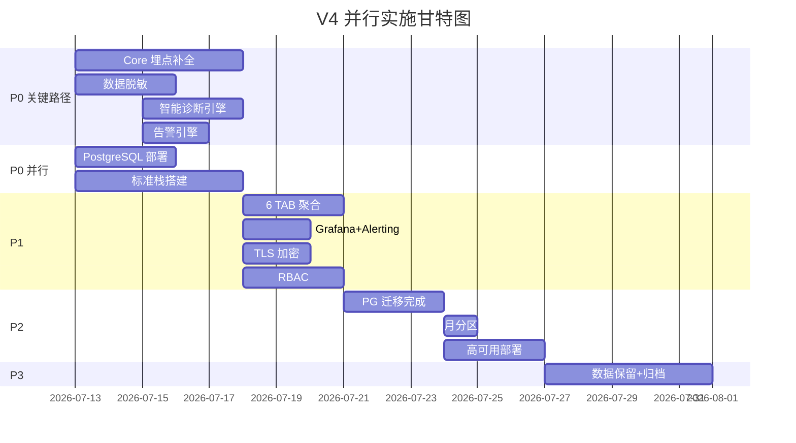
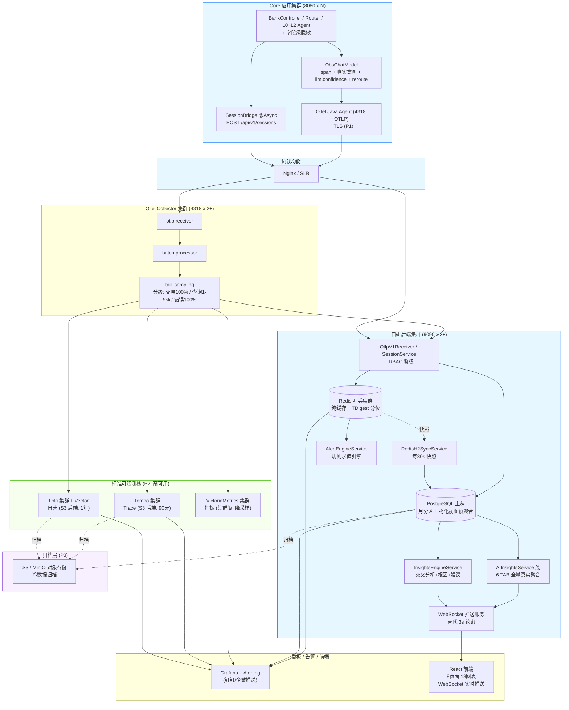
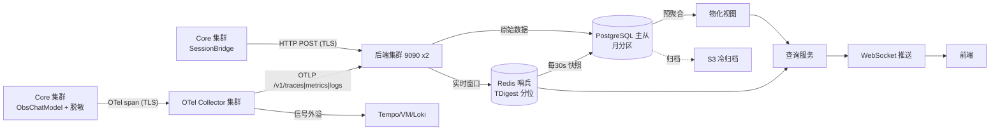
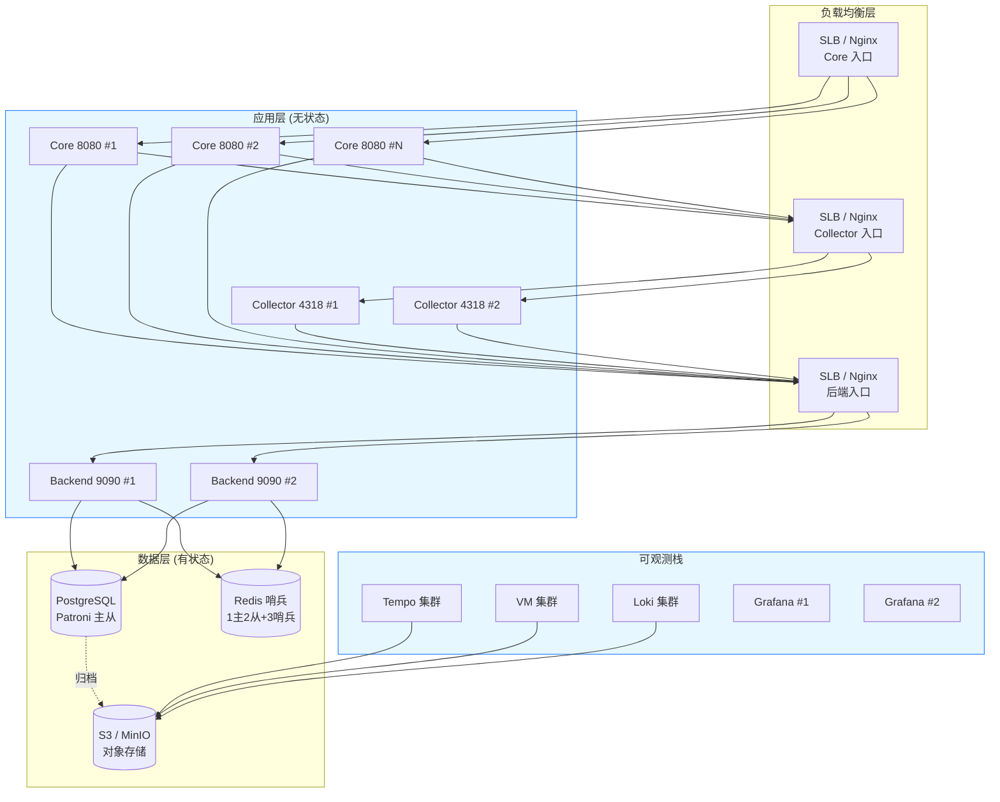

# AI 可观测系统优化总结（V4 银行业务量级版）

> 版本：V4 | 日期：2026-07-12 | 作者：Codex（AI 搭档）
> 基于 V3 融合版 + 银行业务几千万静态用户量级场景调整
> V4 变更要点：PostgreSQL 提前到 P0 并行；3s 轮询改 WebSocket 推送；数据保留分级（90 天-1 年）；Trace 按 intent 分级采样（交易 100%）；sessions 表月分区；Redis ZSET 改 TDigest；TLS 提前到 P1；新增数据脱敏/RBAC/高可用设计

---

## 目录

1. [V3 方案在银行业务量级下的影响分析](#1-v3-方案在银行业务量级下的影响分析)
2. [优化计划总览（V4 调整版）](#2-优化计划总览v4-调整版)
3. [系统目标架构（V4 高可用版）](#3-系统目标架构v4-高可用版)
4. [数据流详细设计](#4-数据流详细设计)
5. [Core 端埋点设计](#5-core-端埋点设计)
6. [指标设计全表](#6-指标设计全表)
7. [DB 表设计全表（V4 分区分级版）](#7-db-表设计全表v4-分区分级版)
8. [Redis 缓存设计（V4 容量优化版）](#8-redis-缓存设计v4-容量优化版)
9. [AI 洞察智能诊断设计](#9-ai-洞察智能诊断设计)
10. [告警系统设计](#10-告警系统设计)
11. [UI 设计终稿说明](#11-ui-设计终稿说明)
12. [OTel Collector 增强配置（V4 分级采样版）](#12-otel-collector-增强配置v4-分级采样版)
13. [数据合规与安全设计（V4 新增）](#13-数据合规与安全设计v4-新增)
14. [高可用部署架构（V4 新增）](#14-高可用部署架构v4-新增)
15. [实施路径与里程碑（V4 压缩版）](#15-实施路径与里程碑v4-压缩版)
16. [关键坑清单](#16-关键坑清单)
17. [附录](#17-附录)

---

## 1. V3 方案在银行业务量级下的影响分析

> 业务背景：银行业务，静态用户量几千万，DAU 假设 100-300 万，AI 助手日均交互量假设 500-1500 万次

### 1.1 容量估算

| 维度 | Demo 规模 | 银行几千万用户量 | 倍数 |
|------|----------|-----------------|------|
| DAU | ~10 | 100-300 万 | ~10-30 万倍 |
| 日均 AI 交互 | ~50 | 500-1500 万 | ~10-30 万倍 |
| 日均 Span 量 | ~200 | 2000-6000 万 | ~10-30 万倍 |
| 日均 Session 量 | ~50 | 500-1500 万 | ~10-30 万倍 |
| 日均 Log 量 | ~500 | 5000 万-1.5 亿 | ~10-30 万倍 |
| 同时在线 | ~5 | 50-100 万 | ~10-20 万倍 |
| 6 个月 Session 累计 | ~9000 | 9-27 亿行 | ~1-3 万倍 |

### 1.2 V3 决策影响评估总表

| # | V3 决策 | Demo 规模 | 银行量级 | 影响 | V4 调整 |
|---|---------|----------|---------|------|--------|
| 1 | H2 P0 保留 | 可接受 | 不可接受（文件锁/全表扫描/COUNT DISTINCT 超时） | 严重 | PostgreSQL 提前到 P0 并行 |
| 2 | 3s 轮询 | 可接受 | 后端聚合压力过大（千万级 span 聚合） | 严重 | 改 WebSocket 推送 + 预聚合 |
| 3 | 7 天保留 | 可接受 | 银行审计需 90 天-1 年 | 严重 | 分级保留 + 归档 S3 |
| 4 | 10% 基线采样 | 可接受 | 50 万 span/天仍过大 | 中 | 按 intent 分级（交易 100%+查询 1-5%） |
| 5 | 单表 sessions | 可接受 | 数亿行查询退化 | 严重 | PostgreSQL 月分区 |
| 6 | Redis ZSET 存延迟 | 可接受 | 高并发 ZSET 膨胀（百万 member） | 中 | 改 TDigest 或直接用 VM |
| 7 | TLS 在 P3 | 可接受 | 银行必须加密传输 | 严重 | 提前到 P1 |
| 8 | 单实例部署 | 可接受 | 银行不可接受单点 | 严重 | P2 高可用（双实例+主从+哨兵） |
| 9 | 无数据脱敏 | Demo 可忽略 | 会话含卡号/身份证/金额，必须脱敏 | 严重 | P0 新增字段级脱敏 |
| 10 | 无访问控制 | Demo 可忽略 | 会话回放含敏感信息，必须 RBAC | 严重 | P1 新增 RBAC |
| 11 | 语义比率读时算 | 可接受 | 大表实时算比率仍可能慢 | 中 | 增加预聚合物化视图 |
| 12 | OTel tail_sampling 统一 10% | 可接受 | 交易链路需 100% 审计 | 严重 | 按 intent 分级采样 |

### 1.3 不受影响的决策（保持 V3 不变）

| 决策 | 理由 |
|------|------|
| 组件选型方向（Tempo/VM/Loki/Grafana） | 本身为大规模设计，VM 集群版可扛亿级 series |
| Redis 作为热层缓存 | Redis 原生高并发，HyperLogLog 仅 ~12KB |
| 语义比率读时算不镜像 | 大规模下更重要（避免分布式一致性噩梦） |
| OTel Collector batch + tail_sampling | 大规模下更必要 |
| InsightsEngineService 交叉分析引擎 | 计算逻辑与数据量无关，缓存 5min TTL 降低频率 |
| 告警引擎设计（P0 自研 + P1 Grafana） | 不变 |

---

## 2. 优化计划总览（V4 调整版）

V4 相比 V3 的核心变化：PostgreSQL 从 P2 提前到 P0 并行；TLS 从 P3 提前到 P1；新增 P0 数据脱敏、P1 RBAC；P2 增加高可用部署。

### 2.1 五阶段计划表（V4 调整）

| 阶段 | 目标 | 关键动作 | 业务代码改动 | 周期 | V3->V4 变化 |
|---|---|---|---|---|---|
| **P0** | Core 发射层打通 + 数据脱敏 + PostgreSQL 并行起步 | 6 处埋点补全 + 断链修复 + AccuracyTab 契约对齐 + 智能诊断引擎 + 告警引擎 + 会话内容字段级脱敏 + PostgreSQL 部署（与埋点并行） | 大（Core 埋点+脱敏） | 1.5-2 人周 | +PostgreSQL 并行 +数据脱敏 |
| **P1** | 后端聚合 + Grafana 告警 + TLS + RBAC | 6 TAB 真实聚合 + Grafana 部署 + Alerting + OTLP 传输 TLS 加密 + 可观测系统 RBAC（谁可看会话回放） + Collector 增强 | 中 | 1-1.5 人周 | +TLS +RBAC |
| **P2** | 存储迁移完成 + 标准栈 + 高可用 | H2->PostgreSQL 迁移完成 + sessions 月分区 + Tempo/VM/Loki 部署 + Collector tail_sampling 分级 + 双实例+主从+哨兵 | 小 | 2-3 人周 | +高可用 +月分区 |
| **P3** | 数据保留分级 + 归档 | 热数据 30 天 + 温数据 90 天 + 冷归档 S3（会话 6 月/日志 1 年/告警 1 年） + 查询路由（热查 PG/冷查 S3） | 小 | 1 人周 | 新增（V3 无） |
| **P4** | 深化 + LLM 专项 + 安全 | Langfuse / Pyroscope / Sentry(Faro) / Beyla / 模型对比评估 | 按需 | 持续 | 原 V3 P3 不变 |

### 2.2 V3 vs V4 阶段对照

| V3 阶段 | V4 阶段 | 变化 |
|---------|---------|------|
| P0: Core 埋点（H2 保留） | P0: Core 埋点 + 脱敏 + PG 并行 | PostgreSQL 提前 + 脱敏新增 |
| P1: 6 TAB + Grafana 告警 | P1: 6 TAB + Grafana + TLS + RBAC | TLS + RBAC 新增 |
| P2: H2->PG + 标准栈 | P2: PG 完成 + 分区 + 标准栈 + 高可用 | 高可用 + 分区新增 |
| P3: Langfuse/Pyroscope/Sentry | P4: Langfuse/Pyroscope/Sentry | 顺延（P3 归数据保留） |
| 无 | P3: 数据保留分级 + 归档 | 全新阶段 |

### 2.3 并行策略（V4 强化）



### 2.4 功能实现矩阵（V4 新增项标 [NEW]）

| 功能域 | 优化项 | 阶段 | V4 变化 |
|--------|--------|------|--------|
| 埋点 | LLM 置信度 span attribute | P0 | 不变 |
| 埋点 | 意图准确率分层 | P0 | 不变 |
| 埋点 | Session 分层意图 | P0 | 不变 |
| 埋点 | DAU/在线人数 | P0 | 不变 |
| 埋点 | reroute 标记回写 | P0 | 不变 |
| **脱敏** | **[NEW] 会话内容字段级脱敏** | **P0** | **新增：卡号/身份证/手机号/金额脱敏** |
| **存储** | **[NEW] PostgreSQL 部署** | **P0 并行** | **从 P2 提前到 P0 并行** |
| 采集 | OTel Collector batch/filter | P1 | 不变 |
| 采集 | tail_sampling 分级采样 | P2 | 改为按 intent 分级 |
| **安全** | **[NEW] OTLP 传输 TLS** | **P1** | **从 P3 提前** |
| **安全** | **[NEW] 可观测系统 RBAC** | **P1** | **新增** |
| 存储 | H2 -> PostgreSQL 迁移 | P2 | 从 P0 并行部署到 P2 迁移完成 |
| **存储** | **[NEW] sessions/session_turns 月分区** | **P2** | **新增** |
| **可用性** | **[NEW] 双实例+主从+哨兵** | **P2** | **新增** |
| **合规** | **[NEW] 数据保留分级+归档 S3** | **P3** | **新增** |
| **性能** | **[NEW] 预聚合物化视图** | **P2** | **新增：降低实时聚合压力** |
| **性能** | **[NEW] 前端 WebSocket 推送** | **P1** | **替代 3s 轮询** |

---

## 3. 系统目标架构（V4 高可用版）

### 3.1 目标架构（P2 完成时，含高可用）



### 3.2 V3 -> V4 架构变化总结

| # | 变化 | V3 | V4 | 理由 |
|---|------|----|----|------|
| 1 | Core 从单实例到集群 | 单实例 8080 | 集群 8080 x N + SLB | 银行不可单点 |
| 2 | 后端从单实例到集群 | 单实例 9090 | 集群 9090 x 2+ + SLB | 银行不可单点 |
| 3 | Redis 从单机到哨兵 | 单机 Redis | Redis 哨兵集群 | 高可用自动故障转移 |
| 4 | 存储从 H2 到 PostgreSQL 主从 | H2 -> PG（P2） | PG 主从（P0 并行部署） | 提前 + 主从复制 |
| 5 | 延迟分位从 ZSET 到 TDigest | Redis ZSET（线性膨胀） | TDigest（固定 2KB） | 高并发下 ZSET 百万 member 膨胀 |
| 6 | 前端从轮询到推送 | 3s 轮询 | WebSocket 推送 | 千万级 span 聚合不适合高频轮询 |
| 7 | 采样从统一到分级 | 10% 基线 | 交易 100% + 查询 1-5% + 错误 100% | 银行交易链路审计要求 |
| 8 | 新增归档层 | 无 | S3/MinIO 冷归档 | 银行数据保留 90 天-1 年 |
| 9 | 新增脱敏层 | 无 | Core 字段级脱敏 | 会话含卡号/身份证/金额 |
| 10 | 新增 RBAC | 无 | 可观测系统 RBAC | 会话回放含敏感信息 |
| 11 | 新增 TLS | P3 | P1 | 银行必须加密传输 |
| 12 | 新增物化视图 | 无 | PG 物化视图预聚合 | 大表实时聚合性能 |

---

## 4. 数据流详细设计

### 4.1 总体数据流（V4 高可用版）



> **两条独立管道**（V3 原则保留）：
> 1. spans 管道：Core OTel -> Collector（TLS）-> 后端写 spans 表。按 traceId 关联。
> 2. sessions 管道：Core SessionBridge @Async -> HTTP POST（TLS）-> 后端写 sessions + session_turns 表。按 sessionId 关联。

### 4.2 V4 数据流关键变化

| 变化点 | V3 | V4 | 影响 |
|--------|----|----|------|
| 传输加密 | 明文 OTLP | TLS 加密 OTLP | 银行合规 |
| 会话内容 | 明文存储 | 字段级脱敏后存储 | PII 保护 |
| 延迟分位 | Redis ZSET（百万 member） | TDigest 流式分位（固定 2KB） | 内存 O(1) |
| 前端获取 | 3s 轮询 | WebSocket 推送 | 后端聚合压力降低 90% |
| 查询路径 | 直接查大表 | 物化视图预聚合 + 热查 PG / 冷查 S3 | 查询性能 |
| 归档 | 无 | 超 30 天数据归档 S3 | 存储成本 + 合规 |

### 4.3 Trace 链路追踪数据流（含分级采样标注）

```
Core ObsChatModel.startBusinessSpan()
  attributes: agent.name / model.name / agent.layer / intent / session_id / user_id
             + ai.io.prompt / ai.io.response（已脱敏）/ ai.token.input / ai.token.output
      ↓ OTel Java Agent 自动导出 (TLS)
OTel Collector 集群 (4318)
  tail_sampling 分级策略:
    intent=transfer/payment -> 100% 保留（审计追溯）
    intent=queryBalance/queryBill -> 1-5% 采样
    status=ERROR -> 100% 保留
    duration>1000ms -> 100% 保留
    其他 -> 5% 基线采样
      ↓ POST /v1/traces
Backend OtlpParserService.parseTraces()
  写 SpanEntity -> PostgreSQL spans 表（按月分区）
  pushRecentTrace -> Redis obs:traces:recent (LTRIM 100)
      ↓
TraceQueryService.listTracesPaginated()
  聚合 TraceListVO: +confidence +l0Intent +l1Intent
```

### 4.4 指标数据流（TDigest 优化）

```
Core Micrometer 指标
  llm.first_token.latency  Histogram (publishPercentileHistogram=true)
  llm.operation.duration   Histogram
      ↓ OTLP /v1/metrics
Backend OtlpParserService.parseMetrics()
  Histogram -> TDigest 流式分位（固定 2KB/窗口，替代 ZSET 百万 member）
             -> Redis obs:metrics:tdigest:{window}
             -> 同时落 PG metrics_agg
  Sum(Counter) -> Redis request_count / error_count / token_*
             -> 同时落 PG metrics_agg
      ↓ 每30s
RedisH2SyncService -> PG redis_metrics_snapshot
      ↓ 查询
MetricsQueryService.getRealtime()  Redis-first，空则 PG 物化视图
```

> **TDigest 优势**：ZSET 在百万请求/窗口下膨胀到 ~100MB/窗口；TDigest 固定 ~2KB/窗口，精度损失可接受（P99 误差 <0.5%）。

### 4.5 会话数据流（含脱敏 + 分区路由）

```
Core BankController 完成一轮 /api/bank/chat
  sessionBridge.reportSession(userId, input, response, intent, ...)
    -> 脱敏处理：卡号 -> 卡号尾4位 / 身份证 -> ****** / 手机号 -> 138****1234 / 金额保留
      ↓ @Async fire-and-forget
HTTP POST (TLS) http://backend-lb:9090/api/v1/sessions
      ↓
Backend SessionService.upsertSession(Map)
  sessions 表（月分区）: +l0_intent/+l1_intent/+l2_intent/+reroute_triggered
  session_turns 表（月分区）: 每轮一条（user_message/ai_response 已脱敏）
  recordDauUser(userId) + recordOnlineUser(userId)
      ↓ 归档
  超 30 天数据 -> 归档到 S3（保留 6 个月可查）
```

### 4.6 前端数据获取（WebSocket 推送替代 3s 轮询）

```
前端 -> WebSocket 连接 /ws/observability
  后端推送策略:
    总览大屏: 后端预聚合完成后推送（~10s 间隔）
    AI 洞察 TAB: 按需订阅，10s 间隔推送
    智能洞察: 5 分钟缓存到期后推送新报告
    告警事件: 实时推送（FIRING/RESOLVED）
  优势:
    1. 后端控制推送频率，避免千万级 span 高频轮询
    2. 前端无空轮询（数据未变不推送）
    3. 告警实时触达（无需等下一轮轮询）
```

---

## 5. Core 端埋点设计

### 5.1 埋点增强总览（V3 保留 + 脱敏新增）

| # | 埋点位置 | P0 增强 | V4 变化 |
|---|---------|---------|--------|
| 1 | ObsChatModel LLM span | span 写入 llm.confidence | 不变 |
| 2 | recordIntentAccuracy | 增加 layer=L0/L1 tag | 不变 |
| 3 | SessionBridge | 落库 l0/l1/l2Intent + reroute_triggered | 不变 |
| 4 | AbstractDomainService | Span attributes 携带 intent_predicted/actual | 不变 |
| 5 | DomainRouter | 写入真实识别结果 | 不变 |
| 6 | BankController | 发射 reroute.count Counter | 不变 |
| **7** | **SessionBridge（V4 新增）** | **会话内容字段级脱敏** | **新增脱敏处理** |

### 5.2 V4 新增：会话内容字段级脱敏

```java
// 在 SessionBridge.reportSession() 中，发送前脱敏
public class DataMaskingUtil {
    // 卡号: 622848******1234（保留前4后4）
    public static String maskCardNumber(String input) {
        return input.replaceAll("(\\d{4})\\d{8,12}(\\d{4})", "$1******$2");
    }
    // 身份证: 110101********1234（保留前6后4）
    public static String maskIdNumber(String input) {
        return input.replaceAll("(\\d{6})\\d{8}(\\d{4})", "$1********$2");
    }
    // 手机号: 138****1234
    public static String maskPhone(String input) {
        return input.replaceAll("(\\d{3})\\d{4}(\\d{4})", "$1****$2");
    }
    // 金额: 保留（银行业务需要金额可观测）
}
// 使用：userMessage = DataMaskingUtil.maskAll(originalUserMessage);
// aiResponse 中如有卡号等同样脱敏
```

> **脱敏原则**：PII（个人身份信息）脱敏，业务语义（意图/金额/结果）保留。脱敏在 Core 端完成，后端和存储收到的已是脱敏数据。

### 5.3 held-span 模式（V3 保留）

ObsChatModel 创建 span 时不 end，调用方 commitIntent 后回填 intent 并 end。异常路径安全 no-op end。

### 5.4 指标发射约定（V3 保留 + 物化视图补充）

1. 时延类 Timer 一律 publishPercentileHistogram(true)
2. 语义计数用 Counter + 规范 tag 落到 PG metrics_agg
3. Agent 分层调用数用 PG COUNT(DISTINCT trace_id)（V4: 大表用物化视图预聚合）
4. 错误率用 PG spans 真值计算（V4: 超过 30 天的数据从 S3 归档查）
5. **V4 新增**：高频聚合查询走物化视图，不走原始大表

---

## 6. 指标设计全表

> V3 指标定义保留不变，V4 仅调整数据源（ZSET -> TDigest）和查询路径（原始表 -> 物化视图）。

### 6.1 总览大屏指标（V4 数据源调整标注）

| # | 指标 | V3 数据源 | V4 数据源 | V4 变化 |
|---|---|---|---|--------|
| A1 | activeSessions | Redis Gauge | Redis 哨兵 Gauge | 不变 |
| A2 | DAU | Redis HyperLogLog | Redis 哨兵 HyperLogLog | 不变 |
| A3 | realTimeOnline | Redis SETEX 300s | Redis 哨兵 SETEX 300s | 不变 |
| A4 | requestCount | Redis Counter | Redis 哨兵 Counter | 不变 |
| A5 | QPS | requestCount/21600 | 同 V3 | 不变 |
| A6 | agentCall L0/L1/L2 | H2 COUNT(DISTINCT) | **PG 物化视图预聚合** | 大表去重优化 |
| B1 | Token 调用量 | Redis + H2 | Redis + PG | 不变 |
| B2 | TTFT P50/P95/P99 | **Redis ZSET** | **Redis TDigest** | **ZSET -> TDigest** |
| B3 | P95 系统时延 | **Redis ZSET** | **Redis TDigest** | **ZSET -> TDigest** |
| B4 | 错误率 | H2 spans 真值 | **PG 物化视图预聚合** | 大表查询优化 |
| C1 | intentAccuracy | H2 metrics_agg | PG metrics_agg | H2->PG |
| C2 | rewriteAccuracy | H2 | PG | H2->PG |
| C3 | rerouteRate | H2 | PG | H2->PG |
| C4 | completionRate | H2 | PG | H2->PG |

### 6.2 物化视图设计（V4 新增）

```sql
-- 每分钟刷新的预聚合视图：Agent 分层调用数
CREATE MATERIALIZED VIEW mv_agent_call_hourly AS
SELECT
    date_trunc('hour', start_time) AS hour,
    SUBSTRING(operation_name FROM '^(L[0-2])') AS layer,
    COUNT(DISTINCT trace_id) AS call_count
FROM spans
WHERE start_time >= NOW() - INTERVAL '7 days'
GROUP BY 1, 2;
CREATE INDEX ON mv_agent_call_hourly (hour, layer);

-- 每分钟刷新的预聚合视图：错误率
CREATE MATERIALIZED VIEW mv_error_rate_hourly AS
SELECT
    date_trunc('hour', start_time) AS hour,
    intent,
    COUNT(*) AS total,
    COUNT(*) FILTER (WHERE status_code >= 400) AS errors,
    COUNT(*) FILTER (WHERE status_code >= 400)::FLOAT / COUNT(*) AS error_rate
FROM spans
WHERE start_time >= NOW() - INTERVAL '7 days'
GROUP BY 1, 2;
CREATE INDEX ON mv_error_rate_hourly (hour, intent);

-- 每5分钟刷新的预聚合视图：意图准确率
CREATE MATERIALIZED VIEW mv_intent_accuracy_5min AS
SELECT
    date_trunc('hour', timestamp) AS hour,
    tags->>'layer' AS layer,
    tags->>'intent' AS intent,
    tags->>'correct' AS correct,
    COUNT(*) AS cnt
FROM metrics_agg
WHERE metric_name = 'agent.intent.accuracy'
  AND timestamp >= NOW() - INTERVAL '7 days'
GROUP BY 1, 2, 3, 4;
```

> 刷新策略：`REFRESH MATERIALIZED VIEW CONCURRENTLY mv_xxx;` 每 1-5 分钟由定时任务执行。CONCURRENTLY 不阻塞查询。

### 6.3 llm.* / agent.* 指标组（V3 保留）

| 指标 | 类型 | 说明 |
|------|------|------|
| llm.token.input/output | Counter | 输入/输出 Token |
| llm.first_token.latency | Histogram | TTFT（publishPercentileHistogram=true） |
| llm.operation.duration | Histogram | LLM 调用总耗时 |
| llm.error.count | Counter | LLM 错误计数 |
| agent.router.decision | Counter | 路由决策 |
| agent.reroute.count | Counter | 重路由（P0 新增） |
| agent.intent.accuracy | Counter | 意图准确率（P0 加 layer tag） |
| agent.business.outcome | Counter | 业务结果 |
| agent.tool.call/duration/error | Counter/Histogram | 工具调用 |

### 6.4 维度规范与基数预算（V3 保留 + 银行补充）

| 维度 | 基数上限 | 归属 | V4 银行补充 |
|------|---------|------|-------------|
| model.name | <20 | Metric Tag | 不变 |
| agent.name | <50 | Metric Tag | 不变 |
| agent.layer | 3 | Metric Tag | 不变 |
| intent | <100 | Metric Tag | 不变 |
| user_id | 高基 | Trace/Log Attr | **脱敏后存储（用户ID哈希）** |
| session_id | 高基 | Trace/Log Attr | 不变 |
| trace_id | 高基 | Trace/Log Attr | 不变 |
| **card_number** | **高基** | **不存储** | **V4 新增：脱敏后仅尾4位** |

---

## 7. DB 表设计全表（V4 分区分级版）

### 7.1 V4 设计原则（V3 基础 + 分区 + 归档）

> **Redis 管实时窗口，PostgreSQL 管真相与历史（月分区），超 30 天归档 S3，语义比率走物化视图预聚合。**

1. 热窗口聚合 -> Redis 哨兵（TDigest 分位）-> 30s 快照到 PG
2. 原始遥测 -> PG（月分区），7-30 天热数据
3. 语义比率 -> 不存 Redis，走物化视图预聚合（替代大表实时算）
4. 会话/业务语义 -> PG（月分区），30 天后归档 S3（保留 6 个月可查）
5. **V4 新增**：大表按月分区，查询走分区裁剪
6. **V4 新增**：高频聚合走物化视图，不走原始表

### 7.2 现有表（V3 保留，存储从 H2 改为 PostgreSQL）

| 表 | 用途 | V4 变化 |
|---|---|---|
| metrics_agg | 指标聚合温层 | H2 -> PG |
| spans | Span 明细 | H2 -> **PG 月分区** |
| logs | 日志明细 | H2 -> **PG 月分区** |

### 7.3 月分区表 DDL（V4 新增）

```sql
-- spans 表月分区
CREATE TABLE spans (
    id BIGSERIAL,
    trace_id VARCHAR(64) NOT NULL,
    span_id VARCHAR(32) NOT NULL,
    parent_span_id VARCHAR(32),
    operation_name VARCHAR(200) NOT NULL,
    kind VARCHAR(20),
    start_time TIMESTAMP NOT NULL,
    end_time TIMESTAMP,
    duration_ms BIGINT,
    status_code INT DEFAULT 0,
    attributes JSONB DEFAULT '{}',
    PRIMARY KEY (id, start_time)
) PARTITION BY RANGE (start_time);

-- 自动创建月分区（pg_partman 或定时任务）
CREATE TABLE spans_2026_07 PARTITION OF spans
    FOR VALUES FROM ('2026-07-01') TO ('2026-08-01');
CREATE TABLE spans_2026_08 PARTITION OF spans
    FOR VALUES FROM ('2026-08-01') TO ('2026-09-01');
-- ... 每月自动创建

-- 分区索引（每个分区独立索引）
CREATE INDEX ON spans_2026_07 (trace_id);
CREATE INDEX ON spans_2026_07 (operation_name);
CREATE INDEX ON spans_2026_07 (start_time);

-- sessions 表月分区
CREATE TABLE sessions (
    id BIGSERIAL,
    session_id VARCHAR(64) NOT NULL,
    user_id VARCHAR(64) NOT NULL,
    -- V3 字段保留
    l0_intent VARCHAR(100),
    l1_intent VARCHAR(100),
    l2_intent VARCHAR(100),
    reroute_triggered BOOLEAN DEFAULT FALSE,
    created_at TIMESTAMP NOT NULL,
    -- V4 新增：脱敏标记
    masked BOOLEAN DEFAULT TRUE,
    PRIMARY KEY (id, created_at)
) PARTITION BY RANGE (created_at);

-- session_turns 表月分区
CREATE TABLE session_turns (
    id BIGSERIAL,
    session_id VARCHAR(64) NOT NULL,
    user_message TEXT,  -- 已脱敏
    ai_response TEXT,   -- 已脱敏
    intent VARCHAR(100),
    agent_path VARCHAR(200),
    confidence DOUBLE PRECISION,
    duration_ms BIGINT,
    tokens INT,
    trace_id VARCHAR(64),
    status VARCHAR(20),
    timestamp TIMESTAMP NOT NULL,
    PRIMARY KEY (id, timestamp)
) PARTITION BY RANGE (timestamp);
```

### 7.4 数据保留与归档策略（V4 新增）

| 数据类型 | 热数据（PG） | 温数据（PG 归档分区） | 冷数据（S3/MinIO） | 保留依据 |
|---------|------------|-------------------|------------------|---------|
| spans（交易类） | 30 天 | 90 天 | 1 年 | 银行审计追溯 |
| spans（查询类） | 7 天 | 30 天 | 90 天 | 运营分析 |
| sessions | 30 天 | 180 天 | 1 年 | 客诉处理 |
| session_turns | 30 天 | 180 天 | 1 年 | 客诉处理 |
| logs | 7 天 | 90 天 | 1 年 | 合规审计 |
| metrics_agg | 7 天 | 90 天 | 1 年（降采样） | 趋势分析 |
| alert_events | 30 天 | 1 年 | 3 年 | 合规审计 |

> **归档机制**：定时任务每天凌晨将超期分区数据导出为 Parquet 格式到 S3，然后 DROP 分区。查询时如需冷数据，通过 S3 Select 或 Presto/Trino 查询。

### 7.5 物化视图汇总（V4 新增）

| 物化视图 | 刷新频率 | 用途 | 替代的原始查询 |
|---------|---------|------|---------------|
| mv_agent_call_hourly | 1 分钟 | Agent 分层调用数 | COUNT(DISTINCT trace_id) on spans |
| mv_error_rate_hourly | 1 分钟 | 错误率 | COUNT FILTER on spans |
| mv_intent_accuracy_5min | 5 分钟 | 意图准确率 | COUNT on metrics_agg |
| mv_funnel_daily | 1 小时 | 漏斗转化 | COUNT on sessions |
| mv_satisfaction_daily | 1 小时 | 满意度分布 | AVG on sessions |
| mv_token_cost_hourly | 1 小时 | Token 成本 | SUM on metrics_agg |

---

## 8. Redis 缓存设计（V4 容量优化版）

### 8.1 V4 所有权原则（V3 保留 + 哨兵 + TDigest）

> **Redis 哨兵集群管实时窗口（TDigest 分位），PG 管真相与历史（月分区），语义比率走物化视图，超期归档 S3。**

### 8.2 V4 Redis Key 规范全表（变化项标 V4）

| Key 模式 | TTL | V3 | V4 变化 | 理由 |
|---------|-----|----|---------|------|
| obs:metrics:request_count:{window} | 120-21600s | Counter | 不变 | 计数器轻量 |
| obs:metrics:error_count:{window} | 120-21600s | Counter | 不变 | 同上 |
| obs:metrics:token_*:{window} | 120-21600s | Counter | 不变 | 同上 |
| obs:metrics:latency:{window} | 120-21600s | **ZSET（百万 member）** | **TDigest（2KB/窗口）** | 高并发 ZSET 膨胀 |
| obs:metrics:ttft:1m | 120s | **ZSET** | **TDigest** | 同上 |
| obs:metrics:intent_distribution | 21600s | Hash | 不变 | 意图基数有限 |
| obs:metrics:active_sessions | 120s | Gauge | 不变 | 单值 |
| obs:metrics:dau:{date} | 86400s | HyperLogLog | 不变 | ~12KB/天 |
| obs:metrics:online:{userId} | 300s | SETEX | **V4 评估** | 100万在线=100万key~100MB |
| obs:traces:recent | 3600s | LTRIM 100 | 不变 | 仅100条 |
| obs:logs:recent | 3600s | LTRIM 1000 | 不变 | 仅1000条 |

### 8.3 在线用户数容量评估（V4 新增）

| 场景 | 同时在线 | Key 数 | 内存估算 | 方案 |
|------|---------|--------|---------|------|
| Demo | ~5 | 5 | ~1KB | SETEX（V3 方案） |
| 中等 | 10 万 | 10 万 | ~10MB | SETEX（可接受） |
| 银行峰值 | 100 万 | 100 万 | ~100MB | SETEX（可接受，Redis 2GB+） |
| 超大规模 | 500 万+ | 500 万+ | ~500MB+ | 改 HyperLogLog（近似计数，误差 <1%） |

> **建议**：100 万以下用 SETEX（精确计数）；超过 100 万评估改 HyperLogLog（近似但内存固定）。当前 300s TTL 已足够。

### 8.4 TDigest 替代 ZSET 方案（V4 新增）

```java
// V3: Redis ZSET 存延迟（每个请求一个 member）
// 问题：百万请求/窗口 = 百万 member ZSET，~100MB/窗口

// V4: TDigest 流式分位（固定 ~2KB/窗口）
// 使用 Redis RedisBloom 模块或应用层 TDigest
public class TDigestMetricsService {
    // 使用 com.tdunning:t-digest 依赖
    private TDigest tdigest_1m = TDigest.createMergingDigest(100); // compression=100

    public void recordLatency(double latencyMs) {
        tdigest_1m.add(latencyMs);
    }

    public double getPercentile(double pct) {
        return tdigest_1m.quantile(pct);
    }

    // 每30s 序列化到 Redis（~2KB）
    public byte[] serialize() {
        return tdigest_1m.bytes();
    }
}
// 内存对比：ZSET 100MB -> TDigest 2KB（降 50000 倍）
// 精度：P99 误差 <0.5%，可接受
```

---

## 9. AI 洞察智能诊断设计

### 9.1 设计目标（V3 保留）

从"看数据"升级为"给行动"：交叉分析引擎自动识别瓶颈/风险/流失，给出 TOP5 行动建议+根因分析+下钻入口。

### 9.2 AIInsightsService 族（V3 保留 + V4 数据源调整）

| Service | V3 数据源 | V4 数据源 | V4 变化 |
|---------|--------|--------|--------|
| AIInsightsService | metrics_agg(H2) | metrics_agg(PG) + 物化视图 | H2->PG + MV |
| AgentPerformanceService | spans + metrics_agg | **物化视图** mv_agent_call_hourly | 走预聚合 |
| TokenCostService | metrics_agg + spans | **物化视图** mv_token_cost_hourly | 走预聚合 |
| ConversionFunnelService | sessions | **物化视图** mv_funnel_daily | 走预聚合 |
| SatisfactionService | sessions + turns | **物化视图** mv_satisfaction_daily | 走预聚合 |
| ToolStatsService | tool_calls | tool_calls（数据量小，直接查） | 不变 |

### 9.3 InsightsEngineService（V3 保留 + V4 查询优化）

```java
@Service
public class InsightsEngineService {
    public InsightReport generateReport() {
        // V4: 从物化视图读取预聚合数据（替代大表实时聚合）
        // 1. 从 mv_agent_call_hourly 获取 Agent 调用统计
        // 2. 从 mv_error_rate_hourly 获取错误率
        // 3. 从 mv_funnel_daily 获取漏斗数据
        // 4. 从 mv_satisfaction_daily 获取满意度
        // 5. 交叉分析 + 根因定位 + TOP5 行动建议
        // 6. 缓存报告（5 分钟 TTL）
    }
}
```

### 9.4 三大诊断域 x 提炼项（V3 保留）

**性能瓶颈**：理财咨询 P95 超阈 / LLM 重试率 / Slow 追问 TopN / Token 成本 ROI
**准确率风险**：Reroute 率偏高 / 代词指代根因 / L0-L1 分层待打通 / 混淆矩阵异常
**业务转化**：参数提取放弃率 / 转账转化低于账单 / 满意度负面聚类 / 流失会话特征

### 9.5 诊断驾驶舱 + API（V3 保留）

API 端点不变：/api/v1/insights/report | /slow-sessions | /churn-analysis | /token-roi
缓存策略不变：报告 5min TTL / 慢会话 10min TTL / 手动刷新接口

---

## 10. 告警系统设计

### 10.1 告警引擎分阶段策略（V3 保留）

| 阶段 | 方案 |
|------|------|
| P0 | 自研 AlertEngineService + AlertNotifyService（钉钉/飞书 Webhook） |
| P1 | 迁移到 Grafana Alerting（钉钉/企微 Webhook） |

### 10.2 告警规则配置表（V4 新增银行专属规则）

| # | 规则名 | 指标 | 阈值 | 严重度 | V4 变化 |
|---|--------|------|------|--------|--------|
| 1 | LLM 错误率告警 | llm.error.count/request_count | >0 | HIGH | 不变 |
| 2 | TTFT P95 超阈 | ttft TDigest P95 | >2000ms | HIGH | 数据源改 TDigest |
| 3 | 转账完成率骤降 | agent.business.outcome(transfer) | <80% | MED | 不变 |
| 4 | Collector 接收量骤降 | request_count:1m | <10 | HIGH | 不变 |
| 5 | Reroute 率偏高 | agent.reroute.count | >15% | MED | 不变 |
| 6 | 满意度偏低 | satisfaction_avg | <3.0 | LOW | 不变 |
| **7** | **交易失败率告警** | **business.outcome(transfer,payment)=fail** | **>5%** | **CRITICAL** | **V4 新增：银行交易专属** |
| **8** | **合规审计：Trace 采样缺失** | **交易类 trace 采样率** | **<100%** | **HIGH** | **V4 新增：确保交易链路 100% 留样** |
| **9** | **PII 泄露检测** | **日志中明文卡号/身份证** | **>0** | **CRITICAL** | **V4 新增：脱敏失败检测** |

---

## 11. UI 设计终稿说明

### 11.1 V4 UI 变化

| 变化点 | V3 | V4 | 理由 |
|--------|----|----|------|
| 数据获取 | 3s 轮询 | WebSocket 推送 | 千万级 span 不适合高频轮询 |
| 大屏刷新 | 3s 间隔 | 后端推送（~10s 间隔） | 后端控制频率 |
| 告警展示 | 轮询发现 | 实时 WebSocket 推送 | 告警实时触达 |
| 页面/图表数 | 8 页面/18 图表 | 不变 | 设计层面不变 |
| **新增** | - | **数据脱敏标记** | 会话回放页标注"已脱敏" |

### 11.2 页面导航结构（V3 保留 8 页面）

| # | 页面 | 核心内容 | V4 变化 |
|---|------|---------|--------|
| 1 | 总览大屏 | AI 健康概览四卡 + Zone A-F + health-pill | WebSocket 推送 |
| 2 | 会话回放 | 会话列表 + transition-marker + 反馈条 | +脱敏标记 |
| 3 | 链路追踪 | Trace 列表 + trace-tree + IO 面板 + 改写对比 | 不变 |
| 4 | AI 洞察 | 7 TAB + 洞察右栏 | 物化视图数据源 |
| 5 | 日志查询 | 日志列表 + 三件套跳转 | 不变 |
| 6 | 告警规则 | 卡片化 + toggle + timeline | WebSocket 实时推送 |
| 7 | 系统设置 | 数据健康看板 + 度量矩阵 | +RBAC 管理入口 |
| 8 | 智能洞察 | 诊断驾驶舱 + 9 条分类洞察 3x3 | 不变 |

### 11.3 WebSocket 推送设计（V4 新增）

```javascript
// 前端 WebSocket 连接
const ws = new WebSocket('wss://observability.example.com/ws/observability');

ws.onmessage = (event) => {
    const data = JSON.parse(event.data);
    switch(data.type) {
        case 'dashboard': updateDashboard(data.payload); break;     // 总览推送
        case 'insights': updateInsights(data.payload); break;       // 洞察推送
        case 'alert':    showAlertNotification(data.payload); break; // 告警实时
        case 'health':   updateHealthPill(data.payload); break;     // 健康状态
    }
};

// 后端推送策略
// dashboard: 10s 间隔（预聚合完成后推送）
// insights:  5min 间隔（报告缓存到期后推送）
// alert:     实时（FIRING/RESOLVED 即推）
// health:    30s 间隔
// 优势: 前端无空轮询，后端控制频率，告警零延迟
```

### 11.4 图表清单（V3 保留 18 个）

图表清单与 V3 一致（8 页面/18 图表/7 TAB+右栏），仅数据获取方式从轮询改为 WebSocket 推送。

---

## 12. OTel Collector 增强配置（V4 分级采样版）

### 12.1 V4 分级采样策略（核心变化）

| intent 类别 | 采样率 | 理由 |
|------------|--------|------|
| transfer（转账） | **100%** | 银行交易审计追溯 |
| payment（支付） | **100%** | 银行交易审计追溯 |
| queryBalance（查余额） | 2% | 高频低风险 |
| queryBill（查账单） | 2% | 高频低风险 |
| wealthSearch（理财） | 5% | 中频中风险 |
| ERROR（任何错误） | **100%** | 故障排查 |
| duration>1000ms | **100%** | 性能问题 |
| LLM 失败 | **100%** | 模型问题 |
| 其他 | 5% | 基线 |

### 12.2 V4 完整 config.yaml（分级采样版）

```yaml
receivers:
  otlp:
    protocols:
      http:
        endpoint: 0.0.0.0:4318
        # V4: TLS 配置（P1 启用）
        tls:
          cert_file: /certs/server.crt
          key_file: /certs/server.key

processors:
  memory_limiter:
    check_interval: 1s
    limit_percentage: 80
    spike_limit_percentage: 25

  batch:
    timeout: 5s
    send_batch_size: 1024
    send_batch_max_size: 2048

  filter:
    traces:
      span:
        - 'attributes.http.target == "/actuator/health"'
        - 'attributes.http.target == "/actuator/prometheus"'

  attributes:
    actions:
      - key: env
        value: production
        action: insert
      - key: service.version
        value: ${env:SERVICE_VERSION:unknown}
        action: insert

  # V4: 分级 tail_sampling（替代 V3 统一 10%）
  tail_sampling:
    decision_wait: 10s
    num_traces: 50000
    policies:
      # 交易类 100% 保留（银行审计）
      - name: banking_transactions
        type: string_attribute
        string_attribute:
          key: intent
          values: ["transfer", "payment"]
      # 错误 100% 保留
      - name: errors
        type: status_code
        status_code:
          status_codes: [ERROR]
      # 慢请求 100% 保留
      - name: slow
        type: latency
        latency:
          threshold_ms: 1000
      # LLM 失败 100% 保留
      - name: llm_errors
        type: string_attribute
        string_attribute:
          key: error_type
          values: ["llm_timeout", "llm_404", "llm_rate_limit"]
      # 理财 5% 采样
      - name: wealth
        type: string_attribute
        string_attribute:
          key: intent
          values: ["wealthSearch"]
        # 叠加 5% 概率采样
      - name: baseline_5pct
        type: probabilistic
        probabilistic:
          sampling_percentage: 5

exporters:
  otlphttp/json_backend:
    endpoint: https://backend-lb:9090  # V4: TLS
    tls:
      insecure_skip_verify: false
      ca_file: /certs/ca.crt
  otlp/tempo:
    endpoint: tempo:4317
    tls:
      insecure: true
  prometheusremotewrite:
    endpoint: http://victoriametrics:8428/api/v1/write
  loki:
    endpoint: http://loki:3100/loki/api/v1/push

service:
  pipelines:
    traces:
      receivers: [otlp]
      processors: [memory_limiter, filter, attributes, tail_sampling, batch]
      exporters: [otlphttp/json_backend, otlp/tempo]
    metrics:
      receivers: [otlp]
      processors: [memory_limiter, attributes, batch]
      exporters: [otlphttp/json_backend, prometheusremotewrite]
    logs:
      receivers: [otlp]
      processors: [memory_limiter, attributes, batch]
      exporters: [otlphttp/json_backend, loki]
```

### 12.3 V4 采样效果估算

| 指标 | V3 统一 10% | V4 分级采样 | 变化 |
|------|-----------|-----------|------|
| 日均 span 总量 | 2000-6000 万 | 同上 | - |
| 采样后 span | 200-600 万 | 150-400 万 | 降 25-35% |
| 交易类 span | 20-60 万（10%） | **200-600 万（100%）** | **增 10 倍（审计需要）** |
| 查询类 span | 180-540 万（10%） | 36-108 万（2%） | 降 80% |
| 存储量/天 | ~50GB | ~35GB | 降 30% |
| 审计完整性 | 交易链路 90% 丢失 | **交易链路 100% 保留** | **合规达标** |

---

## 13. 数据合规与安全设计（V4 新增）

> 银行业务可观测系统必须满足金融合规要求。本章覆盖数据脱敏、访问控制、传输加密、审计追溯四个维度。

### 13.1 数据脱敏设计

#### 脱敏规则

| 数据类型 | 脱敏规则 | 示例 | 脱敏位置 |
|---------|---------|------|---------|
| 银行卡号 | 前4后4，中间星号 | 6228******1234 | Core SessionBridge |
| 身份证号 | 前6后4，中间星号 | 110101********1234 | Core SessionBridge |
| 手机号 | 前3后4，中间星号 | 138****1234 | Core SessionBridge |
| 金额 | **不脱敏** | 5000.00 | 保留（业务需要） |
| 用户ID | 哈希化 | user_a3f8b2c1 | Core OTel tag |
| AI prompt/response | 卡号/身份证/手机号脱敏 | 同上 | Core ObsChatModel |

> **脱敏在 Core 端完成**：后端和存储收到的已是脱敏数据，不存在中间环节明文泄露风险。

#### 脱敏验证告警

- 定时扫描日志/会话中的明文 PII 模式（卡号 16-19 位连续数字等）
- 发现明文 PII 立即告警（CRITICAL 级，告警规则 #9）

### 13.2 RBAC 访问控制设计

| 角色 | 可访问页面 | 可查看数据 | 说明 |
|------|-----------|-----------|------|
| **admin** | 全部 | 全部（含脱敏后） | 系统管理员 |
| **ops** | 总览/链路/日志/告警/设置 | 链路+日志+告警（不含会话回放） | 运维人员 |
| **analyst** | 总览/AI洞察/智能洞察 | 聚合指标+洞察（不含会话明细） | 数据分析师 |
| **auditor** | 会话回放/链路/告警 | 会话+链路（只读，含审计日志） | 合规审计员 |
| **viewer** | 总览 | 仅总览大屏聚合数据 | 只读访客 |

```java
// Spring Security + RBAC
@PreAuthorize("hasRole('admin') or hasRole('auditor')")
@GetMapping("/api/v1/sessions/{id}/replay")
public SessionReplayVO replaySession(@PathVariable String id) {
    // 会话回放仅 admin/auditor 可访问
    // 记录审计日志：谁在何时查看了哪个会话
    auditLogService.logAccess(currentUser, "session_replay", id);
    return sessionService.replay(id);
}
```

### 13.3 传输加密（TLS）

| 链路 | V3 | V4 | 启用阶段 |
|------|----|----|---------|
| Core -> Collector (OTLP) | 明文 | **TLS** | P1 |
| Collector -> 后端 (OTLP) | 明文 | **TLS** | P1 |
| Core -> 后端 (Session HTTP) | 明文 | **TLS** | P1 |
| 后端 -> 前端 (REST) | 明文 | **HTTPS** | P1 |
| 后端 -> 前端 (WebSocket) | - | **WSS** | P1 |
| 后端 -> Redis | 明文 | **TLS** | P2 |
| 后端 -> PostgreSQL | 明文 | **TLS** | P2 |

### 13.4 审计追溯

| 审计项 | 记录内容 | 保留期限 |
|--------|---------|---------|
| 会话查看日志 | 谁/何时/查看哪个会话 | 1 年 |
| 配置变更日志 | 谁/何时/修改哪个告警规则/阈值 | 3 年 |
| 数据导出日志 | 谁/何时/导出哪份数据 | 3 年 |
| 交易类 Trace | 完整链路（100% 采样） | 1 年 |

---

## 14. 高可用部署架构（V4 新增）

### 14.1 高可用组件矩阵

| 组件 | V3（单实例） | V4（高可用） | 故障恢复 |
|------|-----------|------------|---------|
| Core 应用 | 1 实例 | N 实例 + SLB | SLB 自动剔除不健康节点 |
| 可观测后端 | 1 实例 | 2+ 实例 + SLB | 无状态，SLB 轮询 |
| OTel Collector | 1 实例 | 2+ 实例 + SLB | 无状态，SLB 轮询 |
| Redis | 单机 | 哨兵集群（1主2从+3哨兵） | 自动故障转移（<10s） |
| PostgreSQL | H2 单文件 | 主从复制（1主1从+Patroni） | 自动切换（<30s） |
| Tempo | 无 | 集群（3 节点 + S3 后端） | 分布式容灾 |
| VictoriaMetrics | 无 | 集群版（3 节点） | 副本冗余 |
| Loki | 无 | 集群（3 节点 + S3 后端） | 分布式容灾 |
| Grafana | 无 | 2 实例 + 共享 PG | SLB 轮询 |

### 14.2 部署拓扑



### 14.3 容量规划参考

| 组件 | 配置（中等规模） | 配置（大规模） | 说明 |
|------|---------------|-------------|------|
| Core 集群 | 4C8G x 2 | 8C16G x 4+ | 按并发量横向扩展 |
| 可观测后端 | 4C8G x 2 | 8C16G x 2+ | 无状态可扩展 |
| OTel Collector | 2C4G x 2 | 4C8G x 2+ | 按 span 吞吐扩展 |
| Redis 哨兵 | 4C8G x 3+3哨兵 | 8C16G x 3+3哨兵 | 1主2从+3哨兵 |
| PostgreSQL | 8C16G x 2+Patroni | 16C32G x 2+Patroni | 主从 + SSD |
| S3/MinIO | 10TB | 50TB+ | 冷归档 |
| Tempo | 4C8G x 3 | 8C16G x 3 | 分布式+S3后端 |
| VictoriaMetrics | 4C8G x 3 | 8C32G x 3 | 集群版 |
| Loki | 4C8G x 3 | 8C16G x 3 | 分布式+S3后端 |

---

## 15. 实施路径与里程碑（V4 压缩版）

### 15.1 五阶段计划（V4）

| 阶段 | 目标 | 人周 | V3->V4 变化 |
|------|------|------|-------------|
| P0 | Core 埋点 + 脱敏 + PG 并行 + 标准栈并行 | 1.5-2 | +PG+脱敏+标准栈并行 |
| P1 | 6 TAB + Grafana + TLS + RBAC + WebSocket | 1-1.5 | +TLS+RBAC+WebSocket |
| P2 | PG 迁移完成 + 月分区 + 高可用 + 分级采样 | 2-3 | +高可用+月分区+分级采样 |
| P3 | 数据保留分级 + 归档 S3 | 1 | 全新 |
| P4 | Langfuse/Pyroscope/Sentry/Beyla | 持续 | 原 V3 P3 |

### 15.2 P0 详细任务（V4 新增项标 NEW）

| # | 任务 | 工时 | V4 |
|---|------|------|----|
| 1 | ObsChatModel 发射 llm.confidence | 2h | |
| 2 | recordIntentAccuracy 加 layer tag | 1h | |
| 3 | SessionBridge 落库 l0/l1/l2Intent | 3h | |
| 4 | Span 写 intent_predicted/actual | 2h | |
| 5 | DomainRouter 写真实 intent | 2h | |
| 6 | BankController 发射 reroute.count | 1h | |
| 7 | AccuracyTab 契约对齐 | 3h | |
| 8 | TraceListVO 增加字段 | 2h | |
| 9 | InsightsEngineService 实现 | 6h | |
| 10 | AlertEngineService + NotifyService | 4h | |
| 11 | 前端 V18 8 页面联调 | 8h | |
| **12** | **[NEW] DataMaskingUtil 脱敏实现** | **3h** | **V4 新增** |
| **13** | **[NEW] PostgreSQL 部署 + schema 迁移** | **4h** | **V4 从 P2 提前** |
| **14** | **[NEW] 标准栈 docker-compose 搭建** | **4h** | **V4 从 P2 提前并行** |
| **15** | **[NEW] schema.sql 加列 + PG 适配** | **2h** | **V4 新增** |

### 15.3 P1 详细任务（V4 新增项标 NEW）

| # | 任务 | 工时 | V4 |
|---|------|------|----|
| 1 | 6 TAB 真实聚合（物化视图） | 6h | |
| 2 | Grafana 部署 + 数据源配置 | 3h | |
| 3 | Grafana Alerting -> 钉钉 | 2h | |
| 4 | Collector batch/filter/attributes | 3h | |
| **5** | **[NEW] TLS 证书配置（Core<->Collector<->后端）** | **3h** | **V4 从 P3 提前** |
| **6** | **[NEW] RBAC 实现（Spring Security + 5 角色）** | **6h** | **V4 新增** |
| **7** | **[NEW] WebSocket 推送服务实现** | **5h** | **V4 替代 3s 轮询** |
| **8** | **[NEW] 前端 WebSocket 客户端改造** | **4h** | **V4 新增** |
| **9** | **[NEW] TDigest 替代 ZSET** | **4h** | **V4 新增** |

### 15.4 P2 详细任务（V4 新增项标 NEW）

| # | 任务 | 工时 | V4 |
|---|------|------|----|
| 1 | H2 -> PostgreSQL 迁移完成 | 4h | |
| 2 | tail_sampling 分级采样配置 | 3h | |
| **3** | **[NEW] sessions/session_turns 月分区** | **3h** | **V4 新增** |
| **4** | **[NEW] 物化视图创建 + 定时刷新** | **4h** | **V4 新增** |
| **5** | **[NEW] 双实例 + SLB 部署** | **4h** | **V4 新增** |
| **6** | **[NEW] Redis 哨兵集群** | **3h** | **V4 新增** |
| **7** | **[NEW] PostgreSQL Patroni 主从** | **4h** | **V4 新增** |
| **8** | **[NEW] TLS: Redis/PG 连接加密** | **2h** | **V4 新增** |

### 15.5 P3 详细任务（全新阶段）

| # | 任务 | 工时 |
|---|------|------|
| 1 | 数据归档定时任务（PG -> S3 Parquet） | 4h |
| 2 | 分区自动 DROP 策略 | 2h |
| 3 | 冷数据查询接口（S3 Select / Trino） | 6h |
| 4 | 数据保留策略配置 | 2h |
| 5 | 审计日志表 + 定时清理 | 3h |

### 15.6 里程碑

| 里程碑 | 完成标志 | V4 预计时间 |
|--------|---------|------------|
| M0: Core 埋点 + 脱敏 | 6 处埋点 + 脱敏 + 重启验证 | 第 1 周 |
| M0+: PG + 标准栈就绪 | PostgreSQL 可写 + Tempo/VM/Loki 可查 | 第 1-2 周（并行） |
| M1: 6 TAB + WebSocket | 6 TAB 真实数据 + 前端 WebSocket 推送 | 第 2-3 周 |
| M2: TLS + RBAC | OTLP 加密 + RBAC 鉴权 | 第 3 周 |
| M3: 高可用 + 分级采样 | 双实例+主从+哨兵+交易100%采样 | 第 4-5 周 |
| M4: 数据归档 | 30天+90天+1年分级保留 | 第 6 周 |

### 15.7 风险与应对（V4 新增项）

| 风险 | 影响 | 应对 |
|------|------|------|
| SenseNova 404 未恢复 | P0 做完但数据仍空 | 先恢复可用模型 |
| PG 迁移数据丢失 | 历史数据丢失 | 双写过渡期（H2+PG 并行写，验证后切流） |
| WebSocket 连接数过多 | 后端连接压力 | 限制最大连接数 + 心跳检测 + 断线重连 |
| 物化视图刷新延迟 | 数据延迟 1-5 分钟 | 可接受（大屏非毫秒级实时） |
| 分区表查询跨分区 | 查询性能退化 | 查询带时间范围条件，触发分区裁剪 |
| TLS 证书过期 | 服务中断 | 证书自动续期（cert-manager/Let's Encrypt） |
| 脱敏遗漏 | PII 泄露 | 定时扫描告警 + 代码审查 |

---

## 16. 关键坑清单

> V3 的 6 条坑保留，V4 新增 4 条银行量级专属坑。

| # | 坑 | 根因 | 正确做法 | V4 |
|---|-----|------|--------|----|
| 1 | TTFT 分位恒 0 | publishPercentiles 导出为 Summary | publishPercentileHistogram(true) | V3 |
| 2 | Redis 比率 key 断链 | 语义比率强行存 Redis | 读时算，不存 Redis | V3 |
| 3 | Agent 调用数放大 N 倍 | 按 OTLP 导出次数 INCR | COUNT(DISTINCT trace_id) | V3 |
| 4 | 错误率 366% | Redis 计数器失真 | H2/PG spans 真值计算 | V3 |
| 5 | purge 返回 -1 | 只读事务中 DELETE | 加 @Transactional | V3 |
| 6 | AccuracyTab 整页空白 | 前端读错字段 | 契约对齐 | V3 |
| **7** | **COUNT(DISTINCT) 超时** | **千万级 spans 表去重** | **走物化视图预聚合** | **V4** |
| **8** | **Redis ZSET OOM** | **百万 member ZSET 膨胀** | **改 TDigest（2KB/窗口）** | **V4** |
| **9** | **3s 轮询打死后端** | **千万级 span 高频聚合** | **改 WebSocket 推送** | **V4** |
| **10** | **交易链路丢失** | **统一 10% 采样导致 90% 交易 trace 丢失** | **按 intent 分级：交易 100%** | **V4** |

---

## 17. 附录

### 17.1 V3 -> V4 变更全量对照表

| # | 变更项 | V3 | V4 | 银行业务理由 |
|---|--------|----|----|-------------|
| 1 | PostgreSQL 时间 | P2 | P0 并行 | H2 无法承受千万级 span |
| 2 | 前端数据获取 | 3s 轮询 | WebSocket 推送 | 千万级 span 高频轮询打死后端 |
| 3 | 数据保留 | 7 天统一 | 分级 7天-1年+归档 S3 | 银行审计合规要求 |
| 4 | Trace 采样 | 统一 10% | 分级（交易100%/查询2%） | 交易链路审计追溯 |
| 5 | 大表存储 | 单表 | 月分区 | 数亿行单表查询退化 |
| 6 | 延迟分位 | Redis ZSET | TDigest | 高并发 ZSET 膨胀 |
| 7 | TLS | P3 | P1 | 银行必须加密传输 |
| 8 | 部署 | 单实例 | 双实例+主从+哨兵 | 银行不可单点 |
| 9 | 数据脱敏 | 无 | Core 字段级脱敏 | PII 保护 |
| 10 | 访问控制 | 无 | RBAC 5 角色 | 会话回放含敏感信息 |
| 11 | 聚合查询 | 直接查大表 | 物化视图预聚合 | 大表实时聚合超时 |
| 12 | 告警规则 | 6 条 | 9 条（+交易失败/采样缺失/PII泄露） | 银行专属合规告警 |
| 13 | 实施阶段 | P0-P3（4阶段） | P0-P4（5阶段） | 新增 P3 数据保留分级 |

### 17.2 三项待定决策（V3 保留）

- 待定项 A：L0 是否覆盖所有请求（含不调 LLM 的规则命中）
- 待定项 B：reRoute 是否携带原报文
- 待定项 C：是否引入 Langfuse（建议 P4 按需）

### 17.3 验收建议（V4 调整）

- 基本验收（同 V3）：重启 Core + Backend -> 打流量 -> 验证 6 TAB 有数据
- **V4 银行量级验收**：
  - 压测：模拟 100 万 span/天，验证 PG 月分区+物化视图查询 <2s
  - 安全：验证脱敏后日志中无明文卡号/身份证
  - 高可用： kill 后端 #1，验证 SLB 自动切到 #2（<10s）
  - 合规：验证交易类 trace 100% 保留（抽样 100 条转账 trace 全在）
  - 归档：验证 30 天前数据自动归档 S3，PG 中已 DROP

### 17.4 文档来源

| 来源 | 贡献 |
|------|------|
| V3 融合文档（43,250 字） | 基础架构/埋点/指标/DB/Redis/洞察/告警/UI/OTel/实施/坑清单 |
| 银行业务量级影响分析 | 12 项 V3 决策评估 + 8 项严重调整 + 容量估算 |
| 差异分析文档 | Codex V2 vs WorkBuddy V2 模块对比与合并策略 |

---

> 文档版本：V4 银行业务量级版 | 日期：2026-07-12 | 基于 V3 融合版 + 银行业务几千万用户量级场景调整
