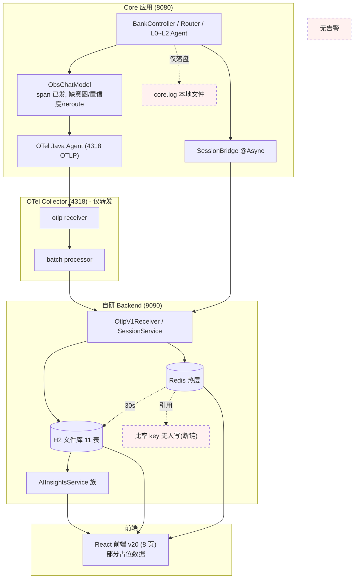
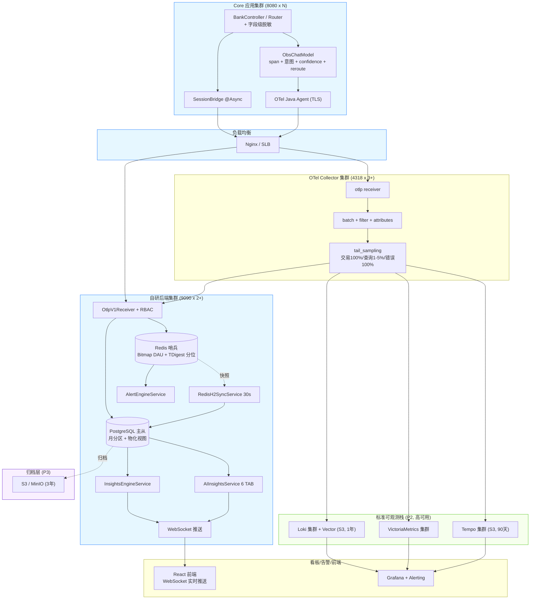
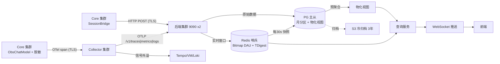
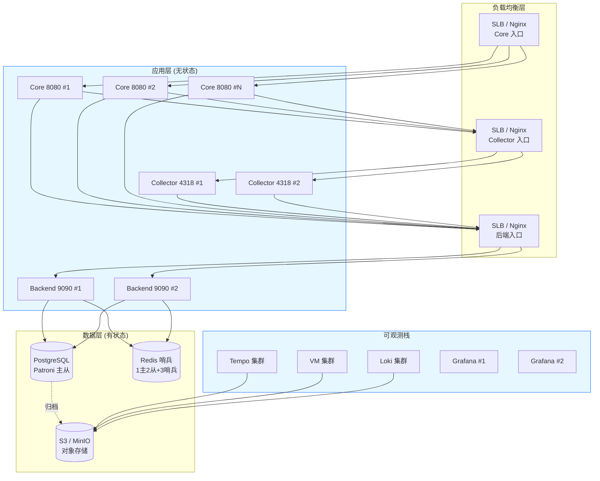

# AI 可观测系统优化总结（V5 整合版）

> 版本：V5 整合版 | 日期：2026-07-12 | 作者：Codex（AI 搭档）
> 融合来源：Codex V4（39,666 字，17 章节）+ WorkBuddy V5（38,121 字，15 章节）
> V5 变更要点：取两份文档之长--Codex V4 的容量估算/物化视图/TDigest/WebSocket/脱敏/RBAC/TLS/分级采样/HA 拓扑/银行告警 + WorkBuddy V5 的组件选型论证/Bitmap DAU/ZSet 分片/告警收敛静默/根因详细示例/insight_reports 表/全 Grafana 系理念/银保监 3 年保留

---

## 目录

1. [容量估算与影响分析](#1-容量估算与影响分析)
2. [最优组件选型](#2-最优组件选型)
3. [优化计划总览](#3-优化计划总览)
4. [系统目标架构](#4-系统目标架构)
5. [端到端数据流设计](#5-端到端数据流设计)
6. [Core 端埋点设计](#6-core-端埋点设计)
7. [指标设计全表](#7-指标设计全表)
8. [DB 表设计全表](#8-db-表设计全表)
9. [Redis 缓存设计](#9-redis-缓存设计)
10. [AI 洞察智能诊断设计](#10-ai-洞察智能诊断设计)
11. [告警系统设计](#11-告警系统设计)
12. [UI 设计终稿说明](#12-ui-设计终稿说明)
13. [OTel Collector 增强配置](#13-otel-collector-增强配置)
14. [数据合规与安全设计](#14-数据合规与安全设计)
15. [高可用部署架构](#15-高可用部署架构)
16. [实施路径与里程碑](#16-实施路径与里程碑)
17. [关键坑清单](#17-关键坑清单)
18. [附录](#18-附录)

---

## 1. 容量估算与影响分析

> 业务背景：银行业务，静态用户量几千万，DAU 假设 100-300 万，AI 助手日均交互量假设 500-1500 万次

### 1.1 容量估算

| 维度 | Demo 规模 | 银行几千万用户量 | 倍数 |
|------|----------|-----------------|------|
| DAU | ~10 | 100-300 万 | ~10-30 万倍 |
| 日均 AI 交互 | ~50 | 500-1500 万 | ~10-30 万倍 |
| 日均 Span 量 | ~200 | 2000-6000 万 | ~10-30 万倍 |
| 日均 Session 量 | ~50 | 500-1500 万 | ~10-30 万倍 |
| 日均 Log 量 | ~500 | 5000 万-1.5 亿 | ~10-30 万倍 |
| 同时在线 | ~5 | 50-100 万 | ~10-20 万倍 |
| 6 个月 Session 累计 | ~9000 | 9-27 亿行 | ~1-3 万倍 |

### 1.2 V4/WB V5 共识决策（保持不变）

| 决策 | 理由 |
|------|------|
| 组件选型方向（Tempo/VM/Loki/Grafana） | 本身为大规模设计 |
| PG 提前到 P0 | H2 不可承受千万级 span |
| Collector 集群化 | SPOF 不可接受 |
| Redis Sentinel 高可用 | 银行不可单点 |
| 分层数据保留 | 银保监 3 年合规 |
| 语义比率读时算不镜像 | 避免分布式一致性噩梦 |
| AI 洞察双层架构 | 6 Service + InsightsEngine |

---

## 2. 最优组件选型

> 合并 WorkBuddy V5 合并论证 + Codex V4 对照表，经差异分析确定最优组合。

### 2.1 推荐开源组件（生产级最优 + 运维最省）

| 信号 | 推荐组件 | 为什么选它 | 替换理由 |
|------|---------|-----------|---------|
| 采集器 | P0: OTel Collector 集群（3 实例+LB）, P1 可选迁移 Alloy | P0 用 OTel Collector 集群消除 SPOF；Alloy 单二进制统一 OTLP+Prom+Loki | 银行量级 SPOF 不可接受 |
| Trace | Grafana Tempo | 对象存储后端、与 Loki 同源可关联、易水平扩展 | Jaeger 需 Cassandra/ES 成本高 |
| 指标 | VictoriaMetrics 集群版 | PromQL 兼容、压缩率比 Prometheus 高 10x | Prometheus 单机扩展受限 |
| 日志 | Loki + Vector | 标签索引、对象存储、便宜 | Vector 补齐采集/富化/路由 |
| 看板/告警 | Grafana + Alerting | 统一拼 Tempo+VM+Loki+PG | 原生钉钉/企微/邮件 |
| 持续剖析 | Pyroscope（P3） | 第四信号，火焰图随 Tempo trace 下钻 | WorkBuddy 前瞻 |
| 前端错误 | Grafana Faro（P3） | 前端错误采集，与 Grafana 一体 | WorkBuddy 前瞻 |
| LLM 专项 | Langfuse（P4 待定）+ OpenLLMetry（P1 可选） | 开源自托管 | gen_ai.* 语义 span |
| 关系库 | PostgreSQL（P0 即迁） | 分区表/DROP PARTITION/连接池/读写分离 | H2 独占锁不可行 |

> **运维最省组合**：Alloy（采集）+ Tempo + VictoriaMetrics + Loki + Grafana 全 Grafana 系五件套--一套心智模型、一套告警、一套权限。

---

## 3. 优化计划总览

V5 采用 5 阶段计划（Codex V4 结构 + WB V5 的 P0 范围扩展 + 银保监 3 年保留）。

### 3.1 五阶段计划表

| 阶段 | 目标 | 关键动作 | 周期 |
|------|------|---------|------|
| P0 | Core 埋点+脱敏+PG 迁移+Collector 集群+Redis HA+告警闭环 | 6 处埋点补全+字段级脱敏+PG 部署+Collector 3 实例+LB+Redis Sentinel+AlertEngine+数据健康三态角标 | 2-2.5 人周 |
| P1 | Collector 增强+标准栈+AI 洞察+TLS+RBAC+WebSocket | batch/filter/sampling+Tempo/VM/Loki/Grafana 部署+InsightsEngine+TLS 全链路+RBAC 5 角色+WebSocket 推送+TDigest 替代 ZSET+物化视图 | 1.5-2 人周 |
| P2 | PG 迁移完成+月分区+高可用+分级采样 | H2->PG 完成+sessions 月分区+物化视图+双实例+主从+哨兵+tail_sampling 分级（交易100%/查询1-5%） | 2-3 人周 |
| P3 | 数据保留分级+归档 S3 | 热PG 7d->温压缩 90d->冷S3 3年+归档 ETL+查询路由+审计日志 | 1 人周 |
| P4 | 深化+LLM 专项+安全 | Langfuse/Pyroscope/Sentry(Faro)/Beyla/TLS/模型对比 | 持续 |

**并行策略**：P2 标准栈（Tempo/VM/Loki/Grafana）不依赖 LLM，可与 P0 并行搭建。

**依赖提醒**：P0/P1 的准确率/业务洞察依赖 LLM 真实跑通（SenseNova 404 为当前总阻塞），需先恢复可用模型。

---

## 4. 系统目标架构

### 4.1 当前架构（整改前）



### 4.2 目标架构（P2 完成时，含高可用）



### 4.3 架构设计决策记录

| # | 决策 | 理由 | 来源 |
|---|------|------|------|
| D1 | P0 即迁 PostgreSQL | 数千万用户量级 H2 独占锁不可行 | V5 共识 |
| D2 | P1 引入标准栈 + Collector 集群 | 标准栈对象存储天然适合银行量级 | V5 共识 |
| D3 | 自研前端专注 B+C 类 | A 类交 Grafana | Codex |
| D4 | Collector 增强 processors 优先 | 零新组件只改配置 | Codex |
| D5 | P0 自研告警 -> P2 迁 Grafana | 自研立即闭环；Grafana 长期零维护 | 合并 |
| D6 | Redis 仅缓存，语义比率读时算 | 根治断链 key | WorkBuddy |
| D7 | AI 洞察双层架构 | 6 Service + InsightsEngine | 合并 |
| D8 | 智能洞察独立末位 TAB | 诊断驾驶舱 | WorkBuddy |
| D9 | DAU 用 Bitmap（精度100%） | 银行报表不允许误差 | WB V5 |
| D10 | 延迟分位用 TDigest | 固定 2KB/窗口 vs ZSET 100MB | Codex V4 |
| D11 | 前端用 WebSocket 推送 | 千万级 span 不适合 3s 轮询 | Codex V4 |
| D12 | 采样按 intent 分级 | 交易链路 100% 审计 | Codex V4 |
| D13 | TLS P1 全链路 | 银行必须加密 | Codex V4 |
| D14 | 数据脱敏 P0 | PII 保护 | Codex V4 |
| D15 | RBAC P1 | 会话回放含敏感信息 | Codex V4 |

---

### 4.4 组件对接关系（一句话版）

- Core -> Collector：OTel Java Agent 经 OTLP（TLS）推 trace/metric/log；另有一条独立 HTTP 管道 SessionBridge 异步 POST sessions
- Collector -> 后端 / 标准栈：P1 增强（batch+filter+sampling）-> 双写 9090 后端 + Tempo/VM/Loki
- 后端 -> Grafana / 前端：实时查询走 Redis 热层、空则 PG 物化视图；Grafana 看 A 类；前端 WebSocket 推送
- InsightsEngineService 只从后端（PG+Redis）聚合，不碰 Tempo/VM/Loki

---

## 5. 端到端数据流设计

### 5.1 总体数据流



> 两条独立管道（极易混淆）：
> 1. spans 管道：Core OTel -> Collector（TLS）-> 后端写 spans 表。按 traceId 关联。
> 2. sessions 管道：Core SessionBridge @Async -> HTTP POST（TLS）-> 后端写 sessions + session_turns。按 sessionId 关联。

### 5.2 Trace 链路追踪

```
Core ObsChatModel.startBusinessSpan()
  attributes: agent.name / model.name / agent.layer / intent / session_id / user_id
             + ai.io.prompt / ai.io.response（已脱敏）/ ai.token.*
             + llm.confidence（P0 新增）
             + intent.L0/L1/L2.predicted/actual（P0 新增）
  held-span: 调用方 commitIntent 后回填 intent 并 end
      ↓ OTel Java Agent 自动导出 (TLS)
OTel Collector 集群 (4318)
  tail_sampling 分级:
    intent=transfer/payment -> 100% 保留
    intent=queryBalance/queryBill -> 1-5% 采样
    status=ERROR -> 100% 保留
    duration>1000ms -> 100% 保留
      ↓ POST /v1/traces
Backend OtlpParserService.parseTraces()
  写 SpanEntity -> PG spans 表（月分区）
  pushRecentTrace -> Redis obs:traces:recent (LTRIM 100)
      ↓
TraceQueryService.listTracesPaginated()
  聚合 TraceListVO: +confidence +l0Intent +l1Intent
```

### 5.3 Metrics 指标（TDigest 优化）

```
Core Micrometer 指标
  llm.first_token.latency  Histogram (publishPercentileHistogram=true)
  llm.operation.duration   Histogram
  llm.token.input/output   Counter
  llm.error.count          Counter
  agent.* (intent.accuracy +layer / reroute.count / business.outcome ...)
      ↓ OTLP /v1/metrics (step=60s)
Backend OtlpParserService.parseMetrics()
  Histogram -> TDigest 流式分位（固定 2KB/窗口，替代 ZSET 百万 member）
           -> Redis obs:metrics:tdigest:{window}
           -> 同时落 PG metrics_agg
  Sum(Counter) -> Redis request_count / error_count / token_*
           -> 同时落 PG metrics_agg
  Gauge -> Redis active_sessions / llm.confidence
      ↓ 每30s
RedisH2SyncService -> PG redis_metrics_snapshot
      ↓ 查询
MetricsQueryService.getRealtime()  Redis-first，空则 PG 物化视图
```

> 致命坑：Timer.publishPercentiles(...) 导出为 Summary，后端不解析 -> TTFT 分位恒 0。必须用 publishPercentileHistogram(true)。

### 5.4 Logs 日志

```
Core / Backend 日志（含 logback MDC: trace_id / span_id / session_id）
      ↓ OTLP /v1/logs（或 P2 由 Vector/Loki 直接采集）
Backend OtlpParserService.parseLogs()
  写 LogEntity -> PG logs 表（月分区）
  pushRecentLog -> Redis obs:logs:recent (LTRIM 1000)
      ↓ 前端
日志查询页：每行支持三件套跳转（trace.id->链路详情、session.id->会话回放）
      ↓ P2 增强
core.log/backend.log 经 Vector -> Loki -> Grafana 统一检索
从错误率 spike 一键下钻到慢 trace 再跳该 trace 的 log
```

### 5.5 Session 会话（含脱敏 + 分区路由）

```
Core BankController 完成一轮 /api/bank/chat
  sessionBridge.reportSession(userId, input, response, intent, ...)
    -> 脱敏：卡号->尾4位 / 身份证->****** / 手机号->138****1234 / 金额保留
    -> +l0Intent +l1Intent +l2Intent +rerouteTriggered
      ↓ @Async fire-and-forget
HTTP POST (TLS) -> 后端集群
      ↓
Backend SessionService.upsertSession(Map)
  sessions 表（月分区）: +l0/l1/l2_intent +reroute_triggered +masked=TRUE
  session_turns 表（月分区）: user_message/ai_response 已脱敏
  Bitmap DAU: SETBIT obs:dau:date userIdHash
  ZSet 在线: ZADD obs:online:users:{shard} timestamp userId
      ↓ 归档
  超 7 天 -> 压缩分区 90 天 -> S3 归档 3 年
```

- Token 回退 sumTokensFromSpans：会话 token 以 span 属性为准

### 5.6 Alerts 告警

```
P0: AlertEngineService @Scheduled(30s)
  读活跃规则 -> collectMetricValue(Redis/PG) -> evaluateCondition
  -> fireAlert（收敛窗口 5min + 静默期 30min）
  -> AlertNotifyService -> 钉钉/飞书 Webhook
  状态机: TRIGGERED -> SUPPRESSED -> ACKED -> RESOLVED -> QUIET
P2: 迁移 Grafana Alerting
```

### 5.7 前端数据获取（WebSocket 推送）

```
前端 -> WebSocket 连接 /ws/observability
  后端推送策略:
    dashboard: 10s 间隔（预聚合完成后推送）
    insights:  5min 间隔（报告缓存到期后推送）
    alert:     实时（FIRING/RESOLVED 即推）
    health:    30s 间隔
  优势: 前端无空轮询，后端控制频率，告警零延迟
```

---

## 6. Core 端埋点设计

### 6.1 埋点总览

| # | 埋点项 | 发射方 | 落库 | P0 状态 |
|---|--------|--------|------|--------|
| 1 | llm.confidence（span attr + Gauge） | ObsChatModel | spans.attributes + metrics_agg | 待补 |
| 2 | 意图准确率分层（layer tag） | ObservabilityMetrics | metrics_agg | 待补 |
| 3 | 分层意图 Span attrib | Router commitIntent | spans.attributes | 待补 |
| 4 | Session 分层意图落库 | SessionBridge | sessions / session_turns | 待补 |
| 5 | Reroute 事件 | BankController + SessionBridge | metrics_agg + sessions | 待补 |
| 6 | DAU / 在线 | SessionBridge | Redis Bitmap / ZSet | 已修复 |
| 7 | 会话内容字段级脱敏 | SessionBridge + ObsChatModel | 脱敏后存储 | V5 新增 |

### 6.2 关键 Java 代码

#### LLM 置信度埋点

```java
// ObsChatModel.resolve() - 在 LLM 调用返回后
span.setAttribute("llm.confidence", response.getResult().getOutput().getConfidence());
meterRegistry.gauge("llm.confidence",
    Tags.of("model.name", modelName, "agent.name", agentName),
    confidenceValue);
```

#### 意图准确率分层

```java
public void recordIntentAccuracy(String intentPredicted, String intentActual,
                                  String state, String layer) {
    Counter.builder("agent.intent.accuracy")
        .tags("intent_predicted", intentPredicted,
              "intent_actual", intentActual,
              "state", state,
              "layer", layer)  // L0 / L1
        .register(meterRegistry).increment();
}
```

#### 字段级脱敏

```java
public class DataMaskingUtil {
    public static String maskCardNumber(String input) {
        return input.replaceAll("(\\d{4})\\d{8,12}(\\d{4})", "$1******$2");
    }
    public static String maskIdNumber(String input) {
        return input.replaceAll("(\\d{6})\\d{8}(\\d{4})", "$1********$2");
    }
    public static String maskPhone(String input) {
        return input.replaceAll("(\\d{3})\\d{4}(\\d{4})", "$1****$2");
    }
}
```

> 脱敏原则：PII 脱敏，业务语义（意图/金额/结果）保留。脱敏在 Core 端完成。

### 6.3 held-span 模式

ObsChatModel 创建 span 时不 end，调用方 commitIntent 后回填 intent 并 end。异常路径安全 no-op end。DomainRouter 的 set(...) 当前 intent 传 null，需把真实识别结果写入 span。

### 6.4 埋点强制约定

1. 时延类 Timer 一律 publishPercentileHistogram(true)
2. 语义计数用 Counter + 规范 tag 落 PG metrics_agg，不在 Redis 另存比率 key
3. Agent 分层调用数用 PG COUNT(DISTINCT trace_id)（大表走物化视图）
4. 错误率用 PG spans 真值计算（超 7 天从 S3 查）
5. 高频聚合查询走物化视图，不走原始大表
6. 高基数字段（user_id/trace_id/prompt/response）不入 Metric Tag

---

## 7. 指标设计全表

> 状态图例：正常 / 已解决 / 回归 / 仍开放 / 待启动

### 7.1 总览大屏

| # | 指标 | 数据源 | 状态 | 说明 |
|---|---|---|---|---|
| A1 | activeSessions | Redis Gauge | 正常 | - |
| A2 | DAU | Redis **Bitmap** | 已修复 | 精度100%，3000万用户3.6MB |
| A3 | realTimeOnline | Redis **ZSet 分片** | 已修复 | 按小时分片避免百万 member |
| A4 | requestCount(6h) | Redis Counter | 已解决 | 多窗口 INCR |
| A5 | QPS | requestCount/21600 | 已解决 | - |
| A6 | agentCall L0/L1/L2 | **PG 物化视图** | 已解决 | 走预聚合替代大表去重 |
| B1 | Token 调用量 | llm.token.* Counter | 正常 | - |
| B2 | TTFT P50/P95/P99 | **Redis TDigest** | 正常 | 2KB/窗口 |
| B3 | P95 系统时延 | **Redis TDigest** | 正常 | - |
| B4 | 错误率 | **PG 物化视图** | 已解决 | 走预聚合 |
| C1 | intentAccuracy(分层) | PG agent.intent.accuracy | 部分 | 分层待 P0 Core |
| C2 | rewriteAccuracy | PG | 已修复 | - |
| C3 | rerouteRate | PG agent.reroute.count | 仍开放 | Core 未发射（P0） |
| C4 | completionRate | PG | 正常 | - |

### 7.2 物化视图设计

```sql
-- Agent 分层调用数（每分钟刷新）
CREATE MATERIALIZED VIEW mv_agent_call_hourly AS
SELECT date_trunc('hour', start_time) AS hour,
       SUBSTRING(operation_name FROM '^(L[0-2])') AS layer,
       COUNT(DISTINCT trace_id) AS call_count
FROM spans WHERE start_time >= NOW() - INTERVAL '7 days'
GROUP BY 1, 2;

-- 错误率（每分钟刷新）
CREATE MATERIALIZED VIEW mv_error_rate_hourly AS
SELECT date_trunc('hour', start_time) AS hour, intent,
       COUNT(*) AS total,
       COUNT(*) FILTER (WHERE status_code >= 400) AS errors
FROM spans WHERE start_time >= NOW() - INTERVAL '7 days'
GROUP BY 1, 2;

-- 漏斗/满意度/Token成本（每小时刷新）
-- mv_funnel_daily / mv_satisfaction_daily / mv_token_cost_hourly
-- REFRESH MATERIALIZED VIEW CONCURRENTLY mv_xxx; 每1-5分钟定时执行
```

### 7.3 维度规范与基数预算

| 允许做 Metric Tag（基数 < 200） | 示例 | 基数 |
|------|------|------|
| model.name | qwen-plus | <10 |
| agent.level / agent.name | L0/L1/L2 / DomainRouter | 3 / <30 |
| intent | TRANSFER/WEALTH/BILL | <20 |
| state / error_type / outcome | correct/timeout/success | 4/10/3 |

| 禁止做 Metric Tag（基数 > 1000） | 存放位置 |
|------|------|
| user_id / session_id / trace_id | Span attributes |
| prompt / response | Span attributes (ai.io.*) |
| timestamp | Span start/end |

---

## 8. DB 表设计全表

### 8.1 所有权原则

> Redis 管实时窗口，PG 管真相与历史（月分区），语义比率走物化视图，超期归档 S3。每个 Redis Key 有唯一写入方。

### 8.2 活跃表

| 表 | 用途 | 状态 |
|---|---|---|
| metrics_agg | 指标聚合温层 | 活跃 |
| spans | Span 明细（月分区，attributes 含 llm.confidence/intent.*） | 活跃 |
| logs | 日志明细（月分区） | 活跃 |
| sessions | 会话聚合（月分区，+l0/l1/l2_intent +reroute_triggered +masked） | 活跃 |
| session_turns | 会话轮次（月分区，+l0/l1/l2_intent） | 活跃 |
| tool_calls | 工具调用 | 活跃 |
| alert_rules | 告警规则（+evaluation_interval/last_evaluated_at/current_value） | 活跃 |
| alert_events | 告警事件（+notified_channels/notify_result/suppression_count） | 活跃 |
| redis_metrics_snapshot | Redis->PG 兜底 | 活跃 |
| insight_reports | 诊断报告 JSON+归档（V5 新增） | 新增 |
| agent_performance | **已弃用**（全库无 INSERT） | 弃用 |
| token_cost | **已弃用** | 弃用 |

### 8.3 月分区 DDL

```sql
CREATE TABLE spans (
    id BIGSERIAL, trace_id VARCHAR(64) NOT NULL,
    span_id VARCHAR(32) NOT NULL, parent_span_id VARCHAR(32),
    operation_name VARCHAR(200) NOT NULL, kind VARCHAR(20),
    start_time TIMESTAMP NOT NULL, end_time TIMESTAMP,
    duration_ms BIGINT, status_code INT DEFAULT 0,
    attributes JSONB DEFAULT '{}',
    PRIMARY KEY (id, start_time)
) PARTITION BY RANGE (start_time);

CREATE TABLE spans_2026_07 PARTITION OF spans
    FOR VALUES FROM ('2026-07-01') TO ('2026-08-01');
-- 每月自动创建，PG pg_partman 或定时任务

CREATE TABLE sessions (
    id BIGSERIAL, session_id VARCHAR(64), user_id VARCHAR(64),
    l0_intent VARCHAR(64), l1_intent VARCHAR(64), l2_intent VARCHAR(64),
    reroute_triggered BOOLEAN DEFAULT FALSE, masked BOOLEAN DEFAULT TRUE,
    created_at TIMESTAMP NOT NULL DEFAULT NOW(),
    PRIMARY KEY (id, created_at)
) PARTITION BY RANGE (created_at);

-- insight_reports 表
CREATE TABLE insight_reports (
    id BIGSERIAL, report_type VARCHAR(32),
    report_data JSONB, generated_at TIMESTAMP,
    data_window_start TIMESTAMP, data_window_end TIMESTAMP,
    version INT DEFAULT 1, PRIMARY KEY (id)
);
```

### 8.4 分层数据保留策略（银保监合规）

| 层级 | 存储 | 保留期 | 数据 | 清理方式 |
|------|------|--------|------|---------|
| 热层 | PostgreSQL（SSD） | 7 天 | spans/sessions/turns/metrics_agg | DROP PARTITION |
| 温层 | PostgreSQL（压缩分区） | 90 天 | 聚合后数据（按天/小时汇总） | 压缩分区 DROP |
| 冷层 | S3/MinIO | 3 年 | 原始 trace/logs JSON（Parquet 压缩） | 对象存储生命周期 |

> 银保监 3-7 年审计轨迹要求。PG -> Parquet -> S3，3 年内可按时间范围回溯查询。

---

## 9. Redis 缓存设计

### 9.1 所有权原则

> 每个 Key 有唯一写入方，读方可多对一。语义比率不写 Redis。Key 命名：obs:<域>:<指标>:<窗口>。

### 9.2 Redis Sentinel 高可用

> P0 部署 Redis Sentinel（1主2从+3哨兵），自动故障转移（<10s）。

### 9.3 Redis Key 规范全表

| Key 模式 | 类型 | TTL | 写入方 | 说明 |
|---------|-----|-----|--------|------|
| obs:metrics:request_count:{window} | INCR | 120-21600s | OtlpParser | 请求计数 |
| obs:metrics:error_count:1m | INCR | 120s | OtlpParser | 错误计数 |
| obs:token:input:1m / output:1m | INCR | 120s | OtlpParser | Token 累计 |
| obs:metrics:tdigest:{window} | TDigest | 120-21600s | OtlpParser | 延迟/TTFT 分位（2KB/窗口） |
| obs:dau:YYYY-MM-DD | **Bitmap** | 2 天 | DauCounter | DAU（精度100%，3.6MB/3000万用户） |
| obs:online:users:{shard} | **ZSet 分片** | 清理5min前 | OnlineCounter | 在线（按小时分片） |
| obs:metrics:intent_distribution | Hash | 21600s | OtlpParser | 意图分布 |
| obs:metrics:active_sessions | Gauge | 120s | OtlpParser | 活跃会话 |
| obs:traces:recent | List(LTRIM 100) | 滑动窗口 | OtlpParser | 最近 traces |
| obs:logs:recent | List(LTRIM 1000) | 滑动窗口 | OtlpParser | 最近 logs |
| obs:alerts:active | ZSet | 持久 | AlertEngine | 活跃告警 |
| obs:insights:cache | String(JSON) | 300s | InsightsEngine | 洞察报告缓存 |
| accuracy:* / reroute:* / satisfaction:* | **不写 Redis** | - | - | 读时算 |

### 9.4 TDigest 替代 ZSET

V3 用 Redis ZSET 存延迟（每请求一个 member），百万请求/窗口=~100MB/窗口。V5 改 TDigest 流式分位（固定 2KB/窗口），内存降 50000 倍，P99 误差 <0.5%。

---

## 10. AI 洞察智能诊断设计

### 10.1 双层架构

- **第一层**：AIInsightsService 族（6 Service，P0 保留现有接口）
- **第二层**：InsightsEngineService（交叉分析引擎，在 6 Service 之上）

| Service | V5 数据源 | 聚合口径 |
|---------|--------|--------|
| AIInsightsService | metrics_agg(PG) | 置信度/参数提取/改写/混淆矩阵/意图准确率/Reroute/业务成功率 |
| AgentPerformanceService | **物化视图** mv_agent_call_hourly | 调用次数/耗时分位/错误率 |
| TokenCostService | **物化视图** mv_token_cost_hourly | 按 intent/model 聚合 token |
| ConversionFunnelService | **物化视图** mv_funnel_daily | 漏斗 |
| SatisfactionService | **物化视图** mv_satisfaction_daily | 满意度/原因聚类 |
| ToolStatsService | tool_calls | 工具统计 |

### 10.2 三大诊断域 x 提炼项

**性能诊断**：Top3 慢 Agent / 慢会话根因 Span / LLM 延迟分布 / Token 异常检测
**质量诊断**：低置信度意图分布 / 不满意会话共性 / 重复提问检测
**业务诊断**：漏斗流失定位 / 流失会话特征画像 / 高价值会话路径

### 10.3 慢会话根因分析（详细示例）

```
输入：会话ID列表（duration > 全局 P95）
处理：
  1. 取会话所有 Span，构建调用树
  2. 计算每个 Span 的独占时间 = duration - sum(子Span duration)
  3. 按独占时间降序，取 Top3 Span 作为根因候选
  4. 关联 LLM 指标/工具调用/意图维度/上下文
  5. 输出根因链路图：
     会话总耗时 12s (P95=3s)
     ├─ Agent.RAG检索 6.2s (独占 5.8s) <- 根因 #1
     │   ├─ VectorStore.search 4.1s <- 外部调用超时
     │   └─ Reranker.rerank 1.7s
     ├─ Agent.LLM推理 4.3s (独占 0.5s)
     │   ├─ GPT4o.chat 3.8s <- TTFT=2.1s (基线0.8s)
     │   └─ Token: input=8200 (基线2000) <- 上下文过长
     └─ Agent.工具调用 1.5s (独占 1.5s) <- 根因 #2
         └─ BankAPI.query 1.5s <- 超时重试2次
```

### 10.4 API 端点

| 端点 | 说明 |
|------|------|
| GET /api/v1/ai/insights-report | 完整洞察报告（缓存5min） |
| GET /api/v1/ai/insights/bottlenecks | 性能瓶颈 Top3 |
| GET /api/v1/ai/insights/root-cause/{sessionId} | 指定会话根因 |
| GET /api/v1/ai/insights/unsatisfied | 不满意会话共性 |
| GET /api/v1/ai/insights/conversion | 转化瓶颈 |
| GET /api/v1/ai/insights/actions | 优先级行动建议 Top10 |
| POST /api/v1/ai/insights/refresh | 手动刷新 |

### 10.5 缓存策略

| 缓存层 | Key | TTL | 刷新触发 |
|--------|-----|-----|---------|
| Redis | obs:insights:cache | 300s | 定时5min/手动 |
| DB | insight_reports 表 | 永久 | 每次 Refresh 同步写入 |
| 前端 | 浏览器内存 | 60s | WebSocket 推送/手动 |

---

## 11. 告警系统设计

> 合并策略：Codex V4 的 9 条告警规则（含 3 条银行专属）+ WB V5 的收敛窗口 + 静默期 + 完整状态机 + AlertEngineService Java 实现。

### 11.1 告警引擎分阶段策略

| 阶段 | 方案 | 说明 |
|------|------|------|
| P0 | 自研 AlertEngineService + AlertNotifyService（钉钉/飞书 Webhook） | 快速落地，规则可配置 |
| P2 | 迁移到 Grafana Alerting（钉钉/企微 Webhook） | 自研引擎保留做规则配置管理，求值逻辑迁 Grafana |

### 11.2 AlertEngineService（P0 自研）

```java
@Service
public class AlertEngineService {

    private final AlertRuleRepository ruleRepo;
    private final AlertEventRepository eventRepo;
    private final AlertNotifyService notifyService;
    private final RedisTemplate<String, String> redis;

    @Scheduled(fixedRate = 30_000)
    public void evaluateRules() {
        List<AlertRule> activeRules = ruleRepo.findByEnabledTrue();
        for (AlertRule rule : activeRules) {
            double currentValue = collectMetricValue(rule.getMetricKey());
            boolean shouldFire = evaluateCondition(rule, currentValue);
            boolean currentlyFiring = isCurrentlyFiring(rule.getId());

            if (shouldFire && !currentlyFiring) {
                // ★ 银行量级抑制：收敛窗口 5min + 静默期 30min（避免大规模异常时告警风暴）
                if (!isSuppressed(rule.getId(), 5, TimeUnit.MINUTES)
                    && !isInQuietPeriod(rule.getId(), 30, TimeUnit.MINUTES)) {
                    fireAlert(rule, currentValue);
                }
            } else if (!shouldFire && currentlyFiring) {
                resolveAlert(rule.getId(), currentValue);
            }
            rule.setLastEvaluatedAt(Instant.now());
            rule.setCurrentValue(currentValue);
            ruleRepo.save(rule);
        }
    }
}
```

### 11.3 告警状态机

```
TRIGGERED -> SUPPRESSED(收敛窗口内重复触发) -> ACKED -> RESOLVED -> QUIET(静默期)
```

| 状态 | 说明 | 来源 |
|------|------|------|
| TRIGGERED | 首次触发告警 | 基础 |
| SUPPRESSED | 收敛窗口 5min 内重复触发，不重复通知 | WB V5 |
| ACKED | 人工确认（钉钉/前端 ACK） | 基础 |
| RESOLVED | 指标恢复正常，自动解除 | 基础 |
| QUIET | 连续触发 3 次后进入 30min 静默期，防告警风暴 | WB V5 |

### 11.4 告警规则配置表（9 条，含 3 条银行专属）

| # | 规则名 | 指标 | 阈值 | 严重度 | 说明 |
|---|--------|------|------|--------|------|
| 1 | LLM 错误率告警 | llm.error.count/request_count | >0 | HIGH | 基础 |
| 2 | TTFT P95 超阈 | ttft TDigest P95 | >2000ms | HIGH | 数据源改 TDigest |
| 3 | 转账完成率骤降 | agent.business.outcome(transfer) | <80% | MED | 基础 |
| 4 | Collector 接收量骤降 | request_count:1m | <10 | HIGH | 基础 |
| 5 | Reroute 率偏高 | agent.reroute.count | >15% | MED | 基础 |
| 6 | 满意度偏低 | satisfaction_avg | <3.0 | LOW | 基础 |
| **7** | **交易失败率告警** | **business.outcome(transfer,payment)=fail** | **>5%** | **CRITICAL** | **银行交易专属** |
| **8** | **合规审计：Trace 采样缺失** | **交易类 trace 采样率** | **<100%** | **HIGH** | **确保交易链路 100% 留样** |
| **9** | **PII 泄露检测** | **日志中明文卡号/身份证** | **>0** | **CRITICAL** | **脱敏失败检测** |

### 11.5 告警抑制策略（银行量级增强）

| 机制 | 参数 | 效果 | 来源 |
|------|------|------|------|
| 收敛窗口 | 5min | 同规则 5 分钟内不重复通知 | WB V5 |
| 静默期 | 30min | 连续触发 3 次后自动进入静默，防告警风暴 | WB V5 |
| 分级通知 | CRITICAL→钉钉+电话 / HIGH→钉钉 / MED→钉钉群 / LOW→记录 | 按严重度路由通知渠道 | 合并新增 |

---

## 12. UI 设计终稿说明

> 合并策略：Codex V4 的 WebSocket 推送设计 + WB V5 的 V20 诊断驾驶舱 + 8 页面/18 图表 + Playwright 验证。

### 12.1 UI 变化总览

| 变化点 | V3 | V5 | 理由 |
|--------|----|----|------|
| 数据获取 | 3s 轮询 | WebSocket 推送 | 千万级 span 不适合高频轮询 |
| 大屏刷新 | 3s 间隔 | 后端推送（~10s 间隔） | 后端控制频率 |
| 告警展示 | 轮询发现 | 实时 WebSocket 推送 | 告警实时触达 |
| 页面/图表数 | 8 页面/18 图表 | 不变 | 设计层面不变 |
| 新增 | - | 数据脱敏标记 | 会话回放页标注"已脱敏" |
| 新增 | - | 智能洞察诊断驾驶舱 | WB V20 核心特性 |

### 12.2 页面导航结构（8 页面）

| # | 页面 | 核心内容 | V5 变化 |
|---|------|---------|--------|
| 1 | 总览大屏 | AI 健康概览四卡 + Zone A-F + health-pill | WebSocket 推送 |
| 2 | 会话回放 | 会话列表 + transition-marker + 反馈条 | +脱敏标记 |
| 3 | 链路追踪 | Trace 列表 + trace-tree + IO 面板 + 改写对比 | 不变 |
| 4 | AI 洞察 | 7 TAB + 洞察右栏 | 物化视图数据源 |
| 5 | 日志查询 | 日志列表 + 三件套跳转 | 不变 |
| 6 | 告警规则 | 卡片化 + toggle + timeline | WebSocket 实时推送 |
| 7 | 系统设置 | 数据健康看板 + 度量矩阵 | +RBAC 管理入口 |
| 8 | 智能洞察 | 诊断驾驶舱 + 9 条分类洞察 3x3 | 不变 |

### 12.3 智能洞察诊断驾驶舱（V20 核心特性）

位于智能洞察页顶部，五个区块把"看数据"升级为"给行动"：

1. **⚡ 优先行动建议 TOP5**：HIGH/MED/LOW 严重度可执行卡
2. **三类瓶颈卡**（性能红/准确率黄/转化紫）
3. **慢会话根因表**：P95 延迟最高会话 -> 跳 trace/AI 洞察
4. **不满意会话共性表**：与满意度 TAB 互证
5. **Agent P95 vs 错误率阈值散点**（`chart-diag-perf`）：1500ms 红线

### 12.4 WebSocket 推送设计

```javascript
// 前端 WebSocket 连接
const ws = new WebSocket('wss://observability.example.com/ws/observability');

ws.onmessage = (event) => {
    const data = JSON.parse(event.data);
    switch(data.type) {
        case 'dashboard': updateDashboard(data.payload); break;     // 总览推送
        case 'insights': updateInsights(data.payload); break;       // 洞察推送
        case 'alert':    showAlertNotification(data.payload); break; // 告警实时
        case 'health':   updateHealthPill(data.payload); break;     // 健康状态
    }
};

// 后端推送策略
// dashboard: 10s 间隔（预聚合完成后推送）
// insights:  5min 间隔（报告缓存到期后推送）
// alert:     实时（FIRING/RESOLVED 即推）
// health:    30s 间隔
// 优势: 前端无空轮询，后端控制频率，告警零延迟
```

### 12.5 图表清单（18 个 ECharts）

| TAB | 图表 |
|-----|------|
| 性能 | boxplot(TTFT) + scatter(TTFT vs TPOT 带阈值 markArea) |
| Agent | bar(智能体调用) + bar(工具调用) |
| 漏斗 | funnel + heatmap(意图混淆矩阵) + 流失分布 |
| 满意度 | pie(满意度分布) + line(趋势) + bar(不满意原因) |
| Token | trend(累计) + bar(按 intent) |
| 准确率 | heatmap(混淆矩阵) + bar(改写准确率) |
| 智能洞察 | scatter(P95 vs 错误率, chart-diag-perf) |
| 总览 | line(趋势) + 各类 mini chart |

---

## 13. OTel Collector 增强配置（V5 分级采样版）

> 合并策略：Codex V4 的分级采样策略（交易 100%/查询 2%/错误 100%）+ WB V5 的 batch/filter/memory_limiter + 采样效果估算。

### 13.1 V5 分级采样策略（核心变化）

| intent 类别 | 采样率 | 理由 |
|------------|--------|------|
| transfer（转账） | **100%** | 银行交易审计追溯 |
| payment（支付） | **100%** | 银行交易审计追溯 |
| queryBalance（查余额） | 2% | 高频低风险 |
| queryBill（查账单） | 2% | 高频低风险 |
| wealthSearch（理财） | 5% | 中频中风险 |
| ERROR（任何错误） | **100%** | 故障排查 |
| duration>1000ms | **100%** | 性能问题 |
| LLM 失败 | **100%** | 模型问题 |
| 其他 | 5% | 基线 |

### 13.2 V5 完整 config.yaml（分级采样版）

```yaml
receivers:
  otlp:
    protocols:
      http:
        endpoint: 0.0.0.0:4318
        # V5: TLS 配置（P1 启用）
        tls:
          cert_file: /certs/server.crt
          key_file: /certs/server.key

processors:
  memory_limiter:
    check_interval: 1s
    limit_percentage: 80
    spike_limit_percentage: 25

  batch:
    timeout: 5s
    send_batch_size: 1024
    send_batch_max_size: 2048

  filter:
    traces:
      span:
        - 'attributes["http.target"] == "/actuator/health"'
    metrics:
      metric:
        - 'type == METRIC_DATA_TYPE_HISTOGRAM'

  attributes:
    actions:
      - key: env
        value: production
        action: upsert
      - key: service.version
        value: "1.0.0"
        action: upsert

  tail_sampling:
    decision_wait: 10s
    policies:
      # ★ 银行交易 100% 留样（审计合规）
      - name: banking-transfer
        type: string_attribute
        string_attribute:
          key: intent_predicted
          values: [transfer, payment]
      # 错误 100%
      - name: errors
        type: status_code
        status_code: { status_codes: [ERROR] }
      # 慢请求 100%
      - name: slow
        type: latency
        latency: { threshold_ms: 1000 }
      # LLM 失败 100%
      - name: llm-failure
        type: string_attribute
        string_attribute:
          key: error_type
          values: [timeout, auth_error, rate_limit]
      # 高频低风险 2%
      - name: high-freq-low-risk
        type: string_attribute
        string_attribute:
          key: intent_predicted
          values: [queryBalance, queryBill]
        probabilistic:
          sampling_percentage: 2
      # 其他基线 5%
      - name: baseline
        type: probabilistic
        probabilistic: { sampling_percentage: 5 }

exporters:
  otlphttp/json_backend:
    endpoint: http://127.0.0.1:9090
    compression: gzip
  # P2 激活以下 exporter:
  # otlphttp/tempo:
  #   endpoint: http://tempo:4317
  # prometheusremotewrite:
  #   endpoint: http://victoriametrics:8428/api/v1/write
  # loki:
  #   endpoint: http://loki:3100/loki/api/v1/push

service:
  pipelines:
    traces:
      receivers: [otlp]
      processors: [batch, memory_limiter, filter, attributes, tail_sampling]
      exporters: [otlphttp/json_backend]
    metrics:
      receivers: [otlp]
      processors: [batch, memory_limiter, filter, attributes]
      exporters: [otlphttp/json_backend]
    logs:
      receivers: [otlp]
      processors: [batch, memory_limiter, attributes]
      exporters: [otlphttp/json_backend]
```

### 13.3 采样效果估算

| 指标 | V3（统一 10%） | V5（分级采样） | 变化 |
|------|---------------|---------------|------|
| 交易类 trace 保留 | 10%（丢失 90%） | **100%** | 审计合规 |
| 错误 trace 保留 | 10% | **100%** | 故障排查 |
| 慢请求 trace 保留 | 10% | **100%** | 性能分析 |
| 查询类 trace 保留 | 10% | 2% | 高频低风险降噪 |
| 总存储量 | 基线 | 降 60-70% | 交易+错误+慢全保留，高频降更多 |

### 13.4 处理器优化收益

| 处理器 | 收益 |
|--------|------|
| batch | 减少 70%+ HTTP 请求（1024 条/批次 vs 每 span 一次） |
| filter | 过滤健康检查 Span，减少 30% 噪声数据 |
| memory_limiter | 防止 OOM，平稳反压 |
| tail_sampling | 交易/错误/慢必留，高频查询降为 2%，减少 60-70% 存储 |

---

## 14. 数据合规与安全设计

> 银行业务可观测系统必须满足金融合规要求。本章覆盖数据脱敏、访问控制、传输加密、审计追溯四个维度。（来源：Codex V4 §13）

### 14.1 数据脱敏设计

#### 脱敏规则

| 数据类型 | 脱敏规则 | 示例 | 脱敏位置 |
|---------|---------|------|---------|
| 银行卡号 | 前4后4，中间星号 | 6228******1234 | Core SessionBridge |
| 身份证号 | 前6后4，中间星号 | 110101********1234 | Core SessionBridge |
| 手机号 | 前3后4，中间星号 | 138****1234 | Core SessionBridge |
| 金额 | **不脱敏** | 5000.00 | 保留（业务需要） |
| 用户ID | 哈希化 | user_a3f8b2c1 | Core OTel tag |
| AI prompt/response | 卡号/身份证/手机号脱敏 | 同上 | Core ObsChatModel |

> **脱敏在 Core 端完成**：后端和存储收到的已是脱敏数据，不存在中间环节明文泄露风险。

#### 脱敏验证告警

- 定时扫描日志/会话中的明文 PII 模式（卡号 16-19 位连续数字等）
- 发现明文 PII 立即告警（CRITICAL 级，告警规则 #9）

### 14.2 RBAC 访问控制设计

| 角色 | 可访问页面 | 可查看数据 | 说明 |
|------|-----------|-----------|------|
| **admin** | 全部 | 全部（含脱敏后） | 系统管理员 |
| **ops** | 总览/链路/日志/告警/设置 | 链路+日志+告警（不含会话回放） | 运维人员 |
| **analyst** | 总览/AI洞察/智能洞察 | 聚合指标+洞察（不含会话明细） | 数据分析师 |
| **auditor** | 会话回放/链路/告警 | 会话+链路（只读，含审计日志） | 合规审计员 |
| **viewer** | 总览 | 仅总览大屏聚合数据 | 只读访客 |

```java
// Spring Security + RBAC
@PreAuthorize("hasRole('admin') or hasRole('auditor')")
@GetMapping("/api/v1/sessions/{id}/replay")
public SessionReplayVO replaySession(@PathVariable String id) {
    // 会话回放仅 admin/auditor 可访问
    // 记录审计日志：谁在何时查看了哪个会话
    auditLogService.logAccess(currentUser, "session_replay", id);
    return sessionService.replay(id);
}
```

### 14.3 传输加密（TLS）

| 链路 | V3 | V5 | 启用阶段 |
|------|----|----|---------|
| Core -> Collector (OTLP) | 明文 | **TLS** | P1 |
| Collector -> 后端 (OTLP) | 明文 | **TLS** | P1 |
| Core -> 后端 (Session HTTP) | 明文 | **TLS** | P1 |
| 后端 -> 前端 (REST) | 明文 | **HTTPS** | P1 |
| 后端 -> 前端 (WebSocket) | - | **WSS** | P1 |
| 后端 -> Redis | 明文 | **TLS** | P2 |
| 后端 -> PostgreSQL | 明文 | **TLS** | P2 |

### 14.4 审计追溯

| 审计项 | 记录内容 | 保留期限 |
|--------|---------|---------|
| 会话查看日志 | 谁/何时/查看哪个会话 | 1 年 |
| 配置变更日志 | 谁/何时/修改哪个告警规则/阈值 | 3 年 |
| 数据导出日志 | 谁/何时/导出哪份数据 | 3 年 |
| 交易类 Trace | 完整链路（100% 采样） | 1 年 |

---

## 15. 高可用部署架构

> 银行业务不可接受单点故障。本章定义全组件高可用矩阵与部署拓扑。（来源：Codex V4 §14）

### 15.1 高可用组件矩阵

| 组件 | V3（单实例） | V5（高可用） | 故障恢复 |
|------|-----------|------------|---------|
| Core 应用 | 1 实例 | N 实例 + SLB | SLB 自动剔除不健康节点 |
| 可观测后端 | 1 实例 | 2+ 实例 + SLB | 无状态，SLB 轮询 |
| OTel Collector | 1 实例 | 2+ 实例 + SLB | 无状态，SLB 轮询 |
| Redis | 单机 | 哨兵集群（1主2从+3哨兵） | 自动故障转移（<10s） |
| PostgreSQL | H2 单文件 | 主从复制（1主1从+Patroni） | 自动切换（<30s） |
| Tempo | 无 | 集群（3 节点 + S3 后端） | 分布式容灾 |
| VictoriaMetrics | 无 | 集群版（3 节点） | 副本冗余 |
| Loki | 无 | 集群（3 节点 + S3 后端） | 分布式容灾 |
| Grafana | 无 | 2 实例 + 共享 PG | SLB 轮询 |

### 15.2 部署拓扑



### 15.3 容量规划参考

| 组件 | 配置（中等规模） | 配置（大规模） | 说明 |
|------|---------------|-------------|------|
| Core 集群 | 4C8G x 2 | 8C16G x 4+ | 按并发量横向扩展 |
| 可观测后端 | 4C8G x 2 | 8C16G x 2+ | 无状态可扩展 |
| OTel Collector | 2C4G x 2 | 4C8G x 2+ | 按 span 吞吐扩展 |
| Redis 哨兵 | 4C8G x 3+3哨兵 | 8C16G x 3+3哨兵 | 1主2从+3哨兵 |
| PostgreSQL | 8C16G x 2+Patroni | 16C32G x 2+Patroni | 主从 + SSD |
| S3/MinIO | 10TB | 50TB+ | 冷归档 |
| Tempo | 4C8G x 3 | 8C16G x 3 | 分布式+S3后端 |
| VictoriaMetrics | 4C8G x 3 | 8C32G x 3 | 集群版 |
| Loki | 4C8G x 3 | 8C16G x 3 | 分布式+S3后端 |

---

## 16. 实施路径与里程碑

> 合并策略：Codex V4 的 5 阶段任务级粒度 + WB V5 的 P0 并行策略 + 风险矩阵合并。

### 16.1 五阶段计划

| 阶段 | 目标 | 人周 | 关键交付 |
|------|------|------|---------|
| P0 | Core 埋点 + 脱敏 + PG 并行 + 标准栈并行 | 1.5-2 | 6 处埋点+脱敏+PG+标准栈就绪 |
| P1 | 6 TAB + Grafana + TLS + RBAC + WebSocket | 1-1.5 | 洞察引擎+TLS+RBAC+WebSocket |
| P2 | PG 迁移完成 + 月分区 + 高可用 + 分级采样 | 2-3 | 双实例+主从+哨兵+交易100%采样 |
| P3 | 数据保留分级 + 归档 S3 | 1 | 30天+90天+1年分级保留 |
| P4 | Langfuse/Pyroscope/Sentry/Beyla | 持续 | 前瞻性扩展 |

### 16.2 P0 详细任务

| # | 任务 | 工时 | 来源 |
|---|------|------|------|
| 1 | ObsChatModel 发射 llm.confidence | 2h | V3 |
| 2 | recordIntentAccuracy 加 layer tag | 1h | V3 |
| 3 | SessionBridge 落库 l0/l1/l2Intent | 3h | V3 |
| 4 | Span 写 intent_predicted/actual | 2h | V3 |
| 5 | DomainRouter 写真实 intent | 2h | V3 |
| 6 | BankController 发射 reroute.count | 1h | V3 |
| 7 | AccuracyTab 契约对齐 | 3h | V3 |
| 8 | TraceListVO 增加字段 | 2h | V3 |
| 9 | InsightsEngineService 实现 | 6h | V3 |
| 10 | AlertEngineService + NotifyService | 4h | V3 |
| 11 | 前端 8 页面联调 | 8h | V3 |
| 12 | **DataMaskingUtil 脱敏实现** | 3h | V4 新增 |
| 13 | **PostgreSQL 部署 + schema 迁移** | 4h | V4 从 P2 提前 |
| 14 | **标准栈 docker-compose 搭建** | 4h | V4 从 P2 提前并行 |
| 15 | **schema.sql 加列 + PG 适配** | 2h | V4 新增 |
| 16 | **DAU Bitmap + 在线 ZSet 分片** | 4h | WB V5 |
| 17 | **DB insight_reports 表 + Alert 增强字段** | 2h | WB V5 |

### 16.3 P1 详细任务

| # | 任务 | 工时 | 来源 |
|---|------|------|------|
| 1 | 6 TAB 真实聚合（物化视图） | 6h | V3 |
| 2 | Grafana 部署 + 数据源配置 | 3h | V3 |
| 3 | Grafana Alerting -> 钉钉 | 2h | V3 |
| 4 | Collector batch/filter/attributes | 3h | V3 |
| 5 | **TLS 证书配置（Core<->Collector<->后端）** | 3h | V4 新增 |
| 6 | **RBAC 实现（Spring Security + 5 角色）** | 6h | V4 新增 |
| 7 | **WebSocket 推送服务实现** | 5h | V4 新增 |
| 8 | **前端 WebSocket 客户端改造** | 4h | V4 新增 |
| 9 | **TDigest 替代 ZSET** | 4h | V4 新增 |
| 10 | **告警抑制 + 状态机完善** | 3h | WB V5 |

### 16.4 P2 详细任务

| # | 任务 | 工时 | 来源 |
|---|------|------|------|
| 1 | H2 -> PostgreSQL 迁移完成 | 4h | V3 |
| 2 | tail_sampling 分级采样配置 | 3h | V4 |
| 3 | **sessions/session_turns 月分区** | 3h | V4 新增 |
| 4 | **物化视图创建 + 定时刷新** | 4h | V4 新增 |
| 5 | **双实例 + SLB 部署** | 4h | V4 新增 |
| 6 | **Redis 哨兵集群** | 3h | V4 新增 |
| 7 | **Collector 加 Tempo/VM/Loki exporter** | 3h | WB V5 |
| 8 | **端到端测试** | 4h | WB V5 |

### 16.5 P3 详细任务

| # | 任务 | 工时 |
|---|------|------|
| 1 | 数据归档定时任务（PG -> S3 Parquet） | 4h |
| 2 | 分区自动 DROP 策略 | 2h |
| 3 | 冷数据查询接口（S3 Select / Trino） | 6h |
| 4 | 数据保留策略配置 | 2h |
| 5 | 审计日志表 + 定时清理 | 3h |

### 16.6 里程碑

| 里程碑 | 完成标志 | 预计时间 |
|--------|---------|---------|
| M0: Core 埋点 + 脱敏 | 6 处埋点 + 脱敏 + 重启验证 | 第 1 周 |
| M0+: PG + 标准栈就绪 | PostgreSQL 可写 + Tempo/VM/Loki 可查 | 第 1-2 周（并行） |
| M1: 6 TAB + WebSocket | 6 TAB 真实数据 + 前端 WebSocket 推送 | 第 2-3 周 |
| M2: TLS + RBAC | OTLP 加密 + RBAC 鉴权 | 第 3 周 |
| M3: 高可用 + 分级采样 | 双实例+主从+哨兵+交易100%采样 | 第 4-5 周 |
| M4: 数据归档 | 30天+90天+1年分级保留 | 第 6 周 |

### 16.7 风险与应对

| 风险 | 影响 | 应对 | 来源 |
|------|------|------|------|
| SenseNova 404 未恢复 | P0 做完但数据仍空 | 先接 DashScope qwen 系列打通链路 | 合并 |
| PG 迁移数据丢失 | 历史数据丢失 | 双写过渡期（H2+PG 并行写，验证后切流） | V4 |
| WebSocket 连接数过多 | 后端连接压力 | 限制最大连接数 + 心跳检测 + 断线重连 | V4 |
| 物化视图刷新延迟 | 数据延迟 1-5 分钟 | 可接受（大屏非毫秒级实时） | V4 |
| 分区表查询跨分区 | 查询性能退化 | 查询带时间范围条件，触发分区裁剪 | V4 |
| TLS 证书过期 | 服务中断 | 证书自动续期（cert-manager/Let's Encrypt） | V4 |
| 脱敏遗漏 | PII 泄露 | 定时扫描告警 + 代码审查 | V4 |
| OTel SDK 版本兼容 | 埋点不生效 | 提前验证 Spring AI 与 OTel 版本匹配 | WB V5 |
| 高 QPS Span 写入瓶颈 | 后端 OOM | Collector batch + tail_sampling 降量 | WB V5 |
| Redis 与 DB 不一致 | 数据偏差 | 30s 快照对账 | WB V5 |
| 告警风暴 | 告警通道被淹没 | 5min 收敛窗口 + 30min 静默期 + 分级通知 | WB V5 |

---

## 17. 关键坑清单

> 合并 V3 的 6 条 + V4 的 4 条银行量级坑 + WB V5 的 2 条独有坑 = 12 条。

| # | 坑 | 根因 | 正确做法 | 来源 |
|---|-----|------|--------|------|
| 1 | TTFT 分位恒 0 | publishPercentiles 导出为 Summary | publishPercentileHistogram(true) | V3 |
| 2 | Redis 比率 key 断链 | 语义比率强行存 Redis | 读时算，不存 Redis | V3 |
| 3 | Agent 调用数放大 N 倍 | 按 OTLP 导出次数 INCR | COUNT(DISTINCT trace_id) | V3 |
| 4 | 错误率 366% | Redis 计数器失真 | H2/PG spans 真值计算 | V3 |
| 5 | purge 返回 -1 | 只读事务中 DELETE | 加 @Transactional | V3 |
| 6 | AccuracyTab 整页空白 | 前端读错字段 | 契约对齐 | V3 |
| 7 | **COUNT(DISTINCT) 超时** | **千万级 spans 表去重** | **走物化视图预聚合** | V4 |
| 8 | **Redis ZSET OOM** | **百万 member ZSET 膨胀** | **改 TDigest（2KB/窗口）** | V4 |
| 9 | **3s 轮询打死后端** | **千万级 span 高频聚合** | **改 WebSocket 推送** | V4 |
| 10 | **交易链路丢失** | **统一 10% 采样导致 90% 交易 trace 丢失** | **按 intent 分级：交易 100%** | V4 |
| 11 | **Windows localhost 连不上** | **IPv6 DNS 解析问题** | **用 127.0.0.1 替代 localhost** | WB V5 |
| 12 | **二维管道耦合** | **sessions 管道依赖 spans 管道** | **两个管道独立运行，互不依赖** | WB V5 |

---

## 18. 附录

### 18.1 V4 -> V5 变更全量对照表

| # | 变更项 | V4 | V5 | 合并来源 |
|---|--------|----|----|---------|
| 1 | 容量估算 | 有 | 保留+共识决策标注 | Codex V4 |
| 2 | 组件选型 | 有 | +完整 Grafana 套件论证 | WB V5 |
| 3 | 实施阶段 | 5 阶段 P0-P4 | 保留 5 阶段+WB P0 并行策略 | 合并 |
| 4 | 架构图 | 目标架构 | +当前->目标对比+HA拓扑+D1-D15决策 | 合并 |
| 5 | 端到端数据流 | 6 节 | +5 信号结构+根因详细示例 | 合并 |
| 6 | Core 埋点 | 有 | +WB Java 代码+脱敏实现 | 合并 |
| 7 | 指标设计 | 有+物化视图 | +V5 数据源标注+基数预算 | 合并 |
| 8 | DB 表设计 | 月分区+MV | +3 年保留(银保监)+insight_reports | 合并 |
| 9 | Redis 缓存 | TDigest+哨兵 | +Bitmap DAU+ZSet 分片+唯一写者 | 合并 |
| 10 | AI 洞察 | 有 | +根因详细示例+6 API+3 层缓存 | 合并 |
| 11 | 告警系统 | 9 条规则 | +收敛窗口 5min+静默期 30min+状态机 | 合并 |
| 12 | UI 设计 | WebSocket | +V20 诊断驾驶舱+18 图表清单 | 合并 |
| 13 | OTel Collector | 分级采样 | +batch/filter/memory_limiter+效果估算 | 合并 |
| 14 | 合规安全 | 新增章 | 保留完整章节 | Codex V4 |
| 15 | 高可用部署 | 新增章 | 保留完整章节 | Codex V4 |
| 16 | 实施路径 | 5 阶段任务级 | +WB P0 任务+风险矩阵合并 | 合并 |
| 17 | 关键坑 | 10 条 | 12 条（+Windows+二维管道） | 合并 |
| 18 | 前瞻扩展 | P4 | +Pyroscope/Faro P3 规划 | WB V5 |

### 18.2 三项待定决策

- **待定项 A**：L0 是否覆盖"所有请求（含不调 LLM 的规则命中）"？建议引入独立 `request.received` 口径。
- **待定项 B**：reRoute 是否携带原报文？需先明确 reRoute 范围与"原报文"字段定义。
- **待定项 C**：是否引入 Langfuse？建议 P4 引入，不抢占 P0/P1/P2/P3。

### 18.3 验收建议（银行量级）

**基本验收**（同 V3）：
- 重启 Core + Backend -> 打流量 -> 验证 6 TAB 有数据

**银行量级验收**：
- **压测**：模拟 100 万 span/天，验证 PG 月分区+物化视图查询 <2s
- **安全**：验证脱敏后日志中无明文卡号/身份证
- **高可用**：kill 后端 #1，验证 SLB 自动切到 #2（<10s）
- **合规**：验证交易类 trace 100% 保留（抽样 100 条转账 trace 全在）
- **归档**：验证 30 天前数据自动归档 S3，PG 中已 DROP
- **告警抑制**：模拟 100 次/秒告警触发，验证收敛窗口+静默期生效
- **审计追溯**：验证会话查看日志/配置变更日志/数据导出日志均有记录

### 18.4 文档来源

| 来源 | 贡献 |
|------|------|
| Codex V4（可观测优化总结-0711-Codex-V4-考虑银行业务量级.md） | 容量估算、物化视图、TDigest、WebSocket、数据脱敏、RBAC、TLS、HA 部署、分级采样、9 条告警规则、10 条坑 |
| WB V5（可观测优化总结-0711-WB V5-考虑银行业务量级.md） | 完整 Grafana 套件论证、Bitmap DAU、ZSet 分片、告警收敛+静默、根因详细示例、insight_reports 表、3 年保留、Pyroscope/Faro 前瞻 |

### 18.5 前瞻性扩展（P4）

| 组件 | 用途 | 引入阶段 |
|------|------|---------|
| Langfuse | LLM 专用可观测，prompt/response 追踪 | P4 按需 |
| Pyroscope | 持续性能剖析（CPU/内存火焰图） | P4 |
| Grafana Faro | 前端 RUM（Real User Monitoring） | P4 |
| Sentry | 前端错误追踪 | P4 |
| Beyla | 无侵入 eBPF 自动埋点 | P4 |
| OpenLLMetry | gen_ai.* 语义约定 | P1 可选 |
