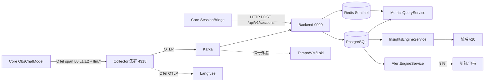

# 可观测优化总结（WorkBuddy V6 · 生产上线版 · 0718）

> **定稿**：2026-07-18，基于《可观测优化总结-0711-WB V6-web文章合入.md》刷新。
> **V6 背景**：银行业务系统，静态用户数千万级（DAU 100-300 万，日均 AI 交互 500-1500 万次，日均 Span 2000-6000 万，6 个月 Session 累计 9-27 亿行）。
> **本次刷新要点（0718）**：
> 1. **OpenLLMetry 评估结论**：Java/Spring AI 栈无官方探针，**保留自研 `ObsChatModel`**（§16.2）。
> 2. **Langfuse 已确认需要**（原待定项 C → 已确认）：生产 P2 必装，通过 OTel OTLP 叠加为第二消费者（§16.3）。
> 3. **web 文章合入严格筛选**：原 V6-web 文档收录了外部 15 篇文章的 22 条观点（P1–P22），经逐条审视，**仅 8 条为生产真正必要**（P1/P2/P5/P10/P11/P13/P20/P22），其余 14 条删除或降级为脚注。本文不再"全量收录"。
> 4. 标注 DEMO 已闭环内容（方案A + T22–T35），避免生产重复。
>
> 适用范围：移动 AI 银行生产（Core 8080 → OTel Collector 集群 4318 → Backend 9090 / PostgreSQL+Redis Sentinel → React 前端 v20）。
> 组件选型最优组合：**Alloy(采集集群) + Tempo(Trace) + VictoriaMetrics(集群) + Loki(日志) + Kafka(缓冲) + Grafana(HA) + Langfuse(LLM 工程平台)**。
> 设计稿：`observability/frontend/可观测DEMO-v20-WorkBuddy.html`

---

## 前置说明：web文章合入筛选结果（22 条→保留 8 条）

> 原 V6-web 文档合入了 15 篇外部文章的全部 22 条观点。经 2026-07-18 逐条重审，以下为最终保留清单（仅生产真正必要的 8 条）：

| 保留观点 | 来源 | 落地位置 | 理由 |
|---|---|---|---|
| **P1 Kafka 缓冲层** | A3 | §2 架构 + §11 | 银行量级日均 2000-6000 万 Span，直压 Backend 不可行 |
| **P2 batch 持久化队列** | A2 | §11.3 | 生产 batch 丢内存数据是真实风险，必须改 file_storage |
| **P5 LLM 推理 SLO 框架** | A2 | §4.3 | 银行必须定义 LLM 服务质量（TTFT/ITL/队列深度） |
| **P10 PII 护栏（三道防线）** | N14 | §4.3 + §13 | 银行合规硬需求，上线前没有不行 |
| **P11 SLO 从业务向下拆 + Tier 分级** | N10/N11 | §4.3 | 转账/查询/理财必须差异化 SLO |
| **P13 三层边界治理** | N9 | §9 | AI 写操作安全底线（禁止直接删数据/扩缩容） |
| **P20 提示词即 Runbook** | N9 | §9 + **Langfuse** | 诊断可复现，生产建议迁 Langfuse 管理 |
| **P22 银行采样细化** | N10 | §11.2 | 交易 100% 采集是监管要求 |

> **删除的 14 条**（非本工程代码改动 / 部署细节 / 团队流程 / 扩展架构 / 分类框架，不在此文档展开）：
> P3 Exemplar · P4 HITL 跨 trace · P6 集中式注册表 · P7 UpDownCounter · P8 GenAI 版本钉注（已用 §16.2 结论替代） · P9 DaemonSet · P12 时序折叠 · P14 MCP · P15 RAG/CAG · P16 动态基线 · P17 7层黄金信号 · P18 SLO 降噪 · P19 ODD+Owner · P21 IDP/Kyverno/多团队。
> 其中 P4/P6/P7/P16 为有价值但非上线阻塞的设计补强，各行一句留底（见对应章节）；其余为无可执行代码改动。

---

## 0. 如何使用本文 & 模块分类原则

### 0.1 阅读路径

| 角色 | 关注章节 |
|---|---|
| 决策者 | §1 组件选型 → §2 目标架构 → §3 阶段计划 |
| 后端开发 | §4 数据流 → §5 Core 埋点 → §6 指标全表 → §7 DB → §8 Redis → §9 洞察 → §10 告警 |
| 前端开发 | §12 UI（V20） |
| 运维/SRE | §11 Collector 配置 → §13 合规 → §14 HA → §15 实施路径 |

### 0.2 A/B/C/D/E 模块分类

| 模块 | 名称 | 策略 | 说明 |
|------|------|------|------|
| **A** | 基础指标 (Infra) | P2 交给 Grafana | JVM/HTTP/DB 等标准指标，不自建专用页 |
| **B** | AI 模型层 (LLM 性能) | ✅ 自建主战场 | Token/TTFT/TPOT/LLM 错误率 |
| **C** | AI 业务语义层 | ✅ 自建主战场 | 意图准确率/路由决策/漏斗/满意度 |
| **D** | 平台自观测 | P3 延后 | 后端自身健康 |
| **E** | 维度规范 | ✅ 贯穿全程 | Metric Tag 基数预算，高基数字段归 Trace/Log |

**核心决策**：
- **P0**：H2→PostgreSQL 迁移（银行量级必须）+ 修复 B+C 类 GAP + Collector 集群 + Redis Sentinel + 告警闭环。
- **P1**：Collector 处理器增强 + 标准栈（Tempo/VM/Loki/Grafana）信号外溢 + AI 洞察引擎 + 合规安全。
- **P2**：Kafka 缓冲层 + 告警迁 Grafana + 前端终稿 + **Langfuse 接入**。
- **P3/P4**：数据归档分级保留 + LLM 专项深化。

---

## 1. 最优组件选型

| 信号 | 推荐组件 | 为什么选它 |
|---|---|---|
| **采集器** | **Grafana Alloy**（P2 替换原生 Collector，集群模式） | 单二进制统一 OTLP+Prom+Loki；P0/P1 OTel Collector 集群 |
| **Trace 存储** | **Grafana Tempo** | 对象存储后端、与 Loki 同源可关联 |
| **指标** | **VictoriaMetrics**（集群） | PromQL 兼容、压缩率高 10× |
| **日志** | **Loki + Vector** | 标签索引、对象存储、便宜 |
| **缓冲** | **Kafka**（P2 新增） | 削峰/解耦/回放（P1） |
| **看板/告警** | **Grafana + Alerting** | 统一拼 Tempo+VM+Loki+PG |
| **LLM 工程平台** | **Langfuse**（🔴 已确认生产必装，P2 接入） | 开源 MIT、可自托管、基于 OTel；追踪+提示词+评估+实验（§16.3） |
| **LLM 语义插桩** | **保留自研 ObsChatModel** | Java 栈无 OpenLLMetry 探针，自研业务语义更贴合（§16.2） |
| **持续剖析** | **Pyroscope**（P3） | 火焰图随 Tempo trace 下钻 |
| **前端错误** | **Grafana Faro**（P3） | 前端错误采集 |
| **关系库** | **PostgreSQL**（P0 即迁） | 去 H2 独占锁、分区表/DROP PARTITION、PgBouncer、读写分离 |

---

## 2. 系统目标架构

### 2.1 目标架构（P2 完成时，含 Kafka + Langfuse）

```mermaid
flowchart TB
    subgraph CORE["Core 应用 (8080) — 数据发射层（✅ DEMO 已修复）"]
        APP["BankController / Router / L0~L2 Agent"]
        OTEL["OTel Java Agent (4318 OTLP)"]
        OBS["ObsChatModel — L0/L1/L2 + 置信度 + 分层意图 + reroute"]
        SESS["SessionBridge @Async — Jackson + 真实 confidence"]
        APP --> OBS --> OTEL
        APP --> SESS
    end

    subgraph COLL["OTel Collector 集群 (4318)"]
        RECV["otlp receiver"]
        BATCH["batch + memory_limiter + filter + tail_sampling"]
        RECV --> BATCH
    end

    subgraph KAFKA["Kafka 缓冲层 (P2)"]
        K["otlp-spans / otlp-metrics / otlp-logs"]
    end

    subgraph STORE["标准可观测栈 (P2)"]
        TEMPO["Tempo"]  VM["VictoriaMetrics 集群"]  LOKI["Loki + Vector"]
    end

    subgraph LANG["Langfuse (自托管, P2)"]
        LF["追踪 / 提示词 / 评估 / 实验"]
    end

    subgraph BACK["自研 Backend (9090) — 业务语义权威源"]
        API["OtlpV1Receiver / SessionService"]
        REDIS[("Redis Sentinel — Bitmap DAU / TDigest")]
        PG[("PostgreSQL (Patroni) — 分区表 + 物化视图")]
        SYNC["RedisH2SyncService 30s"]
        AI["InsightsEngineService — 6 TAB + 诊断驾驶舱"]
        ALERT["AlertEngineService → P2 迁 Grafana"]
        API --> REDIS  API --> PG
        REDIS -.30s.-> SYNC --> PG
        PG --> AI  PG --> ALERT  REDIS --> ALERT
    end

    subgraph OBS2["看板 / 告警 / 前端"]
        GRAF["Grafana + Alerting (钉钉/企微)"]
        FE["React 前端 v20 (8 页)"]
    end

    OTEL --> RECV   SESS --> API
    BATCH --> K
    K --> TEMPO  K --> VM  K --> LOKI  K --> API
    BATCH -.OTel OTLP.-> LF
    ALERT -.P0自研→P2迁.-> GRAF
    REDIS --> GRAF  PG --> GRAF  VM --> GRAF  TEMPO --> GRAF  LOKI --> GRAF
    AI --> FE  PG --> FE  REDIS --> FE
```

### 2.2 架构决策记录

| # | 决策 | 理由 |
|---|---|---|
| D1 | P0 即迁 PostgreSQL | 数千万用户量级 H2 不可行 |
| D2 | P2 引入标准栈 + Kafka + Collector 集群 | 银行量级 SPOF 不可接受，削峰解耦 |
| D3 | 自研前端专注 B+C 类 AI 业务洞察 | A 类交 Grafana |
| D4 | Collector 增强 processors 优先 | 零新组件，只改配置 |
| D5 | P0 自研告警 → P2 迁 Grafana | 自研立即打通闭环 |
| D6 | Redis key 唯一写入方，语义比率不存 Redis | 避免断链 |
| D7 | AI 洞察双层架构（6 Service + InsightsEngine） | 降低回归风险 |
| D8 | 智能洞察独立末位 TAB + 诊断驾驶舱 | 一站式诊断入口 |
| D9 | DAU Bitmap（P0，精度 100%）替换 HyperLogLog | 银行报表不可接受 0.81% 误差 |
| D10 | 保留自研 ObsChatModel，OpenLLMetry 仅可选 | Java 栈无官方探针（§16.2） |
| D11 | Langfuse 作为 OTel OTLP 第二消费者叠加 | 补齐提示词/评估/实验（§16.3） |

### 2.3 组件对接关系

- **Core → Collector**：OTel Java Agent OTLP `http://127.0.0.1:4318` + 独立 `SessionBridge` HTTP POST 9090（不依赖 trace 导出成败）。
- **Collector → Kafka → 存储/Backend/Langfuse**：Kafka 削峰解耦；Tempo/VM/Loki 信号外溢；Backend 业务语义；Langfuse 经 OTel OTLP 消费同一份遥测。
- **Backend → 前端**：Redis 热层优先，空则 PG。

---

## 3. 分阶段优化计划

| 阶段 | 目标 | 关键任务 | 工时 | 状态 |
|---|---|---|---|---|
| **P0** 存储升级 + 数据断链修复 + 告警闭环 | PG 迁移；埋点补齐；Redis HA；告警 | ① LLM 置信度+分层意图+reroute（✅ DEMO 已闭环）② H2→PG（分区表+连接池）③ Collector 集群化 ④ Redis Sentinel + DAU Bitmap ⑤ 语义比率 PG 读时算 ⑥ 自研 AlertEngine（+收敛窗口+静默期） | 2.5–3 人周 | 🟡 部分落地 |
| **P1** 标准栈 + AI 洞察 + 合规安全 | 信号外溢；洞察生产级；合规 | ① Collector batch/filter/tail_sampling（按 intent 分级采样 P22）② Tempo+VM(集群)+Loki+Grafana(HA) ③ InsightsEngine + 物化视图 ④ TLS 全链路 + RBAC ⑤ SLO 框架定义（P5/P11） | 2–2.5 人周 | 🟢 后端 6 TAB 已重写 |
| **P2** Kafka + HA + 告警迁 Grafana + **Langfuse** | 削峰解耦；全组件 HA；**LLM 工程平台就位** | ① Kafka 缓冲层（P1）② Collector 持久化队列（P2）③ PG Patroni / 后端双活 / 前端 Nginx ④ 告警迁 Grafana ⑤ Langfuse 自托管 + 评估体系（§16.3）⑥ 前端 V20 全 API | 2–3 人周 | ⚪ 待启动 |
| **P3** 数据归档 + 分级保留 | 银保监合规审计轨迹 | ① 热 30d PG → 温 90d 压缩 → 冷归档 S3 ② 查询路由 ③ 生命周期策略 | ~1 人周 | ⚪ 待启动 |
| **P4** 深化 + LLM 专项 | 第四信号、LLM 专项 | Pyroscope / Faro / Beyla / 模型对比评估 | 持续 | ⚪ 待决策 |

---

## 4. 端到端数据流设计

### 4.1 总体数据流



> ⚠️ **两条独立管道**：① spans 管道（traceId）② sessions 管道（sessionId，不依赖 span 导出）。**Langfuse 管道**：Collector 经 OTLP 将同一份遥测发给 Langfuse（第二消费者）。

### 4.2 Trace 链路追踪（已修复合入）

```
Core ObsChatModel.startBusinessSpan()
  └─ spanName = "<layer>:<model>"  例: "L0:qwen-plus" / "L1-LLM2:qwen-plus" / "L2:qwen-plus"
  └─ attributes: agent.name / model.name / agent.layer / intent / session_id / user_id
                 + ai.io.prompt / ai.io.response / ai.token.input / ai.token.output
                 + llm.confidence  + intent.L0/L1/L2.predicted/actual
        ↓ OTel Java Agent 自动导出
OTel Collector → [batch → memory_limiter → filter(健康检查) → tail_sampling] → otlphttp exporter
        ↓ POST /v1/traces
Backend OtlpParserService.parseTraces() → SpanEntity → Redis obs:traces:recent
        ↓
TraceQueryService.listTracesPaginated()  【已重写：按 trace_id 去重，跳过无业务 span 的 trace】
```

- **★方案A 补正（2026-07-14 已实施）**：`DomainRouter` 确定性路由分支显式创建 `L0:DomainRouter` span（`routing.mode=deterministic`，立即 end），L0=全部请求，L0≥L1≥L2 恒成立。
- **Agents 链**：按 L0 边界切段；reroute 含多段 `L0→L1→WEALTH → L0→L1→TRANSFER`。
- **意图链**：四层真实识别结果，不回退 session 整条 intentFlow。

> 生产建议：人机审批（HITL）中断场景可使同一业务链产生两条 trace，用 `session_id` 在日志拼接，前端会话回放页缝合为一条业务时间线（web P4 降级为脚注，非本阶段阻塞项）。

### 4.3 Metrics 指标（含 SLO 框架 + PII 护栏）

**致命坑**：`Timer.publishPercentiles(...)` → Summary，后端不解析 → TTFT 分位恒 0。必须 `publishPercentileHistogram(true)`。

**★P5 LLM 推理 SLO 框架**（银行必须定义服务质量）：

| 指标 | 类型 | SLO | 说明 |
|---|---|---|---|
| TTFT | Histogram | p95<2000ms(流式)/p99<3000ms(非流式) | 用户体感最关键 |
| ITL | Histogram | p95<200ms | 流式卡顿感知 |
| TPS | Gauge | — | 吞吐 |
| queue_depth | Gauge | >100→WARNING | 容量最早预警 |
| preemptions | Counter | 增长>0→WARNING | 隐性变慢 |

**★P11 SLO 从业务向下拆 + Tier 分级**：

| Tier | 业务线 | 可用性 | P95 时延 | 错误预算燃尽阈值 |
|---|---|---|---|---|
| Tier1 | 转账/支付/账单 | 99.9% | <3s | 5min>10%→P1 / 30min>5%→P2 |
| Tier2 | 理财查询/基金 | 99.5% | <5s | 30min>5%→P2 |
| Tier3 | 一般问答/客服 | 99% | <8s | 24h>1%→P3 |

内部 API 只用异常检测，不挂 SLO。

**★P10 AI 自身可观测 + PII 护栏**（银行合规硬需求）：

| 指标 | SLO 建议 |
|---|---|
| 护栏触发次数 | 突增→CRITICAL |
| PII 泄露风险（明文卡号/身份证） | >0→CRITICAL |
| 响应准确率（BERTScore≈0.8/ROUGE≈0.4 参考） | <阈值→WARNING |
| AI Pod CPU/内存 | 标准 K8s 资源告警 |

---

## 5. Core 端埋点设计

### 5.1 埋点总览

| # | 埋点项 | 发射方 | DEMO 状态 |
|---|---|---|---|
| 1 | `llm.confidence`（span attr + Gauge） | ObsChatModel | ✅ 已闭环 |
| 2 | 意图准确率分层（`layer` tag） | ObservabilityMetrics | ✅ 已闭环 |
| 3 | 分层意图 Span attrib | Router commitIntent | ✅ 已闭环 |
| 4 | Session 分层意图落库 | SessionBridge | ✅ 已闭环 |
| 5 | Reroute 事件 | BankController + SessionBridge | ✅ 已闭环 |
| 6 | DAU / 在线（Bitmap/ZSet） | DauCounter / OnlineCounter | ✅ DEMO→生产 Bitmap |
| 7 | 待审批数 UpDownCounter | ObservabilityMetrics | 🟡 按需新增 |

### 5.2 关键代码（已随方案A/T27/T28 校准）

```java
// ObsChatModel.resolve()
span.setAttribute("llm.confidence", response.getResult().getOutput().getConfidence());
meterRegistry.gauge("llm.confidence", Tags.of("model.name", modelName, "agent.name", agentName), confidenceValue);

// ObservabilityMetrics.recordIntentAccuracy() — +layer tag
public void recordIntentAccuracy(String predicted, String actual, String state, String layer) {
    Counter.builder("agent.intent.accuracy")
        .tags("intent_predicted", predicted, "intent_actual", actual, "state", state, "layer", layer)
        .register(meterRegistry).increment();
}
```

### 5.3 埋点强制约定

- 时延 `Timer` 一律 `publishPercentileHistogram(true)`。
- 语义计数用 Counter + 规范 tag 落 PG `metrics_agg`，**不在 Redis 另存比率 key**。
- 高基数字段不入 Metric Tag，归 Span attributes。
- 所有 Meter/Counter/Timer/Gauge/UpDownCounter 集中在 `ObservabilityMetrics` 管理，命名 `deepflux.<domain>.<measure>`，提供 `RecordXxx` 助手方法，禁止散落 `meterRegistry.counter("xxx")`（防命名漂移）。（web P6 降级，此句已覆盖核心诉求）
- **OpenLLMetry**：Java 栈无官方探针，保留自研 `ObsChatModel`（§16.2）。若未来要对齐 `gen_ai.*` 标准语义，在 span 上追加属性即可。

---

## 6. 指标设计全表

> 状态图例：✅正常 / 🟢已解决 / 🟡回归 / 🔴仍开放。

| # | 指标 | 数据源 | 状态 |
|---|---|---|---|
| A1 | activeSessions | Redis Gauge | ✅ |
| A2 | DAU | Bitmap（生产）/ HyperLogLog（DEMO） | 🟢 |
| A3 | realTimeOnline | ZSet（分片） | 🟢 |
| A4 | requestCount(6h) | Redis | 🟢 |
| A5 | QPS | requestCount/21600 | 🟢 |
| A6 | agentCall L0/L1/L2 | PG `COUNT(DISTINCT trace_id)` | 🟢 方案A 后 L0=请求数 |
| B1 | Token 调用量 | `llm.token.*` | ✅ |
| B2 | TTFT P50/P95/P99 | TDigest（生产）/ ZSet（DEMO） | ✅ |
| B3 | P95 系统时延 | TDigest/ZSet | ✅ |
| B4 | 错误率 | PG spans 真值 | 🟢 |
| C1 | intentAccuracy(分层) | PG + layer tag | 🟢 已闭环 |
| C2 | rewriteAccuracy | PG | 🟢 |
| C3 | rerouteRate | PG `agent.reroute.count` | 🟢 已闭环 |
| C4 | completionRate | PG `agent.business.outcome` | 🟢 |
| D1 | conversionRate | 业务成功率近似 | 🟡 |
| D2 | violationRate | 待 PII 围栏落地 | 🔴 |

---

## 7. DB 表设计

### 7.1 Redis → DB 同步原则

Redis 管实时窗口，PG 管真相与历史；热→温每 30s 同步；语义比率 PG 读时算。

### 7.2 活跃表

`metrics_agg` / `spans`(含 llm.confidence/intent.*) / `logs` / `sessions`(+l0/l1/l2_intent + reroute_triggered) / `session_turns` / `tool_calls` / `alert_rules`(+增强字段) / `alert_events`(+增强字段) / `redis_metrics_snapshot` / `insight_reports`(**P0 新增**)。弃用：`agent_performance` / `token_cost`（全库无 INSERT）。

### 7.3 P0 DDL（PG 已就位）

```sql
ALTER TABLE sessions ADD COLUMN l0_intent VARCHAR(64);
ALTER TABLE sessions ADD COLUMN l1_intent VARCHAR(64);
ALTER TABLE sessions ADD COLUMN l2_intent VARCHAR(64);
ALTER TABLE sessions ADD COLUMN reroute_triggered BOOLEAN DEFAULT FALSE;
ALTER TABLE alert_rules ADD COLUMN evaluation_interval INT DEFAULT 30;
ALTER TABLE alert_rules ADD COLUMN last_evaluated_at TIMESTAMP;
ALTER TABLE alert_rules ADD COLUMN current_value DOUBLE;
ALTER TABLE alert_events ADD COLUMN notified_channels VARCHAR(128);
ALTER TABLE alert_events ADD COLUMN notify_result VARCHAR(64);
ALTER TABLE alert_events ADD COLUMN suppression_count INT DEFAULT 0;
CREATE TABLE insight_reports (
    id BIGINT AUTO_INCREMENT, report_type VARCHAR(32),
    report_data TEXT, generated_at TIMESTAMP,
    data_window_start TIMESTAMP, data_window_end TIMESTAMP,
    version INT DEFAULT 1, PRIMARY KEY (id)
);
```

### 7.4 分层数据保留策略（银保监合规）

| 层级 | 存储 | 保留期 | 清理 |
|---|---|---|---|
| 热层 | PostgreSQL SSD | 7 天 | 分区表 DROP PARTITION |
| 温层 | PG 压缩分区 | 90 天 | DROP PARTITION |
| 冷层 | 对象存储(S3/MinIO) | 3 年 | 生命周期策略 |

PG 按天分区；冷层 PG→Parquet→对象存储，3 年可回溯。

---

## 8. Redis 缓存设计（生产：Sentinel + Bitmap + TDigest）

### 8.1 所有权原则

每 Key 唯一写入方；语义比率不写 Redis；命名 `obs:<域>:<指标>:<窗口>`。

### 8.2 Redis Key 规范全表

| Key 模式 | 类型 | 说明 |
|---|---|---|
| `obs:metrics:request_count:*` | String(INCR) | 多窗口 |
| `obs:metrics:error_count:1m` | String(INCR) | — |
| `obs:token:input:1m` / `output:1m` | String(INCR) | — |
| `obs:latency:1m/5m/15m` | **TDigest** | 降 50000 倍，P99 误差<0.5% |
| `obs:ttft:1m` | **TDigest** | — |
| `obs:dau:YYYY-MM-DD` | **Bitmap** | 精度 100%，3000 万用户仅 3.6MB |
| `obs:online:users:{shard}` | ZSet（按小时分片） | 避免单 ZSet 百万 member |
| `obs:traces:recent` / `obs:logs:recent` | List(LTRIM) | 滑动窗口 |
| `obs:alerts:active` | ZSet | — |
| `obs:insights:cache` | String(JSON) | 300s |

### 8.3 物化视图（大表预聚合）

按小时预聚：`mv_agent_call_hourly` / `mv_token_cost_hourly` / `mv_funnel_daily` / `mv_satisfaction_daily`，前端走 MV 非原始表。

### 8.4 TDigest 流式分位（替代 ZSet）

```java
TDigest td = TDigest.createMergingDigest(100);
td.add(latencyMs);
double p99 = td.quantile(0.99);  // ~2KB/窗口
```

---

## 9. AI 洞察引擎（双层架构 + 三层边界治理）

### 9.1 ★P13 三层边界治理（AI 写操作安全底线）

| 边界层 | 行为 | 示例 | 实现 |
|---|---|---|---|
| **L1 确定性聚合** | 自动执行（代码） | P95 时延/错误率统计 | InsightsEngine compute* 方法 |
| **L2 模糊判断** | AI 辅助（推荐，需人工确认） | 根因假设生成 / 优先级排序 | 输出带"置信度"的建议卡 |
| **L3 生产写操作** | **禁止 AI 直接执行** | 回滚/改配置/扩缩容/删数据 | 需权限+审批+审计+回滚预案 |

### 9.2 AIInsightsService 族（6 Service，P0 保留接口，已重写实时聚合）

`AIInsightsService` / `AgentPerformanceService` / `TokenCostService` / `ConversionFunnelService` / `SatisfactionService` / `ToolStatsService`。`AgentPerformanceService`/`TokenCostService` 已从读空静态表改为实时聚合 `spans+metrics_agg`。

### 9.3 InsightsEngineService（交叉引擎）

`generateReport()` → 缓存 `obs:insights:cache`(300s) + 写 `insight_reports`。三大诊断域：性能 / 质量 / 业务。6 个 API 端点（insights-report / bottlenecks / root-cause / unsatisfied / conversion / actions）。

### 9.4 ★P20 提示词即 Runbook（→ 建议迁 Langfuse 管理）

诊断 prompt 模板应当版本化管理、PR review、单元测试、复盘可追溯。生产建议将提示词管理迁至 **Langfuse**（§16.3），复用其版本控制/Playground/A-B 测试/Git 集成——比自建版本表更可持续。

### 9.5 后续扩展（P3–P4）

- 动态基线替代静态阈值（告警降噪，先用静态跑通）。（web P16 降级）
- MCP 集成 / RAG+CAG 知识来源：历史事故→RAG / 高频场景→CAG 缓存 / 实时状态→MCP。当前无可接入的系统，属扩展架构。

---

## 10. 告警系统设计（P0 自研 → P2 迁 Grafana）

### 10.1 AlertEngineService（P0）

```java
@Scheduled(fixedRate = 30_000)
public void evaluateRules() {
    for (AlertRule rule : ruleRepo.findByEnabledTrue()) {
        double v = collectMetricValue(rule.getMetricKey());
        if (shouldFire(rule, v) && !isCurrentlyFiring(rule.getId())) {
            if (!isSuppressed(rule, 5, MINUTES) && !isInQuietPeriod(rule, 30, MINUTES))
                fireAlert(rule, v);
        } else if (!shouldFire(rule, v) && isCurrentlyFiring(rule.getId())) {
            resolveAlert(rule, v);
        }
        rule.setLastEvaluatedAt(Instant.now()); rule.setCurrentValue(v); ruleRepo.save(rule);
    }
}
```

状态机：`TRIGGERED → SUPPRESSED → ACKED → RESOLVED → QUIET`。

**默认规则**：LLM 错误率>0(CRITICAL) / TTFT P95>3000ms(WARNING) / 转账槽位完成率<50%(CRITICAL) / Collector 接收量<基线30%(WARNING) / 满意度负面>20%(WARNING) / **脱敏明文 PII 检测(CRITICAL)** / **交易 Trace 缺失(WARNING)**。

> 告警降噪（动态基线/burn rate）为 P3 迭代方向，先用 5min 抑制 + 30min 静默期跑通基础闭环。（web P16/P18 降级）

---

## 11. OTel Collector 增强配置

### 11.1 生产 config.yaml

```yaml
receivers:
  otlp:
    protocols:
      http: { endpoint: 0.0.0.0:4318 }

processors:
  batch:
    timeout: 5s
    send_batch_size: 1024
  memory_limiter:
    check_interval: 1s
    limit_mib: 512
    spike_limit_mib: 128
  filter:
    metrics: { metric: [ 'type == METRIC_DATA_TYPE_HISTOGRAM' ] }
    traces: { span: [ 'attributes["http.target"] == "/actuator/health"' ] }
  attributes:
    actions:
      - { key: env, value: production, action: upsert }
  tail_sampling:
    decision_wait: 10s
    policies:
      - { name: errors, type: status_code, status_code: { status_codes: [ERROR] } }
      - { name: slow, type: latency, latency: { threshold_ms: 1000 } }
      - { name: llm-failure, type: string_attribute, string_attribute: { key: error_type, values: [timeout, auth_error, rate_limit] } }
      - { name: normal-sampling, type: probabilistic, probabilistic: { sampling_percentage: 1 } }

exporters:
  otlphttp/json_backend: { endpoint: http://127.0.0.1:9090, compression: gzip }
  # P2 激活：
  kafka: { brokers: [...], topic: otel-spans, encoding: otlp_json, producer: { acks: all, compression: snappy } }
  otlphttp/langfuse: { endpoint: http://langfuse:4318/v1/otlp, compression: gzip }
  # otlphttp/tempo / prometheusremotewrite / loki

service:
  pipelines:
    traces:   { receivers: [otlp], processors: [batch, memory_limiter, filter, attributes, tail_sampling], exporters: [otlphttp/json_backend, kafka, otlphttp/langfuse] }
    metrics:  { receivers: [otlp], processors: [batch, memory_limiter, filter, attributes], exporters: [otlphttp/json_backend, kafka] }
    logs:     { receivers: [otlp], processors: [batch, memory_limiter, attributes], exporters: [otlphttp/json_backend, kafka] }
```

### 11.2 ★P22 分级采样策略（银行量级，交易 100%）

| intent | 采样率 | 说明 |
|---|---|---|
| TRANSFER/BILL（交易） | **100%** | 监管要求 |
| WEALTH/GENERAL（查询） | 5% | — |
| 其他 | 1% | — |
| 错误/慢/LLM 失败 | 100% | 不丢故障 |

### 11.3 生产增强

- **★P1 Kafka 缓冲层**：Collector→Kafka→(Tempo/VM/Loki/PG Consumers)，24h 回放。银行量级日均 2000-6000 万 Span，直压不可行。
- **★P2 batch 持久化队列**：生产弃用纯 `batch` processor（重启丢内存数据），改用 `file_storage` 持久化发送队列（`sending_queue.storage: file_storage`）。

---

## 12. UI 设计（V20）

8 页：总览 / 会话回放 / 链路追踪 / AI 洞察(6 TAB) / 日志 / 告警 / 设置 / 智能洞察（诊断驾驶舱）。生产目标：前端 V20 全 API + WebSocket 实时推送。

---

## 13. 数据合规与安全设计

### 13.1 数据脱敏（P0，Core 端完成）

卡号前4后4、身份证前6后4、手机号前3后4；金额不脱敏；用户ID 哈希。脱敏在 Core 端完成，后端/存储收到即脱敏。

### 13.2 RBAC 五角色（P1）

admin / ops / analyst / auditor / viewer，敏感操作 `@PreAuthorize` + 审计日志。

### 13.3 全链路 TLS（P1）

Core→Collector / Collector→Backend / Core→Backend / Backend→前端 均加密。

### 13.4 ★P10 PII 网关级 BLOCK 三道防线

| 防线 | 位置 | 机制 | 动作 |
|---|---|---|---|
| L1 Core 端脱敏（已有） | SessionBridge/ObsChatModel | 正则打码 | 发送前打码 |
| L2 网关级 BLOCK（新增） | LiteLLM + Presidio | PII 模式+NLP 识别 | **BLOCK 请求** + 记护栏事件 |
| L3 Trace/Log 检测（新增） | Collector redaction | 扫描 span/log | 脱敏或拒写 + PII 泄露告警 |

---

## 14. 高可用部署架构

### 14.1 HA 组件矩阵

PG(Patroni) / Redis(Sentinel) / Collector(3+Nginx) / VM(集群) / Tempo(2) / Loki(2) / Grafana(2) / 后端(双活) / 前端(Nginx+CDN) / Kafka(3, replication=3)。

### 14.2 容量规划（日均 1000 万 AI 交互）

PG 16C64G×3 / Redis 8C32G×3 / Collector 4C8G×3 / Kafka 8C32G×3 / VM 8C32G×3 / 对象存储(3y 冷归档)。

### 14.3 落地路线图

P0 修复→P1 标准栈→P2 削峰+HA+Langfuse→P3 冷热分层归档（对应银保监 3 年审计轨迹要求）。

---

## 15. 实施路径与里程碑

各阶段任务见 §3。仅补充 DEMO 已闭环内容避免生产重复：

方案A（确定性 L0 span）+ T22–T35（12 项代码修复：跳转/注释/Collector/秒级/JSON/置信度/model+TTFT/seed/时区/时间列）+ 语义比率 PG 读时算 + AgentCall `COUNT(DISTINCT)`。详见 `可观测优化总结-WorkBuddy-V4-Demo上线版-0718.md` 与 `代码审阅整改总结-2026-07-18.md`。

---

## 16. 附录

### 16.1 关键坑清单

1. `publishPercentileHistogram(true)` 必须开，否则 TTFT 分位恒 0。
2. 语义比率别存 Redis key → PG 读时算。
3. Agent 调用数改 PG `COUNT(DISTINCT trace_id)`。
4. 错误率改 PG spans 真值计算。
5. `purge` 批量删必须 `@Transactional`。
6. `agent_performance`/`token_cost` 表已弃用 → 不要读。
7. Windows `localhost`→`127.0.0.1`。
8. 两条管道独立：sessions 不依赖 spans。
9. 时区统一 `Asia/Shanghai`（DEMO 已修 T34/T35）。
10. 生产 `batch` processor 有静默丢数据风险 → 改 `file_storage` 持久化队列。

### 16.2 OpenLLMetry 评估结论（保留自研 ObsChatModel）

**OpenLLMetry 是什么**：Apache 2.0、Traceloop 维护、构建在 OpenTelemetry 之上的 LLM 应用插桩扩展；为 OpenAI/Anthropic/向量库/LangChain 等自动创建标准 `gen_ai.*` span。**官方 instrumentation 仅覆盖 Python / TypeScript(Node) 生态，无 Java / Spring AI 官方探针**。

**对比自研 ObsChatModel**：

| 维度 | 自研 ObsChatModel | 若迁 OpenLLMetry（Java） |
|---|---|---|
| 适配栈 | ✅ Java/Spring AI Alibaba 原生 | ❌ 无官方探针 |
| 业务语义 | ✅ `intent.L0/L1/L2`、`routing.mode`、`llm.confidence` 等领域专属 | ⚠️ 仅通用 `gen_ai.*` |
| 控制力 | ✅ 方案A 确定性 L0 span 即依赖此可控性 | ⚠️ 受限于自动插桩粒度 |

**决策**：DEMO 与生产均**保留自研 ObsChatModel**。未来若需跨工具标准语义兼容，在现有 span 上**追加** `gen_ai.*` 属性即可，不替换埋点链路。

### 16.3 Langfuse 确认项（已确认需要，原待定项 C）

**是什么**：MIT 开源、可自托管、基于 OTel 的 LLM 工程平台。四大支柱：**追踪（Agent graph/会话/成本）/ 提示词管理（版本/Playground/A-B/Git）/ 评估（LLM-as-Judge/人工标注/实验）/ 指标数据平台**。

**为什么需要**（补齐自研 Backend 不具备的能力）：
- 提示词版本化/Playground/A-B（诊断 prompt 可系统管理，P20 落到 Langfuse 而非自建版本表）。
- 评估体系（AI 洞察准确率量化可用 Langfuse 系统化）。
- 会话/Trace 增强可视化（Agent graph、成本追踪、多模态）。

**与现有管道关系（叠加，不替换）**：
```
Core OTel → Collector → ① 自研 Backend(9090) 业务语义真相源（PG）
                        → ② Langfuse（OTel OTLP 第二消费者）
```
Langfuse 经 OTel OTLP 消费同一份遥测（原生支持 OTel ingestion），**无需改业务代码**。真相源仍在 PG。

| 阶段 | 动作 | 工作量 |
|---|---|---|
| DEMO（可选） | `docker compose up` Langfuse；Collector 加 `otlphttp/langfuse` exporter；验证 trace 入 Langfuse | ~0.5 人日 |
| 生产 P2（必装） | 自托管 Langfuse（PG+对象存储）+ RBAC；接入 OTel；提示词/P20 迁入；评估体系接入 | 随 P2 |

### 16.4 待定决策状态

- **待定项 A（L0 覆盖所有请求）**：🟢 已决策（方案 b）已实施（2026-07-14）。
- **待定项 B（reRoute 是否携带原报文）**：⚪ 待定。
- **待定项 C（是否引入 Langfuse）**：🟢 **已确认需要（2026-07-18）**，生产 P2 必装。

### 16.5 被删除的 web 观点速查（14 条，留备查）

| 编号 | 原观点 | 删除理由 |
|---|---|---|
| P3 | Exemplar 显式化 | Grafana 功能，非本项目代码改动 |
| P4 | HITL 跨 trace 会话连续性 | 银行审批场景有价值，但属流程设计，非可观测工程阻塞项 |
| P6 | 集中式指标注册表 | 已有一句规范覆盖（§5.3），不需要单独小节 |
| P7 | UpDownCounter 待审批数 | 一个具体指标，不是架构设计 |
| P8 | GenAI 语义版本钉注 | §16.2 已明确不用 OpenLLMetry，钉注无意义 |
| P9 | Collector DaemonSet | K8s 部署细节，非本工程代码改动 |
| P12 | 金融落地蓝图"时序折叠" | 叙事词汇，不是实施项 |
| P14 | MCP 集成 | 当前无任何 MCP server 可接，属扩展架构 |
| P15 | RAG/CAG 分工 | 同上，历史数据都没有无法做 RAG |
| P16 | 动态基线替代静态阈值 | 告警降噪重要但先用静态基线跑通，P3 迭代 |
| P17 | 云原生 7 层黄金信号 | 分类框架，不改变任何实现 |
| P18 | SLO 影响分析降噪 | 抑制/静默期已覆盖基础降噪，burn rate 为 P3 迭代 |
| P19 | 可观测性驱动开发 + Owner 必填 | 团队流程规范，非代码改动 |
| P21 | IDP/Helm/Kyverno/多团队推广 | 多团队推广工具，单项目不涉及 |

---

> 文档版本：0718 · WorkBuddy V6 · 生产上线版（刷新 V6-web，严格筛选 web 观点 22→8 条 + OpenLLMetry 评估 + Langfuse 确认）
> 融合路径：Wb V2+V3+V4+V5(银行量级) → Wb V6(整合 Codex V4) → web 文章合入(22 条) → **0718 严格筛选(仅保留 8 条必要项)**
> Demo 版：`可观测优化总结-WorkBuddy-V4-Demo上线版-0718.md`
> 整改明细：`代码审阅整改总结-2026-07-18.md`
> 前端设计：`observability/frontend/可观测DEMO-v20-WorkBuddy.html`
