# 手机银行AI助手 — 架构与流程分析文档

> **版本**: WorkBuddy-V1  
> **日期**: 2025-07-11  
> **技术栈**: Spring Boot 3.5.5 + Spring AI Alibaba Graph (StateGraph) + DashScope qwen-plus  
> **定位**: L0→L1→L2 三级主从智能体架构的完整技术分析

---

## 目录

1. [工程全貌](#1-工程全貌)
2. [L0/L1/L2 三层架构详解](#2-l0l1l2-三层架构详解)
3. [完整请求链路](#3-完整请求链路)
4. [Agent 路由决策体系](#4-agent-路由决策体系)
5. [状态管理与存储](#5-状态管理与存储)
6. [L2 子Graph执行机制](#6-l2-子graph执行机制)
7. [SSE 流式输出方案](#7-sse-流式输出方案)
8. [关键配置速查表](#8-关键配置速查表)
9. [已知局限与改进方向](#9-已知局限与改进方向)

---

## 1. 工程全貌

### 1.1 目录树

```
mobile-ai-bank-demo/
├── src/main/java/com/mobileagent/
│   ├── MobileAiDemoApplication.java              # Spring Boot 启动类
│   ├── app/
│   │   ├── config/
│   │   │   ├── DomainServiceConfig.java           # L1域服务Bean装配 + DomainStateAware注册
│   │   │   └── ModelConfig.java                   # 各层ChatClient Bean定义(6个LLM模型)
│   │   ├── controller/
│   │   │   └── BankController.java                # L0调度层 — 领域路由 + REROUTE + SSE/JSON双模式
│   │   ├── data/
│   │   │   ├── ChunkType.java                     # 流式chunk类型枚举
│   │   │   ├── RoutingResult.java                 # LLM路由结果(Phase1/Phase2通用)
│   │   │   ├── RoutingResolution.java             # SubGraphResolver决议
│   │   │   ├── StreamChunk.java                   # 流式传输单元 — L0/L1/GES之间的唯一数据载体
│   │   │   ├── SubGraphProperties.java            # 子图配置属性(从yml的routing段绑定)
│   │   │   ├── WorkflowOutput.java                # 非SSE模式的JSON响应DTO
│   │   │   └── WorkflowStatus.java                # 工作流状态枚举
│   │   ├── domain/
│   │   │   ├── DomainHandler.java                 # 领域处理者接口(统一handle方法)
│   │   │   ├── AbstractDomainService.java         # L1抽象基类(activeAgent管理/Graph输入构建/FOLLOW恢复)
│   │   │   ├── SingleSubAgentDomainService.java   # 单子图域(1-1: 转账/账单)
│   │   │   ├── MultiSubAgentDomainService.java    # 多子图域(1-N: 理财,含消歧/挂起/恢复)
│   │   │   └── ChatService.java                   # 闲聊域(直接LLM对话)
│   │   ├── execution/
│   │   │   └── GraphExecutionEngine.java          # Graph执行引擎(流式/非流式双路径 + checkpoint管理)
│   │   ├── infrastructure/
│   │   │   └── SseOutputAdapter.java              # SSE输出适配器(唯一知道SSE格式的组件)
│   │   ├── memory/
│   │   │   ├── GlobalSessionContext.java           # 全局会话上下文(OverAllState封装, 读写门面)
│   │   │   ├── GlobalSessionStateStore.java        # Session级状态管理器
│   │   │   ├── GlobalSessionRepository.java        # 存储后端接口
│   │   │   ├── GlobalSessionRepositoryConfig.java  # @ConditionalOnProperty实现InMemory/Redis切换
│   │   │   ├── DomainStateAware.java               # 域状态注册接口
│   │   │   ├── KeyStrategyFactoryConfig.java       # 全局KeyStrategy工厂
│   │   │   ├── SubGraphCheckpointSaverConfig.java  # L2 Checkpoint配置
│   │   │   ├── GlobalMemoryStore.java              # 长期记忆存储
│   │   │   ├── impl/
│   │   │   │   ├── InMemoryGlobalSessionRepository.java
│   │   │   │   ├── RedisGlobalSessionRepository.java
│   │   │   │   ├── RedisStoreAdapter.java
│   │   │   │   └── RedisSubGraphCheckpointSaver.java
│   │   │   └── model/
│   │   │       ├── ActiveAgentInfo.java            # 当前活跃子图信息
│   │   │       ├── DisambiguationState.java        # 消歧状态
│   │   │       ├── DomainState.java                # L1域状态
│   │   │       ├── SubAgentState.java              # L2子图数据快照
│   │   │       └── SuspendedInfo.java              # 挂起子图信息
│   │   ├── mock/
│   │   │   └── MockBankingService.java             # 银行服务Mock(转账/账单/理财)
│   │   ├── observability/
│   │   │   ├── MeterConfig.java
│   │   │   └── ObservabilityMetrics.java
│   │   ├── router/
│   │   │   ├── domain/
│   │   │   │   └── DomainRouter.java               # L0领域路由器(确定性关键词+LLM兜底)
│   │   │   ├── registry/
│   │   │   │   ├── DomainServiceRegistry.java      # 领域服务注册表(域名→DomainHandler)
│   │   │   │   └── SubGraphRegistry.java           # 子图注册中心(元数据+Graph Bean绑定+模糊匹配)
│   │   │   └── subgraph/
│   │   │       ├── ContextRouter.java              # L1 Phase1: FOLLOW/SWITCH/RESUME判断
│   │   │       ├── SubGraphRouter.java             # L1 Phase2: 意图识别+上下文改写
│   │   │       └── SubGraphResolver.java           # L1 Phase2封装: 意图决议+消歧+模糊匹配
│   │   ├── util/
│   │   │   ├── JsonParseUtils.java                 # JSON提取(从LLM响应中提取JSON)
│   │   │   └── TemplateUtils.java                  # 模板加载(.st文件,构造时warmUp运行时零IO)
│   │   └── workflow/
│   │       ├── AbstractGraphConfig.java             # 抽象Graph配置(提参/校验/取消检测/数据快照)
│   │       ├── TransferGraphConfig.java             # 转账Graph(receiver/amount/purpose)
│   │       ├── BillQueryGraphConfig.java            # 账单Graph(timePeriod/expenseType)
│   │       ├── WealthConsultGraphConfig.java        # 理财咨询Graph(riskLevel/focusArea)
│   │       └── WealthInterpretGraphConfig.java      # 理财解读Graph(流式,productName)
│   └── resources/
│       ├── application.yml                          # 统一配置(模型/路由/存储/会话)
│       └── prompts/
│           ├── l0-domain.st                         # L0领域路由模板
│           ├── l1-context.st                        # L1 Phase1上下文路由模板(Multi域)
│           ├── l1-context-simple.st                 # L1 Phase1简化模板(Single域)
│           └── l1-intention.st                      # L1 Phase2意图识别+改写模板
```

### 1.2 技术栈一览

| 层次 | 技术组件 | 版本/说明 |
|------|----------|-----------|
| **框架** | Spring Boot | 3.5.5 |
| **AI框架** | Spring AI Alibaba Graph | StateGraph 有状态多节点图执行框架 |
| **LLM平台** | DashScope (阿里云) | 通义千问系列 |
| **L0路由模型** | qwen-plus | 领域路由, prompt: l0-domain.st |
| **L1上下文路由** | qwen-plus | Phase1 FOLLOW/SWITCH/RESUME, prompt: l1-context.st/l1-context-simple.st |
| **L1意图路由+改写** | qwen-plus | Phase2 意图识别+上下文改写, prompt: l1-intention.st |
| **L2参数提取** | qwen-plus | 子Graph从用户输入提取业务参数 |
| **闲聊模型** | qwen-turbo | ChatService 直接LLM对话 |
| **理财解读模型** | qwen-plus | 流式解读, 独立ChatClient |
| **响应模式** | SSE (Server-Sent Events) + JSON | 双模式, 根据Accept头切换 |
| **响应式编程** | Reactor (Flux/Mono) | 全链路响应式 |
| **状态存储** | In-Memory / Redis | 通过 `storage.type` 一键切换 |
| **序列化** | Jackson | JSON序列化/反序列化 |
| **模板引擎** | StringTemplate (.st) | Prompt模板管理, 构造时warmUp |

### 1.3 系统整体架构图

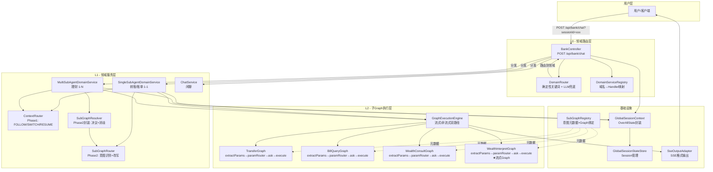

---

## 2. L0/L1/L2 三层架构详解

### 2.1 L0 — 领域路由层

#### 2.1.1 概述

L0层是整个系统的入口，负责将用户的自然语言输入路由到正确的业务领域。由 `BankController` + `DomainRouter` 协同工作。

**核心职责**:
- 接收 HTTP 请求（SSE/JSON 双模式）
- 将用户意图分类为 5 个领域: **TRANSFER / BILL / WEALTH / UNSUPPORTED / CHAT**
- 支持 REROUTE（重新路由）机制
- 统一管理对话历史的写入（UserMessage + 累积后的 AssistantMessage）

#### 2.1.2 类关系图

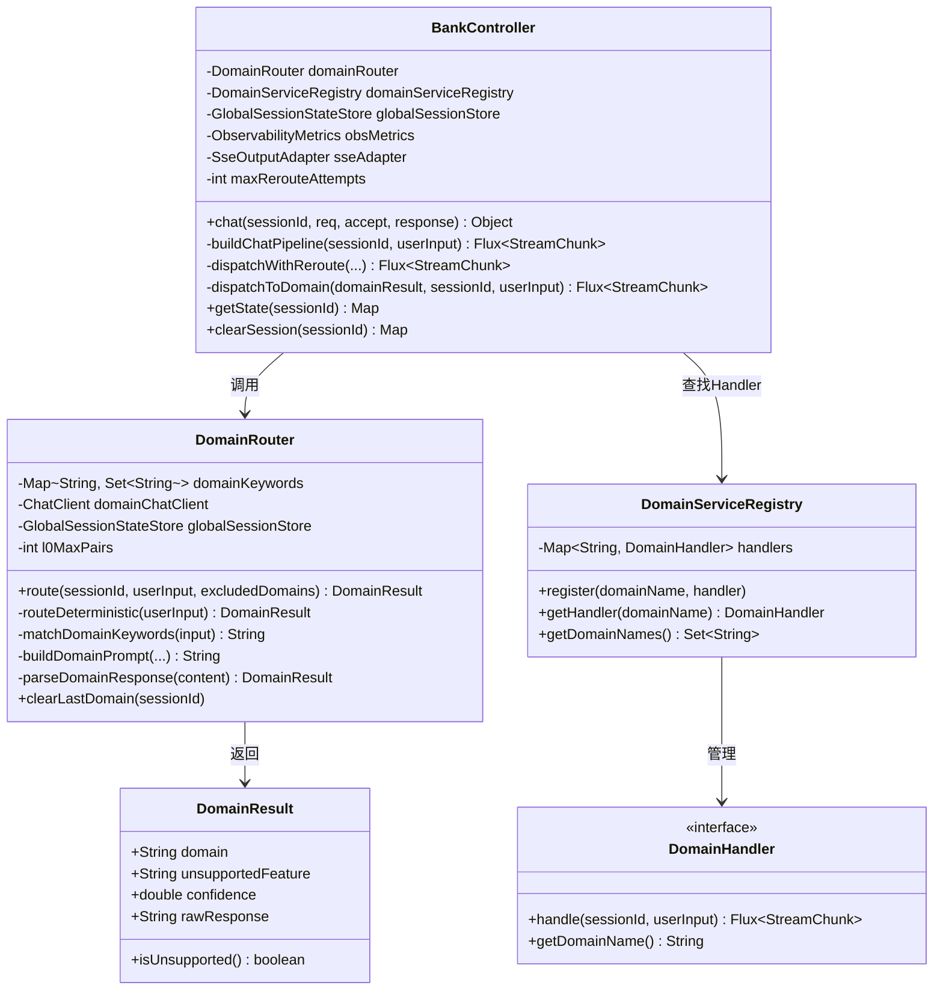

#### 2.1.3 路由策略详解

L0层采用 **确定性优先 + LLM兜底** 的两级路由策略：

```
用户输入
  │
  ├─[确定性路由] 关键词匹配 (0ms)
  │   ├─ 命中单一领域 → 直接返回 ✅
  │   ├─ 命中多个领域 → 交给LLM 🔄
  │   └─ 未命中 → 交给LLM 🔄
  │
  └─[模型路由] LLM判断 (200-500ms)
      ├─ 加载l0-domain.st模板, 注入对话历史 + lastDomain + excludedDomains
      ├─ 调用 qwen-plus ChatClient
      ├─ 解析JSON响应 {domain, confidence, unsupported_feature}
      └─ 按 confidence 和规则确定最终领域
```

#### 2.1.4 Prompt模板分析 (l0-domain.st)

L0的Prompt是系统中最复杂的模板（~160行），核心是 **"话术类型分析框架"**:

```
操作型话术 → 锚点=核心动词(用户要做什么)
  例: "转1000元到朝朝盈理财产品" → 动词=转 → TRANSFER

问题型话术 → 锚点=核心名词+问法动词(用户在问什么)
  例: "解读一下刚才转账的理财" → 问法=解读+名词=理财 → WEALTH
```

**判断优先级 (从高到低)**:
1. **绝对禁止**: 排除领域规则（REROUTE场景，覆盖一切）
2. **关键词明确**: 当前消息包含领域关键词→话术类型分析
3. **短回答/意图不明**: 查对话历史中最近助手提问→判断是否在回答→路由到提问所属领域
4. **参考lastDomain**: 对话历史无帮助时参考最近活跃领域
5. **取消词**: 路由到最近活跃领域

### 2.2 L1 — 领域服务层

#### 2.2.1 概述

L1层是业务逻辑的核心枢纽，负责在领域内进行意图路由和状态管理。采用 **抽象基类 + 两种子类** 的设计：

| 子类 | 适用场景 | 特点 |
|------|----------|------|
| `SingleSubAgentDomainService` | TRANSFER(转账)、BILL(账单) | 1-1关系, 无消歧, 无挂起 |
| `MultiSubAgentDomainService` | WEALTH(理财) | 1-N关系, 支持消歧+挂起+恢复 |

#### 2.2.2 类关系图

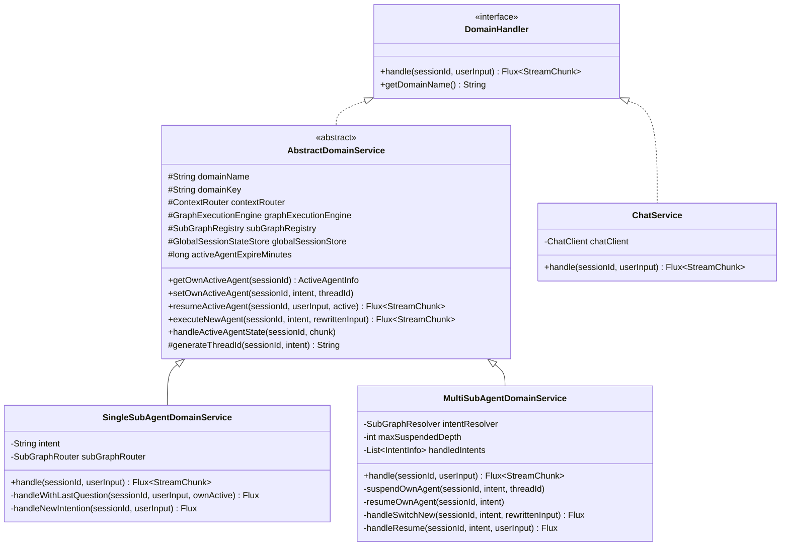

#### 2.2.3 Single域流程 (转账/账单)

```
handle(sessionId, userInput)
  │
  ├─ 有 activeAgent + lastQuestion?
  │   └─ YES → Phase1: ContextRouter判断FOLLOW/SWITCH
  │       ├─ FOLLOW → resumeActiveAgent → 直接恢复L2执行
  │       └─ SWITCH → Phase2: SubGraphRouter意图识别+改写
  │           ├─ belongsToDomain=false → REROUTE
  │           ├─ 意图匹配activeAgent → FOLLOW升级(resume)
  │           └─ 否则 → SWITCH (执行新agent)
  │
  ├─ 有 activeAgent (无lastQuestion)?
  │   └─ YES → 直接resumeActiveAgent (跳过ContextRouter)
  │
  └─ 无 activeAgent?
      └─ Phase1 + Phase2 → SWITCH (执行新agent)
```

#### 2.2.4 Multi域流程 (理财)

```
handle(sessionId, userInput)
  │
  └─ Phase1: ContextRouter → FOLLOW/SWITCH/RESUME
      │
      ├─ FOLLOW → resumeActiveAgent (当前活跃agent)
      │
      ├─ RESUME → 从suspendedAgents恢复
      │
      └─ SWITCH → SubGraphResolver.resolve()
          │
          ├─ 消歧中? → handleDisambiguationAnswer
          │   ├─ 用户取消 → CANCELLED
          │   ├─ 回答匹配候选意图 → RESOLVED
          │   └─ 仍模糊 → REJECTED
          │
          └─ 新意图 → resolveNewIntention
              ├─ Phase2 ambiguous + 低置信度 → DISAMBIGUATION
              ├─ Phase2 低置信度 + 意图属歧义组 → DISAMBIGUATION
              ├─ belongsToDomain=false → REROUTE
              ├─ 意图明确 → RESOLVED → executeRoute
              │   ├─ SWITCH → suspend当前 → executeNew
              │   └─ RESUME → resumeOwn → resumeGraph
              └─ UNKNOWN → REJECTED
```

### 2.3 L2 — 子Graph执行层

#### 2.3.1 概述

L2层是最底层的执行引擎，每个子Graph代表一个具体的银行业务操作。采用 **StateGraph 有状态多节点图** 的架构。

#### 2.3.2 四种子Graph一览

| Graph | 意图名 | 节点流程 | 特点 |
|-------|--------|----------|------|
| TransferGraph | TRANSFER | START→extractParams→paramRouter→askReceiver/askAmount→executeTransfer→END | 非流式, 2个ask节点 |
| BillQueryGraph | BILL_QUERY | START→extractParams→paramRouter→askTime→executeBillQuery→END | 非流式, 1个ask节点 |
| WealthConsultGraph | WEALTH_CONSULT | START→extractParams→paramRouter→askRiskLevel/askFocusArea→executeConsult→END | 非流式, 2个ask节点 |
| WealthInterpretGraph | WEALTH_INTERPRET | START→extractParams→paramRouter→askProductName→executeWealthInterpret→END | **流式Graph**, 1个ask节点 |

#### 2.3.3 通用Graph节点结构

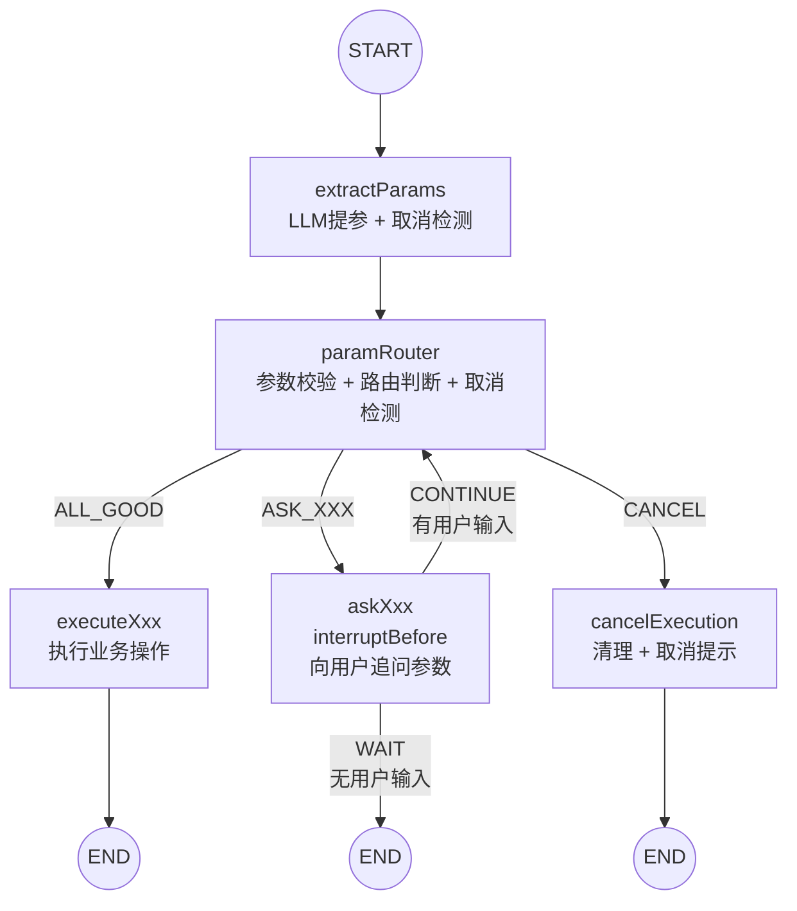

#### 2.3.4 AbstractGraphConfig 基类设计

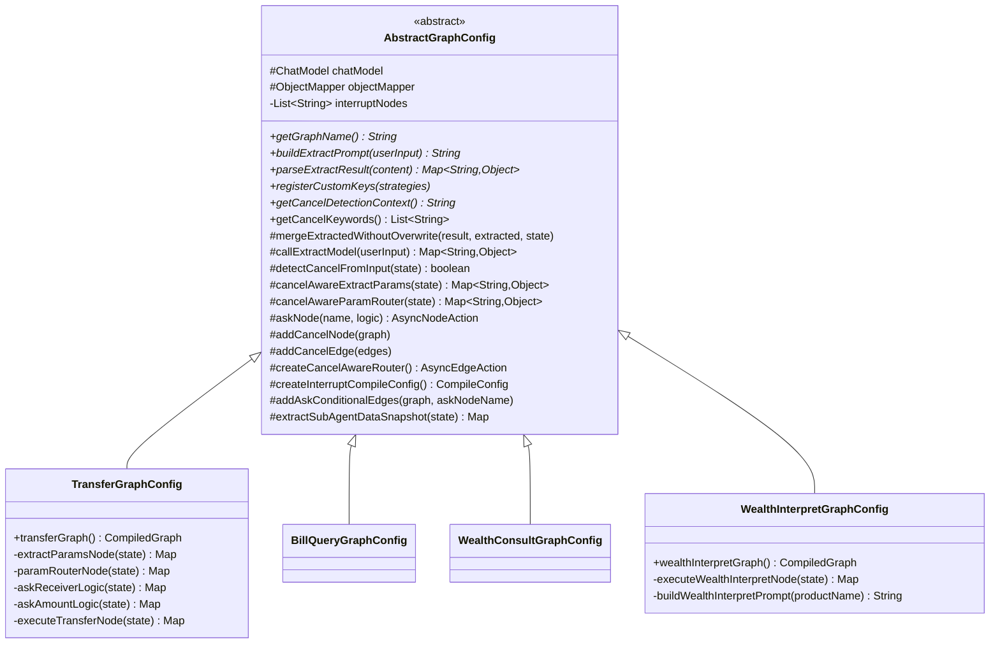

#### 2.3.5 关键设计点

1. **mergeExtractedWithoutOverwrite**: resume时防止LLM重新提取覆盖已有参数
2. **cancelAwareXxx 系列**: 所有节点自动注入取消检测, 子类无需关心
3. **askNode()**: 一站式完成 cancelAwareAsk + interruptBefore注册 + AsyncNodeAction转换
4. **createInterruptCompileConfig()**: 自动使用 askNode 收集的 interruptNodes
5. **双层取消检测**: 关键字匹配(0ms) → LLM判断(200-500ms)

---

## 3. 完整请求链路

### 3.1 完整时序图 (从API到SSE输出)

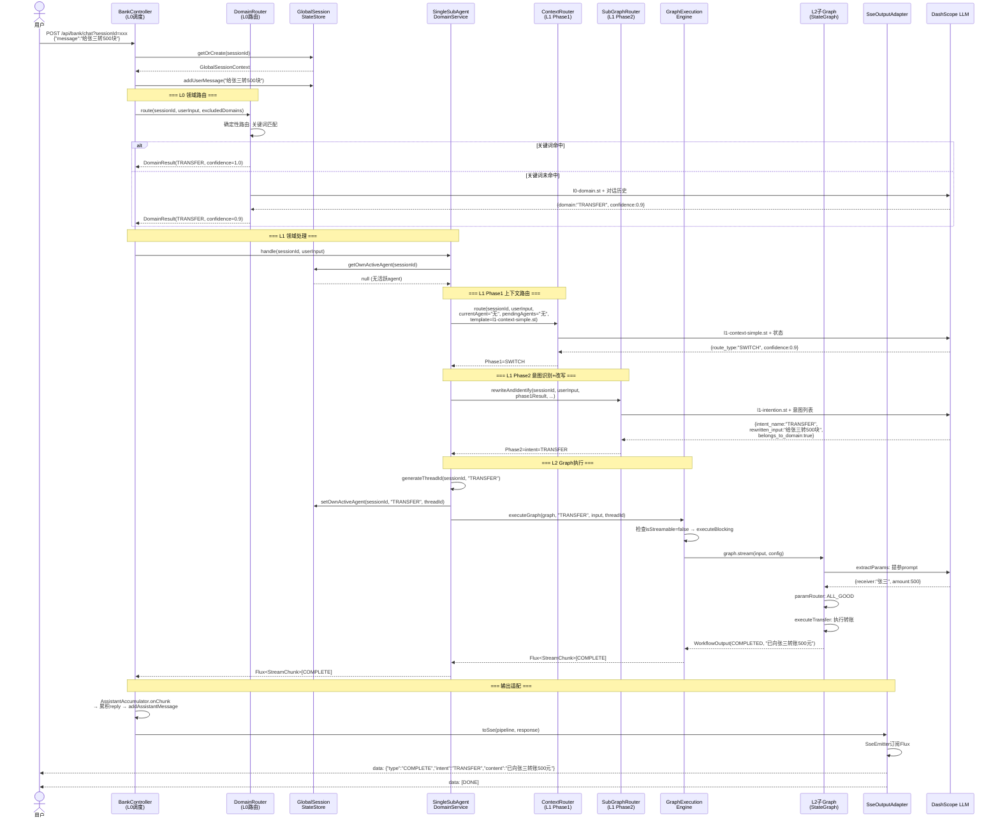

### 3.2 数据载体 — StreamChunk

`StreamChunk` 是 L0/L1/GES 之间的唯一数据载体，承载所有流式和非流式通信：

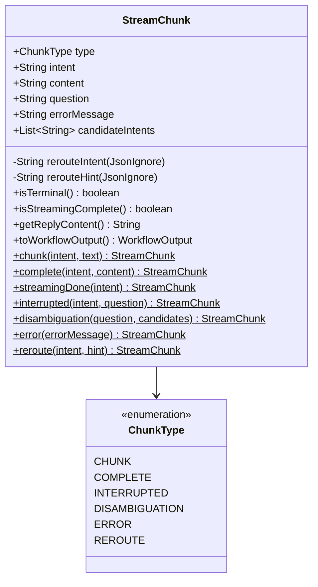

**Chunk类型语义**:

| ChunkType | 含义 | content | 终结? | 前端可见? |
|-----------|------|---------|--------|----------|
| CHUNK | 流式增量文本 | "根据"、"产品信息"... | ❌ | ✅ |
| COMPLETE | 操作完成 | 完整文本(非流式)/null(流式) | ✅ | ✅ |
| INTERRUPTED | 需追问参数 | null | ✅ | ✅ |
| DISAMBIGUATION | 意图消歧 | null | ✅ | ✅ |
| ERROR | 错误 | null | ✅ | ✅ |
| REROUTE | 重新路由 | @JsonIgnore | ❌ | ❌ (内部信号) |

---

## 4. Agent 路由决策体系

### 4.1 7种路由决策完整说明

| # | 路由类型 | 决策层 | 触发条件 | 行为 |
|---|----------|--------|----------|------|
| 1 | **确定性路由** | L0 | 用户输入包含领域关键词 | 0ms直接路由, 不调LLM |
| 2 | **LLM模型路由** | L0 | 关键词未命中或多领域冲突 | 调LLM判断, 200-500ms |
| 3 | **FOLLOW** | L1 Phase1 | 用户回答当前子Graph的追问 | 直接resume, 恢复L2执行 |
| 4 | **SWITCH** | L1 Phase1 | 用户提出新需求 | 挂起当前activeAgent, 新建L2执行 |
| 5 | **RESUME** | L1 Phase1 | 用户表达"继续/回到/切回" | 从suspendedAgents恢复执行 |
| 6 | **消歧 (DISAMBIGUATION)** | L1 Phase2 | 意图模糊(置信度低+属歧义组) | 追问用户, 1次回答后仍模糊→REJECTED |
| 7 | **REROUTE** | L0/L1 | L1判断意图不属于本域 | 排除当前域, 回到L0重新路由 |

### 4.2 L0路由决策流程

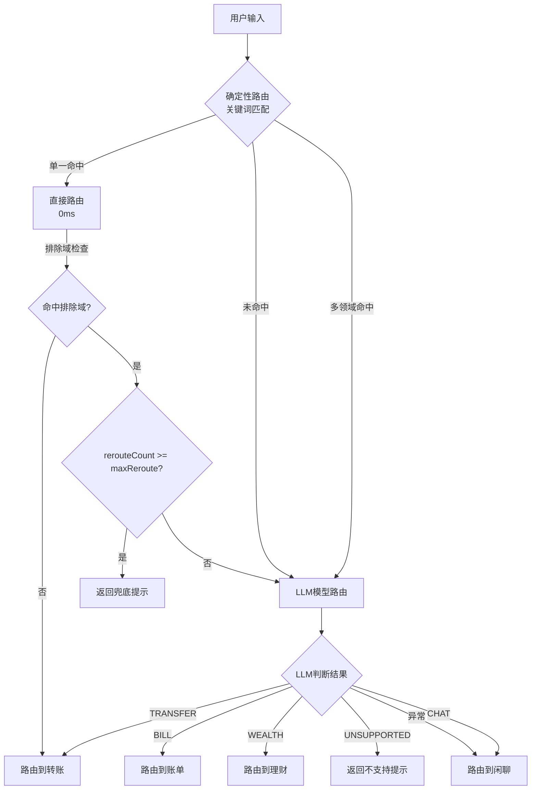

### 4.3 L1 Phase1 上下文路由决策 (ContextRouter)

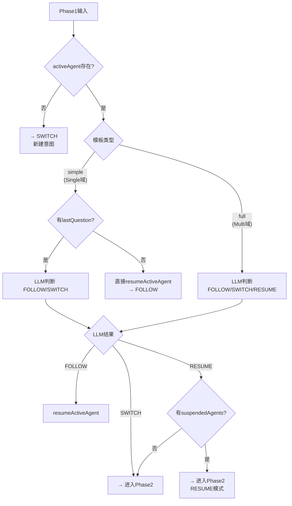

### 4.4 L1 Phase2 意图决议流程 (SubGraphResolver)

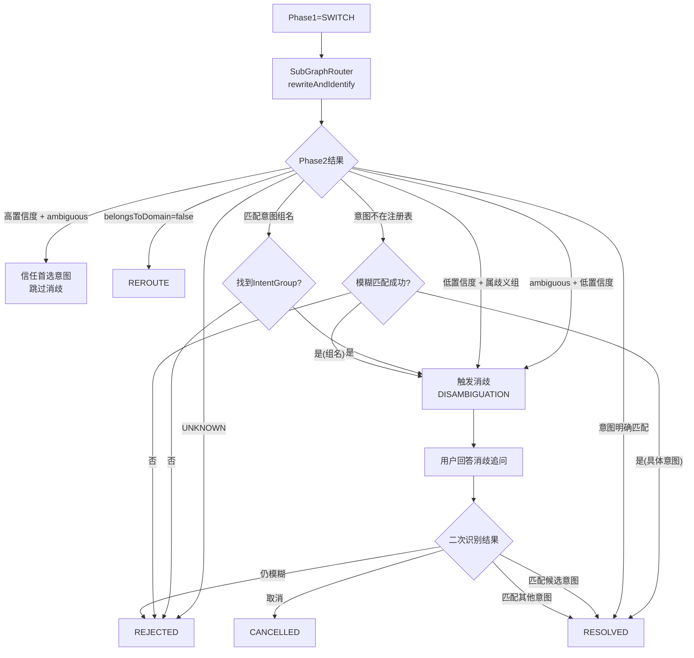

### 4.5 FOLLOW vs SWITCH vs RESUME 对比

| 维度 | FOLLOW | SWITCH | RESUME |
|------|--------|--------|--------|
| **语义** | 回答当前追问 | 开启新意图 | 恢复挂起任务 |
| **触发词** | 短回答/参数补充 | 新需求表达 | "继续"/"回到"/"还是" |
| **activeAgent** | 保持 | 挂起旧, 新建 | 从挂起恢复 |
| **threadId** | 复用旧 | 新建 | 复用旧 |
| **L2行为** | resumeGraph | executeGraph | resumeGraph |
| **Phase2** | 跳过(FOLLOW时) | 执行意图识别+改写 | 执行意图识别+改写 |
| **Prompt模板** | - | l1-intention.st | l1-intention.st |

---

## 5. 状态管理与存储

### 5.1 三层状态体系

```mermaid
graph TB
    subgraph "Session级 — GlobalSessionContext"
        OAS[OverAllState<br/>跨L2子图共享]
        MSG["messages (AppendStrategy)<br/>对话历史: [用户:... 助手:...]"]
        LD["_lastDomain (ReplaceStrategy)<br/>最近路由领域 + 过期时间"]
        TS["_transferState (ReplaceStrategy)<br/>DomainState: activeAgent"]
        BS["_billState (ReplaceStrategy)<br/>DomainState: activeAgent"]
        WS["_wealthState (ReplaceStrategy)<br/>DomainState: activeAgent + suspendedAgents + disambiguation"]
    end

    subgraph "域级 — DomainState"
        AA[ActiveAgentInfo<br/>intent / threadId / lastQuestion / 过期]
        SA[Map&lt;String,SuspendedInfo&gt;<br/>挂起的子图: intent→threadId+过期]
        DS2[DisambiguationState<br/>groupId — 消歧中意图组]
        SUB[Map&lt;String,SubAgentState&gt;<br/>L2子图数据快照(接口预留)]
    end

    subgraph "Graph级 — L2 OverAllState"
        LU["_latestUserInput (ReplaceStrategy)"]
        Q["_question (ReplaceStrategy)"]
        PN["_paramName (ReplaceStrategy)"]
        OC["_outputContent (ReplaceStrategy)"]
        CS2["_cancelSignal (ReplaceStrategy)"]
        GD["_globalStateData (ReplaceStrategy)<br/>Session级数据注入"]
    end

    OAS --> MSG
    OAS --> LD
    OAS --> TS
    OAS --> BS
    OAS --> WS
    WS --> AA
    WS --> SA
    WS --> DS2
    WS --> SUB
```

### 5.2 存储后端切换

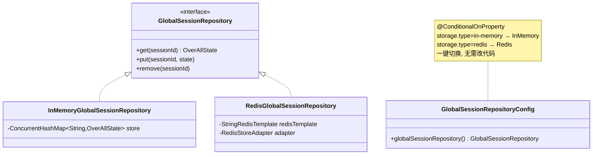

**配置方式** (`application.yml`):
```yaml
storage:
  type: in-memory   # 开发/测试环境
  # type: redis     # 生产环境 (需配置redis段)
```

### 5.3 双向数据流 L1↔L2

```
L1→L2: buildGraphInput() 将 GlobalSessionContext.data() 注入
  → input["_globalStateData"] = globalStateData
  → L2图通过 KeyStrategyFactory 白名单机制 "想用就用"

L2→L1: extractSubAgentDataSnapshot() 提取L2业务数据
  → 接口已预留, 当前返回空Map
  → 未来用于跨Graph状态共享
```

### 5.4 会话过期与清理机制

| 机制 | 配置项 | 默认值 | 行为 |
|------|--------|--------|------|
| activeAgent过期 | activeAgentExpireMinutes | 20分钟 | 过期后自动清除, 下次请求走SWITCH |
| suspendedAgent过期 | suspendedExpireMinutes | 20分钟 | 过期后惰性清理, RESUME降级为SWITCH |
| lastDomain过期 | last-domain.expire-minutes | 5分钟 | L0路由兜底时检查, 过期忽略 |
| 消息淘汰 | max-stored-pairs | 20对 | 超出后淘汰最早的对, 保留完整一问一答 |
| 挂起深度限制 | maxSuspendedDepth | 3/5 | 超出后淘汰最旧的挂起agent |

---

## 6. L2 子Graph执行机制

### 6.1 GraphExecutionEngine 双路径设计

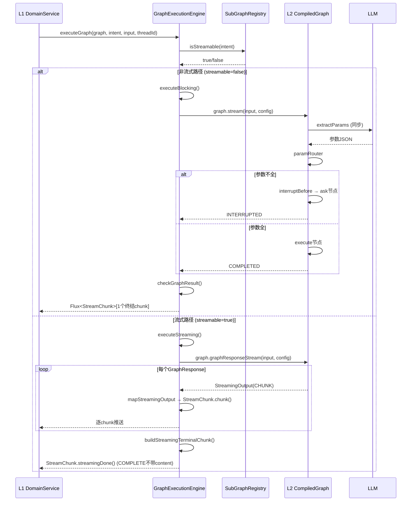

### 6.2 interruptBefore + Human-in-the-loop 机制

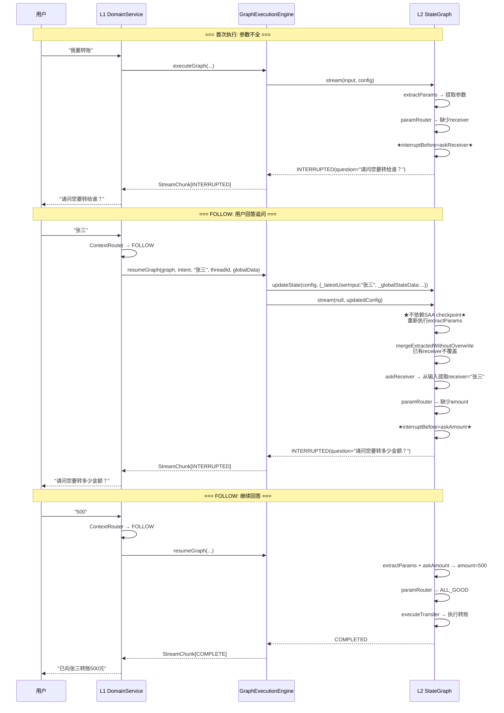

### 6.3 取消检测双层策略

```
用户输入 "算了"
  │
  ├─[第1层] 关键字匹配 (0ms)
  │   精确词匹配: 输入=="算了" 或 "算了。" 或 "算了，"
  │   领域关键词: "不转了"→TransferGraph, "不查了"→BillQueryGraph
  │   └─ 命中 → 直接返回true ✅
  │
  └─[第2层] LLM判断 (200-500ms)
      上下文注入: getCancelDetectionContext() → "正在向用户询问转账信息"
      LLM判断是否取消意图
      └─ 返回 {cancel: true/false}
```

### 6.4 mergeExtractedWithoutOverwrite — 防止参数覆盖

```
场景: 用户先回答"科技类"(关注领域), 后回答"科技蓝筹稳健债"(产品名)

resume执行时:
  extractParams 从新输入"科技蓝筹稳健债"提取参数
  LLM可能只返回 {productName:"科技蓝筹稳健债"} (focusArea为null)

mergeExtractedWithoutOverwrite:
  检查 state 中已有 focusArea="科技类" (非空)
  LLM返回 focusArea=null → 不覆盖 ✅
  检查 state 中已有 productName=null
  LLM返回 productName="科技蓝筹稳健债" → 写入 ✅
```

---

## 7. SSE 流式输出方案

### 7.1 双模式输出架构

```mermaid
flowchart TD
    BC[BankController.chat()] -->|"读取Accept头"| CHECK{Accept包含<br/>text/event-stream?}
    CHECK -->|"是 (SSE模式)"| SSE[SseOutputAdapter.toSse]
    CHECK -->|"否 (JSON模式)"| JSON[SseOutputAdapter.toJson]

    SSE -->|"SseEmitter"| SUB[subscribe Flux]
    SUB -->|"每个chunk"| EMIT["emitter.send(JSON(chunk))"]
    SUB -->|"onComplete"| DONE["emitter.send('[DONE]')<br/>emitter.complete()"]

    JSON -->|"过滤终结chunk"| LAST[".filter(isTerminal).last()"]
    LAST -->|"map toJson"| RESP[ResponseEntity&lt;WorkflowOutput&gt;]
```

### 7.2 完整SSE输出示例

**理财解读 (流式Graph)**:
```
Content-Type: text/event-stream
X-Accel-Buffering: no

data: {"type":"CHUNK","intent":"WEALTH_INTERPRET","content":"科技"}

data: {"type":"CHUNK","intent":"WEALTH_INTERPRET","content":"蓝筹"}

data: {"type":"CHUNK","intent":"WEALTH_INTERPRET","content":"稳健"}

data: {"type":"CHUNK","intent":"WEALTH_INTERPRET","content":"债是一"}

data: {"type":"CHUNK","intent":"WEALTH_INTERPRET","content":"款中低"}

data: {"type":"CHUNK","intent":"WEALTH_INTERPRET","content":"风险(R2)"}

data: {"type":"CHUNK","intent":"WEALTH_INTERPRET","content":"的混合"}

data: {"type":"CHUNK","intent":"WEALTH_INTERPRET","content":"型理财产品..."}

data: {"type":"COMPLETE","intent":"WEALTH_INTERPRET"}

data: [DONE]
```

**转账 (非流式)**:
```
data: {"type":"COMPLETE","intent":"TRANSFER","content":"已向张三转账500.00元（用途: 生日祝福）"}

data: [DONE]
```

**中断追问**:
```
data: {"type":"INTERRUPTED","intent":"WEALTH_CONSULT","question":"请问您能接受什么风险等级？（激进/稳健/保守）"}

data: [DONE]
```

**消歧追问**:
```
data: {"type":"DISAMBIGUATION","question":"请问您需要理财咨询还是理财产品解读？","candidateIntents":["WEALTH_CONSULT","WEALTH_INTERPRET"]}

data: [DONE]
```

### 7.3 AssistantAccumulator 消息写入机制

```
BankController.AssistantAccumulator 监听所有chunk:

onChunk(chunk):
  if chunk.type == CHUNK:
    accumulator.append(chunk.content)   // 累积增量文本
  if chunk.isTerminal() && chunk.type != REROUTE:
    fullReply = accumulator.toString()  // 拼接完整文本
      ?? chunk.getReplyContent()        // 或终结chunk自带内容(非流式)
    ctx.addAssistantMessage(fullReply)  // 写入GlobalSessionContext.messages
```

---

## 8. 关键配置速查表

### 8.1 LLM模型配置

| Bean名 | 用途 | 默认模型 | 配置前缀 |
|--------|------|----------|----------|
| `domainChatClient` | L0领域路由 | qwen-plus | `models.domain` |
| `contextChatClient` | L1 Phase1上下文路由 | qwen-plus | `models.context` |
| `intentChatClient` | L1 Phase2意图路由+改写 | qwen-plus | `models.intent` |
| `paramExtractChatClient` | L2参数提取 | qwen-plus | `models.param-extract` |
| `chatChatClient` | 闲聊 | qwen-turbo | `models.chat` |
| `wealthInterpretChatClient` | 理财解读(流式) | qwen-plus | `models.wealth-interpret` |

### 8.2 路由配置

| 配置路径 | 默认值 | 说明 |
|----------|--------|------|
| `routing.reroute.max-attempts` | 2 | REROUTE最大重试次数 |
| `routing.confidence.disambiguation-threshold` | 0.7 | 消歧触发阈值 |
| `routing.confidence.high-confidence-bypass` | 0.85 | 高置信度豁免阈值 |
| `routing.history.l0-max-pairs` | 10 | L0使用的对话对数 |
| `routing.history.l1-max-pairs` | 10 | L1使用的对话对数 |
| `routing.history.max-stored-pairs` | 20 | 最大存储对话对数 |

### 8.3 会话配置

| 配置路径 | 默认值 | 说明 |
|----------|--------|------|
| `session.pending-agents.max-depth` | 5 | 单域最大挂起Agent数 |
| `session.pending-agents.expire-minutes` | 5 | 挂起Agent过期时间 |
| `session.last-domain.expire-minutes` | 5 | 最近领域过期时间 |

### 8.4 存储配置

| 配置路径 | 可选值 | 说明 |
|----------|--------|------|
| `storage.type` | `in-memory` / `redis` | Session状态存储类型 |
| `memory.store.type` | `in-memory` / `redis` | 长期记忆存储类型(独立配置) |

### 8.5 新增业务领域指南

只需修改 `application.yml`，无需写 Java 代码：

**步骤1**: 在 `routing.intents` 添加意图配置
```yaml
routing:
  intents:
    - name: NEW_INTENT
      description: "新业务描述"
      param-schema: "参数1, 参数2"
      is-write-op: false
      intent-type: QUERY
      scope: "新业务处理范围描述"
```

**步骤2**: 在 `routing.domains` 添加领域关键词
```yaml
routing:
  domains:
    NEW_DOMAIN:
      keywords: ["关键词1", "关键词2"]
```

**步骤3** (可选): 在 `routing.intent-groups` 添加消歧组
```yaml
routing:
  intent-groups:
    - group-id: NEW_GROUP
      display-name: "新组显示名"
      intent-names: [INTENT_A, INTENT_B]
      disambiguation-question: "请问您需要A还是B？"
```

**步骤4**: 编写对应的GraphConfig类(extends AbstractGraphConfig)，在@Bean中调用 `subGraphRegistry.bindGraph("NEW_INTENT", compiled)` 自注册。

---

## 9. 已知局限与改进方向

### 9.1 当前局限

| # | 局限 | 影响 | 严重程度 |
|---|------|------|----------|
| 1 | **L2→L1数据回写未集成** | extractSubAgentDataSnapshot 接口预留但返回空Map，跨Graph状态共享未实现 | 中 |
| 2 | **无鉴权机制** | API直接暴露，缺少用户身份验证和会话绑定保护 | 高 |
| 3 | **LLM调用无重试** | 单次LLM调用失败直接降级或抛异常，无自动重试 | 中 |
| 4 | **Mock银行服务** | 所有业务操作（转账/账单/理财）均为Mock实现，无真实后端对接 | 高 |
| 5 | **无持久化对话历史** | InMemory模式重启即丢失所有会话状态 | 中 |
| 6 | **流式Graph数量有限** | 仅WEALTH_INTERPRET支持流式，其他三个Graph为非流式 | 低 |
| 7 | **消歧仅1次追问** | 用户回答仍模糊时直接REJECTED，用户体验可优化 | 低 |
| 8 | **无前端实现** | 后端API完整但缺少前端SSE消费实现 | 中 |

### 9.2 改进方向

#### 短期（1-2周）

1. **L2→L1数据回写实现**: 在GES中集成extractSubAgentDataSnapshot，中断/完成时将L2业务数据写回GlobalSessionContext
2. **LLM重试机制**: 在DomainRouter/ContextRouter/SubGraphRouter中增加指数退避重试
3. **鉴权集成**: 添加Spring Security + JWT，实现sessionId与用户身份绑定

#### 中期（1-2月）

4. **真实银行后端对接**: 替换MockBankingService，对接真实银行核心系统
5. **Redis生产化**: 完善Redis集群配置、哨兵模式、连接池管理
6. **前端Web应用**: 基于React/Vue构建SSE消费前端，实现完整用户交互
7. **Prompt版本管理**: 将.st文件纳入版本管理，支持A/B测试和热更新

#### 长期（3-6月）

8. **更多流式Graph**: 将其他三个Graph迁移到流式模式，提升用户体验
9. **多轮消歧**: 支持2-3轮追问，提高意图识别准确率
10. **Graph编排引擎**: 支持多L2子Graph串行/并行组合执行
11. **A/B路由**: 支持同一领域多个Graph版本，按比例分流
12. **全链路追踪**: 集成OpenTelemetry，实现L0→L1→L2全链路分布式追踪

---

> **文档生成说明**: 本文档基于对 `mobile-ai-bank-demo` 项目全部源码的深度分析生成，所有类名、方法名、配置项均与代码一致。Mermaid图表可直接在支持Mermaid的Markdown渲染器中查看。
