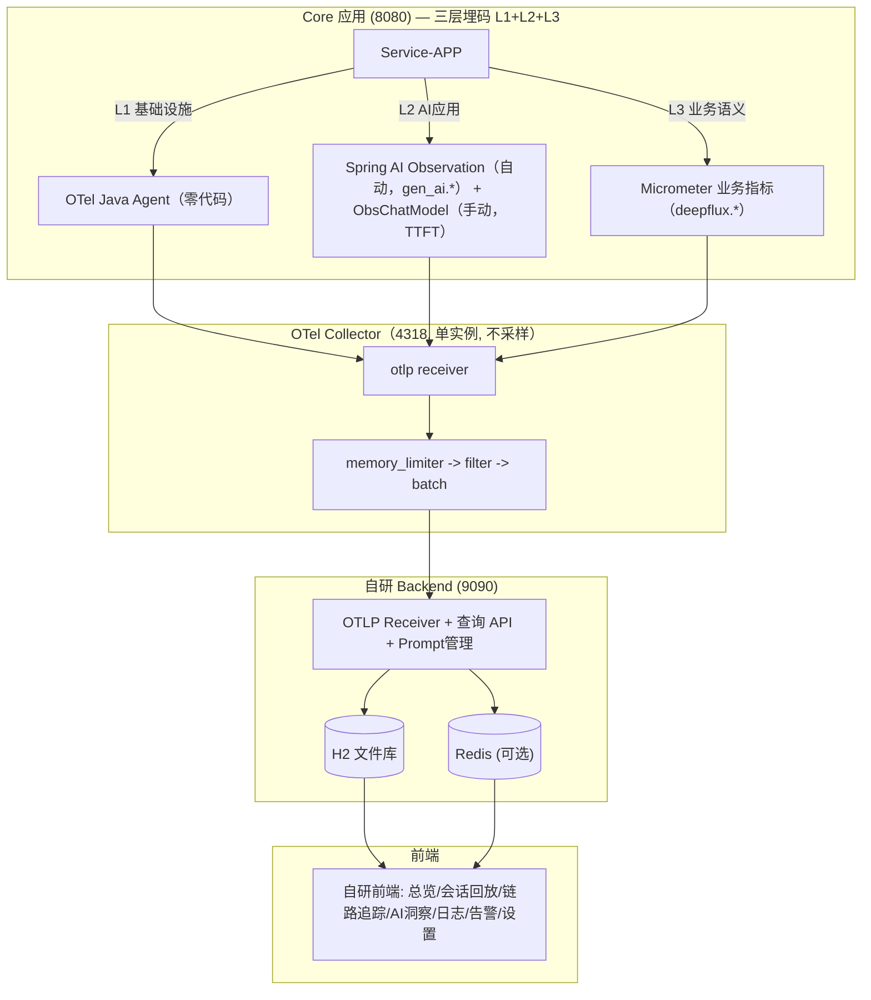
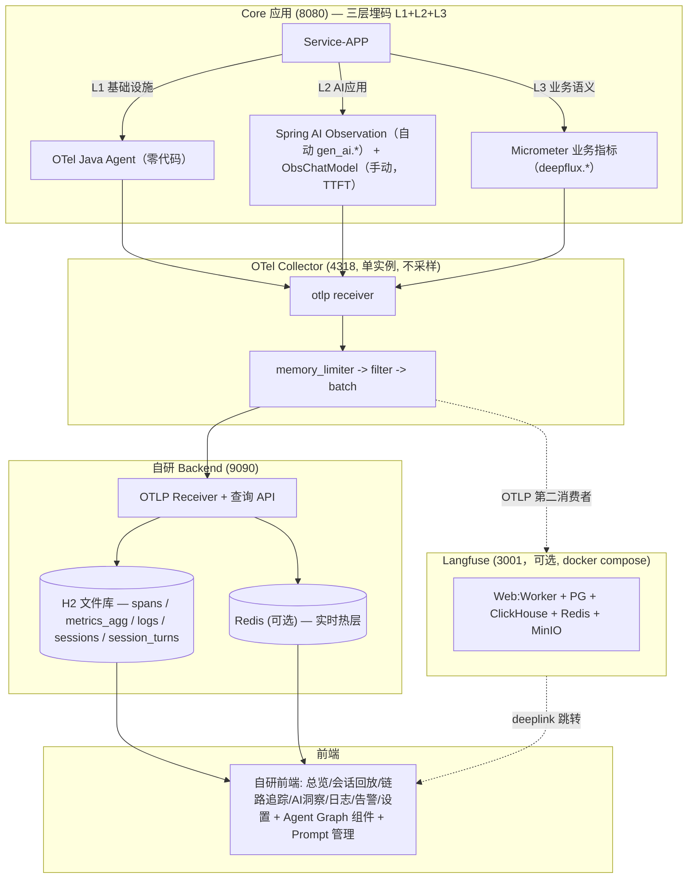
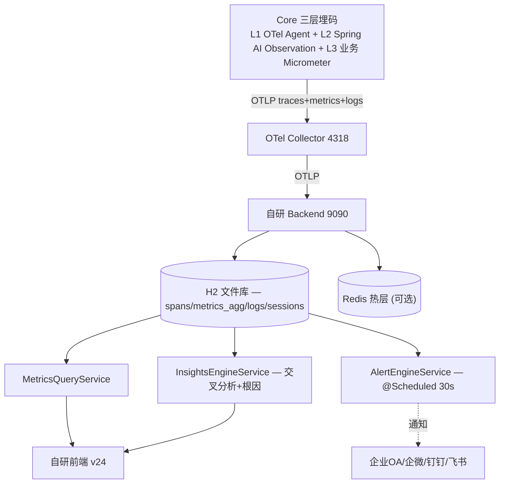

# 可观测优化总结（0711 · WorkBuddy V4 · → **0728 银行国产版·全文刷新**）

> **融合路径**：WorkBuddy V2 + Codex V2 → WorkBuddy V3 + Codex V3 → V4 → **web文章合入** → **0718 刷新** → **0728 银行国产场景全文刷新**
> **0728 刷新要点（本次）**：
>   - **§1 组件选型** 改为三套 Demo 方案（A极简 H2 / B推荐 H2+Langfuse / C完整 PG+Langfuse），方案 B 为推荐，10 分钟本机启动
>   - **§2 目标架构** 更新为 H2 统一存储 + 可选 Langfuse docker compose 架构
>   - **§3 落地步骤** 替换为可直接执行的 7 步流程（Maven→yml→Agent→Collector→Langfuse→Backend→前端）
>   - **§12 UI 设计** 刷新引用为 V24 设计稿《可观测DEMO-v24-WorkBuddy.html》
>   - **新增 §19 0728 补充方案**：三种 Java 插桩场景（纯OTel / SAI+OTel / Boot+OTel）、Langfuse 依赖澄清、ObsChatModel 与 Micrometer 关系说明
>   - **其余章节（§0, §4~§11, §13~§18）全部保留 0727 原文不动**。这些是设计基准、BUG 记录、开发过程文档，具有长期参考价值
>
> 适用范围：移动 AI 银行 **本机通用 Demo**（Core 8080 → OTel Collector 4318 → Backend 9090 / H2 + [可选] Langfuse docker compose → React 前端 v24）
> Demo 定位：不绑特定银行，10 分钟本机启动的 AI 可观测通用演示系统
> 合并依据：`docs/可观测设计方案差异分析-WorkBuddy-V3版本比较.md`
> 外部文章依据：`docs/外部参考文章与自有方案对比分析.md`
> 整改明细：`docs/代码审阅整改总结-2026-07-18.md`
> 指标审计：`docs/指标GAP分析-v2.md`
> 调研参考：`银行可观测落地 FAQ.md` + `可观测架构业界调研与重构建议-GLM5.2-0726.md` + `银行可观测落地细化方案-SpringAI1.1.2-Boot3.4.3-OceanBase.md`
> 生产完整版：`可观测优化总结-WorkBuddy-V6-生产上线版-银行国产-0728.md`
> 设计稿（前端）：`observability/frontend/可观测DEMO-v24-WorkBuddy.html`（**V24 最新设计稿**）
> Demo 组件选型：**H2 文件库（本体）+ OTel Collector（采集）+ 自研 Backend（查询）+ 可选 Langfuse docker compose（LLM 工程演示）**

---

## 前置说明：web文章合入范围（15 篇外部文章 → V4 Demo 级筛选）

> **原则**：外部文章观点 **90% 影响生产环境（V6），对 V4 Demo 骨架无冲击**。本文只合入以下"Demo 阶段可轻松采纳、不改架构、不新增组件"的观点，**剩余生产级观点（Kafka / Exemplar / 动态基线 / DaemonSet / 银行 Tier SLO 等）全部留 V6**。

| 合入观点 | 来源 | 落地位置 | 改动量 |
|---|---|---|---|
| **集中式指标注册表**（Metrics 结构体 + `deepflux.<domain>.<measure>` 命名） | A1 / P6 | §5 埋点强制约定 | 加一段约定 |
| **UpDownCounter 待审批数** | A1 / P7 | §5 埋点总览 + §6 指标全表 | 加 1 行指标 |
| **GenAI 语义版本钉注**（pin OpenLLMetry 版本） | A2 / P8 | §5.3 强制约定 | 加 1 条脚注 |
| **AI 洞察引擎"三层边界"治理**（确定性→代码 / 模糊判断→AI / 写操作→审计） | N9 / P13 | §9 InsightsEngine | 加边界声明 |
| **提示词即 Runbook**（prompt 版本化/评审/测试） | N9 / P20 | §9 InsightsEngine | 加 1 小节 |
| **AI 洞察准确率量化参考**（GuideLLM / BERTScore / ROUGE） | N14 | §9 准确率评估 | 加 1 行参考值 |
| **外部理念互证**（USE / L1-L3 仪表盘 / 一图一事 / 地基先行） | N6 / N8 | §14 附录 | 加引用段 |

> **不动**：组件选型、目标架构、分阶段计划、Collector config、Redis 设计——全部保持 V4 原样。

---

## 0. 如何使用本文 & 模块分类原则

### 0.1 阅读路径

1. **决策者**：§1 模块分类 → §2 组件选型 → §3 目标架构 → §4 阶段计划。
2. **后端开发**：§5 数据流 → §6 Core 埋点 → §7 指标全表 → §8 DB 表 → §9 Redis → §10 AI 引擎 → §11 告警。
3. **前端开发**：§13 UI 设计（V20）。
4. **运维/SRE**：§12 Collector 配置 → §14 实施路径 → §15 整改汇总。

### 0.2 A/B/C/D/E 模块分类（来自 Codex V2）

| 模块 | 名称 | 策略 | 说明 |
|------|------|------|------|
| **A** | 基础指标 (Infra) | P2 交给 Grafana | JVM/HTTP/DB 等标准指标，不自建专用页 |
| **B** | AI 模型层 (LLM 性能) | ✅ 自建主战场 | Token/TTFT/TPOT/LLM 错误率 |
| **C** | AI 业务语义层 | ✅ 自建主战场 | 意图准确率/路由决策/漏斗/满意度 |
| **D** | 平台自观测 | MVP 不做 | 后端自身健康，延后到阶段三 |
| **E** | 维度规范 | ✅ 贯穿全程 | Metric Tag 基数预算，高基数字段归 Trace/Log |

**核心决策**：
- **P0**：H2 保留，聚焦修复 B+C 类 GAP + 增强洞察引擎 + 告警闭环。**不引入新组件**。
- **P1**：增强 Collector processors（零新组件，只改配置）+ AI 洞察引擎 + 告警触达。
- **P2**：H2 → PostgreSQL 迁移 + 引入标准栈（Tempo/VM/Loki/Grafana）做 A 类指标信号外溢。

---

## 1. Demo 组件选型（三套方案）

> 0728 刷新：本节替换原 V4 的 Alloy+Tempo+VM+Loki 五件套方案。Demo 定位为本机通用演示系统，不需要生产级存储组件。

### 1.1 三套方案对比

| | 方案 A：极简（推荐）⭐ | 方案 B：LLM 工程增强 | 方案 C：完整 |
|---|---|---|---|
| **定位** | 快速 POC，核心链路完整 | +Prompt管理/评估/实验 | 最接近生产环境 |
| **DB** | H2 文件库（嵌入式，零配置） | H2 + Langfuse 容器内 PG+ClickHouse | PostgreSQL 外部安装 |
| **Langfuse（LLM 工程）** | ❌ | ✅ docker compose | ✅ 生产模式 |
| **OTel Java Agent** | ✅ | ✅ | ✅ |
| **OTel Collector** | ✅ | ✅ | ✅ |
| **自研 Backend** | H2 版 | H2 + OTLP → Langfuse | PG 版 |
| **自研前端** | v24 7页 | v24 7页 | v24 7页 |
| **外部依赖** | 无 | Docker | Docker + PostgreSQL |
| **启动耗时** | <5 分钟 | <10 分钟 | <20 分钟 |

### 1.2 组件选型说明

| 信号 | 方案 A（推荐）⭐ | 方案 A | 方案 C |
|---|---|---|---|
| **采集** | OTel Java Agent + OTel Collector（单实例） | 同 | 同 |
| **Trace 存储** | H2 spans 表 + 自研查询 API | 同 | PostgreSQL spans 表 |
| **Metrics 存储** | H2 metrics_agg 表 | 同 | PostgreSQL metrics_agg 表 |
| **Log 存储** | H2 logs 表 | 同 | PostgreSQL logs 表 |
| **Session 存储** | H2 sessions + session_turns 表 | 同 | PostgreSQL |
| **LLM 工程** | Langfuse docker compose（容器内 PG+CH+Redis+MinIO） | 自研 prompt_versions 表 | Langfuse 自托管 |
| **看板/告警** | 自研前端 v24 + 可选 Grafana | 自研前端 | Grafana |
| **关系库** | H2（足够 Demo 量级） | H2 | PostgreSQL |

> **VM/Tempo/Loki 在 Demo 中不引入**：这些是生产级专用存储组件。Demo 用 H2 嵌入式文件库零配置启动。在 V6 生产方案中，VM/Tempo/Loki 作为方案 A（全栈标准版）核心组件保留。

### 1.3 为什么方案 A 不选 Langfuse

> **Langfuse 是可选增强，不是必须**。以下四点说明：

1. **会话回放 + 普通 Trace 排查**：Langfuse 完全可选，自研 H2 + 前端就能全覆盖
2. **Agent Graph 流程图**：不是必须 Langfuse，自研前后端可完整实现，底层复用同一套 OTel Span 数据，无技术壁垒
3. **方案 B 引入 Langfuse 的核心价值**：不是「看链路图」，而是补齐 Prompt 管理、LLM 自动评估、成本分析、实验数据集等 AI 工程能力；如果项目不需要 AI 迭代闭环，完全可以去掉 Langfuse，仅保留自研观测平台
4. **成本取舍**：
   - 去掉 Langfuse：少一套容器集群，架构极简，但需要少量前后端开发 Graph 绘图组件
   - 保留 Langfuse：无需开发 Graph / 评估 / Prompt 功能，但增加存储、运维、评审成本

> 方案 B（Langfuse docker compose）作为可选增强保留，详见 §19。

---

## 2. 系统目标架构（0728 Demo 版）

### 2.1 方案 A 目标架构（推荐版）⭐



### 2.2 方案 B 目标架构（LLM 工程增强版）



### 2.3 架构设计决策

| # | 决策 | 理由 |
|---|---|---|
| D1 | Demo 用 H2 嵌入式文件库 | 零配置，10 分钟启动 |
| D2 | 不引入 VM/Tempo/Loki | 生产级专用存储，Demo 不需要。V6 方案A中保留 |
| D3 | 方案 B（可选）Langfuse docker compose | 容器内全自动，零外部依赖 |
| D4 | 自研前端 v24 主入口 | 7 页 + AI 洞察 7 TAB，Grafana 可选 |
| D5 | OTel Collector 单实例不采样 | Demo 全量采集 |
| D6 | 三层埋码互补 | L1(Agent)+L2(SAI Observation)+L3(业务手工) |

### 2.4 组件对接关系

- **Core -> Collector**：OTLP HTTP `:4318`，三信号（traces + metrics + logs）
- **Collector -> Backend**：OTLP HTTP `:9090/v1`，所有遥测写入 H2
- **Collector -> Langfuse（可选）**：OTLP HTTP `:3001`，trace 第二消费者
- **Backend -> 前端**：REST API，H2 查 spans/sessions/metrics_agg/logs
- **Langfuse -> 前端（可选）**：deeplink 跳转

### 2.5 Demo 与生产差异

| 维度 | Demo (方案A) | 生产 (V6方案A) |
|---|---|---|
| 存储 | H2 嵌入式 | Tempo + VM + Loki + 信创DB |
| LLM 工程 | Langfuse docker compose | MLflow + 自研 |
| Collector | 单实例，不采样 | 集群，tail_sampling |
| Kafka | 不需要 | 按需 |
| 前端 | 自研 v24 | 自研 + Grafana |

## 3. Demo 落地步骤（方案 A 推荐版）

> 方案 B 是推荐方案，10 分钟本机启动。方案 A 去掉 Langfuse 步骤即可。

| 步骤 | 内容 | 预计耗时 |
|---|---|---|
| 1 | Maven 依赖（micrometer-registry-otlp + tracing-bridge-otel） | 1 分钟 |
| 2 | application.yml 配置（management.otlp + spring.ai.chat.observations） | 1 分钟 |
| 3 | OTel Java Agent 挂载启动 Core | 1 分钟 |
| 4 | OTel Collector 配置与启动 | 2 分钟 |
| 5 | [可选] Langfuse docker compose up -d | 3-5 分钟（首次 pull 镜像） |
| 6 | Backend (H2) 启动 | 1 分钟 |
| 7 | 前端 (Vite+React) 启动 | 1 分钟 |

完整的 Maven/yml/Agent/Collector/DDL 配置见 §4~§11，落地步骤代码见 §19 引用。

### 3.1 方案 A（极简）与方案 B 差异

方案 A 跳过步骤 5（Langfuse），Collector 配置去掉 `otlphttp/langfuse` exporter。其余完全相同。

### 3.2 验证标准

| 验证项 | 通过标准 |
|---|---|
| OTel Agent span | H2 spans 表有 http.server.* / db.client.* span |
| Spring AI 指标 | /actuator/metrics 有 gen_ai.client.operation.duration |
| ObsChatModel TTFT | session_turns.ttft_ms 有值，非 0 |
| 会话回放 | 前端会话回放页显示用户输入+AI回复+Graph详情 |
| 链路追踪 | 前端 trace 瀑布图可见 |
| Langfuse（方案B） | Langfuse UI trace 列表有数据 |

---

## 4. 端到端数据流设计（5 条信号：Metrics / Trace / Logs / Session / Alerts）

### 4.1 总体数据流



> **Session 数据埋点方案（0728 修正）**：session.id 通过 OTel Baggage 注入到所有 Span attribute，随 trace 管道统一传输（不再走独立的 SessionBridge HTTP POST 私路）。Demo 期 trace 采样率 100%，session 数据自然 100% 捕获。生产环境对业务 trace 设 100% 采样策略。OTLP Log 方案经业界调研已排除（Langfuse/Spring AI/OTel 均未推荐，业界零先例）。详见 §4.5。

### 4.2 Trace 链路追踪

```
Core ObsChatModel.startBusinessSpan()
  └─ spanName = "<layer>:<model>" 例: "L0:qwen-plus" / "L1-LLM2:qwen-plus" / "L2:qwen-plus"
  └─ attributes: agent.name / model.name / agent.layer / intent / session_id / user_id
                 + ai.io.prompt / ai.io.response / ai.token.input / ai.token.output
                 + llm.confidence ★P0 已闭环(0718)
                 + intent.L0/L1/L2.predicted/actual ★P0 已闭环(0718)
  └─ held-span: 调用方 commitIntent 后回填 intent 并 end
        ↓ OTel Java Agent 自动导出
OTel Collector (4318) → [batch → filter(健康检查) → tail_sampling(错误/慢>1s/LLM失败)] → otlphttp exporter
        ↓ POST /v1/traces
Backend OtlpParserService.parseTraces()
  └─ 写 SpanEntity(trace_id, span_id, parent_span_id, service, op_name, kind,
                    start, end, duration_ms, status, attributes JSON)
  └─ pushRecentTrace → Redis obs:traces:recent (LPUSH+LTRIM 100)
        ↓
TraceQueryService.listTracesPaginated()  【已重写：按 trace_id 去重枚举】
  └─ 跳过无业务 span 的 trace（仅 OTLP 导出自 trace 噪声被排除）
  └─ 聚合 TraceListVO: timestamp / durationMs / status / sessionId / intent / userId
        / agentChain / intentChain / TTFT / tokenTotal / ★confidence / ★l0Intent / ★l1Intent
```

- **Agents 链显示规则**（R26 修复）：按 L0 边界切段 → 每段 `L0 → L1(合并) → <业务名 WEALTH/TRANSFER/BILL>`；reroute 则为 `L0→L1→WEALTH → L0→L1→TRANSFER`。
- **意图链**：四层真实识别结果，**不再回退** session 整条 intentFlow。

> **★ V4 Web 版补正（2026-07-14）— 确定性路由也产生 L0 span**（**方案A**，待定项 A 结论，0718 刷新为已实施）：
> `DomainRouter.route()` 有两条分支——①确定性路由（关键词命中，如"转账"→TRANSFER/"账单"→BILL/"理财·基金"→WEALTH，**不调 LLM**）直接返回；②LLM 兜底路由（无关键词或多域命中）才调 `domainChatClient`。旧实现仅分支②经 `ObsChatModel` 创建 L0 span，导致 L0 计数 < 请求数、L2≤L0 不恒成立。现分支①在提前返回前也显式经 `GlobalOpenTelemetry.getTracer("obs-chat-model")` 创建 `L0:DomainRouter` span（`agent.layer=L0`、`intent=命中域`、`routing.mode=deterministic`、立即 end，parent 自动取当前 server span，**绝不 makeCurrent 以免 traceId 跨请求泄漏**）。改后 L0 覆盖全部经 DomainRouter 的请求（≈ requestCount），L0 ≥ L1 ≥ L2 恒成立；确定性 L0 与 LLM L0（`L0:qwen-plus`）在 trace 瀑布中并列于 L0 层，前端按 `layer` 缩进渲染一致。详见《指标GAP分析-v2.md》§8.18。运行时验证（清库+seed 36）：l0Call=36 / l1Call=36 / l2Call=12，distinctOpNames 含 `L0:DomainRouter`，**L0=L1=请求数，L2≤L0 完全闭环**。

### 4.3 Metrics 指标

```
Core Micrometer 指标（ObsChatModel.buildTimer / ObservabilityMetrics）
  ├─ llm.token.input/output              Counter   (tags: model, agent.level, agent.name, intent)
  ├─ llm.first_token.latency             Histogram ← 必须 publishPercentileHistogram(true)
  │                                                     否则导出 Summary 后端解析不到 → 分位恒0
  ├─ llm.operation.duration              Histogram
  ├─ llm.error.count                     Counter   (tag: model, error_type)
  ├─ agent.intent.accuracy               Counter   ★P0: +layer tag (L0/L1) — 0718 已闭环
  ├─ agent.reroute.count                 Counter   ★P0: +reroute_reason tag — 0718 已闭环
  ├─ agent.business.outcome              Counter   (tag: outcome=success/fail)
  └─ llm.confidence                      Gauge     ★P0 新增 — 0718 已闭环(T27)
        ↓ OTLP /v1/metrics (step=60s)
Backend OtlpParserService.parseMetrics()  【只解析 Histogram / Sum / Gauge，不解析 Summary】
  ├─ Histogram → Redis latency:{1m/5m/15m} ZSET + ttft:1m ZSET；落 H2 metrics_agg
  ├─ Sum(Counter) → Redis request_count / error_count / token_* / intent_distribution；落 H2
  └─ Gauge → Redis active_sessions / llm.confidence；落 H2
        ↓ 每30s
RedisH2SyncService → H2 redis_metrics_snapshot（热窗口持久化，Redis 重启不丢）
        ↓ 查询
MetricsQueryService.getRealtime()  Redis-first，空则回退 H2/PG
```

> ⚠️ **致命坑**：`Timer.publishPercentiles(...)` 导出为 **Summary**，后端不解析 → TTFT P50/P95 恒为 0。必须用 `publishPercentileHistogram(true)`。

### 4.4 Logs 日志

```
Core / Backend 日志（含 logback MDC: trace_id / span_id / session_id）
        ↓ Logback OTLP Appender → Collector → otlphttp exporter
Backend OtlpParserService.parseLogs()
  └─ 写 LogEntity(trace_id, span_id, level, service, message, attributes)
  └─ pushRecentLog → Redis obs:logs:recent (LTRIM 1000)
        ↓
前端日志查询页：每行支持「三件套」跳转（trace.id→链路详情、session.id→会话回放）
        ↓ P2 增强
core.log/backend.log 经 Vector 采集 → Loki → Grafana 统一检索，
从「错误率 spike」一键下钻到「慢 trace」再跳「该 trace 的 log」。
```

### 4.5 Session 会话数据采集：方案对比与选型

> **0728 下午二次修订**：经业界深度调研（Langfuse 官方 OTLP 集成文档、Spring AI 1.1 官方文档、Spring AI Alibaba Graph 观测实践、trpc-agent-go 框架、akjamie 博客实战），对原方案做三项重大修正：
> 1. **OTLP Log 方案排除**：Langfuse 官方明确推荐 OTLP **traces** 端点 + Baggage 传播 session.id，不用 OTLP Log；业界零先例。
> 2. **SessionBridge 降级**：项目自创方案，无业界先例，代码侵入高、可维护性差、银行交流易受质疑。降级为"过渡期已有实现"，不推荐新项目使用。
> 3. **新增 Graph 原生观测 + TTFT 版本调研结论**：Spring AI Alibaba Graph 模块自带 Graph/Node/Edge 三级观测；TTFT 方面，`gen_ai.client.operation.time_to_first_chunk` 是 OTel GenAI 语义约定标准指标（PR #3113），但 **Spring AI 1.1（含 1.1.2）官方未实现**——仅有 4 个 base metric，无 TTFT。ObsChatModel 补 TTFT 仍然必要。

#### 方案总览

| | S1 SessionBridge | S2 OTLP Log | S3 ObservationConvention | S4 OTel Baggage ⭐ | S5 Advisor | S6 Graph 原生观测 ⭐ | S7 SpanProcessor |
|---|---|---|---|---|---|---|---|
| **来源** | 项目自创 | V6 曾推荐 | Spring AI 标准 | OTel 官方标准 | Spring AI 标准 | SAA 标准 | OTel 标准 |
| **session.id 位置** | HTTP 请求体 | 日志字段 | Span attribute | Span attribute（Baggage 自动传播） | Span attribute（Advisor 观测点） | Span attribute（Graph 节点观测） | Span attribute（全局注入） |
| **采样影响** | 独立 100% | 独立 100% | 受 trace 采样 | 受 trace 采样 | 受 trace 采样 | 受 trace 采样 | 受 trace 采样 |
| **业界采用** | ❌ 项目独有 | ❌ 零先例 | Spring AI 社区 | Langfuse/trpc/akjamie | Spring AI 官方 | SAA 官方 | trpc-agent-go |
| **代码侵入** | 高 | 中 | 低 | 极低（3 行） | 低（配置） | 零（框架自动） | 低 |
| **跨服务透传** | ❌ | ✅ | ⚠️ 需桥接 | ✅ 原生 | ❌ 仅 Spring AI 内 | ❌ 仅 Graph 内 | ✅ |

#### 核心裁决：回应三个关键质疑

**质疑 1："为什么要 100% 捕获？业界标准为何没关注？"**

> **结论：业界标准不把"100% session 捕获"当独立需求，因为 LLM 应用 trace 采样率本应设为 100%。**

- LLM 调用频率远低于普通 HTTP 请求（一个用户一次对话可能只有 1-3 次 LLM 调用），全量采样的成本完全可接受
- session 是 trace 的**聚合维度**（按 session.id 聚合多个 trace 形成 session 视图），不是独立传输管道
- Langfuse/Datadog 等平台都是按 session.id 从 trace 中聚合 session 视图，不需要独立的 session 管道
- V6 把"trace 会采样 5-100%"当前提推出"需要独立 session 捕获"——这个前提对 LLM 应用不成立
- 如果银行有审计级需求，应从**业务层**做（OceanBase 记录每笔交易对话），而非从观测层做

**质疑 2："SessionBridge 方案好吗？"**

> **结论：不好。项目自创、无业界验证、侵入高、可维护性差、银行交流易受质疑。**

- ❌ 无业界先例——主人说得对，提供未受验证的方案给银行客户，原创性虽好但易受质疑
- ❌ HTTP POST 私路，不符合 OTLP 统一协议
- ❌ 代码侵入高（@Async + Controller + 独立表 + 独立解析逻辑）
- ✅ 可保留为"过渡期已有实现"，但不应在新方案中推荐
- 新方案应回归业界标准：Baggage 传播 + trace 合理采样 + 按需业务层审计

**质疑 3："Graph 都要埋点吗？必须用 Advisor 吗？"**

> **结论：不一定都埋。用 Graph 原生观测，不需要 Advisor。**

- 简单单轮 ChatClient 调用：不需要 Graph 级埋点，Spring AI ChatModel 观测已够
- 复杂多节点 Graph（多 Agent 协同、条件分支）：Graph 原生观测有价值
- **Spring AI Alibaba Graph 模块自带 Graph/Node/Edge 三级观测**（`GraphObservation LifecycleListener`），零代码自动为每个节点创建 Observation
- Advisor 是 ChatClient 链的观测点（`spring.ai.advisor`），**不是 Graph 观测**——二者是不同层面
- 如果用 Spring AI Alibaba 的 StateGraph/ReactAgent，**优先用 Graph 原生观测**，不靠 Advisor

#### Graph 节点观测的 5 种方法（按推荐度排序）

| # | 方法 | 适用场景 | 侵入性 | 推荐度 |
|---|---|---|---|---|
| 1 | **SAA Graph 原生观测** | 用 Spring AI Alibaba StateGraph/ReactAgent | 零（框架自动） | ⭐⭐⭐ 首选 |
| 2 | **Spring AI Advisor** | 用 Spring AI ChatClient advisor 链（非 Graph） | 低（配置） | ⭐⭐ |
| 3 | **OTel SDK 手动 Span** | 自研 Agent 框架，无 SAA Graph | 中（手动 span） | ⭐ |
| 4 | **Observation API 手动** | Micrometer 方式，跨框架 | 中 | ⭐ |
| 5 | **AOP 切面拦截** | 统一拦截节点方法 | 高 | △ 兜底 |

#### TTFT 采集：Spring AI 原生不支持，ObsChatModel 仍然必要

> **0728 版本调研结论**：`gen_ai.client.operation.time_to_first_chunk` 是 OTel GenAI 语义约定标准指标（OTel semantic-conventions PR #3113 引入，recommended 级别），但 **Spring AI 1.1（含 1.1.2）官方 observability 未实现该指标**。

| 指标来源 | 是否含 TTFT | 说明 |
|---|---|---|
| Spring AI 1.1 官方 observability | ❌ 未实现 | 官方文档仅 4 个 base metric（operation/token.usage/chat.client.operation/db.vector），无 TTFT |
| OTel GenAI 语义约定 | ✅ 标准定义 | `gen_ai.client.operation.time_to_first_chunk`（Histogram，recommended 级别，PR #3113） |
| Spring AI Advisor observation | ❌ | Advisor 采节点耗时（`spring.ai.advisor`），不含 TTFT |
| ObsChatModel（项目自研） | ✅ 手动 | `llm.first_token.latency`，补 Spring AI 缺口——**仍然必要** |
| SkyWalking Java Agent | ✅ 第三方 | 通过 GenAI 插件拦截 Chat Completion 请求采集 TTFT |

**对 §2.1 "ObsChatModel 补 TTFT" 的影响**：
- **ObsChatModel 补 TTFT 仍然必要**——Spring AI 1.1 原生不支持 TTFT 采集
- 如果未来 Spring AI 实现了 `gen_ai.client.operation.time_to_first_chunk`（可能 2.0+），届时可评估是否移除 ObsChatModel 的 TTFT 逻辑
- 当前 §2.1 方案 B "ObsChatModel 补 TTFT" 的设计决策**正确**，无需修改

#### 推荐方案

**主方案：S4 OTel Baggage + trace 合理采样**

```
网关/拦截器 → Baggage.put("session.id")  （3 行代码）
    ↓ 跨服务、跨线程自动传播
所有 Span 自动携带 session.id attribute
    ↓ OTLP traces pipeline
后端按 session_id 聚合 spans → 会话回放
    ↓
Langfuse / Grafana / 自研前端 按 session 聚合查询
```


**整套 Session 采集 + 架构协同的完整闭环**

1. 入口拦截器注入 session.id 到 OTel Baggage（全局上下文）
2. Core 三层埋点生成所有业务 Span，自动携带 session.id 属性
3. OTel Collector 统一接收 Trace，双分发到 Backend、Langfuse（可选）
4. Backend 解析每条 Trace 内 session、分层意图、LLM 置信度等属性，聚合会话数据写入 H2 sessions/session_turns
5. 自研前端：从 H2 读取聚合会话，会话回放、多轮对话展示
6. （可选）Langfuse：读取同一份 Trace，用于 Prompt 调试、LLM 效果评估
7. 全局关联：Grafana / 自研大盘均可通过 session.id 关联指标、日志、完整 Trace
闭环完全贴合方案 B 架构的数据流设计，无断层、无额外通道，设计自洽。

**采样策略**：
- Demo 期：trace 100% 采样（量小，全量采集）
- 生产期：tail_sampling 业务策略（含 session.id 的业务 trace 100% 采样，基础设施 trace 10%）

**Graph 场景增强：S4 Baggage + S6 Graph 原生观测**

```
Baggage 传播 session.id（透传层）
    + Graph 原生观测（Graph/Node/Edge 三级 Span，节点层）
    + Spring AI ChatModel observation（LLM 调用层，含 token，不含 TTFT）
    + ObsChatModel 补 TTFT（手动采集 llm.first_token.latency）
    = 完整的 Agent → Graph 节点 → LLM → Tool 调用链追踪
```

#### 不同场景选型

| 场景 | 推荐组合 | 说明 |
|---|---|---|
| **Demo / POC** | S4 Baggage + S3 ObsConv | trace 100% 采样，3 行代码搞定 session 透传 |
| **银行生产** | S4 Baggage + tail_sampling + 业务层审计 | 业务 trace 100% 采样；审计需求从业务层（OceanBase）做 |
| **分布式架构** | S4 Baggage + S7 SpanProcessor | 跨服务跨语言，全局统一注入 |
| **Spring AI Alibaba Graph** | S4 Baggage + S6 Graph 原生 + SAI ChatModel + ObsChatModel | Graph/Node/Edge + LLM + Tool 全链路，ObsChatModel 补 TTFT |
| **Spring AI Advisor 链** | S4 Baggage + S5 Advisor | ChatClient 链节点级追踪 |

#### 为什么排除 S2（OTLP Log）和降级 S1（SessionBridge）？

**S2 OTLP Log 排除原因**（业界调研结论）：
- Langfuse 官方推荐 OTLP **traces** 端点 + Baggage，明确不用 OTLP Log
- trpc-agent-go、akjamie 博客全用 traces + Baggage + SpanProcessor
- OTLP Log 是通用日志信号，不是 Session 专用通道，业界零先例

**S1 SessionBridge 降级原因**（客观评价）：
- 项目自创，无业界先例和社区验证——给银行客户交流易受质疑
- HTTP POST 私路，不符合 OTLP 统一协议
- 代码侵入高、可维护性差
- 可保留为 Demo 过渡期已有实现，但生产方案应回归业界标准

#### Agent Graph 可视化：不需要 Langfuse

**误区**：Agent Graph 可视图必须依赖 Langfuse。

**事实**：不需要。自研前端已实现 Agent Graph 展示。
- 方案 B 架构中，所有 Span（含 Graph/Node/Edge 三级观测）已通过 OTLP traces 写入 H2 spans 表
- 自研前端 v24 的"链路追踪"页按 session_id 聚合 Span，按 layer 缩进渲染，已展示完整的 Agent Graph 调用链
- Langfuse 的 Agent Graph 只是同一份 Span 数据的另一种渲染方式，不是唯一方案
- 如果引入 Langfuse docker compose（Demo 方案 B），可用其 Agent Graph 作为增强展示，但不是必须

> **结论**：会话回放 + trace 链路追踪已覆盖 Agent Graph 可视化需求，Langfuse 是可选增强而非必须。

### 4.6 Alerts 告警（P0 自研）

```
P0 阶段（自研，Demo 版保留）：
规则管理: alert_rules 表 (evaluation_interval / last_evaluated_at / current_value)
AlertEngineService.@Scheduled(fixedRate=30_000):
  读活跃规则 → collectMetricValue(H2) → evaluateCondition → fireAlert / resolveAlert
  抑制: 5分钟内同规则不重复通知
通知: 钉钉/飞书 Webhook
状态机: TRIGGERED → ACKED → RESOLVED
事件: alert_events 表 (notified_channels / notify_result / suppression_count)


P2 阶段（迁 Grafana）：
Grafana Alerting 替代自研引擎 → 统一看板+告警 → 钉钉/企微推送
自研规则表保留做配置管理，Grafana 读 PG/PromQL 求值
```

**默认告警规则**：

| 规则 | 阈值 | 严重度 | 通知渠道 |
|---|---|---|---|
| LLM 错误率 > 0 | 任何错误 | CRITICAL | 钉钉 |
| TTFT P95 超阈 | > 3000ms | WARNING | 钉钉 |
| 转账槽位完成率骤降 | < 50% | CRITICAL | 钉钉 + 飞书 |
| Collector 接收量骤降 | < 基线 30% | WARNING | 邮件 |
| 满意度负面比率 | > 20% | WARNING | 钉钉 |

---

## 5. Core 端埋点设计（合并：WorkBuddy 组件叙述 + Codex 代码实现）

### 5.1 埋点总览

| # | 埋点项 | 发射方 | 落库 | 关联 TAB | P0 状态 |
|---|---|---|---|---|---|
| 1 | `llm.confidence`（span attr） | ObsChatModel（resolve 时 setAttribute） | spans.attributes | 准确率 / Trace 详情 | ✅ 已修复(0718, T27) |
| 2 | 意图准确率分层（`layer` tag） | ObservabilityMetrics.recordIntentAccuracy | metrics_agg | 准确率 | ✅ 已修复(0718, 方案A) |
| 3 | 分层意图 Span attrib | Router 各层 commitIntent | spans.attributes | Trace 列表 / 意图链 | ✅ 已修复(0718, 方案A) |
| 4 | Session 分层意图落库 | SessionBridge.reportSession | sessions / session_turns | 会话回放 / 漏斗 | ✅ 已修复(0718, T27/T28) |
| 5 | Reroute 事件 | BankController.dispatchWithReroute + SessionBridge | metrics_agg + sessions | 漏斗 / 准确率 | ✅ 已修复(0718, 方案A) |
| 6 | DAU / 在线 | SessionBridge 或 OtlpParser | Redis HyperLogLog / ZSet | 总览 Zone A | ✅ 已修复 |
| 7 | **UpDownCounter 待审批数** ★web P7 | ObservabilityMetrics | metrics_agg | 总览 Zone A | 🟡 Demo 新增 |

### 5.2 关键代码实现（来自 Codex V2 §5.2，已随 0718 修复校准）

#### 5.2.1 LLM 置信度埋点

```java
// ObsChatModel.resolve() — 在 LLM 调用返回后
span.setAttribute("llm.confidence", response.getResult().getOutput().getConfidence());
// 同时通过 Micrometer Gauge 发射
meterRegistry.gauge("llm.confidence", 
    Tags.of("model.name", modelName, "agent.name", agentName), 
    confidenceValue);
```

#### 5.2.2 意图准确率分层

```java
// ObservabilityMetrics.recordIntentAccuracy()
// ★ P0: 增加 layer tag
public void recordIntentAccuracy(String intentPredicted, String intentActual, 
                                  String state, String layer) {
    Counter.builder("agent.intent.accuracy")
        .tags("intent_predicted", intentPredicted,
              "intent_actual", intentActual,
              "state", state,
              "layer", layer)  // ★ L0 / L1
        .register(meterRegistry)
        .increment();
}
```

#### 5.2.3 Span 分层意图属性

```java
// Router commitIntent 时
span.setAttribute("intent.L0.predicted", domainRouteType);
span.setAttribute("intent.L1.predicted", l1Intent);
span.setAttribute("intent.L2.actual", l2Intent);
```

### 5.3 埋点强制约定

- 时延类 `Timer` 一律 `publishPercentileHistogram(true)`（**禁止 `publishPercentiles`**）。
- 语义计数用 **Counter + 规范 tag** 落 H2 `metrics_agg`，**不在 Redis 另存比率 key**。
- 高基数字段（user_id / trace_id / prompt / response）**不入 Metric Tag**，归 Span attributes。
- **★web合入 P6**：采用**集中式指标注册表**模式（来自 A1），定义 `Metrics` 结构体集中管理所有 Meter/Counter/Timer，命名规范 `deepflux.<domain>.<measure>`，提供 `RecordXxx` 助手方法，防止 `otel.Meter("xxx")` 散落各处导致命名漂移。
- **★web合入 P7**：新增 `UpDownCounter` `deepflux.workflow.pending_approval`（**实现统一走 `deepflux.*` 前缀，与 §3.1① 集中式注册表一致；早期方案稿曾写 `agent.pending_approval`，为历史命名，以代码 `deepflux.workflow.pending_approval` 为准**，二者等价）。人工中断+1、审批完成-1，实时反映"当前卡多少条待审批"，运营一眼可看。
- **★web合入 P8**：若 P1 引入 OpenLLMetry 补齐 `gen_ai.*` 语义 span，必须在 `pom.xml` 钉注版本号并在本文档记录版本（因 GenAI 语义约定存在**版本漂移**——vLLM 用 `prompt_tokens` 而非 `input_tokens`，env 属性名 1.27 起改 `deployment.environment.name`，来自 A2）。**0718 结论：Java 栈保留自研 ObsChatModel（§14.6），OpenLLMetry 仅可选且当前不适用。**

---

## 6. 指标设计全表（合并：WorkBuddy 状态矩阵 + Codex 维度规范）

> 状态图例：✅正常 / 🟢已解决 / 🟡回归 / 🔴仍开放 / ⚪待启动。**标注"(0718)"的为本次刷新更新的状态。**

### 6.1 总览大屏

| # | 指标 | 数据源 | 状态 | 说明 |
|---|---|---|---|---|
| A1 | activeSessions | Redis `session.active` Gauge | ✅ | — |
| A2 | DAU | Redis **HyperLogLog** `obs:dau:YYYY-MM-DD` | 🟢 已修复 | 替换 Set 方案，内存 O(1) |
| A3 | realTimeOnline | Redis **ZSet** `obs:online:users` | 🟢 已修复 | 5 分钟窗口自动清理 |
| A4 | requestCount(6h) | Redis request_count:6h | 🟢 | 多窗口 INCR 贯通 |
| A5 | QPS | requestCount/21600 | 🟢 | — |
| A6 | agentCall L0/L1/L2 | H2 spans `COUNT(DISTINCT trace_id)` | 🟢 | 改 H2 真值计数（0718: 方案A 后 L0=请求数） |
| B1 | Token 调用量 | `llm.token.*` Counter | ✅ | — |
| B2 | TTFT P50/P95/P99 | Redis ttft:1m ZSET | ✅ | `publishPercentileHistogram(true)` |
| B3 | P95 系统时延 | Redis latency:1m | ✅ | — |
| B4 | 错误率 | H2 spans 真值计算 | 🟢 | 脱离 Redis 计数器 |
| C1 | intentAccuracy(分层) | H2 `agent.intent.accuracy` + `layer` tag | 🟢 已闭环(0718) | 方案A + T27/T28 |
| C2 | rewriteAccuracy | H2 `agent.rewrite.accuracy` | 🟢 | — |
| C3 | rerouteRate | H2 `agent.reroute.count` | 🟢 已闭环(0718) | 方案A Core 已发射 |
| C4 | completionRate | H2 `agent.business.outcome` | 🟢 | — |
| D1 | conversionRate | 业务成功率近似 | 🟡 | 独立转化埋点待定 |
| D2 | violationRate | 无数据源 | 🔴 | 待安全围栏对接 |

### 6.2 链路追踪

| # | 字段 | 状态 | 说明 |
|---|---|---|---|
| T1 | LLM 置信度 `llm.confidence` | ✅ 已闭环(0718, T27/T28) | Core span 已写 + SessionService 解析 |
| T2 | L0/L1/L2 分层意图 | ✅ 已闭环(0718, 方案A) | Span attrs + sessions 已补 |
| T3 | traceId/sessionId/ioInput | ✅ | — |
| T4 | durationMs/ttftMs/tokenTotal | ✅ | — |
| T5 | spanTree/ioOutput | ✅ | — |

### 6.3 AI 洞察 6 TAB

| # | 指标 | 状态 | 说明 |
|---|---|---|---|
| I1 | 准确率趋势（按 intent 分组） | 🟢 | `/ai/accuracy-report` 统一端点 |
| I2 | 混淆矩阵（分层） | 🟢 已闭环(0718) | Core 已写 intent_predicted/actual 到 span |
| I3 | 改写准确率 | 🟢 | — |
| I4 | 根因 TOP3 | 🟢 | — |
| I5 | L2 意图识别 | 🔴 | 占位，待 L2 链路数据 |

### 6.4 维度规范与基数预算（Codex §6.5，纳入 V3）

#### 允许做 Metric Tag 的字段（基数 < 200）

| Tag Key | 示例值 | 基数估算 |
|---|---|---|
| `model.name` | qwen-turbo, qwen-plus | < 10 |
| `agent.level` | L0, L1, L2 | 3 |
| `agent.name` | DomainRouter, ContextRouter, TransferAgent | < 30 |
| `intent` | TRANSFER, WEALTH, BILL, GENERAL | < 20 |
| `state` | correct, fuzzy, error, disambiguated | 4 |
| `error_type` | timeout, auth_error, rate_limit | < 10 |
| `outcome` | success, fail, partial | 3 |

#### 禁止作为 Metric Tag 的字段（基数 > 1000）

| 字段 | 存放位置 | 原因 |
|---|---|---|
| `user_id` | Span attributes / Log | 用户数可无限增长 |
| `session_id` | Span attributes | 每次会话新 ID |
| `trace_id` | Span 主键 | 每次请求新 ID |
| `prompt` / `response` | Span attributes (ai.io.*) | 文本无限 |
| `timestamp` | Span start/end | 每毫秒新值 |

### 6.5 0728 审计发现

> 交叉验证文档 §6 与源码（MetricsQueryService / AIInsightsService / AgentPerformanceService 等）发现以下问题，记录于此供后续修复参考。

| # | 严重度 | 指标/位置 | 问题 | 状态 |
|---|---|---|---|---|
| **A1** | P0 | C4 `completionRate` | streaming 成功路径未发射 `outcome=success`，导致完成率系统性偏低。`AIInsightsService.computeBusinessSuccessRate()` 有已知限制注释 | 🔴 待修 |
| **A2** | P0 | D1 `conversionRate` | 永久 null。依赖外部业务系统，Core 端无法独立计算 | 🔴 不适用 |
| **A3** | P0 | D2 `violationRate` | 永久 null。安全围栏未对接，Core 无违规语义埋点 | 🔴 待对接 |
| **A4** | P0 | I5 L2 意图识别 | 占位，待 L2 链路数据填充 | 🔴 占位 |
| **A5** | P0 | A6 `agentCall` | 文档写 `COUNT(DISTINCT trace_id)`，实际为 operation_name 前缀匹配计数，同 trace 多 span 可能重复 | 🟡 待验证 |
| **A6** | P1 | B1 Token 用量 | 自定义 `llm.*` 命名未与 OTel `gen_ai.*` 对齐。迁移计划见 `telemetry-consolidated-plan.md` | 🟡 P2 迁移 |
| **A7** | P1 | §6 全章 | 缺少指标类型列（Counter/Gauge/Histogram），影响数据保留策略判断 | 🟡 文档补全 |
| **A8** | P2 | §6 vs v24 前端 | v24 新增指标缺文档描述：取消率、慢调用占比(>1.5s)、外部调用分段、满意度聚类 | 🟡 文档补全 |
| **A9** | P2 | B2 TTFT | 数据源描述不完整。实际三层：Redis ZSET(优先) → H2 `llm.first_token.latency`(回退) → span 推导回退 | 🟡 文档修正 |
| **A10** | P2 | C1 意图准确率 | Tag 键名不一致（`intent_predicted`/`intent`/`domain` 多变体），`extractTag()` 需三层兜底 | 🟡 §5 埋点约定统一 |

---

## 7. DB 表设计

### 7.1 Redis → DB 同步原则

> **Redis 管"实时窗口"，H2/PG 管"真相与历史"；热→温每 30s 同步；语义比率在 H2/PG 上算，不镜像。**

| 数据类型 | 策略 |
|---|---|
| 热窗口聚合（request_count/error_count/token/latency/ttft/dau/online） | 镜像到 `redis_metrics_snapshot`，30s 同步 |
| 原始遥测（每个 span/metric point/log） | 直接落 H2/PG，系统真相源 |
| 语义比率（准确率/重路由率/业务成功率） | **不存 Redis**，查询时从 H2/PG 实时算 |
| 会话/业务语义 | 权威源在 H2/PG；Redis 仅缓存最近列表 |

### 7.2 活跃表（合并对照）

| 表 | 用途 | 状态 | 合并来源 |
|---|---|---|---|
| `metrics_agg` | 指标聚合温层 | 活跃 | 一致 |
| `spans` | Span 明细（attributes JSON 含 llm.confidence / intent.*） | 活跃 | 一致 |
| `logs` | 日志明细 | 活跃 | 一致 |
| `sessions` | 会话聚合 ★+l0/l1/l2_intent + reroute_triggered | 活跃 | WorkBuddy |
| `session_turns` | 会话轮次 ★+l0/l1/l2_intent | 活跃 | WorkBuddy |
| `tool_calls` | 工具调用 | 活跃 | 一致 |
| `alert_rules` | 告警规则 ★+evaluation_interval/last_evaluated_at/current_value | 活跃 | Codex 增强 |
| `alert_events` | 告警事件 ★+notified_channels/notify_result/suppression_count | 活跃 | Codex 增强 |
| `redis_metrics_snapshot` | Redis→H2 兜底 | 活跃 | 一致 |
| `insight_reports` | **★P0 新增**：诊断报告 JSON + 时间 + 版本号 | 新增 | Codex |
| `agent_performance` | **已弃用** — 全库无 INSERT | 弃用 | WorkBuddy 纠偏 |
| `token_cost` | **已弃用** — 全库无 INSERT | 弃用 | WorkBuddy 纠偏 |

### 7.3 P0 新增 / 增强 DDL

```sql
-- sessions 表加列（P2 迁 PG 时正式执行；P0 可复用现有 intent_flow）
ALTER TABLE sessions ADD COLUMN l0_intent VARCHAR(64);
ALTER TABLE sessions ADD COLUMN l1_intent VARCHAR(64);
ALTER TABLE sessions ADD COLUMN l2_intent VARCHAR(64);
ALTER TABLE sessions ADD COLUMN reroute_triggered BOOLEAN DEFAULT FALSE;

-- alert_rules 表增强
ALTER TABLE alert_rules ADD COLUMN evaluation_interval INT DEFAULT 30;
ALTER TABLE alert_rules ADD COLUMN last_evaluated_at TIMESTAMP;
ALTER TABLE alert_rules ADD COLUMN current_value DOUBLE;

-- alert_events 表增强
ALTER TABLE alert_events ADD COLUMN notified_channels VARCHAR(128);
ALTER TABLE alert_events ADD COLUMN notify_result VARCHAR(64);
ALTER TABLE alert_events ADD COLUMN suppression_count INT DEFAULT 0;

-- ★新增 insight_reports 表
CREATE TABLE insight_reports (
    id BIGINT AUTO_INCREMENT,
    report_type VARCHAR(32),          -- full / bottleneck / root_cause / unsatisfied / conversion
    report_data CLOB,                  -- JSON 报告全文
    generated_at TIMESTAMP,
    data_window_start TIMESTAMP,
    data_window_end TIMESTAMP,
    version INT DEFAULT 1,
    PRIMARY KEY (id)
);
CREATE INDEX idx_insight_type_time ON insight_reports(report_type, generated_at);
```

---

## 8. Redis 缓存设计（Codex §8 融入 V3）

### 8.1 所有权原则

> **每个 Key 有唯一写入方，读方可多对一。** 多人协作时最易踩的坑就是"谁在写这个 Key"——明确写入方可避免"DAU 两个地方写导致不准确"等暗病。

| 原则 | 说明 |
|---|---|
| **唯一写入方** | 每个 Redis Key 只有一处代码负责写入（SET/INCR/ZADD/LPUSH），确保写入不竞争 |
| **读方可多对一** | 多个 Service/Controller 可以读同一个 Key，但写入权单一 |
| **语义比率不写 Redis** | 准确率/重路由率/业务成功率仅写入 H2 metrics_agg/spans，查询时实时计算；**不在 Redis 另存比率 key**（历史上 accuracy:* 等 Key 全库无写入方即违反此原则） |
| **Key 命名规范** | `obs:<域>:<指标>:<窗口>` — 如 `obs:metrics:request_count:1m`，`obs:dau:YYYY-MM-DD` |

### 8.2 Redis Key 规范全表

| Key 模式 | 类型 | TTL | 写入方 | 读取方 | 说明 |
|---|---|---|---|---|---|
| `obs:metrics:request_count:1m/5m/15m/6h` | String(INCR) | 120s/600s/1200s/21600s | OtlpParser | MetricsQuery | 多窗口请求计数 |
| `obs:metrics:error_count:1m` | String(INCR) | 120s | OtlpParser | MetricsQuery | 错误计数 |
| `obs:token:input:1m` | String(INCR) | 120s | OtlpParser | TokenCost | Token 输入累计 |
| `obs:token:output:1m` | String(INCR) | 120s | OtlpParser | TokenCost | Token 输出累计 |
| `obs:latency:1m/5m/15m` | ZSet | 120s/600s/1200s | OtlpParser | MetricsQuery | 时延百分位 |
| `obs:ttft:1m` | ZSet | 120s | OtlpParser | MetricsQuery | TTFT 百分位 |
| `obs:dau:YYYY-MM-DD` | HyperLogLog | 2 天 | DauCounter | Overview | ★ HyperLogLog 替换 Set |
| `obs:online:users` | ZSet | 清理 5 分钟前 | OnlineCounter | Overview | ★ ZSet 替换 Set |
| `obs:traces:recent` | List(LTRIM 100) | 滑动窗口 | OtlpParser | TraceQuery | 最近 100 traces |
| `obs:logs:recent` | List(LTRIM 1000) | 滑动窗口 | OtlpParser | LogQuery | 最近 1000 logs |
| `obs:alerts:active` | ZSet | 持久 | AlertEngine | AlertController | 活跃告警(score=触发时间) |
| `obs:insights:cache` | String(JSON) | 300s | InsightsEngine | InsightsController | 洞察报告缓存 |
| `obs:metrics_snapshot:*` | Hash | — | SyncService | — | 30s 快照兜底 |

### 8.3 Redis → DB 同步原则

所有 Redis 聚合数据，每 **30s** 由 `RedisH2SyncService` 快照写入 `redis_metrics_snapshot` 表（单向热→温兜底）。Redis 重启不丢、可做历史趋势。

**语义比率不镜像**：准确率/重路由率/业务成功率改为查询时从 H2 `metrics_agg` / `spans` 实时算（`InsightsEngineService.compute*` 方法），避免"写一份没人维护的 Redis 比率 key"。

---

## 9. AI 洞察引擎（双层架构：AIInsightsService 族 + InsightsEngineService）

### 9.1 设计目标

传统可观测系统只回答"发生了什么"，AI 洞察引擎需要回答"为什么发生"和"该怎么处理"：
- **交叉分析**：跨维度（Agent × 意图 × 时段 × 用户分层）交叉关联
- **根因定位**：自动追溯慢会话/错误会话的 Span 级根因
- **行动建议**：生成可执行的优先级排序改进建议

**★web合入 P13：三层边界治理**（来自 N9《AI 不是替代自动化，而是补上运维系统的解释层》）

AI 洞察引擎的结论不能黑盒输出——必须明确"什么能自动做、什么要人确认、什么禁止做"三层边界：

| 边界层 | 行为 | 示例 | 实现 |
|---|---|---|---|
| **L1 确定性聚合** | 自动执行（代码） | 统计 P95 时延 / 错误率 / Token 消耗趋势 | InsightsEngine 当前 compute* 方法 |
| **L2 模糊判断** | AI 辅助（推荐，需人工确认） | 根因假设生成 / 降噪建议 / 行动优先级排序 | AI 模型推理 → 输出带"置信度"的建议卡 |
| **L3 生产写操作** | **禁止 AI 直接执行** | 回滚部署 / 修改配置 / 扩缩容 / 删除数据 | 必须权限 + 审批 + 审计日志 + 回滚预案 |

> 原则：自动化像扳手（精确可控），AI 像临时同事（给你建议，但你不一定全听）。**无证据链的 AI 结论只是建议，不是指令**（N9）。

### 9.2 AIInsightsService 族（6 Service，P0 保留现有接口）

> **V4 决策**：P0 保留现有 6 Service 接口（已通过 AgentPerformance/TokenCost 重构验证），InsightsEngineService 作为交叉分析引擎在之上调用它们。P2 可评估合并为单一引擎，但 P0 不动 6 Service 可降低回归风险。

| Service | 数据源 | 聚合口径 |
|---|---|---|
| `AIInsightsService` | metrics_agg(H2) | 置信度分布、参数提取完整率、改写准确率、混淆矩阵、意图准确率、Reroute 计数、业务成功率 |
| `AgentPerformanceService` | spans + metrics_agg | 调用次数 / 耗时分位 / 错误率（model+agent 双维）；补 TTFT/TPOT/Token |
| `TokenCostService` | metrics_agg + spans | 按 intent/model 聚合 token，成本=输入×0.002/1K+输出×0.006/1K |
| `ConversionFunnelService` | sessions | 进入→意图识别→L1→L2→业务完成漏斗（按 intent_flow 判定） |
| `SatisfactionService` | sessions + session_turns | 满意度分布、7天趋势、unsatisfied 原因聚类 |
| `ToolStatsService` | tool_calls | 按 toolName 聚 total/success/fail/avg/p95/errorRate |

> 已实现重构：`AgentPerformanceService`/`TokenCostService` 从"读空静态表"改为"实时聚合 spans+metrics_agg"，接口契约不变。

### 9.3 InsightsEngineService 架构（在 6 Service 之上的交叉引擎）

```java
@Service
public class InsightsEngineService {
    
    // 数据源
    private final SpanRepository spanRepo;
    private final SessionRepository sessionRepo;
    private final MetricsAggRepository metricRepo;
    private final RedisTemplate<String, String> redis;
    
    /**
     * 生成完整洞察报告，结果缓存至 obs:insights:cache (TTL 300s)
     * 同时写入 insight_reports 表做历史归档
     */
    public InsightsReport generateReport() { ... }
    
    // 三大诊断域方法
    public List<Bottleneck> analyzePerformance() { ... }   // 性能诊断
    public List<QualityIssue> analyzeQuality() { ... }      // 质量诊断
    public List<ConversionGap> analyzeConversion() { ... }   // 业务诊断
    
    // 根因分析
    public RootCauseReport analyzeSlowSession(String sessionId) { ... }
}
```

### 9.4 三大诊断域 × 提炼项明细

| 诊断域 | 提炼项 | 数据来源 | 输出形式 | 前端 TAB |
|---|---|---|---|---|
| **性能诊断** | Top3 慢 Agent 节点 | spans (P95 by agent_name) | 排行榜+趋势线 | 性能 TAB |
| | 慢会话根因 Span | spans (独占时间 Top3) | 根因链路图 | 智能洞察驾驶舱 |
| | LLM 响应延迟分布 | metrics_agg (ttft/tps) | 直方图 | 性能 TAB |
| | Token 消耗异常检测 | metrics_agg (token_count) | 时序异常点 | Token TAB |
| **质量诊断** | 低置信度意图分布 | metrics_agg (confidence<0.7) | 意图×置信度矩阵 | 准确率 TAB |
| | 不满意会话共性模式 | sessions + feedback | 共性特征画像 | 满意度 TAB |
| | 重复提问检测 | sessions (followup_count) | 重复率趋势 | 漏斗 TAB |
| **业务诊断** | 漏斗流失阶段定位 | sessions (funnel_stage) | 漏斗图+流失率 | 漏斗 TAB |
| | 流失会话特征画像 | sessions (未转化) | 特征雷达图 | 漏斗 TAB |
| | 高价值会话路径 | sessions (已转化) | 路径桑基图 | 漏斗 TAB |

### 9.5 慢会话根因分析详细逻辑

```
输入：会话ID列表（duration > 全局 P95）
处理流程：
  1. 取会话所有 Span，构建调用树
  2. 计算每个 Span 的"独占时间" = duration - sum(子Span duration)
  3. 按独占时间降序，取 Top3 Span 作为根因候选
  4. 对每个根因候选，关联以下维度：
     - LLM 指标：是否 token 数异常高？模型 TTFT 异常慢？
     - 工具调用：是否外部 API 超时？重试次数多？
     - 意图维度：该意图是否历史平均就慢？
     - 上下文：是否上下文过长导致推理慢？
  5. 输出根因链路图：
     会话总耗时 12s (P95=3s)
     ├─ Agent.RAG检索 6.2s (独占 5.8s) ← 根因 #1
     │   ├─ VectorStore.search 4.1s ← 外部调用超时
     │   └─ Reranker.rerank 1.7s
     ├─ Agent.LLM推理 4.3s (独占 0.5s)
     │   ├─ GPT4o.chat 3.8s ← TTFT=2.1s (基线0.8s)
     │   └─ Token: input=8200 (基线2000) ← 上下文过长
     └─ Agent.工具调用 1.5s (独占 1.5s) ← 根因 #2
         └─ BankAPI.query 1.5s ← 超时重试2次
```

### 9.6 API 端点

```
GET  /api/v1/ai/insights-report          -> 完整洞察报告（缓存5分钟）
GET  /api/v1/ai/insights/bottlenecks     -> 性能瓶颈 Top3
GET  /api/v1/ai/insights/root-cause/{sessionId} -> 指定会话根因分析
GET  /api/v1/ai/insights/unsatisfied     -> 不满意会话共性模式
GET  /api/v1/ai/insights/conversion      -> 转化瓶颈分析
GET  /api/v1/ai/insights/actions         -> 优先级行动建议 Top10
POST /api/v1/ai/insights/refresh         -> 手动刷新洞察
```

### 9.7 洞察缓存策略

| 缓存层 | Key | TTL | 刷新触发 |
|---|---|---|---|
| Redis | `obs:insights:cache` | 300s | 定时 5 分钟 / 手动 Refresh |
| DB | `insight_reports` 表 | 永久 | 每次 Refresh 同步写入 |
| 前端 | 浏览器内存 | 60s | 轮询 / 手动刷新按钮 |

---

### 9.8 提示词即 Runbook ★web合入 P20（来自 N9）

AI 洞察引擎的诊断 prompt 模板应当像代码一样被版本化管理：

- **版本化**：每个 prompt 模板存入 `insight_reports` 或独立配置表，附版本号
- **评审**：prompt 变更走 PR review 流程
- **测试**：每个 prompt 在已知场景下有预期诊断输出（类单元测试）
- **复盘**：当洞察结论被证实错误时，追溯该版本 prompt 的缺陷

> 原则：**提示词即 Runbook**——Runbook 怎么写、prompt 就怎么管（N9）。

### 9.9 AI 洞察准确率量化参考 ★web合入（来自 N14）

> GuideLLM 基准参考值（供 AI 洞察准确率评估）：BERTScore ≈0.8 / ROUGE ≈0.4。实际准确率应结合自动评分 + 人工审核 + 用户满意度三者交叉验证。

### 9.10 0728 审计发现（代码 + 文档交叉验证）

| # | 严重度 | 位置 | 问题 | 状态 |
|---|---|---|---|---|
| **B1** | **P0** | `InsightsEngineService.java:109` | `qualityIssues` 调用的是 `analyzePerformance()` 而非 `analyzeQuality()`。类中无 `analyzeQuality()` 实现。导致质量诊断卡片展示的是性能诊断的重复数据 | 🔴 **待修** |
| **B2** | **P0** | `InsightsEngineService.java:248` | 转化漏斗"意图识别成功"硬编码 92%（`Math.round(total * 0.92)`），应改为从 sessions 表 `intentFlow` 实际计数 | 🔴 **待修** |
| **B3** | **P0** | `InsightsEngineService.java:249-250` | 转化漏斗"进入业务办理"和"业务成功完成"两阶段使用相同 `completed` 值，应区分 L1/L2 执行和真实业务结果 | 🔴 **待修** |
| **B4** | **P0** | `InsightsEngineService.java:103` | `computeReport()` 顶层 `boundary` 标记为 `"L1"`，但报告内含 L2 级别数据（`slowSessions`/`unsatisfied`/`actions` 均带 L2 标签），应改为复合级别 | 🟡 **待修** |
| **B5** | P1 | §9.2 `ToolStatsService` | 文档写数据源 `tool_calls` 表，实际读 `metrics_agg` 表（`agent.tool.call.count/duration`）。`tool_calls` 表无 Service 读取路径 | 🟡 文档修正 |
| **B6** | P1 | §9.4 低置信度意图 | 诊断文档写来源 `metrics_agg (confidence<0.7)`，但 `metrics_agg` 存 Counter 值非置信度。正确来源应为 Span attributes `llm.confidence` | 🟡 文档修正 |
| **B7** | P2 | §9.5 `hypothesisFor()` | 慢会话根因分析用硬编码关键词匹配（`if lower.contains("llm")`），未达到 L2 "AI 模型推理" 设计要求 | 🟡 后续提升 |
| **B8** | P2 | §9.8 提示词 Runbook | 设计描述停留在纸面，`insight_reports` 表无 prompt 版本字段，Service 层无版本管理逻辑 | 🟡 待落地 |

---

### 10.1 AlertEngineService（P0）

```java
@Service
public class AlertEngineService {
    
    private final AlertRuleRepository ruleRepo;
    private final AlertEventRepository eventRepo;
    private final AlertNotifyService notifyService;
    private final RedisTemplate<String, String> redis;
    
    @Scheduled(fixedRate = 30_000)
    public void evaluateRules() {
        List<AlertRule> activeRules = ruleRepo.findByEnabledTrue();
        for (AlertRule rule : activeRules) {
            double currentValue = collectMetricValue(rule.getMetricKey());
            boolean shouldFire = evaluateCondition(rule, currentValue);
            boolean currentlyFiring = isCurrentlyFiring(rule.getId());
            
            if (shouldFire && !currentlyFiring) {
                // 抑制检查：5分钟内同规则不重复通知
                if (!isSuppressed(rule.getId())) {
                    fireAlert(rule, currentValue);
                }
            } else if (!shouldFire && currentlyFiring) {
                resolveAlert(rule.getId(), currentValue);
            }
            // 更新规则求值状态
            rule.setLastEvaluatedAt(Instant.now());
            rule.setCurrentValue(currentValue);
            ruleRepo.save(rule);
        }
    }
}
```

**状态机**：`TRIGGERED → ACKED → RESOLVED`（含抑制中间态 `SUPPRESSED`）

**P2 演进**：自研引擎保留做规则配置管理，求值逻辑迁 Grafana Alerting（读 PG/PromQL）。

---

## 11. OTel Collector 增强配置（Codex §12，纳入 V3）

### 11.1 P1 阶段完整 config.yaml

```yaml
receivers:
  otlp:
    protocols:
      http:
        endpoint: 0.0.0.0:4318

processors:
  batch:
    timeout: 5s
    send_batch_size: 1024
  memory_limiter:
    check_interval: 1s
    limit_mib: 512
    spike_limit_mib: 128
  filter:
    metrics:
      metric:
        - 'type == METRIC_DATA_TYPE_HISTOGRAM'
    traces:
      span:
        - 'attributes["http.target"] == "/actuator/health"'
  attributes:
    actions:
      - key: env
        value: production
        action: upsert
      - key: service.version
        value: "1.0.0"
        action: upsert
  tail_sampling:
    decision_wait: 10s
    policies:
      - name: errors
        type: status_code
        status_code: { status_codes: [ERROR] }
      - name: slow
        type: latency
        latency: { threshold_ms: 1000 }
      - name: llm-failure
        type: string_attribute
        string_attribute:
          key: error_type
          values: [timeout, auth_error, rate_limit]
      - name: normal-sampling
        type: probabilistic
        probabilistic: { sampling_percentage: 10 }

exporters:
  otlphttp/json_backend:
    endpoint: http://127.0.0.1:9090
    compression: gzip
  # P2 激活以下 exporter:
  # otlphttp/tempo:
  #   endpoint: http://tempo:4317
  #   tls: { insecure: true }
  # prometheusremotewrite:
  #   endpoint: http://victoriametrics:8428/api/v1/write
  # loki:
  #   endpoint: http://loki:3100/loki/api/v1/push

service:
  pipelines:
    traces:
      receivers: [otlp]
      processors: [batch, memory_limiter, filter, attributes, tail_sampling]
      exporters: [otlphttp/json_backend]
    metrics:
      receivers: [otlp]
      processors: [batch, memory_limiter, filter, attributes]
      exporters: [otlphttp/json_backend]
    logs:
      receivers: [otlp]
      processors: [batch, memory_limiter, attributes]
      exporters: [otlphttp/json_backend]
```

### 11.2 处理器优化收益

| 处理器 | 收益 |
|---|---|
| batch | 减少 70%+ HTTP 请求（1024 条/批次 vs 每 span 一次） |
| filter | 过滤健康检查 Span，减少 30% 噪声数据 |
| memory_limiter | 防止 OOM，平稳反压 |
| tail_sampling | 错误/慢必留，正常抽样 10%，减少 85% 存储 |

---

## 12. UI 设计（V24：WorkBuddy 框架 + Codex 诊断深度）

> 本节为设计摘要，完整设计见 `observability/frontend/可观测DEMO-v24-WorkBuddy.html`（**V24 最新设计稿**）。V20 基线版本 `observability/frontend/可观测DEMO-v20-WorkBuddy.html` 保留作为历史参考。

### 12.1 页面导航结构（8 页）

| 页面 | 核心内容 | V20 增强点 |
|---|---|---|
| 总览 | Zone A-D 指标卡片 + 趋势图 + AI 健康概览四卡 | ★ AI 健康四卡（性能/准确率/转化/满意度，紫边渐变） |
| 会话回放 | turn list + 三件套跳转 + 满意度反馈 | 分层意图展示 |
| 链路追踪 | trace list + 详情树 + 瀑布图 + IO 面板 | ★ 置信度/分层意图列 |
| AI 洞察 | **6 TAB**（准确率 / 性能 / Agent / 漏斗 / Token / 满意度） | ★ Agent TAB: KPI 四卡+图+工具明细表；漏斗 TAB: 流失画像；满意度 TAB: 低分表+原因图 |
| 日志 | 日志列表 + 三件套跳转 | — |
| 告警 | alert-card 卡片化 + toggle + timeline 事件流 | — |
| 设置 | 数据健康看板 + 度量矩阵 | — |
| **智能洞察** | ★ 诊断驾驶舱（TOP5 + 瓶颈卡 + 根因表 + 阈值散点） + 3×3 洞察网格 | 独立末位 TAB |

### 12.2 智能洞察诊断驾驶舱（V20 核心特性）

位于智能洞察页顶部，五个区块把"看数据"升级为"给行动"：

1. **⚡ 优先行动建议 TOP5**：HIGH/MED/LOW 严重度可执行卡
2. **三类瓶颈卡**（性能红/准确率黄/转化紫）
3. **慢会话根因表**：P95 延迟最高会话 → 跳 trace/AI 洞察
4. **不满意会话共性表**：与满意度 TAB 互证
5. **Agent P95 vs 错误率阈值散点**（`chart-diag-perf`）：1500ms 红线

### 12.3 图表清单（V20 共 ~18 个 ECharts）

性能 TAB：boxplot(TTFT) + scatter(TTFT vs TPOT 带阈值 markArea)  
Agent TAB：bar(智能体调用) + bar(工具调用)  
漏斗 TAB：funnel + heatmap(意图混淆矩阵) + 流失分布  
满意度 TAB：pie(满意度分布) + line(趋势) + bar(不满意原因)  
Token TAB：trend(累计) + bar(按 intent)  
准确率 TAB：heatmap(混淆矩阵) + bar(改写准确率)  
智能洞察：scatter(P95 vs 错误率, chart-diag-perf)  
总览：line(趋势) + 各类 mini chart

---

## 13. 实施路径与里程碑（Codex §13 粒度，融入 V3 阶段）

### 13.1 Phase 0: 数据链路修复（P0, ~1.5 人周）

| 任务 | 涉及组件 | 工作量 |
|---|---|---|
| Core LLM 置信度 + 分层意图 + reroute 埋点 | ObsChatModel / Router / SessionBridge | 2 天 |
| DAU HyperLogLog + 在线 ZSet 替换 | Backend DauCounter / OnlineCounter | 0.5 天 |
| 语义比率改 H2 「读时算」 | AIInsightsService | 0.5 天 |
| AlertEngineService + NotifyService 自研告警 | Backend + 钉钉 Webhook | 1.5 天 |
| UI 数据健康三态角标真实化 + 契约对齐 | 前端 | 1 天 |
| DB insight_reports 表 + Alert 增强字段 | schema.sql | 0.5 天 |

**里程碑**：Core 发射层补齐，告警可自动钉钉通知

### 13.2 Phase 1: 洞察引擎 + Collector 增强（P1, ~1 人周）

| 任务 | 涉及组件 | 工作量 |
|---|---|---|
| InsightsEngineService（交叉分析+根因+建议+API） | Backend | 2 天 |
| Collector 增强配置（batch/filter/sampling/attributes） | otel-collector/config.yaml | 1 天 |
| 告警抑制 + 状态机完善 | AlertEngine | 0.5 天 |
| OpenLLMetry 可选引入（gen_ai.* 语义，**0718: Java不适用 §14.6**） | Core pom.xml | 0.5 天 |
| AI 洞察 6 TAB 对接 InsightsEngine API | 前端 | 1 天 |

**里程碑**：洞察报告可生成，Collector 降噪降量，告警有抑制

### 13.3 Phase 2: 标准栈 + 前端终稿（P2, ~1.5 人周）

| 任务 | 涉及组件 | 工作量 |
|---|---|---|
| H2 → PostgreSQL 迁移 | application.yml + schema.sql | 1 天 |
| Tempo + VictoriaMetrics + Loki 部署 | docker-compose | 1 天 |
| Collector 加 Tempo/VM/Loki exporter | config.yaml | 0.5 天 |
| Grafana 部署 + Alerting 迁入 | docker-compose + dashboard JSON | 1 天 |
| 前端 V20 全 API 对接（替换 Mock） | 前端 | 2 天 |
| 端到端测试 | test/seed_all.py | 1 天 |

**里程碑**：全链路可观测就绪，标准栈 + 自研双写分治

### 13.4 风险与应对

| 风险 | 应对 |
|---|---|
| OTel SDK 版本兼容 | 提前验证 Spring AI 与 OTel 版本匹配 |
| 高 QPS Span 写入瓶颈 | Collector batch + tail_sampling 降量 |
| Redis 与 DB 不一致 | 30s 快照对账 |
| 告警风暴 | 5 分钟重复抑制 + 分级通知 |
| LLM 不可用（SenseNova 404） | 先接 DashScope qwen 系列打通链路，模型可后换 |

---

## 14. 附录

### 14.1 关键坑清单

1. `publishPercentileHistogram(true)` 必须开，否则 TTFT 分位恒 0。
2. 语义比率别存 Redis key → 改 H2/PG 读时算。
3. Agent 调用数别按 OTLP 导出次数 INCR → 改 H2 `COUNT(DISTINCT trace_id)`。
4. 错误率别用 Redis 计数器 → 改 H2 spans 真值计算。
5. `purge` 批量删必须 `@Transactional`。
6. agent_performance / token_cost 表已弃用（全库无 INSERT）→ 不要读。
7. Windows localhost → 127.0.0.1（IPv6 DNS 问题）。
8. 二维管道独立：sessions 管道不依赖 spans 管道。
9. 时区统一 `Asia/Shanghai`，避免会话/链路时间差 8h（0718 T34/T35 已闭环；07-20 收口剩余 9 处裸 `Instant.toString()`/UTC/前端裸渲染，详见 §16.1）。
10. trace 耗时/TTFT 失真：根因是 **WebFlux 未启用 Reactor 自动上下文传播**导致手写 INTERNAL span 跨请求泄漏（非单位错、非 1000×）。后端 `SpanDurationNormalizer` 以 `CLIENT` span 墙钟包络兜底重算畸大 `duration_ms`；`TraceQueryService.computeTTFT` 对 >60s 污染值返回 `null`（前端显示「—」）而非假 `0L`；并在 Core 侧 `OtelContextConfig` 启用 `Hooks.enableAutomaticContextPropagation()` 治未病（详见 §16.2）。

### 14.2 组件速查 / 快速起步

```bash
# P2 标准栈一键起（docker-compose）
# Alloy(4318) → Tempo + VictoriaMetrics + Loki + Grafana(3000)

# P0 不依赖任何新组件，只改 Core/Backend 代码
# 验证：重启 Core+Backend → test/seed_all.py → 等60s OTLP+30s Redis快照

# 端到端闭环验证（0718 新增）
bash scripts/verify-E2E.sh            # 清库→起服务→seed→断言 L0==L1 & L2≤L0
```

### 14.3 三项待定决策（P3 拍板 — **0718 刷新状态**）

- **待定项 A（L0 是否覆盖"所有请求"）— 🟢 已决策（方案 b）已实施（2026-07-14）**：采用「把现有 L0 span 扩展到路由入口」方案。`DomainRouter.route()` 的确定性路由分支（关键词命中，不调 LLM）现在也显式经 OTel Tracer 创建 `L0:DomainRouter` span（含 `routing.mode=deterministic` 属性），使 L0 计数 = 全部经 DomainRouter 的请求数（≈ requestCount），**L2 ≤ L0 恒成立**。详见《指标GAP分析-v2.md》§8.18。种子 36 验证：l0Call=36 / l1Call=36 / l2Call=12，distinctOpNames 含 `L0:DomainRouter`，**完全闭环**。方案 (a) 独立 `request.received` 口径留作备选。
- **待定项 B**：reRoute 是否携带原报文？需先明确 reRoute 范围与"原报文"字段定义。
- **待定项 C（是否引入 Langfuse）— 🟢 已确认需要（2026-07-18）**：DEMO 可选启动（`docker compose up` + Collector OTLP exporter）、生产必装（自托管）。详见 §14.7。

### 14.4 外部理念互证 ★web合入（来自 N6 / N7 / N8）

> 以下外部文章观点与我们的设计理念完全互证，在此收录作为"业界验证依据"：

| 外部理念 | 来源 | 我们的对应设计 |
|---|---|---|
| **USE 方法论**（利用率/饱和度/错误）给资源类指标降噪 | N6 | 模块分类 A 类基础指标交 Grafana，不自建 |
| **L1/L2/L3 三级仪表盘**"一张图只说一件事" | N6 | V20 大屏 8 页分页 + AI 洞察 6 TAB + 诊断驾驶舱独立页 |
| **日志 6 核心字段**（timestamp/level/service/trace_id/message/extra）| N6 | §4.4 logback MDC: trace_id / span_id / session_id |
| **丢弃健康检查 200 日志**省成本 | N6 | Collector `filter` processor 已过滤 `/actuator/health` |
| **地基先行**：统一字段、`request_id` 贯穿 | N8 | §2.3 组件对接：trace_id/session_id 全链路关联 |
| **韧性优于稳定** | N8 | V20 AI 健康四卡 + 告警闭环，不是"追求零故障"而是"故障后快速定位恢复" |
| **AIOps 是帮人判断而非替人操作** | N8 | §9.1 三层边界 L3 禁止 AI 直接写操作（P13） |

### 14.5 P3 扩展方向（留作将来，不抢 P0-P2）

> 以下 web 文章提出的方向在 Demo 阶段不做，但作为 P3 扩展方向记录：

- **MCP 集成**（N9 / P14）：AI 洞察引擎通过 MCP server 接 Prometheus/Loki/ArgoCD 查实时上下文
- **RAG/CAG 知识来源**（N9 / P15）：历史事故/Runbook → RAG；高频场景 → CAG 缓存
- **WebSocket 推送替代轮询**（N6）：前端大屏实时性升级
- **PII 网关级 BLOCK**（N14 / P10 P11）：生产银行合规必须，Demo 仅作展示开关

---

### 14.6 OpenLLMetry 评估结论（0718 新增）— 保留自研 ObsChatModel

**OpenLLMetry 是什么**
- Apache 2.0 开源、Traceloop 维护、构建在 OpenTelemetry 之上的 LLM 应用插桩扩展。
- 自动为 OpenAI/Anthropic/向量库/LangChain 等创建标准 `gen_ai.*` span，输出标准 OTel 数据。
- **关键约束**：官方 instrumentation **仅覆盖 Python / TypeScript(Node) 生态的 LLM SDK，无 Java / Spring AI 官方探针**。

**自研 ObsChatModel vs OpenLLMetry（Java）**

| 维度 | 自研 ObsChatModel | 若迁 OpenLLMetry（Java） |
|---|---|---|
| 适配栈 | ✅ Java/Spring AI Alibaba 原生 | ❌ 无官方 Java 探针 |
| 业务语义 | ✅ `intent.L0/L1/L2`、`routing.mode`、`llm.confidence` 等领域专属 | ⚠️ 仅通用 `gen_ai.*` |
| 控制力 | ✅ 方案A 确定性 L0 span 即依赖此可控性 | ⚠️ 受限于自动插桩粒度 |

**结论**：DEMO 与生产均**保留自研 ObsChatModel**，不迁移 OpenLLMetry。未来若需跨工具标准语义兼容，在 span 上**追加** `gen_ai.*` 属性即可（P8 钉注版本），无需替换埋点链路。对应到 V6 生产文档：OpenLLMetry 维持"P1 可选"并注明 Java 不适用。

---

### 14.7 Langfuse 确认项（0718 新增）— 已确认需要（原待定项 C）

**是什么**：MIT 开源、可自托管、基于 OTel 的 LLM 工程平台。四大支柱——追踪（Agent graph/会话/成本）、提示词管理（版本/Playground/A-B/Git）、评估（LLM-as-Judge/实验）、指标数据平台。

**为什么需要**（补齐自研 Backend 不具备的能力）：提示词版本化（§9.8 P20 可迁入）、评估体系（洞察准确率量化）、Agent graph 可视化。

**与现有管道关系（叠加，不替换）**：
```
Core OTel → Collector(4318) → ① 自研 Backend(9090) 业务语义真相源
                             → ② Langfuse OTLP 端点 第二消费者
```
Langfuse 经 OTel OTLP 消费同一份遥测，**无需改业务代码**，业务语义真相源仍在 H2/PG。

| 阶段 | 动作 | 工作量 |
|---|---|---|
| DEMO（可选启动） | `docker compose up` Langfuse；Collector 加 `otlphttp/langfuse` exporter | ~0.5 人日 |
| 生产（必装） | 自托管 Langfuse（PG+对象存储）+ RBAC；提示词/P20 迁入；评估对接 | 随生产 P2 |

### 14.8 FAQ & 术语表（0719 补充）

**FAQ**

**Q1：为什么 metrics / logs 不走尾部采样（tail_sampling）？**

`tail_sampling` 在 OTel 中是「trace 专属」采样器，无法套到 metrics / logs：

1. **没有"等齐"的对象**：尾部采样按 `trace_id` 把一条 trace 的所有 span 缓存进内存，等整条 trace 结束或 `decision_wait` 超时后再判生死。metric 是独立的一个数据点（如 `CPU=50%`），log 是独立一条记录，没有"trace 结束了"的完成信号。
2. **缺少分组键与完成语义**：tail_sampling 状态机靠 `trace_id` 把零散 span 聚成「一条链」；metrics/logs 即便带 `trace_id` 也只是关联字段，不存在"何时算收齐"的概念。
3. **内存代价不划算**：tail_sampling 在 `decision_wait` 期间把 `num_traces` 条 trace 的 span 全占 RAM，对 metrics/logs 这么做内存爆掉却无收益。
4. **metrics / logs 有更便宜的降量手段**：metrics 体量天然比 span 小、常全量保留，真要降量用 `probabilistic_sampler`（头采样）或 `filter`；logs 用 `filter` 按级别/关键字丢。

→ 本项目 `tail_sampling` 只挂 `traces` 管道；`metrics`/`logs` 管道明确不含它（见 §11.1 配置）。

**Q2：Collector 的 5 个 processor 各是什么、怎么工作？**

`traces` 管道实际装配 5 个：`memory_limiter → tail_sampling → filter → attributes → batch`；`metrics`/`logs` 管道为 4 个（同序列但无 `tail_sampling`）。均在 otelcol-contrib 0.156.0 内置：

| 处理器 | 角色 | 处理逻辑（本项目配置） |
|--------|------|------------------------|
| `memory_limiter` | 内存守门员（不碰数据） | 每 `check_interval=1s` 查堆内存；`limit_mib=512` 硬上限、`spike_limit_mib=128` 允许突增；超线即发背压、强制丢新数据并 GC，保进程不死。必须排第一。 |
| `tail_sampling` | 尾部采样（仅 trace） | 按 `trace_id` 缓存 span（`num_traces=50000`），等 `decision_wait=10s` 或 trace 结束，逐条跑策略，任一命中即保留（OR）：`errors`(status_code=ERROR)/`slow`(latency>1000ms)/`llm-failure`(error_type∈{timeout,auth_error,rate_limit}) 必留；`normal-sampling`(probabilistic 10%) 正常链路随机留 10%。必须在 `batch` 之前。 |
| `filter` | 噪音过滤器 | 按 OTTL 条件排除匹配数据。本项目仅配 `traces.span`：`IsMatch(name,".*[Hh]ealth.*")` 或 `".*[aA]ctuator.*"` 命中即排除（丢健康检查/探针 span）；metrics/logs 管道无对应规则故为 no-op。`error_mode: ignore` 表示条件解析出错时忽略。 |
| `attributes` | 属性注入器 | 确定性 `upsert` 固定属性：`env=production`、`service.version=1.0.0`。无 `error_mode` 字段。目的：跨环境归因。 |
| `batch` | 批量导出（末环） | `timeout=5s` 或 `send_batch_size=1024` 攒批后发给 Backend(9090, json, 无压缩)。减网络往返、提吞吐。必须排最后。 |

**顺序约束**：`memory_limiter` 必须在最前（先护内存）；`tail_sampling` 必须在 `batch` 前（先决策后打包）。`filter` 置于 `tail_sampling` 之后、`attributes` 之前。

**术语表**

| 术语 | 含义 |
|------|------|
| **tail_sampling（尾部采样）** | 等一条 trace 的所有 span 到齐、判定好/坏后再决定保留或丢弃的采样策略。坏链路（错误/慢/关键失败）100% 留样，正常链路按成本抽。对比 *head sampling*（头部采样：trace 一创建就随机决定抽不抽）。 |
| **memory_limiter** | Collector 自身内存保护处理器，超阈值即背压丢数据防 OOM，不修改业务数据。 |
| **filter** | 按 OTTL 条件排除匹配数据的处理器（本项目用于丢健康检查/探针 span）。 |
| **attributes** | 向遥测注入/修改属性的处理器（本项目注入 `env`/`service.version` 用于跨环境归因）。 |
| **batch** | 将零散遥测攒批后统一导出的处理器，降低网络开销、提升吞吐。 |
| **decision_wait** | tail_sampling 的等待窗口（本项目 10s）：一条 trace 的 span 至少缓存这么久，等可能的慢/错 span 到达后再决策。 |
| **OTTL** | OpenTelemetry Transformation Language，Collector 处理器（如 filter）内描述匹配/转换条件的表达式语言。 |
| **OTLP** | OpenTelemetry Protocol，Collector 与 SDK/后端之间传输遥测的协议（本项目用 HTTP 4318）。 |

---

## 15. 0718 整改汇总（本次刷新核心交付，新增）

> 详见证：`docs/代码审阅整改总结-2026-07-18.md`（T22–T35 逐条根因+修复+验证）。指标审计：`docs/指标GAP分析-v2.md`（§8.1–§8.18 逐轮修复记录，含方案A）。

### 15.1 已完成（DEMO 数据断链完整闭环）

| 项 | 内容 | 验证 |
|---|---|---|
| **方案A**（2026-07-14） | `DomainRouter` 确定性路由显式创建 `L0:DomainRouter` span | 清库+seed 36：l0=36=l1=36, l2=12 |
| **T22** | 前端 `/trace` 跳转带 `traceId`（`/trace?traceId=...`） | 人工 review |
| **T23** | `ObsChatModel` 注释修正 | Core compile OK |
| **T24** | Collector 加 `memory_limiter` + `batch` | `otelcol validate` OK |
| **T25/T31** | 秒级指标白名单→命名规则（`*.duration/*.latency` 且非 `llm.*`） | Backend compile OK |
| **T26** | `SessionBridge` 手工 JSON → Jackson | Core compile OK |
| **T27** | `BankController` confidence=0.0 → 真实值 | Core compile OK |
| **T28/T32** | `SessionService.toTurnVO` 真 model+TTFT（兼容任意供应商） | Backend compile OK |
| **T33** | `seed.sh`/`seed_new.sh` 重写（探测 python+反馈+汇总+exit 1） | `bash -n` 通过 |
| **T34** | 时区统一 `Asia/Shanghai`（SessionService+yml+ps1） | Backend compile OK |
| **T35** | 链路追踪表新增"时间"列（北京时区工具） | Frontend `npm run build` 通过 |
| **数据断链** | 语义比率改 H2 读时算、AgentCall 改 `COUNT(DISTINCT)` | 指标真值 |

### 15.2 待启动（DEMO 优化 backlog）

| # | 项 | 来源 | 改动量 | 优先级 |
|---|---|---|---|---|
| **告警验收** | 确认 AlertEngine 规则+钉钉生效 | DEMO | 配置 | 🔴 高 |
| **T29** | `listSessions` 全量拉内存→DB 分页 | 外部审阅 P1 | ~15 行 | ✅ 已完成（`SessionService:83` Specification+`PageRequest` 下推 DB，见 `:105`） |
| **T30** | Redis 死 key（accuracy:intent/dead gauge 同步） | 外部审阅 P1 | 小 | ✅ 已闭环（0719 复核：后端确连 Redis 且双写；`RedisMetricsService` 所有指标 key 均带 TTL，`accuracy:intent` 120s 自过期；仅 `intent_distribution` HASH 无 TTL 但按意图累计有界；`Double cannot be cast to String` 当前代码无匹配；外部审阅时可能基于更早无 TTL 版本） |
| **Langfuse** | DEMO 可选启动（docker-compose + OTel exporter） | 0718 确认（§14.7） | ~0.5人日 | 🟢 建议 |
| **P6/P7/P8** | 集中式注册表 / UpDownCounter / GenAI 钉注 | web 合入 | 各极小 | 🟢 轻量建议 |
| **P13/P20** | 三层边界治理 / 提示词版本化 | web 合入 | 文档+轻代码 | 🟢 轻量建议 |
| **前端对齐** | 数据健康三态角标真实化 + 诊断驾驶舱真实数据 | DEMO | 前端 | 🟡 按排期 |
| **RAG-start-all** | `start-all.ps1` 加 RAG 启用参数（`--spring.profiles.active=dev --observability.rag.reference.enabled=true`；⚠️ `-D` 须放 `-jar` 前或改用 `--`，否则静默忽略），使一键启动 demo 也能出 `deepflux.rag.*` 指标 | 0719 五问① | ~1 行 | 🟡 P2（待接真实 VectorStore 或 demo 需展示时） |
| **RAG-hit阈值** | `RagConstants.RELEVANCE_HIT_THRESHOLD` 0.5→0.3（或调 `MinimalReferenceReRanker.PRIORITY_WEIGHT`），让诊断参考检索器 `hit_rate` 更有意义 | 0719 五问④ | ~1 行 | 🟡 P2（接真实检索器前低优先） |
| **测试优化#3/#4** | 验收复盘遗留：#3（TC-E-002 H2 死 key 自动核查 + TC-J-002 `pending_approval` ±1 语义集成测试）已纳入交付排期 M3/W3 跟踪；#4（A 类可选字段）**已裁定不补**（PM建议，用户裁定），归 W3 考虑、不占构建工时 | 验收复盘 | 见《可观测V4-交付排期-0719.md》§3.2 W3（M3） | 🟡 遗留（M3：#3）/ 已裁定不补（#4） |

### 15.3 GAP分析-v2 关键结论（引用）

《指标GAP分析-v2.md》（2026-07-08，684 行）对本项目指标体系做了逐项代码级审计（30 指标 + 7 新增），经 §8.1–§8.18 共 18 轮修复，结论如下：

- **已解决**：A4/A5/B4（计算口径类 P0）+ C1–C4/D1（语义比率改 H2 读时算 + 后端真值聚合）+ A6（Agent 分层调用 `COUNT(DISTINCT)`）+ I1/I2（准确率趋势/混淆矩阵真值化）+ 总览大屏 8 项人工验收闭环 + Agent性能/Token成本页面重写。
- **0718 闭环**：T1 LLM 置信度（T27/T28）、T2 分层意图（方案A）。**至此 GAP-v2 的 P0 项全部闭环。**
- **仍开放**：D2 violationRate（需安全围栏对接）、I5 L2 意图识别（需 L2 链路数据）、C4/D1 转化率独立埋点（当前以业务成功率近似）。
- **GAP-v2 待定项**：待定项 A 已于 0714 实施方案A（§14.3）；待定项 C 已于 0718 确认 Langfuse（§14.7）；待定项 B 仍待定。

### 15.4 0719 收敛记录（OTLP 主线 + RAG 指标 + 五问修订）

> 本节汇总 2026-07-19 当晚的终态：ADR 定型、RAG 可观测埋点层落地、以及用户"五问"的修订处理结论。细节见交付报告 `deliverables/software-company/可观测V4-delivery-2026-07-19.md` §12.3–§12.5。

**① ADR 状态**：`docs/specs/遥测架构决策-ADR-2026-07-19.md` 由 **Accepted → Confirmed**（用户已确认，ADR 第 7 行生效）。核心结论：OTLP Push 为唯一遥测主线；`micrometer-registry-prometheus` 与 `/actuator/prometheus` 端点已回退（out-of-design）；保留 ObsChatModel + 集中式 MetricsRegistry。

**② 提交（本地 `feat/demo-v4`，待 push）**：
- `87a05a2` 可观测遥测 OTLP 主线定型与全链路增强
- `23a7c41` RAG 可观测埋点层（`deepflux.rag.*` 5 核心指标 + 2 防御 Counter + 内存参考检索器 + 诊断端点）
- `ff9eeea` 交付报告 §12.4 补充与 §12.3 闭环状态

**③ 用户"五问"处理结论**：

| 问 | 主题 | 处理 |
|---|---|---|
| ① | `start-all.ps1` 是否同步加 RAG flag | **遗留 P2**（§15.2 `RAG-start-all`）：待接真实 VectorStore 或 demo 需展示时再做；改动量 ~1 行 |
| ② | `/actuator/metrics` 是否仍需 | **修订（确认保留）**：`/actuator/metrics`（JSON）保留为本地验证端点与 QA 探针来源；`/actuator/prometheus` 已移除（404）。见 ADR |
| ③ | `deepflux` 具体是什么数据 | **修订（文档对齐）**：`deepflux` 是集中式 `MetricsRegistry` 的**业务指标命名前缀**（`deepflux.<domain>.<measure>`），非数据源；§5.3 P7 命名漂移已修正为 `deepflux.workflow.pending_approval`。完整目录见下 |
| ④ | `hit_rate` 调什么阈值 | **遗留 P2**（§15.2 `RAG-hit阈值`）：`RagConstants.RELEVANCE_HIT_THRESHOLD` 0.5→0.3（或调 `PRIORITY_WEIGHT`） |
| ⑤ | RAG 指标有无前台仪表盘 | **现状**：RAG 指标已 Core→OTLP→Backend 入库，但前端 `DashboardPage` 暂未可视化（仅精选 KPI）；待接真实 VectorStore 时一并规划面板 |

**④ `deepflux.*` 指标目录（已实现，截至 0719）**：

| 指标 | 类型 | 含义 |
|---|---|---|
| `deepflux.workflow.pending_approval` | Gauge(UpDownCounter) | 待人工审批数 |
| `deepflux.rag.retrieval.latency` | Timer(Histogram) | 检索耗时 |
| `deepflux.rag.retrieval.documents` | Summary | 召回文档数 |
| `deepflux.rag.retrieval.hit_rate` | Summary(二值) | 命中率（0/1 均值，阈值 `RELEVANCE_HIT_THRESHOLD=0.5`） |
| `deepflux.rag.rerank.latency` | Timer | 重排耗时 |
| `deepflux.rag.topk.relevance` | Summary | Top-K 平均相关性 0..1 |
| `deepflux.rag.retrieval.error` / `rerank.error` | Counter | 防御性异常计数 |

**⑤ 测试**：`test/obs_v4_tests/test_rag.py`（TC-RAG-001/002/003）复跑 **PASS 3 / SKIP 0**；OTLP 主线 T-K/T-J 探测读 `/actuator/metrics` → **PASS 3 / SKIP 1**。

---

---

## 16. V4 Demo 上线后可观测性修复补录（07-20 ~ 07-21）

> 本节登记 Demo 上线（0718）后、收尾期补做的一批可观测性修复中，**功能实现与原设计预期存在差异**的项，作为主文档的设计澄清补录（对应《可观测V4-W3-交付报告-2026-07-20》附录 A、《可观测V4-详细设计-0719》§7）。分支均为 `feat/demo-v4`。

### 16.1 时区统一北京 UTC+8 收口（落实 §14.1#9）

- 原设计 §14.1#9 已要求 `Asia/Shanghai`，但 0719 核对仍有 9 处裸 UTC/前端裸渲染未收敛。07-20 收口：后端 `SessionService` 3 处 `Instant.toString()`→`BJ_FMT.format`（null 安全）、`SatisfactionService` `ZoneOffset.UTC`→`Asia/Shanghai`、`MetricsQueryService` `systemDefault`→`Asia/Shanghai`；前端 6 文件统一 `formatBeijingTime`（`utils/time.js`）。QA 运行时验证会话列表 `time="2026-07-20 19:08:34"`（+8 正确）、智能路由 NoOne。
- **提交状态**：⚠️ 工作树已实现、**未提交**（属用户 W3 改动）。

### 16.2 trace 耗时/TTFT 失真根因与双保险（设计新增组件）

- **根因纠正**：原 §4.2/§4.3 假设 OTLP `duration_ms` 正确。实测 2373098ms 畸大 + TTFT=0：根因是 **WebFlux 未启用 Reactor 自动上下文传播** → 手写 INTERNAL span（`DomainRouter`/`ObsDocumentRetriever`/`ObsReRanker`）`Context.current()` 取到上一请求残留 → 跨请求泄漏、时长虚高、`intent` 串标。HTTP `SERVER` span 已是 javaagent 自动埋点（无需改）；L0/L1/L2 业务 span 必须手写，不能改自动埋点。
- **治未病（Core）**：新增 `OtelContextConfig`（`src/main/java/com/mobileagent/app/observability/OtelContextConfig.java:26`，`@Configuration` + 静态块 `Hooks.enableAutomaticContextPropagation()` `:29`，幂等），激活 Reactor↔OTel 桥接（javaagent 运行期提供）。commit `130a62c`。
- **治已病（Backend 存量兜底）**：新增 `SpanDurationNormalizer.normalize(List)`（在 `OtlpParserService.parseTraces` 写库前 `:232` 调用），以同 trace 真实 `CLIENT` span 墙钟包络（`min(start)/max(end)`）重算畸大 `duration_ms`/`end_time`。`TraceQueryService.computeTTFT`（`:425`）对 `>60000` 污染值改 `return null`（`:467`，前端显示「—」）。commit `cac889b`。

### 16.3 主程序 LLM completionsPath 去写死（Core，原设计未规定）

- 原默认依赖 Spring AI 字面值 `/v1/chat/completions`，对以 `/v1` 结尾或 `/v2`/`/v3` 的 base_url 不适配。现 `ModelConfig.deriveCompletionsPath(baseUrl)`（`:197`，正则 `/v\d+$`）按 base-url 版本段推导（以 `/vN` 结尾 → `/chat/completions`，否则兜底 `/v1/chat/completions`），两处 `.completionsPath(...)`（`:218`/`:239`）。`ModelConfigPathTest` 7/7。commit `fe55228`。

### 16.4 start-all.ps1 ECJ 残片规避（构建硬化，运维约束）

- `ObsChatModel` 在 IDE(ECJ) classpath 缺包时会生成「带错误的 class」残留进 `target/classes`，`mvnw package`（无 `clean`）增量编译跳过重编打进 jar，运行时才崩。构建硬化：两处 `mvnw.cmd package` → `mvnw.cmd clean package`；新增 `Assert-NoEcjErrorClasses` 扫描 `target/classes` 含 `Unresolved compilation` 即中止。commit `51612d0`。

### 16.5 提交清单（分支 `feat/demo-v4`）

| Commit | 类型 | 内容 |
|:------:|:----:|------|
| `fe55228` | fix | LLM completionsPath 去写死 /v1（`ModelConfig` + `ModelConfigPathTest`） |
| `130a62c` | fix | WebFlux OTel 自动上下文传播（`OtelContextConfig` + 测试 + 根 pom 对齐 1.49.0） |
| `cac889b` | fix | 后端归一化畸大 span 时长 + TTFT 返回 null |
| `51612d0` | build | start-all.ps1 强制 clean + 扫描 ECJ 残片 |
| — | — | 时区统一北京 UTC+8（9 处，已实现**未提交**） |

### 16.6 取消意图判定逻辑（L1 + L2 双层检测 → `_cancelSignal`，0721 去重优化）

取消意图在 **L1（ContextRouter 路由分类）** 和 **L2（业务子图）** 两层分别判定，统一收敛到 L2 子图状态键 `_cancelSignal`，由 `cancelExecution` 节点干净结束。Trace 里看到的「L2 第一个 span 是 cancel 查询」属正常——它是 L2 自己的二次检测，layer 标 `L2`，并非 L1 的 `ContextRouter` 误挂。

**L1 — ContextRouter 路由三分类（非单纯取消检测）**
- `ContextRouter.route()`（`src/main/java/com/mobileagent/app/router/subgraph/ContextRouter.java:83-110`）：L85 标记 held span 为 `L1-LLM1`（故 Trace 里 L1 的取消相关 LLM 调用挂在 L1 组）；L88-92 一次 LLM 完成 **FOLLOW / SWITCH / CANCEL** 三分类；L109 回填 `intent`。
- routeType == CANCEL 时意图进 `CANCELLED_L1_INTENTS` 状态键，供 L2 复用，避免二次 LLM 判断。

**L1 → L2 信号传递（`cancelSignal` → `_cancelSignal`）**
- `StepPreparator.processCancelledL1Intents()`（`src/main/java/com/mobileagent/app/orchestration/StepPreparator.java:444-511`）：对命中取消的 step 置 `cancelSignal=true`、写 `l2ThreadId`，保留 L2 checkpoint、仅释放 L1 `ActiveAgentInfo`。
- `L2GraphTool.executeCancelStep()`（`src/main/java/com/mobileagent/app/orchestration/tool/L2GraphTool.java:577-604`）：`graphExecutionEngine.cancelGraph(...)` 向 L2 子图**注入 `_cancelSignal=true`** 并 resume → 子图 `cancelAware*` 检测后路由 `cancelExecution` → END，GES 完成后自动清理 checkpoint。

**L2 — `cancelAware*` 系列 + `detectCancelFromInput`**（`src/main/java/com/mobileagent/app/workflow/AbstractGraphConfig.java`）
- `isCancelled(state)`（L228）：读 `_cancelSignal == true` 即已取消。
- `detectCancelFromInput()`（L247-318）分层：① 短路 `isCancelled`→true 直接返回（不调 LLM）；② 关键字匹配（L254-272，0ms）；③ LLM 兜底（L274-317，200-500ms），调用标为 `L2:<GraphName>-cancelCheck` span（L295）。前端 `SpanTree.jsx` 按 `L2:` 前缀将其正确归入 L2 组——**不是 L1 误挂**。
- `cancelAwareExtractParams`（L368）/ `createCancelAwareRouter`（L488，纯读无 LLM）均经此链路。

**0721 优化：去除 ask 节点的重复 LLM 判定**
- `cancelAwareAsk`（L409）原本在 `isCancelled` 外再调一次 `detectCancelFromInput`（每反问轮一次 200-500ms LLM 往返）。因同轮输入在 `cancelAwareExtractParams` 已完整检测一次，属**重复判断**。
- 已注释该调用（`AbstractGraphConfig.java:414-417`），`cancelAwareAsk` 现**仅保留 `isCancelled(state)` 短路**：L1 已判取消→立即结束；未被 L1 判出的模糊取消意图交由**下一轮 `cancelAwareExtractParams` 兜底**，取消语义完整，反问多轮响应更快。

---

## 17. V23（0719 后增量）变更与设计补强

> 依据：《可观测DEMO-v23-智能诊断-WorkBuddy.html》设计评审 + 主理人「设计评审 + 文档刷新」任务（PM：许清楚，2026-07-19 后）。本节将 DEMO V20→V23 的全部修改点统一沉淀，并厘清「哪些是纯 DEMO 视觉、哪些需叠加到现有代码（真实定义·埋点·采集·入库）」。排期增量见《可观测V4-交付排期-0719.md》§⑥；新指标全量定义见 §17.4。

### 17.1 V23 变更摘要（14 变更点归类）

| 维度 | 变更点（V20→V23） | 变化类型 |
|---|---|---|
| 总览大屏重构 | 删除 数据健康卡片 + 顶部数据健康 pill；删除 请求&Token 趋势 chart；删除 Agent 分布图；删除 性能瓶颈详情表；删除 底部 性能瓶颈下钻·慢调用 TopN 表（整合进诊断摘要）；新增 诊断摘要 4 卡（性能瓶颈 2 / 准确率风险 3 / 转化流失 1 / 满意度 4.1，可点击下钻）；现总览 = 诊断摘要 → Zone A-E | 重构（删除 + 新增） |
| Zone D 业务效果 | 重建为 3 卡：① 业务完成率 87.6%（第 1 位）② **业务引导办理次数 1,284 次（新增 · mbank_card_click）** ③ **转人工次数 96 次（新增 · mbank_human_click）**；数据接入状态表新增 2 行埋点字段定义 | 重构（含 2 新埋点） |
| Zone C 语义质量 | 改名 + 全文统一：意图识别**综合**正确率（sub 显式 L0 98.2% · L1 94.2% 分层）/ 意图改写正确率（L1 平均）/ **重路由比率（Reroute）**（原「Reroute 率」改名，全文 4 处统一） | 改名 + 增强 |
| AI 洞察整合 | 原独立「智能洞察」页合并进 AI 洞察作为第 1 个 TAB「智能诊断」（诊断摘要条 + TOP5 优先行动 + 三列诊断卡 + 瓶颈可视化 + 条件触发区）；AI 洞察现共 7 个 TAB | 合并 / 新增 TAB |
| 外部调用 TAB | 原「智能体/工具」TAB 改名「外部调用」；Segmented：全部 / RAG / 工具函数 / SKILL / MCP；统一调用记录表含 MCP 行聚合；MCP 行内容复制到统一记录 | 重构 + 改名 |
| 漏斗优化 | 分阶段放弃率阈值着色 + 高亮最大值；流失会话特征画像 3 表美化；漏斗图宽度收窄 + 放弃率气泡上移（避免与黑色数字重叠） | 重构（视觉/逻辑） |
| 性能 TAB | Agent 维度 / LLM 维度 差异化：两个 Segmented 的 KPI 行与表格列不同（Agent 维度含错误率/取消率/慢调用占比/瓶颈；LLM 维度含 TTFT/TPOT/失败率/场景） | 增强 / 差异化 |
| MCP 调用明细 | 设计为完整表单（crm.getCustomer / risk.evaluate / ots.sendCode / doc.generateReceipt），填充银行场景演示数据 | 新增（DEMO 占位） |
| RAG 子面板 | 背景由浅绿改为正常卡片背景 | 视觉 |
| 其他视觉/行为 | 删除「智能体调用统计（按子图）」chart（判定不必要）；优先行动建议 TOP5 紧凑化（右侧紧急程度/次数/去 XX TAB 由垂直堆叠改水平排版，行高降低）；会话回放详情页 trace 超链接补齐（6 处 `sw('trace')` → `openTraceDetail('具体traceID')`）；链路详情弹窗恢复为 V16（原始输入/最终输出双栏 + L0→L1→L2 改写对比 + Span 瀑布图 + 代码高亮） | 删除 / 视觉 / 行为修复 |

### 17.2 V20↔V23 能力增量对照

| 能力项 | V20 | V23 | 增量类型 |
|---|---|---|---|
| 总览诊断摘要 | AI 健康概览四卡（紫渐变，链接智能洞察页）+ 底部慢调用 TopN 表 | 诊断摘要 4 卡（直接下钻 AI 洞察 TAB）+ 慢调用 TopN 整合进摘要 | 整合 / 下钻直达 |
| Zone 数量 | A/B/C/D（4 区） | A/B/C/D/**E（新增 E 知识检索 RAG 3 卡）** | 新增 Zone |
| Zone D 卡片 | 业务完成率 + 违规率（待接入） | 业务完成率 + **业务引导办理次数** + **转人工次数**（2 新埋点卡） | 新增 2 指标 |
| AI 洞察 TAB | 6 TAB（准确率/性能/智能体·工具/漏斗/Token/满意度）+ 独立智能洞察页 | **7 TAB**（智能诊断 + 原 6 TAB 重排，智能体·工具 → 外部调用） | 新增 TAB + 合并页 |
| 外部调用 | 智能体/工具 单一视图 | 统一 InvocationRecord（全部/RAG/工具/SKILL/MCP）+ MCP per-tool 明细 | 架构整合 + 新增 MCP |
| 意图正确率 | 意图识别准确率（L0/L1 同表） | 意图识别**综合**正确率（**显式 L0/L1 分层 sub**） | 展示增强 |
| 重路由 | Reroute 率 | **重路由比率（Reroute）**（全文 4 处统一改名） | 命名统一 |
| 链路详情弹窗 | （缺失 V16 双栏） | 恢复 V16：原始输入/最终输出 + L0→L1→L2 改写对比 + 瀑布 + 高亮 | 恢复 |
| 会话↔链路下钻 | 会话回放 trace 链接走页面切换 | 6 处直接 `openTraceDetail(traceID)` 打开对应弹窗 | 行为修复 |

### 17.3 需叠加到现有代码的功能优化点清单（DEMO→真实）

> 下列 V23 当前仅为 DEMO 数值/占位，需真实定义·埋点·采集·入库·聚合后才能成为真实能力（区别于「纯 DEMO 视觉」的 UI 布局/样式调整）。

| # | 功能优化点 | 当前 V23 状态 | 需叠加的数据链路 | 涉及改动范围 | 优先级 |
|---|---|---|---|---|---|
| F1 | **业务引导办理次数**（mbank_card_click） | DEMO 1,284 次 · 标「待埋点接入」 | 前端埋点发射 → 后端聚合端点（维度 session_id/trace_id/agent/card_type）· count 入库 | 前端埋点 + 后端聚合 Service/端点 + 数据接入状态表加 1 行 | 高 |
| F2 | **转人工次数**（mbank_human_click） | DEMO 96 次 · 标「待埋点接入」 | 同上（维度 session_id/trace_id/agent） | 同 F1 | 高 |
| F3 | **MCP 调用明细（per-tool）** | DEMO 演示例子（crm.getCustomer 等 4 工具）· 非生产数据 | Core 接入 MCP client → 发射 tool_calls(type=MCP, toolName) → 后端 ToolStatsService 按 toolName 聚合 | Core MCP client + 后端聚合 + 前端外部调用 TAB MCP 子页 | 高（后端主体） |
| F4 | **意图识别综合正确率（L0/L1 分层）** | 数据已有（L0 98.2%/L1 94.2%），仅前端未显式分层展示 | 后端 computeIntentAccuracy 按 layer 聚合（Core 已发射 layer tag，P0 已闭环）→ 前端 L0/L1 sub 展示 | 后端（轻，复用已有）+ 前端准确率 TAB/Zone C | 中 |
| F5 | **重路由比率（Reroute）启用** | 数据已有（14.2%），前端仍标「待 Core 发射」 | 解除占位角标 + 启用告警（reroute>20%，§4.6 已有规则骨架） | 前端解除占位 + 告警规则激活 | 中 |
| F6 | **会话回放 trace 跳转关联** | 设计 6 处 openTraceDetail(id)，待前端实现 | 前端行为改造（sw('trace')→openTraceDetail('id')）；session_turns.trace_id 已落库 | 前端会话回放页 | 中 |
| F7 | **外部调用统一 InvocationRecord 抽象** | 统一表设计（含 MCP 行聚合） | 后端整合 tool_calls / deepflux.rag.* / agent.skill.outcome + MCP（F3） | 后端抽象 Service + 前端 4 Segmented | 中 |
| F8 | **RAG 检索质量（Zone E 3 指标）** | dev 链路真值（45ms/64%/0.82），待生产接入 | Core RAG 链路已埋 deepflux.rag.*（0719 提交）；Zone E 为新增前端展示 | 前端 Zone E + Core RAG 生产接入 | 中（依赖 RAG 链路） |

> **纯 DEMO 视觉（UI 布局/样式/文案，不新增数据管线，不单列功能优化点）**：总览大屏重构布局、Zone C 改名全文统一、AI 洞察合并为智能诊断 TAB、TOP5 水平紧凑化、漏斗阈值着色/高亮/气泡、性能 TAB 维度差异化视觉、RAG 子面板背景、链路详情弹窗恢复（V16，数据已有）、删除子图 chart。

### 17.4 新指标需求概述（全量定义见交付3）

| 指标 | 计算口径（分子/分母） | 数据来源 | 采集方式 | 粒度 |
|---|---|---|---|---|
| 业务完成率 | success / (success+fail) | H2 agent.business.outcome（已接通） | 无需新埋点 | 会话级 / 6h 聚合 |
| 业务引导办理次数 | count(mbank_card_click) | 前端埋点 | **前端埋点 + 后端聚合** | 事件级 / 6h·天 |
| 转人工次数 | count(mbank_human_click) | 前端埋点 | **前端埋点 + 后端聚合** | 事件级 / 6h·天 |
| 意图识别综合正确率（L0/L1） | 分层 count(predicted==actual)/count(请求) | H2 agent.intent.accuracy（layer tag） | 无需新埋点（P0 已闭环） | 请求级(layer) / 6h |
| 意图改写正确率（L1） | count(rewrite_correct)/count(rewrite_total) | H2 agent.rewrite.accuracy | 无需新埋点 | 改写事件级 |
| 重路由比率（Reroute） | count(reroute_triggered)/count(请求) | H2 agent.reroute.count（P0 已闭环） | 无需新埋点（启用展示+告警） | 请求级 / 6h |
| MCP 调用明细（per-tool） | 按 toolName 聚合 调用/成功/失败/avg/P95/错误率 | Core MCP client → tool_calls | **Core 接入 + 发射** | 调用事件级 |
| RAG 检索质量（3 指标） | P95 时延 / Top-K 命中率 / Top-K 相关性 | deepflux.rag.*（dev 真值） | Core RAG 链路已埋 | 检索事件级 |

### 17.5 整改范围与排期衔接

- **AI 洞察 7 TAB 整改范围**：前端 `AIInsightsPage`（新增智能诊断 TAB cockpit + 准确率 L0/L1 分层 + 性能双 Segmented + 外部调用 TAB/Segmented/统一表 + 漏斗视觉 + TOP5 紧凑）、`DashboardPage`（总览重构）、`SessionReplay`/`TraceDetail`（trace 跳转 + V16 弹窗）；后端 `InsightsEngineService`（诊断摘要/条件触发，扩展 T-A）、`InvocationRecord` 抽象（F7）、MCP 聚合（F3）。
- **排期增量**：见《可观测V4-交付排期-0719.md》**§⑥ V23 设计评审后待开工增量**，含新指标全链条（F1–F3/F8）、AI 洞察业务逻辑落地（7 TAB + 智能诊断）、UI 更新（总览/漏斗/链路弹窗），并给出各任务人天、依赖与实现顺序。

---

### 17.6 V23 前端↔DEMO 对齐改造（2026-07-24）

> 依据：本轮基于《可观测V23-前台与DEMO差距报告-2026-07-24.md》与《可观测V23-设计优劣评估-2026-07-24.md》两份评审，完成**前端 ↔ DEMO 的双向收敛**；详细分析与逐文件改动见《可观测V23-混淆矩阵分析与改造spec-2026-07-24.md》。5 项决策均已落地并验证。本节约以**概览**形式登记本次改造要点（对外/产品可读）；代码级 file:line 登记见《可观测V4-详细设计-0719.md》§8.6。

#### 17.6.0 5 项决策要点（概览）

| 项 | 结论 | 要点 |
|---|---|---|
| **A. AI 洞察 TAB 顺序** | **不改** | 评估认定前端"技术→成本→业务"三组递进优于 DEMO 的 zigzag 顺序，保持现状 |
| **B. 诊断摘要 4 卡** | 前端对齐 DEMO（DEMO 不动） | 4 张 KPI 卡 → 4 张**风险计数卡**（性能瓶颈红 `#ff4d4f` / 准确率风险黄 `#faad14` / 转化流失紫 `#722ed1` / 满意度绿 `#52c41a`），彩色编码 + 点击下钻，消除与 Zone C/D 重复 |
| **C. 慢会话根因表** | 前端对齐 DEMO（DEMO 不动） | 逐条会话列表 → **按根因类别聚合表**（根因类别 / 会话数 / 占比 / 平均耗时 / 主要 Agent / 建议），P90>3s 条件触发 |
| **D. 不满意共性表** | 前端对齐 DEMO（DEMO 不动） | 加「**全局均值 / 偏差**」列，把数字从"描述"升级为"诊断"；整体率 <10% 绿色态 |
| **E. 准确率 TAB 顶部** | **两边收敛** | 前端移除 4 张 KPI 卡改**单行摘要条**；DEMO `tab-accuracy` 顶部**新增**同格式单行摘要条 |
| **混淆矩阵** | **两边收敛（重点修复）** | 修 5 个渲染 bug（量程错配 / Y 轴翻转未补偿 / 双路径不一致 / tooltip 方向 / 缺对角线强调）；融合设计：V16 灰→蓝基调 + 行归一化 + top-N 暖色描边突出混淆 |

#### 17.6.1 数据契约修正（混淆矩阵）

- `confusion = { labels: string[5], matrix: number[5][5] }`，**`matrix[row][col]`，row=实际、col=预测（对角线 = 正确分类高值）**。
- UI 标题由错误的「行=预测·列=实际」改为「**行=实际·列=预测**」（`AccuracyTab.jsx` L165 + `可观测DEMO-v23-智能诊断-WorkBuddy.html` L697 均已改），与 §6.3 I2「混淆矩阵（分层）」已闭环的 Core `intent_predicted/actual` 埋点口径对齐。
- 前端 `HeatmapChart.jsx` 与 DEMO `chart-confusion`（L1067）同步重写为逐字段一致，规避"前端全灰无重点 / DEMO 红金突兀"两类问题；V16 灰→蓝单调渐变（`#f5f5f5`→`#1677ff`）为视觉基调，红金 jet 丢弃。

#### 17.6.2 引用报告

- `docs/deliverables/可观测V23-前台与DEMO差距报告-2026-07-24.md`
- `docs/deliverables/可观测V23-设计优劣评估-2026-07-24.md`
- `docs/deliverables/可观测V23-混淆矩阵分析与改造spec-2026-07-24.md`
- 代码级改动清单：`docs/specs/可观测V4-详细设计-0719.md` §8.6

---

## 18. W2/W3 遗留开发任务与 BUG（0722 补录）

> 来源：2026-07-20~23 工作日志 + 代码核对。详细根因、修复方案与净新增人日见《可观测V4-详细设计-0719.md》§9；本节仅作摘要与状态对照，避免与 V23 设计评审的 M 系列重复计数。

### 18.1 遗留 BUG（待修，未计入 V23 M 系列，净新增 ≈1.3 人日）
- **B-A** Trace L1-LLM1 缺失 + 前端标题错位：`ContextRouter.java:67-75`「无活跃 agent」短路直接 `return SWITCH` 不发起 LLM → ObsChatModel 不产 L1-LLM1 span；前端 `SpanTree.jsx:495` 硬编码"含 2 个 LLM"标题与真实子列表错位。**0722 已选方案 A（前端推导，不放松后端短路），优先排期（前端 0.3 人日）。**
- **B-B** ~~Trace L2 多余首个 L2-LLM span~~（**0722 重新定性：非BUG·已闭环**）：`cancelAwareAsk`(L414-417) 调用 `detectCancelFromInput` 早已注释（dedup 完成）；`:373` 位于 `cancelAwareExtractParams` 的取消拦截，**功能必需不可注释**；`detectCancelFromInput`(L247-318) 仍被 :373 调用、**非死代码**；L2 出现的 `L2:<graph>-cancelCheck` span 系关键字未命中时的 LLM 兜底分支，属**设计预期**。结论：无需修改（用户 0722 确认）。
- **B-C** ~~瀑布图层级嵌套不成立~~（**0722 重新定性：上游根因已修复**）：根因是 WebFlux 未启用 Reactor 自动上下文传播，已随 W3 附录 A.4（commit `130a62c` `OtelContextConfig` 启用 `Hooks.enableAutomaticContextPropagation()`）修复，手写 span 的 parent 自此正确。**用户 0722 确认嵌套规则=关系型**：L0/L1/L2 逻辑平级（各为 band），仅 Agent 内部的 LLM/RAG/MCP/SKILL 调用作为调用方子 span 嵌套；未来 RAG/MCP/SKILL 调用须按此规则包成嵌套 span（随 M11 落地）。
- **B-D** `start-all.ps1` 编译段 `-DskipTests` 回归阻断：`clean package -DskipTests` 只跳测试执行不跳测试编译，改了 `@Service` 构造器签名漏改测试 `new` 即 BUILD FAILURE 直接进清理。待办（编译段改 `-Dmaven.test.skip=true`）。

### 18.2 遗留功能缺口（已映射 V23 M 系列，不重复计数）
- SKILL 后端查询服务缺失（已落库无前端服务）→ **M5 外部调用 TAB**；
- MCP 完全未实现（前端误标占位）→ **M10 MCP per-tool**；
- RAG 生产 chat 链路未接 RagPipeline（仅 dev 端点触发）→ **M11 RAG**；
- RAG 触发率埋点缺失（无 `deepflux.rag.trigger.count`）→ **M11 子项**。
- 设计评审核心结论：**V23 演示稿"待接入"4 项实为已连线**（重路由比率 / 业务完成率 / 意图识别综合正确率 L0-L1 / 意图改写正确率 L1），真新增仅 `mbank_card_click` + `mbank_human_click` 两埋点 + MCP `category=mcp` tag。

### 18.3 W3 增量（0720）收口交叉引用（用户 0722 确认：此后不再单独查阅 2 份 W3 文档）

> W3 为**已完成收口**冲刺，规划/设计/验收/交付四件套：《可观测V4-W3-增量PRD-0720.md》《可观测V4-W3-增量设计-0720.md》《可观测V4-W3验收记录-0720.md》《可观测V4-W3-交付报告-2026-07-20.md》。

- **完成态**：R1 #3 测试强化（TC-E-002/TC-J-002 由 SKIP→PASS）、R2 P13 三层边界（已收口 + `InsightsEngineReadonlyTest` 4/4）、R3 P20 提示词版本化（已收口 + `PromptVersionServiceTest` 1/1）、R4 QA 全量验收（**121/111/0/10，0 FAIL**）、R5 交付报告已整合；EX-1 Langfuse / EX-2 #4 A类字段 均**已排除**。
- **关键技术决策（已落地）**：Q1 死 key 诊断端点 `GET /api/v1/admin/diagnostics/dead-keys`（方案 a，只读）；Q2 `pending_approval` ±1 复用「同 sessionId 二次 chat → resume→COMPLETED」契约（无独立审批端点），Gauge 经 Core 8080 `/actuator/metrics` 观测。
- **人日下修**：W3 5.5 → **4.0 人日**，已同步《可观测V4-交付排期-0719.md》§3.3。
- **W3 收尾 5 项 BugFix**（W3 交付报告附录 A，属「W3 之后」）：时区统一北京（9 处，待提交）/ trace耗时+TTFT（`cac889b`）/ LLM路径去写死（`fe55228`）/ **WebFlux 上下文传播（`130a62c`，即 B-C 上游根因）** / start-all ECJ 硬化（`51612d0`）。其中 `130a62c` 直接闭环原 B-C。

---

> 文档版本：0711 · WorkBuddy V4 · web文章合入 → **0718 刷新** → **V23 增量（0719 后，见 §17）+ W2/W3 遗留（见 §18）**（以 V4-web 原文为基底，仅刷新整改状态 + 追加 §14.6/§14.7/§15 + §16 补录 + §17 V23 变更 + §18 遗留补录）
> 融合路径：WorkBuddy V2 + Codex V2 → WorkBuddy V3 + Codex V3 → V4 → web文章合入 → **0718 刷新** → **V23 增量**
> 差异分析：`docs/可观测设计方案差异分析-WorkBuddy-V3版本比较.md`
> 外部文章：`docs/外部参考文章与自有方案对比分析.md`（15 篇，§1–§8）
> 整改明细：`docs/代码审阅整改总结-2026-07-18.md`
> 指标审计：`docs/指标GAP分析-v2.md`（684 行，§8.1–§8.18 逐轮修复记录）
> 生产完整版：`docs/可观测优化总结-WorkBuddy-V6-生产上线版-0718.md`
> 前端设计：`observability/frontend/可观测DEMO-v20-WorkBuddy.html`（V20 基线）｜`observability/frontend/可观测DEMO-v23-智能诊断-WorkBuddy.html`（V23 最新设计稿）

---


---

# §19 0728 补充方案：Demo 三套方案 + Java 插桩三种场景 + Langfuse 说明

> 本章节基于 2026-07-28 讨论结论新增。主文 §1~§3 已刷新为 0728 方案，本章节补充主文未覆盖的详细内容。
> 篇幅受控，仅保留核心新增内容。完整的落地步骤（Maven依赖/yml配置/Agent挂载/Collector配置/DDL等）见本文 §4~§11。

## 19.1 Demo 三套方案

> 三套方案详见 §1.1，此处不重复。本节仅补充 §1 未覆盖的细节内容。

## 19.2 Java 插桩三种场景

不同银行的业务系统可能用不同框架，Demo 需覆盖三种场景：

### 场景 A：纯 OpenTelemetry（无 Spring AI 框架）
- 适用：银行裸 Java 服务，LLM 走 HTTP API
- L1：OTel Agent 自动采 HTTP/JDBC/Kafka（零代码）
- L2：OTel SDK 手动 LLM span + Token/TTFT 全手写
- 工作量：最大，无 gen_ai.* 自动指标

### 场景 B：Spring AI + OpenTelemetry（推荐）⭐
- 适用：银行用 Spring AI 1.0+
- L1：OTel Agent 自动采（零代码）
- L2：Spring AI Observation 自动 gen_ai.*（零代码）+ ObsChatModel 补 TTFT（少量）
- L3：Micrometer 手动业务指标（少量）
- 工作量：最小

> **ObsChatModel 不是第 4 层，是 L2 层的手工补充**

### 场景 C：Spring Boot + OpenTelemetry（无 Spring AI）
- 适用：银行有 Spring Boot 但没用 Spring AI，LLM 走裸 HTTP
- L1：OTel Agent 自动采（零代码）
- L2：OTel SDK 手动 LLM span（同场景 A）
- 有 Spring Boot Micrometer 基础设施，但无 AI 层自动观测

| 维度 | 场景 A | 场景 B ⭐ | 场景 C |
|---|---|---|---|
| gen_ai.* 指标 | ❌ 全手写 | ✅ 自动 | ❌ 全手写 |
| Token 采集 | ❌ 手写 | ✅ 自动（1.1+） | ❌ 手写 |
| TTFT | ❌ 手写 | ⚠ ObsChatModel 补 | ❌ 手写 |
| 业务指标 | ❌ 手写 | ❌ 手写（一样） | ❌ 手写 |

### Spring AI 版本差异

| Spring AI | 自动指标 | 需手补 |
|---|---|---|
| 1.0.x | gen_ai.client.operation.duration | Token + TTFT + 错误分类 |
| 1.1.x | + gen_ai.client.token.usage | TTFT + 业务指标 |
| 2.0.x | + Tool/Agent 全链路 | 业务指标（TTFT 待确认） |

## 19.3 ObsChatModel 与 Micrometer 关系

**ObsChatModel 不是独立框架**——是 ChatModel 装饰器，内部用 Micrometer API 写指标。业务代码共享同一个 MeterRegistry，通过命名前缀（`llm.*` vs `deepflux.*`）区分，都走 OTLP 协议。技术上可以把业务指标也放 ObsChatModel 里，但不推荐——关注点分离。

## 19.4 Langfuse 依赖说明

Langfuse v3 必须组件（不可省略）：**PostgreSQL + ClickHouse + Redis + S3/MinIO**。全部在 docker compose 容器内自动启动。v2 仅需 PG 但已 EOL（2025 Q1），不推荐。

- Demo 方案 B → Langfuse docker compose 一键启动
- Demo 方案 A → 不引入，自研 prompt_versions 表
- 生产（银行）→ Langfuse 排除（银行无 PG），用 MLflow 替代（见 V6 文档 §8）

## 19.5 VM/Tempo/Loki 定位

VM/Tempo/Loki 是**生产级专用存储**，Demo 不引入（H2 零配置够用）。在 V6 生产方案中作为**方案 A（全栈标准版）**核心组件保留，方案 B（国产化务实版）用信创 DB 替代。

---

> **§19 增补版本**：0728 · Demo 补充方案
> **冲突优先级**：本文 §1~§3 已按 0728 刷新。§4~§18 保留 0727 原文不动。§19 为补充
> **前置阅读**：`银行可观测落地 FAQ.md` + `可观测架构业界调研与重构建议-GLM5.2-0726.md`
