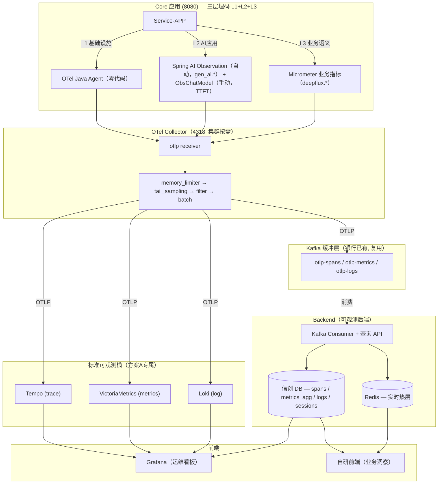
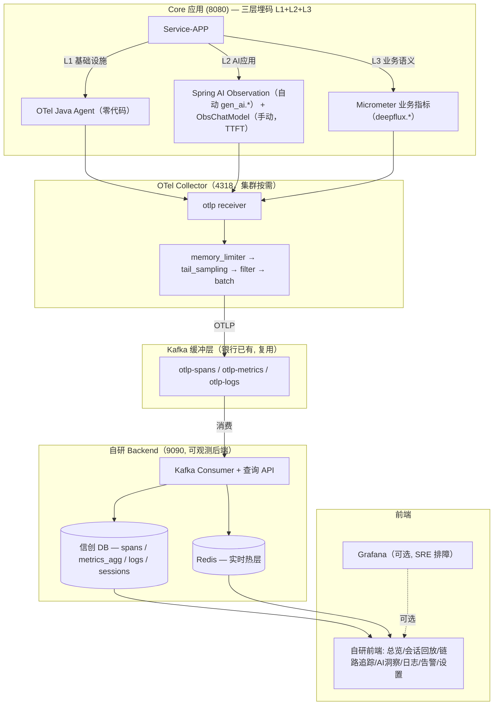
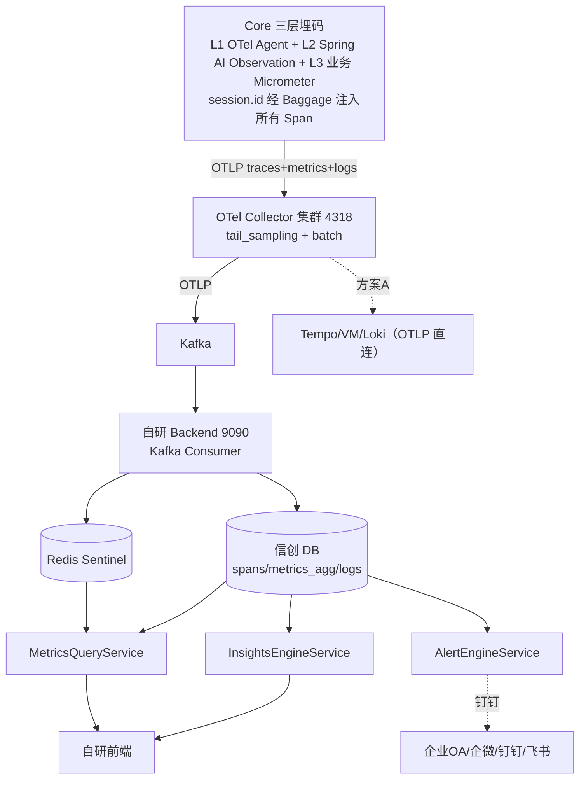

# 可观测优化总结（WorkBuddy V6 · 生产上线版 · 银行国产 · 0728）

> **定稿**：2026-07-18 → **0728 银行国产场景全文刷新**。
> **V6 背景**：银行业务系统，静态用户数千万级（DAU 100-300 万，日均 AI 交互 500-1500 万次，日均 Span 2000-6000 万）。
> **0728 刷新要点（本次）**：
>   - **双方案结构**：方案 A（全栈标准版，保留原 V6 设计的 VM+Tempo+Loki+Grafana）+ 方案 B（国产化务实版，仅 OTel Agent+Collector，存储全复用信创 DB）
>   - **Langfuse 排除**：银行信创后无 PG，Langfuse 生产不可行（FAQ §五论证），LLM 工程改用 MLflow（MySQL 兼容）+ 自研 + DeepEval
>   - **信创 DB 适配**：提供 MySQL 系/openGauss 系/Oracle 系三套 SQL 方言脚本
>   - **A↔B 递进关系**：方案 B 是底线（任何银行落地），方案 A 是目标（条件成熟升级），B→A 迁移零业务代码改动
>   - **其余章节（§0, §4~§16）全部保留 0718/0727 原文不动**，这些是生产级设计基准和附录
>
> 适用范围：移动 AI 银行生产（多信创 DB 适配）。
> 组件选型：方案 A = **Alloy/OTel Collector + Tempo + VM + Loki + Grafana + 信创 DB**；方案 B = **OTel Collector + 信创 DB + 自研前端**
> Demo 版：`可观测优化总结-WorkBuddy-V4-Demo上线版-银行国产-0728.md`
> 调研参考：`银行可观测落地 FAQ.md` + `可观测架构业界调研与重构建议-GLM5.2-0726.md` + `银行可观测落地细化方案-SpringAI1.1.2-Boot3.4.3-OceanBase.md`
> 设计稿：`observability/frontend/可观测DEMO-v24-WorkBuddy.html`

---

## 前置说明：web文章合入筛选结果（22 条→保留 8 条）

> 原 V6-web 文档合入了 15 篇外部文章的全部 22 条观点。经 2026-07-18 逐条重审，以下为最终保留清单（仅生产真正必要的 8 条）：

| 保留观点 | 来源 | 落地位置 | 理由 |
|---|---|---|---|
| **P1 Kafka 缓冲层** | A3 | §2 架构 + §11 | 银行量级日均 2000-6000 万 Span，直压 Backend 不可行 |
| **P2 batch 持久化队列** | A2 | §11.3 | 生产 batch 丢内存数据是真实风险，必须改 file_storage |
| **P5 LLM 推理 SLO 框架** | A2 | §4.3 | 银行必须定义 LLM 服务质量（TTFT/ITL/队列深度） |
| **P10 PII 护栏（三道防线）** | N14 | §4.3 + §13 | 银行合规硬需求，上线前没有不行 |
| **P11 SLO 从业务向下拆 + Tier 分级** | N10/N11 | §4.3 | 转账/查询/理财必须差异化 SLO |
| **P13 三层边界治理** | N9 | §9 | AI 写操作安全底线（禁止直接删数据/扩缩容） |
| **P20 提示词即 Runbook** | N9 | §9 + 自研/MLflow Prompt Registry | 诊断可复现，生产建议用信创 DB prompt_versions 表或 MLflow 管理 |
| **P22 银行采样细化** | N10 | §11.2 | 交易 100% 采集是监管要求 |

> **删除的 14 条**（非本工程代码改动 / 部署细节 / 团队流程 / 扩展架构 / 分类框架，不在此文档展开）：
> P3 Exemplar · P4 HITL 跨 trace · P6 集中式注册表 · P7 UpDownCounter · P8 GenAI 版本钉注（已用 §16.2 结论替代） · P9 DaemonSet · P12 时序折叠 · P14 MCP · P15 RAG/CAG · P16 动态基线 · P17 7层黄金信号 · P18 SLO 降噪 · P19 ODD+Owner · P21 IDP/Kyverno/多团队。
> 其中 P4/P6/P7/P16 为有价值但非上线阻塞的设计补强，各行一句留底（见对应章节）；其余为无可执行代码改动。

---

## 0. 如何使用本文 & 模块分类原则

### 0.1 阅读路径

| 角色 | 关注章节 |
|---|---|
| 决策者 | §1 组件选型 → §2 目标架构 → §3 阶段计划 |
| 后端开发 | §4 数据流 → §5 Core 埋点 → §6 指标全表 → §7 DB → §8 Redis → §9 洞察 → §10 告警 |
| 前端开发 | §12 UI（V24） |
| 运维/SRE | §11 Collector 配置 → §13 合规 → §14 HA → §15 实施路径 |

### 0.2 A/B/C/D/E 模块分类

| 模块 | 名称 | 策略 | 说明 |
|------|------|------|------|
| **A** | 基础指标 (Infra) | P2 交给 Grafana | JVM/HTTP/DB 等标准指标，不自建专用页 |
| **B** | AI 模型层 (LLM 性能) | ✅ 自建主战场 | Token/TTFT/TPOT/LLM 错误率 |
| **C** | AI 业务语义层 | ✅ 自建主战场 | 意图准确率/路由决策/漏斗/满意度 |
| **D** | 平台自观测 | P3 延后 | 后端自身健康 |
| **E** | 维度规范 | ✅ 贯穿全程 | Metric Tag 基数预算，高基数字段归 Trace/Log |

**核心决策**：
- **P0**：信创 DB 建表 + 数据就位（银行量级必须）+ 修复 B+C 类 GAP + Collector 集群 + Redis Sentinel + 告警闭环。
- **P1**：Collector 处理器增强 + 标准栈（Tempo/VM/Loki/Grafana，方案A）信号外溢 + AI 洞察引擎 + 合规安全。
- **P2**：Kafka 缓冲层 + 告警迁 Grafana + 前端终稿 + **MLflow 接入**（替代 Langfuse）。
- **P3/P4**：数据归档分级保留 + LLM 专项深化。

---

## 1. 双方案组件选型

> 0728 刷新：本节以双方案结构替换原 0718 的单一方案（Alloy+Tempo+VM+Loki+Langfuse）。

### 1.1 双方案总览

| | 方案 A：全栈标准版 ⭐ | 方案 B：国产化务实版 |
|---|---|---|
| **定位** | 业界最佳实践，功能最全 | 最小引入，存储全复用 |
| **新增独立组件** | 5~6 个 | **2 个** |
| **审批难度** | ⭐⭐⭐ | ⭐⭐ |
| **适合银行** | 无国产硬约束 + 可观测独立部署 + SRE 团队 | 国产约束严格 + 审批优先"不引入新存储" |
| **关系** | **A↔B 递进，B→A 迁移零业务代码改动** | |

### 1.2 方案 A 组件选型（全栈标准版）

| 信号 | 组件 | 许可 | 说明 |
|---|---|---|---|
| 采集 | **OTel Java Agent + OTel Collector** | Apache 2.0 | CNCF 毕业 |
| Trace | **Grafana Tempo** | Apache 2.0 | 对象存储后端，与 Loki 同源可关联 |
| Metrics | **VictoriaMetrics** 或 Mimir | Apache 2.0 | PromQL 兼容，压缩率 10× |
| Log | **Grafana Loki** | AGPLv3 | 标签索引，对象存储，便宜 |
| 看板/告警 | **Grafana + Alerting** | AGPLv3 | 统一 Tempo+VM+Loki+信创DB |
| 业务真相源 | **信创 DB**（OceanBase/GaussDB 等） | — | sessions + 业务指标 |
| LLM 工程 | **MLflow**（替代 Langfuse，MySQL 兼容） | Apache 2.0 | 见 §17 |

### 1.3 方案 B 组件选型（国产化务实版，仅 2 个新增）

| 信号 | 组件 | 说明 |
|---|---|---|
| 采集 | **OTel Java Agent + OTel Collector** | **仅此 2 个新组件** |
| Trace | 信创 DB spans 表 + 自研查询 | 复用已有 |
| Metrics | 信创 DB metrics_agg 表（首选），VM 可选增强 | 量级小时信创 DB 够用 |
| Log | 信创 DB logs 表 + 大数据系统归档 | 复用已有 |
| Session | 信创 DB sessions + session_turns 表 | 复用已有 |
| 展示 | 自研前端 v24 为主，Grafana 可选 | 已有 |
| LLM 工程 | MLflow（MySQL 兼容）或 自研 | 见 §17 |

> **Langfuse 在 V6 中排除**：银行信创后无 PG，Langfuse 强依赖 PG（Prisma ORM），生产不可行。LLM 工程改用 MLflow + 自研 + DeepEval。详见 FAQ §五。

## 2. 系统目标架构

### 2.1 方案 A 架构（全栈标准版）



> **自研 Backend = 可观测后端（observability/backend/，端口 9090）**：消费 Kafka 中的 OTLP 数据，写入信创 DB 和 Redis，对外提供 spans/sessions/metrics/logs 查询 API。它不是 OTel 官方组件，是项目自研的可观测数据消费与存储层。

### 2.2 方案 B 架构（国产化务实版）



> **自研 Backend = 可观测后端**：同上，消费 Kafka 中的 OTLP 数据，写入信创 DB + Redis，提供查询 API。方案 B 不含 Tempo/VM/Loki/Grafana，全部由自研 Backend + 信创 DB 承载。

### 2.3 架构设计决策

| # | 决策 | 理由 |
|---|---|---|
| D1 | P0 即用信创 DB，不引入新存储 | 银行已有 OceanBase/GaussDB 等，复用即可 |
| D2 | 方案 A 保留原 V6 设计的 LGTM 栈 | 允许引入新开源 DB 的银行可选，业界标准 |
| D3 | 方案 B 仅 OTel Agent + Collector | 国产化约束严格的银行底线方案 |
| D4 | 自研前端专注 B+C 类 AI 业务洞察 | A 类基础指标交 Grafana（方案A）或自研（方案B） |
| D5 | Langfuse 排除 | 银行无 PG，MLflow 替代 |
| D6 | 三层埋码互补 | L1(Agent)+L2(SAI Observation)+L3(业务手工) |
| D7 | Kafka 缓冲层复用 | 银行已有 Kafka，Collector→Kafka→消费者削峰解耦，双方案通用 |

## 3. 分阶段实施计划

### 方案 B 实施（任何银行适用）

| 阶段 | 目标 | 关键任务 |
|---|---|---|
| **P0** | OTLP 打通 + 信创 DB 就位 | ① OTel Agent 挂载 ② Collector 单实例 ③ 按银行 DB 选 SQL 建表 ④ Backend Kafka Consumer 写信创 DB |
| **P1** | 采样 + 归档 | ① tail_sampling 分级 ② 物化视图 ③ 大数据系统归档 ④ TLS+RBAC |
| **P2** | LLM 工程 | ① MLflow 接入 ② 自研 prompt_versions 表 ③ DeepEval 评估 |
| **P3** | HA + 合规 | ① Collector 双实例 ② 3 年冷归档 ③ VM（按需） |

### 方案 A 实施（条件成熟的银行）

| 阶段 | 额外任务（在方案 B 基础上） |
|---|---|
| **P1** | 部署 Tempo + VM + Loki + Grafana docker compose |
| **P2** | Collector 加 Tempo/VM/Loki exporter + 告警迁 Grafana |

## 4. 端到端数据流设计

### 4.1 总体数据流



> **Session 数据方案（0728 修正）**：session.id 通过 OTel Baggage 注入所有 Span attribute，随 trace 管道统一传输。OTLP Log 方案经业界调研已排除（Langfuse/Spring AI/OTel 均未推荐，业界零先例）。SessionBridge HTTP POST 降级为过渡期已有实现，生产方案用 Baggage + tail_sampling 业务策略（含 session 的 trace 100% 采样）。审计级需求从业务层（信创 DB 记录每笔交易对话）做。
>
> **分布式 Baggage 传播（0728 补充）**：OTel Java Agent 默认支持 W3C Baggage 跨服务传播——上游服务通过 `Baggage.current().toBuilder().put("session.id", ...).build().makeCurrent()` 设置后，HTTP 客户端自动注入 `baggage` 请求头，下游服务 OTel Agent 自动解析，**无需额外配置 Collector 或应用代码**。多服务场景下所有 Span 自动携带 session.id。OTel Collector 的 attributes processor 在 Span 到达后修改属性，**不负责跨服务传播**——跨服务传播是 Java Agent 的职责。

### 4.2 Trace 链路追踪（已修复合入）

```
Core ObsChatModel.startBusinessSpan()
  └─ spanName = "<layer>:<model>"  例: "L0:qwen-plus" / "L1-LLM2:qwen-plus" / "L2:qwen-plus"
  └─ attributes: agent.name / model.name / agent.layer / intent / session_id / user_id
                 + ai.io.prompt / ai.io.response / ai.token.input / ai.token.output
                 + llm.confidence  + intent.L0/L1/L2.predicted/actual
        ↓ OTel Java Agent 自动导出
OTel Collector → [batch → memory_limiter → filter(健康检查) → tail_sampling] → otlphttp exporter
        ↓ POST /v1/traces
Backend OtlpParserService.parseTraces() → SpanEntity → Redis obs:traces:recent
        ↓
TraceQueryService.listTracesPaginated()  【已重写：按 trace_id 去重，跳过无业务 span 的 trace】
```

- **★方案A 补正（2026-07-14 已实施）**：`DomainRouter` 确定性路由分支显式创建 `L0:DomainRouter` span（`routing.mode=deterministic`，立即 end），L0=全部请求，L0≥L1≥L2 恒成立。
- **Agents 链**：按 L0 边界切段；reroute 含多段 `L0→L1→WEALTH → L0→L1→TRANSFER`。
- **意图链**：四层真实识别结果，不回退 session 整条 intentFlow。

> 生产建议：人机审批（HITL）中断场景可使同一业务链产生两条 trace，用 `session_id` 在日志拼接，前端会话回放页缝合为一条业务时间线（web P4 降级为脚注，非本阶段阻塞项）。

### 4.3 Metrics 指标（含 SLO 框架 + PII 护栏）

**致命坑**：`Timer.publishPercentiles(...)` → Summary，后端不解析 → TTFT 分位恒 0。必须 `publishPercentileHistogram(true)`。

**★P5 LLM 推理 SLO 框架**（银行必须定义服务质量）：

| 指标 | 类型 | SLO | 说明 |
|---|---|---|---|
| TTFT | Histogram | p95<2000ms(流式)/p99<3000ms(非流式) | 用户体感最关键 |
| ITL | Histogram | p95<200ms | 流式卡顿感知 |
| TPS | Gauge | — | 吞吐 |
| queue_depth | Gauge | >100→WARNING | 容量最早预警 |
| preemptions | Counter | 增长>0→WARNING | 隐性变慢 |

**★P11 SLO 从业务向下拆 + Tier 分级**：

| Tier | 业务线 | 可用性 | P95 时延 | 错误预算燃尽阈值 |
|---|---|---|---|---|
| Tier1 | 转账/支付/账单 | 99.9% | <3s | 5min>10%→P1 / 30min>5%→P2 |
| Tier2 | 理财查询/基金 | 99.5% | <5s | 30min>5%→P2 |
| Tier3 | 一般问答/客服 | 99% | <8s | 24h>1%→P3 |

内部 API 只用异常检测，不挂 SLO。

**★P10 AI 自身可观测 + PII 护栏**（银行合规硬需求）：

| 指标 | SLO 建议 |
|---|---|
| 护栏触发次数 | 突增→CRITICAL |
| PII 泄露风险（明文卡号/身份证） | >0→CRITICAL |
| 响应准确率（BERTScore≈0.8/ROUGE≈0.4 参考） | <阈值→WARNING |
| AI Pod CPU/内存 | 标准 K8s 资源告警 |

### 4.4 Logs 日志

```
Core / Backend 日志（含 logback MDC: trace_id / span_id / session_id）
        | Logback OTLP Appender -> Collector -> otlphttp exporter
Backend OtlpParserService.parseLogs()
  |- 写 LogEntity(trace_id, span_id, level, service, message, attributes)
  |- pushRecentLog -> Redis obs:logs:recent (LTRIM 1000)
        |
前端日志查询页：每行支持按 trace_id / session_id 关联跳转
        | 方案A 增强
经 OTel Collector logs pipeline -> Loki -> Grafana 统一检索
        | 方案B
直接写信创 DB logs 表（短期 7d）+ 大数据系统（长期归档）
```

### 4.5 Session 会话数据采集：7种方案对比与选型

> **0728 下午二次修订**：经业界深度调研（Langfuse 官方 OTLP 集成文档、Spring AI 1.1 官方文档、Spring AI Alibaba Graph 观测实践），对原方案做三项重大修正：
> 1. **OTLP Log 方案排除**：Langfuse 官方明确推荐 OTLP traces 端点 + Baggage，不用 OTLP Log；业界零先例。
> 2. **SessionBridge 降级**：项目自创，无业界先例，降级为"过渡期已有实现"。
> 3. **新增 Graph 原生观测**：SAA Graph 模块自带 Graph/Node/Edge 三级观测。ObsChatModel 补 TTFT 仍然必要。
> 详细对比与选型见 V4 Demo 文档 §4.5，本节仅保留生产关键结论。

#### 7 种方案总览

| | S1 SessionBridge | S2 OTLP Log | S3 ObsConv | S4 OTel Baggage | S5 Advisor | S6 Graph原生 | S7 SpanProcessor |
|---|---|---|---|---|---|---|---|
| **来源** | 项目自创 | V6曾推荐 | Spring AI | OTel官方 | Spring AI | SAA标准 | OTel标准 |
| **业界采用** | 项目独有 | 零先例 | SAI社区 | Langfuse/DD | SAI官方 | SAA官方 | trpc-agent-go |
| **代码侵入** | 高 | 中 | 低 | 极低(3行) | 低(配置) | 零(自动) | 低 |
| **推荐度** | 过渡期 | 已排除 | ⭐⭐ | ⭐⭐⭐主 | ⭐ | ⭐⭐⭐图 | ⭐⭐ |

#### 核心裁决

- **业界标准不把"100% session捕获"当独立需求**——LLM应用trace采样率本应100%
- **session是trace的聚合维度**，不是独立管道。按session.id从trace聚合即可
- **审计需求从业务层做**（信创DB记录每笔交易），非观测层
- **Agent Graph可视化不需要Langfuse**：自研前端按session_id从spans表聚合Span，按layer缩进渲染，已实现Agent Graph展示。Langfuse的Agent Graph只是同一份Span数据的另一种渲染，非必须
- **SessionBridge降级，OTLP Log排除**——回归业界标准Baggage+trace合理采样

#### 推荐方案：S4 OTel Baggage + tail_sampling 业务策略

```
网关/拦截器 -> Baggage.put("session.id") （3行代码）
    | 跨服务、跨线程自动传播
所有Span自动携带 session.id attribute
    | OTLP traces pipeline
后端按session_id聚合spans -> 会话回放
```

#### Graph节点观测5种方法（与V4 §4.5对齐）

| # | 方法 | 适用场景 | 侵入性 | 推荐度 |
|---|---|---|---|---|
| 1 | **SAA Graph原生观测** | SAA StateGraph/ReactAgent | 零 | ⭐⭐⭐首选 |
| 2 | **Spring AI Advisor** | ChatClient advisor链(非Graph) | 低 | ⭐⭐ |
| 3 | **OTel SDK手动Span** | 自研Agent框架 | 中 | ⭐ |
| 4 | **Observation API手动** | Micrometer方式 | 中 | ⭐ |
| 5 | **AOP切面拦截** | 统一拦截 | 高 | 兜底 |

#### TTFT采集

gen_ai.client.operation.time_to_first_chunk 是OTel标准指标（recommended），但Spring AI 1.1（含1.1.2）未实现。**ObsChatModel补TTFT仍然必要**。

### 4.6 Alerts 告警

```
P0 阶段（自研，双方案通用）：
规则管理: alert_rules 表
AlertEngineService.@Scheduled(fixedRate=30_000):
  读活跃规则 -> collectMetricValue -> evaluateCondition -> fireAlert/resolveAlert
  抑制: 5分钟内同规则不重复通知
通知: 钉钉/飞书 Webhook
状态机: TRIGGERED -> ACKED -> RESOLVED

方案A：P2迁Grafana Alerting -> 统一看板+告警
方案B：自研AlertEngine保留
```

默认告警规则：
| 规则 | 阈值 | 严重度 |
|---|---|---|
| LLM 错误率 > 0 | 任何错误 | CRITICAL |
| TTFT P95 超阈 | > 3000ms | WARNING |
| 交易完成率骤降 | < 50% | CRITICAL |
| Collector 接收量骤降 | < 基线30% | WARNING |

## 5. Core 端埋点设计

> **0728 修订**：埋点统一为 L1(OTel Agent) + L2(Spring AI Observation + ObsChatModel) + L3(业务手工) 三层互补结构。Java 插桩三种场景对比见 §17.6。ObsChatModel 不是第 4 层，是 L2 层的手工补充（TTFT）。与 V4 Demo 文档 §5 保持一致。

### 5.1 埋点总览

| # | 埋点项 | 发射方 | DEMO 状态 |
|---|---|---|---|
| 1 | `llm.confidence`（span attr + Gauge） | ObsChatModel | ✅ 已闭环 |
| 2 | 意图准确率分层（`layer` tag） | ObservabilityMetrics | ✅ 已闭环 |
| 3 | 分层意图 Span attrib | Router commitIntent | ✅ 已闭环 |
| 4 | Session 分层意图落库 | SessionBridge | ✅ 已闭环 |
| 5 | Reroute 事件 | BankController + SessionBridge | ✅ 已闭环 |
| 6 | DAU / 在线（Bitmap/ZSet） | DauCounter / OnlineCounter | ✅ DEMO→生产 Bitmap |
| 7 | 待审批数 UpDownCounter | ObservabilityMetrics | 🟡 按需新增 |

### 5.2 关键代码（已随方案A/T27/T28 校准）

```java
// ObsChatModel.resolve()
span.setAttribute("llm.confidence", response.getResult().getOutput().getConfidence());
meterRegistry.gauge("llm.confidence", Tags.of("model.name", modelName, "agent.name", agentName), confidenceValue);

// ObservabilityMetrics.recordIntentAccuracy() — +layer tag
public void recordIntentAccuracy(String predicted, String actual, String state, String layer) {
    Counter.builder("agent.intent.accuracy")
        .tags("intent_predicted", predicted, "intent_actual", actual, "state", state, "layer", layer)
        .register(meterRegistry).increment();
}
```

### 5.3 埋点强制约定

- 时延 `Timer` 一律 `publishPercentileHistogram(true)`。
- 语义计数用 Counter + 规范 tag 落信创 DB `metrics_agg`，**不在 Redis 另存比率 key**。
- 高基数字段不入 Metric Tag，归 Span attributes。
- 所有 Meter/Counter/Timer/Gauge/UpDownCounter 集中在 `ObservabilityMetrics` 管理，命名 `deepflux.<domain>.<measure>`，提供 `RecordXxx` 助手方法，禁止散落 `meterRegistry.counter("xxx")`（防命名漂移）。（web P6 降级，此句已覆盖核心诉求）
- **OpenLLMetry**：Java 栈无官方探针，保留自研 `ObsChatModel`（§16.2）。若未来要对齐 `gen_ai.*` 标准语义，在 span 上追加属性即可。

---

## 6. 指标设计全表

> 状态图例：✅正常 / 🟢已解决 / 🟡回归 / 🔴仍开放。

| # | 指标 | 数据源 | 状态 |
|---|---|---|---|
| A1 | activeSessions | Redis Gauge | ✅ |
| A2 | DAU | Bitmap（生产）/ HyperLogLog（DEMO） | 🟢 |
| A3 | realTimeOnline | ZSet（分片） | 🟢 |
| A4 | requestCount(6h) | Redis | 🟢 |
| A5 | QPS | requestCount/21600 | 🟢 |
| A6 | agentCall L0/L1/L2 | PG `COUNT(DISTINCT trace_id)` | 🟢 方案A 后 L0=请求数 |
| B1 | Token 调用量 | `llm.token.*` | ✅ |
| B2 | TTFT P50/P95/P99 | TDigest（生产）/ ZSet（DEMO） | ✅ |
| B3 | P95 系统时延 | TDigest/ZSet | ✅ |
| B4 | 错误率 | PG spans 真值 | 🟢 |
| C1 | intentAccuracy(分层) | PG + layer tag | 🟢 已闭环 |
| C2 | rewriteAccuracy | PG | 🟢 |
| C3 | rerouteRate | PG `agent.reroute.count` | 🟢 已闭环 |
| C4 | completionRate | PG `agent.business.outcome` | 🟢 |
| D1 | conversionRate | 业务成功率近似 | 🟡 |
| D2 | violationRate | 待 PII 围栏落地 | ��� |

### 6.2 链路追踪

| # | 字段 | 状态 | 说明 |
|---|---|---|---|
| T1 | LLM 置信度 `llm.confidence` | ✅ 已闭环(0718, T27/T28) | Core span 已写 + SessionService 解析 |
| T2 | L0/L1/L2 分层意图 | ✅ 已闭环(0718, 方案A) | Span attrs + sessions 已补 |
| T3 | traceId/sessionId/ioInput | ✅ | — |
| T4 | durationMs/ttftMs/tokenTotal | ✅ | — |
| T5 | spanTree/ioOutput | ✅ | — |

### 6.3 AI 洞察 6 TAB

| # | 指标 | 状态 | 说明 |
|---|---|---|---|
| I1 | 准确率趋势（按 intent 分组） | 🟢 | `/ai/accuracy-report` 统一端点 |
| I2 | 混淆矩阵（分层） | 🟢 已闭环(0718) | Core 已写 intent_predicted/actual 到 span |
| I3 | 改写准确率 | 🟢 | — |
| I4 | 根因 TOP3 | 🟢 | — |
| I5 | L2 意图识别 | 🔴 | 占位，待 L2 链路数据 |

### 6.4 维度规范与基数预算（Codex §6.5，纳入 V3）

#### 允许做 Metric Tag 的字段（基数 < 200）

| Tag Key | 示例值 | 基数估算 |
|---|---|---|
| `model.name` | qwen-turbo, qwen-plus | < 10 |
| `agent.level` | L0, L1, L2 | 3 |
| `agent.name` | DomainRouter, ContextRouter, TransferAgent | < 30 |
| `intent` | TRANSFER, WEALTH, BILL, GENERAL | < 20 |
| `state` | correct, fuzzy, error, disambiguated | 4 |
| `error_type` | timeout, auth_error, rate_limit | < 10 |
| `outcome` | success, fail, partial | 3 |

#### 禁止作为 Metric Tag 的字段（基数 > 1000）

| 字段 | 存放位置 | 原因 |
|---|---|---|
| `user_id` | Span attributes / Log | 用户数可无限增长 |
| `session_id` | Span attributes | 每次会话新 ID |
| `trace_id` | Span 主键 | 每次请求新 ID |
| `prompt` / `response` | Span attributes (ai.io.*) | 文本无限 |
| `timestamp` | Span start/end | 每毫秒新值 |

---

### 6.6 0728 审计发现（与 V4 Demo §6.5 对齐）

| # | 严重度 | 指标/位置 | 问题 | 状态 |
|---|---|---|---|---|
| A1 | P0 | completionRate | streaming 路径未发射 outcome=success，完成率系统性偏低 | 🔴 待修 |
| A2 | P0 | conversionRate | 依赖外部业务系统，Core 端无法独立计算 | 🔴 不适用 |
| A3 | P0 | violationRate | 安全围栏未对接 | 🔴 待对接 |
| A4 | P0 | 意图识别 L2 | 占位，待 L2 链路数据填充 | 🔴 占位 |
| A6 | P1 | Token 用量 | llm.* 命名未与 OTel gen_ai.* 对齐 | 🟡 P2 迁移 |
| A7 | P1 | §6 全章 | 缺少指标类型列（Counter/Gauge/Histogram） | 🟡 文档补全 |
| A8 | P2 | §6 vs v24 | v24 新增指标缺描述：取消率、慢调用占比、外部调用分段 | 🟡 文档补全 |

---

## 7. DB 表设计

### 7.1 Redis → DB 同步原则

Redis 管实时窗口，PG 管真相与历史；热→温每 30s 同步；语义比率 PG 读时算。

### 7.2 活跃表

`metrics_agg` / `spans`(含 llm.confidence/intent.*) / `logs` / `sessions`(+l0/l1/l2_intent + reroute_triggered) / `session_turns` / `tool_calls` / `alert_rules`(+增强字段) / `alert_events`(+增强字段) / `redis_metrics_snapshot` / `insight_reports`(**P0 新增**)。弃用：`agent_performance` / `token_cost`（全库无 INSERT）。

### 7.3 P0 DDL（PG 已就位）

```sql
ALTER TABLE sessions ADD COLUMN l0_intent VARCHAR(64);
ALTER TABLE sessions ADD COLUMN l1_intent VARCHAR(64);
ALTER TABLE sessions ADD COLUMN l2_intent VARCHAR(64);
ALTER TABLE sessions ADD COLUMN reroute_triggered BOOLEAN DEFAULT FALSE;
ALTER TABLE alert_rules ADD COLUMN evaluation_interval INT DEFAULT 30;
ALTER TABLE alert_rules ADD COLUMN last_evaluated_at TIMESTAMP;
ALTER TABLE alert_rules ADD COLUMN current_value DOUBLE;
ALTER TABLE alert_events ADD COLUMN notified_channels VARCHAR(128);
ALTER TABLE alert_events ADD COLUMN notify_result VARCHAR(64);
ALTER TABLE alert_events ADD COLUMN suppression_count INT DEFAULT 0;
CREATE TABLE insight_reports (
    id BIGINT AUTO_INCREMENT, report_type VARCHAR(32),
    report_data TEXT, generated_at TIMESTAMP,
    data_window_start TIMESTAMP, data_window_end TIMESTAMP,
    version INT DEFAULT 1, PRIMARY KEY (id)
);
```

### 7.4 分层数据保留策略（银保监合规）

| 层级 | 存储 | 保留期 | 清理 |
|---|---|---|---|
| 热层 | 信创 DB SSD | 7 天 | 分区表 DROP PARTITION |
| 温层 | PG 压缩分区 | 90 天 | DROP PARTITION |
| 冷层 | 对象存储(S3/MinIO) | 3 年 | 生命周期策略 |

PG 按天分区；冷层 PG→Parquet→对象存储，3 年可回溯。

---

## 8. Redis 缓存设计（生产：Sentinel + Bitmap + TDigest）

### 8.1 所有权原则

每 Key 唯一写入方；语义比率不写 Redis；命名 `obs:<域>:<指标>:<窗口>`。

### 8.2 Redis Key 规范全表

| Key 模式 | 类型 | 说明 |
|---|---|---|
| `obs:metrics:request_count:*` | String(INCR) | 多窗口 |
| `obs:metrics:error_count:1m` | String(INCR) | — |
| `obs:token:input:1m` / `output:1m` | String(INCR) | — |
| `obs:latency:1m/5m/15m` | **TDigest** | 降 50000 倍，P99 误差<0.5% |
| `obs:ttft:1m` | **TDigest** | — |
| `obs:dau:YYYY-MM-DD` | **Bitmap** | 精度 100%，3000 万用户仅 3.6MB |
| `obs:online:users:{shard}` | ZSet（按小时分片） | 避免单 ZSet 百万 member |
| `obs:traces:recent` / `obs:logs:recent` | List(LTRIM) | 滑动窗口 |
| `obs:alerts:active` | ZSet | — |
| `obs:insights:cache` | String(JSON) | 300s |

### 8.3 物化视图（大表预聚合）

按小时预聚：`mv_agent_call_hourly` / `mv_token_cost_hourly` / `mv_funnel_daily` / `mv_satisfaction_daily`，前端走 MV 非原始表。

### 8.4 TDigest 流式分位（替代 ZSet）

```java
TDigest td = TDigest.createMergingDigest(100);
td.add(latencyMs);
double p99 = td.quantile(0.99);  // ~2KB/窗口
```

---

## 9. AI 洞察引擎（双层架构 + 三层边界治理）

### 9.1 ★P13 三层边界治理（AI 写操作安全底线）

| 边界层 | 行为 | 示例 | 实现 |
|---|---|---|---|
| **L1 确定性聚合** | 自动执行（代码） | P95 时延/错误率统计 | InsightsEngine compute* 方法 |
| **L2 模糊判断** | AI 辅助（推荐，需人工确认） | 根因假设生成 / 优先级排序 | 输出带"置信度"的建议卡 |
| **L3 生产写操作** | **禁止 AI 直接执行** | 回滚/改配置/扩缩容/删数据 | 需权限+审批+审计+回滚预案 |

### 9.2 AIInsightsService 族（6 Service，P0 保留接口，已重写实时聚合）

`AIInsightsService` / `AgentPerformanceService` / `TokenCostService` / `ConversionFunnelService` / `SatisfactionService` / `ToolStatsService`。`AgentPerformanceService`/`TokenCostService` 已从读空静态表改为实时聚合 `spans+metrics_agg`。

### 9.3 InsightsEngineService（交叉引擎）

`generateReport()` → 缓存 `obs:insights:cache`(300s) + 写 `insight_reports`。三大诊断域：性能 / 质量 / 业务。6 个 API 端点（insights-report / bottlenecks / root-cause / unsatisfied / conversion / actions）。

### 9.4 ★P20 提示词即 Runbook（→ 自研或 MLflow 管理）

诊断 prompt 模板应当版本化管理、PR review、单元测试、复盘可追溯。生产建议通过**自研 prompt_versions 表（信创 DB）或 MLflow Prompt Registry** 管理（§16.3/§17），比自建版本表更可持续。

### 9.5 后续扩展（P3–P4）

- 动态基线替代静态阈值（告警降噪，先用静态跑通）。（web P16 降级）
- MCP 集成 / RAG+CAG 知识来源：历史事故→RAG / 高频场景→CAG 缓存 / 实时状态→MCP。当前无可接入的系统，属扩展架构。

### 9.11 0728 审计发现（与 V4 Demo §9.10 对齐）

| # | 严重度 | 问题 | 影响 | 状态 |
|---|---|---|---|---|
| B1 | **P0** | `qualityIssues` 调错方法，质量诊断重复显示性能数据 | 生产同样受影响 | 🔴 **待修** |
| B2 | **P0** | 转化漏斗硬编码 92% 意图识别率 | 生产同样受影响 | 🔴 **待修** |
| B3 | **P0** | 漏斗最后两级用相同 completed 值 | 业务转化数据失真 | 🔴 **待修** |
| B7 | P2 | `hypothesisFor()` 关键词匹配非 AI 推理 | 慢会话根因分析不准确 | 🟡 后续提升 |
| B8 | P2 | 提示词 Runbook 设计未落地 | insight_reports 无 prompt 版本字段 | 🟡 待落地 |

---

## 10. 告警系统设计（P0 自研 → P2 迁 Grafana）

### 10.1 AlertEngineService（P0）

```java
@Scheduled(fixedRate = 30_000)
public void evaluateRules() {
    for (AlertRule rule : ruleRepo.findByEnabledTrue()) {
        double v = collectMetricValue(rule.getMetricKey());
        if (shouldFire(rule, v) && !isCurrentlyFiring(rule.getId())) {
            if (!isSuppressed(rule, 5, MINUTES) && !isInQuietPeriod(rule, 30, MINUTES))
                fireAlert(rule, v);
        } else if (!shouldFire(rule, v) && isCurrentlyFiring(rule.getId())) {
            resolveAlert(rule, v);
        }
        rule.setLastEvaluatedAt(Instant.now()); rule.setCurrentValue(v); ruleRepo.save(rule);
    }
}
```

状态机：`TRIGGERED → SUPPRESSED → ACKED → RESOLVED → QUIET`。

**默认规则**：LLM 错误率>0(CRITICAL) / TTFT P95>3000ms(WARNING) / 转账槽位完成率<50%(CRITICAL) / Collector 接收量<基线30%(WARNING) / 满意度负面>20%(WARNING) / **脱敏明文 PII 检测(CRITICAL)** / **交易 Trace 缺失(WARNING)**。

> 告警降噪（动态基线/burn rate）为 P3 迭代方向，先用 5min 抑制 + 30min 静默期跑通基础闭环。（web P16/P18 降级）

---

## 11. OTel Collector 增强配置

### 11.1 生产 config.yaml

```yaml
receivers:
  otlp:
    protocols:
      http: { endpoint: 0.0.0.0:4318 }

processors:
  batch:
    timeout: 5s
    send_batch_size: 1024
  memory_limiter:
    check_interval: 1s
    limit_mib: 512
    spike_limit_mib: 128
  filter:
    metrics: { metric: [ 'type == METRIC_DATA_TYPE_HISTOGRAM' ] }
    traces: { span: [ 'attributes["http.target"] == "/actuator/health"' ] }
  attributes:
    actions:
      - { key: env, value: production, action: upsert }
  tail_sampling:
    decision_wait: 10s
    policies:
      - { name: errors, type: status_code, status_code: { status_codes: [ERROR] } }
      - { name: slow, type: latency, latency: { threshold_ms: 1000 } }
      - { name: llm-failure, type: string_attribute, string_attribute: { key: error_type, values: [timeout, auth_error, rate_limit] } }
      - { name: normal-sampling, type: probabilistic, probabilistic: { sampling_percentage: 1 } }

exporters:
  otlphttp/json_backend: { endpoint: http://127.0.0.1:9090, compression: gzip }
  # P2 激活：
  kafka: { brokers: [...], topic: otel-spans, encoding: otlp_json, producer: { acks: all, compression: snappy } }
  otlphttp/langfuse: { endpoint: http://langfuse:4318/v1/otlp, compression: gzip }
  # otlphttp/tempo / prometheusremotewrite / loki

service:
  pipelines:
    traces:   { receivers: [otlp], processors: [batch, memory_limiter, filter, attributes, tail_sampling], exporters: [otlphttp/json_backend, kafka, otlphttp/langfuse] }
    metrics:  { receivers: [otlp], processors: [batch, memory_limiter, filter, attributes], exporters: [otlphttp/json_backend, kafka] }
    logs:     { receivers: [otlp], processors: [batch, memory_limiter, attributes], exporters: [otlphttp/json_backend, kafka] }
```

### 11.2 ★P22 分级采样策略（银行量级，交易 100%）

| intent | 采样率 | 说明 |
|---|---|---|
| TRANSFER/BILL（交易） | **100%** | 监管要求 |
| WEALTH/GENERAL（查询） | 5% | — |
| 其他 | 1% | — |
| 错误/慢/LLM 失败 | 100% | 不丢故障 |

### 11.3 生产增强

- **★P1 Kafka 缓冲层**：Collector→Kafka→(Backend Consumer / Tempo / VM / Loki)，24h 回放。银行量级日均 2000-6000 万 Span，直压不可行。
- **★P2 batch 持久化队列**：生产弃用纯 `batch` processor（重启丢内存数据），改用 `file_storage` 持久化发送队列（`sending_queue.storage: file_storage`）。

---

## 12. UI 设计（V24）

8 页：总览 / 会话回放 / 链路追踪 / AI 洞察(6 TAB) / 日志 / 告警 / 设置 / 智能洞察（诊断驾驶舱）。详细设计见 `observability/frontend/可观测DEMO-v24-WorkBuddy.html`（**V24 最新设计稿**）。V20 基线版本保留作为历史参考。

---

## 13. 数据合规与安全设计

### 13.1 数据脱敏（P0，Core 端完成）

卡号前4后4、身份证前6后4、手机号前3后4；金额不脱敏；用户ID 哈希。脱敏在 Core 端完成，后端/存储收到即脱敏。

### 13.2 RBAC 五角色（P1）

admin / ops / analyst / auditor / viewer，敏感操作 `@PreAuthorize` + 审计日志。

### 13.3 全链路 TLS（P1）

Core→Collector / Collector→Backend / Core→Backend / Backend→前端 均加密。

### 13.4 ★P10 PII 网关级 BLOCK 三道防线

| 防线 | 位置 | 机制 | 动作 |
|---|---|---|---|
| L1 Core 端脱敏（已有） | SessionBridge/ObsChatModel | 正则打码 | 发送前打码 |
| L2 网关级 BLOCK（新增） | LiteLLM + Presidio | PII 模式+NLP 识别 | **BLOCK 请求** + 记护栏事件 |
| L3 Trace/Log 检测（新增） | Collector redaction | 扫描 span/log | 脱敏或拒写 + PII 泄露告警 |

---

## 14. 高可用部署架构

### 14.1 HA 组件矩阵

PG(Patroni) / Redis(Sentinel) / Collector(3+Nginx) / VM(集群) / Tempo(2) / Loki(2) / Grafana(2) / 后端(双活) / 前端(Nginx+CDN) / Kafka(3, replication=3)。

### 14.2 容量规划（日均 1000 万 AI 交互）

PG 16C64G×3 / Redis 8C32G×3 / Collector 4C8G×3 / Kafka 8C32G×3 / VM 8C32G×3 / 对象存储(3y 冷归档)。

### 14.3 落地路线图

P0 修复→P1 标准栈→P2 削峰+HA+MLflow→P3 冷热分层归档（对应银保监 3 年审计轨迹要求）。

---

## 15. 实施路径与里程碑

各阶段任务见 §3。仅补充 DEMO 已闭环内容避免生产重复：

方案A（确定性 L0 span）+ T22–T35（12 项代码修复：跳转/注释/Collector/秒级/JSON/置信度/model+TTFT/seed/时区/时间列）+ 语义比率 PG 读时算 + AgentCall `COUNT(DISTINCT)`。详见 `可观测优化总结-WorkBuddy-V4-Demo上线版-0718.md` 与 `代码审阅整改总结-2026-07-18.md`。

---

## 16. 附录

### 16.1 关键坑清单

1. `publishPercentileHistogram(true)` 必须开，否则 TTFT 分位恒 0。
2. 语义比率别存 Redis key → PG 读时算。
3. Agent 调用数改 PG `COUNT(DISTINCT trace_id)`。
4. 错误率改 PG spans 真值计算。
5. `purge` 批量删必须 `@Transactional`。
6. `agent_performance`/`token_cost` 表已弃用 → 不要读。
7. Windows `localhost`→`127.0.0.1`。
8. 两条管道独立：sessions 不依赖 spans。
9. 时区统一 `Asia/Shanghai`（DEMO 已修 T34/T35）。
10. 生产 `batch` processor 有静默丢数据风险 → 改 `file_storage` 持久化队列。

### 16.2 OpenLLMetry 评估结论（保留自研 ObsChatModel）

**OpenLLMetry 是什么**：Apache 2.0、Traceloop 维护、构建在 OpenTelemetry 之上的 LLM 应用插桩扩展；为 OpenAI/Anthropic/向量库/LangChain 等自动创建标准 `gen_ai.*` span。**官方 instrumentation 仅覆盖 Python / TypeScript(Node) 生态，无 Java / Spring AI 官方探针**。

**对比自研 ObsChatModel**：

| 维度 | 自研 ObsChatModel | 若迁 OpenLLMetry（Java） |
|---|---|---|
| 适配栈 | ✅ Java/Spring AI Alibaba 原生 | ❌ 无官方探针 |
| 业务语义 | ✅ `intent.L0/L1/L2`、`routing.mode`、`llm.confidence` 等领域专属 | ⚠️ 仅通用 `gen_ai.*` |
| 控制力 | ✅ 方案A 确定性 L0 span 即依赖此可控性 | ⚠️ 受限于自动插桩粒度 |

**决策**：DEMO 与生产均**保留自研 ObsChatModel**。未来若需跨工具标准语义兼容，在现有 span 上**追加** `gen_ai.*` 属性即可，不替换埋点链路。

### 16.3 Langfuse 结论（0728 修正：银行生产排除 + MLflow 替代）

> **0718 原文**认为 Langfuse 生产 P2 必装。**0728 修正**：银行信创后无 PostgreSQL，Langfuse 自托管强依赖 PG（Prisma ORM），不可行。Langfuse Cloud 数据出国，合规不过。详细论证见《银行可观测落地 FAQ.md》§五。

**替代方案**：

| Langfuse 能力 | 0728 替代 | 说明 |
|---|---|---|
| LLM Trace 可视化 | 自研前端 / Grafana | OTLP span 已有全部信息 |
| Prompt 管理/版本化 | 自研 prompt_versions 表（信创DB）或 MLflow Prompt Registry | 简单 CRUD |
| LLM 评估框架 | DeepEval（开源，Python，不绑 DB） | 50+ 评估指标 |
| 实验追踪/对比 | **MLflow Tracking**（核心能力） | MySQL 兼容 → OceanBase 可用 |
| 成本追踪 | 信创 DB token_costs 表 + 银行 BI | 银行已有 BI 可对接 |

> MLflow 通过 SQLAlchemy 支持 MySQL，即 OceanBase MySQL 兼容模式可直接用。MLflow 3.x 已有 LLM Tracing（通过 OTel），支持 prompt 管理和实验对比。Demo 阶段（V4）Langfuse docker compose 仍可选。

### 16.4 待定决策状态

- **待定项 A（L0 覆盖所有请求）**：🟢 已决策（方案 b）已实施（2026-07-14）。
- **待定项 B（reRoute 是否携带原报文）**：⚪ 待定。
- **待定项 C（是否引入 Langfuse）**：🟢 **已排除**（0728：银行无 PG，改用 MLflow + 自研 + DeepEval，见 §16.3/§17）。

### 16.5 被删除的 web 观点速查（14 条，留备查）

| 编号 | 原观点 | 删除理由 |
|---|---|---|
| P3 | Exemplar 显式化 | Grafana 功能，非本项目代码改动 |
| P4 | HITL 跨 trace 会话连续性 | 银行审批场景有价值，但属流程设计，非可观测工程阻塞项 |
| P6 | 集中式指标注册表 | 已有一句规范覆盖（§5.3），不需要单独小节 |
| P7 | UpDownCounter 待审批数 | 一个具体指标，不是架构设计 |
| P8 | GenAI 语义版本钉注 | §16.2 已明确不用 OpenLLMetry，钉注无意义 |
| P9 | Collector DaemonSet | K8s 部署细节，非本工程代码改动 |
| P12 | 金融落地蓝图"时序折叠" | 叙事词汇，不是实施项 |
| P14 | MCP 集成 | 当前无任何 MCP server 可接，属扩展架构 |
| P15 | RAG/CAG 分工 | 同上，历史数据都没有无法做 RAG |
| P16 | 动态基线替代静态阈值 | 告警降噪重要但先用静态基线跑通，P3 迭代 |
| P17 | 云原生 7 层黄金信号 | 分类框架，不改变任何实现 |
| P18 | SLO 影响分析降噪 | 抑制/静默期已覆盖基础降噪，burn rate 为 P3 迭代 |
| P19 | 可观测性驱动开发 + Owner 必填 | 团队流程规范，非代码改动 |
| P21 | IDP/Helm/Kyverno/多团队推广 | 多团队推广工具，单项目不涉及 |

---

> 文档版本：0718 · WorkBuddy V6 · 生产上线版（刷新 V6-web，严格筛选 web 观点 22→8 条 + OpenLLMetry 评估 + Langfuse 确认）
> 融合路径：Wb V2+V3+V4+V5(银行量级) → Wb V6(整合 Codex V4) → web 文章合入(22 条) → **0718 严格筛选(仅保留 8 条必要项)**
> Demo 版：`可观测优化总结-WorkBuddy-V4-Demo上线版-0718.md`
> 整改明细：`代码审阅整改总结-2026-07-18.md`
> 前端设计：`observability/frontend/可观测DEMO-v20-WorkBuddy.html`

---


---

# §17 0728 补充方案：双方案结构 + 信创 DB 适配 + LLM 工程

> 本章节基于 2026-07-28 讨论结论新增。主文 §1~§3 已刷新为 0728 双方案架构，本章节补充细节。
> 篇幅受控，仅保留核心新增内容。完整设计见本文 §4~§16。

## 17.1 双方案总览

| | 方案 A：全栈标准版 ⭐ | 方案 B：国产化务实版 |
|---|---|---|
| **定位** | 业界最佳实践，功能最全 | 最小引入，存储全复用 |
| **新增组件** | 5~6 个（OTel Agent + Collector + Tempo + VM + Loki + Grafana） | **2 个**（OTel Agent + Collector） |
| **审批难度** | ⭐⭐⭐ | ⭐⭐ |
| **适合银行** | 无国产硬约束 + 可观测独立部署 + SRE 团队 | 国产约束严格 + 审批优先"不引入新存储" |

### 方案 A 推荐条件
- 银行允许引入新开源 DB（VM/Tempo/Loki 为 CNCF 生态，Apache 2.0/AGPLv3，不涉及费用）
- 可观测系统独立部署，不与核心交易耦合
- 需要跨信号关联排查（trace→log→metric 下钻）
- 日均 Span > 2000 万（专用存储更优）

### 方案 B 推荐条件
- 国产化约束严格，信创 DB 性能可满足初期量级
- 自研前端 v24 已覆盖展示需求
- 先落地验证价值，后续可按需升级到方案 A

### A↔B 递进关系
从 B 到 A 迁移零业务代码改动——OTLP 格式完全相同，只多配几个 Collector exporter。不是二选一，是"B 是底线 → A 是目标"。

## 17.2 信创 DB 适配矩阵

| DB 方言 | 代表产品 | 银行案例 | Langfuse？ | LLM 工程方案 |
|---|---|---|---|---|
| **MySQL 兼容系** | OceanBase / TDSQL / TiDB / GoldenDB / GBase | 近七成万亿级银行核心 | ❌ 排除 | MLflow（MySQL 兼容） |
| **openGauss 系** | GaussDB / openGauss / KingbaseES | 六大行系统数量占比最高 | ⚠️ 未验证 | MLflow 或 自研 |
| **Oracle 兼容系** | 达梦 DM8 / KingbaseES Oracle 模式 | 政务+中小银行 | ❌ 排除 | 自研 |

> FAQ §四结论：GaussDB 与 OceanBase 第一梯队。**MySQL 兼容是最大公约数**。银行核心系统基本不走 PostgreSQL。

V6 提供 MySQL 系 / openGauss 系 / Oracle 系三套 SQL 方言 DDL（spans / metrics_agg / sessions / session_turns / logs / prompt_versions / alert_rules / alert_events 等 8 张核心表），独立 SQL 文件交付。

## 17.3 LLM 工程方案：为什么排除 Langfuse

Langfuse 自托管需 PostgreSQL（Prisma ORM 强依赖），银行信创后无 PG。Langfuse Cloud 数据出国，合规不过。替代方案：

| Langfuse 能力 | 替代 |
|---|---|
| LLM Trace 可视化 | 自研前端 / Grafana |
| Prompt 管理 | 自研 prompt_versions 表（信创 DB） |
| LLM 评估 | DeepEval（开源，Python，不绑任何 DB） |
| 实验追踪 | **MLflow**（MySQL 兼容 → OceanBase 可用） |
| 成本追踪 | 信创 DB token_costs 表 + 银行 BI |

> 详细论证见《银行可观测落地 FAQ.md》§五。

## 17.4 方案选择决策树

| # | 问题 | YES → | NO → |
|---|---|---|---|
| Q1 | 银行允许引入新开源 DB？ | A | B |
| Q2 | 已有成熟 ES/时序存储？ | B 即可 | A 合适 |
| Q3 | 需跨信号关联排查？ | A | B |
| Q4 | 日均 Span > 5000 万？ | A | B 够 |

## 17.5 审批模板

### 方案 A（全栈标准版）
> 本方案新增 5~6 个开源组件（OTel Agent + Collector + Tempo + VM + Loki + Grafana），均为 CNCF 生态标准组件，Apache 2.0/AGPLv3 许可，不涉及商业费用。所有组件已被数亿用户规模企业验证。可观测系统独立部署，不与核心交易耦合。Tempo+Loki+Grafana 三位一体跨信号关联排查，业界公认标准栈。

### 方案 B（国产化务实版）
> 本方案仅新增 2 个开源组件（OTel Java Agent + OTel Collector），均为 CNCF 毕业项目。新增组件仅负责采集层，**存储层全部复用银行已有信创 DB/Redis/Kafka/大数据系统/BI**，不引入任何新存储。trace/log/metrics/session 全部用信创 DB 存。LLM 工程能力用 MLflow（MySQL 兼容）+ 自研。新增组件无状态单实例，零代码侵入。

## 17.6 Java 插桩三种场景（与 V4 Demo §19.2 一致）

> 不同银行的业务系统可能用不同框架。本节与 V4 Demo 文档 §19.2 保持一致，供银行选型参考。

### 场景 A：纯 OpenTelemetry（无 Spring AI 框架）
- 适用：银行裸 Java 服务，LLM 走 HTTP API
- L1：OTel Agent 自动采（零代码），L2：OTel SDK 手动 LLM span，L3：手动 Counter
- 工作量最大，无 gen_ai.* 自动指标

### 场景 B：Spring AI + OpenTelemetry（推荐）⭐
- 适用：银行用 Spring AI 1.0+
- L1：OTel Agent（零代码），L2：SAI Observation 自动 gen_ai.* + ObsChatModel 补 TTFT（少量），L3：Micrometer 手动业务
- 工作量最小

### 场景 C：Spring Boot + OpenTelemetry（无 Spring AI）
- 适用：银行有 Spring Boot 但没用 Spring AI，LLM 走裸 HTTP
- L1：OTel Agent（零代码），L2：OTel SDK 手动 LLM span，L3：Micrometer 手动

| 维度 | 场景 A | 场景 B ⭐ | 场景 C |
|---|---|---|---|
| gen_ai.* 指标 | ❌ | ✅ 自动 | ❌ |
| Token 采集 | ❌ | ✅ 自动(1.1+) | ❌ |
| TTFT | ❌ | ⚠ ObsChatModel 补 | ❌ |
| 业务指标 | ❌ 手写 | ❌ 手写 | ❌ 手写 |

## 17.7 ObsChatModel 与 Micrometer 关系（与 V4 Demo §19.3 一致）

> **ObsChatModel 不是独立框架**——是 ChatModel 装饰器，内部用 Micrometer API 写指标。业务代码共享同一个 MeterRegistry，通过命名前缀区分（`llm.*` vs `deepflux.*`）。详见 V4 Demo 文档 §19.3。

## 17.8 V4 Demo 审计发现同步（通用问题）

> 以下问题在 V4 Demo 代码审计中发现，V6 生产方案同样适用。详细列表见 V4 Demo 文档 §6.5 和 §9.10。

| # | 严重度 | 问题 | V6 影响 |
|---|---|---|---|
| B1 | P0 | `qualityIssues` 调错方法，AI 洞察质量诊断卡片展示重复数据 | 生产同样受影响 |
| B2 | P0 | 转化漏斗硬编码 92% 意图识别率 | 生产同样受影响 |
| A7 | P2 | v24 新增指标缺文档描述（取消率/慢调用占比/外部调用分段/满意度聚类） | V6 指标表需同步补充 |

---

> **§17 增补版本**：0728 · 双方案 + 信创 DB 适配 + LLM 工程
> **冲突优先级**：本文 §1~§3 已按 0728 刷新。§4~§16 保留 0718/0727 原文不动。§17 为补充
> **前置阅读**：`银行可观测落地 FAQ.md` + `可观测架构业界调研与重构建议-GLM5.2-0726.md`

### 9.4 三大诊断域 × 提炼项明细

| 诊断域 | 提炼项 | 数据来源 | 输出形式 | 前端 TAB |
|---|---|---|---|---|
| **性能诊断** | Top3 慢 Agent 节点 | spans (P95 by agent_name) | 排行榜+趋势线 | 性能 TAB |
| | 慢会话根因 Span | spans (独占时间 Top3) | 根因链路图 | 智能洞察驾驶舱 |
| | LLM 响应延迟分布 | metrics_agg (ttft/tps) | 直方图 | 性能 TAB |
| | Token 消耗异常检测 | metrics_agg (token_count) | 时序异常点 | Token TAB |
| **质量诊断** | 低置信度意图分布 | metrics_agg (confidence<0.7) | 意图×置信度矩阵 | 准确率 TAB |
| | 不满意会话共性模式 | sessions + feedback | 共性特征画像 | 满意度 TAB |
| | 重复提问检测 | sessions (followup_count) | 重复率趋势 | 漏斗 TAB |
| **业务诊断** | 漏斗流失阶段定位 | sessions (funnel_stage) | 漏斗图+流失率 | 漏斗 TAB |
| | 流失会话特征画像 | sessions (未转化) | 特征雷达图 | 漏斗 TAB |
| | 高价值会话路径 | sessions (已转化) | 路径桑基图 | 漏斗 TAB |

### 9.5 慢会话根因分析详细逻辑

```
输入：会话ID列表（duration > 全局 P95）
处理流程：
  1. 取会话所有 Span，构建调用树
  2. 计算每个 Span 的"独占时间" = duration - sum(子Span duration)
  3. 按独占时间降序，取 Top3 Span 作为根因候选
  4. 对每个根因候选，关联以下维度：
     - LLM 指标：是否 token 数异常高？模型 TTFT 异常慢？
     - 工具调用：是否外部 API 超时？重试次数多？
     - 意图维度：该意图是否历史平均就慢？
     - 上下文：是否上下文过长导致推理慢？
  5. 输出根因链路图：
     会话总耗时 12s (P95=3s)
     ├─ Agent.RAG检索 6.2s (独占 5.8s) ← 根因 #1
     │   ├─ VectorStore.search 4.1s ← 外部调用超时
     │   └─ Reranker.rerank 1.7s
     ├─ Agent.LLM推理 4.3s (独占 0.5s)
     │   ├─ GPT4o.chat 3.8s ← TTFT=2.1s (基线0.8s)
     │   └─ Token: input=8200 (基线2000) ← 上下文过长
     └─ Agent.工具调用 1.5s (独占 1.5s) ← 根因 #2
         └─ BankAPI.query 1.5s ← 超时重试2次
```

### 9.6 API 端点

```
GET  /api/v1/ai/insights-report          -> 完整洞察报告（缓存5分钟）
GET  /api/v1/ai/insights/bottlenecks     -> 性能瓶颈 Top3
GET  /api/v1/ai/insights/root-cause/{sessionId} -> 指定会话根因分析
GET  /api/v1/ai/insights/unsatisfied     -> 不满意会话共性模式
GET  /api/v1/ai/insights/conversion      -> 转化瓶颈分析
GET  /api/v1/ai/insights/actions         -> 优先级行动建议 Top10
POST /api/v1/ai/insights/refresh         -> 手动刷新洞察
```

### 9.7 洞察缓存策略

| 缓存层 | Key | TTL | 刷新触发 |
|---|---|---|---|
| Redis | `obs:insights:cache` | 300s | 定时 5 分钟 / 手动 Refresh |
| DB | `insight_reports` 表 | 永久 | 每次 Refresh 同步写入 |
| 前端 | 浏览器内存 | 60s | 轮询 / 手动刷新按钮 |

---

### 9.8 提示词即 Runbook ★web合入 P20（来自 N9）

AI 洞察引擎的诊断 prompt 模板应当像代码一样被版本化管理：

- **版本化**：每个 prompt 模板存入 `insight_reports` 或独立配置表，附版本号
- **评审**：prompt 变更走 PR review 流程
- **测试**：每个 prompt 在已知场景下有预期诊断输出（类单元测试）
- **复盘**：当洞察结论被证实错误时，追溯该版本 prompt 的缺陷

> 原则：**提示词即 Runbook**——Runbook 怎么写、prompt 就怎么管（N9）。

### 9.9 AI 洞察准确率量化参考 ★web合入（来自 N14）

> GuideLLM 基准参考值（供 AI 洞察准确率评估）：BERTScore ≈0.8 / ROUGE ≈0.4。实际准确率应结合自动评分 + 人工审核 + 用户满意度三者交叉验证。

---

### 9.11 0728 审计发现（与 V4 Demo §9.10 对齐）

| # | 严重度 | 问题 | 影响 | 状态 |
|---|---|---|---|---|
| B1 | **P0** | `qualityIssues` 调错方法，质量诊断重复显示性能数据 | 生产同样受影响 | 🔴 **待修** |
| B2 | **P0** | 转化漏斗硬编码 92% 意图识别率 | 生产同样受影响 | 🔴 **待修** |
| B3 | **P0** | 漏斗最后两级用相同 completed 值 | 业务转化数据失真 | 🔴 **待修** |
| B7 | P2 | `hypothesisFor()` 关键词匹配非 AI 推理 | 慢会话根因分析不准确 | 🟡 后续提升 |
| B8 | P2 | 提示词 Runbook 设计未落地 | insight_reports 无 prompt 版本字段 | 🟡 待落地 |

---

## 10. 告警系统设计（P0 自研 → P2 迁 Grafana）

### 10.1 AlertEngineService（P0）

```java
@Scheduled(fixedRate = 30_000)
public void evaluateRules() {
    for (AlertRule rule : ruleRepo.findByEnabledTrue()) {
        double v = collectMetricValue(rule.getMetricKey());
        if (shouldFire(rule, v) && !isCurrentlyFiring(rule.getId())) {
            if (!isSuppressed(rule, 5, MINUTES) && !isInQuietPeriod(rule, 30, MINUTES))
                fireAlert(rule, v);
        } else if (!shouldFire(rule, v) && isCurrentlyFiring(rule.getId())) {
            resolveAlert(rule, v);
        }
        rule.setLastEvaluatedAt(Instant.now()); rule.setCurrentValue(v); ruleRepo.save(rule);
    }
}
```

状态机：`TRIGGERED → SUPPRESSED → ACKED → RESOLVED → QUIET`。

**默认规则**：LLM 错误率>0(CRITICAL) / TTFT P95>3000ms(WARNING) / 转账槽位完成率<50%(CRITICAL) / Collector 接收量<基线30%(WARNING) / 满意度负面>20%(WARNING) / **脱敏明文 PII 检测(CRITICAL)** / **交易 Trace 缺失(WARNING)**。

> 告警降噪（动态基线/burn rate）为 P3 迭代方向，先用 5min 抑制 + 30min 静默期跑通基础闭环。（web P16/P18 降级）

---

## 11. OTel Collector 增强配置

### 11.1 生产 config.yaml

```yaml
receivers:
  otlp:
    protocols:
      http: { endpoint: 0.0.0.0:4318 }

processors:
  batch:
    timeout: 5s
    send_batch_size: 1024
  memory_limiter:
    check_interval: 1s
    limit_mib: 512
    spike_limit_mib: 128
  filter:
    metrics: { metric: [ 'type == METRIC_DATA_TYPE_HISTOGRAM' ] }
    traces: { span: [ 'attributes["http.target"] == "/actuator/health"' ] }
  attributes:
    actions:
      - { key: env, value: production, action: upsert }
  tail_sampling:
    decision_wait: 10s
    policies:
      - { name: errors, type: status_code, status_code: { status_codes: [ERROR] } }
      - { name: slow, type: latency, latency: { threshold_ms: 1000 } }
      - { name: llm-failure, type: string_attribute, string_attribute: { key: error_type, values: [timeout, auth_error, rate_limit] } }
      - { name: normal-sampling, type: probabilistic, probabilistic: { sampling_percentage: 1 } }

exporters:
  otlphttp/json_backend: { endpoint: http://127.0.0.1:9090, compression: gzip }
  # P2 激活：
  kafka: { brokers: [...], topic: otel-spans, encoding: otlp_json, producer: { acks: all, compression: snappy } }
  otlphttp/langfuse: { endpoint: http://langfuse:4318/v1/otlp, compression: gzip }
  # otlphttp/tempo / prometheusremotewrite / loki

service:
  pipelines:
    traces:   { receivers: [otlp], processors: [batch, memory_limiter, filter, attributes, tail_sampling], exporters: [otlphttp/json_backend, kafka, otlphttp/langfuse] }
    metrics:  { receivers: [otlp], processors: [batch, memory_limiter, filter, attributes], exporters: [otlphttp/json_backend, kafka] }
    logs:     { receivers: [otlp], processors: [batch, memory_limiter, attributes], exporters: [otlphttp/json_backend, kafka] }
```

### 11.2 ★P22 分级采样策略（银行量级，交易 100%）

| intent | 采样率 | 说明 |
|---|---|---|
| TRANSFER/BILL（交易） | **100%** | 监管要求 |
| WEALTH/GENERAL（查询） | 5% | — |
| 其他 | 1% | — |
| 错误/慢/LLM 失败 | 100% | 不丢故障 |

### 11.3 生产增强

- **★P1 Kafka 缓冲层**：Collector→Kafka→(Backend Consumer / Tempo / VM / Loki)，24h 回放。银行量级日均 2000-6000 万 Span，直压不可行。
- **★P2 batch 持久化队列**：生产弃用纯 `batch` processor（重启丢内存数据），改用 `file_storage` 持久化发送队列（`sending_queue.storage: file_storage`）。

---

## 12. UI 设计（V24）

8 页：总览 / 会话回放 / 链路追踪 / AI 洞察(6 TAB) / 日志 / 告警 / 设置 / 智能洞察（诊断驾驶舱）。详细设计见 `observability/frontend/可观测DEMO-v24-WorkBuddy.html`（**V24 最新设计稿**）。V20 基线版本保留作为历史参考。

---

## 13. 数据合规与安全设计

### 13.1 数据脱敏（P0，Core 端完成）

卡号前4后4、身份证前6后4、手机号前3后4；金额不脱敏；用户ID 哈希。脱敏在 Core 端完成，后端/存储收到即脱敏。

### 13.2 RBAC 五角色（P1）

admin / ops / analyst / auditor / viewer，敏感操作 `@PreAuthorize` + 审计日志。

### 13.3 全链路 TLS（P1）

Core→Collector / Collector→Backend / Core→Backend / Backend→前端 均加密。

### 13.4 ★P10 PII 网关级 BLOCK 三道防线

| 防线 | 位置 | 机制 | 动作 |
|---|---|---|---|
| L1 Core 端脱敏（已有） | SessionBridge/ObsChatModel | 正则打码 | 发送前打码 |
| L2 网关级 BLOCK（新增） | LiteLLM + Presidio | PII 模式+NLP 识别 | **BLOCK 请求** + 记护栏事件 |
| L3 Trace/Log 检测（新增） | Collector redaction | 扫描 span/log | 脱敏或拒写 + PII 泄露告警 |

---

## 14. 高可用部署架构

### 14.1 HA 组件矩阵

PG(Patroni) / Redis(Sentinel) / Collector(3+Nginx) / VM(集群) / Tempo(2) / Loki(2) / Grafana(2) / 后端(双活) / 前端(Nginx+CDN) / Kafka(3, replication=3)。

### 14.2 容量规划（日均 1000 万 AI 交互）

PG 16C64G×3 / Redis 8C32G×3 / Collector 4C8G×3 / Kafka 8C32G×3 / VM 8C32G×3 / 对象存储(3y 冷归档)。

### 14.3 落地路线图

P0 修复→P1 标准栈→P2 削峰+HA+MLflow→P3 冷热分层归档（对应银保监 3 年审计轨迹要求）。

---

## 15. 实施路径与里程碑

各阶段任务见 §3。仅补充 DEMO 已闭环内容避免生产重复：

方案A（确定性 L0 span）+ T22–T35（12 项代码修复：跳转/注释/Collector/秒级/JSON/置信度/model+TTFT/seed/时区/时间列）+ 语义比率 PG 读时算 + AgentCall `COUNT(DISTINCT)`。详见 `可观测优化总结-WorkBuddy-V4-Demo上线版-0718.md` 与 `代码审阅整改总结-2026-07-18.md`。

---

## 16. 附录

### 16.1 关键坑清单

1. `publishPercentileHistogram(true)` 必须开，否则 TTFT 分位恒 0。
2. 语义比率别存 Redis key → PG 读时算。
3. Agent 调用数改 PG `COUNT(DISTINCT trace_id)`。
4. 错误率改 PG spans 真值计算。
5. `purge` 批量删必须 `@Transactional`。
6. `agent_performance`/`token_cost` 表已弃用 → 不要读。
7. Windows `localhost`→`127.0.0.1`。
8. 两条管道独立：sessions 不依赖 spans。
9. 时区统一 `Asia/Shanghai`（DEMO 已修 T34/T35）。
10. 生产 `batch` processor 有静默丢数据风险 → 改 `file_storage` 持久化队列。

### 16.2 OpenLLMetry 评估结论（保留自研 ObsChatModel）

**OpenLLMetry 是什么**：Apache 2.0、Traceloop 维护、构建在 OpenTelemetry 之上的 LLM 应用插桩扩展；为 OpenAI/Anthropic/向量库/LangChain 等自动创建标准 `gen_ai.*` span。**官方 instrumentation 仅覆盖 Python / TypeScript(Node) 生态，无 Java / Spring AI 官方探针**。

**对比自研 ObsChatModel**：

| 维度 | 自研 ObsChatModel | 若迁 OpenLLMetry（Java） |
|---|---|---|
| 适配栈 | ✅ Java/Spring AI Alibaba 原生 | ❌ 无官方探针 |
| 业务语义 | ✅ `intent.L0/L1/L2`、`routing.mode`、`llm.confidence` 等领域专属 | ⚠️ 仅通用 `gen_ai.*` |
| 控制力 | ✅ 方案A 确定性 L0 span 即依赖此可控性 | ⚠️ 受限于自动插桩粒度 |

**决策**：DEMO 与生产均**保留自研 ObsChatModel**。未来若需跨工具标准语义兼容，在现有 span 上**追加** `gen_ai.*` 属性即可，不替换埋点链路。

### 16.3 Langfuse 结论（0728 修正：银行生产排除 + MLflow 替代）

> **0718 原文**认为 Langfuse 生产 P2 必装。**0728 修正**：银行信创后无 PostgreSQL，Langfuse 自托管强依赖 PG（Prisma ORM），不可行。Langfuse Cloud 数据出国，合规不过。详细论证见《银行可观测落地 FAQ.md》§五。

**替代方案**：

| Langfuse 能力 | 0728 替代 | 说明 |
|---|---|---|
| LLM Trace 可视化 | 自研前端 / Grafana | OTLP span 已有全部信息 |
| Prompt 管理/版本化 | 自研 prompt_versions 表（信创DB）或 MLflow Prompt Registry | 简单 CRUD |
| LLM 评估框架 | DeepEval（开源，Python，不绑 DB） | 50+ 评估指标 |
| 实验追踪/对比 | **MLflow Tracking**（核心能力） | MySQL 兼容 → OceanBase 可用 |
| 成本追踪 | 信创 DB token_costs 表 + 银行 BI | 银行已有 BI 可对接 |

> MLflow 通过 SQLAlchemy 支持 MySQL，即 OceanBase MySQL 兼容模式可直接用。MLflow 3.x 已有 LLM Tracing（通过 OTel），支持 prompt 管理和实验对比。Demo 阶段（V4）Langfuse docker compose 仍可选。

### 16.4 待定决策状态

- **待定项 A（L0 覆盖所有请求）**：🟢 已决策（方案 b）已实施（2026-07-14）。
- **待定项 B（reRoute 是否携带原报文）**：⚪ 待定。
- **待定项 C（是否引入 Langfuse）**：🟢 **已排除**（0728：银行无 PG，改用 MLflow + 自研 + DeepEval，见 §16.3/§17）。

### 16.5 被删除的 web 观点速查（14 条，留备查）

| 编号 | 原观点 | 删除理由 |
|---|---|---|
| P3 | Exemplar 显式化 | Grafana 功能，非本项目代码改动 |
| P4 | HITL 跨 trace 会话连续性 | 银行审批场景有价值，但属流程设计，非可观测工程阻塞项 |
| P6 | 集中式指标注册表 | 已有一句规范覆盖（§5.3），不需要单独小节 |
| P7 | UpDownCounter 待审批数 | 一个具体指标，不是架构设计 |
| P8 | GenAI 语义版本钉注 | §16.2 已明确不用 OpenLLMetry，钉注无意义 |
| P9 | Collector DaemonSet | K8s 部署细节，非本工程代码改动 |
| P12 | 金融落地蓝图"时序折叠" | 叙事词汇，不是实施项 |
| P14 | MCP 集成 | 当前无任何 MCP server 可接，属扩展架构 |
| P15 | RAG/CAG 分工 | 同上，历史数据都没有无法做 RAG |
| P16 | 动态基线替代静态阈值 | 告警降噪重要但先用静态基线跑通，P3 迭代 |
| P17 | 云原生 7 层黄金信号 | 分类框架，不改变任何实现 |
| P18 | SLO 影响分析降噪 | 抑制/静默期已覆盖基础降噪，burn rate 为 P3 迭代 |
| P19 | 可观测性驱动开发 + Owner 必填 | 团队流程规范，非代码改动 |
| P21 | IDP/Helm/Kyverno/多团队推广 | 多团队推广工具，单项目不涉及 |

---

> 文档版本：0718 · WorkBuddy V6 · 生产上线版（刷新 V6-web，严格筛选 web 观点 22→8 条 + OpenLLMetry 评估 + Langfuse 确认）
> 融合路径：Wb V2+V3+V4+V5(银行量级) → Wb V6(整合 Codex V4) → web 文章合入(22 条) → **0718 严格筛选(仅保留 8 条必要项)**
> Demo 版：`可观测优化总结-WorkBuddy-V4-Demo上线版-0718.md`
> 整改明细：`代码审阅整改总结-2026-07-18.md`
> 前端设计：`observability/frontend/可观测DEMO-v20-WorkBuddy.html`

---


---

# §17 0728 补充方案：双方案结构 + 信创 DB 适配 + LLM 工程

> 本章节基于 2026-07-28 讨论结论新增。主文 §1~§3 已刷新为 0728 双方案架构，本章节补充细节。
> 篇幅受控，仅保留核心新增内容。完整设计见本文 §4~§16。

## 17.1 双方案总览

| | 方案 A：全栈标准版 ⭐ | 方案 B：国产化务实版 |
|---|---|---|
| **定位** | 业界最佳实践，功能最全 | 最小引入，存储全复用 |
| **新增组件** | 5~6 个（OTel Agent + Collector + Tempo + VM + Loki + Grafana） | **2 个**（OTel Agent + Collector） |
| **审批难度** | ⭐⭐⭐ | ⭐⭐ |
| **适合银行** | 无国产硬约束 + 可观测独立部署 + SRE 团队 | 国产约束严格 + 审批优先"不引入新存储" |

### 方案 A 推荐条件
- 银行允许引入新开源 DB（VM/Tempo/Loki 为 CNCF 生态，Apache 2.0/AGPLv3，不涉及费用）
- 可观测系统独立部署，不与核心交易耦合
- 需要跨信号关联排查（trace→log→metric 下钻）
- 日均 Span > 2000 万（专用存储更优）

### 方案 B 推荐条件
- 国产化约束严格，信创 DB 性能可满足初期量级
- 自研前端 v24 已覆盖展示需求
- 先落地验证价值，后续可按需升级到方案 A

### A↔B 递进关系
从 B 到 A 迁移零业务代码改动——OTLP 格式完全相同，只多配几个 Collector exporter。不是二选一，是"B 是底线 → A 是目标"。

## 17.2 信创 DB 适配矩阵

| DB 方言 | 代表产品 | 银行案例 | Langfuse？ | LLM 工程方案 |
|---|---|---|---|---|
| **MySQL 兼容系** | OceanBase / TDSQL / TiDB / GoldenDB / GBase | 近七成万亿级银行核心 | ❌ 排除 | MLflow（MySQL 兼容） |
| **openGauss 系** | GaussDB / openGauss / KingbaseES | 六大行系统数量占比最高 | ⚠️ 未验证 | MLflow 或 自研 |
| **Oracle 兼容系** | 达梦 DM8 / KingbaseES Oracle 模式 | 政务+中小银行 | ❌ 排除 | 自研 |

> FAQ §四结论：GaussDB 与 OceanBase 第一梯队。**MySQL 兼容是最大公约数**。银行核心系统基本不走 PostgreSQL。

V6 提供 MySQL 系 / openGauss 系 / Oracle 系三套 SQL 方言 DDL（spans / metrics_agg / sessions / session_turns / logs / prompt_versions / alert_rules / alert_events 等 8 张核心表），独立 SQL 文件交付。

## 17.3 LLM 工程方案：为什么排除 Langfuse

Langfuse 自托管需 PostgreSQL（Prisma ORM 强依赖），银行信创后无 PG。Langfuse Cloud 数据出国，合规不过。替代方案：

| Langfuse 能力 | 替代 |
|---|---|
| LLM Trace 可视化 | 自研前端 / Grafana |
| Prompt 管理 | 自研 prompt_versions 表（信创 DB） |
| LLM 评估 | DeepEval（开源，Python，不绑任何 DB） |
| 实验追踪 | **MLflow**（MySQL 兼容 → OceanBase 可用） |
| 成本追踪 | 信创 DB token_costs 表 + 银行 BI |

> 详细论证见《银行可观测落地 FAQ.md》§五。

## 17.4 方案选择决策树

| # | 问题 | YES → | NO → |
|---|---|---|---|
| Q1 | 银行允许引入新开源 DB？ | A | B |
| Q2 | 已有成熟 ES/时序存储？ | B 即可 | A 合适 |
| Q3 | 需跨信号关联排查？ | A | B |
| Q4 | 日均 Span > 5000 万？ | A | B 够 |

## 17.5 审批模板

### 方案 A（全栈标准版）
> 本方案新增 5~6 个开源组件（OTel Agent + Collector + Tempo + VM + Loki + Grafana），均为 CNCF 生态标准组件，Apache 2.0/AGPLv3 许可，不涉及商业费用。所有组件已被数亿用户规模企业验证。可观测系统独立部署，不与核心交易耦合。Tempo+Loki+Grafana 三位一体跨信号关联排查，业界公认标准栈。

### 方案 B（国产化务实版）
> 本方案仅新增 2 个开源组件（OTel Java Agent + OTel Collector），均为 CNCF 毕业项目。新增组件仅负责采集层，**存储层全部复用银行已有信创 DB/Redis/Kafka/大数据系统/BI**，不引入任何新存储。trace/log/metrics/session 全部用信创 DB 存。LLM 工程能力用 MLflow（MySQL 兼容）+ 自研。新增组件无状态单实例，零代码侵入。

## 17.6 Java 插桩三种场景（与 V4 Demo §19.2 一致）

> 不同银行的业务系统可能用不同框架。本节与 V4 Demo 文档 §19.2 保持一致，供银行选型参考。

### 场景 A：纯 OpenTelemetry（无 Spring AI 框架）
- 适用：银行裸 Java 服务，LLM 走 HTTP API
- L1：OTel Agent 自动采（零代码），L2：OTel SDK 手动 LLM span，L3：手动 Counter
- 工作量最大，无 gen_ai.* 自动指标

### 场景 B：Spring AI + OpenTelemetry（推荐）⭐
- 适用：银行用 Spring AI 1.0+
- L1：OTel Agent（零代码），L2：SAI Observation 自动 gen_ai.* + ObsChatModel 补 TTFT（少量），L3：Micrometer 手动业务
- 工作量最小

### 场景 C：Spring Boot + OpenTelemetry（无 Spring AI）
- 适用：银行有 Spring Boot 但没用 Spring AI，LLM 走裸 HTTP
- L1：OTel Agent（零代码），L2：OTel SDK 手动 LLM span，L3：Micrometer 手动

| 维度 | 场景 A | 场景 B ⭐ | 场景 C |
|---|---|---|---|
| gen_ai.* 指标 | ❌ | ✅ 自动 | ❌ |
| Token 采集 | ❌ | ✅ 自动(1.1+) | ❌ |
| TTFT | ❌ | ⚠ ObsChatModel 补 | ❌ |
| 业务指标 | ❌ 手写 | ❌ 手写 | ❌ 手写 |

## 17.7 ObsChatModel 与 Micrometer 关系（与 V4 Demo §19.3 一致）

> **ObsChatModel 不是独立框架**——是 ChatModel 装饰器，内部用 Micrometer API 写指标。业务代码共享同一个 MeterRegistry，通过命名前缀区分（`llm.*` vs `deepflux.*`）。详见 V4 Demo 文档 §19.3。

## 17.8 V4 Demo 审计发现同步（通用问题）

> 以下问题在 V4 Demo 代码审计中发现，V6 生产方案同样适用。详细列表见 V4 Demo 文档 §6.5 和 §9.10。

| # | 严重度 | 问题 | V6 影响 |
|---|---|---|---|
| B1 | P0 | `qualityIssues` 调错方法，AI 洞察质量诊断卡片展示重复数据 | 生产同样受影响 |
| B2 | P0 | 转化漏斗硬编码 92% 意图识别率 | 生产同样受影响 |
| A7 | P2 | v24 新增指标缺文档描述（取消率/慢调用占比/外部调用分段/满意度聚类） | V6 指标表需同步补充 |

---

> **§17 增补版本**：0728 · 双方案 + 信创 DB 适配 + LLM 工程
> **冲突优先级**：本文 §1~§3 已按 0728 刷新。§4~§16 保留 0718/0727 原文不动。§17 为补充
> **前置阅读**：`银行可观测落地 FAQ.md` + `可观测架构业界调研与重构建议-GLM5.2-0726.md`
