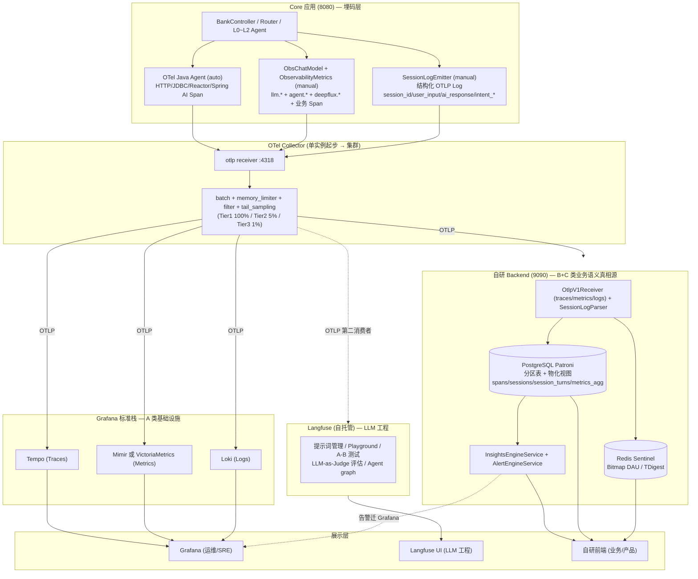
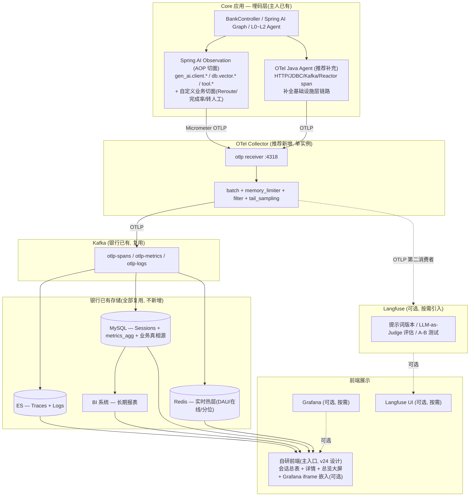
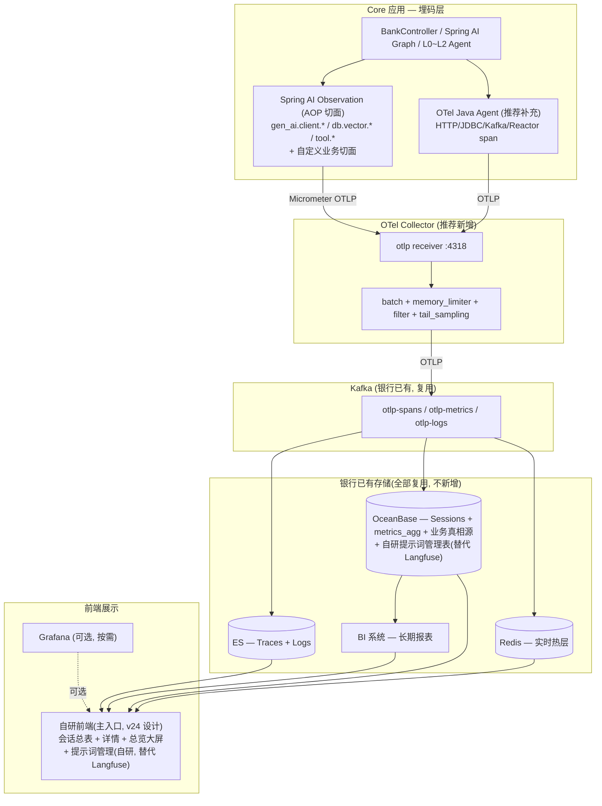

# 可观测架构业界调研与重构建议

> **文档目的**：基于业界主流 OTLP 可观测方案调研，回答主人对项目当前 V4/V6 设计的核心疑问，给出生产优先 + Demo 极简两套独立技术方案。
> **写作原则**：纯技术讨论，不考虑现有代码改造工作量、不绑定 V4/V6 过程稿；只回答"业界怎么做的、应该怎么做"。
> **调研时间**：2026-07-26
> **调研来源**：CNCF 官方博客、OpenTelemetry 官方文档、Grafana Labs 文档、Langfuse 官方、ClickHouse/VictoriaMetrics 技术博客、业界 LLM 可观测平台对比（Agenta/Maxim/Arize）等。

---

## 0. 执行摘要（先看结论）

### 主人的 4 个疑问，一句话回答

| 疑问 | 一句话回答 |
|---|---|
| 为什么要 4 种插桩方法？ | **业界标准就是 auto + manual 两种互补**，4 种里只有 3 种是合理的（Java Agent 自动 + ObsChatModel 业务 + ObservabilityMetrics 业务计数），第 4 种 SessionBridge 走独立 HTTP 是项目自创，**应改走 OTLP Log**。 |
| 可以只用一种插桩方法吗？ | **不行**。Java Agent 自动覆盖 HTTP/JDBC 等基础设施调用，但看不见业务逻辑；业务领域 Span/Counter 必须手动写。业界共识："Use both: auto for infrastructure, manual for business operations"（dash0/openobserve/CNCF 一致）。 |
| 是否 LOG/Metrics/Trace/Session 可以一套架构统一？ | **可以且应该**。OTLP 协议原生支持 Traces + Metrics + Logs 三信号统一传输，**Session 不是独立的遥测信号**，应作为 OTLP Log 的一种结构化 payload 传输。一套 Collector + 一套 OTLP 协议即可。 |
| 为什么别人 Prometheus+Loki+Tempo+OTel 就够，我们这么复杂？ | **基础架构确实就这 4 件套**，项目复杂度来自 3 个真实增量需求：① LLM 应用需要 Langfuse 做提示词/评估（普通应用不需要）；② AI 业务语义需要自研前端展示意图/会话（Grafana 不擅长）；③ Kafka/Collector 集群是量级驱动（日均 Span 2000 万+），Demo 不需要。**剥掉这 3 个增量，就是业界标准 LGTM 栈**。 |

### 推荐方案速览

| 阶段 | 埋码 | 采集 | 存储 | 展示 |
|---|---|---|---|---|
| **生产（推荐）** | Java Agent(自动) + ObsChatModel+Metrics(手动) + SessionLogEmitter(手动→OTLP Log) | OTel Collector 单实例起步，量级到再上集群 | Tempo+Mimir+Loki+PostgreSQL+Langfuse | Grafana + Langfuse UI + 自研前端 |
| **Demo（极简）** | 同上 | OTel Collector 单实例 | Tempo+Loki+Prometheus(或 VM 单机)+H2/SQLite+Langfuse(可选 docker) | Grafana + 自研前端 |

---

## 一、关于"4 种插桩方法"的深度回答

### 1.1 业界标准：auto + manual 两种互补，不可互替

OpenTelemetry 官方文档（[Java getting_started](https://opentelemetry.io/docs/java/getting_started)）明确把 Java 插桩分为 5 个类别：

| 类别 | 描述 | 是否需要改代码 |
|---|---|---|
| Zero-code: Java agent | 字节码注入，自动插桩 HTTP/JDBC/gRPC/Kafka 等主流库 | 否 |
| Zero-code: Spring Boot starter | 利用 Spring autoconfigure 装配 | 否 |
| Library instrumentation | 包装库的扩展点 | 需安装 |
| Native instrumentation | 库自带 OTel 集成 | 库方维护 |
| Manual instrumentation | 应用作者手写业务 Span | 是 |

业界权威建议（dash0、openobserve、CNCF）一致：

> **"Start with the Java agent. It covers 80-90% of infrastructure spans. Use manual SDK when you need business context."**
> —— [dash0: OTel Auto-instrumentation in Java](https://www.dash0.com/guides/opentelemetry-autoinstrumentation-in-java)

> **"Use both: auto for infrastructure, manual for business operations."**
> —— [nitinkc: OpenTelemetry Deep Dive](https://nitinkc.github.io/Microservices-Design-Architecture/07.05-opentelemetry)

理由很简单：
- Java Agent 只能在**库的边界**（HTTP 请求进出、JDBC 调用前后）拦截，**看不见业务逻辑内部**。
- 业务领域的 Span（如"用户提现流程开始"、"意图路由判定 L0→L1"）和指标（如"意图准确率"、"reroute 触发次数"）必须手动埋码，因为 Agent 不知道这些业务概念的存在。

### 1.2 项目 4 种插桩方法逐项审视

把项目的 4 种方法对齐到业界标准框架：

| 项目方法 | 业界对应类别 | 是否冗余？ | 评价 |
|---|---|---|---|
| **OTel Java Agent** | Zero-code: Java agent | 否 | ✅ 业界标准，必备。覆盖 HTTP Server/Client、JDBC、Reactor、Spring AI 调用等基础设施 span。 |
| **ObsChatModel**（LLM 装饰器） | Manual instrumentation | 否 | ✅ 业界标准。LLM 调用是业务领域操作，Java 栈无 OpenLLMetry 官方探针（仅 Python/Node 有），自研必要。Spring AI 1.x 的 auto-observation 只给 `gen_ai.client.operation.duration` 一个指标，缺 token、TTFT、错误分类，必须手动补。 |
| **ObservabilityMetrics**（业务 Counter/Timer） | Manual instrumentation | 否 | ✅ 业界标准。意图准确率、reroute 率、完成率等是 AI 业务语义指标，Agent 不可能自动埋。 |
| **SessionBridge**（HTTP POST :9090） | ❌ 业界无对应 | **是冗余** | 🔴 项目自创模式。会话数据本可作为结构化 OTLP Log 走统一管道，独立 HTTP 是历史包袱。 |

### 1.3 核心结论

**"4 种"实际是 "3 种合理 + 1 种冗余"**：
- Java Agent + ObsChatModel + ObservabilityMetrics 是**分层互补**，不是重复采集。
  - Agent 管"基础设施层"（HTTP/JDBC/Reactor）
  - ObsChatModel 管"LLM 调用层"（token/TTFT/置信度）
  - ObservabilityMetrics 管"业务语义层"（意图/路由/完成率）
- 三者采集的数据维度几乎不重叠，类似"摄像头的不同角度"。
- **SessionBridge 是唯一真正冗余的**——它重复发明了 OTLP Log 已解决的问题（结构化数据传输）。

### 1.4 数据是否真的"重复采集、浪费内存"？

不重复。但需要注意**指标命名漂移**风险：
- Spring AI 1.x auto-observation 会产生 `gen_ai.client.operation.duration`
- ObsChatModel 也产 `llm.operation.duration`
- 这两个**测的是同一个 LLM 调用的耗时**，确实有重叠

正确处理（业界做法）：
- **保留 ObsChatModel 作为主**（含 token、TTFT、置信度，比 Spring AI 内置更全）
- **关闭 Spring AI auto-observation** 或将其作为"追加属性"（`gen_ai.*` 标准命名兼容层），不当独立指标消费
- 项目 V6 §16.2 的"保留自研 + 追加 gen_ai.* 属性"决策符合业界做法

---

## 二、关于"一套架构统一 LOG/Metrics/Trace/Session"的回答

### 2.1 OTLP 协议原生支持三信号统一

OpenTelemetry 的核心设计就是**一套协议（OTLP）传三种信号**：

```
Traces  ─┐
Metrics ─┼─→ OTLP/HTTP :4318 (/v1/traces, /v1/metrics, /v1/logs)
Logs    ─┘
```

OTel Collector 内部用 3 条 pipeline 分别处理，但**接收端只有一个端口、一个进程、一份配置**。这是 CNCF 推广 OTel 的核心理念：

> **"Instrument once. Observe anywhere."** —— [CNCF 2025 OTel unified case study](https://cncf.io/blog/2025/11/27/from-chaos-to-clarity-how-opentelemetry-unified-observability-across-clouds)

### 2.2 Session 不是独立遥测信号，应作为 OTLP Log 传输

OpenTelemetry 规范只定义了 4 种信号：Traces、Metrics、Logs、Baggage。**Session 不在其中**。

会话数据（用户输入 + AI 回复 + 元数据）的本质是**结构化业务事件**，正确做法是：

```java
// 不推荐：HTTP POST 私路
sessionBridge.reportSession(...);

// 推荐：结构化 OTLP Log
logger.info("session.replay")
    .with("session_id", sessionId)
    .with("user_input", userInput)
    .with("ai_response", aiResponse)
    .with("intent_l0", l0Intent)
    .with("agent_path", agentPath)
    .log();
// 经 opentelemetry-logback-appender → OTLP Log → Collector → 后端 sessions 表
```

**关键优势**：
1. **协议统一**：消灭第二条传输协议（HTTP POST :9090），所有遥测都走 OTLP。
2. **不受 Trace 采样影响**：OTLP Log 是独立 pipeline，trace 5% 采样不会丢 95% 会话。这点 V6 文档已正确识别（§2.3 两条独立管道原则）。
3. **天然 100% 捕获**：日志天然全量，符合银行审计要求。
4. **复用现有管道**：logback-appender 已经存在，零新组件。

### 2.3 一套架构是否可行？答案：可以

业界 2025 年的实际落地呈现**两种路线**，都需要"一套采集 + 一套协议"，区别在存储：

| 路线 | 存储 | 优点 | 缺点 | 适合场景 |
|---|---|---|---|---|
| **A. LGTM 分层栈**（主流） | Tempo(Trace)+Mimir/Prometheus(Metric)+Loki(Log) | 每信号独立优化，社区成熟，Grafana 统一 UI 关联 | 3 个 DB 运维，跨信号 JOIN 难 | 中等规模，Grafana 系偏好 |
| **B. ClickHouse 统一栈**（新兴） | ClickHouse 单 DB 存三信号 | SQL JOIN 跨信号，运维一个 DB | 单一系统，需调优 | 超大规模，强关联分析需求 |

权威声音：
- **ClickHouse 官方**：["The unified SQL model treats observability as a single analytical data problem. All telemetry flows into one database."](https://clickhouse.com/resources/engineering/observability-tco-cost-reduction)
- **Dynatrace**：["Thinking of observability in terms of the traditional three pillars limits the value... To leverage the true power of observability, you need a single pane of glass."](https://dynatrace.com/news/blog/unified-observability-why-storing-opentelemetry-signals-in-one-place-matters)
- **eidm.co.za 2025**：["The siloed LGTM model perpetuates the 'three silos' problem. The ClickHouse unified model is the only approach that natively supports full-stack correlation."](https://eidm.co.za/2025/11/09/the-ultimate-guide-to-open-source-observability-in-2025-from-silos-to-stacks)

**VictoriaMetrics 团队的实测对比**（10,000 spans/s 持续负载）：
- CPU：VictoriaLogs(0.5 vCPU) < ClickHouse(0.69) < Tempo(1.35)
- 内存：ClickHouse(1.12GiB) ≈ VictoriaLogs(1.15) < Tempo(4.26，最终 OOM)
- Tempo 用对象存储压缩率不如 ClickHouse

**结论**：项目作为银行 LLM 应用，B 类信号（LLM 性能、会话回放、意图分析）需要 PostgreSQL 关系查询（业务真相源），所以**最合理是 LGTM 分层栈 + PostgreSQL 业务真相源 + Langfuse LLM 工程平台**。ClickHouse 统一栈适合纯运维场景，不适合需要复杂业务 SQL 的 AI 应用。

---

## 三、业界主流可观测架构全景

### 3.1 4 层标准架构

```
┌─────────────────────────────────────────────────────────────┐
│ ① 埋码层 (Instrumentation)                                  │
│   ├─ Java Agent (auto)        — HTTP/JDBC/gRPC/Kafka      │
│   ├─ Manual SDK (business)    — 业务 Span + Counter       │
│   └─ Log Bridge (logs)        — logback-appender → OTLP   │
└──────────────────────┬──────────────────────────────────────┘
                       │ OTLP/HTTP :4318
┌──────────────────────▼──────────────────────────────────────┐
│ ② 采集层 (Collector)                                        │
│   OTel Collector 或 Grafana Alloy (二选一)                  │
│   receivers → processors(batch/filter/sampling) → exporters│
└──────────────────────┬──────────────────────────────────────┘
                       │ OTLP
┌──────────────────────▼──────────────────────────────────────┐
│ ③ 存储层 (Storage) — 路线 A: LGTM + 业务真相源              │
│   ├─ Tempo          — Traces                              │
│   ├─ Mimir/Prometheus — Metrics                           │
│   ├─ Loki           — Logs                                │
│   ├─ PostgreSQL     — 业务语义真相源 (sessions/spans/metrics_agg) │
│   └─ Langfuse       — LLM 工程 (OTLP 第二消费者)            │
└──────────────────────┬──────────────────────────────────────┘
                       │
┌──────────────────────▼──────────────────────────────────────┐
│ ④ 展示层 (UI) — 三角色三入口                                │
│   ├─ Grafana        — 运维/SRE 看基础设施                   │
│   ├─ Langfuse UI    — LLM 工程团队看提示词/评估             │
│   └─ 自研前端       — 业务/产品看 AI 业务洞察               │
└─────────────────────────────────────────────────────────────┘
```

### 3.2 Grafana Alloy vs OTel Collector 怎么选？

**官方定位**（[Grafana 文档](https://grafana.com/docs/grafana-cloud/monitor-infrastructure/otlp/send-data-otlp/)）：
- **Alloy 是 OTel Collector 的 Grafana 系发行版**，包了上游 OTel Collector 组件 + Prometheus exporters。
- 上游 OTel Collector 也完全支持，只是需要额外维护。

**业界选型建议**：
| 场景 | 推荐 | 理由 |
|---|---|---|
| 全 Grafana 栈（Tempo+Mimir+Loki+Grafana） | **Alloy** | River 配置语言更强，内置 clustering，UI 可视化组件图 |
| 需要多后端/vender-neutral | **OTel Collector** | contrib 仓库 200+ 组件，最灵活 |
| 已有 Prometheus 生态 + 想统一 | **Alloy** | 单二进制统一 OTLP+Prom+Loki |
| 项目当前阶段 | **OTel Collector** | 已用 otelcol-contrib 0.156.0，无迁移必要 |

**项目建议**：保留 OTel Collector，不急着换 Alloy。Alloy 的优势在超大规模集群自动协调，单实例场景 OTel Collector 完全够用。

### 3.3 Langfuse vs 自研 Backend：互补不互替

Langfuse 在 2025 年是 LLM 可观测事实标准（[Agenta/Maxim/Arize 对比](https://agenta.ai/blog/top-llm-observability-platform)）：
- MIT 开源，可自托管
- OTel native，消费同一份 OTLP 遥测
- 50M+ SDK installs/month，2300+ 客户
- 底层用 ClickHouse + Redis queue + S3

**Langfuse 补齐的能力**（自研 Backend 做不了或代价高）：
- 提示词版本化 + Playground + A/B 测试
- LLM-as-Judge 自动评估
- Agent graph 可视化（多步调用链图）
- 成本追踪（按模型/用户/会话）

**自研 Backend 仍需保留的能力**（Langfuse 不做）：
- AI 业务语义洞察（意图准确率分层、reroute 漏斗、转化率）
- 银行特有的会话回放（带 PII 脱敏）
- 告警引擎（钉钉/企微通知）
- 物化视图预聚合（按小时/天）

**官方关系**：Langfuse 是 OTLP **第二消费者**，叠加而非替换。
```
Core OTel → Collector → ① 自研 Backend (业务真相源, PG)
                        → ② Langfuse (LLM 工程平台)
                        → ③ Tempo/VM/Loki (基础设施)
```

### 3.4 Kafka 缓冲层：量级驱动，不是逻辑必需

Kafka 的必要性完全由 Span 吞吐量决定：

| 日均 Span 量 | 是否需要 Kafka | 说明 |
|---|---|---|
| < 1000 万 | ❌ 不需要 | Collector batch + file_storage 持久化队列足够 |
| 1000 万 - 5000 万 | ⚠️ 可选 | 取决于峰值 QPS，可先观察 Collector 背压 |
| > 5000 万 | ✅ 需要 | 日均 2000-6000 万 Span 直压后端不可行 |

项目 V6 假设"日均 2000-6000 万 Span"是按银行 DAU 100-300 万估算，**Demo 阶段几十请求/秒完全不需要**。生产阶段也需要看真实峰值，不应一开始就上 Kafka。

---

## 四、推荐方案：生产（优先级最高）

### 4.1 设计原则

1. **一协议**：OTLP（HTTP :4318）
2. **一采集器**：OTel Collector（单实例起步，量级到再上集群）
3. **三埋码入口**：Java Agent（auto）+ ObsChatModel+Metrics（manual）+ SessionLogEmitter（manual → OTLP Log）
4. **三消费者**：自研 Backend（B+C 类业务语义）+ Langfuse（LLM 工程）+ LGTM 栈（A 类基础设施）
5. **三 UI**：Grafana + Langfuse UI + 自研前端
6. **存储分层**：PostgreSQL（业务真相源 7d 热/90d 温）+ S3/MinIO（3 年冷归档）

### 4.2 目标架构图



### 4.3 关键组件选型理由

| 层 | 选型 | 替代选项 | 选择理由 |
|---|---|---|---|
| 协议 | OTLP/HTTP | OTLP/gRPC | HTTP 更易穿透防火墙，调试方便；gRPC 性能略好但银行环境代理麻烦 |
| 采集器 | OTel Collector | Grafana Alloy | 已用 otelcol-contrib，contrib 生态丰富；Alloy 优势在集群自动协调，单实例场景无差异 |
| Trace 存储 | Tempo | Jaeger + ES | Tempo 对象存储后端便宜，与 Loki 同源可关联；Jaeger+ES 内存吃紧（VictoriaMetrics 实测 Tempo OOM） |
| Metric 存储 | VictoriaMetrics 或 Mimir | Prometheus | VM 单机性能 10× Prometheus，PromQL 兼容；Mimir 是 Grafana 系分布式版 |
| Log 存储 | Loki | ELK | Loki 标签索引便宜，与 Grafana 一体；ELK 重资源 |
| 业务真相源 | PostgreSQL | MySQL | 分区表 + 物化视图 + PgBouncer 成熟；银行场景关系库审计友好 |
| LLM 工程 | Langfuse | OpenLLMetry + 自建 | Langfuse 是 LLM 可观测事实标准；OpenLLMetry 仅采 trace 不含提示词管理/评估 |
| 告警 | Grafana Alerting | 自研 AlertEngine | Grafana 告警规则 UI 化，统一收口；自研维护成本高 |
| 缓冲（生产可选） | Kafka | Redis Stream | Kafka 削峰/解耦/回放成熟；只在日均 Span >2000 万时上 |

### 4.4 分阶段实施建议

| 阶段 | 目标 | 关键组件 |
|---|---|---|
| **P0 基础就位** | OTLP 三信号打通 + 业务真相源 | OTel Collector 单实例 + Tempo + Loki + VM + PostgreSQL + Redis Sentinel + 自研前端 |
| **P1 LLM 工程平台** | Langfuse 接入 + 分级采样 | Langfuse 自托管 + tail_sampling（Tier1 100%/Tier2 5%/Tier3 1%）+ 提示词迁入 |
| **P2 HA + 合规** | 高可用 + 银保监合规 | PG Patroni + Redis Sentinel + Collector 集群（按需）+ TLS 全链路 + RBAC + 3 年冷归档 |
| **P3 量级扩容（按需）** | Kafka 削峰 | 仅当真实日均 Span 突破 2000 万再上 Kafka + Collector 集群 |

### 4.5 关键修正点（vs V6 设计）

| # | V6 设计 | 建议修正 | 理由 |
|---|---|---|---|
| 1 | SessionBridge 走 HTTP POST :9090 | **改 OTLP Log 经 Collector** | 统一协议，消灭第二条传输管道，仍保持 Trace 采样独立性 |
| 2 | Collector 集群 3 实例 + Nginx | **单实例起步，量级到再扩** | 银行初期 DAU 远低于 100 万设计目标，过早集群是过度设计 |
| 3 | Kafka 缓冲层（P2 必装） | **延后到 P3，量级驱动** | 日均 2000 万 Span 是按 DAU 300 万估算，初期不必 |
| 4 | H2 → PostgreSQL（P0 即迁） | 同意，银行量级必须 | H2 独占锁不可接受 |
| 5 | Alloy 替换 Collector（P2） | **不替换，保留 OTel Collector** | 项目已用 otelcol-contrib，contrib 生态比 Alloy 更全；Alloy 优势在集群协调，单实例无差异 |
| 6 | Grafana Alloy + Tempo + VM + Loki + Kafka + Langfuse + PG + Redis（8 组件） | 同上但**减 Kafka**（P3） | 7 组件生产够用，Kafka 等量级到 |
| 7 | 自研 AlertEngine → P2 迁 Grafana | 同意 | Grafana Alerting 统一告警入口，规则 UI 化 |

---

## 五、推荐方案：Demo（极简）

### 5.1 设计原则

1. **一协议 + 一采集器 + 单机存储**
2. **不引入 Kafka / 不上集群 / 不上 Langfuse 生产化**
3. **保留自研前端核心 8 页**（这是 LLM 应用的差异化价值）
4. **PG 可降级为 SQLite 或 H2**（Demo 量级够用）

### 5.2 目标架构

```
┌────────────────────────────────────────────────────────┐
│ Core 应用 (8080)                                       │
│   Java Agent + ObsChatModel + SessionLogEmitter       │
└─────────────────┬──────────────────────────────────────┘
                  │ OTLP :4318
┌─────────────────▼──────────────────────────────────────┐
│ OTel Collector (单实例, otelcol-contrib)              │
│   batch + memory_limiter + filter (无 tail_sampling)  │
└──────┬──────────────┬──────────────┬──────────────────┘
       │              │              │
┌──────▼─────┐  ┌─────▼─────┐  ┌─────▼──────┐
│ Tempo      │  │ Loki      │  │ Prometheus │
│ (Traces)   │  │ (Logs)    │  │ (Metrics)  │
└──────┬─────┘  └─────┬─────┘  └─────┬──────┘
       │              │              │
       └──────────────┴──────────────┘
                      │
              ┌───────▼────────┐
              │   Grafana      │
              │ (统一看板/告警) │
              └────────────────┘

       另一支路: OTLP → 自研 Backend (9090)
                     ↓
                H2 或 PostgreSQL
                     ↓
              自研前端 8 页
```

### 5.3 Demo 与生产的差异

| 维度 | Demo | 生产 |
|---|---|---|
| 采集器 | OTel Collector 单实例 | OTel Collector 集群（按需） |
| Trace 存储 | Tempo 单实例 | Tempo 集群 + 对象存储 |
| Metric 存储 | Prometheus 单机 | VictoriaMetrics 集群 或 Mimir |
| Log 存储 | Loki 单实例 | Loki 集群 + 对象存储 |
| 业务真相源 | H2 或 PostgreSQL 单机 | PostgreSQL Patroni 集群 |
| Redis | 单机（或不用） | Sentinel 集群 + Bitmap + TDigest |
| LLM 工程平台 | Langfuse docker-compose（可选） | Langfuse 自托管生产化（PG+对象存储+RBAC） |
| 告警 | Grafana Alerting（基础规则） | Grafana Alerting HA + 钉钉/企微集成 |
| 缓冲 | 无 | Kafka（仅当日均 Span >2000 万） |
| 采样 | 不采样（全量） | tail_sampling 分级（Tier1 100%/Tier2 5%/Tier3 1%） |
| 合规 | 无 | TLS + RBAC + PII 三道防线 + 3 年冷归档 |

### 5.4 Demo 落地步骤（最小可行）

1. **保留现有 OTel Collector 配置**（已有 batch + memory_limiter + filter）
2. **新增 Tempo + Loki + Prometheus 三件套**（docker-compose 一键起）
3. **Grafana 配置三个数据源**（Tempo/Loki/Prometheus）
4. **SessionBridge 改造为 SessionLogEmitter**（@Async 改 log.info 结构化）
5. **自研 Backend 增加 OTLP Log 解析器**（识别 `session.replay` 日志写入 sessions 表）
6. **自研前端保留 8 页**（核心差异化价值）
7. **Langfuse 可选**：`docker compose up` 验证 trace 入 Langfuse

---

## 六、关于"为什么别人 Prometheus+Loki+Tempo+OTel 就够"

### 6.1 业界标准确实就是这 4 件套

```
OTel SDK/Agent → OTel Collector → Tempo + Loki + Prometheus/Mimir → Grafana
```

这是 CNCF 推荐的 [production observability architecture](https://grafana.com/docs/grafana-cloud/monitor-infrastructure/otlp/send-data-otlp/) 标准形态。

### 6.2 项目复杂度的 3 个真实增量

| 增量 | 业界普通应用是否需要 | 项目需要的原因 |
|---|---|---|
| **Langfuse** | ❌ 不需要 | ✅ LLM 应用需要提示词版本/评估/Agent graph，普通应用无此需求 |
| **自研前端** | ❌ 不需要 | ✅ AI 业务语义（意图准确率/会话回放/reroute 漏斗）Grafana 不擅长 |
| **Kafka + Collector 集群** | ❌ 不需要 | ⚠️ 仅当日均 Span >2000 万才需要，Demo 不需要 |

### 6.3 剥掉增量后的项目架构 = 业界标准

```
OTel Agent + Manual SDK → OTel Collector → Tempo + Loki + Prometheus → Grafana
                                          ↓
                                    PostgreSQL (业务真相源)
                                          ↓
                                    自研前端 (B+C 类洞察)
```

**这就是项目应有的最小生产架构**。Langfuse 是 LLM 应用带来的增量，Kafka 是量级带来的增量，都不是基础架构的复杂度。

### 6.4 关于"数据在不同方法之间重复采集"

实际不重复，但需要避免命名漂移：
- Java Agent 产 `http.server.duration`、`db.client.operation.duration` 等基础设施指标
- ObsChatModel 产 `llm.token.input`、`llm.first_token.latency`、`llm.confidence` 等 LLM 业务指标
- ObservabilityMetrics 产 `agent.intent.accuracy`、`deepflux.workflow.pending_approval` 等业务语义指标
- **三者维度不重叠**：Agent 管基础设施，ObsChatModel 管 LLM 调用，ObservabilityMetrics 管业务语义

唯一需要警惕的重复：
- Spring AI 1.x auto-observation 的 `gen_ai.client.operation.duration` 与 ObsChatModel 的 `llm.operation.duration`
- 解决：保留 ObsChatModel（更全），关闭 Spring AI auto-observation 或仅作属性追加

---

## 七、关键风险与防御

| 风险 | 防御措施 |
|---|---|
| Trace 采样导致会话丢失 | Session 走 OTLP Log 独立 pipeline，不受 trace 采样影响 |
| Collector 重启丢内存队列 | 生产用 `file_storage` 持久化发送队列（`sending_queue.storage: file_storage`） |
| 高基数指标爆炸 | 严格遵循"基数 <200 才进 Metric Tag"原则，高基数字段（traceId/sessionId/userId）归 Span attributes |
| PII 泄露合规 | 三道防线：① Core 端正则脱敏 ② Collector redaction processor ③ 网关级 Presidio 检测 |
| Langfuse 与自研 Backend 数据双写不一致 | Langfuse 是只读消费者（OTLP 第二消费者），不写业务数据；真相源始终在 PG |
| Collector 单点故障 | 量级到时上集群（≥2 实例 + Nginx LB），file_storage 共享存储 |
| 命名漂移 | 所有 Meter/Counter 集中在 ObservabilityMetrics 管理，禁止散落 `meterRegistry.counter("xxx")` |

---

## 八、附录：调研来源汇总

### 8.1 官方文档
- [OpenTelemetry 官方](https://opentelemetry.io) — CNCF graduated project, 三信号统一
- [OpenTelemetry Java getting_started](https://opentelemetry.io/docs/java/getting_started) — 5 类插桩分类
- [Grafana Cloud OTLP endpoint](https://grafana.com/docs/grafana-cloud/monitor-infrastructure/otlp/send-data-otlp/) — 推荐生产架构
- [Grafana Alloy setup](https://grafana.com/docs/grafana-cloud/monitor-applications/application-observability/setup/collector/grafana-alloy) — Alloy 配置示例
- [Langfuse 官方](http://langfuse.com) — 50M+ SDK installs, ClickHouse 后端
- [CNCF 2025 Observability Trends](https://www.cncf.io/blog/2025/03/05/observability-trends-in-2025-whats-driving-change/) — OTel 成为默认标准
- [CNCF OTel unified case study](https://cncf.io/blog/2025/11/27/from-chaos-to-clarity-how-opentelemetry-unified-observability-across-clouds) — Instrument once, observe anywhere

### 8.2 技术对比
- [Grafana Alloy vs OTel Collector](https://www.algoroq.io/compare-tech/grafana-alloy-vs-otel-collector) — River 配置 vs YAML, clustering 差异
- [Top LLM Observability platforms 2025](https://agenta.ai/blog/top-llm-observability-platform) — Langfuse/Agenta/Lunary/Braintrust 对比
- [Top 5 AI Agent Monitoring 2025](https://getmaxim.ai/articles/top-5-ai-evaluation-tools-in-2025-comprehensive-comparison-for-production-ready-llm-and-agentic-systems-2/) — Langfuse/Phoenix/Maxim 对比
- [VictoriaMetrics Tracing 比较](https://victoriametrics.com/blog/dev-note-distributed-tracing-with-victorialogs) — VictoriaLogs vs ClickHouse vs Tempo 实测
- [ClickHouse TCO guide](https://clickhouse.com/resources/engineering/observability-tco-cost-reduction) — 统一 SQL 模型 vs 分层栈
- [Dynatrace unified observability](https://dynatrace.com/news/blog/unified-observability-why-storing-opentelemetry-signals-in-one-place-matters) — 三信号应存一处
- [eidm.co.za 2025 OSS observability guide](https://eidm.co.za/2025/11/09/the-ultimate-guide-to-open-source-observability-in-2025-from-silos-to-stacks) — LGTM 栈 vs ClickHouse 栈

### 8.3 实战指南
- [dash0: OTel Auto-instrumentation in Java](https://www.dash0.com/guides/opentelemetry-autoinstrumentation-in-java) — auto + manual 互补论
- [deployhq: OTel in Practice](https://www.deployhq.com/blog/opentelemetry-in-practice-setting-up-metrics-traces-and-logs) — 三支柱为什么都需要
- [oneuptime: Auto vs Manual](https://oneuptime.com/blog/post/2026-02-06-compare-opentelemetry-auto-vs-manual-instrumentation/view) — 何时用哪种
- [openobserve: OTel for Java](https://openobserve.ai/opentelemetry/java/) — Java Agent 实战 FAQ
- [HuggingFace: Langfuse Tutorial 2025](https://huggingface.co/blog/daya-shankar-pandey/langfuse-llm-observability-guide) — Langfuse 生产最佳实践
- [jimmysong.io Kubernetes 可观测性](https://jimmysong.io/zh/book/kubernetes-handbook/observability/opentelemetry/) — OTel 在 K8s 中的部署模式

### 8.4 时序数据库对比
- [nullthought: 主流 TSDB 对比](https://nullthought.net/?p=6343) — TimescaleDB/ClickHouse/VM/M3DB/Prometheus 横评

---

## 九、补充澄清：3 个关键问题（2026-07-26 v1.1 增补）

> 主人对 v1.0 方案提出 3 个关键追问，本章节逐个澄清并修正。

### 9.1 问题 1：VM vs Mimir/Prometheus 的选型，V6 用 VM 是对的吗？

**结论：V6 用 VictoriaMetrics 是对的，v1.0 文档表述不准确，本节修正。**

v1.0 文档 §4.3 组件选型表写"VictoriaMetrics 或 Mimir"，Demo §5.2 写"Prometheus（或 VM 单机）"——这个表述给主人造成了"我改了 V6 方案"的误解。**实际我没改，VM 仍是首选**，只是给了一个可替代选项清单。

#### 9.1.1 三者定位澄清

| 组件 | 定位 | 是否纯 DB | 适合场景 |
|---|---|---|---|
| **VictoriaMetrics** | 高性能时序数据库（PromQL 兼容） | ✅ 纯 DB | 单机/集群，压缩率 10× Prometheus，本项目首选 |
| **Grafana Mimir** | Grafana 系分布式 metric 后端 | ✅ 纯 DB | 超大规模集群，需 Grafana 系深度集成 |
| **Prometheus** | 完整监控系统（采集+存储+告警+服务发现） | ❌ 不是纯 DB | 传统 Prom exporter 拉模式架构的核心 |

#### 9.1.2 为什么 V6 选 VM 是对的

V6 文档原话："VictoriaMetrics（集群）— PromQL 兼容、压缩率高 10×"。这个选型理由完全成立：
- **PromQL 100% 兼容**：Grafana 查询无差异
- **压缩率 10×**：相同数据量磁盘占用 1/10
- **单机性能强**：实测 1 台 VM 顶 10 台 Prometheus
- **集群版可选**：量级到时升级 VM 集群，无需换技术栈

#### 9.1.3 修正：Demo 方案的 metric 存储也应统一为 VM

v1.0 §5.2 写"Prometheus（或 VictoriaMetrics 单机）"不准确。**应统一为 VictoriaMetrics 单机**：
- 与生产方案一致（生产 VM 集群，Demo VM 单机）
- 避免 Demo 用 Prom、生产迁 VM 的无谓切换
- VM 单机部署简单（一个二进制），不比 Prom 复杂

### 9.2 问题 2：Prometheus 在 OTel-first 架构里到底用不用？

**结论：在 OTel-first 架构里，Prometheus 的角色弱化甚至不用。主人查的文档对 Prom 定位的描述完全正确，但 OTel 体系下不需要它的"完整监控"能力。**

#### 9.2.1 主人查的文档对 Prometheus 定位的描述

> "Prometheus 不是单纯的'指标数据库'，而是'集指标采集、时序存储、查询计算、告警引擎、服务发现于一体的完整监控系统'，是整个可观测体系的指标数据中枢。存储只是它的基础能力，真正的价值在于标准化的采集体系和强大的计算告警能力。"

这个描述完全准确，是 Prometheus 官方定位。

#### 9.2.2 但在 OTel-first 架构里，Prometheus 的核心价值被 OTel 替代了

| Prometheus 的能力 | OTel-first 架构里由谁负责 | 还需要 Prom 吗 |
|---|---|---|
| **采集（exporter 拉模式）** | OTel Java Agent + Micrometer（push 模式） | ❌ 不需要 |
| **时序存储** | VictoriaMetrics 或 Mimir | ❌ 不需要（VM 更优） |
| **查询计算（PromQL）** | VM/Mimir 兼容 PromQL | ❌ 不需要独立 Prom |
| **告警引擎（Alertmanager）** | Grafana Alerting（统一告警 UI） | ❌ 不需要 |
| **服务发现** | K8s 场景由 OTel Operator 处理 | ❌ 不需要 |

**关键差异**：
- 传统 Prometheus 架构：Prometheus 是核心，应用装 exporter，Prometheus 主动拉数据（pull）
- OTel-first 架构：应用装 OTel Agent，主动推数据（push）到 Collector，Collector 转发给 VM/Mimir 存储

#### 9.2.3 项目里 Prometheus 的最终角色：**不使用**

项目已经用 OTel Java Agent + Micrometer 做采集（push OTLP），用 VictoriaMetrics 做存储，用 Grafana Alerting 做告警——**Prometheus 在这个架构里没有位置**。

唯一例外：如果未来要监控 K8s 集群本身（node_exporter、kube-state-metrics），这些 exporter 是 Prometheus 拉模式的，可以用 VM 的 vmagent 组件替代 Prometheus 拉取（VM 原生支持 Prom 拉模式）。

#### 9.2.4 修正：v1.0 文档中所有"Prometheus"字样应改为"VictoriaMetrics"

涉及位置：
- §4.2 架构图："Mimir 或 VictoriaMetrics" → **VictoriaMetrics（单机起步，集群按需）**
- §4.3 选型表：保持 VM 为首选
- §5.2 Demo 架构图：**Prometheus → VictoriaMetrics 单机**
- §5.3 Demo vs 生产对比表："Prometheus 单机" → **VictoriaMetrics 单机**

### 9.3 问题 3：3 个 UI 太复杂，违背 v24 单系统设计意图

**结论：v1.0 建议的 3 UI 分角色方案确实太复杂，应改为"1 自研 UI 为主入口 + Grafana/Langfuse 作后台专家工具"。v24 HTML 的单系统设计意图是对的，要保留。**

#### 9.3.1 主人的真实诉求

看了 v24 HTML 设计稿，主人的意图非常明确：
- **1 个统一前端**，左侧导航 7 个页面：总览大屏 / 会话回放 / 链路追踪 / AI 洞察 / 日志查询 / 告警规则 / 系统设置
- AI 洞察页 7 个 TAB：智能诊断 / 准确率分析 / Agent 性能 / 业务转化漏斗 / Token 成本 / 外部调用 / 用户满意度
- 所有数据从 Backend API 拉，用户在 1 个系统里看所有东西

v1.0 建议的"Grafana + Langfuse UI + 自研前端"3 UI 方案，要求用户在 3 个系统间切换——**这是过度设计，违背主人意图**。

#### 9.3.2 修正方案：1 自研 UI 为主，Grafana/Langfuse 作后台

| 角色 | 日常使用 | 按需使用 |
|---|---|---|
| **业务/产品** | 自研前端（v24） | — |
| **LLM 工程师** | 自研前端看效果 | Langfuse 改提示词/做评估时打开 |
| **SRE/运维** | 自研前端看告警 | Grafana 排障/查基础设施时打开 |

**关键设计**：
1. **自研前端是唯一主入口**，所有日常数据查询走 Backend API（PG+Redis+VM）
2. **Grafana Panel 可嵌入**：自研前端的关键图表（如 JVM 内存、HTTP QPS）可以用 Grafana iframe Panel 嵌入，免开发
3. **Langfuse deeplink 跳转**：自研前端的 LLM Trace 详情页加"在 Langfuse 中查看"按钮，跳转到 Langfuse 看 Agent graph / 提示词版本
4. **Grafana/Langfuse 是"专家工具"**，不是必用入口——业务/产品完全不打开也能用

#### 9.3.3 这样设计的代价

| 维度 | 代价 | 收益 |
|---|---|---|
| 自研前端开发量 | 高（要把 Grafana/Langfuse 的核心功能 reimplement） | 单一入口，用户体验好 |
| 数据获取 | Backend 要从 VM/Loki/Tempo 查数据 | 数据统一在 Backend 聚合 |
| 维护成本 | 自研前端持续迭代 | 不依赖 Grafana/Langfuse UI 改版 |

#### 9.3.4 何时考虑 3 UI 分角色方案

只在以下场景才考虑 3 UI：
- 团队规模大（>50 人），各角色分工明确
- SRE 团队坚持用 Grafana（已有成熟 dashboard 库）
- LLM 工程团队坚持用 Langfuse（已有提示词实验数据）

项目当前阶段不满足这些条件，**应坚持 1 UI 为主入口**。

### 9.4 v1.1 修正汇总

| # | v1.0 表述 | v1.1 修正 | 理由 |
|---|---|---|---|
| 1 | "VictoriaMetrics 或 Mimir" | **VictoriaMetrics 为首选**，Mimir 仅作大规模集群备选 | V6 选型正确，无需改 |
| 2 | Demo 用 "Prometheus 单机" | **Demo 也用 VictoriaMetrics 单机** | 与生产一致，避免无谓切换 |
| 3 | Prometheus 在架构里有角色 | **Prometheus 不使用** | OTel-first 架构下 Prom 核心能力被 OTel+VM+Grafana Alerting 替代 |
| 4 | "3 UI 分角色"（Grafana+Langfuse+自研） | **1 自研 UI 为主入口，Grafana/Langfuse 作后台专家工具** | 贴合 v24 单系统设计，避免用户在 3 系统间切换 |

---

> **文档版本**：v1.1 · 2026-07-26 · 补充澄清 3 个关键问题
> **v1.0 → v1.1 变更**：澄清 VM/Mimir/Prom 选型 + Prometheus 在 OTel 架构里不使用 + UI 改为 1 自研为主入口
> **前置阅读**：`可观测优化总结-WorkBuddy-V6-生产上线版-0718.md` + `telemetry-target-architecture.md` + `telemetry-architecture-final-v6.md` + `可观测DEMO-v24-WorkBuddy.html`
> **后续动作建议**：基于本文重写 `telemetry-target-architecture.md` v2，落地到 P0-P3 实施计划

---

## 十、银行真实场景：组件引入必要性评估（2026-07-26 v1.2 增补）

> 主人揭示银行真实场景：已有 Spring AI AOP 切面 + Redis/ES/MySQL/BI/Kafka 完整存储栈，需评估引入 OTel 系组件的必要性，给银行审批一个能说服人的理由。

### 10.1 银行当前实现盘点

| 维度 | 当前实现 |
|---|---|
| 埋码 | Spring AI 标准 AOP 切面（基于 Micrometer Observation），采 Graph 节点进出/ChatClient 调用/OverallState 等 |
| 数据入库 | 双写 Redis + MySQL（经 Kafka） |
| 记忆系统 | 长短期记忆从 Redis 和 DB/BI 取数 |
| 可观测一期 | 已实现会话回放 + 链路追踪（session_id + user_id 关联，含外部消息 + 内部 Graph 详情） |
| 可观测二期 | 总览大屏（指标源多，方案分析中） |
| 前端 | 自定义页面：会话总表 + 会话详情 |

### 10.2 问题 1：Spring AOP 切面 vs OTel Java Agent 能力边界

#### 10.2.1 关键澄清：Spring AI observation 本质就是 Micrometer + OTel

主人说的"Spring AI 标准 AOP 切面"不是和 OTel 对立的另一套方案，**而是 OTel 生态的应用层入口**：

```
Spring AI Observation (AOP 切面实现)
    ↓ 基于
Micrometer Observation API
    ↓ 桥接
micrometer-registry-otlp + micrometer-tracing-bridge-otel
    ↓ 导出
OTLP 协议数据
```

[Spring AI 官方文档](https://docs.spring.io/spring-ai/reference/1.0/observability/index.html) 明确：Spring AI 1.0 已内置 observation 机制，自动覆盖 ChatClient/ChatModel/EmbeddingModel/VectorStore/Tool Calling，产 `gen_ai.client.operation.duration`、`gen_ai.client.token.usage` 等标准 OTel 指标。

#### 10.2.2 三层采集能力边界

| 层 | 谁负责 | 采集内容 | 主人现状 |
|---|---|---|---|
| **第 1 层 应用层** | Spring AI observation + 自定义业务切面 | LLM 调用/RAG/Tool/Graph 节点/业务指标（Reroute 率等） | ✅ 已实现 |
| **第 2 层 基础设施层** | OTel Java Agent（字节码注入） | HTTP Server/Client、JDBC、Kafka、Redis 客户端、Reactor 跨线程 context | ❌ 缺失 |
| **第 3 层 JVM/系统层** | 银行已有 ArmsAgent 或类似 | JVM GC/Memory/Thread、CPU/Disk/Network | ✅ 已有（不在本议题） |

#### 10.2.3 主人补充理解完全正确

> "如果是采用 Spring 切面方案，是代表从采集的数据取到 Agent/LLM 等参数，都需要手工定义规则？但是实际上，如果你本来采集的就是自定义业务指标的话（比如 Reroute 率、业务完成率、转人工次数等），使用 OTel SDK 也是一样要手工编写自定义规则，这块也没省多少工作量吧？"

✅ **完全正确**。业务指标无论用 Spring AOP 切面还是 OTel SDK，都要手写规则。引入 OTel Agent **不省业务指标的代码**。

> "但是，如果是对于标准的 OTel AI Agent+LLM 的指标，如 TTFT/TPOT，RAG 相关指标，TOOL&RAG 相关指标，OTel 可以更方便？"

⚠️ **部分正确，需要修正**：
- Spring AI 1.0 observation **已自动覆盖**：ChatClient/ChatModel 调用耗时、token 用量、VectorStore 操作、Tool Calling
- Spring AI observation **未覆盖需手写**：TTFT（流式首 token 延时）、TPOT（每 token 延时）、RAG 召回率等 LLM 应用专属指标
- 引入 OTel Java Agent **也不能自动覆盖这些 LLM 专属指标**——Agent 是基础设施层插桩，看不见 LLM 业务语义
- 所以 TTFT/TPOT 等 LLM 专属指标，**无论用 AOP 还是 OTel Agent，都要手写**（在 ObsChatModel 装饰器或 Spring AI observation handler 里写）

#### 10.2.4 OTel Java Agent 真正的价值在哪里？

| 价值点 | 说明 | AOP 切面能否替代 |
|---|---|---|
| HTTP Server/Client span | 自动采 `/chat` 请求耗时、下游 HTTP 调用耗时 | ⚠️ Controller 切面能采入口，但下游 HTTP client 调用采不到 |
| JDBC span | 自动采 SQL 语句、连接池等待时间 | ❌ AOP 切面切不到 JDBC 内部 |
| Kafka/Redis 客户端 span | 自动采消息发送/缓存读写耗时 | ❌ AOP 切面切不到客户端内部 |
| Reactor 跨线程 context 传播 | 自动修复 traceId 在 Reactor 异步流里丢失 | ❌ AOP 切面在 Reactor 里很难正确传播 context |
| JVM 运行时指标 | GC/内存/线程（虽然 ArmsAgent 也管） | ⚠️ 与银行已有 ArmsAgent 重叠 |

**核心结论**：OTel Java Agent 的价值在**第 2 层基础设施 span**，让链路追踪从"只有业务段"变成"业务段 + HTTP + JDBC + Kafka 完整链路"。

#### 10.2.5 配置化可行性

> "引入组件，可以少写代码？数据运维可以实现配置化？比如以后增加一个新的业务指标，是否能通过配置文件搞定？"

- **基础设施指标**：✅ OTel Agent 配置化，通过环境变量/启动参数 enable/disable 各 instrumentation
- **业务指标**：❌ 无论 AOP 还是 OTel SDK，**业务指标都不能纯配置化**，必须写代码（要计算 Reroute 率就得写判定逻辑）
- **采集开关**：✅ Spring AI observation 已支持配置化开关（`spring.ai.chat.observations.log-prompt=true` 等）

### 10.3 问题 2：传输通道方案

主人说"中间传输通道等细节不清楚"——银行现状是 Spring AOP 采集后双写 Redis + MySQL（经 Kafka）。建议方案的传输通道：

#### 10.3.1 推荐方案：复用银行已有 Kafka，OTel Collector 作为采集网关

```
Spring AI Observation (AOP 切面)
    ↓ Micrometer OTLP Registry
OTel Collector (新增, 单实例)
    ↓ processors: batch + filter + sampling
    ├──→ Kafka (复用银行已有) ──→ Consumer 写 ES（trace/log）+ MySQL（session/metric_agg）
    ├──→ Redis (复用银行已有, 实时热层)
    └──→ [可选] Langfuse (OTLP 第二消费者)
```

**关键设计**：
- **OTel Collector 作为统一采集网关**：所有遥测先到 Collector，再分发
- **复用银行已有 Kafka**：Collector → Kafka → Consumer 写各存储，不引入新队列
- **复用银行已有 ES/MySQL/Redis**：不引入 VM/Tempo/Loki
- **可选 Langfuse**：如果需要 LLM 工程平台，作为 OTLP 第二消费者叠加

#### 10.3.2 不引入 Collector 的简化方案

如果银行审批 OTel Collector 也困难，可以**直接 Micrometer → Kafka**：

```
Spring AI Observation
    ↓ Micrometer Kafka Registry (micrometer-registry-kafka)
Kafka (复用已有)
    ↓
Consumer 写 ES/MySQL/Redis
```

**代价**：失去 Collector 的 batch/filter/sampling/multi-exporter 能力，但银行量级若不大可接受。

### 10.4 问题 3：银行已有存储能否替代新组件？

#### 10.4.1 逐个评估矩阵

| 数据类型 | 银行已有 | 是否够用 | 引入新组件必要性 | 说明 |
|---|---|---|---|---|
| **指标 Metrics** | MySQL + BI | ⚠️ 量级小时够用，量大时吃力 | VM **可选** | 关系库做时序聚合慢，无 PromQL；VM 单机性能 10× MySQL，PromQL 兼容。日均指标查询 <100 万次 MySQL 够用 |
| **链路 Traces** | ES | ✅ 完全够用 | Tempo **不必** | Jaeger+ES 是经典组合，ES 全文检索比 Tempo 强；银行 ES 集群容量足够 |
| **日志 Logs** | ES | ✅ 完全够用 | Loki **不必** | ES 是日志存储事实标准，Loki 是轻量替代品，银行已有 ES 没必要降级 |
| **会话 Sessions** | MySQL | ✅ 完全够用 | PostgreSQL **不必** | 银行 MySQL 集群成熟，会话表量级可控 |
| **业务真相源** | MySQL | ✅ 完全够用 | PostgreSQL **不必** | 同上 |
| **缓存** | Redis | ✅ 完全够用 | — | 已有 |
| **消息队列** | Kafka | ✅ 完全够用 | — | 已有 |
| **LLM 工程平台** | 无 | ❌ 缺失 | Langfuse **可选** | 看是否需要提示词版本管理/LLM-as-Judge 评估/A-B 测试 |

#### 10.4.2 结论

**银行已有存储基本够用**，需要新增的存储组件**只有 1 个可选**：
- **VictoriaMetrics**（可选）：仅当指标查询性能不达标时引入
- **Langfuse**（可选）：仅当需要 LLM 工程平台能力时引入

**不需要引入**：Tempo、Loki、PostgreSQL、Grafana（如果自研前端够用）

### 10.5 问题 4：自研前端下 Grafana/Langfuse 必要性

#### 10.5.1 Grafana 必要性评估

| 场景 | 不引入 Grafana | 引入 Grafana |
|---|---|---|
| 总览大屏（业务指标） | ✅ 自研前端做 | Grafana 也能做但不如自研灵活 |
| 会话回放 | ✅ 自研前端已做 | Grafana 不擅长 |
| 链路追踪详情 | ✅ 自研前端已做 | Grafana Tempo 面板能用，但 ES 查询自研也能做 |
| JVM/HTTP 基础设施看板 | ❌ 自研要重新画 100+ 个现成 panel | ✅ Grafana 现成 dashboard 模板导入即用 |
| 告警规则配置 UI | ❌ 自研要做规则编辑器 | ✅ Grafana Alerting UI 化 |

**结论**：
- 如果银行已有 BI 系统或 ArmsAgent 看板覆盖基础设施监控 → **Grafana 不必引入**
- 如果基础设施看板要从零做 → **Grafana 推荐引入**（省 100+ 看板开发量）
- 如果告警规则要 UI 化配置 → **Grafana 推荐引入**（自研告警规则编辑器成本高）

#### 10.5.2 Langfuse 必要性评估

| 能力 | 不引入 Langfuse | 引入 Langfuse |
|---|---|---|
| 提示词版本管理 | ❌ 自研 prompt 表 + 版本字段 | ✅ 开箱即用，含 Git 集成 |
| LLM-as-Judge 评估 | ❌ 自研评估 pipeline | ✅ 开箱即用，含评分模型管理 |
| A/B 测试 | ❌ 自研分流逻辑 | ✅ 开箱即用 |
| Agent graph 可视化 | ✅ 自研前端已做 Graph 详情 | ✅ Langfuse 也能做，但与自研重复 |
| Trace 查询 | ✅ 自研前端 + ES 查询 | ⚠️ 与自研重复 |

**结论**：
- 如果银行 LLM 工程团队需要提示词版本/评估/A-B → **Langfuse 推荐引入**
- 如果只是会话回放 + 链路追踪 + 总览大屏 → **Langfuse 不必引入**
- Langfuse 是 LLM 工程师工具，不是业务/产品工具，主人 v24 单系统设计不需要它

### 10.6 引入必要性矩阵（用于银行审批）

#### 10.6.1 必须引入（无替代方案）

| 组件 | 必要性 | 理由 |
|---|---|---|
| **micrometer-registry-otlp** | 必须 | 把 Spring AI observation 的 Micrometer 指标桥接到 OTLP 协议，无替代 |
| **micrometer-tracing-bridge-otel** | 必须 | 把 Spring AI observation 的 trace 桥接到 OTel SDK，无替代 |

> 注：这两个是 Maven 依赖（jar 包），不是独立部署组件，银行审批通常不按"开源组件"流程走。

#### 10.6.2 推荐引入（有显著收益）

| 组件 | 必要性 | 理由 | 替代方案 |
|---|---|---|---|
| **OTel Java Agent** | 推荐 | 自动采 HTTP/JDBC/Kafka/Reactor 基础设施 span，补全链路追踪第 2 层；零代码改动，启动参数加 `-javaagent` 即可 | 自研 AOP 切面切 JDBC/Kafka（工作量大，且切不到内部） |
| **OTel Collector** | 推荐 | 统一采集网关，batch/filter/sampling/multi-exporter，配置化运维 | 直接 Micrometer → Kafka（失去 Collector 处理能力） |

#### 10.6.3 可选引入（按需评估）

| 组件 | 必要性 | 引入条件 | 不引入的代价 |
|---|---|---|---|
| **VictoriaMetrics** | 可选 | 指标查询性能不达标时（日均指标查询 >100 万次） | 继续用 MySQL/BI，大看板查询慢 |
| **Langfuse** | 可选 | LLM 工程团队需要提示词版本/评估/A-B 时 | 自研提示词管理表 + 评估 pipeline |
| **Grafana** | 可选 | 基础设施看板要从零做，或告警规则要 UI 化时 | 自研前端画看板 + 自研告警规则编辑器 |

#### 10.6.4 不必引入（银行已有替代）

| 组件 | 不必理由 | 银行已有替代 |
|---|---|---|
| **Tempo** | ES 存 trace 是经典组合，性能足够 | ES（Jaeger+ES） |
| **Loki** | ES 是日志事实标准，Loki 是轻量替代品 | ES |
| **PostgreSQL** | 银行 MySQL 集群成熟 | MySQL |
| **Kafka**（新增） | 银行已有 | Kafka（已有） |
| **Redis Sentinel**（新增） | 银行已有 Redis 集群 | Redis（已有） |
| **Alloy** | OTel Collector 已用，Alloy 是 Grafana 系发行版 | OTel Collector |

### 10.7 贴合银行现状的目标架构（v1.2 刷新）



### 10.8 三套方案对比（按引入范围）

| 方案 | 新引入组件 | 适用场景 | 审批难度 |
|---|---|---|---|
| **最小方案** | micrometer-registry-otlp + micrometer-tracing-bridge-otel（Maven 依赖） | 银行审批极严格，只想最小改动 | ⭐ 极易（jar 包不需审批） |
| **推荐方案** | 最小方案 + OTel Java Agent + OTel Collector | 平衡收益与审批，补全基础设施层链路 | ⭐⭐ 中等（2 个独立部署组件） |
| **完整方案** | 推荐方案 + VictoriaMetrics + Langfuse | 指标性能不达标 + LLM 工程平台需求 | ⭐⭐⭐ 较高（4 个独立部署组件） |

### 10.9 给银行审批的一句话说明

> 本方案仅新增 2 个开源组件（OTel Java Agent + OTel Collector），均为 CNCF 毕业项目 OpenTelemetry 的官方组件，业界 85% 云原生团队采用。新增组件仅负责采集层，**存储层全部复用银行已有 Redis/ES/OceanBase/Kafka/BI**，不引入任何新存储。新增组件部署为无状态单实例，资源消耗 <1C1G，对现有系统零侵入（Java Agent 通过启动参数挂载，Collector 通过 OTLP 协议接收数据）。

---

## 十一、OceanBase 替代 MySQL 的影响评估（2026-07-27 v1.3 增补）

> 主人纠正：银行数据库不是 MySQL，是 OceanBase（国产分布式 HTAP 数据库，MySQL 兼容模式）。本章节评估对方案选型的影响。

### 11.1 OceanBase 关键特性

| 特性 | 说明 | 对方案的影响 |
|---|---|---|
| **MySQL 兼容模式** | SQL 语法、协议几乎无差异 | ✅ 原 MySQL 方案 SQL 零改动可迁移 |
| **原生分布式** | PB 级水平扩展，Shared-Nothing 架构 | ✅ 比 MySQL 单机/集群更强，session 表量级完全不是问题 |
| **HTAP（行列混存）** | 同时支持 OLTP 和 OLAP | ✅ OLAP 查询性能比 MySQL 强，指标聚合查询更有优势 |
| **国产化** | 阿里蚂蚁集团开源，信创合规 | ✅ 符合银行国产化方向 |
| **无 PromQL** | 不支持 Prometheus 查询语言 | ⚠️ 时序指标聚合仍不如专用 TSDB |
| **非专用时序数据库** | 不为时序数据优化 | ⚠️ 大量时序分位查询仍不如 VM |

### 11.2 对存储层结论的影响（正面强化）

| 之前结论（v1.2） | OceanBase 替代后（v1.3） | 影响 |
|---|---|---|
| MySQL 存 session 够用，不必引入 PostgreSQL | ✅ OceanBase 比 MySQL 更强，结论强化 | 正面 |
| MySQL 存 metrics_agg 够用 | ✅ OceanBase HTAP 比 MySQL OLTP 更适合指标聚合 | 正面 |
| 指标性能不达标时可选 VM | ⚠️ OceanBase HTAP 比 MySQL 强，但仍不是专用 TSDB，结论不变 | 中性 |
| 不必引入 PostgreSQL | ✅ OceanBase 完全胜任业务真相源角色，结论更强 | 正面 |

### 11.3 对 Langfuse 的影响（关键负面）

**关键发现**：Langfuse v3 强依赖 PostgreSQL + ClickHouse + Redis + S3，**不支持 OceanBase**。

| Langfuse 版本 | 数据库依赖 | OceanBase 兼容性 |
|---|---|---|
| Langfuse v2 | PostgreSQL（必需） | ❌ 不支持 |
| Langfuse v3 | PostgreSQL（必需）+ ClickHouse（必需）+ Redis + S3 | ❌ 不支持 |

**根本原因**：Langfuse 用 Prisma ORM 做数据库迁移，Prisma 对 PostgreSQL 支持最完整，对 OceanBase 无官方适配。即使 OceanBase MySQL 兼容模式，Prisma 的迁移脚本仍可能因方言差异失败。

#### 11.3.1 三种应对方案

| 方案 | 做法 | 代价 | 适合场景 |
|---|---|---|---|
| **方案 A：放弃 Langfuse** | 自研提示词管理表（OceanBase）+ 自研评估 pipeline | 自研工作量增加，但符合银行国产化方向 | 银行严格国产化（推荐） |
| **方案 B：为 Langfuse 单独引入 PostgreSQL** | Langfuse 用独立 PG 实例，不与业务库混 | 引入新数据库组件，审批难度上升 | 银行允许 PG 但限制用途 |
| **方案 C：用 Langfuse Cloud SaaS** | 不自托管，用 Langfuse 官方云服务 | 银行数据合规通常不允许数据出域 | 一般银行不可行 |

**推荐方案 A**：放弃 Langfuse，自研 LLM 工程能力。理由：
1. 符合银行国产化方向（不引入 PG）
2. 银行 LLM 工程团队对提示词管理的需求可以用自研表 + 版本字段满足
3. 评估 pipeline 可以基于 OceanBase + 自研评分逻辑实现
4. Agent graph 可视化已在 v24 自研前端实现

### 11.4 对其他组件的影响（无影响）

| 组件 | 与 OceanBase 关系 | 影响 |
|---|---|---|
| Jaeger + ES（存 trace） | 无关 | ✅ 无影响 |
| ES（存日志） | 无关 | ✅ 无影响 |
| Redis（实时热层） | 无关 | ✅ 无影响 |
| Kafka（消息队列） | 无关 | ✅ 无影响 |
| OTel Java Agent + Collector | 无关（采集层） | ✅ 无影响 |
| VictoriaMetrics（可选指标存储） | 无关（独立 TSDB） | ✅ 无影响 |

### 11.5 v1.3 引入必要性矩阵刷新

| 等级 | 组件 | v1.2 结论 | v1.3 结论（OceanBase） | 变化 |
|---|---|---|---|---|
| **必须** | micrometer-registry-otlp + tracing-bridge-otel | 必须 | 必须 | 不变 |
| **推荐** | OTel Java Agent + OTel Collector | 推荐 | 推荐 | 不变 |
| **可选** | VictoriaMetrics | 可选 | 可选 | 不变 |
| **可选→排除** | Langfuse | 可选 | **若银行不允许 PG 则排除** | ⚠️ 关键变化 |
| **不必** | Tempo / Loki / PostgreSQL | 不必 | 不必（OceanBase 替代） | 强化 |

### 11.6 v1.3 三套方案刷新

| 方案 | 新引入组件 | 适用场景 | 审批难度 |
|---|---|---|---|
| **最小方案** | micrometer-registry-otlp + tracing-bridge-otel（Maven 依赖） | 银行审批极严格 | ⭐ 极易 |
| **推荐方案** | 最小方案 + OTel Java Agent + OTel Collector | 平衡收益与审批 | ⭐⭐ 中等 |
| **完整方案（v1.3 调整）** | 推荐方案 + VictoriaMetrics（**Langfuse 退出**） | 指标性能不达标时 | ⭐⭐ 中等（比 v1.2 少 1 个组件） |

### 11.7 贴合 OceanBase 现状的目标架构（v1.3 刷新）



### 11.8 v1.3 给银行审批的一句话说明（刷新）

> 本方案仅新增 2 个开源组件（OTel Java Agent + OTel Collector），均为 CNCF 毕业项目 OpenTelemetry 的官方组件，业界 85% 云原生团队采用。新增组件仅负责采集层，**存储层全部复用银行已有 Redis/ES/OceanBase/Kafka/BI**，不引入任何新存储。LLM 工程能力（提示词管理/评估）由自研前端 + OceanBase 表实现，不引入 Langfuse（避开 PostgreSQL 依赖，符合国产化方向）。新增组件部署为无状态单实例，资源消耗 <1C1G，对现有系统零侵入。

---

> **文档版本**：v1.3 · 2026-07-27 · 增补 OceanBase 替代 MySQL 的影响评估
> **v1.2 → v1.3 变更**：新增 §十一 章节，覆盖 OceanBase 对存储层结论的强化 + Langfuse 因 PG 依赖被排除 + 三套方案刷新 + 架构图刷新 + 审批说明刷新
> **前置阅读**：`可观测优化总结-WorkBuddy-V6-生产上线版-0718.md` + `telemetry-target-architecture.md` + `telemetry-architecture-final-v6.md` + `可观测DEMO-v24-WorkBuddy.html`
> **后续动作建议**：基于本文 §十 + §十一 章节向银行提交组件引入审批材料

---

## 十二、银行真实环境最终确认：无 ES/无 Jaeger/无 PG 的存储方案（2026-07-27 v1.4 增补）

> 主人确认银行真实环境：Spring AI 1.1.2 + Spring Boot 3.4.3，DB 只有 OceanBase，**无 Jaeger、无 ES、无 PG**，所有日志已存储于某大数据系统（品牌未知）。本章节给出最终存储方案。

### 12.1 银行真实环境盘点（v1.4 最终）

| 维度 | 银行已有 | 备注 |
|---|---|---|
| 应用框架 | Spring AI 1.1.2 + Spring Boot 3.4.3 | Spring AI 1.1.x observation 比 1.0 更完善 |
| 数据库 | OceanBase（MySQL 兼容模式 + HTAP + 分布式） | 国产化，信创合规 |
| 缓存 | Redis | 已有 |
| 消息队列 | Kafka | 已有，双写 Redis+OceanBase 经 Kafka |
| 日志系统 | 某大数据系统（品牌未知） | 已存储所有日志 |
| BI 系统 | 已有 | 长期报表 |
| **ES** | ❌ 无 | 之前 v1.3 假设"ES 存 trace+log"不成立 |
| **Jaeger** | ❌ 无 | 之前 v1.3 假设"Jaeger+ES 存 trace"不成立 |
| **PostgreSQL** | ❌ 无 | Langfuse 已排除（v1.3 结论） |
| **Tempo/Loki** | ❌ 无 | 之前 v1.0 建议引入，银行无 |
| 自研前端 | v24 单系统 7 页设计 | 已有 |

### 12.2 关键技术验证：Jaeger 不支持 OceanBase

[Jaeger 官方文档](https://www.jaegertracing.io/docs/1.23/features/) 明确支持的存储后端：
- Cassandra 3.4+
- Elasticsearch 7.x/8.x
- OpenSearch 1.0+
- ClickHouse（gRPC 集成）
- Badger（嵌入式，仅开发测试）
- 内存（仅测试）

**Jaeger 不支持 OceanBase**。虽然 Jaeger 提供 gRPC 插件机制可自研存储后端，但工作量巨大且无社区支持，不可行。

### 12.3 无 ES/Jaeger 场景的存储方案重新设计

#### 12.3.1 trace 怎么存？

**方案：OceanBase 存 spans 表 + 自研查询 API**

这其实就是项目当前 demo 的做法（H2 存 spans 表 + TraceQueryService 自研查询），只是把 H2 换成 OceanBase：

```sql
-- OceanBase spans 表（迁移自 H2）
CREATE TABLE spans (
    id BIGINT AUTO_INCREMENT PRIMARY KEY,
    trace_id VARCHAR(64) NOT NULL,
    span_id VARCHAR(32) NOT NULL,
    parent_span_id VARCHAR(32),
    name VARCHAR(256),
    kind VARCHAR(32),
    start_time TIMESTAMP(3) NOT NULL,
    end_time TIMESTAMP(3),
    duration_ms BIGINT,
    status_code VARCHAR(16),
    status_message TEXT,
    attributes JSON,
    events JSON,
    resource_attributes JSON,
    INDEX idx_trace_id (trace_id),
    INDEX idx_start_time (start_time),
    INDEX idx_name (name)
) PARTITION BY RANGE (TO_DAYS(start_time));
```

**性能评估**：
- OceanBase HTAP 列存索引对 span 查询友好
- 日均 Span 2000 万级，按天分区，单分区约 600 万行，OceanBase 单表亿级无压力
- 自研查询 API 复用项目 demo 已有实现（TraceQueryService.listTracesPaginated）

**不引入 Jaeger/Tempo 的代价**：
- ❌ 失去 Jaeger UI 现成的 trace 可视化（瀑布图/服务依赖图）
- ✅ 但自研前端 v24 已实现链路追踪页，用户不需要 Jaeger UI
- ❌ 失去 Jaeger 的 trace 搜索 DSL（但 OceanBase SQL 更灵活）

#### 12.3.2 log 怎么存？

**方案：短期存 OceanBase logs 表，长期归档到银行已有大数据系统**

- 短期（7 天热查询）：OceanBase logs 表
- 长期（90 天-3 年合规归档）：Kafka consumer 转发到银行已有大数据系统
- ⚠️ 需确认大数据系统品牌与 Kafka consumer 对接方式

#### 12.3.3 metrics 怎么存？

**方案：OceanBase metrics_agg 表（首选），VM 可选增强**

- 首选：OceanBase metrics_agg 表 + 物化视图预聚合
- 可选：VictoriaMetrics（仅当 OceanBase 指标查询性能不达标时）
- OceanBase HTAP 列存对聚合查询友好，日均指标量级 <1000 万时完全够用

#### 12.3.4 session 怎么存？

**方案：OceanBase sessions + session_turns 表（已有，无需改动）**

银行已经在用 OceanBase 存 session，方案不变。

### 12.4 v1.4 引入必要性矩阵（最终版）

| 等级 | 组件 | v1.3 结论 | v1.4 结论（无 ES/Jaeger） | 变化 |
|---|---|---|---|---|
| **必须** | micrometer-registry-otlp + tracing-bridge-otel | 必须 | 必须 | 不变 |
| **推荐** | OTel Java Agent | 推荐 | 推荐 | 不变 |
| **推荐** | OTel Collector | 推荐 | 推荐 | 不变 |
| **可选** | VictoriaMetrics | 可选 | 可选（指标性能增强） | 不变 |
| **排除** | Langfuse | 排除（PG 依赖） | 排除 | 不变 |
| **排除** | Tempo | 不必（有 ES） | **排除（无 ES，OceanBase 替代）** | ⚠️ 变化 |
| **排除** | Loki | 不必（有 ES） | **排除（无 ES，OceanBase 替代）** | ⚠️ 变化 |
| **排除** | Jaeger | 未提及 | **排除（不支持 OceanBase）** | ⚠️ 新增排除 |
| **排除** | Elasticsearch | 已有 | **银行无，不引入** | ⚠️ 变化 |
| **排除** | PostgreSQL | 不必 | 不必 | 不变 |

### 12.5 v1.4 三套方案（最终版）

| 方案 | 新引入组件 | 存储方案 | 适合场景 |
|---|---|---|---|
| **最小方案** | micrometer-registry-otlp + tracing-bridge-otel（Maven 依赖） | OceanBase 全部存 | 银行审批极严格 |
| **推荐方案** | 最小方案 + OTel Java Agent + OTel Collector | OceanBase 全部存 + Redis 热层 + 大数据系统归档 | 平衡收益与审批 |
| **完整方案** | 推荐方案 + VictoriaMetrics | OceanBase 存 trace/log/session + VM 存 metrics | 指标性能不达标时 |

### 12.6 v1.4 给银行审批的一句话说明（最终版）

> 本方案仅新增 2 个开源组件（OTel Java Agent + OTel Collector），均为 CNCF 毕业项目 OpenTelemetry 的官方组件。新增组件仅负责采集层，**存储层全部复用银行已有 OceanBase/Redis/Kafka/大数据系统/BI**，不引入任何新存储（无 ES/Jaeger/Tempo/Loki/PostgreSQL）。trace/log/metrics/session 四类数据全部用 OceanBase 存（自研查询 API，项目 demo 已有实现）。LLM 工程能力（提示词管理/评估）由自研前端 + OceanBase 表实现，不引入 Langfuse（符合国产化方向）。新增组件部署为无状态单实例，资源消耗 <1C1G，对现有系统零侵入。

---

> **文档版本**：v1.4 · 2026-07-27 · 增补无 ES/Jaeger 场景的存储方案最终确认
> **v1.3 → v1.4 变更**：新增 §十二 章节，确认银行无 ES/无 Jaeger/无 PG，trace/log/metrics/session 全部用 OceanBase 存储，排除 Tempo/Loki/Jaeger/ES 引入
> **前置阅读**：`可观测优化总结-WorkBuddy-V6-生产上线版-0718.md` + `telemetry-target-architecture.md` + `telemetry-architecture-final-v6.md` + `可观测DEMO-v24-WorkBuddy.html`
> **后续动作建议**：基于本文 §十二 章节刷新 V6/V4 文档，向银行提交组件引入审批材料

---

## 十三、V4 Demo 重新定位 + V6 信创适配（2026-07-28 v1.5 增补）

> 主人纠正：V4 Demo 不是绑死某家银行的系统，而是要做一个**本机通用 AI 可观测演示系统**，可适配大多数银行业务场景。V6 生产方案也要覆盖国内银行主流技术栈，不能只写 OceanBase。

### 13.1 国内银行技术栈主流版本调研

#### Spring Boot 版本

| 版本 | 状态 | 银行采用率 | 说明 |
|---|---|---|---|
| **Spring Boot 3.5.x** | ✅ 最稳生产 | ⭐⭐⭐ 主流 | 商业支持最长至 2032 年，国内银行主推 |
| **Spring Boot 3.4.x** | ✅ 过渡期 | ⭐⭐ 常见 | 主人当前银行版本，仍有大量项目在用 |
| **Spring Boot 3.3.x** | ⚠️ 维护中 | ⭐ 存量 | 早期 Spring AI 1.0 适配版本 |
| **Spring Boot 4.0.x** | ✅ 新 GA | ⭐ 试点 | 2025.11 发布，新项目开始试点 |

**V6 推荐覆盖范围**：Spring Boot 3.3.x ~ 4.0.x，主推 3.5.x

#### Spring AI 版本

| 版本 | 发布时间 | 说明 |
|---|---|---|
| **1.0 GA** | 2025.05 | 首个稳定版，Observation 机制基础 |
| **1.1 GA** | 2025.11 | MCP 整合，850+ 改进，Spring Boot 3.5.11 |
| **1.1.4** | 2026.05 | 最新稳定版，稳定性优化 |
| **2.0-M4** | 2026 | 开发中，Spring Boot 4.0 + Java 21 |

**V6 推荐覆盖范围**：Spring AI 1.0 ~ 2.0，主推 1.1.x

#### Java 版本

| 版本 | 状态 | 说明 |
|---|---|---|
| **JDK 17 LTS** | ✅ 强制最低要求 | Spring Boot 3.x 最低 |
| **JDK 21 LTS** | ⭐ 推荐 | 虚拟线程、模式匹配，2026 主流 |
| **JDK 23/25** | 🔬 前沿 | 非 LTS，不推荐生产 |

**V6 推荐**：JDK 17（最低兼容）+ JDK 21（推荐）

### 13.2 国产信创 DB 主流系统与 SQL 方言分类

2025 年墨天轮流行度 + 银行实际落地，信创 DB 按 SQL 方言分三类：

#### 13.2.1 MySQL 兼容系（JDBC 直连，SQL 方言 = MySQL）

| 数据库 | 厂商 | 银行案例 | V6 适配建议 |
|---|---|---|---|
| **OceanBase** | 蚂蚁集团 | 工商银行、交通银行 | ✅ 第一优先级（已有方案） |
| **TiDB** | PingCAP | 北京银行、银联 | ✅ MySQL 方言，迁移成本低 |
| **TDSQL** | 腾讯 | 张家港农商行、银行子市场 22% | ✅ 金融 MySQL 生态首选 |
| **GoldenDB** | 中兴通讯 | 中信银行核心 | ✅ 金融分布式 |
| **GBase** | 南大通用 | 能源+金融 | ✅ 较广泛 |

#### 13.2.2 PostgreSQL 兼容系（SQL 方言 = PostgreSQL）

| 数据库 | 厂商 | 银行案例 | V6 适配建议 |
|---|---|---|---|
| **openGauss** | 华为开源 | 工商银行、邮储银行 | ✅ 集中式替代 Oracle 首选 |
| **KingbaseES** | 电科金仓 | 政务+金融，营收超 5 亿 | ✅ 双模式(PG/Oracle)，灵活 |
| **PolarDB-PG** | 阿里云 | 云上银行 | ✅ 云原生弹性 |
| **GaussDB** | 华为 | 工行、邮储核心 | ✅ 原生分布式，金融级 |

#### 13.2.3 Oracle 兼容系（SQL 方言 = Oracle）

| 数据库 | 厂商 | 银行案例 | V6 适配建议 |
|---|---|---|---|
| **达梦 DM8** | 武汉达梦 | 政务核心，Oracle 替代 | ⚠️ 需改 JPA dialect + 存储过程重写 |
| **KingbaseES（Oracle 模式）** | 电科金仓 | 双模式可选 | ⚠️ 同上 |

### 13.3 Langfuse 在信创 DB 下的兼容性决策

| DB 方言 | Langfuse 兼容性 | 决策 |
|---|---|---|
| **MySQL 系**（OceanBase/TiDB/TDSQL 等） | ❌ 不兼容（Prisma ORM 无适配） | **排除 Langfuse**，或单独引入 PG 实例给 Langfuse |
| **PG 系**（openGauss/KingbaseES-PG/PolarDB-PG） | ⚠️ 理论兼容（Prisma + PG 方言） | **可选 Langfuse**，需验证 Prisma 迁移脚本兼容性 |
| **Oracle 系**（达梦 DM8 等） | ❌ 完全不兼容 | **排除 Langfuse** |

**结论**：
- PG 兼容信创 DB → Langfuse 可尝试引入
- MySQL/Oracle 兼容信创 DB → Langfuse 被排除，需自研提示词管理
- **关键决策点**：银行用什么信创 DB，决定 Langfuse 能否引入

### 13.4 V4 Demo 重新设计（通用演示系统，本机运行）

#### 13.4.1 Demo 定位

- **不是**某家银行的系统复刻
- **是**一套可在本机（Windows/macOS/Linux）10 分钟跑通的 AI 可观测演示系统
- 展示完整的可观测链路：埋码 → 采集 → 存储 → 展示
- 给银行客户做 POC 演示

#### 13.4.2 三套方案

| | 方案 A：极简 | 方案 B：推荐 ⭐ | 方案 C：完整 |
|---|---|---|---|
| **DB** | H2 文件库（嵌入式，零配置） | H2 文件库（本体）+ Langfuse 容器内 PG+ClickHouse | PostgreSQL（外部安装） |
| **Langfuse** | ❌ 不引入 | ✅ docker compose 一键启动 | ✅ 生产模式 |
| **OTel Agent** | ✅ 挂载 | ✅ 挂载 | ✅ 挂载 |
| **OTel Collector** | ✅ 单实例 | ✅ 单实例 | ✅ 单实例 |
| **自研 Backend** | ✅ H2 版本 | ✅ H2 版本 + OTLP → LF | ✅ PG 版本 |
| **自研前端** | ✅ v24 7 页 | ✅ v24 7 页 | ✅ v24 7 页 |
| **启动耗时** | <5 分钟 | <10 分钟 | <20 分钟 |
| **外部依赖** | 无 | Docker | Docker + PostgreSQL |
| **适合场景** | 快速 POC，最小演示 | 功能最全演示，LLM 工程 | 生产演练，最接近真实 |

#### 方案 B（推荐）完整组件清单

```
本机启动:
├── Core 应用 (8080)           — Spring Boot + OTel Agent
├── OTel Collector (4318)      — 采集网关
├── Backend (9090)             — H2 文件库 + OTLP Receiver
├── 前端 (3000)                — Vite + React v24
└── Docker Compose:
    ├── Langfuse Web (3001)    — LLM 工程平台
    ├── Langfuse Worker         — 异步处理
    ├── PostgreSQL (5432)       — Langfuse 状态存储
    ├── ClickHouse (8123)       — Langfuse OLAP 存储
    ├── Redis (6379)            — Langfuse 缓存
    └── MinIO (9001)            — Langfuse 对象存储
```

**Langfuse Demo 可行性**：✅ docker compose 一键启动，PG/ClickHouse/Redis/MinIO 均在容器内，本机完全可行。不需要单独安装任何数据库。

### 13.5 V6 生产方案信创适配（适配大多数银行）

#### 13.5.1 版本覆盖范围

| 组件 | 覆盖范围 | 主推版本 | 备注 |
|---|---|---|---|
| **Spring Boot** | 3.3.x ~ 4.0.x | 3.5.x | JDK 17 最低，21 推荐 |
| **Spring AI** | 1.0 ~ 2.0 | 1.1.x | Observation 机制 1.0+ 稳定 |
| **Java** | JDK 17 LTS ~ 21 LTS | JDK 21 | 虚拟线程标配 |

#### 13.5.2 信创 DB 适配矩阵（V6 方案提供 3 套 SQL 脚本）

| DB 方言 | 代表产品 | V6 提供 | Langfuse 可选？ |
|---|---|---|---|
| **MySQL 系** | OceanBase / TiDB / TDSQL / GoldenDB / GBase | `schema-mysql.sql` | ❌ 排除 LF，自研提示词管理 |
| **PG 系** | openGauss / KingbaseES / PolarDB-PG | `schema-postgresql.sql` | ✅ 可选 LF（需验证 Prisma） |
| **Oracle 系** | 达梦 DM8 / KingbaseES Oracle 模式 | `schema-oracle.sql` | ❌ 排除 LF，自研提示词管理 |

#### 13.5.3 V6 组件选型最终版（信创适配）

| 信号 | 可选方案 | 决策逻辑 |
|---|---|---|
| **Trace 存储** | OceanBase/TiDB/TDSQL spans 表（MySQL 系）或 openGauss/PolarDB-PG（PG 系）或 达梦DM8（Oracle 系） | 按银行信创 DB 选 SQL 方言 |
| **Metrics 存储** | 同上 metrics_agg 表（首选），VM 可选增强 | 同上 |
| **Log 存储** | 同上 logs 表（短期）+ 大数据系统（长期） | 同上 |
| **Session 存储** | 同上 sessions + session_turns 表 | 同上 |
| **LLM 工程平台** | ① PG 信创 DB → Langfuse 可选 ② 非 PG 信创 DB → 自研提示词管理表 | 按 DB 兼容性决定 |
| **采集器** | OTel Collector 单实例 → 集群 | 与 DB 无关，通用 |

#### 13.5.4 V6 给银行审批的一句话（v1.5 最终版）

> 本方案仅新增 2 个开源组件（OTel Java Agent + OTel Collector），均为 CNCF 毕业项目 OpenTelemetry 的官方组件。新增组件仅负责采集层，**存储层全部复用银行已有信创数据库/Redis/Kafka/大数据系统/BI**，不引入任何新存储。方案提供 MySQL 系 / PG 系 / Oracle 系三套 SQL 脚本，适配 OceanBase/TiDB/TDSQL/GoldenDB/openGauss/KingbaseES/达梦 DM8 等主流信创 DB。LLM 工程能力按 DB 兼容性可选 Langfuse（PG 信创 DB）或自研提示词管理表。新增组件部署为无状态单实例，资源消耗 <1C1G，对现有系统零侵入。

---

> **文档版本**：v1.5 · 2026-07-28 · V4 Demo 重新定位 + V6 信创适配
> **v1.4 → v1.5 变更**：新增 §十三 章节，覆盖国内银行 Spring Boot/Spring AI 主流版本调研 + 信创 DB 三方言分类 + Langfuse 各方言兼容性决策 + V4 Demo 三套通用方案 + V6 信创 DB 适配矩阵
