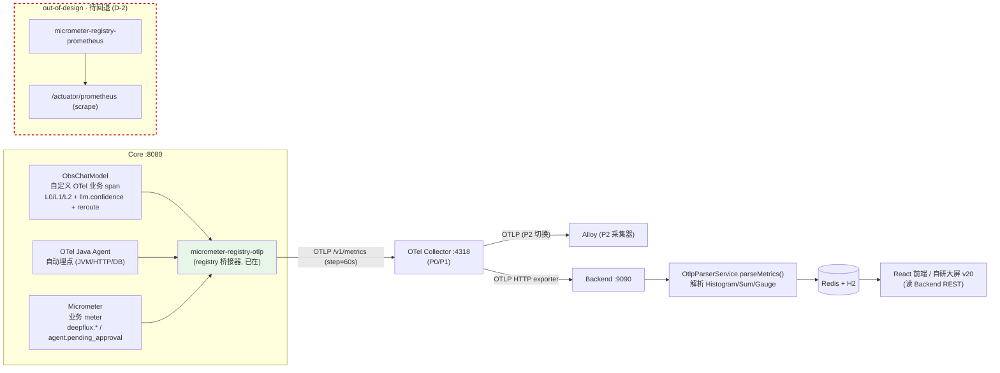

# ADR-2026-07-19：可观测遥测主线采用 OTLP Push，回退 Prometheus Scrape 补丁

| 项 | 内容 |
|---|---|
| **标题** | 可观测遥测主线采用 OTLP Push（单一推送路径），将 Prometheus Scrape 补丁标记为 out-of-design 并回退 |
| **日期** | 2026-07-19 |
| **状态** | **Accepted → Confirmed（用户已确认，2026-07-19 生效）** |
| **提出人** | 高见远（Gao，架构师） |
| **关联权威文档** | `docs/specs/可观测优化总结-WorkBuddy-V4-Demo上线版-0718.md`（以下简称《设计文档》，1212 行，权威） |
| **影响范围** | Core（8080）/ OTel Collector（4318）/ Backend（9090）/ 前端大屏；测试 T-K、T-J 验证口径 |

---

## 1. 背景 Context（为何决策）

《设计文档》已白纸黑字钉死遥测架构（见第 3 节依据清单）。但在本会话早期，主理人（齐活林）为让指标测试 **T-K / T-J** 跑过，战术性地拍板做了一处**超出设计文档**的临时补丁，使指标经 Prometheus pull/scrape 路径拿到 PASS：

- **偏离①**：根 `pom.xml`（L104–109）新增 `micrometer-registry-prometheus`（`runtime` 作用域），暴露 `/actuator/prometheus` 端点（pull/scrape 模型）。
- **偏离②**：`src/main/java/com/mobileagent/app/observability/MetricsRegistry.java`（L53–56）新增 `@PostConstruct init()`，启动即注册 `deepflux.workflow.pending_approval` Gauge，使 `/actuator/prometheus` 中出现该指标，供测试 scrape 验证。

这两处引入了一条**设计文档从未规定**的 Prometheus 组件与 scrape 端点，使可观测系统多出一条冗余采集路径，与 P2 既定的 "OTLP + Alloy + VictoriaMetrics" 单一推送主线相冲突。

> **责任界定**：偏离源于主理人的战术决策以实现测试 PASS；**《设计文档》本身正确，无需修改**。本 ADR 仅纠偏工程实现，使其回归设计文档规定，并把"分支决策"固化为团队共识。

---

## 2. 决策 Drivers（驱动因素）

| # | Driver | 说明 |
|---|---|---|
| D1 | **遵循设计文档意图** | 《设计文档》§4.3（L319–341）明定：Core Micrometer 指标 → **OTLP /v1/metrics (step=60s)** → Backend `OtlpParserService.parseMetrics()` → Redis/H2；**无** micrometer-registry-prometheus、无 `/actuator/prometheus`、无 Prometheus server。 |
| D2 | **避免重复/冗余采集路径** | 同一份业务 meter 不应同时存在 OTLP push 与 Prometheus scrape 两条出口，否则命名、口径、时序易漂移，运维心智分裂。 |
| D3 | **与 P2 Alloy / VictoriaMetrics 路线一致** | 组件选型（L20、L76–86）已定：**Alloy(采集)+Tempo+VictoriaMetrics(指标)+Loki+Grafana**，且"VictoriaMetrics 替换 Prometheus"。OTLP push 对 Core 透明，P0/P1 用 OTel Collector、P2 换 Alloy，均讲 OTLP。 |
| D4 | **保留既有正确设计资产** | ObsChatModel（自研 L0/L1/L2 业务 span）与 Micrometer 集中式注册表（§5.3 P6/P7，L467–474）均为设计文档明示保留项，不应因"想用开源"而被砍。 |
| D5 | **概念分层清晰（已与用户对齐）** | OTLP=传输协议 / Prometheus=监控系统(pull scrape) / Alloy=采集器，三者不在同一层；本方案取 "OTLP(协议)+Alloy(采集器)+VictoriaMetrics(存储)" 组合，单一 OTLP push 主线。 |

---

## 3. 已考虑的备选方案（对比）

| 方案 | 描述 | 判定 | 理由 |
|---|---|---|---|
| **① OTLP Push（采纳）** | ObsChatModel(自定义 OTel span) + OTel Java Agent(自动埋点) + Micrometer(业务 meter) → `micrometer-registry-otlp` → OTLP /v1/metrics → Collector(4318)/Alloy → Backend `OtlpParserService` → Redis/H2 | ✅ **采纳** | 与《设计文档》§4.3 完全一致；单一推送路径；对 Core 透明；P2 切 Alloy/VM 无需改 Core 代码。 |
| **② Prometheus Server scrape `/actuator/prometheus`（否决）** | 引入 Prometheus server 周期拉取 Core 的 `/actuator/prometheus` 端点获取业务 meter | ❌ **否决** | 《设计文档》未采用 Prometheus 开源组件；引入冗余 pull 路径，与设计主线冲突；与 P2 VM 路线重叠。当前计划不启用 Prometheus server。 |
| **③ 保留 Prometheus 端点作"双保险"（不推荐）** | OTLP push 与 `/actuator/prometheus` 并存，互为冗余 | ⚠️ **不推荐** | 双出口导致指标口径/命名漂移风险、运维心智分裂；违反 D2 单一主线原则。仅在"明确引入 Prometheus server 或 Alloy scrape 模式"时才考虑启用——当前计划不启用。 |

> **澄清**：`micrometer-registry-otlp`（已在 `pom.xml` L100–103）是 Micrometer 的 **registry 桥接器**，负责把应用业务 meter 经 **OTLP** 导出，**不属于** OTel Java Agent（Agent 只做自动埋点与 span 传播）。它正是方案①的合法组件，予以保留。

---

## 4. 决策 Decision（逐条）

**D-1｜遥测主线 = OTLP Push（唯一主线）**
Core 三路遥测统一经 OTLP 推送：
- `ObsChatModel`：自定义 OTel 业务 span（L0/L1/L2 + `llm.confidence` + `reroute`）。
- `OTel Java Agent`：JVM/HTTP/DB 自动埋点（随 `-javaagent` + OTEL 环境变量生效）。
- `Micrometer`：业务 meter（`deepflux.*` / `agent.pending_approval`）。
- 导出链：`micrometer-registry-otlp` → **OTLP /v1/metrics (step=60s)** → OTel Collector(4318)/Alloy → Backend `OtlpParserService.parseMetrics()` → Redis/H2。

**D-2｜否决 `micrometer-registry-prometheus` 与 `/actuator/prometheus` 作为常规采集路径**
标记为 **out-of-design，待回退**。仅当"明确引入 Prometheus server 或 Alloy scrape 模式"时才启用——当前计划不启用。Spring AI 的 `/actuator/ai` 是独立运维摘要端点，非指标导出机制，与本决策无关。

**D-3｜保留 ObsChatModel 与 Micrometer 集中式注册表**
依《设计文档》§14.6（L9、L474，Java 栈保留自研 ObsChatModel，OpenLLMetry 仅可选且当前不适用）与 §5.3（L467–474，集中式注册表 + `agent.pending_approval` UpDownCounter）。不因"想用开源"砍 ObsChatModel。

**D-4｜采集器与指标存储目标（对 Core 透明）**
- 采集器：P0/P1 = OTel Collector；P2 = Alloy（运维更省，均讲 OTLP）。
- 指标存储：VictoriaMetrics（PromQL 兼容，替换 Prometheus）。
- Core 代码对此无感知，切换采集器/存储不改 Core。

**D-5｜T-K / T-J 验证口径变更**
验证 **Core 经 OTLP 发出的业务 meter 能被 Backend 收到**（或验证 Core Micrometer 注册表确实注册了该产品 meter），**而非** scrape `/actuator/prometheus`。QA 须相应改写测试用例。

---

## 5. OTLP Push 主线架构图（Mermaid）

> 说明：实线为主决策路径（D-1）；红色虚线框为否决的 Prometheus 分支（D-2），需回退。

---

## 6. Implementation Tasks（供工程师 A 阶段执行）

| # | 任务 | 文件 / 位置 | 操作要点 |
|---|---|---|---|
| **I-1** | 删除 prometheus registry 依赖 | 根 `pom.xml` L104–109 | 移除 `<artifactId>micrometer-registry-prometheus</artifactId>`（含 `<scope>runtime</scope>` 及注释）。保留 `micrometer-registry-otlp`（L100–103）。 |
| **I-2** | 关闭 prometheus 端点暴露 | `src/main/resources/application.yml`（`management` 段） | `management.endpoints.web.exposure.include` 由 `health,metrics,prometheus` 改为 **`health,info,metrics`**；`management.endpoint.prometheus.enabled` 置 **`false`**。保留 `/actuator/health`、`/actuator/info`、`/actuator/metrics`。 |
| **I-3** | 确保业务 meter 经 OTLP 落地 | `MetricsRegistry.java` | 确认注入的 `MeterRegistry` 为 `micrometer-registry-otlp` 绑定的 registry（Spring 在 otlp 依赖+OTLP 端点存在时自动装配 `OtlpMeterRegistry` 进全局 registry）。`@PostConstruct init()` 注册 `deepflux.workflow.pending_approval`（Gauge/UpDownCounter）**予以保留**（保证空闲期可见），但其导出目标须走 OTLP，而非仅为 prometheus 服务。建议同步修正 L25 注释 "Prometheus 直方图" → "OTLP Histogram（后端只解析 Histogram）"，口径与设计 §4.3 / §5.3 对齐。 |
| **I-4** | 重建 Core | 构建/运行 | `mvn clean package`（或重启 8080），确认启动后无 prometheus 端点、业务 meter 经 OTLP 推送至 Backend 并被 `OtlpParserService` 解析。 |

> 工程师注意：**不要修改《设计文档》**；本 ADR 与文档为补充关系（见第 8 节指针建议）。

---

## 7. Consequences / 风险

| # | 后果 / 风险 | 影响 | 缓解 |
|---|---|---|---|
| C-1 | 回退后 `/actuator/prometheus` 消失 | T-K / T-J 原 scrape 口径失效，测试须改写 | 按 D-5 改为验证 Backend 收到 OTLP meter 或 Core Micrometer 注册表确有该 meter（QA 改测试）。 |
| C-2 | prometheus 端点消失不影响前端 | 无 | 前端只读 Backend REST（Redis/H2），与 `/actuator/prometheus` 无关。 |
| C-3 | 命名一致性待对齐 | 设计 §5.3 P7 写 `agent.pending_approval`，代码实现为 `deepflux.workflow.pending_approval`（集中式注册表 `deepflux.` 前缀，§5.3 P6） | 建议统一命名（可在 I-3 顺带确认），不影响 OTLP 主线；若保留 `deepflux.workflow.pending_approval` 需在文档补一句等价说明。 |
| C-4 | 指标验证环境依赖 Backend 在线 | OTLP 验证需 Collector→Backend 链路可用 | 沿用现有本地 4318/9090 链路即可验证；T-K/T-J 改 REST 断言。 |
| C-5 | 未来若确需 Prometheus server | 需重新评估 | 届时按方案③条件启用，并修订本 ADR 状态为 Superseded，不冲突。 |

---

## 8. 与主设计文档的衔接

**本 ADR 不修改《设计文档》。** 建议在主设计文档 **§14（实施路径 / 附录）** 增加指针，引用本 ADR，使"战术补丁→纠偏"的来龙去脉可追溯。

> **建议插入句（供主理人粘贴至《设计文档》§14 末尾）**：
> "**§14.9 遥测主线裁定（ADR-2026-07-19）**：可观测遥测唯一主线为 OTLP Push（ObsChatModel 自定义 span + OTel Java Agent 自动埋点 + Micrometer 业务 meter → `micrometer-registry-otlp` → OTLP → Collector/Alloy → Backend `OtlpParserService`）。`micrometer-registry-prometheus` 与 `/actuator/prometheus` scrape 端点为 out-of-design，已回退（详见 `docs/specs/遥测架构决策-ADR-2026-07-19.md`）。指标验证口径以 Backend 收到 OTLP meter 为准，不以 scrape prometheus 端点为准。"

---

*—— 本 ADR 由架构师高见远（Gao）依据《设计文档》及本会话已对齐的五个结论起草，状态 Proposed→Accepted；2026-07-19 经用户最终确认，状态升级为 Accepted→Confirmed，正式生效。*
