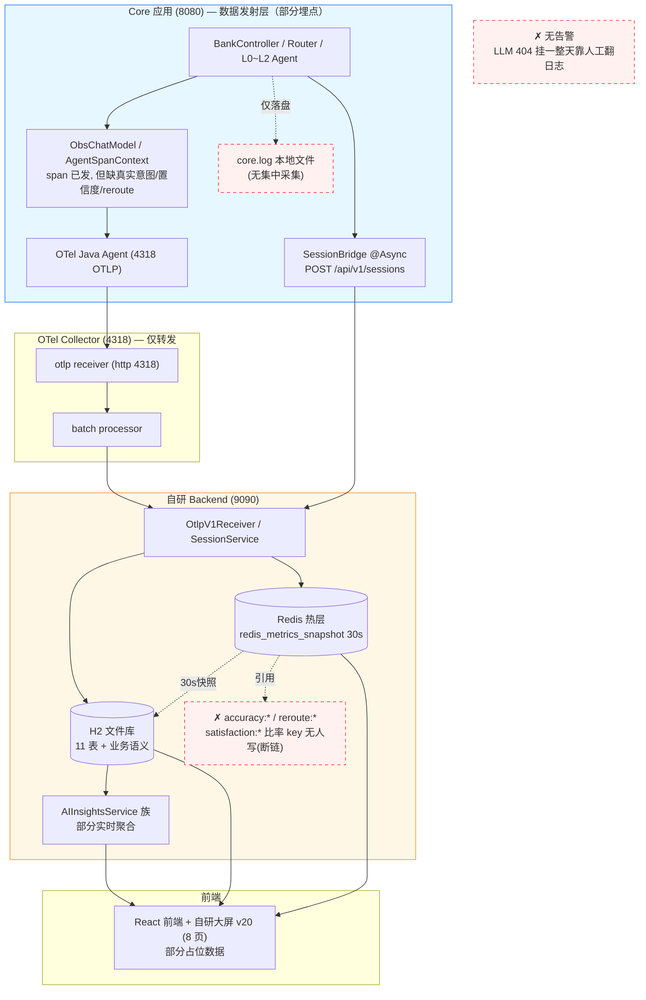
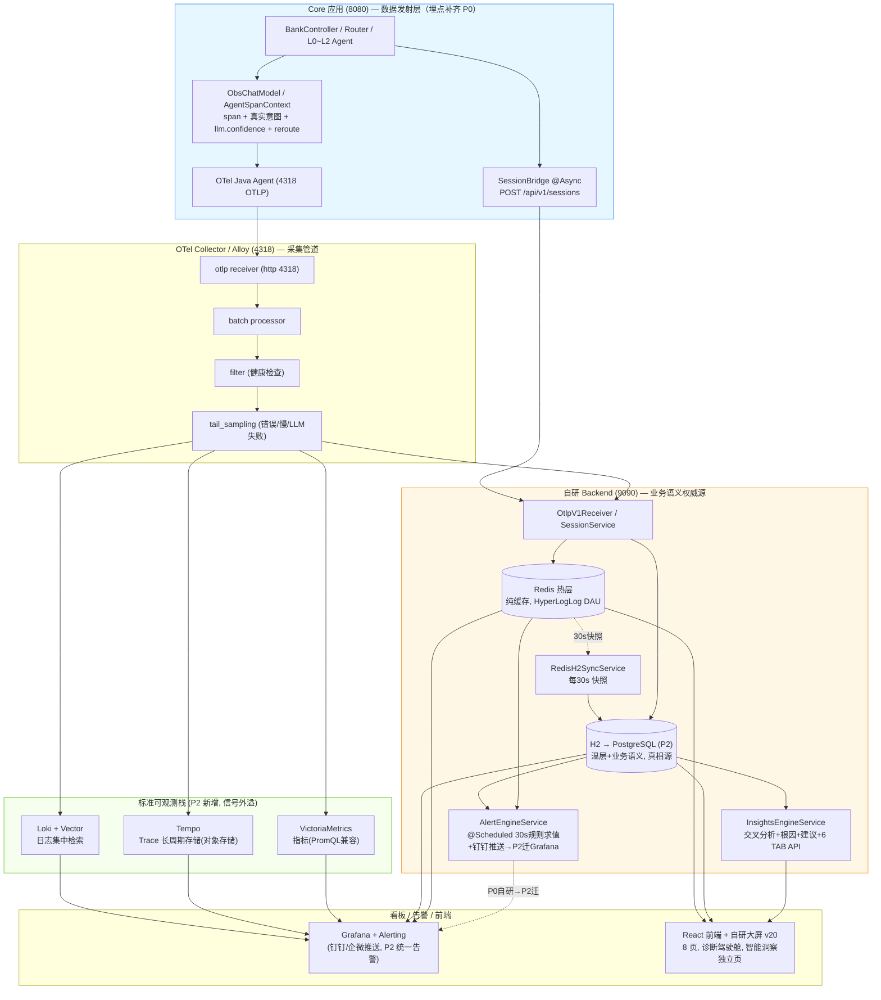
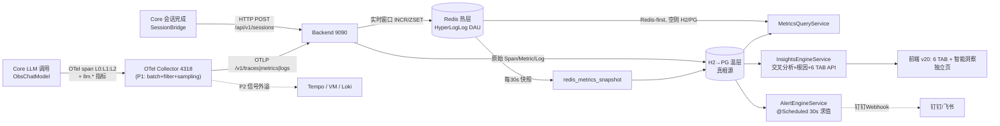

# 可观测优化总结（0711 · WorkBuddy V6 · 整合终稿）

> **V6 背景**：银行业务系统，静态用户量数千万级（DAU 100-300 万，日均 AI 交互 500-1500 万次，日均 Span 2000-6000 万，6 个月 Session 累计 9-27 亿行）。
> **V6 变更要点**（整合 Codex V4 创新）：【P0】数据脱敏（卡号/身份证/手机号字段级）+ 按 intent 分级采样（交易 100%）+ TDigest 替代 ZSet（内存降 50000 倍）；【P1】WebSocket 推送替代轮询 + 物化视图预聚合 + TLS 全链路加密 + RBAC 五角色访问控制；【新增独立章】§13 数据合规与安全 + §14 高可用部署拓扑；月分区替代天分区。
> 适用范围：移动 AI 银行 Demo（Core 8080 → OTel Collector 集群 4318 → Backend 9090 / PostgreSQL+Redis Sentinel → React 前端 v20）
> 设计稿：`observability/frontend/可观测DEMO-v20-WorkBuddy.html`
> 组件选型最优组合：**Alloy(采集集群) + Tempo(Trace) + VictoriaMetrics(集群) + Loki(日志) + Grafana(HA)** —— 全 Grafana 系，生产级高可用。

---

## 0. 如何使用本文 & 模块分类原则

### 0.1 阅读路径

1. **决策者**：§1 模块分类 → §2 组件选型 → §3 目标架构 → §4 阶段计划。
2. **后端开发**：§5 数据流 → §6 Core 埋点 → §7 指标全表 → §8 DB 表 → §9 Redis → §10 AI 引擎 → §11 告警。
3. **前端开发**：§13 UI 设计（V20）。
4. **运维/SRE**：§12 Collector 配置 → §14 实施路径。

### 0.2 A/B/C/D/E 模块分类（来自 Codex V2）

| 模块 | 名称 | 策略 | 说明 |
|------|------|------|------|
| **A** | 基础指标 (Infra) | P2 交给 Grafana | JVM/HTTP/DB 等标准指标，不自建专用页 |
| **B** | AI 模型层 (LLM 性能) | ✅ 自建主战场 | Token/TTFT/TPOT/LLM 错误率 |
| **C** | AI 业务语义层 | ✅ 自建主战场 | 意图准确率/路由决策/漏斗/满意度 |
| **D** | 平台自观测 | MVP 不做 | 后端自身健康，延后到阶段三 |
| **E** | 维度规范 | ✅ 贯穿全程 | Metric Tag 基数预算，高基数字段归 Trace/Log |

**核心决策**：
- **P0**：H2→PostgreSQL 迁移（银行量级必须）+ 修复 B+C 类 GAP + Collector 集群 + Redis Sentinel + 告警闭环。
- **P1**：Collector 处理器增强 + 标准栈（Tempo/VM/Loki/Grafana）信号外溢 + AI 洞察引擎。
- **P2**：告警迁 Grafana + 前端终稿 + PG 读写分离。

---

## 1. 最优组件选型（合并论证）

> 本节合并 WorkBuddy V2 §2.3（组件推荐）与 Codex V2 §14.4（组件选型对照表），经差异分析确定最优组合。

### 1.1 推荐开源组件（生产级最优 + 运维最省）

| 信号 | 推荐组件 | 为什么选它（先进性 / 运维省） | Codex 原选型 | 替换理由 |
|---|---|---|---|---|
| **采集器** | **Grafana Alloy**（P1 替换原生 Collector，集群模式） | 单二进制统一 OTLP+Prom+Loki；**P0 用 OTel Collector 集群**（3 实例 + Nginx LB 消除 SPOF），P1 可选迁移 Alloy | OTel Collector 增强 | V5：Collector 集群化（银行量级 SPOF 不可接受） |
| **Trace 存储** | **Grafana Tempo** | 对象存储后端、与 Loki 同源可关联、查询便宜、易水平扩展 | Jaeger | Jaeger 需 Cassandra/ES 存储，成本高；Tempo 对象存储 + Loki 关联优势显著 |
| **指标** | **VictoriaMetrics** | PromQL 兼容、压缩率比 Prometheus 高 10×、单机即可扛量 | Prometheus | VM 运维更省（单机扛量），PromQL 兼容无缝迁 |
| **日志** | **Loki + Vector** | 标签索引、对象存储、便宜；Vector 做采集/富化/路由 | Loki | Codex 一致；Vector 补齐 |
| **看板/告警** | **Grafana + Alerting** | 统一拼 Tempo+VM+Loki+PG；Alerting 原生钉钉/企微/邮件 | Grafana | 一致 |
| **LLM 专项** | **Langfuse**（P3 待定）+ **OpenLLMetry**（P1 可选）| 开源自托管；OpenLLMetry 补齐 gen_ai.* 语义 span | Langfuse（P2）+ OpenLLMetry（P1） | 一致，合并 |
| **持续剖析** | **Pyroscope**（P3，今并入 Grafana） | 第四信号，火焰图随 Tempo trace 下钻 | — | WorkBuddy 独有 |
| **前端错误** | **Grafana Faro**（P3） | 前端错误采集，与 Grafana 一体 | — | WorkBuddy 独有 |
| **关系库** | **PostgreSQL**（**P0 即迁**，银行量级下 H2 不可行） | 去 H2 独占锁、支持分区表/DROP PARTITION 替代 DELETE、连接池（PgBouncer）、读写分离 | 未提 PG | V5：银行量级下从 P2 提前到 P0 |

> **运维最省组合**：`Alloy（采集）+ Tempo + VictoriaMetrics + Loki + Grafana` 全 Grafana 系五件套 —— **一套心智模型、一套告警、一套权限**。

---

## 2. 系统目标架构

### 2.1 架构总图：当前（整改前）→ P0（P2 完成时）

> 以下为 **Mermaid 源码**，渲染为 PNG 见 `docs/arch-current.png` / `docs/arch-target.png`。

#### 2.1.1 当前架构（整改前 · 现状）

> 红色虚线框 = 缺失/断链。描述来自现有代码：Core 已发遥测、Collector 仅单管道、H2+Redis 双层但有断链 key、无标准栈、无告警、日志仅本地文件。



#### 2.1.2 目标架构（P2 完成时）

> 绿色框 = P2 新增（标准栈 + Grafana 告警）；断链 key 已由「读时算」替代。



### 2.2 架构设计决策记录（合并 WorkBuddy 变化总结 + Codex D1-D7）

| # | 决策 | 理由 | 来源 |
|---|---|---|---|
| D1 | P0 即迁 PostgreSQL，H2 仅 Demo 阶段过渡 | 数千万用户量级下 H2 独占锁 + 单文件不可行；PG 分区表 + DROP PARTITION 替代 DELETE | V5 银行量级修正 |
| D2 | P1 引入标准栈（Tempo+VM+Loki+Grafana）+ Collector 集群 | 标准栈对象存储后端天然适合银行量级；Collector 集群消除 SPOF | V5 银行量级修正 |
| D3 | 自研前端专注 B+C 类 AI 业务洞察 | A 类基础指标交 Grafana，差异化全在 AI 洞察 | Codex |
| D4 | Collector 增强 processors 优先（P1） | 零新组件，只改配置，batch 减少 70%+ HTTP 请求 | Codex |
| D5 | P0 告警用自研 AlertEngine（Codex 方案）→ P2 迁 Grafana Alerting | 自研立即打通闭环；Grafana 生态全、长期零维护 | 合并 |
| D6 | Redis 所有 key 同步写入 DB，语义比率不存 Redis | 热→温 30s 快照兜底；准确率等改 H2 读时算，避免断链 | WorkBuddy |
| D7 | AI 洞察用双层架构：AIInsightsService 族（6 Service，P0 保留现有接口）+ InsightsEngineService（交叉引擎在 6 Service 之上） | 6 Service 已存在且验证通过，P0 不动可降低回归风险；InsightsEngine 做交叉分析+根因+建议 | Codex V3 |
| D8 | 智能洞察为独立末位 TAB + 诊断驾驶舱（V20 布局） | 给运维/运营一站式问题诊断入口，与 AI 洞察 6 TAB 视觉区分 | WorkBuddy |
| D9 | DAU 用 HyperLogLog（Redis），在线用 ZSet | 内存 O(1)、准确度 97%，替换 Set 方案 | Codex |

### 2.3 组件对接关系（一句话版）

- **Core → Collector**：OTel Java Agent 经 OTLP `http://127.0.0.1:4318` 推 trace/metric/log；另有一条**独立 HTTP 管道** `SessionBridge` 异步 POST `http://127.0.0.1:9090/api/v1/sessions`（**不依赖 trace 导出成败**）。
- **Collector → 后端 / 标准栈**：P1 增强（batch+filter+sampling）→ 双写 9090 后端（业务语义） + Tempo/VM/Loki（信号外溢）。
- **后端 → Grafana / 前端**：实时查询走 Redis 热层、空则回退 H2/PG；Grafana 统一看 A 类指标；前端 v20 大屏读 9090 REST。
- **InsightsEngineService** 只从 9090 后端（H2/PG + Redis）聚合，**不碰** Tempo/VM/Loki（业务语义留在关系库）。

---

## 3. 分阶段优化计划（合并：WorkBuddy 策略 + Codex 任务级粒度）

| 阶段 | 目标 | 关键任务 | 工时 | 状态 |
|---|---|---|---|---|
| **P0** <br/>Core 发射层<br/>+ 存储升级<br/>+ 告警打通 | 银行量级下 H2 不可行；<br/>修复数据断链 + PG 迁移<br/>+ Collector 集群 + Redis HA<br/>+ 打通告警闭环 | ① 补全 LLM 置信度 + 分层意图 + reroute 埋点（§6）<br/>② **H2 → PostgreSQL 迁移**（分区表 + 连接池）<br/>③ **Collector 集群化**（3 实例 + Nginx LB）<br/>④ **Redis Sentinel 高可用** + DAU 改用 Bitmap（精度 100%，§9）<br/>⑤ Session 上报分层意图字段<br/>⑥ 语义比率改 PG「读时算」<br/>⑦ 自研 AlertEngine（@Scheduled 30s + 钉钉推送 + 收敛窗口 + 静默期, §11）<br/>⑧ UI 数据健康三态角标真实化 | 2.5–3 人周 | 🟡 部分落地 |
| **P1** <br/>Collector 增强<br/>+ 标准栈<br/>+ AI 洞察引擎<br/>+ 合规安全 | Collector 处理器增强；<br/>标准栈信号外溢；<br/>AI 洞察引擎生产级；<br/>合规安全加固 | ① Collector 加 batch / filter / tail_sampling（**按 intent 分级采样**） / attributes（§12）<br/>② **部署 Tempo + VictoriaMetrics(集群) + Loki + Grafana(HA)**（docker-compose）<br/>③ Collector 加 Tempo/VM/Loki exporter<br/>④ InsightsEngineService + **物化视图预聚合**（§8.4）<br/>⑤ **WebSocket 推送**替代前端轮询（§4.6）<br/>⑥ **TLS 全链路加密** + **RBAC 五角色** + **审计日志**（§13）<br/>⑦ OpenLLMetry 可选引入（gen_ai.* 语义） | 2–2.5 人周 | 🟢 后端 6 TAB 实时聚合已重写 |
| **P2** <br/>高可用部署<br/>+ 告警迁移<br/>+ 前端终稿 | 全组件 HA；<br/>告警迁 Grafana；<br/>前端真实数据驱动 | ① 全组件 HA 部署（PG Patroni / Redis Sentinel / 后端双活 / 前端 Nginx, §14）<br/>② 告警从自研迁 Grafana Alerting<br/>③ 前端 V20 全 API 对接 + WebSocket 数据推送<br/>④ 端到端测试 + 压测验证<br/>⑤ PG 读写分离（读副本） | 2–3 人周 | ⚪ 待启动 |
| **P3** <br/>数据归档<br/>+ 分级保留 | 银保监合规审计轨迹；<br/>冷热数据分离 | ① 热 30d PG → 温 90d PG 压缩分区 → 冷归档 S3（会话 6 月 / 日志 1 年）<br/>② 查询路由（热查 PG / 冷查 S3 Parquet）<br/>③ 对象存储生命周期策略 | ~1 人周 | ⚪ 待启动 |
| **P4** <br/>深化 + LLM 专项 | 第四信号、LLM 专项 | Langfuse（待定项 C）/ Pyroscope / Sentry(Faro) / Beyla / 模型对比评估 | 持续 | ⚪ 待决策 |

**依赖提醒**：P0/P1 的准确率/业务洞察依赖 LLM 真实跑通（SenseNova 404 为当前总阻塞），需先恢复可用模型（如 DashScope qwen 系列）。

---

## 4. 端到端数据流设计（5 条信号：Metrics / Trace / Logs / Session / Alerts）

### 4.1 总体数据流



> ⚠️ **两条独立管道（极易混淆，务必记牢）**：
> 1. **spans 管道**：Core OTel agent 自动拦截 → OTLP → Collector → 后端写 `spans` 表。按 **traceId** 关联。
> 2. **sessions 管道**：Core `BankController` 完成后异步 `SessionBridge.reportSession(...)`（`@Async` fire-and-forget）→ HTTP POST 9090 → `SessionService.upsertSession` 写 `sessions` + `session_turns` 表。按 **sessionId** 关联。
> 会话不依赖 span/trace 导出成败（即使 OTel 导出失败，会话回放仍有值）。

### 4.2 Trace 链路追踪

```
Core ObsChatModel.startBusinessSpan()
  └─ spanName = "<layer>:<model>" 例: "L0:qwen-plus" / "L1-LLM2:qwen-plus" / "L2:qwen-plus"
  └─ attributes: agent.name / model.name / agent.layer / intent / session_id / user_id
                 + ai.io.prompt / ai.io.response / ai.token.input / ai.token.output
                 + llm.confidence ★P0 新增
                 + intent.L0/L1/L2.predicted/actual ★P0 新增
  └─ held-span: 调用方 commitIntent 后回填 intent 并 end
        ↓ OTel Java Agent 自动导出
OTel Collector (4318) → [batch → filter(健康检查) → tail_sampling(错误/慢>1s/LLM失败)] → otlphttp exporter
        ↓ POST /v1/traces
Backend OtlpParserService.parseTraces()
  └─ 写 SpanEntity(trace_id, span_id, parent_span_id, service, op_name, kind,
                    start, end, duration_ms, status, attributes JSON)
  └─ pushRecentTrace → Redis obs:traces:recent (LPUSH+LTRIM 100)
        ↓
TraceQueryService.listTracesPaginated()  【已重写：按 trace_id 去重枚举】
  └─ 跳过无业务 span 的 trace（仅 OTLP 导出自 trace 噪声被排除）
  └─ 聚合 TraceListVO: timestamp / durationMs / status / sessionId / intent / userId
        / agentChain / intentChain / TTFT / tokenTotal / ★confidence / ★l0Intent / ★l1Intent
```

- **Agents 链显示规则**（R26 修复）：按 L0 边界切段 → 每段 `L0 → L1(合并) → <业务名 WEALTH/TRANSFER/BILL>`；reroute 则为 `L0→L1→WEALTH → L0→L1→TRANSFER`。
- **意图链**：四层真实识别结果，**不再回退** session 整条 intentFlow。

> **★ V6 补正（2026-07-14）— 确定性路由也产生 L0 span**：`DomainRouter.route()` 有两条分支——①确定性路由（关键词命中，如"转账"→TRANSFER/"账单"→BILL/"理财·基金"→WEALTH，**不调 LLM**）直接返回；②LLM 兜底路由（无关键词或多域命中）才调 `domainChatClient`。旧实现仅分支②经 `ObsChatModel` 创建 L0 span，导致 L0 计数 < 请求数、L2≤L0 不恒成立。现分支①在提前返回前也显式经 `GlobalOpenTelemetry.getTracer("obs-chat-model")` 创建 `L0:DomainRouter` span（`agent.layer=L0`、`intent=命中域`、`routing.mode=deterministic`、立即 end，parent 自动取当前 server span，**绝不 makeCurrent 以免 traceId 跨请求泄漏**）。改后 L0 覆盖全部经 DomainRouter 的请求（≈ requestCount），L0 ≥ L1 ≥ L2 恒成立；确定性 L0 与 LLM L0（`L0:qwen-plus`）在 trace 瀑布中并列于 L0 层，前端按 `layer` 缩进渲染一致。详见《指标GAP分析-v2.md》§8.18。

### 4.3 Metrics 指标

```
Core Micrometer 指标（ObsChatModel.buildTimer / ObservabilityMetrics）
  ├─ llm.token.input/output              Counter   (tags: model, agent.level, agent.name, intent)
  ├─ llm.first_token.latency             Histogram ← 必须 publishPercentileHistogram(true)
  │                                                     否则导出 Summary 后端解析不到 → 分位恒0
  ├─ llm.operation.duration              Histogram
  ├─ llm.error.count                     Counter   (tag: model, error_type)
  ├─ agent.intent.accuracy               Counter   ★P0: +layer tag (L0/L1)
  ├─ agent.reroute.count                 Counter   ★P0: +reroute_reason tag
  ├─ agent.business.outcome              Counter   (tag: outcome=success/fail)
  └─ llm.confidence                      Gauge     ★P0 新增
        ↓ OTLP /v1/metrics (step=60s)
Backend OtlpParserService.parseMetrics()  【只解析 Histogram / Sum / Gauge，不解析 Summary】
  ├─ Histogram → Redis latency:{1m/5m/15m} ZSET + ttft:1m ZSET；落 H2 metrics_agg
  ├─ Sum(Counter) → Redis request_count / error_count / token_* / intent_distribution；落 H2
  └─ Gauge → Redis active_sessions / llm.confidence；落 H2
        ↓ 每30s
RedisH2SyncService → H2 redis_metrics_snapshot（热窗口持久化，Redis 重启不丢）
        ↓ 查询
MetricsQueryService.getRealtime()  Redis-first，空则回退 H2/PG
```

> ⚠️ **致命坑**：`Timer.publishPercentiles(...)` 导出为 **Summary**，后端不解析 → TTFT P50/P95 恒为 0。必须用 `publishPercentileHistogram(true)`。

### 4.4 Logs 日志

```
Core / Backend 日志（含 logback MDC: trace_id / span_id / session_id）
        ↓ Logback OTLP Appender → Collector → otlphttp exporter
Backend OtlpParserService.parseLogs()
  └─ 写 LogEntity(trace_id, span_id, level, service, message, attributes)
  └─ pushRecentLog → Redis obs:logs:recent (LTRIM 1000)
        ↓
前端日志查询页：每行支持「三件套」跳转（trace.id→链路详情、session.id→会话回放）
        ↓ P2 增强
core.log/backend.log 经 Vector 采集 → Loki → Grafana 统一检索，
从「错误率 spike」一键下钻到「慢 trace」再跳「该 trace 的 log」。
```

### 4.5 Session 会话

```
Core BankController 完成一轮 /api/bank/chat
  └─ doOnTerminate → sessionBridge.reportSession(userId, input, response, intent,
                      agentPath, confidence, durationMs, tokens, getCurrentTraceId(),
                      ★l0Intent, ★l1Intent, ★l2Intent, ★rerouteTriggered, "COMPLETED")
        ↓ @Async fire-and-forget（失败不影响主业务）
HTTP POST http://127.0.0.1:9090/api/v1/sessions
        ↓
Backend SessionService.upsertSession(Map)
  ├─ sessions 表: turn_count+1 / intent_flow += " → "+intent / total_tokens += tokens
  │              / ★l0_intent / ★l1_intent / ★l2_intent / ★reroute_triggered
  │              / status / end_time / duration_seconds / satisfaction_*
  ├─ session_turns 表: 每轮一条(user_message, ai_response, intent, agentPath,
  │                    confidence, duration_ms, tokens, trace_id, status, timestamp)
  │                    ★+l0_intent / l1_intent / l2_intent
  └─ ★HyperLogLog DAU: DauCounter.recordUser(userId) + OnlineCounter.heartbeat(userId)
        ↓ 关联
  session_turns.trace_id → spans 表（token 回退：若 turns.tokens==0，按 traceId 查 spans 累加）
```

- **HyperLogLog → Bitmap 替换原因**：HyperLogLog 标准误差 0.81%，3000 万 DAU 下误差 ±24.3 万，银行报表不可接受。Bitmap（`SETBIT` 按用户 ID 哈希）精度 100%，3000 万用户仅需 3.6MB。
- **在线人数**：`ZADD obs:online:users timestamp userId` + 清理 5 分钟前记录。

### 4.6 Alerts 告警（P0 自研 → P2 迁 Grafana）

```
P0 阶段（自研，Codex 方案）：
规则管理: alert_rules 表 (★新增: evaluation_interval / last_evaluated_at / current_value)
AlertEngineService.@Scheduled(fixedRate=30_000):
  读活跃规则 → collectMetricValue(Redis/H2) → evaluateCondition → fireAlert / resolveAlert
  抑制: 5分钟内同规则不重复通知
通知: AlertNotifyService → 钉钉/飞书 Webhook (JSON 模板)
状态机: TRIGGERED → ACKED → RESOLVED
事件: alert_events 表 (★新增: notified_channels / notify_result / suppression_count)

P2 阶段（迁 Grafana）：
Grafana Alerting 替代自研引擎 → 统一看板+告警 → 钉钉/企微推送
自研规则表保留做配置管理，Grafana 读 PG/PromQL 求值
```

**默认告警规则**：

| 规则 | 阈值 | 严重度 | 通知渠道 |
|---|---|---|---|
| LLM 错误率 > 0 | 任何错误 | CRITICAL | 钉钉 |
| TTFT P95 超阈 | > 3000ms | WARNING | 钉钉 |
| 转账槽位完成率骤降 | < 50% | CRITICAL | 钉钉 + 飞书 |
| Collector 接收量骤降 | < 基线 30% | WARNING | 邮件 |
| 满意度负面比率 | > 20% | WARNING | 钉钉 |
| **脱敏明文 PII 检测** ★V6 | 任何明文卡号/身份证 | **CRITICAL** | 钉钉 + 飞书 |
| **交易 Trace 缺失** ★V6 | 交易类 intent 的 trace 未 100% 采样 | WARNING | 钉钉 |
| **RBAC 异常访问** ★V6 | 非授权角色访问会话回放/链路 | WARNING | 钉钉 |

---

## 5. Core 端埋点设计（合并：WorkBuddy 组件叙述 + Codex 代码实现）

### 5.1 埋点总览

| # | 埋点项 | 发射方 | 落库 | 关联 TAB | P0 状态 |
|---|---|---|---|---|---|
| 1 | `llm.confidence`（span attr） | ObsChatModel（resolve 时 setAttribute） | spans.attributes | 准确率 / Trace 详情 | 🔴 待补 |
| 2 | 意图准确率分层（`layer` tag） | ObservabilityMetrics.recordIntentAccuracy | metrics_agg | 准确率 | 🔴 待补 |
| 3 | 分层意图 Span attrib | Router 各层 commitIntent | spans.attributes | Trace 列表 / 意图链 | 🔴 待补 |
| 4 | Session 分层意图落库 | SessionBridge.reportSession | sessions / session_turns | 会话回放 / 漏斗 | 🔴 待补 |
| 5 | Reroute 事件 | BankController.dispatchWithReroute + SessionBridge | metrics_agg + sessions | 漏斗 / 准确率 | 🔴 待补 |
| 6 | DAU / 在线 | SessionBridge 或 OtlpParser | Redis HyperLogLog / ZSet | 总览 Zone A | ✅ 已修复 |

### 5.2 关键代码实现（来自 Codex V2 §5.2）

#### 5.2.1 LLM 置信度埋点

```java
// ObsChatModel.resolve() — 在 LLM 调用返回后
span.setAttribute("llm.confidence", response.getResult().getOutput().getConfidence());
// 同时通过 Micrometer Gauge 发射
meterRegistry.gauge("llm.confidence", 
    Tags.of("model.name", modelName, "agent.name", agentName), 
    confidenceValue);
```

#### 5.2.2 意图准确率分层

```java
// ObservabilityMetrics.recordIntentAccuracy()
// ★ P0: 增加 layer tag
public void recordIntentAccuracy(String intentPredicted, String intentActual, 
                                  String state, String layer) {
    Counter.builder("agent.intent.accuracy")
        .tags("intent_predicted", intentPredicted,
              "intent_actual", intentActual,
              "state", state,
              "layer", layer)  // ★ L0 / L1
        .register(meterRegistry)
        .increment();
}
```

#### 5.2.3 Span 分层意图属性

```java
// Router commitIntent 时
span.setAttribute("intent.L0.predicted", domainRouteType);
span.setAttribute("intent.L1.predicted", l1Intent);
span.setAttribute("intent.L2.actual", l2Intent);
```

### 5.3 埋点强制约定

- 时延类 `Timer` 一律 `publishPercentileHistogram(true)`（**禁止 `publishPercentiles`**）。
- 语义计数用 **Counter + 规范 tag** 落 H2 `metrics_agg`，**不在 Redis 另存比率 key**。
- 高基数字段（user_id / trace_id / prompt / response）**不入 Metric Tag**，归 Span attributes。

---

## 6. 指标设计全表（合并：WorkBuddy 状态矩阵 + Codex 维度规范）

> 状态图例：✅正常 / 🟢已解决 / 🟡回归 / 🔴仍开放 / ⚪待启动。

### 6.1 总览大屏

| # | 指标 | 数据源 | 状态 | 说明 |
|---|---|---|---|---|
| A1 | activeSessions | Redis `session.active` Gauge | ✅ | — |
| A2 | DAU | Redis **HyperLogLog** `obs:dau:YYYY-MM-DD` | 🟢 已修复 | 替换 Set 方案，内存 O(1) |
| A3 | realTimeOnline | Redis **ZSet** `obs:online:users` | 🟢 已修复 | 5 分钟窗口自动清理 |
| A4 | requestCount(6h) | Redis request_count:6h | 🟢 | 多窗口 INCR 贯通 |
| A5 | QPS | requestCount/21600 | 🟢 | — |
| A6 | agentCall L0/L1/L2 | H2 spans `COUNT(DISTINCT trace_id)` | 🟢 | 改 H2 真值计数 |
| B1 | Token 调用量 | `llm.token.*` Counter | ✅ | — |
| B2 | TTFT P50/P95/P99 | Redis ttft:1m ZSET | ✅ | `publishPercentileHistogram(true)` |
| B3 | P95 系统时延 | Redis latency:1m | ✅ | — |
| B4 | 错误率 | H2 spans 真值计算 | 🟢 | 脱离 Redis 计数器 |
| C1 | intentAccuracy(分层) | H2 `agent.intent.accuracy` + `layer` tag | 🟡 | 单值已通；**分层待 P0 Core** |
| C2 | rewriteAccuracy | H2 `agent.rewrite.accuracy` | 🟢 | — |
| C3 | rerouteRate | H2 `agent.reroute.count` | 🔴 | **Core 未发射**（P0） |
| C4 | completionRate | H2 `agent.business.outcome` | 🟢 | — |
| D1 | conversionRate | 业务成功率近似 | 🟡 | 独立转化埋点待定 |
| D2 | violationRate | 无数据源 | 🔴 | 待安全围栏对接 |

### 6.2 链路追踪

| # | 字段 | 状态 | 说明 |
|---|---|---|---|
| T1 | LLM 置信度 `llm.confidence` | 🔴 P0 | Core span 待写 |
| T2 | L0/L1/L2 分层意图 | 🔴 P0 | Span attrs + sessions 待补 |
| T3 | traceId/sessionId/ioInput | ✅ | — |
| T4 | durationMs/ttftMs/tokenTotal | ✅ | — |
| T5 | spanTree/ioOutput | ✅ | — |

### 6.3 AI 洞察 6 TAB

| # | 指标 | 状态 | 说明 |
|---|---|---|---|
| I1 | 准确率趋势（按 intent 分组） | 🟢 | `/ai/accuracy-report` 统一端点 |
| I2 | 混淆矩阵（分层） | 🔴 P0 | 需 Core 写 intent_predicted/actual 到 span |
| I3 | 改写准确率 | 🟢 | — |
| I4 | 根因 TOP3 | 🟢 | — |
| I5 | L2 意图识别 | 🔴 | 占位，待 L2 链路数据 |

### 6.4 维度规范与基数预算（Codex §6.5，纳入 V3）

#### 允许做 Metric Tag 的字段（基数 < 200）

| Tag Key | 示例值 | 基数估算 |
|---|---|---|
| `model.name` | qwen-turbo, qwen-plus | < 10 |
| `agent.level` | L0, L1, L2 | 3 |
| `agent.name` | DomainRouter, ContextRouter, TransferAgent | < 30 |
| `intent` | TRANSFER, WEALTH, BILL, GENERAL | < 20 |
| `state` | correct, fuzzy, error, disambiguated | 4 |
| `error_type` | timeout, auth_error, rate_limit | < 10 |
| `outcome` | success, fail, partial | 3 |

#### 禁止作为 Metric Tag 的字段（基数 > 1000）

| 字段 | 存放位置 | 原因 |
|---|---|---|
| `user_id` | Span attributes / Log | 用户数可无限增长 |
| `session_id` | Span attributes | 每次会话新 ID |
| `trace_id` | Span 主键 | 每次请求新 ID |
| `prompt` / `response` | Span attributes (ai.io.*) | 文本无限 |
| `timestamp` | Span start/end | 每毫秒新值 |

---

## 7. DB 表设计

### 7.1 Redis → DB 同步原则

> **Redis 管"实时窗口"，H2/PG 管"真相与历史"；热→温每 30s 同步；语义比率在 H2/PG 上算，不镜像。**

| 数据类型 | 策略 |
|---|---|
| 热窗口聚合（request_count/error_count/token/latency/ttft/dau/online） | 镜像到 `redis_metrics_snapshot`，30s 同步 |
| 原始遥测（每个 span/metric point/log） | 直接落 H2/PG，系统真相源 |
| 语义比率（准确率/重路由率/业务成功率） | **不存 Redis**，查询时从 H2/PG 实时算 |
| 会话/业务语义 | 权威源在 H2/PG；Redis 仅缓存最近列表 |

### 7.2 活跃表（合并对照）

| 表 | 用途 | 状态 | 合并来源 |
|---|---|---|---|
| `metrics_agg` | 指标聚合温层 | 活跃 | 一致 |
| `spans` | Span 明细（attributes JSON 含 llm.confidence / intent.*） | 活跃 | 一致 |
| `logs` | 日志明细 | 活跃 | 一致 |
| `sessions` | 会话聚合 ★+l0/l1/l2_intent + reroute_triggered | 活跃 | WorkBuddy |
| `session_turns` | 会话轮次 ★+l0/l1/l2_intent | 活跃 | WorkBuddy |
| `tool_calls` | 工具调用 | 活跃 | 一致 |
| `alert_rules` | 告警规则 ★+evaluation_interval/last_evaluated_at/current_value | 活跃 | Codex 增强 |
| `alert_events` | 告警事件 ★+notified_channels/notify_result/suppression_count | 活跃 | Codex 增强 |
| `redis_metrics_snapshot` | Redis→H2 兜底 | 活跃 | 一致 |
| `insight_reports` | **★P0 新增**：诊断报告 JSON + 时间 + 版本号 | 新增 | Codex |
| `agent_performance` | **已弃用** — 全库无 INSERT | 弃用 | WorkBuddy 纠偏 |
| `token_cost` | **已弃用** — 全库无 INSERT | 弃用 | WorkBuddy 纠偏 |

### 7.3 P0 新增 / 增强 DDL

```sql
-- sessions 表加列（P0 直接执行 — PG 已就位，无 H2 ALTER 锁风险）
ALTER TABLE sessions ADD COLUMN l0_intent VARCHAR(64);
ALTER TABLE sessions ADD COLUMN l1_intent VARCHAR(64);
ALTER TABLE sessions ADD COLUMN l2_intent VARCHAR(64);
ALTER TABLE sessions ADD COLUMN reroute_triggered BOOLEAN DEFAULT FALSE;

-- alert_rules 表增强
ALTER TABLE alert_rules ADD COLUMN evaluation_interval INT DEFAULT 30;
ALTER TABLE alert_rules ADD COLUMN last_evaluated_at TIMESTAMP;
ALTER TABLE alert_rules ADD COLUMN current_value DOUBLE;

-- alert_events 表增强
ALTER TABLE alert_events ADD COLUMN notified_channels VARCHAR(128);
ALTER TABLE alert_events ADD COLUMN notify_result VARCHAR(64);
ALTER TABLE alert_events ADD COLUMN suppression_count INT DEFAULT 0;

-- ★新增 insight_reports 表
CREATE TABLE insight_reports (
    id BIGINT AUTO_INCREMENT,
    report_type VARCHAR(32),          -- full / bottleneck / root_cause / unsatisfied / conversion
    report_data CLOB,                  -- JSON 报告全文
    generated_at TIMESTAMP,
    data_window_start TIMESTAMP,
    data_window_end TIMESTAMP,
    version INT DEFAULT 1,
    PRIMARY KEY (id)
);
CREATE INDEX idx_insight_type_time ON insight_reports(report_type, generated_at);
```

### 7.4 分层数据保留策略（银保监合规）

> 银行量级下 7 天清理不满足银保监 3-7 年审计轨迹要求，需分层保留。

| 层级 | 存储 | 保留期 | 数据 | 清理方式 |
|---|---|---|---|---|
| **热层** | PostgreSQL（SSD） | 7 天 | spans / sessions / session_turns / metrics_agg | 分区表 DROP PARTITION |
| **温层** | PostgreSQL（压缩分区） | 90 天 | 聚合后数据（按天汇总的 metrics、按小时汇总的 sessions） | 压缩分区 DROP PARTITION |
| **冷层** | 对象存储（MinIO/S3） | 3 年 | 原始 trace JSON / 原始 logs JSON（按天 Parquet 压缩导出） | 对象存储生命周期策略 |

**PG 分区策略**（以 sessions 表为例）：
```sql
CREATE TABLE sessions (
    id BIGSERIAL,
    session_id VARCHAR(64),
    -- ... 其他列
    created_at TIMESTAMP NOT NULL DEFAULT NOW()
) PARTITION BY RANGE (created_at);

-- 按天创建分区（自动化脚本每日执行）
CREATE TABLE sessions_20260712 PARTITION OF sessions
    FOR VALUES FROM ('2026-07-12') TO ('2026-07-13');
```

**冷层导出**：PG → Parquet（`pg_parquet` 插件或定时 ETL）→ 对象存储，3 年内可按 `created_at` 范围回溯查询。

---

## 8. Redis 缓存设计（Codex §8 融入 V3）

### 8.1 所有权原则

> **每个 Key 有唯一写入方，读方可多对一。** 多人协作时最易踩的坑就是"谁在写这个 Key"——明确写入方可避免"DAU 两个地方写导致不准确"等暗病。

| 原则 | 说明 |
|---|---|
| **唯一写入方** | 每个 Redis Key 只有一处代码负责写入（SET/INCR/ZADD/LPUSH），确保写入不竞争 |
| **读方可多对一** | 多个 Service/Controller 可以读同一个 Key，但写入权单一 |
| **语义比率不写 Redis** | 准确率/重路由率/业务成功率仅写入 PG metrics_agg/spans，查询时实时计算；**不在 Redis 另存比率 key** |
| **Key 命名规范** | `obs:<域>:<指标>:<窗口>` — 如 `obs:metrics:request_count:1m`，`obs:dau:YYYY-MM-DD` |

### 8.2 银行量级部署：Redis Sentinel 高可用

> 数千万用户量级下，Redis 单实例是 SPOF。P0 即部署 **Redis Sentinel（1 主 2 从 + 3 Sentinel）**，自动故障转移。

### 8.3 Redis Key 规范全表

| Key 模式 | 类型 | TTL | 写入方 | 读取方 | 说明 |
|---|---|---|---|---|---|
| `obs:metrics:request_count:1m/5m/15m/6h` | String(INCR) | 120s/600s/1200s/21600s | OtlpParser | MetricsQuery | 多窗口请求计数 |
| `obs:metrics:error_count:1m` | String(INCR) | 120s | OtlpParser | MetricsQuery | 错误计数 |
| `obs:token:input:1m` | String(INCR) | 120s | OtlpParser | TokenCost | Token 输入累计 |
| `obs:token:output:1m` | String(INCR) | 120s | OtlpParser | TokenCost | Token 输出累计 |
| `obs:latency:1m/5m/15m` | **TDigest** | 120s/600s/1200s | OtlpParser | MetricsQuery | ★ V6: TDigest 替代 ZSet（2KB vs 100MB，降 50000 倍，P99 误差 <0.5%） |
| `obs:ttft:1m` | **TDigest** | 120s | OtlpParser | MetricsQuery | ★ V6: 同上 |
| `obs:dau:YYYY-MM-DD` | **Bitmap** | 2 天 | DauCounter | Overview | ★ Bitmap（精度100%，3000万用户仅3.6MB）替换 HyperLogLog |
| `obs:online:users:{shard}` | ZSet（按小时分片） | 清理 5 分钟前 | OnlineCounter | Overview | ★ 量级下按时间窗口分片，避免单 ZSet 百万级 member |
| `obs:traces:recent` | List(LTRIM 100) | 滑动窗口 | OtlpParser | TraceQuery | 最近 100 traces |
| `obs:logs:recent` | List(LTRIM 1000) | 滑动窗口 | OtlpParser | LogQuery | 最近 1000 logs |
| `obs:alerts:active` | ZSet | 持久 | AlertEngine | AlertController | 活跃告警(score=触发时间) |
| `obs:insights:cache` | String(JSON) | 300s | InsightsEngine | InsightsController | 洞察报告缓存 |
| `obs:metrics_snapshot:*` | Hash | — | SyncService | — | 30s 快照兜底 |

### 8.4 Redis → DB 同步原则

所有 Redis 聚合数据，每 **30s** 由 `RedisH2SyncService` 快照写入 `redis_metrics_snapshot` 表（单向热→温兜底）。Redis 重启不丢、可做历史趋势。

**语义比率不镜像**：准确率/重路由率/业务成功率改为查询时从 PG `metrics_agg` / `spans` 实时算（`InsightsEngineService.compute*` 方法），避免"写一份没人维护的 Redis 比率 key"。V6 补充：大表实时算仍可能慢——**按小时预聚合物化视图**（`mv_agent_call_hourly` / `mv_token_cost_hourly` / `mv_funnel_daily` / `mv_satisfaction_daily`），前端查询走 MV 而非原始表，查询从扫描数亿行降为数千行。

### 8.5 TDigest 流式分位（V6，替代 ZSET）

> 银行量级下 ZSet 不可行：百万并发 × ZSet member ≈ 100MB/窗口。TDigest 固定 ~2KB/窗口，精度 P99 误差 <0.5%，对运营决策足够。

```java
// 使用 com.tdunning:t-digest 依赖
public class TDigestMetricsService {
    private TDigest tdigest_1m = TDigest.createMergingDigest(100); // compression=100

    public void recordLatency(double latencyMs) {
        tdigest_1m.add(latencyMs);
    }
    public double getPercentile(double pct) {
        return tdigest_1m.quantile(pct);
    }
    // 每30s 序列化到 Redis（~2KB）
    public byte[] serialize() { return tdigest_1m.bytes(); }
}
```

---

## 9. AI 洞察引擎（双层架构：AIInsightsService 族 + InsightsEngineService）

### 9.1 设计目标

传统可观测系统只回答"发生了什么"，AI 洞察引擎需要回答"为什么发生"和"该怎么处理"：
- **交叉分析**：跨维度（Agent × 意图 × 时段 × 用户分层）交叉关联
- **根因定位**：自动追溯慢会话/错误会话的 Span 级根因
- **行动建议**：生成可执行的优先级排序改进建议

### 9.2 AIInsightsService 族（6 Service，P0 保留现有接口）

> **V4 决策**：P0 保留现有 6 Service 接口（已通过 AgentPerformance/TokenCost 重构验证），InsightsEngineService 作为交叉分析引擎在之上调用它们。P2 可评估合并为单一引擎，但 P0 不动 6 Service 可降低回归风险。

| Service | 数据源 | 聚合口径 |
|---|---|---|
| `AIInsightsService` | metrics_agg(H2) | 置信度分布、参数提取完整率、改写准确率、混淆矩阵、意图准确率、Reroute 计数、业务成功率 |
| `AgentPerformanceService` | spans + metrics_agg | 调用次数 / 耗时分位 / 错误率（model+agent 双维）；补 TTFT/TPOT/Token |
| `TokenCostService` | metrics_agg + spans | 按 intent/model 聚合 token，成本=输入×0.002/1K+输出×0.006/1K |
| `ConversionFunnelService` | sessions | 进入→意图识别→L1→L2→业务完成漏斗（按 intent_flow 判定） |
| `SatisfactionService` | sessions + session_turns | 满意度分布、7天趋势、unsatisfied 原因聚类 |
| `ToolStatsService` | tool_calls | 按 toolName 聚 total/success/fail/avg/p95/errorRate |

> 已实现重构：`AgentPerformanceService`/`TokenCostService` 从"读空静态表"改为"实时聚合 spans+metrics_agg"，接口契约不变。

### 9.3 InsightsEngineService 架构（在 6 Service 之上的交叉引擎）

```java
@Service
public class InsightsEngineService {
    
    // 数据源
    private final SpanRepository spanRepo;
    private final SessionRepository sessionRepo;
    private final MetricsAggRepository metricRepo;
    private final RedisTemplate<String, String> redis;
    
    /**
     * 生成完整洞察报告，结果缓存至 obs:insights:cache (TTL 300s)
     * 同时写入 insight_reports 表做历史归档
     */
    public InsightsReport generateReport() { ... }
    
    // 三大诊断域方法
    public List<Bottleneck> analyzePerformance() { ... }   // 性能诊断
    public List<QualityIssue> analyzeQuality() { ... }      // 质量诊断
    public List<ConversionGap> analyzeConversion() { ... }   // 业务诊断
    
    // 根因分析
    public RootCauseReport analyzeSlowSession(String sessionId) { ... }
}
```

### 9.4 三大诊断域 × 提炼项明细

| 诊断域 | 提炼项 | 数据来源 | 输出形式 | 前端 TAB |
|---|---|---|---|---|
| **性能诊断** | Top3 慢 Agent 节点 | spans (P95 by agent_name) | 排行榜+趋势线 | 性能 TAB |
| | 慢会话根因 Span | spans (独占时间 Top3) | 根因链路图 | 智能洞察驾驶舱 |
| | LLM 响应延迟分布 | metrics_agg (ttft/tps) | 直方图 | 性能 TAB |
| | Token 消耗异常检测 | metrics_agg (token_count) | 时序异常点 | Token TAB |
| **质量诊断** | 低置信度意图分布 | metrics_agg (confidence<0.7) | 意图×置信度矩阵 | 准确率 TAB |
| | 不满意会话共性模式 | sessions + feedback | 共性特征画像 | 满意度 TAB |
| | 重复提问检测 | sessions (followup_count) | 重复率趋势 | 漏斗 TAB |
| **业务诊断** | 漏斗流失阶段定位 | sessions (funnel_stage) | 漏斗图+流失率 | 漏斗 TAB |
| | 流失会话特征画像 | sessions (未转化) | 特征雷达图 | 漏斗 TAB |
| | 高价值会话路径 | sessions (已转化) | 路径桑基图 | 漏斗 TAB |

### 9.5 慢会话根因分析详细逻辑

```
输入：会话ID列表（duration > 全局 P95）
处理流程：
  1. 取会话所有 Span，构建调用树
  2. 计算每个 Span 的"独占时间" = duration - sum(子Span duration)
  3. 按独占时间降序，取 Top3 Span 作为根因候选
  4. 对每个根因候选，关联以下维度：
     - LLM 指标：是否 token 数异常高？模型 TTFT 异常慢？
     - 工具调用：是否外部 API 超时？重试次数多？
     - 意图维度：该意图是否历史平均就慢？
     - 上下文：是否上下文过长导致推理慢？
  5. 输出根因链路图：
     会话总耗时 12s (P95=3s)
     ├─ Agent.RAG检索 6.2s (独占 5.8s) ← 根因 #1
     │   ├─ VectorStore.search 4.1s ← 外部调用超时
     │   └─ Reranker.rerank 1.7s
     ├─ Agent.LLM推理 4.3s (独占 0.5s)
     │   ├─ GPT4o.chat 3.8s ← TTFT=2.1s (基线0.8s)
     │   └─ Token: input=8200 (基线2000) ← 上下文过长
     └─ Agent.工具调用 1.5s (独占 1.5s) ← 根因 #2
         └─ BankAPI.query 1.5s ← 超时重试2次
```

### 9.6 API 端点

```
GET  /api/v1/ai/insights-report          -> 完整洞察报告（缓存5分钟）
GET  /api/v1/ai/insights/bottlenecks     -> 性能瓶颈 Top3
GET  /api/v1/ai/insights/root-cause/{sessionId} -> 指定会话根因分析
GET  /api/v1/ai/insights/unsatisfied     -> 不满意会话共性模式
GET  /api/v1/ai/insights/conversion      -> 转化瓶颈分析
GET  /api/v1/ai/insights/actions         -> 优先级行动建议 Top10
POST /api/v1/ai/insights/refresh         -> 手动刷新洞察
```

### 9.7 洞察缓存策略

| 缓存层 | Key | TTL | 刷新触发 |
|---|---|---|---|
| Redis | `obs:insights:cache` | 300s | 定时 5 分钟 / 手动 Refresh |
| DB | `insight_reports` 表 | 永久 | 每次 Refresh 同步写入 |
| 前端 | 浏览器内存 | 60s | 轮询 / 手动刷新按钮 |

---

## 10. 告警系统设计（Codex §10，P0 自研 → P2 迁 Grafana）

### 10.1 AlertEngineService（P0）

```java
@Service
public class AlertEngineService {
    
    private final AlertRuleRepository ruleRepo;
    private final AlertEventRepository eventRepo;
    private final AlertNotifyService notifyService;
    private final RedisTemplate<String, String> redis;
    
    @Scheduled(fixedRate = 30_000)
    public void evaluateRules() {
        List<AlertRule> activeRules = ruleRepo.findByEnabledTrue();
        for (AlertRule rule : activeRules) {
            double currentValue = collectMetricValue(rule.getMetricKey());
            boolean shouldFire = evaluateCondition(rule, currentValue);
            boolean currentlyFiring = isCurrentlyFiring(rule.getId());
            
            if (shouldFire && !currentlyFiring) {
                // ★ V5 银行量级抑制：收敛窗口 5min + 静默期 30min（避免大规模异常时告警风暴）
                if (!isSuppressed(rule.getId(), 5, TimeUnit.MINUTES) 
                    && !isInQuietPeriod(rule.getId(), 30, TimeUnit.MINUTES)) {
                    fireAlert(rule, currentValue);
                }
            } else if (!shouldFire && currentlyFiring) {
                resolveAlert(rule.getId(), currentValue);
            }
            // 更新规则求值状态
            rule.setLastEvaluatedAt(Instant.now());
            rule.setCurrentValue(currentValue);
            ruleRepo.save(rule);
        }
    }
}
```

**状态机**：`TRIGGERED → SUPPRESSED(收敛窗口内重复触发) → ACKED → RESOLVED → QUIET(静默期)`
> ★ V5 银行量级增强：收敛窗口 5min（同规则 5 分钟内不重复通知）+ 静默期 30min（连续触发 3 次后自动进入静默，防告警风暴）

**P2 演进**：自研引擎保留做规则配置管理，求值逻辑迁 Grafana Alerting（读 PG/PromQL）。

---

## 11. OTel Collector 增强配置（Codex §12，纳入 V3）

### 11.1 P1 阶段完整 config.yaml

```yaml
receivers:
  otlp:
    protocols:
      http:
        endpoint: 0.0.0.0:4318

processors:
  batch:
    timeout: 5s
    send_batch_size: 1024
  memory_limiter:
    check_interval: 1s
    limit_mib: 512
    spike_limit_mib: 128
  filter:
    metrics:
      metric:
        - 'type == METRIC_DATA_TYPE_HISTOGRAM'
    traces:
      span:
        - 'attributes["http.target"] == "/actuator/health"'
  attributes:
    actions:
      - key: env
        value: production
        action: upsert
      - key: service.version
        value: "1.0.0"
        action: upsert
  tail_sampling:
    decision_wait: 10s
    policies:
      - name: errors
        type: status_code
        status_code: { status_codes: [ERROR] }
      - name: slow
        type: latency
        latency: { threshold_ms: 1000 }
      - name: llm-failure
        type: string_attribute
        string_attribute:
          key: error_type
          values: [timeout, auth_error, rate_limit]
      - name: normal-sampling
        type: probabilistic
        probabilistic: { sampling_percentage: 1 }   # ★ V6: 按 intent 分级 + 交易 100% 兜底（见 §12.3 策略表）

exporters:
  otlphttp/json_backend:
    endpoint: http://127.0.0.1:9090
    compression: gzip
  # P2 激活以下 exporter:
  # otlphttp/tempo:
  #   endpoint: http://tempo:4317
  #   tls: { insecure: true }
  # prometheusremotewrite:
  #   endpoint: http://victoriametrics:8428/api/v1/write
  # loki:
  #   endpoint: http://loki:3100/loki/api/v1/push

service:
  pipelines:
    traces:
      receivers: [otlp]
      processors: [batch, memory_limiter, filter, attributes, tail_sampling]
      exporters: [otlphttp/json_backend]
    metrics:
      receivers: [otlp]
      processors: [batch, memory_limiter, filter, attributes]
      exporters: [otlphttp/json_backend]
    logs:
      receivers: [otlp]
      processors: [batch, memory_limiter, attributes]
      exporters: [otlphttp/json_backend]
```

### 11.2 处理器优化收益 + V6 分级采样策略

| 处理器 | 收益 |
|---|---|
| batch | 减少 70%+ HTTP 请求（1024 条/批次 vs 每 span 一次） |
| filter | 过滤健康检查 Span，减少 30% 噪声数据 |
| memory_limiter | 防止 OOM，平稳反压 |

**V6 分级采样策略**（替代统一 1%）：

| intent | 采样率 | 理由 |
|---|---|---|
| TRANSFER / BILL（交易类） | **100%** | 银保监审计要求，每笔交易链路必留 |
| WEALTH / GENERAL（查询类） | **5%** | 统计需求，5% 已足够做趋势分析 |
| 其他 | **1%** | 兜底 |
| 错误 / 慢请求 / LLM 失败 | **100%** | 无论 intent，故障类必留 |

---

## 12. UI 设计（V20：WorkBuddy 框架 + Codex 诊断深度）

> 本节为设计摘要，完整设计见 `observability/frontend/可观测DEMO-v20-WorkBuddy.html`。

### 12.1 页面导航结构（8 页）

| 页面 | 核心内容 | V20 增强点 |
|---|---|---|
| 总览 | Zone A-D 指标卡片 + 趋势图 + AI 健康概览四卡 | ★ AI 健康四卡（性能/准确率/转化/满意度，紫边渐变） |
| 会话回放 | turn list + 三件套跳转 + 满意度反馈 | 分层意图展示 |
| 链路追踪 | trace list + 详情树 + 瀑布图 + IO 面板 | ★ 置信度/分层意图列 |
| AI 洞察 | **6 TAB**（准确率 / 性能 / Agent / 漏斗 / Token / 满意度） | ★ Agent TAB: KPI 四卡+图+工具明细表；漏斗 TAB: 流失画像；满意度 TAB: 低分表+原因图 |
| 日志 | 日志列表 + 三件套跳转 | — |
| 告警 | alert-card 卡片化 + toggle + timeline 事件流 | — |
| 设置 | 数据健康看板 + 度量矩阵 | — |
| **智能洞察** | ★ 诊断驾驶舱（TOP5 + 瓶颈卡 + 根因表 + 阈值散点） + 3×3 洞察网格 | 独立末位 TAB |

### 12.2 智能洞察诊断驾驶舱（V20 核心特性）

位于智能洞察页顶部，五个区块把"看数据"升级为"给行动"：

1. **⚡ 优先行动建议 TOP5**：HIGH/MED/LOW 严重度可执行卡
2. **三类瓶颈卡**（性能红/准确率黄/转化紫）
3. **慢会话根因表**：P95 延迟最高会话 → 跳 trace/AI 洞察
4. **不满意会话共性表**：与满意度 TAB 互证
5. **Agent P95 vs 错误率阈值散点**（`chart-diag-perf`）：1500ms 红线

### 12.3 图表清单（V20 共 ~18 个 ECharts）

性能 TAB：boxplot(TTFT) + scatter(TTFT vs TPOT 带阈值 markArea)  
Agent TAB：bar(智能体调用) + bar(工具调用)  
漏斗 TAB：funnel + heatmap(意图混淆矩阵) + 流失分布  
满意度 TAB：pie(满意度分布) + line(趋势) + bar(不满意原因)  
Token TAB：trend(累计) + bar(按 intent)  
准确率 TAB：heatmap(混淆矩阵) + bar(改写准确率)  
智能洞察：scatter(P95 vs 错误率, chart-diag-perf)  
总览：line(趋势) + 各类 mini chart

---

## 13. 数据合规与安全设计（V6 新增 · 银行必须）

> 银行业务可观测系统是"系统之系统"——能查看所有用户的会话内容。没有脱敏/RBAC/TLS/审计，本身就是一个合规漏洞。

### 13.1 数据脱敏（P0，Core 端完成）

| 数据类型 | 脱敏规则 | 示例 | 脱敏位置 |
|---|---|---|---|
| 银行卡号 | 前4后4，中间星号 | 6228******1234 | Core SessionBridge |
| 身份证号 | 前6后4，中间星号 | 110101********1234 | Core SessionBridge |
| 手机号 | 前3后4，中间星号 | 138****1234 | Core SessionBridge |
| 金额 | **不脱敏** | 5000.00 | 保留（业务分析需要） |
| 用户ID | 哈希化 | user_a3f8b2c1 | Core OTel tag |
| AI prompt/response | 同上规则脱敏 | 同上 | Core ObsChatModel |

> **脱敏在 Core 端完成**：后端和存储收到的已是脱敏数据，不存在中间环节明文泄露风险。定时扫描日志/会话中明文 PII 模式 → CRITICAL 告警。

### 13.2 RBAC 五角色访问控制（P1）

| 角色 | 可访问页面 | 可查看数据 |
|---|---|---|
| **admin** | 全部 | 全部（含脱敏后） |
| **ops** | 总览/链路/日志/告警/设置 | 链路+日志+告警（不含会话回放） |
| **analyst** | 总览/AI洞察/智能洞察 | 聚合指标+洞察（不含会话明细） |
| **auditor** | 会话回放/链路/告警 | 会话+链路（只读，含审计日志） |
| **viewer** | 总览 | 仅总览大屏聚合数据 |

```java
@PreAuthorize("hasRole('admin') or hasRole('auditor')")
@GetMapping("/api/v1/sessions/{id}/replay")
public SessionReplayVO replaySession(@PathVariable String id) {
    auditLogService.logAccess(currentUser, "session_replay", id);  // ★ 审计日志
    return sessionService.replay(id);
}
```

### 13.3 全链路 TLS 加密（P1）

| 链路 | 加密方式 | 启用阶段 |
|---|---|---|
| Core → Collector (OTLP) | TLS | P1 |
| Collector → 后端 (OTLP) | TLS | P1 |
| Core → 后端 (Session HTTP) | TLS | P1 |
| 后端 → 前端 (REST/WebSocket) | HTTPS / WSS | P1 |

### 13.4 审计追溯

- 审计日志表 `audit_logs`：谁在何时查看了哪个会话/链路
- 脱敏验证告警：定时扫描明文 PII → CRITICAL → 钉钉（银行专属告警规则 #9）

---

## 14. 高可用部署架构（V6 新增）

### 14.1 高可用组件矩阵

| 组件 | HA 方案 | 部署形态 | 阶段 |
|---|---|---|---|
| **PostgreSQL** | Patroni（主从自动切换）+ PgBouncer 连接池 | 1 主 2 从 | P0 |
| **Redis** | Sentinel（1 主 2 从 + 3 Sentinel） | 3 节点 | P0 |
| **OTel Collector** | 3 实例 + Nginx LB（round-robin） | 3 实例 | P0 |
| **VictoriaMetrics** | 集群模式（vminsert + vmselect + vmstorage） | 3 存储节点 | P1 |
| **Tempo** | 多实例（共享对象存储后端） | 2 实例 | P1 |
| **Loki** | 多实例（共享对象存储后端） | 2 实例 | P1 |
| **Grafana** | 多实例 + 共享 SQLite 或 PG | 2 实例 | P1 |
| **后端 9090** | 双活（Nginx 反向代理） | 2 实例 | P2 |
| **前端** | Nginx 反向代理 + 静态资源 CDN | 2 实例 | P2 |

### 14.2 容量规划参考（日均 1000 万 AI 交互）

| 资源 | 配置 | 数量 |
|---|---|---|
| PG 节点 | 16C 64G + 2TB SSD | 3（1 主 2 从） |
| Redis 节点 | 8C 32G | 3（Sentinel） |
| Collector | 4C 8G | 3 |
| VM 存储节点 | 8C 32G + 1TB SSD | 3 |
| 对象存储（MinIO/S3） | — | 按 3y 冷归档估算 |
| 后端 | 4C 8G | 2 |

---

## 15. 实施路径与里程碑（V6 五阶段）

### 13.1 Phase 0: 数据链路修复（P0, ~1.5 人周）

| 任务 | 涉及组件 | 工作量 |
|---|---|---|
| Core LLM 置信度 + 分层意图 + reroute 埋点 | ObsChatModel / Router / SessionBridge | 2 天 |
| DAU HyperLogLog + 在线 ZSet 替换 | Backend DauCounter / OnlineCounter | 0.5 天 |
| 语义比率改 H2 「读时算」 | AIInsightsService | 0.5 天 |
| AlertEngineService + NotifyService 自研告警 | Backend + 钉钉 Webhook | 1.5 天 |
| UI 数据健康三态角标真实化 + 契约对齐 | 前端 | 1 天 |
| DB insight_reports 表 + Alert 增强字段 | schema.sql | 0.5 天 |

**里程碑**：Core 发射层补齐，告警可自动钉钉通知

### 13.2 Phase 1: 洞察引擎 + Collector 增强（P1, ~1 人周）

| 任务 | 涉及组件 | 工作量 |
|---|---|---|
| InsightsEngineService（交叉分析+根因+建议+API） | Backend | 2 天 |
| Collector 增强配置（batch/filter/sampling/attributes） | otel-collector/config.yaml | 1 天 |
| 告警抑制 + 状态机完善 | AlertEngine | 0.5 天 |
| OpenLLMetry 可选引入（gen_ai.* 语义） | Core pom.xml | 0.5 天 |
| AI 洞察 6 TAB 对接 InsightsEngine API | 前端 | 1 天 |

**里程碑**：洞察报告可生成，Collector 降噪降量，告警有抑制

### 13.3 Phase 2: 标准栈 + 前端终稿（P2, ~1.5 人周）

| 任务 | 涉及组件 | 工作量 |
|---|---|---|
| H2 → PostgreSQL 迁移 | application.yml + schema.sql | 1 天 |
| Tempo + VictoriaMetrics + Loki 部署 | docker-compose | 1 天 |
| Collector 加 Tempo/VM/Loki exporter | config.yaml | 0.5 天 |
| Grafana 部署 + Alerting 迁入 | docker-compose + dashboard JSON | 1 天 |
| 前端 V20 全 API 对接（替换 Mock） | 前端 | 2 天 |
| 端到端测试 | test/seed_all.py | 1 天 |

**里程碑**：全链路可观测就绪，标准栈 + 自研双写分治

### 13.4 风险与应对

| 风险 | 应对 |
|---|---|
| OTel SDK 版本兼容 | 提前验证 Spring AI 与 OTel 版本匹配 |
| 高 QPS Span 写入瓶颈 | Collector batch + tail_sampling 降量 |
| Redis 与 DB 不一致 | 30s 快照对账 |
| 告警风暴 | 5 分钟重复抑制 + 分级通知 |
| LLM 不可用（SenseNova 404） | 先接 DashScope qwen 系列打通链路，模型可后换 |

---

## 16. 附录

### 14.1 关键坑清单

1. `publishPercentileHistogram(true)` 必须开，否则 TTFT 分位恒 0。
2. 语义比率别存 Redis key → 改 H2/PG 读时算。
3. Agent 调用数别按 OTLP 导出次数 INCR → 改 H2 `COUNT(DISTINCT trace_id)`。
4. 错误率别用 Redis 计数器 → 改 H2 spans 真值计算。
5. `purge` 批量删必须 `@Transactional`。
6. agent_performance / token_cost 表已弃用（全库无 INSERT）→ 不要读。
7. Windows localhost → 127.0.0.1（IPv6 DNS 问题）。
8. 二维管道独立：sessions 管道不依赖 spans 管道。

### 14.2 组件速查 / 快速起步

```bash
# P2 标准栈一键起（docker-compose）
# Alloy(4318) → Tempo + VictoriaMetrics + Loki + Grafana(3000)

# P0 不依赖任何新组件，只改 Core/Backend 代码
# 验证：重启 Core+Backend → test/seed_all.py → 等60s OTLP+30s Redis快照
```

### 14.3 三项待定决策（P3 拍板）

- **待定项 A（L0 是否覆盖"所有请求"）— 🟢 已决策（方案 b）已实施（2026-07-14）**：采用「把现有 L0 span 扩展到路由入口」方案。`DomainRouter.route()` 的确定性路由分支（关键词命中，不调 LLM）现在也显式经 OTel Tracer 创建 `L0:DomainRouter` span（含 `routing.mode=deterministic` 属性），使 L0 计数 = 全部经 DomainRouter 的请求数（≈ requestCount），**L2 ≤ L0 恒成立**。详见《指标GAP分析-v2.md》§8.18。方案 (a) 独立 `request.received` 口径留作备选。
- **待定项 B**：reRoute 是否携带原报文？需先明确 reRoute 范围与"原报文"字段定义。
- **待定项 C**：是否引入 Langfuse？建议 P3 引入，不抢占 P0/P1/P2。

---

> 文档版本：0711 · WorkBuddy V6（整合终稿 · 银行业务量级）
> 融合路径：Wb V2 + Codex V2 → Wb V3 + Codex V3 → Wb V4 → Wb V5（银行量级修正）→ Wb V6（整合 Codex V4 银行创新）
> V6 新增：数据脱敏 / 分级采样 / TDigest / WebSocket / 物化视图 / TLS / RBAC / 审计 / 合规章 / HA 章 / 银行告警规则
> 前端设计：`observability/frontend/可观测DEMO-v20-WorkBuddy.html`
