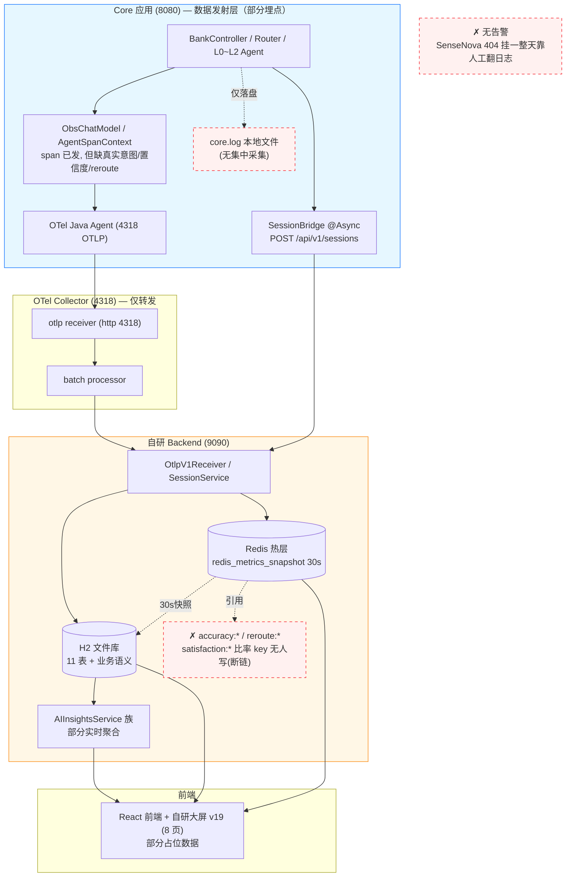
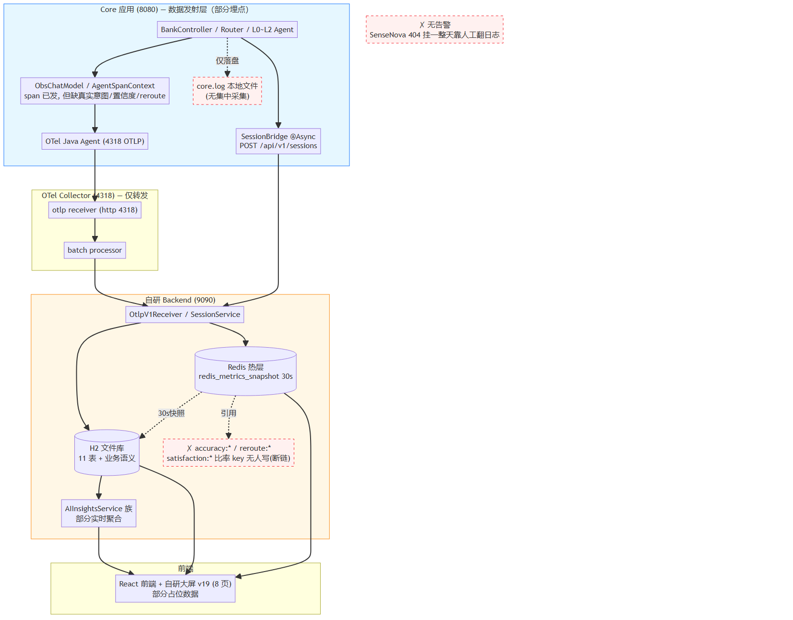
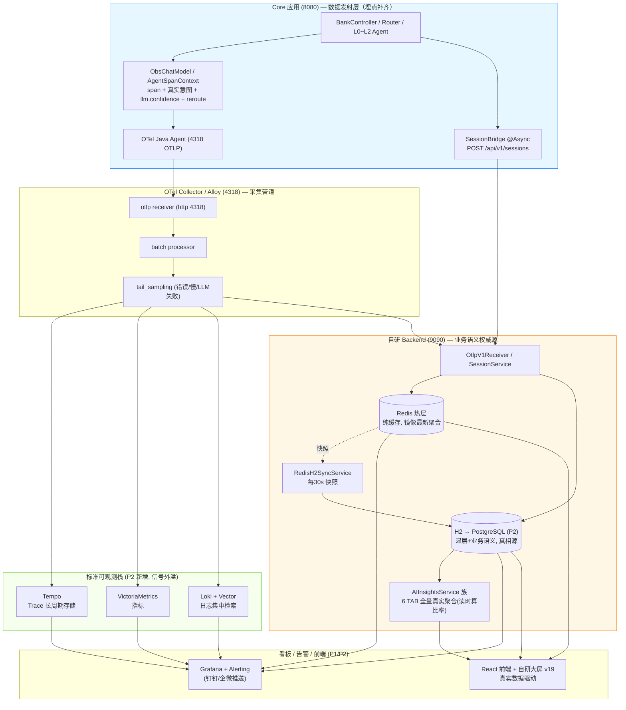
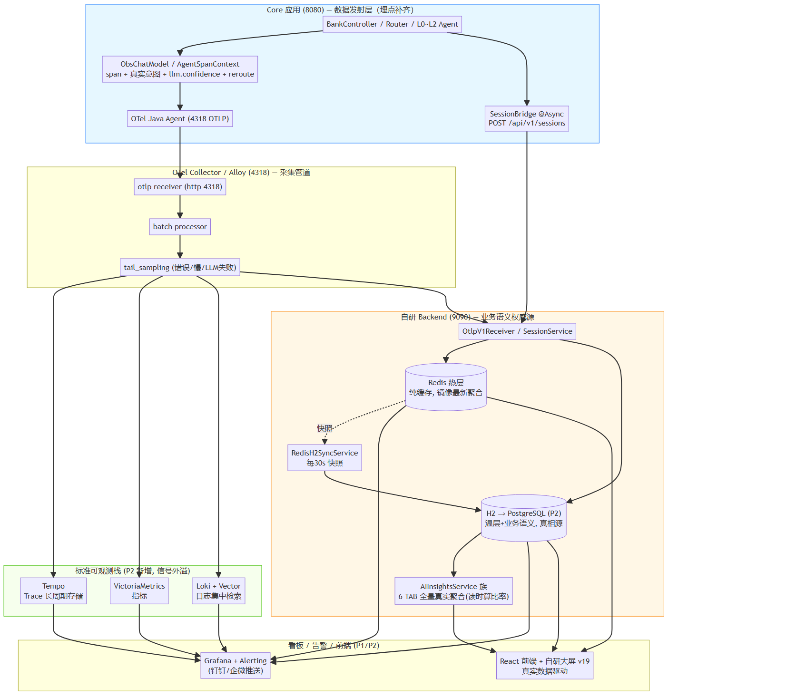
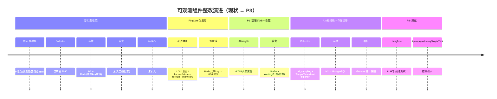
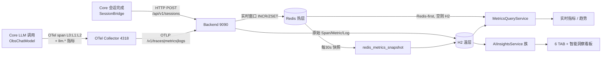

# 可观测优化总结（0711 · WorkBuddy）

> 适用范围：移动 AI 银行 Demo（Core 8080 → OTel Collector 4318 → Backend 9090 / H2+Redis → React 前端 + 自研大屏 v19）
> 目标：**依据本文 + 现有代码，可快速完成可观测优化，并采⽤业界最先进、效果最好、运维最省的开源组件。**
> 配套文档：`docs/specs/AI可观测-系统架构设计-WorkBuddy-V1.md`、`docs/specs/指标GAP分析-v2.md`、`docs/OBSERVABILITY-TARGET-ARCH.md`、`observability/frontend/可观测DEMO-v19-WorkBuddy.html`

---

## 0. 如何使用本文

本文按"**计划 → 架构 → 实现细节 → 指标 → 表结构 → AI 洞察 → 补充**"递进，工程落地时建议顺序：

1. 先看 §1 优化计划，确认本期做 P0（Core 发射层）还是直接进 P2（标准栈）；
2. 按 §2 目标架构搭组件（Collector/Tempo/Prom/Loki/Grafana 并行起步，不依赖 LLM）；
3. 按 §3 逐信号实现数据管道（Trace/Metrics/Logs/Session/Alerts），代码入口已在文中标注；
4. 指标口径以 §4 全表为准，避免再出现"后端读一个没人写的 key"；
5. 表结构以 §5 为准（含 Redis→DB 同步原则）；
6. AI 洞察按 §6 落地 6 TAB + 智能洞察看板；
7. §7 列出待定项、组件速查表、快速起步命令。

> **关键纠偏（已写入 `OBSERVABILITY-TARGET-ARCH.md`）**：原方案把"脱离 H2、落 Tempo+Prom+Loki"列 P0 偏激进。spec 明确 **H2 在 P0 保留、P2 才迁 PostgreSQL**；Tempo/Prom/Loki **仅用于信号外溢**，业务语义（session/funnel/satisfaction/reroute）必须留在关系库。真正的 P0 阻塞是 **Core 发射层数据断链**，不是存储。

---

## 1. 最新优化计划

按"最小改动、最高杠杆"分阶段。**P0 不靠换存储，而是先补 Core 发射层埋点**——这是 6 TAB 真实数据的源头。

| 阶段 | 目标 | 关键动作 | 业务代码改动 | 周期 | 当前状态 |
|---|---|---|---|---|---|
| **P0** | 打通 Core 发射层，让 6 TAB 有真实数据源（对齐 GAP v2 P0-3~P0-6） | ① 补全 session 上报字段（DAU/在线关联键已修）② L0/L1 span 注入真实意图 + 业务动作回写 ③ ObsChatModel 发射 `llm.confidence` ④ 分层意图链 `intentFlow` 正确聚合 ⑤ reroute 标记回写 span ⑥ UI 数据健康三态角标 | **大（Core 埋点为主）** | 3–5 天 | 🟡 部分落地（P2/P3 兜底已编译，需重启验证） |
| **P1** | 自研 9090 后端 + AIInsightsService 6 TAB 真实聚合 + Grafana 告警 | ① 落地 spec 的 6 个 Service + 6 TAB ② 部署 Grafana 统一看板 + Alerting（LLM 错误率>0 / TTFT P95 超阈 / 转账槽位完成率骤降 → 钉钉） | 中 | 约 1 周 | 🟢 后端 6 TAB 实时聚合已重写（AgentPerformance/TokenCost 改读 spans+metrics_agg） |
| **P2** | 存储迁移 + 标准栈信号外溢 | ① H2 → PostgreSQL ② 引入 Tempo/Prometheus/Loki（仅信号外溢）③ Collector 加 tail_sampling/标准 exporter | 小 | 1–2 周 | ⚪ 待启动 |
| **P3** | 深化 + LLM 专项 + 安全 | Langfuse（spec 待定项 C，先决策后落地）/ Pyroscope / Sentry(Faro) / Beyla / TLS / 模型对比评估 | 按需 | 持续 | ⚪ 待决策 |

**起步一跳**：P2 的标准栈（Tempo/Prom/Loki/Grafana）即便 LLM 全挂也能先接上 trace/log 信号，**可与 P0 并行起步**，且运维成本极低（见 §2.3 组件选型）。

**依赖提醒**：P0/P1 的准确率/业务洞察依赖 LLM 真实跑通（当前 SenseNova 404 是总阻塞），需先恢复可用模型（如 DashScope qwen 系列）。

---

## 2. 系统目标架构

### 2.1 架构总图（当前 → 目标，Mermaid）

为便于对照，本节先给**当前架构（整改前）**，再给**目标架构（整改后）**，最后用 §2.1.3 总结二者差异。两图节点位置尽量对齐，红色虚线框 = 缺失/断链，绿色框 = 目标新增。

#### 2.1.1 当前架构（整改前 · 现状）

> 描述均来自本仓库现有代码：Core 已发遥测、Collector 仅单管道转发 9090、H2+Redis 双层但存在断链 key、**无标准栈、无告警、日志仅本地文件**。



> 高清图：

#### 2.1.2 目标架构（整改后 · P2 完成时）

> 绿色框 = 目标新增（标准栈 + Grafana 告警）；断链 key 已由「读时算」替代；日志经 Loki 集中检索。



> 高清图：

#### 2.1.3 架构变化总结（前 → 后）

对照两图，架构层面共发生 **6 处结构性变化**：

| # | 变化 | 整改前 | 整改后 | 价值 |
|---|---|---|---|---|
| **1** | **Core 埋点补齐** | span 已发，但缺真实意图 / `llm.confidence` / reroute 标记 | span 注入真实意图链 + 置信度 + reroute 回写 | 6 TAB / 准确率洞察有真实数据源 |
| **2** | **Collector 从「单管道」→「可采样多后端」** | 仅 batch 后转发 9090 一条路 | 加 `tail_sampling` + 并行 exporter（Tempo/VM/Loki） | 错误/慢链路必留样；信号外溢标准栈 |
| **3** | **新增标准可观测栈（最大结构变化）** | 完全没有（🔴） | Tempo + VictoriaMetrics + Loki + Grafana 一整套 | Trace/指标/日志长周期存储 + 统一拼图 |
| **4** | **日志从「本地文件」→「集中检索」** | 仅 `core.log` 落盘，靠人工翻 | Loki + Vector 集中采集/富化/查询 | 跨服务按 traceId 关联查日志 |
| **5** | **告警从「无」→「自动推送」** | 无告警，SenseNova 挂一天无人知 | Grafana Alerting → 钉钉/企微 | 异常秒级发现，治本人工翻日志痛点 |
| **6** | **存储与 Redis 定位纠偏** | H2 文件库 + Redis 存断链比率 key | H2→PG 为真相源；Redis 纯缓存；比率「读时算」 | 消除 `accuracy:*` 等无人写 key 的断链 |

> **一句话总结架构变化**：整改前是「**Core 发射 → Collector 单转发 → 9090 自研存储 → 前端直读**」的单链路、无标准栈、无告警的**封闭小系统**；整改后升级为「**Core（埋点补齐）→ Collector（采样）→ 双写[9090 业务语义权威源 ‖ Tempo/VM/Loki 信号外溢] → Grafana 统一看板+告警 / 前端真实驱动**」的**双写分治、标准栈兜底、告警闭环的开放可观测体系**。业务语义（会话/漏斗/满意度）始终留在关系库（9090），标准栈只承接可外溢的三大信号——这是本次架构演进的核心边界。

### 2.2 组件对接关系（一句话版）

- **Core → Collector**：OTel Java Agent 经 `OTEL_EXPORTER_OTLP_ENDPOINT=http://127.0.0.1:4318` 推 trace/metric/log；另有一条**独立 HTTP 管道** `SessionBridge` 异步 POST `http://127.0.0.1:9090/api/v1/sessions`（不依赖 trace 导出成败）。
- **Collector → 后端/标准栈**：`otlphttp/json_backend` exporter 把 OTLP 同时转发到 9090 后端（写 H2/Redis）与 P2 的 Tempo/Prom/Loki（信号外溢）。
- **后端 → Grafana/前端**：实时查询走 Redis 热层、空则回退 H2；Grafana 统一拼图，前端 v19 大屏直接读 9090 REST。
- **AIInsightsService 族** 只从 9090 的 H2/Redis 聚合，**不碰** Tempo/Prom/Loki（业务语义留在关系库，这是 spec 硬约束）。

### 2.3 推荐开源组件（最先进 + 效果最好 + 运维最省）

| 信号 | 推荐组件 | 为什么选它（先进性 / 运维省） | 备选 |
|---|---|---|---|
| **采集器** | **OpenTelemetry Collector (contrib)** | 厂商中立、OTLP 原生、processor 生态全 | Grafana **Alloy**（单二进制统一 OTLP+Prom+Loki，运维更省，可替代原生 Collector） |
| **Trace 存储** | **Grafana Tempo** | 对象存储后端、与 Loki 同源可关联、查询便宜、易水平扩展 | Jaeger（自带 UI 开箱即看，但存储运维更重） |
| **指标** | **VictoriaMetrics** | PromQL 兼容、压缩率高 10×、单机即可扛量、运维比 Prometheus 省 | Prometheus（标准，但 TSDB 运维/容量需专人） |
| **日志** | **Loki + Vector** | 标签索引、对象存储、便宜；Vector 做采集/富化/路由，单行配置 | Elasticsearch（功能强但重、贵） |
| **看板/告警** | **Grafana + Alerting** | 统一拼 Tempo+Prom+Loki+PG；Alerting 原生钉钉/企微/邮件 | — |
| **LLM 专项** | **Langfuse**（spec 待定项 C） | 开源自托管、token/cost/prompt 版本/评估/数据集回归，Spring AI 原生集成 | —（待决策） |
| **持续剖析** | **Pyroscope**（今并入 Grafana） | 第四信号，火焰图随 Tempo trace 下钻 | — |
| **前端错误** | **Grafana Faro / Sentry OSS** | 前端错误采集，Faro 与 Grafana 一体 | Sentry 自托管 |
| **无侵入采集** | **Beyla**（Grafana eBPF） | 零代码改造成业务/DB/网络黄金指标 | — |
| **关系库** | **PostgreSQL**（P2 从 H2 迁） | 去 H2 独占锁、支持 retention/并发、生态全 | MySQL |

> **运维最省组合推荐**：`Alloy（采集）+ Tempo + VictoriaMetrics + Loki + Grafana` 五件套，全 Grafana 系，一套心智模型、一套告警、一套权限。

---

### 2.4 各组件整改前后变化（现状 → 目标态）

> 本节是 §1 计划与 §2.3 选型的「横切对照」：**每个组件从「当前实际代码状态」到「P2 完成时的目标态」具体变了什么、在哪个阶段落地**。所有"现状"描述均来自本仓库现有代码（见 §3 代码入口），非设想。

#### 2.4.1 组件整改前后对比总表

| 组件 | 整改前现状（当前代码） | 整改后目标态（P2 完成时） | 关键变化点 | 落地阶段 |
|---|---|---|---|---|
| **Core 数据发射层**（OTel Agent / ObsChatModel / AgentSpanContext / SessionBridge） | OTel Java Agent 已接 Collector(4318)；ObsChatModel 已发 `llm.token.input/output`、`llm.first_token.latency`、`llm.token.per.output.time` 三类指标；SessionBridge 已 `@Async` 异步 POST `/api/v1/sessions`（DAU/在线关联键已修）；P2/P3 路由兜底（last_domain / FOLLOW / currentAgent）已编译 | L0/L1 span 注入**真实意图**+业务动作；ObsChatModel 发射 `llm.confidence`；reroute 标记回写 span；`intentFlow` 正确聚合分层链；SessionBridge 上报字段完整 | 补齐语义埋点，从「能发数」到「发对的数」 | **P0** |
| **OTel Collector** | 仅 `otlphttp/json_backend` 转发到 9090 后端；无 tail_sampling、无标准栈 exporter | 增加 `tail_sampling`（错误/慢/LLM 失败采样保留）+ 并行 exporter → Tempo / VictoriaMetrics / Loki（信号外溢）；可选替换为 Grafana **Alloy**（单二进制统一采集） | 从「单管道转发」到「可采样 + 多后端外溢」 | **P2** |
| **后端存储 · H2（温层）** | 11 张表（spans / sessions / session_turns / metrics_agg / agent_performance / token_cost 等）；`ddl-auto:none`、schema.sql 幂等建表；存在 `accuracy:*` / `reroute:*` / `satisfaction:*` 等比率 Redis key **全库无人写而断链** | 迁 **PostgreSQL**（去独占锁、支持 retention/并发）；语义比率（准确率/重路由率/业务成功率）**改为 H2/PG 读时计算**，不再依赖写不进的 Redis 比率 key | 从「文件库 + 断链 key」到「关系库 + 读时算」 | **P2**（断链修复属 P0） |
| **Redis（热层）** | `redis_metrics_snapshot` 30s 同步热窗口聚合；另有一批语义比率 key 无人写 | **仅作热窗口缓存**，镜像 H2/PG 最新聚合；清理无人写的旧比率 key；所有语义最终落地 DB | 从「部分充当真相源」到「纯缓存、真相在 DB」 | **P0**（清 key）+**P2**（同步机制保留） |
| **AIInsightsService 族（6 TAB）** | AgentPerformance / TokenCost 已重写实时聚合（改读 `spans` + `metrics_agg`）；但准确率/漏斗/满意度等依赖 P0 真实数据与 H2 读时算 | 6 TAB 全部跑真实数据；与 Grafana 看板同源 | 从「部分实时聚合」到「全量真实聚合」 | **P1**（数据依赖 P0） |
| **前端大屏（v19）** | 8 页（总览/会话/链路/AI洞察/日志/告警/设置/智能洞察）；数据健康三态角标；智能洞察独立末位 TAB | 接通 9090 真实聚合；三类洞察（性能/准确率/业务）下钻闭环到对应 TAB | 从「设计稿 + 占位数据」到「真实数据驱动」 | **P1/P2** |
| **告警** | **无**；靠人工翻日志（SenseNova 全 404 挂一整天无人知） | Grafana Alerting：LLM 错误率>0 / TTFT P95 超阈 / 转账槽位完成率骤降 → 钉钉/企微 | 从「无告警」到「异常自动推送」 | **P1** |
| **Grafana / Tempo / VictoriaMetrics / Loki** | **未引入**（仅本地 H2 直读） | 全套引入：Tempo 存 trace、VictoriaMetrics 存指标、Loki 存日志、Grafana 统一拼图与告警；与 9090 后端**并行**存在（业务语义仍走 9090） | 从「无标准栈」到「信号外溢 + 统一看板」 | **P2** |
| **Langfuse（LLM 专项）** | 未接入（spec 待定项 C，定位/部署形态未拍板） | 待决策后落地：token/cost/prompt 版本/评估/数据集回归 | 待定 | **P3** |
| **Pyroscope / Sentry(Faro) / Beyla / TLS** | 未引入 | 按需引入：Pyroscope 第四信号、Faro 前端错误、Beyla 无侵入黄金指标、TLS 加密 | 深化项 | **P3** |

#### 2.4.2 分阶段演进时间线（Mermaid）



#### 2.4.3 能力成熟度矩阵（按阶段）

| 能力维度 | 现状 | P0 完成时 | P1 完成时 | P2 完成时 | P3 完成时 |
|---|---|---|---|---|---|
| **Trace 链路**（含分层意图） | 🟡 有 span，缺真实意图 | 🟢 意图+reroute 完整 | 🟢 稳定 | 🟢 + Tempo 外溢 | 🟢 + Beyla |
| **Metrics 指标**（token/TTFT/错误率） | 🟢 基础指标已发 | 🟢 + confidence | 🟢 + 6 TAB 聚合 | 🟢 + VictoriaMetrics | 🟢 + Pyroscope |
| **日志集中检索** | 🔴 仅本地文件 | 🔴 未变 | 🔴 未变 | 🟢 Loki 接入 | 🟢 + Faro 前端 |
| **会话回放 / 业务语义** | 🟢 sessions/session_turns 已写 | 🟢 关联键已修 | 🟢 漏斗/满意度真实 | 🟢 迁 PG | 🟢 稳定 |
| **AI 洞察（6 TAB + 智能洞察）** | 🟡 部分实时聚合 | 🟡 数据源补齐中 | 🟢 全量真实 | 🟢 + Grafana 同源 | 🟢 稳定 |
| **告警自动化** | 🔴 无 | 🔴 无 | 🟢 Grafana Alerting | 🟢 稳定 | 🟢 丰富 |
| **标准可观测栈** | 🔴 未引入 | 🔴 未引入 | 🔴 未引入 | 🟢 Tempo/Prom/Loki/Grafana | 🟢 全 |
| **LLM 专项（Langfuse）** | ⚪ 未接入 | ⚪ 未接入 | ⚪ 未接入 | ⚪ 待决策 | 🟡 按决策 |
| **数据健康可信度** | 🟢 三态角标(设计稿) | 🟢 角标数据真实 | 🟢 真实驱动 | 🟢 稳定 | 🟢 稳定 |

> 图例：🟢 就绪 / 🟡 部分 / 🔴 缺失 / ⚪ 待决策。可一眼看出**整改前最薄弱的是「日志集中检索」与「告警自动化」两项（均为 🔴）——这正是 SenseNova 挂一整天无人知的根因**；P2 一次性补齐标准栈后，Trace/Metrics/Logs/告警全面到位。

---

## 3. 各优化功能详细设计

### 3.1 总体数据流（Mermaid）



> **两条独立管道（极易混淆，务必记牢）**：
> 1. **spans 管道**：Core OTel agent 自动拦截 → OTLP → Collector → 后端写 `spans` 表。按 **traceId** 关联。
> 2. **sessions 管道**：Core `BankController` 完成后异步 `SessionBridge.reportSession(...)`（`@Async` fire-and-forget）→ HTTP POST 9090 → `SessionService.upsertSession` 写 `sessions` + `session_turns` 表。按 **sessionId** 关联。
> 会话不依赖 span/trace 导出成败（即使 OTel 导出失败，会话回放仍有值）。

### 3.2 Trace 链路追踪数据流

```
Core ObsChatModel.startBusinessSpan()
  └─ spanName = "<layer>:<model>" 例: "L0:qwen-plus" / "L1-LLM2:qwen-plus" / "L2:qwen-plus"
  └─ attributes: agent.name / model.name / agent.layer / intent / session_id / user_id
                 + ai.io.prompt / ai.io.response / ai.token.input / ai.token.output
  └─ held-span: 调用方 commitIntent 后回填 intent 并 end（见 3.7）
        ↓ OTel Java Agent 自动导出
OTel Collector (4318) → otlphttp/json_backend
        ↓ POST /v1/traces
Backend OtlpParserService.parseTraces()
  └─ 写 SpanEntity(trace_id, span_id, parent_span_id, service, op_name, kind,
                    start, end, duration_ms, status, attributes JSON)
  └─ pushRecentTrace → Redis obs:traces:recent (LPUSH+LTRIM 100)
        ↓
TraceQueryService.listTracesPaginated()  【已重写：按 trace_id 去重枚举】
  └─ 跳过无业务 span 的 trace（仅 OTLP 导出自 trace 噪声被排除）
  └─ 聚合 TraceListVO: timestamp(E2E首末差) / durationMs / status / sessionId / intent / userId
        / agentChain(buildAgentChainFromSpans) / intentChain(buildIntentChainFromSpans) / TTFT / tokenTotal
```

- **Agents 链显示规则**（R26 修复）：按 L0 边界切段 → 每段 `L0 → L1(合并 L1-LLM1/L1-LLM2) → <业务名 WEALTH/TRANSFER/BILL>`；reroute 则为 `L0→L1→WEALTH → L0→L1→TRANSFER`。
- **意图链**：四层真实识别结果 `L0意图 Domain → L1-LLM1 → L1-LLM2 → L2`，**不再回退** session 整条 intentFlow（根治串味 bug）。

### 3.3 指标（Metrics）数据流

```
Core Micrometer 指标（ObsChatModel.buildTimer / ObservabilityMetrics）
  ├─ llm.token.input/output      Counter   (tags: model, agent.level, agent.name, intent)
  ├─ llm.first_token.latency     Histogram  ← 必须 publishPercentileHistogram(true) 否则导出 Summary 后端解析不到
  ├─ llm.operation.duration      Histogram
  ├─ llm.error.count             Counter   (tag: model, error_type)
  └─ agent.* (router.decision / l1.call / reroute.count / intent.accuracy / business.outcome ...)
        ↓ OTLP /v1/metrics
Backend OtlpParserService.parseMetrics()  【只解析 Histogram / Sum / Gauge，不解析 Summary】
  ├─ Histogram → Redis latency:{1m/5m/15m} ZSET + ttft:1m ZSET；同时落 H2 metrics_agg(avg/sum)
  ├─ Sum(Counter) → Redis request_count / error_count / token_* / intent_distribution；落 H2 metrics_agg(累计值)
  └─ Gauge → Redis active_sessions；落 H2
        ↓ 每30s
RedisH2SyncService → H2 redis_metrics_snapshot（热窗口持久化，Redis 重启不丢）
        ↓ 查询
MetricsQueryService.getRealtime()  Redis-first，空则回退 H2（Token/Error 已移出节流，实时查 MAX）
```

- **埋点陷阱（已踩坑，务必记）**：任何 `Timer.publishPercentiles(...)` 会被 Micrometer OTLP 导出为 **Summary**，后端 `OtlpParserService` 不解析 → 分位（TTFT P50/P95）恒为 0。LLM 时延必须用 `publishPercentileHistogram(true)`。

### 3.4 日志（Logs）数据流

```
Core / Backend 日志（含 logback MDC: trace_id / span_id / session_id）
        ↓ OTLP /v1/logs（或 P2 由 Vector/Loki 直接采集 core.log/backend.log）
Backend OtlpParserService.parseLogs()
  └─ 写 LogEntity(trace_id, span_id, level, service, message, attributes)
  └─ pushRecentLog → Redis obs:logs:recent (LTRIM 1000)
        ↓
前端日志查询页：每行支持「三件套」跳转（trace.id→链路详情、session.id→会话回放）
```

- **P2 增强**：core.log/backend.log 经 Vector 采集 → Loki，Grafana 统一检索，从「错误率 spike」一键下钻到「慢 trace」再跳「该 trace 的 log」。

### 3.5 会话（Session）数据流

```
Core BankController 完成一轮 /api/bank/chat
  └─ doOnTerminate → sessionBridge.reportSession(userId, input, response, intent,
                      agentPath, confidence, durationMs, tokens, getCurrentTraceId(), "COMPLETED")
        ↓ @Async fire-and-forget（失败不影响主业务）
HTTP POST http://127.0.0.1:9090/api/v1/sessions
        ↓
Backend SessionService.upsertSession(Map)
  ├─ sessions 表: turn_count+1 / intent_flow += " → "+intent / total_tokens += tokens
  │              / status / end_time / duration_seconds / satisfaction_*
  ├─ session_turns 表: 每轮一条(user_message, ai_response, intent, agentPath,
  │                    confidence, duration_ms, tokens, trace_id, status, timestamp)
  └─ recordDauUser(userId) + recordOnlineUser(userId)  【修复 GAP-A2/A3 数据源断链】
        ↓ 关联
  session_turns.trace_id → spans 表（token 回退：若 turns.tokens==0，按 traceId 查 spans 累加 ai.token.*）
```

- **Token 回退** `sumTokensFromSpans`：会话的 token 以 span 属性为准，避免 SessionBridge 未带 token 时缺失。

### 3.6 告警（Alerts）数据流

```
规则管理: alert_rules 表 (rule_name, metric_name, threshold, operator, duration, severity, enabled, notify_channels)
事件: alert_events 表 (rule_id, severity, status, triggered_at, resolved_at, message)
        ↓
指标越阈检测（Backend 定时评估 或 P2 交 Grafana Alerting）
  ├─ LLM 错误率 > 0        → 钉钉（解决"SenseNova 挂一整天靠人工翻日志"痛点）
  ├─ TTFT P95 超阈         → 钉钉
  ├─ 转账槽位完成率骤降     → 钉钉
  └─ Collector 接收量骤降   → 邮件（平台自观测）
        ↓
智能洞察页「告警规则 + 事件时间线」展示闭环
```

### 3.7 Core 数据埋点设计（发射层，P0 重点）

**ObsChatModel（LLM 装饰器，业务代码零改动）**
- 每个 model 构造时绑定 `defaultAgentLayer` / `defaultAgentName`（**根治 `llm:` 退化 span**，R17-R18 已落地）。
- `resolve()`：ThreadLocal 有值优先（富业务属性），否则回退模型绑定层 → span 名恒为 `层:模型`。
- `startBusinessSpan()`：创建 span 并写 `agent.name/model.name/agent.layer/intent/session_id/user_id` + `ai.io.*/ai.token.*`。
- **P0 待补**：在 span 写 `llm.confidence`（LLM 置信度，GAP-T1）；L2 span 写 `intentName`。

**AgentSpanContext（ThreadLocal + held-span）**
- `set(layer, agentName, intent, sessionId, userId)` 普通模式；`setWithHeldSpan(...)` 托管模式。
- `commitIntent(intent, extra)`：延迟回填真实 intent 到 span 并 end（异常路径安全 no-op）。
- **P0 待补**：`DomainRouter/ContextRouter/SubGraphRouter` 的 `set(...)` 当前 `intent` 传 `null`，需把真实识别结果（routeType / intentName）写入 span 的 intent 属性（R26 数据约束已指出）。

**SessionBridge（会话桥）**
- `@Async` POST `/api/v1/sessions`，字段：`sessionId, userId, userInput, aiResponse, intent, agentPath, confidence, durationMs, tokens, traceId, status`。
- **P0 待补**：`rerouteTriggered` 随真实 reroute 置真；`l0Intent/l1Intent/l2Intent` 分层意图随识别结果带出。

**指标发射约定（写 Core 时必须遵守）**
- 时延类 `Timer` 一律 `publishPercentileHistogram(true)`。
- 语义计数（`intent.accuracy` / `reroute.count` / `business.outcome`）用 **Counter + 规范 tag** 落到 H2 `metrics_agg`，**不要在 Redis 另存一份比率 key**（这是 GAP 中多个 `accuracy:*` Redis key 无人写的根因）。

### 3.8 采集层（Collector）处理

当前 `observability/otel-collector/config.yaml`：receiver(otlp http 4318) → exporter(json_backend → 9090)，无 processor。
- **P2 增强**：加 `batch`（降吞吐）、`tail_sampling`（错误/慢>1s/LLM失败采样，替代 H2 全量）、`resource` 富化 `env/service.version`；并加 `tempo`/`prometheus`/`loki` exporter 做信号外溢。

### 3.9 后端数据处理（存储/Redis 逻辑）

- **Redis 热层**（键空间，TTL 1m=120s/5m=600s/15m=1200s/6h=21600s）：
  `obs:metrics:request_count:* / error_count:* / token_*:* / latency:*:* / ttft:1m / intent_distribution / active_sessions / traces:recent / logs:recent / dau / online_users / agent_call:L0|L1|L2 / redis_metrics_snapshot`。
- **H2 温层**：`spans / metrics_agg / logs / sessions / session_turns / tool_calls / alert_rules / alert_events / redis_metrics_snapshot`（+ `agent_performance`/`token_cost` 已弃用）。
- **Redis→H2 同步**：`RedisH2SyncService` 每 30s 把 Redis 快照写入 `redis_metrics_snapshot`（**单向热→温兜底**），实时查询 Redis-first、空则 H2 回退。
- **语义比率不存 Redis**：准确率/重路由率/业务成功率改为查询时从 H2 `metrics_agg`/`spans` 实时算（`AIInsightsService.compute*`），避免"写一份没人维护的比率 key"。

---

## 4. 指标设计全表（参考 指标GAP分析-v2.md）

> 状态图例：✅正常 / 🟢已解决 / 🟡回归 / 🔴仍开放 / ⚪待启动。下表为当前代码实测 + P0 待补项的**完整指标契约**，落地时以此为准。

### 4.1 总览大屏（Dashboard）

| # | 指标 | 数据源（实测） | 当前状态 | 说明 / P0 动作 |
|---|---|---|---|---|
| A1 | activeSessions | Redis `session.active` Gauge | ✅ | — |
| A2 | DAU | `redisMetrics.getDau()` | 🟢已修复 | SessionService.upsertSession 调 recordDauUser（8.1） |
| A3 | realTimeOnline | `redisMetrics.getOnlineUsers()` | 🟢已修复 | 同上，TTL 改 300s（8.12-#7） |
| A4 | requestCount(6h) | Redis request_count:6h | 🟢已解决 | 多窗口 INCR 贯通 |
| A5 | QPS | requestCount/21600 | 🟢已解决 | 与 6h 自洽 |
| A6 | agentCall L0/L1/L2 | H2 spans `COUNT(DISTINCT trace_id)` by `L0:/L1:/L2:` | 🟢已解决 | 改 H2 真值计数（8.13），根除 per-export 放大 |
| B1 | Token 调用量 | `llm.token.*` Counter | ✅ | Redis 1m + H2 cumulative 兜底 |
| B2 | TTFT P50/P95/P99 | Redis `ttft:1m` ZSET | ✅仅1m窗口 | `publishPercentileHistogram(true)`（8.11-①） |
| B3 | P95 系统时延 | Redis `latency:1m` | ✅ | 单位归一（8.12-#2/#3） |
| B4 | 错误率 | H2 spans 真值计算 | 🟢已解决 | 脱离 Redis 计数器（8.12-#4，errorRate 366% 修复） |
| C1 | intentAccuracy(分层) | H2 `agent.intent.accuracy` | 🟢部分 | 单值已通；**L0/L1 分层待 Core 加 `layer` tag**（P0-3） |
| C2 | rewriteAccuracy | H2 `agent.rewrite.accuracy` | 🟢已修复 | computeRewriteAccuracy（8.7） |
| C3 | rerouteRate | H2 `agent.reroute.count` | 🔴仍开放 | **Core 未发射 reroute 度量**（P1-1） |
| C4 | completionRate | H2 `agent.business.outcome` | 🟢 | 兼容 outcome/result 双源，无数据显示 null（8.9/8.10） |
| D1 | conversionRate | 业务成功率近似 | 🟢(D1) | 同 C4 同源；独立转化埋点待定 |
| D2 | violationRate | 无数据源 | 🔴仍开放 | 待安全围栏对接 |

### 4.2 链路追踪（Trace）

| # | 指标/字段 | 状态 | 说明 |
|---|---|---|---|
| T1 | LLM 置信度 confidence | 🔴 | Core span 未带 `llm.confidence`（P0-4） |
| T2 | L0/L1/L2 分层意图 | 🔴 | Span attrs 未分层；sessions 缺 `l0/l1/l2Intent` 列（P0-5） |
| T3 | traceId/sessionId/ioInput | ✅ | 正常 |
| T4 | durationMs/ttftMs/tokenTotal | ✅ | 正常 |
| T5 | spanTree/ioOutput | ✅ | 正常 |

### 4.3 AI 洞察 6 TAB

| # | 指标 | 状态 | 说明 |
|---|---|---|---|
| I1 | 准确率趋势（按 intent 分组） | 🟢已修复 | `/ai/accuracy-report` 统一端点，0-100%（8.2/8.6） |
| I2 | 混淆矩阵（分层） | 🔴运行时空 | 需 Core 写带 intent_predicted/actual 的 span（P0-6） |
| I3 | 改写准确率表 | 🟢已修复 | 前端改读 `accuracyData.rewrite`（8.2） |
| I4 | 根因 TOP3 | 🟢已修复 | 同上 |
| I5 | L2 意图识别 | 🔴 | 占位，待 L2 链路数据 |

### 4.4 P0 待补指标（新增契约，写入本文即生效）

| 指标 | 发射方 | 落库 | 关联 |
|---|---|---|---|
| `llm.confidence`（span attr） | ObsChatModel | spans.attributes | T1 / TraceListVO.confidence |
| `intent.L0/L1/L2.predicted/actual`（span attr） | Router 各层 commitIntent | spans.attributes | T2 |
| `sessions.l0_intent/l1_intent/l2_intent` | SessionBridge | sessions 表 | T2 / 会话回放 |
| `reroute.count`（Counter, tag reroute_reason） | BankController.dispatchWithReroute | metrics_agg | C3 |
| `sessions.reroute_triggered` | SessionBridge | sessions 表 | C3 |
| `agent.intent.accuracy`（加 `layer` tag） | Core recordIntentAccuracy | metrics_agg | C1 分层 |

---

## 5. DB 表设计

### 5.1 Redis→DB 同步原则（用户原原则，本文确认保留并细化）

> **原则：所有 Redis 中的热层聚合数据，在实际 DB 表中都有同步或延缓写入。该原则合理，继续保留。**

实现现状：`RedisH2SyncService` 每 **30s** 把 Redis 热窗口快照写入 `redis_metrics_snapshot` 表（单向热→温兜底）。本文**细化**该原则，避免"为每个 Redis key 都造一张镜像表"的误区：

1. **热窗口聚合（request_count/error_count/token_*/latency/ttft/intent_distribution/active_sessions/agent_call/dau/online）** → 镜像到 `redis_metrics_snapshot`（已实现）。Redis 重启不丢、可做历史趋势。
2. **原始遥测（每个 span / 每个 metric data point / 每条 log）** → 直接落 H2 `spans`/`metrics_agg`/`logs`，是**系统真相源（system of record）**，不依赖 Redis。
3. **语义比率（准确率/重路由率/业务成功率）** → **不存 Redis 比率 key，也不造镜像表**；查询时从 `metrics_agg`/`spans` 实时计算。原因：GAP 中 `accuracy:intent` 等 Redis key 全库无写入方，正是"强行镜像比率"导致的断链。改为"原始 Counter 落 H2 + 读时算比率"更稳。
4. **会话/业务语义（sessions/session_turns/tool_calls/alert_*）** → 权威源在 H2；Redis 仅缓存最近列表（`obs:traces:recent`/`obs:logs:recent`）用于首页快显，30s 同步快照兜底。

> 一句话：**Redis 管"实时窗口"，H2/PG 管"真相与历史"；热→温每 30s 同步；语义比率在 H2 上算，不镜像。**

### 5.2 现有表（H2，由 `schema.sql` 幂等建表，`ddl-auto:none`）

| 表 | 用途 | 关键字段 | 状态 |
|---|---|---|---|
| `metrics_agg` | 指标聚合温层 | metric_name, tags(JSON), value, agg_window(="1m"), timestamp | 活跃 |
| `spans` | Span 明细 | trace_id, span_id, parent_span_id, operation_name, kind, start/end, duration_ms, status_code, attributes(JSON 4096) | 活跃 |
| `logs` | 日志明细 | trace_id, span_id, level, service, message, timestamp | 活跃 |
| `sessions` | 会话聚合 | session_id(UK), user_id, turn_count, intent_flow, total_tokens, status, satisfaction_rating/reason | 活跃 |
| `session_turns` | 会话轮次 | session_id, turn_number, user_message, ai_response, intent, agent_path, confidence, duration_ms, tokens, trace_id, timestamp | 活跃 |
| `tool_calls` | 工具调用 | tool_name, call/success/fail_count, avg/p95_duration, error_rate, typical_errors | 活跃 |
| `alert_rules` | 告警规则 | rule_name, metric_name, threshold, operator, duration, severity, enabled, notify_channels | 活跃 |
| `alert_events` | 告警事件 | rule_id, severity, status, triggered/resolved_at, message | 活跃 |
| `redis_metrics_snapshot` | Redis→H2 兜底 | metric_key, metric_type, metric_value, tags, timestamp | 活跃（30s 同步） |
| `agent_performance` | **已弃用** | — | 无写入方，实时聚合改读 spans+metrics_agg |
| `token_cost` | **已弃用** | — | 同上 |
| `skill_stats` | **注释掉** | — | P1 隐藏 Skill 维度，暂不使用 |

### 5.3 P0 待补表结构变更（建议，ALERT 现有运行库有锁风险，P2 迁 PG 时一并执行）

**sessions 表新增列**（GAP 3.3 已建议）：
```sql
ALTER TABLE sessions ADD COLUMN l0_intent VARCHAR(64);
ALTER TABLE sessions ADD COLUMN l1_intent VARCHAR(64);
ALTER TABLE sessions ADD COLUMN l2_intent VARCHAR(64);
ALTER TABLE sessions ADD COLUMN reroute_triggered BOOLEAN DEFAULT FALSE;
```
> 注：当前 H2 `ddl-auto:none`，加列需改 `schema.sql` 并 ALTER 运行期 `.mv.db`（有锁风险）。**优先复用现有列**：`intent_flow` 仍保留做意图统计；`session_turns.intent` 已能表达每轮意图；分层意图可先在 `session_turns` 用 `agent_path` 推导，P2 迁 PG 时再规范加列。

**spans 表无需加列**：`attributes` 为自由 JSON（4096），Core 发射 `llm.confidence` / `intent.L0/L1/L2.*` 直接写入即可，后端 `extractAttributesJson` 已能解析。

**metrics_agg 表无需加列**：语义指标以 `metric_name + tags(JSON)` 区分（如 `agent.intent.accuracy` 带 `layer/intent_predicted/intent_actual/state` tag），查询时 `extractTag` 提取。

**新增（可选）`reroute_events` 表**（若需 reroute 因果分析，P1-1）：
```sql
CREATE TABLE reroute_events (
    id BIGINT AUTO_INCREMENT,
    session_id VARCHAR(64), trace_id VARCHAR(64),
    from_intent VARCHAR(64), to_intent VARCHAR(64),
    reroute_reason VARCHAR(128), excluded_domain VARCHAR(64),
    turn_number INT, timestamp TIMESTAMP,
    PRIMARY KEY (id)
);
```

---

## 6. AI 优化设计说明

### 6.1 AIInsightsService 族（对齐 spec，非独立引擎）

spec 已定义 6 个 Service，前端对应 6 个 TAB。本文确认：**AI 洞察层 = 这族 Service + 6 TAB 看板，Grafana 仅作统一看板载体，不与 6 TAB 竞争。**

| Service | 数据源 | 聚合口径 |
|---|---|---|
| `AIInsightsService` | metrics_agg(H2) | 置信度分布、参数提取完整率、改写准确率、**混淆矩阵**、意图准确率、Reroute 计数、业务成功率 |
| `AgentPerformanceService` | spans + metrics_agg | 调用次数 / 耗时分位 / 错误率（model+agent 双维）；补 TTFT/TPOT/Token |
| `TokenCostService` | metrics_agg + spans | 按 intent/model 聚合 token，成本=输入×0.002/1K+输出×0.006/1K |
| `ConversionFunnelService` | sessions | 进入→意图识别→L1→L2→业务完成漏斗（按 intent_flow 判定） |
| `SatisfactionService` | sessions + session_turns | 满意度分布、7天趋势、unsatisfied 原因聚类 |
| `ToolStatsService` | tool_calls | 按 toolName 聚 total/success/fail/avg/p95/errorRate |

> 已实现重构：`AgentPerformanceService`/`TokenCostService` 从"读空静态表"改为"实时聚合 spans+metrics_agg"（8.11-③），接口契约不变。

### 6.2 智能洞察建议看板（三类提炼，独立 TAB 放最后）

在 v19 中已把"智能洞察建议"抽为**独立页面（导航末位）**，与 6 TAB 视觉区分（紫-蓝渐变头 + 3×3 网格 + 类别彩色左边界）。三类提炼项：

- **性能瓶颈（运维）**：理财咨询 P95 超阈 / LLM 重试率 / Slow 追问 TopN → 下钻性能 TAB。
- **准确率提升点（算法/产品）**：Reroute 14.2% / 代词指代根因 / L0-L1 分层待打通 → 下钻准确率 TAB。
- **业务转化瓶颈（运营）**：参数提取放弃率 15.7% / 转账转化低于账单 / 满意度负面聚类 → 下钻漏斗 TAB + 满意度 TAB。

每卡带**严重度标签 + 下钻链接**（`gotoInsightTab(name)` 自动切到对应 TAB 并激活）。

### 6.3 数据健康可信度（诚实原则）

UI 用「待接入 / 已接待上报 / 已接通」三态角标反映每个数据源（spec 占位原则，不伪造）。例如：Token/TTFT/错误率=已接通；DAU/在线=已接待上报；LLM 置信度/分层意图/reroute=待 Core 埋点。

---

## 7. 其他补充（你没想到、但落地必须知道的）

### 7.1 三项待定决策（spec §8.15，未拍板）

- **待定项 A**：L0 是否覆盖"所有请求（含不调 LLM 的规则命中）"？当前 L0 仅统计真正调 LLM 的 trace（seed 36 条中 10 个）。建议方案(a)：引入独立 `request.received` 口径，与"LLM 调用数"区分，互不覆盖。
- **待定项 B**：reRoute 是否携带原报文？需先明确 reRoute 范围（意图升级转交/兜底重试/跨 Agent 移交）与"原报文"字段定义。
- **待定项 C**：是否引入 Langfuse？需明确定位（并存 vs 替代）、接入方式（Spring AI 原生 vs OTel exporter）、部署形态（自托管 Docker vs SaaS）。**建议**：先 P0-P2 把自有栈打通，Langfuse 作为 P3 LLM 专项补充，不抢占 P0 资源。

### 7.2 组件速查 / 快速起步（运维最省路线）

```bash
# P2 标准栈一键起（docker-compose 示例，与 LLM 无关，可立即并行）
# otel-collector(4318) → tempo + victoriametrics + loki + grafana(3000)
# 改 observability/otel-collector/config.yaml 加 tempo/prometheus/loki exporter
# 后端 OtlpV1Receiver 已同时收 /v1/traces|metrics|logs，无需改业务代码
```

- **Alloy 替代 Collector**：若想单二进制统一采集，用 Grafana Alloy 替换原生 Collector，配置更省。
- **Grafana 数据源**：Tempo(PromQL 风格) + VictoriaMetrics(Prometheus) + Loki，三源合一图。
- **告警通道**：Grafana Alerting → 钉钉 webhook（解决"挂一整天靠人工翻日志"痛点）。

### 7.3 关键坑清单（避免重复踩）

1. `publishPercentileHistogram(true)` 必须开，否则 TTFT 分位恒 0。
2. 语义比率别存 Redis key（无人写→断链），改 H2 读时算。
3. Agent 分层调用数别按 OTLP 导出次数 INCR（被放大 N 倍），改 H2 `COUNT(DISTINCT trace_id)`。
4. 错误率别用 Redis 计数器（按导出次数自增失真），改 H2 spans 真值计算。
5. `purge` 批量删必须 `@Transactional`（否则只读事务 DELETE 假绿返回 -1）。
6. 前端只读后端真正返回的字段（契约对齐，避免 AccuracyTab 整页空白回归）。

### 7.4 验收建议

- 重启 Core + Backend 后，用 `test/seed_all.py` 打 L2 流量 → 等 60s OTLP 步长 + 30s Redis→H2 快照。
- 验收清单：总览大屏 Token/TTFT 非 0；AI 洞察 6 TAB 有数据；链路追踪列表显示真实 trace；日志/告警页正常；智能洞察 TAB 9 卡可下钻。
- 当前已知阻塞：SenseNova 404 致路由全程兜底，真实业务指标需恢复可用模型后回填。

---

> 文档版本：0711 · WorkBuddy ｜ 基于 `AI可观测-系统架构设计-WorkBuddy-V1.md` + `指标GAP分析-v2.md` + 现有代码实测（Core 8080 / Backend 9090 / Collector 4318 / 前端 v19）整理。
