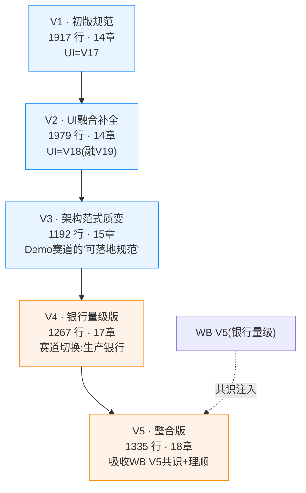

# 可观测方案版本演进梳理与选型建议（Codex 系列）

> 梳理对象：`docs/specs/` 下 5 份 Codex 系文档（V1 → V2 → V3 → V4 → V5）
> 配套参考：WB 系列同类梳理见 `docs/可观测方案版本演进梳理与选型建议.md`
> 撰写视角：第三方客观梳理 + 选型建议（不替你拍板，只给依据）

---

## 0. 一页结论（先看这里）

| 问题 | 结论 |
|---|---|
| Codex 系列到底在演进什么？ | V1→V2 是 **UI 说明书补全**；V2→V3 是 **架构范式质变**（第一份可落地规范）；V3→V4 是 **赛道切换**（Demo → 银行生产量级）；V4→V5 是 **吸收 WB V5 共识 + 结构理顺** |
| 版本越大越好吗？ | **不是。** V4/V5 不是"比 V3 更好"，而是"换了问题"——假设前提从「Demo 单机」变成「银行数千万用户生产」。这是赛道切换，不是线性升级 |
| 下一步开发实施基准选哪个？ | **Demo 交付 → Codex V3**；**面向真实银行生产 → Codex V5（目标态）**。V5 不能直接当 MVP 基线，否则 demo 永不开工 |

---

## 1. 文档谱系与规模

**规模说明（重要）**：V3 行数（1192）反而比 V1/V2（1917/1979）**更少**，但 V3 是"结构重组 + 收敛"，不是内容缩水——它用更少的行数覆盖了更广的范式（当前/目标架构对比、5 信号端到端、双层洞察、分阶段告警、四阶段并行）。V4/V5 因新增合规/HA/分层保留而重新变长。

---

## 2. 逐版本递进变化（每两版之间差在哪）

### 2.1 V1 → V2：UI 设计稿二次补全（架构零改动）

| 维度 | V1 | V2 | 这一跳改了什么 |
|---|---|---|---|
| 章节数 | 14 章 | 14 章（结构不变） | 仅 UI 章（§11）大改 |
| UI 设计稿 | V17（7 TAB，无右栏） | **V18 融合版**（V17 + 取长补短 V19） | 新增 §11.3「V18 相比 V17 新增特性」、§11.4「V17 保留深度功能」 |
| UI 小节 | §11.1–§11.8（8 节） | §11.1–§11.13（13 节） | 新增右栏结构、Trace Modal、告警卡片化+时间线、设置数据健康看板、智能洞察独立页、图表清单 18 个 |
| 实施章 | §13（无风险节） | §13.5 风险与应对 | 补风险表 |
| 附录 | §14 GAP 修复清单 | §14.1–§14.5（含组件选型对照表、Langfuse 关系） | GAP 清单补全 |
| 架构/数据流/埋点/DB/Redis/洞察/告警/Collector | 完全不变 | 完全不变 | **零改动** |

**本质**：V2 是 V1 的「UI 说明书二次补全」，把 Codex 自己的 V17 设计稿升级到融合 V19 的 V18。架构决策、存储选型、端到端设计一字未动。

---

### 2.2 V2 → V3：架构范式质变（第一份「可落地规范」）

| 维度 | V2 | V3 | 这一跳改了什么（质变点） |
|---|---|---|---|
| 章节数 | 14 章 | **15 章** | 结构大重组 |
| 目标架构 §3 | 3.1 P0 / 3.2 P2 / 3.3 决策记录 | 3.1 **当前架构(整改前)** / 3.2 目标架构 / 3.3 **架构变化总结** / 3.4 **分阶段演进时间线** / 3.5 **能力成熟度矩阵** / 3.6 决策记录 | 引入「当前 vs 目标对比范式 + 成熟度矩阵 + 演进时间线」 |
| 数据流 §4 | 4.1 三 OTLP 管线 / 4.2 指标 / 4.3 链路 / 4.4 会话 / 4.5 日志 / 4.6 DAU | 4.1 总体 / 4.2 **Trace** / 4.3 **Metrics** / 4.4 **Logs** / 4.5 **Session** / 4.6 **Alerts** / 4.7 DAU | 按 **5 信号拆分**（新增 Alerts 独立数据流） |
| Core 埋点 §5 | 5.1 总览 / 5.2 代码位置 / 5.3 原则 | + **5.2 held-span 模式** / **5.4 指标发射约定** | 新增 held-span（业务语义根 span 保活）范式 |
| DB §7 | 仅「7.3 Phase1 已有表修改」 | + **7.4 P0 新增表** / **7.5 关键表 DDL** | 首次给出可执行的建表 DDL |
| Redis §8 | 8.1 Key 表 / 8.2 写入逻辑 / 8.3 同步 | + **8.1 所有权原则** | 明确「每个 Key 唯一写入方」 |
| AI 洞察 §9 | 单一 **InsightsEngineService** | **9.2 AIInsightsService 族(6 Service 对齐 spec) + 9.3 InsightsEngineService** 双层 + **9.6 诊断驾驶舱(UI)** | 引入双层架构（接口对齐 spec，引擎做交叉分析） |
| 告警 §10 | 仅 AlertEngineService 设计 | + **10.1 告警引擎分阶段策略**（P0 自研 → P2 迁 Grafana） | 分阶段告警路线 |
| 实施 §13 | 13.1–13.4 | **四阶段含并行策略** + §15 附录（三项待定决策 / 验收 / Langfuse） | 并行策略 + 待定项显式化 |
| 假设前提 | Demo 单机（H2 / 单 Collector / 单 Redis） | **Demo 单机（不变）** | 赛道未切换 |

**本质**：V3 是 Codex 一系的「质变版」——第一次形成可写代码的规范：当前/目标架构对比、5 信号端到端、双层洞察、分阶段告警、四阶段并行、held-span、DDL、所有权原则。架构假设仍是 Demo。

---

### 2.3 V3 → V4：赛道切换（Demo → 银行生产量级）

| 维度 | V3 | V4 | 这一跳改了什么（银行量级冲击） |
|---|---|---|---|
| 章节数 | 15 章 | **17 章** | 新增合规章 + HA 章 |
| 前提假设 | Demo 单机 | **业务系统数千万用户** | **赛道切换** |
| 影响分析 §1 | 无 | **§1 V3 在银行量级下的影响分析**（容量估算 / 12 项决策影响评估表 / 不受影响决策） | 首次量化量级冲击 |
| 阶段计划 §2 | 四阶段 | **五阶段**（拆出独立归档/深化） | 阶段膨胀 |
| 目标架构 §3 | 目标架构 | **高可用版（含 HA 拓扑）** | 消除 SPOF |
| 数据流 §4 | 正常 10% 采样 / 3s 轮询 | **WebSocket 替代轮询** + **TDigest** + **分级采样标注** + **脱敏+分区路由** | 量级下 3 项核心改造 |
| Core 埋点 §5 | 无脱敏 | **字段级脱敏**（卡号/身份证/金额） | 合规强制 |
| 指标 §6 | 无 | **物化视图设计** | 预聚合降查询压力 |
| DB §7 | H2 / 单表 | **PostgreSQL 月分区 DDL** + **分层保留归档（热7d→温90d→冷S3）** | H2→PG@P0、分区、合规保留 |
| Redis §8 | 单实例 + ZSet 延迟 + HyperLogLog DAU | **Sentinel 高可用** + **TDigest 替代 ZSet** | 消除单点 + 降内存 50000× |
| 告警 §10 | 通用规则 | **银行专属规则**（脱敏明文检测 / 交易 Trace 缺失 / RBAC 异常） | 合规告警 |
| Collector §12 | 统一 10% 采样 | **按 intent 分级采样**（交易 100% / 查询 1-5% / 兜底 1%） | 核心变化 |
| 新增章 | — | **§13 数据合规与安全**（脱敏/RBAC/TLS/审计）+ **§14 高可用部署架构**（矩阵/拓扑/容量） | 银行合规硬要求 |
| DAU 方法 | HyperLogLog | HyperLogLog（V4 仍用，§1.3 称"仅~12KB"） | 未改（V5 才改） |

**本质**：V4 把 V3 的 Demo 假设整个替换为「生产银行」假设，存储/缓存/采样/合规/HA 全面升级。这是**换问题**，不是**修 V3 的 bug**。

---

### 2.4 V4 → V5：吸收 WB V5 共识 + 结构理顺（生产终稿）

| 维度 | V4 | V5 | 这一跳改了什么 |
|---|---|---|---|
| 章节数 | 17 章 | **18 章** | 章节号后移 + 新增组件选型章 |
| 影响分析 §1 | §1 V3 影响分析 | **§1.2 V4/WB V5 共识决策**（7 项共识明确列出） | 吸收 WB V5 的架构共识 |
| 组件选型 | 散落在影响表 | **§2 独立「最优组件选型」章** | 论证前置、独立成章 |
| 目标架构 | §3 仅目标架构 + 变化总结 | §4 **4.1 当前架构(整改前) + 4.2 目标架构 + 4.3 决策记录 + 4.4 组件对接关系一句话版** | 补回 V3 的「当前 vs 目标对比范式」 |
| 数据流/埋点/指标/DB/Redis/洞察/告警/UI/Collector | §4–§12 | **§5–§13**（号后移，内容延续 V4） | 章节顺延，内容不变 |
| Redis DAU | HyperLogLog | **Bitmap（精度 100%，3.6MB/3000 万用户）** | **采纳 WB V5 胜出项**（V5 §9.3） |
| Redis 高可用 | §8.1 提及 | **§9.2 Redis Sentinel 独立小节** | 从行内提及升为独立节 |
| 告警 §11 | 分阶段策略提及抑制 | **§11.3 告警状态机 + §11.5 抑制策略（收敛+静默）** | 抑制/状态机独立成节 |
| 附录 | §17 V3→V4 对照 | §18 **V4→V5 变更对照表** | 变更可追溯 |

**本质**：V5 = V4 的生产银行设计 + 吸收 WB V5 共识（Bitmap DAU、组件选型论证、当前架构对比范式、告警抑制）+ 章节理顺。是 Codex 系列**最完整的生产级终稿**。

---

## 3. 版本能力矩阵（哪版有啥）

| 能力 | V1 | V2 | V3 | V4 | V5 |
|---|:--:|:--:|:--:|:--:|:--:|
| 现状/目标架构对比范式 | ✗ | ✗ | ✅ | ✅ | ✅ |
| 能力成熟度矩阵 | ✗ | ✗ | ✅ | ✅ | ✅ |
| 5 信号端到端（含 Alerts） | ✗ | ✗ | ✅ | ✅ | ✅ |
| held-span 模式 | ✗ | ✗ | ✅ | ✅ | ✅ |
| DB 关键表 DDL | ✗ | ✗ | ✅ | ✅ | ✅ |
| Redis 所有权原则 | ✗ | ✗ | ✅ | ✅ | ✅ |
| AI 洞察双层架构 | ✗ | ✗ | ✅ | ✅ | ✅ |
| 分阶段告警（自研→Grafana） | ✗ | ✗ | ✅ | ✅ | ✅ |
| 四/五阶段并行实施 | ✗ | ✗ | 四阶段 | 五阶段 | 五阶段 |
| UI 设计稿版本 | V17 | V18 | V18/V20脉络 | V20脉络 | V20脉络 |
| 银行量级影响分析 | ✗ | ✗ | ✗ | ✅ | ✅ |
| H2→PG@P0 / 月分区 | ✗ | ✗ | ✗ | ✅ | ✅ |
| 分级采样（交易 100%） | ✗ | ✗ | ✗ | ✅ | ✅ |
| TDigest 替代 ZSet | ✗ | ✗ | ✗ | ✅ | ✅ |
| WebSocket 推送 | ✗ | ✗ | ✗ | ✅ | ✅ |
| 数据脱敏 / RBAC / TLS / 审计 | ✗ | ✗ | ✗ | ✅ | ✅ |
| 高可用部署架构 | ✗ | ✗ | ✗ | ✅ | ✅ |
| 独立组件选型章 | ✗ | ✗ | ✗ | ✗ | ✅ |
| DAU = Bitmap（精度100%） | ✗ | ✗ | ✗ | ✗(用HLL) | ✅ |
| 告警状态机 + 抑制策略独立 | ✗ | ✗ | ✗ | 提及 | ✅ |

> 观察：V1→V3 每行都是「能力从无到有」（Demo 赛道建设）；V3→V5 每行都是「能力从 Demo 级升到生产级」（银行赛道建设）。

---

## 4. 关键发现：V4/V5 不是比 V3「更好」，而是「换了问题」

和 WB 系列完全同构——

- **V1–V3 隐含假设 = Demo / 单机**：H2 文件库、单 Collector、单 Redis、localhost、无合规要求。
- **V4–V5 隐含假设 = 生产银行（数千万用户、多节点、银保监合规）**：PostgreSQL@P0、Sentinel、月分区、TDigest、WebSocket、脱敏/RBAC/TLS/审计、HA、分级采样。

所以**版本号越大 ≠ 越该选**。选 V5 的前提是「你的部署目标确实是银行生产量级」。若你的目标只是把 `mobile-ai-bank-demo` 这个 Demo 的可观测真正跑通交付，V5 的 PG@P0 + Sentinel@P0 + 脱敏@P0 会让你在写出第一条 trace 之前先搭完一套生产级数据平台——demo 永不开工。

---

## 5. 第三方客观选型建议

### 5.1 结论

| 你的实际目标 | 推荐基线 | 理由 |
|---|---|---|
| **把 Demo 可观测做出来交付**（当前仓库现实） | **Codex V3** | Demo 假设匹配现实；P0 不引新组件/不搭 PG/不写 Sentinel，在现有 H2+单 Collector+单 Redis 上直接开工；且它是 Codex 一系「最完整、最可落地、不缚于银行基建」的版本 |
| **面向真实银行生产** | **Codex V5（目标态）** | 最完整的生产级规范，已吸收 WB V5 共识；但**拆成两阶段**：先 V3 跑通 Demo → 再按 V5 生产化 |
| 纯做架构演进蓝图参考 | 配合看 WB V4（Demo）/ WB V6（生产） | Codex 重「代码级实现」，WB 重「架构/选型/UI 布局」 |

### 5.2 为什么不推荐 V1 / V2 / V4 当基线

- **V1**：初版，缺架构对比范式、5 信号拆分、双层洞察、分阶段告警、DDL、所有权原则——信息密度低，不宜作基线。
- **V2**：只是 V1 的 UI 补全，架构层面与 V1 等价，没有任何范式进步。
- **V4**：是「银行量级的 V3 中间态」，**V5 已整合共识并理顺结构**。若选生产态直接看 V5，V4 可跳过（除非你想看 V4 独有的「12 项影响评估表」细节）。

### 5.3 为什么 V5「不一定是最好的」（回应你的担心）

你的担心是对的。**V5 是体量最大、章节最全的版本，但只有在「部署目标 = 银行生产」时它才是最优。** 对本仓库（Demo，H2 单机）而言：

1. V5 要求 **PostgreSQL 在 P0 就迁**——但 Demo 当前就是 H2，强迁 PG 是为了扛千万级 span，Demo 根本没有这个量。
2. V5 要求 **Redis Sentinel + TDigest + WebSocket + 脱敏/RBAC/TLS/审计 + HA 拓扑**——这些都是为生产 SLA/合规服务的，Demo 阶段引入 = 大量「为未来量级的基建」阻塞「当下可观测价值」的产出。
3. 正确用法是**借鉴不照搬**：V5 里真正跨赛道必采纳的只有 **Bitmap DAU**（精度 100%，无论 Demo 还是生产都该用）；其余银行基建按「条件触发」逐步引入。

### 5.4 跨系列最优组合（帮助你最终拍板）

Codex 系列与 WB 系列是**互补**而非竞争：

| 用途 | 看 Codex 系列（代码级 / 可落地） | 看 WB 系列（架构 / 选型 / 演进） |
|---|---|---|
| Demo 交付 | **Codex V3**（实现细节：InsightsEngineService / AlertEngineService / Collector config.yaml / DDL） | WB V4（演进蓝图、组件选型、UI 布局） |
| 银行生产 | **Codex V5**（实现细节） | WB V6（整合终稿、合规章、HA 章） |

> **一句话**：Demo 落地用「WB V4 + Codex V3」组合；银行生产用「WB V6 + Codex V5」组合。不要只取单一系列，也不要把 V5 直接当 Demo 的 MVP 基线。

---

## 6. 风险与下一步建议

1. **先做赛道确认**：你真正要交付的是 Demo 可观测，还是银行生产可观测？这决定 V3 还是 V5 作基线。
2. **若选 V3（Demo）**：P0 任务清单已在 V3 §13 四阶段里，可直接拆 task；Bitmap DAU 这条从 V5 借过来用。
3. **若选 V5（生产）**：务必拆成「V3 跑通 → V5 生产化」两阶段，不要把 PG@P0 / Sentinel@P0 / 脱敏@P0 压进第一周。
4. **版本管理**：当前 5 份 Codex + 6 份 WB 共 11 份文档，建议定一份「唯一权威基线」指针文档（如 `docs/可观测方案权威基线.md`），写明「Demo 用 X，生产用 Y，禁止再开新版本号直到基线落地」。

---

> 文档版本：Codex 系列版本演进梳理 v1 · 2026-07-12
> 数据源：`docs/specs/可观测优化总结-0711-Codex-V{1,2,3,4,5}.md`
> 交叉参考：`docs/可观测方案版本演进梳理与选型建议.md`（WB 系列同构分析）
