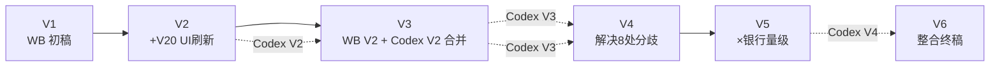

# 可观测方案版本演进梳理与选型建议

> 目的：6 份「可观测优化总结-0711-*」文档版本太多、变化看不清。本文做两件事：
> ① 梳理 **V1→V2→V3→V4→V5→V6** 每一跳的**递进变化**（相邻两版差在哪）；
> ② 以第三方视角**客观评判**该用哪一版做下一步开发基线，并给出依据。
> 涉及文档（均在 `docs/` 下，Codex 参考稿在 `docs/specs/` 不计入本表）：

| 简称 | 文件名 | 行数 | 性质 |
|---|---|---|---|
| V1 | 可观测优化总结-0711-Workbuddy V1.md | 621 | WorkBuddy 初稿（设计态） |
| V2 | 可观测优化总结-0711-WorkBuddy V2.md | 654 | V1 + V20 UI 设计内容刷新 |
| V3 | 可观测优化总结-0711-WorkBuddy V3.md | 954 | V2 与 Codex V2 合并的「合并终稿」 |
| V4 | 可观测优化总结-0711-WorkBuddy-V4-基于V3生成.md | 981 | 解决两份 V3 的 8 处分歧 |
| V5 | 可观测优化总结-0711-WB V5-考虑银行业务量级.md | 1012 | V4 × 银行量级修正 |
| V6 | 可观测优化总结-0711-WB V6-整合.md | 1125 | V5 × Codex V4 银行创新整合 |

---

## 0. 文档谱系（从哪里来）

**关键认知：版本演进并不是一条「越往后越好」的直线，而是中途换了一次「假设前提」。**
- **V1–V4**：隐含假设是 **Demo / 单机部署**（H2 文件库、单 Collector、Redis 单实例、无合规要求）。
- **V5–V6**：假设被改成 **生产级银行（数千万用户）**（PG 集群、Sentinel、HA、脱敏/RBAC/TLS）。

所以 V5/V6 不是「比 V4 更好」，而是「在回答一个不同的问题」。这是后面选型判断的基石。

---

## 1. 逐版本递进变化（重点：相邻两版差在哪）

### 1.1 V1 → V2：仅是「UI 设计内容刷新」，架构零改动
- **做了什么**：把前端版本口径 v19→v20；把 V20 大屏的设计内容补进文档。
- **新增**：§6.2 从「三类提炼」扩成「**智能洞察建议看板 + 诊断驾驶舱**」（TOP5 行动、瓶颈卡、根因表、阈值散点）；新增 §6.4「前端大屏 V20 设计增强」（5 处取长补短清单）。
- **没动**：架构、组件、数据流、DB 表、AI 引擎等全部维持 V1。
- **一句话递进**：V2 = V1 的「前端设计说明书补全版」，后端方案没变。

### 1.2 V2 → V3：第一次「质变」——合并成代码级可落地规范
- **做了什么**：把 WorkBuddy V2 与 Codex V2 合并，从 7 章重组为 **14 章「合并终稿」**。
- **关键增量（来自 Codex V2）**：
  - §1 最优组件选型论证；§2.2 架构决策记录 **D1–D9**；
  - §4 端到端 **5 条信号**数据流（原 V2 的 §3 重排）；
  - §5.2 **Core 埋点 Java 代码实现**（从叙述升级为可抄代码）；
  - §6.4 维度规范与基数预算；
  - §8 Redis（**HyperLogLog DAU**、初步所有权原则）；
  - §9 **AI 洞察引擎 InsightsEngineService**（Codex 的**统一引擎**，与 V1/V2 的「分散 6 Service」冲突）；
  - §10 告警引擎（自研 AlertEngine P0→P2 迁 Grafana）；§11 Collector 完整 config.yaml；§12 UI 驾驶舱。
- **一句话递进**：V3 才是第一份「完整、连贯、可写代码」的规范；V1/V2 只能算设计草稿。

### 1.3 V3 → V4：解决两份 V3 的 8 处分歧，回到「双层引擎」
- **做了什么**：WB V3 与 Codex V3 出现 8 处不一致，V4 逐条裁决。
- **最关键的一跳**：§9 AI 洞察引擎从 V3 的「**统一 InsightsEngine 单一引擎**」改回「**双层架构 = AIInsightsService 族（6 Service，P0 保留现有接口）+ InsightsEngineService（在其上做交叉分析）**」。理由：P0 不动已验证的 6 Service 接口，降低回归风险。
- **其他**：§8.1 显式写入 **Redis 所有权原则**（每个 Key 唯一写入方）；章节顺延（§9.5/9.6 重编号）。
- **一句话递进**：V4 = V3 的「冲突清理版」，内部完全自洽，仍是 Demo 假设。

### 1.4 V4 → V5：假设前提首次改变——「银行量级修正」
- **做了什么**：引入背景「银行业务、数千万用户」，对 V4 做 6 处量级升级。
- **关键增量**：
  - §3 阶段计划：**H2→PostgreSQL 从 P2 提前到 P0**（单机 H2 在亿级数据下会锁死）；
  - §7.4 新增 **分层数据保留**（热 7d → 温 90d → 冷 3y，银保监合规）；
  - §8.2 新增 **Redis Sentinel 高可用**（单实例是 SPOF）；
  - **DAU：HyperLogLog → Bitmap**（精度 100%，3000 万用户仅 3.6MB；HyperLogLog 在 3000 万量级误差 ±24 万，银行报表不可接受）—— **这是 V5 相对 V6 唯一仍胜出的点**；
  - 在线用户 ZSet 按小时分片；采样 10%→1%；告警加收敛窗口+静默期。
- **一句话递进**：V5 把 V4 的 Demo 假设「扶正」为银行量级，但只改了存储/Redis/采样/保留，尚未碰合规与 HA 拓扑。

### 1.5 V5 → V6：整合 Codex V4 的银行创新，补上「合规 + HA」
- **做了什么**：把 Codex V4 的 10 项银行创新并入，从 14 章扩到 **16 章**。
- **关键增量**：
  - §8.5 **TDigest 流式分位**（替代 V5 仍残留的 ZSet——百万 member 膨胀，TDigest 固定 ~2KB/窗口，P99 误差 <0.5%）；
  - §13 **数据合规与安全设计（银行必须）**：脱敏（卡号/身份证/手机号 Core 端完成）、RBAC 五角色、全链路 TLS、审计追溯；
  - §14 **高可用部署架构**：15 组件 HA 矩阵 + 容量规划（日均 1000 万 AI 交互）；
  - §11.2 **分级采样**（替代统一 1%：交易类 100% / 查询类 5% / 兜底 1% / 故障类 100%）；
  - §4.6 银行专属告警（脱敏明文检测、交易 Trace 缺失、RBAC 异常）；
  - §15 实施路径扩为 **5 阶段**；Bitmap DAU 保留。
- **一句话递进**：V6 是最完整、最贴近真实银行生产的版本，但代价是 P0 项目骤增（PG@P0 + 脱敏@P0 + Sentinel@P0），且假设是「多节点生产银行」。

---

## 2. 版本能力矩阵（哪版具备什么）

✓ 具备 ｜ △ 部分/叙述级 ｜ ✗ 无 ｜ 数字=阶段(P0/P1/P2)

| 能力 | V1 | V2 | V3 | V4 | V5 | V6 |
|---|---|---|---|---|---|---|
| 组件选型论证 | △ | △ | ✓ | ✓ | ✓ | ✓ |
| 端到端 5 信号数据流 | △ | △ | ✓ | ✓ | ✓ | ✓ |
| Core 埋点 Java 代码 | ✗ | ✗ | ✓ | ✓ | ✓ | ✓ |
| AI 洞察引擎（双层） | ✗(分散6) | ✗(分散6) | ✗(统一) | ✓ | ✓ | ✓ |
| 告警引擎（自研） | △ | △ | ✓ | ✓ | ✓ | ✓ |
| Collector config.yaml | △ | △ | ✓ | ✓ | ✓ | ✓ |
| UI 诊断驾驶舱 | ✗ | ✓ | ✓ | ✓ | ✓ | ✓ |
| H2→PG 时机 | P2 | P2 | P2 | P2 | **P0** | **P0** |
| Redis 高可用 | ✗ | ✗ | ✗ | ✗ | **Sentinel** | **Sentinel** |
| DAU 精度方案 | HLL | HLL | HLL | HLL | **Bitmap** | **Bitmap** |
| 分层数据保留 | ✗ | ✗ | ✗ | ✗ | **3层/3y** | **3层/3y** |
| 数据脱敏 / RBAC / TLS | ✗ | ✗ | ✗ | ✗ | ✗ | **✓(§13)** |
| 高可用部署拓扑 | ✗ | ✗ | ✗ | ✗ | ✗ | **✓(§14)** |
| 分级采样（按意图） | ✗ | ✗ | ✗ | ✗ | 统一1% | **✓** |
| TDigest 分位 | ✗(ZSet) | ✗(ZSet) | ✗(ZSet) | ✗(ZSet) | ✗(ZSet) | **✓** |
| 实施阶段数 | 松散 | 松散 | 4 | 4 | 4 | **5** |
| 隐含部署假设 | Demo | Demo | Demo | Demo | **银行** | **银行** |

> 读表结论：**V1–V4 是同一赛道（Demo），V5–V6 跳到另一赛道（生产银行）**。V4 是 Demo 赛道的终点；V6 是生产赛道的当前最佳。

---

## 3. 第三方客观选型评判

### 3.1 你的担忧是对的：V6 未必是最好的「开发基线」
V6 是 6 份里**信息量最大、最贴近真实银行生产**的，但「最完整」≠「最适合做下一步开发基线」。判断必须回到一个根本问题：

> **这套可观测系统要跑在什么环境？是 Demo（单机、seed 数据、localhost），还是真实银行生产（多节点、数千万用户、合规审计）？**

### 3.2 两条赛道，两个答案

| 若目标是… | 推荐基线 | 理由 |
|---|---|---|
| **把 Demo 的可观测能力真正做出来并交付**（项目本名就是 `-demo`，当前后端就是 H2 文件库 + 单 Collector + 单 Redis + localhost） | **V4** | V4 内部自洽、Demo 假设匹配现实、P0 不引新组件即可落地；V5/V6 的 PG 集群/Sentinel/脱敏/RBAC 在单机上属于「为不需要的场景付账」 |
| **产出一份面向真实银行生产的可观测系统建设规范**（非 Demo，要上线） | **V6 作为「目标态」**，但**不要当 MVP 基线** | V6 的合规/HA/TDigest/分级采样是生产必需；但应拆成「先 V4 跑通 Demo → 再按 V6 做生产化」两阶段，否则 MVP 永不开工 |

### 3.3 为什么不建议直接拿 V6 当 Demo 的开发基线（风险）
1. **P0 项目爆炸**：V6 把 H2→PG、脱敏、Sentinel 全压到 P0。在 Demo 上你会先花数周迁 PG + 写脱敏 + 搭 Sentinel，**任何可观测价值都还没看到**，demo 永远交付不了。
2. **过度工程**：单机 Demo 上做 TDigest/HA 矩阵/5 角色 RBAC，是为一台笔记本准备双活数据中心。
3. **范围蔓延**：V6 有 16 章、5 阶段，团队注意力会被基础设施吸走，反而忽略「AI 洞察 6 TAB 真实数据」这一 Demo 核心。

### 3.4 为什么也不该退回 V1/V2（风险）
1. V1/V2 的 AI 洞察仍是「分散 6 Service 叙述」，缺少 V3 并入的 **InsightsEngine 交叉引擎、Collector config、告警引擎代码**——这些是实打实的落地改进，退回等于丢成果。
2. V3 的「统一引擎」已被 V4 证明有回归风险，故 V3 也不如 V4。

### 3.5 最终建议（第三方视角）
> **以 V4 作为「下一步开发基线」；把 V5/V6 作为「生产化演进参考库」，单列一条 Phase 3+ 轨道，条件触发、不阻塞 MVP。**

具体落地姿势：
- **现在（MVP）**：严格按 V4 实施——修数据断链（埋点 GAP）、6 TAB 真实聚合、自研告警闭环、V20 大屏。单机 H2/单 Collector/单 Redis 对 Demo 完全够用。
- **毕业到生产时（触发条件：确定要上线 / 用户量上量）**：从 V6 抽取执行——
  - **必做合规（P0/P1）**：§13 脱敏 + RBAC + TLS + 审计；
  - **必做存储/可用（P0）**：§7 H2→PG 分区表、§8.2 Sentinel、§11.2 分级采样；
  - **优化（P2）**：§8.5 TDigest、§14 HA 拓扑、§7.4 分层保留、WebSocket 推送。
- **V5 的 Bitmap DAU 是独家胜点**，无论选哪条赛道都应在 Redis 设计里保留（比 HyperLogLog 更适合银行精度）。

---

## 4. 一句话结论

- **演进本质**：V1(草稿)→V2(UI补全)→V3(合并质变)→V4(冲突清理) 是一条 Demo 赛道；V5(银行修正)→V6(生产整合) 是另一条生产赛道。**V5/V6 不是比 V4「更好」，而是换了问题。**
- **选型建议**：**下一步开发基线用 V4**（Demo 自洽、可立即落地）；V5/V6 留作**生产化参考库**，待确定上线时再按 §13/§14/§7/§8.2 触发执行，切勿把它们的 P0 项压进 Demo MVP。
- **唯一跨赛道必采纳项**：V5 的 **Bitmap DAU**（精度 100%），优于 V3/V4 的 HyperLogLog。
